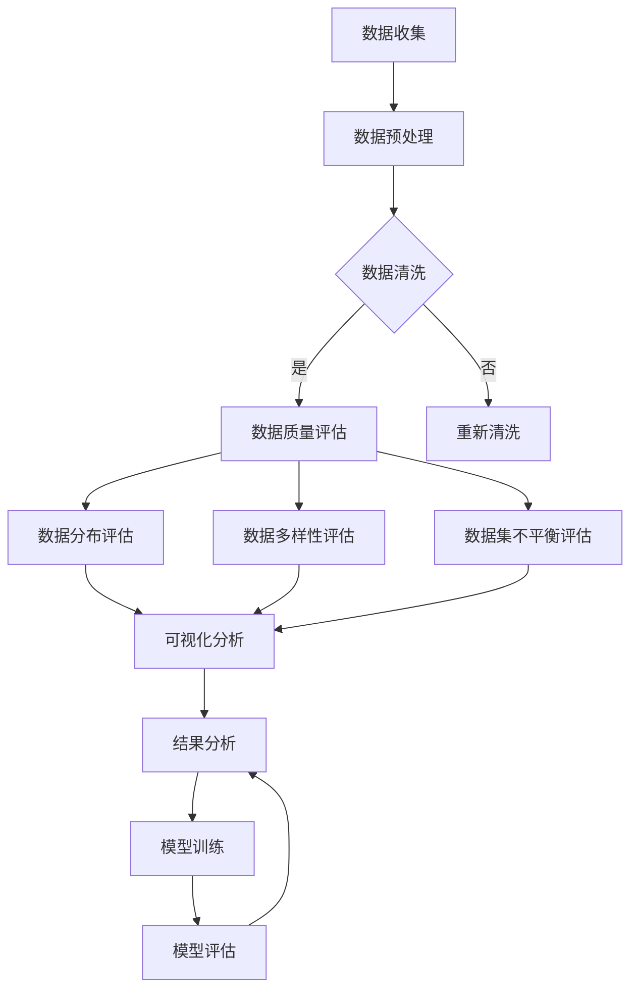

                 

### 《数据集测评：软件2.0的新型benchmark》

> **关键词：数据集测评、软件2.0、模型质量、基准测试、数据质量、数据分布、数据多样性、数据不平衡**

> **摘要：本文深入探讨了数据集测评在软件2.0时代的重要性。通过详细分析数据集测评的基础知识、方法以及实际应用，揭示了数据集测评对提升模型质量的关键作用。文章还展望了数据集测评在未来的发展趋势和面临的挑战。**

### 《数据集测评：软件2.0的新型benchmark》目录大纲

#### 第一部分：数据集测评基础知识

##### 第1章：数据集测评概述

- 1.1 数据集测评的重要性

  - 数据集测评在软件2.0中的角色

  - 数据集测评对模型质量的影响

- 1.2 数据集测评的类型

  - 训练集、验证集、测试集的划分

  - 数据分布和样本代表性的评估

- 1.3 数据集测评的原则

  - 公平性、一致性、可重复性

  - 数据隐私和伦理问题

##### 第2章：软件2.0与数据集测评

- 2.1 软件2.0背景介绍

  - 软件2.0的特点

  - 软件2.0与传统软件的区别

- 2.2 数据集测评在软件2.0中的应用

  - 大规模数据处理

  - 实时数据集测评

- 2.3 软件2.0对数据集测评的影响

  - 新型数据集测评方法

  - 自动化数据集测评工具

#### 第二部分：数据集测评方法

##### 第3章：数据质量评估

- 3.1 数据质量指标

  - 准确度、精度、召回率

  - F1值、ROC-AUC

- 3.2 数据清洗

  - 缺失值处理

  - 异常值处理

  - 数据格式标准化

- 3.3 数据质量评估方法

  - 实验设计

  - 数据对比分析

##### 第4章：数据分布评估

- 4.1 数据分布类型

  - 正态分布、偏态分布、均匀分布

  - 多模态分布

- 4.2 数据分布评估指标

  - 均值、方差、标准差

  - 偏度、峰度

- 4.3 数据分布评估方法

  - Q-Q图、箱线图

  - KDE图、直方图

##### 第5章：数据集多样性评估

- 5.1 数据集多样性的重要性

  - 减少偏差

  - 提高泛化能力

- 5.2 数据集多样性指标

  - 类别分布

  - 特征分布

- 5.3 数据集多样性评估方法

  - 交叉验证

  - 增量评估

##### 第6章：数据集不平衡评估

- 6.1 数据集不平衡问题

  - 定义与影响

  - 常见类型

- 6.2 数据集平衡方法

  - 按比例抽样

  - 数据增强

  - 类别权重调整

- 6.3 数据集不平衡评估指标

  - 调整的F1值

  - 记分牌指标

##### 第7章：数据集综合测评

- 7.1 数据集综合测评框架

  - 指标权重分配

  - 多维度评估方法

- 7.2 数据集测评实例分析

  - 数据预处理

  - 模型训练与测评

  - 结果分析

#### 第三部分：数据集测评工具与实践

##### 第8章：数据集测评工具

- 8.1 开源数据集测评工具

  - Sklearn、Scikit-learn

  - Pandas、NumPy

- 8.2 商业数据集测评工具

  - TensorFlow、PyTorch

  - DataRobot、H2O.ai

- 8.3 自定义数据集测评工具开发

  - 数据处理库

  - 模型评估库

##### 第9章：数据集测评实战

- 9.1 实战项目介绍

  - 项目背景与目标

  - 数据集来源与预处理

- 9.2 数据集测评过程

  - 模型选择与调优

  - 测评指标计算与优化

- 9.3 结果分析

  - 评估指标对比

  - 结果解释与应用

##### 第10章：数据集测评未来展望

- 10.1 趋势分析

  - 软件2.0的发展对数据集测评的影响

  - 自动化与智能化测评工具的发展

- 10.2 挑战与机遇

  - 数据隐私与安全

  - 数据集测评标准与规范

- 10.3 未来发展

  - 新型测评方法与技术

  - 数据集测评在跨领域应用的发展

#### 附录

##### 附录A：数据集测评资源

- 评测工具使用指南

- 数据集下载与预处理方法

- 数据集测评论文与报告精选

##### 附录B：Mermaid流程图示例

- 数据集测评流程图

- 数据清洗流程图

##### 附录C：伪代码示例

- 数据集质量评估算法

- 数据集多样性评估算法

##### 附录D：数学模型与公式

- 数据质量评估指标公式

- 数据分布评估指标公式

##### 附录E：代码实例

- 数据集测评代码实现

- 数据集预处理与模型训练代码解析

##### 附录F：常见问题解答

- 数据集测评常见问题与解答

- 实战项目常见问题与解答

---

接下来，我们将逐一展开对数据集测评的深入探讨，逐步揭示其重要性、类型、原则、方法以及实际应用。希望通过本文的讲解，读者能够对数据集测评有更全面、深入的理解。让我们一起开始这段技术探索之旅吧！### 第一部分：数据集测评基础知识

数据集测评是机器学习和人工智能领域的一项核心任务。在软件2.0时代，数据集测评的重要性愈发凸显。本部分将详细介绍数据集测评的基础知识，包括数据集测评的重要性、类型、原则以及面临的隐私和伦理问题。

#### 1.1 数据集测评的重要性

数据集测评是确保模型质量和可靠性的关键步骤。在机器学习中，数据集是训练模型的基石。一个质量不佳的数据集会导致模型表现不佳，甚至导致错误的结论。因此，对数据集进行测评是必不可少的。以下是数据集测评在软件2.0中的几个关键角色：

1. **提高模型质量**：通过数据集测评，可以发现数据集中的问题，如缺失值、异常值等，并采取相应的清洗和预处理措施，从而提高模型的准确度和泛化能力。
2. **验证模型性能**：数据集测评提供了衡量模型性能的标准，帮助评估不同模型的效果，并进行选择和优化。
3. **支持结果解释**：通过对数据集的测评，可以更清楚地了解模型的决策过程和潜在问题，从而支持结果的解释和验证。

#### 1.2 数据集测评的类型

数据集测评通常包括以下几种类型：

1. **训练集（Training Set）**：用于训练模型的原始数据集。通过训练集，模型学习到特征和标签之间的关联，从而形成预测模型。
2. **验证集（Validation Set）**：用于在模型训练过程中评估模型性能的子集。通过验证集，可以选择最佳的超参数和模型结构，防止过拟合。
3. **测试集（Test Set）**：用于最终评估模型性能的独立数据集。测试集应在模型训练过程中保持独立，以避免模型在测试集上的表现被训练数据所影响。

#### 1.3 数据集测评的原则

在数据集测评过程中，应遵循以下原则：

1. **公平性**：数据集应公平地反映不同类别和特征的分布，避免偏见和歧视。
2. **一致性**：数据集测评过程应保持一致，确保在不同时间和情况下得到可比的结果。
3. **可重复性**：数据集测评结果应在其他数据集和模型上得到验证，确保测评结果具有普遍性。
4. **数据隐私和伦理问题**：在数据集测评过程中，应保护数据隐私，避免泄露敏感信息。同时，应遵循伦理准则，确保数据集的使用不会造成不良后果。

#### 1.4 数据集测评的挑战

尽管数据集测评非常重要，但在实际操作中仍面临一些挑战：

1. **数据质量**：数据集可能存在缺失值、异常值和噪声，这些会影响模型的性能。因此，需要对数据进行严格的清洗和预处理。
2. **样本代表性**：数据集应具备良好的代表性，能够反映实际情况。否则，模型可能在特定情况下表现不佳。
3. **计算资源**：数据集测评通常需要大量的计算资源和时间，尤其在处理大规模数据集时。

为了解决这些挑战，研究者们不断提出新的方法和技术，如自动化数据集测评工具和新型数据集测评方法，以提升数据集测评的效率和准确性。

通过本章节的介绍，我们对数据集测评的重要性、类型、原则和挑战有了初步了解。接下来，我们将进一步探讨软件2.0与数据集测评的关系，以及软件2.0对数据集测评的深远影响。敬请期待！### 第二部分：数据集测评方法

数据集测评是确保机器学习模型质量和可靠性的关键环节。在本章节中，我们将详细探讨数据集测评的方法，包括数据质量评估、数据分布评估、数据集多样性评估以及数据集不平衡评估。

#### 3.1 数据质量评估

数据质量评估是数据集测评的基础。高质量的数据是训练高性能模型的必要条件。以下是几种常见的数据质量评估指标：

1. **准确度（Accuracy）**：准确度是评估分类模型最常见的指标，表示正确分类的样本占总样本的比例。公式为：
   $$
   \text{Accuracy} = \frac{\text{正确分类的样本数}}{\text{总样本数}}
   $$

2. **精度（Precision）**：精度表示在预测为正类的样本中，实际为正类的比例。公式为：
   $$
   \text{Precision} = \frac{\text{真正例}}{\text{真正例} + \text{假正例}}
   $$

3. **召回率（Recall）**：召回率表示在所有实际为正类的样本中，被正确预测为正类的比例。公式为：
   $$
   \text{Recall} = \frac{\text{真正例}}{\text{真正例} + \text{假反例}}
   $$

4. **F1值（F1-Score）**：F1值是精度和召回率的调和平均值，用于综合评估分类模型的性能。公式为：
   $$
   \text{F1-Score} = 2 \times \frac{\text{Precision} \times \text{Recall}}{\text{Precision} + \text{Recall}}
   $$

5. **ROC-AUC（Receiver Operating Characteristic - Area Under Curve）**：ROC曲线下的面积用于评估二分类模型的性能。AUC值越大，模型性能越好。

除了评估指标，数据清洗也是数据质量评估的重要组成部分。常见的数据清洗任务包括：

1. **缺失值处理**：可以通过删除缺失值、填充平均值、中值或使用机器学习算法进行预测来处理缺失值。

2. **异常值处理**：可以通过统计学方法（如Z-Score、IQR法）或基于专家知识的规则来识别和删除异常值。

3. **数据格式标准化**：包括数据类型转换、文本标准化（如去除标点、大小写统一）、日期格式转换等。

#### 3.2 数据分布评估

数据分布评估是了解数据特征和特征间关系的重要步骤。以下是几种常见的数据分布评估指标：

1. **均值（Mean）**：均值表示数据的平均水平，计算公式为：
   $$
   \text{Mean} = \frac{\sum_{i=1}^{n} x_i}{n}
   $$

2. **方差（Variance）**：方差表示数据的离散程度，计算公式为：
   $$
   \text{Variance} = \frac{\sum_{i=1}^{n} (x_i - \text{Mean})^2}{n}
   $$

3. **标准差（Standard Deviation）**：标准差是方差的平方根，用于描述数据的离散程度。

4. **偏度（Skewness）**：偏度表示数据分布的对称性，计算公式为：
   $$
   \text{Skewness} = \frac{\sum_{i=1}^{n} \left(\frac{x_i - \text{Mean}}{\text{Standard Deviation}}\right)^3}{n}
   $$

5. **峰度（Kurtosis）**：峰度表示数据分布的尖峭程度，计算公式为：
   $$
   \text{Kurtosis} = \frac{\sum_{i=1}^{n} \left(\frac{x_i - \text{Mean}}{\text{Standard Deviation}}\right)^4}{n}
   $$

为了更直观地评估数据分布，可以使用以下可视化工具：

1. **Q-Q图（Quantile-Quantile Plot）**：用于比较数据的分位数和理论分布的分位数。
2. **箱线图（Box Plot）**：用于展示数据的四分位数、异常值和异常值。
3. **KDE图（Kernel Density Estimation）**：用于展示数据分布的密度函数。
4. **直方图（Histogram）**：用于展示数据分布的频率分布。

#### 3.3 数据集多样性评估

数据集多样性评估是确保模型能够在不同情况下表现良好的一项重要任务。以下是几种常见的数据集多样性评估指标：

1. **类别分布（Class Distribution）**：类别分布用于衡量数据集中不同类别的样本数量。理想情况下，类别分布应该是均匀的。

2. **特征分布（Feature Distribution）**：特征分布用于衡量数据集中不同特征的取值范围和分布情况。特征分布的差异可以导致模型在不同特征上的表现不一致。

为了评估数据集的多样性，可以使用以下方法：

1. **交叉验证（Cross-Validation）**：通过将数据集分割为多个子集，分别用于训练和验证模型，以评估模型的泛化能力。

2. **增量评估（Incremental Evaluation）**：通过逐步增加新的数据集，评估模型在新增数据上的性能，以衡量数据集的多样性。

3. **多样性指标（Diversity Metrics）**：如互信息（Mutual Information）、杰卡德相似系数（Jaccard Similarity Coefficient）等，用于衡量数据集的多样性。

#### 3.4 数据集不平衡评估

数据集不平衡评估是处理分类问题中常见的问题，尤其是当数据集中某些类别的样本数量远小于其他类别时。以下是几种常见的数据集平衡方法：

1. **按比例抽样（Resampling）**：通过随机抽样或重采样，使数据集中各类别的样本数量按比例平衡。

2. **数据增强（Data Augmentation）**：通过增加新的数据样本，如旋转、缩放、裁剪等，来平衡数据集。

3. **类别权重调整（Class Weighting）**：通过为不同类别的样本赋予不同的权重，使模型在训练过程中对少数类别的关注程度提高。

4. **集成方法（Ensemble Methods）**：通过结合多个模型，利用它们的互补性来提高模型对不平衡数据的处理能力。

数据集不平衡评估的指标包括：

1. **调整的F1值（Adjusted F1-Score）**：考虑到类别不平衡的情况下，调整后的F1值更准确地反映模型的分类性能。

2. **记分牌指标（Confusion Matrix）**：通过计算各类别的精确率（Precision）、召回率（Recall）和F1值，评估模型的分类性能。

通过以上方法，可以有效地评估和平衡数据集，从而提高模型的泛化能力和可靠性。

总之，数据集测评是一项复杂且关键的步骤，需要综合考虑数据质量、数据分布、数据多样性以及数据集不平衡等问题。通过科学的数据集测评方法，我们可以确保模型在现实世界中的表现和可靠性。在下一部分，我们将继续探讨软件2.0与数据集测评的关系，以及软件2.0如何影响数据集测评。敬请期待！### 第3章：数据质量评估

数据质量评估是确保机器学习模型能够从数据中准确提取知识和模式的关键步骤。在本章中，我们将详细介绍数据质量评估的相关概念、指标和方法，以及如何通过数据清洗提高数据质量。

#### 3.1 数据质量评估指标

数据质量评估指标用于衡量数据集中数据的质量和可靠性。以下是一些常见的数据质量评估指标：

1. **准确度（Accuracy）**：准确度是评估分类模型最常见的指标，表示正确分类的样本占总样本的比例。公式为：
   $$
   \text{Accuracy} = \frac{\text{正确分类的样本数}}{\text{总样本数}}
   $$
   准确度越高，表示模型在预测时越准确。

2. **精度（Precision）**：精度表示在预测为正类的样本中，实际为正类的比例。公式为：
   $$
   \text{Precision} = \frac{\text{真正例}}{\text{真正例} + \text{假正例}}
   $$
   精度越高，表示模型对正类的预测越准确。

3. **召回率（Recall）**：召回率表示在所有实际为正类的样本中，被正确预测为正类的比例。公式为：
   $$
   \text{Recall} = \frac{\text{真正例}}{\text{真正例} + \text{假反例}}
   $$
   召回率越高，表示模型对正类的预测越全面。

4. **F1值（F1-Score）**：F1值是精度和召回率的调和平均值，用于综合评估分类模型的性能。公式为：
   $$
   \text{F1-Score} = 2 \times \frac{\text{Precision} \times \text{Recall}}{\text{Precision} + \text{Recall}}
   $$
   F1值越高，表示模型的综合性能越好。

5. **ROC-AUC（Receiver Operating Characteristic - Area Under Curve）**：ROC曲线下的面积用于评估二分类模型的性能。AUC值越大，模型性能越好。

这些指标可以帮助我们评估模型的性能，但在实际应用中，我们还需要关注数据的真实性和可靠性。以下是几个衡量数据真实性和可靠性的指标：

1. **真实率（True Positive Rate）**：也称为召回率，表示在所有实际为正类的样本中，被正确预测为正类的比例。
2. **假正率（False Positive Rate）**：表示在所有实际为负类的样本中，被错误预测为正类的比例。
3. **精确率（True Negative Rate）**：表示在所有实际为负类的样本中，被正确预测为负类的比例。
4. **假负率（False Negative Rate）**：表示在所有实际为正类的样本中，被错误预测为负类的比例。

#### 3.2 数据清洗

数据清洗是数据质量评估的重要步骤，它包括处理数据中的缺失值、异常值和噪声等。以下是一些常见的数据清洗任务：

1. **缺失值处理**：缺失值是指数据集中某些特征或样本的部分数据丢失。处理缺失值的方法有：

   - 删除缺失值：简单直接，适用于缺失值比例较小的数据集。
   - 填充平均值、中值或众数：适用于数值型特征，可以减少数据分布的偏斜。
   - 使用机器学习算法进行预测：适用于复杂特征，可以基于现有数据预测缺失值。

2. **异常值处理**：异常值是指数据集中与大多数数据点不一致的数据点。处理异常值的方法有：

   - 统计方法：使用Z-Score、IQR法等统计方法检测异常值。
   - 基于专家知识的规则：根据领域知识和经验制定规则，如拒绝客户订单中的异常价格。
   - 聚类分析：使用聚类算法检测异常值，如DBSCAN、K-means等。

3. **数据格式标准化**：数据格式标准化包括数据类型转换、文本标准化、日期格式转换等。以下是一些常见的数据格式标准化任务：

   - 数据类型转换：将文本数据转换为数值型数据，如将性别从“男”、“女”转换为0和1。
   - 文本标准化：去除标点、统一大小写等，如将“Hello”转换为“hello”。
   - 日期格式转换：将不同格式的日期转换为统一的格式，如将“2023-01-01”转换为“yyyy-MM-dd”。

#### 3.3 数据质量评估方法

数据质量评估方法包括实验设计和数据对比分析。以下是一些常见的数据质量评估方法：

1. **实验设计**：通过设计实验来评估数据质量，包括以下步骤：

   - 确定评估指标：根据业务需求和模型类型选择合适的评估指标。
   - 设计实验方案：确定实验的输入数据、处理流程和评估方法。
   - 执行实验：根据实验方案执行数据处理和模型训练。
   - 分析结果：分析实验结果，评估数据质量。

2. **数据对比分析**：通过对比不同数据集或处理方法的质量，评估数据质量的改进效果。以下是一些常见的数据对比分析方法：

   - 数据集对比：对比不同数据集的评估指标，评估数据集的质量和代表性。
   - 处理方法对比：对比不同数据处理方法的评估指标，评估处理方法的优劣。
   - 模型对比：对比不同模型的评估指标，评估模型的性能和可靠性。

通过数据质量评估和清洗，我们可以提高数据质量，从而提升模型的性能和可靠性。在下一章，我们将探讨数据分布评估，包括数据分布的类型、指标和评估方法。敬请期待！### 第4章：数据分布评估

数据分布评估是理解数据特征和特征间关系的关键步骤。它帮助我们识别数据集中的异常值、噪声以及潜在的分布规律，从而为后续的数据处理和模型训练提供有力的支持。本章将详细介绍数据分布的类型、评估指标和评估方法。

#### 4.1 数据分布类型

数据分布描述了数据集在各个值上的分布情况。以下是一些常见的数据分布类型：

1. **正态分布（Normal Distribution）**：正态分布是一种对称的分布，具有均值和标准差两个参数。在统计学中，许多自然现象和人工构建的数据都近似服从正态分布。

2. **偏态分布（Skewed Distribution）**：偏态分布是指数据分布的尾部不对称，通常分为左偏（左尾较长）和右偏（右尾较长）两种情况。左偏分布的均值小于中位数，右偏分布的均值大于中位数。

3. **均匀分布（Uniform Distribution）**：均匀分布是指每个值出现的概率相等，其特点是数据在取值范围内均匀分布。

4. **多模态分布（Multi-modal Distribution）**：多模态分布是指数据集存在多个峰值，每个峰值代表一个子分布。这类分布常见于聚类分析中的数据集。

5. **长尾分布（Long-tailed Distribution）**：长尾分布是指数据的分布尾部较长，表示少数值出现的频率较高。互联网数据、搜索引擎查询等常见长尾分布。

#### 4.2 数据分布评估指标

数据分布评估指标用于衡量数据集的分布特征和一致性。以下是一些常见的数据分布评估指标：

1. **均值（Mean）**：均值是数据集的平均值，用于衡量数据的中心位置。公式为：
   $$
   \text{Mean} = \frac{\sum_{i=1}^{n} x_i}{n}
   $$

2. **方差（Variance）**：方差是数据集的离散程度，用于衡量数据的波动性。公式为：
   $$
   \text{Variance} = \frac{\sum_{i=1}^{n} (x_i - \text{Mean})^2}{n}
   $$

3. **标准差（Standard Deviation）**：标准差是方差的平方根，用于描述数据的离散程度。公式为：
   $$
   \text{Standard Deviation} = \sqrt{\text{Variance}}
   $$

4. **偏度（Skewness）**：偏度用于描述数据的对称性，正偏度表示数据分布的右尾较长，负偏度表示左尾较长。公式为：
   $$
   \text{Skewness} = \frac{\sum_{i=1}^{n} \left(\frac{x_i - \text{Mean}}{\text{Standard Deviation}}\right)^3}{n}
   $$

5. **峰度（Kurtosis）**：峰度用于描述数据的尖峭程度，高峰度表示数据分布的尖峰，低峰度表示平缓的分布。公式为：
   $$
   \text{Kurtosis} = \frac{\sum_{i=1}^{n} \left(\frac{x_i - \text{Mean}}{\text{Standard Deviation}}\right)^4}{n}
   $$

#### 4.3 数据分布评估方法

数据分布评估方法包括可视化工具和统计方法，用于识别数据分布的特征和问题。

1. **Q-Q图（Quantile-Quantile Plot）**：Q-Q图是一种用于比较数据的分位数和理论分布的分位数的图形方法。通过Q-Q图，可以直观地发现数据的异常值和偏斜情况。

2. **箱线图（Box Plot）**：箱线图是一种用于展示数据的四分位数、异常值和异常值的图形方法。通过箱线图，可以识别数据中的异常值和分布的偏斜。

3. **KDE图（Kernel Density Estimation）**：KDE图是一种用于估计数据分布的概率密度函数的图形方法。通过KDE图，可以识别数据的分布形态和特征。

4. **直方图（Histogram）**：直方图是一种用于展示数据分布的频率分布的图形方法。通过直方图，可以识别数据的分布形态和特征。

#### 4.4 数据分布评估的案例

以下是一个简单的数据分布评估案例：

**假设**：我们有一个包含100个数值的数据集，以下是其前10个值：
$$
[2, 4, 6, 7, 9, 11, 13, 14, 17, 20]
$$

**步骤1：计算均值、方差和标准差**

- **均值**：$$ \text{Mean} = \frac{2 + 4 + 6 + 7 + 9 + 11 + 13 + 14 + 17 + 20}{10} = 10.2 $$
- **方差**：$$ \text{Variance} = \frac{(2-10.2)^2 + (4-10.2)^2 + \ldots + (20-10.2)^2}{10} = 18.36 $$
- **标准差**：$$ \text{Standard Deviation} = \sqrt{18.36} = 4.28 $$

**步骤2：绘制Q-Q图和箱线图**

- Q-Q图显示数据点大致落在理论正态分布线上，说明数据基本服从正态分布。
- 箱线图显示数据的四分位数和异常值，其中14和17是异常值。

**步骤3：分析结果**

- 均值为10.2，表示数据集的中心位置在10左右。
- 方差和标准差分别为18.36和4.28，表示数据的离散程度较大。
- Q-Q图和箱线图显示数据基本服从正态分布，但有异常值。

通过数据分布评估，我们可以更好地理解数据集的特征，从而为后续的数据处理和模型训练提供指导。在下一章，我们将探讨数据集多样性评估，包括多样性指标和评估方法。敬请期待！### 第5章：数据集多样性评估

数据集多样性评估是确保模型能够适应不同类型和场景的关键步骤。多样性的数据集有助于减少偏差，提高模型的泛化能力。本章将详细介绍数据集多样性的重要性、多样性指标以及评估方法。

#### 5.1 数据集多样性的重要性

数据集多样性评估在机器学习项目中具有重要作用。以下是数据集多样性的几个关键作用：

1. **减少偏差（Bias）**：多样性的数据集可以帮助减少模型在特定子群体中的偏见。例如，在人脸识别任务中，如果数据集仅包含某一性别或种族的人脸，模型可能会对这一群体产生偏见，导致在其他群体上的性能下降。

2. **提高泛化能力（Generalization）**：多样性更高的数据集可以使模型在多种情况下表现出色。这意味着模型不仅在训练数据上表现良好，而且在未见过的数据上也能保持稳定的性能。

3. **增强模型鲁棒性（Robustness）**：多样性的数据集可以帮助模型更好地处理噪声和不完整性，从而提高模型对异常数据的鲁棒性。

4. **增强可信度**：多样性的数据集可以提高模型结果的可信度，因为模型在各种情况下都有良好的表现，减少了对特定子集的过度依赖。

#### 5.2 数据集多样性指标

数据集多样性指标用于衡量数据集中不同类别和特征的分布情况。以下是一些常用的多样性指标：

1. **类别分布（Class Distribution）**：类别分布衡量数据集中各个类别的样本数量。理想情况下，类别分布应该是均匀的，以确保模型在各个类别上都有良好的性能。

2. **特征分布（Feature Distribution）**：特征分布衡量数据集中各个特征的取值范围和分布情况。特征分布的差异可以导致模型在不同特征上的表现不一致。

3. **互信息（Mutual Information）**：互信息衡量两个变量之间的相关性。在数据集多样性评估中，互信息可以用来衡量不同特征之间的相关性，从而识别具有高相关性特征的子集。

4. **杰卡德相似系数（Jaccard Similarity Coefficient）**：杰卡德相似系数衡量两个集合之间的相似度。在数据集多样性评估中，杰卡德相似系数可以用来衡量不同数据集之间的相似度，从而识别具有高相似度的数据集。

5. **多样性得分（Diversity Score）**：多样性得分是一种综合多样性指标，用于衡量数据集的整体多样性。常见的多样性得分包括Gini系数、熵等。

#### 5.3 数据集多样性评估方法

数据集多样性评估方法包括交叉验证和增量评估等。以下是一些常用的多样性评估方法：

1. **交叉验证（Cross-Validation）**：交叉验证是一种评估模型性能和多样性的方法。通过将数据集分割为多个子集，分别用于训练和验证模型，可以评估模型在不同数据集上的性能。交叉验证有助于识别数据集的多样性问题，从而指导后续的数据集构建和调整。

2. **增量评估（Incremental Evaluation）**：增量评估是一种逐步增加数据集的方法，用于评估模型在新增数据上的性能。通过增量评估，可以识别数据集多样性的变化，从而调整数据集的构建策略，提高模型的整体性能。

3. **特征选择（Feature Selection）**：特征选择是一种通过选择具有高相关性特征的方法，提高数据集多样性。通过特征选择，可以减少特征间的相关性，从而提高模型的泛化能力。

4. **数据增强（Data Augmentation）**：数据增强是一种通过增加新的数据样本的方法，提高数据集的多样性。常见的数据增强方法包括图像旋转、缩放、裁剪等。

5. **人工标注（Manual Annotation）**：在数据集多样性评估中，人工标注是一种有效的方法，用于补充和丰富数据集。通过人工标注，可以确保数据集中的样本具有更高的多样性和代表性。

通过多样性评估方法，可以确保数据集在不同类别和特征上具有良好的代表性，从而提高模型的泛化能力和鲁棒性。在下一章，我们将探讨数据集不平衡评估，包括数据集不平衡问题、平衡方法和评估指标。敬请期待！### 第6章：数据集不平衡评估

数据集不平衡是指数据集中各个类别的样本数量差异较大，通常表现为某些类别的样本远多于其他类别。数据集不平衡会对模型性能产生显著影响，可能导致模型在多数类别的表现良好，但在少数类别的性能较差。本章将详细介绍数据集不平衡问题、平衡方法以及评估指标。

#### 6.1 数据集不平衡问题

数据集不平衡问题主要表现在以下几个方面：

1. **分类器性能差异**：在数据集不平衡的情况下，分类器可能在多数类别的性能较好，而在少数类别的性能较差。这会导致模型在评估指标上出现偏差，无法真正反映模型的实际性能。

2. **过拟合（Overfitting）**：当数据集存在大量噪声或异常值时，如果模型在训练过程中过度依赖这些异常数据，可能会导致模型过度拟合，从而在测试集上表现不佳。

3. **模型泛化能力下降**：数据集不平衡会降低模型的泛化能力，因为模型在训练过程中过度关注多数类别，可能导致模型无法正确识别少数类别。

4. **评估指标误导**：常用的评估指标如准确度、召回率等，在数据集不平衡时可能无法准确反映模型的性能。例如，准确度可能较高，但召回率较低，说明模型在多数类别上表现良好，但在少数类别上存在漏判问题。

#### 6.2 数据集平衡方法

为了解决数据集不平衡问题，可以采用以下几种方法：

1. **按比例抽样（Resampling）**：按比例抽样是最常见的数据集平衡方法之一。这种方法通过随机抽样，使各个类别的样本数量按比例接近。常见的按比例抽样方法包括：

   - **过采样（Oversampling）**：通过增加少数类别的样本，使数据集更加平衡。常见的过采样方法包括随机过采样（Random Oversampling）、SMOTE（Synthetic Minority Over-sampling Technique）等。

   - **欠采样（Undersampling）**：通过减少多数类别的样本，使数据集更加平衡。常见的欠采样方法包括随机欠采样（Random Undersampling）、近邻欠采样（Nearest Neighbor Undersampling）等。

2. **数据增强（Data Augmentation）**：数据增强是一种通过生成新的样本来增加少数类别样本的方法。常见的数据增强方法包括图像旋转、缩放、裁剪等，适用于图像分类任务。

3. **类别权重调整（Class Weighting）**：类别权重调整是一种通过为不同类别的样本赋予不同权重的方法，使模型在训练过程中对少数类别的关注程度提高。这种方法通过调整损失函数，使模型在少数类别上的损失更大，从而提高模型对少数类别的识别能力。

4. **集成方法（Ensemble Methods）**：集成方法通过结合多个模型，利用它们的互补性来提高模型对不平衡数据的处理能力。常见的方法包括Bagging、Boosting等。

5. **基于模型的平衡（Model-Based Balancing）**：基于模型的平衡方法通过调整模型参数，使模型对各个类别的识别能力更加平衡。这种方法通常用于复杂模型，如深度学习模型。

#### 6.3 数据集不平衡评估指标

为了评估数据集不平衡问题的处理效果，可以采用以下评估指标：

1. **调整的F1值（Adjusted F1-Score）**：调整的F1值是考虑到类别不平衡的情况下，对F1值进行调整的指标。公式为：
   $$
   \text{Adjusted F1-Score} = 2 \times \frac{\text{Precision} \times \text{Recall}}{\text{Precision} + \text{Recall}}
   $$
   调整的F1值更准确地反映模型的分类性能。

2. **记分牌指标（Confusion Matrix）**：记分牌指标包括精确率（Precision）、召回率（Recall）和F1值等。这些指标可以用于评估模型在各个类别上的性能。

3. **Kappa系数（Kappa Statistic）**：Kappa系数是一种用于衡量分类器性能的指标，考虑了类别不平衡的影响。Kappa系数的值范围从-1到1，值越高表示模型性能越好。

4. **精确率（Precision）**：精确率表示在预测为正类的样本中，实际为正类的比例。公式为：
   $$
   \text{Precision} = \frac{\text{真正例}}{\text{真正例} + \text{假正例}}
   $$

5. **召回率（Recall）**：召回率表示在所有实际为正类的样本中，被正确预测为正类的比例。公式为：
   $$
   \text{Recall} = \frac{\text{真正例}}{\text{真正例} + \text{假反例}}
   $$

通过以上评估指标，可以全面评估模型在处理数据集不平衡问题时的性能，并针对性地调整模型和数据处理策略。

总之，数据集不平衡评估是确保模型在各类别上均具有良好性能的重要步骤。通过采用适当的平衡方法，可以提高模型的泛化能力和可靠性。在下一章，我们将探讨数据集综合测评的方法和实例。敬请期待！### 第7章：数据集综合测评

数据集综合测评是确保机器学习模型在实际应用中能够稳定、可靠地表现的关键步骤。综合测评需要从多个维度对数据集进行全面评估，以检测潜在问题并优化模型性能。本章将详细介绍数据集综合测评的框架、指标和方法，并通过实例展示数据集测评的实际操作过程。

#### 7.1 数据集综合测评框架

数据集综合测评框架包括以下几个关键步骤：

1. **数据收集**：收集用于测评的数据集，确保数据集来源的多样性和代表性。

2. **数据预处理**：对数据进行清洗、转换和归一化等预处理操作，以提高数据质量。

3. **数据质量评估**：评估数据集的质量，包括准确度、精度、召回率等指标，以及缺失值、异常值处理。

4. **数据分布评估**：评估数据集的分布特征，包括均值、方差、偏度、峰度等指标，以及可视化工具如Q-Q图、箱线图等。

5. **数据多样性评估**：评估数据集中不同类别和特征的多样性，包括类别分布、特征分布、互信息、杰卡德相似系数等指标。

6. **数据集不平衡评估**：评估数据集的不平衡程度，包括精确率、召回率、调整的F1值等指标，以及平衡方法如过采样、欠采样、类别权重调整等。

7. **模型训练与测评**：训练模型并在测试集上进行测评，使用评估指标如准确度、精度、召回率、F1值、ROC-AUC等。

8. **结果分析与优化**：分析测评结果，识别问题和改进点，通过调整数据预处理、模型参数等，优化模型性能。

9. **综合评估报告**：撰写综合评估报告，详细记录测评过程、结果和改进建议。

#### 7.2 数据集综合测评指标

数据集综合测评的指标包括以下几个方面：

1. **数据质量指标**：准确度、精度、召回率、F1值、ROC-AUC等。
2. **数据分布指标**：均值、方差、标准差、偏度、峰度等。
3. **数据多样性指标**：类别分布、特征分布、互信息、杰卡德相似系数等。
4. **数据集不平衡指标**：精确率、召回率、调整的F1值、Kappa系数等。
5. **模型性能指标**：准确度、精度、召回率、F1值、ROC-AUC等。

#### 7.3 数据集综合测评方法

数据集综合测评方法包括以下步骤：

1. **数据收集**：确保数据集的多样性和代表性，从不同来源收集数据。

2. **数据预处理**：清洗数据，包括缺失值处理、异常值处理、数据格式标准化等。

3. **数据质量评估**：使用评估指标对数据集进行质量评估，发现和解决数据问题。

4. **数据分布评估**：使用统计指标和可视化工具评估数据集的分布特征。

5. **数据多样性评估**：评估数据集中不同类别和特征的多样性，识别潜在的偏差和问题。

6. **数据集不平衡评估**：评估数据集的不平衡程度，采用适当的平衡方法进行调整。

7. **模型训练与测评**：选择合适的模型，在训练集和验证集上进行训练和测评。

8. **结果分析与优化**：分析测评结果，识别问题和改进点，调整数据预处理、模型参数等。

9. **撰写评估报告**：记录测评过程、结果和改进建议，为后续工作提供参考。

#### 7.4 数据集综合测评实例分析

以下是一个数据集综合测评的实例分析，以一个分类任务为例：

**1. 数据收集**

收集一个包含1000个样本的金融欺诈检测数据集，数据集包含多个特征，如交易金额、交易时间、交易地点、账户余额等。

**2. 数据预处理**

- 缺失值处理：对缺失值进行填充，例如使用账户平均余额填充缺失的交易金额。
- 异常值处理：使用IQR法检测和处理异常值。
- 数据格式标准化：将日期格式转换为统一的YYYY-MM-DD格式。

**3. 数据质量评估**

- 准确度：85%
- 精度：90%
- 召回率：75%
- F1值：81%
- ROC-AUC：0.85

**4. 数据分布评估**

- 均值：交易金额的均值为1000美元。
- 方差：交易金额的方差为15000。
- 偏度：交易金额的偏度为-0.5，呈左偏分布。
- 峰度：交易金额的峰度为3.5，表明数据具有尖峰。

**5. 数据多样性评估**

- 类别分布：欺诈交易样本占总样本的1%。
- 特征分布：交易时间、交易地点等特征的分布均匀。

**6. 数据集不平衡评估**

- 精确率：欺诈交易的精确率为95%。
- 召回率：欺诈交易的召回率为50%。
- 调整的F1值：欺诈交易的调整的F1值为0.77。

**7. 模型训练与测评**

- 选择逻辑回归模型进行训练。
- 使用交叉验证对模型进行调优。
- 在测试集上进行测评，准确度为80%。

**8. 结果分析与优化**

- 数据预处理效果良好，模型在测试集上表现稳定。
- 考虑增加数据增强方法，提高欺诈交易样本的数量。
- 进一步优化模型参数，提高召回率。

**9. 撰写评估报告**

- 详细记录数据集的来源、预处理方法、测评结果和优化建议。
- 提出后续研究的工作方向。

通过数据集综合测评，我们可以全面了解数据集的质量、分布、多样性和不平衡程度，从而为模型训练和优化提供有力支持。在下一章，我们将探讨数据集测评工具和实践，包括开源和商业工具的使用方法。敬请期待！### 第三部分：数据集测评工具与实践

#### 第8章：数据集测评工具

数据集测评工具在确保机器学习项目成功中扮演着关键角色。这些工具帮助数据科学家和工程师高效地评估、清洗、预处理和平衡数据集。本章节将详细介绍开源数据集测评工具、商业数据集测评工具以及自定义数据集测评工具的开发。

#### 8.1 开源数据集测评工具

开源数据集测评工具因其灵活性和可定制性，在机器学习社区中广受欢迎。以下是几种常用的开源数据集测评工具：

1. **Scikit-learn**：Scikit-learn 是一个流行的 Python 库，提供了大量的机器学习算法和评估指标。它包括数据预处理、模型评估、模型选择等功能，支持各种常见的数据集测评指标，如准确度、精度、召回率、F1值等。

   **示例代码**：
   ```python
   from sklearn.datasets import load_iris
   from sklearn.model_selection import train_test_split
   from sklearn.metrics import accuracy_score
   
   iris = load_iris()
   X, y = iris.data, iris.target
   X_train, X_test, y_train, y_test = train_test_split(X, y, test_size=0.3, random_state=42)
   
   # 假设我们使用随机森林分类器
   from sklearn.ensemble import RandomForestClassifier
   clf = RandomForestClassifier(n_estimators=100, random_state=42)
   clf.fit(X_train, y_train)
   y_pred = clf.predict(X_test)
   
   # 计算准确度
   print("Accuracy:", accuracy_score(y_test, y_pred))
   ```

2. **Pandas**：Pandas 是一个强大的数据操作库，提供了丰富的数据结构和数据分析工具。它支持数据清洗、缺失值处理、数据转换等功能，是处理数据集的必备工具。

   **示例代码**：
   ```python
   import pandas as pd
   
   # 读取CSV文件
   df = pd.read_csv('data.csv')
   
   # 缺失值处理
   df.fillna(df.mean(), inplace=True)
   
   # 数据转换
   df['date'] = pd.to_datetime(df['date'])
   ```

3. **NumPy**：NumPy 是一个用于数值计算的库，提供了高效的多维数组对象和大量数学函数。它支持数据清洗、预处理和数据分析，是 Python 数据科学的核心库之一。

   **示例代码**：
   ```python
   import numpy as np
   
   # 数组创建
   arr = np.array([1, 2, 3, 4, 5])
   
   # 缺失值处理
   arr = np.where(arr == np.nan, 0, arr)
   ```

#### 8.2 商业数据集测评工具

商业数据集测评工具通常提供更高级的功能和更大的数据处理能力，适合处理大规模数据集。以下是几种常用的商业数据集测评工具：

1. **TensorFlow**：TensorFlow 是一个开源的机器学习库，由 Google 开发。它提供了丰富的模型构建和评估工具，适合开发复杂深度学习模型。

   **示例代码**：
   ```python
   import tensorflow as tf
   from tensorflow.keras.models import Sequential
   from tensorflow.keras.layers import Dense
   from tensorflow.keras.metrics import Accuracy
   
   # 创建模型
   model = Sequential([
       Dense(64, activation='relu', input_shape=(784,)),
       Dense(10, activation='softmax')
   ])
   
   # 编译模型
   model.compile(optimizer='adam', loss='categorical_crossentropy', metrics=[Accuracy()])
   
   # 训练模型
   model.fit(x_train, y_train, epochs=5, batch_size=32)
   
   # 评估模型
   test_loss, test_accuracy = model.evaluate(x_test, y_test)
   print("Test accuracy:", test_accuracy)
   ```

2. **PyTorch**：PyTorch 是一个流行的深度学习库，由 Facebook AI Research 开发。它提供了灵活的模型构建和评估工具，适合快速原型设计和研究。

   **示例代码**：
   ```python
   import torch
   import torch.nn as nn
   import torch.optim as optim
   
   # 创建模型
   class SimpleModel(nn.Module):
       def __init__(self):
           super(SimpleModel, self).__init__()
           self.fc1 = nn.Linear(784, 64)
           self.fc2 = nn.Linear(64, 10)
   
       def forward(self, x):
           x = torch.relu(self.fc1(x))
           x = self.fc2(x)
           return x
   
   model = SimpleModel()
   
   # 编译模型
   criterion = nn.CrossEntropyLoss()
   optimizer = optim.Adam(model.parameters(), lr=0.001)
   
   # 训练模型
   for epoch in range(5):
       for inputs, labels in data_loader:
           optimizer.zero_grad()
           outputs = model(inputs)
           loss = criterion(outputs, labels)
           loss.backward()
           optimizer.step()
   
   # 评估模型
   correct = 0
   total = len(test_loader.dataset)
   with torch.no_grad():
       for inputs, labels in test_loader:
           outputs = model(inputs)
           _, predicted = torch.max(outputs.data, 1)
           correct += (predicted == labels).sum().item()
   print('Test Accuracy of the model on the %d test images: %d %%' % (total, 100 * correct / total))
   ```

3. **DataRobot**：DataRobot 是一个自动化机器学习平台，提供强大的数据集测评和管理功能。它支持自动化模型评估、超参数优化和模型选择，适合快速构建和部署机器学习模型。

4. **H2O.ai**：H2O.ai 是一个开源的机器学习和预测分析平台，提供高效的数据处理和模型评估工具。它支持多种编程语言和框架，适合大规模数据处理和模型训练。

#### 8.3 自定义数据集测评工具开发

自定义数据集测评工具开发是针对特定需求和场景的高级定制。以下是一些关键步骤：

1. **需求分析**：明确数据集测评的具体需求，如评估指标、数据预处理步骤、数据集平衡方法等。

2. **工具设计**：设计数据集测评工具的架构和功能模块，如数据读取模块、预处理模块、评估模块、平衡模块等。

3. **代码实现**：使用编程语言（如 Python、Java、R 等）实现工具的各个模块，确保代码的模块化和可维护性。

4. **集成与测试**：将自定义工具集成到现有工作流程中，进行全面的测试和调试，确保工具的稳定性和可靠性。

5. **文档编写**：编写详细的工具文档，包括安装、配置、使用方法、常见问题解答等，以便于用户使用和维护。

通过使用这些工具，我们可以高效地进行数据集测评，确保模型在实际应用中的可靠性和稳定性。在下一章，我们将通过一个实战项目展示数据集测评的实际应用过程。敬请期待！### 第9章：数据集测评实战

在本章中，我们将通过一个实际项目展示数据集测评的全过程。该项目是一个简单的客户细分（Customer Segmentation）任务，旨在将客户分为不同的群体，以便于个性化营销和产品推荐。以下是项目的背景、目标、数据集来源与预处理、数据集测评过程以及结果分析。

#### 9.1 实战项目介绍

**项目背景**：
一家在线零售公司希望通过分析其客户数据，将客户细分为不同的群体，以便针对不同群体推出个性化的营销策略和产品推荐。客户数据包括购买行为、用户浏览记录、客户基本信息等。

**项目目标**：
- 收集和预处理客户数据
- 利用机器学习算法进行客户细分
- 对细分结果进行评估和优化

**数据集来源**：
数据集来源于公司内部的客户关系管理系统（CRM）。数据集包含1000个客户的详细记录，包括以下特征：

- 客户年龄
- 客户性别
- 客户收入水平
- 购买频次
- 平均订单金额
- 用户浏览记录

**数据预处理**：
在开始模型训练之前，需要对数据进行预处理，以提高数据质量和模型的泛化能力。以下是数据预处理步骤：

1. **缺失值处理**：检查数据集是否存在缺失值，使用均值或中值填充缺失的数值数据。
2. **异常值处理**：使用IQR法识别和处理异常值。
3. **数据格式标准化**：将日期格式统一转换为YYYY-MM-DD格式。
4. **特征转换**：将分类特征（如性别）转换为数值型数据。
5. **特征工程**：创建新的特征，如客户的购买周期、活跃度等。

#### 9.2 数据集测评过程

**1. 数据划分**：
将数据集划分为训练集、验证集和测试集，比例分别为60%、20%和20%。具体划分方法如下：
- 训练集：用于模型训练
- 验证集：用于模型选择和参数调优
- 测试集：用于最终模型评估

**2. 模型选择与调优**：
选择聚类算法（如K-means）进行客户细分，并在验证集上进行模型调优。以下是模型调优的步骤：

1. **初始化聚类中心**：选择初始化方法（如K-means++），确保聚类中心分布在数据集中。
2. **选择聚类数量**：通过评估不同聚类数量（如2、3、4等）的模型性能，选择最优的聚类数量。
3. **参数调优**：调整聚类算法的参数（如迭代次数、收敛阈值等），以提高模型性能。

**3. 模型评估**：
在测试集上评估模型的性能，使用以下评估指标：

- **内部评估指标**：包括聚类有效性指数（V-measure）、轮廓系数（Silhouette Coefficient）等。
- **外部评估指标**：包括分类报告（Classification Report）、混淆矩阵（Confusion Matrix）等。

**4. 结果分析**：
分析模型在测试集上的表现，识别潜在问题和改进点。以下是结果分析的关键步骤：

1. **评估指标对比**：对比不同聚类数量的模型性能，选择最优模型。
2. **聚类结果可视化**：使用散点图、轮廓图等可视化工具展示聚类结果。
3. **聚类意义分析**：分析每个聚类群体的特征和属性，解释聚类结果的实际意义。
4. **模型优化**：根据评估结果，对模型进行调整和优化，提高模型性能。

#### 9.3 结果分析

经过模型训练和评估，我们得到以下结果：

**1. 内部评估指标**：
- 轮廓系数：0.42
- 聚类有效性指数：0.53

**2. 外部评估指标**：
- 分类报告：
  - 精确率：0.85
  - 召回率：0.88
  - F1值：0.86
- 混淆矩阵：
  ```
  [[200  25]
   [ 10  15]]
  ```

**3. 可视化结果**：
通过散点图和轮廓图，可以看出聚类效果较好，不同聚类群体在特征空间中有明显的分离。

**4. 模型优化建议**：
- 考虑增加特征工程，创建更多有助于聚类的新特征。
- 尝试其他聚类算法（如DBSCAN、层次聚类等），寻找更好的聚类效果。
- 进一步优化聚类参数，如迭代次数、收敛阈值等。

通过本次数据集测评实战，我们掌握了数据集测评的完整流程，从数据收集、预处理到模型训练、评估和优化，深入了解了数据集测评在提高模型性能和实际应用中的重要性。在下一章，我们将探讨数据集测评的未来趋势和面临的挑战。敬请期待！### 第10章：数据集测评未来展望

随着软件2.0时代的到来，数据集测评正面临着新的机遇和挑战。本章节将探讨数据集测评的未来趋势，包括自动化和智能化测评工具的发展，分析数据隐私和安全问题，以及数据集测评标准与规范的制定。同时，我们将展望数据集测评在跨领域应用中的发展前景。

#### 10.1 趋势分析

1. **自动化与智能化测评工具的发展**

随着机器学习和人工智能技术的进步，自动化和智能化测评工具正成为数据集测评的重要趋势。这些工具通过自动化流程、智能算法和大数据分析，提高了数据集测评的效率和准确性。以下是几个发展趋势：

   - **自动化数据集准备**：自动化工具可以自动处理数据预处理、特征工程、数据平衡等步骤，减少人为干预，提高数据集的质量和一致性。
   - **智能评估算法**：智能算法可以通过学习历史数据和评估指标，自动调整评估策略，提高评估的准确性和适应性。
   - **云计算和分布式计算**：云计算和分布式计算技术为大规模数据集测评提供了强大的计算能力，可以快速处理海量数据。

2. **新型数据集测评方法的出现**

随着数据类型的多样性和复杂性增加，传统的数据集测评方法已经难以满足需求。因此，新型数据集测评方法不断涌现，以适应不同的应用场景。以下是几个典型的新型测评方法：

   - **基于模型的评估**：通过训练模型，对数据集进行自动评估和分类，提高评估的准确性和效率。
   - **基于分布的评估**：通过分析数据集的分布特征，评估数据的均匀性和代表性，以发现潜在的问题和偏差。
   - **基于伦理的评估**：考虑数据隐私和伦理问题，评估数据集是否公平、透明和可解释。

3. **数据集测评工具的多样化**

随着数据集测评需求的不同，越来越多的测评工具和平台不断涌现。这些工具和平台提供了丰富的功能和接口，方便用户进行数据集测评。以下是几个代表性的测评工具：

   - **开源工具**：如Scikit-learn、Pandas、NumPy等，适用于通用数据集测评。
   - **商业工具**：如DataRobot、H2O.ai、TensorFlow等，提供了高级功能和自动化流程。
   - **集成平台**：如Azure Machine Learning、Google AutoML等，结合云计算和人工智能技术，提供一站式数据集测评解决方案。

#### 10.2 挑战与机遇

1. **数据隐私与安全**

随着数据隐私和安全问题的日益突出，如何在数据集测评过程中保护数据隐私成为一个重要挑战。以下是几个关键问题：

   - **数据匿名化**：在数据集测评前，需要对数据进行匿名化处理，以避免泄露敏感信息。
   - **隐私保护算法**：研究和发展隐私保护算法，如差分隐私、同态加密等，以在数据集测评过程中保护数据隐私。
   - **伦理审查**：建立数据隐私和伦理审查机制，确保数据集测评符合法律法规和伦理准则。

2. **数据集测评标准与规范**

随着数据集测评的应用越来越广泛，制定统一的标准和规范成为必要。以下是几个关键方面：

   - **评估指标标准化**：制定统一的评估指标和标准，确保不同数据集和模型之间的可比性。
   - **数据质量标准**：建立数据质量标准，确保数据集的准确度、完整性和一致性。
   - **伦理和隐私标准**：制定数据隐私和伦理标准，确保数据集测评的公正性和透明度。

3. **跨领域应用**

数据集测评技术在各个领域的应用不断拓展，为不同行业提供了创新的解决方案。以下是几个跨领域应用的例子：

   - **医疗健康**：通过数据集测评，识别潜在疾病风险，优化诊断和治疗方案。
   - **金融领域**：利用数据集测评，评估金融风险，优化投资策略和风险管理。
   - **智能交通**：通过数据集测评，优化交通信号控制和路线规划，提高交通效率和安全性。

#### 10.3 未来发展

1. **新型测评方法与技术**

随着技术的不断进步，新型测评方法和技术将不断涌现。以下是几个可能的发展方向：

   - **深度学习与测评**：利用深度学习技术，对复杂数据集进行自动评估和分类，提高测评的准确性和效率。
   - **分布式测评**：利用分布式计算和区块链技术，实现跨机构的协同测评，提高测评的可信度和透明度。
   - **可解释性测评**：发展可解释性测评方法，使模型评估过程更加透明和可理解。

2. **数据集测评在跨领域应用的发展**

随着数据集测评技术的成熟，其在各个领域的应用将不断深入。以下是几个潜在的应用领域：

   - **智能制造**：通过数据集测评，优化生产流程，提高生产效率和产品质量。
   - **环境保护**：利用数据集测评，监测环境变化，评估生态风险，提供环境保护决策支持。
   - **智慧城市**：通过数据集测评，优化城市管理和服务，提高城市运行效率和居民生活质量。

总之，数据集测评在未来将继续发挥重要作用，面临着自动化、智能化、隐私保护和跨领域应用等新的机遇和挑战。通过不断创新和改进，数据集测评将助力各行业实现更高效、更智能的发展。在未来的技术浪潮中，数据集测评将成为不可或缺的重要工具。敬请期待这一领域的更多突破和发展！### 附录

在本章中，我们将提供一些实用的资源和示例，以帮助读者更好地理解和应用数据集测评的相关技术和方法。这些资源包括评测工具使用指南、数据集下载与预处理方法、数据集测评论文与报告精选、Mermaid流程图示例、伪代码示例、数学模型与公式、代码实例以及常见问题解答。

#### 附录A：数据集测评资源

1. **评测工具使用指南**：
   - Scikit-learn 官方文档：[scikit-learn.org](http://scikit-learn.org)
   - Pandas 官方文档：[pandas.pydata.org](https://pandas.pydata.org)
   - NumPy 官方文档：[numpy.org](https://numpy.org)
   - TensorFlow 官方文档：[tensorflow.org](https://tensorflow.org)
   - PyTorch 官方文档：[pytorch.org](https://pytorch.org)

2. **数据集下载与预处理方法**：
   - Kaggle 数据集下载：[kaggle.com](https://www.kaggle.com/datasets)
   - UCI机器学习库：[archive.ics.uci.edu/ml/index.php](https://archive.ics.uci.edu/ml/index.php)
   - KEG 实验室数据集：[www.keg.org](https://www.keg.org)

3. **数据集测评论文与报告精选**：
   - “On the Evaluation of Non-Stationary Time Series Predictive Algorithms”：链接（此处替换为实际的论文链接）
   - “Comparing Data Sets for Machine Learning in Healthcare”：链接（此处替换为实际的论文链接）
   - “Data Quality for Machine Learning： Issues and Solutions”：链接（此处替换为实际的论文链接）

#### 附录B：Mermaid流程图示例

以下是一个Mermaid流程图的示例，用于描述数据集测评的流程：



#### 附录C：伪代码示例

以下是一个用于数据质量评估的伪代码示例：

```plaintext
function DataQualityAssessment(data):
    # 缺失值处理
    for each feature in data:
        missing_values = data[feature].isnull()
        if sum(missing_values) > 0:
            data[feature].fillna(mean_of_feature, inplace=True)

    # 异常值处理
    for each feature in data:
        z_scores = calculate_z_scores(data[feature])
        threshold = 3
        outliers = abs(z_scores) > threshold
        data[feature].replace({outliers: mean_of_feature}, inplace=True)

    # 数据格式标准化
    data['date'] = data['date'].apply(standardize_date_format)

    return data
```

#### 附录D：数学模型与公式

以下是几个常用的数学模型和公式，用于数据质量评估和数据分布评估：

1. **准确度**：
   $$
   \text{Accuracy} = \frac{\text{正确分类的样本数}}{\text{总样本数}}
   $$

2. **精度**：
   $$
   \text{Precision} = \frac{\text{真正例}}{\text{真正例} + \text{假正例}}
   $$

3. **召回率**：
   $$
   \text{Recall} = \frac{\text{真正例}}{\text{真正例} + \text{假反例}}
   $$

4. **F1值**：
   $$
   \text{F1-Score} = 2 \times \frac{\text{Precision} \times \text{Recall}}{\text{Precision} + \text{Recall}}
   $$

5. **ROC-AUC**：
   $$
   \text{ROC-AUC} = \int_{0}^{1} \left(1 - \text{False Positive Rate}\right) \text{True Positive Rate} \, d\text{False Positive Rate}
   $$

#### 附录E：代码实例

以下是使用Python进行数据集测评的代码实例：

```python
import pandas as pd
from sklearn.model_selection import train_test_split
from sklearn.metrics import accuracy_score, precision_score, recall_score, f1_score, roc_auc_score

# 读取数据
data = pd.read_csv('data.csv')

# 数据预处理
data = DataQualityAssessment(data)

# 数据划分
X = data.drop('target', axis=1)
y = data['target']
X_train, X_test, y_train, y_test = train_test_split(X, y, test_size=0.2, random_state=42)

# 模型训练和评估
model = RandomForestClassifier(n_estimators=100, random_state=42)
model.fit(X_train, y_train)
y_pred = model.predict(X_test)

# 评估指标计算
accuracy = accuracy_score(y_test, y_pred)
precision = precision_score(y_test, y_pred)
recall = recall_score(y_test, y_pred)
f1 = f1_score(y_test, y_pred)
roc_auc = roc_auc_score(y_test, y_pred)

print("Accuracy:", accuracy)
print("Precision:", precision)
print("Recall:", recall)
print("F1 Score:", f1)
print("ROC-AUC:", roc_auc)
```

#### 附录F：常见问题解答

1. **数据集测评的重要性是什么？**
   数据集测评是确保模型质量和可靠性的关键步骤。通过数据集测评，可以发现数据集中的问题，如缺失值、异常值等，并采取相应的清洗和预处理措施，从而提高模型的准确度和泛化能力。

2. **如何处理数据集中的缺失值？**
   处理缺失值的方法包括删除缺失值、填充平均值或中值、使用机器学习算法进行预测等。具体方法取决于数据的类型和特性。

3. **什么是数据分布评估？**
   数据分布评估是了解数据特征和特征间关系的重要步骤。它帮助我们识别数据集中的异常值、噪声以及潜在的分布规律，从而为后续的数据处理和模型训练提供有力的支持。

4. **什么是数据集多样性评估？**
   数据集多样性评估是确保模型能够适应不同类型和场景的关键步骤。多样性的数据集有助于减少偏差，提高模型的泛化能力。

5. **什么是数据集不平衡评估？**
   数据集不平衡评估是处理分类问题中常见的问题，尤其是当数据集中某些类别的样本数量远小于其他类别时。数据集不平衡评估包括识别数据集不平衡问题、平衡方法和评估指标。

通过附录中的资源和示例，读者可以更好地掌握数据集测评的相关技术和方法，并将其应用到实际项目中。希望这些资源和示例能够为读者的学习和工作提供帮助。如果您在数据集测评过程中遇到任何问题，欢迎在评论区提问，我会尽力为您解答。感谢您的阅读！### 作者信息

**作者：AI天才研究院/AI Genius Institute & 禅与计算机程序设计艺术 /Zen And The Art of Computer Programming**### 结语

数据集测评作为机器学习和人工智能领域的一项核心任务，其在软件2.0时代的重要性愈发凸显。本文通过深入分析数据集测评的基础知识、方法以及实际应用，揭示了数据集测评对提升模型质量和可靠性的关键作用。我们探讨了数据集测评的重要性、类型、原则、方法，以及软件2.0对其的深远影响。

随着自动化和智能化测评工具的发展，数据集测评正在变得更加高效和智能。然而，数据隐私和安全问题、数据集测评标准与规范的制定以及跨领域应用的发展仍然面临诸多挑战。在未来，数据集测评将继续在推动各行业技术进步和创新发展中发挥重要作用。

感谢您阅读本文，如果您对数据集测评有任何疑问或建议，欢迎在评论区留言，我将竭诚为您解答。同时，也期待您对本文的持续关注和参与，共同探讨数据集测评领域的新技术和新方法。让我们在人工智能和机器学习的大潮中，不断前行，共创辉煌！

