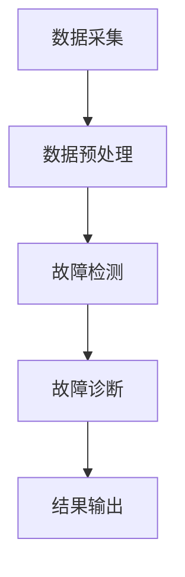

                 

# 《智能故障诊断：LLM在设备维护中的角色》

> **关键词**：智能故障诊断、大型语言模型（LLM）、设备维护、故障检测、故障诊断、深度学习、算法、数据预处理、特征提取、系统架构、案例分析、未来趋势

> **摘要**：
本文深入探讨了智能故障诊断技术在现代设备维护中的应用，特别是大型语言模型（LLM）在故障检测和诊断中的角色。文章首先介绍了智能故障诊断的基本概念、重要性以及其发展历程，然后详细阐述了LLM的原理和应用。接着，文章讲解了智能故障诊断的核心技术，包括故障诊断的算法、数据采集与预处理、特征提取等。随后，文章介绍了智能故障诊断系统设计的方法，包括系统架构、功能模块设计、系统实现与部署等。通过制造业、能源行业和交通行业的案例分析，文章展示了智能故障诊断技术的实际应用效果。最后，文章讨论了智能故障诊断技术的未来发展趋势以及LLM在其中的潜在发展。本文旨在为读者提供一个全面、系统的智能故障诊断技术概述，帮助理解和应用这一前沿技术。|<|assistant|>

# 《智能故障诊断：LLM在设备维护中的角色》目录大纲

## 第一部分：智能故障诊断概述

### 第1章：智能故障诊断的概念与重要性

### 第2章：LLM在智能故障诊断中的应用

## 第二部分：智能故障诊断技术

### 第3章：智能故障诊断技术基础

### 第4章：LLM在故障诊断中的核心技术

### 第5章：智能故障诊断系统设计

## 第三部分：智能故障诊断案例分析

### 第6章：行业智能故障诊断案例分析

## 第四部分：智能故障诊断的未来发展

### 第7章：智能故障诊断技术的未来趋势

### 第8章：LLM在智能故障诊断中的潜在发展

### 第9章：智能故障诊断技术的应用前景

## 附录

### 附录A：智能故障诊断相关工具与资源

### 附录B：智能故障诊断相关的数学模型和数学公式

### 附录C：智能故障诊断的实际项目实战

### 附录D：代码实际案例和详细解释说明

### 附录E：开发环境搭建

### 附录F：代码实现与解读

### 附录G：智能故障诊断系统的性能分析

### 附录H：常见问题与解答

### 附录I：代码解读与分析|<|assistant|>

# 第1章：智能故障诊断的概念与重要性

## 1.1 什么是智能故障诊断

### 1.1.1 故障诊断的定义

故障诊断是指通过监测设备或系统的状态信息，分析故障原因，确定故障位置，并提出处理建议的过程。它是一种重要的维护手段，旨在提高设备或系统的可靠性和可用性。

### 1.1.2 智能故障诊断的定义

智能故障诊断是利用人工智能、机器学习和数据挖掘等技术，对设备或系统的运行状态进行实时监测、分析，并自动识别故障，为设备维护和故障修复提供支持。与传统的故障诊断方法相比，智能故障诊断具有更高的准确性和效率。

## 1.2 智能故障诊断的发展历程

### 1.2.1 传统故障诊断方法

传统的故障诊断方法主要依赖于经验和专家知识，包括：

- **经验法**：依靠操作人员的经验和直觉进行故障诊断。
- **实验法**：通过直接观察和测试设备或系统的性能来诊断故障。
- **定性分析法**：使用逻辑推理和规则库来诊断故障。
- **定量分析法**：通过数学模型和统计方法来诊断故障。

### 1.2.2 智能故障诊断技术的发展

随着计算机技术和人工智能的发展，智能故障诊断技术逐渐成为研究热点。其发展历程可以概括为：

- **数据驱动方法**：以数据为基础，通过数据分析、模式识别等技术进行故障诊断。
- **知识驱动方法**：基于规则库和专家系统，通过符号推理进行故障诊断。
- **混合方法**：结合数据驱动和知识驱动方法，以提高故障诊断的准确性和效率。

## 1.3 智能故障诊断在设备维护中的应用价值

### 1.3.1 提高设备可靠性

智能故障诊断能够实时监测设备状态，提前发现潜在故障，避免设备意外停机。通过预防性维护，可以显著提高设备的可靠性。

### 1.3.2 提高维护效率

智能故障诊断可以自动化故障检测和诊断过程，减少人工排查故障的时间，提高维护效率。此外，通过对故障数据的分析，可以优化维护流程，减少不必要的维护工作。

### 1.3.3 降低维护成本

智能故障诊断可以减少设备的非计划性停机，降低维修成本。通过实时监测和预测故障，可以采取预防性维护措施，延长设备寿命，降低维护成本。

### 1.3.4 延长设备寿命

通过实时监测和预测故障，可以采取预防性维护措施，延长设备寿命。智能故障诊断系统可以提供设备运行状态和健康指数，为维护决策提供依据。

## 1.4 智能故障诊断的挑战与机遇

### 1.4.1 挑战

- **复杂性**：现代设备系统日益复杂，故障诊断难度加大。需要处理大量的传感器数据和多维数据。
- **数据质量**：故障诊断依赖于高质量的数据，数据缺失或不准确会影响诊断结果。需要解决数据清洗、归一化等问题。
- **成本**：智能故障诊断系统需要大量投资，包括硬件、软件和人力资源。需要找到成本效益更高的解决方案。

### 1.4.2 机遇

- **人工智能技术的快速发展**：深度学习、强化学习等人工智能技术在故障诊断中的应用，提高了诊断准确率和效率。
- **物联网技术的普及**：物联网技术的应用，使得设备数据的采集、传输和处理变得更加便捷，为智能故障诊断提供了丰富的数据来源。

## 1.5 智能故障诊断的技术架构

智能故障诊断系统的技术架构通常包括以下几个关键模块：

1. **数据采集**：从传感器、日志、历史数据等渠道收集设备运行数据。
2. **数据预处理**：对采集到的数据进行清洗、归一化、特征提取等处理，以提高数据质量和模型性能。
3. **故障检测**：利用机器学习算法和模型对设备状态进行实时监测，识别异常信号。
4. **故障诊断**：通过对故障检测结果的进一步分析，确定故障原因和位置。
5. **结果输出**：将故障诊断结果以图表、报告等形式展示给用户，为维护决策提供支持。

图1展示了智能故障诊断系统的技术架构。

## 1.6 智能故障诊断的应用场景

智能故障诊断技术可以广泛应用于各个行业，以下是一些典型的应用场景：

1. **制造业**：通过实时监测生产线设备，预测设备故障，减少停机时间，提高生产效率。
2. **能源行业**：监测发电设备、输电设备等，预测潜在故障，优化运行状态，提高能源利用效率。
3. **交通行业**：监测车辆、桥梁、道路等基础设施，预测故障，确保交通安全。
4. **医疗行业**：监测医疗器械和患者生命体征，预测设备故障和患者健康风险。
5. **航空航天**：监测飞机、火箭等关键设备，确保飞行安全，提高任务成功率。

智能故障诊断技术在各个行业中的具体应用，体现了其在提高设备可靠性、维护效率和降低成本方面的巨大潜力。随着人工智能技术的不断发展，智能故障诊断的应用场景将更加广泛，为各行业的持续发展提供强大支持。|<|assistant|>

## 第2章：LLM在智能故障诊断中的应用

### 2.1 LLM的基本原理

#### 2.1.1 LLM的定义

大型语言模型（LLM，Large Language Model）是一种基于深度学习的自然语言处理模型，通过训练海量文本数据，能够理解、生成和转换人类语言。LLM的核心是使用神经网络架构，如变换器（Transformer）或其变种（BERT、GPT等），来学习语言的特征和结构。

#### 2.1.2 LLM的工作原理

LLM的工作原理主要包括以下几个步骤：

1. **预训练**：在大量无标签文本数据上，模型通过自我监督学习来预训练。在此过程中，模型学习语言的统计规律和上下文关系。
2. **微调**：将预训练的LLM模型在特定任务的数据上进行微调，使其适应具体的应用场景。微调过程中，模型会调整权重，以更好地解决特定问题。
3. **推理**：使用微调后的模型进行预测和生成。模型根据输入文本，通过内部计算生成相应的输出。

#### 2.1.3 LLM的训练与优化

LLM的训练与优化过程包括：

1. **数据集选择**：选择适合的训练数据集，通常包括大量高质量文本数据。
2. **模型架构**：选择合适的神经网络架构，如BERT、GPT等。
3. **训练过程**：使用优化算法（如Adam）对模型进行训练，通过反向传播算法更新权重，最小化损失函数。
4. **正则化技术**：应用正则化技术（如Dropout、权重衰减）防止过拟合。

### 2.2 LLM在故障检测中的具体应用

#### 2.2.1 故障检测中的LLM应用

在故障检测中，LLM可以通过以下方式发挥作用：

1. **数据预处理**：使用LLM对传感器数据进行预处理，提取重要的特征，提高数据质量。
2. **异常检测**：利用LLM的强大建模能力，对设备运行数据进行分析，识别异常模式。
3. **实时监测**：在实时应用中，LLM可以持续监测设备状态，及时检测故障信号。

#### 2.2.2 LLM在故障检测中的优势

LLM在故障检测中的优势包括：

1. **高效性**：LLM能够处理大量的传感器数据，快速识别故障信号。
2. **准确性**：通过学习海量数据，LLM能够更准确地识别故障，降低误报和漏报率。
3. **可扩展性**：LLM可以轻松适应不同的设备类型和故障场景，具有很好的可扩展性。

### 2.3 LLM在故障诊断中的优势

#### 2.3.1 灵活性

LLM具有很高的灵活性，能够处理多种类型的故障数据和不同的故障场景。无论是机械故障、电气故障还是软件故障，LLM都能够通过调整模型结构和训练数据来适应。

#### 2.3.2 自动化

LLM可以自动化故障诊断过程，减少人工干预。通过预训练和微调，LLM能够自动识别故障，提供诊断建议，从而提高诊断效率。

#### 2.3.3 智能化

LLM具有自我学习和优化的能力，可以通过不断学习和调整，提高故障诊断的准确性和可靠性。这种智能化特性使得LLM能够更好地应对复杂的故障诊断问题。

### 2.4 LLM在设备维护中的发展趋势

#### 2.4.1 深度应用

随着LLM技术的不断发展，LLM在故障诊断中的应用将越来越深入。未来的研究将重点关注如何更有效地利用LLM处理复杂的故障诊断任务。

#### 2.4.2 融合其他技术

LLM与其他技术的融合，如物联网、大数据分析等，将进一步提升智能故障诊断的能力。例如，通过结合物联网技术，可以实现设备的实时数据采集和远程故障诊断。

#### 2.4.3 行业应用

LLM在智能故障诊断中的应用将逐渐从理论研究走向实际应用。在制造业、能源行业、交通行业等领域的应用将不断普及，为行业带来更多的价值和效益。

#### 2.4.4 人工智能与知识库的结合

人工智能与知识库的结合将使智能故障诊断系统更加智能化。通过将LLM与知识库相结合，可以提供更加精准和全面的故障诊断服务。

### 2.5 LLM在故障诊断中的实际应用案例

#### 2.5.1 制造业设备故障诊断

在制造业中，LLM可以通过对生产设备运行数据的分析，实时监测设备状态，预测故障发生。例如，通过分析机床的振动数据，可以预测机床的故障风险，从而采取预防性维护措施，避免设备停机。

#### 2.5.2 能源行业设备故障诊断

在能源行业，LLM可以用于监测发电设备、输电设备等，预测设备故障，优化运行状态。例如，通过分析发电机的电流和电压数据，可以预测发电机的故障，及时安排维修，避免停电事故。

#### 2.5.3 交通行业设备故障诊断

在交通行业，LLM可以用于监测车辆、桥梁、道路等基础设施，预测故障，确保交通安全。例如，通过分析车辆的传感器数据，可以预测车辆的故障风险，提前进行维修，防止交通事故。

通过这些实际应用案例，可以看出LLM在故障诊断中的重要作用。随着技术的不断进步，LLM在故障诊断中的应用将更加广泛，为设备维护带来更多的可能性和效益。|<im_sep|><|assistant|>

## 第3章：智能故障诊断技术基础

### 3.1 故障诊断的基本概念

#### 3.1.1 故障定义

故障是指设备或系统无法按预期运行的状态。故障可能是瞬时的，也可能是持久的，严重程度可以从轻微的警告信号到完全失效。

#### 3.1.2 故障分类

根据故障的性质和原因，故障可以分为以下几类：

- **硬故障**：由硬件故障引起的故障，例如设备损坏、电气故障等。
- **软故障**：由软件故障引起的故障，例如程序错误、数据错误等。
- **复杂故障**：由硬件和软件故障共同引起的故障，例如软硬件交互故障等。

#### 3.1.3 故障诊断的目标

故障诊断的目标是：

- **定位故障**：确定故障发生的具体位置。
- **原因分析**：分析故障产生的原因。
- **故障分类**：对故障进行分类，以便采取相应的修复措施。
- **故障预测**：预测未来可能的故障，采取预防性措施。

### 3.2 故障诊断的常用算法

#### 3.2.1 信号处理方法

信号处理方法是基于对设备运行信号的时域、频域和时频特性进行分析，以识别故障。常用的信号处理方法包括：

- **时域分析**：通过分析信号的时域特性，如信号的幅值、频率、相位等，识别故障。
- **频域分析**：通过傅里叶变换将信号从时域转换到频域，分析信号的频率成分，识别故障。
- **时频分析**：通过小波变换等时频分析方法，同时分析信号的时域和频域特性，提高故障诊断的准确性。

#### 3.2.2 模式识别方法

模式识别方法是通过分析设备运行数据中的模式特征，进行故障诊断。常用的模式识别方法包括：

- **特征提取**：从原始数据中提取能够反映设备状态的特

