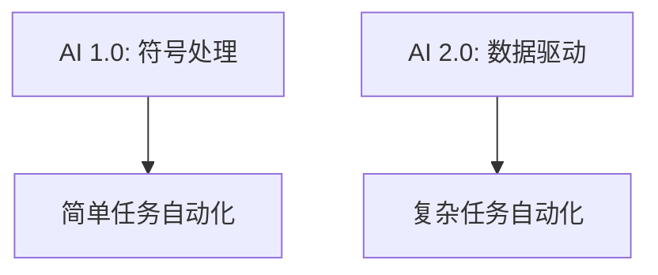

                 

### 文章标题

# 《李开复：AI 2.0 时代的投资价值》

> **关键词**：人工智能、AI 2.0、投资价值、技术突破、投资策略、案例解析

> **摘要**：本文将深入探讨AI 2.0时代的投资价值，首先回顾AI 2.0的定义与特点，接着分析AI 2.0时代的技术框架，然后探讨AI 2.0时代的投资机会与风险，最后通过实战案例展示AI 2.0时代的投资实践。

### 第一部分: AI 2.0 时代概述

## 第1章: AI 2.0 时代的崛起

### 1.1 AI 2.0 的定义与特点

**核心概念与联系：**

$$
\text{AI 1.0:} \quad \text{符号处理} \xrightarrow{\text{规则}} \text{简单任务自动化}
$$

$$
\text{AI 2.0:} \quad \text{数据驱动} \xrightarrow{\text{深度学习}} \text{复杂任务自动化}
$$

**Mermaid 流程图：**



AI 2.0 是指基于大数据和深度学习的第二代人工智能，它以数据驱动为核心，通过深度学习模型实现复杂任务的自动化。与AI 1.0主要依赖符号处理和规则不同，AI 2.0通过从大量数据中学习，自动优化算法，实现更高层次的智能化。

### 1.2 AI 2.0 时代的技术突破

**核心算法原理讲解：**

**深度学习与神经网络**

伪代码：

```python
# 初始化神经网络
input_layer = Input(shape=(input_shape,))
hidden_layer = Dense(hidden_neurons, activation='relu')(input_layer)
output_layer = Dense(output_neurons, activation='sigmoid')(hidden_layer)

# 构建模型
model = Model(inputs=input_layer, outputs=output_layer)
model.compile(optimizer='adam', loss='binary_crossentropy', metrics=['accuracy'])

# 训练模型
model.fit(X_train, y_train, epochs=10, batch_size=32)
```

深度学习是AI 2.0时代的关键技术，通过多层神经网络模型，可以自动从数据中学习特征，实现对复杂任务的识别和预测。神经网络由输入层、隐藏层和输出层组成，通过反向传播算法不断调整权重，提高模型的准确率。

**大规模预训练模型**

**BERT（Bidirectional Encoder Representations from Transformers）**

BERT是一个预训练的语言处理模型，通过在大量文本数据上进行预训练，使模型能够理解上下文信息。其核心步骤包括：

1. **数据预处理**：对文本数据进行分词、标记和清洗。
2. **模型构建**：使用Transformer架构构建BERT模型。
3. **预训练**：在大量文本数据上训练模型，优化模型参数。
4. **微调**：在特定任务数据上微调模型，提高任务表现。

**强化学习与自动机器学习**

**Q-Learning**

伪代码：

```python
# 初始化Q值表
Q = np.zeros([state_space, action_space])

# 更新Q值
for episode in range(total_episodes):
    state = env.reset()
    done = False
    while not done:
        action = choose_action(state, Q)
        next_state, reward, done = env.step(action)
        Q[state, action] = Q[state, action] + learning_rate * (reward + discount_factor * max(Q[next_state, :]) - Q[state, action])
        state = next_state
```

强化学习是一种通过试错学习策略的机器学习方法。Q-Learning是其中的一种算法，通过不断尝试和更新Q值表，使智能体能够找到最优策略。

**自动机器学习（AutoML）**

自动机器学习旨在自动化机器学习模型的选择、训练和调优过程。其主要步骤包括：

1. **数据预处理**：对输入数据进行清洗、归一化和特征提取。
2. **模型搜索**：使用强化学习或贝叶斯优化等方法，搜索最优模型架构和超参数。
3. **模型训练与评估**：训练模型并评估其性能，选择最优模型。
4. **模型部署**：将最优模型部署到实际应用场景。

### 1.3 AI 2.0 时代的影响

AI 2.0时代的到来，将对各个领域产生深远的影响：

- **对传统行业的颠覆**：例如，智能制造、智能医疗、智能交通等领域的应用，将大幅提高生产效率和服务质量。
- **对新兴产业的推动**：AI 2.0时代的创新将带动新产业的崛起，如自动驾驶、智能金融、虚拟现实等。
- **对社会生活的影响**：AI 2.0的应用将改变人们的日常生活，提高生活质量，如智能家居、智能安防、健康监测等。

## 第2章: AI 2.0 时代的技术框架

### 2.1 AI 2.0 技术体系概述

AI 2.0 技术体系主要包含以下三个方面：

- **数据驱动**：以大规模数据为基础，通过深度学习等技术实现模型的训练和优化。
- **算法驱动**：以先进的算法为核心，如深度学习、强化学习、自动机器学习等，实现智能化的任务处理。
- **硬件驱动**：以高性能计算硬件为支撑，如GPU、TPU等，提供强大的计算能力，加速AI模型的训练和推理。

### 2.2 主流AI 2.0 技术概览

**深度学习框架（例如：TensorFlow、PyTorch）**

TensorFlow和PyTorch是目前最流行的深度学习框架。它们提供了丰富的API和工具，方便开发者构建和训练深度学习模型。

**自然语言处理（NLP）技术（例如：BERT、GPT）**

BERT和GPT是当前最先进的NLP模型，通过预训练和微调，可以实现高质量的文本理解和生成。

**计算机视觉技术（例如：YOLO、SSD）**

YOLO和SSD是当前最流行的目标检测算法，它们具有较高的检测速度和准确率，广泛应用于图像和视频分析领域。

**强化学习技术（例如：Q-Learning、DQN）**

Q-Learning和DQN是强化学习的经典算法，通过策略迭代和价值迭代，实现智能体的最优决策。

## 第二部分: AI 2.0 时代的投资机会

### 3.1 AI 2.0 时代的投资策略

**AI 投资的宏观环境**

AI 投资的宏观环境主要包括以下几个方面：

- **技术发展趋势**：AI 技术的不断进步，特别是深度学习、自然语言处理和计算机视觉等领域，为投资提供了广阔的空间。
- **政策环境**：政府对AI技术的支持，以及相关政策的制定，为AI产业发展提供了良好的环境。
- **市场规模预测**：随着AI技术的广泛应用，AI市场规模将持续增长，为投资者带来巨大的机遇。

### 3.2 AI 投资的基本原则

**长期投资**

AI 投资是一个长期过程，需要投资者具备耐心和远见。从长远来看，AI 技术的发展将为投资者带来可观的回报。

**风险控制**

AI 投资存在一定的风险，投资者需要通过分散投资、风险管理和专业管理等方式，控制投资风险。

**资源整合**

AI 投资需要整合多方面的资源，包括技术、人才、资金和市场等，通过资源整合，实现投资的最大化效益。

### 3.3 AI 投资的具体策略

**直接投资**

直接投资是指投资者直接购买AI 公司的股票或债券，享受公司业绩增长带来的收益。

**股权投资**

股权投资是指投资者通过投资AI 公司的股权，获得公司利润分配和股价上涨的收益。

**投资基金**

投资基金是指投资者通过投资AI 主题的基金，享受基金管理团队的专业投资和管理。

## 第4章: AI 2.0 时代的投资案例解析

### 4.1 人工智能硬件投资案例

**英伟达（NVDA）**

英伟达是一家专注于高性能计算和人工智能芯片的公司。其GPU芯片广泛应用于深度学习训练和推理，是AI 硬件领域的领军企业。

**腾讯云（Tencent Cloud）**

腾讯云是腾讯公司旗下的云计算服务提供商，其提供强大的AI 计算能力和数据存储解决方案，广泛应用于智能语音、图像处理和自然语言处理等领域。

### 4.2 人工智能软件投资案例

**谷歌（GOOGL）**

谷歌是一家全球领先的科技公司，其AI 技术广泛应用于搜索引擎、广告、云计算等领域，是AI 软件领域的龙头企业。

**微软（MSFT）**

微软是一家全球领先的软件和云计算服务提供商，其AI 技术广泛应用于企业级应用、游戏、智能语音和自然语言处理等领域。

### 4.3 人工智能解决方案投资案例

**IBM（IBM）**

IBM 是一家全球领先的科技公司，其 AI 解决方案广泛应用于金融、医疗、零售和制造业等领域，为客户提供全面的 AI 解决方案。

**AWS（AMZN）**

AWS 是亚马逊旗下的云计算服务提供商，其 AI 解决方案包括机器学习、深度学习和自然语言处理等，为客户提供全方位的 AI 服务。

## 第5章: AI 2.0 时代的投资风险与应对

### 5.1 投资风险概述

AI 投资面临以下几种主要风险：

**技术风险**：AI 技术的快速迭代和不确定性可能导致投资失败。

**法律风险**：AI 技术的应用可能涉及隐私保护、知识产权等方面的法律问题。

**市场风险**：AI 市场的波动性和不确定性可能导致投资回报不理想。

### 5.2 投资风险应对策略

**分散投资**：通过分散投资，降低单一投资的风险。

**专业管理**：聘请专业的投资团队进行管理和决策，降低投资风险。

**风险预警**：建立风险预警系统，及时识别和应对潜在风险。

## 第6章: AI 2.0 时代的投资机会展望

### 6.1 AI 2.0 时代的新兴投资领域

**自动驾驶**

自动驾驶是 AI 2.0 时代的重要应用领域，随着技术的不断进步，自动驾驶汽车有望在未来实现大规模商用。

**人工智能医疗**

人工智能医疗是另一个具有重要前景的领域，通过 AI 技术对医疗数据进行分析和处理，可以提高诊断和治疗的准确性和效率。

**人工智能金融**

人工智能金融涉及利用 AI 技术优化金融产品和服务，提高金融行业的效率和安全。

### 6.2 投资机会的长期展望

**全球化视角**

随着 AI 技术的全球化，各国政府和企业纷纷加大对 AI 投资的力度，为投资者提供了广阔的机遇。

**行业融合**

AI 技术的应用将推动各行业的融合和发展，为投资者带来新的投资机会。

**技术创新**

AI 技术的不断进步和创新，将不断拓宽投资领域，为投资者创造更多的价值。

## 第7章: AI 2.0 投资的实践步骤

### 7.1 投资目标确定

投资者在开始 AI 投资前，需要明确自己的投资目标，包括长期目标和短期目标。长期目标可以是实现稳定的投资回报，短期目标可以是追求快速的投资收益。

### 7.2 投资标的筛选

投资者需要通过企业基本面分析、行业前景分析和管理团队评估等多种方法，筛选出具有投资潜力的标的。

### 7.3 投资策略制定

投资者需要根据自身的风险承受能力和投资目标，制定合适的投资策略，包括分散投资、风险控制和投资组合设计等。

## 第8章: AI 2.0 投资实战案例

### 8.1 AI 投资实战案例一：自动驾驶

**投资背景**

自动驾驶是 AI 2.0 时代的重要应用领域，随着技术的不断进步，自动驾驶汽车有望在未来实现大规模商用。

**投资策略**

通过投资自动驾驶领域的领先企业，如 Waymo、Cruise 等，分享自动驾驶技术的商业价值。

**投资收益**

随着自动驾驶技术的商业化，投资者有望获得长期稳定的投资回报。

### 8.2 AI 投资实战案例二：人工智能医疗

**投资背景**

人工智能医疗是另一个具有重要前景的领域，通过 AI 技术对医疗数据进行分析和处理，可以提高诊断和治疗的准确性和效率。

**投资策略**

通过投资人工智能医疗领域的领先企业，如 Flatiron Health、NVIDIA 等，分享人工智能医疗的商业价值。

**投资收益**

随着人工智能医疗技术的商业化，投资者有望获得长期稳定的投资回报。

### 8.3 AI 投资实战案例三：人工智能金融

**投资背景**

人工智能金融涉及利用 AI 技术优化金融产品和服务，提高金融行业的效率和安全。

**投资策略**

通过投资人工智能金融领域的领先企业，如 Ant Financial、Palantir 等，分享人工智能金融的商业价值。

**投资收益**

随着人工智能金融技术的商业化，投资者有望获得长期稳定的投资回报。

## 附录

### 附录A: AI 投资相关工具与资源

**主流深度学习框架对比**

- **TensorFlow**：Google 开发的一个开放源代码的深度学习框架，支持多种编程语言，适用于各种深度学习任务。
- **PyTorch**：由 Facebook 开发的一个开源深度学习框架，以动态计算图为基础，易于调试和实现新算法。
- **Keras**：一个基于 TensorFlow 的深度学习高级API，提供简洁的接口和丰富的工具，适用于快速原型设计和实验。

**AI 行业报告与数据来源**

- **CBInsights**：提供 AI 行业的研究报告和数据分析，帮助投资者了解行业趋势和投资机会。
- **McKinsey & Company**：提供全球范围内的人工智能研究报告，涵盖技术发展、应用场景和商业价值等方面。
- **IDG Capital**：是一家全球领先的科技投资公司，专注于 AI 领域的投资，提供丰富的投资案例和经验。

**AI 投资社区与交流平台**

- **AI Weekly**：一个提供 AI 相关新闻、研究报告和行业动态的周刊，帮助投资者了解行业动态。
- **LinkedIn AI Groups**：LinkedIn 上的人工智能专业群组，提供行业交流和学习资源。
- **Reddit AI Subreddits**：Reddit 上的人工智能子版块，汇集了大量的 AI 新闻、研究论文和讨论。

---

**作者：**AI天才研究院/AI Genius Institute & 禅与计算机程序设计艺术/Zen And The Art of Computer Programming

---

本文详细介绍了 AI 2.0 时代的投资价值，分析了 AI 2.0 的定义与特点、技术突破、投资机会与风险，并通过实战案例展示了 AI 2.0 时代的投资实践。希望本文能为读者提供有价值的投资参考。

