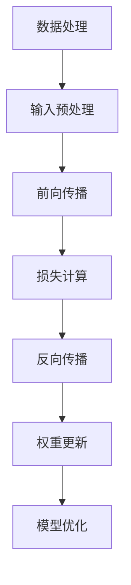

                 

### 构建更好的人工神经网络

#### 关键词：
- 人工智能神经网络
- 深度学习
- 算法优化
- 应用实战

> 摘要：
本文深入探讨人工神经网络的核心概念、原理和架构，详细解析神经网络的基础算法，以及其在图像识别等领域的实际应用。通过一步步的分析和推理，我们将揭示如何构建更好的人工神经网络，以及深度学习与人工智能的未来发展趋势。

#### 第一部分：基础概念与原理

### 第1章：人工智能神经网络基础

#### 1.1 人工智能神经网络概述

##### 1.1.1 人工智能的发展历程

人工智能（AI）作为一个研究领域，自1956年由约翰·麦卡锡（John McCarthy）等人首次提出以来，已经经历了多次演变。从早期的符号推理和专家系统，到基于规则的系统，再到近几年的深度学习和强化学习，人工智能在计算机科学、认知科学、神经科学等多个领域取得了显著的进展。

##### 1.1.2 神经网络的基本概念

神经网络（Neural Networks）是模仿人脑神经元结构和功能的一种计算模型。每个神经元（也称为节点）都与其他神经元通过连接（称为边）连接，并可以传递信号。神经网络通过这些连接和节点的激活来处理和传递信息。

##### 1.1.3 人工神经网络的类型

人工神经网络主要分为两类：前馈神经网络和循环神经网络。

- **前馈神经网络（Feedforward Neural Network）**：信号在前向传播过程中，从输入层经过隐藏层，最终到达输出层，不形成循环。
- **循环神经网络（Recurrent Neural Network, RNN）**：信号不仅从前向传播，还可以向后传递，形成循环结构。

##### 1.1.4 人工智能神经网络的核心特性

- **并行处理能力**：神经网络可以并行处理大量数据，提高计算效率。
- **自适应学习**：神经网络通过调整连接权重，能够自动学习和适应新的数据模式。
- **非线性映射**：神经网络能够处理复杂、非线性问题，实现从输入到输出的映射。

#### 1.2 神经网络架构原理

##### 1.2.1 神经网络的基本组成

神经网络的基本组成包括输入层、隐藏层和输出层。输入层接收外部输入，隐藏层进行数据处理和特征提取，输出层产生最终输出。

##### 1.2.2 神经元的激活函数

激活函数（Activation Function）是神经网络中的一个关键组件，它决定了神经元是否被激活。常见的激活函数包括Sigmoid函数、ReLU函数和Tanh函数。

- **Sigmoid函数**：$ \sigma(x) = \frac{1}{1 + e^{-x}} $，将输出值压缩到（0, 1）之间。
- **ReLU函数**：$ f(x) = \max(0, x) $，非负部分直接映射到正无穷。
- **Tanh函数**：$ \tanh(x) = \frac{e^{2x} - 1}{e^{2x} + 1} $，输出值范围在（-1, 1）之间。

##### 1.2.3 前向传播与反向传播算法

神经网络通过前向传播和反向传播算法进行训练和优化。

- **前向传播算法**：从输入层开始，逐层计算神经元的输出值，最终得到输出层的预测结果。
- **反向传播算法**：计算预测值与真实值之间的误差，通过反向传播算法，更新神经网络的权重和偏置。

##### 1.2.4 经典神经网络架构

1. **多层感知机（MLP）**：最简单的神经网络结构，由输入层、一个或多个隐藏层和输出层组成。
2. **卷积神经网络（CNN）**：专门用于图像识别和处理，包括卷积层、池化层和全连接层。
3. **循环神经网络（RNN）**：适用于序列数据处理，包括标准的RNN和长短期记忆网络（LSTM）。
4. **自注意力机制（Attention Mechanism）**：用于捕捉序列中的关键信息，提高模型的性能。

##### 1.3 人工神经网络的工作原理

##### 1.3.1 数据处理流程

1. **数据输入与预处理**：将原始数据转换为适合神经网络处理的形式，如归一化、缩放等。
2. **前向传播计算**：从输入层开始，逐层计算神经元的输出值，直到输出层。
3. **反向传播与权重更新**：计算预测值与真实值之间的误差，通过反向传播算法，更新神经网络的权重和偏置。
4. **模型训练与优化**：重复前向传播和反向传播过程，直到满足预定的停止条件，如误差阈值或最大迭代次数。

##### 1.3.2 人工神经网络的优势与局限

1. **优势**：
   - **高精度**：能够处理复杂、非线性问题，实现高精度的预测和分类。
   - **自动化特征提取**：通过学习大量数据，能够自动提取有用的特征，减少人工干预。
   - **适应性强**：能够适应不同的数据集和应用场景，具有较好的泛化能力。

2. **局限**：
   - **计算复杂**：神经网络训练过程中，计算量巨大，对计算资源和时间有较高要求。
   - **过拟合风险**：当模型过于复杂时，容易发生过拟合现象，无法泛化新数据。
   - **解释性差**：神经网络模型较为复杂，难以解释具体的预测过程和原因。

#### Mermaid 流程图：



### 第二部分：核心算法与实现

#### 第2章：人工神经网络核心算法详解

##### 2.1 神经元与激活函数

##### 2.1.1 神经元的工作原理

神经元是神经网络的基本计算单元，其工作原理可以类比于人脑中的神经元。在神经网络中，每个神经元接收来自其他神经元的输入信号，通过加权求和处理后，再通过激活函数产生输出。

- **伪代码**：

```python
def neuron(input, weights, bias):
    output = (input * weights) + bias
    return activation(output)
```

- **解释**：

  - `input`：神经元的输入值。
  - `weights`：连接输入和神经元的权重。
  - `bias`：偏置值，用于调整神经元输出。
  - `activation`：激活函数，用于决定神经元是否被激活。

##### 2.1.2 激活函数的作用与分类

激活函数是神经网络中的一个关键组件，其作用是将神经元输出映射到特定的区间，以实现非线性变换。

- **常见激活函数**：

  - **Sigmoid函数**：

    $$ \sigma(x) = \frac{1}{1 + e^{-x}} $$

    - **特点**：输出范围在（0, 1）之间，适合处理二分类问题。

  - **ReLU函数**：

    $$ f(x) = \max(0, x) $$

    - **特点**：简单高效，梯度固定为0或1，有助于防止梯度消失。

  - **Tanh函数**：

    $$ \tanh(x) = \frac{e^{2x} - 1}{e^{2x} + 1} $$

    - **特点**：输出范围在（-1, 1）之间，常用于处理多分类问题。

##### 2.2 前向传播与反向传播

##### 2.2.1 前向传播算法

前向传播是神经网络训练过程中的一个关键步骤，它将输入信号逐层传播到输出层，得到最终的预测结果。

- **伪代码**：

```python
def forward_propagation(input, weights, bias, activation):
    z = (input * weights) + bias
    output = activation(z)
    return output
```

- **解释**：

  - `input`：神经元的输入值。
  - `weights`：连接输入和神经元的权重。
  - `bias`：偏置值。
  - `activation`：激活函数。
  - `z`：加权求和处理后的中间值。
  - `output`：神经元的输出值。

##### 2.2.2 反向传播算法

反向传播是神经网络训练过程中的另一个关键步骤，它通过计算预测值与真实值之间的误差，更新神经网络的权重和偏置。

- **伪代码**：

```python
def backward_propagation(output, expected, weights, activation_derivative):
    error = expected - output
    d_output = activation_derivative(output)
    d_weights = error * d_output
    d_bias = error * d_output
    return d_weights, d_bias
```

- **解释**：

  - `output`：神经元的输出值。
  - `expected`：期望输出值。
  - `weights`：连接输入和神经元的权重。
  - `activation_derivative`：激活函数的导数。
  - `error`：预测值与期望值之间的误差。
  - `d_output`：输出误差关于输出值的导数。
  - `d_weights`：权重误差关于权重的导数。
  - `d_bias`：偏置误差关于偏置的导数。

##### 2.3 权重初始化与优化算法

##### 2.3.1 权重初始化方法

在神经网络训练过程中，权重初始化是一个重要的步骤，它直接影响到模型的收敛速度和性能。

- **随机初始化**：随机初始化权重，使得模型在训练过程中具有一定的探索能力。
- **高斯分布初始化**：

  $$ w \sim N(0, \frac{1}{\sqrt{n}}) $$

  - **解释**：权重从均值为0，标准差为$\frac{1}{\sqrt{n}}$的高斯分布中抽取。

##### 2.3.2 常见的优化算法

在神经网络训练过程中，优化算法用于更新权重和偏置，以最小化损失函数。

- **梯度下降（Gradient Descent）**：

  $$ w_{t+1} = w_t - \alpha \frac{\partial J(w)}{\partial w} $$

  - **解释**：梯度下降通过计算损失函数关于权重的梯度，更新权重，其中$\alpha$为学习率。

- **动量优化（Momentum）**：

  $$ v_t = \beta v_{t-1} + (1-\beta) \frac{\partial J(w)}{\partial w} $$
  $$ w_{t+1} = w_t - v_t $$

  - **解释**：动量优化引入了动量项，使得更新方向更为稳定，减少了频繁的振荡。

### 第三部分：神经网络应用实战

#### 第3章：人工神经网络在图像识别中的应用

##### 3.1 卷积神经网络（CNN）概述

卷积神经网络（Convolutional Neural Network，CNN）是专门用于图像识别和处理的一种神经网络结构。与传统的神经网络相比，CNN具有以下优势：

- **局部连接**：CNN通过局部连接和共享权重的方式，减少了参数数量，提高了计算效率。
- **平移不变性**：CNN能够自动学习图像的平移不变性特征，使其在处理不同位置的图像时保持一致。
- **特征提取**：CNN能够自动提取图像的有用特征，降低了人工干预的需求。

##### 3.2 卷积神经网络核心组件

卷积神经网络由多个卷积层、池化层和全连接层组成。以下是CNN中的核心组件及其作用：

- **卷积层（Convolutional Layer）**：用于提取图像的局部特征。
- **池化层（Pooling Layer）**：用于降低图像的空间分辨率，减少计算量。
- **全连接层（Fully Connected Layer）**：用于将特征映射到分类结果。

##### 3.2.1 卷积层（Convolutional Layer）

卷积层是CNN中最基本的层之一，它通过卷积运算提取图像的局部特征。

- **伪代码**：

```python
def convolution(input, filter, stride, padding):
    output = (input * filter).sum() + bias
    return output
```

- **解释**：

  - `input`：输入图像。
  - `filter`：卷积核，用于提取特征。
  - `stride`：卷积步长，控制卷积核在图像上的滑动距离。
  - `padding`：填充方式，用于处理边界问题。

##### 3.2.2 池化层（Pooling Layer）

池化层用于降低图像的空间分辨率，减少计算量。

- **最大池化（Max Pooling）**：

  $$ \text{Max Pooling}(x) = \max(x_{i,j}) $$

  - **解释**：最大池化在滑动窗口内选取最大的值作为输出。

##### 3.2.3 全连接层（Fully Connected Layer）

全连接层用于将特征映射到分类结果。

- **伪代码**：

```python
def fully_connected(input, weights, bias):
    output = (input * weights) + bias
    return activation(output)
```

- **解释**：

  - `input`：输入特征。
  - `weights`：权重。
  - `bias`：偏置。
  - `activation`：激活函数。

##### 3.3 CNN在图像识别中的实战案例

以下是一个简单的图像分类任务，使用MNIST数据集进行训练。

- **数据准备**：使用MNIST数据集，将图像缩放为28x28像素。

- **模型搭建**：使用Keras构建CNN模型。

  ```python
  from keras.models import Sequential
  from keras.layers import Conv2D, MaxPooling2D, Flatten, Dense

  model = Sequential()
  model.add(Conv2D(32, (3, 3), activation='relu', input_shape=(28, 28, 1)))
  model.add(MaxPooling2D(pool_size=(2, 2)))
  model.add(Flatten())
  model.add(Dense(128, activation='relu'))
  model.add(Dense(10, activation='softmax'))
  model.compile(optimizer='adam', loss='categorical_crossentropy', metrics=['accuracy'])
  ```

- **训练过程**：训练模型，监控训练过程，调整超参数。

  ```python
  model.fit(x_train, y_train, epochs=10, batch_size=32, validation_data=(x_test, y_test))
  ```

- **模型评估**：评估模型性能，准确率、召回率等指标。

  ```python
  scores = model.evaluate(x_test, y_test)
  print('Test accuracy:', scores[1])
  ```

##### 3.4 CNN源代码解读与分析

以下是一个简单的CNN模型代码示例，使用Keras框架进行构建。

- **代码示例**：

  ```python
  from keras.models import Sequential
  from keras.layers import Conv2D, MaxPooling2D, Flatten, Dense

  model = Sequential()
  model.add(Conv2D(32, (3, 3), activation='relu', input_shape=(28, 28, 1)))
  model.add(MaxPooling2D(pool_size=(2, 2)))
  model.add(Flatten())
  model.add(Dense(128, activation='relu'))
  model.add(Dense(10, activation='softmax'))
  model.compile(optimizer='adam', loss='categorical_crossentropy', metrics=['accuracy'])
  model.fit(x_train, y_train, epochs=10, batch_size=32, validation_data=(x_test, y_test))
  ```

- **分析**：

  - **模型结构**：模型由一个卷积层、一个池化层、一个全连接层和一个输出层组成。
  - **激活函数**：卷积层使用ReLU函数作为激活函数，全连接层使用softmax函数作为输出层。
  - **优化算法**：使用Adam优化器进行模型训练。

### 第四部分：深度学习与人工智能

#### 第4章：深度学习与人工智能的未来发展趋势

##### 4.1 深度学习的未来发展趋势

深度学习作为人工智能的重要分支，在未来将继续发展，并在多个领域取得突破。

- **硬件加速与分布式训练**：随着硬件技术的发展，如GPU、TPU等硬件加速器的普及，深度学习模型将能够更快地训练和部署。
- **生成对抗网络（GAN）**：GAN在图像生成、图像修复、数据增强等方面取得了显著成果，未来将进一步拓展其应用领域。
- **强化学习与智能决策**：强化学习在游戏、自动驾驶、机器人等领域取得了重要突破，未来将与其他人工智能技术相结合，实现更智能的决策。

##### 4.2 人工智能在其他领域的应用

人工智能在医疗健康、金融科技、自动驾驶等领域具有广泛的应用前景。

- **医疗健康**：人工智能在疾病诊断、药物研发、健康监测等方面具有巨大潜力，有助于提高医疗水平和减少医疗成本。
- **金融科技**：人工智能在风险评估、投资策略、智能客服等方面具有重要作用，有助于提高金融行业的效率和准确性。
- **自动驾驶**：人工智能在环境感知、路径规划、自动驾驶决策等方面取得了重要突破，有望实现安全、高效的自动驾驶。

##### 4.3 人工智能的挑战与伦理问题

人工智能的发展也带来了一系列挑战和伦理问题。

- **模型可解释性与透明度**：随着模型复杂度的增加，其可解释性变得越来越困难，如何提高模型的可解释性是一个重要挑战。
- **数据隐私与安全**：人工智能系统依赖大量数据，如何保护用户隐私和数据安全是一个重要问题。
- **人工智能的社会影响**：人工智能的发展将对社会、就业、伦理等方面产生深远影响，如何平衡人工智能的发展与社会利益是一个重要问题。

### 附录

#### 附录A：深度学习工具与资源

深度学习工具和资源为研究人员和开发者提供了丰富的学习资源和工具。

- **深度学习框架简介**：
  - **TensorFlow**：由Google开发的开源深度学习框架，支持多种编程语言，具有广泛的社区和丰富的文档。
  - **PyTorch**：由Facebook开发的开源深度学习框架，以动态计算图和易于使用的接口著称。
  - **Keras**：一个高层神经网络API，用于快速构建和迭代深度学习模型。

- **深度学习社区与资源**：
  - **在线课程与教程**：Coursera、edX、Udacity等平台提供了丰富的深度学习课程和教程。
  - **开源项目与论文**：GitHub、ArXiv等平台上有大量的深度学习开源项目和论文，为研究者提供了丰富的资源。
  - **专业会议与竞赛**：NeurIPS、ICML、KDD等国际会议和比赛，为深度学习研究者提供了交流和展示的平台。

