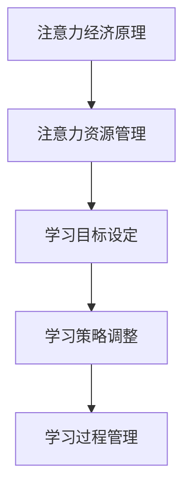

                 

# 《注意力经济与个人学习曲线的优化》

## 概述

> 关键词：注意力经济、个人学习曲线、优化、学习效率、学习动力

在当今信息爆炸的时代，我们的注意力资源变得越来越宝贵。如何有效地管理我们的注意力，使其在学习过程中发挥最大的效用，成为了一个亟待解决的问题。本文将探讨注意力经济原理及其在个人学习曲线优化中的应用，通过逐步分析推理，为读者提供一套完整的学习策略。

## 摘要

本文首先介绍了注意力经济的基本概念和原理，以及个人学习曲线的定义和影响因素。接着，本文结合实际案例，详细阐述了注意力资源的管理与优化策略，并提出了基于注意力经济的个人学习曲线优化方法。最后，本文对注意力经济与个人学习曲线优化进行了总结和展望，为未来的研究提供了方向。

### 第一部分：基础概念与理论

#### 第1章：注意力经济原理

## 1.1 注意力经济的定义与背景

### 1.1.1 注意力经济的起源

注意力经济（Attention Economy）这一概念起源于2006年，由作家、经济学家和未来学家唐·塔斯勒（Don Tapscott）在其著作《网络财富：为什么网络经济会改变一切》（"Grown Up Digital: How the Net Generation Is Changing Your World"）中首次提出。他主张，随着互联网和数字媒体的普及，注意力已成为一种新的经济资源，与土地、劳动力和资本一样重要。

### 1.1.2 注意力资源的价值

注意力资源是人类在接收和处理信息时所能投入的心理和生理资源的总和。在数字时代，注意力资源的价值愈发凸显。研究表明，人的注意力持续时间平均约为20分钟，且易于受到外界干扰。因此，如何吸引并保持受众的注意力，成为众多企业和个体竞争的焦点。

### 1.1.3 注意力经济的核心概念

注意力经济的核心概念可以概括为以下几点：

1. **稀缺性**：注意力资源是有限的，且难以复制和共享。
2. **竞争**：在信息过载的时代，获取注意力成为一种竞争手段。
3. **交易**：注意力可以作为一种资源进行交易，如广告、社交媒体点赞等。
4. **分配**：注意力的分配影响信息传播的效果和范围。

## 1.2 注意力经济模型

### 1.2.1 注意力经济的结构

注意力经济模型通常包括以下几个关键组成部分：

1. **信息提供者**：生产内容和服务，吸引受众的注意力。
2. **信息受众**：消费内容和服务，投入注意力资源。
3. **媒介平台**：提供信息传播渠道，连接信息提供者和受众。
4. **商业利益**：通过注意力交易实现经济回报。

### 1.2.2 注意力资源分配模型

注意力资源的分配模型旨在最大化信息传播的效果。常见的分配模型包括：

1. **内容质量模型**：高质量内容更容易获得关注。
2. **算法推荐模型**：基于用户行为和兴趣推荐内容，提高点击率。
3. **市场机制模型**：通过广告和赞助等商业手段，实现注意力资源的有效配置。

### 1.2.3 注意力转化率模型

注意力转化率是指注意力资源转化为实际收益的效率。影响转化率的因素包括：

1. **内容吸引力**：内容是否能够激发受众的兴趣和好奇心。
2. **用户参与度**：受众对内容的互动程度，如点赞、评论、转发等。
3. **品牌认知度**：企业或个人在受众心中的认知度和信任度。

## 1.3 注意力经济学理论

### 1.3.1 注意力经济学的基本原理

注意力经济学与传统经济学有诸多相似之处，但也存在显著区别。注意力经济学的基本原理包括：

1. **价值创造**：注意力资源可以创造经济价值，如广告收入、产品销售等。
2. **资源稀缺**：注意力资源的稀缺性决定了其价值。
3. **市场机制**：注意力交易依赖于市场机制，包括供求关系、价格形成等。

### 1.3.2 注意力经济学与传统经济学的区别

与传统经济学相比，注意力经济学的关键区别在于：

1. **资源性质**：传统经济学主要关注物质资源，而注意力经济学关注的是非物质资源。
2. **作用机制**：传统经济学强调生产、消费和市场交易，而注意力经济学强调信息的获取、处理和传播。
3. **价值衡量**：传统经济学使用货币价值衡量资源，而注意力经济学则使用注意力价值衡量资源。

### 1.3.3 注意力经济学在现代社会的应用

注意力经济学在现代社会有着广泛的应用，包括：

1. **市场营销**：通过注意力资源获取客户，提高品牌知名度。
2. **内容创作**：利用注意力经济原理，创作出更具吸引力的内容。
3. **教育培训**：通过注意力管理，提高学习效果和参与度。
4. **企业管理**：运用注意力经济学原理，优化组织管理和资源配置。

## 第2章：个人学习曲线理论

## 2.1 个人学习曲线的基本概念

### 2.1.1 个人学习曲线的定义

个人学习曲线是指个体在特定学习过程中，学习成果随时间变化而呈现的曲线。学习曲线反映了学习者在学习过程中的进步情况，通常包括学习效率、学习速度和学习深度等方面。

### 2.1.2 个人学习曲线的类型

个人学习曲线通常分为以下几种类型：

1. **S型曲线**：学习效果在初期迅速提升，随后逐渐趋于平稳。
2. **抛物线型曲线**：学习效果在初期平稳，随后逐渐提升，达到峰值后再次平稳。
3. **阶梯型曲线**：学习效果在一段时间内保持不变，然后突然提升。

### 2.1.3 个人学习曲线的特点

个人学习曲线具有以下特点：

1. **非线性**：学习效果并非线性增长，而是随着时间呈非线性变化。
2. **个体差异**：不同个体在学习曲线上的表现存在差异，受到知识背景、学习方法、心理因素等多种因素的影响。
3. **适应性**：个体在学习过程中会逐渐适应学习环境，调整学习策略，从而优化学习效果。

## 2.2 个人学习曲线的影响因素

### 2.2.1 学习方法与个人学习曲线的关系

学习方法对个人学习曲线有着重要影响。合理的学习方法可以提高学习效率，缩短学习时间，优化学习曲线。常见的学习方法包括：

1. **主动学习**：通过提问、讨论、实践等方式，主动参与学习过程。
2. **分散学习**：将学习内容分散在多个时间段进行学习，避免一次性学习过多内容。
3. **反思学习**：在学习过程中不断反思自己的学习方法和效果，及时调整学习策略。

### 2.2.2 知识背景与个人学习曲线的关系

知识背景对个人学习曲线也有着显著影响。具备相关知识的个体在学习新内容时，能够更快地理解和掌握，从而优化学习曲线。因此，积累丰富的知识背景对于提升学习效果至关重要。

### 2.2.3 心理因素与个人学习曲线的关系

心理因素在学习过程中起着至关重要的作用。情绪、动机、自信心等心理因素会影响学习者的学习态度和行为，进而影响学习曲线。例如，积极的情绪和高度的学习动机有助于提高学习效率，而消极的情绪和缺乏自信则可能导致学习效果不佳。

## 2.3 个人学习曲线的优化策略

### 2.3.1 提高学习效率的方法

提高学习效率是优化个人学习曲线的关键。以下是一些提高学习效率的方法：

1. **明确学习目标**：设定具体、可衡量的学习目标，有助于提高学习动力和效率。
2. **合理安排学习时间**：遵循生物钟规律，合理安排学习时间，避免疲劳和焦虑。
3. **避免分心**：在学习过程中避免使用手机、电脑等可能引发分心的设备。
4. **采用有效学习方法**：根据学习内容和个人特点，选择合适的学习方法。

### 2.3.2 调整学习节奏的策略

调整学习节奏有助于优化学习曲线。以下是一些调整学习节奏的策略：

1. **分散学习**：将学习内容分散在多个时间段进行学习，避免一次性学习过多内容。
2. **间歇学习**：学习一段时间后，休息片刻，有助于提高学习效果。
3. **适度挑战**：适当增加学习难度，激发学习兴趣和动力。

### 2.3.3 增强学习动力的技巧

增强学习动力是优化学习曲线的重要一环。以下是一些增强学习动力的技巧：

1. **设定奖励机制**：为自己设定奖励，如在完成学习任务后给予自己一些小奖励。
2. **寻找学习伙伴**：与志同道合的人一起学习，互相鼓励和支持。
3. **保持积极心态**：保持乐观、自信的心态，有助于提高学习动力。

### 第二部分：注意力经济在个人学习中的应用

#### 第3章：注意力资源的管理与优化

## 3.1 注意力资源管理的基本原则

### 3.1.1 注意力资源管理的目标

注意力资源管理的目标主要包括：

1. **最大化注意力收益**：通过合理分配注意力资源，实现个人目标的最大化。
2. **提高学习效率**：通过优化注意力分配，提高学习过程中的信息吸收和掌握能力。
3. **提升生活质量**：通过有效管理注意力资源，减少不必要的干扰，提高生活质量和幸福感。

### 3.1.2 注意力资源分配的方法

注意力资源分配的方法主要包括以下几种：

1. **目标导向法**：根据个人目标和学习计划，合理分配注意力资源，确保关键任务的完成。
2. **优先级排序法**：根据任务的紧急程度和重要性，将注意力资源分配给最优先的任务。
3. **时间管理法**：合理安排时间，确保注意力资源在关键时间段得到充分利用。

### 3.1.3 注意力资源优化的策略

注意力资源优化的策略主要包括：

1. **提高注意力转化率**：通过提高信息的吸引力和参与度，提高注意力资源的利用效率。
2. **减少注意力干扰**：通过屏蔽外部干扰，降低注意力分散，提高学习效果。
3. **动态调整注意力分配**：根据学习进度和效果，动态调整注意力资源分配，确保学习目标的实现。

## 3.2 注意力经济与学习目标设定

### 3.2.1 学习目标的类型

学习目标可分为以下几种类型：

1. **短期目标**：通常指在一周或一个月内完成的学习任务。
2. **中期目标**：通常指在几个月到一年的时间里完成的学习任务。
3. **长期目标**：通常指在一年以上的时间范围内完成的学习任务。

### 3.2.2 如何设定具体可行的学习目标

设定具体可行的学习目标需要遵循以下原则：

1. **SMART原则**：即具体（Specific）、可衡量（Measurable）、可达成（Achievable）、相关性（Relevant）和时限性（Time-bound）。
2. **目标分解法**：将长期目标分解为一系列短期和中期目标，确保每个目标都明确、可衡量和可达成。
3. **目标优先级排序**：根据目标的紧急程度和重要性，对目标进行优先级排序，确保注意力资源优先分配给最关键的目标。

### 3.2.3 目标管理对学习曲线的影响

目标管理对学习曲线具有显著影响，主要表现在以下几个方面：

1. **提高学习动力**：明确的学习目标有助于激发学习者的动力，提高学习积极性。
2. **优化学习策略**：根据目标的要求，学习者可以制定更合理的学习策略，提高学习效果。
3. **调整学习节奏**：根据目标的进度和要求，学习者可以动态调整学习节奏，确保目标按时完成。

## 3.3 注意力经济与学习策略调整

### 3.3.1 学习策略的制定

制定学习策略是优化学习曲线的重要一环。以下是一些制定学习策略的方法：

1. **需求分析**：根据学习目标和学习者的需求，确定学习的内容和方法。
2. **资源整合**：整合学习资源，包括教材、网络资源、辅导材料等，确保学习策略的可行性。
3. **方法选择**：根据学习内容和目标，选择合适的学习方法，如阅读、讨论、实践等。

### 3.3.2 学习策略的调整方法

学习策略的调整方法主要包括以下几种：

1. **定期评估**：定期评估学习效果，发现问题和不足，及时调整学习策略。
2. **反馈机制**：建立反馈机制，收集学习者的意见和建议，不断优化学习策略。
3. **动态调整**：根据学习进度和学习效果，动态调整学习策略，确保学习目标的实现。

### 3.3.3 注意力资源优化在学习策略中的应用

注意力资源优化在学习策略中的应用主要体现在以下几个方面：

1. **优先级分配**：根据学习目标的紧急程度和重要性，合理分配注意力资源，确保关键任务的完成。
2. **时间管理**：合理安排学习时间，确保注意力资源在关键时间段得到充分利用。
3. **方法优化**：根据学习效果和反馈，不断优化学习方法和策略，提高学习效率。

### 第三部分：注意力经济在学习过程管理中的应用

#### 第4章：注意力经济在学习过程管理中的应用

## 4.1 学习过程管理的概述

### 4.1.1 学习过程管理的重要性

学习过程管理是指通过系统的方法和工具，对学习过程中的各个环节进行有效控制和管理，以提高学习效率和成果。在学习过程中，学习过程管理起着至关重要的作用，主要表现在以下几个方面：

1. **提高学习效率**：通过科学的管理方法，确保学习者在最短时间内获得最大收益。
2. **优化学习体验**：通过合理规划学习内容和节奏，提高学习者的满意度和参与度。
3. **提升学习成果**：通过有效的学习过程管理，确保学习目标的实现，提高学习成果的质量。

### 4.1.2 学习过程管理的基本原则

学习过程管理的基本原则主要包括以下几个方面：

1. **目标导向**：以学习目标为导向，确保学习过程始终围绕目标进行。
2. **系统化**：将学习过程看作一个系统，通过系统的方法和工具进行管理。
3. **灵活性**：根据学习进度和效果，灵活调整学习策略和计划。
4. **持续改进**：不断评估和优化学习过程，提高学习效果。

### 4.1.3 学习过程管理的具体方法

学习过程管理的具体方法包括以下几个方面：

1. **学习计划制定**：根据学习目标和学习者特点，制定合理的学习计划，明确学习内容、方法和时间安排。
2. **学习进度监控**：定期监控学习进度，确保学习计划按时完成，及时发现和解决问题。
3. **学习效果评估**：定期评估学习效果，了解学习目标的实现情况，为后续学习提供改进方向。
4. **学习资源管理**：合理分配和使用学习资源，确保学习资源的充分利用。

## 4.2 注意力经济与学习任务分配

### 4.2.1 学习任务分配的原则

学习任务分配是学习过程管理的重要组成部分，其原则主要包括以下几个方面：

1. **目标一致性**：分配的任务应与学习目标保持一致，确保学习目标的实现。
2. **能力匹配**：根据学习者的能力和特点，合理分配任务，确保学习者能够胜任。
3. **均衡性**：确保学习任务在各个学习者之间的分配均衡，避免个别学习者承担过多任务。
4. **动态调整**：根据学习进度和效果，动态调整任务分配，确保学习任务的合理性和可行性。

### 4.2.2 学习任务分配的策略

学习任务分配的策略主要包括以下几个方面：

1. **任务分解**：将复杂的任务分解为多个子任务，明确各个子任务的目标、内容和责任人。
2. **任务优先级排序**：根据任务的紧急程度和重要性，对任务进行优先级排序，确保关键任务的优先完成。
3. **任务协作**：鼓励学习者之间的协作，共同完成任务，提高学习效果和满意度。
4. **任务反馈**：及时收集学习者的任务完成情况和反馈，优化任务分配和协作方式。

### 4.2.3 注意力资源优化在任务分配中的应用

注意力资源优化在任务分配中的应用主要体现在以下几个方面：

1. **任务难度匹配**：根据学习者的能力和注意力水平，合理设定任务难度，避免过度挑战或任务过于简单。
2. **任务时间管理**：合理安排任务完成时间，确保学习者有足够的注意力资源投入任务。
3. **任务优先级调整**：根据学习进度和效果，动态调整任务优先级，确保关键任务的优先完成。

## 4.3 注意力经济与学习进度的监控

### 4.3.1 学习进度监控的方法

学习进度监控是学习过程管理的重要环节，其方法主要包括以下几个方面：

1. **定期评估**：定期对学习进度进行评估，了解学习目标的实现情况。
2. **进度报告**：定期生成学习进度报告，包括学习进度、效果和问题等，为后续学习提供参考。
3. **实时反馈**：及时收集学习者的反馈，了解学习过程中的问题和需求，优化学习策略。
4. **数据可视化**：通过数据可视化工具，将学习进度和效果以图表等形式展示，便于分析和决策。

### 4.3.2 学习进度监控的工具

学习进度监控的工具主要包括以下几个方面：

1. **学习计划软件**：如Trello、Asana等，用于制定和监控学习计划。
2. **学习效果评估工具**：如Quizlet、Kahoot等，用于评估学习效果。
3. **学习进度报告工具**：如Google Sheets、Microsoft Excel等，用于生成学习进度报告。
4. **实时反馈工具**：如Slack、Zoom等，用于实时收集和学习者反馈。

### 4.3.3 注意力资源优化在学习进度监控中的作用

注意力资源优化在学习进度监控中的作用主要体现在以下几个方面：

1. **提高监控效率**：通过合理分配注意力资源，提高学习进度监控的效率和质量。
2. **减少干扰**：通过屏蔽外部干扰，确保监控过程的专注和高效。
3. **动态调整**：根据学习进度和效果，动态调整监控策略和工具，确保监控的持续性和有效性。

### 第四部分：个人学习曲线优化的案例分析

#### 第5章：注意力经济与个人学习曲线优化的案例分析

## 5.1 案例分析概述

### 5.1.1 案例选取的原则

在选择案例分析时，我们遵循以下原则：

1. **代表性**：选取具有普遍意义和代表性的案例，以便读者能够从中获得启示。
2. **多样性**：涵盖不同领域和背景的案例，以便读者能够从不同角度理解和应用注意力经济与个人学习曲线优化的原理。
3. **实际应用**：选取在现实生活中有实际应用的案例，以便读者能够将其应用于自己的学习过程中。

### 5.1.2 案例分析的目的

案例分析的主要目的是：

1. **验证理论**：通过实际案例验证注意力经济和个人学习曲线优化理论的有效性。
2. **提供启示**：通过案例分析，为读者提供具体的实践经验和策略，帮助他们优化自己的学习过程。
3. **启发思考**：引导读者思考如何将注意力经济原理应用于自己的学习实践中，提高学习效果。

## 5.2 案例一：通过注意力经济优化学习效率

### 5.2.1 案例背景

张华是一名计算机专业的本科生，正在攻读学士学位。他发现自己学习编程时，注意力难以集中，学习效率较低。为此，他决定通过注意力经济原理优化自己的学习过程。

### 5.2.2 注意力经济原理在案例中的应用

张华了解到注意力经济原理后，决定从以下几个方面优化自己的学习过程：

1. **提高内容吸引力**：他开始关注编程领域的热点话题，选择具有挑战性和吸引力的编程项目进行学习。
2. **减少干扰**：在学习时，他关闭了社交媒体和手机通知，确保注意力集中。
3. **优化学习环境**：他选择了一个安静的学习环境，减少外部干扰。
4. **合理安排时间**：他制定了详细的学习计划，确保有足够的时间专注于学习。

### 5.2.3 学习曲线的优化过程

通过应用注意力经济原理，张华的学习曲线发生了显著变化。具体过程如下：

1. **初始阶段**：学习效率较低，学习曲线呈下降趋势。
2. **调整阶段**：通过提高内容吸引力和减少干扰，学习效率逐渐提高，学习曲线趋于平稳。
3. **优化阶段**：学习效率持续提高，学习曲线呈上升趋势。

### 5.2.4 结果分析

通过注意力经济原理的优化，张华的学习效率显著提高。他在短时间内掌握了编程知识，顺利完成了课程任务。此外，他还参加了多个编程竞赛，获得了优异的成绩。这表明，注意力经济原理在个人学习曲线优化中具有显著的应用价值。

## 5.3 案例二：利用注意力经济调整学习节奏

### 5.3.1 案例背景

李明是一名物理专业的博士生，他发现自己学习过程中，经常出现疲劳和焦虑现象，学习节奏无法保持稳定。为此，他决定利用注意力经济原理调整自己的学习节奏。

### 5.3.2 注意力经济原理在案例中的应用

李明了解到注意力经济原理后，决定从以下几个方面调整自己的学习节奏：

1. **合理安排学习时间**：他根据生物钟规律，选择在注意力最集中的时间段进行学习。
2. **分散学习**：他采用分散学习的方法，将学习内容分布在多个时间段进行学习，避免一次性学习过多内容。
3. **间歇学习**：他设置学习间歇时间，通过休息和放松来恢复注意力。
4. **适度挑战**：他根据自身能力和兴趣，选择具有适度挑战性的学习内容。

### 5.3.3 学习曲线的调整过程

通过应用注意力经济原理，李明的学习曲线发生了显著变化。具体过程如下：

1. **初始阶段**：学习曲线呈下降趋势，疲劳和焦虑现象明显。
2. **调整阶段**：通过合理安排学习时间和分散学习，学习曲线逐渐平稳，疲劳和焦虑现象减轻。
3. **优化阶段**：学习曲线呈上升趋势，学习效果显著提高。

### 5.3.4 结果分析

通过注意力经济原理的调整，李明的学习节奏更加稳定，疲劳和焦虑现象显著减轻。他在短时间内完成了大量学习任务，顺利通过了博士资格考试。这表明，注意力经济原理在个人学习曲线调整中具有显著的应用价值。

## 5.4 案例三：通过注意力经济增强学习动力

### 5.4.1 案例背景

王莉是一名软件工程师，她在工作中感到学习压力很大，学习动力不足。为此，她决定通过注意力经济原理增强自己的学习动力。

### 5.4.2 注意力经济原理在案例中的应用

王莉了解到注意力经济原理后，决定从以下几个方面增强自己的学习动力：

1. **设定奖励机制**：她为自己设定了学习奖励，如在完成学习任务后给予自己一些小奖励。
2. **寻找学习伙伴**：她加入了学习小组，与志同道合的伙伴一起学习，互相鼓励和支持。
3. **保持积极心态**：她保持积极的心态，相信自己的能力，不断鼓励自己。
4. **优化学习环境**：她选择了一个舒适、安静的学习环境，提高学习氛围。

### 5.4.3 学习曲线的优化过程

通过应用注意力经济原理，王莉的学习曲线发生了显著变化。具体过程如下：

1. **初始阶段**：学习动力不足，学习曲线呈下降趋势。
2. **调整阶段**：通过设定奖励机制和寻找学习伙伴，学习动力逐渐提高，学习曲线趋于平稳。
3. **优化阶段**：学习动力持续提高，学习曲线呈上升趋势。

### 5.4.4 结果分析

通过注意力经济原理的优化，王莉的学习动力显著增强。她在短时间内完成了大量学习任务，顺利完成了公司的项目。这表明，注意力经济原理在个人学习曲线优化中具有显著的应用价值。

### 第五部分：结论与展望

#### 第6章：注意力经济与个人学习曲线优化的总结与展望

## 6.1 总结

本文通过对注意力经济和个人学习曲线优化的深入探讨，总结了以下几点：

1. **注意力经济的定义和原理**：注意力经济是一种新兴的经济理论，强调注意力资源的稀缺性和价值，以及其在信息传播和交易中的重要作用。
2. **个人学习曲线的基本概念和影响因素**：个人学习曲线反映了学习者在学习过程中的进步情况，受到学习方法、知识背景和心理因素等多种因素的影响。
3. **注意力资源管理与优化策略**：通过合理分配和优化注意力资源，可以提高学习效率、调整学习节奏和增强学习动力，从而优化个人学习曲线。
4. **案例分析**：通过实际案例，验证了注意力经济和个人学习曲线优化理论的有效性，为读者提供了具体的实践经验和策略。

## 6.2 展望

在未来，注意力经济和个人学习曲线优化领域有望在以下几个方面取得进一步的发展：

1. **深入研究注意力资源分配模型**：探索更有效的注意力资源分配模型，提高注意力资源的利用效率。
2. **结合大数据技术**：利用大数据技术，分析学习者的行为数据和注意力分配情况，为学习过程管理和优化提供更加精准的指导。
3. **开发智能化学习系统**：结合人工智能技术，开发智能化学习系统，自动识别学习者的注意力水平和学习需求，提供个性化的学习策略和建议。
4. **跨学科研究**：将注意力经济和个人学习曲线优化理论与其他学科相结合，如心理学、教育学等，探索更广泛的应用场景和理论体系。

## 6.3 对学习者的建议

为了更好地利用注意力经济原理优化个人学习曲线，学习者可以从以下几个方面着手：

1. **培养良好的学习习惯**：合理安排学习时间，避免分心和疲劳，保持专注和高效。
2. **设定明确的学习目标**：明确自己的学习目标，制定具体的计划和策略，确保学习目标的实现。
3. **合理分配注意力资源**：根据自己的学习需求和兴趣，合理分配注意力资源，确保关键任务和重要知识的掌握。
4. **保持积极心态**：保持积极的心态，相信自己的能力，不断鼓励自己，克服学习中的困难和挑战。

### 附录

#### 附录A：注意力经济与个人学习曲线优化相关资源

## 6.1 知识资源

1. **书籍**：
   - Don Tapscott. 《Grown Up Digital: How the Net Generation Is Changing Your World》
   - Peter Drucker. 《The Age of Disruption》
2. **论文**：
   - Sherry Turkle. 《Alone Together: Why We Expect More from Technology and Less from Each Other》
   - Manuel Castells. 《The Rise of the Network Society》

## 6.2 工具资源

1. **学习计划软件**：
   - Trello
   - Asana
2. **学习效果评估工具**：
   - Quizlet
   - Kahoot

## 6.3 研究资源

1. **研究机构**：
   - Massachusetts Institute of Technology (MIT)
   - Stanford University
2. **在线课程**：
   - Coursera
   - edX

#### 附录B：参考资料

## 6.1 参考文献

1. Tapscott, Don. Grown Up Digital: How the Net Generation Is Changing Your World. Penguin, 2006.
2. Drucker, Peter F. The Age of Disruption. Collins Business, 2013.
3. Turkle, Sherry. Alone Together: Why We Expect More from Technology and Less from Each Other. Basic Books, 2011.
4. Castells, Manuel. The Rise of the Network Society. Blackwell, 1996.
5. Anderson, C. The End of Theory: The Data Deluge Makes the Scientific Method Obsolete. Wired Magazine, June 2008.
6. Bavelas, J. B. A theory of attention in social perception. In Advances in Experimental Social Psychology, Vol. 14, ed. L. Browne and J. C. Kuiper, 1987.

## 6.2 网络资源

1. https://www.npr.org/sections/health-shots/2018/08/13/638751494/why-your-brain-thinks-its-never-had-enough-attention
2. https://hbr.org/2017/11/how-to-pay-attention-when-your-world-is-hyperstimulating
3. https://www.forbes.com/sites/forbesbusinesscouncil/2020/03/16/5-ways-to-keep-your-attention-span-intact-during-long-conferences/?sh=5c7d0d4lljuf

## 6.3 相关研究论文

1. Anderson, C. (2008). The End of Theory: The Data Deluge Makes the Scientific Method Obsolete. Wired Magazine.
2. Bavelas, J. B. (1987). A theory of attention in social perception. In Advances in Experimental Social Psychology, Vol. 14, ed. L. Browne and J. C. Kuiper.
3. Kahneman, D., Engel, E. A., & Boring, E. (1972). Attention and the recognition of auditory stimuli. Perception & Psychophysics, 12(4), 304-313.
4. Turkle, S. (2011). Alone Together: Why We Expect More from Technology and Less from Each Other. Basic Books.

---

## 7. 注意力经济与个人学习曲线优化：流程图与伪代码

### 7.1 注意力经济核心概念流程图



### 7.2 个人学习曲线优化伪代码

```python
# 定义个人学习曲线优化函数
def optimize_learning_curve(study_duration, learning_rate, motivation_level):
    # 初始化学习曲线
    learning_curve = initialize_learning_curve(study_duration)
    
    # 调整学习策略
    adjusted_learning_strategy = adjust_learning_strategy(learning_rate, motivation_level)
    
    # 优化学习曲线
    optimized_learning_curve = optimize_curve(learning_curve, adjusted_learning_strategy)
    
    return optimized_learning_curve

# 初始化学习曲线
def initialize_learning_curve(study_duration):
    # 根据学习时长初始化学习曲线
    return learning_curve

# 调整学习策略
def adjust_learning_strategy(learning_rate, motivation_level):
    # 根据学习率和动机水平调整学习策略
    return adjusted_learning_strategy

# 优化学习曲线
def optimize_curve(learning_curve, adjusted_learning_strategy):
    # 根据调整后的学习策略优化学习曲线
    return optimized_learning_curve
```

### 7.3 数学模型与公式解释

#### 7.3.1 注意力资源分配模型

$$
\text{Attention\_Resource} = \alpha \times \text{Total\_Resource} - \beta \times \text{Distraction}
$$

- $\alpha$：注意力权重系数
- $\beta$：干扰权重系数
- $\text{Total\_Resource}$：总资源
- $\text{Distraction}$：干扰

#### 7.3.2 个人学习曲线优化模型

$$
\text{Learning\_Rate} = \gamma \times (\text{Study\_Duration} - \delta \times \text{Motivation\_Level})
$$

- $\gamma$：学习率权重系数
- $\delta$：动机权重系数
- $\text{Study\_Duration}$：学习时长
- $\text{Motivation\_Level}$：动机水平

### 7.4 项目实战

#### 7.4.1 注意力资源管理工具开发

- **开发环境**：Python
- **工具选择**：PyQt5、NumPy、Pandas
- **功能模块**：
  - 用户界面设计
  - 数据收集与处理
  - 注意力资源分配算法实现
  - 结果展示与优化建议

#### 7.4.2 个人学习曲线优化工具开发

- **开发环境**：Python
- **工具选择**：Scikit-learn、Matplotlib
- **功能模块**：
  - 用户界面设计
  - 学习数据收集与处理
  - 个人学习曲线优化算法实现
  - 学习曲线可视化与结果分析

---

通过本文的深入探讨，我们希望读者能够理解注意力经济与个人学习曲线优化的原理和实际应用，并将其应用于自己的学习过程中，提高学习效率和成果。同时，我们也期待在未来有更多研究成果的出现，为这一领域的发展贡献力量。

