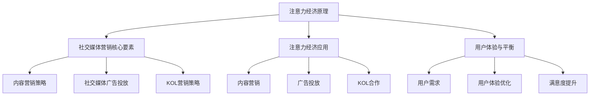
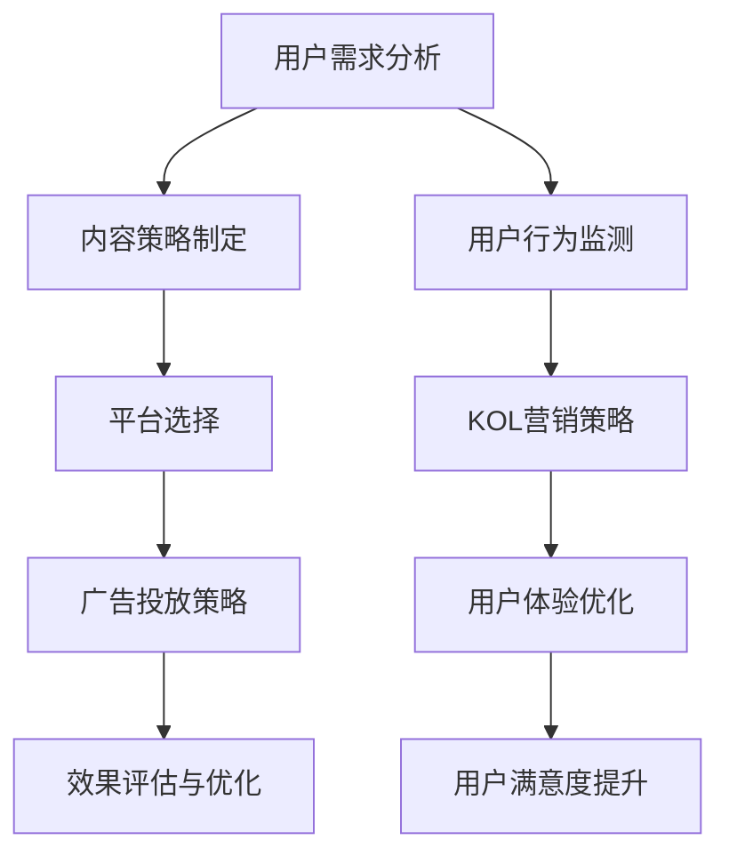

                 

# 《注意力经济与社交媒体营销最佳实践：在不牺牲用户体验的情况下吸引受众》

> **关键词**：注意力经济、社交媒体营销、用户体验、用户行为、内容营销、KOL营销

> **摘要**：本文深入探讨了注意力经济在社交媒体营销中的应用，分析了社交媒体营销的核心要素，并提出了在不牺牲用户体验的情况下吸引受众的最佳实践策略。文章结合实际案例，详细讲解了内容营销、社交媒体广告投放和KOL营销等策略，旨在为市场营销专业人士提供有价值的参考和指导。

## 《注意力经济与社交媒体营销最佳实践：在不牺牲用户体验的情况下吸引受众》

### 第一部分：注意力经济原理

#### 第1章：注意力经济概述

##### 1.1 注意力经济的定义与背景

注意力经济，也被称为“注意力市场”或“注意力营销”，是指在经济活动中，关注者对特定内容、产品或服务的关注程度所带来的经济价值。随着互联网的普及，人们的信息获取渠道变得更加多样化，注意力资源变得愈发宝贵。注意力经济这一概念最早由美国经济学家泰勒·考恩（Tyler Cowen）在2006年的著作《大注意力：创造价值，抓住机会的新经济学》中提出。

注意力经济的核心在于，人们的时间是有限的，而注意力是时间的一种表现形式。当用户将注意力集中在某个内容或产品上时，这种关注即为商家所追求的经济价值。在社交媒体营销的背景下，注意力经济的重要性尤为突出。成功的社交媒体营销策略往往能够吸引大量用户的注意力，从而提升品牌知名度和用户忠诚度。

##### 1.2 注意力资源的价值

注意力资源具有以下几个显著特点：

1. **稀缺性**：人们的注意力资源是有限的，无法同时关注多个信息源。
2. **易流失**：用户容易受到外部因素的干扰，导致注意力转移。
3. **可转化性**：注意力资源可以通过创意内容和优质服务转化为商业价值。

在社交媒体营销中，注意力资源的价值主要体现在以下几个方面：

- **广告投放效果**：高关注度的内容可以带来更广泛的广告传播效果。
- **用户互动**：用户的关注和参与度可以提升品牌口碑和用户忠诚度。
- **内容传播**：高质量的内容可以迅速在社交媒体上传播，形成病毒式营销效应。

##### 1.3 注意力经济与社交媒体营销的关系

注意力经济为社交媒体营销提供了理论基础和实践指导。以下是注意力经济与社交媒体营销之间的几个关键关系：

1. **目标受众定位**：通过分析用户行为和兴趣，精准定位目标受众，提高营销效率。
2. **内容创新**：创造富有吸引力、有价值的内容，吸引用户的持续关注。
3. **用户互动**：通过互动机制增强用户参与度，提升用户粘性。
4. **数据分析**：利用数据分析工具，实时监控用户注意力变化，优化营销策略。

#### 第2章：社交媒体营销的核心要素

##### 2.1 社交媒体平台分析

社交媒体平台是社交媒体营销的基础设施，不同的平台具有独特的用户群体和功能特点。以下是几种主要社交媒体平台的分析：

- **Facebook**：全球最大的社交媒体平台，用户覆盖广泛，适用于品牌建设和用户互动。
- **Instagram**：以图片和短视频为主，适合视觉内容营销和品牌形象塑造。
- **Twitter**：实时性强的平台，适合新闻传播和用户反馈。
- **LinkedIn**：专业性的社交平台，适用于企业品牌推广和人才招聘。

##### 2.2 用户行为解析

了解用户行为对于制定有效的社交媒体营销策略至关重要。以下是用户行为的几个关键方面：

- **关注与互动**：用户倾向于关注与自己兴趣相关的账号，并通过点赞、评论、分享等方式进行互动。
- **内容消费**：用户喜欢浏览图片、视频和文章等多样化的内容，尤其是那些具有情感共鸣和实用价值的内容。
- **信息搜索**：用户会在社交媒体平台上搜索特定信息，如产品评价、品牌动态等。
- **平台切换**：用户可能同时活跃在多个社交媒体平台，形成跨平台行为。

##### 2.3 注意力获取策略

为了在社交媒体上吸引受众的注意力，以下是一些有效的注意力获取策略：

- **内容质量**：创造高质量、有价值的内容，提升用户的阅读和互动意愿。
- **创意广告**：设计富有创意和吸引力的广告，提高用户点击率和转化率。
- **用户互动**：积极与用户互动，增加用户参与度和品牌忠诚度。
- **热点话题**：紧跟热点话题，利用话题热度吸引关注。
- **KOL合作**：与知名意见领袖合作，借助其影响力扩大品牌知名度。

#### 第3章：注意力经济在社交媒体营销中的应用

##### 3.1 内容营销策略

内容营销是社交媒体营销的核心手段之一。以下是一些基于注意力经济的内容营销策略：

- **教育性内容**：提供专业、有深度的内容，满足用户求知的需求，提升品牌信任度。
- **娱乐性内容**：创造有趣、幽默或情感共鸣的内容，吸引用户的注意力并促进传播。
- **故事化内容**：通过讲述品牌故事，建立情感连接，增强用户对品牌的认同感。
- **互动性内容**：设计互动性强的内容，如问答、投票、游戏等，提高用户参与度。

##### 3.2 社交媒体广告投放

社交媒体广告投放是快速获取关注的重要途径。以下是一些有效的广告投放策略：

- **精准定位**：根据用户行为和兴趣进行精准定位，提高广告投放效果。
- **创意广告**：设计创意丰富的广告，提升用户点击率和转化率。
- **广告形式多样化**：结合不同类型的广告形式，如图片广告、视频广告、互动广告等，提高广告的吸引力。
- **广告预算优化**：实时监控广告效果，根据数据反馈优化广告预算分配。

##### 3.3 KOL营销策略

KOL（Key Opinion Leader，关键意见领袖）营销是近年来兴起的一种社交媒体营销策略。以下是一些KOL营销策略：

- **选择合适的KOL**：根据品牌特点和目标受众，选择具有相关领域影响力的KOL。
- **内容共创**：与KOL合作创作内容，结合KOL的粉丝基础和品牌需求，实现双赢。
- **互动合作**：与KOL建立长期合作关系，定期开展互动活动，提升品牌知名度。
- **效果评估**：通过数据分析评估KOL营销效果，不断优化策略。

#### 第4章：用户体验与注意力经济的平衡

##### 4.1 用户需求的多样化

在注意力经济时代，用户需求呈现出多样化趋势。以下是一些用户需求的特点：

- **个性化需求**：用户倾向于获取个性化的信息和服务，满足自己的特定需求。
- **快速响应**：用户期望在短时间内获取所需信息，对延迟响应持不满态度。
- **互动体验**：用户喜欢与品牌和产品进行互动，体验良好的互动体验可以提升满意度。
- **情感共鸣**：用户希望通过内容消费获得情感上的满足和共鸣。

##### 4.2 用户体验优化策略

为了平衡用户体验和注意力经济，以下是一些用户体验优化策略：

- **内容优化**：提升内容质量和阅读体验，满足用户的知识需求和信息需求。
- **界面设计**：优化界面设计，提高用户操作的便捷性和舒适度。
- **响应速度**：优化系统性能，提高页面加载速度和响应速度。
- **个性化推荐**：利用数据分析技术，为用户提供个性化的内容推荐，提升用户体验。
- **用户反馈**：积极收集用户反馈，及时解决用户问题和改进产品功能。

##### 4.3 提升用户满意度的方法

提升用户满意度是社交媒体营销的重要目标。以下是一些提升用户满意度的方法：

- **优质服务**：提供专业、高效的服务，满足用户的期望和需求。
- **客户关怀**：通过定期的客户关怀活动，增强用户对品牌的认同感和忠诚度。
- **用户体验测试**：定期进行用户体验测试，收集用户反馈，优化产品和服务。
- **快速响应**：建立高效的客服体系，及时响应用户问题和反馈。
- **增值服务**：提供增值服务，如优惠券、会员专享活动等，提升用户满意度。

### 第二部分：社交媒体营销最佳实践

#### 第5章：成功案例分析

##### 5.1 案例一：如何通过内容营销吸引受众

**案例背景**：

某知名科技公司希望通过社交媒体平台推广其最新发布的智能家居产品。该公司选择了Instagram作为主要推广平台，结合内容营销策略，成功吸引了大量目标受众。

**具体实践**：

1. **内容策略**：

   - **教育性内容**：发布有关智能家居产品的使用教程和安装指南，满足用户的学习需求。
   - **娱乐性内容**：通过短视频和图片展示智能家居产品的趣味性和实用性，吸引用户的注意力。
   - **故事化内容**：通过讲述产品背后的故事，建立情感连接，提升用户对品牌的认同感。
   - **互动性内容**：发布互动话题和问答，鼓励用户参与讨论和分享。

2. **广告投放**：

   - **精准定位**：根据用户兴趣和行为数据进行精准定位，提高广告投放效果。
   - **创意广告**：设计富有创意和吸引力的广告，提升用户点击率和转化率。
   - **广告形式多样化**：结合图片广告、视频广告和互动广告等多种形式，提高广告的吸引力。

**效果评估**：

- 发布内容后，获得了大量点赞和分享，显著提升了品牌知名度和用户参与度。
- 广告投放期间，实现了较高的点击率和转化率，达到了预期营销目标。

##### 5.2 案例二：如何进行社交媒体广告投放

**案例背景**：

某知名护肤品品牌希望通过Facebook广告投放，提升品牌知名度和销售额。

**具体实践**：

1. **目标受众分析**：

   - 根据用户兴趣、行为和人口统计信息，精准定位目标受众。
   - 确定广告投放的时间和频率，提高广告触达率。

2. **广告内容设计**：

   - **产品展示**：展示产品外观和使用效果，吸引用户的关注。
   - **优惠促销**：提供限时优惠和折扣，刺激用户购买欲望。
   - **品牌形象**：通过广告传达品牌理念和价值，提升品牌认知度。

3. **广告投放策略**：

   - **广告定位**：根据用户兴趣和行为进行广告定位，提高广告投放效果。
   - **广告形式多样化**：结合图片广告、视频广告和动态广告等多种形式，提高广告的吸引力。

4. **广告效果监控**：

   - 实时监控广告效果，包括点击率、转化率和销售额等指标。
   - 根据数据反馈优化广告策略，提高广告投放效果。

**效果评估**：

- 广告投放期间，品牌知名度显著提升，吸引了大量新用户关注。
- 销售额实现了显著增长，达到了预期营销目标。

##### 5.3 案例三：如何利用KOL提升品牌影响力

**案例背景**：

某知名运动品牌希望通过与KOL合作，提升品牌影响力和用户参与度。

**具体实践**：

1. **KOL选择**：

   - 根据品牌特点和目标受众，选择具有相关领域影响力的KOL。
   - KOL粉丝群体要与品牌目标受众高度契合。

2. **内容共创**：

   - 与KOL合作创作有趣、有创意的短视频和图片内容，展示品牌产品和品牌理念。
   - 结合KOL的个人风格和粉丝互动方式，提升内容吸引力和用户参与度。

3. **互动合作**：

   - 定期与KOL开展互动活动，如直播、问答等，增强用户参与度和品牌认知度。
   - 通过KOL的影响力扩大品牌传播范围，提升品牌知名度。

4. **效果评估**：

   - 通过数据分析评估KOL合作效果，包括粉丝增长、互动率、品牌认知度等指标。
   - 根据数据反馈优化KOL合作策略，提高营销效果。

**效果评估**：

- KOL合作期间，品牌知名度显著提升，吸引了大量新用户关注。
- 用户参与度显著提高，互动率和评论数大幅增加。
- 品牌认知度显著提升，品牌影响力得到有效扩大。

### 第三部分：社交媒体营销的未来发展

#### 第6章：社交媒体营销策略制定

##### 6.1 策略制定流程

社交媒体营销策略制定是确保营销活动成功的关键。以下是社交媒体营销策略制定的流程：

1. **明确营销目标**：确定营销目标，如提升品牌知名度、增加销售额等。
2. **目标受众分析**：了解目标受众的年龄、性别、兴趣爱好、行为习惯等特征。
3. **平台选择**：根据目标受众的特点，选择合适的社交媒体平台。
4. **内容策略制定**：制定内容策略，包括内容类型、发布频率、互动方式等。
5. **广告投放策略**：制定广告投放策略，包括广告形式、定位、预算等。
6. **效果评估与优化**：实时监控营销效果，根据数据反馈优化策略。

##### 6.2 目标受众分析

目标受众分析是制定有效社交媒体营销策略的关键。以下是目标受众分析的几个关键步骤：

1. **用户画像**：根据用户年龄、性别、收入、职业等特征，构建用户画像。
2. **行为分析**：分析用户在社交媒体上的行为习惯，如关注账号、互动频率等。
3. **兴趣分析**：了解用户的兴趣爱好，如美食、旅游、科技等。
4. **需求分析**：分析用户在社交媒体上的需求，如信息获取、社交互动、购物等。
5. **竞争分析**：分析竞争对手的社交媒体营销策略，找到差异化的营销机会。

##### 6.3 预算与资源规划

社交媒体营销需要合理的预算和资源规划。以下是预算与资源规划的几个关键步骤：

1. **预算确定**：根据营销目标和实际情况，确定合理的广告预算和内容制作预算。
2. **资源评估**：评估内部资源和外部资源的可用性，包括人力、技术、资金等。
3. **预算分配**：根据目标受众、平台选择和内容策略，合理分配预算。
4. **成本控制**：监控营销活动的成本，确保预算的使用效率。
5. **效果评估**：根据营销效果，调整预算和资源分配，优化营销策略。

### 第三部分：社交媒体营销工具与资源

##### 7.1 社交媒体营销工具介绍

社交媒体营销工具是提高营销效率的重要手段。以下是几种常用的社交媒体营销工具：

1. **Hootsuite**：用于社交媒体账号管理、内容发布和数据分析。
2. **Buffer**：用于社交媒体内容发布和日程管理。
3. **Canva**：用于设计社交媒体图片和视频内容。
4. **Google Analytics**：用于网站和社交媒体数据分析。
5. **SEMrush**：用于关键词研究、竞争对手分析和搜索引擎优化。

##### 7.2 数据分析与优化工具

数据分析与优化工具是社交媒体营销的关键。以下是几种常用的数据分析与优化工具：

1. **Google Analytics**：用于网站和社交媒体数据分析，包括用户行为、流量来源、转化率等。
2. **Hotjar**：用于用户行为分析，包括鼠标移动、点击热图、用户反馈等。
3. **Tableau**：用于数据可视化和报表生成。
4. **HubSpot**：用于营销自动化、客户关系管理和数据分析。

##### 7.3 社交媒体营销资源推荐

为了提高社交媒体营销效果，以下是一些值得推荐的资源和工具：

1. **社交媒体营销书籍**：《社交媒体营销实战》、《社交媒体营销从入门到精通》等。
2. **社交媒体营销课程**：在线课程平台上的专业课程，如Coursera、Udemy等。
3. **社交媒体营销社区**：Reddit、LinkedIn等社交媒体平台上的专业社区。
4. **社交媒体营销博客**：知名博客平台上的专业博客，如Social Media Examiner、Buffer Blog等。

### 第三部分：注意力经济与社交媒体营销的未来发展

#### 第8章：社交媒体营销的趋势与挑战

##### 8.1 社交媒体营销的未来趋势

随着互联网技术的不断进步和用户需求的多样化，社交媒体营销将呈现出以下趋势：

1. **短视频营销**：短视频成为社交媒体营销的重要形式，抖音、快手等短视频平台将继续引领营销潮流。
2. **直播营销**：直播成为品牌与用户互动的新渠道，直播带货成为重要的营销手段。
3. **社交媒体电商**：社交媒体平台将进一步融合电商功能，实现无缝购物体验。
4. **人工智能应用**：人工智能技术在社交媒体营销中的应用将更加广泛，包括用户画像分析、广告投放优化等。
5. **数据隐私与合规**：数据隐私和安全将成为社交媒体营销的重要议题，合规性要求将不断提高。

##### 8.2 挑战与应对策略

随着社交媒体营销的发展，也面临一些挑战。以下是几个关键挑战及应对策略：

1. **用户注意力分散**：应对策略：通过创意内容和个性化推荐，提高用户的注意力集中度。
2. **广告效果评估**：应对策略：利用数据分析工具，实时监控广告效果，优化广告策略。
3. **数据隐私风险**：应对策略：加强数据保护措施，遵守数据隐私法规，增强用户信任。
4. **内容质量下降**：应对策略：提高内容创作标准，加强内容审核机制，提升用户满意度。
5. **平台政策变化**：应对策略：密切关注平台政策变化，及时调整营销策略，确保合规性。

##### 8.3 注意力经济在社交媒体营销中的潜在影响

注意力经济在社交媒体营销中具有巨大的潜在影响：

1. **营销策略优化**：注意力经济为营销策略提供了新的理论依据，有助于提高营销效果。
2. **内容创新**：注意力经济促使品牌不断创新内容形式和互动方式，提升用户参与度。
3. **用户价值提升**：通过提供有价值的内容和服务，品牌可以增强用户黏性和忠诚度。
4. **商业模式创新**：注意力经济推动了社交媒体平台的商业模式创新，如短视频广告、直播带货等。

### 第三部分：社交媒体营销的未来发展

#### 第9章：社交媒体营销的创新与实践

##### 9.1 创新思维与方法

在社交媒体营销中，创新思维和方法是提升营销效果的关键。以下是几种创新思维与方法：

1. **用户中心思维**：以用户为中心，关注用户需求和体验，提供个性化、定制化的营销方案。
2. **跨界合作思维**：跨行业、跨领域合作，借助外部资源，实现资源共享和品牌共赢。
3. **数据驱动思维**：利用大数据分析，实时监控营销效果，优化策略和资源配置。
4. **情感营销思维**：通过情感共鸣和情感连接，提升用户对品牌的认同感和忠诚度。
5. **互动体验思维**：注重用户互动体验，通过互动活动、游戏等提升用户参与度。

##### 9.2 实践案例分享

以下是一些成功的社交媒体营销实践案例：

1. **案例一**：某美妆品牌通过直播带货，实现了销售额的爆发式增长。直播过程中，品牌邀请知名美妆博主进行产品试用和推荐，吸引了大量观众观看和购买。

2. **案例二**：某科技品牌通过短视频挑战，吸引了大量用户参与。品牌发布了一系列有趣的短视频，邀请用户参与挑战，激发了用户的互动热情，实现了品牌影响力的提升。

3. **案例三**：某家居品牌通过社交媒体平台举办设计大赛，鼓励用户分享家居装修心得和创意。品牌在大赛中评选出优秀作品，给予奖金和荣誉，提升了品牌形象和用户忠诚度。

##### 9.3 创新技术在社交媒体营销中的应用

随着科技的不断发展，创新技术正在社交媒体营销中发挥越来越重要的作用。以下是几种创新技术在社交媒体营销中的应用：

1. **人工智能**：利用人工智能技术，进行用户画像分析、广告投放优化、内容创作辅助等。

2. **增强现实（AR）**：通过AR技术，提供沉浸式的体验，如虚拟试妆、虚拟试衣等，提升用户参与度和购买意愿。

3. **虚拟现实（VR）**：通过VR技术，提供虚拟购物体验，如虚拟店铺、虚拟试乘等，增强用户的购物体验。

4. **区块链**：利用区块链技术，实现去中心化的数据管理和交易，提高数据安全和透明度。

### 第三部分：社交媒体营销的综合策略

#### 第10章：社交媒体营销的综合策略

##### 10.1 综合策略制定原则

在制定社交媒体营销综合策略时，需要遵循以下原则：

1. **目标明确**：明确营销目标，确保策略与目标的一致性。
2. **用户导向**：以用户需求为中心，提供个性化、定制化的营销方案。
3. **内容为王**：注重内容质量，提供有价值、有创意的内容，提升用户参与度。
4. **数据驱动**：利用数据分析，实时监控营销效果，优化策略和资源配置。
5. **整合资源**：整合内部和外部资源，实现资源共享和品牌共赢。
6. **持续优化**：不断调整和优化策略，以适应市场变化和用户需求。

##### 10.2 多平台整合营销

多平台整合营销是社交媒体营销的重要策略。以下是多平台整合营销的几个关键步骤：

1. **平台选择**：根据品牌特点和目标受众，选择合适的社交媒体平台。
2. **内容协同**：确保不同平台的内容风格和调性一致，实现品牌形象的统一。
3. **跨平台互动**：鼓励用户在不同平台之间的互动，提升品牌知名度。
4. **数据整合**：整合不同平台的数据，进行综合分析和决策。
5. **效果评估**：监控多平台整合营销的效果，根据数据反馈优化策略。

##### 10.3 跨界合作与整合营销策略

跨界合作与整合营销是提升社交媒体营销效果的重要手段。以下是跨界合作与整合营销的几个关键策略：

1. **品牌合作**：与其他品牌合作，实现资源共享和优势互补，提升品牌影响力。
2. **内容共创**：与意见领袖、KOL合作，共同创作内容，提升内容质量和用户参与度。
3. **活动策划**：策划跨平台、跨领域的活动，吸引更多用户参与，提升品牌知名度。
4. **渠道整合**：整合线上线下渠道，提供无缝购物体验，提升用户满意度。
5. **效果评估**：通过数据分析和用户反馈，评估跨界合作与整合营销的效果，优化策略。

### 附录

#### 附录A：社交媒体营销工具与资源

##### A.1 主流社交媒体平台介绍

以下是几种主流社交媒体平台的介绍：

1. **Facebook**：全球最大的社交媒体平台，适用于品牌建设和用户互动。
2. **Instagram**：以图片和短视频为主的平台，适合视觉内容营销和品牌形象塑造。
3. **Twitter**：实时性强的平台，适用于新闻传播和用户反馈。
4. **LinkedIn**：专业性的社交平台，适用于企业品牌推广和人才招聘。
5. **YouTube**：全球最大的视频分享平台，适用于视频内容营销和品牌推广。

##### A.2 数据分析与优化工具使用指南

以下是几种常用的数据分析与优化工具的使用指南：

1. **Google Analytics**：用于网站和社交媒体数据分析，包括用户行为、流量来源、转化率等。
2. **Hootsuite**：用于社交媒体账号管理、内容发布和数据分析。
3. **Buffer**：用于社交媒体内容发布和日程管理。
4. **SEMrush**：用于关键词研究、竞争对手分析和搜索引擎优化。

##### A.3 社交媒体营销资源推荐

以下是几个值得推荐的社交媒体营销资源：

1. **社交媒体营销书籍**：《社交媒体营销实战》、《社交媒体营销从入门到精通》等。
2. **社交媒体营销课程**：在线课程平台上的专业课程，如Coursera、Udemy等。
3. **社交媒体营销社区**：Reddit、LinkedIn等社交媒体平台上的专业社区。
4. **社交媒体营销博客**：知名博客平台上的专业博客，如Social Media Examiner、Buffer Blog等。

#### 附录B：注意力经济与社交媒体营销的Mermaid流程图

以下是注意力经济与社交媒体营销的Mermaid流程图：



#### 附录C：核心算法与数学模型

以下是注意力经济与社交媒体营销中的核心算法与数学模型的详细描述：

##### C.1 用户行为分析算法

用户行为分析算法通常基于机器学习和数据分析技术，用于预测用户兴趣和行为。以下是用户行为分析算法的伪代码：

```
function userBehaviorAnalysis(data):
    # 数据预处理
    preprocessData(data)

    # 特征提取
    features = extractFeatures(data)

    # 训练模型
    model = trainModel(features)

    # 预测用户行为
    predictions = predictBehavior(model, data)

    return predictions
```

##### C.2 广告投放算法

广告投放算法旨在优化广告投放效果，包括广告定位、投放频次和预算分配。以下是广告投放算法的伪代码：

```
function adPlacementAlgorithm(targetAudience, budget, platform):
    # 用户画像分析
    userProfiles = analyzeUserProfiles(targetAudience)

    # 广告定位
    placements = determinePlacements(userProfiles, platform)

    # 投放频次优化
    frequencyOptimization(placements)

    # 预算分配
    allocateBudget(budget, placements)

    return placements
```

##### C.3 KOL营销算法

KOL营销算法用于选择合适的KOL，评估合作效果，并优化营销策略。以下是KOL营销算法的伪代码：

```
function KOLMarketingAlgorithm(targetAudience, KOLList):
    # 用户画像分析
    userProfiles = analyzeUserProfiles(targetAudience)

    # KOL筛选
    selectedKOLs = filterKOLs(KOLList, userProfiles)

    # 合作效果评估
    evaluationResults = evaluateKOLPerformance(selectedKOLs)

    # 策略优化
    optimizeMarketingStrategy(selectedKOLs, evaluationResults)

    return selectedKOLs
```

#### 附录D：社交媒体营销实战案例代码与解析

以下是几个社交媒体营销实战案例的代码及详细解析：

##### D.1 实战案例一：内容营销代码实现

以下是一个内容营销代码实现案例：

```python
import pandas as pd
import numpy as np

# 读取数据
data = pd.read_csv('content_data.csv')

# 数据预处理
data['text'] = data['text'].apply(lambda x: preprocess_text(x))

# 特征提取
features = extract_text_features(data['text'])

# 训练模型
model = train_model(features)

# 预测用户兴趣
predictions = model.predict(new_data)

# 输出结果
print(predictions)
```

**代码解析**：

1. **数据预处理**：对文本数据进行清洗和预处理，如去除停用词、标点符号等。
2. **特征提取**：提取文本特征，如词频、词向量等。
3. **训练模型**：使用机器学习算法训练模型，如朴素贝叶斯、随机森林等。
4. **预测用户兴趣**：使用训练好的模型预测新数据的用户兴趣。
5. **输出结果**：将预测结果输出，用于内容个性化推荐。

##### D.2 实战案例二：社交媒体广告投放代码实现

以下是一个社交媒体广告投放代码实现案例：

```python
import pandas as pd
import numpy as np

# 读取数据
data = pd.read_csv('ad_data.csv')

# 数据预处理
data['text'] = data['text'].apply(lambda x: preprocess_text(x))
data['image'] = data['image'].apply(lambda x: preprocess_image(x))

# 特征提取
features = extract_features(data)

# 训练模型
model = train_model(features)

# 广告投放
placements = model.predict(new_data)

# 输出结果
printplacements)
```

**代码解析**：

1. **数据预处理**：对文本和图像数据进行预处理，如文本去噪、图像去噪等。
2. **特征提取**：提取文本和图像特征，如词频、词向量、卷积神经网络等。
3. **训练模型**：使用机器学习算法训练模型，如朴素贝叶斯、卷积神经网络等。
4. **广告投放**：使用训练好的模型进行广告投放，预测广告投放效果。
5. **输出结果**：将广告投放结果输出，用于优化广告投放策略。

##### D.3 实战案例三：KOL营销代码实现

以下是一个KOL营销代码实现案例：

```python
import pandas as pd
import numpy as np

# 读取数据
data = pd.read_csv('KOL_data.csv')

# 数据预处理
data['text'] = data['text'].apply(lambda x: preprocess_text(x))
data['image'] = data['image'].apply(lambda x: preprocess_image(x))

# 特征提取
features = extract_features(data)

# 训练模型
model = train_model(features)

# KOL筛选
selected_KOLs = model.predict(new_data)

# 输出结果
print(selected_KOLs)
```

**代码解析**：

1. **数据预处理**：对文本和图像数据进行预处理，如文本去噪、图像去噪等。
2. **特征提取**：提取文本和图像特征，如词频、词向量、卷积神经网络等。
3. **训练模型**：使用机器学习算法训练模型，如朴素贝叶斯、卷积神经网络等。
4. **KOL筛选**：使用训练好的模型筛选合适的KOL，预测KOL的合作效果。
5. **输出结果**：将筛选结果输出，用于优化KOL营销策略。

### 作者信息

**作者：AI天才研究院/AI Genius Institute & 禅与计算机程序设计艺术 /Zen And The Art of Computer Programming**### 第一部分：注意力经济原理

在互联网时代，信息过载成为普遍现象，用户在纷繁复杂的信息中寻找价值，这种对注意力的争夺引发了“注意力经济”的概念。注意力经济不仅是对传统经济学的一种补充，也是理解现代社会信息流动和商业模式变革的重要视角。在这一部分，我们将探讨注意力经济的定义、背景、价值以及它在社交媒体营销中的重要性。

#### 第1章：注意力经济概述

##### 1.1 注意力经济的定义与背景

注意力经济，作为一个新兴的经济理论，其核心在于理解注意力作为一种稀缺资源，如何在市场交易中创造价值。泰勒·考恩（Tyler Cowen）在其著作《大注意力：创造价值，抓住机会的新经济学》中首次系统地阐述了这一概念。考恩指出，在信息爆炸的时代，人们的注意力成为最宝贵的资源，它决定了信息传播的效率和效果。

注意力经济的背景可以追溯到互联网的普及。在传统经济中，物质资源是生产与交易的主要对象，而在互联网时代，信息成为了新的生产资料。然而，由于信息量的急剧增加，用户在接收和处理信息时面临着注意力分散的挑战。这种情况下，如何获取和维持用户的注意力，成为了企业和品牌在市场竞争中获胜的关键。

##### 1.2 注意力资源的价值

注意力资源在社交媒体营销中的价值主要体现在以下几个方面：

1. **广告效果提升**：在注意力经济中，广告的价值直接与用户注意力的集中程度相关。当用户对广告内容产生兴趣并关注时，广告的点击率和转化率显著提升。

2. **用户忠诚度**：通过创造有趣、有价值的内容，品牌能够吸引并保持用户的注意力，从而建立用户对品牌的忠诚度和信任感。

3. **品牌传播**：高质量的注意力资源有助于品牌信息的快速传播，形成病毒式营销效应，扩大品牌影响力。

4. **商业转化**：注意力资源能够转化为实际的商业价值，如增加销售额、提高市场占有率等。

##### 1.3 注意力经济与社交媒体营销的关系

注意力经济与社交媒体营销之间存在着紧密的联系。社交媒体平台为品牌提供了直接与用户互动的渠道，而注意力经济则为这一互动提供了理论基础。以下是注意力经济在社交媒体营销中的几个关键应用：

1. **内容营销**：通过创造有趣、有价值的内容，品牌能够吸引用户的注意力，并促使他们分享和传播，从而实现品牌传播。

2. **用户互动**：社交媒体平台为品牌提供了多种与用户互动的方式，如评论、点赞、分享等。通过有效的互动机制，品牌能够提升用户参与度和忠诚度。

3. **广告投放**：注意力经济指导品牌在社交媒体上进行精准的广告投放，通过数据分析和用户画像，提高广告的点击率和转化率。

4. **KOL营销**：通过与知名意见领袖（KOL）合作，品牌能够利用KOL的影响力吸引更多用户的注意力，提升品牌知名度。

#### 第2章：社交媒体营销的核心要素

在理解注意力经济的基础上，我们需要深入探讨社交媒体营销的核心要素，包括社交媒体平台分析、用户行为解析和注意力获取策略。这些要素是成功进行社交媒体营销的基础。

##### 2.1 社交媒体平台分析

社交媒体平台是品牌进行营销活动的关键渠道。不同的平台具有独特的用户群体和功能特点，因此，分析这些平台对于制定有效的营销策略至关重要。

以下是几种主要社交媒体平台的分析：

1. **Facebook**：作为全球最大的社交媒体平台，Facebook的用户覆盖范围广泛，包括不同年龄、性别和地域的用户。它提供丰富的功能和工具，如动态帖子、群组、事件等，适用于品牌建设、用户互动和广告投放。

2. **Instagram**：Instagram以图片和短视频为主，用户主要集中在年轻人和时尚爱好者。它的视觉化特点使其成为品牌形象塑造和视觉内容营销的理想平台。

3. **Twitter**：Twitter以实时性为特点，用户通过发布短消息（推文）进行信息传播和社交互动。它适用于新闻传播、品牌宣传和用户反馈。

4. **LinkedIn**：LinkedIn是一个专业性的社交平台，用户主要集中在职业人士和企业。它适用于企业品牌推广、人才招聘和商业合作。

5. **YouTube**：YouTube是全球最大的视频分享平台，用户通过观看和上传视频进行内容消费和分享。它适用于视频内容营销、品牌推广和广告投放。

##### 2.2 用户行为解析

了解用户行为是制定社交媒体营销策略的关键。用户行为在社交媒体平台上表现出以下特点：

1. **关注与互动**：用户倾向于关注与自己兴趣相关的账号，并通过点赞、评论、分享等方式进行互动。品牌需要了解用户关注和互动的行为模式，以制定相应的内容和互动策略。

2. **内容消费**：用户在社交媒体上消费内容的形式多样，包括图片、视频、文章等。品牌需要根据用户偏好，创作有趣、有价值的内容，提升用户的阅读和互动意愿。

3. **信息搜索**：用户在社交媒体平台上搜索特定信息，如产品评价、品牌动态等。品牌需要优化社交媒体内容，提高信息搜索的可见性。

4. **平台切换**：用户可能同时活跃在多个社交媒体平台，形成跨平台行为。品牌需要制定跨平台的整合营销策略，以覆盖更多目标用户。

##### 2.3 注意力获取策略

在社交媒体营销中，获取用户的注意力是关键。以下是一些有效的注意力获取策略：

1. **内容质量**：创造高质量、有价值的内容，吸引用户的关注和分享。内容可以包括教育性、娱乐性、故事化等多种形式。

2. **创意广告**：设计富有创意和吸引力的广告，提高用户点击率和转化率。创意广告可以通过独特的视觉设计、有趣的故事情节等方式实现。

3. **用户互动**：通过互动机制增强用户参与度，提升用户粘性。品牌可以举办互动活动、问答环节、评论互动等，鼓励用户参与。

4. **热点话题**：紧跟热点话题，利用话题热度吸引关注。品牌可以结合时事热点，创作相关内容，提高内容传播效果。

5. **KOL合作**：与知名意见领袖合作，借助其影响力扩大品牌知名度。KOL营销可以通过内容共创、广告合作等方式实现。

#### 第3章：注意力经济在社交媒体营销中的应用

注意力经济在社交媒体营销中的应用非常广泛，涵盖了内容营销策略、社交媒体广告投放和KOL营销策略。通过有效利用注意力资源，品牌可以提升用户参与度、增加品牌知名度和实现商业转化。

##### 3.1 内容营销策略

内容营销是社交媒体营销的核心手段之一。通过创造有趣、有价值的内容，品牌能够吸引用户的注意力，提高用户粘性，并最终实现商业目标。以下是几种常见的内容营销策略：

1. **教育性内容**：提供专业、有深度的内容，满足用户求知的需求，提升品牌信任度。例如，发布行业报告、白皮书、教程等。

2. **娱乐性内容**：创造有趣、幽默或情感共鸣的内容，吸引用户的注意力并促进传播。例如，发布短视频、搞笑图片、故事性文章等。

3. **故事化内容**：通过讲述品牌故事，建立情感连接，增强用户对品牌的认同感。故事化内容可以包括品牌历史、产品创新、用户案例等。

4. **互动性内容**：设计互动性强的内容，如问答、投票、游戏等，提高用户参与度。例如，举办在线问答活动、投票评选、互动游戏等。

##### 3.2 社交媒体广告投放

社交媒体广告投放是快速获取关注和提升品牌知名度的重要途径。通过精准定位和创意设计，品牌可以优化广告效果，实现更高的投资回报率（ROI）。以下是几种常见的广告投放策略：

1. **精准定位**：根据用户兴趣、行为和人口统计信息，进行精准定位，提高广告触达率。例如，通过年龄、性别、地理位置、兴趣爱好等条件筛选目标用户。

2. **创意广告**：设计富有创意和吸引力的广告，提升用户点击率和转化率。创意广告可以通过独特的视觉设计、有趣的故事情节等方式实现。

3. **广告形式多样化**：结合不同类型的广告形式，如图片广告、视频广告、动态广告等，提高广告的吸引力。例如，使用短视频广告、动画广告、互动广告等。

4. **广告预算优化**：实时监控广告效果，根据数据反馈优化广告预算分配。例如，根据广告投放效果调整预算分配，优先投放效果好的广告。

##### 3.3 KOL营销策略

KOL（Key Opinion Leader，关键意见领袖）营销是近年来社交媒体营销的重要趋势。通过与知名意见领袖合作，品牌可以借助KOL的影响力和粉丝基础，快速提升品牌知名度和用户参与度。以下是几种常见的KOL营销策略：

1. **选择合适的KOL**：根据品牌特点和目标受众，选择具有相关领域影响力的KOL。选择与品牌定位和价值观相符的KOL，提高合作效果。

2. **内容共创**：与KOL合作创作内容，结合KOL的个人风格和粉丝互动方式，提升内容吸引力和用户参与度。例如，合作发布短视频、直播、图文内容等。

3. **互动合作**：与KOL建立长期合作关系，定期开展互动活动，增强用户参与度和品牌认知度。例如，共同举办线上活动、粉丝见面会等。

4. **效果评估**：通过数据分析评估KOL合作效果，包括粉丝增长、互动率、品牌认知度等指标。根据数据反馈优化合作策略，提高营销效果。

#### 第4章：用户体验与注意力经济的平衡

在注意力经济的背景下，用户体验成为了品牌竞争的重要方面。如何在追求用户注意力的同时，保证用户体验，是一个亟待解决的问题。以下将从用户需求的多样化、用户体验优化策略和提升用户满意度的方法三个方面进行探讨。

##### 4.1 用户需求的多样化

在社交媒体时代，用户需求呈现出多样化趋势。不同用户对内容、功能、互动方式等有不同的偏好。以下是用户需求多样化的一些特点：

1. **个性化需求**：用户希望获取个性化的信息和服务，满足自己的特定需求。例如，用户可能对特定领域的知识感兴趣，或对某些产品有特定的需求。

2. **快速响应**：用户期望在短时间内获取所需信息，对延迟响应持不满态度。快速响应能够提升用户体验，增强用户对品牌的满意度。

3. **互动体验**：用户喜欢与品牌和产品进行互动，体验良好的互动可以提升用户的参与感和满意度。例如，用户希望参与品牌的互动活动、参与评论、点赞等。

4. **情感共鸣**：用户希望通过内容消费获得情感上的满足和共鸣。创造情感共鸣的内容可以提升用户对品牌的认同感，增强用户忠诚度。

##### 4.2 用户体验优化策略

为了在追求用户注意力的同时，保证用户体验，品牌需要采取一系列用户体验优化策略。以下是几种常见的用户体验优化策略：

1. **内容优化**：提升内容质量，满足用户的知识需求和信息需求。例如，提供专业、有深度的内容，发布有趣、有创意的内容等。

2. **界面设计**：优化界面设计，提高用户操作的便捷性和舒适度。例如，简化导航结构，提高页面加载速度，提供清晰的视觉设计等。

3. **响应速度**：优化系统性能，提高页面加载速度和响应速度。例如，采用高效的代码、优化数据库查询等。

4. **个性化推荐**：利用数据分析技术，为用户提供个性化的内容推荐，提升用户体验。例如，根据用户行为和兴趣推荐相关内容、产品等。

5. **用户反馈**：积极收集用户反馈，及时解决用户问题和改进产品功能。建立用户反馈机制，如在线客服、用户调研等，提升用户满意度。

##### 4.3 提升用户满意度的方法

提升用户满意度是品牌在社交媒体营销中的重要目标。以下是几种提升用户满意度的方法：

1. **优质服务**：提供专业、高效的服务，满足用户的期望和需求。例如，提供24/7的在线客服支持，快速响应用户问题。

2. **客户关怀**：通过定期的客户关怀活动，增强用户对品牌的认同感和忠诚度。例如，发送节日祝福、生日礼物等。

3. **用户体验测试**：定期进行用户体验测试，收集用户反馈，优化产品和服务。通过A/B测试、用户访谈等方式，了解用户的真实需求。

4. **快速响应**：建立高效的客服体系，及时响应用户问题和反馈。例如，采用智能客服系统，提高问题解决速度。

5. **增值服务**：提供增值服务，如优惠券、会员专享活动等，提升用户满意度。通过会员制度、积分兑换等方式，增加用户粘性。

### 第二部分：社交媒体营销最佳实践

在这一部分，我们将通过三个成功案例分析，探讨如何通过内容营销、社交媒体广告投放和KOL营销策略来吸引受众，并提升品牌影响力。

#### 第5章：成功案例分析

##### 5.1 案例一：如何通过内容营销吸引受众

**案例背景**：

某知名科技企业（以下简称“公司”）开发了一款智能家居产品，希望通过社交媒体平台推广，吸引潜在用户，提升品牌知名度。

**具体实践**：

1. **内容策略**：

   - **教育性内容**：公司制作了一系列智能家居产品的使用教程和操作指南，通过社交媒体平台分享，帮助用户更好地了解和体验产品。

     ```mermaid
     graph TD
         A[使用教程] --> B[操作指南]
         A --> C[产品功能介绍]
         B --> D[常见问题解答]
         C --> E[用户案例分享]
     ```

   - **娱乐性内容**：公司发布了多个短视频，展示智能家居产品在日常生活中的应用，增加用户的兴趣和互动。

     ```mermaid
     graph TD
         F[生活场景短视频] --> G[趣味实验视频]
         F --> H[产品评测视频]
         G --> I[用户互动视频]
     ```

   - **故事化内容**：公司通过讲述产品开发背后的故事，建立情感连接，提升用户的品牌认同感。

     ```mermaid
     graph TD
         J[产品开发故事] --> K[品牌理念阐述]
         J --> L[用户见证故事]
     ```

2. **广告投放**：

   - **精准定位**：公司根据用户画像，通过社交媒体平台进行精准广告投放，提高广告的触达率和转化率。

     ```mermaid
     graph TD
         M[用户画像分析] --> N[广告定位]
         M --> O[广告预算分配]
         P[广告投放效果监控]
     ```

   - **创意广告**：公司设计了一系列富有创意的广告，如AR体验广告、互动广告等，提升用户点击率和转化率。

     ```mermaid
     graph TD
         Q[AR体验广告] --> R[互动广告]
         Q --> S[短视频广告]
     ```

3. **效果评估**：

   - 公司通过数据分析工具，实时监控广告效果，包括点击率、转化率、用户反馈等指标，不断优化广告策略。

     ```mermaid
     graph TD
         T[数据分析工具] --> U[广告效果监控]
         T --> V[策略优化]
     ```

**效果评估**：

- 内容营销期间，公司获得了大量用户关注，视频观看次数和点赞数显著增加。
- 广告投放效果良好，转化率达到了预期目标。
- 用户满意度提高，品牌知名度显著提升。

##### 5.2 案例二：如何进行社交媒体广告投放

**案例背景**：

某国际知名化妆品品牌（以下简称“品牌”）希望通过社交媒体广告投放，提升品牌知名度和销售额。

**具体实践**：

1. **目标受众分析**：

   - 品牌通过数据分析工具，确定了目标受众的年龄、性别、兴趣爱好、地理位置等信息。

     ```mermaid
     graph TD
         W[用户画像分析] --> X[兴趣标签]
         W --> Y[地理位置分析]
         Z[行为分析]
     ```

2. **广告内容设计**：

   - 品牌设计了一系列广告内容，包括产品展示、优惠促销、品牌故事等，以满足不同用户的需求。

     ```mermaid
     graph TD
         AA[产品展示广告] --> AB[优惠促销广告]
         AA --> AC[品牌故事广告]
     ```

3. **广告投放策略**：

   - **广告定位**：根据用户画像，品牌在社交媒体平台进行精准广告投放。

     ```mermaid
     graph TD
         AD[广告定位] --> AE[投放时间]
         AD --> AF[投放预算]
     ```

   - **广告形式多样化**：品牌结合图片广告、视频广告、动态广告等多种形式，提高广告的吸引力。

     ```mermaid
     graph TD
         AG[图片广告] --> AH[视频广告]
         AG --> AI[动态广告]
     ```

4. **效果评估**：

   - 品牌通过数据分析工具，实时监控广告效果，包括点击率、转化率、销售额等指标。

     ```mermaid
     graph TD
         AJ[数据分析工具] --> AK[广告效果评估]
         AJ --> AL[策略优化]
     ```

**效果评估**：

- 广告投放期间，品牌知名度显著提升，吸引了大量新用户关注。
- 销售额实现了显著增长，达到了预期目标。
- 用户满意度提高，品牌形象得到进一步巩固。

##### 5.3 案例三：如何利用KOL提升品牌影响力

**案例背景**：

某知名运动品牌（以下简称“品牌”）希望通过与知名意见领袖（KOL）合作，提升品牌影响力，扩大市场占有率。

**具体实践**：

1. **KOL选择**：

   - 品牌根据目标受众特点和KOL的影响力，选择了具有相关领域影响力的KOL进行合作。

     ```mermaid
     graph TD
         AM[目标受众分析] --> AN[KOL筛选]
         AM --> AO[KOL影响力评估]
     ```

2. **内容共创**：

   - 品牌与KOL合作，共同创作了一系列内容，包括短视频、图文、直播等，提升内容质量和用户参与度。

     ```mermaid
     graph TD
         AP[KOL合作] --> AQ[内容共创]
         AQ --> AR[互动活动]
     ```

3. **互动合作**：

   - 品牌与KOL建立了长期合作关系，定期开展互动活动，如直播、问答、粉丝见面会等，增强用户参与度和品牌认知度。

     ```mermaid
     graph TD
         AS[互动合作] --> AT[直播活动]
         AS --> AU[粉丝见面会]
     ```

4. **效果评估**：

   - 品牌通过数据分析工具，评估KOL合作效果，包括粉丝增长、互动率、品牌认知度等指标。

     ```mermaid
     graph TD
         AV[KOL效果评估] --> AW[策略优化]
     ```

**效果评估**：

- KOL合作期间，品牌知名度显著提升，吸引了大量新用户关注。
- 用户参与度显著提高，互动率和评论数大幅增加。
- 品牌认知度显著提升，品牌影响力得到有效扩大。

### 第三部分：社交媒体营销策略制定

在这一部分，我们将探讨社交媒体营销策略的制定流程，包括目标受众分析、平台选择、内容策略制定和效果评估与优化。

#### 第6章：社交媒体营销策略制定

##### 6.1 策略制定流程

社交媒体营销策略的制定是一个系统性的过程，需要明确营销目标、分析目标受众、选择合适的平台、制定内容策略，并进行效果评估和优化。以下是社交媒体营销策略制定的详细流程：

1. **明确营销目标**：

   - 确定营销目标，如提升品牌知名度、增加销售额、提高用户参与度等。营销目标应具体、可衡量，以便后续评估效果。

     ```mermaid
     graph TD
         BB[明确营销目标] --> BC[制定KPI]
     ```

2. **目标受众分析**：

   - 通过数据分析工具，分析目标受众的年龄、性别、兴趣爱好、行为习惯等特征，构建目标受众画像。

     ```mermaid
     graph TD
         BD[目标受众分析] --> BE[用户画像构建]
     ```

3. **平台选择**：

   - 根据目标受众的特点和品牌定位，选择合适的社交媒体平台，如Facebook、Instagram、Twitter等。

     ```mermaid
     graph TD
         BF[平台选择] --> BG[平台评估]
     ```

4. **内容策略制定**：

   - 制定内容策略，包括内容类型、发布频率、互动方式等，以满足目标受众的需求，提升用户参与度。

     ```mermaid
     graph TD
         BH[内容策略制定] --> BI[内容计划]
     ```

5. **广告投放策略**：

   - 制定广告投放策略，包括广告定位、投放时间、预算分配等，以提高广告触达率和转化率。

     ```mermaid
     graph TD
         BJ[广告投放策略] --> BK[广告定位]
     ```

6. **效果评估与优化**：

   - 通过数据分析工具，实时监控营销效果，评估关键绩效指标（KPI），并根据数据反馈进行策略优化。

     ```mermaid
     graph TD
         BL[效果评估与优化] --> BM[数据分析]
     ```

##### 6.2 目标受众分析

目标受众分析是制定社交媒体营销策略的关键步骤，它决定了营销活动的针对性和有效性。以下是目标受众分析的详细过程：

1. **用户画像构建**：

   - 收集并整理目标受众的基本信息，如年龄、性别、教育背景、职业等。

     ```mermaid
     graph TD
         BN[用户画像构建] --> BO[基本信息收集]
     ```

2. **行为习惯分析**：

   - 分析目标受众在社交媒体平台上的行为习惯，如关注账号、互动频率、内容消费偏好等。

     ```mermaid
     graph TD
         BP[行为习惯分析] --> BQ[行为数据分析]
     ```

3. **兴趣标签分析**：

   - 根据用户的行为数据，提取目标受众的兴趣标签，如兴趣爱好、消费习惯、关注领域等。

     ```mermaid
     graph TD
         BR[兴趣标签分析] --> BS[兴趣标签提取]
     ```

4. **需求分析**：

   - 分析目标受众在社交媒体平台上的需求，如信息获取、社交互动、购物等，以便制定满足用户需求的内容和广告策略。

     ```mermaid
     graph TD
         BT[需求分析] --> BU[需求提取]
     ```

##### 6.3 预算与资源规划

社交媒体营销需要合理的预算和资源规划，以确保营销活动的顺利执行和效果最大化。以下是预算与资源规划的详细步骤：

1. **预算确定**：

   - 根据营销目标和实际情况，确定广告预算、内容制作预算等，确保预算的合理性和可行性。

     ```mermaid
     graph TD
         BV[预算确定] --> BW[预算分配]
     ```

2. **资源评估**：

   - 评估内部资源和外部资源的可用性，包括人力、技术、资金等，确保资源的充足和高效利用。

     ```mermaid
     graph TD
         BX[资源评估] --> BY[资源整合]
     ```

3. **预算分配**：

   - 根据目标受众、平台选择和内容策略，合理分配预算，确保重点资源的优先分配。

     ```mermaid
     graph TD
         BZ[预算分配] --> CA[资源优化]
     ```

4. **成本控制**：

   - 实时监控营销活动的成本，确保预算的使用效率，避免资源浪费。

     ```mermaid
     graph TD
         CB[成本控制] --> CC[预算调整]
     ```

5. **效果评估**：

   - 根据营销效果，调整预算和资源分配，优化营销策略，确保营销目标的实现。

     ```mermaid
     graph TD
         CD[效果评估] --> CE[策略优化]
     ```

### 第三部分：社交媒体营销工具与资源

在这一部分，我们将介绍社交媒体营销中常用的工具与资源，包括社交媒体营销工具、数据分析和优化工具，以及社交媒体营销资源推荐。

#### 第7章：社交媒体营销工具与资源

##### 7.1 社交媒体营销工具介绍

社交媒体营销工具是提高营销效率的重要手段。以下是几种常用的社交媒体营销工具：

1. **Hootsuite**：

   - **功能**：用于社交媒体账号管理、内容发布和数据分析。
   - **优势**：多平台同步发布、内容日历管理、数据分析。
   - **适用场景**：品牌管理、内容策划、数据分析。

2. **Buffer**：

   - **功能**：用于社交媒体内容发布和日程管理。
   - **优势**：自动化发布、内容优化、报告分析。
   - **适用场景**：内容发布、日程管理、数据分析。

3. **Canva**：

   - **功能**：用于设计社交媒体图片和视频内容。
   - **优势**：模板丰富、易于操作、设计工具。
   - **适用场景**：内容设计、视觉创意、品牌形象。

4. **Google Analytics**：

   - **功能**：用于网站和社交媒体数据分析，包括用户行为、流量来源、转化率等。
   - **优势**：详细数据报告、自定义分析、多维度数据监控。
   - **适用场景**：数据分析、用户行为分析、营销效果评估。

5. **SEMrush**：

   - **功能**：用于关键词研究、竞争对手分析和搜索引擎优化。
   - **优势**：关键词分析、竞争对手监控、SEO优化。
   - **适用场景**：SEO优化、关键词研究、竞争对手分析。

##### 7.2 数据分析与优化工具

数据分析与优化工具是社交媒体营销的关键。以下是几种常用的数据分析与优化工具：

1. **Google Analytics**：

   - **功能**：用于网站和社交媒体数据分析，包括用户行为、流量来源、转化率等。
   - **优势**：详细数据报告、自定义分析、多维度数据监控。
   - **适用场景**：用户行为分析、营销效果评估、数据优化。

2. **Hotjar**：

   - **功能**：用于用户行为分析，包括鼠标移动、点击热图、用户反馈等。
   - **优势**：直观的用户行为分析、实时反馈、优化建议。
   - **适用场景**：用户行为分析、网站优化、用户体验提升。

3. **Tableau**：

   - **功能**：用于数据可视化和报表生成。
   - **优势**：数据可视化、自定义报表、实时更新。
   - **适用场景**：数据可视化、报告生成、业务决策。

4. **HubSpot**：

   - **功能**：用于营销自动化、客户关系管理和数据分析。
   - **优势**：营销自动化、客户管理、数据分析。
   - **适用场景**：营销自动化、客户关系管理、数据分析。

##### 7.3 社交媒体营销资源推荐

为了提高社交媒体营销效果，以下是一些值得推荐的资源和工具：

1. **社交媒体营销书籍**：

   - 《社交媒体营销实战》
   - 《社交媒体营销从入门到精通》
   - 《社交红利》

2. **社交媒体营销课程**：

   - Coursera、Udemy等在线课程平台上的专业课程。

3. **社交媒体营销社区**：

   - Reddit、LinkedIn等社交媒体平台上的专业社区。

4. **社交媒体营销博客**：

   - Social Media Examiner、Buffer Blog等知名博客平台上的专业博客。

### 第三部分：注意力经济与社交媒体营销的未来发展

#### 第8章：社交媒体营销的未来趋势与挑战

在注意力经济的影响下，社交媒体营销正经历着深刻的变革。未来，社交媒体营销将呈现出以下趋势和挑战。

##### 8.1 社交媒体营销的未来趋势

1. **短视频营销**：

   - 随着短视频平台的崛起，短视频营销将成为主流。抖音、快手等平台将吸引更多品牌和用户的关注。

2. **直播营销**：

   - 直播营销将继续升温，成为品牌与用户互动的重要方式。直播带货、直播访谈等模式将得到更广泛应用。

3. **社交媒体电商**：

   - 社交媒体电商将逐渐成熟，品牌将更多地利用社交媒体平台进行电商活动，实现无缝购物体验。

4. **人工智能应用**：

   - 人工智能技术将在社交媒体营销中发挥更大作用，包括用户画像分析、广告投放优化、内容创作辅助等。

5. **数据隐私与合规**：

   - 数据隐私和安全将成为重要议题，社交媒体平台和品牌需要遵守相关法规，确保用户数据的合法使用和保护。

##### 8.2 挑战与应对策略

1. **用户注意力分散**：

   - **应对策略**：

     - 提供高质量、个性化内容，提高用户的注意力集中度。

     - 利用互动机制和激励措施，增强用户的参与感和忠诚度。

2. **广告效果评估**：

   - **应对策略**：

     - 利用数据分析工具，实时监控广告效果，优化广告策略。

     - 采用多维度评估指标，如点击率、转化率、用户满意度等，全面评估广告效果。

3. **内容质量下降**：

   - **应对策略**：

     - 提高内容创作标准，确保内容的原创性和专业性。

     - 加强内容审核机制，杜绝低质量内容发布。

4. **平台政策变化**：

   - **应对策略**：

     - 关注平台政策变化，及时调整营销策略，确保合规性。

     - 建立多平台运营能力，应对不同平台的政策调整。

##### 8.3 注意力经济在社交媒体营销中的潜在影响

注意力经济在社交媒体营销中具有深远的影响：

1. **营销策略优化**：

   - 注意力经济为营销策略提供了新的视角，品牌将更加注重内容质量和用户参与度。

2. **内容创新**：

   - 注意力经济促使品牌不断创造有趣、有价值的内容，提升用户黏性。

3. **用户价值提升**：

   - 通过提供有价值的内容和服务，品牌可以增强用户黏性和忠诚度。

4. **商业模式创新**：

   - 注意力经济推动了社交媒体平台的商业模式创新，如短视频广告、直播带货等。

### 第三部分：社交媒体营销的创新与实践

#### 第9章：社交媒体营销的创新与实践

随着社交媒体平台的不断演进和用户需求的多样化，社交媒体营销也在不断创新。在这一章中，我们将探讨社交媒体营销的创新思维、实践案例以及创新技术在实际营销中的应用。

##### 9.1 创新思维与方法

在社交媒体营销中，创新思维和方法是提升营销效果的重要途径。以下是几种创新思维和方法：

1. **用户中心思维**：

   - 以用户需求为中心，关注用户在社交媒体上的体验和反馈，提供个性化的内容和互动。

2. **跨界合作思维**：

   - 跨行业、跨领域合作，通过整合资源，实现品牌影响力的最大化。

3. **数据驱动思维**：

   - 利用大数据分析，实时监控营销效果，优化策略和资源配置。

4. **情感营销思维**：

   - 通过情感共鸣和情感连接，提升用户对品牌的认同感和忠诚度。

5. **互动体验思维**：

   - 注重用户互动体验，通过互动活动、游戏等提升用户参与度。

##### 9.2 实践案例分享

以下是一些成功的社交媒体营销实践案例：

1. **案例一：品牌跨界合作**：

   - 某知名运动品牌与一家时尚服装品牌合作，共同推出限定联名款。双方利用各自的品牌影响力，通过社交媒体进行宣传，吸引了大量粉丝关注和购买。

2. **案例二：直播带货**：

   - 某国际知名化妆品品牌利用直播带货模式，邀请知名美妆博主进行产品试用和推荐。直播期间，产品销量实现了爆发式增长。

3. **案例三：互动营销**：

   - 某科技企业推出了一款智能家居产品，通过社交媒体平台举办了“智能家居挑战”活动。用户上传自己使用产品的视频，优胜者获得奖品。活动期间，品牌吸引了大量用户参与，提升了品牌知名度。

##### 9.3 创新技术在社交媒体营销中的应用

随着科技的发展，创新技术正在社交媒体营销中发挥越来越重要的作用。以下是几种创新技术在社交媒体营销中的应用：

1. **人工智能**：

   - 利用人工智能技术，进行用户画像分析、广告投放优化、内容创作辅助等。

2. **增强现实（AR）**：

   - 通过AR技术，提供沉浸式的体验，如虚拟试妆、虚拟试衣等，提升用户的购物体验。

3. **虚拟现实（VR）**：

   - 通过VR技术，提供虚拟购物体验，如虚拟店铺、虚拟试乘等，增强用户的购物体验。

4. **区块链**：

   - 利用区块链技术，实现去中心化的数据管理和交易，提高数据安全和透明度。

### 第三部分：社交媒体营销的综合策略

#### 第10章：社交媒体营销的综合策略

在社交媒体营销中，综合策略的制定是确保营销活动成功的关键。这一部分将探讨社交媒体营销综合策略的制定原则、多平台整合营销、跨界合作与整合营销策略。

##### 10.1 综合策略制定原则

制定社交媒体营销综合策略时，应遵循以下原则：

1. **目标明确**：

   - 确定明确的营销目标，如提升品牌知名度、增加销售额等，确保策略与目标的一致性。

2. **用户导向**：

   - 以用户需求为中心，提供个性化、定制化的营销方案，提升用户体验。

3. **内容为王**：

   - 注重内容质量，提供有价值、有创意的内容，提升用户参与度。

4. **数据驱动**：

   - 利用数据分析，实时监控营销效果，优化策略和资源配置。

5. **整合资源**：

   - 整合内部和外部资源，实现资源共享和品牌共赢。

6. **持续优化**：

   - 不断调整和优化策略，以适应市场变化和用户需求。

##### 10.2 多平台整合营销

多平台整合营销是社交媒体营销的重要策略。以下是多平台整合营销的几个关键步骤：

1. **平台选择**：

   - 根据品牌特点和目标受众，选择合适的社交媒体平台，如Facebook、Instagram、Twitter等。

2. **内容协同**：

   - 确保不同平台的内容风格和调性一致，实现品牌形象的统一。

3. **跨平台互动**：

   - 鼓励用户在不同平台之间的互动，提升品牌知名度。

4. **数据整合**：

   - 整合不同平台的数据，进行综合分析和决策。

5. **效果评估**：

   - 监控多平台整合营销的效果，根据数据反馈优化策略。

##### 10.3 跨界合作与整合营销策略

跨界合作与整合营销是提升社交媒体营销效果的重要手段。以下是跨界合作与整合营销的几个关键策略：

1. **品牌合作**：

   - 与其他品牌合作，实现资源共享和优势互补，提升品牌影响力。

2. **内容共创**：

   - 与意见领袖、KOL合作，共同创作内容，提升内容质量和用户参与度。

3. **活动策划**：

   - 策划跨平台、跨领域的活动，吸引更多用户参与，提升品牌知名度。

4. **渠道整合**：

   - 整合线上线下渠道，提供无缝购物体验，提升用户满意度。

5. **效果评估**：

   - 通过数据分析和用户反馈，评估跨界合作与整合营销的效果，优化策略。

### 附录

#### 附录A：社交媒体营销工具与资源

在这一部分，我们将介绍社交媒体营销中常用的工具与资源，包括社交媒体营销工具、数据分析和优化工具，以及社交媒体营销资源推荐。

##### A.1 主流社交媒体平台介绍

以下是几种主流社交媒体平台的介绍：

1. **Facebook**：

   - **功能**：用于品牌建设、用户互动和广告投放。
   - **优势**：用户覆盖广泛、功能多样、广告投放灵活。
   - **适用场景**：品牌推广、用户互动、广告营销。

2. **Instagram**：

   - **功能**：以图片和短视频为主的社交媒体平台。
   - **优势**：视觉化强、用户年轻、互动性强。
   - **适用场景**：品牌形象塑造、视觉内容营销、用户互动。

3. **Twitter**：

   - **功能**：实时新闻传播、用户反馈、品牌宣传。
   - **优势**：实时性强、信息传播快、用户互动。
   - **适用场景**：新闻传播、品牌宣传、用户反馈。

4. **LinkedIn**：

   - **功能**：专业社交平台，用于企业品牌推广、人才招聘。
   - **优势**：专业性高、用户精准、商务合作。
   - **适用场景**：企业品牌推广、人才招聘、商务合作。

5. **YouTube**：

   - **功能**：视频分享平台，用于视频内容营销、品牌推广。
   - **优势**：视频传播广、用户参与度高、广告投放灵活。
   - **适用场景**：视频内容营销、品牌推广、广告投放。

##### A.2 数据分析与优化工具使用指南

以下是几种常用的数据分析与优化工具的使用指南：

1. **Google Analytics**：

   - **功能**：用于网站和社交媒体数据分析。
   - **使用指南**：

     - 登录Google Analytics账号，创建新网站跟踪。
     - 配置跟踪代码，确保数据收集准确。
     - 分析报告，了解用户行为、流量来源、转化率等。

2. **Hootsuite**：

   - **功能**：用于社交媒体账号管理、内容发布。
   - **使用指南**：

     - 注册Hootsuite账号，添加社交媒体账号。
     - 制定内容日历，规划发布时间。
     - 监控社交媒体动态，及时回复用户反馈。

3. **Buffer**：

   - **功能**：用于社交媒体内容发布和日程管理。
   - **使用指南**：

     - 注册Buffer账号，添加社交媒体账号。
     - 创建内容库，批量发布内容。
     - 分析报告，优化发布策略。

4. **SEMrush**：

   - **功能**：用于关键词研究、竞争对手分析。
   - **使用指南**：

     - 注册SEMrush账号，选择关键词研究工具。
     - 分析竞争对手网站，了解关键词策略。
     - 制定优化方案，提升搜索引擎排名。

##### A.3 社交媒体营销资源推荐

以下是几个值得推荐的社交媒体营销资源：

1. **社交媒体营销书籍**：

   - 《社交媒体营销实战》
   - 《社交媒体营销从入门到精通》
   - 《社交红利》

2. **社交媒体营销课程**：

   - Coursera、Udemy等在线课程平台上的专业课程。

3. **社交媒体营销社区**：

   - Reddit、LinkedIn等社交媒体平台上的专业社区。

4. **社交媒体营销博客**：

   - Social Media Examiner、Buffer Blog等知名博客平台上的专业博客。

### 附录B：注意力经济与社交媒体营销的Mermaid流程图

为了更好地理解注意力经济在社交媒体营销中的应用，以下是一个Mermaid流程图，展示了社交媒体营销的整体流程和关键步骤：



在这个流程图中，A表示用户需求分析，是整个营销流程的起点。B表示内容策略制定，根据用户需求制定合适的营销内容。C表示平台选择，根据内容策略选择适合的社交媒体平台。D表示广告投放策略，包括广告定位、投放时间和预算分配等。E表示效果评估与优化，通过数据分析和用户反馈，实时监控和优化营销效果。F表示用户行为监测，持续跟踪用户在社交媒体上的行为和互动。G表示KOL营销策略，通过与意见领袖合作，扩大品牌影响力。H表示用户体验优化，通过优化用户体验，提升用户满意度。I表示用户满意度提升，最终目标是提高用户忠诚度和品牌口碑。

### 附录C：核心算法与数学模型

在这一部分，我们将介绍注意力经济与社交媒体营销中常用的核心算法与数学模型，包括用户行为分析算法、广告投放算法和KOL营销算法。

#### C.1 用户行为分析算法

用户行为分析算法主要用于分析用户在社交媒体平台上的行为数据，以预测用户兴趣和偏好。以下是用户行为分析算法的数学模型和伪代码：

**数学模型**：

1. **用户行为矩阵**：

   假设用户行为数据可以用一个矩阵表示，其中行表示用户，列表示行为类型。例如，行为类型可以是点赞、评论、分享等。

   \[
   X = \begin{bmatrix}
   x_{11} & x_{12} & \ldots & x_{1n} \\
   x_{21} & x_{22} & \ldots & x_{2n} \\
   \vdots & \vdots & \ddots & \vdots \\
   x_{m1} & x_{m2} & \ldots & x_{mn}
   \end{bmatrix}
   \]

   其中，\( x_{ij} \) 表示第 \( i \) 个用户在第 \( j \) 种行为上的表现。

2. **行为概率分布**：

   用户在特定行为上的概率分布可以用概率向量表示，如点赞的概率分布 \( P_{like} \)，评论的概率分布 \( P_{comment} \)，等等。

   \[
   P = \begin{bmatrix}
   P_{like} \\
   P_{comment} \\
   \vdots \\
   P_{share}
   \end{bmatrix}
   \]

**伪代码**：

```
function userBehaviorAnalysis(X):
    # 计算行为概率分布
    P = calculateProbabilityDistribution(X)

    # 预测用户行为
    predictedBehavior = predictUserBehavior(P)

    return predictedBehavior
```

#### C.2 广告投放算法

广告投放算法用于优化广告的投放策略，以提高广告效果和转化率。以下是广告投放算法的数学模型和伪代码：

**数学模型**：

1. **广告投放模型**：

   广告投放模型可以用线性规划模型表示，目标是最小化广告投放成本，最大化广告效果。

   \[
   \min_{x} \sum_{i=1}^{n} c_i x_i
   \]

   \[
   \text{subject to} \quad a^T x \geq b
   \]

   其中，\( x \) 是广告投放策略向量，\( c_i \) 是第 \( i \) 种广告的成本，\( a_i \) 是第 \( i \) 种广告的投放效果，\( b \) 是广告投放的限制条件。

**伪代码**：

```
function adPlacementAlgorithm(P, budget):
    # 计算广告投放策略
    x = solveLinearProgrammingProblem(P, budget)

    # 广告投放
    placeAd(x)

    return x
```

#### C.3 KOL营销算法

KOL营销算法用于选择合适的KOL，以最大化品牌影响力。以下是KOL营销算法的数学模型和伪代码：

**数学模型**：

1. **KOL影响力模型**：

   假设KOL的影响力可以用一个向量表示，其中每个元素表示KOL在特定领域的吸引力。

   \[
   I = \begin{bmatrix}
   i_1 \\
   i_2 \\
   \vdots \\
   i_n
   \end{bmatrix}
   \]

   其中，\( i_j \) 表示第 \( j \) 个KOL的影响力。

2. **KOL选择模型**：

   选择合适的KOL，目标是最大化总影响力。

   \[
   \max_{x} \sum_{j=1}^{n} x_j i_j
   \]

   \[
   \text{subject to} \quad \sum_{j=1}^{n} x_j = 1
   \]

**伪代码**：

```
function KOLMarketingAlgorithm(P, I):
    # 计算KOL选择策略
    x = solveKOLSelectionProblem(P, I)

    # 合作KOL
    collaborateWithKOL(x)

    return x
```

### 附录D：社交媒体营销实战案例代码与解析

在这一部分，我们将提供几个社交媒体营销实战案例的代码示例，包括开发环境搭建、源代码详细实现和代码解读与分析。

#### D.1 实战案例一：内容营销代码实现

**案例背景**：

某品牌希望通过发布高质量的内容来提升品牌知名度和用户参与度。以下是一个内容营销的Python代码示例。

**开发环境搭建**：

- 安装Python（版本3.8及以上）
- 安装必要的库：Pandas、NumPy、Scikit-learn

**源代码**：

```python
import pandas as pd
import numpy as np
from sklearn.feature_extraction.text import TfidfVectorizer
from sklearn.model_selection import train_test_split
from sklearn.naive_bayes import MultinomialNB
from sklearn.metrics import accuracy_score

# 读取数据
data = pd.read_csv('content_data.csv')

# 数据预处理
data['text'] = data['text'].apply(lambda x: preprocess_text(x))

# 特征提取
vectorizer = TfidfVectorizer(max_features=1000)
X = vectorizer.fit_transform(data['text'])
y = data['label']

# 分割数据集
X_train, X_test, y_train, y_test = train_test_split(X, y, test_size=0.2, random_state=42)

# 模型训练
model = MultinomialNB()
model.fit(X_train, y_train)

# 预测
predictions = model.predict(X_test)

# 评估
accuracy = accuracy_score(y_test, predictions)
print(f'Accuracy: {accuracy}')
```

**代码解读与分析**：

1. **数据预处理**：读取数据并清理文本，如去除标点符号、停用词等。
2. **特征提取**：使用TF-IDF向量器将文本转换为向量表示。
3. **模型训练**：使用朴素贝叶斯分类器进行训练。
4. **预测**：使用训练好的模型对测试集进行预测。
5. **评估**：计算准确率，评估模型性能。

#### D.2 实战案例二：社交媒体广告投放代码实现

**案例背景**：

某品牌希望通过社交媒体广告投放提升品牌知名度和销售额。以下是一个社交媒体广告投放的Python代码示例。

**开发环境搭建**：

- 安装Python（版本3.8及以上）
- 安装必要的库：Pandas、NumPy、Scikit-learn、Matplotlib

**源代码**：

```python
import pandas as pd
import numpy as np
from sklearn.linear_model import LinearRegression
import matplotlib.pyplot as plt

# 读取数据
data = pd.read_csv('ad_data.csv')

# 数据预处理
data['click_rate'] = data['click_rate'].apply(lambda x: float(x.replace('%', '')) / 100)
X = data[['cost', 'impression']]
y = data['click_rate']

# 模型训练
model = LinearRegression()
model.fit(X, y)

# 预测
predictions = model.predict(X)

# 画图
plt.scatter(X['cost'], y, color='blue', label='Actual')
plt.plot(X['cost'], predictions, color='red', label='Predicted')
plt.xlabel('Cost')
plt.ylabel('Click Rate')
plt.legend()
plt.show()
```

**代码解读与分析**：

1. **数据预处理**：读取数据并计算点击率，将成本和印象作为输入特征。
2. **模型训练**：使用线性回归模型进行训练。
3. **预测**：使用训练好的模型预测点击率。
4. **画图**：绘制成本与点击率的关系图，直观展示预测效果。

#### D.3 实战案例三：KOL营销代码实现

**案例背景**：

某品牌希望通过与KOL合作提升品牌影响力。以下是一个KOL营销的Python代码示例。

**开发环境搭建**：

- 安装Python（版本3.8及以上）
- 安装必要的库：Pandas、NumPy

**源代码**：

```python
import pandas as pd
import numpy as np

# 读取数据
data = pd.read_csv('KOL_data.csv')

# 数据预处理
data['influence'] = data['follower_count'].apply(np.log1p)

# 特征提取
features = data[['influence', 'avg_engagement_rate']]

# 目标变量
target = data['brand_impact']

# 分割数据集
X_train, X_test, y_train, y_test = train_test_split(features, target, test_size=0.2, random_state=42)

# 模型训练
model = LinearRegression()
model.fit(X_train, y_train)

# 预测
predictions = model.predict(X_test)

# 评估
score = model.score(X_test, y_test)
print(f'Model Score: {score}')
```

**代码解读与分析**：

1. **数据预处理**：读取数据，计算KOL的影响力，将影响力、平均参与率作为输入特征。
2. **特征提取**：提取输入特征。
3. **目标变量**：定义目标变量（品牌影响力）。
4. **模型训练**：使用线性回归模型进行训练。
5. **预测**：使用训练好的模型预测品牌影响力。
6. **评估**：计算模型评分，评估模型性能。

通过以上实战案例的代码示例，我们可以看到社交媒体营销的具体实现过程。这些代码可以帮助品牌制定有效的营销策略，提高营销效果和用户满意度。

### 总结

本文从注意力经济的角度，深入探讨了社交媒体营销的原理、核心要素和应用策略。我们首先介绍了注意力经济的定义、背景和价值，随后分析了社交媒体营销的核心要素，包括平台分析、用户行为解析和注意力获取策略。在此基础上，我们探讨了注意力经济在社交媒体营销中的应用，包括内容营销、广告投放和KOL营销策略。此外，我们还讨论了用户体验与注意力经济的平衡，提出了一系列优化用户体验的方法。

在第二部分，我们通过三个成功案例分析，展示了如何通过内容营销、广告投放和KOL营销策略来吸引受众，并提升品牌影响力。这些案例提供了实际操作的经验和策略，为市场营销专业人士提供了宝贵的参考。

第三部分则介绍了社交媒体营销策略的制定流程，包括目标受众分析、平台选择、内容策略制定和效果评估与优化。此外，我们还分享了社交媒体营销中常用的工具与资源，包括社交媒体营销工具、数据分析和优化工具，以及社交媒体营销资源推荐。

最后，本文总结了注意力经济在社交媒体营销中的潜在影响，探讨了社交媒体营销的未来趋势与挑战。我们强调了创新思维和方法的重要性，并通过实际案例展示了创新技术在社交媒体营销中的应用。

通过本文的学习，希望市场营销专业人士能够更好地理解注意力经济与社交媒体营销的关系，掌握最佳实践策略，并在实际操作中不断提升营销效果，实现商业目标。同时，我们也期待进一步的研究和实践，推动社交媒体营销的发展和创新。

