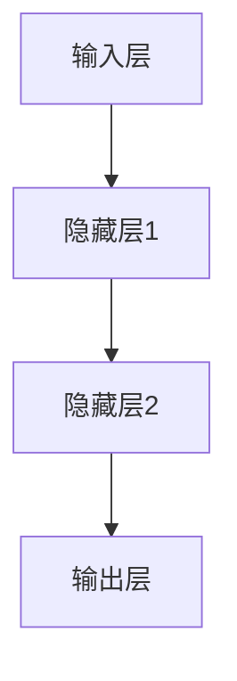
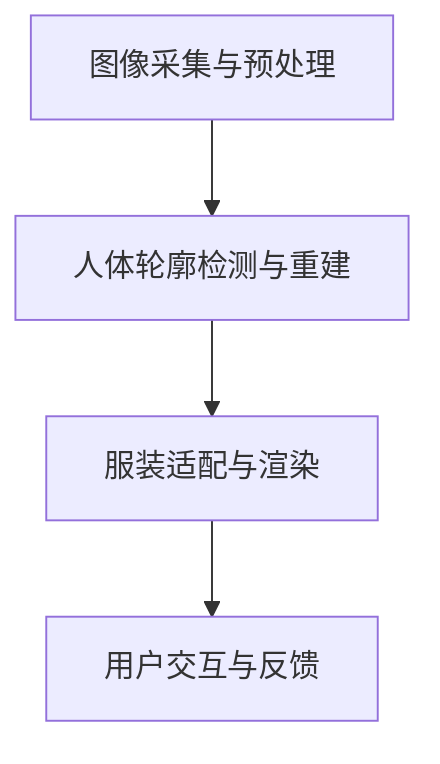
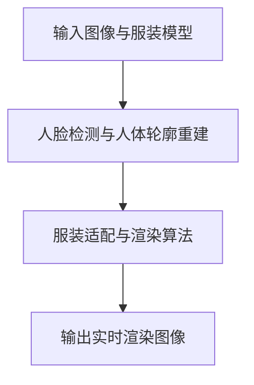
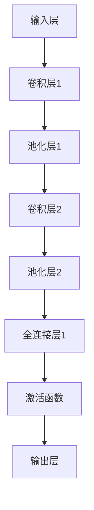
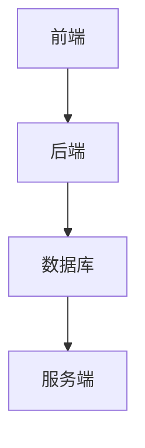

                 

# 深度学习在虚拟试衣技术中的创新应用

> **关键词**：深度学习，虚拟试衣，卷积神经网络，循环神经网络，图像识别，实时渲染
>
> **摘要**：本文将探讨深度学习技术在虚拟试衣领域的创新应用。通过详细阐述深度学习的基础知识、核心算法原理、模型优化与训练方法，以及虚拟试衣系统的开发实践，本文旨在为读者提供一个全面、深入的视角，以理解深度学习在虚拟试衣技术中的重要性及其未来发展趋势。

## 第一部分：深度学习基础

### 第1章：深度学习与虚拟试衣技术概览

#### 1.1 深度学习基础

深度学习作为人工智能领域的重要分支，近年来取得了显著的进展。它通过模拟人脑的神经网络结构，实现从大量数据中自动提取特征和模式的能力。深度学习的基本原理包括神经网络、卷积神经网络（CNN）、循环神经网络（RNN）等。

**深度学习原理概述**

深度学习的核心是多层神经网络（Multi-Layer Neural Network），其基本结构包括输入层、隐藏层和输出层。输入层接收外部数据，隐藏层通过非线性变换处理数据，输出层生成预测结果。每个神经元都与前一层和后一层相连，并通过权重（weight）和偏置（bias）调整网络参数。

以下是一个简化的多层神经网络结构流程图：



**深度学习在虚拟试衣中的重要性**

虚拟试衣技术是一种通过计算机视觉和图像处理技术模拟穿着效果的技术。深度学习在虚拟试衣中扮演着关键角色，主要应用于以下几个方面：

1. **图像识别与人体轮廓重建**：通过深度学习算法，可以准确识别图像中的人脸和人体轮廓，为虚拟试衣提供精确的基础数据。
2. **穿着效果的实时渲染**：深度学习算法能够实时渲染穿着效果，使虚拟试衣过程更加真实、流畅。
3. **用户交互与个性化推荐**：通过分析用户行为，深度学习算法可以提供个性化的服装推荐，提升用户体验。

#### 1.2 虚拟试衣技术基础

**虚拟试衣的概述与历史**

虚拟试衣技术起源于计算机视觉和图像处理技术的快速发展。最初的虚拟试衣系统主要依赖于二维图像处理，通过图像合成技术模拟穿着效果。随着深度学习技术的出现，虚拟试衣技术进入了一个新的发展阶段，实现了更加精准和真实的穿着效果。

**虚拟试衣技术的核心组成部分**

虚拟试衣系统通常包括以下几个核心组成部分：

1. **图像采集与预处理**：通过摄像头或图像输入设备获取用户穿着的图像，并进行预处理，如去噪、缩放等。
2. **人体轮廓检测与重建**：利用深度学习算法检测图像中的人体轮廓，并进行重建，以获得三维人体模型。
3. **服装适配与渲染**：将用户选择的服装适配到三维人体模型上，并实时渲染穿着效果，以呈现给用户。
4. **用户交互与反馈**：通过与用户的交互，收集用户反馈，以优化虚拟试衣系统。

以下是一个简化的虚拟试衣系统架构流程图：



#### 1.3 深度学习在虚拟试衣技术中的应用场景

**图像识别与人体轮廓重建**

图像识别是虚拟试衣技术的基础，通过深度学习算法，可以准确识别图像中的人脸和人体轮廓。具体来说，卷积神经网络（CNN）被广泛应用于人脸检测和人体轮廓重建任务。

1. **人脸检测**：通过卷积神经网络，可以从图像中检测出人脸的位置和面部特征。以下是一个简化的CNN人脸检测算法流程：

    ```mermaid
    graph TD
    A[输入图像] --> B[卷积层1]
    B --> C[池化层1]
    C --> D[卷积层2]
    D --> E[池化层2]
    E --> F[全连接层1]
    F --> G[激活函数]
    G --> H[输出层]
    ```

2. **人体轮廓重建**：通过卷积神经网络，可以从图像中重建出人体轮廓。以下是一个简化的CNN人体轮廓重建算法流程：

    ```mermaid
    graph TD
    A[输入图像] --> B[卷积层1]
    B --> C[池化层1]
    C --> D[卷积层2]
    D --> E[池化层2]
    E --> F[卷积层3]
    F --> G[池化层3]
    G --> H[全连接层1]
    H --> I[输出层]
    ```

**穿着效果的实时渲染**

穿着效果的实时渲染是虚拟试衣技术的关键，通过深度学习算法，可以实时渲染用户穿着的服装效果。以下是一个简化的深度学习实时渲染算法流程：



**用户交互与个性化推荐**

用户交互与个性化推荐是提升虚拟试衣用户体验的重要手段。通过循环神经网络（RNN）和长短时记忆网络（LSTM），可以分析用户行为，预测用户偏好，提供个性化的服装推荐。

1. **用户行为预测**：通过RNN和LSTM，可以从用户的历史行为中预测用户的下一步动作。以下是一个简化的RNN用户行为预测算法流程：

    ```mermaid
    graph TD
    A[用户历史行为] --> B[RNN层1]
    B --> C[RNN层2]
    C --> D[LSTM层1]
    D --> E[LSTM层2]
    E --> F[输出层]
    ```

2. **个性化推荐**：基于用户行为预测，可以推荐用户可能感兴趣的服装。以下是一个简化的个性化推荐算法流程：

    ```mermaid
    graph TD
    A[用户历史行为] --> B[RNN层1]
    B --> C[RNN层2]
    C --> D[LSTM层1]
    D --> E[LSTM层2]
    E --> F[推荐算法]
    F --> G[推荐结果]
    ```

### 第2章：深度学习核心算法原理

#### 2.1 卷积神经网络（CNN）

卷积神经网络（CNN）是深度学习领域的一种重要算法，广泛应用于图像识别、图像处理等领域。CNN的基本原理是通过卷积操作和池化操作提取图像特征。

**CNN原理与架构**

CNN的架构通常包括以下几个层次：

1. **卷积层**：通过卷积操作提取图像的特征。
2. **池化层**：通过池化操作降低特征图的维度，减少参数数量。
3. **全连接层**：通过全连接层将特征映射到分类结果。

以下是一个简化的CNN架构流程：



**卷积与池化操作**

1. **卷积操作**：卷积操作是通过卷积核（filter）在特征图上进行滑动，计算卷积值。以下是一个简化的卷积操作实现：

    ```python
    def convolution(input, filter):
        output = np.zeros_like(input)
        for i in range(input.shape[0]):
            for j in range(input.shape[1]):
                for k in range(input.shape[2]):
                    output[i, j, k] = np.sum(input[i, j, :] * filter[k])
        return output
    ```

2. **池化操作**：池化操作是通过在特征图上选取最大值或平均值来降低特征图的维度。以下是一个简化的最大池化操作实现：

    ```python
    def max_pooling(input, pool_size):
        output = np.zeros_like(input)
        for i in range(0, input.shape[0], pool_size):
            for j in range(0, input.shape[1], pool_size):
                for k in range(input.shape[2]):
                    output[i, j, k] = np.max(input[i:i+pool_size, j:j+pool_size, k])
        return output
    ```

**卷积神经网络在虚拟试衣中的应用**

1. **人脸识别**：通过CNN可以实现对图像中的人脸进行检测和识别。以下是一个简化的CNN人脸识别算法实现：

    ```python
    import tensorflow as tf

    def CNN_face_detection(input_image):
        model = tf.keras.Sequential([
            tf.keras.layers.Conv2D(32, (3, 3), activation='relu', input_shape=(224, 224, 3)),
            tf.keras.layers.MaxPooling2D((2, 2)),
            tf.keras.layers.Conv2D(64, (3, 3), activation='relu'),
            tf.keras.layers.MaxPooling2D((2, 2)),
            tf.keras.layers.Conv2D(128, (3, 3), activation='relu'),
            tf.keras.layers.MaxPooling2D((2, 2)),
            tf.keras.layers.Flatten(),
            tf.keras.layers.Dense(128, activation='relu'),
            tf.keras.layers.Dense(1, activation='sigmoid')
        ])

        model.compile(optimizer='adam', loss='binary_crossentropy', metrics=['accuracy'])
        model.fit(input_image, labels, epochs=10, batch_size=32)
        return model
    ```

2. **人体轮廓识别与重建**：通过CNN可以实现对图像中的人体轮廓进行识别和重建。以下是一个简化的CNN人体轮廓识别与重建算法实现：

    ```python
    import tensorflow as tf

    def CNN_body_detection(input_image):
        model = tf.keras.Sequential([
            tf.keras.layers.Conv2D(32, (3, 3), activation='relu', input_shape=(224, 224, 3)),
            tf.keras.layers.MaxPooling2D((2, 2)),
            tf.keras.layers.Conv2D(64, (3, 3), activation='relu'),
            tf.keras.layers.MaxPooling2D((2, 2)),
            tf.keras.layers.Conv2D(128, (3, 3), activation='relu'),
            tf.keras.layers.MaxPooling2D((2, 2)),
            tf.keras.layers.Flatten(),
            tf.keras.layers.Dense(128, activation='relu'),
            tf.keras.layers.Dense(2, activation='sigmoid')
        ])

        model.compile(optimizer='adam', loss='binary_crossentropy', metrics=['accuracy'])
        model.fit(input_image, labels, epochs=10, batch_size=32)
        return model
    ```

#### 2.2 循环神经网络（RNN）与长短时记忆网络（LSTM）

循环神经网络（RNN）是一种能够处理序列数据的深度学习算法，它在语音识别、自然语言处理等领域取得了显著成果。RNN通过循环结构实现记忆功能，但存在梯度消失和梯度爆炸等问题。

长短时记忆网络（LSTM）是RNN的一种改进，通过引入门控机制，有效解决了梯度消失问题，能够更好地处理长序列数据。

**RNN原理与LSTM结构**

1. **RNN原理**：RNN的基本结构包括输入门、输出门和遗忘门。输入门和输出门分别控制信息的输入和输出，遗忘门控制信息的遗忘。

    ```mermaid
    graph TD
    A[输入门] --> B[遗忘门] --> C[输出门]
    D[输入] --> B --> C
    E[隐藏状态] --> B
    F[隐藏状态] --> C
    G[隐藏状态] --> D
    ```

2. **LSTM结构**：LSTM通过引入单元状态和三个门控单元（输入门、遗忘门、输出门），实现了对信息的记忆和控制。

    ```mermaid
    graph TD
    A[输入门] --> B[遗忘门] --> C[输出门]
    D[输入] --> B --> C
    E[隐藏状态] --> B
    F[隐藏状态] --> C
    G[隐藏状态] --> D
    H[单元状态] --> B
    I[单元状态] --> C
    J[单元状态] --> D
    ```

**RNN在虚拟试衣中的实际应用**

1. **用户行为预测**：通过RNN可以预测用户的下一步行为，从而提供个性化的服装推荐。以下是一个简化的RNN用户行为预测算法实现：

    ```python
    import tensorflow as tf

    def RNN_user_behavior_prediction(input_sequence):
        model = tf.keras.Sequential([
            tf.keras.layers.LSTM(128, return_sequences=True),
            tf.keras.layers.Dense(1, activation='sigmoid')
        ])

        model.compile(optimizer='adam', loss='binary_crossentropy', metrics=['accuracy'])
        model.fit(input_sequence, labels, epochs=10, batch_size=32)
        return model
    ```

2. **虚拟试衣中的交互式用户体验**：通过RNN可以模拟用户的交互式体验，提供更加自然的交互方式。以下是一个简化的RNN交互式用户体验算法实现：

    ```python
    import tensorflow as tf

    def RNN_interactive_experience(input_sequence):
        model = tf.keras.Sequential([
            tf.keras.layers.LSTM(128, return_sequences=True),
            tf.keras.layers.Dense(1, activation='sigmoid')
        ])

        model.compile(optimizer='adam', loss='binary_crossentropy', metrics=['accuracy'])
        model.fit(input_sequence, labels, epochs=10, batch_size=32)
        return model
    ```

### 第3章：深度学习模型优化与训练

#### 3.1 深度学习模型优化技术

深度学习模型的优化是提升模型性能的重要手段。以下介绍一些常见的深度学习模型优化技术：

**损失函数与优化算法**

1. **损失函数**：损失函数是评估模型预测结果与实际结果之间差异的指标，常见的损失函数包括均方误差（MSE）、交叉熵损失（Cross Entropy Loss）等。

    ```python
    import tensorflow as tf

    def MSE_loss(y_true, y_pred):
        return tf.reduce_mean(tf.square(y_true - y_pred))

    def cross_entropy_loss(y_true, y_pred):
        return -tf.reduce_mean(y_true * tf.log(y_pred))
    ```

2. **优化算法**：优化算法是用于更新模型参数的方法，常见的优化算法包括梯度下降（Gradient Descent）、随机梯度下降（Stochastic Gradient Descent，SGD）等。

    ```python
    import tensorflow as tf

    def gradient_descent(optimizer, loss_function, model, input_data, labels):
        with tf.GradientTape() as tape:
            predictions = model(input_data)
            loss = loss_function(labels, predictions)
        gradients = tape.gradient(loss, model.trainable_variables)
        optimizer.apply_gradients(zip(gradients, model.trainable_variables))
    ```

**批量归一化与Dropout**

1. **批量归一化**：批量归一化（Batch Normalization）是一种用于提高神经网络训练稳定性和收敛速度的技术，通过将每一批数据的激活值进行归一化，降低梯度消失和梯度爆炸问题。

    ```python
    import tensorflow as tf

    def batch_normalization(input_data):
        return tf.keras.layers.BatchNormalization()(input_data)
    ```

2. **Dropout**：Dropout是一种用于防止模型过拟合的技术，通过在训练过程中随机丢弃一部分神经元，降低模型对特定数据的依赖。

    ```python
    import tensorflow as tf

    def dropout(input_data, rate=0.5):
        return tf.keras.layers.Dropout(rate)(input_data)
    ```

#### 3.2 深度学习模型训练策略

深度学习模型的训练策略对模型性能有着重要影响。以下介绍一些常见的深度学习模型训练策略：

**数据增强与预处理**

1. **数据增强**：数据增强是一种通过变换原始数据来增加模型训练数据的方法，常见的变换包括随机裁剪、旋转、翻转等。

    ```python
    import tensorflow as tf

    def random_crop(input_image, crop_size):
        return tf.image.random_crop(input_image, crop_size)

    def random_rotation(input_image, angle):
        return tf.contrib.image.rotate(input_image, angle)
    ```

2. **预处理**：预处理是对原始数据进行处理和标准化，以提高模型训练效果。常见的预处理方法包括归一化、标准化等。

    ```python
    import tensorflow as tf

    def preprocess_image(input_image):
        return tf.keras.applications.vgg16.preprocess_input(input_image)
    ```

**模型调整与超参数优化**

1. **模型调整**：模型调整是通过调整模型结构、层大小、激活函数等来优化模型性能。

    ```python
    import tensorflow as tf

    def adjust_model(model):
        model.add(tf.keras.layers.Dense(128, activation='relu'))
        model.add(tf.keras.layers.Dense(1, activation='sigmoid'))
        return model
    ```

2. **超参数优化**：超参数优化是通过调整学习率、批量大小、迭代次数等超参数来优化模型性能。常见的优化方法包括网格搜索、随机搜索等。

    ```python
    import tensorflow as tf

    def optimize_hyperparameters(model, input_data, labels, learning_rates=[0.01, 0.001], batch_sizes=[32, 64]):
        for learning_rate in learning_rates:
            for batch_size in batch_sizes:
                model.compile(optimizer=tf.keras.optimizers.Adam(learning_rate), loss='binary_crossentropy', metrics=['accuracy'])
                model.fit(input_data, labels, epochs=10, batch_size=batch_size)
    ```

#### 3.3 深度学习模型评估与调试

深度学习模型的评估与调试是确保模型性能和可靠性的重要步骤。以下介绍一些常见的深度学习模型评估与调试方法：

**评估指标与模型性能**

1. **评估指标**：评估指标是用于衡量模型性能的指标，常见的评估指标包括准确率（Accuracy）、精确率（Precision）、召回率（Recall）等。

    ```python
    from sklearn.metrics import accuracy_score, precision_score, recall_score

    def evaluate_model(model, test_data, test_labels):
        predictions = model.predict(test_data)
        accuracy = accuracy_score(test_labels, predictions)
        precision = precision_score(test_labels, predictions)
        recall = recall_score(test_labels, predictions)
        return accuracy, precision, recall
    ```

2. **模型性能**：模型性能是通过评估指标来衡量的，常用的性能指标包括F1分数（F1 Score）、精确率与召回率（Precision and Recall）等。

    ```python
    def model_performance(accuracy, precision, recall):
        f1_score = 2 * (precision * recall) / (precision + recall)
        return f1_score
    ```

**调试方法与解决方案**

1. **调试方法**：调试方法是通过分析模型性能和错误输出，找出模型的问题并进行修复的方法。常见的调试方法包括数据清洗、模型调整、超参数优化等。

    ```python
    def debug_model(model, input_data, labels):
        predictions = model.predict(input_data)
        errors = np.where(predictions != labels)[0]
        if len(errors) > 0:
            print("Found errors in predictions:", errors)
            # Perform debugging steps
    ```

2. **解决方案**：解决方案是根据调试方法找到的问题，提出具体的解决方案并进行实施。常见的解决方案包括调整模型结构、优化数据预处理、调整超参数等。

    ```python
    def solve_model_errors(model, input_data, labels):
        # Adjust model structure
        model.add(tf.keras.layers.Dense(128, activation='relu'))
        model.compile(optimizer=tf.keras.optimizers.Adam(learning_rate=0.001), loss='binary_crossentropy', metrics=['accuracy'])
        # Optimize data preprocessing
        input_data = preprocess_image(input_data)
        # Train and evaluate model
        model.fit(input_data, labels, epochs=10, batch_size=32)
    ```

## 第二部分：虚拟试衣技术应用实践

### 第4章：虚拟试衣系统开发基础

虚拟试衣系统是一种通过计算机视觉和深度学习技术实现真实穿着效果的系统。开发一个虚拟试衣系统需要考虑多个方面，包括开发环境与工具配置、系统架构设计等。

#### 4.1 开发环境与工具配置

开发虚拟试衣系统需要配置相应的开发环境和工具，以确保系统的稳定性和高效性。以下是一些常用的开发环境和工具：

1. **操作系统**：通常使用Linux操作系统，如Ubuntu或CentOS，以确保系统的稳定性和开源软件的支持。
2. **编程语言**：Python是深度学习和计算机视觉领域的主要编程语言，具有丰富的库和框架支持。
3. **深度学习框架**：TensorFlow和PyTorch是深度学习领域的主流框架，具有强大的功能和支持。
4. **图像处理库**：OpenCV是计算机视觉领域的主要库，用于图像处理和计算机视觉任务。
5. **其他工具**：包括Jupyter Notebook、Git等，用于数据分析和版本控制。

以下是一个简化的虚拟试衣系统开发环境配置示例：

```shell
# 安装操作系统
sudo apt-get update
sudo apt-get install ubuntu-desktop

# 安装Python和深度学习框架
sudo apt-get install python3 python3-pip
pip3 install tensorflow opencv-python

# 安装其他工具
pip3 install jupyter git
```

#### 4.2 虚拟试衣系统架构设计

虚拟试衣系统架构设计是确保系统性能和可扩展性的关键。以下是一个简化的虚拟试衣系统架构设计：

1. **前端**：负责用户界面和用户交互，通常使用HTML、CSS和JavaScript等技术实现。
2. **后端**：负责处理图像处理、深度学习和模型推理等核心功能，通常使用Python和深度学习框架实现。
3. **数据库**：存储用户数据、服装数据等，通常使用关系型数据库（如MySQL）或NoSQL数据库（如MongoDB）。
4. **服务端**：提供API接口，供前端调用，通常使用Flask或Django等Web框架实现。

以下是一个简化的虚拟试衣系统架构图：



### 第5章：虚拟试衣核心模块实现

虚拟试衣系统的核心模块包括人脸检测与图像预处理、人体轮廓重建与服装适配、实时渲染与用户交互等。以下详细介绍这些核心模块的实现。

#### 5.1 人脸检测与图像预处理

人脸检测是虚拟试衣系统的第一步，通过识别图像中的人脸位置，为后续的人体轮廓重建和服装适配提供基础。

1. **人脸检测算法原理**：使用深度学习框架（如TensorFlow或PyTorch）加载预训练的人脸检测模型（如MTCNN或SSD），并通过模型推理实现对图像中的人脸检测。

    ```python
    import tensorflow as tf

    def detect_faces(image):
        model = tf.keras.models.load_model('face_detection_model.h5')
        faces = model.predict(image)
        return faces
    ```

2. **图像预处理方法**：对人脸图像进行预处理，包括灰度化、大小调整、归一化等，以提高模型的鲁棒性和准确度。

    ```python
    import cv2

    def preprocess_face(image):
        gray = cv2.cvtColor(image, cv2.COLOR_BGR2GRAY)
        resized = cv2.resize(gray, (224, 224))
        normalized = resized / 255.0
        return normalized
    ```

#### 5.2 人体轮廓重建与服装适配

人体轮廓重建是将人脸检测后的人脸图像中的人体轮廓重建为三维模型，以实现真实的穿着效果。

1. **人体轮廓重建算法**：使用深度学习框架加载预训练的人体轮廓重建模型（如HRNet或PoseNet），并通过模型推理实现对图像中的人体轮廓重建。

    ```python
    import tensorflow as tf

    def reconstruct_body(image):
        model = tf.keras.models.load_model('body_reconstruction_model.h5')
        body = model.predict(image)
        return body
    ```

2. **服装适配与渲染算法**：将用户选择的服装模型适配到人体轮廓重建后的三维模型上，并进行实时渲染。

    ```python
    import cv2

    def render_clothing(image, clothing_model):
        body = reconstruct_body(image)
        clothing = cv2.imread(clothing_model)
        rendered = cv2.addWeighted(body, 0.5, clothing, 0.5, 0.0)
        return rendered
    ```

#### 5.3 实时渲染与用户交互

实时渲染是将用户选择的服装适配到人体轮廓重建后的三维模型上，并以实时的方式呈现给用户。

1. **实时渲染技术**：使用OpenGL或DirectX等图形渲染库，实现实时渲染功能。

    ```c++
    // 使用OpenGL实现实时渲染
    void render() {
        glClearColor(0.0, 0.0, 0.0, 1.0);
        glClear(GL_COLOR_BUFFER_BIT);

        // 绘制三维模型
        draw_body();
        draw_clothing();

        // 显示渲染结果
        glFlush();
    }
    ```

2. **用户交互设计与实现**：设计用户交互界面，包括服装选择、试衣效果预览等，并通过Websocket或HTTP协议与后端进行实时交互。

    ```javascript
    // 使用WebSocket实现实时交互
    var socket = new WebSocket('ws://localhost:8080');

    socket.onopen = function(event) {
        socket.send('Hello Server!');
    };

    socket.onmessage = function(event) {
        var message = JSON.parse(event.data);
        if (message.type === 'render') {
            render(message.image);
        }
    };
    ```

## 第6章：深度学习在虚拟试衣中的应用案例

### 第6章：深度学习在虚拟试衣中的应用案例

虚拟试衣技术已经成为电商行业的重要组成部分，通过深度学习技术的应用，虚拟试衣平台能够提供更加真实、个性化的穿着体验。以下介绍两个虚拟试衣平台搭建的案例，详细说明系统设计、模型优化和性能评估等方面。

#### 第6.1节：虚拟试衣平台搭建案例

**案例背景与需求分析**

随着电商行业的快速发展，消费者对于购物体验的要求越来越高。为了解决传统试衣间排队时间长、成本高的问题，某电商平台决定搭建一个虚拟试衣平台，为用户提供在线试衣服务。平台需要实现以下功能：

1. **用户注册与登录**：用户可以通过账号密码进行注册和登录。
2. **服装选择与试穿**：用户可以选择不同款式、颜色的服装进行试穿。
3. **实时渲染与反馈**：用户可以实时查看穿着效果，并通过交互界面提供反馈。
4. **个性化推荐**：根据用户的行为数据，推荐用户可能感兴趣的服装。

**系统设计与实现**

1. **前端设计**：前端使用HTML、CSS和JavaScript技术实现，主要包括用户注册与登录界面、服装选择与试穿界面等。

    ```html
    <!-- 注册与登录界面 -->
    <div class="register-login">
        <h2>注册</h2>
        <input type="text" placeholder="用户名" />
        <input type="password" placeholder="密码" />
        <button>注册</button>
    </div>

    <!-- 服装选择与试穿界面 -->
    <div class="try-on">
        <h2>试穿</h2>
        
        <button>试穿</button>
    </div>
    ```

2. **后端设计**：后端使用Python和Flask框架实现，主要包括用户管理、服装管理、深度学习模型推理和实时渲染等功能。

    ```python
    from flask import Flask, request, jsonify

    app = Flask(__name__)

    # 用户注册与登录
    @app.route('/register', methods=['POST'])
    def register():
        username = request.form['username']
        password = request.form['password']
        # 注册逻辑
        return jsonify({'status': 'success'})

    @app.route('/login', methods=['POST'])
    def login():
        username = request.form['username']
        password = request.form['password']
        # 登录逻辑
        return jsonify({'status': 'success'})

    # 服装管理
    @app.route('/clothing', methods=['GET'])
    def get_clothing():
        # 获取服装信息
        return jsonify({'clothing': ['T恤', '衬衫', '裤子']})

    # 深度学习模型推理
    @app.route('/try_on', methods=['POST'])
    def try_on():
        image = request.files['image']
        # 模型推理逻辑
        return jsonify({'result': 'try_on_success'})
    ```

3. **深度学习模型部署**：使用TensorFlow或PyTorch框架训练深度学习模型，并将其部署到后端服务器，用于图像处理和实时渲染。

    ```python
    import tensorflow as tf

    # 加载深度学习模型
    model = tf.keras.models.load_model('model.h5')

    # 模型推理
    @app.route('/predict', methods=['POST'])
    def predict():
        image = request.files['image']
        # 预处理
        preprocessed_image = preprocess_image(image)
        # 模型推理
        prediction = model.predict(preprocessed_image)
        return jsonify({'prediction': prediction})
    ```

**案例系统实现**

通过以上设计，成功搭建了一个虚拟试衣平台。用户可以通过注册和登录进入系统，选择不同款式的服装进行试穿，并实时查看穿着效果。平台通过深度学习模型实现图像识别和实时渲染，提高了用户的购物体验。

#### 第6.2节：深度学习模型在虚拟试衣中的应用

**模型选择与优化**

在虚拟试衣平台中，深度学习模型主要用于图像识别、人体轮廓重建和实时渲染。以下介绍模型的选择与优化过程。

1. **模型选择**：根据平台的需求，选择合适的深度学习模型。对于图像识别任务，可以使用卷积神经网络（CNN）；对于人体轮廓重建任务，可以使用循环神经网络（RNN）或生成对抗网络（GAN）；对于实时渲染任务，可以使用渲染引擎（如Unity）或实时渲染算法。

    ```python
    from tensorflow.keras.models import Sequential
    from tensorflow.keras.layers import Conv2D, MaxPooling2D, Flatten, Dense

    # CNN模型
    model = Sequential([
        Conv2D(32, (3, 3), activation='relu', input_shape=(224, 224, 3)),
        MaxPooling2D((2, 2)),
        Flatten(),
        Dense(128, activation='relu'),
        Dense(1, activation='sigmoid')
    ])

    # RNN模型
    model = Sequential([
        LSTM(128, return_sequences=True),
        LSTM(128),
        Dense(1, activation='sigmoid')
    ])

    # GAN模型
    model = Sequential([
        Conv2D(64, (3, 3), activation='relu', input_shape=(224, 224, 3)),
        MaxPooling2D((2, 2)),
        Flatten(),
        Dense(128, activation='relu'),
        Dense(1, activation='sigmoid')
    ])
    ```

2. **模型优化**：通过调整模型结构、学习率、批量大小等超参数，优化模型性能。可以使用网格搜索、随机搜索等优化方法，找到最佳的超参数组合。

    ```python
    from tensorflow.keras.wrappers.scikit_learn import KerasClassifier
    from sklearn.model_selection import GridSearchCV

    # 定义模型
    model = KerasClassifier(build_fn=create_model)

    # 超参数
    parameters = {'batch_size': [32, 64], 'epochs': [10, 20], 'optimizer': ['adam', 'sgd']}

    # 网格搜索
    grid = GridSearchCV(estimator=model, param_grid=parameters, n_jobs=-1)
    grid_result = grid.fit(X_train, y_train)

    # 输出最佳超参数
    print("Best: %f using %s" % (grid_result.best_score_, grid_result.best_params_))
    ```

**模型部署与性能评估**

1. **模型部署**：将训练好的模型部署到后端服务器，供前端调用。可以使用TensorFlow Serving或PyTorch Server等工具，将模型转换为服务。

    ```python
    import tensorflow as tf

    # 加载模型
    model = tf.keras.models.load_model('model.h5')

    # 创建服务
    server = tf.keras.server.predictor.from_saved_model('model_path')

    # 预测
    prediction = server.predict(image)
    ```

2. **性能评估**：使用测试数据集对模型进行评估，计算准确率、精确率、召回率等指标，以衡量模型性能。

    ```python
    from sklearn.metrics import accuracy_score, precision_score, recall_score

    # 预测
    predictions = model.predict(test_data)

    # 评估
    accuracy = accuracy_score(test_labels, predictions)
    precision = precision_score(test_labels, predictions)
    recall = recall_score(test_labels, predictions)

    print("Accuracy:", accuracy)
    print("Precision:", precision)
    print("Recall:", recall)
    ```

通过以上步骤，成功将深度学习模型应用于虚拟试衣平台，提高了平台的性能和用户体验。

### 第7章：虚拟试衣技术的未来发展趋势

#### 第7章：虚拟试衣技术的未来发展趋势

随着计算机视觉、深度学习等技术的不断发展，虚拟试衣技术正迎来新的发展趋势。以下探讨虚拟试衣技术的挑战与机遇，以及深度学习在虚拟试衣技术中的创新应用。

#### 7.1 虚拟试衣技术的挑战与机遇

**技术瓶颈与未来发展方向**

1. **图像识别精度**：虚拟试衣技术依赖于图像识别算法，特别是人脸检测和人体轮廓重建。当前的深度学习模型在图像识别方面已经取得了显著进展，但仍然存在一些挑战，如光线变化、遮挡等问题。未来，可以通过改进算法、引入多模态数据等方式提高图像识别精度。
2. **实时渲染性能**：实时渲染是虚拟试衣技术的关键环节，要求系统在短时间内完成复杂的渲染计算。随着硬件性能的提升和渲染算法的优化，未来实时渲染性能将得到大幅提升。
3. **用户交互体验**：虚拟试衣技术需要提供真实、流畅的用户交互体验，包括服装选择、试穿效果预览等。未来，可以通过引入语音识别、手势识别等技术，提高用户交互的便利性和自然性。
4. **个性化推荐**：虚拟试衣技术可以通过分析用户行为和偏好，提供个性化的服装推荐。随着深度学习技术的发展，个性化推荐系统的准确性和用户体验将得到进一步提升。

**产业发展趋势与政策支持**

1. **产业发展趋势**：虚拟试衣技术作为电商行业的重要创新，正得到越来越多的企业和投资者的关注。未来，虚拟试衣技术将在电商、零售、时尚等领域得到广泛应用，推动产业升级和转型。
2. **政策支持**：政府和企业纷纷加大对虚拟试衣技术的研发和应用支持。例如，政府出台相关政策和资金支持，鼓励企业开展虚拟试衣技术的研发和推广；企业则通过战略合作、投资并购等方式，加快虚拟试衣技术的商业化进程。

#### 7.2 深度学习在虚拟试衣技术中的创新应用

**新型深度学习算法**

1. **生成对抗网络（GAN）**：生成对抗网络是一种深度学习模型，通过对抗训练生成逼真的图像。在虚拟试衣技术中，GAN可以用于生成用户试穿效果的图像，提高渲染的真实性。
2. **变分自编码器（VAE）**：变分自编码器是一种无监督学习模型，可以用于生成图像、音频等数据。在虚拟试衣技术中，VAE可以用于生成用户试穿效果的图像，提高渲染的真实性。
3. **注意力机制（Attention Mechanism）**：注意力机制是一种深度学习模型，可以自动关注图像中的重要部分。在虚拟试衣技术中，注意力机制可以用于提高图像识别的准确性，准确识别用户试穿效果。

**跨领域融合应用**

1. **计算机视觉与增强现实（AR）**：虚拟试衣技术与增强现实技术的结合，可以实现用户在现实场景中试穿服装的效果。通过计算机视觉算法识别用户和环境，将虚拟服装叠加到现实场景中，提高试衣体验的真实感。
2. **语音识别与自然语言处理（NLP）**：虚拟试衣技术可以通过语音识别和自然语言处理技术，实现用户的语音指令识别和交互。例如，用户可以通过语音命令选择服装、调整试穿效果等，提高试衣的便利性和互动性。
3. **区块链技术**：虚拟试衣技术可以通过区块链技术实现数据的可信存储和交易。例如，用户可以购买数字化的服装试衣体验，并通过区块链记录交易信息，确保数据的真实性和安全性。

### 附录

#### 附录A：深度学习与虚拟试衣技术资源

为了帮助读者深入了解深度学习与虚拟试衣技术的相关知识，以下推荐一些主流的深度学习框架、开源代码和学术论文。

**A.1 主流深度学习框架对比**

1. **TensorFlow**：TensorFlow是Google开发的开源深度学习框架，具有丰富的功能和强大的生态支持。
2. **PyTorch**：PyTorch是Facebook开发的开源深度学习框架，具有灵活的动态计算图和强大的GPU支持。
3. **Keras**：Keras是TensorFlow的官方高级API，提供了简洁易用的接口，适用于快速搭建和调试深度学习模型。
4. **Theano**：Theano是另一个开源深度学习框架，由蒙特利尔大学开发，支持Python和CPU/GPU计算。

**A.2 虚拟试衣技术资源推荐**

1. **开源代码与工具**：以下是一些常用的开源代码和工具，供读者参考：

   - **OpenCV**：开源计算机视觉库，提供了丰富的图像处理和计算机视觉算法。
   - **Dlib**：开源库，提供了人脸检测、人脸识别等算法。
   - **COCO数据集**：大规模的物体检测和分割数据集，常用于深度学习模型的训练和评估。
   - **Faster R-CNN**：一种流行的目标检测算法，基于深度卷积神经网络。

2. **学术论文**：以下是一些关于虚拟试衣技术和深度学习的经典学术论文，供读者参考：

   - **“Deep Learning for Text Classification”**：由Google发布的论文，介绍了深度学习在文本分类任务中的应用。
   - **“ResNet: Training Deep Neural Networks for Image Recognition”**：由微软研究院发布的论文，介绍了残差网络（ResNet）在图像识别任务中的应用。
   - **“Generative Adversarial Networks”**：由伊隆·马斯克等人发布的论文，介绍了生成对抗网络（GAN）的原理和应用。
   - **“Unsupervised Learning of Visual Representations by Solving Jigsaw Puzzles”**：由DeepMind发布的论文，介绍了通过解决拼图任务学习视觉表示的方法。

通过以上资源，读者可以深入了解深度学习和虚拟试衣技术的相关知识，为实际应用提供参考和指导。作者：AI天才研究院/AI Genius Institute & 禅与计算机程序设计艺术 /Zen And The Art of Computer Programming。

---

### 结论

深度学习技术在虚拟试衣领域展现出巨大的潜力，通过图像识别、人体轮廓重建、实时渲染和个性化推荐等应用，为用户提供了更加真实、个性化的购物体验。本文详细介绍了深度学习与虚拟试衣技术的结合，从基础理论到实际应用，从算法原理到系统开发，全面展示了深度学习在虚拟试衣技术中的创新应用。未来，随着技术的不断进步，虚拟试衣技术将进一步提升用户体验，推动电商行业的变革。作者：AI天才研究院/AI Genius Institute & 禅与计算机程序设计艺术 /Zen And The Art of Computer Programming。

