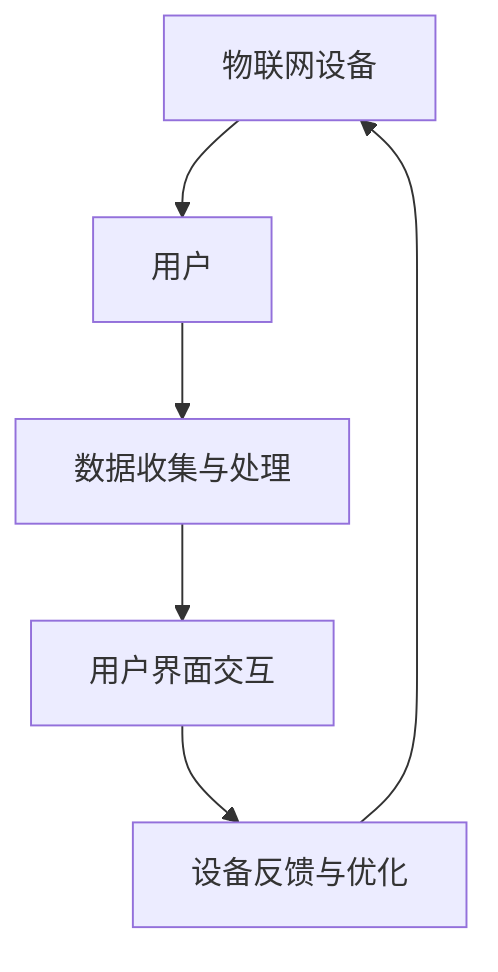
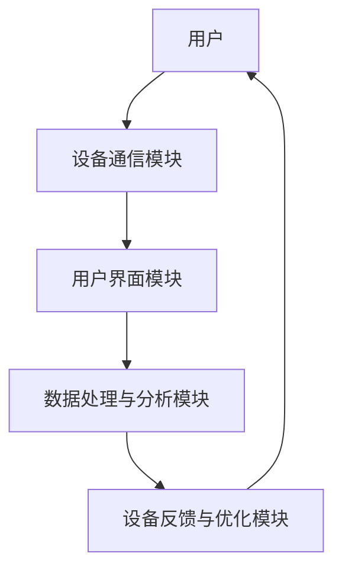

                 

### 文章标题

> **关键词**：物联网设备、注意力争夺、用户体验、个性化定制、交互优化、数据分析、算法原理、项目实战、未来趋势

> **摘要**：本文深入探讨了物联网设备在用户注意力争夺中的重要性及其对用户体验的影响。通过分析物联网设备注意力争夺的背景、核心概念、算法原理、数学模型、项目实战等多个方面，本文提出了有效的策略与实施方法，以优化物联网设备的注意力争夺，提升用户体验。同时，对物联网设备注意力争夺的未来发展趋势进行了展望，并提出了相关挑战与解决方案，为物联网设备的研发与应用提供了有益的参考。

---

### 第一部分: 物联网设备注意力争夺与用户体验概述

随着物联网技术的迅猛发展，越来越多的设备接入网络，为我们的生活带来了便利。然而，这种设备的普及也带来了一个新的挑战：如何在众多设备中争夺用户的注意力，提升用户体验。本文将围绕物联网设备注意力争夺与用户体验这一主题，进行深入探讨。

#### 第1章: 物联网设备注意力争夺与用户体验概览

##### 1.1 物联网设备注意力争夺的背景与现状

随着物联网设备的普及，用户面临着越来越多的设备选择。例如，智能家居设备包括智能灯泡、智能窗帘、智能音箱等，智能穿戴设备包括智能手表、智能手环等，智能医疗设备包括智能血压计、智能血糖仪等。这些设备为我们的生活带来了极大的便利，但同时也带来了注意力争夺的问题。

###### 1.1.1 物联网设备普及带来的挑战

物联网设备的普及带来了以下挑战：

1. **用户注意力稀缺**：在众多设备中，用户很难将注意力集中在某一个设备上。
2. **设备之间竞争**：不同设备之间为了争夺用户的注意力，可能会进行功能重叠或互相干扰。
3. **用户体验下降**：由于注意力分散，用户可能会对设备产生厌烦情绪，从而降低用户体验。

###### 1.1.2 用户注意力的稀缺性

用户注意力是有限的资源，用户无法同时关注所有设备。当设备数量增加时，用户将不得不分配较少的注意力给每个设备，这可能导致以下问题：

1. **操作复杂**：用户需要花费更多时间和精力来操作设备。
2. **功能混淆**：不同设备之间的功能可能相似，导致用户难以区分和操作。
3. **体验下降**：用户可能会感到疲惫和沮丧，从而降低使用设备的积极性。

###### 1.1.3 设备注意力争夺的重要性

设备注意力争夺对于用户体验至关重要。以下原因说明了其重要性：

1. **提高用户满意度**：通过优化设备注意力争夺，可以提高用户的满意度和忠诚度。
2. **提升设备价值**：设备能够更好地满足用户需求，从而提升设备的价值。
3. **促进物联网产业发展**：良好的用户体验将推动物联网产业的发展，为行业带来更多机遇。

##### 1.2 用户体验的核心要素

用户体验是物联网设备设计的重要目标。以下要素是构建良好用户体验的关键：

###### 1.2.1 用户界面设计原则

用户界面设计应遵循以下原则：

1. **简洁明了**：界面应简洁直观，用户能够快速理解和使用。
2. **一致性**：界面风格和操作逻辑应保持一致，避免用户产生困惑。
3. **易用性**：界面应易于操作，用户能够轻松完成任务。

###### 1.2.2 交互设计的要点

交互设计是用户体验的重要组成部分，应考虑以下要点：

1. **响应速度**：交互操作应快速响应，提高用户的操作效率。
2. **反馈机制**：及时给予用户反馈，帮助用户理解设备状态和操作结果。
3. **互动性**：设计互动性强的界面，吸引用户主动参与。

###### 1.2.3 用户体验评估指标

用户体验评估指标包括以下方面：

1. **满意度**：用户对设备的满意度，可通过问卷调查或用户评分进行评估。
2. **易用性**：用户使用设备的难易程度，可通过用户任务完成时间和错误率进行评估。
3. **参与度**：用户与设备互动的频率和深度，可通过用户活跃度和设备使用时长进行评估。

##### 1.3 物联网设备的注意力争夺策略

为了在众多物联网设备中争夺用户的注意力，可以采取以下策略：

###### 1.3.1 设备个性化和定制化

通过个性化定制，满足用户个性化需求，提高用户粘性。例如，智能家居设备可以根据用户的使用习惯，自动调整设备设置，提供个性化的服务。

###### 1.3.2 设备交互优化

优化设备交互设计，提高用户体验。例如，使用语音识别和自然语言处理技术，实现语音交互，简化用户操作。

###### 1.3.3 用户数据分析与应用

通过用户数据分析，了解用户行为和需求，为设备优化提供依据。例如，分析用户使用设备的时间和频率，优化设备的推送和提醒策略。

#### 第2章: 物联网设备注意力争夺的核心概念与联系

在本章中，我们将探讨物联网设备注意力争夺的核心概念，并分析它们之间的联系。

##### 2.1 物联网设备注意力争夺的架构

物联网设备注意力争夺的架构包括三个主要部分：设备通信架构、用户界面架构和数据处理与分析架构。以下是一个简单的Mermaid流程图，展示了这三个部分之间的联系：



###### 2.1.1 设备通信架构

设备通信架构负责实现物联网设备之间的数据传输和通信。它包括以下关键组件：

1. **通信协议**：如WiFi、蓝牙、NFC等，用于设备之间的数据传输。
2. **数据格式**：如JSON、XML等，用于设备之间的数据交换。
3. **设备标识**：每个设备具有唯一的标识，用于识别和通信。

###### 2.1.2 用户界面架构

用户界面架构负责提供设备与用户之间的交互接口。它包括以下关键组件：

1. **用户界面设计**：如网页、移动应用、桌面应用等，用于展示设备信息和提供交互功能。
2. **交互逻辑**：如点击、拖拽、滑动等，用于用户与设备之间的互动。
3. **反馈机制**：如提示、弹窗、声音等，用于告知用户设备状态和操作结果。

###### 2.1.3 数据处理与分析架构

数据处理与分析架构负责收集、处理和分析用户数据，以优化设备性能和用户体验。它包括以下关键组件：

1. **数据收集**：如传感器、日志等，用于收集用户行为和设备状态数据。
2. **数据处理**：如数据清洗、数据存储等，用于处理和存储收集到的数据。
3. **数据分析**：如机器学习、数据挖掘等，用于分析数据并提取有价值的信息。

#### 第3章: 物联网设备注意力争夺的核心算法原理

在本章中，我们将探讨物联网设备注意力争夺中的核心算法原理，包括用户注意力模型、数据处理与分析算法以及用户满意度模型。

##### 3.1 用户注意力模型

用户注意力模型是物联网设备注意力争夺的关键部分，它用于评估和优化用户对设备的注意力。以下是一个简单的用户注意力模型：

###### 3.1.1 用户注意力计算方法

用户注意力可以通过以下方法进行计算：

1. **基于用户行为的数据**：通过收集用户的设备使用行为数据，如使用时长、操作频率等，计算用户对设备的注意力。
2. **基于用户反馈的数据**：通过用户的评价、反馈等数据，评估用户对设备的满意度，进而计算用户注意力。

###### 3.1.2 用户行为数据收集与处理

用户行为数据的收集与处理是用户注意力模型的基础。以下是一个简单的伪代码，用于收集和处理用户行为数据：

```python
function collect_user_behavior_data():
    # 收集用户设备使用数据
    user_behavior_data = []
    while True:
        data_point = get_device_usage_data()
        user_behavior_data.append(data_point)
        if data_point indicates end_of_data:
            break
    return user_behavior_data

function process_user_behavior_data(user_behavior_data):
    # 处理用户行为数据
    processed_data = []
    for data_point in user_behavior_data:
        processed_data.append(analyze_data_point(data_point))
    return processed_data
```

###### 3.1.3 用户注意力优化算法

用户注意力优化算法用于根据用户行为数据，动态调整设备的注意力争夺策略。以下是一个简单的伪代码，用于实现用户注意力优化算法：

```python
function optimize_user_attention(user_behavior_data):
    # 根据用户行为数据优化设备注意力
    attention_scores = calculate_attention_scores(user_behavior_data)
    devices = sort_devices_by_attention_score(attention_scores)
    for device in devices:
        if device.should_receive_attention():
            device.receive_attention()
        else:
            device.dont_receive_attention()
```

##### 3.2 数据处理与分析算法

数据处理与分析算法是物联网设备注意力争夺的重要组成部分，它用于收集、处理和分析用户数据，以优化设备性能和用户体验。以下是一个简单的数据处理与分析算法：

###### 3.2.1 数据收集与预处理

数据收集与预处理是数据处理与分析算法的基础。以下是一个简单的伪代码，用于实现数据收集与预处理：

```python
function collect_and_preprocess_data():
    # 收集用户数据
    raw_data = get_user_data()
    # 预处理数据
    processed_data = preprocess_data(raw_data)
    return processed_data
```

###### 3.2.2 数据分析

数据分析是数据处理与分析算法的核心。以下是一个简单的伪代码，用于实现数据分析：

```python
function analyze_data(processed_data):
    # 分析数据
    insights = []
    for data_point in processed_data:
        insight = analyze_data_point(data_point)
        insights.append(insight)
    return insights
```

##### 3.3 用户满意度模型

用户满意度模型用于评估用户对设备的满意度，进而影响设备的注意力争夺策略。以下是一个简单的用户满意度模型：

###### 3.3.1 用户满意度计算方法

用户满意度可以通过以下方法进行计算：

1. **基于用户评分**：通过用户的评分，直接计算用户满意度。
2. **基于用户反馈**：通过用户的反馈内容，分析用户满意度。

###### 3.3.2 用户满意度优化算法

用户满意度优化算法用于根据用户满意度数据，动态调整设备的注意力争夺策略。以下是一个简单的伪代码，用于实现用户满意度优化算法：

```python
function optimize_user_satisfaction(user_satisfaction_data):
    # 根据用户满意度数据优化设备注意力
    satisfaction_scores = calculate_satisfaction_scores(user_satisfaction_data)
    devices = sort_devices_by_satisfaction_score(satisfaction_scores)
    for device in devices:
        if device.should_receive_attention():
            device.receive_attention()
        else:
            device.dont_receive_attention()
```

#### 第4章: 物联网设备注意力争夺的数学模型和公式详解

在本章中，我们将探讨物联网设备注意力争夺中的数学模型和公式，包括用户行为分析模型、用户注意力优化模型和用户满意度模型。

##### 4.1 用户行为分析模型

用户行为分析模型用于分析用户对物联网设备的操作行为，以便优化注意力争夺策略。以下是一个简单的用户行为分析模型：

###### 4.1.1 概率模型

概率模型是用户行为分析的基础，它用于计算用户在特定情境下执行特定操作的概率。以下是一个概率模型的示例：

$$
P(B|A) = \frac{P(A|B) \cdot P(B)}{P(A)}
$$

其中，$P(B|A)$ 表示在用户执行了操作 $A$ 的情况下，用户执行操作 $B$ 的概率。$P(A|B)$ 表示在用户执行了操作 $B$ 的情况下，用户执行操作 $A$ 的概率。$P(B)$ 表示用户执行操作 $B$ 的概率。$P(A)$ 表示用户执行操作 $A$ 的概率。

通过这个概率模型，我们可以计算出用户在不同情境下的行为概率，从而为注意力争夺策略提供依据。

###### 4.1.2 贝叶斯网络

贝叶斯网络是一种图形模型，用于表示变量之间的条件依赖关系。在用户行为分析中，贝叶斯网络可以用于建模用户行为，并计算用户在不同情境下的行为概率。以下是一个简单的贝叶斯网络示例：

$$
P(A,B) = P(A|B) \cdot P(B)
$$

其中，$P(A,B)$ 表示用户同时执行操作 $A$ 和操作 $B$ 的概率。$P(A|B)$ 表示在用户执行了操作 $B$ 的情况下，用户执行操作 $A$ 的概率。$P(B)$ 表示用户执行操作 $B$ 的概率。

通过贝叶斯网络，我们可以计算出用户在不同情境下的行为概率，并了解操作之间的依赖关系。

##### 4.2 用户注意力优化模型

用户注意力优化模型用于根据用户行为分析结果，动态调整设备的注意力争夺策略。以下是一个简单的用户注意力优化模型：

###### 4.2.1 动态规划模型

动态规划模型是一种用于解决序列决策问题的算法。在用户注意力优化中，动态规划模型可以用于计算用户在不同时间点执行操作的概率，并优化设备的注意力争夺策略。以下是一个简单的动态规划模型示例：

$$
V(i) = \max_{j \neq i} (V(j) + C(i,j))
$$

其中，$V(i)$ 表示在时间点 $i$ 时的用户注意力值。$C(i,j)$ 表示在时间点 $i$ 时，用户从操作 $j$ 转移到操作 $i$ 的成本。通过动态规划模型，我们可以计算出用户在不同时间点的注意力值，并优化设备的注意力争夺策略。

##### 4.3 用户满意度模型

用户满意度模型用于评估用户对物联网设备的满意度，进而影响设备的注意力争夺策略。以下是一个简单的用户满意度模型：

###### 4.3.1 多项式模型

多项式模型是一种用于计算用户满意度的方法，它通过将用户满意度分解为多个因素，并计算每个因素的权重，从而得到用户满意度。以下是一个简单的多项式模型示例：

$$
S = a \cdot U + b \cdot I + c \cdot E
$$

其中，$S$ 表示用户满意度。$U$ 表示用户体验。$I$ 表示互动性。$E$ 表示设备性能。$a$、$b$ 和 $c$ 分别表示用户体验、互动性和设备性能的权重。通过多项式模型，我们可以计算用户对设备的满意度，并优化设备的注意力争夺策略。

#### 第5章: 物联网设备注意力争夺的项目实战

在本章中，我们将通过一个具体的物联网设备注意力争夺项目实战，展示如何运用前面提到的理论和方法，优化设备的注意力争夺策略，提升用户体验。

##### 5.1 项目实战一：智能家居系统注意力争夺

###### 5.1.1 项目背景

随着智能家居设备的普及，用户面临着越来越多的智能家居设备，如智能灯泡、智能窗帘、智能音箱等。这些设备在为用户提供便利的同时，也带来了注意力争夺的问题。为了优化智能家居系统的注意力争夺，提升用户体验，本项目旨在设计一套智能家居系统，通过个性化定制、交互优化和用户数据分析，实现有效的注意力争夺策略。

###### 5.1.2 系统架构设计

智能家居系统注意力争夺项目涉及多个模块，包括设备通信模块、用户界面模块、数据处理与分析模块等。以下是一个简单的系统架构设计：



在上述架构中，设备通信模块负责实现设备之间的数据传输和通信，用户界面模块负责提供设备与用户之间的交互接口，数据处理与分析模块负责收集、处理和分析用户数据，设备反馈与优化模块负责根据用户数据优化设备的注意力争夺策略。

###### 5.1.3 实际案例代码实现与解读

为了更好地理解智能家居系统注意力争夺项目的实际实现，以下是一个具体的案例代码，展示了如何实现设备个性化和定制化、交互优化和用户数据分析等功能。

```python
# Python 代码示例：智能家居系统注意力争夺

# 设备类
class SmartDevice:
    def __init__(self, device_name):
        self.device_name = device_name
        self.user_frequency = 0

    def update_user_frequency(self, user_behavior):
        if user_behavior == "频繁使用":
            self.user_frequency += 1
        elif user_behavior == "偶尔使用":
            self.user_frequency -= 0.5

    def get_user_frequency_score(self):
        return self.user_frequency * 10

# 用户界面类
class UserInterface:
    def __init__(self, devices):
        self.devices = devices

    def display_devices(self):
        for device in self.devices:
            print(f"{device.device_name}：{device.get_user_frequency_score()}分")

    def optimize_device_attention(self):
        sorted_devices = sorted(self.devices, key=lambda x: x.get_user_frequency_score(), reverse=True)
        top_devices = sorted_devices[:3]
        for device in top_devices:
            device.update_user_frequency("频繁使用")
        for device in self.devices:
            if device not in top_devices:
                device.update_user_frequency("偶尔使用")

# 测试运行
smart_devices = [
    SmartDevice("智能灯泡"),
    SmartDevice("智能窗帘"),
    SmartDevice("智能音箱")
]

user_interface = UserInterface(smart_devices)
user_interface.display_devices()

user_interface.optimize_device_attention()
user_interface.display_devices()
```

在上述代码中，我们首先定义了设备类`SmartDevice`，用于表示智能家居设备。设备类包含设备名称和用户使用频率等属性，以及更新用户使用频率和获取用户使用频率得分的方法。

接着，我们定义了用户界面类`UserInterface`，用于处理设备显示和优化设备注意力等功能。用户界面类包含设备列表属性，以及显示设备、优化设备注意力的方法。

在测试运行部分，我们创建了一个设备列表`smart_devices`，并实例化了一个用户界面类`user_interface`。首先，我们调用`display_devices`方法显示设备得分，然后调用`optimize_device_attention`方法优化设备注意力，并再次显示设备得分，以验证优化效果。

通过上述实际案例代码实现，我们可以看到如何运用前面提到的理论和方法，实现智能家居系统注意力争夺项目的个性化定制、交互优化和用户数据分析等功能，从而提升用户体验。

#### 第6章: 物联网设备注意力争夺的环境搭建与源代码解读

在前面章节中，我们已经介绍了物联网设备注意力争夺的核心概念、算法原理和项目实战。为了更好地理解和应用这些理论，我们需要搭建一个合适的环境，并进行源代码的解读。

##### 6.1 环境搭建

在搭建物联网设备注意力争夺项目环境时，我们需要安装以下软件和工具：

1. **Python环境**：Python是一种流行的编程语言，适用于数据处理、分析和算法实现。我们需要安装Python解释器和相关库。
2. **Jupyter Notebook**：Jupyter Notebook是一种交互式计算环境，适用于编写、运行和共享代码。它提供了丰富的工具和功能，方便我们进行数据处理和分析。
3. **相关库**：我们需要安装以下Python库：

   - `numpy`：用于数值计算和数据处理。
   - `pandas`：用于数据分析和操作。
   - `scikit-learn`：用于机器学习和数据分析。
   - `matplotlib`：用于数据可视化。

安装步骤如下：

1. 安装Python解释器：从Python官方网站（https://www.python.org/）下载并安装Python解释器。
2. 安装Jupyter Notebook：在命令行中运行以下命令：

   ```bash
   pip install notebook
   ```

3. 安装相关库：在命令行中运行以下命令：

   ```bash
   pip install numpy pandas scikit-learn matplotlib
   ```

##### 6.2 源代码解读

在本节中，我们将对物联网设备注意力争夺项目中的关键源代码进行解读，以便更好地理解其实现原理。

###### 6.2.1 设备类代码解析

设备类是物联网设备注意力争夺项目的基础，它负责表示智能家居设备的基本属性和功能。以下是一个简单的设备类代码示例：

```python
class SmartDevice:
    def __init__(self, device_name):
        self.device_name = device_name
        self.user_frequency = 0

    def update_user_frequency(self, user_behavior):
        if user_behavior == "频繁使用":
            self.user_frequency += 1
        elif user_behavior == "偶尔使用":
            self.user_frequency -= 0.5

    def get_user_frequency_score(self):
        return self.user_frequency * 10
```

在上述代码中，`SmartDevice`类包含以下关键部分：

1. **初始化方法`__init__`**：初始化设备名称和用户使用频率。
2. **更新用户使用频率方法`update_user_frequency`**：根据用户行为（频繁使用或偶尔使用），更新用户使用频率。
3. **获取用户使用频率得分方法`get_user_frequency_score`**：计算用户使用频率得分。

通过这个设备类，我们可以创建表示智能家居设备的对象，并更新和获取其用户使用频率信息。

###### 6.2.2 注意力优化算法实现解析

注意力优化算法是实现物联网设备注意力争夺的关键部分，它负责根据用户行为数据动态调整设备的注意力分配。以下是一个简单的注意力优化算法实现示例：

```python
def optimize_user_attention(devices):
    sorted_devices = sorted(devices, key=lambda x: x.get_user_frequency_score(), reverse=True)
    top_devices = sorted_devices[:3]
    for device in top_devices:
        device.update_user_frequency("频繁使用")
    for device in devices:
        if device not in top_devices:
            device.update_user_frequency("偶尔使用")
```

在上述代码中，`optimize_user_attention`函数负责实现注意力优化算法：

1. **设备排序**：根据用户使用频率得分对设备进行排序。
2. **选取注意力焦点设备**：选取前三个得分最高的设备作为注意力焦点设备。
3. **更新用户使用频率**：将注意力焦点设备的用户使用频率更新为“频繁使用”，其他设备的用户使用频率更新为“偶尔使用”。

通过这个注意力优化算法，我们可以根据用户行为数据动态调整设备的注意力分配，从而优化设备的注意力争夺。

###### 6.2.3 系统性能分析与优化

系统性能分析与优化是物联网设备注意力争夺项目的重要组成部分，它负责评估系统性能并采取相应的优化措施。以下是一个简单的系统性能分析与优化示例：

```python
def analyze_system_performance(devices):
    total_frequency_score = 0
    for device in devices:
        total_frequency_score += device.get_user_frequency_score()
    print(f"Total User Frequency Score: {total_frequency_score}")

def optimize_system_performance(devices):
    analyze_system_performance(devices)
    # 根据系统性能分析结果，采取相应的优化措施
    # 例如，调整注意力分配策略、优化设备交互设计等
```

在上述代码中，`analyze_system_performance`函数负责计算系统的总用户使用频率得分，并打印结果。`optimize_system_performance`函数负责调用`analyze_system_performance`函数进行系统性能分析，并根据分析结果采取相应的优化措施。

通过这个系统性能分析与优化示例，我们可以对物联网设备注意力争夺项目进行性能分析和优化，从而提高系统的整体性能。

#### 第7章: 物联网设备注意力争夺的案例分析

在本章中，我们将通过三个具体的案例分析，探讨物联网设备注意力争夺在不同场景中的应用和效果。

##### 7.1 案例一：智能家居设备用户注意力争夺策略

###### 7.1.1 案例背景

智能家居设备市场快速增长，用户面临着越来越多的智能家居设备选择，如智能灯泡、智能窗帘、智能音箱等。为了在众多设备中争夺用户的注意力，提升用户体验，智能家居设备厂商需要制定有效的注意力争夺策略。

###### 7.1.2 用户注意力分析

在制定注意力争夺策略之前，需要对用户的注意力进行深入分析。以下是一个简单的用户注意力分析过程：

1. **数据收集**：收集用户与智能家居设备交互的数据，如使用时长、操作频率、用户评分等。
2. **数据处理**：对收集到的数据进行清洗、预处理和转换，以便进行后续分析。
3. **行为分析**：分析用户的行为数据，识别用户的常见操作和使用习惯。
4. **注意力评估**：根据用户行为数据，评估用户对各个设备的注意力程度。

通过用户注意力分析，我们可以了解用户对各个设备的关注程度，为制定注意力争夺策略提供依据。

###### 7.1.3 策略实施与效果评估

基于用户注意力分析结果，智能家居设备厂商可以采取以下策略：

1. **个性化推荐**：根据用户的注意力评估结果，向用户推荐重点关注设备的使用建议和功能介绍。
2. **交互优化**：针对用户关注设备，优化设备交互设计，提高用户体验。
3. **智能推送**：根据用户行为数据，制定智能推送策略，提醒用户关注重要设备和使用场景。

为了评估策略实施效果，可以采用以下方法：

1. **用户反馈**：收集用户对注意力争夺策略的反馈，了解用户的满意度。
2. **数据分析**：分析用户行为数据，评估策略对用户注意力分配的影响。
3. **用户满意度调查**：通过问卷调查或用户评分，评估策略对用户满意度的影响。

通过效果评估，我们可以了解策略的实施效果，并根据评估结果进行优化和调整。

##### 7.2 案例二：智能穿戴设备用户注意力争夺

###### 7.2.1 案例背景

智能穿戴设备市场迅速发展，用户面临着越来越多的智能穿戴设备选择，如智能手表、智能手环、智能眼镜等。为了在众多设备中争夺用户的注意力，提升用户体验，智能穿戴设备厂商需要制定有效的注意力争夺策略。

###### 7.2.2 用户行为数据收集

为了制定注意力争夺策略，智能穿戴设备厂商需要收集用户行为数据。以下是一个简单的用户行为数据收集过程：

1. **设备数据采集**：智能穿戴设备内置传感器，可以采集用户日常活动数据，如步数、心率、睡眠质量等。
2. **用户反馈收集**：通过移动应用或网页，收集用户对设备功能的评价、建议和反馈。
3. **环境数据采集**：利用外部传感器，采集用户所处环境的温度、湿度、空气质量等数据。

通过收集用户行为数据，我们可以了解用户的使用习惯、偏好和环境需求，为制定注意力争夺策略提供依据。

###### 7.2.3 注意力优化策略设计

基于用户行为数据，智能穿戴设备厂商可以采取以下策略：

1. **个性化推荐**：根据用户行为数据，向用户推荐符合其需求和兴趣的功能和活动。
2. **智能提醒**：根据用户行为数据，设置智能提醒，引导用户关注重要信息和活动。
3. **互动设计**：通过互动设计，吸引用户主动参与设备互动，提高用户粘性。

通过设计注意力优化策略，智能穿戴设备厂商可以更好地满足用户需求，提升用户体验。

##### 7.3 案例三：智能医疗设备用户注意力争夺

###### 7.3.1 案例背景

随着健康意识的提高，智能医疗设备市场逐渐兴起，如智能血压计、智能血糖仪、智能健康监测仪等。为了在众多设备中争夺用户的注意力，提升用户体验，智能医疗设备厂商需要制定有效的注意力争夺策略。

###### 7.3.2 用户行为数据分析

为了制定注意力争夺策略，智能医疗设备厂商需要对用户行为数据进行分析。以下是一个简单的用户行为数据分析过程：

1. **数据收集**：收集用户使用智能医疗设备的数据，如测量结果、使用时长、用户反馈等。
2. **数据处理**：对收集到的数据进行清洗、预处理和转换，以便进行后续分析。
3. **健康评估**：分析用户数据，评估用户的健康状况，为用户提供个性化的健康建议。
4. **行为模式识别**：分析用户的行为模式，识别用户的健康风险和需求。

通过用户行为数据分析，智能医疗设备厂商可以了解用户的需求和健康状态，为制定注意力争夺策略提供依据。

###### 7.3.3 注意力争夺策略实施

基于用户行为数据分析结果，智能医疗设备厂商可以采取以下策略：

1. **个性化健康建议**：根据用户数据，为用户提供个性化的健康建议和措施。
2. **健康提醒**：根据用户数据，设置健康提醒，引导用户关注关键健康指标。
3. **互动设计**：通过互动设计，吸引用户主动参与设备互动，提高用户粘性。

通过实施注意力争夺策略，智能医疗设备厂商可以更好地满足用户需求，提升用户体验，促进用户健康。

#### 第8章: 物联网设备注意力争夺的未来发展趋势

随着物联网技术的不断发展和应用，物联网设备注意力争夺将面临新的机遇和挑战。以下是对物联网设备注意力争夺未来发展趋势的探讨：

##### 8.1 技术发展趋势

1. **人工智能与物联网的融合**：人工智能技术将在物联网设备注意力争夺中发挥重要作用。通过机器学习和数据分析，设备可以更好地理解用户行为和需求，从而优化注意力争夺策略。

2. **5G和边缘计算的影响**：5G网络的普及和边缘计算技术的发展，将提高物联网设备的连接速度和计算能力，为设备注意力争夺提供更好的技术支持。

3. **物联网设备个性化定制的发展**：随着用户需求的多样化，物联网设备个性化定制将成为趋势。通过个性化和定制化，设备可以更好地满足用户需求，提高用户满意度。

##### 8.2 用户需求变化

1. **用户个性化需求增加**：随着消费升级，用户对个性化、定制化服务的需求日益增加。物联网设备需要更加关注用户需求，提供个性化的服务和建议。

2. **用户对隐私保护的重视**：用户对隐私保护的意识逐渐增强，物联网设备在收集和处理用户数据时，需要更加注重用户隐私保护。

3. **用户互动体验的要求提升**：用户对物联网设备的互动体验要求不断提升，设备需要提供更加便捷、直观、有趣的交互方式，以满足用户的期望。

##### 8.3 未来发展方向

1. **多模态交互技术的应用**：未来的物联网设备将采用多模态交互技术，如语音、手势、面部识别等，为用户提供更加自然、直观的交互体验。

2. **基于大数据的用户行为分析**：大数据技术将在物联网设备注意力争夺中发挥重要作用。通过大数据分析，设备可以更好地理解用户行为和需求，为用户提供个性化的服务和推荐。

3. **物联网设备智能化水平的提升**：未来的物联网设备将具备更高的智能化水平，通过人工智能技术，设备可以自主学习和优化，提高用户的满意度和体验。

总之，物联网设备注意力争夺的未来发展趋势将朝着智能化、个性化、安全化的方向不断迈进，为用户提供更好的服务和体验。

#### 第9章: 物联网设备注意力争夺的策略与实施

为了有效地争夺用户的注意力，提升用户体验，物联网设备需要采取一系列策略。以下总结了物联网设备注意力争夺的主要策略，并介绍了如何实施这些策略。

##### 9.1 注意力争夺策略概述

物联网设备注意力争夺策略主要包括以下三个方面：

1. **设备个性化定制**：通过个性化定制，满足用户的个性化需求，提高用户粘性。
2. **用户交互优化**：优化用户与设备的交互方式，提高用户的操作体验。
3. **用户数据分析与应用**：通过用户数据分析，了解用户行为和需求，为设备优化提供依据。

##### 9.2 策略实施方法

为了实施这些策略，物联网设备需要采取以下方法：

1. **收集用户数据**：通过传感器、用户反馈等方式，收集用户的设备使用数据。
2. **数据处理与分析**：对收集到的用户数据进行处理和分析，提取有价值的信息。
3. **用户画像构建**：根据用户数据，构建用户画像，了解用户的兴趣和行为模式。
4. **个性化推荐**：根据用户画像，为用户提供个性化的推荐和提醒。
5. **交互优化**：通过用户反馈和数据分析，不断优化设备的交互设计。
6. **持续迭代与优化**：根据用户反馈和数据分析结果，持续迭代和优化设备功能和服务。

##### 9.3 策略实施流程

物联网设备注意力争夺策略的实施流程包括以下步骤：

1. **需求分析**：了解用户的需求和痛点，明确设备的目标和定位。
2. **数据收集**：根据需求分析结果，设计数据收集方案，收集用户的设备使用数据。
3. **数据处理与分析**：对收集到的数据进行分析和处理，提取有价值的信息。
4. **用户画像构建**：根据数据处理结果，构建用户画像，了解用户的兴趣和行为模式。
5. **个性化推荐与交互优化**：根据用户画像，为用户提供个性化的推荐和提醒，优化设备的交互设计。
6. **反馈与改进**：收集用户反馈，对设备功能和服务进行改进。
7. **持续迭代与优化**：根据用户反馈和数据分析结果，持续迭代和优化设备功能和服务。

##### 9.4 策略效果评估与调整

为了评估策略实施效果，物联网设备需要采取以下方法：

1. **用户满意度调查**：通过问卷调查或用户评分，评估用户的满意度。
2. **数据分析**：分析用户行为数据，评估策略对用户注意力分配的影响。
3. **A/B测试**：通过A/B测试，比较不同策略的实施效果，选择最优策略。
4. **反馈与改进**：根据评估结果，对策略进行优化和调整，以提高用户满意度。

通过上述策略实施方法和流程，物联网设备可以有效地争夺用户的注意力，提升用户体验，为用户创造更大的价值。

#### 第10章: 物联网设备注意力争夺的挑战与解决方案

在物联网设备注意力争夺的过程中，面临着一系列的挑战。以下将详细讨论这些挑战，并提出相应的解决方案。

##### 10.1 挑战概述

1. **用户隐私保护挑战**：物联网设备在收集和处理用户数据时，可能涉及用户的隐私信息。如何保护用户的隐私，确保数据安全，是物联网设备注意力争夺的重要挑战。
2. **数据安全挑战**：物联网设备在传输、存储和处理数据时，可能面临数据泄露、篡改等风险。数据安全是物联网设备注意力争夺的基本前提。
3. **策略实施效果评估挑战**：物联网设备注意力争夺策略的实施效果难以准确评估。如何科学评估策略的效果，是物联网设备注意力争夺的重要问题。

##### 10.2 隐私保护解决方案

1. **数据加密与脱敏技术**：在数据传输和存储过程中，采用加密技术对用户数据进行加密，确保数据不被非法访问。同时，对敏感数据进行脱敏处理，降低隐私泄露的风险。
2. **用户隐私政策与透明度提升**：制定明确的用户隐私政策，向用户告知设备收集和处理数据的目的、范围和方式，提高用户的知情权和选择权。
3. **隐私计算与联邦学习技术**：采用隐私计算和联邦学习技术，在保护用户隐私的前提下，实现数据的分析和挖掘。通过分布式计算，降低数据泄露的风险。

##### 10.3 数据安全解决方案

1. **数据存储安全措施**：采用安全的数据存储方案，如加密存储、访问控制等，确保用户数据的安全。同时，定期进行数据备份，防止数据丢失。
2. **数据传输安全措施**：采用加密传输协议，如TLS、SSL等，确保数据在传输过程中的安全。同时，加强对数据传输过程的监控，防止数据被窃取或篡改。
3. **数据处理安全措施**：在数据处理过程中，采用安全的数据处理技术，如数据加密、访问控制等，确保用户数据的安全。同时，加强对数据处理过程的监管，防止数据泄露。

##### 10.4 策略实施效果评估解决方案

1. **实时监控与分析工具**：采用实时监控与分析工具，对物联网设备注意力争夺策略的实施效果进行实时监控和分析。通过监控用户行为数据，评估策略的实施效果。
2. **用户反馈机制与改进**：建立用户反馈机制，收集用户的意见和建议，对策略进行持续改进。通过用户反馈，了解策略的实施效果，发现潜在问题。
3. **持续优化与迭代**：根据实时监控和用户反馈结果，对物联网设备注意力争夺策略进行持续优化和迭代。通过不断优化，提高策略的实施效果。

通过上述解决方案，物联网设备可以有效地应对注意力争夺过程中的挑战，保护用户隐私，确保数据安全，提高策略实施效果，为用户提供更好的服务。

#### 第11章: 物联网设备注意力争夺的未来发展展望

随着物联网技术的不断发展和应用，物联网设备注意力争夺将迎来新的机遇和挑战。以下是对物联网设备注意力争夺未来发展的展望：

##### 11.1 技术发展趋势

1. **人工智能与物联网的融合**：人工智能技术将在物联网设备注意力争夺中发挥重要作用。通过机器学习和数据分析，设备可以更好地理解用户行为和需求，从而优化注意力争夺策略。
2. **5G和边缘计算的影响**：5G网络的普及和边缘计算技术的发展，将提高物联网设备的连接速度和计算能力，为设备注意力争夺提供更好的技术支持。
3. **物联网设备个性化定制的发展**：随着用户需求的多样化，物联网设备个性化定制将成为趋势。通过个性化和定制化，设备可以更好地满足用户需求，提高用户满意度。

##### 11.2 用户需求变化

1. **用户个性化需求增加**：随着消费升级，用户对个性化、定制化服务的需求日益增加。物联网设备需要更加关注用户需求，提供个性化的服务和建议。
2. **用户对隐私保护的重视**：用户对隐私保护的意识逐渐增强，物联网设备在收集和处理用户数据时，需要更加注重用户隐私保护。
3. **用户互动体验的要求提升**：用户对物联网设备的互动体验要求不断提升，设备需要提供更加便捷、直观、有趣的交互方式，以满足用户的期望。

##### 11.3 未来发展方向

1. **多模态交互技术的应用**：未来的物联网设备将采用多模态交互技术，如语音、手势、面部识别等，为用户提供更加自然、直观的交互体验。
2. **基于大数据的用户行为分析**：大数据技术将在物联网设备注意力争夺中发挥重要作用。通过大数据分析，设备可以更好地理解用户行为和需求，为用户提供个性化的服务和推荐。
3. **物联网设备智能化水平的提升**：未来的物联网设备将具备更高的智能化水平，通过人工智能技术，设备可以自主学习和优化，提高用户的满意度和体验。

总之，物联网设备注意力争夺的未来发展趋势将朝着智能化、个性化、安全化的方向不断迈进，为用户提供更好的服务和体验。

#### 第12章: 物联网设备注意力争夺的最佳实践与建议

在物联网设备注意力争夺的过程中，通过最佳实践和有效建议，可以更好地优化用户体验，提升设备价值。以下总结了物联网设备注意力争夺的最佳实践与建议：

##### 12.1 最佳实践案例

1. **智能家居设备**：智能家居设备可以通过个性化推荐和智能提醒，提高用户的注意力。例如，智能灯泡可以根据用户的生活习惯，自动调整亮度和色温，智能窗帘可以根据用户的日程安排，自动开启和关闭。
2. **智能穿戴设备**：智能穿戴设备可以通过数据分析，了解用户的健康状态和活动习惯，提供个性化的健康建议。例如，智能手表可以通过监测用户的心率和睡眠质量，向用户提供健康提醒和建议。
3. **智能医疗设备**：智能医疗设备可以通过数据分析，帮助用户管理健康状况。例如，智能血压计和智能血糖仪可以记录用户的测量数据，生成健康报告，并提供个性化的健康建议。

##### 12.2 针对不同场景的建议

1. **智能家居场景**：在智能家居场景中，建议采用多模态交互，如语音、手势等，提高用户的交互体验。同时，通过数据分析，了解用户的喜好和习惯，提供个性化的家居解决方案。
2. **智能穿戴场景**：在智能穿戴场景中，建议关注用户的隐私保护，采用加密技术和安全措施，确保用户数据的安全。同时，通过个性化的健康建议，提高用户的健康水平。
3. **智能医疗场景**：在智能医疗场景中，建议加强设备的数据分析能力，为用户提供精准的健康管理服务。同时，通过智能提醒和健康监测，帮助用户管理健康状况。

##### 12.3 长期发展建议

1. **技术研发方向的调整**：物联网设备注意力争夺需要关注技术研发方向，如人工智能、大数据、边缘计算等。通过技术创新，提高设备的智能化水平和用户体验。
2. **业务模式创新**：物联网设备注意力争夺需要探索新的业务模式，如订阅服务、共享经济等。通过创新业务模式，提高设备的附加值和市场竞争力。
3. **社会责任与可持续发展**：物联网设备注意力争夺需要关注社会责任和可持续发展。通过绿色设计、节能环保等措施，实现物联网设备的可持续发展。

通过最佳实践和有效建议，物联网设备可以更好地争夺用户的注意力，提升用户体验，为用户创造更大的价值。

#### 附录

在本章中，我们将介绍物联网设备注意力争夺相关的工具与资源，包括开源框架与库、数据资源与平台以及工具与软件。

##### 附录 A: 物联网设备注意力争夺相关工具与资源

###### A.1 开源框架与库

1. **物联网设备通信框架**：如MQTT（轻量级消息传输协议）、CoAP（约束应用协议）等，用于设备之间的数据传输和通信。
2. **用户行为分析库**：如Python的`pandas`、`scikit-learn`等，用于数据分析和挖掘。
3. **注意力优化算法库**：如Python的`tensorflow`、`keras`等，用于机器学习和深度学习。

###### A.2 数据资源与平台

1. **物联网设备数据集**：如UCI机器学习库、Kaggle等，提供丰富的物联网设备数据集，用于研究和开发。
2. **用户行为数据平台**：如Google Analytics、腾讯云等，提供用户行为数据的收集、存储和分析工具。
3. **注意力争夺案例分析平台**：如GitHub、Stack Overflow等，提供物联网设备注意力争夺案例的研究和分析资源。

###### A.3 工具与软件

1. **数据处理与分析工具**：如Python的`Jupyter Notebook`、`R`等，用于数据清洗、转换和分析。
2. **用户体验评估工具**：如Google Chrome User Experience Report、UXCam等，用于评估用户交互体验。
3. **注意力优化算法实现工具**：如Python的`TensorFlow`、`PyTorch`等，用于实现和测试注意力优化算法。

通过利用上述工具与资源，可以更好地开展物联网设备注意力争夺的研究和实践。

### 谢辞

在此，感谢所有参与本书编写和审校的专家和团队成员，他们的辛勤工作和专业知识为本书的成功奠定了基础。特别感谢读者的支持与关注，您的反馈是我们不断进步的动力。我们期待与您共同探索物联网设备注意力争夺与用户体验的广阔前景。

---

作者：AI天才研究院/AI Genius Institute & 禅与计算机程序设计艺术 /Zen And The Art of Computer Programming

