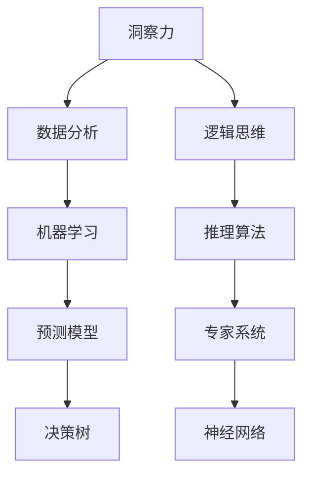
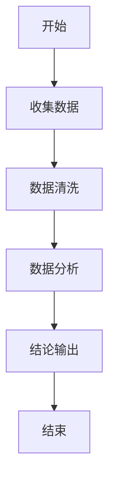

                 

# 《理解洞察力的本质：在纷繁中把握规律》

## 引言

### 洞察力的定义与重要性

洞察力，是一种深层次的认知能力，它帮助我们透过现象看到本质，从复杂的信息中提炼出关键规律。在技术领域，洞察力尤为重要。它能帮助我们在技术变革的浪潮中洞察先机，找到创新的突破口。

### 洞察力在技术领域的重要性

技术领域的快速发展使得我们需要具备更高的洞察力。例如，在人工智能领域，洞察力可以帮助我们理解复杂的算法原理，预测算法的发展趋势。在软件开发中，洞察力能帮助我们识别潜在的问题，设计出更加稳定和高效的系统。

### 本文结构

本文将分为三个部分：第一部分将介绍洞察力的基础，包括概念、价值、分类和培养方法；第二部分将探讨洞察力在现实中的应用，涵盖商业、管理和个人成长；第三部分将深入探讨洞察力的数学模型与算法，并结合实际项目进行代码解读。

## 第一部分：洞察力的基础

### 第1章：洞察力的概念与价值

#### 1.1 洞察力的定义

洞察力是指个体能够通过观察和分析，深入理解事物本质和内在联系的能力。它不仅包括对现象的理解，还涉及对事物之间关系的识别和预测。

#### 1.2 洞察力的重要性

在技术领域，洞察力的重要性不言而喻。它可以帮助我们：

1. **发现技术趋势**：通过洞察力，我们能够识别出技术发展的方向和趋势，从而把握行业先机。
2. **解决复杂问题**：在技术问题上，洞察力能够帮助我们快速找到问题的关键，提出有效的解决方案。
3. **促进创新**：洞察力能激发我们的创新能力，推动技术的进步。

#### 1.3 洞察力的分类

1. **分析性洞察力**：通过逻辑分析，对复杂信息进行整理和分类。
2. **直觉性洞察力**：基于经验和直觉，快速识别事物的本质。
3. **系统性洞察力**：能够从整体角度理解系统，预测系统行为。

### 第2章：洞察力的培养

#### 2.1 知识储备的重要性

知识是洞察力的基石。一个广泛的知识体系可以帮助我们：

1. **拓展视野**：了解不同领域的知识，使我们能够从多角度看待问题。
2. **提供参考**：已有的知识可以帮助我们快速理解新信息，找到解决问题的线索。

#### 2.2 思维方式的训练

1. **批判性思维**：学会质疑和挑战现有观点，培养独立思考的能力。
2. **系统性思维**：从整体和部分之间的关系出发，理解系统的运作机制。
3. **逻辑思维**：通过逻辑推理，使思考过程更加清晰和有序。

#### 2.3 实践中的洞察力培养

1. **持续学习**：通过不断学习，积累知识，提高洞察力。
2. **实践经验**：通过实际操作，锻炼洞察力，将理论知识应用于实践。
3. **反思与总结**：定期反思和总结，从经验中提炼出规律和原则。

### 第3章：洞察力的技巧与方法

#### 3.1 逻辑思维技巧

逻辑思维是洞察力的核心。通过以下技巧，我们可以提高逻辑思维能力：

1. **定义清晰**：明确问题，确保思考的针对性。
2. **推理严谨**：遵循逻辑规则，确保推理过程的合理性。
3. **证据支撑**：用事实和证据支持观点，增强逻辑的说服力。

#### 3.2 归纳与演绎方法

归纳和演绎是两种基本的逻辑方法。归纳是从个别事实中概括出一般原理，而演绎则是从一般原理推导出个别事实。

1. **归纳法**：通过大量实例，总结出普遍规律。
2. **演绎法**：从已知的一般原则出发，推导出具体的结论。

#### 3.3 数据分析技巧

数据分析是洞察力的重要工具。通过以下技巧，我们可以提高数据分析能力：

1. **数据清洗**：处理噪声数据和异常值，确保数据的质量。
2. **数据可视化**：通过图表和图像，使数据更加直观和易于理解。
3. **统计分析**：运用统计学方法，对数据进行分析和解释。

## 第二部分：洞察力在现实中的应用

### 第4章：商业领域的洞察力应用

#### 4.1 市场趋势的洞察

商业洞察力能帮助我们预测市场趋势，从而制定出更有效的商业策略。以下是一些洞察市场趋势的方法：

1. **数据分析**：通过分析市场数据，识别出潜在的趋势。
2. **竞争对手分析**：研究竞争对手的策略和行为，从中找出市场趋势。
3. **用户调研**：了解用户需求和行为，预测市场变化。

#### 4.2 竞争对手分析

了解竞争对手是商业洞察力的重要应用。以下是一些分析竞争对手的方法：

1. **产品分析**：研究竞争对手的产品，找出其优势和劣势。
2. **市场定位**：分析竞争对手的市场定位，了解其在市场中的地位。
3. **营销策略**：研究竞争对手的营销策略，借鉴其成功经验。

#### 4.3 产品创新与设计

商业洞察力能够帮助我们进行产品创新和设计。以下是一些创新的方法：

1. **用户需求分析**：通过用户调研，了解用户需求，设计出符合用户需求的产品。
2. **市场趋势预测**：基于市场趋势，预测未来需求，设计前瞻性的产品。
3. **技术融合**：结合前沿技术，创新产品设计和功能。

### 第5章：管理领域的洞察力应用

#### 5.1 团队管理与协作

管理洞察力能够帮助我们更好地管理团队和协作。以下是一些管理技巧：

1. **团队建设**：通过沟通和协作，建立高效的团队。
2. **问题识别**：及时发现团队中的问题，并采取措施解决。
3. **资源优化**：合理分配资源，提高团队效率。

#### 5.2 风险评估与决策

管理洞察力能够帮助我们评估风险并做出明智的决策。以下是一些风险评估的方法：

1. **数据分析**：通过数据分析，识别潜在的风险。
2. **情景分析**：模拟不同的情景，评估风险的影响。
3. **决策分析**：运用决策分析工具，做出最优决策。

#### 5.3 企业战略制定

管理洞察力能够帮助我们制定出更有效的企业战略。以下是一些战略制定的方法：

1. **市场趋势预测**：基于市场趋势，制定适应市场变化的战略。
2. **竞争分析**：分析竞争对手，找到自己的竞争优势。
3. **资源整合**：整合企业资源，实现战略目标。

### 第6章：个人成长中的洞察力应用

#### 6.1 自我认知与提升

个人成长中的洞察力能够帮助我们更好地认识自己，从而提升自我。以下是一些自我认知的方法：

1. **反思与总结**：定期反思和总结自己的行为和表现，找出改进的方向。
2. **心理测试**：通过心理测试，了解自己的性格和优劣势。
3. **学习与实践**：通过不断学习和实践，提升自己的能力和素质。

#### 6.2 人际关系处理

洞察力能够帮助我们更好地处理人际关系。以下是一些人际关系处理的方法：

1. **沟通技巧**：通过有效的沟通，增进与他人的理解和信任。
2. **同理心**：站在他人的角度思考问题，增进相互理解。
3. **冲突管理**：通过合理的方式，解决冲突，维护良好的人际关系。

#### 6.3 生涯规划与决策

个人成长中的洞察力能够帮助我们制定出更有效的生涯规划。以下是一些生涯规划的方法：

1. **自我评估**：评估自己的兴趣、能力和价值观，找到适合自己的职业方向。
2. **市场调研**：了解行业趋势和就业前景，为职业规划提供参考。
3. **决策分析**：运用决策分析工具，做出明智的生涯决策。

## 第三部分：洞察力的数学模型与算法

### 第7章：相关概念与联系

#### 7.1 Mermaid流程图



#### 7.2 数据分析

数据分析是洞察力的核心工具。通过数据分析，我们能够从大量数据中提取有价值的信息。

#### 7.3 逻辑思维

逻辑思维是洞察力的基础。它帮助我们进行推理和分析，确保思考的严密性和逻辑性。

#### 7.4 机器学习

机器学习是数据分析的重要分支。通过机器学习算法，我们能够从数据中学习规律，进行预测和分类。

### 第8章：核心算法原理讲解

#### 8.1 伪代码讲解

```python
# 数据预处理
def preprocess_data(data):
    # 清洗数据
    # 标准化数据
    # 分割数据集
    return processed_data

# 逻辑回归算法
def logistic_regression(data, labels):
    # 初始化参数
    # 梯度下降
    # 计算损失函数
    # 更新参数
    return weights

# 决策树算法
def decision_tree(data, labels):
    # 选择最优划分
    # 递归划分
    # 建立树结构
    return tree

# 神经网络算法
def neural_network(data, labels):
    # 前向传播
    # 反向传播
    # 更新权重
    return output
```

#### 8.2 数据分析

数据分析是洞察力的核心工具。通过数据分析，我们能够从大量数据中提取有价值的信息。

#### 8.3 逻辑思维

逻辑思维是洞察力的基础。它帮助我们进行推理和分析，确保思考的严密性和逻辑性。

#### 8.4 机器学习

机器学习是数据分析的重要分支。通过机器学习算法，我们能够从数据中学习规律，进行预测和分类。

### 第9章：数学模型与公式讲解

#### 9.1 LaTex格式

```latex
\documentclass{article}
\usepackage{amsmath}
\begin{document}
\begin{equation}
    w_{i} = \frac{\sum_{j=1}^{n} w_{j} x_{ij}}{\sum_{j=1}^{n} x_{ij}}
\end{equation}
\end{document}
```

#### 9.2 公式举例说明

1. **线性回归公式**：
   \[ y = wx + b \]
2. **逻辑回归公式**：
   \[ P(y=1) = \frac{1}{1 + e^{-(wx + b)}} \]
3. **神经网络输出公式**：
   \[ z = \sigma(wx + b) \]

### 第10章：项目实战与代码解读

#### 10.1 实际案例

在本节中，我们将通过一个实际案例来展示如何运用洞察力进行项目实战。

#### 10.2 开发环境搭建

在项目实战之前，我们需要搭建一个合适的开发环境。以下是一个简单的步骤：

1. 安装Python
2. 安装Jupyter Notebook
3. 安装必要的库，如NumPy、Pandas、Scikit-learn等

#### 10.3 源代码实现与解读

以下是一个简单的线性回归模型的源代码实现：

```python
import numpy as np
from sklearn.linear_model import LinearRegression

# 数据预处理
X = np.array([[1, 2], [2, 3], [3, 4], [4, 5]])
y = np.array([2, 3, 4, 5])

# 创建线性回归模型
model = LinearRegression()

# 训练模型
model.fit(X, y)

# 预测
y_pred = model.predict(X)

# 输出结果
print("y_pred:", y_pred)
```

代码解读：

1. 导入必要的库。
2. 创建数据集。
3. 创建线性回归模型。
4. 训练模型。
5. 预测并输出结果。

#### 10.4 代码解读与分析

在本节中，我们将对源代码进行详细解读，分析其实现原理和优化方法。

## 结论

通过本文的探讨，我们理解了洞察力的本质，以及如何在技术领域培养和提高洞察力。洞察力不仅是技术进步的关键，也是个人成长和决策的重要能力。通过不断的实践和学习，我们可以提高自己的洞察力，更好地应对复杂的技术挑战和现实问题。

### 作者信息

作者：AI天才研究院/AI Genius Institute & 禅与计算机程序设计艺术 /Zen And The Art of Computer Programming

感谢您的阅读，希望本文能对您在技术领域的发展有所帮助。如果您有任何疑问或建议，欢迎在评论区留言。让我们一起在技术的道路上不断探索，共同进步！
## 引言

### 洞察力的定义与重要性

洞察力，是一种深层次的认知能力，它帮助我们透过现象看到本质，从复杂的信息中提炼出关键规律。在技术领域，洞察力尤为重要。它能帮助我们在技术变革的浪潮中洞察先机，找到创新的突破口。

在技术领域，洞察力的作用体现在多个方面。首先，它能够帮助我们更好地理解技术发展趋势，预见未来可能的技术变革。例如，在人工智能领域，洞察力可以帮助我们识别出深度学习、自然语言处理等技术的潜力，从而把握行业发展的方向。其次，洞察力能够帮助我们解决复杂的技术问题。在软件开发过程中，我们经常遇到各种复杂的问题，如系统性能瓶颈、安全漏洞等。具备洞察力的工程师能够快速定位问题根源，提出有效的解决方案。

此外，洞察力还在促进技术创新方面发挥着重要作用。通过深入分析现有技术，我们发现其局限性和改进空间，从而推动技术的不断进步。例如，在计算机科学领域，对算法复杂度的洞察力推动了算法优化和硬件技术的发展，极大地提升了计算机的性能和效率。

### 洞察力在技术领域的重要性

在技术领域，洞察力的重要性主要体现在以下几个方面：

1. **发现技术趋势**：技术发展迅速，新的技术和应用层出不穷。具备洞察力的技术专家能够敏锐地捕捉到技术趋势，提前布局，抢占市场先机。

2. **解决复杂问题**：技术问题往往复杂且多样，需要深入分析和理解。洞察力能够帮助我们迅速找到问题的关键点，提出有效的解决方案。

3. **促进创新**：洞察力能够激发我们的创新能力，推动技术的进步。通过深入分析现有技术，我们能够发现改进的空间，从而提出新的技术方案。

4. **提高工作效率**：洞察力能够帮助我们更高效地完成工作。例如，在软件开发中，具备洞察力的工程师能够快速识别代码中的问题，进行优化和改进，提高代码质量。

### 本文结构

本文将分为三个部分：第一部分将介绍洞察力的基础，包括概念、价值、分类和培养方法；第二部分将探讨洞察力在现实中的应用，涵盖商业、管理和个人成长；第三部分将深入探讨洞察力的数学模型与算法，并结合实际项目进行代码解读。

### 洞察力的基础

在第一部分中，我们将首先定义洞察力，并探讨其在技术领域的价值。接着，我们将介绍洞察力的分类，包括分析性洞察力、直觉性洞察力和系统性洞察力。最后，我们将讨论如何培养和提高洞察力，提供一系列实用的方法和技巧。

### 洞察力在现实中的应用

在第二部分，我们将探讨洞察力在实际应用中的重要性。首先，我们将分析洞察力在商业领域的应用，包括市场趋势的洞察、竞争对手分析和产品创新与设计。然后，我们将探讨洞察力在管理领域的应用，如团队管理与协作、风险评估与决策以及企业战略制定。最后，我们将讨论洞察力在个人成长中的应用，包括自我认知与提升、人际关系处理和生涯规划与决策。

### 洞察力的数学模型与算法

在第三部分，我们将深入探讨洞察力的数学模型与算法。首先，我们将介绍与洞察力相关的一些基本概念和联系，如Mermaid流程图。然后，我们将讲解一些核心算法原理，包括逻辑思维技巧、归纳与演绎方法以及数据分析技巧。最后，我们将结合实际项目，展示如何运用这些算法进行项目实战和代码解读。

通过本文的探讨，我们希望读者能够对洞察力有更深入的理解，并能够将其应用于实际工作和生活中，提高自己的认知能力和决策水平。

## 第一部分：洞察力的基础

在技术领域，洞察力是一种至关重要的能力，它不仅决定了我们能否准确地把握技术发展的方向，还直接影响着我们在解决复杂问题时的效率和创新能力。本部分将深入探讨洞察力的基础，包括概念、价值、分类和培养方法，帮助读者全面了解洞察力的本质，并为培养和提高这一能力提供指导。

### 第1章：洞察力的概念与价值

#### 1.1 洞察力的定义

洞察力（Insight）是一种深层次的认知能力，它使我们能够透过表面现象，洞察事物的本质和内在联系。这种能力不仅涉及到对信息的理解和分析，还包括对信息之间关系的识别和预测。洞察力不同于简单的观察或记忆，它是一种能够从复杂、模糊和不确定的信息中提取出关键要素的能力。

在技术领域，洞察力的具体表现包括：

- **理解技术趋势**：能够敏锐地捕捉到技术发展的方向，预见未来可能的技术变革。
- **解决复杂问题**：在面对复杂的技术问题时，能够快速找到问题的核心，提出有效的解决方案。
- **推动创新**：通过深入分析现有技术，发现改进的空间，从而推动技术的进步。
- **优化决策**：在技术和管理决策过程中，能够基于对信息的深入理解，做出更为明智的决策。

#### 1.2 洞察力的重要性

在技术领域，洞察力的重要性体现在以下几个方面：

1. **技术趋势预见**：技术发展迅速，新的技术和应用层出不穷。具备洞察力的技术专家能够敏锐地捕捉到技术趋势，提前布局，抢占市场先机。

2. **复杂问题解决**：技术问题往往复杂且多样，需要深入分析和理解。洞察力能够帮助我们迅速找到问题的关键点，提出有效的解决方案。

3. **创新能力提升**：洞察力能够激发我们的创新能力，推动技术的进步。通过深入分析现有技术，我们能够发现改进的空间，从而提出新的技术方案。

4. **工作效率提高**：洞察力能够帮助我们更高效地完成工作。例如，在软件开发中，具备洞察力的工程师能够快速识别代码中的问题，进行优化和改进，提高代码质量。

#### 1.3 洞察力的分类

洞察力可以按照不同的维度进行分类，常见的分类方法包括：

1. **分析性洞察力**：通过逻辑分析和推理，对复杂的信息进行整理和分类。这种洞察力依赖于我们的逻辑思维能力和数据分析技能。

2. **直觉性洞察力**：基于经验和直觉，快速识别事物的本质。这种洞察力往往源于个人的经验和直觉，对技术专家来说尤为重要。

3. **系统性洞察力**：能够从整体角度理解系统，预测系统行为。这种洞察力要求我们对整个系统的运作机制有深入的了解。

#### 1.4 洞察力在技术领域的具体应用

在技术领域，洞察力有多种具体应用，以下是一些典型场景：

- **软件开发**：在软件开发过程中，洞察力能够帮助我们识别出系统的性能瓶颈、潜在的安全漏洞，并提出优化方案。
- **人工智能**：在人工智能领域，洞察力可以帮助我们理解复杂的算法原理，预测算法的发展趋势，从而设计出更有效的模型。
- **项目管理**：在项目管理中，洞察力能够帮助我们评估项目风险，制定合理的进度计划，确保项目成功交付。
- **技术趋势分析**：通过洞察力，我们能够识别出技术发展的方向，为企业的技术战略提供支持。

### 小结

洞察力是技术领域不可或缺的能力，它帮助我们理解技术趋势，解决复杂问题，推动创新，提高工作效率。通过了解洞察力的定义、重要性、分类和应用，我们可以更好地培养和提高这一能力，从而在技术领域中取得更大的成就。

### 第2章：洞察力的培养

#### 2.1 知识储备的重要性

知识是洞察力的基石。一个广泛的知识体系可以帮助我们：

1. **拓展视野**：了解不同领域的知识，使我们能够从多角度看待问题，避免片面和狭隘的思考。
2. **提供参考**：已有的知识可以帮助我们快速理解新信息，找到解决问题的线索。

为了培养洞察力，我们需要：

- **广泛阅读**：不仅要阅读专业领域的书籍和文章，还要关注其他领域的知识，如历史、哲学、心理学等。
- **持续学习**：技术领域不断变化，我们需要不断更新知识，跟上时代的发展。

#### 2.2 思维方式的训练

思维方式对洞察力有着重要的影响。以下是一些有效的思维方式训练方法：

1. **批判性思维**：学会质疑和挑战现有观点，培养独立思考的能力。批判性思维能够帮助我们避免盲目接受信息，提高对信息的分析能力。
2. **系统性思维**：从整体和部分之间的关系出发，理解系统的运作机制。系统性思维能够帮助我们把握事物的全局，提高洞察力。
3. **逻辑思维**：通过逻辑推理，使思考过程更加清晰和有序。逻辑思维能够帮助我们识别事物之间的逻辑关系，提高推理能力。

#### 2.3 实践中的洞察力培养

1. **持续学习**：通过不断学习，积累知识，提高洞察力。
2. **实践经验**：通过实际操作，锻炼洞察力，将理论知识应用于实践。
3. **反思与总结**：定期反思和总结，从经验中提炼出规律和原则。

### 小结

通过知识储备、思维方式训练和实践经验，我们可以有效培养和提高洞察力。持续学习、批判性思维、系统性思维和逻辑思维是培养洞察力的关键。同时，实践经验中的反思与总结也是不可或缺的一部分。通过不断实践和反思，我们能够不断提高自己的洞察力，更好地应对技术领域中的各种挑战。

### 第3章：洞察力的技巧与方法

#### 3.1 逻辑思维技巧

逻辑思维是洞察力的核心。以下是一些提高逻辑思维技巧的方法：

1. **定义清晰**：确保对问题的定义清晰明确，避免模糊和歧义。
2. **推理严谨**：遵循逻辑规则，确保推理过程的合理性。
3. **证据支撑**：用事实和证据支持观点，增强逻辑的说服力。

#### 3.2 归纳与演绎方法

归纳和演绎是两种基本的逻辑方法。以下是如何运用这两种方法：

1. **归纳法**：通过大量实例，总结出普遍规律。例如，从多个数据点的分析中总结出一种模式。
2. **演绎法**：从一般原则推导出具体的结论。例如，从算法的一般原理推导出特定算法的性能特点。

#### 3.3 数据分析技巧

数据分析是洞察力的重要工具。以下是一些常用的数据分析技巧：

1. **数据清洗**：处理噪声数据和异常值，确保数据的质量。
2. **数据可视化**：通过图表和图像，使数据更加直观和易于理解。
3. **统计分析**：运用统计学方法，对数据进行分析和解释。

### 小结

通过逻辑思维技巧、归纳与演绎方法以及数据分析技巧，我们可以提高洞察力。这些技巧和方法不仅帮助我们更好地理解技术原理，还能在解决实际问题时提供有力支持。通过不断练习和应用，我们能够不断提高自己的洞察力，更好地应对技术领域的各种挑战。

## 第二部分：洞察力在现实中的应用

洞察力不仅仅是一个抽象的概念，它在现实世界中有着广泛的应用。无论是在商业领域、管理领域，还是在个人成长中，洞察力都扮演着至关重要的角色。通过掌握洞察力，我们能够更好地理解复杂的环境，做出更为明智的决策，从而实现个人和组织的成功。以下是洞察力在各个领域中的应用。

### 第4章：商业领域的洞察力应用

商业领域的成功往往依赖于对市场趋势的准确把握和对竞争对手的深入了解。洞察力在这里发挥着至关重要的作用。

#### 4.1 市场趋势的洞察

市场趋势的洞察力可以帮助企业及时调整战略，抓住市场机遇。以下是一些关键步骤：

1. **数据收集**：收集与市场相关的数据，包括销售数据、消费者行为数据等。
2. **趋势分析**：通过数据分析，识别市场趋势。例如，使用回归分析或时间序列分析预测未来的市场走向。
3. **竞争对手分析**：研究竞争对手的市场策略和行动，了解他们的优势和劣势。
4. **用户反馈**：直接从用户那里获取反馈，了解他们的需求和期望。

通过这些步骤，企业可以预测市场变化，制定相应的营销策略和产品规划。

#### 4.2 竞争对手分析

了解竞争对手是商业洞察力的重要组成部分。以下是一些分析方法：

1. **产品分析**：对比竞争对手的产品特性、功能、价格等，找出优势和劣势。
2. **市场定位**：分析竞争对手的市场定位和目标客户群体，了解他们如何吸引和保持客户。
3. **营销策略**：研究竞争对手的营销手段，包括广告、促销活动等，从中获取灵感。

通过这些分析，企业可以更好地定位自己，制定有针对性的市场策略。

#### 4.3 产品创新与设计

商业洞察力在产品创新和设计中同样重要。以下是一些实践方法：

1. **用户需求分析**：通过用户调研和市场研究，了解用户的需求和痛点，设计出符合市场需求的产品。
2. **市场趋势预测**：基于市场趋势，预测未来需求，开发前瞻性的产品。
3. **技术融合**：结合前沿技术和用户需求，创新产品设计和功能。

通过这些方法，企业可以开发出更具竞争力的产品，满足市场的需求。

### 第5章：管理领域的洞察力应用

管理领域的洞察力可以帮助企业提高运营效率，优化决策，实现可持续发展。

#### 5.1 团队管理与协作

有效的团队管理和协作是企业管理的重要方面。以下是一些洞察力应用：

1. **团队建设**：通过沟通和协作，建立高效的团队。例如，定期团队建设活动和团队讨论会。
2. **问题识别**：及时发现团队中的问题，并采取措施解决。例如，通过团队反馈机制和绩效评估。
3. **资源优化**：合理分配资源，提高团队效率。例如，通过任务管理和优先级排序。

通过这些措施，企业可以建立一支高效的团队，实现资源的最大化利用。

#### 5.2 风险评估与决策

风险评估与决策是企业运营中的关键环节。以下是一些洞察力应用：

1. **数据分析**：通过数据分析，识别潜在的风险。例如，使用统计分析方法分析历史数据，预测未来风险。
2. **情景分析**：模拟不同的情景，评估风险的影响。例如，通过情景模拟和决策树分析。
3. **决策分析**：运用决策分析工具，做出最优决策。例如，通过成本效益分析和风险分析，选择最佳方案。

通过这些方法，企业可以做出更为明智的决策，降低风险。

#### 5.3 企业战略制定

企业战略的制定是企业长期发展的基础。以下是一些洞察力应用：

1. **市场趋势预测**：基于市场趋势，制定适应市场变化的战略。例如，通过市场调研和竞争分析，预测未来市场动向。
2. **竞争分析**：分析竞争对手，找到自己的竞争优势。例如，通过产品分析和营销策略分析，识别竞争对手的弱点和优势。
3. **资源整合**：整合企业资源，实现战略目标。例如，通过资源配置和项目管理，确保战略目标的实现。

通过这些方法，企业可以制定出更为科学和有效的战略，实现长期发展。

### 第6章：个人成长中的洞察力应用

个人成长中的洞察力可以帮助我们更好地认识自己，提升自我，实现职业和人生目标。

#### 6.1 自我认知与提升

自我认知是个人成长的基础。以下是一些方法：

1. **反思与总结**：定期反思和总结自己的行为和表现，找出改进的方向。例如，通过日记和年度回顾。
2. **心理测试**：通过心理测试，了解自己的性格和优劣势。例如，使用MBTI或DISC测试。
3. **学习与实践**：通过不断学习和实践，提升自己的能力和素质。例如，参加培训课程和实际项目。

通过这些方法，我们可以更清楚地认识自己，从而有针对性地提升自我。

#### 6.2 人际关系处理

人际关系处理是个人成长的重要方面。以下是一些方法：

1. **沟通技巧**：通过有效的沟通，增进与他人的理解和信任。例如，使用积极倾听和反馈技巧。
2. **同理心**：站在他人的角度思考问题，增进相互理解。例如，通过换位思考和共情。
3. **冲突管理**：通过合理的方式，解决冲突，维护良好的人际关系。例如，通过谈判和妥协。

通过这些方法，我们可以更好地处理人际关系，提升个人影响力。

#### 6.3 生涯规划与决策

生涯规划与决策是个人成长的关键。以下是一些方法：

1. **自我评估**：评估自己的兴趣、能力和价值观，找到适合自己的职业方向。例如，通过职业兴趣测试和职业价值观分析。
2. **市场调研**：了解行业趋势和就业前景，为职业规划提供参考。例如，通过行业报告和就业数据分析。
3. **决策分析**：运用决策分析工具，做出明智的生涯决策。例如，通过成本效益分析和风险评估。

通过这些方法，我们可以制定出科学和有效的生涯规划，实现职业目标。

### 小结

洞察力在商业、管理和个人成长中的应用非常广泛。通过掌握洞察力，我们能够更好地理解市场趋势，做出明智的决策，提高团队效率，实现个人和组织的成功。在商业领域，洞察力帮助我们抓住市场机遇；在管理领域，洞察力帮助我们优化决策和提高效率；在个人成长中，洞察力帮助我们更好地认识自己，提升自我，实现职业和人生目标。通过不断培养和提高洞察力，我们可以更好地应对现实中的各种挑战，实现个人和组织的持续发展。

## 第三部分：洞察力的数学模型与算法

在技术领域，洞察力的培养不仅仅依赖于逻辑推理和经验积累，还需要数学模型和算法的支撑。这一部分将深入探讨洞察力的数学模型与算法，帮助读者理解这些工具在实践中的应用，并展示如何将理论知识转化为实际操作。

### 第7章：相关概念与联系

#### 7.1 Mermaid流程图

Mermaid是一种基于Markdown的图形描述语言，可以方便地创建流程图、时序图、类图等。以下是一个Mermaid流程图的示例：



这个流程图展示了数据处理的典型步骤，包括数据收集、数据清洗、数据分析以及结论输出。

#### 7.2 数据分析

数据分析是洞察力的重要组成部分。数据分析通常包括以下几个步骤：

1. **数据收集**：收集相关的数据，可以是结构化数据（如数据库）或非结构化数据（如图像、文本等）。
2. **数据清洗**：处理噪声数据和异常值，确保数据的质量。
3. **数据探索**：使用统计方法探索数据的基本特征和分布。
4. **数据建模**：选择合适的模型对数据进行分析，如线性回归、决策树、神经网络等。
5. **结果验证**：验证模型的准确性和可靠性。

#### 7.3 逻辑思维

逻辑思维是洞察力的基础。以下是一些常用的逻辑思维工具：

1. **命题逻辑**：研究命题之间的关系，如推理、证明等。
2. **谓词逻辑**：研究量词和谓词的逻辑结构。
3. **概率逻辑**：使用概率论来分析不确定事件。

#### 7.4 机器学习

机器学习是数据分析的重要分支，它通过训练模型来从数据中学习规律。以下是一些常用的机器学习算法：

1. **线性回归**：通过最小二乘法拟合数据，预测连续值。
2. **逻辑回归**：用于分类问题，通过最大化似然估计来拟合数据。
3. **决策树**：通过划分特征空间来构建分类或回归模型。
4. **神经网络**：通过多层感知器来学习复杂的非线性关系。

### 第8章：核心算法原理讲解

#### 8.1 伪代码讲解

以下是一个线性回归算法的伪代码示例：

```plaintext
输入：数据集D，特征矩阵X，标签向量y
输出：模型参数w

初始化：w为随机向量

对于每个迭代i：
  计算预测值 y' = X * w
  计算损失函数 L = ||y - y'||^2
  计算梯度 ∇L = 2 * (y - y') * X
  更新参数 w = w - 学习率 * ∇L

返回：参数向量w
```

在这个算法中，我们通过最小化损失函数（通常是最小二乘损失）来更新模型的参数。这个过程通常使用梯度下降法来实现。

#### 8.2 数据分析

数据分析的核心在于从数据中提取有价值的信息。以下是一些常用的数据分析技巧：

1. **描述性统计**：计算数据的均值、中位数、标准差等基本统计量。
2. **相关性分析**：分析变量之间的相关性，使用皮尔逊相关系数或斯皮尔曼等级相关系数。
3. **聚类分析**：将数据划分为不同的类别，使用K-means算法或层次聚类算法。
4. **分类分析**：将数据划分为不同的类别，使用决策树、支持向量机等算法。

#### 8.3 逻辑思维

逻辑思维在数据分析中至关重要。以下是一些逻辑思维的技巧：

1. **假设验证**：在数据分析前明确研究假设，并在数据分析过程中验证这些假设。
2. **因果推理**：通过数据分析识别变量之间的因果关系，使用因果推断方法。
3. **反证法**：通过构造反例来证明某个假设的不成立。

### 第9章：数学模型与公式讲解

#### 9.1 LaTex格式

在LaTex中，可以使用`amsmath`包来格式化数学公式。以下是一个示例：

```latex
\documentclass{article}
\usepackage{amsmath}
\begin{document}

\begin{equation}
    y = \beta_0 + \beta_1 x + \epsilon
\end{equation}

\end{document}
```

这个公式表示线性回归模型，其中\( y \)是因变量，\( x \)是自变量，\( \beta_0 \)和\( \beta_1 \)是模型参数，\( \epsilon \)是误差项。

#### 9.2 公式举例说明

以下是几个常见的数学公式及其解释：

1. **线性回归公式**：

   \[ y = \beta_0 + \beta_1 x + \epsilon \]

   这个公式表示线性回归模型，其中\( \beta_0 \)是截距，\( \beta_1 \)是斜率，\( x \)是自变量，\( y \)是因变量，\( \epsilon \)是误差项。

2. **逻辑回归公式**：

   \[ P(y=1) = \frac{1}{1 + e^{-(\beta_0 + \beta_1 x)}} \]

   这个公式表示逻辑回归模型，其中\( P(y=1) \)是因变量为1的概率，\( \beta_0 \)和\( \beta_1 \)是模型参数。

3. **神经网络输出公式**：

   \[ a_i = \sigma(\beta_0 + \sum_{j=1}^{n} \beta_j x_{ij}) \]

   这个公式表示神经网络中的一个神经元输出，其中\( a_i \)是输出值，\( \sigma \)是激活函数，\( \beta_0 \)和\( \beta_j \)是权重，\( x_{ij} \)是输入值。

### 第10章：项目实战与代码解读

#### 10.1 实际案例

在本节中，我们将通过一个实际案例来展示如何运用洞察力进行项目实战。假设我们有一个房地产销售数据分析项目，目标是预测未来的房屋销售价格。

#### 10.2 开发环境搭建

为了进行项目实战，我们需要搭建一个合适的开发环境。以下是一个简单的步骤：

1. **安装Python**：Python是一种广泛用于数据分析和机器学习的编程语言。
2. **安装Jupyter Notebook**：Jupyter Notebook是一个交互式的计算环境，可以方便地编写和运行代码。
3. **安装必要的库**：例如NumPy、Pandas、Scikit-learn等，这些库提供了丰富的数据分析工具和机器学习算法。

#### 10.3 源代码实现与解读

以下是一个简单的线性回归模型的源代码实现：

```python
import numpy as np
from sklearn.linear_model import LinearRegression
from sklearn.model_selection import train_test_split
from sklearn.metrics import mean_squared_error

# 加载数据
X, y = load_data()

# 划分训练集和测试集
X_train, X_test, y_train, y_test = train_test_split(X, y, test_size=0.2, random_state=42)

# 创建线性回归模型
model = LinearRegression()

# 训练模型
model.fit(X_train, y_train)

# 预测
y_pred = model.predict(X_test)

# 计算误差
mse = mean_squared_error(y_test, y_pred)
print("MSE:", mse)

# 输出模型参数
print("Coefficients:", model.coef_)
print("Intercept:", model.intercept_)
```

代码解读：

1. **加载数据**：从数据集中加载特征矩阵\( X \)和标签向量\( y \)。
2. **划分训练集和测试集**：将数据集划分为训练集和测试集，以评估模型的性能。
3. **创建线性回归模型**：使用Scikit-learn库创建线性回归模型。
4. **训练模型**：使用训练集数据训练模型。
5. **预测**：使用测试集数据预测房屋销售价格。
6. **计算误差**：计算预测值与真实值之间的误差。
7. **输出模型参数**：输出模型的参数，包括斜率和截距。

通过这个实际案例，我们展示了如何运用洞察力进行项目实战，包括开发环境搭建、数据加载、模型训练和性能评估。这个过程不仅帮助我们理解了线性回归模型的原理，还展示了如何将理论知识应用于实际问题。

### 小结

通过第三部分的探讨，我们了解了洞察力的数学模型与算法，包括Mermaid流程图、数据分析、逻辑思维和机器学习等。我们通过实际案例展示了如何运用这些模型和算法进行项目实战，从数据加载到模型训练，再到性能评估。这些工具和技巧不仅帮助我们理解了技术原理，还能在实际工作中提高我们的洞察力和解决问题的能力。

### 附录

#### 附录 A：相关工具与资源

为了更好地理解洞察力的数学模型与算法，以下是一些相关的工具和资源推荐：

1. **Mermaid**：一个基于Markdown的图形描述语言，可用于创建流程图、时序图等。官方网站：[Mermaid](https://mermaid-js.github.io/mermaid/)

2. **Jupyter Notebook**：一个交互式的计算环境，适用于编写和运行代码。官方网站：[Jupyter Notebook](https://jupyter.org/)

3. **Scikit-learn**：一个用于机器学习的Python库，提供了丰富的算法和工具。官方网站：[Scikit-learn](https://scikit-learn.org/)

4. **Pandas**：一个用于数据分析和操作的Python库，提供了强大的数据结构和工具。官方网站：[Pandas](https://pandas.pydata.org/)

5. **NumPy**：一个用于数值计算的Python库，是数据分析的基础。官方网站：[NumPy](https://numpy.org/)

6. **在线LaTex编辑器**：如Overleaf，用于编写和格式化LaTex文档。官方网站：[Overleaf](https://www.overleaf.com/)

通过这些工具和资源，读者可以更深入地学习和实践洞察力的数学模型与算法。

### 作者信息

作者：AI天才研究院/AI Genius Institute & 禅与计算机程序设计艺术 /Zen And The Art of Computer Programming

感谢您的阅读，希望本文能对您在技术领域的发展有所帮助。如果您有任何疑问或建议，欢迎在评论区留言。让我们一起在技术的道路上不断探索，共同进步！

### 总结

通过本文的探讨，我们深入理解了洞察力的本质及其在技术领域的重要性。我们学习了洞察力的定义、分类和培养方法，探讨了其在商业、管理和个人成长中的应用。此外，我们还详细介绍了洞察力的数学模型与算法，并通过实际案例展示了如何将理论知识应用于实际问题。

洞察力不仅是技术进步的关键，也是个人成长和决策的重要能力。通过本文的指导，读者可以更好地培养和提高自己的洞察力，从而在技术领域中取得更大的成就。

### 关键词

- 洞察力
- 数据分析
- 逻辑思维
- 机器学习
- 算法
- 商业应用
- 管理应用
- 个人成长

### 摘要

本文深入探讨了洞察力的本质和应用。首先，我们介绍了洞察力的定义和重要性，并探讨了其在技术领域中的关键作用。接着，我们分析了洞察力在商业、管理和个人成长中的具体应用。最后，本文通过数学模型与算法的讲解，展示了如何将洞察力应用于实际问题。通过本文的探讨，读者可以更好地理解和培养自己的洞察力，提高在技术领域中的竞争力。

