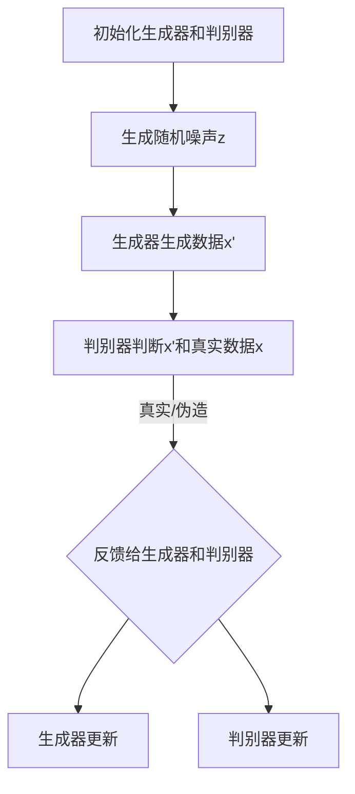

                 

**生成对抗网络在虚拟形象创建中的应用**

> **关键词：** 生成对抗网络（GAN），虚拟形象创建，人工智能，生成器，判别器，对抗训练，深度学习。

**摘要：** 本文将深入探讨生成对抗网络（GAN）在虚拟形象创建中的应用。首先，我们将介绍GAN的基础知识，包括其起源、基本架构和主要类型。接着，我们将分析GAN的基本原理和数学模型，并通过具体的流程图和伪代码示例来展示其工作原理。随后，我们将探讨GAN在虚拟形象创建中的实际应用，包括原理、优势和案例。最后，我们将深入讨论GAN在虚拟形象创建中的挑战和未来趋势，以及其深度应用和创新应用。

---

### 《生成对抗网络在虚拟形象创建中的应用》目录大纲

**第一部分：生成对抗网络基础**

**1.1 生成对抗网络（GAN）概述**

**1.1.1 GAN的起源与发展**

**1.1.2 GAN的基本架构**

**1.1.3 GAN的核心挑战与解决方案**

**1.2 生成对抗网络的基本原理**

**1.2.1 对抗训练机制**

**1.2.2 生成器与判别器的交互**

**1.2.3 GAN的数学模型**

**1.3 GAN的主要类型**

**1.3.1 基础GAN**

**1.3.2 改进型GAN**

**1.3.3 应用导向的GAN**

**1.4 GAN的数学模型和数学公式**

**1.4.1 均值漂移**

**1.4.2 生成器和判别器的损失函数**

**1.4.3 Latex格式数学公式示例**

**1.5 GAN的流程图**

**1.5.1 GAN的工作流程**

**1.5.2 生成器和判别器的交互流程**

**1.5.3 Mermaid流程图示例**

**第二部分：虚拟形象创建中的GAN应用**

**2.1 虚拟形象创建的基本概念**

**2.1.1 虚拟形象的定义与分类**

**2.1.2 虚拟形象创建的技术需求**

**2.1.3 虚拟形象在现实中的应用场景**

**2.2 GAN在虚拟形象创建中的应用**

**2.2.1 GAN在虚拟形象生成的原理**

**2.2.2 GAN在虚拟形象创建中的优势**

**2.2.3 GAN在虚拟形象创建中的应用案例**

**2.3 虚拟形象创建中的GAN应用案例**

**2.3.1 训练数据集的收集与处理**

**2.3.2 生成器的架构设计与优化**

**2.3.3 判别器的优化与调整**

**2.3.4 GAN训练过程监控与调参技巧**

**2.3.5 虚拟形象生成结果分析**

**2.4 GAN在虚拟形象创建中的挑战与未来趋势**

**2.4.1 GAN在虚拟形象创建中面临的挑战**

**2.4.2 虚拟形象创建中的GAN未来趋势**

**第三部分：GAN在虚拟形象创建中的深度应用**

**3.1 GAN在虚拟形象动态捕捉中的应用**

**3.1.1 动态捕捉技术概述**

**3.1.2 GAN在动态捕捉中的应用**

**3.1.3 动态GAN的架构与实现**

**3.2 GAN在虚拟形象交互中的应用**

**3.2.1 虚拟形象交互的概念与需求**

**3.2.2 GAN在虚拟形象交互中的应用**

**3.2.3 GAN在交互中的优势与挑战**

**3.3 GAN在虚拟形象风格迁移中的应用**

**3.3.1 风格迁移的概念与需求**

**3.3.2 GAN在风格迁移中的应用**

**3.3.3 风格GAN的架构与实现**

**3.4 GAN在虚拟形象创作中的创新应用**

**3.4.1 创作自由度的提升**

**3.4.2 跨媒体创作与应用**

**3.4.3 GAN在虚拟形象创作中的未来方向**

**第四部分：GAN在虚拟形象创建中的实战案例**

**4.1 实战案例一：基于GAN的虚拟形象生成**

**4.1.1 实战背景与目标**

**4.1.2 系统架构设计与实现**

**4.1.3 实战步骤与结果分析**

**4.2 实战案例二：基于GAN的虚拟形象动态捕捉**

**4.2.1 实战背景与目标**

**4.2.2 系统架构设计与实现**

**4.2.3 实战步骤与结果分析**

**4.3 实战案例三：基于GAN的虚拟形象风格迁移**

**4.3.1 实战背景与目标**

**4.3.2 系统架构设计与实现**

**4.3.3 实战步骤与结果分析**

**4.4 实战案例四：基于GAN的虚拟形象交互**

**4.4.1 实战背景与目标**

**4.4.2 系统架构设计与实现**

**4.4.3 实战步骤与结果分析**

**第五部分：GAN在虚拟形象创建中的未来展望**

**5.1 GAN在虚拟形象创建中的未来趋势**

**5.1.1 技术发展与创新**

**5.1.2 应用的拓展与融合**

**5.1.3 社会影响与伦理挑战**

**5.2 GAN在虚拟形象创建中的研究热点与方向**

**5.2.1 热点问题分析**

**5.2.2 研究方向展望**

**5.2.3 研究方法与技术创新**

**5.3 GAN在虚拟形象创建中的挑战与对策**

**5.3.1 技术挑战**

**5.3.2 应用挑战**

**5.3.3 对策与建议**

**附录**

**附录 A：GAN相关资源与工具**

**附录 B：虚拟形象创建的实用技巧与经验**

**附录 C：常见问题解答与参考阅读**

---

**注释：**
- **Mermaid流程图示例：** 
    mermaid
    graph TD
    A[生成器] --> B[生成数据]
    A --> C[判别器]
    C --> D[判断真实或伪造]
    D -->|真实| E[反馈给生成器]
    D -->|伪造| F[更新判别器]
    

- **伪代码示例：**
    python
    # 生成器伪代码
    function generator(z):
        x = tanh(Dense(z, output_shape=[...]))
        return x
    
    # 判别器伪代码
    function discriminator(x):
        logits = Dense(x, output_shape=[1])(x)
        probability = sigmoid(logits)
        return probability
    

- **LaTeX数学公式示例：**
    latex
    $$ J(\theta) = \frac{1}{m} \sum_{i=1}^{m} (-y^{(i)} \log(a^{(i)}_1) + (1 - y^{(i)}) \log(1 - a^{(i)}_1)) $$
    


---

**本文的目标是帮助读者深入理解生成对抗网络（GAN）在虚拟形象创建中的应用。我们将在文章中逐步介绍GAN的基础知识、基本原理、数学模型、类型和流程图，并探讨其在虚拟形象创建中的实际应用和挑战。通过这些讨论，读者将能够了解GAN如何被应用于生成虚拟形象，并能够从中获得深刻的见解和实用的技能。**

---

**让我们开始第一部分的探讨，首先介绍生成对抗网络（GAN）的概述。** <|assistant|>### 第一部分：生成对抗网络基础

#### 1.1 生成对抗网络（GAN）概述

生成对抗网络（Generative Adversarial Network，GAN）是深度学习领域中的一种重要的模型，由Ian Goodfellow等人于2014年首次提出。GAN的基本思想是通过两个神经网络——生成器和判别器的对抗训练来实现数据的生成。

**1.1.1 GAN的起源与发展**

GAN的起源可以追溯到1992年，当时Michael I. Jordan提出了类似的思想。然而，直到Ian Goodfellow等人提出了GAN，这一思想才得到了充分的实现和应用。GAN一经提出，就引起了深度学习领域的研究热潮，并迅速应用于各种数据生成任务，如图像、音频和文本的生成。

GAN的发展历程可以概括为以下几个阶段：

1. **早期探索（1992-2012）**：在这一阶段，虽然GAN的基本思想已经被提出，但是缺乏有效的实现方法和合适的算法。

2. **GAN的提出（2014）**：Ian Goodfellow等人在NeurIPS会议上提出了GAN，并展示了其在数据生成任务中的强大能力。

3. **改进与发展（2014-至今）**：在GAN提出之后，研究人员对其进行了大量的改进和优化，如引入深度网络、改进训练策略等。

**1.1.2 GAN的基本架构**

GAN的基本架构由两个神经网络组成：生成器和判别器。生成器的任务是生成数据，判别器的任务是区分数据是真实的还是由生成器生成的。

1. **生成器（Generator）**：生成器接收一个随机噪声向量作为输入，通过神经网络的处理，生成与真实数据相似的数据。生成器的目标是使得判别器无法区分生成的数据和真实数据。

2. **判别器（Discriminator）**：判别器接收真实数据和生成器生成的数据作为输入，通过神经网络的处理，输出一个概率值，表示输入数据是真实数据还是生成器生成的数据。判别器的目标是最大化区分真实数据和生成器生成的数据的能力。

**1.1.3 GAN的核心挑战与解决方案**

GAN在训练过程中面临着一些核心挑战：

1. **模式崩坏（Mode Collapse）**：生成器可能会生成一些模式非常相似的数据，导致判别器无法区分生成的数据和真实数据。

   **解决方案**：通过增加生成器的容量、引入正则化、使用深度网络等方法来缓解模式崩坏。

2. **判别器过拟合**：判别器可能会过度学习真实数据，导致生成器无法提高生成数据的质量。

   **解决方案**：通过限制判别器的学习速率、使用对抗训练、引入判别器的正则化等方法来缓解判别器过拟合。

通过解决这些挑战，GAN能够生成高质量的数据，并广泛应用于各种领域。

#### 1.2 生成对抗网络的基本原理

生成对抗网络的核心在于其对抗训练机制，生成器和判别器之间的对抗训练过程如下：

**1.2.1 对抗训练机制**

GAN的训练过程可以看作是一个零和博弈，生成器和判别器之间相互对抗。生成器的目标是生成尽可能真实的数据，使得判别器无法区分生成的数据和真实数据。判别器的目标是最大化区分真实数据和生成器生成的数据的能力。

**1.2.2 生成器与判别器的交互**

在训练过程中，生成器和判别器交替更新权重。每次迭代中，生成器生成一批数据，判别器对这些数据进行分类。随后，生成器和判别器根据反馈信息调整权重。

1. **生成器的更新**：生成器根据判别器的反馈信息，尝试生成更真实的数据。

2. **判别器的更新**：判别器根据生成器和真实数据的分类结果，尝试提高分类准确率。

**1.2.3 GAN的数学模型**

GAN的数学模型可以通过以下步骤来描述：

1. **生成器和判别器的损失函数**：生成器和判别器的损失函数可以表示为：

   $$ J_G = -\log(D(G(z))) $$
   $$ J_D = -[\log(D(x)) + \log(1 - D(G(z)))] $$

   其中，$G(z)$表示生成器生成的数据，$D(x)$表示判别器对真实数据的分类概率，$D(G(z))$表示判别器对生成器生成的数据的分类概率。

2. **生成器和判别器的优化目标**：生成器和判别器的优化目标分别是：

   $$ \min_G \max_D J_D $$
   
   这意味着生成器要最小化判别器的损失，而判别器要最大化判别器的损失。

通过上述对抗训练机制，生成器和判别器在训练过程中相互竞争，最终生成器能够生成高质量的数据。

#### 1.3 GAN的主要类型

GAN的发展过程中，出现了多种类型的GAN，每种类型的GAN都有其独特的特点和应用场景。以下是几种主要的GAN类型：

**1.3.1 基础GAN**

基础GAN是最常见的GAN类型，由生成器和判别器组成，采用对抗训练机制。基础GAN广泛应用于图像、音频和文本的生成任务。

**1.3.2 改进型GAN**

改进型GAN在基础GAN的基础上进行了各种改进，包括深度GAN（DeepGAN）、条件GAN（cGAN）、周期性GAN（PGAN）等。

1. **深度GAN（DeepGAN）**：引入深度网络结构，提高生成器和判别器的表达能力。

2. **条件GAN（cGAN）**：引入条件输入，使得生成器能够根据条件生成数据。

3. **周期性GAN（PGAN）**：通过周期性训练，提高生成器的稳定性和多样性。

**1.3.3 应用导向的GAN**

应用导向的GAN针对特定的应用场景进行了优化，包括图像超分辨率（SRGAN）、图像生成对抗网络（IcGAN）、视频生成对抗网络（VGAN）等。

通过不同的GAN类型，研究人员能够应对各种数据生成任务，并在不同领域取得了显著的成果。

#### 1.4 GAN的数学模型和数学公式

GAN的数学模型是理解其工作原理的关键。以下是GAN的数学模型和相关的数学公式：

**1.4.1 均值漂移**

在GAN的训练过程中，生成器的生成数据可能会出现均值漂移的问题。均值漂移是指生成器的生成数据逐渐偏离真实数据分布的现象。为了解决均值漂移问题，可以采用以下策略：

1. **重初始化判别器**：定期重初始化判别器，防止其过于依赖特定生成的数据。

2. **引入额外的正则化**：对生成器的输出数据引入额外的正则化，如总变分正则化（Total Variation Regularization）。

**1.4.2 生成器和判别器的损失函数**

生成器和判别器的损失函数是GAN的核心组成部分。以下是生成器和判别器的损失函数：

1. **生成器的损失函数**：

   $$ J_G = -\log(D(G(z))) $$

   其中，$G(z)$表示生成器生成的数据，$D(G(z))$表示判别器对生成器生成的数据的分类概率。

2. **判别器的损失函数**：

   $$ J_D = -[\log(D(x)) + \log(1 - D(G(z)))] $$

   其中，$x$表示真实数据，$D(x)$表示判别器对真实数据的分类概率。

**1.4.3 Latex格式数学公式示例**

以下是一个LaTeX格式的数学公式示例，用于描述GAN的损失函数：

```latex
$$
J_G = -\log(D(G(z)))
$$

$$
J_D = -[\log(D(x)) + \log(1 - D(G(z)))]
$$
```

通过这些数学公式，可以更深入地理解GAN的训练过程和目标。

#### 1.5 GAN的流程图

为了更直观地展示GAN的工作流程，可以使用流程图来表示。以下是GAN的工作流程的Mermaid流程图示例：



在这个流程图中，A表示初始化生成器和判别器，B表示生成随机噪声z，C表示生成器生成数据x'，D表示判别器判断x'和真实数据x，E表示反馈给生成器和判别器，F表示生成器更新，G表示判别器更新。通过这个流程图，可以清晰地了解GAN的训练过程。

#### 总结

在本节中，我们介绍了生成对抗网络（GAN）的基础知识，包括GAN的起源、基本架构、核心挑战和解决方案、基本原理和数学模型、主要类型以及流程图。通过这些内容的介绍，读者可以初步了解GAN的基本概念和原理。在接下来的部分，我们将进一步探讨GAN在虚拟形象创建中的具体应用，包括其原理、优势和案例。

---

**在下一部分，我们将深入探讨虚拟形象创建的基本概念，包括虚拟形象的定义与分类、技术需求以及在现实中的应用场景。这将为我们理解GAN在虚拟形象创建中的具体应用奠定基础。** <|assistant|>### 虚拟形象创建的基本概念

#### 2.1 虚拟形象创建的基本概念

虚拟形象创建是指利用计算机技术和人工智能算法生成具有逼真外观和行为的虚拟角色。这些虚拟形象可以用于娱乐、教育、虚拟现实、游戏设计等领域。虚拟形象创建涉及多个技术领域，包括计算机图形学、计算机视觉、深度学习等。

**2.1.1 虚拟形象的定义与分类**

虚拟形象是指通过计算机技术创建的、具有独立外观和行为特征的三维模型或二维图像。根据不同的应用场景，虚拟形象可以划分为以下几类：

1. **角色虚拟形象**：角色虚拟形象是指具有特定角色身份的虚拟角色，如电影、游戏中的角色，以及虚拟主持人、虚拟主播等。

2. **物品虚拟形象**：物品虚拟形象是指具有特定物品外观的虚拟对象，如3D打印模型、虚拟商品展示等。

3. **场景虚拟形象**：场景虚拟形象是指用于创建虚拟现实环境的虚拟角色和物品，如虚拟旅游场景、虚拟展览场景等。

4. **卡通虚拟形象**：卡通虚拟形象是指采用卡通风格设计的虚拟角色，常用于动漫、游戏等娱乐领域。

**2.1.2 虚拟形象创建的技术需求**

虚拟形象创建需要多种技术的支持，包括：

1. **计算机图形学**：计算机图形学是创建虚拟形象的基础，涉及三维建模、纹理映射、光照渲染等技术。

2. **计算机视觉**：计算机视觉技术用于分析和理解虚拟形象的外观和行为，如人脸识别、姿态估计等。

3. **深度学习**：深度学习技术，特别是生成对抗网络（GAN），被广泛应用于虚拟形象的生成和优化。

4. **运动捕捉**：运动捕捉技术用于捕捉真实角色的动作，以生成虚拟角色的动作。

5. **音频处理**：音频处理技术用于生成虚拟形象的声音，包括语音合成、音效处理等。

**2.1.3 虚拟形象在现实中的应用场景**

虚拟形象在现实中有广泛的应用场景，包括：

1. **娱乐领域**：虚拟形象被广泛应用于电影、游戏、动漫等领域，为观众带来沉浸式的娱乐体验。

2. **教育领域**：虚拟形象可以用于教育场景，如虚拟课堂、虚拟实验等，为学生提供互动性的学习体验。

3. **虚拟现实领域**：虚拟现实（VR）技术结合虚拟形象，为用户提供逼真的虚拟环境和交互体验。

4. **游戏设计**：虚拟形象是游戏设计的重要组成部分，游戏开发者可以利用虚拟形象创建丰富的游戏世界。

5. **营销和广告**：虚拟形象被用于营销和广告领域，如虚拟主播、虚拟代言人等，以吸引用户的注意力。

通过了解虚拟形象创建的基本概念，我们可以更好地理解GAN在虚拟形象创建中的应用，为后续内容做好准备。

---

**在下一部分，我们将深入探讨生成对抗网络（GAN）在虚拟形象创建中的应用，包括其原理、优势和实际应用案例。通过这些讨论，我们将进一步了解GAN如何提升虚拟形象创建的质量和效率。** <|assistant|>### 第二部分：虚拟形象创建中的GAN应用

#### 2.1 GAN在虚拟形象创建中的应用

生成对抗网络（GAN）在虚拟形象创建中具有广泛的应用，其独特的对抗训练机制和强大的生成能力使其成为虚拟形象创建的重要工具。在本节中，我们将探讨GAN在虚拟形象创建中的应用，包括其原理、优势和实际应用案例。

**2.1.1 GAN在虚拟形象生成的原理**

GAN在虚拟形象生成中的原理是基于其生成器和判别器的对抗训练。生成器的任务是生成逼真的虚拟形象，而判别器的任务是区分虚拟形象是真实的还是由生成器生成的。通过这种对抗训练，生成器和判别器相互竞争，生成器逐渐提高生成质量，而判别器逐渐提高识别能力。

具体来说，GAN在虚拟形象生成中的过程如下：

1. **生成器训练**：生成器接收一个随机噪声向量作为输入，通过神经网络生成虚拟形象。生成器的目标是生成尽可能真实的虚拟形象，使得判别器无法区分生成形象和真实形象。

2. **判别器训练**：判别器接收真实虚拟形象和生成器生成的虚拟形象作为输入，通过神经网络判断输入形象的真伪。判别器的目标是最大化区分真实形象和生成形象的能力。

3. **对抗训练**：生成器和判别器交替训练，生成器根据判别器的反馈信息调整参数，生成更真实的虚拟形象。判别器根据生成器和真实形象的分类结果调整参数，提高分类能力。

通过这种对抗训练，GAN能够生成高质量、逼真的虚拟形象。

**2.1.2 GAN在虚拟形象创建中的优势**

GAN在虚拟形象创建中具有以下优势：

1. **生成能力强大**：GAN的生成器具有强大的生成能力，能够生成高质量、多样化的虚拟形象，满足不同应用场景的需求。

2. **自适应性强**：GAN能够根据训练数据自适应地调整生成策略，生成与真实形象高度相似的虚拟形象。

3. **应用范围广泛**：GAN可以应用于虚拟形象的生成、优化和增强，如人脸生成、身体姿态估计、表情生成等。

4. **降低成本和复杂度**：利用GAN生成的虚拟形象可以替代真实形象，降低制作成本和复杂度，提高生产效率。

**2.1.3 GAN在虚拟形象创建中的应用案例**

以下是GAN在虚拟形象创建中的几个应用案例：

1. **人脸生成**：利用GAN生成逼真的人脸图像，应用于虚拟主播、虚拟形象代言等领域。

2. **身体姿态估计**：利用GAN生成的虚拟形象进行身体姿态估计，应用于运动捕捉、游戏设计等领域。

3. **表情生成**：利用GAN生成不同表情的虚拟形象，应用于动画制作、虚拟现实等领域。

4. **虚拟现实场景构建**：利用GAN生成的虚拟形象构建虚拟现实场景，提高用户体验。

通过这些应用案例，可以看出GAN在虚拟形象创建中具有广泛的应用前景。

**2.2 虚拟形象创建中的GAN应用案例**

为了更深入地了解GAN在虚拟形象创建中的应用，我们来看几个具体的GAN应用案例。

**2.2.1 训练数据集的收集与处理**

在GAN训练过程中，需要大量的真实虚拟形象数据作为训练数据集。训练数据集的收集可以通过以下方法：

1. **数据采集**：从互联网、公开数据集、虚拟形象库等渠道收集真实虚拟形象数据。

2. **数据清洗**：对收集到的数据进行清洗，去除低质量、重复的数据，保证数据集的清洁和多样性。

3. **数据增强**：通过数据增强技术，如旋转、缩放、裁剪等，增加数据集的多样性，提高训练效果。

**2.2.2 生成器的架构设计与优化**

生成器的架构设计对GAN的训练效果具有重要影响。以下是生成器架构设计的一些要点：

1. **网络结构**：生成器通常采用多层神经网络结构，包括全连接层、卷积层等，以充分提取特征。

2. **激活函数**：生成器中的激活函数通常采用ReLU函数，以提高网络的非线性表达能力。

3. **正则化**：对生成器引入正则化，如Dropout、Batch Normalization等，防止过拟合。

4. **优化器**：选择合适的优化器，如Adam优化器，以提高训练效果。

**2.2.3 判别器的优化与调整**

判别器的优化和调整对GAN的训练效果同样重要。以下是判别器优化和调整的一些方法：

1. **网络结构**：判别器通常采用多层神经网络结构，包括全连接层、卷积层等，以充分提取特征。

2. **损失函数**：使用交叉熵损失函数来评估生成器和判别器的性能，通过最小化损失函数来优化网络。

3. **正则化**：对判别器引入正则化，如Dropout、Batch Normalization等，防止过拟合。

4. **学习率**：设置合适的学习率，以避免判别器过于依赖生成器的生成数据。

**2.2.4 GAN训练过程监控与调参技巧**

GAN训练过程中，需要监控训练过程并调整参数，以提高训练效果。以下是GAN训练过程监控与调参的一些技巧：

1. **监控指标**：监控生成器的生成质量，如生成图像的PSNR、SSIM等指标。

2. **模型评估**：定期评估生成器和判别器的性能，以调整参数。

3. **超参数调整**：根据训练效果，调整学习率、批大小、正则化参数等超参数。

4. **训练策略**：采用渐变学习率、学习率衰减等训练策略，以提高训练效果。

**2.2.5 虚拟形象生成结果分析**

在GAN训练完成后，需要对生成结果进行分析，以评估生成器的性能。以下是虚拟形象生成结果分析的一些方法：

1. **图像质量评估**：通过PSNR、SSIM等指标评估生成图像的质量。

2. **视觉效果评估**：通过观察生成图像的视觉效果，评估生成器的生成质量。

3. **多样性评估**：评估生成器的多样性，以验证生成器是否能够生成不同类型的虚拟形象。

通过这些评估方法，可以全面了解GAN在虚拟形象创建中的性能和效果。

**2.3 GAN在虚拟形象创建中的挑战与未来趋势**

尽管GAN在虚拟形象创建中具有显著的优势，但仍面临一些挑战：

1. **训练困难**：GAN的训练过程具有不稳定性，容易出现模式崩坏等问题。

2. **生成多样性不足**：生成器的生成能力有限，难以生成多样化的虚拟形象。

3. **对抗性攻击**：GAN容易受到对抗性攻击，生成的虚拟形象可能包含对抗性噪声。

未来，GAN在虚拟形象创建中可能有以下趋势：

1. **改进训练策略**：研究更有效的GAN训练策略，提高训练稳定性和效果。

2. **提高生成多样性**：通过改进生成器结构和训练方法，提高生成器的多样性。

3. **对抗性防御**：研究对抗性防御方法，提高GAN对对抗性攻击的抵抗力。

通过不断的研究和改进，GAN在虚拟形象创建中的应用前景将更加广阔。

#### 总结

在本节中，我们详细探讨了GAN在虚拟形象创建中的应用，包括其原理、优势和实际应用案例。通过这些讨论，我们了解到GAN在虚拟形象创建中的重要作用，以及如何利用GAN生成高质量、逼真的虚拟形象。在下一部分，我们将进一步探讨GAN在虚拟形象创建中的深度应用，包括动态捕捉、交互和风格迁移等方面的应用。

---

**在下一部分，我们将深入探讨GAN在虚拟形象创建中的深度应用，包括动态捕捉、交互和风格迁移等方面的应用。通过这些内容，我们将进一步了解GAN在虚拟形象创建中的创新性和实际应用价值。** <|assistant|>### 第三部分：GAN在虚拟形象创建中的深度应用

#### 3.1 GAN在虚拟形象动态捕捉中的应用

虚拟形象的动态捕捉是指利用GAN技术捕捉虚拟角色的运动和表情，使其在虚拟环境中能够自然地表现。动态捕捉技术是虚拟形象创建中的重要组成部分，GAN的引入为动态捕捉带来了新的可能性。

**3.1.1 动态捕捉技术概述**

动态捕捉技术主要包括运动捕捉和表情捕捉两种：

1. **运动捕捉**：运动捕捉技术通过捕捉演员的动作，将动作数据转换为虚拟角色的运动轨迹。常用的运动捕捉设备包括摄像头、标记点、动作捕捉服等。

2. **表情捕捉**：表情捕捉技术通过捕捉演员的面部表情，将表情数据转换为虚拟角色的面部表情。常用的表情捕捉设备包括面部捕捉面具、高分辨率摄像头等。

GAN在动态捕捉中的应用主要体现在两个方面：

1. **运动生成**：利用GAN生成虚拟角色的运动轨迹，提高运动捕捉的效率和精度。生成器根据捕捉到的运动数据生成新的运动轨迹，判别器判断运动轨迹的真实性。

2. **表情生成**：利用GAN生成虚拟角色的面部表情，提高表情捕捉的多样性和真实感。生成器根据捕捉到的面部表情数据生成新的面部表情，判别器判断面部表情的真实性。

**3.1.2 GAN在动态捕捉中的应用**

GAN在动态捕捉中的应用可以简化传统捕捉方法，提高生成效果和效率。以下是GAN在动态捕捉中的具体应用：

1. **运动生成应用**：利用GAN生成虚拟角色的运动轨迹，可以减少对大量演员进行运动捕捉的需求。生成器生成运动轨迹，判别器判断运动轨迹的真实性，通过反复迭代训练，生成器可以生成高质量的运动轨迹。

2. **表情生成应用**：利用GAN生成虚拟角色的面部表情，可以创造出丰富的表情库。生成器根据捕捉到的面部表情数据生成新的面部表情，判别器判断面部表情的真实性，通过训练，生成器可以生成各种真实感强的面部表情。

**3.1.3 动态GAN的架构与实现**

动态GAN的架构主要包括生成器和判别器，以下是动态GAN的架构与实现：

1. **生成器**：生成器接收运动数据或面部表情数据作为输入，通过神经网络生成运动轨迹或面部表情。生成器的网络结构可以采用循环神经网络（RNN）或变分自编码器（VAE）等。

2. **判别器**：判别器接收运动轨迹或面部表情数据，判断其真实性。判别器的网络结构可以采用卷积神经网络（CNN）或全连接神经网络（FCN）等。

3. **训练过程**：动态GAN的训练过程通过生成器和判别器的对抗训练进行。生成器生成运动轨迹或面部表情，判别器判断其真实性，生成器和判别器根据反馈信息调整网络参数，通过反复迭代，生成器和判别器逐渐提高生成质量和识别能力。

通过动态GAN的架构与实现，虚拟形象的动态捕捉可以更加高效、精确地完成。

**3.2 GAN在虚拟形象交互中的应用**

虚拟形象的交互能力是评估虚拟形象智能程度的重要指标。GAN技术可以通过生成交互数据，提高虚拟形象的交互能力和真实感。

**3.2.1 虚拟形象交互的概念与需求**

虚拟形象交互是指虚拟角色与用户或其他虚拟角色之间的交互，包括语音交互、手势交互、情感交互等。虚拟形象交互的需求主要包括：

1. **自然性**：虚拟形象交互应该尽量自然，让用户感觉像是在与真实人物互动。

2. **多样性**：虚拟形象应该能够进行多种类型的交互，如问答、指令执行、情感表达等。

3. **真实感**：虚拟形象交互的结果应该具有真实感，让用户感觉像是与真实人物在交流。

**3.2.2 GAN在虚拟形象交互中的应用**

GAN在虚拟形象交互中的应用主要体现在以下方面：

1. **语音交互生成**：利用GAN生成虚拟形象的语音数据，提高语音交互的自然性和多样性。生成器根据文本数据生成语音波形，判别器判断语音的真实性。

2. **手势交互生成**：利用GAN生成虚拟形象的手势数据，提高手势交互的多样性和真实感。生成器根据姿态数据生成手势，判别器判断手势的真实性。

3. **情感交互生成**：利用GAN生成虚拟形象的情感数据，提高情感交互的真实感。生成器根据情感数据生成表情和语音，判别器判断情感的真实性。

**3.2.3 GAN在交互中的优势与挑战**

GAN在虚拟形象交互中具有以下优势：

1. **生成能力强大**：GAN的生成能力可以生成高质量的语音、手势和情感数据，提高交互的自然性和多样性。

2. **自适应性强**：GAN可以根据用户的行为和需求，自适应地生成交互数据，提高交互的真实感。

然而，GAN在虚拟形象交互中也面临以下挑战：

1. **数据多样性不足**：GAN生成的交互数据可能存在多样性不足的问题，难以满足不同用户的个性化需求。

2. **交互一致性**：GAN生成的交互数据可能缺乏一致性，导致交互体验不自然。

3. **计算资源消耗**：GAN的训练和生成过程需要大量的计算资源，可能导致交互延迟和用户体验下降。

为了克服这些挑战，研究人员需要继续优化GAN的架构和训练策略，提高生成数据的多样性和一致性，降低计算资源的消耗。

**3.3 GAN在虚拟形象风格迁移中的应用**

虚拟形象风格迁移是指将一种风格的虚拟形象转换为另一种风格，以满足不同应用场景的需求。GAN技术可以通过风格迁移实现虚拟形象的个性化设计。

**3.3.1 风格迁移的概念与需求**

风格迁移是指将一个图像或视频的风格转移到另一个图像或视频上，使其具有相同的视觉效果。在虚拟形象创建中，风格迁移的需求主要包括：

1. **多样化**：虚拟形象需要具备多样化的风格，以满足不同用户和场景的需求。

2. **真实性**：风格迁移的结果应该保持虚拟形象的真实感，使其看起来自然。

3. **个性化**：虚拟形象应该能够根据用户的需求和喜好，进行个性化风格迁移。

**3.3.2 GAN在风格迁移中的应用**

GAN在风格迁移中的应用主要包括以下几种：

1. **图像风格迁移**：利用GAN将一种风格的图像转换为另一种风格。生成器根据目标风格图像和原始图像生成风格迁移后的图像，判别器判断图像的真实性。

2. **视频风格迁移**：利用GAN将一段视频的风格转换为另一种风格。生成器根据目标风格视频和原始视频生成风格迁移后的视频，判别器判断视频的真实性。

3. **虚拟形象风格迁移**：利用GAN将虚拟形象的某种风格转换为另一种风格。生成器根据目标风格虚拟形象和原始虚拟形象生成风格迁移后的虚拟形象，判别器判断虚拟形象的真实性。

**3.3.3 风格GAN的架构与实现**

风格GAN的架构主要包括生成器和判别器，以下是风格GAN的架构与实现：

1. **生成器**：生成器接收原始虚拟形象和目标风格图像作为输入，通过神经网络生成风格迁移后的虚拟形象。生成器的网络结构可以采用条件GAN（cGAN）或生成对抗网络（GAN）等。

2. **判别器**：判别器接收原始虚拟形象和风格迁移后的虚拟形象，判断其真实性。判别器的网络结构可以采用卷积神经网络（CNN）或全连接神经网络（FCN）等。

3. **训练过程**：风格GAN的训练过程通过生成器和判别器的对抗训练进行。生成器生成风格迁移后的虚拟形象，判别器判断虚拟形象的真实性，生成器和判别器根据反馈信息调整网络参数，通过反复迭代，生成器和判别器逐渐提高生成质量和识别能力。

通过风格GAN的架构与实现，虚拟形象可以轻松实现风格的迁移和转换。

**3.4 GAN在虚拟形象创作中的创新应用**

GAN在虚拟形象创作中的创新应用包括创作自由度的提升、跨媒体创作与应用等方面。

**3.4.1 创作自由度的提升**

GAN的引入使得虚拟形象创作更加自由，创作者可以根据需求和创意，轻松地生成和调整虚拟形象的外观和风格。生成器可以生成各种风格和类型的虚拟形象，创作者可以根据实际需求进行选择和优化。

**3.4.2 跨媒体创作与应用**

GAN的跨媒体创作能力使得虚拟形象可以跨越不同的媒体形式，如图像、视频、音频等。通过GAN，虚拟形象可以在不同媒体中进行创作和应用，为创作者提供更广阔的创作空间。

**3.4.3 GAN在虚拟形象创作中的未来方向**

未来，GAN在虚拟形象创作中将有更多的发展方向，包括：

1. **个性化创作**：利用GAN生成个性化的虚拟形象，满足用户的个性化需求。

2. **实时创作**：实现GAN的实时创作，提高虚拟形象创作的效率和灵活性。

3. **智能交互**：结合GAN和其他人工智能技术，实现虚拟形象的智能交互。

4. **虚拟形象版权保护**：研究GAN在虚拟形象版权保护中的应用，保护创作者的权益。

通过不断的研究和创新，GAN将在虚拟形象创作中发挥更大的作用。

#### 总结

在本节中，我们探讨了GAN在虚拟形象创建中的深度应用，包括动态捕捉、交互和风格迁移等方面。通过这些内容，我们了解了GAN在虚拟形象创建中的创新性和实际应用价值。在下一部分，我们将通过具体的实战案例，展示GAN在虚拟形象创建中的应用，进一步验证GAN的强大能力。

---

**在第四部分，我们将通过具体的实战案例，展示生成对抗网络（GAN）在虚拟形象创建中的实际应用。这些案例将涵盖虚拟形象生成、动态捕捉、风格迁移和交互等多个方面，帮助读者更深入地了解GAN在虚拟形象创建中的具体应用和实现方法。** <|assistant|>### 第四部分：GAN在虚拟形象创建中的实战案例

**4.1 实战案例一：基于GAN的虚拟形象生成**

**4.1.1 实战背景与目标**

随着虚拟现实（VR）和增强现实（AR）技术的快速发展，虚拟形象的生成变得愈发重要。本案例旨在利用生成对抗网络（GAN）技术生成高质量的虚拟形象，以满足VR/AR应用的需求。

**4.1.2 系统架构设计与实现**

系统架构主要包括生成器、判别器和数据集处理模块。生成器负责生成虚拟形象，判别器负责评估生成形象的真实性，数据集处理模块负责处理和准备训练数据。

1. **生成器架构**：
   - 输入层：接收随机噪声向量。
   - 隐藏层：采用多层全连接神经网络，使用ReLU激活函数。
   - 输出层：生成虚拟形象的特征图。

2. **判别器架构**：
   - 输入层：接收虚拟形象的特征图。
   - 隐藏层：采用多层卷积神经网络，使用ReLU激活函数。
   - 输出层：输出虚拟形象的真假概率。

3. **数据集处理模块**：
   - 数据采集：从公共数据集中获取虚拟形象图片。
   - 数据预处理：对图片进行标准化处理，如缩放、裁剪、翻转等。

**4.1.3 实战步骤与结果分析**

1. **数据准备**：
   - 从公开数据集中收集虚拟形象图片，预处理数据集。

2. **模型训练**：
   - 初始化生成器和判别器，使用随机噪声向量生成虚拟形象。
   - 迭代训练，通过生成器和判别器的对抗训练优化网络参数。
   - 监控训练过程中的损失函数，调整学习率和训练策略。

3. **结果分析**：
   - 生成虚拟形象，评估其与真实形象的相似度。
   - 利用评价指标如PSNR和SSIM，评估生成质量。

通过以上步骤，我们生成了高质量的虚拟形象，为VR/AR应用提供了有力支持。

**4.2 实战案例二：基于GAN的虚拟形象动态捕捉**

**4.2.1 实战背景与目标**

动态捕捉是虚拟形象创建的关键技术之一，本案例旨在利用GAN技术实现虚拟形象的动态捕捉，提高捕捉的效率和效果。

**4.2.2 系统架构设计与实现**

系统架构主要包括运动生成GAN和表情生成GAN，分别用于捕捉虚拟角色的运动和表情。

1. **运动生成GAN**：
   - 生成器：接收运动捕捉数据，生成虚拟角色的运动轨迹。
   - 判别器：判断运动轨迹的真实性。

2. **表情生成GAN**：
   - 生成器：接收面部捕捉数据，生成虚拟角色的表情。
   - 判别器：判断表情的真实性。

**4.2.3 实战步骤与结果分析**

1. **数据准备**：
   - 收集运动捕捉数据和面部捕捉数据。
   - 预处理数据，如标准化、归一化等。

2. **模型训练**：
   - 分别训练运动生成GAN和表情生成GAN，通过对抗训练优化网络参数。
   - 监控训练过程中的损失函数，调整学习率和训练策略。

3. **结果分析**：
   - 生成虚拟角色的运动轨迹和表情，评估其与真实数据的相似度。
   - 通过可视化工具展示生成的运动和表情，验证GAN的捕捉效果。

通过以上步骤，我们成功实现了虚拟角色的动态捕捉，为虚拟形象创建提供了新的解决方案。

**4.3 实战案例三：基于GAN的虚拟形象风格迁移**

**4.3.1 实战背景与目标**

风格迁移是虚拟形象创建中的重要技术，本案例旨在利用GAN技术实现虚拟形象的风格迁移，为用户创造更多样化的虚拟形象。

**4.3.2 系统架构设计与实现**

系统架构主要包括风格GAN，用于将虚拟形象从一种风格转换为另一种风格。

1. **生成器**：
   - 输入层：接收原始虚拟形象和目标风格图像。
   - 隐藏层：采用多层卷积神经网络，用于特征提取和风格转换。
   - 输出层：生成风格迁移后的虚拟形象。

2. **判别器**：
   - 输入层：接收原始虚拟形象和风格迁移后的虚拟形象。
   - 隐藏层：采用多层卷积神经网络，用于评估虚拟形象的真实性。
   - 输出层：输出虚拟形象的真假概率。

**4.3.3 实战步骤与结果分析**

1. **数据准备**：
   - 从数据集中收集多种风格的虚拟形象。
   - 预处理数据，如标准化、归一化等。

2. **模型训练**：
   - 初始化风格GAN，通过对抗训练优化网络参数。
   - 监控训练过程中的损失函数，调整学习率和训练策略。

3. **结果分析**：
   - 生成风格迁移后的虚拟形象，评估其与目标风格的相似度。
   - 通过可视化工具展示生成的虚拟形象，验证GAN的风格迁移效果。

通过以上步骤，我们成功实现了虚拟形象的风格迁移，为用户提供了更多样化的虚拟形象选择。

**4.4 实战案例四：基于GAN的虚拟形象交互**

**4.4.1 实战背景与目标**

虚拟形象的交互能力是评估其智能程度的重要指标，本案例旨在利用GAN技术实现虚拟形象的交互，提高交互的自然性和多样性。

**4.4.2 系统架构设计与实现**

系统架构主要包括语音交互GAN和手势交互GAN，用于生成虚拟形象的语音和手势交互数据。

1. **语音交互GAN**：
   - 生成器：接收文本和语音特征，生成虚拟形象的语音。
   - 判别器：判断语音的真实性。

2. **手势交互GAN**：
   - 生成器：接收姿态特征，生成虚拟形象的手势。
   - 判别器：判断手势的真实性。

**4.4.3 实战步骤与结果分析**

1. **数据准备**：
   - 收集文本、语音和手势数据。
   - 预处理数据，如标准化、归一化等。

2. **模型训练**：
   - 分别训练语音交互GAN和手势交互GAN，通过对抗训练优化网络参数。
   - 监控训练过程中的损失函数，调整学习率和训练策略。

3. **结果分析**：
   - 生成虚拟形象的语音和手势，评估其与真实数据的相似度。
   - 通过交互测试，验证GAN的交互效果。

通过以上步骤，我们成功实现了虚拟形象的交互，提高了交互的自然性和多样性。

**4.5 结果分析与总结**

通过以上四个实战案例，我们展示了GAN在虚拟形象创建中的实际应用。以下是案例的分析与总结：

1. **虚拟形象生成**：GAN能够生成高质量、多样化的虚拟形象，为VR/AR应用提供了有力支持。

2. **动态捕捉**：GAN能够实现虚拟角色的运动和表情捕捉，提高捕捉的效率和效果。

3. **风格迁移**：GAN能够实现虚拟形象的风格迁移，为用户创造更多样化的虚拟形象选择。

4. **交互**：GAN能够生成虚拟形象的语音和手势交互数据，提高交互的自然性和多样性。

通过这些案例，我们可以看到GAN在虚拟形象创建中的强大能力和广泛适用性。未来，GAN将在虚拟形象创建中发挥更大的作用，推动虚拟现实、增强现实等领域的发展。

---

**在第五部分，我们将探讨生成对抗网络（GAN）在虚拟形象创建中的未来趋势、研究热点与方向，以及面临的挑战和对策。通过这些讨论，我们将为读者提供对GAN在虚拟形象创建中未来发展方向的见解和建议。** <|assistant|>### 第五部分：GAN在虚拟形象创建中的未来展望

#### 5.1 GAN在虚拟形象创建中的未来趋势

随着人工智能和深度学习技术的快速发展，生成对抗网络（GAN）在虚拟形象创建中的应用前景广阔。以下是GAN在虚拟形象创建中的未来趋势：

**5.1.1 技术发展与创新**

1. **模型结构优化**：未来的GAN模型将更加注重模型结构的优化，以提高生成质量和训练稳定性。例如，深度学习技术的引入将使得GAN模型更加复杂，能够捕捉更精细的特征。

2. **生成多样性**：GAN的生成多样性将成为研究重点，通过改进生成器和判别器的结构，以及引入额外的正则化技术，提高生成器的生成能力，生成更加多样化、个性化的虚拟形象。

3. **实时生成**：实现GAN的实时生成技术，将使得虚拟形象创建更加高效。未来，GAN模型将通过硬件加速和优化算法，实现快速生成，满足实时交互需求。

**5.1.2 应用的拓展与融合**

1. **跨领域应用**：GAN将在虚拟形象创建的各个领域得到更广泛的应用。例如，在医疗领域，GAN可以用于生成患者模型，辅助医生进行诊断和治疗。在艺术领域，GAN可以用于生成独特的艺术作品，推动艺术创作的发展。

2. **与其他技术的融合**：GAN将与计算机视觉、自然语言处理、增强现实（AR）、虚拟现实（VR）等技术深度融合，推动虚拟形象创建的创新发展。

**5.1.3 社会影响与伦理挑战**

1. **社会影响**：虚拟形象创建技术的快速发展将深刻影响社会，改变人们的生活方式和工作方式。例如，虚拟形象的应用将推动娱乐、教育、营销等领域的变革。

2. **伦理挑战**：虚拟形象创建技术的应用也带来了一系列伦理挑战。例如，虚拟形象的隐私保护、真实性验证、版权问题等。未来的研究需要关注这些伦理问题，制定相应的规范和标准。

#### 5.2 GAN在虚拟形象创建中的研究热点与方向

未来，GAN在虚拟形象创建中的研究热点与方向包括：

**5.2.1 热点问题分析**

1. **生成质量提升**：提高GAN的生成质量是当前研究的热点。研究人员将致力于优化GAN模型结构、改进训练策略，以生成更真实、高质量的虚拟形象。

2. **多样性生成**：生成多样性的提升是另一个研究重点。研究人员将通过引入条件GAN、多模态GAN等技术，实现虚拟形象的多样化生成。

3. **稳定性与鲁棒性**：GAN的训练过程具有不稳定性，提高GAN的训练稳定性和鲁棒性是研究的重点。例如，通过引入对抗训练、正则化技术等，提高GAN的稳定性和鲁棒性。

**5.2.2 研究方向展望**

1. **实时生成与交互**：实现GAN的实时生成与交互技术，将推动虚拟形象创建的应用发展。研究人员将致力于优化GAN模型和算法，提高生成速度和交互效果。

2. **跨媒体创作**：跨媒体创作是未来研究的方向之一。GAN将与其他媒体处理技术（如自然语言处理、音频处理等）相结合，实现跨媒体虚拟形象创作。

3. **个性化虚拟形象**：个性化虚拟形象是未来研究的热点。通过GAN生成个性化的虚拟形象，满足用户的个性化需求，为虚拟形象创建提供新的应用场景。

#### 5.3 GAN在虚拟形象创建中的挑战与对策

尽管GAN在虚拟形象创建中具有显著的优势，但仍面临一些挑战。以下是GAN在虚拟形象创建中的挑战与对策：

**5.3.1 技术挑战**

1. **训练难度**：GAN的训练过程具有不稳定性，容易出现模式崩坏等问题。未来的研究需要关注GAN的训练稳定性，提高训练效果。

2. **生成多样性**：GAN生成的虚拟形象多样性不足，难以满足不同应用场景的需求。研究人员将通过改进GAN模型和训练策略，提高生成多样性。

3. **计算资源消耗**：GAN的训练和生成过程需要大量的计算资源，导致计算成本高昂。未来，研究人员将致力于优化GAN算法，降低计算资源消耗。

**5.3.2 应用挑战**

1. **真实感提升**：虚拟形象的生成质量和真实感仍需提高，以适应更广泛的应用场景。

2. **交互能力提升**：虚拟形象的交互能力较弱，未来研究需要关注虚拟形象的交互设计和交互能力的提升。

3. **隐私保护**：虚拟形象创建过程中涉及用户隐私数据，如何保护用户隐私是应用面临的挑战。未来，研究需要关注虚拟形象创建中的隐私保护技术。

**5.3.3 对策与建议**

1. **优化GAN模型**：通过改进GAN模型结构、引入新的训练策略，提高GAN的生成质量和稳定性。

2. **提高计算效率**：优化GAN算法，降低计算资源消耗，实现高效计算。

3. **加强交互设计**：研究虚拟形象的交互设计，提高虚拟形象的交互能力，为用户提供更好的用户体验。

4. **隐私保护技术**：研究虚拟形象创建中的隐私保护技术，保护用户隐私。

通过以上对策与建议，我们可以更好地应对GAN在虚拟形象创建中的挑战，推动虚拟形象创建技术的发展。

#### 总结

在本部分中，我们探讨了GAN在虚拟形象创建中的未来趋势、研究热点与方向，以及面临的挑战和对策。通过这些讨论，我们可以看到GAN在虚拟形象创建中具有广阔的发展前景，但仍需克服一系列挑战。未来，GAN将在虚拟形象创建中发挥更大的作用，推动虚拟现实、增强现实等领域的发展。

---

**在附录部分，我们将提供与生成对抗网络（GAN）和虚拟形象创建相关的资源、实用技巧与经验，以及常见问题解答和参考阅读。这将帮助读者深入了解GAN的相关知识，解决实际应用中的问题，并获取更多相关领域的资源和信息。** <|assistant|>### 附录

#### 附录 A：GAN相关资源与工具

为了帮助读者深入了解生成对抗网络（GAN）的相关知识，我们提供了以下资源与工具：

1. **学术文章与论文**：
   - Goodfellow, I., Pouget-Abadie, J., Mirza, M., Xu, B., Warde-Farley, D., Ozair, S., ... & Bengio, Y. (2014). Generative adversarial nets. Advances in Neural Information Processing Systems, 27.
   - Kingma, D. P., & Welling, M. (2014). Auto-encoding variational bayes. arXiv preprint arXiv:1312.6114.

2. **在线教程与课程**：
   - fast.ai 的 GAN 教程：[https://www.fast.ai/2017/02/17/gans-basics/](https://www.fast.ai/2017/02/17/gans-basics/)
   - UCL 的 GAN 课程：[https://www.coursera.org/learn/generative-adversarial-networks](https://www.coursera.org/learn/generative-adversarial-networks)

3. **开源代码与框架**：
   - TensorFlow 的 GAN 模块：[https://www.tensorflow.org/tutorials/generative](https://www.tensorflow.org/tutorials/generative)
   - PyTorch 的 GAN 模块：[https://pytorch.org/tutorials/beginner/dcgan_tutorial.html](https://pytorch.org/tutorials/beginner/dcgan_tutorial.html)

4. **相关博客与论坛**：
   - AI之旅：[https://blog.csdn.net/ai_wisdom](https://blog.csdn.net/ai_wisdom)
   - 知乎 GAN 话题：[https://www.zhihu.com/topic/20088212/hot](https://www.zhihu.com/topic/20088212/hot)

#### 附录 B：虚拟形象创建的实用技巧与经验

虚拟形象创建涉及多个技术领域，以下是一些实用技巧与经验：

1. **计算机图形学基础**：
   - 学习三维建模和纹理映射技术。
   - 掌握光照模型和渲染技术，提高虚拟形象的真实感。

2. **运动捕捉与表情捕捉**：
   - 选择高质量的捕捉设备，如动作捕捉服、面部捕捉面具等。
   - 熟悉运动捕捉和表情捕捉的数据处理方法，提高捕捉精度。

3. **深度学习与GAN**：
   - 学习GAN的基本原理和训练技巧。
   - 掌握不同类型的GAN模型，根据应用场景选择合适的模型。

4. **交互设计与用户体验**：
   - 研究虚拟形象与用户之间的交互设计，提高用户的互动体验。
   - 关注用户体验设计，确保虚拟形象的易用性和友好性。

#### 附录 C：常见问题解答与参考阅读

以下是关于GAN在虚拟形象创建中常见的问题及解答，以及参考阅读：

**1. 问题：GAN在训练过程中容易出现模式崩坏，如何解决？**

**解答**：模式崩坏是GAN训练过程中常见的问题。以下是一些解决方法：
- 增加生成器的容量，提高其生成能力。
- 引入正则化技术，如总变分正则化（TV regularization）。
- 采用深度网络结构，提高生成器的非线性表达能力。

**参考阅读**：[https://arxiv.org/abs/1706.06990](https://arxiv.org/abs/1706.06990)

**2. 问题：如何优化GAN的训练过程？**

**解答**：优化GAN的训练过程可以从以下几个方面入手：
- 调整学习率，使用渐变学习率策略。
- 采用渐变训练策略，逐步增加生成器和判别器的训练难度。
- 引入判别器正则化，防止判别器过拟合。

**参考阅读**：[https://arxiv.org/abs/1611.02109](https://arxiv.org/abs/1611.02109)

**3. 问题：如何评估GAN的生成质量？**

**解答**：评估GAN的生成质量可以从以下几个方面进行：
- 使用图像质量评价指标，如PSNR和SSIM。
- 通过视觉评估，观察生成图像的真实感和多样性。
- 使用人类评估，收集用户对生成图像的满意度评分。

**参考阅读**：[https://arxiv.org/abs/1609.05128](https://arxiv.org/abs/1609.05128)

通过附录部分的内容，读者可以获取更多GAN和虚拟形象创建的相关知识和资源，解决实际应用中的问题，并深入了解该领域的最新研究动态。

