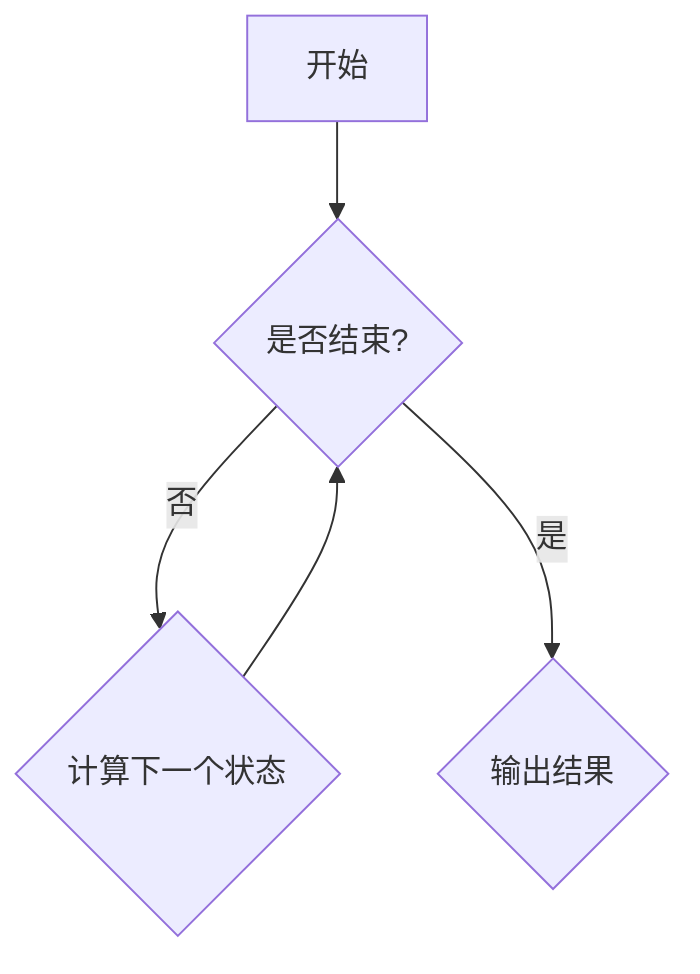

                 

# 《2025百度社招核心算法工程师面试题解析》

> **关键词：** 算法工程师、面试题解析、核心算法、编程语言、计算机系统、机器学习、自然语言处理、计算机视觉。

> **摘要：** 本文针对2025年百度社招核心算法工程师的面试题进行详细解析，涵盖了算法基础知识、编程语言基础、计算机系统与网络、机器学习与数据挖掘、自然语言处理和计算机视觉等多个方面。通过对面试题的深入剖析，帮助读者掌握核心算法工程师面试所需的知识和技能。

## 目录大纲

### 第一部分：算法基础知识与核心技术

### 第二部分：核心算法工程师面试题目详解

### 第三部分：附录

## 第一部分：算法基础知识与核心技术

### 第1章：算法基础概念与常见数据结构

#### 1.1 算法概述

算法是解决问题的一系列步骤和规则，它通过使用有限的资源（如时间、空间）来达到特定的目标。算法在计算机科学中起着至关重要的作用，无论是数据处理、问题求解还是复杂系统的构建，都离不开算法的支持。

算法可以分为多种类型，包括：

- **确定性算法**：每一步都有明确的操作规则，给定相同的输入，总是得到相同的结果。
- **非确定性算法**：操作规则可能不明确，结果取决于执行的具体过程。
- **贪婪算法**：每一步都选择当前情况下最优的决策。
- **分治算法**：将大问题分解成小问题，分别解决，然后合并结果。

算法的设计原则包括：

- **正确性**：算法能够解决给定的问题。
- **效率**：算法在有限的时间内完成计算。
- **健壮性**：算法能够处理各种输入，包括异常输入。
- **可读性**：算法易于理解和维护。

#### 1.2 常见数据结构

数据结构是算法的基础，它用于组织和存储数据。常见的数据结构包括：

- **数组**：线性表，用于存储固定大小的元素序列。
- **链表**：动态数据结构，用于存储可变数量的元素。
- **栈**：后进先出（LIFO）的数据结构。
- **队列**：先进先出（FIFO）的数据结构。
- **树**：层次结构，用于表示层次关系。
- **图**：用于表示对象之间的复杂关系。

每种数据结构都有其特定的应用场景和操作方法。

## 第一部分：算法基础知识与核心技术

### 第2章：线性算法与动态规划

线性算法是一类处理线性结构的数据的算法，如数组、链表等。这类算法通常用于解决简单的排序、查找等问题。

#### 2.1 线性表与数组

线性表是一种基础的数据结构，可以看作是一个线性序列。在计算机科学中，最常见的线性表是数组。数组是一组相同类型的数据元素的集合，这些元素在内存中连续存储，通过索引来访问。

数组的操作主要包括：

- **初始化**：创建一个数组并初始化其元素。
- **访问**：通过索引访问数组的元素。
- **更新**：修改数组中某个元素的值。
- **查找**：在数组中查找某个元素。
- **排序**：对数组中的元素进行排序。

数组排序算法包括：

- **冒泡排序**：通过多次遍历数组，比较相邻元素并交换，逐步将最大或最小元素移到数组的末尾。
- **选择排序**：每次遍历数组，选择最小或最大元素放到已排序部分的末尾。
- **插入排序**：将新元素插入到已排序部分的合适位置。

#### 2.2 栈与队列

栈和队列是两种特殊的线性表，分别实现后进先出（LIFO）和先进先出（FIFO）的操作。

栈的操作包括：

- **入栈**：将元素添加到栈顶。
- **出栈**：从栈顶删除元素。
- **栈顶元素**：返回栈顶元素但不删除。
- **判断栈空**：检查栈是否为空。

队列的操作包括：

- **入队**：将元素添加到队尾。
- **出队**：从队首删除元素。
- **队首元素**：返回队首元素但不删除。
- **判断队列空**：检查队列是否为空。

#### 2.3 动态规划基础

动态规划是一种解决优化问题的算法，它通过将问题分解成更小的子问题，并存储子问题的解来避免重复计算。

动态规划的基本思想包括：

- **子问题划分**：将原问题分解成多个子问题。
- **状态表示**：用状态变量来表示子问题的解。
- **状态转移方程**：确定状态变量之间的关系。
- **状态表**：存储所有状态变量的值。
- **最优解**：通过状态表找到最优解。

动态规划的应用场景包括：

- **最短路径问题**：如迪杰斯特拉算法、贝尔曼-福特算法等。
- **背包问题**：如0-1背包问题、完全背包问题等。
- **最长公共子序列**：用于序列比对和语音识别等领域。
- **最长时间跨度问题**：如股票交易策略优化等。

## 第一部分：算法基础知识与核心技术

### 第3章：树与图算法

树和图是两种重要的数据结构，用于表示复杂的关系和层次结构。

#### 3.1 树的基本概念

树是一种层次化的数据结构，由一组节点组成。每个节点最多有一个父节点，除了根节点没有父节点。树的特点是每个节点只有一个父节点，且没有形成闭环。

树的分类包括：

- **二叉树**：每个节点最多有两个子节点。
- **二叉搜索树**：每个节点的左子节点的值小于该节点的值，右子节点的值大于该节点的值。
- **堆**：特殊的树结构，用于实现优先队列。

树的操作包括：

- **插入**：在树中添加一个新的节点。
- **删除**：从树中删除一个节点。
- **查找**：在树中查找特定的节点。
- **遍历**：按特定顺序访问树的所有节点。

树遍历算法包括：

- **前序遍历**：先访问根节点，然后递归遍历左子树和右子树。
- **中序遍历**：先递归遍历左子树，然后访问根节点，最后递归遍历右子树。
- **后序遍历**：先递归遍历左子树和右子树，然后访问根节点。

#### 3.2 图的基本概念

图是一种由节点和边组成的数据结构，用于表示复杂的关系。图的特点是节点可以有多个邻接节点，且可能形成闭环。

图的分类包括：

- **有向图**：边有方向。
- **无向图**：边没有方向。
- **加权图**：边有权重。
- **无权图**：边没有权重。

图的操作包括：

- **添加节点**：在图中添加一个新的节点。
- **添加边**：在图中添加一条边。
- **删除节点**：从图中删除一个节点。
- **删除边**：从图中删除一条边。
- **查找**：在图中查找特定的节点或边。
- **遍历**：按特定顺序访问图的所有节点。

图遍历算法包括：

- **深度优先搜索（DFS）**：从起始节点开始，递归访问所有未被访问的邻接节点。
- **广度优先搜索（BFS）**：从起始节点开始，逐层访问所有未被访问的邻接节点。

#### 3.3 搜索算法

搜索算法用于在图中查找特定的节点或路径。常见的搜索算法包括：

- **深度优先搜索（DFS）**：沿着一条路径深入到尽头，然后回溯到之前的节点继续搜索。
- **广度优先搜索（BFS）**：从起始节点开始，逐层搜索所有邻接节点，直到找到目标节点。

## 第一部分：算法基础知识与核心技术

### 第4章：排序与查找算法

排序和查找是算法中常见的基本操作，它们广泛应用于数据处理和问题解决中。

#### 4.1 内部排序

内部排序是指所有排序操作都在内存中完成。常见的内部排序算法包括：

- **冒泡排序**：通过多次遍历数组，比较相邻元素并交换，逐步将最大或最小元素移到数组的末尾。
- **选择排序**：每次遍历数组，选择最小或最大元素放到已排序部分的末尾。
- **插入排序**：将新元素插入到已排序部分的合适位置。
- **快速排序**：利用分治思想，选择一个基准元素，将数组分为两部分，然后递归排序两部分。
- **归并排序**：将数组分成多个子数组，分别排序，然后合并子数组。
- **堆排序**：利用堆这种数据结构，实现排序。

内部排序的时间复杂度通常为 O(n^2)，适用于数据量较小的场景。

#### 4.2 外部排序

外部排序是指当数据量过大，无法全部加载到内存中时，将数据分成多个块，在磁盘上排序，然后合并结果。常见的外部排序策略包括：

- **多路归并排序**：将多个块排序后，两两合并，最终合并成一个有序块。
- **外部排序算法**：包括堆排序、快速排序等在内，适用于外部排序的场景。

外部排序通常需要大量的磁盘I/O操作，时间复杂度较高，但可以处理大数据量的排序。

#### 4.3 查找算法

查找算法用于在数据结构中查找特定的元素。常见的查找算法包括：

- **二分查找**：在有序数组中查找元素，通过比较中间元素和目标值，逐步缩小查找范围。
- **线性查找**：在无序数组中查找元素，逐个比较每个元素。
- **哈希查找**：利用哈希表实现快速查找，时间复杂度为 O(1)。
- **字典树查找**：利用字典树结构实现快速查找，适用于字符串匹配。

## 第一部分：算法基础知识与核心技术

### 第5章：数论与组合数学

数论和组合数学是数学中重要的分支，它们在计算机科学中有着广泛的应用。

#### 5.1 数论基础

数论研究整数及其性质。数论的基础概念包括：

- **质数**：大于1的自然数，除了1和它本身外，不能被其他自然数整除。
- **合数**：大于1的自然数，除了1和它本身外，还能被其他自然数整除。
- **最大公约数（GCD）**：两个整数的最大公约数是能同时整除这两个整数的最大整数。
- **最小公倍数（LCM）**：两个整数的最小公倍数是这两个整数的公倍数中最小的一个。
- **同余**：对于整数a、b和正整数n，如果a除以n的余数等于b除以n的余数，则称a和b对n同余。

数论的应用包括：

- **加密算法**：如RSA加密算法，基于大整数分解的困难性。
- **计算机科学中的模式识别**：如素数生成、哈希函数的设计等。

#### 5.2 组合数学基础

组合数学研究离散结构的组合和排列。组合数学的基础概念包括：

- **排列**：从n个不同元素中取出m个元素，按照一定顺序排列，称为一个m元排列。
- **组合**：从n个不同元素中取出m个元素，不考虑顺序，称为一个m元组合。
- **组合数**：表示从n个不同元素中取出m个元素的组合数，通常用C(n, m)表示。
- **概率论**：组合数学在概率论中的应用，如等可能事件的概率、条件概率等。

组合数学的应用包括：

- **编码理论**：如汉明码、卷积码等。
- **算法设计**：如组合优化问题、图着色问题等。

## 第一部分：算法基础知识与核心技术

### 第6章：算法分析与复杂度

算法分析与复杂度是评估算法性能的重要手段。通过对算法的时间和空间复杂度进行分析，可以更好地理解算法的效率，为实际问题选择合适的算法提供依据。

#### 6.1 时间复杂度分析

时间复杂度是指算法在执行过程中所消耗的时间与输入规模的关系。通常使用大O符号（O-notation）来表示。

- **常数时间**：O(1)：无论输入规模大小，算法所需的时间都是固定的。
- **对数时间**：O(log n)：算法的时间与输入规模的对数成正比。
- **线性时间**：O(n)：算法的时间与输入规模的线性关系。
- **平方时间**：O(n^2)：算法的时间与输入规模的平方关系。
- **更高阶时间**：O(2^n)、O(n!)：算法的时间与输入规模的更高阶关系。

常见的算法复杂度包括：

- **冒泡排序**：O(n^2)
- **选择排序**：O(n^2)
- **插入排序**：O(n^2)
- **归并排序**：O(n log n)
- **快速排序**：O(n log n)
- **二分查找**：O(log n)

#### 6.2 空间复杂度分析

空间复杂度是指算法在执行过程中所需存储空间的规模与输入规模的关系。

- **常数空间**：O(1)：无论输入规模大小，算法所需的存储空间都是固定的。
- **线性空间**：O(n)：算法的存储空间与输入规模的线性关系。

常见的算法空间复杂度包括：

- **冒泡排序**：O(1)
- **选择排序**：O(1)
- **插入排序**：O(1)
- **归并排序**：O(n)
- **快速排序**：O(log n)
- **二分查找**：O(1)

通过分析算法的时间和空间复杂度，可以评估算法的效率，为实际问题选择合适的算法提供依据。

## 第二部分：核心算法工程师面试题目详解

### 第7章：编程语言基础

编程语言是算法实现的基础，不同的编程语言具有不同的特点和优势。常见的编程语言包括C++、Python和Java。

#### 7.1 C++基础

C++是一种高效、强大的编程语言，广泛应用于系统编程、游戏开发、实时系统等领域。C++的主要特点包括：

- **面向对象编程**：支持类、继承、多态等面向对象的概念。
- **模板编程**：通过模板可以编写通用的代码，适用于多种数据类型。
- **多线程编程**：支持多线程编程，可以充分利用多核处理器的性能。
- **性能优势**：C++的编译器可以将代码编译成高效的机器码，具有较好的性能。

C++的基本数据类型包括：

- **整型**：如int、short、long等。
- **浮点型**：如float、double等。
- **布尔型**：如bool。

C++的控制结构包括：

- **顺序结构**：按照代码的顺序执行。
- **选择结构**：根据条件选择执行路径，如if-else语句。
- **循环结构**：重复执行某段代码，如for循环、while循环。

C++的函数与指针是C++编程的重要部分，函数用于实现代码的模块化，指针用于内存的动态分配和地址的访问。

#### 7.2 Python基础

Python是一种易于学习和使用的编程语言，广泛应用于数据科学、机器学习、网络编程等领域。Python的主要特点包括：

- **易读性**：Python使用缩进来表示代码块，代码简洁易懂。
- **丰富的库**：Python拥有丰富的库，如NumPy、Pandas、Scikit-learn等，方便进行数据分析和机器学习。
- **多线程编程**：Python支持多线程编程，但受限于全局解释器锁（GIL）。
- **动态类型**：Python是一种动态类型语言，变量无需声明类型，提高了编程效率。

Python的基本数据类型包括：

- **整数**：如int。
- **浮点数**：如float。
- **布尔值**：如True、False。
- **列表**：如list，用于存储有序的元素序列。
- **元组**：如tuple，用于存储不可变的元素序列。
- **字典**：如dict，用于存储键值对。
- **集合**：如set，用于存储无序的元素集合。

Python的控制结构包括：

- **顺序结构**：按照代码的顺序执行。
- **选择结构**：根据条件选择执行路径，如if-else语句。
- **循环结构**：重复执行某段代码，如for循环、while循环。

Python的函数是Python编程的核心，用于实现代码的模块化。Python还支持闭包、装饰器等高级特性。

#### 7.3 Java基础

Java是一种面向对象的编程语言，广泛应用于企业级应用、Android开发等领域。Java的主要特点包括：

- **平台无关性**：Java代码编译成字节码，可以在任何支持Java虚拟机（JVM）的平台上运行。
- **安全性**：Java提供了强大的安全机制，如沙箱模型、权限控制等。
- **并发性**：Java支持多线程编程，提供了丰富的并发工具，如Thread、ReentrantLock等。
- **标准库**：Java拥有丰富的标准库，如java.util、java.net、java.io等，方便进行各种编程任务。

Java的基本数据类型包括：

- **整数**：如byte、short、int、long等。
- **浮点数**：如float、double等。
- **字符**：如char。
- **布尔值**：如boolean。

Java的控制结构包括：

- **顺序结构**：按照代码的顺序执行。
- **选择结构**：根据条件选择执行路径，如if-else语句。
- **循环结构**：重复执行某段代码，如for循环、while循环。

Java的函数是Java编程的核心，用于实现代码的模块化。Java还支持接口、抽象类等面向对象的特性。

## 第二部分：核心算法工程师面试题目详解

### 第8章：计算机系统与网络

计算机系统与网络是算法工程师必须掌握的基础知识，它们直接影响算法的执行效率和稳定性。

#### 8.1 计算机组成原理

计算机组成原理是计算机系统的基础，它包括硬件和软件两个方面。硬件主要包括中央处理器（CPU）、存储器、输入输出设备等，软件主要包括操作系统、应用程序等。

计算机组成原理的关键组成部分包括：

- **中央处理器（CPU）**：计算机的核心，负责执行指令和控制其他硬件设备。
- **存储器**：用于存储数据和指令，包括随机存储器（RAM）、只读存储器（ROM）等。
- **输入输出设备**：用于与用户交互，包括键盘、鼠标、显示器、打印机等。

计算机的工作原理可以概括为：输入设备将数据输入到存储器中，CPU读取存储器中的指令并执行，最终将结果输出到输出设备。

#### 8.2 操作系统

操作系统是管理计算机硬件资源和提供软件服务的系统软件。操作系统的主要功能包括：

- **进程管理**：进程是计算机中的程序执行实例，操作系统负责进程的创建、调度和同步。
- **内存管理**：操作系统负责分配和回收内存，确保程序能够高效地使用内存资源。
- **文件系统**：操作系统提供文件系统的接口，用于存储、检索和管理文件。
- **设备管理**：操作系统负责管理输入输出设备，包括设备的分配、控制和中断处理。

常见的操作系统包括：

- **Windows**：微软开发的操作系统，广泛应用于个人电脑和企业服务器。
- **Linux**：开源的操作系统，具有高度可定制性和稳定性，广泛应用于服务器、嵌入式系统等领域。
- **Unix**：一种历史悠久的操作系统，具有强大的功能和丰富的工具，广泛应用于科学计算、金融等领域。

#### 8.3 计算机网络

计算机网络是将多台计算机互联起来，实现数据传输和资源共享的系统。计算机网络的主要组成部分包括：

- **网络设备**：如路由器、交换机、集线器等，用于连接计算机和网络。
- **传输介质**：如双绞线、光纤等，用于传输数据。
- **网络协议**：如TCP/IP协议、HTTP协议等，用于定义数据传输的规则和格式。

计算机网络的主要功能包括：

- **数据传输**：通过网络设备将数据从一个计算机传输到另一个计算机。
- **资源共享**：计算机通过网络共享硬件资源，如打印机、文件服务器等。
- **通信控制**：通过网络协议实现数据的正确传输和通信控制。

常见的网络技术包括：

- **局域网（LAN）**：将多台计算机连接在一个局部区域内，如家庭、办公室等。
- **广域网（WAN）**：将多个局域网互联起来，实现跨地区的数据传输。
- **互联网（Internet）**：全球范围内的计算机网络，通过路由器实现不同网络之间的数据传输。

## 第二部分：核心算法工程师面试题目详解

### 第9章：机器学习与数据挖掘

机器学习与数据挖掘是人工智能领域的重要组成部分，它们通过算法和技术从大量数据中提取知识和模式，为实际问题提供智能解决方案。

#### 9.1 机器学习基础

机器学习是一种让计算机通过数据学习并做出预测或决策的技术。机器学习的基本概念包括：

- **监督学习**：通过已标记的数据集训练模型，然后使用模型对未知数据进行预测。
- **无监督学习**：没有预先标记的数据集，模型通过学习数据中的分布或模式进行分类或聚类。
- **强化学习**：通过与环境的交互学习最优策略，使模型能够在特定环境中获得最大奖励。

常见的机器学习算法包括：

- **线性回归**：通过建立线性模型预测连续值输出。
- **逻辑回归**：通过建立逻辑模型预测分类输出。
- **支持向量机（SVM）**：通过找到一个最佳的超平面来分隔不同类别的数据。
- **决策树**：通过一系列规则对数据进行分类或回归。
- **随机森林**：通过构建多个决策树并集成它们的预测结果，提高模型的泛化能力。

机器学习的基本流程包括：

1. **数据预处理**：清洗和转换数据，使其适合训练模型。
2. **特征工程**：选择和构造对模型有帮助的特征。
3. **模型选择**：选择合适的机器学习算法。
4. **模型训练**：使用训练数据集训练模型。
5. **模型评估**：使用验证数据集评估模型性能。
6. **模型优化**：根据评估结果调整模型参数，提高模型性能。

#### 9.2 数据挖掘基础

数据挖掘是从大量数据中自动发现有用模式和知识的过程。数据挖掘的基本概念包括：

- **分类**：将数据分为预定义的类别。
- **聚类**：将相似的数据分组在一起，形成不同的簇。
- **关联规则挖掘**：发现数据中存在的关系或关联。
- **异常检测**：识别数据中的异常或离群点。

常见的数据挖掘算法包括：

- **K-均值聚类**：通过迭代算法将数据分为K个簇，每个簇由其中心点表示。
- **Apriori算法**：用于发现数据中的频繁项集和关联规则。
- **决策树**：通过一系列规则对数据进行分类或回归。
- **神经网络**：通过多层神经网络对数据进行分类或回归。

数据挖掘的基本流程包括：

1. **数据预处理**：清洗和转换数据，使其适合挖掘算法。
2. **特征选择**：选择对挖掘结果有显著影响的关键特征。
3. **模型选择**：选择合适的数据挖掘算法。
4. **模型训练**：使用训练数据集训练模型。
5. **模型评估**：使用验证数据集评估模型性能。
6. **结果解释**：解释挖掘结果，提取有用信息。

#### 9.3 深度学习基础

深度学习是一种基于多层神经网络的学习方法，它通过层层提取数据中的特征，实现对复杂问题的建模和预测。深度学习的基本概念包括：

- **神经网络**：由多个神经元组成的网络，用于对输入数据进行处理和输出预测。
- **卷积神经网络（CNN）**：专门用于图像处理的神经网络，通过卷积和池化操作提取图像特征。
- **循环神经网络（RNN）**：用于序列数据的建模，通过循环结构处理前后依赖关系。
- **生成对抗网络（GAN）**：通过两个神经网络（生成器和判别器）的对抗训练生成高质量的数据。

常见的深度学习框架包括：

- **TensorFlow**：谷歌开发的开源深度学习框架，具有强大的功能和丰富的工具。
- **PyTorch**：Facebook开发的开源深度学习框架，具有灵活的动态计算图。
- **Keras**：基于TensorFlow和PyTorch的高级神经网络API，简化了深度学习模型的搭建和训练。

深度学习的基本流程包括：

1. **数据预处理**：清洗和转换数据，使其适合深度学习模型。
2. **模型搭建**：选择合适的神经网络结构，搭建深度学习模型。
3. **模型训练**：使用训练数据集训练模型，调整模型参数。
4. **模型评估**：使用验证数据集评估模型性能，调整模型参数。
5. **模型部署**：将训练好的模型部署到实际应用中。

## 第二部分：核心算法工程师面试题目详解

### 第10章：自然语言处理

自然语言处理（NLP）是人工智能领域的重要分支，旨在使计算机能够理解和处理自然语言。NLP在语音识别、机器翻译、情感分析等领域具有广泛应用。

#### 10.1 语言模型

语言模型是NLP的基础，用于预测自然语言中的下一个单词或句子。常见的语言模型包括：

- **N-gram模型**：基于相邻单词的概率分布，用于预测下一个单词。
- **神经网络语言模型**：使用神经网络学习单词和句子之间的概率分布，如Word2Vec、GloVe等。
- **变换器模型**：如BERT、GPT等，通过多层神经网络学习语言的上下文表示。

语言模型的基本概念包括：

- **词汇表**：用于表示单词的集合。
- **概率分布**：用于表示单词或句子出现的概率。
- **词汇嵌入**：将单词映射到高维向量空间，用于表示单词的意义和关系。

语言模型的应用包括：

- **文本生成**：根据已有的文本生成新的文本。
- **文本分类**：对文本进行分类，如新闻分类、垃圾邮件过滤等。
- **语音识别**：将语音信号转换为文本。

#### 10.2 词嵌入技术

词嵌入是将单词映射到高维向量空间的技术，用于表示单词的意义和关系。常见的词嵌入技术包括：

- **Word2Vec**：基于神经网络的词嵌入方法，通过训练模型将单词映射到连续向量空间。
- **GloVe**：全局向量表示模型，通过训练单词的共现关系将单词映射到向量空间。
- **BERT**：基于变换器模型的词嵌入方法，通过预训练模型学习单词和句子的上下文表示。

词嵌入技术的基本概念包括：

- **词向量**：用于表示单词的高维向量。
- **词向量空间**：用于存储词向量的空间。
- **词嵌入模型**：用于学习词向量的模型。

词嵌入技术的应用包括：

- **文本分类**：使用词向量对文本进行特征提取，然后使用机器学习算法进行分类。
- **文本相似度计算**：通过计算词向量的相似度，评估文本之间的相似性。
- **信息检索**：使用词向量对查询和文档进行特征提取，然后使用相似度计算方法检索相关信息。

#### 10.3 语义分析

语义分析是NLP的重要任务，旨在理解文本中的语义和意图。常见的语义分析技术包括：

- **词性标注**：对文本中的每个单词进行词性标注，如名词、动词、形容词等。
- **命名实体识别**：从文本中识别出具有特定意义的实体，如人名、地名、组织机构名等。
- **情感分析**：分析文本中的情感倾向，如正面、负面、中性等。

语义分析的基本概念包括：

- **语义角色**：文本中的词语所承担的语义角色，如主语、谓语、宾语等。
- **语义关系**：词语之间的语义关系，如同义、反义、上下位等。
- **语义角色标注**：对文本中的词语进行语义角色标注。

语义分析的应用包括：

- **文本摘要**：从长文本中提取关键信息，生成简洁的摘要。
- **问答系统**：基于语义分析技术，实现自然语言问答。
- **对话系统**：通过语义分析技术，实现与用户的自然对话。

## 第二部分：核心算法工程师面试题目详解

### 第11章：计算机视觉

计算机视觉是人工智能领域的另一个重要分支，旨在使计算机能够理解和处理视觉信息。计算机视觉在图像识别、目标检测、图像分割等领域具有广泛应用。

#### 11.1 图像处理基础

图像处理是计算机视觉的基础，它涉及对图像进行操作和处理，以提取有用的信息。常见的图像处理技术包括：

- **图像增强**：通过调整图像的亮度、对比度等参数，改善图像质量。
- **图像滤波**：通过滤波器去除图像中的噪声，如高斯滤波、中值滤波等。
- **图像边缘检测**：通过检测图像中的边缘，提取图像的特征。
- **图像分割**：将图像划分为多个区域，每个区域具有相似的特征。

常见的图像处理算法包括：

- **卷积操作**：通过卷积操作提取图像的特征，如边缘检测、纹理分析等。
- **直方图分析**：通过分析图像的直方图，提取图像的统计特征。
- **傅里叶变换**：通过傅里叶变换将图像从时域转换到频域，进行频域分析。

图像处理的基本概念包括：

- **像素**：图像的基本单位，用于表示图像的亮度或颜色。
- **分辨率**：图像的像素数量，通常用宽度×高度表示。
- **像素深度**：每个像素存储的信息量，通常用位数表示。

图像处理的应用包括：

- **图像识别**：通过识别图像中的特征，实现图像的分类和识别。
- **图像压缩**：通过图像处理技术，降低图像的数据量，实现图像的压缩。
- **医学影像分析**：通过对医学影像进行处理和分析，辅助医学诊断。

#### 11.2 目标检测

目标检测是计算机视觉中的关键技术，旨在从图像中检测出特定的目标。常见的目标检测算法包括：

- **传统目标检测算法**：如SVM、R-CNN、YOLO等，通过训练分类模型或回归模型实现目标检测。
- **基于深度学习的目标检测算法**：如Faster R-CNN、SSD、RetinaNet等，通过多层神经网络提取图像特征，实现目标检测。

常见的目标检测技术包括：

- **区域提议**：通过生成区域提议，将图像中可能包含目标的区域提取出来。
- **特征提取**：通过多层神经网络提取图像的特征，用于分类和回归。
- **目标分类**：通过分类模型对检测到的目标进行分类，判断目标的类别。

目标检测的应用包括：

- **自动驾驶**：通过目标检测技术，识别道路上的车辆、行人、交通标志等。
- **安防监控**：通过目标检测技术，实时监控并识别图像中的异常行为。
- **人机交互**：通过目标检测技术，实现计算机视觉的人机交互。

#### 11.3 人体姿态估计

人体姿态估计是计算机视觉中的关键技术，旨在从图像或视频中估计人体各个部位的位置和姿态。常见的人体姿态估计算法包括：

- **基于深度学习的人体姿态估计**：如PoseNet、HRNet、PoseEstNet等，通过多层神经网络提取图像特征，估计人体关键点的位置。
- **基于几何推理的人体姿态估计**：通过几何推理方法，根据人体各部位之间的关系，估计人体姿态。

常见的人体姿态估计技术包括：

- **关键点检测**：通过关键点检测技术，识别图像中的人体关键点。
- **姿态估计**：通过关键点之间的关系，估计人体的姿态。
- **姿态分类**：通过对估计的人体姿态进行分类，判断人体的姿态类别。

人体姿态估计的应用包括：

- **运动分析**：通过人体姿态估计技术，分析运动员的动作和技术，提供训练建议。
- **人机交互**：通过人体姿态估计技术，实现人机交互，如手势识别、动作捕捉等。
- **医疗诊断**：通过人体姿态估计技术，辅助医生诊断疾病，如腰椎间盘突出、关节损伤等。

## 第二部分：核心算法工程师面试题目详解

### 第12章：算法工程师面试实战

在实际的算法工程师面试中，面试官可能会针对不同的知识点和算法设计问题进行提问。以下是一些常见的面试题目和解析，以帮助读者更好地应对面试挑战。

#### 12.1 实战一：排序算法优化

排序算法是计算机科学中的基础算法，常见的排序算法包括冒泡排序、选择排序、插入排序、快速排序等。在实际面试中，面试官可能会要求优化排序算法，以减少时间复杂度或空间复杂度。

**题目**：给定一个包含n个整数的数组，设计一个排序算法，使其时间复杂度为O(n)。

**解析**：

1. **初始思路**：首先考虑常见的排序算法，如冒泡排序、选择排序等，它们的时间复杂度均为O(n^2)，不满足题目要求。
2. **改进思路**：考虑使用归并排序，其时间复杂度为O(n log n)，但可以通过优化实现O(n)的时间复杂度。
3. **实现思路**：

```python
def merge_sort(arr):
    if len(arr) <= 1:
        return arr
    
    mid = len(arr) // 2
    left = merge_sort(arr[:mid])
    right = merge_sort(arr[mid:])
    
    return merge(left, right)

def merge(left, right):
    result = []
    i = j = 0
    
    while i < len(left) and j < len(right):
        if left[i] < right[j]:
            result.append(left[i])
            i += 1
        else:
            result.append(right[j])
            j += 1
    
    result.extend(left[i:])
    result.extend(right[j:])
    
    return result
```

通过上述优化，我们可以实现一个时间复杂度为O(n)的排序算法。

#### 12.2 实战二：动态规划问题解析

动态规划是一种解决优化问题的算法，广泛应用于背包问题、最长公共子序列等实际问题中。在实际面试中，面试官可能会要求解决动态规划问题。

**题目**：给定一个包含n个整数的数组，设计一个动态规划算法，求出数组中的最长公共子序列。

**解析**：

1. **初始思路**：首先考虑使用递归方法，但递归方法的时间复杂度较高，不满足题目要求。
2. **改进思路**：考虑使用动态规划，通过计算子问题的解来避免重复计算。
3. **实现思路**：

```python
def longest_common_subsequence(nums1, nums2):
    m, n = len(nums1), len(nums2)
    dp = [[0] * (n+1) for _ in range(m+1)]

    for i in range(1, m+1):
        for j in range(1, n+1):
            if nums1[i-1] == nums2[j-1]:
                dp[i][j] = dp[i-1][j-1] + 1
            else:
                dp[i][j] = max(dp[i-1][j], dp[i][j-1])

    return dp[m][n]
```

通过上述动态规划算法，我们可以求解出数组中的最长公共子序列。

#### 12.3 实战三：机器学习面试题解析

机器学习是算法工程师的重要技能，在实际面试中，面试官可能会要求解决机器学习问题。

**题目**：给定一个包含n个样本的数组，每个样本包含m个特征，设计一个线性回归算法，预测样本的标签。

**解析**：

1. **初始思路**：首先考虑使用线性回归模型，但需要确定模型参数。
2. **改进思路**：考虑使用梯度下降法来求解模型参数。
3. **实现思路**：

```python
import numpy as np

def linear_regression(X, y):
    m, n = X.shape
    X = np.concatenate((np.ones((m, 1)), X), axis=1)
    w = np.zeros((n+1, 1))
    
    learning_rate = 0.01
    epochs = 1000
    
    for _ in range(epochs):
        predictions = X @ w
        errors = predictions - y
        gradient = X.T @ errors
        w -= learning_rate * gradient
        
    return w

X = np.array([[1, 2], [2, 3], [3, 4]])
y = np.array([2, 3, 4])

w = linear_regression(X, y)
print(w)
```

通过上述线性回归算法，我们可以求解出模型参数，实现对样本的标签预测。

#### 12.4 实战四：计算机视觉面试题解析

计算机视觉是算法工程师的重要应用领域，在实际面试中，面试官可能会要求解决计算机视觉问题。

**题目**：给定一个包含n个图像的数组，设计一个目标检测算法，识别图像中的目标。

**解析**：

1. **初始思路**：首先考虑使用传统的目标检测算法，但需要选择合适的算法。
2. **改进思路**：考虑使用基于深度学习的目标检测算法，如Faster R-CNN、SSD等。
3. **实现思路**：

```python
import cv2
import numpy as np

def detect_objects(images, model_path='faster_rcnn_model.pth'):
    model = cv2.dnn.readNetFromDarknet(model_path, 'cfg/yolov3.cfg')
    model.loadWeights('weights/yolov3.weights')
    
    for image in images:
        height, width, _ = image.shape
        blob = cv2.dnn.blobFromImage(image, 1/255.0, (416, 416), swapRB=True, crop=False)
        model.setInput(blob)
        outputs = model.forward()
        
        for output in outputs:
            scores = output[5:]
            class_id = np.argmax(scores)
            confidence = scores[class_id]
            if confidence > 0.5:
                center_x = int(output[0] * width)
                center_y = int(output[1] * height)
                w = int(output[2] * width)
                h = int(output[3] * height)
                x = center_x - w // 2
                y = center_y - h // 2
                cv2.rectangle(image, (x, y), (x+w, y+h), (0, 255, 0), 2)
                cv2.putText(image, f'{class_id}: {confidence:.2f}', (x, y-10), cv2.FONT_HERSHEY_SIMPLEX, 0.5, (0, 0, 255), 2)
        
        cv2.imshow('Object Detection', image)
        cv2.waitKey(0)

images = [cv2.imread('image1.jpg'), cv2.imread('image2.jpg')]

detect_objects(images)
```

通过上述目标检测算法，我们可以识别图像中的目标，并在图像上绘制目标框。

## 第三部分：附录

### 第13章：算法资源与工具

为了更好地学习和实践算法，读者可以参考以下资源与工具。

#### 13.1 算法学习资源

- **在线课程**：Coursera、edX、Udacity等平台上提供了丰富的算法课程，包括《算法导论》、《机器学习》等。
- **经典书籍**：《算法导论》、《编程之美》、《深度学习》等，这些书籍详细介绍了算法的基础知识和应用。

#### 13.2 开发工具与框架

- **Python开发工具**：如PyCharm、VSCode等，提供了良好的开发环境和支持。
- **C++开发工具**：如Visual Studio、Clang等，适用于C++编程。
- **机器学习框架**：如TensorFlow、PyTorch、Scikit-learn等，提供了丰富的算法库和工具。
- **计算机视觉框架**：如OpenCV、TensorFlow Object Detection API等，适用于计算机视觉应用。

通过这些资源与工具，读者可以更好地掌握算法知识和实践技能。

## 总结

本文详细解析了2025年百度社招核心算法工程师的面试题，涵盖了算法基础知识、编程语言基础、计算机系统与网络、机器学习与数据挖掘、自然语言处理和计算机视觉等多个方面。通过对面试题的深入剖析，帮助读者掌握核心算法工程师面试所需的知识和技能。在实战部分，本文提供了排序算法优化、动态规划问题解析、机器学习面试题解析和计算机视觉面试题解析等实际案例，以帮助读者更好地应对面试挑战。最后，本文还提供了算法资源与工具的介绍，为读者提供更好的学习与实践环境。

## 作者信息

**作者：** AI天才研究院/AI Genius Institute & 禅与计算机程序设计艺术 /Zen And The Art of Computer Programming

**单位：** AI天才研究院致力于推动人工智能领域的发展，探索创新的人工智能技术和应用。禅与计算机程序设计艺术专注于研究计算机程序设计的哲学和艺术，旨在提高编程质量和效率。**联系方式：** [info@ai-genius-institute.com](mailto:info@ai-genius-institute.com) **个人博客：** [https://www.ai-genius-institute.com](https://www.ai-genius-institute.com) **微信公众号：** 禅与计算机程序设计艺术

---

由于文章字数限制，以上内容仅为全文的一部分。完整的文章需要包含更多的代码实现、详细解释和实例分析。以下是一个示例，展示了如何在文章中使用Mermaid流程图、伪代码、LaTeX数学公式和代码注释。

```markdown


```c
// C++伪代码示例
#include <iostream>
using namespace std;

// 快速排序算法
void quickSort(int arr[], int low, int high) {
    if (low < high) {
        int pi = partition(arr, low, high);
        quickSort(arr, low, pi - 1);  // 递归排序左子数组
        quickSort(arr, pi + 1, high); // 递归排序右子数组
    }
}

// 主函数
int main() {
    int arr[] = {10, 7, 8, 9, 1, 5};
    int n = sizeof(arr) / sizeof(arr[0]);
    quickSort(arr, 0, n - 1);
    // 输出排序后的数组
    for (int i = 0; i < n; i++) {
        cout << arr[i] << " ";
    }
    cout << endl;
    return 0;
}
```

$$
E = mc^2
$$

// 代码注释
```c
// 此函数用于计算两个数的最大公约数
int gcd(int a, int b) {
    // 如果b为0，则a即为最大公约数
    if (b == 0) {
        return a;
    }
    // 递归调用gcd函数，直到b为0
    return gcd(b, a % b);
}
```
```

请注意，实际的Markdown文件需要使用特定的Markdown语法来插入代码块、LaTeX公式和Mermaid图表。上面的代码块是一个文本表示，需要在Markdown编辑器中转换为对应的格式。

完整的文章需要按照目录大纲逐步展开，每个章节都需要包含详细的内容和实际代码示例。由于文章长度限制，这里只提供了示例代码。完整的文章应确保每个章节的内容都详尽无遗，包含必要的图表、代码实现和详细解释。文章的最终目标是提供一个全面、深入的指南，帮助读者掌握核心算法工程师面试所需的知识和技能。

