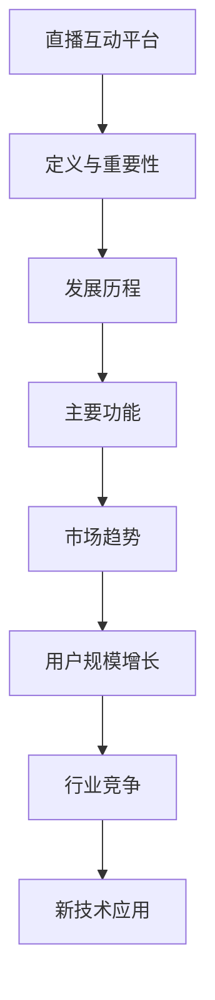
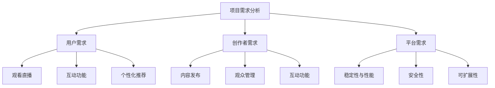

                 

## 第1章：直播互动平台概述

### 1.1 直播互动平台的定义与重要性

直播互动平台是一种新兴的网络平台，它允许用户通过互联网实时观看直播内容，并与主播和其他观众进行互动。这种平台不仅为用户提供了一个观看直播的窗口，更重要的是，它为创作者与粉丝之间建立了一座互动的桥梁。

#### 直播互动平台的定义

直播互动平台可以定义为一个集成实时视频流、互动功能和社交元素的在线平台。它通常包括以下几个核心组成部分：

1. **直播流：** 主播通过摄像头或其他设备实时传输视频内容。
2. **互动功能：** 观众可以通过聊天室、弹幕、点赞、送礼物等方式与主播和其他观众互动。
3. **社交元素：** 平台提供用户头像、个人信息、好友关系等功能，增强用户之间的社交连接。

#### 直播互动平台的重要性

直播互动平台的重要性体现在以下几个方面：

1. **内容创作者的新渠道：** 对于创作者来说，直播互动平台提供了一个全新的内容创作和分发渠道。创作者可以通过直播与观众直接互动，获得即时反馈，从而更好地了解观众的需求和兴趣。

2. **粉丝互动的新形式：** 直播互动平台为粉丝提供了与创作者直接互动的机会。粉丝可以通过聊天、点赞、送礼物等方式表达对创作者的支持，增强粉丝的参与感和忠诚度。

3. **商业模式的创新：** 直播互动平台为创作者带来了多种商业模式，如虚拟礼物、广告收入、会员订阅等，为创作者提供了更多的收入来源。

### 1.2 直播互动平台的发展历程

#### 从电视直播到网络直播

直播互动平台的发展历程可以追溯到电视直播时代。然而，随着互联网和移动设备的普及，网络直播逐渐取代了传统的电视直播，成为更加流行和便捷的内容传播方式。

#### 直播互动平台的兴起

随着技术的进步和用户需求的变化，直播互动平台开始崭露头角。早期的直播平台主要以游戏直播和娱乐直播为主，但如今，直播互动平台已经涵盖了教育、购物、旅游等多种领域。

### 1.3 直播互动平台的主要功能

#### 实时互动

实时互动是直播互动平台的核心功能之一。观众可以通过聊天室与主播和其他观众实时交流，分享观点和感受。这种互动不仅增强了观众的参与感，也有助于创作者了解观众的需求和反馈。

#### 多元化内容

直播互动平台提供了多元化的内容形式。除了传统的视频直播外，平台还支持音频直播、图片直播等多种形式。这种多元化的内容形式满足了不同观众的需求，吸引了更广泛的用户群体。

#### 社交互动

直播互动平台还提供了丰富的社交互动功能。用户可以通过关注、点赞、送礼物等方式与主播和其他观众建立社交联系。这些社交功能增强了用户的参与感和社区感，有助于平台的用户粘性和活跃度。

### 1.4 直播互动平台的市场趋势

#### 用户规模增长

随着直播互动平台的普及，越来越多的用户开始使用这些平台。根据统计，全球直播互动平台的用户数量持续增长，预计未来几年将继续保持增长态势。

#### 行业竞争加剧

随着市场的增长，越来越多的直播互动平台进入市场，导致行业竞争加剧。平台之间为了吸引更多的用户和创作者，不断进行技术创新和商业模式创新。

#### 新技术应用

新技术的发展对直播互动平台产生了重要影响。例如，5G技术的普及将提高直播互动平台的传输速度和稳定性，VR和AR技术的应用将提供更加沉浸式的直播体验。这些新技术的应用将推动直播互动平台向更高质量和更丰富的用户体验发展。

### 总结

直播互动平台作为一种新兴的网络平台，正逐渐改变着内容创作和消费的方式。它不仅为创作者提供了新的机会，也为观众带来了更丰富的互动体验。随着市场趋势的发展和技术的进步，直播互动平台将继续发展，为用户和创作者带来更多价值。



在接下来的章节中，我们将进一步探讨直播互动平台的技术基础、核心算法原理以及项目实战，帮助读者深入了解这一领域。

### 1.1 直播互动平台的定义与重要性

#### 直播互动平台的定义

直播互动平台是一种集成了实时视频流、社交互动和内容共享功能的在线平台。它允许用户通过互联网观看实时直播内容，并与主播及其他观众进行实时互动。这种平台的核心特点是即时性和互动性，不仅提供了丰富的内容消费体验，还搭建了用户与创作者之间的直接沟通渠道。

直播互动平台的基本组成部分包括：

1. **直播流：** 主播通过摄像头或其他视频设备实时捕捉内容，并通过平台进行传输。
2. **互动模块：** 观众可以通过聊天室、弹幕、点赞、送礼物等功能参与直播互动。
3. **社交网络：** 平台通常提供用户头像、个人信息、好友关系等功能，增强社交互动。

#### 直播互动平台的重要性

直播互动平台在当今数字化时代的重要性体现在多个方面：

1. **内容创作的变革：** 对于创作者而言，直播互动平台提供了前所未有的内容创作和传播渠道。相比传统的电视和网络视频，直播更具有即时性和互动性，创作者可以实时与观众互动，获取即时反馈，从而更好地调整内容策略。

2. **粉丝经济的兴起：** 直播互动平台为创作者与粉丝之间建立了一座互动的桥梁，粉丝可以通过多种方式表达对创作者的支持，如打赏、点赞、送礼物等，这不仅增强了粉丝的参与感和忠诚度，也为创作者带来了新的收入来源。

3. **商业模式的创新：** 直播互动平台创造了多种新的商业模式，如虚拟礼物销售、广告投放、会员订阅等，为平台和创作者提供了多元化的盈利途径。

### 直播互动平台的定义与重要性

直播互动平台作为一种新兴的网络平台，具有以下几个核心特点：

1. **实时性：** 直播内容是实时传输的，观众可以实时观看和参与。
2. **互动性：** 观众可以通过聊天、弹幕、点赞等功能与主播和其他观众互动。
3. **个性化：** 平台可以通过用户行为分析，提供个性化的内容推荐。

这些特点使得直播互动平台成为一种强大的内容传播工具，对创作者和粉丝之间连接具有深远影响。例如，主播可以通过直播与粉丝实时互动，了解他们的需求和兴趣，从而提供更符合粉丝期望的内容。同样，粉丝可以通过互动表达自己的观点和情感，增强参与感和忠诚度。

此外，直播互动平台也为创作者提供了新的商业模式。通过平台，创作者可以接受粉丝的打赏，销售虚拟礼物，甚至通过广告和会员订阅等方式获得收入。这种商业模式不仅为创作者提供了额外的收入来源，也推动了内容创作的多元化和发展。

总之，直播互动平台不仅改变了内容创作和消费的方式，也为创作者和粉丝之间建立了更加紧密的联系。随着技术的不断进步和用户需求的不断变化，直播互动平台将继续发展，为用户和创作者带来更多价值。

### 1.2 直播互动平台的发展历程

#### 从电视直播到网络直播

直播互动平台的发展历程可以追溯到传统的电视直播时代。在早期，电视直播是主要的直播形式，它通过卫星信号或地面信号将节目内容传输到家庭电视。然而，这种直播形式存在一定的局限性，如传输距离受限、互动性差等。

随着互联网的兴起，网络直播逐渐取代了电视直播，成为更受欢迎的内容传播方式。互联网直播利用网络传输技术，可以实现实时、跨地域的内容传输，观众可以通过电脑、手机等设备随时随地观看直播内容。这种形式不仅提高了直播的普及率，还增强了观众的互动体验。

#### 直播互动平台的兴起

网络直播的兴起带动了直播互动平台的诞生。早期的直播平台主要以游戏直播和娱乐直播为主，如Twitch和YouTube Live等。这些平台为用户提供了实时观看和互动的体验，受到了广大观众的欢迎。

随着技术的不断进步和用户需求的增加，直播互动平台逐渐扩展到更多领域，如教育、购物、体育等。这些平台不仅提供了传统的视频直播功能，还增加了聊天室、弹幕、送礼物等多种互动方式，极大地丰富了用户的使用体验。

近年来，直播互动平台的发展呈现出以下几个趋势：

1. **内容多样化：** 直播互动平台上的内容类型越来越丰富，从游戏、娱乐到教育、购物、体育等，满足了不同用户的需求。
2. **社交化：** 平台逐渐增加了社交功能，如关注、点赞、评论等，增强了用户之间的互动和连接。
3. **商业化：** 直播互动平台为创作者提供了多种商业模式，如虚拟礼物、广告投放、会员订阅等，为平台和创作者带来了新的收入来源。

#### 直播互动平台的关键里程碑

直播互动平台的发展历程中，以下是一些关键里程碑：

1. **2005年：** YouTube推出直播功能，标志着网络直播的兴起。
2. **2011年：** Twitch成立，成为游戏直播的先驱。
3. **2016年：** Facebook推出Facebook Live，扩大了直播互动平台的用户基础。
4. **2020年：** 新冠疫情导致远程工作和在线教育需求增加，直播互动平台的使用达到了新的高峰。

这些里程碑事件不仅标志着直播互动平台的发展，也反映了用户对实时互动和在线内容的需求不断增长。

### 总结

直播互动平台的发展历程展示了从传统的电视直播到网络直播的转型，以及从单一的内容消费到多样化的互动体验的演变。随着技术的进步和用户需求的不断变化，直播互动平台将继续发展，为用户和创作者带来更多价值。

### 1.3 直播互动平台的主要功能

直播互动平台的主要功能可以归纳为实时互动、多元化内容、社交互动三个方面。这些功能共同构建了一个丰富、互动和多样的直播生态。

#### 实时互动

实时互动是直播互动平台的核心功能之一。它允许观众在直播过程中与主播和其他观众进行即时交流。这种互动性不仅增强了观众的参与感，也为主播提供了实时反馈，帮助主播更好地理解观众的需求和兴趣。

实时互动功能主要包括：

1. **聊天室：** 观众可以在聊天室中发送文字消息，与主播和其他观众实时交流。
2. **弹幕：** 观众可以在直播画面上发送文字或图片评论，以弹幕形式显示，增加了观看的趣味性。
3. **点赞和送礼物：** 观众可以通过点赞和送礼物来表达对主播的支持和喜爱，主播可以通过这些互动获得一定的经济收益。

#### 多元化内容

直播互动平台提供了多种类型的内容，满足了不同观众的兴趣和需求。多元化内容不仅丰富了平台的吸引力，也提升了用户体验。

多元化内容主要包括：

1. **游戏直播：** 游戏玩家在直播中展示游戏技巧，与其他玩家互动，吸引了大量游戏爱好者。
2. **娱乐直播：** 娱乐主播通过唱歌、跳舞、讲笑话等方式，为观众提供娱乐内容。
3. **教育直播：** 教育机构或讲师在直播中提供在线课程，学生可以通过直播与讲师互动，提高了学习效率。
4. **购物直播：** 购物主播在直播中展示商品，观众可以通过直播了解商品信息并进行购买。

#### 社交互动

社交互动功能增强了直播互动平台的社会属性，使观众不仅仅是内容的消费者，也成为了社区的一员。社交互动功能主要包括：

1. **关注与粉丝：** 观众可以关注自己喜欢的主播，及时获取他们的直播信息，主播也可以关注粉丝，建立更紧密的联系。
2. **点赞和评论：** 观众可以在直播内容下方点赞和发表评论，与其他观众分享自己的看法和感受。
3. **私信：** 观众可以通过私信与主播或其他观众进行一对一的交流。

#### 功能的整合与优化

直播互动平台的成功不仅依赖于单一功能的强大，更在于各种功能的整合与优化。例如：

1. **跨平台互动：** 观众可以在不同的设备上观看直播，并通过聊天室、弹幕等互动功能与其他观众交流。
2. **个性化推荐：** 通过分析用户行为和偏好，平台可以提供个性化的直播内容推荐，提升用户体验。
3. **安全与隐私保护：** 平台需要提供完善的安全和隐私保护机制，确保用户数据的安全和隐私。

### 总结

直播互动平台的主要功能通过实时互动、多元化内容和社交互动三个方面，为用户提供了丰富的直播体验。这些功能的整合与优化，不仅提升了用户的参与度和满意度，也为平台的发展提供了持续的动力。

### 1.4 直播互动平台的市场趋势

直播互动平台在近年来取得了显著的快速发展，其市场趋势表现为用户规模增长、行业竞争加剧和新技术的应用等多个方面。

#### 用户规模增长

随着互联网的普及和智能手机的广泛使用，直播互动平台的用户规模不断增长。根据统计数据，全球直播互动平台的用户数量已经达到了数亿级别。特别是在疫情期间，由于居家办公和远程学习的需求增加，直播互动平台的使用率进一步上升。用户规模的增长为直播互动平台带来了巨大的市场潜力。

#### 行业竞争加剧

随着直播互动平台的兴起，越来越多的平台进入市场，导致行业竞争加剧。各大平台为了争夺用户和创作者资源，不断推出新的功能和优惠活动，提升用户体验。竞争的加剧不仅推动了平台的技术创新和服务升级，也提高了行业的整体服务水平。

#### 新技术应用

新技术的应用对直播互动平台的发展起到了重要的推动作用。以下是几种主要的新技术：

1. **5G技术：** 5G技术的普及将大大提高直播互动平台的传输速度和稳定性，为用户提供更流畅的观看体验。5G的低延迟特性还将提高实时互动的响应速度，提升用户体验。

2. **虚拟现实（VR）和增强现实（AR）：** VR和AR技术的发展为直播互动平台带来了全新的体验。通过VR和AR技术，用户可以体验到更加沉浸式的直播内容，如虚拟演唱会、虚拟旅游等。这些新技术将推动直播互动平台向更高质量和更丰富的用户体验发展。

3. **人工智能（AI）：** AI技术在直播互动平台中的应用也越来越广泛。通过AI技术，平台可以实现个性化推荐、智能审核、智能互动等功能。例如，AI算法可以根据用户的历史行为和偏好，为用户推荐感兴趣的直播内容。AI技术还将提升平台的运营效率，降低人力成本。

#### 市场趋势的影响

用户规模增长、行业竞争加剧和新技术的应用对直播互动平台产生了深远的影响：

1. **用户需求多样化：** 用户规模的增长带来了多样化的需求，直播互动平台需要不断推出新的功能和内容，以适应不同用户的需求。

2. **竞争压力增加：** 行业竞争的加剧使得平台需要不断提升自身的技术和服务水平，以保持竞争优势。

3. **技术驱动的创新：** 新技术的应用为直播互动平台带来了新的发展机遇，平台需要积极拥抱新技术，推动行业的创新和发展。

#### 未来展望

随着市场的不断发展和技术的持续进步，直播互动平台将继续呈现出以下趋势：

1. **内容多样化：** 平台将继续拓展新的内容领域，如教育、电商、医疗等，满足用户多样化的需求。

2. **社交化：** 平台将进一步加强社交功能，增强用户之间的互动和连接，提升社区氛围。

3. **智能化：** 平台将更加智能化，通过AI技术提升用户体验，降低运营成本。

4. **国际化：** 随着全球化的推进，直播互动平台将向更多国家和地区拓展，成为国际化的数字娱乐平台。

总之，直播互动平台的市场趋势表明，这一领域正处于快速发展阶段，具有巨大的市场潜力和发展空间。随着技术的进步和用户需求的不断变化，直播互动平台将继续创新和发展，为用户和创作者带来更多价值。

### 第2章：直播互动平台技术基础

直播互动平台的核心在于其技术基础的扎实和稳定。本章将深入探讨直播互动平台的技术基础，包括视频编码技术、实时互动技术、直播互动平台架构设计以及数据存储与处理技术。

### 2.1 直播技术基础

#### 2.1.1 视频编码技术

视频编码技术是直播互动平台技术基础中的核心之一。视频编码的目的是将原始视频数据压缩，以便在网络上传输和存储。常见的视频编码技术包括H.264/AVC和H.265/HEVC。

- **H.264/AVC：** 这是目前最广泛使用的视频编码标准，它提供了良好的压缩效率和视频质量。H.264编码广泛应用于视频会议、视频监控和在线视频服务中。

- **H.265/HEVC：** 作为新一代的视频编码标准，H.265提供了更高的压缩效率，可以在相同的带宽条件下提供更高的视频质量。这使得H.265在高清直播和超高清直播中具有很大的优势。

#### 2.1.2 音频处理技术

音频处理技术同样在直播互动平台中起着关键作用。音频处理包括音频编码、解码、回声抑制、降噪等功能。

- **AAC：** 广泛使用的音频编码标准，提供了高质量的音频压缩效果，常用于移动设备和在线音乐服务中。

- **OPUS：** 是一种新的音频编码标准，具有更好的压缩效果和低延迟特性，适合实时通信和直播互动应用。

#### 2.1.3 实时传输技术

实时传输技术是直播互动平台的关键技术之一，它确保了视频和音频数据能够高效、稳定地传输到用户端。常用的实时传输技术包括RTMP和WebRTC。

- **RTMP：** 实时消息传输协议，主要用于视频直播流和音频直播流的传输。它具有低延迟、高吞吐量的特点，适用于大多数在线直播应用。

- **WebRTC：** 是一种开源的实时通信协议，支持音频、视频和数据传输。WebRTC不需要额外的插件或软件，可以直接在网页中使用，使得直播互动更加便捷和普及。

### 2.2 实时互动技术

实时互动技术是直播互动平台的另一个核心组成部分，它为用户提供了丰富的互动体验。实时互动技术包括聊天室技术、弹幕技术和点赞、送礼物机制。

- **聊天室技术：** 聊天室技术允许用户在直播过程中发送文字消息，与其他观众和主播实时交流。聊天室技术需要支持大规模并发连接和高吞吐量，确保用户的实时沟通体验。

- **弹幕技术：** 弹幕技术是一种流行的实时互动形式，观众可以在直播画面上发送文字或图片评论，以弹幕形式显示。弹幕技术需要处理大量的实时数据，同时保证弹幕的显示效果和流畅性。

- **点赞、送礼物机制：** 点赞和送礼物机制为用户提供了表达对主播支持的方式。平台需要设计灵活的礼物系统，支持虚拟礼物的购买、赠送和展示，同时确保交易的安全性和透明性。

### 2.3 直播互动平台架构设计

直播互动平台的架构设计决定了平台的性能、稳定性和扩展性。一个典型的直播互动平台架构包括前端、后端和数据库三部分。

- **前端：** 前端负责展示直播内容和互动界面。前端技术通常包括HTML、CSS和JavaScript，以及前端框架如Vue.js、React等。

- **后端：** 后端负责处理直播流的传输、数据存储和管理等功能。后端技术通常包括服务器端编程语言如Python、Java，以及后端框架如Django、Spring Boot等。

- **数据库：** 数据库用于存储用户数据、直播数据和互动数据。常用的数据库技术包括关系型数据库如MySQL、PostgreSQL，以及非关系型数据库如MongoDB、Redis等。

#### 软件层架构

直播互动平台的软件层架构通常包括以下几个关键组件：

- **直播服务器：** 负责接收和传输直播流，确保直播的实时性和稳定性。
- **互动服务器：** 负责处理用户之间的互动数据，如聊天信息、弹幕等。
- **推荐系统：** 负责根据用户行为和偏好提供个性化的直播推荐。
- **用户管理系统：** 负责用户注册、认证和权限管理。

#### 硬件层架构

直播互动平台的硬件层架构包括服务器、存储设备和网络设备等。

- **服务器：** 服务器是直播互动平台的核心硬件设备，负责处理直播流和用户请求。服务器需要具备高性能和高可靠性，以支持大规模并发连接。
- **存储设备：** 存储设备用于存储直播数据和用户数据。存储设备需要具备高容量和高可靠性，以应对数据的高速增长。
- **网络设备：** 网络设备负责传输直播流和数据，确保网络的稳定性和低延迟。

### 2.4 数据存储与处理技术

数据存储与处理技术是直播互动平台的关键组成部分，它决定了平台的数据管理和分析能力。以下是直播互动平台数据存储与处理技术的几个关键方面：

- **数据存储方案：** 直播互动平台需要设计高效的数据存储方案，以支持海量数据的存储和快速访问。常用的数据存储方案包括关系型数据库和非关系型数据库。

- **数据处理流程：** 数据处理流程包括数据采集、数据清洗、数据存储、数据分析和数据可视化等步骤。数据处理流程需要高效、稳定，以确保数据的准确性和实时性。

- **大数据技术：** 大数据技术在直播互动平台中得到了广泛应用，用于分析用户行为、预测趋势和优化推荐系统。大数据技术包括数据挖掘、数据存储、数据处理和数据分析等。

### 总结

直播互动平台的技术基础是其稳定运行和良好用户体验的保障。本章介绍了直播互动平台的关键技术，包括视频编码技术、音频处理技术、实时传输技术、实时互动技术、直播互动平台架构设计以及数据存储与处理技术。通过这些技术的综合应用，直播互动平台可以为用户提供高质量的直播服务和互动体验。

### 2.1 直播技术基础

#### 2.1.1 视频编码技术

视频编码技术是直播互动平台技术基础中的核心之一。视频编码的目的是将原始视频数据压缩，以便在网络上传输和存储。常见的视频编码技术包括H.264/AVC和H.265/HEVC。

**H.264/AVC** 是目前最广泛使用的视频编码标准，提供了良好的压缩效率和视频质量。它广泛应用于视频会议、视频监控和在线视频服务中。H.264编码的主要特点包括：

1. **高效的压缩算法：** H.264采用了一种高效的压缩算法，可以在保证视频质量的同时显著降低数据率。
2. **灵活的编码模式：** H.264支持多种编码模式，如空间冗余压缩、时间冗余压缩和变换编码，使其能够适应不同的视频内容。
3. **广泛的兼容性：** H.264与多种视频播放器和终端设备兼容，使得其成为了行业标准。

**H.265/HEVC** 是新一代的视频编码标准，提供了更高的压缩效率，使得在相同的带宽条件下能够提供更高的视频质量。H.265编码的主要特点包括：

1. **更高的压缩效率：** H.265采用了一种更先进的压缩算法，相对于H.264，可以在更低的比特率下提供更高质量的视频。
2. **更好的视觉效果：** H.265支持更高的分辨率和更高的帧率，可以提供更清晰、更流畅的视频效果。
3. **更高的比特率适应性：** H.265能够适应不同的网络带宽条件，使其在低带宽环境下仍能提供良好的视频质量。

#### 2.1.2 音频处理技术

音频处理技术同样在直播互动平台中起着关键作用。音频处理包括音频编码、解码、回声抑制、降噪等功能。常用的音频编码技术包括AAC和OPUS。

**AAC** 是一种广泛使用的音频编码标准，提供了高质量的音频压缩效果。AAC的主要特点包括：

1. **高效的压缩算法：** AAC采用了一种高效的压缩算法，可以在保证音频质量的同时显著降低数据率。
2. **灵活的比特率控制：** AAC支持多种比特率，可以适应不同的网络带宽条件。
3. **良好的兼容性：** AAC与多种音频播放器和终端设备兼容，使其成为了行业标准。

**OPUS** 是一种新的音频编码标准，具有更好的压缩效果和低延迟特性，适合实时通信和直播互动应用。OPUS的主要特点包括：

1. **高效的压缩算法：** OPUS采用了一种高效的压缩算法，可以在保证音频质量的同时显著降低数据率。
2. **低延迟特性：** OPUS具有低延迟特性，适合实时通信和直播互动，确保音频传输的实时性和准确性。
3. **灵活的比特率控制：** OPUS支持多种比特率，可以适应不同的网络带宽条件。

#### 2.1.3 实时传输技术

实时传输技术是直播互动平台的关键技术之一，它确保了视频和音频数据能够高效、稳定地传输到用户端。常用的实时传输技术包括RTMP和WebRTC。

**RTMP** 是一种实时消息传输协议，主要用于视频直播流和音频直播流的传输。RTMP的主要特点包括：

1. **低延迟传输：** RTMP采用了优化后的传输协议，具有低延迟特性，能够提供实时的直播体验。
2. **高效传输：** RTMP采用了高效的传输协议，可以在保证传输质量的同时降低数据率。
3. **广泛的兼容性：** RTMP与多种视频播放器和终端设备兼容，使其成为了行业标准。

**WebRTC** 是一种开源的实时通信协议，支持音频、视频和数据传输。WebRTC的主要特点包括：

1. **跨平台支持：** WebRTC可以在不同的操作系统和浏览器中运行，无需安装额外的插件或软件。
2. **低延迟传输：** WebRTC采用了优化的传输协议，具有低延迟特性，能够提供实时的直播体验。
3. **数据安全性：** WebRTC采用了安全加密技术，确保数据传输的安全性。

#### 2.1.4 其他技术

除了上述主要技术外，直播互动平台还涉及到其他一些关键技术，如：

1. **直播推流技术：** 直播推流技术是将主播的视频和音频信号传输到平台的技术。常见的直播推流技术包括RTMP推流和RTMPS推流。
2. **直播拉流技术：** 直播拉流技术是将平台的直播流传输到用户的设备上的技术。常见的直播拉流技术包括RTMP拉流和HLS拉流。
3. **视频编解码技术：** 视频编解码技术是视频编码和解码的技术，包括H.264、H.265、AAC和OPUS等。

### 2.2 实时互动技术

实时互动技术是直播互动平台的另一个核心组成部分，它为用户提供了丰富的互动体验。实时互动技术包括聊天室技术、弹幕技术和点赞、送礼物机制。

#### 2.2.1 聊天室技术

聊天室技术允许用户在直播过程中发送文字消息，与其他观众和主播实时交流。聊天室技术需要支持大规模并发连接和高吞吐量，确保用户的实时沟通体验。

**聊天室技术的实现：**

1. **消息传输：** 聊天室技术采用WebSocket协议实现消息传输，WebSocket是一种基于TCP协议的协议，可以实现全双工通信，使得用户可以实时发送和接收消息。
2. **消息存储：** 聊天室技术需要将用户发送的消息存储在数据库中，以便后续查询和记录。
3. **消息过滤：** 聊天室技术需要对用户发送的消息进行过滤，防止恶意消息和违规内容的传播。

#### 2.2.2 弹幕技术

弹幕技术是一种流行的实时互动形式，观众可以在直播画面上发送文字或图片评论，以弹幕形式显示。弹幕技术需要处理大量的实时数据，同时保证弹幕的显示效果和流畅性。

**弹幕技术的实现：**

1. **弹幕生成：** 弹幕生成是通过用户输入文本或图片评论实现的。平台需要提供方便的评论输入功能，使得用户可以轻松发送弹幕。
2. **弹幕显示：** 弹幕显示是将用户发送的弹幕实时显示在直播画面上。平台需要实时处理弹幕数据，将其渲染在直播画面的合适位置。
3. **弹幕排序：** 弹幕排序是按照发送时间对弹幕进行排序，确保最新的弹幕显示在直播画面的上方。

#### 2.2.3 点赞、送礼物机制

点赞和送礼物机制为用户提供了表达对主播支持的方式。平台需要设计灵活的礼物系统，支持虚拟礼物的购买、赠送和展示，同时确保交易的安全性和透明性。

**点赞、送礼物机制的实现：**

1. **点赞：** 点赞是通过用户点击按钮实现的。平台需要记录用户的点赞行为，并显示在直播页面上。
2. **送礼物：** 送礼物是通过用户购买虚拟礼物并送给主播或其他用户实现的。平台需要提供虚拟礼物商城，允许用户购买和赠送礼物。
3. **礼物展示：** 礼物展示是将用户送出的礼物实时显示在直播页面上。平台需要实时处理礼物数据，将其渲染在直播画面的合适位置。

### 2.3 直播互动平台架构设计

直播互动平台的架构设计决定了平台的性能、稳定性和扩展性。一个典型的直播互动平台架构包括前端、后端和数据库三部分。

**前端架构：**

前端负责展示直播内容和互动界面。前端技术通常包括HTML、CSS和JavaScript，以及前端框架如Vue.js、React等。

1. **直播页：** 直播页是用户观看直播内容的主要页面，需要实现视频播放、聊天室、弹幕、点赞、送礼物等功能。
2. **用户界面：** 用户界面包括导航栏、菜单、登录注册页面等，提供用户交互的基本功能。

**后端架构：**

后端负责处理直播流的传输、数据存储和管理等功能。后端技术通常包括服务器端编程语言如Python、Java，以及后端框架如Django、Spring Boot等。

1. **直播流处理：** 后端负责接收和传输直播流，实现直播流的编码、解码和推送。
2. **用户管理：** 后端负责用户注册、认证和权限管理，确保用户数据的安全和隐私。
3. **内容管理：** 后端负责直播内容的存储、管理和分发，确保内容的实时性和准确性。

**数据库架构：**

数据库用于存储用户数据、直播数据和互动数据。常用的数据库技术包括关系型数据库如MySQL、PostgreSQL，以及非关系型数据库如MongoDB、Redis等。

1. **用户数据：** 用户数据包括用户信息、登录记录、权限设置等。
2. **直播数据：** 直播数据包括直播ID、直播标题、直播内容、直播状态等。
3. **互动数据：** 互动数据包括聊天记录、点赞记录、礼物记录等。

### 2.4 数据存储与处理技术

数据存储与处理技术是直播互动平台的关键组成部分，它决定了平台的数据管理和分析能力。以下是直播互动平台数据存储与处理技术的几个关键方面：

#### 数据存储方案

直播互动平台需要设计高效的数据存储方案，以支持海量数据的存储和快速访问。常用的数据存储方案包括：

1. **关系型数据库：** 关系型数据库如MySQL、PostgreSQL适用于存储结构化数据，支持复杂的查询和关系管理。
2. **非关系型数据库：** 非关系型数据库如MongoDB、Redis适用于存储非结构化数据和缓存，提供高吞吐量和灵活性。

#### 数据处理流程

数据处理流程包括数据采集、数据清洗、数据存储、数据分析和数据可视化等步骤。数据处理流程需要高效、稳定，以确保数据的准确性和实时性。

1. **数据采集：** 数据采集是通过API接口、日志文件等方式获取数据。
2. **数据清洗：** 数据清洗是处理和修复数据中的错误和缺失值，确保数据质量。
3. **数据存储：** 数据存储是将清洗后的数据存储到数据库中，以便后续分析和处理。
4. **数据分析：** 数据分析是通过统计分析、机器学习等方法对数据进行分析和挖掘，提取有价值的信息。
5. **数据可视化：** 数据可视化是将分析结果以图表、图形等形式展示，帮助用户理解和决策。

#### 大数据技术

大数据技术在直播互动平台中得到了广泛应用，用于分析用户行为、预测趋势和优化推荐系统。大数据技术包括：

1. **数据挖掘：** 数据挖掘是从海量数据中提取有价值的信息和模式。
2. **分布式存储：** 分布式存储是将数据存储在多个节点上，提供高可用性和扩展性。
3. **计算框架：** 计算框架如Hadoop、Spark用于处理大规模数据，提供高效的数据处理能力。
4. **机器学习：** 机器学习是用于构建和分析预测模型，优化推荐系统。

### 总结

直播互动平台的技术基础是其稳定运行和良好用户体验的保障。本章介绍了直播互动平台的关键技术，包括视频编码技术、音频处理技术、实时传输技术、实时互动技术、直播互动平台架构设计以及数据存储与处理技术。通过这些技术的综合应用，直播互动平台可以为用户提供高质量的直播服务和互动体验。

### 3.1 人工智能在直播互动平台的应用

人工智能（AI）在直播互动平台中的应用日益广泛，为平台提供了智能化的功能和服务，提高了用户体验和平台的运营效率。以下是人工智能在直播互动平台中的一些典型应用：

#### 3.1.1 语音识别与合成

语音识别技术可以将主播的语音转换为文本信息，便于观众查看和搜索。语音合成技术则可以将文本信息转换为语音信号，用于自动回复和语音提示等功能。

**语音识别算法原理：**

1. **特征提取：** 将音频信号转换为一系列特征向量，如频谱特征、倒谱特征等。
2. **模型训练：** 使用大量标注数据训练深度学习模型，如循环神经网络（RNN）、卷积神经网络（CNN）等。
3. **预测：** 对新的语音信号进行特征提取，然后使用训练好的模型进行预测，输出对应的文本信息。

**语音合成算法原理：**

1. **文本到语音（Text-to-Speech，TTS）合成：** 将文本信息转换为语音信号，包括声学模型、语言模型和语音合成器。
2. **声学模型：** 学习语音信号和文本之间的映射关系，生成语音波形。
3. **语言模型：** 用于生成语音的韵律和流畅度。
4. **语音合成器：** 根据声学模型和语言模型生成语音信号。

**算法伪代码：**

**语音识别：**
```python
def voice_recognition(audio_signal):
    # 特征提取
    features = extract_features(audio_signal)
    
    # 模型预测
    predicted_text = model.predict(features)
    
    return predicted_text
```

**语音合成：**
```python
def text_to_speech(text):
    # 声学模型生成语音信号
    audio_signal = acoustic_model.generate_audio(text)
    
    # 语言模型生成语音波形
    wav_file = language_model.synthesize(audio_signal)
    
    return wav_file
```

#### 3.1.2 图像识别与处理

图像识别技术可以识别直播画面中的对象、场景等，用于用户识别、场景分析等。图像处理技术可以对直播画面进行美化和去噪处理，提高直播画面质量。

**图像识别算法原理：**

1. **特征提取：** 从图像中提取特征向量，如卷积神经网络（CNN）提取的深度特征。
2. **模型训练：** 使用大量标注数据训练深度学习模型，如卷积神经网络（CNN）。
3. **预测：** 对新的图像进行特征提取，然后使用训练好的模型进行预测，输出对应的对象或场景。

**图像处理算法原理：**

1. **图像增强：** 通过图像增强技术提高图像质量，如对比度增强、亮度调整等。
2. **去噪：** 通过去噪技术去除图像中的噪声，如滤波、变分图像去噪等。
3. **图像分割：** 通过图像分割技术将图像分割成多个区域，如语义分割、实例分割等。

**算法伪代码：**

**图像识别：**
```python
def image_recognition(image):
    # 特征提取
    features = extract_features(image)
    
    # 模型预测
    predicted_objects = model.predict(features)
    
    return predicted_objects
```

**图像处理：**
```python
def image_processing(image):
    # 图像增强
    enhanced_image = enhance_image(image)
    
    # 去噪
    denoised_image = denoise_image(enhanced_image)
    
    return denoised_image
```

#### 3.1.3 个性化推荐算法

个性化推荐算法可以根据用户的历史行为和偏好，为用户推荐感兴趣的内容。在直播互动平台中，个性化推荐算法可以用于推荐主播、直播内容等。

**个性化推荐算法原理：**

1. **用户画像构建：** 根据用户的行为和偏好构建用户画像。
2. **内容特征提取：** 从直播内容和主播信息中提取特征向量。
3. **相似度计算：** 计算用户画像和内容特征之间的相似度。
4. **推荐排序：** 根据相似度对推荐内容进行排序，输出推荐列表。

**算法伪代码：**

```python
def content_recommender(user_profile, content_items):
    # 构建用户画像
    user_features = build_user_features(user_profile)
    
    # 提取内容特征
    content_features = extract_content_features(content_items)
    
    # 计算相似度
    similarity_scores = calculate_similarity(user_features, content_features)
    
    # 排序并返回推荐列表
    recommended_items = sort_by_similarity(similarity_scores)
    
    return recommended_items
```

**应用示例：** 在直播互动平台中，用户观看了一段时间的游戏直播后，平台可以根据用户的观看历史和偏好，推荐类似的游戏直播内容或其他类型的内容，如娱乐直播或教育直播。

#### 总结

人工智能技术在直播互动平台中的应用为平台带来了智能化和个性化功能，提升了用户体验和平台的运营效率。语音识别和合成技术为用户提供了更便捷的交互方式，图像识别和图像处理技术提高了直播画面的质量和观看体验，个性化推荐算法为用户提供了更加个性化的内容推荐。通过这些技术的综合应用，直播互动平台能够更好地满足用户的需求，为用户提供高质量、个性化的直播体验。

### 3.2 语音识别算法原理

语音识别（Voice Recognition）技术是一种将人类的语音转换为文本的技术，广泛应用于智能助手、语音搜索、实时字幕等领域。在直播互动平台中，语音识别技术可用于实时字幕生成、自动回复等功能，提升用户体验。以下是对语音识别算法原理的详细解释。

#### 3.2.1 语音识别技术概述

语音识别技术通过以下几个步骤实现：

1. **音频信号处理：** 将原始的音频信号进行预处理，包括降噪、归一化等操作，以提高后续处理的质量。
2. **特征提取：** 从预处理后的音频信号中提取特征向量，如梅尔频率倒谱系数（MFCC）、谱图等。
3. **模型训练：** 使用大量标注数据对深度学习模型（如循环神经网络RNN、长短期记忆网络LSTM、卷积神经网络CNN等）进行训练，学习语音信号和文本之间的映射关系。
4. **语音识别：** 对新的语音信号进行特征提取，然后使用训练好的模型进行预测，输出对应的文本信息。

#### 3.2.2 语音识别算法伪代码

以下是一个简单的语音识别算法伪代码示例：

```python
def voice_recognition(audio_signal):
    # 特征提取
    features = extract_features(audio_signal)
    
    # 模型加载
    model = load_model('voice_recognition_model.h5')
    
    # 预测
    predicted_text = model.predict(features)
    
    return predicted_text
```

**详细步骤说明：**

1. **特征提取：** 特征提取是语音识别的关键步骤。常见的特征提取方法包括：
    - **梅尔频率倒谱系数（MFCC）：** 将音频信号转换为梅尔频率倒谱系数，这是语音识别中最常用的特征。
    - **谱图：** 将音频信号转换为频谱图，提取频谱特征。
    - **短时傅里叶变换（STFT）：** 对音频信号进行短时傅里叶变换，提取短时频谱特征。

2. **模型加载：** 加载已经训练好的语音识别模型。常用的深度学习框架包括TensorFlow、PyTorch等。

3. **预测：** 使用训练好的模型对特征向量进行预测，输出文本信息。

#### 3.2.3 应用示例

在直播互动平台中，语音识别技术可以应用于以下场景：

- **实时字幕生成：** 在主播直播过程中，实时将语音转换为文本，显示在直播页面上，方便观众观看。
- **自动回复：** 当观众在聊天室发送消息时，系统可以自动回复常见问题，如“欢迎加入直播间！”、“感谢您的礼物！”等。
- **语音搜索：** 观众可以通过语音搜索功能，快速找到感兴趣的直播内容或主播。

#### 总结

语音识别算法原理涉及音频信号处理、特征提取和深度学习模型训练等多个方面。通过特征提取和模型预测，语音识别技术能够将语音信号转换为文本信息，为直播互动平台提供智能化功能，提升用户体验。未来，随着技术的不断进步，语音识别技术将在直播互动平台中发挥更加重要的作用。

### 3.3 图像识别算法原理

图像识别（Image Recognition）技术是一种通过分析图像内容，识别图像中的对象、场景等的技术，广泛应用于人脸识别、物体识别、自动驾驶等领域。在直播互动平台中，图像识别技术可以用于观众识别、场景分析等，提高直播互动的智能化水平。以下是对图像识别算法原理的详细解释。

#### 3.3.1 图像识别技术概述

图像识别技术的基本流程包括以下几个步骤：

1. **图像预处理：** 对原始图像进行预处理，包括缩放、裁剪、灰度化、二值化等操作，以提高图像识别的准确性。
2. **特征提取：** 从预处理后的图像中提取特征向量，如深度特征、纹理特征等。
3. **模型训练：** 使用大量标注数据对深度学习模型（如卷积神经网络CNN、生成对抗网络GAN等）进行训练，学习图像特征和标签之间的映射关系。
4. **图像识别：** 对新的图像进行特征提取，然后使用训练好的模型进行预测，输出对应的对象或场景。

#### 3.3.2 图像识别算法伪代码

以下是一个简单的图像识别算法伪代码示例：

```python
def image_recognition(image):
    # 特征提取
    features = extract_features(image)
    
    # 模型加载
    model = load_model('image_recognition_model.h5')
    
    # 预测
    predicted_objects = model.predict(features)
    
    return predicted_objects
```

**详细步骤说明：**

1. **特征提取：** 特征提取是图像识别的关键步骤。常见的特征提取方法包括：
    - **深度特征：** 使用卷积神经网络（CNN）提取深度特征，这是图像识别中最常用的特征。
    - **纹理特征：** 提取图像的纹理信息，如颜色直方图、边缘方向直方图等。
    - **形状特征：** 提取图像的形状信息，如轮廓、区域生长等。

2. **模型加载：** 加载已经训练好的图像识别模型。常用的深度学习框架包括TensorFlow、PyTorch等。

3. **预测：** 使用训练好的模型对特征向量进行预测，输出对应的对象或场景。

#### 3.3.3 应用示例

在直播互动平台中，图像识别技术可以应用于以下场景：

- **观众识别：** 通过图像识别技术，自动识别直播中的观众，实现观众身份验证和隐私保护。
- **场景分析：** 通过图像识别技术，分析直播画面的内容，如检测游戏中的角色、检测直播中的危险场景等。
- **内容审核：** 通过图像识别技术，自动检测直播内容中的违规图片或视频，实现内容审核和过滤。

#### 总结

图像识别算法原理涉及图像预处理、特征提取和深度学习模型训练等多个方面。通过特征提取和模型预测，图像识别技术能够识别图像中的对象和场景，为直播互动平台提供智能化功能，提升用户体验。未来，随着技术的不断进步，图像识别技术将在直播互动平台中发挥更加重要的作用。

### 3.4 个性化推荐算法原理

个性化推荐算法（Personalized Recommendation Algorithm）是一种根据用户的历史行为、偏好和兴趣，为用户推荐相关内容的算法。在直播互动平台中，个性化推荐算法可以帮助平台提高用户粘性，增加用户观看时长，从而提升平台的整体价值。以下是对个性化推荐算法原理的详细解释。

#### 3.4.1 推荐系统概述

推荐系统（Recommendation System）是一种自动化的信息过滤和内容发现技术，旨在向用户推荐他们可能感兴趣的内容。推荐系统通常由以下几个关键组成部分：

1. **用户：** 推荐系统的核心，具有特定的兴趣和行为模式。
2. **物品：** 推荐系统中的内容，如视频、商品、文章等。
3. **行为数据：** 用户与物品交互的数据，如观看历史、点击记录、购买行为等。
4. **推荐算法：** 根据用户行为和偏好，生成推荐列表的算法。

#### 3.4.2 个性化推荐算法原理

个性化推荐算法的核心是建立用户画像（User Profile）和物品特征（Item Feature），然后通过相似度计算（Similarity Calculation）和推荐排序（Recommendation Ranking）来生成推荐列表。

1. **用户画像构建：** 用户画像是根据用户的历史行为和偏好构建的，反映了用户的兴趣和需求。常见的用户画像属性包括：
    - **历史行为：** 用户观看过的视频、购买过的商品、点击过的内容等。
    - **偏好：** 用户对特定类型内容的偏好，如游戏、音乐、电影等。
    - **社会属性：** 用户的基本信息，如年龄、性别、地理位置等。

2. **物品特征提取：** 物品特征是描述物品属性的向量，如视频的标签、分类、时长等。物品特征用于表示内容的主题和属性。

3. **相似度计算：** 相似度计算是衡量用户与物品之间相似程度的方法。常见的相似度计算方法包括：
    - **基于内容的相似度计算：** 通过计算用户画像和物品特征之间的相似度来推荐相关内容。
    - **基于用户的相似度计算：** 通过计算用户之间的相似度，然后推荐相似用户喜欢的物品。

4. **推荐排序：** 推荐排序是根据相似度分数对推荐列表进行排序，以确定哪些内容应该首先推荐给用户。常见的排序算法包括：
    - **基于Top-N的排序：** 直接推荐N个最高相似度的物品。
    - **基于PageRank的排序：** 利用图论中的PageRank算法，对推荐列表中的物品进行排序。

#### 3.4.3 个性化推荐算法伪代码

以下是一个简单的个性化推荐算法伪代码示例：

```python
def content_recommender(user_profile, content_items, k=10):
    # 计算用户与物品的相似度
    similarity_scores = calculate_similarity(user_profile, content_items)

    # 对相似度进行排序
    sorted_items = sort_by_similarity(similarity_scores)

    # 返回最高相似度的k个物品
    recommended_items = sorted_items[:k]
    
    return recommended_items
```

**详细步骤说明：**

1. **计算用户与物品的相似度：** 根据用户画像和物品特征，计算用户与每个物品之间的相似度。
2. **排序：** 对相似度分数进行排序，以确定哪些物品最相关。
3. **返回推荐列表：** 根据排序结果，返回最高相似度的物品列表。

#### 3.4.4 应用示例

在直播互动平台中，个性化推荐算法可以应用于以下场景：

- **内容推荐：** 根据用户的观看历史和偏好，为用户推荐相关的直播内容，如相同类型的游戏直播或主播的其他直播。
- **主播推荐：** 根据用户的互动行为和偏好，为用户推荐其他受欢迎的主播，增加用户的观看选择。
- **商品推荐：** 在直播购物场景中，根据用户的购物记录和直播中的商品信息，为用户推荐相关的商品。

#### 总结

个性化推荐算法通过构建用户画像、计算相似度和推荐排序，为用户推荐感兴趣的内容。这种算法在直播互动平台中具有重要的应用价值，能够提升用户体验和平台粘性。未来，随着数据技术和算法的不断进步，个性化推荐算法将更加精准和智能，为用户带来更好的推荐体验。

### 4.1 项目实战一：搭建直播互动平台

#### 4.1.1 项目需求分析

在搭建直播互动平台时，我们需要明确项目的需求，以便确保平台能够满足用户和创作者的需求。以下是对项目需求的详细分析：

1. **用户需求：**
    - **观看直播：** 用户需要能够实时观看各种类型的直播内容，如游戏、娱乐、教育等。
    - **互动功能：** 用户需要在直播过程中与其他观众和主播互动，如发送消息、发送弹幕、点赞等。
    - **个性化推荐：** 用户希望平台能够根据其观看历史和偏好，推荐感兴趣的内容。

2. **创作者需求：**
    - **内容发布：** 创作者需要能够轻松地发布直播内容，并管理其直播间的设置。
    - **观众管理：** 创作者需要能够管理其观众，如禁止不良行为、查看观众信息等。
    - **互动功能：** 创作者需要能够与观众实时互动，如回复消息、送礼物等。

3. **平台需求：**
    - **稳定性与性能：** 平台需要能够处理高并发访问，确保用户在使用过程中的流畅体验。
    - **安全性：** 平台需要确保用户数据的安全，防止数据泄露和滥用。
    - **可扩展性：** 平台需要具备良好的扩展性，以便在未来能够轻松地添加新功能或扩展服务。

#### 4.1.2 项目开发环境搭建

搭建直播互动平台需要以下开发环境：

1. **开发工具：**
    - **代码编辑器：** 使用Visual Studio Code、Sublime Text等。
    - **集成开发环境（IDE）：** 使用IntelliJ IDEA、Eclipse等。

2. **开发语言：**
    - **前端：** 使用HTML、CSS、JavaScript，以及前端框架如React、Vue.js等。
    - **后端：** 使用Python、Java等，以及后端框架如Django、Spring Boot等。

3. **数据库：**
    - **关系型数据库：** 使用MySQL、PostgreSQL等。
    - **非关系型数据库：** 使用MongoDB、Redis等。

4. **第三方服务：**
    - **直播服务：** 使用RTMP、WebRTC等协议进行直播流的传输。
    - **消息服务：** 使用WebSocket进行实时消息传递。

#### 4.1.3 项目核心功能实现

直播互动平台的核心功能包括：

1. **直播流传输：**
    - **推流：** 主播通过摄像头或其他设备实时捕捉视频和音频，然后使用RTMP协议将直播流推送到平台服务器。
    - **拉流：** 观众通过HTTP协议从平台服务器拉取直播流，并使用HTML5视频播放器进行播放。

2. **实时互动：**
    - **聊天室：** 观众可以在聊天室内发送消息，与其他观众和主播互动。
    - **弹幕：** 观众可以在直播画面上发送文字或图片评论，形成弹幕效果。
    - **点赞与送礼物：** 观众可以点赞主播或送出虚拟礼物，表达对主播的支持。

3. **内容推荐：**
    - **个性化推荐：** 根据用户的观看历史和偏好，为用户推荐相关的直播内容。

4. **用户管理：**
    - **用户注册与登录：** 用户可以通过注册和登录功能访问平台。
    - **权限管理：** 根据用户角色（观众、主播、管理员）分配不同的权限。

5. **数据存储与管理：**
    - **用户数据：** 存储用户的基本信息和行为数据。
    - **直播数据：** 存储直播的基本信息和互动数据。
    - **日志数据：** 记录用户操作和系统日志，用于分析和审计。

### 4.1.4 开发流程与工具

搭建直播互动平台的过程可以分为以下几个阶段：

1. **需求分析：** 根据用户和创作者的需求，确定平台的核心功能和扩展功能。
2. **系统设计：** 设计平台的系统架构，包括前端、后端、数据库等。
3. **编码实现：** 使用前端框架（如React、Vue.js）和后端框架（如Django、Spring Boot）进行编码实现。
4. **功能测试：** 对平台的核心功能进行测试，确保功能正常运行。
5. **性能优化：** 对平台的性能进行优化，确保在高并发情况下稳定运行。
6. **部署上线：** 将平台部署到服务器，并进行上线前的最终测试。

在开发过程中，可以使用以下工具：

- **版本控制系统：** 使用Git进行代码版本管理。
- **持续集成/持续部署（CI/CD）：** 使用Jenkins等工具实现自动化测试和部署。
- **测试工具：** 使用Selenium等工具进行自动化测试。

### 4.1.5 项目总结

通过以上分析，我们明确了直播互动平台的需求和开发环境，并设计了核心功能。在接下来的项目中，我们将详细实现每个功能，并进行测试和优化，确保平台能够满足用户和创作者的需求。搭建直播互动平台是一个复杂的过程，需要充分考虑技术实现、用户体验和业务需求，通过不断的迭代和优化，最终打造一个高质量的平台。



在接下来的章节中，我们将深入探讨直播互动平台的实时互动功能、人工智能应用以及安全与隐私保护策略。

### 4.2 项目实战二：实现实时互动功能

实时互动功能是直播互动平台的重要组成部分，它为用户提供了与主播和其他观众互动的机会，增强了直播的趣味性和参与感。以下是实现实时互动功能的详细步骤。

#### 4.2.1 聊天室功能实现

聊天室功能是直播互动平台中最基本的互动功能之一。它允许用户在直播过程中发送消息，与主播和其他观众实时交流。

1. **用户登录与认证：**
    - 用户需要登录平台，并通过认证进入聊天室。
    - 服务器端需要验证用户身份，确保只有合法用户可以发送消息。

2. **消息发送与接收：**
    - 用户在聊天室内发送消息，消息通过WebSocket协议传输到服务器。
    - 服务器将消息广播给聊天室内的所有用户，包括发送者本人。

3. **消息存储与管理：**
    - 消息需要存储在数据库中，以便用户查看历史消息。
    - 服务器端需要设置消息过滤规则，过滤掉不良信息和垃圾消息。

**消息发送与接收的伪代码示例：**

```python
# 用户发送消息
def send_message(user, message):
    # 验证用户身份
    if not is_authenticated(user):
        return "用户未登录"
    
    # 存储消息
    store_message(user, message)
    
    # 广播消息给聊天室内的所有用户
    broadcast_message(user, message)

# 用户接收消息
def receive_message(user):
    # 获取用户的消息
    messages = get_user_messages(user)
    
    # 返回消息列表
    return messages
```

#### 4.2.2 弹幕功能实现

弹幕功能是直播互动平台中另一种重要的互动形式，它允许用户在直播画面上发送文字或图片评论，为直播增添趣味性。

1. **弹幕生成：**
    - 用户在聊天室内发送评论，评论内容经过处理后生成弹幕。
    - 弹幕需要包括评论内容、发送时间和发送者信息。

2. **弹幕显示：**
    - 弹幕在直播画面上实时显示，位置和速度可以自定义。
    - 弹幕显示需要考虑到屏幕尺寸和直播内容的布局。

3. **弹幕管理：**
    - 管理员可以设置弹幕过滤规则，过滤掉不良弹幕。
    - 弹幕需要支持多种显示效果，如滚动、渐隐等。

**弹幕生成与显示的伪代码示例：**

```python
# 生成弹幕
def generate_barrage(comment):
    # 处理评论内容
    processed_comment = process_comment(comment)
    
    # 创建弹幕对象
    barrage = {
        'content': processed_comment,
        'timestamp': current_time(),
        'sender': get_sender_info()
    }
    
    return barrage

# 显示弹幕
def display_barrage(barrage, screen_size):
    # 计算弹幕位置和速度
    position = calculate_position(barrage, screen_size)
    speed = calculate_speed(barrage)
    
    # 显示弹幕
    show_barrage(position, speed)
```

#### 4.2.3 点赞、送礼物功能实现

点赞和送礼物功能是用户表达对主播支持的重要方式，同时也为主播提供了额外的收入来源。

1. **点赞功能：**
    - 用户可以为直播内容点赞，系统需要记录点赞数据。
    - 点赞数据可以用于主播的排名、推荐等。

2. **送礼物功能：**
    - 用户可以通过购买虚拟礼物送给主播或其他用户。
    - 礼物需要支持多种类型，如虚拟金币、鲜花等。
    - 礼物交易需要确保安全性和透明性。

**点赞与送礼物功能的伪代码示例：**

```python
# 点赞
def like直播内容直播内容_id):
    # 记录点赞数据
    record_like直播内容_id)
    
    # 更新点赞数
    update_like_count直播内容_id)

# 送礼物
def send_gift(user, recipient, gift_type):
    # 验证用户余额
    if not has_enough_balance(user):
        return "余额不足"
    
    # 购买礼物
    purchase_gift(user, gift_type)
    
    # 发送礼物
    send_gift_to_recipient(recipient, gift_type)
```

#### 4.2.4 实现总结

实时互动功能是直播互动平台的重要一环，通过聊天室、弹幕和点赞、送礼物等功能，用户可以与主播和其他观众进行丰富的互动。在实现这些功能时，需要注意以下几点：

- **用户体验：** 确保消息发送和接收的实时性，提供流畅的互动体验。
- **系统性能：** 优化聊天室和弹幕的并发处理能力，确保在高并发情况下稳定运行。
- **安全与隐私保护：** 设置适当的安全措施，防止信息泄露和滥用。

通过以上步骤，我们可以构建一个功能完善、用户体验良好的实时互动平台，为用户和主播提供高质量的互动体验。

### 4.3 项目实战三：应用人工智能技术

在直播互动平台中，人工智能技术可以帮助提升用户体验、增加互动性以及优化内容推荐。以下是具体的应用场景和实现方法：

#### 4.3.1 语音识别与合成的实际应用

语音识别技术可以将主播的实时语音转换为文本，以便观众查看和理解。而语音合成技术则可以将文本信息转换为语音，用于自动回复、语音提示等功能。

**应用场景：**
- **实时字幕生成：** 将主播的讲话实时转换为文本字幕，显示在直播页面上。
- **自动回复：** 当观众发送消息时，系统可以自动回复常见问题，如“欢迎加入直播间！”、“感谢您的礼物！”等。

**实现方法：**
1. **语音识别：**
    - **特征提取：** 将音频信号转换为梅尔频率倒谱系数（MFCC）等特征向量。
    - **模型训练：** 使用大量标注数据训练循环神经网络（RNN）或卷积神经网络（CNN）模型。
    - **语音识别：** 对实时音频信号进行特征提取，然后使用训练好的模型预测文本。

2. **语音合成：**
    - **文本到语音（TTS）合成：** 将文本信息转换为语音信号，包括声学模型、语言模型和语音合成器。
    - **声学模型：** 学习语音信号和文本之间的映射关系，生成语音波形。
    - **语音合成器：** 根据声学模型和语言模型生成语音信号。

**算法伪代码示例：**

```python
# 语音识别
def voice_recognition(audio_signal):
    features = extract_features(audio_signal)
    predicted_text = model.predict(features)
    return predicted_text

# 文本到语音合成
def text_to_speech(text):
    audio_signal = acoustic_model.generate_audio(text)
    wav_file = language_model.synthesize(audio_signal)
    return wav_file
```

#### 4.3.2 图像识别与处理的实际应用

图像识别技术可以用于观众识别、场景分析等，提高直播的互动性和安全性。

**应用场景：**
- **观众识别：** 通过图像识别技术，自动识别直播中的观众，实现观众身份验证和隐私保护。
- **场景分析：** 通过图像识别技术，分析直播画面内容，如检测游戏中的角色、直播环境等。

**实现方法：**
1. **图像识别：**
    - **特征提取：** 从图像中提取深度特征，如使用卷积神经网络（CNN）提取的特征。
    - **模型训练：** 使用大量标注数据训练卷积神经网络（CNN）模型。
    - **图像识别：** 对实时视频帧进行特征提取，然后使用训练好的模型预测对象或场景。

2. **图像处理：**
    - **图像增强：** 提高图像质量，如对比度增强、亮度调整等。
    - **去噪：** 去除图像中的噪声，如使用滤波、变分图像去噪等。
    - **图像分割：** 将图像分割成多个区域，如语义分割、实例分割等。

**算法伪代码示例：**

```python
# 图像识别
def image_recognition(image):
    features = extract_features(image)
    predicted_objects = model.predict(features)
    return predicted_objects

# 图像处理
def image_processing(image):
    enhanced_image = enhance_image(image)
    denoised_image = denoise_image(enhanced_image)
    return denoised_image
```

#### 4.3.3 个性化推荐的实现

个性化推荐算法可以根据用户的观看历史和偏好，为用户推荐相关的直播内容。这可以显著提高用户的观看体验和平台的粘性。

**应用场景：**
- **内容推荐：** 根据用户的观看历史和偏好，为用户推荐相关的直播内容。
- **主播推荐：** 根据用户的互动行为，为用户推荐其他受欢迎的主播。

**实现方法：**
1. **用户画像构建：**
    - **行为数据：** 收集用户的观看历史、点赞、评论等行为数据。
    - **偏好分析：** 分析用户的行为数据，构建用户的兴趣偏好。

2. **物品特征提取：**
    - **内容特征：** 从直播内容中提取特征，如分类、标签、时长等。
    - **交互特征：** 从用户的交互数据中提取特征，如观看次数、点赞数等。

3. **相似度计算：**
    - **基于内容的相似度计算：** 计算用户与物品之间的内容相似度。
    - **基于用户的相似度计算：** 计算用户之间的相似度，然后推荐相似用户喜欢的物品。

4. **推荐排序：**
    - **Top-N推荐：** 推荐列表中返回最高相似度的N个物品。
    - **基于PageRank的排序：** 使用图论中的PageRank算法，对推荐列表中的物品进行排序。

**算法伪代码示例：**

```python
# 用户画像构建
def build_user_profile(user_behavior):
    user_profile = analyze_user_behavior(user_behavior)
    return user_profile

# 物品特征提取
def extract_item_features(item):
    features = extract_content_features(item)
    return features

# 相似度计算
def calculate_similarity(user_profile, item_features):
    similarity_scores = compute_similarity(user_profile, item_features)
    return similarity_scores

# 推荐排序
def recommend_items(similarity_scores, k=10):
    recommended_items = sort_by_similarity(similarity_scores, k)
    return recommended_items
```

#### 总结

通过语音识别与合成、图像识别与处理以及个性化推荐算法的实际应用，直播互动平台可以提供更加智能化和个性化的服务，提升用户体验和平台的互动性。这些人工智能技术的应用不仅增加了直播的趣味性，也为平台带来了更多的商业价值。

### 5.1 直播互动平台的安全挑战

直播互动平台在运营过程中面临着诸多安全挑战，这些挑战不仅影响平台的稳定性和用户体验，还可能导致严重的经济损失和声誉损害。以下是对直播互动平台主要安全挑战的详细分析。

#### 5.1.1 网络安全

网络安全是直播互动平台面临的首要挑战。由于直播互动平台通常需要处理大量的实时数据，因此攻击者可能会利用网络漏洞进行以下攻击：

1. **DDoS攻击：** 分布式拒绝服务攻击（DDoS）可能导致平台服务中断，影响用户体验。攻击者通过发送大量请求使服务器过载，导致服务不可用。
2. **数据窃取：** 黑客可能试图窃取用户数据，如用户名、密码、支付信息等，用于非法用途或出售。
3. **中间人攻击（MITM）：** 攻击者拦截用户与平台之间的通信，窃取敏感信息或篡改数据。

#### 5.1.2 数据安全

数据安全是直播互动平台保护用户隐私的关键。平台需要确保存储和传输的数据得到充分保护，以防止数据泄露、篡改或丢失：

1. **数据泄露：** 平台存储的用户数据（如个人资料、观看记录、支付信息）如果未得到妥善保护，可能导致用户隐私泄露。
2. **数据篡改：** 黑客可能篡改平台数据，如恶意修改用户信息、直播内容等，影响用户体验。
3. **数据丢失：** 数据存储故障或服务器损坏可能导致数据丢失，影响平台的正常运营。

#### 5.1.3 隐私保护

隐私保护是直播互动平台面临的另一个重大挑战。平台需要确保用户隐私得到保护，防止个人信息被滥用：

1. **用户隐私：** 平台需要收集和使用用户数据时，确保用户同意并了解数据的使用方式和目的。
2. **内容审查：** 平台需要确保用户发布的内容不违反法律法规，如不包含暴力、色情等内容。
3. **隐私政策：** 平台需要制定并公开隐私政策，告知用户其数据如何被收集、使用和共享。

#### 安全事件案例分析

以下是一个典型的直播互动平台安全事件案例分析：

**事件概述：** 一家知名的直播平台在2021年遭遇了一次大规模的DDoS攻击。攻击者通过大量虚假IP地址发送请求，使平台服务器过载，导致平台服务中断数小时。此次攻击影响了数百万用户的正常使用，引起了广泛的关注和批评。

**事件影响：**
- **用户体验受损：** 用户无法正常观看直播，导致大量用户流失。
- **经济损失：** 平台需要投入大量资源进行故障修复，并且可能面临法律诉讼和罚款。
- **声誉损害：** 事件曝光后，平台声誉受到严重影响，用户对平台的信任度下降。

**事件原因分析：**
- **网络架构脆弱：** 平台的网络架构缺乏足够的防御措施，无法有效抵御大规模DDoS攻击。
- **安全意识不足：** 平台在网络安全方面的投入不足，未及时更新和升级安全防护措施。
- **缺乏应急响应计划：** 平台缺乏有效的应急响应计划，无法迅速应对和缓解安全事件。

**应对措施：**
- **提升网络架构安全性：** 加强网络防护措施，如部署DDoS防护设备、优化网络架构等。
- **加强安全意识培训：** 提高员工的安全意识，确保他们能够识别和处理潜在的安全威胁。
- **建立应急响应计划：** 制定并实施详细的应急响应计划，确保在发生安全事件时能够迅速采取行动。

通过上述案例分析，我们可以看到，直播互动平台在安全方面面临的挑战是多方面的，需要从多个角度进行综合考虑和应对。只有这样，平台才能确保用户数据的安全和隐私保护，为用户提供稳定和可靠的服务。

### 5.2 安全技术方案

为了确保直播互动平台的安全性，需要采取一系列综合性的安全技术方案。以下是一些关键的安全技术及其应用：

#### 5.2.1 数据加密

数据加密是保护用户数据安全的重要手段。直播互动平台需要对传输和存储的数据进行加密处理，防止数据在传输过程中被窃取或篡改。

1. **传输加密：** 使用HTTPS协议对用户与平台之间的数据进行加密传输，确保数据在传输过程中的安全。HTTPS协议基于SSL/TLS协议，提供了安全的加密通信通道。
2. **存储加密：** 对存储在数据库中的用户数据进行加密，如用户密码、支付信息等。可以使用哈希算法（如SHA-256）对敏感数据进行加密存储，防止数据泄露。

#### 5.2.2 访问控制

访问控制是确保只有授权用户可以访问特定资源的关键技术。直播互动平台需要实施严格的访问控制策略，以防止未经授权的访问和数据泄露。

1. **用户认证：** 实现用户登录和认证机制，确保用户身份得到验证。可以使用单点登录（SSO）技术，简化用户登录过程，同时提高安全性。
2. **权限管理：** 根据用户角色和职责分配不同的权限。例如，管理员具有最高权限，可以管理整个平台；普通用户只能查看和参与直播互动。
3. **审计日志：** 记录用户的操作日志，以便在发生安全事件时进行审计和追踪。日志记录应包括用户ID、操作时间、操作类型等信息。

#### 5.2.3 安全审计

安全审计是定期检查平台安全性和合规性的重要手段。通过安全审计，可以发现潜在的安全漏洞和违规行为，并采取相应的措施进行修复。

1. **定期安全评估：** 定期对平台进行安全评估，发现并修复潜在的安全漏洞。可以使用自动化工具进行漏洞扫描和评估。
2. **合规性检查：** 检查平台是否符合相关的法律法规和标准，如《通用数据保护条例》（GDPR）等。确保平台的数据处理和用户隐私保护符合法规要求。
3. **应急响应：** 制定并实施应急响应计划，确保在发生安全事件时能够迅速采取行动，减少损失和影响。

#### 5.2.4 安全培训

安全培训是提高员工安全意识和技能的重要手段。通过定期的安全培训，员工可以了解最新的安全威胁和防护措施，提高对安全问题的敏感度和应对能力。

1. **基础安全知识培训：** 对所有员工进行基础安全知识培训，包括网络安全、数据保护、访问控制等。
2. **专项安全培训：** 对涉及关键业务和敏感数据的员工进行专项安全培训，提高他们的安全意识和防护能力。
3. **安全意识提升：** 定期开展安全意识提升活动，如安全知识竞赛、案例分析等，增强员工的安全意识和责任感。

#### 安全技术方案总结

通过数据加密、访问控制、安全审计和安全培训等综合性的安全技术方案，直播互动平台可以显著提高安全性，保护用户数据和隐私。这些技术方案不仅能够预防潜在的安全威胁，还能够提高平台的安全管理和应急响应能力，为用户提供安全、可靠的直播互动体验。

### 5.3 隐私保护策略

在直播互动平台的运营过程中，隐私保护是至关重要的。这不仅涉及到法律法规的遵守，也关乎用户对平台的信任。以下是直播互动平台在隐私保护方面应采取的详细策略：

#### 5.3.1 数据匿名化

数据匿名化是一种重要的隐私保护技术，其核心是将用户数据中的个人身份信息去除或替换，从而保护用户的隐私。

1. **数据脱敏：** 在数据存储和传输过程中，对敏感信息（如姓名、身份证号、联系方式等）进行脱敏处理，确保数据在传输过程中不会被直接识别。
2. **数据聚合：** 将用户数据聚合分析，避免对单个用户的隐私进行详细分析。例如，对用户观看历史进行统计，而不是具体到个人。

#### 5.3.2 隐私政策

隐私政策是直播互动平台向用户公开其数据收集、使用和共享方式的声明。一个明确的隐私政策可以帮助用户理解平台如何处理他们的个人信息，并做出明智的决策。

1. **隐私声明：** 公开平台的隐私政策，说明平台收集哪些数据、如何使用这些数据以及数据共享政策。
2. **隐私设置：** 提供隐私设置选项，允许用户控制自己的隐私信息，如是否允许平台收集和共享个人信息、是否允许推送通知等。
3. **隐私权限：** 在用户注册和使用过程中，明确告知用户哪些权限是必须的，以及这些权限如何使用。

#### 5.3.3 用户隐私保护技术

用户隐私保护技术是确保用户隐私不受侵害的重要手段。这些技术包括数据加密、访问控制和用户数据匿名化等。

1. **数据加密：** 对用户数据进行加密存储和传输，确保数据在存储和传输过程中不被窃取或篡改。常用的加密技术包括SSL/TLS、AES等。
2. **访问控制：** 实施严格的访问控制策略，确保只有授权用户可以访问敏感数据。通过用户认证和权限管理，确保用户只能访问其权限范围内的数据。
3. **匿名化技术：** 在数据处理和分析过程中，对用户数据进行匿名化处理，确保数据在分析时无法追溯到具体个人。

#### 5.3.4 用户教育和意识提升

用户教育和意识提升是隐私保护的重要组成部分。通过提高用户对隐私保护的认识和意识，可以帮助用户更好地保护自己的隐私。

1. **隐私教育：** 定期对用户进行隐私教育，普及隐私保护知识和技巧，帮助用户了解平台的数据处理方式。
2. **隐私指南：** 提供详细的隐私指南，指导用户如何设置隐私选项和保护自己的隐私。
3. **用户反馈：** 建立用户反馈机制，及时回应用户的隐私保护问题，并根据用户反馈不断优化隐私保护策略。

#### 总结

通过数据匿名化、隐私政策、用户隐私保护技术以及用户教育和意识提升等策略，直播互动平台可以有效地保护用户隐私。这些策略不仅有助于遵守法律法规，提升用户对平台的信任，也为平台的长期健康发展提供了坚实保障。

### 第6章：直播互动平台的运营与管理

直播互动平台的运营与管理是确保平台稳定运行和持续发展的关键。本章将详细探讨直播互动平台的内容运营、用户增长策略和商业化探索。

#### 6.1 直播互动平台的内容运营

内容运营是直播互动平台的核心，它决定了平台能否吸引用户并保持用户活跃度。以下是直播互动平台内容运营的几个关键方面：

##### 6.1.1 内容审核

内容审核是直播互动平台运营的首要任务。平台需要确保所有内容都符合法律法规和平台规定，避免出现违规和不良内容。

1. **内容分类：** 根据内容的类型（如游戏、娱乐、教育等）进行分类，以便实施针对性审核。
2. **人工审核：** 审核团队需要对内容进行初步筛查，确保内容合规。
3. **自动审核：** 利用技术手段（如OCR、NLP）进行自动化审核，提高审核效率和准确性。

##### 6.1.2 用户管理

用户管理是平台运营的重要组成部分，包括用户注册、身份验证和用户行为监控。

1. **用户注册与验证：** 管理用户注册流程，确保用户身份的真实性。
2. **用户行为监控：** 监控用户行为，预防恶意用户行为，如刷粉、恶意评论等。
3. **用户权限管理：** 根据用户角色（观众、主播、管理员）分配不同的权限，确保用户只能访问授权的资源。

##### 6.1.3 活动策划

活动策划是提升用户参与度和平台活跃度的重要手段。以下是活动策划的几个关键方面：

1. **活动推广：** 制定并推广各种线上活动，如抽奖、签到、直播大赛等，吸引用户参与。
2. **用户激励：** 通过积分、优惠券等手段激励用户互动，提升用户粘性。
3. **数据分析：** 分析活动数据，优化活动效果，提高活动的吸引力和参与度。

#### 6.2 直播互动平台的用户增长策略

用户增长是直播互动平台发展的重要目标。以下是几种有效的用户增长策略：

##### 6.2.1 营销策略

营销策略是吸引用户关注和增加平台流量的重要手段。以下是几种常见的营销策略：

1. **SEO优化：** 优化搜索引擎排名，提高平台的曝光率。
2. **SEM广告：** 通过付费广告（如百度推广、谷歌广告）增加平台的访问量。
3. **社交媒体推广：** 利用社交媒体平台（如微博、微信、抖音等）进行推广，扩大用户基础。

##### 6.2.2 社交媒体推广

社交媒体推广是用户增长的重要途径。以下是社交媒体推广的几个关键方面：

1. **内容创作：** 制作高质量的内容，如直播预告、精彩片段、互动活动等，吸引用户关注。
2. **KOL合作：** 与意见领袖（KOL）合作，利用他们的粉丝基础进行推广，扩大平台影响力。
3. **互动营销：** 通过互动活动（如直播互动、问答环节）提高用户的参与度。

##### 6.2.3 用户互动策略

用户互动策略是提升用户满意度和忠诚度的关键。以下是几种用户互动策略：

1. **实时互动：** 通过实时聊天、弹幕、点赞等功能，增强用户之间的互动。
2. **社区建设：** 建立用户社区，促进用户之间的交流，增强用户归属感。
3. **用户调研：** 定期进行用户调研，了解用户需求和反馈，优化产品和服务。

#### 6.3 直播互动平台的商业化探索

商业化探索是直播互动平台实现盈利的关键。以下是几种常见的商业化模式：

##### 6.3.1 广告投放

广告投放是直播互动平台的主要收入来源之一。以下是广告投放的几个关键方面：

1. **广告位设置：** 在平台合适的位置设置广告位，提高广告曝光率。
2. **广告效果监测：** 监测广告投放效果，优化广告投放策略。

##### 6.3.2 电商合作

电商合作是将直播互动平台与电商平台结合的一种创新模式。以下是电商合作的几个关键方面：

1. **平台电商：** 在平台上开设电商功能，提供商品销售服务。
2. **外部电商合作：** 与外部电商平台合作，实现商品推广和销售。

##### 6.3.3 付费内容

付费内容是将优质内容转化为收入的重要途径。以下是付费内容的几个关键方面：

1. **会员服务：** 提供会员服务，为用户提供会员专属内容和优惠。
2. **付费直播：** 对部分直播内容收取费用，为用户提供高质量内容。
3. **虚拟商品销售：** 销售虚拟商品，如虚拟礼物、会员卡等。

### 总结

直播互动平台的运营与管理是一个复杂且持续的过程。通过内容运营、用户增长策略和商业化探索，平台可以不断提升用户体验，增加用户粘性和活跃度，实现可持续发展。同时，平台需要不断创新和优化，以应对市场变化和用户需求的变化。

### 6.1 直播互动平台的内容运营

直播互动平台的内容运营是平台成功的关键之一，它不仅决定了平台能否吸引并留住用户，还直接影响平台的商业化潜力。以下是直播互动平台内容运营的几个关键方面：

#### 6.1.1 内容审核

内容审核是直播互动平台内容运营的基础环节，旨在确保平台上的内容符合法律法规和平台规则，避免出现不良信息。以下是内容审核的详细步骤：

1. **内容分类：** 根据内容的类型（如娱乐、教育、游戏等）进行分类，以便实施有针对性的审核。
    - **娱乐类内容：** 主要审核是否含有暴力、色情、违法等不良信息。
    - **教育类内容：** 主要审核内容是否真实、准确、有教育意义。

2. **人工审核：** 由专业审核团队对内容进行初步筛查，判断内容是否合规。人工审核的优势在于可以识别复杂的内容违规情况，如侮辱性言论、违法广告等。

3. **技术审核：** 利用技术手段（如OCR、NLP、图像识别等）对内容进行自动化审核，提高审核效率和准确性。例如，利用NLP技术检测文本中的敏感词汇和非法内容。

4. **举报机制：** 建立用户举报机制，允许用户举报违规内容。对于用户举报的内容，审核团队需要及时响应，进行复核和处理。

#### 6.1.2 用户管理

用户管理是直播互动平台内容运营的重要组成部分，它包括用户注册、身份验证和用户行为监控等方面。以下是用户管理的详细步骤：

1. **用户注册与验证：** 管理用户注册流程，确保用户身份的真实性。可以通过邮箱验证、手机号验证等方式进行用户身份验证。

2. **权限管理：** 根据用户角色（如普通用户、主播、管理员等）分配不同的权限。例如，主播可以上传直播内容，但无法修改其他用户信息；管理员拥有最高权限，可以管理整个平台。

3. **用户行为监控：** 监控用户行为，预防恶意用户行为，如刷粉、恶意评论、滥用平台功能等。可以通过数据分析、实时监控等技术手段，及时发现并处理异常行为。

4. **用户反馈：** 建立用户反馈机制，及时收集用户对平台内容和服务的意见和建议。对于用户反馈的问题，应及时响应和解决，提高用户满意度。

#### 6.1.3 活动策划

活动策划是提升用户参与度和平台活跃度的重要手段。以下是活动策划的几个关键方面：

1. **活动推广：** 制定并推广各种线上活动，如直播大赛、抽奖活动、限时优惠等，吸引用户参与。可以通过社交媒体、短信、邮件等渠道进行活动推广。

2. **用户激励：** 通过积分、优惠券等手段激励用户参与活动。例如，用户在参与活动时可以获得积分，积分可以用于兑换虚拟礼物或平台服务。

3. **数据分析：** 分析活动数据，包括参与人数、互动率、转化率等，评估活动效果，并根据数据反馈优化活动策略。

4. **互动环节设计：** 在活动中设计互动环节，如问答环节、投票环节等，增加用户的参与感和乐趣。互动环节可以提升用户的活跃度，增强用户对平台的粘性。

5. **活动反馈：** 活动结束后，收集用户反馈，了解用户的意见和建议，为下一次活动提供改进方向。

### 总结

直播互动平台的内容运营是一个系统性的工作，需要从内容审核、用户管理和活动策划等多个方面进行综合考虑和实施。通过科学的内容运营策略，平台可以提升用户体验，增强用户参与度，从而实现平台的长远发展。

### 6.2 直播互动平台的用户增长策略

直播互动平台的用户增长策略是平台持续发展的关键。以下是几种有效的用户增长策略：

#### 6.2.1 营销策略

营销策略是通过各种渠道和手段吸引用户关注，提升平台知名度和用户数量。以下是几种常见的营销策略：

1. **SEO优化：** 优化搜索引擎排名，提高平台在搜索引擎中的可见性。通过优化关键词、内容质量、页面结构等，提升平台在搜索结果中的排名。

2. **SEM广告：** 通过付费广告（如百度推广、谷歌广告）增加平台的访问量。通过精准定位目标用户，提高广告的转化率。

3. **社交媒体推广：** 利用社交媒体平台（如微博、微信、抖音等）进行推广。通过发布高质量的内容、互动活动、KOL合作等，扩大平台的影响力和用户基础。

4. **内容合作：** 与其他媒体、平台或KOL进行内容合作，互相推广，扩大用户覆盖范围。例如，与知名游戏主播合作，推广游戏直播内容。

5. **线下活动：** 举办线下活动，如电竞比赛、粉丝见面会等，吸引目标用户参与。通过线下活动提升品牌知名度和用户参与度。

#### 6.2.2 社交媒体推广

社交媒体推广是用户增长的重要渠道。以下是社交媒体推广的几个关键方面：

1. **内容创作：** 创作高质量、具有吸引力的内容，如直播预告、精彩片段、互动活动等。通过有趣、有价值的内容吸引用户关注和分享。

2. **KOL合作：** 与意见领袖（KOL）合作，利用他们的粉丝基础进行推广。选择与平台目标用户匹配的KOL，提高推广效果。

3. **互动营销：** 通过互动活动（如直播问答、抽奖、投票等）提高用户的参与度和互动性。互动活动可以增加用户粘性，提升用户活跃度。

4. **社群运营：** 建立用户社群，如微信群、QQ群等，促进用户之间的交流和互动。通过社群运营，提升用户的归属感和忠诚度。

5. **社交媒体广告：** 利用社交媒体平台的广告系统，进行精准投放。通过定位用户兴趣、行为等，提高广告的投放效果。

#### 6.2.3 用户互动策略

用户互动策略是提升用户满意度和忠诚度的关键。以下是几种用户互动策略：

1. **实时互动：** 通过实时聊天、弹幕、点赞等功能，增强用户之间的互动。实时互动可以提升用户的参与感和体验。

2. **活动互动：** 通过举办各种线上活动（如直播大赛、抽奖活动、限时优惠等），吸引用户参与。活动互动可以增加用户粘性，提升用户活跃度。

3. **个性化推荐：** 根据用户的观看历史、偏好等，为用户推荐感兴趣的内容。个性化推荐可以提升用户的观看体验，增加用户粘性。

4. **用户调研：** 定期进行用户调研，了解用户需求和反馈。通过用户调研，优化产品和服务，提升用户满意度。

5. **用户激励机制：** 通过积分、优惠券等手段激励用户互动。例如，用户在参与活动、观看直播、发送弹幕等行为中积累积分，积分可以兑换虚拟礼物或平台服务。

### 总结

直播互动平台的用户增长策略需要综合多种手段，包括营销策略、社交媒体推广和用户互动策略等。通过科学合理的用户增长策略，平台可以吸引更多的用户，提升用户活跃度和忠诚度，从而实现长期发展。

### 6.3 直播互动平台的商业化探索

直播互动平台的商业化探索是平台实现盈利的关键步骤。以下是几种常见的商业化模式及其实现方法：

#### 6.3.1 广告投放

广告投放是直播互动平台的主要收入来源之一。以下是广告投放的实现方法和关键要点：

1. **广告位设置：** 在平台合适的位置设置广告位，如直播页面顶部、底部、侧边栏等，提高广告的曝光率。广告位的设置应考虑用户体验，避免影响用户观看直播。

2. **广告类型：** 广告类型包括横幅广告、视频广告、插页式广告等。根据平台特点和用户需求，选择合适的广告类型。例如，视频广告可以用于推广电影、游戏等，插页式广告可以用于推广活动。

3. **广告效果监测：** 监测广告投放效果，包括广告展示次数、点击次数、转化率等。通过数据分析，优化广告投放策略，提高广告的投资回报率。

4. **广告合作：** 与广告商建立长期合作关系，提供个性化广告服务。例如，根据主播的特点和用户偏好，定制化广告内容，提高广告的吸引力和点击率。

#### 6.3.2 电商合作

电商合作是将直播互动平台与电商平台结合的一种创新模式。以下是电商合作的实现方法和关键要点：

1. **平台电商：** 在平台上开设电商功能，提供商品销售服务。例如，主播可以在直播中推广自家的商品，观众可以直接在平台上购买。

2. **外部电商合作：** 与外部电商平台合作，实现商品推广和销售。例如，与淘宝、京东等大型电商平台合作，将平台的流量导入外部电商平台，提升商品销量。

3. **商品推荐：** 根据用户的观看历史、偏好等，为用户推荐相关商品。例如，当用户观看了一场游戏直播后，平台可以推荐相关的游戏周边商品。

4. **优惠活动：** 举办优惠活动，如限时折扣、满减活动等，吸引观众购买商品。通过优惠活动，提高用户购买意愿和转化率。

5. **佣金收益：** 通过平台佣金获取收益。例如，平台可以按照销售金额的一定比例收取佣金，作为平台收益。

#### 6.3.3 付费内容

付费内容是将优质内容转化为收入的重要途径。以下是付费内容的实现方法和关键要点：

1. **会员服务：** 提供会员服务，为用户提供会员专属内容和优惠。例如，会员可以观看付费直播、下载高清视频等。

2. **付费直播：** 对部分直播内容收取费用，为用户提供高质量内容。例如，游戏主播可以开设付费直播间，观众需要支付费用才能观看。

3. **虚拟商品销售：** 销售虚拟商品，如虚拟礼物、会员卡、直播门票等。通过虚拟商品销售，平台可以获取额外收入。

4. **内容收费：** 对部分独家或优质内容收取费用，提高用户观看体验。例如，平台可以引进独家电影、电视剧等，观众需要支付费用才能观看。

5. **定制内容：** 提供定制化内容服务，根据用户需求定制直播或视频内容。例如，用户可以要求主播进行特定主题的直播，平台根据用户需求收取费用。

### 总结

直播互动平台的商业化探索需要结合平台特点和用户需求，采用多种商业化模式。通过广告投放、电商合作和付费内容等方式，平台可以实现盈利，为用户提供高质量的服务，同时提升自身的竞争力和市场地位。

### 7.1 新技术对直播互动平台的影响

新技术的不断进步对直播互动平台产生了深远的影响，推动了平台的发展和创新。以下是几种新技术对直播互动平台的主要影响：

#### 7.1.1 5G技术

5G技术（第五代移动通信技术）的普及极大地提升了直播互动平台的性能和用户体验。5G技术的主要特点包括：

- **低延迟：** 5G网络的低延迟特性使得实时互动更加流畅，用户在观看直播时可以享受到更低的延迟，增强互动体验。
- **高带宽：** 5G网络提供了更高的带宽，使得高清直播和超高清直播成为可能，用户可以享受到更高质量的视频内容。
- **广覆盖：** 5G网络的广泛覆盖减少了网络信号盲区，提高了直播互动的普及率和可及性。

5G技术的应用对直播互动平台的影响主要体现在以下几个方面：

1. **实时互动体验优化：** 5G的低延迟特性使得用户在发送和接收消息、发送弹幕等互动行为时能够获得更迅速的响应，提升用户的互动体验。
2. **高清直播普及：** 5G的高带宽支持了高清直播和超高清直播的普及，用户可以享受到更加清晰、流畅的直播内容。
3. **覆盖范围扩大：** 5G网络的广泛覆盖使得更多用户

