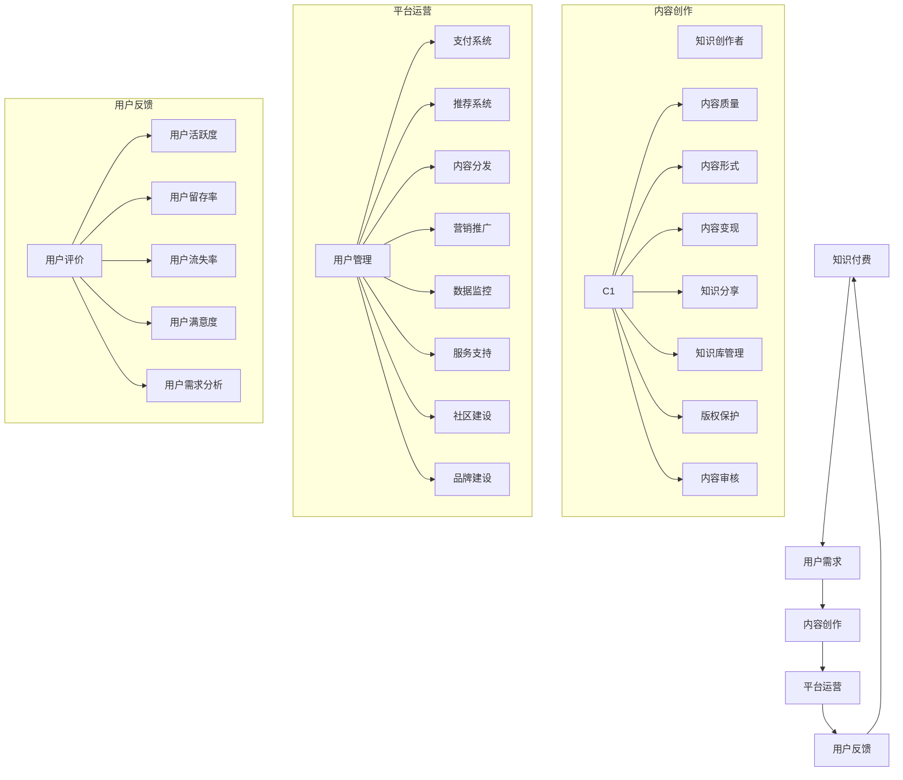

                 

## 第1章：引言与行业概述

### 1.1 知识付费的概念与意义

知识付费，顾名思义，是指用户为获取特定的知识内容或服务而支付的费用。随着互联网技术的发展和人们对于知识获取需求的增加，知识付费已经成为现代经济中的一种重要商业模式。知识付费的意义在于：

1. **提高知识获取效率**：知识付费可以让用户快速获取到专业、高质量的知识内容，节省了大量的时间。
2. **激励知识创造**：知识付费为知识创造者提供了经济回报，激励了更多人投身于知识创作和分享。
3. **推动知识经济发展**：知识付费促进了知识经济的发展，为整个社会创造了新的经济增长点。

### 1.2 知识付费的发展历程

知识付费的发展历程可以大致分为以下几个阶段：

1. **传统教育阶段**：知识付费的雏形可以追溯到古代的私人教育，教师收取学费来教授知识。
2. **数字化内容阶段**：随着互联网和数字技术的发展，电子书、在线课程等数字化内容开始兴起，用户可以在线支付费用获取知识。
3. **平台化阶段**：知识付费逐渐走向平台化，知识创作者可以通过平台发布内容，用户通过平台购买知识。
4. **个性化阶段**：随着大数据和人工智能技术的应用，知识付费变得更加个性化，用户可以按照自己的需求和兴趣选择知识内容。

### 1.3 当前知识付费行业的现状与趋势

当前，知识付费行业呈现出以下现状与趋势：

1. **市场规模持续扩大**：知识付费市场在近年来呈现快速增长趋势，预计未来还将保持高速增长。
2. **用户结构多样化**：知识付费用户群体逐渐扩大，不仅包括专业人士，还涵盖了广大普通消费者。
3. **内容形式多样化**：知识付费内容不再局限于传统的文字和视频，直播、互动问答等形式逐渐受到用户欢迎。
4. **技术创新驱动**：大数据、人工智能、区块链等技术的应用，为知识付费行业带来了新的发展机遇。
5. **竞争加剧**：随着知识付费市场的不断扩大，竞争也日益激烈，平台需要不断创新和优化商业模式来吸引和留住用户。

### 1.4 本书的目的与结构

本书旨在为知识付费创业者提供一套系统、实用的商业模式优化策略。通过分析知识付费行业的现状、商业模式的理论基础、用户需求分析、产品设计与创新、定价策略与模式、营销策略与推广、平台运营与数据驱动、商业模式创新与实践以及实战指导，帮助创业者更好地理解知识付费行业的运作机制，找到适合自己企业的商业模式。

本书的结构如下：

- **第一部分：知识付费行业概述**：介绍知识付费行业的概念、发展历程、现状与趋势。
- **第二部分：商业模式优化策略**：分析商业模式的理论基础、用户需求分析、产品设计与创新、定价策略与模式、营销策略与推广、平台运营与数据驱动、商业模式创新与实践。
- **第三部分：案例分析**：通过成功和失败的案例，总结知识付费创业的教训和启示。
- **第四部分：商业模式优化实践指导**：提供具体的商业模式优化实践指导，帮助创业者将理论知识应用到实际操作中。

### 1.5 小结

本章对知识付费行业的概念、发展历程、现状与趋势进行了概述，并明确了本书的目的与结构。下一章将深入探讨知识付费商业模式的理论基础，帮助读者理解知识付费商业模式的构成要素及其相互作用。

---

### 1.6 核心概念与联系

为了更好地理解知识付费商业模式，我们需要明确一些核心概念，并展示它们之间的联系。以下是一个Mermaid流程图，展示了知识付费商业模式的核心概念及其相互关系：



- **知识付费**：指用户为获取特定知识内容或服务而支付的费用。
- **用户需求**：用户对知识内容的期望和需求，是知识付费商业模式的基础。
- **内容创作**：知识创作者生产高质量知识内容的活动，包括内容质量、内容形式、内容变现等。
- **平台运营**：知识付费平台提供的服务和管理，包括用户管理、支付系统、推荐系统、内容分发、营销推广、数据监控、服务支持、社区建设和品牌建设等。
- **用户反馈**：用户对知识付费平台和内容创作者的评价和反馈，包括用户评价、用户活跃度、用户留存率、用户流失率、用户满意度等。

通过这个流程图，我们可以清晰地看到知识付费商业模式中各个核心概念之间的联系和相互作用。了解这些核心概念及其关系，有助于我们更好地理解和优化知识付费商业模式。

### 1.7 核心算法原理讲解

在知识付费商业模式中，算法的应用对于用户行为分析、内容推荐、定价策略等方面起着至关重要的作用。以下是核心算法原理的讲解，以及相应的伪代码示例。

#### 1.7.1 用户行为分析

用户行为分析可以帮助知识付费平台理解用户的行为模式，从而提供更个性化的服务和推荐。常见的方法包括用户行为分类、用户行为预测等。

**用户行为分类**：

用户行为分类是一种将用户行为划分为不同类别的算法。这种方法可以帮助平台了解用户的兴趣和行为模式。

**伪代码示例**：

```python
# 加载数据
user_data = load_data()

# 数据预处理
X = preprocess_data(user_data)

# 划分训练集和测试集
X_train, X_test = train_test_split(X, test_size=0.2)

# 训练模型
model = KMeans(n_clusters=5)
model.fit(X_train)

# 预测测试集
y_pred = model.predict(X_test)

# 评估模型
evaluate_model(y_pred, X_test)
```

**用户行为预测**：

用户行为预测是一种预测用户未来行为的方法。这可以帮助平台提前做好准备，提供更个性化的服务。

**伪代码示例**：

```python
# 加载数据
user_data = load_data()

# 数据预处理
X = preprocess_data(user_data)

# 划分训练集和测试集
X_train, X_test = train_test_split(X, test_size=0.2)

# 训练模型
model = RandomForestClassifier()
model.fit(X_train, y_train)

# 预测测试集
y_pred = model.predict(X_test)

# 评估模型
evaluate_model(y_pred, X_test)
```

#### 1.7.2 内容推荐

内容推荐是一种基于用户行为和内容特征，为用户推荐他们可能感兴趣的内容的方法。

**协同过滤**：

协同过滤是一种基于用户行为数据的内容推荐方法。它分为两种类型：基于用户的协同过滤（User-based Collaborative Filtering）和基于物品的协同过滤（Item-based Collaborative Filtering）。

**基于用户的协同过滤**：

```python
# 计算相似度矩阵
similarity_matrix = compute_similarity_matrix(user行为数据)

# 为用户推荐相似用户喜欢的物品
recommendations = find_recommended_items(user_id, similarity_matrix, ratings)

# 输出推荐结果
output_recommendations(recommendations)
```

**基于物品的协同过滤**：

```python
# 计算相似度矩阵
similarity_matrix = compute_similarity_matrix(content特征数据)

# 为用户推荐相似物品
recommendations = find_recommended_content(item_id, similarity_matrix, user行为数据)

# 输出推荐结果
output_recommendations(recommendations)
```

#### 1.7.3 定价策略

定价策略是知识付费平台的重要环节，合理的定价策略可以提高收入和用户满意度。

**价格弹性分析**：

价格弹性分析是一种评估价格变化对需求影响的方法。它可以帮助平台确定最佳定价策略。

**伪代码示例**：

```python
# 计算价格弹性
elasticity = compute_price_elasticity(price, quantity)

# 根据价格弹性调整价格
if elasticity > 1:
    # 需要降低价格
    new_price = price - adjustment
else:
    # 需要提高价格
    new_price = price + adjustment
```

通过这些核心算法原理的讲解和伪代码示例，我们可以更好地理解知识付费商业模式中的算法应用，并为平台的运营提供科学依据。

### 1.8 数学模型和数学公式

在知识付费商业模式中，数学模型和数学公式被广泛应用于用户行为分析、定价策略、推荐系统等领域。以下是一些常见的数学模型和公式的详细讲解以及应用示例。

#### 1.8.1 用户价值计算

用户价值计算是衡量用户对企业贡献的一种方法。它可以帮助企业了解哪些用户具有更高的价值，从而制定相应的营销策略。

**数学公式**：

$$
V_u = \sum_{i=1}^{n} r_i \cdot w_i
$$

其中，$V_u$ 表示用户 $u$ 的价值，$r_i$ 表示用户对第 $i$ 个产品的评分，$w_i$ 表示第 $i$ 个产品的权重。

**应用示例**：

假设一个用户对三个产品的评分分别为 $r_1 = 4$, $r_2 = 5$, $r_3 = 3$，产品的权重分别为 $w_1 = 0.3$, $w_2 = 0.5$, $w_3 = 0.2$，则该用户的价值计算如下：

$$
V_u = 4 \cdot 0.3 + 5 \cdot 0.5 + 3 \cdot 0.2 = 1.2 + 2.5 + 0.6 = 4.3
$$

#### 1.8.2 价格弹性计算

价格弹性计算是评估价格变化对需求影响的一种方法。它可以帮助企业了解价格策略的合理性。

**数学公式**：

$$
\epsilon = \frac{p^2 \cdot (q_2 - q_1)}{q \cdot (p_2 - p_1)}
$$

其中，$\epsilon$ 表示价格弹性，$p$ 表示原始价格，$q$ 表示原始销量，

