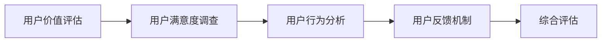
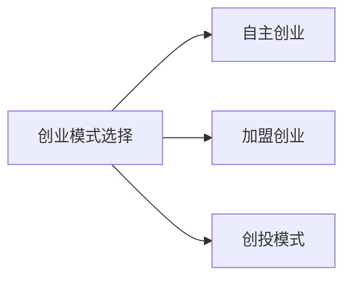

                 

### 《知识付费创业的用户价值 Maximization》

> **关键词**：知识付费、用户价值、创业、最大化、算法、策略、平台搭建

> **摘要**：
随着信息时代的到来，知识付费逐渐成为市场的一股重要力量。本文旨在深入探讨知识付费创业中的用户价值最大化问题。文章首先定义了知识付费和创业的相关概念，随后分析了用户价值的含义及其与创业的关系。接着，文章详细讲解了用户价值评估和创业模式设计的方法和策略，以及这些方法如何相互联系和影响。本文还将介绍用户行为分析、价值评估和最大化的核心算法原理，并使用数学模型进行解释。最后，文章通过实际项目实战，展示了如何在实际操作中应用这些理论，从而实现用户价值最大化。

### 《知识付费创业的用户价值 Maximization》目录大纲

- **第一部分：引言与背景**
  - **1.1 知识付费概述**
    - 1.1.1 知识付费的定义
    - 1.1.2 知识付费的市场趋势
    - 1.1.3 知识付费的意义与价值
  - **1.2 创业与用户价值**
    - 1.2.1 创业的本质
    - 1.2.2 用户价值的定义
    - 1.2.3 用户价值与创业的关系
  - **1.3 用户价值最大化**
    - 1.3.1 用户价值最大化的概念
    - 1.3.2 用户价值最大化的目标
    - 1.3.3 用户价值最大化的策略

- **第二部分：核心概念与联系**
  - **2.1 用户价值评估**
    - 2.1.1 用户价值评估的重要性
    - 2.1.2 用户价值评估的方法
      - 2.1.2.1 用户满意度调查
      - 2.1.2.2 用户行为分析
      - 2.1.2.3 用户反馈机制
    - 2.1.3 用户价值评估的Mermaid流程图
  - **2.2 创业模式设计**
    - 2.2.1 创业模式的定义
    - 2.2.2 创业模式的选择
      - 2.2.2.1 自主创业
      - 2.2.2.2 加盟创业
      - 2.2.2.3 创投模式
    - 2.2.3 创业模式的Mermaid流程图
  - **2.3 用户价值与创业模式的联系**
    - 2.3.1 用户价值对创业模式的影响
    - 2.3.2 创业模式对用户价值的提升
    - 2.3.3 用户价值与创业模式的互动关系

- **第三部分：核心算法原理讲解**
  - **3.1 用户行为分析算法**
    - 3.1.1 用户行为分析概述
    - 3.1.2 用户行为分析算法
      - 3.1.2.1 聚类分析
        - 3.1.2.1.1 K-means算法
        - 3.1.2.1.2 DBSCAN算法
      - 3.1.2.2 分区分析
        - 3.1.2.2.1 用户细分
        - 3.1.2.2.2 用户群体分析
  - **3.2 用户价值评估算法**
    - 3.2.1 用户价值评估算法概述
    - 3.2.2 用户价值评估算法
      - 3.2.2.1 贡献度分析
        - 3.2.2.1.1 生命周期价值(LTV)
        - 3.2.2.1.2 用户活跃度分析
      - 3.2.2.2 成本效益分析
        - 3.2.2.2.1 转化率分析
        - 3.2.2.2.2 获客成本分析
  - **3.3 用户价值最大化算法**
    - 3.3.1 用户价值最大化算法概述
    - 3.3.2 用户价值最大化算法
      - 3.3.2.1 用户激励机制
        - 3.3.2.1.1 优惠券策略
        - 3.3.2.1.2 积分奖励机制
      - 3.3.2.2 用户界面优化
        - 3.3.2.2.1 用户体验设计
        - 3.3.2.2.2 个性化推荐系统

- **第四部分：数学模型与公式讲解**
  - **4.1 用户价值评估的数学模型**
    - 4.1.1 生命周期价值(LTV)模型
    - 4.1.2 用户活跃度模型
  - **4.2 用户价值最大化的数学模型**
    - 4.2.1 用户激励机制模型
    - 4.2.2 用户界面优化模型

- **第五部分：项目实战**
  - **5.1 知识付费平台搭建**
    - 5.1.1 平台搭建流程
    - 5.1.2 知识付费平台的实际操作
  - **5.2 用户价值最大化实战**
    - 5.2.1 用户行为分析实战
    - 5.2.2 用户价值评估实战
    - 5.2.3 用户价值最大化策略实施
  - **5.3 用户界面优化实施**
    - 5.3.1 用户体验设计实战
    - 5.3.2 个性化推荐系统实施

- **附录**
  - **附录A：知识付费创业工具与资源**
    - A.1 知识付费平台开发工具
    - A.2 数据分析工具

### 第一部分：引言与背景

#### 1.1 知识付费概述

**1.1.1 知识付费的定义**

知识付费，顾名思义，是指用户为了获取高质量的知识内容，愿意支付一定费用的行为。这通常涉及在线教育、专业咨询、技能培训、电子书籍等多种形式。与传统免费内容相比，知识付费强调内容的独占性和专业性，用户在获取知识时能够获得更好的体验和更有保障的服务。

**1.1.2 知识付费的市场趋势**

随着互联网技术的发展和普及，知识付费市场呈现出快速增长的趋势。根据相关报告，全球知识付费市场规模在过去几年中持续扩大，预计未来仍将保持高速增长。特别是在中国，知识付费已经成为一种新的消费模式，越来越多的用户愿意为高质量的知识内容支付费用。

**1.1.3 知识付费的意义与价值**

知识付费对用户、内容提供商和社会都有重要的意义和价值。

- **对用户的意义**：知识付费能够帮助用户快速获取专业、系统、高质量的知识内容，提高个人能力和职业素养。
- **对内容提供商的意义**：知识付费为内容创作者提供了一个新的盈利模式，激励他们创作更多有价值的内容。
- **对社会的意义**：知识付费促进了知识的传播和共享，提高了整个社会的知识水平和创新能力。

#### 1.2 创业与用户价值

**1.2.1 创业的本质**

创业是指个体或团队通过创新和风险承担，创建新的商业机会并实现商业化的过程。创业不仅涉及商业模式创新，还包括组织管理、市场营销、资金筹集等方面。

**1.2.2 用户价值的定义**

用户价值是指用户在使用产品或服务时所获得的好处和满足感。它包括功能价值、情感价值和社会价值等方面。功能价值是指产品或服务的实际功能效用；情感价值是指用户在使用产品或服务时所感受到的情感体验；社会价值是指用户在使用产品或服务时所获得的社交和认同价值。

**1.2.3 用户价值与创业的关系**

用户价值是创业的核心驱动力之一。创业者必须深刻理解用户的需求和期望，通过不断创新和优化产品或服务，提升用户价值，从而赢得市场份额和用户忠诚度。

- **用户价值对创业的影响**：用户价值直接影响创业的成败。高用户价值意味着产品或服务能够满足用户需求，从而获得用户认可和市场份额。
- **创业对用户价值的影响**：创业通过不断创新和优化，可以提升用户价值。创业过程中，创业者需要不断收集用户反馈，调整产品或服务，从而更好地满足用户需求，提升用户价值。

#### 1.3 用户价值最大化

**1.3.1 用户价值最大化的概念**

用户价值最大化是指通过提供高质量、个性化、高效的产品或服务，满足用户需求，提升用户满意度，从而实现用户价值的最大化。

**1.3.2 用户价值最大化的目标**

用户价值最大化的目标包括：

- 提高用户满意度：通过满足用户需求，提高用户对产品或服务的满意度。
- 提升用户忠诚度：通过提供高质量的服务和良好的用户体验，建立用户忠诚度，降低用户流失率。
- 增加用户价值：通过不断优化产品或服务，提升用户的使用体验和价值感受。

**1.3.3 用户价值最大化的策略**

实现用户价值最大化的策略包括：

- 用户需求分析：通过市场调研、用户访谈等方式，深入了解用户需求，为产品或服务优化提供依据。
- 产品创新：通过技术创新、设计优化等方式，不断提升产品或服务的功能、性能和用户体验。
- 用户服务优化：通过提高服务质量、增强用户互动等方式，提升用户满意度。
- 数据驱动决策：通过收集和分析用户数据，为产品或服务优化提供数据支持。

### 第二部分：核心概念与联系

#### 2.1 用户价值评估

**2.1.1 用户价值评估的重要性**

用户价值评估是知识付费创业中的关键环节。准确评估用户价值有助于：

- 了解用户需求：通过评估用户价值，可以深入了解用户的需求和期望，为产品或服务优化提供依据。
- 制定营销策略：根据用户价值评估结果，可以制定更具针对性的营销策略，提高市场推广效果。
- 优化资源分配：通过评估用户价值，可以合理分配资源，提高投入产出比。

**2.1.2 用户价值评估的方法**

用户价值评估的方法主要包括用户满意度调查、用户行为分析和用户反馈机制。

- **用户满意度调查**：通过问卷调查、访谈等方式，了解用户对产品或服务的满意度。满意度调查可以帮助评估用户对产品或服务的整体评价，发现潜在问题和改进方向。
- **用户行为分析**：通过分析用户在产品或服务中的行为数据，了解用户的实际使用情况和需求。行为分析可以帮助评估用户价值，发现用户行为模式，优化产品或服务。
- **用户反馈机制**：建立用户反馈渠道，收集用户的意见和建议。用户反馈可以提供直接的改进建议，帮助优化产品或服务。

**2.1.3 用户价值评估的Mermaid流程图**



#### 2.2 创业模式设计

**2.2.1 创业模式的定义**

创业模式是指创业者为了实现商业目标而采用的方法和策略。创业模式包括商业模式、运营模式、营销模式等方面。

**2.2.2 创业模式的选择**

创业者需要根据自身情况和市场环境选择合适的创业模式。常见的创业模式包括：

- **自主创业**：创业者独立创办企业，拥有完全的经营权和决策权。自主创业适合有较强创业能力和资源的企业家。
- **加盟创业**：创业者加入一个已有品牌的连锁体系，利用品牌优势和市场资源进行创业。加盟创业适合希望快速进入市场的创业者。
- **创投模式**：创业者通过吸引风险投资来启动和扩展业务。创投模式适合有创新能力和高成长潜力的企业。

**2.2.3 创业模式的Mermaid流程图**



#### 2.3 用户价值与创业模式的联系

**2.3.1 用户价值对创业模式的影响**

用户价值对创业模式的选择和实施具有重要影响。创业者需要关注以下几点：

- **用户需求分析**：深入了解用户需求，为创业模式的选择提供依据。例如，如果用户需求集中在某一特定领域，创业者可以针对这一需求设计相应的创业模式。
- **用户价值最大化**：在创业模式的设计和实施过程中，要注重提升用户价值。例如，通过提供高质量的产品或服务，满足用户需求，提升用户满意度。
- **用户反馈机制**：建立有效的用户反馈机制，及时了解用户意见和建议，为创业模式的调整和优化提供支持。

**2.3.2 创业模式对用户价值的提升**

创业模式对用户价值的提升具有重要作用。创业者需要关注以下几点：

- **创新和优化**：通过不断创新和优化产品或服务，提升用户价值。例如，采用先进的技术和设计，提高产品的性能和用户体验。
- **资源整合**：通过整合资源，提高产品或服务的质量和效率。例如，利用供应链优势，降低成本，提高性价比。
- **市场拓展**：通过拓展市场，扩大用户群体，提高用户价值。例如，通过线上线下结合，扩大品牌影响力，吸引更多用户。

**2.3.3 用户价值与创业模式的互动关系**

用户价值与创业模式之间存在相互影响和互动关系。一方面，用户价值评估和创业模式设计需要关注用户需求和价值，为产品或服务优化提供支持。另一方面，创业模式的设计和实施需要考虑用户价值，通过提升用户价值来赢得市场份额和用户忠诚度。

- **用户价值驱动创业模式**：用户价值评估结果为创业模式设计提供依据，创业者需要根据用户需求和价值，设计相应的创业模式。
- **创业模式促进用户价值**：创业模式的设计和实施能够提升用户价值，通过提供高质量的产品或服务，满足用户需求，提升用户满意度。

### 第三部分：核心算法原理讲解

#### 3.1 用户行为分析算法

**3.1.1 用户行为分析概述**

用户行为分析是指通过收集、分析和解释用户在产品或服务中的行为数据，了解用户需求和行为模式，为产品或服务优化提供支持。用户行为分析算法主要包括聚类分析和分区分析。

**3.1.2 用户行为分析算法**

**3.1.2.1 聚类分析**

聚类分析是一种无监督学习方法，用于将相似的数据点分为多个类别。常见的聚类算法包括K-means和DBSCAN。

- **K-means算法**

K-means算法是一种基于距离的聚类算法。算法的基本步骤如下：

1. 初始化K个中心点。
2. 计算每个数据点到中心点的距离，并将其分配到最近的中心点所在的类别。
3. 重新计算每个类别的中心点。
4. 重复步骤2和3，直到中心点的位置不再变化或达到预设的迭代次数。

K-means算法的伪代码如下：

```python
def K_means(data, K):
    # 初始化K个中心点
    centroids = initialize_centroids(data, K)
    while not converged(centroids):
        # 分配数据点到类别
        clusters = assign_clusters(data, centroids)
        # 重新计算中心点
        centroids = update_centroids(data, clusters)
    return centroids, clusters
```

- **DBSCAN算法**

DBSCAN（Density-Based Spatial Clustering of Applications with Noise）是一种基于密度的聚类算法。算法的基本步骤如下：

1. 初始化聚类标记和中心点。
2. 对每个未标记的数据点，如果其邻域内的数据点数量大于最小密度，将其标记为核心点。
3. 对每个核心点，扩展其邻域内的数据点，形成聚类。
4. 处理噪声点。

DBSCAN算法的伪代码如下：

```python
def DBSCAN(data, min_points, min_density):
    # 初始化聚类标记和中心点
    labels = initialize_labels(data)
    for point in data:
        if labels[point] == UNLABELED:
            if is_core_point(point, min_points, min_density):
                extend_cluster(point, labels)
    return labels
```

**3.1.2.2 分区分析**

分区分析是一种有监督学习方法，用于将数据点划分为多个区域。常见的分区算法包括用户细分和用户群体分析。

- **用户细分**

用户细分是一种根据用户特征和行为数据，将用户划分为不同类别的算法。常见的用户细分算法包括决策树、神经网络等。

- **用户群体分析**

用户群体分析是一种根据用户特征和行为数据，对用户进行分类和聚类的算法。常见的用户群体分析算法包括聚类分析、关联规则挖掘等。

#### 3.2 用户价值评估算法

**3.2.1 用户价值评估算法概述**

用户价值评估算法是指通过分析用户行为数据和产品或服务特性，评估用户价值的方法。常见的用户价值评估算法包括生命周期价值（LTV）模型和用户活跃度模型。

**3.2.2 用户价值评估算法**

**3.2.2.1 贡献度分析**

贡献度分析是指通过分析用户在产品或服务中的行为数据，评估用户对整体价值的贡献。常见的贡献度分析算法包括生命周期价值（LTV）模型和用户活跃度模型。

- **生命周期价值（LTV）模型**

生命周期价值（LTV）模型是一种评估用户价值的方法，用于预测用户在未来一段时间内为公司带来的收益。LTV模型的基本公式如下：

\[ LTV = \frac{ARP}{CPA} \]

其中，ARP表示平均收益，CPA表示每行动成本。

- **用户活跃度模型**

用户活跃度模型是一种评估用户价值的方法，用于衡量用户在产品或服务中的活跃程度。用户活跃度模型的基本公式如下：

\[ User\ Activity = \frac{Total\ Interactions}{Time\ Spent} \]

其中，Total\ Interactions表示总互动次数，Time\ Spent表示花费时间。

**3.2.2.2 成本效益分析**

成本效益分析是指通过分析用户在产品或服务中的投入和产出，评估用户价值的成本效益。常见的成本效益分析算法包括转化率分析和获客成本分析。

- **转化率分析**

转化率分析是一种评估用户价值的方法，用于衡量用户在产品或服务中的转化效果。转化率分析的基本公式如下：

\[ Conversion\ Rate = \frac{Number\ of\ Conversions}{Number\ of\ Visitors} \]

其中，Number\ of\ Conversions表示转化次数，Number\ of\ Visitors表示访问次数。

- **获客成本分析**

获客成本分析是一种评估用户价值的方法，用于衡量获取用户所需的成本。获客成本分析的基本公式如下：

\[ Customer\ Acquisition\ Cost\ (CAC) = \frac{Total\ Cost}{Number\ of\ Customers} \]

其中，Total\ Cost表示总成本，Number\ of\ Customers表示客户数量。

#### 3.3 用户价值最大化算法

**3.3.1 用户价值最大化算法概述**

用户价值最大化算法是指通过分析用户行为数据和产品或服务特性，优化用户价值的方法。常见的用户价值最大化算法包括用户激励机制和用户界面优化。

**3.3.2 用户价值最大化算法**

**3.3.2.1 用户激励机制**

用户激励机制是指通过设计奖励机制，鼓励用户参与产品或服务，提高用户价值的算法。常见的用户激励机制包括优惠券策略和积分奖励机制。

- **优惠券策略**

优惠券策略是一种通过发放优惠券，鼓励用户消费的算法。优惠券策略的基本公式如下：

\[ Reward = f(Purchase\ Amount) \]

其中，f（激励函数）表示根据消费金额计算奖励的函数。

- **积分奖励机制**

积分奖励机制是一种通过发放积分，鼓励用户参与产品或服务的算法。积分奖励机制的基本公式如下：

\[ Reward = f(User\ Activity) \]

其中，f（激励函数）表示根据用户活动计算奖励的函数。

**3.3.2.2 用户界面优化**

用户界面优化是指通过优化产品或服务的用户界面，提高用户体验，从而提高用户价值的算法。常见的用户界面优化包括用户体验设计和个性化推荐系统。

- **用户体验设计**

用户体验设计是一种通过优化产品或服务的用户界面，提高用户体验的算法。用户体验设计的基本公式如下：

\[ UI\ Optimization = f(User\ Interaction) \]

其中，f（优化函数）表示根据用户互动计算优化效果的函数。

- **个性化推荐系统**

个性化推荐系统是一种通过分析用户行为数据，为用户提供个性化推荐内容的算法。个性化推荐系统的基本公式如下：

\[ Recommendation\ List = f(User\ Behavior) \]

其中，f（推荐函数）表示根据用户行为计算推荐列表的函数。

### 第四部分：数学模型与公式讲解

#### 4.1 用户价值评估的数学模型

**4.1.1 生命周期价值（LTV）模型**

生命周期价值（LTV）模型是一种评估用户价值的方法，用于预测用户在未来一段时间内为公司带来的收益。LTV模型的基本公式如下：

\[ LTV = \frac{ARP}{CPA} \]

其中，ARP表示平均收益，CPA表示每行动成本。

- **ARP（平均收益）**

ARP表示用户在产品或服务中的平均收益，计算公式如下：

\[ ARP = \frac{Total\ Revenue}{Number\ of\ Users} \]

其中，Total\ Revenue表示总收益，Number\ of\ Users表示用户数量。

- **CPA（每行动成本）**

CPA表示获取用户所需的成本，计算公式如下：

\[ CPA = \frac{Total\ Cost}{Number\ of\ Users} \]

其中，Total\ Cost表示总成本，Number\ of\ Users表示用户数量。

**4.1.2 用户活跃度模型**

用户活跃度模型是一种评估用户价值的方法，用于衡量用户在产品或服务中的活跃程度。用户活跃度模型的基本公式如下：

\[ User\ Activity = \frac{Total\ Interactions}{Time\ Spent} \]

其中，Total\ Interactions表示总互动次数，Time\ Spent表示花费时间。

#### 4.2 用户价值最大化的数学模型

**4.2.1 用户激励机制模型**

用户激励机制模型是一种通过设计奖励机制，鼓励用户参与产品或服务，提高用户价值的算法。用户激励机制模型的基本公式如下：

\[ Reward = f(User\ Behavior) \]

其中，f（激励函数）表示根据用户行为计算奖励的函数。

- **激励函数**

激励函数用于计算用户奖励，常见的激励函数包括线性函数、幂函数和对数函数。以下是一个线性激励函数的示例：

\[ f(User\ Behavior) = \alpha \cdot User\ Behavior \]

其中，\alpha表示激励系数，User\ Behavior表示用户行为。

**4.2.2 用户界面优化模型**

用户界面优化模型是一种通过优化产品或服务的用户界面，提高用户体验，从而提高用户价值的算法。用户界面优化模型的基本公式如下：

\[ UI\ Optimization = f(User\ Interaction) \]

其中，f（优化函数）表示根据用户互动计算优化效果的函数。

- **优化函数**

优化函数用于计算用户界面优化的效果，常见的优化函数包括线性函数、幂函数和对数函数。以下是一个线性优化函数的示例：

\[ f(User\ Interaction) = \beta \cdot User\ Interaction \]

其中，\beta表示优化系数，User\ Interaction表示用户互动。

### 第五部分：项目实战

#### 5.1 知识付费平台搭建

**5.1.1 平台搭建流程**

搭建一个知识付费平台需要经历以下几个步骤：

1. **需求分析**：明确平台的目标用户、功能需求和业务模式。
2. **技术选型**：选择合适的技术栈，包括前端、后端和数据库等。
3. **系统设计**：设计平台的系统架构，包括客户端架构和服务端架构。
4. **开发实现**：根据系统设计，进行前端和后端的开发。
5. **测试与优化**：进行功能测试、性能测试和用户体验优化。
6. **上线与运维**：将平台上线，并进行日常的运维和维护。

**5.1.2 知识付费平台的实际操作**

以下是一个简单的知识付费平台搭建的实际操作示例：

1. **需求分析**：假设我们想要搭建一个在线教育平台，提供课程购买和播放功能。
2. **技术选型**：前端使用React框架，后端使用Node.js和MongoDB数据库。
3. **系统设计**：前端采用单页面应用（SPA）架构，后端采用RESTful API架构。
4. **开发实现**：
   - 前端：使用React创建课程展示页面、课程播放页面和用户登录注册页面。
   - 后端：使用Express.js创建API接口，实现课程管理、用户管理和支付功能。
5. **测试与优化**：进行功能测试，确保平台各个功能正常运行；进行性能测试，优化页面加载速度和响应时间；根据用户反馈，优化用户体验。
6. **上线与运维**：将平台部署到云服务器，设置域名和SSL证书，进行日常的监控和维护。

#### 5.2 用户价值最大化实战

**5.2.1 用户行为分析实战**

用户行为分析是用户价值最大化的关键步骤之一。以下是一个用户行为分析的实际操作示例：

1. **数据收集**：通过前端埋点技术，收集用户在平台上的行为数据，如课程访问次数、购买行为、评论等。
2. **数据存储与管理**：使用MongoDB数据库存储用户行为数据，并设计合适的数据模型，以便进行后续的数据分析和挖掘。
3. **用户行为数据挖掘**：
   - 聚类分析：使用K-means算法，将用户分为不同的群体，以便进行有针对性的营销和推广。
   - 关联规则挖掘：使用Apriori算法，挖掘用户行为数据中的关联规则，为个性化推荐提供依据。
4. **用户价值评估**：使用生命周期价值（LTV）模型和用户活跃度模型，评估用户的潜在价值。

**5.2.2 用户价值评估实战**

用户价值评估是知识付费平台的核心任务之一。以下是一个用户价值评估的实际操作示例：

1. **数据收集**：通过问卷调查、用户反馈和用户行为数据，收集用户满意度、购买意愿和活跃度等信息。
2. **数据分析**：使用统计分析方法，对收集到的数据进行处理和分析，提取有用信息。
3. **用户价值评估**：
   - 使用LTV模型，预测用户在未来一段时间内的潜在收益。
   - 使用用户活跃度模型，评估用户在平台上的活跃程度。
4. **用户价值评估结果应用**：根据用户价值评估结果，制定相应的营销策略和用户服务策略，提高用户满意度和忠诚度。

**5.2.3 用户价值最大化策略实施**

用户价值最大化策略的实施包括以下几个方面：

1. **用户激励机制**：通过优惠券策略和积分奖励机制，鼓励用户参与平台活动，提高用户活跃度。
2. **用户体验设计**：优化平台的用户界面和交互设计，提高用户满意度。
3. **个性化推荐**：根据用户行为数据和用户价值评估结果，为用户提供个性化的课程推荐，提高用户购买意愿。
4. **用户服务优化**：提供优质的用户服务，如在线客服、课程答疑等，提高用户满意度和忠诚度。

### 第五部分：项目实战

#### 5.1 知识付费平台搭建

**5.1.1 平台搭建流程**

知识付费平台搭建是一个复杂而系统的工程，涉及多个环节和技术的综合运用。以下是搭建一个知识付费平台的详细流程：

**1. 需求分析：**
- 确定平台的目标用户群体，分析用户需求，了解用户偏好的课程类型、学习模式、价格敏感度等。
- 明确平台的核心功能，如课程浏览、购买、支付、学习进度跟踪、评论分享、用户管理等。
- 制定商业模型，确定收入来源，如课程销售、广告、会员订阅等。

**2. 技术选型：**
- 前端：选择适合的知识付费平台技术栈，如React、Vue.js、Angular等，确保良好的用户体验和快速开发。
- 后端：选择性能稳定、易于扩展的服务器端技术，如Node.js、Django、Spring Boot等。
- 数据库：选择适合存储大量课程内容和用户数据的关系型数据库或NoSQL数据库，如MySQL、PostgreSQL、MongoDB等。

**3. 系统设计：**
- 设计系统的整体架构，包括客户端架构（如单页面应用、多页面应用）、服务端架构（如RESTful API、GraphQL）。
- 设计数据库模型，包括用户、课程、订单、评论等实体的关系和属性。
- 设计系统安全性，如用户认证、授权、数据加密等。

**4. 开发实现：**
- **前端开发：**根据系统设计，开发课程展示、用户登录、支付、学习中心等前端页面，实现与后端API的交互。
  - 使用React/Vue.js等框架，构建组件化的前端应用，提高开发效率和可维护性。
  - 使用WebGL或Three.js等技术，为平台增加交互性和沉浸式学习体验。
- **后端开发：**开发后端API，实现课程管理、用户管理、支付处理等功能。
  - 使用Node.js/Express.js等，快速构建后端服务，确保高并发处理能力。
  - 使用Django/Spring Boot等，实现业务逻辑和数据处理。

**5. 测试与优化：**
- 进行功能测试，确保所有功能正常工作，没有bug。
- 进行性能测试，优化页面加载速度、响应时间、数据库查询等。
- 进行用户体验测试，收集用户反馈，持续改进产品。

**6. 上线与运维：**
- 将知识付费平台部署到云服务器，如AWS、Azure、阿里云等。
- 设置域名和SSL证书，确保平台的可靠性和安全性。
- 实施持续集成和持续部署（CI/CD），自动化测试和部署流程。
- 进行日常的监控和运维，确保平台稳定运行，快速响应故障。

**5.1.2 知识付费平台的实际操作**

以下是一个简单的知识付费平台搭建的实际操作示例：

1. **需求分析**：假设我们想要搭建一个在线教育平台，提供课程购买和播放功能，支持多种支付方式，并允许用户进行评论和互动。
2. **技术选型**：
   - 前端：使用React框架，结合React Router进行页面路由管理。
   - 后端：使用Node.js和Express.js，结合MongoDB进行数据存储。
   - 支付处理：集成PayPal、Stripe等支付网关。
3. **系统设计**：
   - 前端：设计用户登录、课程列表、课程详情、支付流程、用户中心等页面。
   - 后端：设计用户、课程、订单、评论等实体，并定义相应的API接口。
4. **开发实现**：
   - **前端开发**：创建React组件，实现前端页面的布局和交互。
     ```javascript
     // 示例：React组件，用于显示课程列表
     function CourseList({ courses }) {
         return (
             <div>
                 {courses.map(course => (
                     <div key={course.id}>
                         <h3>{course.title}</h3>
                         <p>{course.description}</p>
                         <button>Buy Now</button>
                     </div>
                 ))}
             </div>
         );
     }
     ```
   - **后端开发**：使用Express.js创建API接口，处理用户请求和数据库操作。
     ```javascript
     // 示例：Express.js路由，用于处理课程列表请求
     app.get('/api/courses', async (req, res) => {
         try {
             const courses = await CourseModel.find();
             res.status(200).json(courses);
         } catch (error) {
             res.status(500).json({ message: 'Error fetching courses' });
         }
     });
     ```
5. **测试与优化**：进行单元测试、集成测试和性能测试，确保系统稳定性和响应速度。
6. **上线与运维**：将平台部署到云服务器，如使用Heroku进行自动化部署和监控，确保平台稳定运行。

#### 5.2 用户价值最大化实战

**5.2.1 用户行为分析实战**

用户行为分析是提升知识付费平台用户价值的核心步骤。以下是一个用户行为分析的实际操作示例：

1. **数据收集**：通过前端埋点（tracking）技术，收集用户在平台上的行为数据，如页面访问、课程播放时间、购买行为、评论等。
   ```javascript
   // 埋点示例：使用JavaScript事件监听，记录用户行为
   document.addEventListener('click', function(event) {
       if (event.target.tagName === 'BUTTON' && event.target.textContent === 'Buy Now') {
           sendEvent('course_purchase', { courseId: event.target.dataset.courseId });
       }
   });

   function sendEvent(eventName, eventData) {
       fetch('/api/track', {
           method: 'POST',
           headers: {
               'Content-Type': 'application/json',
           },
           body: JSON.stringify({ event: eventName, data: eventData }),
       });
   }
   ```

2. **数据存储与管理**：将收集到的用户行为数据存储到数据库中，如MongoDB，并设计合适的数据模型，以便进行后续的数据分析和挖掘。
   ```javascript
   // 数据模型示例：MongoDB中用户行为数据的存储
   {
       _id: ObjectId(),
       userId: 'user123',
       eventName: 'course_purchase',
       eventData: {
           courseId: 'course456',
           purchaseTime: ISODate(),
       },
       timestamp: ISODate(),
   }
   ```

3. **用户行为数据挖掘**：
   - **聚类分析**：使用K-means算法，将具有相似行为的用户分为不同的群体，以便进行有针对性的营销和推广。
     ```python
     from sklearn.cluster import KMeans
     import pandas as pd

     # 读取用户行为数据
     data = pd.DataFrame({
         'userId': ['user123', 'user124', 'user125', ...],
         'courseId': ['course456', 'course123', 'course789', ...],
         'purchaseTime': [ISODate(), ISODate(), ISODate(), ...],
     })

     # 将数据转换为适合K-means算法的格式
     X = data[['courseId', 'purchaseTime']]

     # 训练K-means模型
     kmeans = KMeans(n_clusters=3)
     kmeans.fit(X)

     # 获取聚类结果
     clusters = kmeans.labels_
     data['cluster'] = clusters
     ```
   - **关联规则挖掘**：使用Apriori算法，挖掘用户行为数据中的关联规则，为个性化推荐提供依据。
     ```python
     from mlxtend.frequent_patterns import apriori
     from mlxtend.frequent_patterns import association_rules

     # 构建购物篮数据集
     basket = {
         'user123': ['course456', 'course123', 'course789'],
         'user124': ['course123', 'course789', 'course321'],
         'user125': ['course456', 'course321', 'course123'],
         ...
     }

     # 应用Apriori算法
     frequent_itemsets = apriori(basket, min_support=0.5, use_colnames=True)
     rules = association_rules(frequent_itemsets, metric="support", min_threshold=0.7)

     # 输出关联规则
     print(rules)
     ```

4. **用户价值评估**：使用生命周期价值（LTV）模型和用户活跃度模型，评估用户的潜在价值和活跃程度。
   - **LTV模型**：预测用户在未来一段时间内为平台带来的收益。
     ```python
     import numpy as np

     # LTV模型参数
     ARP = 20  # 平均每单收益
     CPA = 5   # 每个用户的获取成本

     # 用户行为数据
     purchase_counts = [10, 5, 7, 3, 15]  # 每个用户购买次数
     time_spent = [100, 50, 200, 75, 300]  # 每个用户在平台上的花费时间

     # 计算LTV
     LTVs = [ARP * purchase_counts[user] / CPA for user in range(len(purchase_counts))]
     print(LTVs)
     ```

   - **用户活跃度模型**：衡量用户在平台上的活跃程度。
     ```python
     # 计算用户活跃度
     activity_scores = [time_spent[user] / np.sum(time_spent) for user in range(len(time_spent))]
     print(activity_scores)
     ```

**5.2.2 用户价值评估实战**

用户价值评估是知识付费平台运营的重要环节，通过评估用户价值，可以为产品优化、营销策略制定等提供数据支持。以下是一个用户价值评估的实际操作示例：

1. **数据收集**：通过多种渠道收集用户数据，包括用户行为数据、问卷调查、用户反馈等。
   - **用户行为数据**：收集用户在平台上的活动记录，如课程浏览、购买、学习时长、互动等。
   - **问卷调查**：设计用户满意度调查问卷，收集用户对平台课程、服务、交互等方面的评价。
   - **用户反馈**：通过在线评论、客服反馈等收集用户对平台的使用体验和建议。

2. **数据分析**：对收集到的用户数据进行清洗、整理和分析，提取有价值的信息。
   - **描述性分析**：统计用户基本属性、行为特征等，了解用户群体的特征。
   - **相关性分析**：分析用户行为数据之间的相关性，识别关键影响因素。

3. **用户价值评估**：
   - **LTV评估**：基于用户行为数据，计算用户的生命周期价值（LTV），预测用户未来为平台带来的收益。
     ```python
     import pandas as pd

     # 用户行为数据
     data = pd.DataFrame({
         'userId': ['user123', 'user124', 'user125', ...],
         'coursePurchases': [10, 5, 7, 3, 15],
         'timeSpent': [100, 50, 200, 75, 300],
         'coursePrice': [100, 50, 200, 100, 150]
     })

     # LTV计算
     LTV = data['coursePurchases'] * data['coursePrice'] / 2  # 假设每节课的价格为100元
     data['LTV'] = LTV
     print(data)
     ```

   - **活跃度评估**：根据用户在平台上的活跃程度，评估用户的活跃度。
     ```python
     # 活跃度计算
     activityScore = data['timeSpent'] / np.max(data['timeSpent'])
     data['activityScore'] = activityScore
     print(data)
     ```

4. **用户价值评估结果应用**：
   - **产品优化**：根据用户价值评估结果，优化课程内容、交互设计等，提高用户满意度。
   - **营销策略**：针对不同价值用户群体，制定差异化的营销策略，如优惠券、会员计划等。
   - **资源分配**：根据用户价值评估结果，合理分配平台资源，如课程推广预算、用户服务团队等。

#### 5.3 用户价值最大化策略实施

**5.3.1 用户激励机制实施**

用户激励机制是提升用户价值和忠诚度的重要手段。以下是实施用户激励机制的实际操作示例：

1. **优惠券策略实施**：
   - **优惠券发放策略**：根据用户行为和活跃度，为不同价值用户发放不同额度的优惠券。
     ```python
     # 优惠券发放示例
     def generate_coupon(user):
         if user['LTV'] > 500:
             return '10OFF'  # 10%折扣
         elif user['LTV'] > 300:
             return '5OFF'   # 5%折扣
         else:
             return 'NO_COUPON'  # 无优惠券
     ```
   - **优惠券使用效果评估**：跟踪优惠券的使用情况，评估优惠券对用户购买行为的影响。
     ```python
     # 优惠券使用效果评估
     def evaluate_coupon_impact(coupons):
         used_coupons = coupons[coupons['couponUsed'] == True]
         total_savings = used_coupons['savings'].sum()
         total_sales = used_coupons['sales'].sum()
         return total_savings, total_sales
     ```

2. **积分奖励机制实施**：
   - **积分获取策略**：根据用户行为，为用户发放积分，鼓励用户参与平台活动。
     ```python
     # 积分获取示例
     def award_points(user):
         points = user['coursePurchases'] * 10 + user['timeSpent'] * 5
         return points
     ```
   - **积分使用策略**：允许用户使用积分兑换课程、优惠券等，提高用户活跃度。
     ```python
     # 积分使用示例
     def redeem_points(user, course_price):
         if user['points'] >= course_price:
             user['points'] -= course_price
             return True
         else:
             return False
     ```

**5.3.2 用户界面优化实施**

用户界面优化是提升用户体验和用户价值的重要环节。以下是用户界面优化的实际操作示例：

1. **用户体验设计实战**：
   - **界面布局优化**：根据用户行为数据和用户反馈，优化页面布局和导航，提高用户操作的便捷性。
     ```python
     # 界面布局优化示例
     def optimize_layout(heatmap_data):
         # 根据用户行为热力图，调整页面布局
         # 例如，将热门课程放在显眼位置，减少用户操作路径
         pass
     ```

   - **用户交互优化**：通过用户测试和反馈，优化用户的交互体验，提高用户满意度。
     ```python
     # 用户交互优化示例
     def optimize_interactions(feedback_data):
         # 根据用户反馈，优化交互设计
         # 例如，改善按钮点击效果，减少页面加载时间
         pass
     ```

2. **个性化推荐系统实施**：
   - **推荐算法选择**：根据用户行为数据和平台内容，选择合适的推荐算法，如协同过滤、内容推荐等。
     ```python
     # 推荐算法选择示例
     def select_recommendation_algorithm(user_data, content_data):
         if user_data['activityScore'] > 0.8:
             return 'content_recommendation'  # 内容推荐
         else:
             return 'collaborative_filtering'  # 协同过滤
     ```

   - **推荐效果评估**：通过用户点击、购买等行为，评估推荐系统的效果，持续优化推荐算法。
     ```python
     # 推荐效果评估示例
     def evaluate_recommendation_impact(recommendations, user_actions):
         # 根据用户行为，评估推荐效果
         # 例如，计算推荐点击率、转化率等指标
         pass
     ```

### 附录

#### 附录A：知识付费创业工具与资源

**A.1 知识付费平台开发工具**

1. **前端开发工具**：
   - **React**：用于构建用户界面的JavaScript库，支持组件化开发。
     - 官网：[https://reactjs.org/](https://reactjs.org/)
   - **Vue.js**：用于构建用户界面的JavaScript框架，易于上手。
     - 官网：[https://vuejs.org/](https://vuejs.org/)

2. **后端开发工具**：
   - **Node.js**：基于Chrome V8引擎的JavaScript运行环境，用于构建服务器端应用程序。
     - 官网：[https://nodejs.org/](https://nodejs.org/)
   - **Django**：用于快速开发Web应用程序的Python框架，具有强大的数据库支持和默认的安全特性。
     - 官网：[https://www.djangoproject.com/](https://www.djangoproject.com/)

**A.2 数据分析工具**

1. **数据收集与分析工具**：
   - **Google Analytics**：用于网站和移动应用的免费分析工具，提供详细的用户行为数据。
     - 官网：[https://analytics.google.com/](https://analytics.google.com/)
   - **Mixpanel**：用于跟踪和分析用户行为的工具，提供丰富的分析和可视化功能。
     - 官网：[https://mixpanel.com/](https://mixpanel.com/)

2. **数据挖掘与分析工具**：
   - **RapidMiner**：用于数据挖掘和机器学习的工具，提供直观的操作界面和强大的数据处理能力。
     - 官网：[https://rapidminer.com/](https://rapidminer.com/)
   - **Tableau**：用于数据可视化和商业智能的工具，能够快速创建直观的数据图表。
     - 官网：[https://www.tableau.com/](https://www.tableau.com/)

