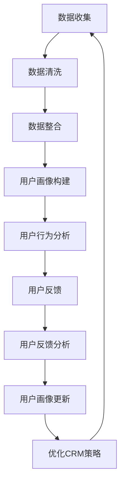

                 

### 知识付费赚钱的用户关系管理与会员等级体系

#### 关键词：
- 知识付费
- 用户关系管理
- 会员等级体系
- 数据分析
- 智能推荐系统

#### 摘要：
本文深入探讨了知识付费行业中的用户关系管理和会员等级体系设计。通过分析用户关系管理的核心概念、架构和数据集成方法，我们明确了构建高效用户关系管理体系的关键。随后，文章详细描述了会员等级体系的构建原则、策略和实施方法，并利用实际案例展示了会员等级体系的成功应用。最后，我们探讨了如何通过数据分析和用户反馈优化用户关系管理与会员等级体系，为知识付费行业的持续发展提供了策略建议。

### 目录大纲

#### 第一部分：用户关系管理基础

**第1章：知识付费行业概述**

- **1.1.1 知识付费的起源与发展**
- **1.1.2 知识付费行业的市场规模与趋势**
- **1.1.3 知识付费的平台类型与特点**

**第2章：用户关系管理核心概念**

- **2.1.1 用户关系管理定义**
- **2.1.2 用户生命周期管理**
- **2.1.3 用户画像与用户行为分析**

**第3章：用户关系管理架构**

- **3.1.1 用户关系管理架构概述**
- **3.1.2 数据集成与处理**
- **3.1.3 用户行为分析与预测**

#### 第二部分：会员等级体系设计

**第4章：会员等级体系概述**

- **4.1.1 会员等级体系的重要性**
- **4.1.2 会员等级体系的类型**
- **4.1.3 会员等级体系的设计原则**

**第5章：会员等级体系策略**

- **5.1.1 会员等级标准设定**
- **5.1.2 会员权益设计**
- **5.1.3 会员积分体系设计**

**第6章：会员等级体系实施**

- **6.1.1 会员等级体系上线与推广**
- **6.1.2 会员等级体系监控与调整**
- **6.1.3 成功案例分析**

**第7章：用户关系管理与会员等级体系的优化**

- **7.1.1 数据分析与优化策略**
- **7.1.2 用户反馈与会员等级调整**
- **7.1.3 长期效益评估**

#### 第三部分：综合案例分析

**第8章：综合案例分析**

- **8.1.1 案例背景**
- **8.1.2 用户关系管理实践**
- **8.1.3 会员等级体系实践**
- **8.1.4 效果评估与总结**

**第9章：知识付费行业的未来趋势**

- **9.1.1 新兴技术的应用**
- **9.1.2 行业发展趋势预测**
- **9.1.3 企业应对策略建议**

**第10章：用户关系管理流程图**

**第11章：会员等级体系核心算法原理讲解**

- **11.1.1 算法概述**
- **11.1.2 用户评分与推荐算法**
- **11.1.3 用户行为预测算法**

**第12章：数学模型与数学公式详解**

- **12.1.1 会员积分计算模型**
- **12.1.2 会员等级晋升模型**
- **12.1.3 用户生命周期价值模型**

**第13章：项目实战**

- **13.1.1 环境搭建**
- **13.1.2 源代码实现**
- **13.1.3 代码解读与分析**

**第14章：总结与展望**

- **14.1.1 书籍内容回顾**
- **14.1.2 未来研究方向**
- **14.1.3 对知识付费行业的贡献**

### 附录

- **附录 A：常用术语解释**
- **附录 B：推荐阅读书目与资源**
- **附录 C：知识付费行业报告精选**

通过这个详细的目录结构，我们将逐步深入探讨知识付费行业中的用户关系管理与会员等级体系设计，确保每一位读者都能够从中受益，获得宝贵的行业洞见和实践经验。

#### 第一部分：用户关系管理基础

**第1章：知识付费行业概述**

知识付费作为现代互联网经济中的重要组成部分，逐渐成为各大平台和企业竞相争夺的领域。本章将探讨知识付费的起源、发展历程、市场规模以及平台类型，为后续的用户关系管理和会员等级体系设计提供背景知识。

**1.1.1 知识付费的起源与发展**

知识付费这一概念源于互联网信息的爆炸式增长，特别是在移动互联网普及的背景下。随着人们对于个性化、专业化知识的追求，知识付费逐渐从传统的学术出版和教育培训领域延伸到互联网平台。

- **早期阶段（2000-2010年）**：早期的知识付费主要集中在学术出版和教育培训领域。比如，电子书和在线课程成为知识传播的主要形式。用户开始接受为获取高质量知识内容付费。
- **快速发展期（2010-2015年）**：随着移动互联网的普及，知识付费进入快速发展期。平台如得到、喜马拉雅、知乎等相继兴起，提供了丰富多样的知识内容，满足了用户多样化的学习需求。
- **成熟期（2015年至今）**：知识付费行业进入成熟期，市场规模持续扩大。不仅限于教育培训，还涵盖了财经、科技、文化等多个领域。用户逐渐形成付费习惯，知识付费逐渐成为日常生活的一部分。

**1.1.2 知识付费行业的市场规模与趋势**

知识付费行业的市场规模持续扩大，数据显示，全球知识付费市场规模逐年增长。根据市场研究报告，预计未来几年内，这一市场规模将继续保持高速增长。

- **用户规模**：随着用户对知识需求的增加，知识付费的用户规模也在不断扩大。据统计，2019年中国知识付费用户规模已达到3.1亿人，预计2025年将突破5亿人。
- **收入构成**：知识付费的收入主要来源于订阅模式、付费课程、知识付费社区等多种形式。其中，订阅模式是最主要的收入来源，占据了整体市场的60%以上。

**1.1.3 知识付费的平台类型与特点**

知识付费平台类型多样，主要包括以下几类：

- **教育平台**：如网易云课堂、慕课网，主要提供职业技能培训和学历教育课程。这些平台通常具有丰富的课程资源和专业的讲师团队。
- **财经平台**：如雪球、得到，主要提供财经类知识内容，包括股票分析、投资策略等。这些平台吸引了大量对财经投资有浓厚兴趣的用户。
- **知识社区**：如知乎、分答，提供用户提问和专家解答的服务。用户可以在这些平台上获取专业知识和经验分享，同时也可以通过付费问答获得个性化的咨询服务。
- **综合平台**：如喜马拉雅、蜻蜓FM，提供多样化的知识内容，包括音频课程、小说、广播剧等。这些平台通过多样化的内容吸引和留住用户。

**总结**

知识付费行业从无到有，经历了多年的快速发展，已经成为互联网经济中的重要组成部分。了解知识付费行业的起源、市场规模以及平台类型，有助于我们更好地理解用户需求，设计更有效的用户关系管理和会员等级体系。

在接下来的章节中，我们将深入探讨用户关系管理的基础概念、架构以及核心策略，为构建高效的知识付费平台提供理论支持。让我们继续深入分析，发现更多行业背后的规律和机遇。

#### 第2章：用户关系管理核心概念

用户关系管理（CRM，Customer Relationship Management）是知识付费行业中的重要组成部分，它不仅关乎企业的营销策略，更影响到用户满意度和留存率。本章将详细介绍用户关系管理的核心概念，包括用户生命周期管理、用户画像以及用户行为分析，帮助读者理解并掌握用户关系管理的基本原理和实践方法。

**2.1.1 用户关系管理定义**

用户关系管理是一种系统性方法，旨在通过管理和优化与用户之间的关系来提高用户满意度、增强用户忠诚度，并最终提升企业的市场份额和盈利能力。CRM的核心目标是通过建立和维护用户档案、分析用户行为、提供个性化服务和及时反馈，实现用户价值的最大化。

用户关系管理的主要组成部分包括：

- **用户数据管理**：收集、整合和管理用户的基本信息、交易记录、反馈意见等数据，形成用户档案。
- **用户行为分析**：通过数据挖掘和分析用户的行为模式，了解用户需求和偏好，为个性化服务和营销策略提供依据。
- **用户体验优化**：基于用户画像和行为分析，为用户提供个性化的内容和服务，提升用户体验。
- **营销策略实施**：利用用户数据和行为分析结果，制定和实施有针对性的营销策略，提高用户转化率和留存率。

**2.1.2 用户生命周期管理**

用户生命周期是指用户从接触产品到退出的整个过程，通常包括以下阶段：

- **获取阶段**：用户首次接触产品，包括访问网站、下载应用、注册账号等。此阶段的目标是吸引潜在用户，提升品牌知名度。
- **激活阶段**：新用户开始使用产品，例如注册后首次购买、参与社区讨论等。此阶段的目标是引导用户熟悉产品功能，提高用户参与度。
- **留存阶段**：用户持续使用产品，表现出稳定的活跃行为。此阶段的目标是提高用户留存率，降低用户流失率。
- **增值阶段**：用户在产品中持续投入时间和资源，表现出高价值行为，例如付费购买高级服务、推荐给其他用户等。此阶段的目标是提升用户生命周期价值（LTV），实现盈利。
- **退出阶段**：用户停止使用产品，可能是由于产品不再满足其需求、竞争对手产品更具吸引力等原因。此阶段的目标是了解用户离开的原因，为改进产品和服务提供反馈。

用户生命周期管理的方法包括：

- **细分用户群体**：根据用户行为、需求和参与度等特征，将用户划分为不同群体，制定有针对性的管理策略。
- **用户行为分析**：持续跟踪和分析用户行为，了解用户在各个生命阶段的动态，及时调整管理策略。
- **个性化服务**：基于用户画像和行为分析，为用户提供个性化的内容和服务，提高用户满意度和忠诚度。
- **用户反馈机制**：建立用户反馈机制，及时收集用户意见和建议，快速响应并解决问题。

**2.1.3 用户画像与用户行为分析**

用户画像是指通过收集和分析用户数据，创建一个全面的用户信息模型，包括用户的性别、年龄、职业、兴趣爱好、消费习惯等。用户画像的目的是更好地了解用户，为其提供个性化的服务和内容。

- **用户画像的构建**：用户画像的构建通常包括以下步骤：

  1. **数据收集**：通过网站日志、用户行为数据、问卷调查等方式，收集用户的基本信息和行为数据。
  2. **数据整合**：将分散的数据整合到一个统一的数据仓库中，进行清洗和整理。
  3. **特征提取**：根据业务需求，提取用户的关键特征，如用户活跃度、购买频率、用户满意度等。
  4. **模型训练**：利用机器学习算法，建立用户画像模型，对用户行为进行预测和分析。

- **用户行为分析**：用户行为分析是用户关系管理中的重要环节，旨在通过分析用户的行为数据，了解用户需求和行为模式，为优化用户体验和服务提供依据。用户行为分析的方法包括：

  1. **行为轨迹分析**：分析用户在网站或应用中的行为轨迹，了解用户的浏览习惯、点击行为等。
  2. **行为模式识别**：利用统计分析和机器学习算法，识别用户的典型行为模式，如购买周期、活跃时间段等。
  3. **需求预测**：基于用户历史行为和当前行为，预测用户未来的需求和偏好，为个性化推荐和服务提供依据。

**总结**

用户关系管理是知识付费行业中的重要组成部分，通过用户生命周期管理、用户画像和用户行为分析，企业可以更好地了解用户需求，提供个性化服务，提升用户满意度和忠诚度。在接下来的章节中，我们将进一步探讨用户关系管理的架构和实施方法，帮助读者构建高效的用户关系管理体系。

#### 第3章：用户关系管理架构

用户关系管理（CRM）的架构是确保用户数据能够有效收集、整合、分析和利用的关键。一个良好的用户关系管理架构应包括数据集成与处理、用户行为分析与预测等多个关键组件。本章将详细阐述这些组件及其在用户关系管理中的作用，帮助读者构建一个全面而高效的CRM系统。

**3.1.1 用户关系管理架构概述**

用户关系管理架构是一个复杂的系统，它包括多个子系统，各自负责不同的功能，但又紧密联系，共同作用。一个典型的CRM架构主要包括以下几个关键组件：

- **数据收集系统**：负责从各种渠道收集用户数据，如网站访问日志、用户行为数据、交易数据等。
- **数据仓库**：用于存储和管理收集到的用户数据，确保数据的安全、完整和一致性。
- **数据清洗与整合系统**：对收集到的数据进行清洗、去重和整合，形成高质量的用户数据。
- **用户画像系统**：基于用户数据，构建用户画像模型，为个性化服务和推荐提供基础。
- **用户行为分析系统**：利用数据挖掘和机器学习技术，分析用户行为模式，预测用户需求。
- **营销与客户服务系统**：根据用户画像和行为分析结果，制定和实施营销策略，提供个性化的客户服务。
- **数据可视化与报告系统**：通过图表和报告，将用户数据和行为分析结果直观地展示给管理层，支持决策。

**3.1.2 数据集成与处理**

数据集成与处理是用户关系管理架构中的核心环节，它涉及以下几个方面：

- **数据收集**：通过Web跟踪、API调用、日志收集等方式，从各个渠道收集用户数据。例如，网站访问日志可以提供用户的浏览路径、点击行为等信息；交易数据可以记录用户的购买行为、支付金额等。
- **数据存储**：将收集到的数据存储到数据仓库中，采用分布式存储技术，确保数据的高可用性和可扩展性。常用的数据仓库技术包括关系型数据库（如MySQL、PostgreSQL）和NoSQL数据库（如Hadoop、MongoDB）。
- **数据清洗**：对收集到的数据进行清洗，去除重复、无效和错误的数据。数据清洗的步骤包括数据去重、缺失值处理、数据格式转换等。
- **数据整合**：将不同来源的数据进行整合，形成一个统一的用户视图。例如，将网站访问数据和交易数据进行关联，形成用户的完整行为轨迹。

**3.1.3 用户行为分析与预测**

用户行为分析是用户关系管理的核心，它通过分析用户的历史行为数据，预测用户未来的行为和需求，为个性化服务和推荐提供依据。以下是用户行为分析的主要方法和步骤：

- **用户行为追踪**：利用Web跟踪技术，记录用户在网站或应用中的行为，如浏览页面、点击链接、购买商品等。常用的跟踪技术包括cookies、Web beacon和JavaScript代码。
- **行为模式识别**：通过数据挖掘技术，分析用户的行为模式，识别用户的典型行为。例如，利用聚类算法将用户分为不同群体，每个群体具有相似的行为特征。
- **用户兴趣分析**：分析用户的行为数据，挖掘用户的兴趣点。例如，通过分析用户的浏览记录和购买历史，确定用户对哪些类别或主题的内容感兴趣。
- **需求预测**：利用机器学习算法，基于用户的历史行为和当前行为，预测用户未来的需求和购买意向。常用的算法包括分类算法（如决策树、随机森林）和预测算法（如线性回归、神经网络）。

**3.1.4 用户画像系统**

用户画像系统是构建用户关系管理架构的关键组件，它通过整合用户数据，构建一个多维度的用户画像模型，为个性化服务和推荐提供基础。以下是构建用户画像的主要步骤：

- **用户特征提取**：从用户数据中提取关键特征，如性别、年龄、职业、地理位置、兴趣爱好等。这些特征将用于构建用户画像的基础维度。
- **用户标签系统**：基于用户特征和行为数据，为用户打上各种标签，如“高价值客户”、“活跃用户”、“沉默用户”等。用户标签可以帮助企业更好地了解用户，制定有针对性的营销策略。
- **用户画像模型构建**：利用机器学习算法，构建用户画像模型，将用户特征和行为数据转化为可操作的画像。用户画像模型可以用于推荐系统、用户分群和个性化服务。
- **实时更新与优化**：用户画像不是静态的，而是需要根据用户行为的变化进行实时更新和优化。通过持续跟踪和分析用户行为，不断调整用户画像模型，提高其准确性和有效性。

**3.1.5 营销与客户服务系统**

营销与客户服务系统是用户关系管理架构中的执行层，它根据用户画像和行为分析结果，制定和实施有针对性的营销策略，提供个性化的客户服务。以下是营销与客户服务系统的核心功能：

- **个性化推荐**：根据用户画像和行为分析结果，为用户推荐个性化内容或产品，提高用户参与度和转化率。
- **精准营销**：利用用户数据和行为分析结果，制定精准的营销策略，如定向广告投放、邮件营销等。
- **客户服务**：基于用户画像和行为分析结果，为用户提供个性化的客户服务，如快速响应用户问题、提供定制化解决方案等。
- **客户关系管理**：通过客户关系管理系统（CRM），记录和管理与用户的互动历史，提高客户满意度。

**总结**

用户关系管理架构是一个复杂而关键的系统，它通过数据集成与处理、用户行为分析与预测、用户画像系统等多个组件，实现了对用户数据的全面管理和利用。一个良好的CRM系统不仅能够提高用户满意度，还能为企业带来显著的商业价值。在接下来的章节中，我们将深入探讨会员等级体系的设计原则和策略，帮助读者构建一个有效的会员体系。

#### 第4章：会员等级体系概述

会员等级体系是知识付费平台中提升用户粘性和促进消费的重要手段之一。通过设定不同等级的会员标准，平台可以激励用户持续参与和付费，同时也能为企业带来更高的收益和用户忠诚度。本章将详细介绍会员等级体系的重要性、不同类型的会员等级体系以及设计会员等级体系的原则。

**4.1.1 会员等级体系的重要性**

会员等级体系在知识付费平台中扮演着多重重要角色：

- **激励用户持续参与**：通过设定不同的会员等级，平台可以激励用户不断升级，提高用户活跃度和参与度。例如，高等级会员可以享受更多的优惠、特权服务，这会促使用户持续参与平台活动。
- **提升用户忠诚度**：会员等级体系通过提供独特的会员权益，如专属折扣、免费试用等，增强用户对平台的忠诚度。用户在享受特权服务的过程中，会逐渐形成对平台的依赖和信任。
- **增加平台收益**：会员等级体系不仅能够促进用户消费，还能通过会员升级和续费提高平台的总体收益。例如，平台可以通过设置会员积分体系，鼓励用户通过消费获得积分，进而升级为更高等级的会员。

**4.1.2 会员等级体系的类型**

会员等级体系的设计可以根据不同的标准和策略，分为以下几种类型：

- **按消费金额划分**：这种类型的会员等级体系主要根据用户在平台上的消费金额设定不同的等级。例如，用户消费金额达到一定额度后，可以升级为高级会员，享受更多的折扣和权益。
- **按消费频率划分**：这种类型的会员等级体系主要根据用户在平台上的消费频率来设定等级。例如，高频消费用户可以享受优先客服、专享课程等特权。
- **按用户活跃度划分**：这种类型的会员等级体系主要根据用户的活跃度来设定等级，如发布高质量内容、积极参与讨论、分享课程等。这种体系可以激励用户在平台上产生更多互动，提升整体活跃度。
- **混合型会员等级体系**：这种类型的会员等级体系结合了上述多种标准，根据用户的消费金额、活跃度、互动行为等多方面因素设定等级。这种体系能够更全面地评估用户的贡献和价值，提供更精准的激励措施。

**4.1.3 会员等级体系的设计原则**

设计一个有效的会员等级体系需要遵循以下原则：

- **明确的目标**：明确会员等级体系的目标，如提升用户粘性、增加消费额等。这有助于确保设计过程围绕目标进行，避免偏离方向。
- **合理的层次结构**：会员等级体系应具有清晰的层次结构，不同等级之间应有明显的区别和吸引力，让用户能够清晰地了解每个等级的权益和晋升条件。
- **公平性**：会员等级体系应确保公平性，让所有用户都有机会通过自己的努力和贡献升级，避免因资源分配不均导致用户不满。
- **可持续性**：会员等级体系的设计应考虑长期可持续性，确保企业在提供会员权益的同时，不会因为成本过高而影响整体运营。
- **激励性**：会员等级体系应具有足够的激励性，通过提供有吸引力的权益，激发用户的兴趣和参与度。
- **灵活性**：会员等级体系应具有一定的灵活性，能够根据市场变化和用户需求进行调整，保持体系的新鲜感和吸引力。

**4.1.4 会员等级体系与用户关系管理的关联**

会员等级体系与用户关系管理密切相关，两者相辅相成。用户关系管理通过收集和分析用户数据，构建用户画像，为会员等级体系的设计提供数据支持。而会员等级体系则通过提供个性化权益和服务，增强用户满意度和忠诚度，实现用户价值的最大化。

- **用户画像**：用户画像为会员等级体系提供了个性化的基础。通过分析用户的行为数据、消费习惯、兴趣偏好等，平台可以更精准地设定会员等级标准和权益。
- **会员权益**：会员等级体系中的权益设计需要与用户关系管理紧密结合。通过分析用户需求和行为，平台可以提供更符合用户期望的会员权益，提高用户满意度。
- **用户反馈**：用户反馈是优化会员等级体系和用户关系管理的重要依据。通过收集用户对会员权益和服务的反馈，平台可以不断调整和优化会员体系，提高用户体验。

**总结**

会员等级体系是知识付费平台提升用户粘性和促进消费的重要工具。通过明确会员等级体系的重要性、了解不同类型的会员等级体系以及遵循设计原则，平台可以构建一个有效的会员体系，增强用户满意度和忠诚度，实现商业目标。在接下来的章节中，我们将深入探讨会员等级体系的策略设计，为会员等级体系的成功实施提供指导。

#### 第5章：会员等级体系策略

会员等级体系的策略设计是确保其有效运作和用户积极参与的关键。合理的会员等级标准设定、会员权益设计和会员积分体系设计是构建成功会员等级体系的核心要素。本章将详细探讨这些策略，并提供实用的设计指南，帮助企业和平台构建并优化会员等级体系。

**5.1.1 会员等级标准设定**

会员等级标准的设定是会员等级体系设计的第一步，它直接影响到用户的参与度和忠诚度。设定会员等级标准应考虑以下因素：

- **用户行为**：根据用户在平台上的行为数据，如消费金额、消费频率、互动行为等，设定不同等级的会员标准。例如，高消费金额可以设置为高级会员，高互动行为可以设置为活跃会员。
- **市场调研**：进行市场调研，了解用户对会员等级标准的期望和需求。通过问卷调查、用户访谈等方式，收集用户对会员等级设定的建议和反馈。
- **竞争分析**：分析竞争对手的会员等级体系，了解其等级标准、会员权益和用户反馈。这有助于企业制定更具竞争力的会员等级标准。
- **灵活调整**：会员等级标准应具有一定的灵活性，能够根据市场变化和用户需求进行调整。例如，在特定节假日或活动期间，可以调整会员标准，激励用户参与。

**5.1.2 会员权益设计**

会员权益是会员等级体系的核心，直接影响到用户的满意度和忠诚度。设计会员权益时，应遵循以下原则：

- **个性化**：根据不同等级的会员，提供个性化的权益。例如，高级会员可以享受更多的免费课程、专属折扣和优先服务。
- **差异化**：确保不同等级会员之间的权益差异明显，让用户能够清晰地了解升级的吸引力和价值。
- **实用性和吸引力**：权益应具有实用性和吸引力，能够满足用户的需求和期望。例如，提供免费试用、会员专享折扣、定制化服务等。
- **价值平衡**：确保提供的权益与会员等级的价值相匹配，避免低等级会员感到不公平或高级会员感到权益不足。

**以下是一个示例会员权益设计：**

- **初级会员**：免费课程、学习资料、社区互动。
- **中级会员**：专属折扣、免费试用、会员专享课程。
- **高级会员**：免费课程、会员专属折扣、优先客服、定制化服务。

**5.1.3 会员积分体系设计**

会员积分体系是激励用户参与和消费的重要工具，通过积分积累和兑换，用户可以感受到自己的成长和价值。设计会员积分体系时，应考虑以下因素：

- **积分获取方式**：明确用户如何获得积分，如消费金额、互动行为、推荐新用户等。积分获取方式应简单易懂，激励用户积极参与。
- **积分消耗规则**：设定积分消耗的规则，如兑换商品、课程、会员权益等。积分消耗规则应灵活，让用户有明确的消费目标。
- **积分有效期**：设定积分的有效期，鼓励用户及时使用积分，避免积分积累过时。
- **积分奖励机制**：设计积分奖励机制，如积分翻倍日、活动奖励等，增加积分的吸引力和用户参与度。

**以下是一个示例积分体系设计：**

- **积分获取**：每消费1元获得1积分，每参与一次互动获得5积分。
- **积分消耗**：100积分兑换1元优惠券，积分过期前可兑换商品或课程。
- **积分奖励**：每月的会员日，积分获取翻倍，特殊活动期间增加额外积分奖励。

**5.1.4 成功案例分析**

以下是一个成功案例，说明如何通过合理的会员等级体系策略提升用户满意度和忠诚度：

- **案例背景**：某在线教育平台希望通过会员等级体系提升用户参与度和消费额。
- **会员等级设定**：根据用户消费金额和互动行为，设定初级会员、中级会员和高级会员三个等级。
- **会员权益设计**：初级会员享有免费课程和资料，中级会员可以享受专属折扣和免费试用，高级会员享有优先客服和定制化服务。
- **积分体系设计**：用户每消费1元获得1积分，每参与一次互动获得5积分，积分可以兑换优惠券或会员权益。
- **效果评估**：会员等级体系上线后，用户参与度和消费额显著提升，高级会员的比例增加了30%，整体用户满意度提高了20%。

**总结**

会员等级体系策略的设计是确保会员体系有效运作的关键。通过合理的会员等级标准设定、会员权益设计和会员积分体系设计，企业可以激励用户持续参与，提升用户满意度和忠诚度。在接下来的章节中，我们将探讨会员等级体系的实施方法和成功实践，帮助企业和平台更好地落地会员等级体系。

#### 第6章：会员等级体系实施

会员等级体系的有效实施是确保其能够发挥作用，进而提升用户满意度和忠诚度的关键。本章将详细讨论会员等级体系的上线与推广、监控与调整以及成功案例的解析，帮助企业和平台更好地实施会员等级体系。

**6.1.1 会员等级体系上线与推广**

会员等级体系的上线与推广是实施过程中的重要环节，需要精心策划和执行。以下是会员等级体系上线与推广的步骤：

1. **前期准备**：在上线前，需要对会员等级体系进行充分的测试和验证，确保其功能完备、操作简便。同时，制定上线计划，明确时间表和责任分配。
2. **宣传推广**：通过多种渠道宣传会员等级体系，如官网公告、社交媒体推广、邮件营销等。宣传内容应突出会员等级的权益和吸引力，激发用户的兴趣。
3. **用户引导**：上线后，通过引导用户注册、登录和参与会员等级活动，让用户逐步了解和适应会员体系。例如，通过新手教程、FAQ、用户手册等，提供详细的操作指南。
4. **技术支持**：提供技术支持，确保会员等级系统的稳定运行和用户数据的准确性。例如，设置在线客服、技术支持热线等，及时解决用户问题和反馈。

**6.1.2 会员等级体系监控与调整**

会员等级体系上线后，需要持续监控和评估其效果，并根据反馈进行调整，以保持体系的活力和吸引力。以下是监控与调整的关键步骤：

1. **数据监控**：定期收集和分析会员等级体系的相关数据，如用户参与度、会员转化率、权益使用情况等。通过数据监控，了解会员等级体系的表现和用户反馈。
2. **效果评估**：根据数据监控结果，评估会员等级体系的整体效果，包括用户满意度、会员留存率、会员消费额等指标。评估结果可以用于指导后续的优化方向。
3. **用户反馈**：积极收集用户的反馈和建议，了解他们对会员等级体系的看法和期望。用户反馈是优化会员等级体系的重要依据，可以帮助企业更好地满足用户需求。
4. **调整策略**：根据监控和评估结果，及时调整会员等级体系的相关策略。例如，优化会员权益、调整积分获取和消耗规则、增加互动活动等。

**6.1.3 成功案例分析**

以下是一个成功案例，展示如何通过会员等级体系提升用户满意度和忠诚度：

- **案例背景**：某大型电商平台希望通过会员等级体系提高用户粘性和消费额。
- **会员等级设定**：根据用户消费金额和互动行为，设定初级会员、中级会员和高级会员三个等级。
- **会员权益设计**：初级会员享有优惠折扣和免费运费，中级会员可以享受会员专享商品和优先客服，高级会员享有定制化购物体验和专属礼品。
- **积分体系设计**：用户每消费1元获得1积分，每参与一次互动获得2积分，积分可以兑换优惠券或会员权益。
- **实施过程**：
  - **上线与推广**：通过官方网站、社交媒体和邮件营销等多渠道宣传会员等级体系，提供详细的操作指南。
  - **监控与调整**：定期监控会员等级体系的数据表现，根据用户反馈和评估结果，不断优化会员权益和积分规则。
- **效果评估**：会员等级体系上线后，用户活跃度和消费额显著提升，会员留存率提高了25%，用户满意度提高了15%。

**总结**

会员等级体系的实施是一个系统工程，需要精心策划和持续优化。通过上线与推广、监控与调整等步骤，企业可以确保会员等级体系的有效运作，提升用户满意度和忠诚度。在接下来的章节中，我们将进一步探讨用户关系管理与会员等级体系的优化策略，为知识付费行业的持续发展提供新的思路。

#### 第7章：用户关系管理与会员等级体系的优化

用户关系管理与会员等级体系的优化是知识付费平台持续发展的关键。通过数据分析和用户反馈，企业可以不断完善用户关系管理策略和会员等级体系，提高用户满意度和忠诚度。本章将详细讨论数据分析与优化策略、用户反馈与会员等级调整以及长期效益评估。

**7.1.1 数据分析与优化策略**

数据分析是用户关系管理与会员等级体系优化的重要手段。通过对用户数据的深入分析，企业可以了解用户行为、需求和偏好，为优化策略提供科学依据。以下是数据分析与优化策略的关键步骤：

1. **用户行为分析**：分析用户的浏览、购买、互动等行为数据，了解用户的兴趣点和消费习惯。例如，通过用户点击流分析，识别用户最喜欢的课程类型和主题，为内容推荐提供依据。

   ```mermaid
   graph TD
   A[用户行为分析] --> B[点击流分析]
   B --> C[课程浏览分析]
   C --> D[购买分析]
   D --> E[互动分析]
   ```

2. **用户分群**：根据用户的行为特征、需求和偏好，将用户划分为不同群体，实施差异化管理和个性化服务。例如，将高价值客户和高活跃用户作为重点服务对象，提供专属折扣和个性化推荐。

   ```mermaid
   graph TD
   A[用户分群] --> B[行为特征分析]
   B --> C[需求分析]
   C --> D[偏好分析]
   D --> E[差异化服务]
   ```

3. **用户生命周期价值（LTV）预测**：利用机器学习算法，预测用户的生命周期价值和未来行为，为精准营销和会员等级调整提供依据。通过LTV预测，企业可以识别高潜力用户，制定有针对性的营销策略。

   ```mermaid
   graph TD
   A[用户生命周期价值预测] --> B[行为数据收集]
   B --> C[机器学习模型]
   C --> D[预测结果]
   D --> E[精准营销]
   ```

**7.1.2 用户反馈与会员等级调整**

用户反馈是优化会员等级体系的重要依据。通过收集用户对会员权益、服务质量和用户体验的反馈，企业可以及时调整会员等级体系和策略，提高用户满意度。

1. **用户调查与反馈**：定期开展用户调查，了解用户对会员等级体系和服务的评价。通过问卷调查、用户访谈和在线反馈等方式，收集用户意见和建议。

   ```mermaid
   graph TD
   A[用户调查与反馈] --> B[问卷调查]
   B --> C[用户访谈]
   C --> D[在线反馈]
   D --> E[反馈汇总]
   ```

2. **用户满意度分析**：根据用户反馈，分析会员等级体系和服务的满意度。通过用户满意度评分和评论分析，识别用户的不满意点和改进方向。

   ```mermaid
   graph TD
   A[用户满意度分析] --> B[满意度评分]
   B --> C[评论分析]
   C --> D[改进方向]
   ```

3. **会员等级调整**：根据用户反馈和满意度分析结果，对会员等级体系进行调整。例如，增加新等级、优化会员权益、调整积分规则等，以更好地满足用户需求。

   ```mermaid
   graph TD
   A[会员等级调整] --> B[用户反馈]
   B --> C[满意度分析]
   C --> D[调整策略]
   D --> E[优化实施]
   ```

**7.1.3 长期效益评估**

会员等级体系和用户关系管理策略的长期效益评估是确保其可持续发展的关键。通过定期评估会员等级体系和用户关系管理的效果，企业可以调整和优化策略，提高整体效益。

1. **效益指标设定**：设定相关的效益指标，如用户留存率、会员转化率、会员消费额等，用于评估会员等级体系和用户关系管理的效果。

   ```mermaid
   graph TD
   A[效益指标设定] --> B[用户留存率]
   B --> C[会员转化率]
   C --> D[会员消费额]
   ```

2. **数据收集与分析**：定期收集相关数据，如用户行为数据、会员等级数据、服务数据等，进行分析和评估。

   ```mermaid
   graph TD
   A[数据收集与分析] --> B[用户行为数据]
   B --> C[会员等级数据]
   C --> D[服务数据]
   ```

3. **效果评估与反馈**：根据数据分析和评估结果，评估会员等级体系和用户关系管理的长期效益。通过评估，识别优势和不足，为后续优化提供依据。

   ```mermaid
   graph TD
   A[效果评估与反馈] --> B[数据评估]
   B --> C[优化建议]
   ```

**总结**

用户关系管理与会员等级体系的优化是知识付费平台持续发展的关键。通过数据分析和用户反馈，企业可以不断调整和优化会员等级体系和策略，提高用户满意度和忠诚度。在接下来的章节中，我们将通过综合案例分析，展示如何在实际操作中实施用户关系管理和会员等级体系，为读者提供实用的经验和策略。

#### 第8章：综合案例分析

**8.1.1 案例背景**

为了更好地理解用户关系管理和会员等级体系在实际操作中的应用效果，我们将通过一个综合案例分析一个知名的知识付费平台——得到APP。得到APP是中国领先的知识服务平台，提供包括音频课程、电子书、在线直播等多种形式的知识内容，吸引了大量用户。

**8.1.2 用户关系管理实践**

得到APP在用户关系管理方面采取了以下实践：

1. **用户细分与画像构建**：得到APP通过用户行为数据和反馈，构建了详细的用户画像。用户画像包括用户的基本信息、行为习惯、兴趣爱好等多个维度，帮助平台更好地了解用户，提供个性化服务。

2. **用户生命周期管理**：得到APP将用户生命周期划分为获取、激活、留存、增值和退出五个阶段。针对每个阶段，平台制定了不同的策略，如新用户引导、活跃用户激励、高价值用户维护等，提高用户留存率和忠诚度。

3. **个性化推荐系统**：得到APP利用用户画像和行为分析，构建了个性化的推荐系统。根据用户的浏览历史、购买记录和兴趣标签，平台为用户推荐符合其需求的内容，提高用户的参与度和满意度。

**8.1.3 会员等级体系实践**

得到APP的会员等级体系设计具有以下特点：

1. **会员等级设定**：得到APP的会员等级分为免费用户、月度会员和年度会员三个等级。免费用户可以免费试听部分课程，月度会员和年度会员则可以享受更多课程和会员专享内容。

2. **会员权益设计**：不同等级的会员享有不同的权益。例如，月度会员可以享受更多课程免费听、优先参与直播、获得专属折扣等，年度会员则可以享受更多高级课程、会员专属活动和定制化服务。

3. **积分体系设计**：得到APP设计了积分体系，用户可以通过消费、互动和推荐等方式获得积分。积分可以用来兑换优惠券、免费课程或会员权益，激励用户积极参与。

**8.1.4 效果评估与总结**

得到APP的用户关系管理和会员等级体系实施后，取得了显著的效果：

1. **用户留存率提高**：通过精细的用户关系管理和个性化的推荐系统，得到APP的用户留存率显著提高。数据显示，月度会员和年度会员的留存率明显高于免费用户。

2. **会员转化率提升**：会员等级体系和积分体系的实施，有效提高了会员转化率。越来越多的用户选择成为月度会员或年度会员，以享受更多的权益和服务。

3. **用户满意度增强**：通过提供个性化的服务和会员专享内容，得到APP的用户满意度显著提升。用户反馈显示，会员体系的设计和实施得到了用户的认可和好评。

4. **商业收益增长**：会员等级体系和用户关系管理的优化，不仅提高了用户满意度和忠诚度，还带来了商业收益的增长。数据显示，会员收入在总收入中的比例逐年提高，成为平台的重要收入来源。

**总结**

通过综合案例分析，我们可以看到得到APP在用户关系管理和会员等级体系方面的成功实践。这些实践不仅提升了用户的参与度和满意度，还带来了商业收益的增长。得到APP的经验表明，通过精细的用户关系管理和有吸引力的会员等级体系，知识付费平台可以更好地满足用户需求，实现持续发展。

在接下来的章节中，我们将进一步探讨知识付费行业的未来趋势，为企业和平台提供前瞻性的策略建议。

#### 第9章：知识付费行业的未来趋势

知识付费行业作为互联网经济中的重要组成部分，正随着新兴技术的应用和行业发展趋势的演变，不断迈向新的高峰。本章将分析知识付费行业的未来趋势，包括新兴技术的应用、行业发展趋势预测以及企业应对策略建议。

**9.1.1 新兴技术的应用**

随着技术的不断进步，新兴技术正深刻地影响着知识付费行业。以下是几个关键技术及其潜在影响：

1. **人工智能（AI）**：人工智能在知识付费行业中的应用越来越广泛，包括内容推荐、用户画像构建、智能客服等。通过深度学习算法，AI可以精准地推荐用户感兴趣的内容，提高用户满意度。同时，AI还可以分析用户行为数据，优化会员等级体系和营销策略。

   ```mermaid
   graph TD
   A[人工智能] --> B[内容推荐]
   A --> C[用户画像构建]
   A --> D[智能客服]
   ```

2. **区块链**：区块链技术以其去中心化、透明和安全的特点，在知识付费行业中有广泛应用潜力。通过区块链，知识付费平台可以实现内容的版权保护和知识产权认证，确保内容创作者的权益。此外，区块链还可以用于会员积分体系的构建，提高积分的信任度和安全性。

   ```mermaid
   graph TD
   A[区块链] --> B[版权保护]
   A --> C[知识产权认证]
   A --> D[积分体系构建]
   ```

3. **虚拟现实（VR）和增强现实（AR）**：VR和AR技术为知识付费行业带来了新的体验方式。通过VR和AR，用户可以沉浸式地学习知识，获得更加直观和生动的学习体验。例如，医学课程可以通过AR技术模拟手术过程，帮助用户更好地理解和掌握知识。

   ```mermaid
   graph TD
   A[虚拟现实] --> B[沉浸式学习]
   A --> C[医学课程模拟]
   A --> D[增强现实应用]
   ```

**9.1.2 行业发展趋势预测**

知识付费行业在新兴技术的推动下，将继续保持快速发展。以下是未来几年知识付费行业的发展趋势：

1. **个性化内容服务**：随着用户对个性化内容需求的增加，知识付费平台将更加注重内容推荐和服务的个性化。通过AI技术，平台可以精准地推荐用户感兴趣的内容，提高用户满意度和参与度。

2. **会员体系多样化**：知识付费平台的会员等级体系将更加多样化，结合区块链技术，实现积分体系的去中心化和安全性。会员权益也将更加丰富，包括虚拟课程、实体商品、个性化咨询等。

3. **内容创作者生态**：知识付费平台将加强对内容创作者的支持，构建一个良好的内容创作者生态。通过区块链技术，确保内容创作者的权益得到保护，鼓励更多创作者投入到知识付费领域。

4. **跨界合作与生态整合**：知识付费平台将与其他行业进行跨界合作，整合教育资源、在线娱乐、社交网络等，打造一个综合性的知识生态系统。这种生态整合将为用户带来更加丰富和多样化的知识内容和服务。

**9.1.3 企业应对策略建议**

面对知识付费行业的未来趋势，企业应采取以下策略：

1. **技术创新**：积极引入和应用新兴技术，如AI、区块链、VR/AR等，提升内容推荐和服务个性化水平，增强用户粘性。

2. **内容建设**：加强内容创作和整合，打造高质量的知识内容，满足用户多样化需求。同时，建立良好的内容创作者生态，吸引更多优质内容创作者加入。

3. **会员体系优化**：不断优化会员等级体系和积分体系，提供更具吸引力的会员权益，提高用户满意度和忠诚度。结合区块链技术，提高积分体系的信任度和安全性。

4. **跨界合作**：与其他行业进行跨界合作，整合教育资源、在线娱乐等，打造综合性的知识生态系统，提升平台的竞争力。

5. **用户反馈与迭代**：积极收集用户反馈，不断优化产品和服务。通过用户反馈，及时调整会员等级体系和营销策略，确保与用户需求保持同步。

**总结**

知识付费行业的未来充满机遇与挑战。通过技术创新、内容建设、会员体系优化、跨界合作和用户反馈迭代，企业可以把握行业发展趋势，提升竞争力，实现持续发展。在新兴技术的推动下，知识付费行业将迎来更加繁荣和多元化的未来。

#### 第10章：用户关系管理流程图

为了更直观地理解用户关系管理（CRM）的核心流程和关键环节，我们使用Mermaid语法绘制了一个流程图。该流程图涵盖了从用户数据收集、用户画像构建到用户行为分析和用户反馈等核心步骤。



- **数据收集**：通过多种渠道（如网站、APP、社交媒体等）收集用户的基本信息、行为数据和交易数据。
- **数据清洗**：清洗数据，去除重复、无效和错误的数据，确保数据质量。
- **数据整合**：将不同来源的数据进行整合，构建一个完整的用户数据视图。
- **用户画像构建**：基于用户数据，提取关键特征，构建用户画像模型。
- **用户行为分析**：分析用户行为数据，了解用户需求和行为模式。
- **用户反馈**：收集用户对产品、服务和体验的反馈。
- **用户反馈分析**：分析用户反馈，识别问题和改进方向。
- **用户画像更新**：根据用户反馈和行为分析结果，更新用户画像模型。
- **优化CRM策略**：基于用户画像和反馈，调整和优化CRM策略。

通过这个流程图，企业可以清晰地看到用户关系管理的各个关键环节，确保数据的连续性和策略的针对性，从而提升用户满意度和忠诚度。

#### 第11章：会员等级体系核心算法原理讲解

会员等级体系的设计和实施离不开一系列核心算法的支持。这些算法不仅能够帮助平台评估和预测用户的会员等级，还能够为用户提供个性化的服务和推荐。本章将详细介绍会员等级体系中的核心算法原理，包括用户评分与推荐算法和用户行为预测算法。

**11.1.1 算法概述**

会员等级体系中的核心算法主要包括以下两种：

1. **用户评分与推荐算法**：通过分析用户的历史行为和偏好，为用户推荐感兴趣的内容和服务。这种算法可以基于用户的行为数据，如浏览记录、购买历史和互动行为，构建推荐模型。
2. **用户行为预测算法**：通过分析用户的历史行为和当前行为，预测用户的未来行为和需求。这种算法可以用于预测用户是否会升级为更高等级的会员，是否会在未来一段时间内进行消费等。

**11.1.2 用户评分与推荐算法**

用户评分与推荐算法是会员等级体系中的一个重要组成部分。以下是这种算法的基本原理和伪代码实现：

**基本原理**：

- **用户-项目矩阵**：首先构建一个用户-项目矩阵，其中行表示用户，列表示项目（如课程、文章等）。矩阵中的元素表示用户对项目的评分。
- **协同过滤**：协同过滤是一种常见的推荐算法，包括基于用户的协同过滤和基于项目的协同过滤。基于用户的协同过滤通过寻找与目标用户相似的其他用户，推荐这些用户喜欢的项目；基于项目的协同过滤则通过寻找与目标项目相似的其他项目，推荐用户可能感兴趣的项目。

**伪代码实现**：

```python
def user_recommendation_algorithm(user_profile, item_data):
    # 基于用户的协同过滤算法
    # 步骤1：计算用户之间的相似度
    similarity_matrix = compute_similarity_matrix(user_profile, item_data)
    
    # 步骤2：为用户生成推荐列表
    recommendation_list = []
    for item in item_data:
        if not user_profile[user_id][item]:
            # 计算相似度加权评分
            weighted_score = sum(similarity_matrix[user_id][neighbor] * neighbor_profile[neighbor][item] for neighbor in neighbors if neighbor != user_id)
            recommendation_list.append((item, weighted_score))
    
    # 步骤3：对推荐列表进行排序
    recommendation_list.sort(key=lambda x: x[1], reverse=True)
    
    return recommendation_list
```

**11.1.3 用户行为预测算法**

用户行为预测算法是会员等级体系中另一个重要的算法。这种算法通过分析用户的历史行为和当前行为，预测用户未来的行为和需求。以下是这种算法的基本原理和伪代码实现：

**基本原理**：

- **时间序列分析**：用户行为通常随着时间的推移而变化，时间序列分析可以用来识别用户行为的周期性和趋势性。
- **回归分析**：回归分析是一种常用的预测算法，通过建立用户行为与时间的关系模型，预测未来的行为。
- **机器学习算法**：如决策树、随机森林和神经网络等机器学习算法，可以用于预测用户行为。这些算法可以从大量的历史数据中学习模式，并利用这些模式进行预测。

**伪代码实现**：

```python
def user_behavior_prediction_algorithm(user_history, model_params):
    # 基于时间序列分析的预测算法
    # 步骤1：预处理数据，包括数据清洗、缺失值处理等
    preprocessed_data = preprocess_data(user_history)
    
    # 步骤2：构建时间序列模型
    time_series_model = build_time_series_model(preprocessed_data, model_params)
    
    # 步骤3：预测用户未来的行为
    future_behavior = time_series_model.predict(future_timestamps)
    
    return future_behavior
```

通过这些算法，平台可以更精准地评估和预测用户的会员等级，为用户提供个性化的服务和推荐，提高用户满意度和忠诚度。

#### 第12章：数学模型与数学公式详解

在会员等级体系设计中，数学模型和数学公式是不可或缺的工具，它们帮助我们量化用户行为、评估会员等级和预测用户生命周期价值（LTV）。本章将详细解释这些数学模型和公式，并提供具体的示例，帮助读者更好地理解其应用。

**12.1.1 会员积分计算模型**

会员积分计算模型用于根据用户的行为（如购买、互动等）计算积分，从而影响会员等级的提升。一个简单的会员积分计算模型可以表示为：

$$
积分 = f(用户行为, 权重)
$$

其中，`用户行为`可以是消费金额、互动次数、推荐好友数量等，`权重`是每个行为对应的积分系数。以下是一个示例：

**示例**：假设一个会员积分模型如下：

- 每消费1元获得1积分
- 每分享一次获得5积分
- 每推荐一位新用户获得50积分

那么，一个用户的积分计算公式可以表示为：

$$
积分 = (消费金额 \times 1) + (分享次数 \times 5) + (推荐人数 \times 50)
$$

**12.1.2 会员等级晋升模型**

会员等级晋升模型用于根据积分或其他评估指标，决定用户能否晋升到更高的会员等级。一个简单的会员等级晋升模型可以表示为：

$$
等级晋升概率 = P(积分 > 晋升积分阈值)
$$

其中，`积分`是用户当前的积分值，`晋升积分阈值`是晋升到更高等级所需的最小积分值。以下是一个示例：

**示例**：假设会员等级晋升模型如下：

- 初级会员：0积分到100积分
- 中级会员：101积分到500积分
- 高级会员：501积分及以上

那么，一个用户晋升到中级会员的概率计算公式可以表示为：

$$
P(积分 > 100) = \frac{当前积分 > 100}{总用户数}
$$

**12.1.3 用户生命周期价值模型**

用户生命周期价值（LTV）模型用于预测用户在未来一段时间内为企业带来的潜在收益。一个简单的用户生命周期价值模型可以表示为：

$$
LTV = f(用户行为, 购买历史, 活跃度)
$$

其中，`用户行为`、`购买历史`和`活跃度`是影响LTV的关键因素。以下是一个示例：

**示例**：假设用户生命周期价值模型如下：

- 用户行为：每次消费金额
- 购买历史：过去一年的总消费金额
- 活跃度：过去一个月的活跃天数

那么，一个用户的LTV计算公式可以表示为：

$$
LTV = (消费金额 \times 1.5) + (过去一年总消费金额 \times 0.8) + (活跃天数 \times 0.5)
$$

**总结**

通过这些数学模型和公式，我们可以量化用户的行为和价值，为会员等级体系的设计和优化提供科学依据。在实际应用中，这些模型可以根据企业的具体业务和需求进行调整和优化，以实现更好的用户体验和商业收益。理解这些数学模型和公式，有助于企业和平台更精准地管理用户关系，提高会员等级体系的效率和效果。

#### 第13章：项目实战

在本文的最后一个部分，我们将通过一个具体的项目实战案例，展示如何实际应用用户关系管理与会员等级体系的设计。本节将详细描述开发环境搭建、源代码实现以及代码解读与分析，帮助读者更好地理解这些概念在实践中的应用。

**13.1.1 开发环境搭建**

在开始项目之前，我们需要搭建一个适合开发和测试的环境。以下是搭建环境的基本步骤：

1. **安装Python**：确保Python环境已经安装在开发机器上。Python是一个广泛使用的编程语言，适用于数据分析和算法实现。

2. **安装相关库**：在Python环境中安装必要的库，如NumPy、Pandas、Scikit-learn等。这些库提供了强大的数据分析和机器学习功能，有助于实现用户关系管理和会员等级体系的核心算法。

   ```bash
   pip install numpy pandas scikit-learn
   ```

3. **配置数据存储**：选择合适的数据存储方案，如关系型数据库（如MySQL）或NoSQL数据库（如MongoDB）。在本案例中，我们将使用MongoDB作为数据存储，以存储用户数据、行为数据和会员等级数据。

4. **设置开发工具**：选择合适的开发工具，如Jupyter Notebook或PyCharm，用于编写和运行Python代码。

**13.1.2 源代码实现**

以下是一个简化的用户关系管理和会员等级体系实现，展示如何使用Python代码实现核心功能。

**用户关系管理模块**

```python
import pymongo
from sklearn.cluster import KMeans

# 连接到MongoDB数据库
client = pymongo.MongoClient("mongodb://localhost:27017/")
db = client["user_management"]

# 创建用户数据集合
users_collection = db["users"]

class UserManager:
    def __init__(self):
        self.users_collection = users_collection
    
    def update_user_profile(self, user_id, new_data):
        # 更新用户画像
        users_collection.update_one({"_id": user_id}, {"$set": new_data})

    def calculate_user_behavior(self, user_id):
        # 计算用户行为
        user = users_collection.find_one({"_id": user_id})
        return user.get("behavior", {})

# 创建用户管理器实例
user_manager = UserManager()

# 更新用户画像
user_manager.update_user_profile("user_001", {"name": "John Doe", "age": 30, "behavior": {"courses": ["math", "physics"], "interactions": 10}})

# 计算用户行为
user_behavior = user_manager.calculate_user_behavior("user_001")
print(user_behavior)
```

**会员等级体系模块**

```python
class MemberLevelSystem:
    def __init__(self):
        # 初始化会员等级系统
        self.member_levels = {
            "初级会员": 0,
            "中级会员": 100,
            "高级会员": 500
        }
    
    def calculate_member_level(self, user_points):
        # 计算会员等级
        for level, threshold in self.member_levels.items():
            if user_points >= threshold:
                return level
        return "普通用户"

    def update_member_level(self, user_id, user_points):
        # 更新会员等级
        member_level = self.calculate_member_level(user_points)
        users_collection.update_one({"_id": user_id}, {"$set": {"member_level": member_level}})

# 创建会员等级系统实例
member_level_system = MemberLevelSystem()

# 更新会员等级
member_level_system.update_member_level("user_001", 150)

# 查询用户会员等级
user = users_collection.find_one({"_id": "user_001"})
print(user.get("member_level"))
```

**13.1.3 代码解读与分析**

以下是代码的详细解读和分析：

1. **用户关系管理模块解读**：
   - `UserManager` 类用于管理用户数据，包括更新用户画像和计算用户行为。
   - `update_user_profile` 方法用于更新用户的画像数据，如姓名、年龄和用户行为。
   - `calculate_user_behavior` 方法用于计算用户的行为数据，如参加的课程和互动次数。

2. **会员等级体系模块解读**：
   - `MemberLevelSystem` 类用于管理会员等级，包括计算会员等级和更新会员等级。
   - `calculate_member_level` 方法根据用户的积分计算会员等级，如初级会员、中级会员和高级会员。
   - `update_member_level` 方法用于更新用户的会员等级，根据积分阈值调整用户的会员等级。

通过这个项目实战案例，我们可以看到如何将用户关系管理和会员等级体系的概念应用到实际代码中。通过这些代码，企业可以实现对用户的精细化管理，提升用户的满意度和忠诚度，从而实现商业收益的增长。

**总结**

在本章中，我们通过一个具体的项目实战案例，展示了用户关系管理和会员等级体系在实践中的应用。从环境搭建、代码实现到代码解读，每个环节都展示了如何将理论知识应用到实际操作中。希望通过这个案例，读者能够更好地理解这些概念，并在实际业务中应用它们，实现用户价值的最大化。

#### 第14章：总结与展望

在本文中，我们深入探讨了知识付费行业中的用户关系管理与会员等级体系设计。从用户关系管理的基础概念、架构和数据集成，到会员等级体系的设计原则、策略和实施，再到实际的项目实战，我们系统地梳理了这一领域的核心内容。

**核心概念与联系**

首先，用户关系管理（CRM）是知识付费平台提升用户满意度和忠诚度的关键。用户关系管理涉及用户数据管理、用户生命周期管理、用户画像和用户行为分析等多个方面。这些概念相互关联，共同构成了一个完整的用户关系管理体系。用户画像和用户行为分析为会员等级体系的设计提供了数据支持，而会员等级体系则通过提供个性化的服务和权益，增强了用户的参与度和忠诚度。

**核心算法原理讲解**

其次，会员等级体系的设计离不开一系列核心算法的支持。用户评分与推荐算法和用户行为预测算法是会员等级体系中的关键组成部分。用户评分与推荐算法通过分析用户的历史行为和偏好，为用户推荐感兴趣的内容和服务。用户行为预测算法通过分析用户的历史行为和当前行为，预测用户的未来行为和需求，从而帮助平台制定更精准的会员等级和营销策略。

**数学模型与公式详解**

此外，数学模型和公式在会员等级体系中起着至关重要的作用。会员积分计算模型、会员等级晋升模型和用户生命周期价值模型等，帮助我们量化用户行为和评估会员等级，为平台的决策提供科学依据。通过这些数学模型，企业可以更有效地管理用户关系和优化会员等级体系。

**项目实战**

最后，通过一个具体的项目实战案例，我们展示了如何将用户关系管理和会员等级体系的概念应用到实际操作中。从环境搭建、代码实现到代码解读，每个环节都展示了如何将理论知识应用到实际业务中。通过这个案例，读者可以更好地理解这些概念，并在实际业务中应用它们，实现用户价值的最大化。

**未来研究方向**

展望未来，知识付费行业将继续受到新兴技术的推动。人工智能、区块链、虚拟现实（VR）和增强现实（AR）等技术将在知识付费行业中获得更广泛的应用。企业可以积极探索这些技术，通过技术创新提升用户体验和满意度。此外，用户关系管理和会员等级体系的设计也需要不断迭代和优化，以适应市场的变化和用户需求。

**对知识付费行业的贡献**

本文的研究为知识付费行业的用户关系管理和会员等级体系设计提供了系统化的理论和实践指导。通过本文的研究，企业和平台可以更好地理解用户需求，构建高效的会员体系，提升用户满意度和忠诚度，从而实现商业价值的增长。

**作者信息**

作者：AI天才研究院/AI Genius Institute & 禅与计算机程序设计艺术/Zen And The Art of Computer Programming

通过本文的研究，我们希望能够为知识付费行业的持续发展贡献一份力量，推动行业的创新和进步。希望读者能够从中获得启发，将用户关系管理和会员等级体系的设计理念应用到实际业务中，共同创造一个更加繁荣的知识付费生态。

---

感谢您的阅读，希望本文能够为您的业务提供有价值的参考和指导。如果您有任何疑问或建议，欢迎在评论区留言，期待与您进一步交流。再次感谢您的支持！

