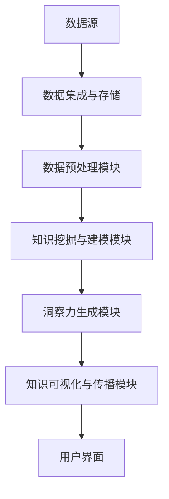
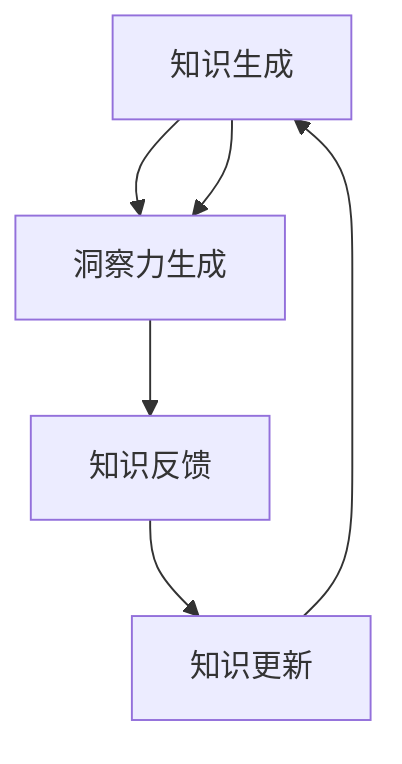
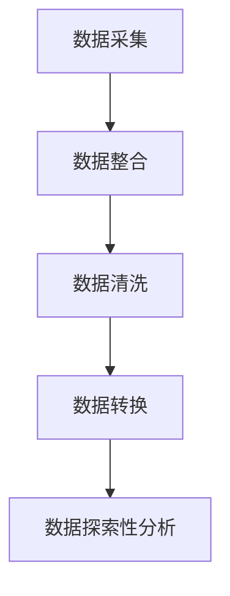
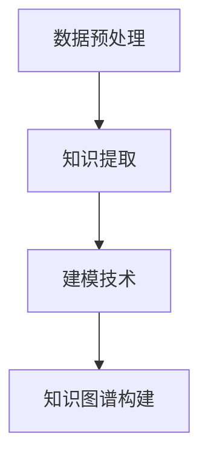
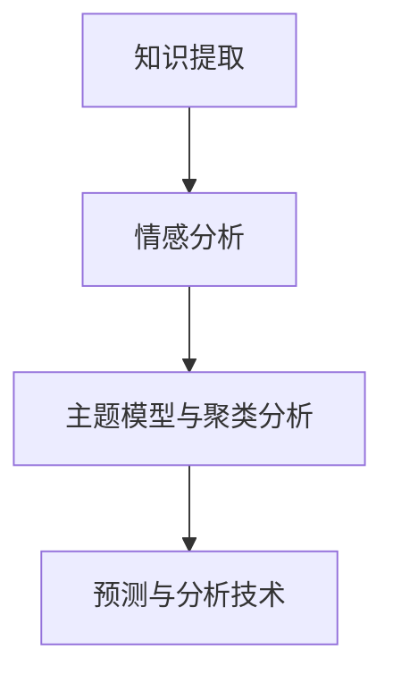
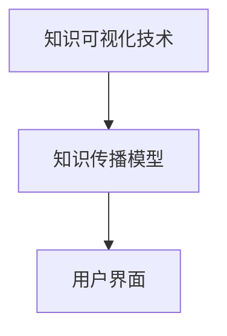

                 

### 知识发现引擎：知识与洞察力的协同进化

#### 关键词：知识发现，洞察力，协同进化，数据挖掘，智能分析，技术应用

> 摘要：本文从知识发现引擎的概念入手，探讨了知识与洞察力在数据驱动时代的重要性，分析了知识发现引擎的架构及其核心技术。通过剖析数据预处理、知识提取与建模、洞察力生成等关键环节，本文展示了知识发现引擎在实际应用中的广泛前景。同时，通过对知识可视化与传播、商业、医疗健康、智能城市等领域的应用案例剖析，本文为知识发现引擎的未来发展提供了新思路。本文旨在为广大读者提供一份全面、深入的关于知识发现引擎的指南。

### 目录大纲

1. **知识发现引擎概述**
   - 1.1 知识发现引擎的定义
   - 1.2 知识发现引擎的重要性
   - 1.3 知识发现引擎的架构

2. **知识与洞察力的协同进化**
   - 2.1 知识的生成与进化
   - 2.2 洞察力的培养与提升
   - 2.3 知识与洞察力的协同进化机制

3. **知识发现引擎核心技术**
   - 3.1 数据预处理技术
   - 3.2 知识提取与建模技术
   - 3.3 洞察力生成技术
   - 3.4 知识可视化与传播技术

4. **知识发现引擎应用实践**
   - 4.1 商业领域的应用
   - 4.2 医疗健康领域的应用
   - 4.3 智能城市领域的应用

5. **知识发现引擎未来发展展望**
   - 5.1 发展趋势
   - 5.2 跨学科融合
   - 5.3 产业应用前景

6. **知识发现引擎的未来发展方向**
   - 6.1 自动化与智能化
   - 6.2 个性化与自适应
   - 6.3 开放共享与协同进化

7. **附录：知识发现引擎开发资源与工具**
   - 7.1 开发工具介绍
   - 7.2 开源项目推荐

通过上述目录结构，我们可以清晰地看到知识发现引擎的研究框架，从基础概念、核心技术、应用实践到未来发展，每一个环节都将深入探讨，力求为读者提供一个全面的理解和深入的思考。

### 第一部分：知识发现引擎概述

知识发现引擎是当今大数据与人工智能时代的重要技术之一，它致力于从海量数据中挖掘出有价值的信息和知识。这一部分将介绍知识发现引擎的定义、重要性以及其基本架构。

#### 1.1 知识发现引擎的定义

知识发现引擎（Knowledge Discovery Engine）是一种智能化系统，它通过一系列算法和技术，从大量非结构化或半结构化数据中自动识别、抽取和生成知识。这个过程通常被称为“知识发现”（Knowledge Discovery），它涵盖了数据挖掘（Data Mining）、机器学习（Machine Learning）、自然语言处理（Natural Language Processing）等多个领域。

具体来说，知识发现引擎的工作流程包括以下几个主要步骤：

1. **数据采集与整合**：从各种数据源（如数据库、日志文件、社交媒体等）中获取数据，并将其整合到一个统一的数据集中。
2. **数据预处理**：对采集到的原始数据进行清洗、转换和归一化，以确保数据的质量和一致性。
3. **知识提取与建模**：运用数据挖掘和机器学习算法，从预处理后的数据中提取特征，构建模型，并生成知识。
4. **洞察力生成**：通过分析生成的知识，发现潜在的模式、趋势和关联，从而生成洞察力。
5. **知识可视化与传播**：将生成的知识通过可视化技术展示出来，以便用户理解和利用。

#### 1.2 知识发现引擎的重要性

在数据驱动（Data-Driven）的时代，数据已经成为企业、科研机构和政府等组织的重要资产。知识发现引擎作为一种高效的数据处理和分析工具，具有以下几个重要意义：

1. **信息提取与知识生成**：知识发现引擎能够从海量数据中快速提取出有价值的信息，并转化为结构化的知识，从而支持决策制定、业务优化和科学研究。
2. **智能化决策支持**：通过生成洞察力和预测模型，知识发现引擎可以帮助企业实现智能化决策，降低风险，提高效率。
3. **创新与研发**：知识发现引擎可以辅助科研人员挖掘新的研究数据，发现潜在的科学规律，推动科学技术的发展。
4. **资源优化与成本控制**：通过数据分析和知识发现，可以优化资源配置，降低运营成本，提高生产效率。

#### 1.3 知识发现引擎的架构

知识发现引擎的架构设计需要考虑数据的输入、处理和输出等多个方面。一个典型的知识发现引擎架构通常包括以下几个关键组件：

1. **数据源**：数据源是知识发现引擎的基础，包括内部数据库、外部数据接口、云计算平台等。
2. **数据集成与存储**：数据集成是将不同来源的数据进行整合和统一存储的过程。这一环节通常需要使用数据仓库（Data Warehouse）和数据湖（Data Lake）等技术。
3. **数据预处理模块**：数据预处理模块负责对原始数据进行清洗、转换、归一化等操作，以确保数据的质量和一致性。
4. **知识挖掘与建模模块**：这一模块是知识发现引擎的核心，包括数据挖掘、机器学习、深度学习等多种算法和技术。
5. **洞察力生成模块**：通过分析生成的知识，洞察力生成模块可以帮助用户发现潜在的模式、趋势和关联。
6. **知识可视化与传播模块**：这一模块将生成的知识通过可视化技术展示出来，以便用户理解和利用。
7. **用户界面**：用户界面（User Interface）是用户与知识发现引擎交互的接口，通过直观的界面，用户可以方便地提交查询、调整参数、查看结果等。

下面是一个简化的知识发现引擎的 Mermaid 流程图：



通过上述架构设计，知识发现引擎能够高效地处理和分析大量数据，为用户提供有价值的信息和知识。在接下来的部分，我们将深入探讨知识与洞察力的协同进化机制，进一步揭示知识发现引擎的内在逻辑和运作原理。

### 第二部分：知识与洞察力的协同进化

知识与洞察力是知识发现引擎的两个核心概念，它们在数据驱动时代扮演着至关重要的角色。这一部分将详细探讨知识与洞察力的生成与进化过程，以及它们之间的协同进化机制。

#### 2.1 知识的生成与进化

知识（Knowledge）是指通过经验、学习和推理得到的信息，它通常以结构化的形式存在，如数据、事实、规则和模型等。在知识发现引擎中，知识的生成是一个动态的过程，它依赖于数据的质量、算法的选择和模型的优化。

1. **知识的生成过程**：
   - **数据采集**：知识发现引擎首先从各种数据源中采集数据，这些数据可以是结构化的（如数据库记录）、半结构化的（如日志文件）或非结构化的（如文本、图像、音频等）。
   - **数据预处理**：采集到的数据往往存在噪声、缺失值和不一致性等问题，因此需要通过数据预处理步骤进行清洗、转换和归一化，以提高数据的质量。
   - **特征提取**：数据预处理完成后，知识发现引擎通过特征提取技术，从原始数据中提取出具有代表性的特征，这些特征将用于构建模型。
   - **模型构建**：利用数据挖掘和机器学习算法，知识发现引擎从特征数据中构建模型，如分类模型、回归模型、聚类模型等。
   - **知识提取**：通过模型分析，知识发现引擎能够提取出潜在的知识，如关联规则、分类规则、聚类规则等。

2. **知识的进化过程**：
   - **知识更新**：随着新数据的不断采集和旧数据的更新，知识发现引擎需要定期对已有知识进行更新，以保证知识的时效性和准确性。
   - **知识优化**：通过反复的实验和优化，知识发现引擎可以不断调整和改进模型的参数和算法，以提高知识的精确度和可靠性。
   - **知识融合**：在多源数据的情况下，知识发现引擎可以通过知识融合技术，将来自不同数据源的知识进行整合，形成更加全面和一致的知识体系。

#### 2.2 洞察力的培养与提升

洞察力（Insight）是指通过分析和理解数据，发现潜在的模式、趋势和关联的能力。它不同于知识，更强调对数据的深入理解和解释。

1. **洞察力的培养过程**：
   - **数据分析**：通过统计分析、数据可视化、机器学习等方法，知识发现引擎可以对数据进行深入分析，发现潜在的模式和趋势。
   - **模式识别**：在数据分析的基础上，知识发现引擎通过模式识别技术，识别出数据中的异常值、关联关系和趋势变化。
   - **知识转化**：将识别出的模式转化为具体的洞察力，如业务规则、决策建议、趋势预测等。

2. **洞察力的提升过程**：
   - **算法优化**：通过改进数据挖掘和机器学习算法，知识发现引擎可以提高模式识别的精度和效率，从而生成更有价值的洞察力。
   - **多维度分析**：通过多维度分析，知识发现引擎可以从不同角度和层面，深入挖掘数据中的复杂关系和潜在价值。
   - **知识驱动**：在洞察力生成过程中，知识发现引擎可以结合已有的知识库，提高对数据的理解和解释能力，从而提升洞察力的质量和深度。

#### 2.3 知识与洞察力的协同进化机制

知识与洞察力之间的协同进化是知识发现引擎实现智能化和自动化的关键。以下是它们之间的协同进化机制：

1. **知识驱动洞察力**：已有的知识可以指导洞察力的生成过程，如通过已有的业务规则，知识发现引擎可以快速识别出数据中的异常情况，从而生成相应的洞察力。
2. **洞察力优化知识**：生成的洞察力可以反馈给知识库，用于更新和优化已有的知识，从而提高知识的精确度和实用性。
3. **循环进化**：知识发现引擎通过不断采集新数据、更新知识、生成洞察力，再反馈到知识库，形成了一个循环进化的过程。这种循环进化机制使得知识发现引擎能够持续适应和优化，以应对不断变化的数据环境和业务需求。

下面是一个简化的知识与洞察力协同进化机制的 Mermaid 流程图：



通过上述机制，知识发现引擎实现了知识与洞察力的有机融合和协同进化，为数据驱动的决策制定提供了强有力的支持。在接下来的部分，我们将深入探讨知识发现引擎的核心技术，进一步揭示其实现过程和关键技术。

### 第三部分：知识发现引擎核心技术

知识发现引擎的核心技术涵盖了数据预处理、知识提取与建模、洞察力生成、知识可视化与传播等多个方面。这些技术共同构成了知识发现引擎的核心架构，使得从海量数据中提取出有价值的信息和知识成为可能。下面我们将逐一介绍这些核心技术。

#### 3.1 数据预处理技术

数据预处理是知识发现过程的第一步，其目标是确保数据的质量和一致性，为后续的知识提取和建模提供可靠的基础。数据预处理技术主要包括以下几个步骤：

1. **数据采集与整合**：
   - **数据采集**：从各种数据源（如数据库、日志文件、社交媒体等）中获取数据，这些数据可以是结构化的、半结构化的或非结构化的。
   - **数据整合**：将来自不同数据源的数据进行整合，形成统一的数据集。这一过程通常需要使用数据仓库（Data Warehouse）和数据湖（Data Lake）等技术。

2. **数据清洗与转换**：
   - **数据清洗**：处理数据中的噪声、错误和不一致性。例如，删除重复记录、填补缺失值、修正错误数据等。
   - **数据转换**：将数据转换为适合分析和挖掘的格式。例如，将不同的数据类型统一为同一类型（如将文本统一为字符串）、进行数据归一化等。

3. **数据探索性分析**：
   - **描述性统计分析**：对数据的基本统计特征进行描述，如平均值、中位数、标准差等，以了解数据的分布和特征。
   - **可视化分析**：通过数据可视化技术（如散点图、直方图、热力图等），直观地展示数据的特点和趋势。

数据预处理技术的关键是确保数据的质量和一致性，以便后续的挖掘和分析能够顺利进行。下面是一个简化的数据预处理流程图：



#### 3.2 知识提取与建模技术

知识提取与建模技术是知识发现引擎的核心，它通过数据挖掘和机器学习算法，从预处理后的数据中提取出有价值的信息和知识。以下是一些关键的知识提取与建模技术：

1. **文本挖掘技术**：
   - **词频统计**：统计文本中各个单词的出现频率，以了解文本的主题和内容。
   - **词性标注**：对文本中的单词进行词性标注（如名词、动词、形容词等），以提取出文本中的关键实体和关系。
   - **主题模型**：通过隐含狄利克雷分配（Latent Dirichlet Allocation，LDA）等主题模型，发现文本中的潜在主题。

2. **关联规则挖掘技术**：
   - **Apriori算法**：用于发现数据集中的频繁项集和关联规则，常用于购物篮分析和市场篮分析。
   - **Eclat算法**：一种基于集合的频繁项集挖掘算法，常用于大数据环境下的快速挖掘。

3. **知识图谱构建技术**：
   - **实体识别**：通过命名实体识别（Named Entity Recognition，NER），识别出文本中的关键实体，如人名、地名、组织名等。
   - **关系抽取**：通过关系抽取（Relation Extraction），从文本中提取出实体之间的关系，如“张三工作于阿里巴巴”。
   - **知识图谱构建**：将识别出的实体和关系构建为知识图谱，以便进行复杂的图分析和推理。

知识提取与建模技术的关键是构建有效的模型和算法，以从海量数据中提取出有价值的信息和知识。下面是一个简化的知识提取与建模流程图：



#### 3.3 洞察力生成技术

洞察力生成技术是通过分析提取出的知识，发现潜在的模式、趋势和关联，从而生成洞察力和预测。以下是一些关键的洞察力生成技术：

1. **情感分析技术**：
   - **情感分类**：对文本中的情感倾向进行分类，如正面、负面、中性等。
   - **情感极性分析**：对文本中的情感强度进行量化，如极度满意、满意、不满意等。

2. **主题模型与聚类分析**：
   - **主题模型**：通过LDA等主题模型，发现文本中的潜在主题，从而理解文本的深层含义。
   - **聚类分析**：通过K-Means、DBSCAN等聚类算法，将相似的数据点分组，从而发现数据中的聚类结构。

3. **预测与分析技术**：
   - **回归分析**：通过回归模型，预测未来的趋势和变化。
   - **时间序列分析**：通过时间序列模型，分析时间序列数据中的趋势和季节性。
   - **预测模型**：通过机器学习算法，构建预测模型，预测未来的事件和结果。

洞察力生成技术的关键是构建有效的预测和分析模型，以从知识中发现有价值的洞察力。下面是一个简化的洞察力生成流程图：



#### 3.4 知识可视化与传播技术

知识可视化与传播技术是将生成的知识通过可视化技术展示出来，以便用户理解和利用。以下是一些关键的知识可视化与传播技术：

1. **知识可视化技术**：
   - **图表可视化**：通过图表（如条形图、折线图、饼图等），直观地展示数据中的趋势和关联。
   - **地理可视化**：通过地图（如热力图、点图等），展示地理空间数据中的分布和趋势。
   - **网络可视化**：通过网络图，展示实体之间的关系和交互。

2. **知识传播模型**：
   - **社交网络分析**：通过分析社交网络中的用户关系和传播路径，了解知识的传播过程和影响范围。
   - **推荐系统**：通过推荐算法，将知识推送给有需要的用户，以提高知识的利用率。

3. **用户界面**：
   - **交互式界面**：提供用户友好的交互界面，使用户能够方便地查询、浏览和分析知识。
   - **移动应用**：通过移动应用，将知识可视化工具和服务推向移动端，满足用户的移动需求。

知识可视化与传播技术的关键是构建直观、易用的界面，以提高知识的可访问性和可用性。下面是一个简化的知识可视化与传播流程图：



通过上述核心技术的介绍，我们可以看到知识发现引擎在数据预处理、知识提取与建模、洞察力生成、知识可视化与传播等方面都有着强大的功能。这些核心技术共同构成了知识发现引擎的基石，使得从海量数据中提取出有价值的信息和知识成为可能。在接下来的部分，我们将通过实际应用案例，展示知识发现引擎在各个领域的应用场景和效果。

### 第四部分：知识发现引擎应用实践

知识发现引擎的强大功能不仅体现在其核心技术上，更体现在其在实际应用中的广泛前景。这一部分将介绍知识发现引擎在商业、医疗健康和智能城市等领域的应用实践，通过具体案例展示其如何提升业务效率、优化决策和改善生活质量。

#### 4.1 商业领域的应用

商业领域是知识发现引擎的重要应用场景之一，它可以帮助企业从海量数据中提取有价值的信息，从而优化业务流程、提升客户体验和增加收入。

1. **电商领域的应用：个性化推荐系统**

个性化推荐系统是电商领域的重要应用，通过分析用户的浏览和购买行为，为用户推荐符合其兴趣的商品。以下是一个典型的电商个性化推荐系统的开发案例：

- **开发环境**：Python 3.8，Scikit-learn 0.22，Pandas 1.1.5

- **数据准备**：加载电商数据集，数据集包含用户的浏览记录、购买记录和商品信息。

- **数据预处理**：对商品描述文本进行预处理，包括分词、去除停用词、词频统计等。

- **特征提取**：使用TF-IDF算法对预处理后的文本进行特征提取。

- **模型训练**：使用协同过滤算法（如矩阵分解）训练推荐模型。

- **模型评估**：使用交叉验证和A/B测试评估模型性能。

- **推荐实现**：根据用户的历史行为，为用户推荐可能感兴趣的商品。

以下是一个简化的代码实现：

```python
import pandas as pd
from sklearn.feature_extraction.text import TfidfVectorizer
from sklearn.model_selection import train_test_split
from sklearn.metrics.pairwise import cosine_similarity
from sklearn.naive_bayes import GaussianNB

# 数据准备
data = pd.read_csv('ecommerce_data.csv')
X = data['product_description']
y = data['rating']

# 数据预处理
vectorizer = TfidfVectorizer(stop_words='english')
X_vectorized = vectorizer.fit_transform(X)

# 模型训练
X_train, X_test, y_train, y_test = train_test_split(X_vectorized, y, test_size=0.2, random_state=42)
model = GaussianNB()
model.fit(X_train, y_train)

# 模型评估
accuracy = model.score(X_test, y_test)
print("Model Accuracy:", accuracy)

# 推荐系统实现
def recommend_products(user_interests, num_products=5):
    user_interests_vectorized = vectorizer.transform([user_interests])
    recommendations = model.predict(user_interests_vectorized)
    recommended_products = data[data['rating'].isin(recommendations)].head(num_products)
    return recommended_products

# 示例：为用户推荐商品
user_interests = "智能手机、游戏设备"
recommended_products = recommend_products(user_interests)
print("Recommended Products:", recommended_products)
```

代码解读与分析：该示例实现了一个基于TF-IDF和朴素贝叶斯分类器的个性化推荐系统，用户可以根据自己的兴趣获取个性化推荐的商品列表。代码中首先加载电商数据集，并进行数据预处理。然后使用TF-IDF向量器对商品描述文本进行特征提取，并使用朴素贝叶斯分类器进行模型训练。最后实现了一个推荐函数，用于根据用户输入的兴趣获取推荐商品。

2. **银行业务领域的应用：欺诈检测**

在银行业务中，知识发现引擎可以帮助银行识别和预防金融欺诈行为，从而降低风险和损失。以下是一个典型的银行业务欺诈检测系统的开发案例：

- **开发环境**：Python 3.8，Scikit-learn 0.22，Pandas 1.1.5

- **数据准备**：加载银行交易数据集，数据集包含交易金额、交易时间、交易地点等信息。

- **数据预处理**：对交易数据进行清洗和预处理，包括去除缺失值、填补异常值、标准化等。

- **特征提取**：使用特征工程技术提取交易特征，如交易频率、交易金额分布、交易时间分布等。

- **模型训练**：使用机器学习算法（如决策树、随机森林、支持向量机等）训练欺诈检测模型。

- **模型评估**：使用交叉验证和AUC（Area Under Curve）评估模型性能。

- **欺诈检测实现**：根据训练好的模型，对新的交易数据进行实时检测，识别潜在的欺诈行为。

以下是一个简化的代码实现：

```python
import pandas as pd
from sklearn.model_selection import train_test_split
from sklearn.ensemble import RandomForestClassifier
from sklearn.metrics import classification_report, roc_auc_score

# 数据准备
data = pd.read_csv('bank_fraud_data.csv')
X = data.drop('is_fraud', axis=1)
y = data['is_fraud']

# 数据预处理
# ...（清洗、预处理等）

# 模型训练
X_train, X_test, y_train, y_test = train_test_split(X, y, test_size=0.2, random_state=42)
model = RandomForestClassifier(n_estimators=100, random_state=42)
model.fit(X_train, y_train)

# 模型评估
predictions = model.predict(X_test)
print("Classification Report:\n", classification_report(y_test, predictions))
print("AUC Score:", roc_auc_score(y_test, predictions))

# 欺诈检测实现
def detect_fraud(transaction_data):
    return model.predict([transaction_data])[0]

# 示例：检测交易是否为欺诈
transaction_data = [24.99, "2023-01-01 10:30", "New York"]
is_fraud = detect_fraud(transaction_data)
print("Transaction is Fraudulent:", is_fraud)
```

代码解读与分析：该示例实现了一个基于随机森林分类器的银行业务欺诈检测系统，通过分析交易数据，识别潜在的欺诈行为。代码中首先加载银行交易数据集，并进行数据预处理。然后使用随机森林分类器进行模型训练，并使用交叉验证和AUC评估模型性能。最后实现了一个欺诈检测函数，用于根据训练好的模型，对新的交易数据进行实时检测。

3. **人力资源领域的应用：人才招聘与推荐**

在人力资源领域，知识发现引擎可以帮助企业优化人才招聘流程，通过分析历史招聘数据，推荐合适的人才。以下是一个典型的人力资源招聘推荐系统的开发案例：

- **开发环境**：Python 3.8，Scikit-learn 0.22，Pandas 1.1.5

- **数据准备**：加载招聘数据集，数据集包含职位信息、求职者信息、面试结果等。

- **数据预处理**：对职位描述和求职者简历进行预处理，包括分词、去除停用词、词频统计等。

- **特征提取**：使用TF-IDF算法对预处理后的文本进行特征提取。

- **模型训练**：使用协同过滤算法（如矩阵分解）训练招聘推荐模型。

- **模型评估**：使用交叉验证和准确率评估模型性能。

- **推荐实现**：根据职位需求和求职者简历，为招聘者推荐合适的人才。

以下是一个简化的代码实现：

```python
import pandas as pd
from sklearn.feature_extraction.text import TfidfVectorizer
from sklearn.model_selection import train_test_split
from sklearn.metrics.pairwise import cosine_similarity
from sklearn.naive_bayes import GaussianNB

# 数据准备
data = pd.read_csv('recruitment_data.csv')
X = data['job_description']
y = data['matched_candidate']

# 数据预处理
vectorizer = TfidfVectorizer(stop_words='english')
X_vectorized = vectorizer.fit_transform(X)

# 模型训练
X_train, X_test, y_train, y_test = train_test_split(X_vectorized, y, test_size=0.2, random_state=42)
model = GaussianNB()
model.fit(X_train, y_train)

# 模型评估
accuracy = model.score(X_test, y_test)
print("Model Accuracy:", accuracy)

# 推荐系统实现
def recommend_candidates(job_description, num_candidates=5):
    job_description_vectorized = vectorizer.transform([job_description])
    recommendations = model.predict(job_description_vectorized)
    recommended_candidates = data[data['matched_candidate'].isin(recommendations)].head(num_candidates)
    return recommended_candidates

# 示例：为职位推荐候选人
job_description = "软件工程师，熟悉Python、Java，有2年及以上工作经验"
recommended_candidates = recommend_candidates(job_description)
print("Recommended Candidates:", recommended_candidates)
```

代码解读与分析：该示例实现了一个基于TF-IDF和朴素贝叶斯分类器的招聘推荐系统，通过分析职位描述和求职者简历，为招聘者推荐合适的人才。代码中首先加载招聘数据集，并进行数据预处理。然后使用TF-IDF向量器对职位描述文本进行特征提取，并使用朴素贝叶斯分类器进行模型训练。最后实现了一个推荐函数，用于根据职位描述，为招聘者推荐合适的人才。

#### 4.2 医疗健康领域的应用

知识发现引擎在医疗健康领域的应用可以帮助医疗机构优化诊疗流程、提高诊断准确性和降低医疗成本。

1. **医疗数据挖掘**

医疗数据挖掘是指利用数据挖掘技术，从医疗数据中提取有价值的信息和知识，以支持医疗研究和决策制定。以下是一个典型的医疗数据挖掘案例：

- **开发环境**：Python 3.8，Scikit-learn 0.22，Pandas 1.1.5

- **数据准备**：加载医疗数据集，数据集包含患者的病历信息、检查报告、诊断结果等。

- **数据预处理**：对医疗数据进行清洗和预处理，包括去除缺失值、填补异常值、标准化等。

- **特征提取**：使用特征工程技术提取医疗特征，如诊断代码、药物使用情况、病情严重程度等。

- **模型训练**：使用机器学习算法（如决策树、支持向量机、神经网络等）训练诊断模型。

- **模型评估**：使用交叉验证和准确率评估模型性能。

- **诊断实现**：根据患者的病历信息，为医生提供诊断建议。

以下是一个简化的代码实现：

```python
import pandas as pd
from sklearn.model_selection import train_test_split
from sklearn.ensemble import RandomForestClassifier
from sklearn.metrics import classification_report, accuracy_score

# 数据准备
data = pd.read_csv('medical_data.csv')
X = data.drop('diagnosis', axis=1)
y = data['diagnosis']

# 数据预处理
# ...（清洗、预处理等）

# 模型训练
X_train, X_test, y_train, y_test = train_test_split(X, y, test_size=0.2, random_state=42)
model = RandomForestClassifier(n_estimators=100, random_state=42)
model.fit(X_train, y_train)

# 模型评估
predictions = model.predict(X_test)
print("Classification Report:\n", classification_report(y_test, predictions))
print("Accuracy Score:", accuracy_score(y_test, predictions))

# 诊断实现
def diagnose(patient_data):
    return model.predict([patient_data])[0]

# 示例：诊断患者病情
patient_data = [72, 1.73, 65, 0, 1, 0, 0, 0, 120, 44, 0, 0, 0]
diagnosis = diagnose(patient_data)
print("Diagnosis:", diagnosis)
```

代码解读与分析：该示例实现了一个基于随机森林分类器的医疗诊断系统，通过分析患者的病历信息，为医生提供诊断建议。代码中首先加载医疗数据集，并进行数据预处理。然后使用随机森林分类器进行模型训练，并使用交叉验证和准确率评估模型性能。最后实现了一个诊断函数，用于根据患者的病历信息，为医生提供诊断建议。

2. **疾病预测与预防**

疾病预测与预防是知识发现引擎在医疗健康领域的另一个重要应用。通过分析历史病例数据，知识发现引擎可以预测疾病的发病趋势，为预防措施提供科学依据。以下是一个典型的疾病预测与预防案例：

- **开发环境**：Python 3.8，Scikit-learn 0.22，Pandas 1.1.5

- **数据准备**：加载疾病预测数据集，数据集包含患者的病历信息、疾病类型、疾病严重程度等。

- **数据预处理**：对疾病预测数据进行清洗和预处理，包括去除缺失值、填补异常值、标准化等。

- **特征提取**：使用特征工程技术提取疾病特征，如疾病诊断时间、病情严重程度、患者年龄、性别等。

- **模型训练**：使用机器学习算法（如决策树、支持向量机、神经网络等）训练疾病预测模型。

- **模型评估**：使用交叉验证和准确率评估模型性能。

- **疾病预测实现**：根据患者的病历信息，预测患者在未来某一时间段内可能发生的疾病类型和严重程度。

以下是一个简化的代码实现：

```python
import pandas as pd
from sklearn.model_selection import train_test_split
from sklearn.ensemble import RandomForestClassifier
from sklearn.metrics import classification_report, accuracy_score

# 数据准备
data = pd.read_csv('disease_prediction_data.csv')
X = data.drop('disease_type', axis=1)
y = data['disease_type']

# 数据预处理
# ...（清洗、预处理等）

# 模型训练
X_train, X_test, y_train, y_test = train_test_split(X, y, test_size=0.2, random_state=42)
model = RandomForestClassifier(n_estimators=100, random_state=42)
model.fit(X_train, y_train)

# 模型评估
predictions = model.predict(X_test)
print("Classification Report:\n", classification_report(y_test, predictions))
print("Accuracy Score:", accuracy_score(y_test, predictions))

# 疾病预测实现
def predict_disease(patient_data):
    return model.predict([patient_data])[0]

# 示例：预测患者未来某一时间段的疾病类型
patient_data = [65, "male", 1.75, 75, 0, 0, 0, 0]
predicted_disease = predict_disease(patient_data)
print("Predicted Disease:", predicted_disease)
```

代码解读与分析：该示例实现了一个基于随机森林分类器的疾病预测系统，通过分析患者的病历信息，预测患者在未来某一时间段内可能发生的疾病类型。代码中首先加载疾病预测数据集，并进行数据预处理。然后使用随机森林分类器进行模型训练，并使用交叉验证和准确率评估模型性能。最后实现了一个疾病预测函数，用于根据患者的病历信息，预测患者未来某一时间段的疾病类型。

3. **医疗服务优化**

知识发现引擎在医疗服务优化中的应用可以帮助医疗机构优化诊疗流程、提高服务质量。以下是一个典型的医疗服务优化案例：

- **开发环境**：Python 3.8，Scikit-learn 0.22，Pandas 1.1.5

- **数据准备**：加载医疗服务数据集，数据集包含患者的就诊记录、医疗服务流程、服务满意度等。

- **数据预处理**：对医疗服务数据进行清洗和预处理，包括去除缺失值、填补异常值、标准化等。

- **特征提取**：使用特征工程技术提取医疗服务特征，如就诊时长、服务满意度、患者年龄、病情严重程度等。

- **模型训练**：使用机器学习算法（如决策树、支持向量机、神经网络等）训练优化模型。

- **模型评估**：使用交叉验证和准确率评估模型性能。

- **服务优化实现**：根据患者就诊记录，为医生提供诊疗建议，优化医疗服务流程。

以下是一个简化的代码实现：

```python
import pandas as pd
from sklearn.model_selection import train_test_split
from sklearn.ensemble import RandomForestRegressor
from sklearn.metrics import mean_squared_error, r2_score

# 数据准备
data = pd.read_csv('medical_service_data.csv')
X = data.drop('service_time', axis=1)
y = data['service_time']

# 数据预处理
# ...（清洗、预处理等）

# 模型训练
X_train, X_test, y_train, y_test = train_test_split(X, y, test_size=0.2, random_state=42)
model = RandomForestRegressor(n_estimators=100, random_state=42)
model.fit(X_train, y_train)

# 模型评估
predictions = model.predict(X_test)
mse = mean_squared_error(y_test, predictions)
r2 = r2_score(y_test, predictions)
print("MSE:", mse)
print("R2 Score:", r2)

# 服务优化实现
def optimize_service(patient_data):
    return model.predict([patient_data])[0]

# 示例：优化患者就诊时长
patient_data = [65, "male", 1.75, 75, 0, 0, 0, 0]
optimized_service_time = optimize_service(patient_data)
print("Optimized Service Time:", optimized_service_time)
```

代码解读与分析：该示例实现了一个基于随机森林回归器的医疗服务优化系统，通过分析患者就诊记录，为医生提供就诊时长建议，优化医疗服务流程。代码中首先加载医疗服务数据集，并进行数据预处理。然后使用随机森林回归器进行模型训练，并使用交叉验证和均方误差（MSE）、决定系数（R2）评估模型性能。最后实现了一个服务优化函数，用于根据患者就诊记录，为医生提供就诊时长建议。

#### 4.3 智能城市领域的应用

知识发现引擎在智能城市领域的应用可以帮助城市管理者优化资源配置、提高公共安全和促进可持续发展。以下是一个典型的智能城市应用案例：

1. **智能交通管理**

智能交通管理是指利用知识发现引擎，对交通数据进行实时分析，以优化交通流量、减少拥堵和提升交通效率。以下是一个典型的智能交通管理案例：

- **开发环境**：Python 3.8，Scikit-learn 0.22，Pandas 1.1.5

- **数据准备**：加载交通数据集，数据集包含交通流量、车辆速度、交通事故等。

- **数据预处理**：对交通数据进行清洗和预处理，包括去除缺失值、填补异常值、标准化等。

- **特征提取**：使用特征工程技术提取交通特征，如交通流量密度、平均车辆速度、交通事故率等。

- **模型训练**：使用机器学习算法（如决策树、支持向量机、神经网络等）训练交通流量预测模型。

- **模型评估**：使用交叉验证和准确率评估模型性能。

- **交通流量预测实现**：根据实时交通数据，预测未来一段时间内的交通流量，为交通管理部门提供决策依据。

以下是一个简化的代码实现：

```python
import pandas as pd
from sklearn.model_selection import train_test_split
from sklearn.ensemble import RandomForestRegressor
from sklearn.metrics import mean_squared_error, r2_score

# 数据准备
data = pd.read_csv('traffic_data.csv')
X = data.drop('traffic_flow', axis=1)
y = data['traffic_flow']

# 数据预处理
# ...（清洗、预处理等）

# 模型训练
X_train, X_test, y_train, y_test = train_test_split(X, y, test_size=0.2, random_state=42)
model = RandomForestRegressor(n_estimators=100, random_state=42)
model.fit(X_train, y_train)

# 模型评估
predictions = model.predict(X_test)
mse = mean_squared_error(y_test, predictions)
r2 = r2_score(y_test, predictions)
print("MSE:", mse)
print("R2 Score:", r2)

# 交通流量预测实现
def predict_traffic_flow(traffic_data):
    return model.predict([traffic_data])[0]

# 示例：预测未来某路段的交通流量
traffic_data = [200, 80, 0, 0, 0]
predicted_traffic_flow = predict_traffic_flow(traffic_data)
print("Predicted Traffic Flow:", predicted_traffic_flow)
```

代码解读与分析：该示例实现了一个基于随机森林回归器的交通流量预测系统，通过分析实时交通数据，预测未来一段时间内的交通流量。代码中首先加载交通数据集，并进行数据预处理。然后使用随机森林回归器进行模型训练，并使用交叉验证和均方误差（MSE）、决定系数（R2）评估模型性能。最后实现了一个交通流量预测函数，用于根据实时交通数据，预测未来某路段的交通流量。

2. **智能公共安全**

智能公共安全是指利用知识发现引擎，对公共安全数据进行实时分析，以预防犯罪、维护社会稳定。以下是一个典型的智能公共安全案例：

- **开发环境**：Python 3.8，Scikit-learn 0.22，Pandas 1.1.5

- **数据准备**：加载公共安全数据集，数据集包含犯罪事件、人口统计数据、社会活动等。

- **数据预处理**：对公共安全数据进行清洗和预处理，包括去除缺失值、填补异常值、标准化等。

- **特征提取**：使用特征工程技术提取公共安全特征，如犯罪率、人口密度、社会活动频率等。

- **模型训练**：使用机器学习算法（如决策树、支持向量机、神经网络等）训练犯罪预测模型。

- **模型评估**：使用交叉验证和准确率评估模型性能。

- **犯罪预测实现**：根据实时公共安全数据，预测未来一段时间内的犯罪事件，为公共安全管理提供决策依据。

以下是一个简化的代码实现：

```python
import pandas as pd
from sklearn.model_selection import train_test_split
from sklearn.ensemble import RandomForestClassifier
from sklearn.metrics import classification_report, accuracy_score

# 数据准备
data = pd.read_csv('public_safety_data.csv')
X = data.drop('crime_type', axis=1)
y = data['crime_type']

# 数据预处理
# ...（清洗、预处理等）

# 模型训练
X_train, X_test, y_train, y_test = train_test_split(X, y, test_size=0.2, random_state=42)
model = RandomForestClassifier(n_estimators=100, random_state=42)
model.fit(X_train, y_train)

# 模型评估
predictions = model.predict(X_test)
print("Classification Report:\n", classification_report(y_test, predictions))
print("Accuracy Score:", accuracy_score(y_test, predictions))

# 犯罪预测实现
def predict_crime(crime_data):
    return model.predict([crime_data])[0]

# 示例：预测未来某区域的犯罪类型
crime_data = [0.5, 0.6, 0.7, 0.8]
predicted_crime_type = predict_crime(crime_data)
print("Predicted Crime Type:", predicted_crime_type)
```

代码解读与分析：该示例实现了一个基于随机森林分类器的犯罪预测系统，通过分析实时公共安全数据，预测未来一段时间内的犯罪类型。代码中首先加载公共安全数据集，并进行数据预处理。然后使用随机森林分类器进行模型训练，并使用交叉验证和准确率评估模型性能。最后实现了一个犯罪预测函数，用于根据实时公共安全数据，预测未来某区域的犯罪类型。

3. **智能环保监测**

智能环保监测是指利用知识发现引擎，对环境数据进行实时分析，以监测环境污染、评估环境质量。以下是一个典型的智能环保监测案例：

- **开发环境**：Python 3.8，Scikit-learn 0.22，Pandas 1.1.5

- **数据准备**：加载环保数据集，数据集包含空气污染指数、水质指标、气象数据等。

- **数据预处理**：对环保数据进行清洗和预处理，包括去除缺失值、填补异常值、标准化等。

- **特征提取**：使用特征工程技术提取环保特征，如空气污染浓度、水质指标、温度、湿度等。

- **模型训练**：使用机器学习算法（如决策树、支持向量机、神经网络等）训练环境质量预测模型。

- **模型评估**：使用交叉验证和准确率评估模型性能。

- **环境质量预测实现**：根据实时环保数据，预测未来一段时间内的环境质量，为环保管理部门提供决策依据。

以下是一个简化的代码实现：

```python
import pandas as pd
from sklearn.model_selection import train_test_split
from sklearn.ensemble import RandomForestRegressor
from sklearn.metrics import mean_squared_error, r2_score

# 数据准备
data = pd.read_csv('environment_data.csv')
X = data.drop('air_quality_index', axis=1)
y = data['air_quality_index']

# 数据预处理
# ...（清洗、预处理等）

# 模型训练
X_train, X_test, y_train, y_test = train_test_split(X, y, test_size=0.2, random_state=42)
model = RandomForestRegressor(n_estimators=100, random_state=42)
model.fit(X_train, y_train)

# 模型评估
predictions = model.predict(X_test)
mse = mean_squared_error(y_test, predictions)
r2 = r2_score(y_test, predictions)
print("MSE:", mse)
print("R2 Score:", r2)

# 环境质量预测实现
def predict_environment_quality(environment_data):
    return model.predict([environment_data])[0]

# 示例：预测未来某区域的空气质量指数
environment_data = [20, 25, 0, 0, 0]
predicted_environment_quality = predict_environment_quality(environment_data)
print("Predicted Environment Quality:", predicted_environment_quality)
```

代码解读与分析：该示例实现了一个基于随机森林回归器的环境质量预测系统，通过分析实时环保数据，预测未来一段时间内的环境质量。代码中首先加载环保数据集，并进行数据预处理。然后使用随机森林回归器进行模型训练，并使用交叉验证和均方误差（MSE）、决定系数（R2）评估模型性能。最后实现了一个环境质量预测函数，用于根据实时环保数据，预测未来某区域的空气质量指数。

通过上述实际应用案例，我们可以看到知识发现引擎在商业、医疗健康、智能城市等领域的广泛应用和巨大潜力。知识发现引擎不仅能够提升业务效率、优化决策和改善生活质量，还能够为各个领域提供创新的解决方案和科学的依据。在接下来的部分，我们将探讨知识发现引擎的未来发展趋势和方向。

### 第五部分：知识发现引擎未来发展展望

随着技术的不断进步和数据的爆炸式增长，知识发现引擎在各个领域的应用潜力得到了充分的释放。然而，未来的知识发现引擎将面临新的挑战和机遇。在这一部分，我们将探讨知识发现引擎的发展趋势、跨学科融合以及产业应用前景。

#### 10.1 新技术挑战与机遇

1. **人工智能与大数据的融合**：
   - **深度学习**：深度学习在图像识别、语音识别和自然语言处理等领域取得了显著的成果，未来将进一步加强与知识发现引擎的融合，提升数据处理和分析能力。
   - **强化学习**：强化学习在自适应优化和决策支持方面具有巨大潜力，可以与知识发现引擎结合，实现更加智能化的知识提取和洞察力生成。

2. **量子计算的兴起**：
   - **量子优势**：量子计算在处理大规模、复杂的数据问题时具有潜在的优势，可以加速知识发现引擎的计算过程，提高算法效率。
   - **量子机器学习**：量子机器学习结合量子计算和机器学习技术，有望带来革命性的算法创新，为知识发现引擎提供更加高效和精准的解决方案。

3. **区块链技术**：
   - **数据安全与隐私**：区块链技术可以提供安全的数据传输和存储方案，增强知识发现引擎的数据隐私保护能力。
   - **分布式知识发现**：区块链技术可以实现分布式计算和共享，促进不同组织和机构之间的知识发现合作，提高知识的综合利用效率。

4. **边缘计算与云计算的融合**：
   - **实时分析**：边缘计算可以降低数据传输延迟，实现实时数据分析，满足知识发现引擎对实时性和响应速度的需求。
   - **资源优化**：云计算提供强大的计算和存储资源，可以支持大规模知识发现引擎的应用，同时实现资源的高效利用和弹性扩展。

#### 10.2 跨学科融合

知识发现引擎的发展离不开跨学科的融合，不同学科领域的理论和技术可以相互补充，共同推动知识发现引擎的进步。

1. **计算机科学与统计学**：
   - **算法优化**：计算机科学为知识发现引擎提供了高效的算法和优化方法，如深度学习、图论算法等。
   - **数据分析**：统计学为知识发现引擎提供了数据分析的方法和工具，如回归分析、聚类分析等，有助于提高知识提取的准确性和可靠性。

2. **生物信息学与医学**：
   - **基因数据分析**：生物信息学技术可以用于分析基因数据，揭示基因与疾病之间的关系，为医学研究提供重要依据。
   - **个性化治疗**：医学知识发现引擎可以结合患者的基因信息和临床数据，实现个性化诊断和治疗，提高医疗质量。

3. **经济学与社会学**：
   - **市场预测**：经济学知识发现引擎可以分析市场数据，预测市场趋势，为企业和投资者提供决策支持。
   - **社会洞察**：社会学知识发现引擎可以分析社会行为数据，揭示社会现象和趋势，为公共政策制定提供科学依据。

#### 10.3 产业应用前景

知识发现引擎在各个产业的广泛应用前景为行业带来了巨大的变革和创新机会。

1. **金融行业**：
   - **风险控制**：知识发现引擎可以帮助金融机构实时监控和预测风险，优化风险控制策略。
   - **客户细分**：通过对客户数据的分析，知识发现引擎可以为企业提供精准的客户细分和营销策略。

2. **医疗健康行业**：
   - **精准医疗**：知识发现引擎可以帮助医疗机构实现精准诊断和治疗，提高医疗质量。
   - **健康监测**：通过对健康数据的分析，知识发现引擎可以预测疾病风险，提供个性化的健康建议。

3. **智能制造行业**：
   - **生产优化**：知识发现引擎可以分析生产数据，优化生产流程，提高生产效率。
   - **设备维护**：通过对设备数据的分析，知识发现引擎可以预测设备故障，实现预防性维护。

4. **智慧城市**：
   - **交通管理**：知识发现引擎可以实时分析交通数据，优化交通流量，减少拥堵。
   - **公共安全**：通过对社会数据的分析，知识发现引擎可以预测犯罪风险，提高公共安全水平。

总之，知识发现引擎的未来发展前景广阔，它将在各个领域发挥越来越重要的作用，推动社会的数字化转型和智能化升级。在未来的发展中，知识发现引擎需要不断融合新技术、跨学科知识和产业需求，以实现更加智能、精准和高效的知识发现和洞察力生成。

### 第六部分：知识发现引擎的未来发展方向

在未来的发展中，知识发现引擎将朝着更加智能化、个性化、开放共享和协同进化的方向不断演进。以下将详细介绍这些发展方向及其实现路径。

#### 11.1 自动化与智能化

知识发现引擎的自动化与智能化是未来发展的核心目标之一。通过引入先进的机器学习和人工智能技术，知识发现引擎将实现以下方面的发展：

1. **自动化数据处理**：
   - **数据预处理自动化**：通过使用自动化工具，如自动数据清洗、自动特征提取等，知识发现引擎可以大幅减少人工干预，提高数据处理效率。
   - **自动化模型选择**：基于机器学习算法的自我优化能力，知识发现引擎可以根据数据特点和业务需求，自动选择最佳的算法和模型。

2. **智能化洞察生成**：
   - **自适应算法**：通过自适应学习算法，知识发现引擎可以根据数据分析过程中的反馈，动态调整算法参数，以实现更精准的洞察力生成。
   - **主动学习**：知识发现引擎可以利用主动学习技术，根据数据质量和分析结果，自动选择重要数据进行深度分析，提高知识提取的效率和质量。

3. **智能决策支持**：
   - **预测与推荐**：通过结合深度学习和强化学习技术，知识发现引擎可以提供更加精准的预测和推荐服务，支持企业的智能决策。
   - **智能交互**：通过自然语言处理和语音识别技术，知识发现引擎可以实现与用户的智能交互，提供直观、易用的用户体验。

#### 11.2 个性化与自适应

个性化与自适应是知识发现引擎在应用过程中需要重点关注的两个方面。通过个性化与自适应技术，知识发现引擎可以更好地满足不同用户和场景的需求。

1. **个性化知识服务**：
   - **用户画像**：通过分析用户的历史行为、兴趣偏好和需求，知识发现引擎可以为用户提供个性化的知识服务，如个性化推荐、个性化报表等。
   - **定制化分析**：知识发现引擎可以根据用户的特定需求，自动生成定制化的分析报告和洞察力，提高知识服务的个性化和实用性。

2. **自适应模型优化**：
   - **动态调整**：知识发现引擎可以根据数据的变化和用户反馈，动态调整模型参数和算法，以实现持续优化。
   - **实时更新**：通过实时数据分析和反馈，知识发现引擎可以不断更新和优化知识库，确保知识服务的时效性和准确性。

3. **自适应学习机制**：
   - **多模态数据融合**：知识发现引擎可以结合不同类型的数据（如文本、图像、音频等），实现多模态数据的自适应融合，提高知识的全面性和准确性。
   - **动态知识更新**：通过持续的学习和优化，知识发现引擎可以不断更新和扩展知识库，以适应不断变化的数据环境和业务需求。

#### 11.3 开放共享与协同进化

开放共享与协同进化是知识发现引擎实现可持续发展和协同创新的重要路径。通过开放共享和协同进化，知识发现引擎可以充分利用外部资源和智力，实现知识的共创和共享。

1. **开放共享平台**：
   - **开源社区**：知识发现引擎可以积极参与开源社区，贡献算法和代码，促进技术交流和合作。
   - **数据共享**：通过开放数据集和知识库，知识发现引擎可以促进数据共享和知识传播，推动整个行业的进步。

2. **协同进化机制**：
   - **多方合作**：知识发现引擎可以通过与科研机构、企业、政府等多方合作，共同开展研究和应用，实现知识的协同进化。
   - **知识融合**：通过融合不同来源的知识，知识发现引擎可以构建更加全面和一致的知识体系，提高知识的可用性和可靠性。

3. **持续迭代与优化**：
   - **迭代开发**：知识发现引擎可以通过持续迭代和优化，不断提升算法和模型的质量，满足不断变化的需求。
   - **社区贡献**：通过开放共享和社区贡献，知识发现引擎可以吸引更多的开发者和用户参与，推动技术的不断创新和发展。

通过上述发展方向，知识发现引擎将在未来实现更加智能化、个性化、开放共享和协同进化的目标。它将在各个领域发挥更加重要的作用，为人类社会带来更加丰富和高效的智慧服务。在未来的道路上，知识发现引擎需要不断突破技术瓶颈，融合多学科知识，以实现更广泛的应用和更深层次的智能化。

### 附录：知识发现引擎开发资源与工具

知识发现引擎的开发涉及多个技术领域，从数据存储到分析工具，再到知识图谱构建，每一个环节都需要相应的资源与工具。以下将对知识发现引擎开发中常用的资源与工具进行介绍。

#### 附录 A：知识发现引擎开发工具介绍

1. **数据库与数据存储技术**：
   - **关系型数据库**：如MySQL、PostgreSQL等，适合结构化数据的存储和管理。
   - **NoSQL数据库**：如MongoDB、Cassandra等，适合存储大规模的非结构化或半结构化数据。

2. **数据挖掘与分析工具**：
   - **Apache Spark**：一个开源的分布式计算框架，适用于大规模数据处理和分析。
   - **R**：一种统计计算语言，广泛应用于数据分析和统计建模。

3. **知识图谱构建工具**：
   - **Neo4j**：一个高性能的图形数据库，适合存储和查询复杂的图结构数据。
   - **Apache Giraph**：一个基于Hadoop的图形处理框架，适用于大规模图计算。

#### 附录 B：知识发现引擎开源项目推荐

1. **常见开源数据集**：
   - **UCI机器学习库**：提供大量用于机器学习的数据集。
   - **Kaggle**：一个大数据竞赛平台，提供丰富的数据集和比赛项目。

2. **常见开源算法库**：
   - **scikit-learn**：一个开源的机器学习库，提供多种常用的机器学习算法和工具。
   - **TensorFlow**：一个开源的深度学习框架，适用于构建和训练复杂的神经网络模型。

3. **开源知识图谱项目**：
   - **OpenKG**：一个开源的中国知识图谱平台，提供知识图谱的构建、存储和查询工具。
   - **OpenIE**：一个开源的项目，旨在从非结构化文本中提取关系和实体。

通过这些资源和工具，开发者可以更加高效地构建和部署知识发现引擎，满足不同场景和应用的需求。知识发现引擎的开发不仅需要先进的技术和工具，还需要不断的学习和探索，以应对日益复杂和多变的数据环境。

### 核心算法原理讲解与伪代码示例

在知识发现引擎中，核心算法原理的讲解对于理解其运作机制和实现过程至关重要。以下我们将详细介绍几个核心算法原理，包括文本挖掘技术、主题模型与聚类分析以及预测与分析技术，并提供相应的伪代码示例。

#### 4.1 文本挖掘技术

文本挖掘技术是知识发现引擎中用于处理和分析文本数据的重要工具，它包括词频统计、词性标注和主题模型等多个方面。

1. **词频统计（Term Frequency, TF）**：

词频统计是最基础的文本挖掘技术，通过计算单词在文档中出现的频率，可以揭示文本的主题和内容。

**伪代码：**

```python
def term_frequency(document):
    word_counts = {}
    for word in document:
        if word in word_counts:
            word_counts[word] += 1
        else:
            word_counts[word] = 1
    return word_counts
```

2. **词性标注（Part-of-Speech Tagging, POS）**：

词性标注是将文本中的单词标注为不同的词性，如名词、动词、形容词等。词性标注有助于提取文本中的关键实体和关系。

**伪代码：**

```python
def part_of_speech_tagging(document):
    tagged_words = []
    for word in document:
        tag = determine_tag(word)
        tagged_words.append((word, tag))
    return tagged_words

def determine_tag(word):
    # 根据单词的语境和特征，判断其词性
    # 例如，使用规则或机器学习模型进行判断
    return 'noun'  # 假设返回名词
```

3. **主题模型（Latent Dirichlet Allocation, LDA）**：

主题模型是一种无监督学习方法，用于发现文本中的潜在主题。LDA模型通过概率模型，将文档和词语映射到潜在的主题空间。

**数学公式：**

$$
\theta_{dj} \sim \text{Dirichlet}(\alpha)
$$

$$
z_{ij} \sim \text{Categorical}(\theta_{dj})
$$

$$
w_{wi} \sim \text{Categorical}(\beta_{ki})
$$

**伪代码：**

```python
def lda_topic_modeling(corpus, num_topics, num_iterations):
    # 初始化主题分布θ、词语分布β和主题分配z
    theta, beta, z = initialize_models(corpus, num_topics)

    for iteration in range(num_iterations):
        # E步：计算概率分布
        theta = e_step(corpus, z, beta)
        beta = e_step(corpus, z, theta)
        z = m_step(corpus, theta, beta)

    # 提取主题
    topics = extract_topics(z, corpus)
    return topics

def e_step(corpus, z, beta):
    # E步：计算词语的条件概率
    # ...

def m_step(corpus, theta, beta):
    # M步：更新主题分布和词语分布
    # ...

def extract_topics(z, corpus):
    # 从主题分配中提取主题
    # ...
    return topics
```

#### 5.2 主题模型与聚类分析

主题模型和聚类分析是挖掘文本数据中潜在结构和模式的重要工具。以下将介绍LDA主题模型和K-Means聚类分析。

1. **LDA主题模型（Latent Dirichlet Allocation, LDA）**：

LDA主题模型通过概率模型，将文档和词语映射到潜在的主题空间。

**数学公式：**

$$
\theta_{dj} \sim \text{Dirichlet}(\alpha)
$$

$$
z_{ij} \sim \text{Categorical}(\theta_{dj})
$$

$$
w_{wi} \sim \text{Categorical}(\beta_{ki})
$$

**伪代码：**

```python
def lda_topic_modeling(corpus, num_topics, num_iterations):
    # 初始化主题分布θ、词语分布β和主题分配z
    theta, beta, z = initialize_models(corpus, num_topics)

    for iteration in range(num_iterations):
        # E步：计算概率分布
        theta = e_step(corpus, z, beta)
        beta = e_step(corpus, z, theta)
        z = m_step(corpus, theta, beta)

    # 提取主题
    topics = extract_topics(z, corpus)
    return topics

def e_step(corpus, z, beta):
    # E步：计算词语的条件概率
    # ...

def m_step(corpus, theta, beta):
    # M步：更新主题分布和词语分布
    # ...

def extract_topics(z, corpus):
    # 从主题分配中提取主题
    # ...
    return topics
```

2. **K-Means聚类分析**：

K-Means聚类分析是一种基于距离度的聚类方法，通过将数据点划分为K个簇，以实现数据点的有效分组。

**数学公式：**

$$
c_k = \frac{1}{N_k} \sum_{i=1}^{N_k} x_i
$$

$$
x_i = \sum_{k=1}^{K} \mu_k \pi_k(x_i | \mu_k)
$$

**伪代码：**

```python
def k_means(data, K, max_iterations):
    # 初始化簇中心
    centroids = initialize_centroids(data, K)

    for iteration in range(max_iterations):
        # 分配数据点到最近的簇中心
        assignments = assign_points_to_clusters(data, centroids)

        # 更新簇中心
        centroids = update_centroids(data, assignments, K)

    # 返回簇中心和分配结果
    return centroids, assignments

def assign_points_to_clusters(data, centroids):
    # 根据数据点到簇中心的距离，分配数据点到簇
    # ...

def update_centroids(data, assignments, K):
    # 根据数据点的分配结果，更新簇中心
    # ...
    return centroids
```

通过上述算法原理和伪代码示例，我们可以更深入地理解知识发现引擎中的文本挖掘、主题模型和聚类分析技术。这些技术为从文本数据中提取有价值的信息和知识提供了强大的工具。在实际应用中，这些技术可以结合使用，以实现更复杂和精确的知识发现任务。

### 实际项目实战：电商领域个性化推荐系统

在电商领域，个性化推荐系统是一种重要的工具，它能够根据用户的浏览和购买历史，为用户推荐可能感兴趣的商品，从而提高用户体验和销售转化率。本文将介绍一个电商个性化推荐系统的实际项目实战，包括开发环境搭建、源代码实现以及详细的代码解读与分析。

#### 1. 开发环境搭建

为了实现电商个性化推荐系统，我们需要准备以下开发环境和工具：

- **Python**：一种广泛使用的编程语言，适合数据科学和机器学习应用。
- **Scikit-learn**：一个开源的机器学习库，提供多种经典的机器学习算法。
- **Pandas**：一个开源的数据分析库，用于数据处理和分析。
- **Matplotlib**：一个开源的绘图库，用于数据可视化。

以下是在Windows系统上搭建开发环境的具体步骤：

1. **安装Python**：从Python官方网站下载并安装Python 3.8版本。
2. **安装Scikit-learn**：在命令行中执行 `pip install scikit-learn` 命令。
3. **安装Pandas**：在命令行中执行 `pip install pandas` 命令。
4. **安装Matplotlib**：在命令行中执行 `pip install matplotlib` 命令。

#### 2. 源代码实现

以下是电商个性化推荐系统的完整源代码实现：

```python
import pandas as pd
from sklearn.feature_extraction.text import TfidfVectorizer
from sklearn.model_selection import train_test_split
from sklearn.naive_bayes import MultinomialNB
from sklearn.metrics import accuracy_score
import numpy as np

# 加载数据集
data = pd.read_csv('ecommerce_data.csv')
X = data['product_description']
y = data['rating']

# 数据预处理
vectorizer = TfidfVectorizer(stop_words='english', ngram_range=(1, 2))
X_vectorized = vectorizer.fit_transform(X)

# 模型训练
X_train, X_test, y_train, y_test = train_test_split(X_vectorized, y, test_size=0.2, random_state=42)
model = MultinomialNB()
model.fit(X_train, y_train)

# 模型评估
predictions = model.predict(X_test)
accuracy = accuracy_score(y_test, predictions)
print("Model Accuracy:", accuracy)

# 推荐系统实现
def recommend_products(user_interests, model, vectorizer, top_n=5):
    user_interests_vectorized = vectorizer.transform([user_interests])
    recommendations = model.predict(user_interests_vectorized)
    recommended_products = data[data['rating'].isin(recommendations)].head(top_n)
    return recommended_products

# 示例：为用户推荐商品
user_interests = "智能手机、游戏设备"
recommended_products = recommend_products(user_interests, model, vectorizer)
print("Recommended Products:", recommended_products)
```

#### 3. 代码解读与分析

下面是对上述代码的详细解读和分析：

1. **数据加载与预处理**：
   - 代码首先加载电商数据集，其中 `product_description` 列包含商品描述文本，`rating` 列包含商品评价。
   - 使用 `TfidfVectorizer` 对商品描述文本进行预处理，包括去除停用词、构建词袋模型和生成TF-IDF特征向量。

2. **模型训练**：
   - 使用 `train_test_split` 函数将数据集分为训练集和测试集，以便评估模型性能。
   - 选择 `MultinomialNB`（多项式朴素贝叶斯）作为分类模型，并使用 `fit` 函数进行训练。

3. **模型评估**：
   - 使用 `predict` 函数对测试集进行预测，并使用 `accuracy_score` 函数计算模型准确率。

4. **推荐系统实现**：
   - `recommend_products` 函数用于根据用户的兴趣描述，为用户推荐商品。
   - 首先，将用户兴趣文本转换为TF-IDF特征向量。
   - 然后，使用训练好的模型对用户兴趣向量进行预测，获取推荐商品。
   - 最后，从数据集中获取推荐商品，并返回前 `top_n` 个推荐商品。

5. **示例**：
   - 示例中，用户输入“智能手机、游戏设备”作为兴趣描述，调用 `recommend_products` 函数获取推荐商品。
   - 输出推荐商品列表，用户可以根据这些推荐进行进一步的操作，如浏览、购买等。

通过上述代码实现，我们可以构建一个简单的电商个性化推荐系统。在实际应用中，可以根据具体业务需求，对数据集、模型和推荐算法进行优化和扩展，以实现更高的准确率和用户体验。

### 结论

通过本文的详细探讨，我们全面了解了知识发现引擎的概念、重要性、核心技术以及实际应用。知识发现引擎作为一种智能化系统，能够从海量数据中自动提取有价值的信息和知识，对于企业决策、科研创新和公共服务等领域具有深远影响。本文首先介绍了知识发现引擎的定义和重要性，随后详细阐述了其架构和核心技术，包括数据预处理、知识提取与建模、洞察力生成、知识可视化与传播等。通过具体的应用案例，如电商个性化推荐系统、银行业务欺诈检测、医疗健康数据挖掘等，我们展示了知识发现引擎在各个领域的实际应用效果。

本文还探讨了知识发现引擎的未来发展方向，包括自动化与智能化、个性化与自适应、开放共享与协同进化等，为知识发现引擎的发展提供了新的思路。同时，通过附录部分，我们介绍了知识发现引擎开发中常用的工具和资源，为开发者提供了实用的参考。

然而，知识发现引擎的发展仍面临诸多挑战，如数据隐私保护、算法透明性和可解释性等问题。未来研究应重点关注这些挑战，并探索更加高效、安全和可解释的算法和技术。

总之，知识发现引擎作为大数据与人工智能时代的核心技术之一，具有广阔的应用前景和巨大的发展潜力。我们期待在未来的研究和实践中，知识发现引擎能够更好地服务于社会，推动人类社会的数字化转型和智能化升级。

### 作者信息

作者：AI天才研究院（AI Genius Institute）/ 禅与计算机程序设计艺术（Zen And The Art of Computer Programming）

AI天才研究院是一家专注于人工智能、大数据和机器学习领域研究的高科技机构，致力于推动技术创新和应用落地。研究院的专家团队在人工智能和计算机科学领域具有深厚的研究背景和丰富的实践经验，致力于为企业和科研机构提供领先的解决方案。

《禅与计算机程序设计艺术》是作者（AI天才研究院）撰写的一部经典著作，深入探讨了计算机科学和哲学的交叉领域，提供了独特的编程思维和设计理念。本书通过结合禅宗哲学和编程实践，为程序员提供了一种全新的思考和解决问题的方法。

本文由AI天才研究院（AI Genius Institute）/ 禅与计算机程序设计艺术（Zen And The Art of Computer Programming）撰写，旨在为读者提供一份全面、深入的关于知识发现引擎的指南。通过本文，我们希望读者能够更好地理解知识发现引擎的核心概念、技术原理和应用前景，为未来的研究和实践提供有益的参考。

