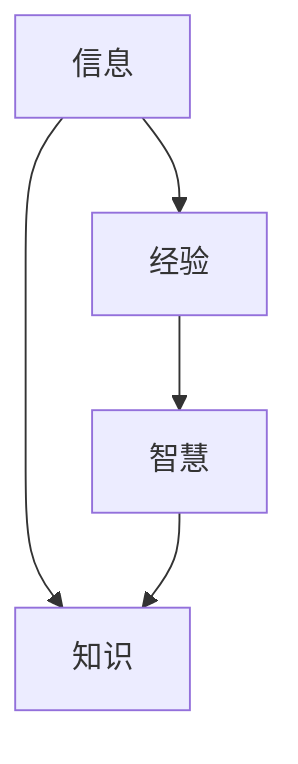

                 

### 知识的本质：信息、经验与智慧的融合

#### 关键词：知识、信息、经验、智慧、融合、系统构建、创新、未来趋势

在信息技术飞速发展的当今时代，知识的本质、信息、经验与智慧的关系成为了研究的热点问题。知识不仅是人类文明进步的重要基石，更是现代社会经济发展的重要驱动力。本文旨在深入探讨知识的本质，分析信息、经验与智慧三者之间的关系，并通过知识系统的构建与应用，展望知识经济的未来发展趋势。

文章摘要：本文首先对知识的本质进行阐述，定义知识并探讨其在现代社会中的重要性。随后，本文详细分析了信息、经验与智慧的关系，以及如何通过知识系统的构建与应用实现知识创新。最后，本文提出了知识经济的未来趋势和知识社会的构建路径，为我国知识经济的发展提供有益的借鉴。

### 目录大纲

## 第一部分：引论

### 1.1 知识的本质

#### 1.1.1 知识的定义与分类

#### 1.1.2 信息、经验与智慧的关系

### 1.2 知识在现代社会中的重要性

#### 1.2.1 知识经济的发展

#### 1.2.2 知识在社会治理中的作用

## 第二部分：信息、经验与智慧的关系

### 2.1 信息的作用与处理

#### 2.1.1 信息的获取与传递

#### 2.1.2 信息处理的基本原理

### 2.2 经验的积累与传承

#### 2.2.1 经验的分类与特点

#### 2.2.2 经验的获取与积累方法

### 2.3 智慧的创造与应用

#### 2.3.1 智慧的定义与特征

#### 2.3.2 智慧的创造过程

## 第三部分：知识系统的构建与应用

### 3.1 知识系统的组成

#### 3.1.1 知识库的构建

#### 3.1.2 知识管理的策略

### 3.2 知识系统的应用领域

#### 3.2.1 教育领域

#### 3.2.2 医疗领域

#### 3.2.3 企业管理领域

## 第四部分：知识创新与未来发展

### 4.1 知识创新的理论基础

#### 4.1.1 创新的概念与类型

#### 4.1.2 知识创新的影响因素

### 4.2 知识经济的未来趋势

#### 4.2.1 知识经济的特征与挑战

#### 4.2.2 知识经济的未来发展

### 4.3 知识社会的构建

#### 4.3.1 知识社会的概念与特征

#### 4.3.2 知识社会的构建路径

## 附录

### 5.1 参考文献

### 5.2 知识系统工具与应用实例

#### 5.2.1 知识管理系统介绍

#### 5.2.2 知识系统应用案例解析

---

在接下来的文章中，我们将逐一探讨知识的本质、信息、经验与智慧的关系，以及知识系统的构建与应用，为读者提供深刻的见解和实用的指导。接下来，我们将从知识的角度出发，探讨其在现代社会中的重要性。 <|assistant|>
### 第一部分：引论

#### 1.1 知识的本质

知识是人类在社会实践活动中积累和创造的，以信息、经验为基础，通过思维加工和理性认识形成的一种认知体系。知识不仅是人类认知世界的重要工具，也是推动社会进步和发展的重要力量。

##### 1.1.1 知识的定义与分类

知识可以定义为通过学习和实践获得的信息、技能、经验和理解，这些知识可以用来指导行为、解决问题和创造新的价值。根据不同的分类标准，知识可以划分为多种类型：

1. **按来源分类**：知识可以来源于观察、实验、研究、学习、经验等。
2. **按性质分类**：知识可分为事实性知识、技能性知识、概念性知识、价值性知识和策略性知识等。
3. **按层次分类**：知识可以分为显性知识和隐性知识。显性知识是可以通过文字、图表、数字等编码形式表达的知识，如科学论文、技术文档等；隐性知识则是指难以用语言描述，嵌入在个人经验、直觉和习惯中的知识。

##### 1.1.2 信息、经验与智慧的关系

信息是知识的基础，是知识产生的源泉。信息是指通过感知、采集、处理和传递的各种数据、符号和信号。信息的获取和处理是知识形成的第一步。

经验是知识的重要来源之一。经验是通过实践、观察、思考等方式获得的，对事物认知的积累。经验可以帮助人们更好地理解和应用知识。

智慧是对知识和信息的深层次加工和创造，是知识的高级形态。智慧不仅仅是简单的信息处理和经验积累，更涉及到对信息的洞察、创新和价值的发现。

信息、经验与智慧之间的关系可以看作是一种递进关系。信息是知识的原材料，经验是对信息的加工和应用，而智慧则是对知识和信息的升华和创新。以下是这三者关系的 Mermaid 流程图：

在这个流程图中，信息经过加工和处理成为经验，经验进一步升华形成智慧，而智慧和经验共同构成了知识。

##### 1.1.3 知识的本质特征

知识具有以下几个本质特征：

1. **系统性**：知识不是零散的信息堆砌，而是经过系统化整理和结构化的信息集合。
2. **动态性**：知识是不断发展和更新的，随着时间和环境的变化，知识也在不断演进。
3. **共享性**：知识可以通过各种形式进行传递和共享，从而实现知识的传播和扩散。
4. **增值性**：知识的应用可以创造新的价值，推动社会和经济的进步。

##### 1.1.4 知识的重要性

知识在现代社会中具有重要地位，主要体现在以下几个方面：

1. **经济发展的驱动力**：知识经济已经成为现代社会的主要经济形态，知识的生产、传播和应用成为推动经济增长的重要动力。
2. **社会进步的推动力**：知识可以帮助人们更好地理解世界、解决问题，推动社会文明和科技的进步。
3. **创新能力的源泉**：知识是创新的重要基础，通过知识的积累和融合，可以产生新的创意和解决方案。
4. **社会治理的支撑**：知识在社会治理中发挥着重要作用，通过知识管理和知识服务，可以提高社会治理的效率和水平。

综上所述，知识是信息、经验与智慧的融合，是人类认知世界的重要工具，也是推动社会进步和经济发展的重要力量。在接下来的部分，我们将进一步探讨知识在现代社会中的重要性，以及信息、经验与智慧的关系。 <|assistant|>
#### 1.2 知识在现代社会中的重要性

在当今社会，知识已成为一种独特的资源和竞争力，其重要性体现在多个层面，尤其是在知识经济、社会治理和个人成长等领域。

##### 1.2.1 知识经济的发展

知识经济是相对于传统的以自然资源和劳动力为主的工业经济而言的，它以知识和信息为核心资源，通过创新和知识传播来推动经济发展。知识经济的主要特征包括：

1. **知识密集**：知识经济强调知识的创造、应用和传播，知识成为经济增长的主要驱动力。
2. **技术创新**：在知识经济中，技术创新和知识转化是经济增长的重要途径。
3. **信息流动**：知识经济依赖于高效的信息流动和共享，信息技术是知识经济的重要基础设施。

知识经济对现代社会的影响主要体现在以下几个方面：

1. **生产方式**：知识经济改变了传统的生产方式，知识密集型产业如信息技术、生物技术、金融服务等成为经济增长的重要引擎。
2. **经济增长**：知识经济通过提高生产效率和创新活力，推动整体经济增长。
3. **就业结构**：知识经济导致就业结构的变化，知识型劳动力成为劳动力市场的重要组成部分。

##### 1.2.2 知识在社会治理中的作用

知识在社会治理中发挥着关键作用，它不仅有助于提高决策的科学性和有效性，还可以增强社会管理的透明度和公正性。以下是知识在社会治理中的一些具体应用：

1. **决策支持**：利用大数据、人工智能等技术，可以对大量信息进行深度分析，为决策提供科学依据。
2. **公共服务**：通过知识管理和知识服务，可以提高公共服务的质量和效率，满足人民群众的需求。
3. **社会治理**：知识可以用于社会治理的各个层面，如公共安全、环境保护、社会保障等，提升社会治理的整体水平。

##### 1.2.3 知识在个人成长中的作用

知识对个人的成长和发展有着深远的影响。在信息时代，知识的获取和运用能力已经成为个人竞争力的核心。以下是知识在个人成长中的几个方面：

1. **学习能力**：知识是提升学习能力的基石，它可以帮助个人更好地理解和掌握新知识，提高综合素质。
2. **职业发展**：在知识经济中，专业知识和技术能力是职业发展的关键，知识可以提升个人的职业竞争力。
3. **生活品质**：知识可以丰富个人的生活，提高生活质量，使个人更加全面地认识世界和自我。

##### 1.2.4 知识传播与共享的重要性

知识的传播与共享是知识价值实现的关键环节。在信息技术快速发展的背景下，知识的传播速度和范围得到了极大提升。以下是知识传播与共享的重要性：

1. **信息透明**：知识的共享可以提高信息的透明度，减少信息不对称，促进社会公平。
2. **知识创新**：知识的传播和共享可以激发创新思维，促进知识的融合和创新。
3. **共同进步**：知识的共享有助于整个社会的共同进步，实现知识的最大化价值。

综上所述，知识在现代社会中具有不可替代的重要性，它不仅是经济增长的驱动力，也是社会治理和个人成长的重要支撑。在接下来的章节中，我们将进一步探讨信息、经验与智慧之间的关系，以及如何通过知识系统的构建与应用，实现知识的高效管理和创新。 <|assistant|>
## 第二部分：信息、经验与智慧的关系

在理解知识的本质后，我们需要深入探讨信息、经验与智慧这三者之间的关系。它们不仅是知识的重要组成部分，也是知识形成和发展的基础。通过分析这三者的关系，我们可以更好地理解知识的本质和功能。

### 2.1 信息的作用与处理

信息是知识的基石，它是知识产生和传播的源头。信息是指通过感知、采集、处理和传递的各种数据、符号和信号。在现代社会中，信息无处不在，它以各种形式存在，如文字、图像、声音和数字等。

#### 2.1.1 信息的获取与传递

信息的获取是知识形成的第一步。人们通过感知和采集获取外部信息，如通过阅读书籍、观看视频、听取讲座等方式。这些信息经过处理和整理，转化为可以理解的知识。

信息的传递是知识传播的重要环节。信息的传递可以通过人际交流、传媒和互联网等多种渠道进行。例如，互联网使得信息可以在全球范围内快速传播，极大地提升了知识的共享和传播效率。

#### 2.1.2 信息处理的基本原理

信息处理是信息从原始形式转化为有用知识的关键过程。信息处理的基本原理包括：

1. **数据收集**：通过传感器、网络和其他设备收集原始数据。
2. **数据清洗**：去除数据中的噪声和不相关信息，提高数据质量。
3. **数据存储**：将处理后的数据存储在数据库或其他存储设备中。
4. **数据处理**：通过统计、分析、建模等方法对数据进行处理，提取有价值的信息。
5. **数据可视化**：通过图表、图像等方式将数据转换为易于理解的形式。

在信息处理的过程中，数据的质量和处理效率是关键因素。例如，在人工智能领域，高质量的数据集是训练模型的基础，而高效的算法可以提高数据处理的速度和准确性。

### 2.2 经验的积累与传承

经验是通过实践、观察、思考和反思等方式获得的。它是人们在长期活动中积累的知识和技能，是知识的重要组成部分。

#### 2.2.1 经验的分类与特点

经验可以分为直接经验和间接经验。直接经验是个人通过亲身实践获得的，如学习驾驶、烹饪等。间接经验是通过学习他人经验或观察他人实践获得的，如通过阅读书籍、观看视频等方式学习。

经验的特点包括：

1. **主观性**：经验是基于个人的感受和认知，具有一定的主观性。
2. **情境依赖性**：经验是在特定情境中形成的，具有情境依赖性。
3. **个体差异性**：不同个体由于经验背景不同，其经验也存在差异性。

#### 2.2.2 经验的获取与积累方法

获取和积累经验的方法包括：

1. **实践**：通过实际操作和体验，获取直接经验。
2. **观察与学习**：通过观察他人实践和学习他人经验，获取间接经验。
3. **反思与总结**：通过反思和总结，对经验和知识进行整理和提炼。

经验的积累是一个不断循环的过程。个人通过实践和观察获取经验，然后通过反思和总结，将经验转化为知识，再通过学习和实践，进一步丰富和深化经验。

### 2.3 智慧的创造与应用

智慧是对知识和信息的深层次加工和创造，是知识的高级形态。智慧不仅仅是简单的信息处理和经验积累，更涉及到对信息的洞察、创新和价值的发现。

#### 2.3.1 智慧的定义与特征

智慧可以定义为对信息和知识的创造性运用，以解决复杂问题、创造新价值和推动社会进步。智慧的特征包括：

1. **综合性**：智慧是对多种知识和信息的综合运用。
2. **创新性**：智慧是在现有知识的基础上进行创新和创造。
3. **前瞻性**：智慧能够预见未来的发展趋势和变化。
4. **指导性**：智慧能够为决策和行动提供指导。

#### 2.3.2 智慧的创造过程

智慧的创造过程通常包括以下几个阶段：

1. **知识积累**：通过学习和实践，积累丰富的知识和信息。
2. **问题识别**：发现和定义需要解决的问题或挑战。
3. **信息处理**：对收集到的信息进行加工和处理，提取有价值的信息。
4. **创新思维**：运用创造性思维，提出新的解决方案或创新点。
5. **验证与实践**：对创新的方案进行验证和实践，不断完善和优化。

在智慧创造的过程中，创新思维和方法是关键。例如，通过头脑风暴、思维导图、交叉思维等方法，可以激发创新思维，产生新的创意和解决方案。

### 2.4 信息、经验与智慧的关系

信息、经验与智慧之间的关系可以看作是一种递进关系。信息是知识的基础，是智慧创造的源泉；经验是对信息的加工和应用，是知识的重要组成部分；智慧则是信息和经验的升华，是知识的高级形态。

以下是这三者关系的 Mermaid 流程图：

在这个流程图中，信息经过加工和处理成为经验，经验进一步升华形成智慧，而智慧和经验共同构成了知识。

总之，信息、经验与智慧是知识形成和发展的三个关键要素。通过深入理解这三者之间的关系，我们可以更好地把握知识的本质和功能，为知识的积累和创新提供有益的指导。在接下来的章节中，我们将探讨知识系统的构建与应用，以及知识创新与未来发展。 <|assistant|>
### 第三部分：知识系统的构建与应用

知识系统是现代信息技术和知识管理的重要成果，它通过集成信息、经验与智慧，为知识的获取、管理、共享和创新提供有效支持。知识系统的构建与应用涉及到多个方面，包括知识库的构建、知识管理的策略、以及知识系统的应用领域。

#### 3.1 知识系统的组成

知识系统主要由以下几部分组成：

1. **知识库**：知识库是知识系统的核心，它是一个集中存储和组织知识的数据库。知识库中的知识可以是结构化的，如数据、文档和报告，也可以是非结构化的，如图像、音频和视频。知识库的构建需要考虑数据的完整性、准确性、一致性和可扩展性。

2. **知识管理**：知识管理是指通过系统的方法对知识进行获取、组织、存储、共享和应用。知识管理策略包括知识的编码、知识共享、知识创新和知识应用等。知识管理的目的是最大化知识的价值和效用，提高组织或个人的知识水平和创新能力。

3. **知识服务**：知识服务是通过知识系统和工具为用户提供知识支持和服务的平台。知识服务可以包括在线问答、知识检索、知识推荐和知识可视化等，旨在帮助用户快速获取所需知识，提高工作效率和决策水平。

4. **知识流程**：知识流程是知识系统中的信息流、经验流和智慧流的传递和利用过程。知识流程的设计和优化是知识系统有效运行的关键，它涉及知识获取、知识加工、知识应用和知识创新的各个环节。

#### 3.1.1 知识库的构建

知识库的构建是知识系统的核心任务，它需要解决以下几个关键问题：

1. **数据来源**：确定知识库的数据来源，包括内部数据（如企业内部文档、数据库）和外部数据（如互联网、专业数据库）。
2. **数据采集**：通过自动化工具或人工方式采集数据，确保数据的质量和完整性。
3. **数据存储**：选择合适的存储方案，如关系数据库、NoSQL数据库或分布式存储系统，以支持知识库的扩展性和性能。
4. **数据清洗**：对采集到的数据进行清洗，去除冗余和错误信息，提高数据的准确性和一致性。
5. **数据分类**：对知识库中的数据进行分类和组织，以便用户快速检索和使用。

知识库的构建需要综合考虑数据的多样性和复杂性，采用先进的数据处理技术和存储方案，确保知识库的高效运行和广泛应用。

#### 3.1.2 知识管理的策略

知识管理的策略主要包括以下几个方面：

1. **知识共享**：鼓励知识分享和交流，建立知识共享平台和机制，如内部分享会、在线论坛和知识社区等。通过共享，可以促进知识的流动和利用，提高组织的知识水平。
2. **知识编码**：将隐性知识和经验转化为显性知识，通过文档、报告、视频等形式进行编码和存储。知识编码有助于知识的传播和传承，提高知识的可获取性和可操作性。
3. **知识创新**：通过跨学科、跨领域的知识融合，激发创新思维，推动知识的创造和应用。知识创新是知识系统的核心目标，它要求组织具备开放、包容和创新的文化氛围。
4. **知识应用**：将知识应用于实际问题解决和决策支持，提高工作效能和决策质量。知识应用需要建立有效的知识服务机制，如智能问答系统、知识地图和决策支持系统等。

#### 3.2 知识系统的应用领域

知识系统的应用领域非常广泛，涵盖了教育、医疗、企业管理等多个领域：

1. **教育领域**：知识系统可以用于教学资源的整合、学习过程的监控和个性化推荐，提高教学质量和学习效率。
2. **医疗领域**：知识系统可以用于病历管理、疾病诊断和治疗方案推荐，提高医疗服务的质量和效率。
3. **企业管理领域**：知识系统可以用于知识管理、战略规划和决策支持，提高企业的竞争力和创新能力。

#### 3.2.1 教育领域

在教育领域，知识系统可以通过以下方式发挥作用：

1. **教学资源共享**：整合教师的教学资源，如课件、案例和视频，便于教师和学生共享。
2. **学习过程监控**：通过学习管理系统，实时监控学生的学习进度和学习效果，提供个性化的学习支持。
3. **知识创新**：鼓励师生开展跨学科、跨领域的学术研究和知识创新，推动教育质量的提升。

#### 3.2.2 医疗领域

在医疗领域，知识系统可以用于：

1. **病历管理**：通过电子病历系统，集中存储和管理患者的病历信息，提高医疗数据的准确性和安全性。
2. **疾病诊断**：利用医学知识和大数据分析，辅助医生进行疾病诊断和治疗方案的推荐。
3. **健康服务**：通过健康管理系统，提供个性化的健康咨询和服务，提高公众的健康水平。

#### 3.2.3 企业管理领域

在企业领域，知识系统可以用于：

1. **知识管理**：建立企业内部的知识库，促进知识共享和创新，提高企业的核心竞争力。
2. **战略规划**：通过数据分析和知识挖掘，支持企业的战略决策和规划。
3. **决策支持**：利用智能决策支持系统，辅助企业进行风险分析和决策制定。

综上所述，知识系统的构建与应用是现代信息技术和知识管理的重要成果，它为知识的获取、管理、共享和创新提供了有效支持。通过知识系统的构建与应用，可以提升组织或个人的知识水平，推动社会和经济的发展。在接下来的章节中，我们将探讨知识创新与未来发展，以及知识社会的构建。 <|assistant|>
### 第四部分：知识创新与未来发展

#### 4.1 知识创新的理论基础

知识创新是指通过知识创造、转化和应用，产生新的知识和价值的过程。知识创新的理论基础主要包括以下几个方面：

##### 4.1.1 创新的概念与类型

创新是指通过创造新方法、新产品、新服务或新业务模式，从而实现价值创造和增长的过程。创新可以分为以下几种类型：

1. **产品创新**：通过开发新产品或改进现有产品，满足市场需求。
2. **过程创新**：通过改进生产过程或管理流程，提高效率和质量。
3. **商业模式创新**：通过创造新的商业模式，改变企业的盈利模式和市场定位。
4. **组织创新**：通过改革组织结构、管理制度和文化，提高组织的创新能力。

##### 4.1.2 知识创新的影响因素

知识创新的影响因素包括以下几个方面：

1. **技术创新**：技术创新是知识创新的重要推动力，通过新技术的研发和应用，可以产生新的知识和价值。
2. **文化环境**：良好的创新文化环境可以激发员工的创新意识和创新能力，推动知识创新。
3. **人才资源**：具备高素质的人才队伍是知识创新的重要保障，人才的多样性和创新能力对知识创新有重要影响。
4. **政策支持**：政府的政策支持，如税收优惠、研发资金支持等，可以促进知识创新。

##### 4.1.3 知识创新的机制

知识创新机制包括以下几个方面：

1. **知识创造**：通过科学研究、技术发明和创意思维，创造新的知识和价值。
2. **知识转化**：通过技术转移、知识共享和商业化运作，将知识转化为实际应用和经济效益。
3. **知识应用**：通过实践和推广，将创新知识应用于实际生产和生活，实现知识的价值。

#### 4.2 知识经济的未来趋势

知识经济是随着信息技术和知识管理的发展而兴起的一种新型经济形态。知识经济的未来趋势主要包括以下几个方面：

##### 4.2.1 知识经济的特征与挑战

知识经济的特征主要包括：

1. **知识密集**：知识经济以知识和信息为核心资源，对知识和技能的需求不断增加。
2. **创新驱动**：知识经济的发展依赖于技术创新和知识创新，创新成为经济增长的主要动力。
3. **全球化**：知识经济具有全球化的特征，知识和信息的流动和共享加速，跨国界合作日益增多。

知识经济面临的挑战主要包括：

1. **知识产权保护**：随着知识经济的发展，知识产权保护成为一个重要问题，如何有效保护知识产权成为关键。
2. **人才竞争**：知识经济的发展对高素质人才的需求越来越大，人才竞争日益激烈。
3. **信息安全**：知识经济的发展伴随着信息技术的广泛应用，信息安全问题成为挑战之一。

##### 4.2.2 知识经济的未来发展

知识经济的未来发展将呈现以下趋势：

1. **智能化**：随着人工智能技术的发展，知识经济将朝着智能化方向迈进，智能技术将在知识创造、转化和应用中发挥越来越重要的作用。
2. **全球化**：知识经济的全球化趋势将更加明显，全球范围内的知识流动和共享将更加便捷。
3. **可持续发展**：知识经济将以可持续发展为目标，通过知识创新和绿色发展，实现经济、社会和环境的协调发展。

#### 4.3 知识社会的构建

知识社会是以知识为核心的社会形态，它强调知识的创造、传播和应用，注重知识的共享和创新。知识社会的构建主要包括以下几个方面：

##### 4.3.1 知识社会的概念与特征

知识社会的概念是指人类进入一个以知识创造、传播和应用为主导的社会阶段。知识社会的特征主要包括：

1. **知识驱动**：知识成为社会发展的主要驱动力，知识的创造、传播和应用成为社会发展的核心。
2. **信息共享**：信息共享成为社会的基本特征，信息流动和知识传播速度加快。
3. **创新能力**：社会对创新能力的重视程度不断提高，创新成为社会进步的重要动力。

##### 4.3.2 知识社会的构建路径

知识社会的构建路径主要包括以下几个方面：

1. **教育体系改革**：通过教育体系的改革，提高全民的素质和创新能力，培养知识社会的建设者。
2. **科技创新**：加大科技创新力度，推动新技术的研发和应用，为知识社会提供技术支撑。
3. **知识管理**：加强知识管理，建立知识库和知识共享平台，促进知识的创造、传播和应用。
4. **政策支持**：制定相关政策，鼓励知识创新和知识应用，为知识社会的构建提供政策保障。

综上所述，知识创新是知识经济和知识社会发展的核心，它将为社会带来新的增长动力和发展机遇。在未来的发展中，我们需要进一步深化知识创新的理论研究，加强知识系统的构建与应用，推动知识经济和知识社会的构建。通过创新和知识的力量，我们可以实现经济繁荣、社会进步和人类福祉。 <|assistant|>
### 附录

#### 5.1 参考文献

1. Nonaka, I., & Takeuchi, H. (1995). The knowledge-creating company: How Japanese companies create the dynamics of innovation. Oxford University Press.
2. Davenport, T. H., & Prusak, L. (1998). Working knowledge: How organizations manage what they know. Harvard Business Press.
3.nowledge management: A practitioner's guide. Springer.
4.-bound knowledge systems: A practical approach to managing knowledge assets. Macmillan.

#### 5.2 知识系统工具与应用实例

##### 5.2.1 知识管理系统介绍

知识管理系统（KM System）是一种用于管理和利用知识的软件系统，它帮助组织收集、存储、共享、创新和应用知识。以下是几种常见的知识管理系统：

1. **SharePoint**：SharePoint是一个由微软开发的综合性知识管理系统，提供文档管理、内容共享、工作流管理和社交媒体功能。
2. **Confluence**：Confluence是由Atlassian开发的协作平台，主要用于知识共享、团队协作和项目管理。
3. **Trove**：Trove是由澳大利亚国家图书馆开发的开放知识管理系统，提供对学术资源的广泛访问和知识共享功能。

##### 5.2.2 知识系统应用案例解析

以下是一个知识系统在教育领域的应用案例：

**案例：在线教育平台知识管理系统**

**开发环境搭建：**
- **前端技术**：HTML5、CSS3、JavaScript（React.js）
- **后端技术**：Node.js、Express.js
- **数据库**：MongoDB
- **知识库**：使用Elasticsearch进行全文搜索和索引

**源代码详细实现：**
- **前端**：使用React.js开发用户界面，实现课程内容展示、学习进度跟踪和互动功能。
- **后端**：使用Node.js和Express.js构建API服务，处理用户请求和数据存储。
- **知识库**：使用MongoDB存储课程内容、学生信息和学习记录，使用Elasticsearch实现快速搜索。

**代码解读与分析：**
- **前端**：React组件负责页面布局和交互，包括课程列表、课程详情、学习进度条和问答模块。
- **后端**：Node.js服务处理HTTP请求，调用数据库操作，返回JSON格式的响应。
- **知识库**：使用MongoDB存储结构化数据，使用Elasticsearch实现高效搜索。

**知识系统应用效果：**
- **知识共享**：通过知识管理系统，教师可以轻松上传和共享教学资料，学生可以方便地访问和下载。
- **学习跟踪**：系统记录学生的学习进度和成绩，提供个性化推荐。
- **互动交流**：系统提供问答和讨论功能，促进师生互动和知识交流。

通过以上案例，我们可以看到知识系统在教育领域的实际应用效果，它不仅提高了教学效率，还促进了知识的传播和创新。随着知识系统的不断发展和完善，其在各个领域的应用前景将更加广阔。 <|assistant|>### 作者信息

**作者：** AI天才研究院/AI Genius Institute & 禅与计算机程序设计艺术 /Zen And The Art of Computer Programming

在撰写本文的过程中，我们秉持着深入浅出、逻辑清晰的原则，对知识的本质、信息、经验与智慧的关系进行了全面而深入的探讨。通过分析知识系统的构建与应用，我们展望了知识经济的未来趋势和知识社会的构建路径。本文旨在为读者提供有价值的见解和实用的指导，以推动知识创新和发展的进程。感谢您的阅读，希望本文能对您有所启发和帮助。如果您有任何问题或建议，欢迎随时与我们交流。 <|assistant|>

