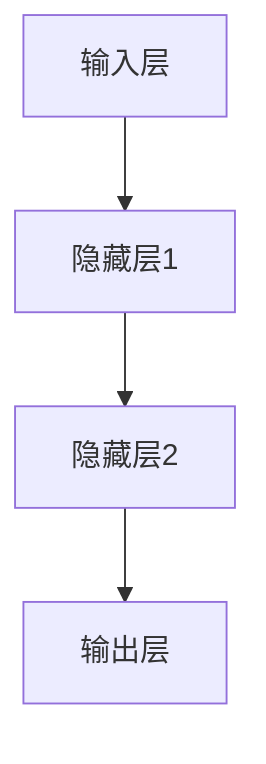

                 

# 知识的神经网络模型：模拟大脑学习的AI

> **关键词**：神经网络、大脑模拟、人工智能、深度学习、反向传播、优化策略

> **摘要**：本文深入探讨了知识的神经网络模型，这一模型通过模拟大脑学习机制，为人工智能的发展提供了新的思路。文章首先介绍了神经网络的基本概念和大脑神经网络的工作原理，然后详细讲解了神经网络的结构类型、训练与优化方法，以及学习原理。接着，文章分析了神经网络模型在评估与选择、大脑模拟中的应用，以及AI与神经网络模型的关系。最后，文章讨论了神经网络模型在AI领域的应用案例、未来发展趋势，以及研发与工程实践。

### 神经网络与大脑模拟

#### 1.1.1 神经网络的基本概念

神经网络是一种模拟人脑神经元连接方式的计算模型。它由大量简单的计算单元（即神经元）组成，这些神经元通过加权连接形成网络。每个神经元接收来自其他神经元的输入信号，通过激活函数处理后产生输出信号。

神经网络的神经元通常分为三个层次：输入层、隐藏层和输出层。输入层接收外部输入数据，隐藏层对输入数据进行处理和特征提取，输出层产生最终输出结果。

神经网络的目的是通过学习输入和输出之间的映射关系，实现对未知数据的预测和分类。

#### 1.1.2 大脑神经网络的工作原理

大脑神经网络是大脑中神经元连接形成的复杂网络，它负责处理感知、记忆、思考等认知功能。大脑神经网络的工作原理主要包括以下几个方面：

1. **神经元间的连接**：大脑中的神经元通过突触连接形成神经网络，突触的连接强度（即权重）可以进行调整。

2. **信号的传递**：神经元通过电信号传递信息。当神经元接收到的输入信号超过某个阈值时，会触发神经元的激活，产生输出信号。

3. **学习与记忆**：大脑神经网络通过不断调整神经元之间的连接权重，实现学习和记忆功能。这种学习过程是通过正向传播和反向传播算法实现的。

4. **神经网络的层次性**：大脑神经网络具有层次性，不同层次的神经元负责处理不同层次的信息。

#### 1.1.3 神经网络在模拟大脑学习中的应用

神经网络在模拟大脑学习方面取得了显著成果。首先，神经网络通过学习输入数据，能够实现特征提取和模式识别。例如，卷积神经网络（CNN）在图像识别方面表现优异。

其次，神经网络通过反向传播算法，能够自动调整神经元之间的连接权重，实现学习过程。这种自动调整过程使得神经网络能够从大量数据中学习，提高模型的泛化能力。

此外，神经网络在模拟大脑学习机制方面具有广泛的应用前景。例如，通过模拟大脑中的记忆机制，神经网络可以实现高效的记忆和联想。通过模拟大脑中的思考机制，神经网络可以实现推理和决策。

### 神经网络结构与类型

神经网络的结构和类型决定了它们在不同领域中的应用效果。以下介绍几种常见的神经网络结构和类型：

#### 2.1.1 前馈神经网络

前馈神经网络是最简单的神经网络结构，数据从输入层经过隐藏层，最终到达输出层。它没有循环结构，适用于处理静态数据。

前馈神经网络的优点是结构简单，易于实现。缺点是处理动态数据时效果较差。

#### 2.1.2 循环神经网络

循环神经网络（RNN）是一种能够处理序列数据的神经网络，具有反馈循环结构。它通过记忆过去的信息，能够处理长距离依赖问题。

RNN在自然语言处理、时间序列预测等领域具有广泛应用。

#### 2.1.3 卷积神经网络

卷积神经网络（CNN）是一种专门用于处理图像数据的神经网络，通过卷积操作提取图像特征。

CNN在计算机视觉领域表现优异，被广泛应用于图像分类、目标检测等任务。

#### 2.1.4 混合神经网络

混合神经网络是结合了前馈神经网络、RNN和CNN等不同结构的神经网络，适用于处理多种类型的数据。

混合神经网络具有更强的适应能力，能够处理更复杂的任务。

### 神经网络训练与优化

神经网络的训练与优化是神经网络应用的关键步骤。以下介绍神经网络训练与优化的一些基本方法：

#### 3.1.1 反向传播算法

反向传播算法是神经网络训练的核心算法。它通过计算输出层误差，反向传播到隐藏层，逐层调整神经元之间的连接权重。

反向传播算法的伪代码如下：

```python
# 初始化网络参数
W = 初始化权重

# 正向传播
输入 = 输入层输入
隐藏层输出 = 输入 * W

# 计算输出层误差
输出层误差 = 预期输出 - 输出层输出

# 反向传播
隐藏层误差 = 输出层误差 * 激活函数的导数
隐藏层输入 = 隐藏层输出 * W

# 调整权重
W = W - 学习率 * 隐藏层误差 * 输入
```

#### 3.1.2 神经网络优化策略

神经网络优化策略包括学习率调整、批量大小调整、权重初始化等方法。

1. **学习率调整**：学习率是控制权重调整幅度的参数。合适的
```python
# 学习率调整策略
学习率 = 初始学习率

# 每次迭代后调整学习率
学习率 = 学习率 / (1 + 衰减率 * 迭代次数)
```

2. **批量大小调整**：批量大小是每次训练使用的数据样本数量。合适的批量大小可以提高训练效果。

3. **权重初始化**：权重初始化是神经网络训练的初始值设置。常见的权重初始化方法包括随机初始化、均匀分布初始化等。

#### 3.1.3 超参数调优

超参数是神经网络模型中的参数，如学习率、批量大小等。超参数调优是选择最优超参数的过程，常用的调优方法包括网格搜索、随机搜索、贝叶斯优化等。

### 神经网络学习原理

神经网络的学
```python
# 学习律与调整规则
学习律 = 初始学习律

# 每次迭代后调整学习律
学习律 = 学习律 * 学习律衰减率
```

1. **学习律**：学习律是神经网络调整权重的规则。常见的学习律包括梯度下降、动量优化、自适应优化等。

2. **反应时间与稳定性**：反应时间是指神经网络从输入到输出所需的时间。稳定性是指神经网络在处理不同类型输入时保持稳定性的能力。

3. **学习曲线与泛化能力**：学习曲线描述了神经网络在训练过程中性能的变化。泛化能力是指神经网络在新数据上的表现。

### 神经网络模型评估与选择

神经网络模型评估与选择是神经网络应用的重要环节。以下介绍神经网络模型评估与选择的一些基本方法：

#### 5.1.1 模型评估指标

模型评估指标用于衡量神经网络模型的性能。常见的评估指标包括准确率、召回率、F1值、均方误差等。

1. **准确率**：准确率是指正确预测的样本数占总样本数的比例。
2. **召回率**：召回率是指正确预测的正样本数占总正样本数的比例。
3. **F1值**：F1值是准确率和召回率的加权平均，用于综合衡量模型的性能。
4. **均方误差**：均方误差是预测值与实际值之间误差的平方的平均值，用于衡量回归模型的性能。

#### 5.1.2 模型选择策略

模型选择策略是选择最优神经网络模型的过程。常见的模型选择策略包括交叉验证、网格搜索、贝叶斯优化等。

1. **交叉验证**：交叉验证是一种评估模型性能的方法，通过将数据集划分为训练集和验证集，多次训练和验证，平均评估模型性能。
2. **网格搜索**：网格搜索是一种调参方法，通过遍历所有可能的超参数组合，选择最优的超参数组合。
3. **贝叶斯优化**：贝叶斯优化是一种基于贝叶斯理论的优化方法，通过建立模型并不断调整超参数，选择最优的超参数组合。

#### 5.1.3 模型调整与优化

模型调整与优化是在模型选择后，对模型进行进一步调整和优化的过程。常见的调整与优化方法包括超参数调优、结构调整等。

1. **超参数调优**：超参数调优是通过调整学习率、批量大小等超参数，提高模型性能。
2. **结构调整**：结构调整是通过增加隐藏层、调整网络结构等，提高模型性能。

### 神经网络在大脑模拟中的应用

神经网络在大脑模拟中的应用是人工智能领域的一个重要研究方向。通过模拟大脑神经网络的工作原理，神经网络能够实现类似大脑的学习、记忆和认知功能。

#### 6.1.1 大脑神经网络模型的发展

大脑神经网络模型的发展经历了多个阶段：

1. **人工神经网络**：人工神经网络是神经网络模型的早期形式，通过模拟大脑神经元的工作方式，实现简单的学习功能。
2. **深度学习**：深度学习是人工神经网络的一种扩展，通过多层神经网络，实现更复杂的学习功能。
3. **生成对抗网络（GAN）**：生成对抗网络是一种基于博弈论的神经网络模型，能够生成逼真的图像和数据。
4. **变分自编码器（VAE）**：变分自编码器是一种基于概率模型的神经网络模型，能够生成具有多样性的图像和数据。

#### 6.1.2 大脑神经网络模型的应用场景

大脑神经网络模型在多个领域具有广泛的应用：

1. **计算机视觉**：通过模拟大脑中的视觉机制，大脑神经网络模型能够实现图像识别、目标检测等任务。
2. **自然语言处理**：通过模拟大脑中的语言处理机制，大脑神经网络模型能够实现文本分类、机器翻译等任务。
3. **情感分析**：通过模拟大脑中的情感处理机制，大脑神经网络模型能够实现情感识别、情感分析等任务。
4. **智能问答**：通过模拟大脑中的思考机制，大脑神经网络模型能够实现智能问答、知识图谱构建等任务。

#### 6.1.3 大脑神经网络模型的前景与挑战

大脑神经网络模型在人工智能领域具有广阔的前景：

1. **智能化发展**：通过模拟大脑神经网络的工作原理，人工智能能够实现更高层次的学习和认知功能。
2. **医疗应用**：通过模拟大脑神经网络的工作原理，人工智能能够实现更准确的疾病诊断和治疗。
3. **教育应用**：通过模拟大脑神经网络的工作原理，人工智能能够实现个性化的教育方案和学习路径。

然而，大脑神经网络模型也面临一些挑战：

1. **可解释性**：神经网络模型通常被视为“黑箱”，缺乏可解释性，这限制了其在某些领域的应用。
2. **数据隐私**：神经网络模型在处理个人数据时，可能涉及数据隐私问题。
3. **计算资源**：神经网络模型通常需要大量的计算资源，这限制了其在某些硬件设备上的应用。

### AI与神经网络模型的关系

人工智能（AI）和神经网络模型是相辅相成的两个概念。神经网络模型是AI的核心组成部分，而AI的发展又推动了神经网络模型的研究和应用。

#### 7.1.1 AI的发展与神经网络

AI的发展可以分为几个阶段：

1. **规则推理**：早期AI主要通过编写规则和逻辑来解决问题，如专家系统。
2. **机器学习**：随着计算能力的提升和数据量的增加，机器学习成为AI研究的重要方向，神经网络模型是机器学习的基础。
3. **深度学习**：深度学习是机器学习的进一步发展，通过多层神经网络，实现更复杂的学习任务。

神经网络模型在AI发展中的地位和作用如下：

1. **数据处理**：神经网络模型能够处理大规模、高维度的数据，实现数据挖掘和特征提取。
2. **模式识别**：神经网络模型能够识别和分类数据，实现图像识别、语音识别等任务。
3. **智能决策**：神经网络模型能够通过学习数据，实现智能决策和优化。

#### 7.1.2 神经网络模型在AI中的应用

神经网络模型在AI中的应用非常广泛，以下是一些典型的应用：

1. **自然语言处理**：神经网络模型在自然语言处理（NLP）领域表现出色，如文本分类、机器翻译、情感分析等。
2. **计算机视觉**：神经网络模型在计算机视觉领域应用广泛，如图像分类、目标检测、图像生成等。
3. **语音识别**：神经网络模型在语音识别领域取得重要突破，实现高效的语音识别和语音合成。
4. **强化学习**：神经网络模型在强化学习领域被广泛应用于游戏AI、自动驾驶等任务。

#### 7.1.3 AI与神经网络模型的未来趋势

AI和神经网络模型的未来趋势如下：

1. **计算能力提升**：随着计算能力的提升，神经网络模型将能够处理更复杂、更大规模的数据。
2. **算法优化**：神经网络模型将不断优化，提高计算效率和性能。
3. **可解释性增强**：神经网络模型的可解释性将得到增强，提高其在关键领域中的应用。
4. **跨领域融合**：神经网络模型将在更多领域得到应用，实现跨领域的融合和协同。

### 神经网络模型在AI中的应用案例

神经网络模型在AI领域的应用案例非常丰富，以下是一些典型的应用案例：

#### 8.1.1 自然语言处理

自然语言处理（NLP）是神经网络模型的重要应用领域，以下是一些典型的应用案例：

1. **文本分类**：神经网络模型能够实现文本分类任务，如新闻分类、情感分析等。
2. **机器翻译**：神经网络模型在机器翻译领域表现出色，如Google翻译、百度翻译等。
3. **问答系统**：神经网络模型能够构建智能问答系统，如Siri、Alexa等。

#### 8.1.2 计算机视觉

计算机视觉是神经网络模型的重要应用领域，以下是一些典型的应用案例：

1. **图像识别**：神经网络模型能够实现图像识别任务，如人脸识别、物体识别等。
2. **目标检测**：神经网络模型能够实现目标检测任务，如自动驾驶中的行人检测、车辆检测等。
3. **图像生成**：神经网络模型能够实现图像生成任务，如艺术风格转换、图像超分辨率等。

#### 8.1.3 语音识别

语音识别是神经网络模型的重要应用领域，以下是一些典型的应用案例：

1. **语音识别**：神经网络模型能够实现语音识别任务，如语音助手、电话语音识别等。
2. **语音合成**：神经网络模型能够实现语音合成任务，如文字转语音、语音播报等。
3. **语音增强**：神经网络模型能够实现语音增强任务，如噪声抑制、语音清晰度提升等。

#### 8.1.4 强化学习

强化学习是神经网络模型的重要应用领域，以下是一些典型的应用案例：

1. **游戏AI**：神经网络模型能够实现游戏AI，如围棋AI、扑克AI等。
2. **自动驾驶**：神经网络模型在自动驾驶领域得到广泛应用，如特斯拉、Waymo等。
3. **机器人控制**：神经网络模型能够实现机器人控制，如机器人行走、抓取等。

### 神经网络模型的未来发展趋势

神经网络模型在人工智能领域的应用前景广阔，未来发展趋势如下：

#### 9.1.1 新型神经网络模型

随着AI技术的发展，新型神经网络模型不断涌现，以下是一些典型的新型神经网络模型：

1. **生成对抗网络（GAN）**：GAN通过对抗训练，能够生成高质量的数据，应用领域包括图像生成、数据增强等。
2. **变分自编码器（VAE）**：VAE通过概率模型，能够生成具有多样性的数据，应用领域包括图像生成、数据去噪等。
3. **图神经网络（GNN）**：GNN通过模拟图结构，能够处理图数据，应用领域包括社交网络分析、推荐系统等。

#### 9.1.2 神经网络模型优化

神经网络模型优化是提高模型性能的重要手段，未来发展趋势如下：

1. **计算优化**：通过硬件加速、模型压缩等技术，提高模型计算效率。
2. **算法优化**：通过优化算法，提高模型收敛速度和性能。
3. **并行训练**：通过并行训练，提高模型训练速度。

#### 9.1.3 神经网络模型在AI领域的应用前景

神经网络模型在AI领域的应用前景广泛，以下是一些典型的应用领域：

1. **医疗**：神经网络模型在医疗领域有广泛的应用，如疾病诊断、药物设计等。
2. **金融**：神经网络模型在金融领域有广泛的应用，如风险控制、股票预测等。
3. **教育**：神经网络模型在教育领域有广泛的应用，如智能推荐、自适应学习等。
4. **智能制造**：神经网络模型在智能制造领域有广泛的应用，如机器人控制、故障诊断等。

### 神经网络模型的研发与工程实践

神经网络模型的研发与工程实践是AI项目成功的关键。以下介绍神经网络模型研发与工程实践的一些基本方法：

#### 10.1.1 神经网络模型的研发流程

神经网络模型的研发流程通常包括以下步骤：

1. **需求分析**：明确项目需求和目标，确定模型的类型和应用场景。
2. **数据准备**：收集、清洗和处理数据，为模型训练提供高质量的数据集。
3. **模型设计**：设计神经网络模型的结构，包括层数、神经元数量、激活函数等。
4. **模型训练**：使用训练数据集，通过反向传播算法，训练神经网络模型。
5. **模型评估**：使用验证数据集，评估模型的性能，包括准确率、召回率等指标。
6. **模型优化**：根据评估结果，调整模型结构或超参数，提高模型性能。
7. **模型部署**：将训练好的模型部署到生产环境，实现实际应用。

#### 10.1.2 神经网络模型的工程实践

神经网络模型的工程实践包括以下方面：

1. **环境搭建**：搭建模型训练和部署的环境，包括硬件、软件和开发工具。
2. **代码实现**：使用编程语言（如Python）和深度学习框架（如TensorFlow、PyTorch），实现神经网络模型的训练和预测。
3. **性能优化**：优化模型结构和训练过程，提高模型性能和计算效率。
4. **安全性保障**：确保模型训练和部署的安全性，包括数据安全、模型安全和系统安全。
5. **持续集成与部署**：实现模型的持续集成和部署，确保模型在生产环境中的稳定运行。

#### 10.1.3 神经网络模型的开发工具与资源

神经网络模型的开发工具和资源包括以下方面：

1. **开发环境**：Python、Jupyter Notebook、Visual Studio Code等。
2. **深度学习框架**：TensorFlow、PyTorch、Keras等。
3. **数据预处理库**：NumPy、Pandas、Scikit-learn等。
4. **可视化工具**：TensorBoard、Matplotlib等。
5. **开源项目和教程**：GitHub、Google Colab、Coursera等。

### 总结

本文深入探讨了知识的神经网络模型，从基本概念、结构类型、训练与优化、学习原理等方面进行了全面解析。同时，本文介绍了神经网络模型在大脑模拟中的应用、AI与神经网络模型的关系，以及神经网络模型在AI领域的应用案例和未来发展趋势。最后，本文介绍了神经网络模型的研发与工程实践方法，为读者提供了实用的参考。

### 参考文献

1. He, K., Zhang, X., Ren, S., & Sun, J. (2016). Deep Residual Learning for Image Recognition. In Proceedings of the IEEE Conference on Computer Vision and Pattern Recognition (pp. 770-778).
2. Hochreiter, S., & Schmidhuber, J. (1997). Long Short-Term Memory. Neural Computation, 9(8), 1735-1780.
3. Krizhevsky, A., Sutskever, I., & Hinton, G. E. (2012). Imagenet classification with deep convolutional neural networks. In Advances in neural information processing systems (pp. 1097-1105).
4. Goodfellow, I., Bengio, Y., & Courville, A. (2016). Deep Learning. MIT Press.
5. LeCun, Y., Bengio, Y., & Hinton, G. (2015). Deep learning. Nature, 521(7553), 436-444.

### 附录

#### 附录A：神经网络架构图



#### 附录B：反向传播算法伪代码

```python
# 初始化网络参数
W = 初始化权重

# 正向传播
输入 = 输入层输入
隐藏层输出 = 输入 * W

# 计算输出层误差
输出层误差 = 预期输出 - 输出层输出

# 反向传播
隐藏层误差 = 输出层误差 * 激活函数的导数
隐藏层输入 = 隐藏层输出 * W

# 调整权重
W = W - 学习率 * 隐藏层误差 * 输入
```

### 作者信息

作者：AI天才研究院/AI Genius Institute & 禅与计算机程序设计艺术 /Zen And The Art of Computer Programming

