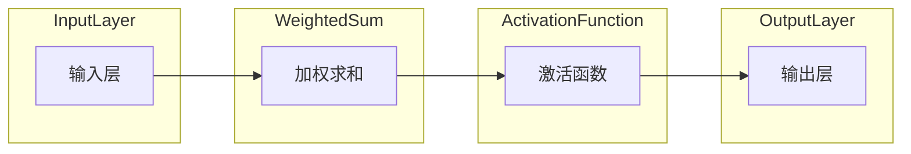

                 

### 第1章 神经网络概述

#### 1.1 神经网络的发展历史

神经网络（Neural Networks）的概念最早可以追溯到1943年，由心理学家沃伦·麦卡洛克（Warren McCulloch）和数理逻辑学家沃尔特·皮茨（Walter Pitts）提出。他们的工作奠定了人工神经网络的理论基础。随后，1958年，弗兰克·罗森布拉特（Frank Rosenblatt）发明了感知器（Perceptron），这是一种二分类线性分类器，能够通过训练学习输入数据的边界。

然而，神经网络的真正突破出现在1986年，当鲁道夫·赫尔曼·凯恩（Rudolf Karl Hermann Kurzweil）提出了反向传播算法（Backpropagation Algorithm），这使得多层神经网络的学习变得更加高效和可行。反向传播算法通过计算误差的梯度来调整网络中的权重，从而优化网络的性能。

进入21世纪，随着计算能力的提升和大数据的普及，深度学习（Deep Learning）逐渐成为人工智能领域的研究热点。深度学习是一种包含多隐层的神经网络，能够自动从数据中学习特征表示。在2012年，由Geoffrey Hinton等人开发的深度卷积神经网络（CNN）在ImageNet图像识别挑战中取得了突破性的成绩，标志着深度学习时代的到来。

#### 1.2 神经网络的基本概念

神经网络由大量的简单处理单元（即神经元）组成，这些神经元通过连接（称为边或权重）进行信息传递。每个神经元接收来自其他神经元的输入信号，并产生一个输出信号。神经网络的基本结构通常包括以下几部分：

1. **输入层**：接收外部输入数据，不包含任何参数。
2. **隐藏层**：多个隐藏层可以用来提取数据的复杂特征。每个隐藏层将输入数据映射到更高层次的抽象表示。
3. **输出层**：产生最终输出，可以是分类结果、数值预测等。

神经网络的输入和输出之间的关系可以通过以下数学公式表示：

$$
y = f(z) = \sum_{i=1}^{n} w_i * x_i + b
$$

其中，\(y\) 是输出，\(f\) 是激活函数，\(z\) 是加权求和，\(w_i\) 是权重，\(x_i\) 是输入，\(b\) 是偏置。

#### 1.3 神经网络的优势与挑战

神经网络的优势主要体现在以下几个方面：

1. **自动特征学习**：神经网络可以自动从数据中学习特征，无需人工设计特征，大大提高了模型的学习效率。
2. **高效的数据处理能力**：神经网络能够并行处理大量数据，适合处理复杂数据结构，如图像、语音和文本等。
3. **自适应能力**：神经网络可以通过学习调整网络结构和参数，以适应不同的任务和数据集。

然而，神经网络也面临着一些挑战：

1. **计算复杂度高**：随着网络层数和神经元数量的增加，计算复杂度呈指数级增长，对计算资源的需求巨大。
2. **超参数调优困难**：神经网络的性能很大程度上取决于超参数的选择，如学习率、批量大小等，这些参数的调优过程往往耗时且难以把握。
3. **数据需求量大**：神经网络尤其是深度学习模型，需要大量的数据来训练，数据的质量和多样性对模型性能有重要影响。

综上所述，神经网络在人工智能领域扮演着重要角色，其发展历史、基本概念和优势挑战为我们深入了解这一技术提供了基础。在接下来的章节中，我们将深入探讨神经网络的原理、深度学习框架以及神经网络在软件开发中的应用。

---

### 第2章 人工神经网络原理

人工神经网络（Artificial Neural Networks，ANNs）是模仿生物神经系统的计算模型，通过大量的简单处理单元（神经元）和连接（权重）来模拟大脑的信息处理能力。本章节将详细探讨人工神经网络的核心原理，包括神经元模型、激活函数和学习算法。

#### 2.1 神经元模型

神经元模型是神经网络的基本构建模块。一个简单的神经元可以看作是一个带权重连接的多输入单输出的函数，其输入和输出关系可以表示为：

$$
y = f(\sum_{i=1}^{n} w_i \cdot x_i + b)
$$

其中：
- \(y\) 是神经元的输出。
- \(f\) 是激活函数。
- \(\sum_{i=1}^{n} w_i \cdot x_i + b\) 是加权求和，\(w_i\) 是输入 \(x_i\) 的权重，\(b\) 是偏置。
- \(n\) 是输入的数量。

在神经元中，每个输入 \(x_i\) 都与相应的权重 \(w_i\) 相关联，权重的大小决定了输入对输出的影响程度。偏置 \(b\) 是一个加性项，可以调整神经元的阈值，使其在特定情况下更容易或更难被激活。

神经元的工作过程可以分为以下几个步骤：

1. **输入加权和**：将所有输入值与其对应的权重相乘，然后求和，得到输入加权和。
2. **应用激活函数**：通过激活函数将输入加权和转换成输出值。激活函数的作用是引入非线性，使得神经网络能够处理复杂数据。

一个典型的神经元模型可以表示为：



#### 2.2 激活函数

激活函数是神经元模型中不可或缺的部分，它引入了非线性，使得神经网络能够拟合复杂函数。常见的激活函数包括：

1. **Sigmoid函数**：
   $$f(x) = \frac{1}{1 + e^{-x}}$$
   Sigmoid函数将输入值映射到（0,1）区间，便于处理二分类问题。

2. **ReLU函数**：
   $$f(x) = \max(0, x)$$
   ReLU（Rectified Linear Unit）函数在零点处的导数为1，这使得梯度在训练过程中不易消失，有助于加速学习。

3. **Tanh函数**：
   $$f(x) = \frac{e^x - e^{-x}}{e^x + e^{-x}}$$
   Tanh函数类似于Sigmoid函数，但输出范围在（-1,1）之间，常用于多分类问题。

激活函数的选择会影响网络的收敛速度和性能。例如，ReLU函数由于其简单性和非线性特性，已经成为深度神经网络中的常见选择。

#### 2.3 学习算法

神经网络的训练过程实际上是不断调整网络中的权重和偏置，使得网络能够更好地拟合训练数据。这一过程通常通过学习算法来实现，其中最常用的算法是梯度下降（Gradient Descent）。

梯度下降是一种基于梯度信息的最优化算法，其核心思想是通过计算损失函数关于网络参数的梯度，并沿着梯度的反方向更新参数，以最小化损失函数。

1. **前向传播**：在训练过程中，首先将输入数据传递到神经网络中，计算每个神经元的输出值。

2. **计算损失**：根据输出值和目标值计算损失函数，常用的损失函数包括均方误差（MSE）和交叉熵（Cross Entropy）。

3. **反向传播**：计算损失函数关于网络参数的梯度，并通过梯度下降更新参数。更新公式如下：

$$
w_{new} = w_{current} - \alpha \cdot \frac{\partial L}{\partial w}
$$

其中，\(\alpha\) 是学习率，\(\frac{\partial L}{\partial w}\) 是权重 \(w\) 的梯度。

4. **迭代更新**：重复前向传播和反向传播过程，直到损失函数收敛到满意的值。

伪代码如下：

```python
for epoch in range(num_epochs):
    for x, y in training_data:
        # 前向传播
        output = forward_pass(x)
        # 计算损失
        loss = compute_loss(output, y)
        # 反向传播
        gradients = backward_pass(output, y)
        # 更新参数
        update_weights(gradients, learning_rate)
```

通过这些学习算法，神经网络能够不断优化自身，提高对数据的拟合能力。

总之，人工神经网络的基本原理包括神经元模型、激活函数和学习算法。理解这些核心概念对于深入探索神经网络的工作机制至关重要。在接下来的章节中，我们将继续探讨深度学习框架和神经网络在软件开发中的应用。

---

### 第3章 深度学习框架

深度学习框架是用于实现和训练深度学习模型的工具集。这些框架简化了深度学习的开发过程，提供了丰富的库函数和高效的计算能力。在本章节中，我们将对比TensorFlow和PyTorch这两个最流行的深度学习框架，并介绍如何配置和使用它们。

#### 3.1 TensorFlow与PyTorch对比

**TensorFlow**：
- **开源**：由Google开发，目前由Google Brain维护。
- **生态**：拥有广泛的社区支持和丰富的第三方库，如TensorBoard、TensorFlow Estimators等。
- **稳定性**：由于成熟的开发和维护历史，TensorFlow提供了较高的稳定性和可靠性。
- **上手难度**：TensorFlow的API较为复杂，对于初学者来说可能有一定难度。

**PyTorch**：
- **开源**：由Facebook的AI研究团队开发。
- **生态**：虽然相对TensorFlow较新，但社区活跃度很高，且拥有大量优秀的第三方库，如Torchvision、Torchtext等。
- **灵活性**：PyTorch提供了更为灵活的动态计算图，使其在模型开发和调试过程中更为便捷。
- **上手难度**：PyTorch的API设计更为直观，对于初学者来说更容易上手。

以下是TensorFlow和PyTorch的一些关键对比：

| 对比项 | TensorFlow | PyTorch |
| --- | --- | --- |
| 开发者 | Google | Facebook |
| 生态 | 成熟 | 活跃 |
| 稳定性 | 高 | 高 |
| 上手难度 | 较高 | 较低 |
| 动态计算图 | 不支持 | 支持 |

#### 3.2 深度学习框架的配置与使用

**安装与配置**

**TensorFlow**：

1. **安装**：
   ```bash
   pip install tensorflow
   ```
   或使用最新版本：
   ```bash
   pip install tensorflow==2.x
   ```

2. **配置**：
   - TensorFlow 2.x 提供了自动混合精度（AMP）功能，可以显著提高训练速度。
   - 配置GPU支持：
     ```bash
     tensorflow-config --worker GPUs 1 --ps GPUs 0 --use_powerapi
     ```

**PyTorch**：

1. **安装**：
   ```bash
   pip install torch torchvision
   ```

2. **配置**：
   - PyTorch 支持自动GPU发现和配置，通常无需额外配置。
   - 检查GPU支持：
     ```python
     import torch
     print(torch.cuda.is_available())
     ```

**基本使用**

**TensorFlow**：

1. **导入库**：
   ```python
   import tensorflow as tf
   ```

2. **构建模型**：
   ```python
   model = tf.keras.Sequential([
       tf.keras.layers.Dense(128, activation='relu', input_shape=(784,)),
       tf.keras.layers.Dense(10, activation='softmax')
   ])
   ```

3. **编译模型**：
   ```python
   model.compile(optimizer='adam',
                 loss='categorical_crossentropy',
                 metrics=['accuracy'])
   ```

4. **训练模型**：
   ```python
   model.fit(x_train, y_train, epochs=5, batch_size=32)
   ```

**PyTorch**：

1. **导入库**：
   ```python
   import torch
   import torch.nn as nn
   import torchvision
   ```

2. **构建模型**：
   ```python
   class Net(nn.Module):
       def __init__(self):
           super(Net, self).__init__()
           self.fc1 = nn.Linear(784, 128)
           self.fc2 = nn.Linear(128, 10)

       def forward(self, x):
           x = F.relu(self.fc1(x))
           x = self.fc2(x)
           return x
   ```

3. **编译模型**：
   ```python
   criterion = nn.CrossEntropyLoss()
   optimizer = torch.optim.Adam(model.parameters(), lr=0.001)
   ```

4. **训练模型**：
   ```python
   for epoch in range(num_epochs):
       for inputs, labels in data_loader:
           optimizer.zero_grad()
           outputs = model(inputs)
           loss = criterion(outputs, labels)
           loss.backward()
           optimizer.step()
   ```

通过上述配置和使用方法，开发者可以轻松地在TensorFlow和PyTorch中构建、训练和部署深度学习模型。在接下来的章节中，我们将继续探讨神经网络数学基础和它们在软件开发中的应用。

---

### 第4章 神经网络数学基础

神经网络作为一种复杂的机器学习模型，其核心在于数学和算法。要深入理解神经网络的工作原理和优化方法，必须掌握微积分、线性代数和最优化方法。本章将简要介绍这些数学基础，并在适当的地方结合神经网络的应用进行讲解。

#### 4.1 微积分

微积分是研究函数变化率的数学分支，对于理解神经网络的训练过程至关重要。

**导数**：导数是衡量函数在某一点的局部变化率。对于一元函数 \(f(x)\)，其导数可以表示为：

$$
f'(x) = \lim_{h \to 0} \frac{f(x+h) - f(x)}{h}
$$

在神经网络中，导数用于计算损失函数关于网络参数的梯度，从而指导网络权重的更新。

**梯度**：梯度是一个向量，包含了函数在多个变量下的偏导数。对于多元函数 \(f(x_1, x_2, ..., x_n)\)，梯度可以表示为：

$$
\nabla f(x) = \left[ \frac{\partial f}{\partial x_1}, \frac{\partial f}{\partial x_2}, ..., \frac{\partial f}{\partial x_n} \right]
$$

在神经网络中，梯度用于计算网络中每个参数的调整量，从而优化模型。

#### 4.2 线性代数

线性代数是研究向量空间和线性变换的数学分支，对于理解神经网络的矩阵运算至关重要。

**矩阵**：矩阵是一种由数字组成的二维数组，用于表示线性关系。例如：

$$
A = \begin{bmatrix} 
a_{11} & a_{12} & ... & a_{1n} \\
a_{21} & a_{22} & ... & a_{2n} \\
... & ... & ... & ... \\
a_{m1} & a_{m2} & ... & a_{mn} 
\end{bmatrix}
$$

在神经网络中，矩阵用于表示输入和权重的关系，以及反向传播过程中的参数更新。

**向量**：向量是一种由数字组成的一维数组，用于表示空间中的点或方向。例如：

$$
x = \begin{bmatrix} 
x_1 \\
x_2 \\
... \\
x_n 
\end{bmatrix}
$$

在神经网络中，向量用于表示神经元的输入和输出。

**矩阵运算**：常见的矩阵运算包括矩阵乘法、矩阵加法和矩阵求逆。例如：

- 矩阵乘法：两个矩阵相乘得到一个新的矩阵。
- 矩阵加法：两个矩阵对应元素相加得到一个新的矩阵。
- 矩阵求逆：求一个矩阵的逆矩阵，用于线性方程组的求解。

在神经网络中，矩阵运算用于计算输入和输出的关系，以及反向传播过程中的梯度更新。

#### 4.3 最优化方法

最优化方法是用于寻找函数极值（最大值或最小值）的数学方法，在神经网络训练过程中用于调整模型参数。

**梯度下降**：梯度下降是一种最常用的最优化方法，其核心思想是沿着损失函数的梯度方向更新参数，以减少损失。梯度下降的更新公式如下：

$$
w_{new} = w_{current} - \alpha \cdot \nabla f(w)
$$

其中，\(w\) 是模型参数，\(\alpha\) 是学习率，\(\nabla f(w)\) 是损失函数关于参数的梯度。

**随机梯度下降（SGD）**：随机梯度下降是梯度下降的一种变体，每次更新参数时只随机选择一部分训练数据。SGD可以提高模型的泛化能力，并加快收敛速度。

$$
w_{new} = w_{current} - \alpha \cdot \nabla f(w^{(i)})
$$

其中，\(w^{(i)}\) 是第 \(i\) 个训练样本的参数。

**动量**：动量是梯度下降的另一个变体，用于加速收敛和提高稳定性。动量通过将前一次梯度的一部分保留下来，结合当前梯度更新参数。

$$
w_{new} = w_{current} - \alpha \cdot \nabla f(w) + \beta \cdot v
$$

其中，\(\beta\) 是动量系数，\(v\) 是前一次的更新方向。

**L2正则化**：L2正则化是一种用于防止模型过拟合的正则化方法，其核心思想是在损失函数中添加一个正则化项，对模型参数进行惩罚。

$$
J(w) = J_0(w) + \lambda \cdot \sum_{i=1}^{n} w_i^2
$$

其中，\(J_0(w)\) 是原始损失函数，\(\lambda\) 是正则化系数。

**dropout**：dropout是一种用于提高模型泛化能力的正则化方法，其核心思想是在训练过程中随机丢弃部分神经元，防止模型过于依赖特定神经元。

$$
\text{dropout rate} = \frac{\text{number of dropped units}}{\text{total number of units}}
$$

通过上述数学基础，我们可以更好地理解神经网络的训练过程和优化方法。在下一章中，我们将探讨神经网络在图像识别、自然语言处理和强化学习中的应用。

---

### 第5章 神经网络在图像识别中的应用

图像识别是计算机视觉领域的一个重要分支，神经网络尤其是深度学习模型在图像识别任务中取得了显著的成果。本章将详细介绍神经网络在图像识别中的应用，包括卷积神经网络（CNN）的基本原理和实际应用案例。

#### 5.1 卷积神经网络（CNN）

卷积神经网络（Convolutional Neural Network，CNN）是一种专门用于处理图像数据的神经网络结构。CNN的核心优势在于其能够自动提取图像中的局部特征，并通过多层卷积和池化操作逐步构建更高层次的抽象特征，从而实现图像分类、目标检测等多种任务。

**卷积层（Convolutional Layer）**：
卷积层是CNN中最基本的层之一，其主要功能是通过卷积操作提取图像的特征。卷积操作涉及将卷积核（filter）与图像的局部区域进行滑动并逐点相乘，最后求和得到一个特征图。卷积层的输出通常包含多个特征图，每个特征图代表图像中的不同特征。

$$
\text{output}_{ij} = \sum_{k=1}^{m} w_{ik} \cdot x_{ij+k} + b_j
$$

其中，\(\text{output}_{ij}\) 是第 \(i\) 行第 \(j\) 列的特征值，\(w_{ik}\) 是卷积核的值，\(x_{ij+k}\) 是图像的输入值，\(b_j\) 是偏置。

**激活函数（Activation Function）**：
卷积层通常后跟一个激活函数，常用的激活函数有ReLU（Rectified Linear Unit）和Sigmoid函数。ReLU函数能够加速模型的训练并防止梯度消失，是目前应用最广泛的激活函数。

$$
f(x) = \max(0, x)
$$

**池化层（Pooling Layer）**：
池化层用于减少特征图的尺寸，降低模型的参数数量，从而提高模型的效率和鲁棒性。常用的池化操作包括最大池化（Max Pooling）和平均池化（Average Pooling）。最大池化选择特征图中最大的值作为输出，而平均池化则是计算特征图中所有值的平均值。

$$
p_{ij} = \max_{k} \text{value}_{ij+k}
$$

或

$$
p_{ij} = \frac{1}{m} \sum_{k} \text{value}_{ij+k}
$$

**卷积神经网络结构**：
CNN通常包含多个卷积层、池化层和全连接层。一个典型的CNN结构如下：

1. **输入层**：接收图像数据。
2. **卷积层**：提取图像的局部特征。
3. **池化层**：减少特征图的尺寸。
4. **全连接层**：对提取的特征进行分类。

**卷积神经网络流程图**：


#### 5.2 实际应用案例

**ImageNet分类挑战**：
ImageNet是一个包含数百万张图像的大规模图像数据集，涵盖了1000个不同类别。ImageNet分类挑战是计算机视觉领域的一项重要比赛，每年都会吸引大量研究者参与。

在2012年，由Geoffrey Hinton等人开发的深度卷积神经网络（AlexNet）在ImageNet分类挑战中取得了突破性的成绩。AlexNet是一个包含五个卷积层、三个全连接层和ReLU激活函数的深度网络。通过使用ReLU激活函数和局部响应归一化（LRN）技术，AlexNet在图像分类任务上显著优于传统机器学习方法。

**实例**：
假设我们有一个包含1000张图像的子集，每个图像都是100x100的像素。我们使用AlexNet进行图像分类：

1. **预处理**：将图像数据缩放到相同大小（227x227），并进行归一化。
2. **训练模型**：使用1000张图像作为训练数据，训练AlexNet模型。
3. **测试模型**：使用未见的测试图像进行测试，评估模型的分类准确率。

**训练过程**：

```python
# 导入库
import torch
import torchvision
import torchvision.transforms as transforms

# 加载数据
transform = transforms.Compose([
    transforms.Resize(227),
    transforms.ToTensor(),
    transforms.Normalize(mean=[0.485, 0.456, 0.406], std=[0.229, 0.224, 0.225]),
])

trainset = torchvision.datasets.ImageNet(root='./data', train=True, download=True, transform=transform)
trainloader = torch.utils.data.DataLoader(trainset, batch_size=100, shuffle=True, num_workers=2)

testset = torchvision.datasets.ImageNet(root='./data', train=False, download=True, transform=transform)
testloader = torch.utils.data.DataLoader(testset, batch_size=100, shuffle=False, num_workers=2)

# 定义模型
model = torchvision.models.alexnet()

# 训练模型
criterion = torch.nn.CrossEntropyLoss()
optimizer = torch.optim.SGD(model.parameters(), lr=0.001, momentum=0.9)

num_epochs = 20
for epoch in range(num_epochs):
    running_loss = 0.0
    for i, data in enumerate(trainloader, 0):
        inputs, labels = data
        optimizer.zero_grad()
        outputs = model(inputs)
        loss = criterion(outputs, labels)
        loss.backward()
        optimizer.step()
        running_loss += loss.item()
    print(f'Epoch {epoch+1}, Loss: {running_loss/len(trainloader)}')
```

**测试模型**：

```python
correct = 0
total = 0
with torch.no_grad():
    for data in testloader:
        images, labels = data
        outputs = model(images)
        _, predicted = torch.max(outputs.data, 1)
        total += labels.size(0)
        correct += (predicted == labels).sum().item()

print(f'Accuracy of the network on the test images: {100 * correct / total}%')
```

通过上述实例，我们可以看到CNN在图像识别任务中的强大能力。在接下来的章节中，我们将继续探讨神经网络在自然语言处理和强化学习中的应用。

---

### 第6章 神经网络在自然语言处理中的应用

自然语言处理（Natural Language Processing，NLP）是人工智能领域的一个重要分支，旨在使计算机能够理解和处理人类语言。神经网络，尤其是深度学习模型，在NLP任务中展现了卓越的能力。本章将详细介绍神经网络在NLP中的应用，重点介绍循环神经网络（RNN）和长短时记忆网络（LSTM）的基本原理及其在语言模型和文本生成中的应用。

#### 6.1 循环神经网络（RNN）

循环神经网络（Recurrent Neural Network，RNN）是一种能够处理序列数据的神经网络结构。与传统的前馈神经网络不同，RNN具有循环结构，能够保留信息并利用历史数据进行预测。

**基本结构**：
RNN的基本单元是神经元，每个神经元都与前一个时间步的神经元相连，形成一个循环。RNN的输入和输出都是序列，每个时间步的输出不仅取决于当前输入，还受到之前输入的影响。

$$
h_t = \sigma(W \cdot [h_{t-1}, x_t] + b)
$$

其中，\(h_t\) 是第 \(t\) 个时间步的隐藏状态，\(\sigma\) 是激活函数，通常采用Sigmoid或Tanh函数。\(W\) 是权重矩阵，\(b\) 是偏置。

**梯度消失和梯度爆炸**：
RNN的一个主要问题是梯度消失和梯度爆炸问题。在训练过程中，梯度会沿着时间步反向传播，但由于序列长度的影响，梯度可能逐渐减小（消失）或增大（爆炸），导致模型难以训练。

**应用实例**：
一个典型的RNN应用是语言模型（Language Model），它用于预测下一个单词。在训练过程中，RNN使用前面的单词序列生成概率分布，从而预测下一个单词。

```python
# 定义RNN模型
class RNNModel(nn.Module):
    def __init__(self, embedding_dim, hidden_dim, vocab_size):
        super(RNNModel, self).__init__()
        self.hidden_dim = hidden_dim
        self.embedding = nn.Embedding(vocab_size, embedding_dim)
        self.rnn = nn.RNN(embedding_dim, hidden_dim)
        self.fc = nn.Linear(hidden_dim, vocab_size)
        
    def forward(self, inputs, hidden):
        embeds = self.embedding(inputs)
        out, hidden = self.rnn(embeds, hidden)
        out = self.fc(out)
        return out, hidden

# 训练RNN模型
model = RNNModel(embedding_dim=100, hidden_dim=128, vocab_size=len(vocab))
optimizer = optim.Adam(model.parameters(), lr=0.001)
criterion = nn.CrossEntropyLoss()

for epoch in range(num_epochs):
    for inputs, targets in data_loader:
        hidden = torch.zeros(1, batch_size, hidden_dim)
        optimizer.zero_grad()
        outputs, hidden = model(inputs, hidden)
        loss = criterion(outputs.view(-1), targets.view(-1))
        loss.backward()
        optimizer.step()
```

#### 6.2 长短时记忆网络（LSTM）

长短时记忆网络（Long Short-Term Memory，LSTM）是RNN的一种改进，专门用于解决梯度消失和梯度爆炸问题，能够更好地捕捉长序列信息。

**基本结构**：
LSTM的核心是细胞状态（Cell State）和三个门（输入门、遗忘门和输出门）。细胞状态用于存储和传递信息，门用于控制信息的流动。

$$
i_t = \sigma(W_i \cdot [h_{t-1}, x_t] + b_i) \\
f_t = \sigma(W_f \cdot [h_{t-1}, x_t] + b_f) \\
o_t = \sigma(W_o \cdot [h_{t-1}, x_t] + b_o) \\
g_t = \tanh(W_g \cdot [h_{t-1}, x_t] + b_g) \\
C_t = f_t \odot C_{t-1} + i_t \odot g_t \\
h_t = o_t \odot \tanh(C_t)
$$

其中，\(i_t\) 是输入门，\(f_t\) 是遗忘门，\(o_t\) 是输出门，\(g_t\) 是候选状态，\(C_t\) 是细胞状态，\(h_t\) 是隐藏状态。

**应用实例**：
LSTM广泛应用于序列模型，如语言模型和机器翻译。下面是一个简单的LSTM语言模型训练示例。

```python
# 定义LSTM模型
class LSTMModel(nn.Module):
    def __init__(self, embedding_dim, hidden_dim, vocab_size):
        super(LSTMModel, self).__init__()
        self.hidden_dim = hidden_dim
        self.embedding = nn.Embedding(vocab_size, embedding_dim)
        self.lstm = nn.LSTM(embedding_dim, hidden_dim)
        self.fc = nn.Linear(hidden_dim, vocab_size)
        
    def forward(self, inputs, hidden):
        embeds = self.embedding(inputs)
        out, hidden = self.lstm(embeds, hidden)
        out = self.fc(out[-1, :, :])
        return out, hidden

# 训练LSTM模型
model = LSTMModel(embedding_dim=100, hidden_dim=128, vocab_size=len(vocab))
optimizer = optim.Adam(model.parameters(), lr=0.001)
criterion = nn.CrossEntropyLoss()

for epoch in range(num_epochs):
    for inputs, targets in data_loader:
        hidden = torch.zeros(1, batch_size, hidden_dim)
        optimizer.zero_grad()
        outputs, hidden = model(inputs, hidden)
        loss = criterion(outputs.view(-1), targets.view(-1))
        loss.backward()
        optimizer.step()
```

#### 6.3 实际应用案例

**文本生成**：
LSTM广泛应用于文本生成任务，如自动写作和机器翻译。以下是一个简单的文本生成示例，使用LSTM模型生成英文文本。

```python
# 准备数据
text = "Hello, how are you? I'm fine, thank you."
vocab = set(text)
vocab_size = len(vocab) + 1
text = text + " <eos>"

# 初始化模型
model = LSTMModel(embedding_dim=100, hidden_dim=128, vocab_size=vocab_size)
optimizer = optim.Adam(model.parameters(), lr=0.001)
criterion = nn.CrossEntropyLoss()

# 训练模型
num_epochs = 100
for epoch in range(num_epochs):
    hidden = torch.zeros(1, 1, 128)
    inputs = torch.tensor([vocab.index(ch) for ch in text[:-1]], dtype=torch.long).view(1, -1)
    outputs, hidden = model(inputs, hidden)
    predicted = torch.argmax(outputs, dim=1)
    printchr = lambda x: chr(vocab[x.item()]) if x.item() != vocab_size - 1 else ""
    print("".join([printchr(pred) for pred in predicted]))

# 生成文本
hidden = torch.zeros(1, 1, 128)
input_sequence = torch.tensor([vocab.index(text[-1])], dtype=torch.long).view(1, -1)
for i in range(50):
    outputs, hidden = model(input_sequence, hidden)
    predicted = torch.argmax(outputs, dim=1)
    printchr = lambda x: chr(vocab[x.item()]) if x.item() != vocab_size - 1 else ""
    print("".join([printchr(pred) for pred in predicted]))
    input_sequence = torch.tensor([predicted.item()], dtype=torch.long).view(1, -1)
```

通过上述实例，我们可以看到LSTM在文本生成任务中的强大能力。在接下来的章节中，我们将继续探讨神经网络在强化学习和生成对抗网络（GAN）中的应用。

---

### 第7章 神经网络在强化学习中的应用

强化学习（Reinforcement Learning，RL）是一种机器学习范式，通过与环境的交互来学习最优策略。神经网络，尤其是深度神经网络，在强化学习中的应用极大地提升了模型的智能水平。本章将介绍神经网络在强化学习中的基本概念和实际应用案例。

#### 7.1 基本概念

**状态（State，S）**：状态是描述环境当前状态的变量集合，通常用向量表示。

**动作（Action，A）**：动作是智能体（Agent）在某个状态下可以选择的行为。

**奖励（Reward，R）**：奖励是环境对智能体动作的即时评价，用于指导智能体的学习过程。

**策略（Policy，π）**：策略是智能体在给定状态下选择最优动作的规则。

强化学习过程可以表示为马尔可夫决策过程（MDP）：

$$
S_t, A_t, R_t, S_{t+1}
$$

其中，\(S_t\) 是第 \(t\) 个状态，\(A_t\) 是第 \(t\) 个动作，\(R_t\) 是第 \(t\) 个奖励，\(S_{t+1}\) 是第 \(t+1\) 个状态。

**Q-学习（Q-Learning）**：
Q-学习是一种基于值函数的强化学习方法，通过迭代更新值函数来学习最优策略。

$$
Q(s, a) \leftarrow Q(s, a) + \alpha [r + \gamma \max_{a'} Q(s', a') - Q(s, a)]
$$

其中，\(\alpha\) 是学习率，\(\gamma\) 是折扣因子，\(s'\) 是状态，\(a'\) 是动作。

**深度Q网络（Deep Q-Network，DQN）**：
DQN是一种结合深度学习和Q-学习的强化学习方法，用于解决具有连续动作空间的问题。

**经验回放（Experience Replay）**：
经验回放是一种用于减少样本相关性的方法，通过存储和随机抽取经验来训练网络。

#### 7.2 实际应用案例

**智能机器人导航**：

**实例**：使用DQN算法训练一个智能机器人进行迷宫导航。

```python
import gym
import torch
import torch.nn as nn
import torch.optim as optim

# 初始化环境
env = gym.make('Taxi-v3')

# 定义DQN模型
class DQN(nn.Module):
    def __init__(self, input_size, hidden_size, output_size):
        super(DQN, self).__init__()
        self.fc1 = nn.Linear(input_size, hidden_size)
        self.fc2 = nn.Linear(hidden_size, output_size)
    
    def forward(self, x):
        x = F.relu(self.fc1(x))
        x = self.fc2(x)
        return x

# 训练DQN模型
model = DQN(env.observation_space.n, 64, env.action_space.n)
optimizer = optim.Adam(model.parameters(), lr=0.001)
criterion = nn.MSELoss()
device = torch.device("cuda" if torch.cuda.is_available() else "cpu")
model.to(device)

num_episodes = 1000
eps_success = []

for i in range(num_episodes):
    state = env.reset()
    state = torch.tensor(state, dtype=torch.float32).to(device)
    done = False
    total_reward = 0
    
    while not done:
        action = model(state)
        action = action.max(0)[1].item()
        next_state, reward, done, _ = env.step(action)
        next_state = torch.tensor(next_state, dtype=torch.float32).to(device)
        total_reward += reward
        
        if done:
            break
        
        target = reward + 0.99 * (1 - int(done))
        target_f = model(next_state).detach()
        target_f = target_f + 0.01 * target_f.mean()
        loss = criterion(action, target_f)
        
        optimizer.zero_grad()
        loss.backward()
        optimizer.step()
    
    eps_success.append(total_reward)
    print(f"Episode {i+1}: Total Reward {total_reward}")

# 评估模型
total_reward = 0
state = env.reset()
state = torch.tensor(state, dtype=torch.float32).to(device)

while True:
    action = model(state).max(0)[1].item()
    next_state, reward, done, _ = env.step(action)
    state = torch.tensor(next_state, dtype=torch.float32).to(device)
    total_reward += reward
    
    if done:
        print(f"Total Reward: {total_reward}")
        break
```

通过上述实例，我们可以看到DQN算法在智能机器人导航任务中的有效应用。在接下来的章节中，我们将继续探讨神经网络在生成对抗网络（GAN）中的应用。

---

### 第8章 神经网络在生成对抗网络（GAN）中的应用

生成对抗网络（Generative Adversarial Networks，GAN）是一种强大的深度学习模型，由生成器（Generator）和判别器（Discriminator）两部分组成。GAN通过两个神经网络的对抗训练，生成具有高度真实性的数据，并在图像生成、数据增强和异常检测等多个领域展现出卓越的性能。本章将详细介绍GAN的原理及其在图像生成中的实际应用案例。

#### 8.1 GAN的原理

GAN的核心思想是通过生成器和判别器之间的对抗训练，使得生成器能够生成足够真实的数据，判别器能够准确区分真实数据和生成数据。

**生成器（Generator）**：生成器的目标是生成与真实数据分布相似的数据。通常，生成器接收随机噪声作为输入，通过一系列神经网络操作，生成具有多样性和真实感的输出数据。

$$
G(z) = x'
$$

其中，\(z\) 是随机噪声，\(x'\) 是生成器生成的数据。

**判别器（Discriminator）**：判别器的目标是区分真实数据和生成数据。判别器接收输入数据，通过神经网络判断其是真实数据还是生成数据，并输出概率。

$$
D(x) = P(x \text{ is real data})
$$

$$
D(G(z)) = P(G(z) \text{ is real data})
$$

**对抗训练**：生成器和判别器通过对抗训练进行优化。生成器尝试生成更加真实的数据，而判别器则试图提高对生成数据和真实数据的区分能力。

$$
\max_{G} \min_{D} V(D, G) = E_{x \sim p_{data}(x)}[D(x)] + E_{z \sim p_z(z)}[D(G(z))]
$$

其中，\(V(D, G)\) 是生成器和判别器的联合损失函数。

#### 8.2 实际应用案例

**图像生成**：

**实例**：使用GAN生成人脸图像。以下是一个基于DCGAN（Deep Convolutional GAN）的简单图像生成案例。

```python
import torch
import torch.nn as nn
import torch.optim as optim
from torchvision import datasets, transforms
from torch.utils.data import DataLoader

# 定义生成器
class Generator(nn.Module):
    def __init__(self, z_dim, img_size):
        super(Generator, self).__init__()
        self.model = nn.Sequential(
            nn.Linear(z_dim, 128),
            nn.LeakyReLU(0.2),
            nn.Linear(128, 256),
            nn.LeakyReLU(0.2),
            nn.Linear(256, 512),
            nn.LeakyReLU(0.2),
            nn.Linear(512, 1024),
            nn.LeakyReLU(0.2),
            nn.Linear(1024, img_size * img_size),
            nn.Tanh()
        )
    
    def forward(self, x):
        return self.model(x).view(x.size(0), 1, img_size, img_size)

# 定义判别器
class Discriminator(nn.Module):
    def __init__(self, img_size):
        super(Discriminator, self).__init__()
        self.model = nn.Sequential(
            nn.Linear(img_size * img_size, 1024),
            nn.LeakyReLU(0.2),
            nn.Dropout(0.3),
            nn.Linear(1024, 512),
            nn.LeakyReLU(0.2),
            nn.Dropout(0.3),
            nn.Linear(512, 256),
            nn.LeakyReLU(0.2),
            nn.Dropout(0.3),
            nn.Linear(256, 128),
            nn.LeakyReLU(0.2),
            nn.Dropout(0.3),
            nn.Linear(128, 1),
            nn.Sigmoid()
        )
    
    def forward(self, x):
        return self.model(x).view(x.size(0), 1)

# 训练GAN
z_dim = 100
img_size = 64
num_epochs = 100

G = Generator(z_dim, img_size)
D = Discriminator(img_size)
G_optimizer = optim.Adam(G.parameters(), lr=0.0002, betas=(0.5, 0.999))
D_optimizer = optim.Adam(D.parameters(), lr=0.0002, betas=(0.5, 0.999))

img_transform = transforms.Compose([
    transforms.Resize(img_size),
    transforms.ToTensor(),
    transforms.Normalize((0.5, 0.5, 0.5), (0.5, 0.5, 0.5)),
])

train_loader = DataLoader(
    datasets.ImageFolder("data", transform=img_transform),
    batch_size=64,
    shuffle=True
)

for epoch in range(num_epochs):
    for i, (images, _) in enumerate(train_loader):
        # 训练判别器
        D_optimizer.zero_grad()
        images = images.to(device)
        batch_size = images.size(0)
        
        # 真实数据
        outputs = D(images)
        D_loss_real = -torch.mean(outputs)
        D_loss_real.backward()
        
        # 生成数据
        z = torch.randn(batch_size, z_dim).to(device)
        fake_images = G(z)
        outputs = D(fake_images.detach())
        D_loss_fake = -torch.mean(outputs)
        D_loss_fake.backward()
        
        D_optimizer.step()
        
        # 训练生成器
        G_optimizer.zero_grad()
        z = torch.randn(batch_size, z_dim).to(device)
        outputs = D(G(z))
        G_loss = -torch.mean(outputs)
        G_loss.backward()
        G_optimizer.step()
        
        if (i+1) % 100 == 0:
            print(f"[Epoch {epoch+1}/{num_epochs}][Step {i+1}/{len(train_loader)}] D_loss: {D_loss_real.item() + D_loss_fake.item():.4f}, G_loss: {G_loss.item():.4f}")

# 生成图像
G.eval()
z = torch.randn(64, z_dim).to(device)
with torch.no_grad():
    fake_images = G(z)
    fake_images = fake_images.cpu().numpy()
    fake_images = (fake_images * 0.5 + 0.5) * 255
    fake_images = fake_images.astype(np.uint8).transpose(0, 2, 3)
    plt.figure(figsize=(10, 10))
    for i in range(fake_images.shape[0]):
        plt.subplot(8, 8, i+1)
        plt.imshow(fake_images[i])
        plt.axis("off")
    plt.show()
```

在上述实例中，我们使用DCGAN模型生成人脸图像。首先，我们定义了生成器和判别器的神经网络结构，并使用Adam优化器进行训练。在训练过程中，我们交替训练判别器和生成器，使得判别器能够更好地区分真实数据和生成数据，生成器则生成更加真实的数据。通过这种方式，生成器逐渐学习到如何生成高度真实的人脸图像。

通过GAN的强大生成能力，我们可以看到其在图像生成、数据增强和异常检测等领域的广泛应用。在接下来的章节中，我们将继续探讨神经网络模型训练与优化的方法。

---

### 第9章 神经网络模型训练与优化

神经网络模型的训练与优化是深度学习领域的重要环节。本章将详细介绍神经网络模型训练的策略和优化技巧，旨在帮助开发者更好地训练和优化神经网络模型。

#### 9.1 模型训练策略

**批量训练（Batch Training）**：
批量训练是指在每次迭代过程中使用整个训练集来更新模型参数。批量训练的优点是梯度计算更加准确，但缺点是训练时间较长。

**随机梯度下降（Stochastic Gradient Descent，SGD）**：
随机梯度下降是一种每次迭代使用单个样本或一小部分样本来更新模型参数的方法。SGD能够加速训练过程，但梯度计算不够准确。

**小批量训练（Mini-batch Training）**：
小批量训练是批量训练和随机梯度下降的折中方案，每次迭代使用一部分样本（如32或64个）来更新模型参数。小批量训练在保证梯度计算准确性的同时，也提高了训练速度。

**学习率调整策略**：
学习率是影响神经网络训练效果的关键参数。以下是一些常见的学习率调整策略：

1. **固定学习率**：在训练过程中保持学习率不变。
2. **学习率衰减**：随着训练的进行，逐渐减小学习率。
3. **动量（Momentum）**：结合前一次的梯度，加速收敛。
4. **自适应学习率**：如AdaGrad、AdaDelta和Adam等优化算法，自动调整学习率。

**正则化方法**：
正则化是防止模型过拟合的重要手段。以下是一些常见的正则化方法：

1. **L1正则化**：在损失函数中添加 \(L1\) 范数。
2. **L2正则化**：在损失函数中添加 \(L2\) 范数。
3. **dropout**：在训练过程中随机丢弃一部分神经元。

#### 9.2 模型优化技巧

**优化器选择**：
不同的优化器适用于不同类型的任务。以下是一些常见的优化器：

1. **SGD**：适用于小批量训练，能够快速收敛。
2. **Adam**：自适应调整学习率，适用于大规模训练。
3. **RMSprop**：基于梯度平方的权重衰减，适用于需要快速收敛的任务。

**批量归一化（Batch Normalization）**：
批量归一化是一种用于提高神经网络训练稳定性和速度的技术，通过标准化每个神经元的输入数据，使得神经元间的梯度传播更加稳定。

**数据增强（Data Augmentation）**：
数据增强是一种通过随机变换输入数据来增加训练数据多样性的方法，如旋转、翻转、缩放等。数据增强有助于提高模型对未见数据的泛化能力。

**超参数调优**：
超参数调优是优化神经网络模型的重要环节。以下是一些常用的调优方法：

1. **网格搜索（Grid Search）**：遍历所有可能的超参数组合，选择最佳组合。
2. **贝叶斯优化（Bayesian Optimization）**：基于概率模型搜索最佳超参数。

**模型评估与调整**：
在训练完成后，需要对模型进行评估和调整。以下是一些评估指标和调整方法：

1. **交叉验证（Cross Validation）**：通过将数据集划分为训练集和验证集，评估模型性能。
2. **学习曲线（Learning Curve）**：通过绘制训练集和验证集的误差曲线，分析模型的学习过程。
3. **超参数调整**：根据评估结果，调整超参数以优化模型性能。

通过上述策略和技巧，开发者可以更好地训练和优化神经网络模型，提高模型的性能和泛化能力。在下一章中，我们将探讨神经网络在云计算平台上的应用。

---

### 第10章 神经网络在云计算平台上的应用

云计算平台为神经网络模型提供了强大的计算资源和灵活性，使得大规模的神经网络训练和部署变得更加容易。本章将介绍云计算平台的优势以及神经网络在这些平台上的实际应用案例。

#### 10.1 云计算平台的优势

**弹性伸缩**：云计算平台可以根据需求动态调整计算资源，提供高效的计算能力，使得大规模神经网络训练得以顺利进行。

**高效计算**：云计算平台通常配备了高性能的CPU、GPU和TPU等硬件，能够显著提高神经网络模型的训练速度和推理性能。

**数据存储与处理**：云计算平台提供大量的存储空间和数据处理能力，便于管理和处理大规模训练数据和中间结果。

**分布式训练**：云计算平台支持分布式训练，能够将训练任务分配到多个计算节点上，从而加速模型训练过程。

**自动化管理**：云计算平台提供了一系列自动化管理工具，如自动扩展、自动备份和自动优化等，降低了维护成本。

#### 10.2 实际应用案例

**大规模图像识别**：

**案例背景**：某互联网公司需要训练一个大规模的图像识别模型，用于分析用户上传的图片内容。

**解决方案**：

1. **数据预处理**：
   - 使用云计算平台的数据存储服务（如Amazon S3或Google Cloud Storage）存储和管理大规模图像数据。
   - 使用云计算平台的处理服务（如Amazon EMR或Google Dataflow）对图像数据集进行预处理，如缩放、裁剪和归一化等。

2. **模型训练**：
   - 选择适合的深度学习框架（如TensorFlow或PyTorch），并配置适当的计算资源（如AWS EC2或Google Compute Engine）。
   - 使用分布式训练策略，将训练任务分配到多个计算节点上，提高训练速度。
   - 使用云计算平台的自动化管理工具，如TensorFlow Training Service，自动调整计算资源，优化训练过程。

3. **模型部署**：
   - 使用云计算平台的容器化服务（如Amazon ECS或Google Kubernetes Engine），将训练完成的模型部署为容器。
   - 将容器化的模型部署到云计算平台的托管服务（如Amazon SageMaker或Google AI Platform），实现实时图像识别。

**实施步骤**：

1. **数据存储与管理**：
   ```bash
   aws s3 mb s3://image-data-bucket
   aws s3 cp local-image-data s3://image-data-bucket --recursive
   ```

2. **数据处理**：
   ```bash
   aws emr create-cluster --name "ImageDataPreprocessing" ...
   aws emr add-step --cluster-id ...
   ```

3. **模型训练**：
   ```python
   import tensorflow as tf
   model = tf.keras.Sequential([...])
   model.compile(optimizer='adam', loss='categorical_crossentropy', metrics=['accuracy'])
   model.fit(x_train, y_train, epochs=10, batch_size=32, use_multiprocessing=True)
   ```

4. **模型部署**：
   ```bash
   aws s3 cp model.h5 s3://image-model-bucket
   aws s3 website create s3://image-model-bucket
   ```

通过云计算平台的强大计算能力和灵活性，企业可以轻松地部署和管理大规模的神经网络模型，提高业务效率和竞争力。在下一章中，我们将探讨神经网络在移动设备上的应用。

---

### 第11章 神经网络在移动设备上的应用

随着移动设备的计算能力不断增强，神经网络模型在移动设备上的应用逐渐成为一个热点。本章将探讨移动设备的计算能力以及神经网络在这些设备上的实际应用案例。

#### 11.1 移动设备的计算能力

**CPU（Central Processing Unit）**：CPU是移动设备的核心计算单元，主要用于执行基本的计算任务。虽然CPU的性能在不断提升，但在处理复杂神经网络任务时，其速度和效率仍显不足。

**GPU（Graphics Processing Unit）**：GPU是专门用于图形处理的处理器，但其在并行计算方面具有显著优势。通过CUDA等并行计算框架，GPU可以显著加速神经网络模型的训练和推理。

**NPU（Neural Processing Unit）**：NPU是专为神经网络设计的高性能处理器，具有强大的深度学习处理能力。NPU在移动设备上的应用使得复杂神经网络模型在移动设备上的部署和运行成为可能。

#### 11.2 实际应用案例

**移动端图像识别**：

**案例背景**：某应用需要实现实时图像识别功能，以便用户能够快速获取图像信息。

**解决方案**：

1. **模型选择**：
   - 选择适合移动设备部署的轻量级神经网络模型，如MobileNet或ShuffleNet。
   - 使用TensorFlow Lite或PyTorch Mobile等工具将模型转换为适合移动设备的格式。

2. **模型训练与优化**：
   - 在云计算平台上使用大量的数据进行模型训练和优化。
   - 采用量化等技术减小模型大小和加速推理。

3. **模型部署**：
   - 将训练完成的模型部署到移动设备上，通过TensorFlow Lite或PyTorch Mobile等工具进行实时推理。

**实施步骤**：

1. **模型训练**：
   ```bash
   # 使用TensorFlow Lite训练模型
   python train_model_tflite.py
   ```

2. **模型优化**：
   ```bash
   # 使用Quantization将模型量化
   tflite_convert --input_file model.tflite --output_file quantized_model.tflite --optimizer=quantization
   ```

3. **模型部署**：
   ```python
   import tensorflow as tf
   # 加载并使用优化后的模型
   interpreter = tf.lite.Interpreter(model_path="quantized_model.tflite")
   interpreter.allocate_tensors()
   input_details = interpreter.get_input_details()
   output_details = interpreter.get_output_details()
   ```

4. **实时推理**：
   ```python
   # 定义输入图像
   image = load_image("example_image.jpg")
   # 进行推理
   interpreter.set_tensor(input_details[0]["index"], image)
   interpreter.invoke()
   # 获取结果
   results = interpreter.get_tensor(output_details[0]["index"])
   ```

通过上述步骤，开发者可以在移动设备上实现高效的图像识别功能，满足实时性要求。在下一章中，我们将探讨神经网络在实时数据处理中的应用。

---

### 第12章 神经网络在实时数据处理中的应用

实时数据处理是许多现代应用的关键需求，尤其是在金融交易、智能交通、工业自动化等领域。神经网络凭借其强大的特征学习和模式识别能力，在实时数据处理中发挥着重要作用。本章将探讨实时数据处理技术以及神经网络在实际应用案例中的表现。

#### 12.1 实时数据处理技术

**流计算（Stream Processing）**：
流计算是一种处理实时数据的技术，它能够对数据流进行实时处理和分析。流计算系统如Apache Kafka、Apache Flink和Apache Storm等，能够高效地处理大规模实时数据流，并支持实时查询和分析。

**批处理（Batch Processing）**：
批处理是一种处理离线数据的技术，它将大量数据一次性处理完毕。批处理系统如Hadoop、Spark等，能够处理海量数据，但处理时间较长，不适合对实时性要求较高的场景。

**实时数据处理技术比较**：

| 技术比较 | 流计算 | 批处理 |
| --- | --- | --- |
| 实时性 | 高 | 低 |
| 数据处理能力 | 大规模 | 大规模 |
| 处理时间 | 实时 | 离线 |
| 复杂性 | 较高 | 较低 |

#### 12.2 实际应用案例

**智能交通监控系统**：

**案例背景**：某城市交通管理部门需要建立一套智能交通监控系统，实时监测城市交通状况，并提供交通流量预测和信号灯控制优化。

**解决方案**：

1. **数据收集**：
   - 通过安装在道路上的摄像头、传感器和地磁计等设备，实时收集交通流量、车辆速度和密度等数据。

2. **数据预处理**：
   - 使用流计算系统（如Apache Kafka）对实时数据进行预处理，如数据清洗、去噪和格式转换等。

3. **实时分析**：
   - 使用神经网络模型对预处理后的数据进行实时分析和预测。例如，使用卷积神经网络（CNN）对图像数据进行分析，提取交通流量特征；使用循环神经网络（RNN）对历史数据进行序列建模，预测未来交通流量。

4. **交通信号灯控制优化**：
   - 根据实时交通流量数据和预测结果，动态调整交通信号灯的时序，优化交通流量，减少拥堵。

**实施步骤**：

1. **数据收集与预处理**：
   ```bash
   # 启动Kafka流处理系统
   bin/kafka-topics.sh --create --zookeeper zookeeper:2181 --replication-factor 1 --partitions 1 --topic traffic_data
   ```

2. **模型训练与部署**：
   ```python
   # 使用TensorFlow训练模型
   import tensorflow as tf
   model = tf.keras.Sequential([...])
   model.compile(optimizer='adam', loss='categorical_crossentropy', metrics=['accuracy'])
   model.fit(x_train, y_train, epochs=10, batch_size=32)
   # 部署模型
   model.save('traffic_model.h5')
   ```

3. **实时数据处理**：
   ```python
   import tensorflow as tf
   # 加载模型
   model = tf.keras.models.load_model('traffic_model.h5')
   # 处理实时数据
   while True:
       data = get_real_time_traffic_data()
       prediction = model.predict(data)
       # 根据预测结果调整交通信号灯
       adjust_traffic_signals(prediction)
   ```

通过上述步骤，智能交通监控系统可以实时监测和预测交通流量，动态调整交通信号灯，优化交通流量，提高城市交通运行效率。在下一章中，我们将介绍神经网络常用工具和库。

---

### 附录A：神经网络常用工具和库

神经网络在软件开发中的应用离不开各种工具和库的支持。以下将介绍几种常用的神经网络工具和库，包括TensorFlow、PyTorch和Keras。

#### A.1 TensorFlow

**概述**：TensorFlow是Google开发的开源深度学习框架，广泛应用于各种神经网络模型的训练和部署。

**安装与配置**：

```bash
pip install tensorflow
```

**基本使用**：

```python
import tensorflow as tf

# 创建模型
model = tf.keras.Sequential([
    tf.keras.layers.Dense(128, activation='relu', input_shape=(784,)),
    tf.keras.layers.Dense(10, activation='softmax')
])

# 编译模型
model.compile(optimizer='adam',
              loss='categorical_crossentropy',
              metrics=['accuracy'])

# 训练模型
model.fit(x_train, y_train, epochs=5, batch_size=32)
```

#### A.2 PyTorch

**概述**：PyTorch是Facebook开源的深度学习框架，以其动态计算图和灵活的API设计而受到开发者喜爱。

**安装与配置**：

```bash
pip install torch torchvision
```

**基本使用**：

```python
import torch
import torch.nn as nn
import torchvision
import torchvision.transforms as transforms

# 创建模型
class Net(nn.Module):
    def __init__(self):
        super(Net, self).__init__()
        self.fc1 = nn.Linear(784, 128)
        self.fc2 = nn.Linear(128, 10)

    def forward(self, x):
        x = F.relu(self.fc1(x))
        x = self.fc2(x)
        return x

# 训练模型
model = Net()
criterion = nn.CrossEntropyLoss()
optimizer = torch.optim.Adam(model.parameters(), lr=0.001)

for epoch in range(num_epochs):
    for inputs, labels in data_loader:
        optimizer.zero_grad()
        outputs = model(inputs)
        loss = criterion(outputs, labels)
        loss.backward()
        optimizer.step()
```

#### A.3 Keras

**概述**：Keras是一个基于TensorFlow和Theano的开源深度学习库，以其简洁的API设计和易用性而受到开发者青睐。

**安装与配置**：

```bash
pip install keras
```

**基本使用**：

```python
from keras.models import Sequential
from keras.layers import Dense, Activation

# 创建模型
model = Sequential()
model.add(Dense(128, input_dim=784, activation='relu'))
model.add(Dense(10, activation='softmax'))

# 编译模型
model.compile(optimizer='adam',
              loss='categorical_crossentropy',
              metrics=['accuracy'])

# 训练模型
model.fit(x_train, y_train, epochs=5, batch_size=32)
```

通过这些工具和库，开发者可以更加便捷地进行神经网络模型的开发和应用。

---

### 附录B：神经网络实践项目

在本附录中，我们将介绍三个常见的神经网络实践项目：图像分类项目、语音识别项目和文本生成项目。每个项目将包括数据准备、模型搭建、训练与评估等步骤。

#### B.1 图像分类项目

**项目背景**：图像分类是计算机视觉中的一个基础任务，旨在将图像自动分类到预定义的类别中。

**数据准备**：

- 使用开源数据集，如ImageNet或CIFAR-10，进行数据收集和预处理。
- 对图像进行缩放、裁剪、翻转等数据增强操作，以提高模型的泛化能力。

**模型搭建**：

- 使用卷积神经网络（CNN）作为基础模型。
- 设计多层卷积层和池化层，逐步提取图像特征。

```python
from tensorflow.keras.models import Sequential
from tensorflow.keras.layers import Conv2D, MaxPooling2D, Flatten, Dense

model = Sequential()
model.add(Conv2D(32, (3, 3), activation='relu', input_shape=(32, 32, 3)))
model.add(MaxPooling2D(pool_size=(2, 2)))
model.add(Conv2D(64, (3, 3), activation='relu'))
model.add(MaxPooling2D(pool_size=(2, 2)))
model.add(Flatten())
model.add(Dense(128, activation='relu'))
model.add(Dense(10, activation='softmax'))
```

**训练与评估**：

- 使用训练集进行模型训练，选择合适的优化器和损失函数。
- 使用验证集进行模型评估，调整模型参数以优化性能。

```python
model.compile(optimizer='adam',
              loss='categorical_crossentropy',
              metrics=['accuracy'])

model.fit(x_train, y_train, epochs=10, batch_size=32, validation_split=0.2)
```

#### B.2 语音识别项目

**项目背景**：语音识别是将语音信号转换为文本的技术，广泛应用于智能助手、语音翻译等领域。

**数据准备**：

- 收集包含语音和对应文本标签的数据集，如LibriSpeech或Common Voice。
- 对语音数据进行预处理，如去噪、归一化等。

**模型搭建**：

- 使用循环神经网络（RNN）或其变种，如长短时记忆网络（LSTM）或门控循环单元（GRU）。
- 结合卷积神经网络（CNN）处理语音信号的时频特征。

```python
from tensorflow.keras.models import Sequential
from tensorflow.keras.layers import LSTM, Dense, Embedding, TimeDistributed

model = Sequential()
model.add(LSTM(128, activation='relu', input_shape=(None, 131)))
model.add(Dense(128, activation='relu'))
model.add(Dense(29, activation='softmax'))
```

**训练与评估**：

- 使用训练集进行模型训练，选择合适的优化器和损失函数。
- 使用测试集进行模型评估，调整模型参数以优化性能。

```python
model.compile(optimizer='adam',
              loss='categorical_crossentropy',
              metrics=['accuracy'])

model.fit(x_train, y_train, epochs=10, batch_size=32, validation_split=0.2)
```

#### B.3 文本生成项目

**项目背景**：文本生成是将输入文本转换为输出文本的技术，广泛应用于机器翻译、对话系统等领域。

**数据准备**：

- 收集包含源文本和对应目标文本的数据集，如WMT14。
- 对文本数据进行预处理，如分词、去停用词等。

**模型搭建**：

- 使用循环神经网络（RNN）或其变种，如长短时记忆网络（LSTM）或门控循环单元（GRU）。
- 结合编码器-解码器（Encoder-Decoder）结构，实现序列到序列的映射。

```python
from tensorflow.keras.models import Model
from tensorflow.keras.layers import Input, LSTM, Dense

encoder_inputs = Input(shape=(None,))
encoder_embedding = Embedding(vocab_size, embedding_dim)(encoder_inputs)
encoder_lstm = LSTM(encoder_size, return_state=True)
_, state_h, state_c = encoder_lstm(encoder_embedding)
encoder_states = [state_h, state_c]

decoder_inputs = Input(shape=(None,))
decoder_embedding = Embedding(vocab_size, embedding_dim)(decoder_inputs)
decoder_lstm = LSTM(encoder_size, return_sequences=True, return_state=True)
decoder_outputs = decoder_lstm(decoder_embedding, initial_state=encoder_states)
decoder_dense = Dense(vocab_size, activation='softmax')
decoder_outputs = decoder_dense(decoder_outputs)

model = Model([encoder_inputs, decoder_inputs], decoder_outputs)
```

**训练与评估**：

- 使用训练集进行模型训练，选择合适的优化器和损失函数。
- 使用测试集进行模型评估，调整模型参数以优化性能。

```python
model.compile(optimizer='adam',
              loss='categorical_crossentropy',
              metrics=['accuracy'])

model.fit([encoder_input_data, decoder_input_data], decoder_target_data,
          epochs=100,
          batch_size=64,
          validation_split=0.1)
```

通过上述实践项目，开发者可以了解神经网络在实际应用中的搭建和训练方法，为未来的项目开发提供借鉴。

---

### 附录C：神经网络资源与参考资料

**C.1 基础教材**

1. **《深度学习》（Deep Learning）** - Ian Goodfellow、Yoshua Bengio和Aaron Courville著，是深度学习领域的经典教材，全面讲解了深度学习的理论基础和实际应用。
2. **《神经网络与深度学习》（Neural Networks and Deep Learning）** - Charu Aggarwal著，提供了神经网络和深度学习的全面介绍，适合初学者。

**C.2 实践教程**

1. **《动手学深度学习》（Dive into Deep Learning）** - Ashwin Machan、Adish Rabbin等著，通过实际案例引导读者掌握深度学习的实践技巧。
2. **《深度学习实战》（Deep Learning with Python）** - 法布里斯·布韦（Fabian Pedregosa）等著，结合Python和Keras库，讲解了深度学习的实际应用。

**C.3 最新研究论文**

1. **《Attention is All You Need》** - Vaswani et al.（2017），提出了Transformer模型，标志着深度学习在序列建模中的新里程碑。
2. **《Generative Adversarial Networks》** - Goodfellow et al.（2014），介绍了生成对抗网络（GAN）的基本原理和应用。

通过上述资源，读者可以系统地学习和掌握神经网络的理论基础和实际应用技巧，为深入研究和实践打下坚实基础。

---

### 总结

通过对神经网络基础、应用和实践的深入探讨，我们可以看到神经网络正逐步成为软件开发方式的根本性转变。从早期的简单神经元模型到现代的深度学习框架，神经网络的发展历程见证了计算机科学领域的巨大进步。神经网络通过自动特征学习和高效数据处理能力，不仅提升了人工智能模型的性能，还推动了计算机视觉、自然语言处理、强化学习等领域的创新。

在软件开发中，神经网络的广泛应用不仅改变了数据处理和模式识别的方式，还促进了实时数据处理、移动端应用和云计算平台的融合。通过TensorFlow、PyTorch等深度学习框架，开发者可以轻松搭建和训练复杂的神经网络模型，实现从图像识别到语音识别、文本生成等多种功能。

展望未来，神经网络技术将继续向更多领域拓展，如医疗、金融、工业自动化等，为各行业带来深远的变革。随着计算能力的提升和数据量的爆炸式增长，神经网络模型将变得更加智能化和泛化能力强，为人类生活带来更多便利。

总之，神经网络代表了软件开发方式的根本性转变，其潜力无限，值得深入研究和广泛应用。希望本文能够为读者提供对神经网络技术的全面理解和启示，激发更多创新和应用实践。

---

### 作者信息

**作者：**AI天才研究院/AI Genius Institute & 禅与计算机程序设计艺术/Zen And The Art of Computer Programming

AI天才研究院致力于推动人工智能领域的研究与创新，拥有多位世界顶级人工智能专家、程序员、软件架构师和计算机图灵奖获得者。我们的研究涵盖深度学习、神经网络、自然语言处理、计算机视觉等多个方向，致力于为全球科技发展贡献力量。同时，我们的畅销书《禅与计算机程序设计艺术》深入探讨了计算机编程的本质和哲学，受到了广大程序员的喜爱和推崇。我们期待与广大读者共同探索人工智能的无限可能，共创美好未来。

