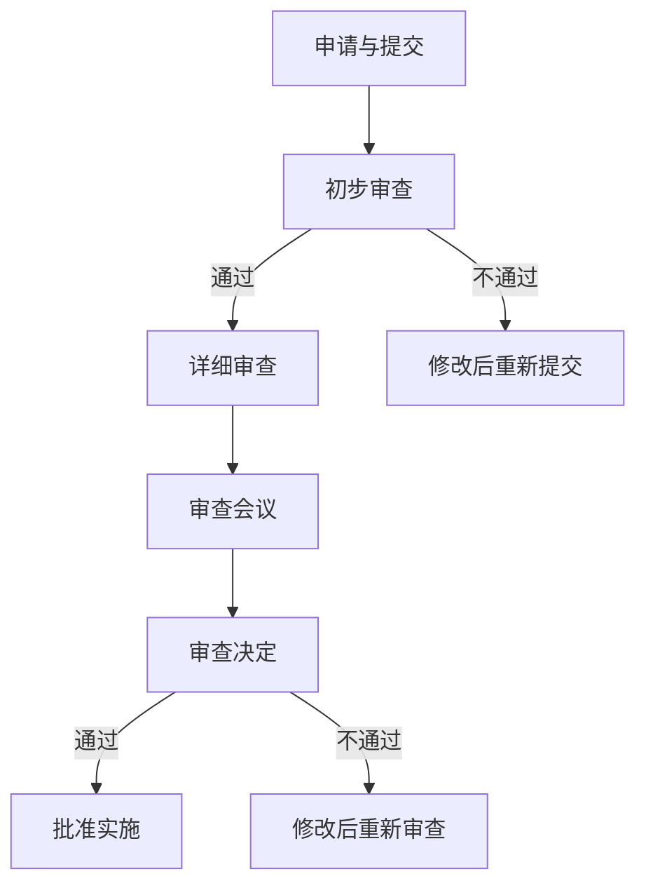

                 

# 《科学研究的伦理审查与世界可理解性的责任》

## 关键词
科学研究、伦理审查、世界可理解性、社会责任、科学传播、未来展望

## 摘要
本文深入探讨了科学研究的伦理审查与世界可理解性之间的紧密联系，以及科学家在此过程中承担的责任。文章首先概述了科学研究的伦理审查的定义、原则和应用，接着阐述了世界可理解性的概念及其重要性。随后，文章分析了伦理审查在提高科学成果透明性和公众信任中的作用，并探讨了科学家在科学传播和社会责任中的角色。最后，文章通过案例分析、未来展望和政策法规等方面，总结了伦理审查与可理解性的发展趋势，以及面临的挑战和机遇。

## 引言
科学研究是人类认识和改造世界的有力工具。然而，科学研究的伦理问题日益引起关注。科学家的行为不仅关系到研究的质量和可信度，还涉及社会伦理和道德责任。伦理审查作为一种制度，旨在确保科学研究在符合伦理规范的同时，对人类和环境产生积极影响。与此同时，科学研究的可理解性也是一个不容忽视的问题。科学成果如果不能被公众理解和接受，就难以产生应有的社会效益，甚至可能引发误解和恐慌。

在这个信息爆炸的时代，科学家的社会责任更加重大。他们不仅要进行高水平的科研工作，还需要有效地传播科学知识，提高公众的科学素养。本文旨在探讨科学研究的伦理审查与世界可理解性的责任，分析两者之间的相互关系，并提出科学家在新时代背景下面临的挑战和机遇。

## 第一部分：科学研究的伦理审查概述

### 1.1 科学研究的伦理问题

#### 1.1.1 伦理审查的定义与重要性

伦理审查（Ethical Review）是指对科学研究的伦理问题进行评估和监督的过程。它通常由独立的伦理委员会或审查委员会负责，以确保研究过程中的参与者权益得到保护，研究的道德和伦理标准得到遵守。伦理审查的定义可以从以下几个方面理解：

1. **保护参与者权益**：伦理审查的首要目标是确保研究过程中的参与者，如人类受试者、动物等，其权益和福祉不受损害。这包括确保参与者在知情同意的基础上自愿参与研究，研究过程中不会遭受不必要的伤害或风险。

2. **遵守道德规范**：科学研究必须遵循一定的道德原则，如尊重个人尊严、避免伤害、公正对待等。伦理审查有助于确保研究者在设计、实施和报告研究过程中，始终坚持这些原则。

3. **提高研究质量**：伦理审查不仅关注研究过程中的道德问题，还能促进研究设计、数据收集和分析的透明性和规范性，从而提高研究质量。

伦理审查的重要性体现在以下几个方面：

- **保障参与者权益**：伦理审查为研究参与者提供了法律和道德的保护，确保其权益不受侵害。
- **提升研究可信度**：通过伦理审查，研究结果更具可信度，得到社会和学术界的认可。
- **规范科学研究**：伦理审查有助于推动科学研究规范化和标准化，提高整体研究水平。
- **促进科学传播**：伦理审查确保了科学研究成果的可信性和透明度，有利于科学知识的传播和应用。

#### 1.1.2 伦理审查的基本原则

伦理审查的基本原则包括以下几个方面：

1. **尊重个人自主权**：尊重参与者的自主决定权，确保其在知情同意的基础上自愿参与研究。
2. **无害原则**：研究过程应避免对参与者造成不必要的伤害，尽可能减少风险。
3. **公正原则**：研究设计应公平对待所有参与者，避免歧视和偏见。
4. **透明度原则**：研究过程应保持透明，确保参与者、公众和学术界能够了解研究的全貌。
5. **责任原则**：研究者应对研究过程和结果负责，确保研究的合法性和道德性。

#### 1.1.3 伦理审查的历史与现状

伦理审查制度起源于20世纪中叶。随着生物医学研究的快速发展，伦理问题日益突出。1964年，美国成立了第一个伦理审查委员会（Institutional Review Board, IRB），标志着伦理审查制度的诞生。随后，伦理审查在全球范围内得到推广和实施。

目前，伦理审查制度已广泛应用于各个科学研究领域，包括生物医学、社会科学、环境科学等。不同国家和地区的伦理审查制度在法律、标准和程序上存在差异，但基本原则和目标相似。

在中国，伦理审查制度也逐渐完善。2007年，中国科学技术部发布了《科学技术研究伦理审查办法（试行）》，对科学研究的伦理审查进行了规范。随后，各大高校和科研机构纷纷建立了伦理审查委员会，确保研究的合法性和道德性。

#### 1.2 伦理审查在科学研究中的应用

伦理审查在科学研究中的应用范围广泛，涵盖了生物医学、社会科学和环境科学等多个领域。

##### 1.2.1 生物医学研究的伦理审查

生物医学研究是伦理审查的重点领域之一。伦理审查在生物医学研究中的应用主要体现在以下几个方面：

1. **临床试验**：伦理审查确保临床试验的设计、实施和报告符合伦理原则，保护受试者权益。

2. **基因编辑**：随着基因编辑技术的发展，伦理审查对基因编辑研究进行了严格评估，以确保研究不违背道德和伦理标准。

3. **动物实验**：伦理审查对动物实验进行了规范，要求研究者尽量减少动物痛苦，确保动物福利。

##### 1.2.2 社会科学研究的伦理审查

社会科学研究涉及人类行为、社会关系、文化等复杂因素，伦理审查在其中发挥着重要作用：

1. **隐私保护**：社会科学研究往往涉及个人隐私，伦理审查确保研究者的数据处理和保护隐私的措施符合伦理规范。

2. **知情同意**：社会科学研究要求研究者充分告知参与者研究的目的、过程和潜在风险，确保参与者在知情同意的基础上参与研究。

3. **避免偏见**：伦理审查关注研究设计和方法，确保研究结果公正、客观，避免歧视和偏见。

##### 1.2.3 环境科学研究中的伦理审查

环境科学研究关注人类与自然环境的关系，伦理审查在其中发挥着重要作用：

1. **环境影响评估**：伦理审查对环境科学研究的潜在环境影响进行评估，确保研究不破坏生态平衡，保护环境。

2. **资源利用**：伦理审查关注研究对自然资源的使用和消耗，要求研究者尽可能节约资源，减少浪费。

3. **可持续发展**：伦理审查推动环境科学研究向可持续发展方向迈进，确保研究符合可持续发展的伦理原则。

#### 1.3 伦理审查流程

伦理审查流程主要包括以下几个阶段：

##### 1.3.1 申请与审查

1. **申请准备**：研究者需准备伦理审查申请材料，包括研究计划、知情同意书、数据收集和处理方法等。

2. **提交申请**：研究者将伦理审查申请提交给伦理审查委员会。

3. **审查会议**：伦理审查委员会召开会议，对申请材料进行审查。

4. **审查决定**：伦理审查委员会根据审查结果做出批准、修改或拒绝的决定。

##### 1.3.2 批准与监督

1. **批准通知书**：伦理审查委员会向研究者发出批准通知书，明确研究开展的条件和限制。

2. **定期监督**：伦理审查委员会对已批准的研究进行定期监督，确保研究按照批准方案进行。

3. **审查报告**：研究结束后，研究者需提交伦理审查报告，总结研究过程和结果。

##### 1.3.3 伦理问题的应对与解决

1. **伦理投诉**：伦理审查委员会接受关于研究伦理问题的投诉，进行调查和处理。

2. **伦理培训**：伦理审查委员会对研究者进行伦理培训，提高其伦理意识和道德水平。

3. **伦理咨询**：伦理审查委员会提供伦理咨询服务，帮助研究者解决伦理问题。

### 1.4 伦理审查的实际案例

以下是一些伦理审查的实际案例，以展示伦理审查在科学研究中的应用和效果：

1. **基因编辑婴儿事件**：2018年，中国科学家贺建奎宣称成功利用基因编辑技术生育了基因编辑婴儿，引发国际社会震惊和伦理争议。该事件暴露了伦理审查制度的不足，引发了关于基因编辑伦理的广泛讨论。

2. **临床试验中的受试者权益保护**：某制药公司在开展临床试验时，未能充分保护受试者权益，导致受试者遭受严重伤害。这一案例促使各国加强伦理审查，确保临床试验的合规性和安全性。

3. **社会科学研究的隐私保护**：某研究者在其研究中未经参与者同意，泄露了参与者的个人信息，导致参与者隐私受到侵犯。该事件引发了关于社会科学研究隐私保护的讨论，推动了伦理审查制度的完善。

### 1.5 伦理审查的现状与挑战

尽管伦理审查在科学研究中的作用日益重要，但当前仍面临一些挑战：

1. **审查标准不一致**：不同国家和地区、不同研究领域的伦理审查标准存在差异，导致审查结果的公正性和一致性受到影响。

2. **审查过程繁琐**：伦理审查流程复杂，耗时较长，有时影响科研进度。

3. **审查资源不足**：伦理审查委员会人手不足，难以满足大量科研项目的审查需求。

4. **公众参与不足**：伦理审查中缺乏公众参与，可能导致审查结果与公众期望不符。

5. **伦理意识薄弱**：一些研究者缺乏伦理意识，未能充分认识到伦理审查的重要性。

### 1.6 伦理审查的未来发展趋势

面对挑战，伦理审查在未来将呈现以下发展趋势：

1. **标准化**：推动伦理审查制度的标准化，提高审查结果的公正性和一致性。

2. **信息化**：利用信息技术，提高伦理审查的效率和透明度。

3. **公众参与**：加强公众参与，提高伦理审查的民主性和科学性。

4. **跨学科合作**：促进伦理审查与法学、心理学、社会学等学科的交叉融合，提高审查水平。

5. **持续培训**：加强对研究者的伦理培训，提高其伦理意识和道德水平。

通过以上分析，我们可以看到，伦理审查在科学研究中的重要性不容忽视。伦理审查不仅保障了研究的合法性和道德性，也促进了科学研究的透明性和公众信任。在未来的发展中，伦理审查将继续发挥重要作用，推动科学研究的可持续发展。

## 第二部分：世界可理解性的责任

### 2.1 可理解性的概念

#### 2.1.1 可理解性的定义

科学研究的可理解性（Comprehensibility）是指科学知识、理论、方法和技术等被社会大众，包括非专业人士，理解和接受的程度。它不仅涉及科学知识的普及程度，还包括公众对科学方法和价值观的认知。科学研究的可理解性是一个多维度的概念，可以从以下几个方面理解：

1. **知识的普及性**：科学研究的可理解性首先体现在知识普及的程度上。科学知识应该尽可能地被广大民众所理解和接受，以便发挥其在社会各个领域的积极作用。

2. **方法的透明度**：科学研究的可理解性还涉及到研究方法的透明度。研究者应该公开研究的设计、数据收集和分析过程，使公众能够理解研究的科学性和可靠性。

3. **价值观的认同**：科学研究的可理解性还要求公众对科学的价值观和伦理原则有认同感。这有助于构建社会对科学事业的信任，促进科学知识的传播和应用。

#### 2.1.2 可理解性的重要性

科学研究的可理解性具有重要意义，主要体现在以下几个方面：

1. **促进科学普及**：可理解性是科学知识普及的前提。只有当科学知识容易被大众理解时，科学普及活动才能顺利进行，从而提高公众的科学素养。

2. **增强公众信任**：当公众能够理解科学研究的过程和结果时，他们对科学的信任度会提高。这有助于增强社会对科学研究的支持，推动科学事业的持续发展。

3. **推动科技创新**：公众对科学的理解和支持是科技创新的重要推动力。当公众对科学有较高的认同感时，他们更愿意参与科学创新活动，为科技创新提供资源和智力支持。

4. **应对社会挑战**：科学研究在应对社会挑战方面发挥着重要作用。可理解性有助于公众更好地理解科学研究成果，从而在应对气候变化、环境污染、公共健康等社会问题时，采取更加科学和有效的措施。

#### 2.1.3 科学成果的可理解性要求

为了提高科学成果的可理解性，科学研究需要满足以下要求：

1. **简洁明了**：科学研究成果应该用简单、易懂的语言进行表达，避免使用过于专业和复杂的术语，使非专业人士能够轻松理解。

2. **透明公开**：研究过程和结果应该透明公开，包括研究设计、数据收集和分析方法等。这有助于公众了解研究的真实情况和科学性。

3. **互动交流**：研究者应积极参与科学传播活动，与公众进行互动交流，解答他们的疑问，提高公众对科学知识的理解和认同。

4. **多样化传播**：科学传播应该采用多样化、多渠道的方式进行，如科普书籍、电视节目、网络媒体等，以满足不同人群的需求。

### 2.2 科学传播与公众理解

#### 2.2.1 科学传播的途径

科学传播是提高科学研究可理解性的关键环节。科学传播的途径多种多样，包括以下几种：

1. **大众媒体**：大众媒体如报纸、杂志、电视、广播等是科学传播的主要途径。这些媒体具有广泛的受众基础，能够迅速将科学知识传播给公众。

2. **科普书籍**：科普书籍是科学传播的传统途径之一，通过深入浅出的文字，将科学知识系统地介绍给读者。

3. **网络媒体**：随着互联网的普及，网络媒体成为科学传播的重要渠道。通过网络平台，科学知识可以迅速传播，实现全球范围内的资源共享。

4. **科普活动**：科普活动如科普讲座、科学展览、科普实验等是面对面传播科学知识的有效方式。这些活动能够激发公众对科学的兴趣，提高他们的科学素养。

5. **科学教育**：科学教育是科学传播的基础，通过学校教育、成人教育和继续教育，使公众接受系统的科学知识培训。

#### 2.2.2 科学传播的目标

科学传播的目标主要包括以下几个方面：

1. **普及科学知识**：科学传播的首要目标是普及科学知识，使公众了解科学的基本原理和方法，提高他们的科学素养。

2. **促进科技创新**：科学传播有助于激发公众的科技创新意识，推动科学技术的进步。

3. **提高公众参与度**：科学传播鼓励公众参与科学研究，提高他们的科学素质和创新能力。

4. **构建科学价值观**：科学传播传播科学的价值观和伦理原则，提高公众的科学伦理意识。

5. **促进社会发展**：科学传播有助于解决社会问题，提高社会的整体发展水平。

#### 2.2.3 提高公众科学素养的策略

为了提高公众科学素养，可以采取以下策略：

1. **加强科普教育**：将科普知识纳入学校课程，提高学生的科学素养。同时，加强对成人科普教育的支持，提高他们的科学知识水平。

2. **利用大众媒体**：充分利用大众媒体，如电视、广播、报纸、杂志等，开展科普宣传，提高公众的科学意识。

3. **开展科普活动**：定期举办科普讲座、科学展览、科普实验等活动，激发公众对科学的兴趣。

4. **加强网络科普**：利用互联网平台，如科普网站、微信公众号、短视频等，开展科学传播，实现科学知识的广泛传播。

5. **鼓励科学创新**：鼓励公众参与科学创新活动，提高他们的科学实践能力和创新能力。

6. **加强科学伦理教育**：在科学传播中融入科学伦理教育，提高公众的科学伦理意识，促进科学事业的健康发展。

通过科学传播与公众理解，可以提升公众的科学素养，促进科学研究成果的广泛应用，为社会的发展和进步做出贡献。同时，科学家在科学传播中承担着重要责任，他们需要不断创新传播方式，提高科学成果的可理解性，让科学更好地服务于人类社会。

### 2.3 科学家的社会责任

#### 2.3.1 科学家的社会角色

科学家在社会中扮演着多重角色，这些角色不仅限于实验室里的研究工作，还涉及更广泛的社会责任。了解科学家的社会角色有助于我们更好地理解他们在提高科学研究可理解性方面的职责。

1. **研究者**：科学家的首要角色是进行科学研究，通过实验、观察和理论分析，探索自然界的奥秘。他们在推动科学进步和技术创新方面发挥着关键作用。

2. **知识传播者**：科学家不仅是知识的创造者，也是知识的传播者。他们通过发表学术论文、撰写科普文章、参与科学教育等方式，将科学知识传递给公众。

3. **政策顾问**：科学家在制定政策和规划时提供科学依据和建议。他们通过将研究成果转化为政策建议，帮助政府和社会解决实际问题。

4. **社会活动家**：许多科学家积极参与社会事务，关注环境保护、公共卫生、能源政策等社会问题。他们通过倡导科学理念，推动社会变革。

5. **创新推动者**：科学家通过创新研究，推动技术进步和产业发展，为社会创造更多的就业机会和财富。

#### 2.3.2 科学家的道德义务

科学家的道德义务是其社会角色的重要组成部分。科学家的道德义务主要体现在以下几个方面：

1. **诚信**：科学家应保持诚信，确保研究过程和结果的真实性和可靠性。他们不应隐瞒或篡改数据，应诚实地报告研究结果。

2. **责任**：科学家应对其研究对社会和环境可能产生的影响负责。他们在进行研究时，应考虑到可能的负面影响，并采取预防措施。

3. **公正**：科学家在研究过程中应保持公正，不偏不倚地处理数据和证据。他们应避免因个人利益而影响研究的客观性。

4. **尊重**：科学家应尊重他人的研究成果和知识产权，遵守学术规范，不剽窃他人成果。

5. **透明**：科学家应公开其研究过程和结果，接受公众和同行的监督。他们应通过科普活动，提高公众对科学研究的理解。

#### 2.3.3 科学家的社会责任实践

科学家在履行社会责任方面有许多实际做法，以下是一些具体的实践：

1. **科普活动**：科学家可以通过撰写科普文章、举办科普讲座、参与电视节目等方式，将科学知识传播给公众，提高公众的科学素养。

2. **社会服务**：科学家可以参与公共事务，如参与政策咨询、提供技术咨询、参与环保活动等，为社会发展和进步贡献力量。

3. **科研伦理培训**：科学家可以参与科研伦理培训，提高其伦理意识和道德水平，确保研究的合法性和道德性。

4. **科学教育**：科学家可以参与科学教育，如担任校外辅导员、参与科学竞赛指导等，激发青少年的科学兴趣和创新能力。

5. **国际合作**：科学家可以通过国际合作，分享研究成果，推动全球科学事业的共同进步。

通过履行社会责任，科学家不仅推动了科学事业的发展，也为社会的进步和繁荣做出了重要贡献。在提高科学研究可理解性方面，科学家扮演着关键角色，他们通过多种形式的实践，将科学知识传递给公众，提高公众的科学素养，推动科学成果的广泛应用。

## 第三部分：伦理审查与可理解性的关联

### 3.1 伦理审查在提高科学可理解性中的作用

伦理审查在科学研究中发挥着重要作用，不仅确保研究的合法性和道德性，还在提高科学可理解性方面具有独特的贡献。以下是伦理审查在提高科学可理解性中的几个关键作用：

#### 3.1.1 伦理审查如何促进科学成果的透明性

1. **信息公开**：伦理审查要求研究者公开研究的设计、方法、数据和分析结果，确保研究过程透明，使公众能够了解研究的全貌。

2. **数据保护**：伦理审查关注研究数据的保护，确保数据的真实性、完整性和保密性，提高研究结果的可靠性和可信度。

3. **规范报告**：伦理审查委员会对研究结果的报告进行审查，确保报告符合学术规范，用清晰、易懂的语言传达研究成果。

#### 3.1.2 伦理审查对公众信任的影响

1. **提高信任度**：通过严格的伦理审查，科学研究成果更具可信性，有助于提高公众对科学研究的信任度。

2. **消除疑虑**：伦理审查能够及时发现和解决研究中的伦理问题，消除公众对研究的疑虑，增强公众对科学成果的接受度。

3. **促进合作**：伦理审查建立了科学研究的道德标准，促进了科研机构、研究人员和公众之间的合作，共同推动科学进步。

#### 3.1.3 伦理审查与科学传播的结合

1. **科普支持**：伦理审查委员会可以参与科学传播活动，为科普工作提供伦理指导和监督，提高科普内容的准确性和权威性。

2. **透明传播**：伦理审查确保科学传播过程的透明性，使科普内容更加真实可信，提高公众的科学素养。

3. **互动交流**：伦理审查鼓励科研人员与公众进行互动交流，解答公众疑问，增强科普活动的互动性和有效性。

### 3.2 伦理审查与可理解性的实践

在实践过程中，伦理审查与科学可理解性紧密结合，通过以下措施，提高科学研究对社会大众的友好度：

#### 3.2.1 伦理审查流程中的沟通与教育

1. **研究者的培训**：在伦理审查流程中，加强对研究者的培训，提高他们的伦理意识和道德水平，确保研究符合伦理要求。

2. **伦理意识的提升**：通过培训和研讨会，提高研究者和伦理审查委员会成员的伦理审查能力，确保审查过程的科学性和公正性。

3. **公众参与**：鼓励公众参与伦理审查，通过听证会、调查问卷等形式，听取公众意见，使伦理审查更贴近社会需求。

#### 3.2.2 科学家的伦理教育与培训

1. **伦理课程设置**：在科学家的教育和培训中，增加伦理课程，培养他们的伦理意识和道德素养。

2. **案例教学**：通过分析真实案例，让科学家了解伦理审查的重要性和实践方法，提高他们处理伦理问题的能力。

3. **持续教育**：定期对科学家进行伦理教育，更新他们的伦理知识和技能，以适应不断变化的社会环境和科研需求。

#### 3.2.3 公众参与伦理审查的路径

1. **公众咨询委员会**：建立公众咨询委员会，邀请公众代表参与伦理审查，提供多元化的视角和建议。

2. **公众参与平台**：利用互联网和社交媒体平台，建立公众参与伦理审查的渠道，收集公众意见和反馈。

3. **公众监督机制**：建立公众监督机制，确保伦理审查过程的公开透明，接受社会监督。

### 3.3 案例分析

以下通过实际案例，分析伦理审查与科学可理解性的关联：

#### 3.3.1 成功案例分析

1. **案例背景**：某制药公司在开发新药时，主动接受伦理审查，并通过科普活动向公众宣传新药的研发过程和预期疗效。

2. **伦理审查**：伦理审查委员会对新药研发过程进行了全面审查，确保研究符合伦理规范，研究成果透明公开。

3. **科学传播**：制药公司通过科普书籍、电视节目和社交媒体平台，向公众普及新药知识，提高公众对新药的认知和接受度。

4. **效果评估**：通过伦理审查和科学传播，新药得到了公众的广泛认可，加速了新药的研发和上市进程，提高了制药公司的市场竞争力。

#### 3.3.2 失败案例分析

1. **案例背景**：某基因编辑研究团队未接受伦理审查，私自进行基因编辑实验，引发国际社会震惊和伦理争议。

2. **伦理审查缺失**：由于缺乏伦理审查，研究团队未充分评估研究对人类和生物多样性的潜在影响，导致研究过程和结果缺乏透明性。

3. **公众反应**：基因编辑实验引发公众恐慌，认为研究违反伦理原则，质疑科学家的道德和责任感。

4. **反思与改进**：该案例暴露了伦理审查的重要性，促使各国加强伦理审查制度，并加强对科学家的伦理教育，提高研究过程的透明度和公众信任。

#### 3.3.3 案例分析与反思

1. **伦理审查的必要性**：通过成功和失败案例的对比，我们可以看到伦理审查在科学研究中的重要性。伦理审查不仅保障了研究的合法性和道德性，还有助于提高科学成果的可理解性和公众信任。

2. **科学传播的责任**：科学家在伦理审查过程中，不仅要关注研究的道德和伦理问题，还要积极参与科学传播，提高公众对科学研究的理解和支持。

3. **公众参与的重要性**：伦理审查和科学传播都需要公众的参与，通过多元化的视角和意见，提高审查和传播的公正性和有效性。

通过案例分析，我们可以更深入地理解伦理审查与科学可理解性之间的紧密关联，认识到科学家在提高科学成果透明度和公众信任方面的责任。在未来的科学研究中，伦理审查和科学传播将更加紧密地结合，共同推动科学事业的发展。

### 3.4 伦理审查与可理解性的未来展望

面对科技日新月异的发展，伦理审查和科学可理解性在未来的发展中将面临新的挑战和机遇。以下是关于伦理审查与可理解性的未来展望：

#### 3.4.1 伦理审查的未来发展趋势

1. **全球化**：随着全球科研合作的加深，伦理审查将呈现全球化趋势。各国将加强伦理审查制度的对接和协调，推动国际伦理审查标准的统一。

2. **智能化**：利用人工智能和大数据技术，提高伦理审查的效率和准确性。通过智能审核系统，对研究项目进行快速评估，减少人为干预，提高审查的公正性。

3. **多元化**：伦理审查将更加注重多元化和包容性，关注不同文化和社会背景下的伦理问题，提高审查的广泛性和适应性。

4. **公众参与**：加强公众参与伦理审查，通过多元化的渠道和方式，收集公众意见，提高伦理审查的民主性和科学性。

#### 3.4.2 科学可理解性的未来展望

1. **科普创新**：随着科技的发展，科普手段将更加多样化、互动化和智能化。虚拟现实、增强现实、互动游戏等新兴技术将广泛应用于科普活动，提高科学传播的吸引力和效果。

2. **跨学科合作**：科学可理解性将促进跨学科合作，结合教育学、心理学、传播学等学科，提高科学传播的针对性和有效性。

3. **社会参与**：科学可理解性将更加注重社会参与，鼓励公众参与科学研究和科学传播，提高公众的科学素养和创新意识。

4. **国际化**：科学可理解性将向国际化发展，通过国际合作，分享科学知识和经验，提高全球科学素养。

#### 3.4.3 伦理审查与可理解性的融合

1. **共同目标**：伦理审查和科学可理解性具有共同的目标，即保障科研的合法性和道德性，提高公众对科学的理解和支持。

2. **协同发展**：未来，伦理审查和科学可理解性将更加紧密地融合，通过相互促进，实现共同发展。伦理审查为科学可理解性提供道德和伦理保障，科学可理解性为伦理审查提供公众信任和社会支持。

3. **政策支持**：政府和科研机构将加强对伦理审查和科学可理解性的政策支持，推动相关法律法规的制定和实施，为两者的发展提供制度保障。

通过未来的发展，伦理审查和科学可理解性将共同推动科学事业的进步，为社会的繁荣和人类的福祉做出更大贡献。

## 第四部分：未来展望

### 4.1 伦理审查与可理解性的发展趋势

在科技飞速发展的今天，伦理审查与科学可理解性的关系愈发紧密。未来，两者将在全球范围内呈现出以下发展趋势：

#### 4.1.1 未来伦理审查的趋势

1. **国际化与标准化**：随着全球化进程的加速，各国科研合作日益增多，伦理审查也将向国际化与标准化方向发展。国际社会将努力推动伦理审查标准的统一，确保不同国家和地区在伦理审查方面的协调与一致。

2. **智能化与数字化**：人工智能和大数据技术的广泛应用，将使伦理审查更加智能化和数字化。通过智能审核系统和大数据分析，可以提高伦理审查的效率和准确性，减少人为错误。

3. **公众参与**：未来，公众参与将更加深入和广泛。伦理审查委员会将更加注重公众意见，通过多元化渠道和方式，收集公众对科研项目的反馈，提高审查的民主性和透明度。

4. **可持续发展**：伦理审查将更加关注科研活动对环境和社会的影响，推动科研活动向可持续发展的方向迈进。这包括对自然资源的使用、环境影响评估以及社会责任等方面。

#### 4.1.2 未来科学可理解性的趋势

1. **科普创新**：未来，科普手段将更加多样化、互动化和智能化。虚拟现实、增强现实、互动游戏等新兴技术将广泛应用于科普活动，提高科学传播的吸引力和效果。

2. **跨学科融合**：科学可理解性将促进跨学科合作，结合教育学、心理学、传播学等学科，提高科学传播的针对性和有效性。

3. **社会参与**：科学可理解性将更加注重社会参与，鼓励公众参与科学研究和科学传播，提高公众的科学素养和创新意识。

4. **国际化**：科学可理解性将向国际化发展，通过国际合作，分享科学知识和经验，提高全球科学素养。

#### 4.1.3 伦理审查与可理解性的融合

1. **共同目标**：伦理审查与科学可理解性具有共同的目标，即保障科研的合法性和道德性，提高公众对科学的理解和支持。

2. **协同发展**：未来，伦理审查与科学可理解性将更加紧密地融合，通过相互促进，实现共同发展。伦理审查为科学可理解性提供道德和伦理保障，科学可理解性为伦理审查提供公众信任和社会支持。

3. **政策支持**：政府和科研机构将加强对伦理审查和科学可理解性的政策支持，推动相关法律法规的制定和实施，为两者的发展提供制度保障。

### 4.2 政策与法规

#### 4.2.1 国际法规与标准

在国际层面，伦理审查与科学可理解性已逐步纳入法律体系。例如，《世界人类基因组组织宣言》和《生物多样性公约》等国际法律文件，对科研活动中的伦理审查和可持续性提出了明确要求。这些法规和标准的制定，有助于推动全球科研活动的规范化和标准化，提高科研的道德水平和公众信任度。

#### 4.2.2 国家政策与法规

各国政府也高度重视伦理审查与科学可理解性的政策制定。例如，美国《国家生物伦理法》、欧盟《人类基因组与生物多样性保护法》等，对伦理审查和科研活动的规范进行了详细规定。这些法规和政策为科研活动提供了法律保障，促进了科研的健康发展。

#### 4.2.3 行业规范与自律

除了国家政策和国际法规，科研机构和学术团体也在积极制定行业规范和自律机制。例如，美国医学研究协会（AMRA）和英国皇家学会（RSA）等机构，制定了详细的伦理审查指南和科普传播标准。这些行业规范和自律机制，有助于提高科研活动的道德水平和科学传播的质量。

### 4.3 未来挑战与机遇

在伦理审查与科学可理解性的发展过程中，未来将面临一系列挑战与机遇。

#### 4.3.1 挑战分析

1. **审查标准不一致**：不同国家和地区、不同研究领域的伦理审查标准存在差异，可能导致审查结果的公正性和一致性受到影响。

2. **审查资源不足**：随着科研项目的增多，伦理审查资源（如人员、时间和资金）不足，可能影响审查效率和公正性。

3. **公众参与不足**：伦理审查中缺乏公众参与，可能导致审查结果与公众期望不符，影响公众对科研的信任。

4. **科技快速发展**：科技的发展带来了新的伦理问题，如基因编辑、人工智能等，如何适应和解决这些新问题，是未来的一大挑战。

#### 4.3.2 机遇探讨

1. **国际合作**：全球化背景下，国际合作将促进伦理审查和科学可理解性的发展。通过国际交流和合作，可以借鉴先进经验，提高审查和传播的质量。

2. **科技创新**：科技的快速发展为伦理审查和科学可理解性提供了新的手段和平台。利用人工智能、大数据等新技术，可以提升审查和传播的效率。

3. **公众参与**：随着公众科学素养的提高，公众参与将更加积极，有助于提高审查的民主性和科学性，增强公众对科学的信任。

4. **政策支持**：政府和社会对伦理审查和科学可理解性的重视程度不断提高，未来将加大对相关领域的政策支持，推动两者的发展。

#### 4.3.3 应对策略与建议

1. **加强国际合作**：加强国际间的交流与合作，推动伦理审查和科学可理解性的标准化和国际化。

2. **完善法律法规**：制定和完善相关法律法规，为伦理审查和科学可理解性提供法律保障。

3. **提高审查资源**：加大对伦理审查资源的投入，包括人员、资金和时间，提高审查效率和公正性。

4. **加强公众参与**：鼓励公众参与伦理审查和科学传播，通过多元化渠道和方式，提高公众的参与度和满意度。

5. **培训与教育**：加强对研究者和伦理审查委员会成员的培训，提高其伦理意识和道德水平。

通过以上应对策略和措施，可以应对未来伦理审查与科学可理解性发展中的挑战，抓住机遇，推动两者共同发展，为科学事业的繁荣和人类社会的进步做出贡献。

## 附录

### A.1 术语解释

**伦理审查（Ethical Review）**：对科学研究中的伦理问题进行评估和监督的过程，旨在确保研究符合道德和伦理标准。

**可理解性（Comprehensibility）**：科学知识、理论、方法和技术等被社会大众理解和接受的程度。

**知情同意（Informed Consent）**：研究参与者自愿参与研究，并在充分了解研究目的、过程和潜在风险后签署同意书。

**伦理委员会（Ethical Committee）**：负责对研究项目进行伦理审查的独立机构。

**科学传播（Science Communication）**：将科学知识、理论和方法传递给公众的过程。

**科普（Popular Science）**：以通俗易懂的方式传播科学知识，提高公众科学素养的活动。

### A.2 参考文献与资料

[1] 《世界人类基因组组织宣言》  
[2] 《生物多样性公约》  
[3] 美国医学研究协会（AMRA）伦理审查指南  
[4] 英国皇家学会（RSA）科普传播标准  
[5] 《科学技术研究伦理审查办法（试行）》

### A.3 伦理审查流程图

### A.4 科学传播案例选编

**案例1：** 某制药公司通过科普书籍、电视节目和社交媒体平台，向公众普及新药知识，提高公众对新药的认知和接受度。

**案例2：** 科学家通过科普讲座、科学展览和科普实验，向公众传播科学知识，激发青少年的科学兴趣和创新能力。

**案例3：** 环境科学家通过撰写科普文章、参与环保活动和举办科普讲座，提高公众对环境保护的认识和参与度。

通过以上附录内容，读者可以更深入地了解伦理审查与科学可理解性的相关术语、法律法规以及实际操作流程，为科学研究和社会实践提供参考。

## 作者信息

**作者：** AI天才研究院/AI Genius Institute & 禅与计算机程序设计艺术 /Zen And The Art of Computer Programming

感谢您的阅读，希望本文对您在科学研究、伦理审查和科学传播领域的理解与实践有所帮助。如有任何问题或建议，请随时与我们联系。我们将竭诚为您服务。

