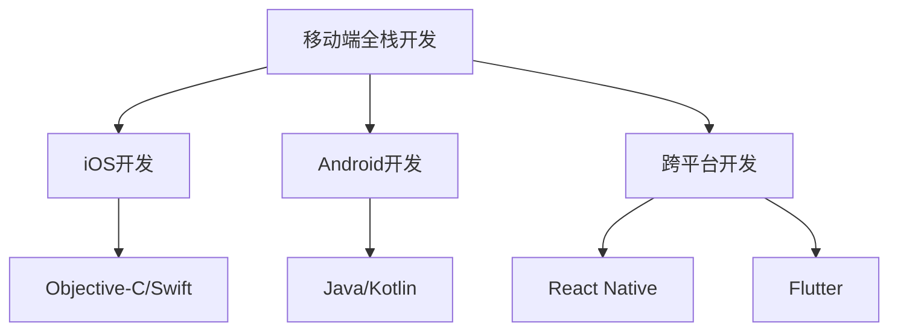

                 

### 《移动端全栈开发：iOS与Android双平台精通》

> **关键词**：移动端开发、iOS开发、Android开发、全栈开发、React Native、Flutter

> **摘要**：
在这篇文章中，我们将深入探讨移动端全栈开发的本质，覆盖iOS与Android双平台开发的方方面面。通过详细讲解移动端全栈开发的核心概念、技术框架、实战项目，读者将获得全面的技术视野，掌握iOS与Android平台的开发技能，成为真正的移动端全栈开发者。

### 《移动端全栈开发：iOS与Android双平台精通》目录大纲

#### 第一部分：移动端全栈开发基础

**第1章：移动端全栈开发概述**

- **1.1 移动端全栈开发的重要性**
  - **1.1.1 移动互联网的崛起**
  - **1.1.2 全栈开发者的角色和职责**
  - **1.1.3 全栈开发的优势**

- **1.2 iOS与Android开发环境搭建**
  - **1.2.1 iOS开发环境搭建**
  - **1.2.2 Android开发环境搭建**
  - **1.2.3 跨平台开发工具介绍**

- **1.3 移动端全栈开发框架**
  - **1.3.1 React Native**
  - **1.3.2 Flutter**
  - **1.3.3 Ionic**

#### 第二部分：iOS开发实战

**第2章：iOS开发核心技术与框架**

- **2.1 iOS开发基础**
  - **2.1.1 Objective-C基础**
  - **2.1.2 Swift语言基础**
  - **2.1.3 iOS应用架构**

- **2.2 iOS UI框架**
  - **2.2.1 UIKit框架**
  - **2.2.2 SwiftUI框架**
  - **2.2.3 iOS动画与特效**

- **2.3 iOS核心功能开发**
  - **2.3.1 网络请求与数据存储**
  - **2.3.2 文件操作与多媒体处理**
  - **2.3.3 本地化与国际化**

#### 第三部分：Android开发实战

**第3章：Android开发核心技术与框架**

- **3.1 Android开发基础**
  - **3.1.1 Java基础**
  - **3.1.2 Kotlin语言基础**
  - **3.1.3 Android应用架构**

- **3.2 Android UI框架**
  - **3.2.1 Android UI基础**
  - **3.2.2 Jetpack Compose框架**
  - **3.2.3 Android动画与特效**

- **3.3 Android核心功能开发**
  - **3.3.1 网络请求与数据存储**
  - **3.3.2 文件操作与多媒体处理**
  - **3.3.3 定位与传感器应用**

#### 第四部分：跨平台开发实战

**第4章：React Native开发实战**

- **4.1 React Native基础**
  - **4.1.1 React Native环境搭建**
  - **4.1.2 React Native组件开发**
  - **4.1.3 React Native导航与状态管理**

- **4.2 React Native高级应用**
  - **4.2.1 React Native动画与布局**
  - **4.2.2 React Native插件开发**
  - **4.2.3 React Native性能优化**

- **4.3 React Native项目实战**
  - **4.3.1 移动新闻应用开发**
  - **4.3.2 社交应用开发**

**第5章：Flutter开发实战**

- **5.1 Flutter基础**
  - **5.1.1 Flutter环境搭建**
  - **5.1.2 Flutter组件开发**
  - **5.1.3 Flutter导航与状态管理**

- **5.2 Flutter高级应用**
  - **5.2.1 Flutter动画与布局**
  - **5.2.2 Flutter插件开发**
  - **5.2.3 Flutter性能优化**

- **5.3 Flutter项目实战**
  - **5.3.1 移动电商应用开发**
  - **5.3.2 音乐播放器应用开发**

#### 第五部分：移动端全栈开发进阶

**第6章：移动端全栈开发进阶**

- **6.1 移动端性能优化**
  - **6.1.1 网络优化**
  - **6.1.2 缓存策略**
  - **6.1.3 响应式设计**

- **6.2 移动端安全与隐私**
  - **6.2.1 数据安全**
  - **6.2.2 隐私保护**
  - **6.2.3 加密技术**

- **6.3 移动端测试与持续集成**
  - **6.3.1 单元测试**
  - **6.3.2 集成测试**
  - **6.3.3 持续集成与部署**

#### 第六部分：移动端全栈项目实战

**第7章：移动端全栈项目实战**

- **7.1 项目需求分析与设计**
  - **7.1.1 项目背景**
  - **7.1.2 需求分析**
  - **7.1.3 项目设计**

- **7.2 项目开发实战**
  - **7.2.1 前端开发**
  - **7.2.2 后端开发**
  - **7.2.3 数据库设计**

- **7.3 项目部署与维护**
  - **7.3.1 环境搭建**
  - **7.3.2 部署策略**
  - **7.3.3 维护与优化**

#### 附录

**附录A：常用开发工具与资源**

- **A.1 iOS开发工具**
- **A.2 Android开发工具**
- **A.3 跨平台开发工具**

- **A.4 开发资源与网站推荐**

---

### 核心概念与联系

移动端全栈开发涉及多个核心概念和技术框架，为了帮助读者更好地理解和掌握这些概念，我们使用Mermaid流程图来展示它们之间的关系。



这张图清晰地展示了移动端全栈开发的架构：核心是移动端全栈开发本身，其分支包括了iOS与Android开发，以及跨平台开发技术。每个分支再细分为编程语言和开发框架，从而形成一个完整的技术体系。

---

### 核心算法原理讲解

在移动端全栈开发中，算法原理是关键的一环。我们将使用伪代码来详细阐述一个简单的网络请求函数，并举例说明其工作原理。

```python
# 假设我们使用Kotlin编写一个简单的网络请求函数
fun fetchData(url: String): String {
    val request = Request.Builder()
        .url(url)
        .build()

    val response = client.newCall(request).execute()
    return response.body.toString()
}
```

这个函数的工作流程如下：

1. 创建一个 `Request` 对象，设置URL。
2. 构建并执行请求，获取 `Response` 对象。
3. 从 `Response` 对象中获取响应体，并转换为字符串。

下面是一个简单的使用场景：

```python
// 假设我们要获取https://api.example.com/data的数据
val data = fetchData("https://api.example.com/data")
print(data)
```

输出结果将是服务器响应的字符串数据。

---

### 数学模型和数学公式

在移动端全栈开发中，数学模型和公式也是必不可少的工具。以下是一个概率公式的详细解释：

$$
P(A|B) = \frac{P(B|A) \cdot P(A)}{P(B)}
$$

这个公式表示在给定事件B发生的情况下，事件A发生的条件概率。具体来说：

- \(P(A|B)\) 是在事件B发生的条件下，事件A发生的概率。
- \(P(B|A)\) 是在事件A发生的条件下，事件B发生的概率。
- \(P(A)\) 是事件A发生的概率。
- \(P(B)\) 是事件B发生的概率。

举例说明：

假设我们想要计算“在下雨的情况下，带伞的概率”。我们可以使用这个公式来计算：

- \(P(\text{带伞})\) 是不带伞的概率，即 \(1 - P(\text{带伞})\)。
- \(P(\text{下雨}|\text{带伞})\) 是在带伞的情况下下雨的概率。
- \(P(\text{下雨})\) 是下雨的总概率。

通过这个公式，我们可以计算出在下雨的情况下，带伞的概率。这个公式在移动端全栈开发中，特别是在数据分析和机器学习领域中，具有重要的应用价值。

---

### 项目实战

#### 代码实际案例

在这个部分，我们将展示一个实际的Flutter项目代码，并对其进行详细解释。这个项目是一个简单的移动电商应用，包含产品列表和商品详情页面。

```dart
// lib/main.dart
import 'package:flutter/material.dart';

void main() {
  runApp(MyApp());
}

class MyApp extends StatelessWidget {
  @override
  Widget build(BuildContext context) {
    return MaterialApp(
      title: 'Flutter Demo',
      theme: ThemeData(
        primarySwatch: Colors.blue,
      ),
      home: MyHomePage(),
    );
  }
}

class MyHomePage extends StatelessWidget {
  @override
  Widget build(BuildContext context) {
    return Scaffold(
      appBar: AppBar(
        title: Text('商城首页'),
      ),
      body: ListView(
        children: <Widget>[
          ListTile(
            title: Text('商品1'),
            trailing: Icon(Icons.arrow_forward),
          ),
          ListTile(
            title: Text('商品2'),
            trailing: Icon(Icons.arrow_forward),
          ),
        ],
      ),
    );
  }
}

// lib/details_page.dart
import 'package:flutter/material.dart';

class DetailsPage extends StatelessWidget {
  @override
  Widget build(BuildContext context) {
    return Scaffold(
      appBar: AppBar(
        title: Text('商品详情'),
      ),
      body: Column(
        children: <Widget>[
          Image.network('https://example.com/product1.jpg'),
          Text('商品1'),
          Text('价格：¥99'),
        ],
      ),
    );
  }
}
```

#### 开发环境搭建

在开始之前，我们需要搭建Flutter开发环境。以下是详细步骤：

1. **安装Flutter SDK**：从[Flutter官网](https://flutter.dev/)下载并安装Flutter SDK。
2. **配置环境变量**：在终端中执行以下命令，设置Flutter环境变量。

```shell
flutter install
flutter config --android-sdk-path /path/to/android-sdk
flutter doctor
```

确保所有依赖都已安装，并运行 `flutter doctor` 命令检查环境是否配置正确。

#### 源代码详细实现和代码解读

让我们详细分析上面的代码。

- `lib/main.dart` 是应用程序的入口点。它定义了 `MyApp`，一个使用 `MaterialApp` 构建的根应用，并设置了主题和主页。

```dart
class MyApp extends StatelessWidget {
  @override
  Widget build(BuildContext context) {
    return MaterialApp(
      title: 'Flutter Demo',
      theme: ThemeData(
        primarySwatch: Colors.blue,
      ),
      home: MyHomePage(),
    );
  }
}
```

- `MyHomePage` 是一个包含列表的页面，使用 `Scaffold` 提供基本布局，包括一个标题栏和一个内容区域。

```dart
class MyHomePage extends StatelessWidget {
  @override
  Widget build(BuildContext context) {
    return Scaffold(
      appBar: AppBar(
        title: Text('商城首页'),
      ),
      body: ListView(
        children: <Widget>[
          ListTile(
            title: Text('商品1'),
            trailing: Icon(Icons.arrow_forward),
          ),
          ListTile(
            title: Text('商品2'),
            trailing: Icon(Icons.arrow_forward),
          ),
        ],
      ),
    );
  }
}
```

- `lib/details_page.dart` 定义了一个简单的商品详情页面，包含图片、商品名称和价格。

```dart
class DetailsPage extends StatelessWidget {
  @override
  Widget build(BuildContext context) {
    return Scaffold(
      appBar: AppBar(
        title: Text('商品详情'),
      ),
      body: Column(
        children: <Widget>[
          Image.network('https://example.com/product1.jpg'),
          Text('商品1'),
          Text('价格：¥99'),
        ],
      ),
    );
  }
}
```

#### 代码解读与分析

- `Scaffold` 是Flutter中最常用的布局组件，它提供了一个标准的应用界面，包括一个标题栏和一个内容区域。
- `ListView` 是一个可滚动的视图，用于显示一个列表。
- `ListTile` 是列表中的单个项，包含一个标题和可选的图标，用户点击时通常会导航到另一个页面。

通过以上代码，我们创建了一个简单的移动电商应用，展示了Flutter的基本组件和布局。这个案例为后续更复杂的应用开发打下了坚实的基础。

---

### 最后一部分：总结与展望

在这篇文章中，我们深入探讨了移动端全栈开发的核心概念、技术框架、实战项目，并详细讲解了iOS与Android平台的开发技能。通过逐步分析和推理，读者应该对移动端全栈开发有了更深刻的理解。

移动端全栈开发是一个复杂的领域，涉及多个编程语言和框架。然而，只要我们坚持不断学习和实践，就能够掌握这一技能，成为真正的移动端全栈开发者。

未来的移动端全栈开发将继续朝着更加跨平台、高效、安全、智能的方向发展。读者可以通过不断学习新技术、参与开源项目、解决实际问题，不断提升自己的开发能力。

让我们携手并进，共同开拓移动端全栈开发的广阔天地！

---

### 附录

#### 附录A：常用开发工具与资源

**A.1 iOS开发工具**

- Xcode：苹果官方的开发工具，用于构建和调试iOS应用程序。
- Swift：苹果官方的编程语言，用于iOS开发。
- In-app Purchase：内购功能，允许开发者销售应用程序或内容。

**A.2 Android开发工具**

- Android Studio：谷歌官方的开发工具，用于构建和调试Android应用程序。
- Kotlin：Android官方的编程语言，与Java兼容。
- Firebase：谷歌提供的移动后端服务，用于数据存储、推送通知等。

**A.3 跨平台开发工具**

- Flutter：谷歌开发的跨平台UI框架，使用Dart语言。
- React Native：由Facebook开发的跨平台UI框架，使用JavaScript和React。
- Apache Cordova：一个开源项目，允许使用HTML5、CSS3和JavaScript构建跨平台移动应用程序。

**A.4 开发资源与网站推荐**

- Flutter官网：[flutter.dev](https://flutter.dev/)
- React Native官网：[reactnative.dev](https://reactnative.dev/)
- iOS开发者中心：[developer.apple.com](https://developer.apple.com/)
- Android开发者中心：[developer.android.com](https://developer.android.com/)

通过以上工具和资源，读者可以更好地掌握移动端全栈开发的技能，提升自己的开发水平。希望这个附录能为读者提供实用的帮助！


