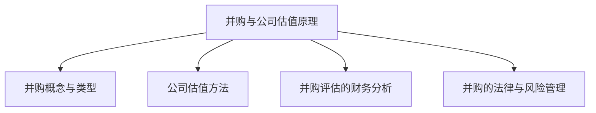

                 

# 引言

在当前高度竞争和快速变化的商业环境中，程序员和科技公司面临的决策不仅包括日常的开发任务，还包括重大的战略决策，如并购和公司出售。这两项活动不仅对公司的财务状况有深远影响，还可能决定公司的长期生存和竞争力。因此，程序员和科技公司的管理层需要具备评估并购机会和选择最佳出售时机的专业知识和技能。

本文旨在为程序员和科技公司提供一套系统性、逻辑清晰的评估并购机会和公司出售时机的方法。通过详细的案例分析、财务分析、法律风险管理、市场趋势分析以及实战技巧，本文将帮助读者理解并掌握并购和公司出售的核心原理和实践。

本文将分为四个主要部分：

1. **并购与公司估值基础**：介绍并购和公司估值的概述、原理与方法，以及财务分析和法律风险管理的具体内容。
2. **并购机会评估**：探讨市场趋势与竞争分析、目标公司筛选与评估、并购策略与谈判的具体方法。
3. **公司出售时机评估**：分析公司财务状况、市场时机以及出售流程与策略。
4. **并购与公司出售实战**：提供并购和出售项目的实施与监控、经验总结以及未来趋势与挑战。

通过逐步分析和推理，本文将帮助读者全面了解并购与公司出售的各个方面，从而做出更加明智和高效的决策。现在，让我们开始深入探讨并购与公司出售的核心概念。

---

**关键词：并购，公司估值，财务分析，法律风险管理，市场趋势，目标公司评估，并购策略，谈判，公司出售时机，财务状况，市场周期，出售流程，实战案例。**

**摘要：本文系统地介绍了程序员如何评估并购机会和公司出售时机。文章涵盖并购与公司估值的基础理论、财务分析、法律风险管理、市场趋势分析、目标公司评估、并购策略与谈判、公司财务状况评估、市场时机分析、出售流程与策略，以及并购与出售的实战经验总结。通过详细的案例分析和实战技巧，本文旨在帮助读者掌握并购与公司出售的核心知识和实践方法。**

---

## 《程序员如何评估并购机会与公司出售时机》目录大纲

### 第一部分：并购与公司估值基础

#### 第1章：并购与公司出售概述
1.1 并购的概念与类型
1.2 公司出售的动机与流程

#### 第2章：公司估值原理与方法
2.1 公司估值的基本概念
2.2 市场法估值
2.3 成本法估值
2.4 收益法估值

#### 第3章：并购评估的财务分析
3.1 财务报表分析
3.2 历史财务数据分析
3.3 预测财务分析

#### 第4章：并购的法律与风险管理
4.1 并购的法律框架
4.2 合同谈判与条款设置
4.3 并购风险识别与应对策略

#### 第5章：并购评估的案例研究
5.1 案例一：公司A收购公司B
5.2 案例二：公司C出售业务D

### 第二部分：并购机会评估

#### 第6章：市场趋势与竞争分析
6.1 行业趋势分析
6.2 竞争对手分析
6.3 市场机会与风险评估

#### 第7章：目标公司筛选与评估
7.1 目标公司筛选标准
7.2 目标公司评估方法
7.3 风险因素分析

#### 第8章：并购策略与谈判
8.1 并购策略制定
8.2 谈判策略与技巧
8.3 并购协议签订与执行

### 第三部分：公司出售时机评估

#### 第9章：公司财务状况评估
9.1 财务指标分析
9.2 财务状况评估方法
9.3 财务预测与调整

#### 第10章：市场时机分析
10.1 市场周期分析
10.2 行业前景预测
10.3 出售时机的选择

#### 第11章：公司出售流程与策略
11.1 出售流程
11.2 出售策略
11.3 卖方代理与估值服务

#### 第12章：公司出售案例研究
12.1 案例一：公司E的战略出售
12.2 案例二：公司F的分拆出售

### 第四部分：并购与公司出售实战

#### 第13章：并购与出售项目的实施与监控
13.1 项目实施计划
13.2 项目风险管理
13.3 项目监控与调整

#### 第14章：并购与出售经验总结
14.1 经验教训与建议
14.2 未来趋势与挑战
14.3 总结与展望

### 附录

#### 附录A：并购与公司出售相关法律法规
A.1 相关法律法规概述
A.2 重要法规解读

#### 附录B：并购与出售常用工具与方法
B.1 常用财务分析工具
B.2 市场研究与分析工具
B.3 谈判技巧与策略总结

#### 附录C：并购与出售案例精选
C.1 国内外并购案例精选
C.2 公司出售案例精选

#### 附录D：并购与出售相关资源推荐
D.1 专业书籍推荐
D.2 在线课程与培训资源
D.3 专业论坛与社群推荐

---

**核心概念与联系**：
- **并购与公司估值原理**：Mermaid 流�程图



**核心算法原理讲解**：
- **收益法估值**：伪代码

```python
# 收益法估值伪代码
def calculate_company_value(income, discount_rate):
    present_value = 0
    for future_year_income in income:
        present_value += future_year_income / ((1 + discount_rate) ** year)
    return present_value
```

**数学模型和数学公式 & 详细讲解 & 举例说明**：
- **折现率计算**：latex 公式

$$
\text{Discount Rate} = \frac{\text{Risk-Free Rate} + \beta \times (\text{Market Rate} - \text{Risk-Free Rate})}{1 + \text{Inflation Rate}}
$$

举例说明：
设无风险利率为4%，市场利率为8%，公司特有风险系数为1.5，通货膨胀率为2%，则折现率为6.2%。

---

## 并购与公司估值基础

并购（Merger and Acquisition，简称M&A）是企业扩展和资源整合的重要手段之一。通过并购，企业可以实现规模效应、技术整合、市场份额提升等战略目标。公司估值（Company Valuation）是并购过程中的核心环节，它决定了并购交易的价格和结构。本文将首先介绍并购与公司估值的基础概念、方法和流程，为后续章节的分析提供理论支持。

### 第1章：并购与公司出售概述

#### 1.1 并购的概念与类型

并购是指两家或两家以上的企业合并成为一家企业，以实现资源、技术、市场等方面的整合。根据并购双方的意愿和目的，并购可以分为以下几种类型：

1. **合并（Merger）**：两家企业合并成为一家，通常是基于平等的原则进行。
2. **收购（Acquisition）**：一家企业购买另一家企业的股份或资产，使其成为全资子公司或独立业务部门。
3. **联合（Joint Venture）**：两家或多家企业共同出资、经营某项业务，但保持各自的独立运营。
4. **重组（Restructuring）**：企业通过并购等方式改变其组织结构、业务模式等，以提升运营效率和竞争力。

#### 1.2 公司出售的动机与流程

公司出售（Company Sale）是企业退出市场或进行战略调整的一种方式。公司出售的动机可能包括：

1. **财务需求**：企业需要资金进行投资、偿还债务或改善财务状况。
2. **业务调整**：企业希望通过出售某些业务单元来专注于核心业务。
3. **市场机会**：企业看到更好的发展前景，希望通过出售获取资本用于新的投资。

公司出售的一般流程包括：

1. **初步评估**：评估公司财务状况、市场价值、潜在买家等。
2. **寻找买家**：通过中介机构、行业会议、网络平台等方式寻找合适的买家。
3. **谈判与签约**：与买家进行谈判，达成初步协议，签署意向书。
4. **尽职调查**：买家对公司的财务、法律、运营等方面进行详细的调查。
5. **交易完成**：完成所有法律手续，签署正式协议，交易完成。

### 第2章：公司估值原理与方法

公司估值是确定企业价值的关键步骤，常用的估值方法包括市场法、成本法和收益法。

#### 2.1 公司估值的基本概念

公司估值是指通过评估企业的资产、收益、市场等因素来确定企业的市场价值。公司估值的重要性在于：

1. **并购交易定价**：为公司并购交易提供合理的价格参考。
2. **投资决策**：为投资者提供企业价值的评估，辅助投资决策。
3. **战略规划**：为企业的战略规划提供财务支持。

#### 2.2 市场法估值

市场法（Market Approach）是通过比较类似企业的市场交易来确定目标企业的价值。其基本步骤包括：

1. **选择可比公司**：寻找与目标企业在行业、规模、业务模式等方面相似的上市公司。
2. **分析可比公司的市场数据**：收集可比公司的市盈率、市净率等财务指标。
3. **调整差异**：根据目标企业与可比公司在业务模式、财务状况等方面的差异进行调整。

#### 2.3 成本法估值

成本法（Cost Approach）是根据企业资产的重置成本来确定其价值。其基本步骤包括：

1. **计算重置成本**：计算企业所有资产的重置成本，包括固定资产、无形资产等。
2. **扣除折旧和损耗**：根据资产的折旧和损耗情况，扣除相应的成本。
3. **调整财务状况**：考虑企业的负债、债务水平等财务状况进行调整。

#### 2.4 收益法估值

收益法（Income Approach）是根据企业未来的现金流量或收益来确定其价值。其基本步骤包括：

1. **预测未来现金流量**：根据企业的历史业绩和市场前景，预测未来几年的现金流量。
2. **计算折现率**：确定适当的折现率，反映市场风险和投资回报率。
3. **计算企业价值**：使用折现现金流模型（Discounted Cash Flow，DCF）计算企业的现值。

### 第3章：并购评估的财务分析

财务分析是并购评估的关键环节，它帮助企业了解目标公司的财务状况、盈利能力、偿债能力等。

#### 3.1 财务报表分析

财务报表分析是指通过对企业的资产负债表、利润表和现金流量表进行分析，评估企业的财务状况。关键指标包括：

1. **资产负债率**：衡量企业的负债水平。
2. **利润率**：衡量企业的盈利能力。
3. **现金流比率**：衡量企业的现金流状况。

#### 3.2 历史财务数据分析

历史财务数据分析是指通过对企业过去几年的财务数据进行分析，评估企业的财务稳定性和发展趋势。关键指标包括：

1. **收入增长率**：衡量企业的收入增长速度。
2. **净利润增长率**：衡量企业的净利润增长速度。
3. **现金流增长率**：衡量企业的现金流增长速度。

#### 3.3 预测财务分析

预测财务分析是指根据历史财务数据和市场趋势，预测企业未来几年的财务状况。关键步骤包括：

1. **建立预测模型**：选择合适的预测模型，如线性回归、时间序列分析等。
2. **输入预测数据**：输入历史数据和外部变量，如行业增长率、市场占有率等。
3. **分析预测结果**：评估预测结果的合理性和可靠性，为并购决策提供依据。

### 第4章：并购的法律与风险管理

并购过程中涉及的法律和风险问题对企业的影响重大，需要进行详细的法律分析和风险识别。

#### 4.1 并购的法律框架

并购的法律框架主要包括以下几个方面：

1. **反垄断法规**：企业并购可能受到反垄断法规的审查，以确保市场公平竞争。
2. **公司法规**：涉及企业合并、收购等操作的法律法规。
3. **劳动法规**：涉及员工权益和劳动合同的法律法规。

#### 4.2 合同谈判与条款设置

合同谈判是并购过程中至关重要的环节，需要充分考虑以下条款：

1. **价格条款**：确定并购的价格和支付方式。
2. **交割条款**：明确交割的时间和条件。
3. **保证条款**：对目标公司的财务、法律和运营等方面进行保证。
4. **排他性条款**：禁止目标公司在谈判期间与第三方进行交易。

#### 4.3 并购风险识别与应对策略

并购过程中可能面临以下风险：

1. **财务风险**：目标公司的财务状况可能不如预期，导致并购交易失败。
2. **市场风险**：目标公司的市场地位可能受到挑战，影响并购后的整合和运营。
3. **法律风险**：目标公司可能涉及法律纠纷，影响并购交易的合法性。
4. **文化风险**：目标公司的企业文化与并购方存在差异，可能导致整合困难。

应对策略包括：

1. **尽职调查**：在谈判前对目标公司进行全面调查，降低财务、法律和市场风险。
2. **风险评估与控制**：制定详细的风险评估和应对计划，确保并购交易的顺利进行。
3. **合同条款设计**：在合同中明确各方责任和义务，降低法律风险。

### 第5章：并购评估的案例研究

#### 5.1 案例一：公司A收购公司B

案例一描述了公司A收购公司B的过程，包括并购动因、估值方法、财务分析、法律风险识别与应对策略等方面。该案例展示了并购评估的完整流程，为读者提供了实际操作的经验。

#### 5.2 案例二：公司C出售业务D

案例二描述了公司C出售业务D的过程，包括出售动机、市场分析、财务状况评估、谈判策略等方面。该案例展示了公司出售时机的选择和评估方法，为读者提供了公司出售的实战经验。

通过上述五个章节的详细分析和案例研究，读者将能够全面了解并购与公司估值的基础理论和实践方法。这些知识和技能将有助于程序员和科技公司更好地评估并购机会和公司出售时机，做出明智的决策。

---

### 第1章：并购与公司出售概述

#### 1.1 并购的概念与类型

并购，顾名思义，是指两家或多家企业通过合并、收购等形式，整合各自的资源、技术和市场，从而实现企业规模的扩张和竞争力的提升。并购的类型多种多样，可以根据不同的标准进行分类。以下是几种常见的并购类型：

1. **合并（Merger）**：合并是指两家或多家公司合并成为一家新公司，通常是基于平等的原则进行。合并可以加强企业的综合实力，实现资源的最大化利用。例如，两家具有互补技术的公司通过合并，可以共同开发出更先进的产品，提高市场竞争力。

2. **收购（Acquisition）**：收购是指一家公司购买另一家公司的全部或部分股份或资产，使其成为自己的子公司或独立业务部门。收购可以迅速扩大市场份额，获取关键技术和人才。例如，一家大型科技公司通过收购初创公司，可以迅速获取新兴技术，保持行业领先地位。

3. **联合（Joint Venture）**：联合是指两家或多家企业共同出资、经营某项业务，但保持各自的独立运营。联合可以让企业共同分担风险和成本，同时共享收益。例如，两家公司可以共同成立一家合资企业，专注于某项新技术的研发和市场推广。

4. **重组（Restructuring）**：重组是指企业通过并购等方式改变其组织结构、业务模式等，以提升运营效率和竞争力。重组可以是内部的业务整合，也可以是外部的资产收购。例如，一家多元化经营的企业可以通过重组，将非核心业务出售或剥离，专注于核心业务的发展。

#### 1.2 公司出售的动机与流程

公司出售是企业退出市场或进行战略调整的一种方式。公司出售的动机多种多样，常见的包括以下几个方面：

1. **财务需求**：企业可能需要资金进行投资、偿还债务或改善财务状况。出售业务或公司可以迅速筹集资金，满足企业的财务需求。

2. **业务调整**：企业可能希望专注于核心业务，通过出售某些业务单元来优化业务结构。出售非核心业务可以让企业更专注于核心竞争力，提高运营效率。

3. **市场机会**：企业可能看到更好的发展前景，希望通过出售获取资本用于新的投资。例如，一家处于快速成长期的企业可能会出售部分股权，吸引战略投资者，以加速业务扩张。

公司出售的一般流程包括以下几个阶段：

1. **初步评估**：企业首先需要对自身的财务状况、市场价值、潜在买家等进行分析。这一阶段旨在确定是否适合出售，以及如何为出售做准备。

2. **寻找买家**：企业可以通过中介机构、行业会议、网络平台等方式寻找合适的买家。寻找买家是一个长期而复杂的过程，需要充分考虑市场环境和潜在买家的需求。

3. **谈判与签约**：一旦找到合适的买家，双方将开始进行谈判，讨论价格、交易结构、交割条件等细节。谈判成功后，双方将签署意向书，明确交易的基本框架。

4. **尽职调查**：买家将对公司的财务、法律、运营等方面进行详细的调查，以验证公司的真实价值和潜在风险。尽职调查通常包括财务审计、法律审查、业务评估等。

5. **交易完成**：在尽职调查完成后，双方将进行最后的谈判和合同签署。交易完成后，企业将转移资产和业务，买家将支付交易款项。

#### 1.3 并购与公司出售的关系

并购与公司出售在商业实践中密不可分，两者都是企业进行战略调整的重要手段。并购可以帮助企业快速扩张、获取新技术和市场，而公司出售则可以让企业筹集资金、优化业务结构或退出市场。

1. **并购的动机与公司出售的动机相似**：并购和公司出售都可能是为了筹集资金、优化业务结构或退出市场。并购可以通过获取更高的估值来实现资金筹集，而公司出售则直接将业务变现。

2. **并购与公司出售的流程有相似之处**：并购和公司出售的流程都包括初步评估、寻找买家、谈判与签约、尽职调查和交易完成等环节。这些环节的相似性体现了并购与公司出售在操作上的共通性。

3. **并购与公司出售的目标不同**：并购的目标通常是为了实现规模效应、技术整合或市场份额提升，而公司出售的目标则是为了筹集资金、优化业务结构或退出市场。

通过本章的介绍，读者可以初步了解并购与公司出售的概念、类型和动机，为后续章节的深入探讨打下基础。

### 第2章：公司估值原理与方法

公司估值是并购过程中至关重要的一环，它直接决定了并购交易的价格和结构。公司估值的方法多种多样，包括市场法、成本法和收益法等。每种方法都有其独特的原理和适用场景。下面将详细介绍这三种估值方法。

#### 2.1 公司估值的基本概念

公司估值是指通过对企业的资产、收益和市场等因素进行综合分析，确定企业的市场价值。公司估值的重要性在于：

1. **并购交易定价**：为公司并购交易提供合理的价格参考，确保交易的公平性。
2. **投资决策**：为投资者提供企业价值的评估，辅助投资决策。
3. **战略规划**：为企业的战略规划提供财务支持，帮助企业制定长期发展计划。

#### 2.2 市场法估值

市场法（Market Approach）是通过比较类似企业的市场交易来确定目标企业的价值。这种方法的基本原理是，类似的企业应该具有相似的市场价值。市场法的基本步骤包括：

1. **选择可比公司**：寻找与目标企业在行业、规模、业务模式等方面相似的上市公司。可比公司应该具有相似的经营风险和财务状况。

2. **分析可比公司的市场数据**：收集可比公司的市盈率（Price to Earnings Ratio，PE）、市净率（Price to Book Ratio，PB）等财务指标。这些指标反映了市场的估值水平。

3. **调整差异**：根据目标企业与可比公司在业务模式、财务状况等方面的差异进行调整。调整的目的是消除可比公司与目标公司之间的差异，使其更具可比性。

市场法的核心公式包括：

- 市盈率法（PE Method）：
$$
\text{企业价值} = \text{目标公司PE} \times \text{可比公司平均市盈率} \times \text{目标公司净利润}
$$

- 市净率法（PB Method）：
$$
\text{企业价值} = \text{目标公司PB} \times \text{可比公司平均市净率} \times \text{目标公司净资产}
$$

#### 2.3 成本法估值

成本法（Cost Approach）是根据企业资产的重置成本来确定其价值。这种方法的基本原理是，企业的价值应该不低于其重建或重置的成本。成本法的基本步骤包括：

1. **计算重置成本**：计算企业所有资产的重置成本，包括固定资产（如厂房、设备）和无形资产（如商标、专利）。重置成本可以通过市场询价或专业评估机构进行评估。

2. **扣除折旧和损耗**：根据资产的折旧和损耗情况，扣除相应的成本。折旧是指资产因使用而价值减少的情况。

3. **调整财务状况**：考虑企业的负债、债务水平等财务状况进行调整。调整的目的是确保企业的估值更接近其市场价值。

成本法的核心公式包括：

- 重置成本法：
$$
\text{企业价值} = \sum_{i=1}^{n} (\text{资产重置成本} - \text{累计折旧})
$$

- 调整后的成本法：
$$
\text{企业价值} = \text{重置成本} - \text{累计折旧} - \text{负债}
$$

#### 2.4 收益法估值

收益法（Income Approach）是根据企业未来的现金流量或收益来确定其价值。这种方法的基本原理是，企业的价值应该等于其未来现金流的现值。收益法的基本步骤包括：

1. **预测未来现金流量**：根据企业的历史业绩和市场前景，预测未来几年的现金流量。现金流量可以包括经营现金流、投资现金流和融资现金流等。

2. **计算折现率**：确定适当的折现率，反映市场风险和投资回报率。折现率通常包括无风险利率、市场风险溢价和公司特有风险系数。

3. **计算企业价值**：使用折现现金流模型（Discounted Cash Flow，DCF）计算企业的现值。DCF模型的核心公式为：
$$
\text{企业价值} = \sum_{t=1}^{n} \frac{\text{未来现金流量}_t}{(1 + \text{折现率})^t}
$$

#### 2.5 三种估值方法的比较与选择

每种估值方法都有其优缺点和适用场景，企业应根据实际情况选择合适的估值方法。

- **市场法**：市场法适用于市场活跃、有可比公司的企业。该方法简单直观，但容易受到市场波动和可比公司差异的影响。

- **成本法**：成本法适用于资产较多、重置成本容易确定的企业。该方法基于实际成本，但可能无法准确反映市场价值。

- **收益法**：收益法适用于有稳定现金流入的企业。该方法可以更准确地反映企业的未来价值，但预测和折现过程复杂。

在实际操作中，企业通常会综合运用多种估值方法，以获得更准确的估值结果。

通过本章的介绍，读者可以了解公司估值的基本原理和方法，掌握市场法、成本法和收益法的具体操作步骤和核心公式。这些知识和技能将有助于企业在并购和公司出售过程中做出更明智的决策。

#### 2.6 公司估值中的折现率计算

在收益法估值中，折现率（Discount Rate）的计算至关重要。折现率反映了市场风险和投资者要求的回报率，是决定企业价值的关键因素。计算折现率的方法有多种，以下介绍其中一种常用的方法。

折现率计算公式为：

$$
\text{Discount Rate} = \frac{\text{Risk-Free Rate} + \beta \times (\text{Market Rate} - \text{Risk-Free Rate})}{1 + \text{Inflation Rate}}
$$

其中，各个参数的含义如下：

- **无风险利率（Risk-Free Rate）**：通常选择国债利率作为无风险利率，因为它被认为是风险最小的投资回报率。

- **市场利率（Market Rate）**：市场利率通常是指市场整体的投资回报率，可以通过分析市场数据得到。

- **公司特有风险系数（Beta，\(\beta\)）**：公司特有风险系数反映了公司股票价格波动与市场整体波动的关系。可以通过历史数据计算得出。

- **通货膨胀率（Inflation Rate）**：通货膨胀率反映了物价水平的变化，通常通过国家统计局等官方数据获取。

举例说明：

设无风险利率为4%，市场利率为8%，公司特有风险系数为1.5，通货膨胀率为2%，则折现率为：

$$
\text{Discount Rate} = \frac{4\% + 1.5 \times (8\% - 4\%)}{1 + 2\%} = \frac{4\% + 1.5 \times 4\%}{1.02} = \frac{6\%}{1.02} \approx 5.88\%
$$

通过上述计算，我们得出该公司的折现率为5.88%。

#### 2.7 收益法估值案例分析

下面通过一个实际案例来说明如何使用收益法进行公司估值。

假设某科技公司A，其未来三年的预测现金流如下表所示：

| 年份 | 现金流量（万元） |
| ---- | -------------- |
| 2023 | 2000           |
| 2024 | 2500           |
| 2025 | 3000           |

假设该公司的折现率为8%，无风险利率为4%，市场利率为8%，公司特有风险系数为1.5，通货膨胀率为2%。

首先，根据折现率计算公式，我们可以计算得到该公司的折现率为：

$$
\text{Discount Rate} = \frac{4\% + 1.5 \times (8\% - 4\%)}{1 + 2\%} = \frac{4\% + 1.5 \times 4\%}{1.02} = \frac{6\%}{1.02} \approx 5.88\%
$$

接下来，使用DCF模型计算该公司的现值：

$$
\text{企业价值} = \sum_{t=1}^{3} \frac{\text{未来现金流量}_t}{(1 + \text{折现率})^t}
$$

代入具体数据，我们得到：

$$
\text{企业价值} = \frac{2000}{(1 + 5.88\%)^1} + \frac{2500}{(1 + 5.88\%)^2} + \frac{3000}{(1 + 5.88\%)^3}
$$

计算各项的现值：

$$
\text{第一年现值} = \frac{2000}{1.0588} \approx 1884.62
$$

$$
\text{第二年现值} = \frac{2500}{1.0588^2} \approx 1884.62
$$

$$
\text{第三年现值} = \frac{3000}{1.0588^3} \approx 1884.62
$$

将这些现值相加，我们得到：

$$
\text{企业价值} = 1884.62 + 1884.62 + 1884.62 = 5653.86
$$

因此，根据DCF模型，该科技公司的估值为5653.86万元。

通过上述案例，我们可以看到如何使用收益法进行公司估值。收益法通过对未来现金流进行折现，可以较为准确地评估企业的价值，为并购和公司出售等决策提供参考。

### 第3章：并购评估的财务分析

在并购评估过程中，财务分析是至关重要的一环。通过对目标公司的财务报表进行分析，可以深入了解其财务状况、盈利能力、偿债能力等方面，从而为并购决策提供科学依据。本章将详细介绍财务报表分析、历史财务数据分析和预测财务分析的方法和步骤。

#### 3.1 财务报表分析

财务报表是评估公司财务状况的主要工具，包括资产负债表、利润表和现金流量表。通过对这些报表的分析，可以全面了解公司的财务健康状况。

1. **资产负债表分析**：资产负债表反映了公司的资产、负债和所有者权益状况。关键指标包括：

   - **资产负债率**：衡量公司的负债水平，计算公式为：
   $$
   \text{资产负债率} = \frac{\text{负债}}{\text{资产}}
   $$
   资产负债率越低，说明公司的财务状况越稳健。

   - **流动比率**：衡量公司短期偿债能力，计算公式为：
   $$
   \text{流动比率} = \frac{\text{流动资产}}{\text{流动负债}}
   $$
   流动比率越高，说明公司短期偿债能力越强。

   - **速动比率**：衡量公司除去存货后的短期偿债能力，计算公式为：
   $$
   \text{速动比率} = \frac{\text{流动资产} - \text{存货}}{\text{流动负债}}
   $$
   速动比率越高，说明公司的流动性越好。

2. **利润表分析**：利润表反映了公司的收入、成本、费用和利润情况。关键指标包括：

   - **毛利率**：衡量公司的产品或服务盈利能力，计算公式为：
   $$
   \text{毛利率} = \frac{\text{营业收入} - \text{营业成本}}{\text{营业收入}}
   $$
   毛利率越高，说明公司的产品或服务盈利能力越强。

   - **净利润率**：衡量公司的整体盈利能力，计算公式为：
   $$
   \text{净利润率} = \frac{\text{净利润}}{\text{营业收入}}
   $$
   净利润率越高，说明公司的盈利能力越强。

   - **营业利润率**：衡量公司营业活动产生的利润水平，计算公式为：
   $$
   \text{营业利润率} = \frac{\text{营业利润}}{\text{营业收入}}
   $$
   营业利润率越高，说明公司主营业务盈利能力越强。

3. **现金流量表分析**：现金流量表反映了公司的现金流入和流出情况。关键指标包括：

   - **经营现金流量净额**：衡量公司经营活动产生的现金流量，计算公式为：
   $$
   \text{经营现金流量净额} = \text{经营活动现金流入} - \text{经营活动现金流出}
   $$
   经营现金流量净额越高，说明公司的经营状况越好。

   - **投资现金流量净额**：衡量公司投资活动产生的现金流量，计算公式为：
   $$
   \text{投资现金流量净额} = \text{投资活动现金流入} - \text{投资活动现金流出}
   $$
   投资现金流量净额越高，说明公司的投资活动越积极。

   - **融资现金流量净额**：衡量公司融资活动产生的现金流量，计算公式为：
   $$
   \text{融资现金流量净额} = \text{融资活动现金流入} - \text{融资活动现金流出}
   $$
   融资现金流量净额越高，说明公司的融资能力越强。

#### 3.2 历史财务数据分析

历史财务数据分析是对公司过去几年的财务数据进行分析，以评估其财务稳定性和发展趋势。关键步骤包括：

1. **趋势分析**：分析公司财务指标（如收入、利润、现金流等）的历史变化趋势，判断其是否呈现持续增长或下降。

2. **比较分析**：将公司财务数据与同行业平均水平或竞争对手进行比较，分析其在行业中的地位和竞争优势。

3. **结构分析**：分析公司财务报表中的各项数据占比和结构变化，判断其财务状况是否健康。

#### 3.3 预测财务分析

预测财务分析是根据公司历史财务数据和市场趋势，预测其未来几年的财务状况。关键步骤包括：

1. **建立预测模型**：选择合适的预测模型，如线性回归、时间序列分析等，输入历史数据和外部变量（如行业增长率、市场占有率等）。

2. **进行预测**：根据预测模型，输出未来几年的财务预测结果。

3. **分析预测结果**：评估预测结果的合理性和可靠性，为并购决策提供依据。

通过本章的介绍，读者可以了解并购评估的财务分析方法和步骤，掌握如何通过财务分析来评估目标公司的财务状况，为并购决策提供科学依据。

#### 3.4 财务报表分析案例分析

为了更好地理解财务报表分析的实际应用，下面通过一个具体案例来说明如何对一家科技公司的财务报表进行分析。

假设我们分析的目标公司是“智能科技”，其2022年度的财务报表包括资产负债表、利润表和现金流量表。以下是对这三张报表的详细分析。

##### 资产负债表分析

资产负债表显示，智能科技的资产总额为1亿元，其中流动资产为7000万元，固定资产为3000万元。负债方面，流动负债为5000万元，长期负债为2000万元。所有者权益为3000万元。

1. **资产负债率**：
$$
\text{资产负债率} = \frac{\text{负债}}{\text{资产}} = \frac{7000 + 2000}{10000} = 0.9
$$
资产负债率为90%，说明公司负债较高，财务风险较大。

2. **流动比率**：
$$
\text{流动比率} = \frac{\text{流动资产}}{\text{流动负债}} = \frac{7000}{5000} = 1.4
$$
流动比率为1.4，说明公司短期偿债能力较强。

3. **速动比率**：
$$
\text{速动比率} = \frac{\text{流动资产} - \text{存货}}{\text{流动负债}} = \frac{7000 - 2000}{5000} = 0.8
$$
速动比率为0.8，说明公司除去存货后的短期偿债能力较弱。

##### 利润表分析

利润表显示，智能科技2022年度的营业收入为8000万元，营业成本为5000万元，营业利润为3000万元。净利润为2000万元。

1. **毛利率**：
$$
\text{毛利率} = \frac{\text{营业收入} - \text{营业成本}}{\text{营业收入}} = \frac{8000 - 5000}{8000} = 0.375
$$
毛利率为37.5%，说明公司产品或服务的盈利能力一般。

2. **净利润率**：
$$
\text{净利润率} = \frac{\text{净利润}}{\text{营业收入}} = \frac{2000}{8000} = 0.25
$$
净利润率为25%，说明公司整体盈利能力较弱。

3. **营业利润率**：
$$
\text{营业利润率} = \frac{\text{营业利润}}{\text{营业收入}} = \frac{3000}{8000} = 0.375
$$
营业利润率为37.5%，说明公司主营业务盈利能力较好。

##### 现金流量表分析

现金流量表显示，智能科技2022年度的经营现金流量净额为1500万元，投资现金流量净额为-1000万元，融资现金流量净额为500万元。

1. **经营现金流量净额**：
$$
\text{经营现金流量净额} = 1500
$$
经营现金流量净额为1500万元，说明公司经营活动产生的现金流入大于流出，经营状况较好。

2. **投资现金流量净额**：
$$
\text{投资现金流量净额} = -1000
$$
投资现金流量净额为-1000万元，说明公司投资活动产生的现金流出大于流入，投资较为积极。

3. **融资现金流量净额**：
$$
\text{融资现金流量净额} = 500
$$
融资现金流量净额为500万元，说明公司融资活动产生的现金流入大于流出，融资能力较强。

##### 综合分析

通过上述分析，我们可以得出以下结论：

1. **资产负债率较高**：公司负债较高，财务风险较大。
2. **流动比率和速动比率合理**：公司短期偿债能力较强，但除去存货后的短期偿债能力较弱。
3. **毛利率和净利润率一般**：公司产品或服务的盈利能力一般，整体盈利能力较弱。
4. **经营现金流量净额较高**：公司经营活动产生的现金流入大于流出，经营状况较好。
5. **投资现金流量净额为负**：公司投资较为积极，但需要关注现金流风险。
6. **融资现金流量净额较高**：公司融资能力较强，有助于支持公司的投资和发展。

综上所述，智能科技在财务状况方面存在一定的风险，但经营状况较好，投资积极，融资能力较强。在进行并购评估时，需要综合考虑这些财务指标，评估公司的整体价值和潜在风险。

### 第4章：并购的法律与风险管理

在并购过程中，法律问题和风险管理是至关重要的环节。法律框架和合同谈判条款的设定直接影响到并购的合法性和交易的成功与否。同时，并购过程中可能面临多种风险，需要进行有效的识别和应对。本章将详细探讨并购的法律框架、合同谈判与条款设置，以及并购风险识别与应对策略。

#### 4.1 并购的法律框架

并购的法律框架主要包括反垄断法规、公司法规和劳动法规等方面。这些法规对并购交易进行了规范，确保交易的合法性和公平性。

1. **反垄断法规**：反垄断法规旨在防止企业通过并购等手段形成垄断，损害市场竞争。不同国家和地区的反垄断法规有所不同，但核心目标一致。例如，美国的《反垄断法》包括《克莱顿法》和《罗宾逊-帕特曼法》，对并购交易进行严格审查。企业在进行跨国并购时，需要遵守目标国家的反垄断法规。

2. **公司法规**：公司法规规范了企业的合并、收购和重组行为。不同国家和地区的公司法规也有所不同，但通常包括以下内容：

   - **合并与收购的程序**：规定了企业合并和收购的步骤和流程，包括股东大会决议、董事会决策、信息披露等。
   - **股权和资产转让**：明确了股权和资产转让的条件、程序和限制，确保交易的合法性。
   - **反欺诈和内幕交易**：防止企业通过虚假陈述、隐瞒重要信息等手段进行并购欺诈，保护投资者利益。

3. **劳动法规**：劳动法规涉及到并购过程中员工的权益保护。不同国家和地区的劳动法规也有所不同，但通常包括以下内容：

   - **员工安置**：规定了企业在并购过程中对员工的安置方案，包括员工调动、离职补偿等。
   - **劳动合同**：明确了员工在并购后的劳动合同变更和续签条件，确保员工权益不受侵害。
   - **工会和集体谈判**：规定了员工在并购过程中与工会和雇主进行集体谈判的权利和程序。

#### 4.2 合同谈判与条款设置

合同谈判是并购过程中最为关键的一环，涉及到交易的条款和条件。以下是几个重要的合同谈判条款：

1. **价格条款**：价格条款是合同的核心内容，规定了并购交易的价格和支付方式。价格条款通常包括以下内容：

   - **交易价格**：明确并购交易的总金额和支付方式，可以是现金支付、股票交换或者混合支付方式。
   - **支付条件**：明确支付的具体条件，如支付时间、支付比例、支付款项的监管等。
   - **支付保证**：确保支付款项的合法性和及时性，防止支付风险。

2. **交割条款**：交割条款规定了并购交易的交割时间和条件。主要包括以下内容：

   - **交割时间**：明确交易的交割时间，通常包括预交割期和正式交割期。
   - **交割条件**：明确交割的具体条件，如目标公司必须满足的财务指标、法律条件等。
   - **交割程序**：详细描述交割的程序和步骤，包括资产和业务的交接、股权的变更等。

3. **保证条款**：保证条款是对目标公司财务、法律和运营状况的保证。主要包括以下内容：

   - **财务保证**：保证目标公司财务报表的真实性和完整性，防止财务欺诈和误导。
   - **法律保证**：保证目标公司不存在法律纠纷和潜在法律风险，确保交易的合法性。
   - **运营保证**：保证目标公司的运营状况符合合同要求，确保交易的顺利实施。

4. **排他性条款**：排他性条款规定在并购谈判期间，目标公司不得与第三方进行交易。主要包括以下内容：

   - **排他期**：明确排他期的具体时间，通常为几个月。
   - **违约责任**：规定目标公司在排他期内违反排他性条款的责任和赔偿方式。

#### 4.3 并购风险识别与应对策略

并购过程中可能面临多种风险，需要进行有效的识别和应对。以下是几种常见的并购风险及其应对策略：

1. **财务风险**：财务风险主要包括目标公司财务报表不准确、未来现金流预测不准确等。应对策略包括：

   - **尽职调查**：在谈判前对目标公司进行全面调查，包括财务审计、法律审查等，降低财务风险。
   - **财务预测**：根据目标公司的历史数据和行业趋势，进行详细的财务预测，评估未来现金流的可靠性。
   - **财务对赌协议**：在合同中设置财务对赌条款，确保目标公司在并购后能够实现预期财务目标。

2. **市场风险**：市场风险主要包括目标公司市场份额下降、行业竞争加剧等。应对策略包括：

   - **市场分析**：对目标公司的市场状况进行深入分析，了解其市场份额、竞争对手等，评估市场风险。
   - **多元化策略**：通过产品多元化、市场多元化等策略，降低市场风险。
   - **品牌联合**：通过品牌联合、资源共享等手段，增强市场竞争力。

3. **法律风险**：法律风险主要包括目标公司存在法律纠纷、知识产权问题等。应对策略包括：

   - **法律审查**：在谈判前对目标公司的法律状况进行详细审查，包括合同纠纷、诉讼案件等，确保交易的合法性。
   - **合同条款设置**：在合同中明确法律风险的承担和责任，降低法律风险。
   - **知识产权保护**：确保目标公司的知识产权得到有效保护，防止侵权和纠纷。

4. **文化风险**：文化风险主要包括目标公司和企业文化差异大、管理团队不稳定等。应对策略包括：

   - **文化融合**：在并购过程中注重文化融合，通过培训和沟通，促进双方文化的融合。
   - **管理层调整**：根据目标公司的实际情况，调整管理层和员工，确保管理的连续性和稳定性。
   - **员工激励机制**：通过激励机制，提高员工的积极性和忠诚度，减少文化冲突。

通过本章的介绍，读者可以了解并购的法律框架、合同谈判与条款设置，以及并购风险识别与应对策略。这些知识和技能将有助于企业在并购过程中降低风险，确保交易的顺利进行。

### 第5章：并购评估的案例研究

为了更深入地理解并购评估的实际操作，本章将通过两个具体的案例来探讨并购评估的完整流程。第一个案例是公司A收购公司B，第二个案例是公司C出售其业务D。通过这两个案例，我们将分析并购的动因、估值方法、财务分析、法律风险识别与应对策略等方面，为读者提供实际操作的参考。

#### 5.1 案例一：公司A收购公司B

**背景**：公司A是一家专注于软件开发和解决方案提供的高科技企业，而公司B则是一家在人工智能领域具有领先技术的小型初创公司。公司A希望通过收购公司B来增强其在人工智能领域的竞争力，并实现技术整合和市场扩张。

**并购动因**：

1. **技术整合**：公司B在人工智能领域具有先进的技术和研发团队，这可以补充公司A的技术短板，提升整体技术实力。
2. **市场扩张**：公司B拥有广泛的客户基础和行业影响力，这将有助于公司A扩大市场份额，提高品牌知名度。
3. **财务回报**：公司B在短期内尚未盈利，但其技术潜力巨大，收购后有望在未来实现显著财务回报。

**估值方法**：

公司A采用了收益法进行公司B的估值。以下是估值过程的关键步骤：

1. **预测未来现金流**：公司A根据公司B的历史业绩和市场前景，预测了未来三年的现金流：
   - 2023年：1000万元
   - 2024年：1500万元
   - 2025年：2000万元

2. **确定折现率**：公司A根据市场风险、投资回报率和通货膨胀率，确定了折现率为10%。

3. **计算企业价值**：使用DCF模型，公司A计算得到公司B的估值为：
   $$
   \text{企业价值} = \frac{1000}{(1 + 0.1)^1} + \frac{1500}{(1 + 0.1)^2} + \frac{2000}{(1 + 0.1)^3} \approx 3466万元
   $$

**财务分析**：

1. **资产负债表分析**：公司A分析了公司B的资产负债表，发现其资产负债率较低，流动比率和速动比率较高，表明公司B的财务状况较为稳健。

2. **利润表分析**：公司B的毛利率和净利润率较高，说明其产品或服务的盈利能力较强。

3. **现金流量表分析**：公司B的经营现金流量净额为正值，表明其经营活动产生的现金流入大于流出。

**法律风险识别与应对策略**：

1. **法律审查**：公司A对公司B进行了详细的法律审查，确保其不存在法律纠纷和知识产权问题。

2. **合同条款设置**：在并购合同中，公司A明确规定了法律风险的承担和责任，确保并购交易的合法性。

3. **文化融合**：公司A注重文化融合，通过培训和沟通，促进双方员工的融合，减少文化冲突。

**结论**：通过详细的并购评估，公司A认为收购公司B是可行的，且具有较大的财务和战略潜力。最终，双方达成了收购协议，公司A成功收购了公司B。

#### 5.2 案例二：公司C出售其业务D

**背景**：公司C是一家多元化经营的企业，涉及多个行业。由于市场环境和战略调整的需要，公司C决定出售其业务D，以便将资源集中于核心业务。

**并购动因**：

1. **财务需求**：公司C需要资金进行其他业务的投资和扩张，出售业务D可以快速筹集资金。

2. **业务调整**：公司C希望通过出售非核心业务，优化业务结构，提高运营效率。

3. **市场机会**：公司C看到了更好的发展前景，希望通过出售业务D，获取资本用于新的投资。

**估值方法**：

公司C采用了市场法和收益法相结合的方法进行业务D的估值。以下是估值过程的关键步骤：

1. **选择可比公司**：公司C选择了两家与业务D在行业、规模和业务模式等方面相似的上市公司作为可比公司。

2. **分析可比公司的市场数据**：公司C分析了可比公司的市盈率和市净率，并根据业务D的实际情况进行了调整。

3. **预测未来现金流**：公司C根据业务D的历史业绩和市场前景，预测了未来三年的现金流：
   - 2023年：1000万元
   - 2024年：1200万元
   - 2025年：1500万元

4. **计算企业价值**：使用DCF模型和市场法，公司C分别计算得到业务D的估值为：
   - DCF估值：$$ \approx 3246万元 $$
   - 市场法估值：$$ \approx 3600万元 $$

最终，公司C采用了市场法的估值结果作为出售业务D的价格基础。

**财务分析**：

1. **资产负债表分析**：公司C分析了业务D的资产负债表，发现其负债较低，资产较为稳定。

2. **利润表分析**：业务D的毛利率和净利润率较高，表明其具有较强的盈利能力。

3. **现金流量表分析**：业务D的经营现金流量净额为正值，表明其经营活动产生的现金流入大于流出。

**法律风险识别与应对策略**：

1. **法律审查**：公司C对业务D进行了详细的法律审查，确保其不存在法律纠纷和知识产权问题。

2. **合同条款设置**：在出售合同中，公司C明确规定了法律风险的承担和责任，确保交易的合法性。

3. **员工安置**：公司C制定了详细的员工安置方案，确保员工在出售后的平稳过渡。

**结论**：通过详细的并购评估，公司C认为出售业务D是可行的，且可以获得合理的财务回报。最终，公司C成功出售了业务D，筹集了所需的资金，并优化了业务结构。

通过这两个案例的研究，读者可以更深入地了解并购评估的实际操作过程，掌握并购评估的核心方法和步骤。这些经验将有助于读者在实际工作中做出更明智的并购决策。

### 第6章：市场趋势与竞争分析

在并购机会评估过程中，市场趋势和竞争分析是至关重要的一环。通过分析市场趋势和竞争对手，可以更好地了解行业的动态和潜在的并购机会。本章将详细介绍市场趋势分析、竞争对手分析和市场机会与风险评估。

#### 6.1 行业趋势分析

行业趋势分析是指通过对行业历史数据、市场动态和未来预测进行分析，了解行业的整体发展趋势和潜在机会。以下是行业趋势分析的几个关键步骤：

1. **收集历史数据**：收集行业的历史数据，包括市场规模、增长率、市场份额、产品价格等。这些数据可以从行业协会、市场研究机构等渠道获取。

2. **分析市场动态**：分析行业当前的市场动态，包括新兴技术的应用、政策变化、市场竞争格局等。这些信息可以通过行业报告、新闻报道、社交媒体等渠道获取。

3. **预测未来趋势**：根据历史数据和当前市场动态，预测行业未来的发展趋势。这包括新兴技术的应用、市场需求的增长、市场份额的分配等。

4. **识别关键趋势**：从众多趋势中识别出对行业有重大影响的趋势，如技术创新、政策法规变化、消费者行为变化等。

#### 6.2 竞争对手分析

竞争对手分析是指通过对行业内的主要竞争对手进行分析，了解其战略、市场地位、产品特点、财务状况等，从而评估自身的竞争力和潜在的并购机会。以下是竞争对手分析的几个关键步骤：

1. **识别主要竞争对手**：通过市场调研和行业报告，识别出行业内的主要竞争对手。

2. **分析竞争对手的战略**：分析竞争对手的市场战略、产品策略、市场营销策略等，了解其核心竞争力。

3. **评估竞争对手的市场地位**：根据市场份额、品牌影响力、客户满意度等指标，评估竞争对手在市场中的地位。

4. **比较自身与竞争对手**：比较自身与主要竞争对手在市场地位、产品特点、财务状况等方面的差异，识别自身的优势和劣势。

5. **制定竞争策略**：根据竞争对手分析的结果，制定针对性的竞争策略，如技术创新、市场扩张、品牌建设等。

#### 6.3 市场机会与风险评估

市场机会与风险评估是指通过分析市场趋势和竞争对手，评估潜在的并购机会，并识别和应对潜在的风险。以下是市场机会与风险评估的几个关键步骤：

1. **识别市场机会**：根据市场趋势和竞争对手分析，识别出潜在的并购机会。这包括：

   - **技术创新机会**：通过并购获取新兴技术，保持行业领先地位。
   - **市场扩张机会**：通过并购扩大市场份额，提高品牌影响力。
   - **资源整合机会**：通过并购整合资源，提高运营效率和竞争力。

2. **评估并购机会**：对识别出的并购机会进行评估，包括：

   - **机会潜力**：评估并购机会对企业的潜在收益和增长潜力。
   - **竞争环境**：评估并购后企业面临的竞争压力和市场环境。
   - **财务可行性**：评估并购的机会成本、资金需求和财务回报。

3. **识别和应对风险**：识别并购过程中可能面临的风险，并制定应对策略。常见的风险包括：

   - **财务风险**：并购交易的成本、资金筹措和财务整合风险。
   - **市场风险**：市场竞争加剧、市场份额下降等风险。
   - **法律风险**：并购交易的法律合规性和法律纠纷风险。
   - **运营风险**：并购后企业的整合和管理风险。

通过本章的介绍，读者可以了解如何进行市场趋势和竞争分析，以及如何评估并购机会和应对潜在风险。这些知识和技能将有助于企业更好地把握市场动态，做出明智的并购决策。

#### 6.4 市场机会与风险评估案例

为了更好地理解市场机会与风险评估的实际操作，下面通过一个具体案例来说明如何进行市场机会的识别和风险评估。

假设我们分析的目标行业是人工智能（AI）领域，公司A是一家在AI领域具有领先技术的初创企业，正在考虑是否进行并购以扩大市场份额和技术优势。

**案例背景**：

1. **市场趋势**：人工智能技术正在快速发展，全球市场规模持续增长。根据市场研究报告，预计到2025年，全球人工智能市场规模将达到1万亿美元。

2. **竞争对手分析**：公司A的主要竞争对手包括B公司、C公司和D公司。这些公司都在人工智能领域具有较强的技术实力和市场份额。以下是竞争对手的关键信息：

   - **B公司**：在自然语言处理（NLP）领域具有领先地位，市场份额为30%。
   - **C公司**：在计算机视觉领域有较强的技术实力，市场份额为25%。
   - **D公司**：在机器学习算法方面有显著优势，市场份额为20%。

**市场机会识别**：

1. **技术创新机会**：公司A希望通过并购获取B公司的NLP技术，以提升自身在自然语言处理领域的竞争力。

2. **市场扩张机会**：公司A计划通过并购扩大市场份额，提高品牌知名度。预计通过并购B公司，公司A的市场份额将从当前的15%提升至35%。

3. **资源整合机会**：公司A希望通过并购整合B公司的研发团队和客户资源，提高研发效率和客户满意度。

**并购机会评估**：

1. **机会潜力**：根据市场研究报告，公司A预计并购B公司后，三年内有望实现年化收入增长30%，净利润增长50%。

2. **竞争环境**：并购B公司后，公司A在NLP领域的市场份额将提升至35%，有望在市场竞争中占据更有利的位置。

3. **财务可行性**：公司A计划以现金支付的方式并购B公司，预计并购成本为5000万美元。通过并购，公司A预计未来三年内将实现1.5亿美元的营收和2000万美元的净利润。

**风险识别与应对策略**：

1. **财务风险**：并购成本较高，公司A需要确保资金筹措顺利。公司A计划通过股权融资和债务融资相结合的方式筹集并购资金。

2. **市场风险**：人工智能市场竞争激烈，公司A需要保持技术创新和市场份额的竞争力。公司A计划加大研发投入，保持技术领先地位。

3. **法律风险**：并购交易可能涉及反垄断法规和知识产权问题。公司A计划聘请专业律师团队，确保并购交易的合法性和合规性。

4. **运营风险**：并购后可能面临企业文化的融合和员工管理的挑战。公司A计划通过培训和沟通，促进双方员工的融合，确保并购后的稳定运营。

**结论**：

通过详细的市场机会与风险评估，公司A认为并购B公司是可行的，且具有较高的财务和战略潜力。最终，公司A成功并购了B公司，实现了在人工智能领域的进一步扩展和技术升级。

通过上述案例，我们可以看到如何通过市场趋势和竞争分析来识别并购机会，并制定相应的风险评估和应对策略。这些经验和知识将有助于企业在实际操作中做出更加明智的并购决策。

### 第7章：目标公司筛选与评估

在并购过程中，目标公司的筛选与评估是关键环节。有效的筛选和评估可以帮助企业找到最合适的并购对象，从而实现战略目标和财务收益。本章将详细介绍目标公司筛选标准、评估方法以及风险因素分析。

#### 7.1 目标公司筛选标准

在筛选目标公司时，企业需要考虑多个方面的因素，以确保目标公司符合自身的战略目标和业务需求。以下是常见的目标公司筛选标准：

1. **业务契合度**：目标公司的业务与并购方业务之间存在一定的互补性，可以提升整体竞争力。例如，目标公司在技术、市场、客户资源等方面与并购方具有协同效应。

2. **财务状况**：目标公司具备健康的财务状况，包括稳定的现金流、合理的负债水平和较高的盈利能力。财务健康的公司更容易实现并购后的整合和运营。

3. **市场份额和增长潜力**：目标公司在所在行业具有较大的市场份额和增长潜力，有助于并购方扩大市场份额和提升品牌影响力。

4. **技术实力和创新能力**：目标公司在技术领域具有较强的实力和创新能力，可以为并购方提供技术支持和研发资源。

5. **团队和管理**：目标公司拥有经验丰富、执行力强的管理团队，可以确保并购后的顺利整合和运营。

6. **法律和合规性**：目标公司在法律和合规性方面没有重大问题，确保并购交易的合法性和合规性。

7. **文化兼容性**：目标公司的企业文化与并购方相兼容，有利于并购后的融合和协同。

#### 7.2 目标公司评估方法

目标公司评估方法主要包括财务评估、业务评估、技术评估和管理评估等。以下是具体的评估方法：

1. **财务评估**：财务评估是目标公司评估的核心，包括以下几个方面：

   - **资产负债表分析**：分析目标公司的资产、负债和所有者权益，评估其财务稳定性。
   - **利润表分析**：分析目标公司的营业收入、成本、费用和利润，评估其盈利能力。
   - **现金流量表分析**：分析目标公司的现金流入和流出，评估其现金流状况。
   - **财务预测**：根据目标公司的历史数据和行业趋势，预测其未来几年的财务状况，评估其长期发展潜力。

2. **业务评估**：业务评估主要从以下几个方面进行：

   - **市场份额**：评估目标公司在市场中的地位和影响力，了解其市场份额和品牌认知度。
   - **客户结构**：分析目标公司的客户结构和客户满意度，评估其客户稳定性和市场扩展能力。
   - **产品和服务**：评估目标公司的产品和服务质量，了解其产品线的完整性和创新能力。
   - **业务模式**：分析目标公司的业务模式，评估其盈利能力和可持续性。

3. **技术评估**：技术评估主要从以下几个方面进行：

   - **技术水平**：评估目标公司在技术领域的实力和创新能力，了解其核心技术优势和专利情况。
   - **研发能力**：评估目标公司的研发团队和技术储备，了解其研发能力和技术创新速度。
   - **技术合作**：评估目标公司与其他企业在技术合作方面的历史和现状，了解其技术合作潜力。

4. **管理评估**：管理评估主要从以下几个方面进行：

   - **管理团队**：评估目标公司的管理团队，了解其经验和执行力，评估其管理能力。
   - **企业文化**：分析目标公司的企业文化，评估其与并购方的文化兼容性。
   - **组织结构**：评估目标公司的组织结构，了解其效率和管理模式。

#### 7.3 风险因素分析

在目标公司评估过程中，风险因素分析是不可或缺的一环。以下是常见的风险因素及其应对策略：

1. **财务风险**：财务风险包括目标公司财务报表不准确、未来现金流不稳定等。应对策略包括：

   - **尽职调查**：在并购前进行全面尽职调查，包括财务审计、法律审查等，降低财务风险。
   - **财务预测**：根据目标公司的历史数据和行业趋势，进行详细的财务预测，评估其未来财务状况。
   - **对赌协议**：在并购合同中设置财务对赌条款，确保目标公司在并购后能够实现预期财务目标。

2. **市场风险**：市场风险包括目标公司市场份额下降、行业竞争加剧等。应对策略包括：

   - **市场分析**：对目标公司的市场状况进行深入分析，了解其市场份额、竞争对手等，评估市场风险。
   - **多元化策略**：通过产品多元化、市场多元化等策略，降低市场风险。
   - **品牌联合**：通过品牌联合、资源共享等手段，增强市场竞争力。

3. **法律风险**：法律风险包括目标公司存在法律纠纷、知识产权问题等。应对策略包括：

   - **法律审查**：在并购前对目标公司的法律状况进行详细审查，确保其不存在法律纠纷和知识产权问题。
   - **合同条款设置**：在合同中明确法律风险的承担和责任，降低法律风险。
   - **知识产权保护**：确保目标公司的知识产权得到有效保护，防止侵权和纠纷。

4. **运营风险**：运营风险包括目标公司的运营效率低下、管理团队不稳定等。应对策略包括：

   - **管理团队调整**：根据目标公司的实际情况，调整管理层和员工，确保管理的连续性和稳定性。
   - **员工激励机制**：通过激励机制，提高员工的积极性和忠诚度，减少运营风险。
   - **文化融合**：在并购过程中注重文化融合，通过培训和沟通，促进双方文化的融合。

通过本章的介绍，读者可以了解目标公司筛选与评估的标准和方法，掌握风险因素分析和应对策略。这些知识和技能将有助于企业在并购过程中找到合适的目标公司，并降低并购风险，实现战略目标和财务收益。

### 第8章：并购策略与谈判

在并购过程中，制定有效的并购策略和谈判策略至关重要。这不仅关系到并购的成败，还影响到并购后的整合和运营。本章将详细介绍并购策略的制定、谈判策略与技巧，以及并购协议的签订与执行。

#### 8.1 并购策略的制定

并购策略的制定是企业进行并购决策的关键步骤，它决定了并购的目标、方式和路径。以下是制定并购策略的关键要素：

1. **确定并购目标**：企业需要明确并购的具体目标，包括提升市场份额、获取新技术、拓展业务领域等。目标应具体、可量化，并符合企业的长期发展战略。

2. **选择并购方式**：根据企业的实际情况和并购目标，选择合适的并购方式。并购方式主要包括直接收购、间接收购、联合收购等。直接收购是指直接购买目标公司的股权或资产；间接收购是指通过购买目标公司的竞争对手来间接实现并购；联合收购是指多家企业共同出资购买目标公司。

3. **制定并购时间表**：明确并购的时间节点，包括目标公司的筛选、尽职调查、谈判、交割等。制定合理的时间表有助于确保并购过程顺利进行。

4. **确定并购预算**：根据并购目标和预算，确定并购的金额和资金来源。并购预算应考虑资金筹措、资金使用效率和资金成本等因素。

5. **制定整合计划**：在并购策略中，应包含并购后的整合计划。整合计划应包括人员整合、资源整合、企业文化融合等方面，以确保并购后的顺利运营。

#### 8.2 谈判策略与技巧

谈判策略与技巧是并购成功的关键因素。以下是几个关键的谈判策略与技巧：

1. **充分准备**：在谈判前，充分了解目标公司的背景、财务状况、市场地位等，准备好所有相关的数据和信息。充分准备有助于在谈判中占据有利地位。

2. **设定底线**：在谈判前，明确自己的底线，包括交易价格、支付方式、交割时间等。设定底线有助于在谈判中保持坚定的立场。

3. **谈判策略**：根据谈判的实际情况，灵活调整谈判策略。谈判策略包括强硬策略、柔性策略、妥协策略等。强硬策略适用于有充分证据支持自己的立场；柔性策略适用于寻求双方共赢的解决方案；妥协策略适用于在重要问题上达成共识。

4. **利用第三方**：在谈判过程中，可以借助第三方（如律师、顾问等）的帮助，提供专业意见和调解，有助于推动谈判进程。

5. **谈判技巧**：掌握谈判技巧，如有效沟通、倾听、同理心等，有助于建立互信关系，提高谈判成功率。谈判技巧还包括善于抓住时机、提出有利的条件、利用对手的弱点等。

#### 8.3 并购协议的签订与执行

并购协议的签订与执行是并购过程的重要环节，以下是一些关键步骤：

1. **谈判达成一致**：在谈判过程中，双方就所有关键条款达成一致，包括交易价格、支付方式、交割时间等。达成一致后，双方将签署初步协议。

2. **尽职调查**：在签署初步协议后，双方进行尽职调查，包括财务审计、法律审查、业务评估等。尽职调查有助于发现潜在的问题和风险，确保交易的合法性和可行性。

3. **修改和确认协议**：根据尽职调查的结果，双方对初步协议进行修改和确认。修改和确认后的协议将作为正式的并购协议。

4. **签订正式协议**：在所有条款得到确认后，双方正式签订并购协议。并购协议应详细规定交易的所有细节，包括交易价格、支付方式、交割条件等。

5. **交割与整合**：在签订正式协议后，双方按照协议规定的时间表进行交割，并将目标公司纳入并购方的管理体系。并购后的整合工作包括人员整合、资源整合、企业文化融合等。

6. **执行与监控**：并购协议签订后，双方应按照协议规定的时间表和步骤执行并购计划，并对并购后的运营情况进行监控。监控工作包括财务监控、业务监控、风险监控等。

通过本章的介绍，读者可以了解并购策略的制定、谈判策略与技巧，以及并购协议的签订与执行。这些知识和技能将有助于企业在并购过程中制定科学的并购策略，进行有效的谈判，并确保并购交易的顺利进行。

### 第9章：公司财务状况评估

在评估公司出售时机时，财务状况评估是一个关键的步骤。通过对公司财务状况的深入分析，可以更好地了解公司的财务健康状况、盈利能力以及现金流状况，从而为出售决策提供科学依据。本章将详细介绍财务指标分析、财务状况评估方法和财务预测与调整。

#### 9.1 财务指标分析

财务指标分析是评估公司财务状况的重要工具，可以帮助企业了解其财务健康程度和盈利能力。以下是几个关键的财务指标及其分析：

1. **资产负债率**：资产负债率是衡量公司负债水平的指标，计算公式为：
   $$
   \text{资产负债率} = \frac{\text{负债}}{\text{资产}}
   $$
   资产负债率越高，说明公司的财务杠杆越高，财务风险也越大。

2. **流动比率**：流动比率是衡量公司短期偿债能力的指标，计算公式为：
   $$
   \text{流动比率} = \frac{\text{流动资产}}{\text{流动负债}}
   $$
   流动比率越高，说明公司有较强的短期偿债能力。

3. **速动比率**：速动比率是衡量公司除去存货后的短期偿债能力的指标，计算公式为：
   $$
   \text{速动比率} = \frac{\text{流动资产} - \text{存货}}{\text{流动负债}}
   $$
   速动比率越高，说明公司有较强的短期偿债能力。

4. **毛利率**：毛利率是衡量公司产品或服务盈利能力的指标，计算公式为：
   $$
   \text{毛利率} = \frac{\text{营业收入} - \text{营业成本}}{\text{营业收入}}
   $$
   毛利率越高，说明公司的盈利能力越强。

5. **净利润率**：净利润率是衡量公司整体盈利能力的指标，计算公式为：
   $$
   \text{净利润率} = \frac{\text{净利润}}{\text{营业收入}}
   $$
   净利润率越高，说明公司的盈利能力越强。

6. **营业利润率**：营业利润率是衡量公司营业活动产生的利润水平的指标，计算公式为：
   $$
   \text{营业利润率} = \frac{\text{营业利润}}{\text{营业收入}}
   $$
   营业利润率越高，说明公司主营业务盈利能力越强。

7. **经营现金流量净额**：经营现金流量净额是衡量公司经营活动产生的现金流入和流出差额的指标，计算公式为：
   $$
   \text{经营现金流量净额} = \text{经营活动现金流入} - \text{经营活动现金流出}
   $$
   经营现金流量净额越高，说明公司的经营状况越好。

#### 9.2 财务状况评估方法

财务状况评估方法包括历史财务数据分析和未来财务预测。以下是具体的评估方法：

1. **历史财务数据分析**：通过对公司过去几年的财务数据进行趋势分析，可以了解公司的财务状况和盈利能力的变化。关键步骤包括：

   - **收入增长率**：计算公司过去几年的收入增长率，了解公司收入的增长趋势。
   - **净利润增长率**：计算公司过去几年的净利润增长率，了解公司盈利能力的增长趋势。
   - **现金流增长率**：计算公司过去几年的现金流增长率，了解公司现金流的变化趋势。

2. **未来财务预测**：根据历史财务数据和市场趋势，预测公司未来几年的财务状况。关键步骤包括：

   - **建立预测模型**：选择合适的预测模型，如线性回归、时间序列分析等，输入历史数据和外部变量（如行业增长率、市场占有率等）。
   - **进行预测**：根据预测模型，输出未来几年的财务预测结果，包括收入、净利润、现金流等。
   - **分析预测结果**：评估预测结果的合理性和可靠性，为出售决策提供依据。

#### 9.3 财务预测与调整

财务预测是评估公司出售时机的重要环节。以下是如何进行财务预测和调整：

1. **确定预测假设**：在预测过程中，需要确定一系列假设条件，如销售增长率、成本变化、投资计划等。这些假设应基于历史数据和行业趋势。

2. **预测未来财务指标**：根据确定的假设条件，预测公司未来几年的财务指标，包括收入、净利润、现金流等。

3. **分析预测结果**：分析预测结果的合理性和可靠性，特别是关注收入增长率和净利润率等关键指标。如果预测结果与预期相差较大，需要重新审视假设条件并调整预测模型。

4. **制定财务策略**：根据财务预测结果，制定相应的财务策略，如调整销售策略、成本控制、投资计划等，以实现财务目标。

5. **调整出售时机**：根据财务预测结果和公司的战略目标，调整出售时机。如果财务预测显示公司未来财务状况将显著改善，可以选择推迟出售；如果财务状况不佳，可能需要加快出售进程。

通过本章的介绍，读者可以了解如何进行公司财务状况评估，掌握财务指标分析、财务状况评估方法和财务预测与调整。这些知识和技能将有助于企业更好地评估公司出售时机，做出明智的出售决策。

### 第10章：市场时机分析

在评估公司出售时机时，市场时机分析是至关重要的。通过分析市场周期、行业前景和出售时机选择，企业可以更好地把握市场动态，制定合适的出售策略。本章将详细介绍市场周期分析、行业前景预测和出售时机的选择。

#### 10.1 市场周期分析

市场周期是指市场在发展过程中经历的不同阶段，包括繁荣期、衰退期、复苏期和萧条期。以下是市场周期分析的关键步骤：

1. **识别市场阶段**：通过对市场数据的分析，识别当前市场所处的阶段。市场阶段可以通过宏观经济指标、行业增长率和市场情绪等指标来衡量。

2. **分析市场趋势**：分析市场趋势，包括市场需求、供应情况、价格波动等。市场趋势可以帮助企业了解市场的未来走向。

3. **预测市场变化**：根据历史数据和当前市场趋势，预测市场未来的变化。预测结果可以为企业提供出售决策的依据。

#### 10.2 行业前景预测

行业前景预测是评估公司出售时机的重要环节。以下是行业前景预测的关键步骤：

1. **收集行业数据**：收集与行业相关的数据，包括市场规模、增长率、竞争格局等。

2. **分析行业趋势**：分析行业的发展趋势，包括技术创新、政策变化、市场需求变化等。

3. **预测行业前景**：根据行业数据和趋势分析，预测行业未来的发展方向和市场规模。预测结果可以帮助企业了解行业的未来机会和挑战。

#### 10.3 出售时机的选择

出售时机的选择是公司出售成功的关键。以下是如何选择合适的出售时机：

1. **财务状况**：选择出售时机时，应考虑公司的财务状况。如果公司的财务状况良好，盈利能力强，市场认可度高，可以选择在财务状况最佳时点出售。

2. **市场周期**：根据市场周期的分析，选择市场处于繁荣期或复苏期的时机出售。在这些时期，市场对公司的估值较高，可以为企业带来更好的出售收益。

3. **行业前景**：根据行业前景的预测，选择行业增长潜力较大、市场前景良好的时机出售。在这些时期，行业整体向上，有利于提高公司的出售价值。

4. **竞争环境**：考虑公司的竞争环境，选择竞争较为缓和的时机出售。在竞争激烈的市场环境中，出售可能面临更大的挑战，而在竞争缓和的时期，企业可以更专注于出售流程。

5. **政策环境**：考虑国家的政策环境，选择政策支持或鼓励并购的时期出售。政策支持可以为企业提供更宽松的并购环境和优惠政策，有助于提高出售的成功率。

通过本章的介绍，读者可以了解如何进行市场时机分析，掌握市场周期分析、行业前景预测和出售时机选择的方法。这些知识和技能将有助于企业更好地把握市场动态，选择合适的出售时机，实现公司出售的目标。

### 第11章：公司出售流程与策略

公司出售是一个复杂且敏感的过程，涉及到多个方面的准备、执行和监控。本章将详细介绍公司出售的流程、策略，包括如何准备出售、选择合适的出售策略，以及如何利用卖方代理和估值服务。

#### 11.1 出售流程

公司出售的流程通常包括以下几个关键步骤：

1. **初步评估**：首先，对公司进行全面评估，包括财务状况、市场价值、潜在买家等。这一步骤旨在确定是否适合出售，以及如何为出售做准备。

2. **寻找买家**：通过中介机构、行业会议、网络平台等方式寻找合适的买家。寻找买家是一个长期而复杂的过程，需要充分考虑市场环境和潜在买家的需求。

3. **谈判与签约**：与买家进行谈判，讨论价格、交易结构、交割条件等细节。谈判成功后，双方将签署意向书，明确交易的基本框架。

4. **尽职调查**：买家将对公司的财务、法律、运营等方面进行详细的调查，以验证公司的真实价值和潜在风险。尽职调查通常包括财务审计、法律审查、业务评估等。

5. **交易完成**：在尽职调查完成后，双方将进行最后的谈判和合同签署。交易完成后，公司将转移资产和业务，买家将支付交易款项。

6. **交割与整合**：交易完成后，公司需要按照合同规定的时间表和步骤进行交割，并将业务纳入买家的管理体系。并购后的整合工作包括人员整合、资源整合、企业文化融合等方面。

#### 11.2 出售策略

公司出售策略的选择直接影响到出售的成功和收益。以下是几种常见的出售策略：

1. **公开市场出售**：公开市场出售是指通过证券交易所或其他交易市场进行出售。这种方式适用于上市公司或希望通过公开市场提高公司估值的企业。公开市场出售的优点包括透明度高、受众广泛、交易速度快等，但缺点是交易成本较高，且需要满足证券交易所的相关规定。

2. **私下协议出售**：私下协议出售是指通过与潜在买家进行私下谈判，达成协议并完成出售。这种方式适用于非上市公司或希望快速完成出售的企业。私下协议出售的优点包括交易成本低、灵活性高，但缺点是买家可能较少，交易过程可能较慢。

3. **合资或股权交换**：合资或股权交换是指通过与另一家企业进行合资或股权交换来完成出售。这种方式适用于希望保持业务连续性和文化兼容性的企业。合资或股权交换的优点包括保留了企业的核心业务和文化，但缺点是可能面临股权稀释和管理复杂度增加的风险。

4. **分拆出售**：分拆出售是指将公司的某个业务单元或部门独立出来，然后进行出售。这种方式适用于希望专注于核心业务或优化业务结构的企业。分拆出售的优点包括可以快速筹集资金，优化业务结构，但缺点是可能面临业务整合和人员安置的挑战。

#### 11.3 卖方代理与估值服务

在出售过程中，卖方代理和估值服务是至关重要的。以下是卖方代理和估值服务的作用和选择方法：

1. **卖方代理**：卖方代理是指专业机构或个人，代表卖方进行出售操作，提供包括市场调研、买家寻找、谈判支持、法律和财务咨询等全方位服务。卖方代理的作用包括：

   - **市场调研**：了解市场需求、竞争对手和行业趋势，为出售策略提供依据。
   - **买家寻找**：利用自身资源和网络，寻找潜在的买家，提高交易成功率。
   - **谈判支持**：在谈判过程中提供专业建议和策略，确保交易顺利进行。
   - **法律和财务咨询**：协助卖方处理法律和财务相关的事宜，确保交易的合法性和合规性。

2. **估值服务**：估值服务是指专业机构或个人，根据公司的财务状况、市场价值、未来收益等因素，提供公司估值服务。估值服务的作用包括：

   - **确定出售价格**：根据公司的实际价值，为出售交易提供合理的价格参考。
   - **提高交易成功率**：通过准确的估值，增加买家对交易的信心，提高交易成功率。
   - **降低交易风险**：帮助卖方了解公司的真实价值和潜在风险，为出售决策提供科学依据。

在选择卖方代理和估值服务时，卖方应考虑以下因素：

- **专业能力**：卖方代理和估值机构是否具有丰富的行业经验和专业能力。
- **服务质量**：卖方代理和估值机构提供的服务是否全面、高效。
- **成本效益**：卖方代理和估值服务的费用是否合理，是否能带来预期的收益。
- **信誉和口碑**：卖方代理和估值机构的信誉和口碑如何，是否有成功案例和良好评价。

通过本章的介绍，读者可以了解公司出售的流程和策略，以及如何选择合适的卖方代理和估值服务。这些知识和技能将有助于企业在出售过程中降低风险，提高交易成功率，实现最佳出售收益。

### 第12章：公司出售案例研究

为了更好地理解公司出售的具体操作过程和策略，本章将介绍两个具体的公司出售案例。第一个案例是公司E的战略出售，第二个案例是公司F的分拆出售。通过这两个案例，我们将深入分析公司出售的动因、流程、策略和结果，为读者提供实际的参考和启示。

#### 12.1 案例一：公司E的战略出售

**背景**：公司E是一家在云计算领域具有领先地位的高科技企业。随着云计算市场的快速增长，公司E希望通过战略出售筹集资金，以进一步拓展业务和提升竞争力。

**出售动因**：

1. **财务需求**：公司E计划进行一系列技术投资和市场扩张，需要大量资金支持。
2. **战略调整**：公司E希望通过出售，将资源集中于云计算核心业务，优化业务结构。
3. **市场前景**：云计算市场前景广阔，出售可以获得较高的估值和回报。

**出售流程**：

1. **初步评估**：公司E对自身进行了全面评估，包括财务状况、市场价值、潜在买家等，确定适合出售。

2. **寻找买家**：公司E通过中介机构寻找潜在买家，包括大型科技公司、私募股权基金等。中介机构提供了市场调研、买家筛选等服务，提高了交易的成功率。

3. **谈判与签约**：公司与潜在买家进行了多轮谈判，最终与一家大型科技公司达成一致，签署了意向书。意向书中明确了交易价格、支付方式、交割时间等关键条款。

4. **尽职调查**：科技公司对公司E进行了全面的尽职调查，包括财务审计、法律审查、业务评估等，以确保交易的合法性和可行性。

5. **交易完成**：尽职调查完成后，双方进行了最后的谈判和签约。交易完成后，公司E将资产和业务转移给科技公司，科技公司支付了交易款项。

**结果**：

1. **交易成功**：公司E成功筹集了所需资金，实现了财务目标。
2. **业务整合**：科技公司成功整合了公司E的业务，提升了自身在云计算领域的竞争力。
3. **品牌提升**：公司E的品牌价值和影响力得到了进一步扩大，为公司未来的发展奠定了基础。

**启示**：

1. **充分准备**：在出售前，公司应进行全面评估，确保交易顺利进行。
2. **选择合适的买家**：选择与公司战略方向一致、有实力和信誉的买家，有助于提高交易成功率。
3. **重视尽职调查**：尽职调查是确保交易合法性和可行性的关键，应充分准备和配合。

#### 12.2 案例二：公司F的分拆出售

**背景**：公司F是一家多元化经营的企业，涉及多个行业。由于市场环境的变化和战略调整的需要，公司F决定将其中的一个业务单元分拆出来进行出售，以便专注于核心业务。

**出售动因**：

1. **财务需求**：公司F希望通过分拆出售筹集资金，用于其他业务的投资和扩张。
2. **业务调整**：公司F希望通过分拆非核心业务，优化业务结构，提高运营效率。
3. **市场前景**：分拆出的业务在特定市场具有较大潜力，可以通过独立运营获得更高的估值。

**出售流程**：

1. **初步评估**：公司F对分拆出的业务进行了全面评估，包括财务状况、市场价值、潜在买家等，确定适合分拆出售。

2. **业务重组**：为了提高分拆业务的独立性和吸引力，公司F对其进行了重组，包括资产剥离、人员安置等。

3. **寻找买家**：公司F通过中介机构寻找潜在买家，包括私募股权基金、行业投资者等。中介机构提供了市场调研、买家筛选等服务，提高了交易的成功率。

4. **谈判与签约**：公司与潜在买家进行了多轮谈判，最终与一家私募股权基金达成一致，签署了意向书。意向书中明确了交易价格、支付方式、交割时间等关键条款。

5. **尽职调查**：私募股权基金对分拆出的业务进行了全面的尽职调查，包括财务审计、法律审查、业务评估等，以确保交易的合法性和可行性。

6. **交易完成**：尽职调查完成后，双方进行了最后的谈判和签约。交易完成后，公司F将分拆出的业务转移给私募股权基金，私募股权基金支付了交易款项。

**结果**：

1. **交易成功**：公司F成功筹集了所需资金，实现了财务目标。
2. **业务整合**：私募股权基金成功整合了分拆出的业务，提升了业务的运营效率和竞争力。
3. **品牌提升**：公司F的品牌价值和影响力得到了进一步扩大，为公司未来的发展奠定了基础。

**启示**：

1. **充分准备**：在分拆出售前，公司应进行全面评估和业务重组，确保交易顺利进行。
2. **选择合适的买家**：选择与分拆业务方向一致、有实力和信誉的买家，有助于提高交易成功率。
3. **重视尽职调查**：尽职调查是确保交易合法性和可行性的关键，应充分准备和配合。

通过这两个案例的研究，我们可以看到公司出售的具体操作过程和策略。这些案例为读者提供了实际的参考和启示，有助于企业更好地理解公司出售的流程和策略，从而做出更加明智的出售决策。

### 第13章：并购与出售项目的实施与监控

在并购与出售项目中，项目的实施与监控是确保项目成功完成的关键环节。通过合理的项目实施计划、有效的项目风险管理以及严密的项目监控，企业可以确保并购与出售项目按照预期进行，降低风险，提高成功率。本章将详细介绍并购与出售项目的实施与监控。

#### 13.1 项目实施计划

项目实施计划是项目成功的关键，它为项目提供了详细的路线图和时间表。以下是制定项目实施计划的关键步骤：

1. **项目目标定义**：明确项目的主要目标，包括财务目标、战略目标、整合目标等。

2. **任务分解**：将项目目标分解为具体的任务和活动，明确每个任务的责任人和时间节点。

3. **资源分配**：根据任务需求，合理分配人力资源、财务资源和技术资源。

4. **时间表制定**：制定详细的项目时间表，包括每个任务的开始和结束时间，以及关键路径和里程碑。

5. **预算制定**：根据任务和资源需求，制定项目的预算，并监控预算执行情况。

6. **风险评估**：识别项目潜在的风险，并制定相应的风险应对策略。

#### 13.2 项目风险管理

项目风险管理是确保项目顺利实施的重要环节。以下是项目风险管理的关键步骤：

1. **风险识别**：通过访谈、文档审查、历史数据分析等方式，识别项目可能面临的各种风险，包括财务风险、市场风险、法律风险、运营风险等。

2. **风险评估**：对识别出的风险进行评估，确定其可能的影响和发生的概率。常用的风险评估方法包括定性分析和定量分析。

3. **风险应对策略制定**：根据风险评估结果，制定相应的风险应对策略，包括风险避免、风险转移、风险减轻和风险接受。

4. **风险监控**：在项目实施过程中，定期监控风险状态，并根据实际情况调整风险应对策略。

#### 13.3 项目监控与调整

项目监控是确保项目按计划进行的关键环节。以下是项目监控的关键步骤：

1. **进度监控**：定期检查项目进度，确保任务按计划完成。如果发现进度偏差，应分析原因并采取纠正措施。

2. **预算监控**：监控项目预算执行情况，确保项目在预算范围内完成。如果发现预算超支，应分析原因并采取纠正措施。

3. **质量控制**：确保项目的质量和标准符合预期。通过定期的质量检查和测试，发现和解决质量问题。

4. **变更管理**：在项目实施过程中，可能需要根据实际情况进行变更。变更管理包括变更的识别、评估、批准和实施。

5. **沟通与协作**：建立有效的沟通机制，确保项目团队和利益相关者之间的信息流通和协作。

6. **项目报告**：定期生成项目报告，包括项目进度、预算执行、质量状况等，向项目利益相关者提供透明和及时的信息。

通过本章的介绍，读者可以了解并购与出售项目的实施与监控的步骤和方法。这些知识和技能将有助于企业更好地管理并购与出售项目，确保项目成功完成。

### 第14章：并购与出售经验总结

在并购与出售的实践中，无论是成功还是失败，每一次经历都是宝贵的经验和教训。本章将总结并购与出售的经验教训，分析未来趋势与挑战，并展望并购与出售领域的发展方向。

#### 14.1 经验教训与建议

1. **充分准备**：成功的并购与出售始于充分的准备。企业应在谈判前进行全面评估，包括财务、法律、运营等方面，确保所有信息准确可靠。

2. **风险评估**：在并购与出售过程中，风险是不可避免的。企业应进行详细的风险评估，并制定相应的应对策略。常见的风险包括财务风险、市场风险、法律风险和运营风险。

3. **谈判策略**：谈判是并购与出售的核心环节。企业应制定合理的谈判策略，包括价格谈判、条款谈判和合同谈判，确保交易条款公平合理。

4. **尽职调查**：尽职调查是确保交易合法性和可行性的关键。企业应进行全面的尽职调查，包括财务审计、法律审查和业务评估，发现并解决潜在问题。

5. **整合管理**：并购与出售后的整合管理至关重要。企业应制定详细的整合计划，包括人员整合、资源整合和文化融合，确保并购后的运营顺利。

6. **专业咨询**：在并购与出售过程中，企业应充分利用专业咨询机构的服务。专业机构可以提供市场分析、法律咨询、财务评估等方面的支持，提高交易成功率。

#### 14.2 未来趋势与挑战

1. **数字化变革**：随着数字化技术的发展，并购与出售的过程也在发生变革。数字化工具可以提供更高效的信息处理和分析，帮助企业做出更加科学的决策。

2. **全球化挑战**：全球化的加深带来了更多的并购与出售机会，但同时也带来了更高的风险和复杂性。企业需要应对不同国家和地区的法律法规、文化差异和市场竞争。

3. **技术整合**：随着技术的快速发展，企业越来越依赖于技术创新来保持竞争力。并购与出售过程中的技术整合将成为一个重要挑战，企业需要确保技术资源的有效整合和利用。

4. **数据隐私与安全**：在数字时代，数据隐私和安全成为重要议题。企业需要在并购与出售过程中确保数据的安全性和合规性，避免数据泄露和法律风险。

#### 14.3 总结与展望

并购与出售是企业战略发展的重要手段，通过有效的并购与出售，企业可以实现资源整合、技术提升和市场扩张。然而，并购与出售也充满挑战，企业需要充分准备、风险评估和整合管理，确保交易的顺利进行。

未来，随着数字化和全球化的进一步发展，并购与出售将面临更多机遇和挑战。企业应积极适应市场变化，利用专业咨询和技术工具，提高并购与出售的成功率。同时，企业应关注数据隐私和安全，确保在数字化时代保持竞争优势。

通过本章的经验总结和展望，读者可以更好地理解并购与出售的实践经验和未来发展趋势，为企业在并购与出售领域的决策提供参考。

### 附录

#### 附录A：并购与公司出售相关法律法规

A.1 相关法律法规概述

并购与公司出售涉及到多个法律法规，包括公司法律、反垄断法规、劳动法规等。以下是这些法律法规的概述：

- **公司法律**：公司法律规范了企业的合并、收购和重组行为。不同国家和地区的公司法律有所不同，但通常包括合并与收购的程序、股权和资产转让的条件等。

- **反垄断法规**：反垄断法规旨在防止企业通过并购等手段形成垄断，损害市场竞争。不同国家和地区的反垄断法规也有所不同，但核心目标一致。

- **劳动法规**：劳动法规涉及到并购过程中员工的权益保护。不同国家和地区的劳动法规也有所不同，但通常包括员工安置、劳动合同变更和续签条件等。

A.2 重要法规解读

以下是几个重要法规的解读：

- **美国《反垄断法》**：包括《克莱顿法》和《罗宾逊-帕特曼法》，对并购交易进行严格审查，防止垄断行为。

- **中国《公司法》**：规范了公司的合并、收购和重组行为，包括股东大会决议、董事会决策、信息披露等。

- **欧盟《并购条例》**：对跨国并购交易进行监管，确保欧盟市场的公平竞争。

#### 附录B：并购与出售常用工具与方法

B.1 常用财务分析工具

以下是一些常用的财务分析工具：

- **财务报表分析**：包括资产负债表、利润表和现金流量表的分析，用于评估公司的财务状况。

- **杜邦分析**：通过分析净利润率、资产周转率、杠杆比例等指标，深入理解公司的盈利能力和风险水平。

- **DCF模型**：通过预测未来现金流量并折现到当前，评估公司的市场价值。

- **PE和PB法**：通过比较同行业公司的市盈率和市净率，评估公司的市场价值。

B.2 市场研究与分析工具

以下是一些常用的市场研究与分析工具：

- **SWOT分析**：通过分析公司的优势、劣势、机会和威胁，制定市场策略。

- **PEST分析**：通过分析政治、经济、社会和技术等因素，评估市场环境。

- **行业报告**：通过分析行业趋势、市场格局和竞争对手，了解行业动态。

- **市场调研**：通过问卷调查、访谈和观察等方式，收集市场数据并进行分析。

B.3 谈判技巧与策略总结

以下是一些谈判技巧与策略：

- **充分准备**：在谈判前充分了解对方需求和底线，准备好所有相关信息和证据。

- **设定底线**：明确自己的底线，并在谈判过程中坚持。

- **灵活策略**：根据谈判的实际情况，灵活调整谈判策略，如强硬策略、柔性策略和妥协策略。

- **倾听与沟通**：有效倾听对方的意见和需求，并通过沟通建立互信关系。

- **利用第三方**：在谈判中，可以借助第三方（如律师、顾问等）提供专业意见和调解。

#### 附录C：并购与出售案例精选

C.1 国内外并购案例精选

以下是国内外一些著名的并购案例：

- **国内案例**：阿里巴巴收购优酷土豆、腾讯收购京东。

- **国际案例**：IBM收购Red Hat、微软收购LinkedIn。

C.2 公司出售案例精选

以下是国内外一些著名的公司出售案例：

- **国内案例**：滴滴出行出售巴西业务、美团点评分拆金融业务。

- **国际案例**：福特汽车出售欧洲业务、IBM分拆部分业务。

#### 附录D：并购与出售相关资源推荐

D.1 专业书籍推荐

以下是一些关于并购与出售的专业书籍推荐：

- **《并购与重组：理论与实践》**：详细介绍了并购与重组的理论和实践。

- **《公司财务分析》**：涵盖了财务分析的基本方法和应用。

- **《谈判的艺术》**：提供了丰富的谈判技巧和策略。

D.2 在线课程与培训资源

以下是一些在线课程和培训资源推荐：

- **Coursera**：提供多种关于财务分析、谈判技巧等课程。

- **edX**：提供由知名大学提供的商业课程，包括并购与重组。

- **Udemy**：提供各种商业技能的在线培训课程。

D.3 专业论坛与社群推荐

以下是一些专业论坛和社群推荐：

- **并购与重组论坛**：国内专业的并购与重组论坛，提供行业动态和案例分析。

- **LinkedIn**：加入相关行业的小组，与专业人士交流和分享经验。

- **并购与重组协会**：提供专业的培训和资源，帮助企业进行并购与出售。

通过附录中的资源推荐，读者可以获取更多关于并购与出售的详细信息，提升自身在这一领域的专业知识和实践能力。

### 结语

通过本文的详细探讨，我们系统地介绍了程序员如何评估并购机会和公司出售时机。从并购与公司估值的基础知识，到财务分析、法律风险管理、市场趋势分析，再到并购与出售的实战经验总结，每一章节都为读者提供了丰富的理论支持和实践指导。

我们强调了并购与公司估值的重要性，以及如何通过市场法、成本法和收益法进行公司估值。同时，通过财务报表分析、历史财务数据分析和预测财务分析，读者可以全面了解公司的财务状况和盈利能力。

并购与出售过程中的法律和风险管理同样至关重要。通过法律框架的分析和合同谈判技巧的介绍，读者可以更好地应对并购过程中的法律和风险挑战。此外，市场趋势和竞争对手分析、目标公司筛选与评估，以及并购策略与谈判的详细讲解，为读者提供了评估并购机会和制定并购策略的实用方法。

公司出售时机的选择和市场时机分析也是文章的重要内容。通过分析市场周期和行业前景，读者可以更准确地把握出售时机，从而实现最佳出售收益。

最后，通过实际案例研究和经验总结，读者可以更直观地了解并购与出售的具体操作过程和策略，为实际工作提供宝贵参考。

我们希望本文能够为程序员和科技公司提供有价值的指导，帮助他们在并购与出售过程中做出更加明智和高效的决策。在未来，随着市场的不断变化和技术的快速发展，并购与出售将继续是企业扩展和战略调整的重要手段。通过不断学习和实践，我们相信读者能够在这一领域取得更大的成就。

