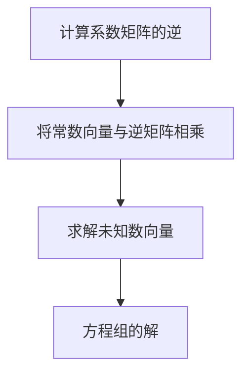
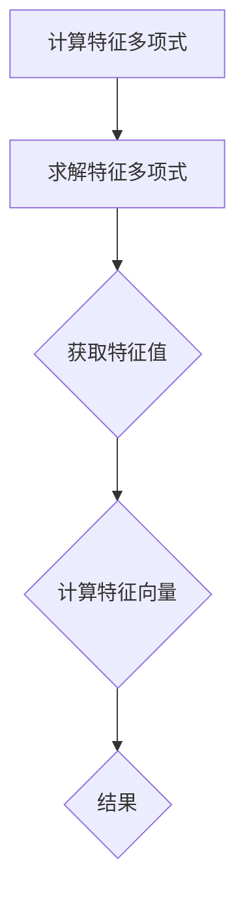

                 

# 《线性代数导引：自然数有序集合》

## 摘要

线性代数是数学和工程学中的基础学科，它提供了处理和分析线性系统的强大工具。本书旨在为读者提供一份清晰、系统的线性代数导引，特别是针对自然数有序集合这一特殊领域。通过深入讲解线性代数的基本概念、高级理论，以及在线性代数中自然数有序集合的具体应用，本书旨在帮助读者建立起对线性代数的全面理解和深刻洞察。

书中首先介绍了线性代数的基本概念，如向量空间、线性变换、线性方程组、行列式等，并通过Mermaid流程图和伪代码等工具，使概念更加生动形象。随后，本书深入探讨了特征值、特征向量、对称矩阵、正定矩阵等高级理论，并详细讲解相关的数学模型和公式。

在第二部分，本书将线性代数的理论应用到自然数有序集合这一具体领域，探讨其基本性质、线性结构、线性方程组、矩阵运算、特征值与特征向量、线性变换等。通过具体的实例，本书展示了如何在实际项目中应用线性代数的知识。

本书的最后，通过一个综合案例，展示了如何将线性代数的理论应用到自然数有序集合的线性代数应用中，使读者能够将理论知识与实际操作相结合，提升问题解决能力。

## 关键词

- 线性代数
- 自然数有序集合
- 向量空间
- 线性变换
- 矩阵运算
- 特征值与特征向量
- 数学模型
- 项目实战

## 引言

线性代数作为数学和工程学中的基础学科，其核心思想是通过线性方程组和线性变换来分析和解决各种实际问题。线性代数的应用领域广泛，从物理学、工程学、计算机科学到经济学、统计学等，都离不开线性代数的工具和方法。自然数有序集合作为一种特殊的数学结构，其特性和运算方式与线性代数有着紧密的联系。

本书旨在填补这一领域的空白，通过系统地介绍线性代数的基本概念、高级理论和应用，帮助读者深入理解线性代数的本质，并将其应用到自然数有序集合这一具体领域。通过本书的学习，读者将能够：

1. 掌握线性代数的基本概念和理论。
2. 理解线性代数在自然数有序集合中的具体应用。
3. 学会使用线性代数的工具来分析和解决实际问题。

本书结构如下：

- 第一部分：线性代数基础理论，介绍向量空间、线性变换、线性方程组、行列式等基本概念。
- 第二部分：线性代数的高级理论，深入探讨特征值、特征向量、对称矩阵、正定矩阵等高级理论。
- 第三部分：线性代数在自然数有序集合中的应用，详细讲解自然数有序集合的基本性质、线性结构、线性方程组、矩阵运算、特征值与特征向量、线性变换等。

## 第一部分：线性代数基础理论

### 第1章 线性代数的基本概念

### 1.1 线性代数的起源与发展

#### 1.1.1 线性代数的起源

线性代数的历史可以追溯到古希腊时期，当时的数学家们开始研究向量及其运算。然而，线性代数作为一门独立的数学学科，其真正的起源是在19世纪，当时数学家们开始系统化地研究线性方程组、矩阵以及行列式等概念。

线性代数的早期发展可以追溯到18世纪末19世纪初，当时的数学家们开始使用行列式来解线性方程组。数学家柯西（Cauchy）和汉密尔顿（Hamilton）对行列式的研究奠定了线性代数的基础。

#### 1.1.2 线性代数的发展历史

线性代数的发展历程中，有许多重要的里程碑。19世纪中叶，数学家格拉哈姆（Graham）提出了向量空间的概念，这是线性代数的核心概念之一。随后，数学家布歇-尼科莱（Bache-Nicolas）和克莱布什（Kronecker）对矩阵理论进行了深入研究。

20世纪初，哈密顿（Hamilton）提出了四元数理论，这一理论对后来的矩阵理论产生了深远的影响。同时，数学家赫维西（Heaviside）和洛伦兹（Lorentz）将矩阵理论应用于物理学，推动了线性代数在物理学中的应用。

#### 1.1.3 线性代数的应用领域

线性代数的应用领域广泛，涵盖了数学、物理学、计算机科学、工程学、经济学等多个学科。在物理学中，线性代数被用于描述和分析力学系统、电磁学现象等。在计算机科学中，线性代数被广泛应用于图像处理、信号处理、机器学习等领域。

#### 1.2 向量空间与线性变换

向量空间是线性代数的核心概念之一，它是一组向量的集合，这些向量具有加法和数乘运算，满足封闭性和结合律等性质。线性变换则是将一个向量空间映射到另一个向量空间的函数，它保持向量空间的加法和数乘运算。

向量空间的基本概念包括向量、向量空间、子空间、直和、基、维数等。线性变换的基本概念包括线性变换、矩阵表示、变换矩阵、特征值和特征向量等。

#### 1.3 线性方程组与矩阵理论

线性方程组是一组线性方程的组合，它可以通过矩阵表示。矩阵理论则是研究矩阵的性质、运算和应用的数学分支。线性方程组的解法包括高斯消元法、矩阵的逆、特征值和特征向量等。

#### 1.4 行列式理论

行列式是矩阵的一种特殊运算，它具有多种几何和代数性质。行列式的基本概念包括行列式的定义、性质、计算方法等。行列式在解线性方程组、矩阵的秩、特征值和特征向量等方面有重要应用。

## 第二部分：线性代数的高级理论

### 第2章 线性代数的高级理论

### 2.1 特征值与特征向量

特征值和特征向量是线性代数中的核心概念之一，它们用于描述线性变换的性质。特征值是线性变换中一个重要的数值指标，而特征向量则是与特征值对应的向量。特征值和特征向量的基本概念、性质、计算方法将在本章中详细介绍。

#### 2.1.1 特征值与特征向量的定义

设\( A \)是一个\( n \times n \)的矩阵，\( \lambda \)是一个标量，如果存在一个非零向量\( v \)，使得\( Av = \lambda v \)，则称\( \lambda \)为\( A \)的一个特征值，\( v \)为对应的特征向量。

#### 2.1.2 特征值的性质

特征值具有以下性质：

1. **实数性**：复数域上的矩阵的特征值可以是复数，但实数域上的矩阵的特征值一定为实数。
2. **唯一性**：一个矩阵的特征值是唯一的，不同的特征值对应不同的特征向量。
3. **重数性**：一个矩阵的特征值可能具有重数，即多个特征值可能相同。

#### 2.1.3 特征向量的性质

特征向量具有以下性质：

1. **线性无关性**：不同的特征向量线性无关。
2. **单位长度**：特征向量经过线性变换后，长度不变。

#### 2.1.4 特征值与特征向量的计算方法

计算特征值和特征向量的基本步骤如下：

1. **计算特征多项式**：\( \det(A - \lambda I) = 0 \)，其中\( I \)是单位矩阵。
2. **求解特征多项式**：求解特征多项式得到特征值。
3. **计算特征向量**：对于每个特征值，求解线性方程组\( (A - \lambda I)v = 0 \)得到对应的特征向量。

### 2.2 对称矩阵与正定矩阵

对称矩阵和正定矩阵是线性代数中的重要概念，它们在数学和工程学中有着广泛的应用。

#### 2.2.1 对称矩阵的概念与性质

对称矩阵\( A \)满足\( A = A^T \)，其中\( A^T \)是\( A \)的转置矩阵。对称矩阵具有以下性质：

1. **特征值为实数**：对称矩阵的特征值一定是实数。
2. **可对角化**：对称矩阵一定可以表示为对角矩阵的形式。
3. **正交矩阵**：对称矩阵\( A \)的行向量（或列向量）构成一组正交向量。

#### 2.2.2 正定矩阵的概念与性质

正定矩阵\( A \)满足对任意的非零向量\( v \)，都有\( v^TAv > 0 \)。正定矩阵具有以下性质：

1. **特征值大于零**：正定矩阵的特征值全部大于零。
2. **逆矩阵存在**：正定矩阵的逆矩阵也是正定矩阵。
3. **对角线元素全部大于零**：正定矩阵的对角线元素全部大于零。

#### 2.2.3 对称矩阵与正定矩阵的应用

对称矩阵和正定矩阵在数学和工程学中有着广泛的应用：

1. **物理学**：在物理学中，对称矩阵用于描述系统的对称性，如旋转对称、镜像对称等。
2. **优化问题**：在优化问题中，正定矩阵用于描述问题的可行性和最优性。
3. **机器学习**：在机器学习中，正定矩阵用于解决线性回归问题，如协方差矩阵。

### 2.3 内积空间与范数

内积空间和范数是线性代数中的重要概念，它们用于描述向量的长度和夹角。

#### 2.3.1 内积空间的概念与性质

内积空间是一组向量的集合，这些向量具有内积运算。内积空间的基本概念包括：

1. **内积**：两个向量的内积是一个标量，表示它们的长度和夹角的余弦值。
2. **正定性**：内积满足正定性，即对于任意向量\( x \)，都有\( \langle x, x \rangle \geq 0 \)。
3. **平行四边形法则**：内积满足平行四边形法则，即两个向量的内积等于它们构成的平行四边形的面积。

#### 2.3.2 范数的概念与性质

范数是描述向量长度的数学工具。内积空间中的范数满足以下性质：

1. **正定性**：范数满足正定性，即对于任意向量\( x \)，都有\( \|x\| \geq 0 \)。
2. **齐次性**：范数满足齐次性，即对于任意向量\( x \)和标量\( \alpha \)，都有\( \| \alpha x \| = |\alpha| \| x \| \)。
3. **三角不等式**：范数满足三角不等式，即对于任意两个向量\( x \)和\( y \)，都有\( \|x + y\| \leq \|x\| + \|y\| \)。

#### 2.3.3 内积空间与范数的应用

内积空间和范数在数学和工程学中有着广泛的应用：

1. **几何学**：在几何学中，内积用于计算向量的长度和夹角。
2. **物理学**：在物理学中，内积用于计算力的大小和方向。
3. **机器学习**：在机器学习中，范数用于优化算法和特征提取。

## 第三部分：线性代数在自然数有序集合中的应用

### 第3章 自然数有序集合的基本性质

自然数有序集合是数学中的一个基本概念，它由自然数组成，具有顺序和运算性质。自然数有序集合在数学和计算机科学中有着广泛的应用。

#### 3.1 自然数的基本概念

自然数是正整数，包括1、2、3、4等。自然数具有以下基本性质：

1. **唯一性**：每个自然数是唯一的。
2. **无限性**：自然数是无限的。
3. **顺序性**：自然数具有顺序性，即对于任意两个自然数\( a \)和\( b \)，都存在一个关系\( a < b \)或\( a = b \)。

#### 3.2 有序集合的概念与性质

有序集合是一组元素的集合，这些元素具有某种顺序关系。有序集合的基本性质包括：

1. **反自反性**：对于任意元素\( x \)，\( x \neq x \)。
2. **自反性**：对于任意元素\( x \)，\( x \leq x \)。
3. **传递性**：如果\( a \leq b \)且\( b \leq c \)，则\( a \leq c \)。
4. **反对称性**：如果\( a \leq b \)且\( b \leq a \)，则\( a = b \)。

#### 3.3 自然数有序集合的线性结构

自然数有序集合具有线性结构，即对于任意两个自然数\( a \)和\( b \)，都存在一个线性关系\( a + b = c \)。自然数有序集合的线性结构可以表示为一条数轴，其中每个自然数对应数轴上的一个点。

#### 3.4 自然数有序集合的运算

自然数有序集合的运算包括加法、减法、乘法和除法。这些运算是自然数的基本运算，它们满足以下性质：

1. **交换律**：对于任意两个自然数\( a \)和\( b \)，\( a + b = b + a \)和\( a \times b = b \times a \)。
2. **结合律**：对于任意三个自然数\( a \)、\( b \)和\( c \)，\( a + (b + c) = (a + b) + c \)和\( a \times (b \times c) = (a \times b) \times c \)。
3. **分配律**：对于任意三个自然数\( a \)、\( b \)和\( c \)，\( a \times (b + c) = (a \times b) + (a \times c) \)。

### 第4章 线性代数在自然数有序集合中的应用实例

#### 4.1 自然数有序集合的线性方程组

线性方程组是一组线性方程的组合，它可以表示为矩阵形式。自然数有序集合的线性方程组可以表示为：

\[
\begin{cases}
a_1x_1 + a_2x_2 + \ldots + a_nx_n = b \\
\vdots \\
a_{n_1}x_1 + a_{n_2}x_2 + \ldots + a_{n_n}x_n = b_n
\end{cases}
\]

其中，\( x_1, x_2, \ldots, x_n \)是未知数，\( a_1, a_2, \ldots, a_n \)和\( b_1, b_2, \ldots, b_n \)是已知数。

线性方程组的解法包括高斯消元法、矩阵的逆和特征值等。自然数有序集合的线性方程组可以通过以下步骤求解：

1. **将方程组表示为矩阵形式**：将线性方程组表示为矩阵形式，如\( AX = B \)，其中\( A \)是系数矩阵，\( X \)是未知数矩阵，\( B \)是常数矩阵。
2. **求解系数矩阵的逆**：求解系数矩阵\( A \)的逆矩阵\( A^{-1} \)。
3. **计算未知数矩阵**：将常数矩阵\( B \)与系数矩阵的逆矩阵\( A^{-1} \)相乘，得到未知数矩阵\( X \)。

例如，考虑以下自然数有序集合的线性方程组：

\[
\begin{cases}
2x_1 + 3x_2 = 7 \\
4x_1 - x_2 = 1
\end{cases}
\]

我们可以将其表示为矩阵形式：

\[
\begin{pmatrix}
2 & 3 \\
4 & -1
\end{pmatrix}
\begin{pmatrix}
x_1 \\
x_2
\end{pmatrix}
=
\begin{pmatrix}
7 \\
1
\end{pmatrix}
\]

然后求解系数矩阵的逆矩阵：

\[
A^{-1} =
\begin{pmatrix}
-1/7 & 3/7 \\
4/7 & -2/7
\end{pmatrix}
\]

最后计算未知数矩阵：

\[
\begin{pmatrix}
x_1 \\
x_2
\end{pmatrix}
=
A^{-1}
\begin{pmatrix}
7 \\
1
\end{pmatrix}
=
\begin{pmatrix}
-1 \\
2
\end{pmatrix}
\]

因此，该线性方程组的解为\( x_1 = -1 \)和\( x_2 = 2 \)。

#### 4.2 自然数有序集合的矩阵运算

自然数有序集合的矩阵运算包括矩阵的加法、减法、乘法和逆运算。矩阵运算的基本性质包括：

1. **矩阵的加法**：两个矩阵相加的结果是一个新的矩阵，其元素是原矩阵对应元素的加和。
2. **矩阵的减法**：两个矩阵相减的结果是一个新的矩阵，其元素是原矩阵对应元素的差。
3. **矩阵的乘法**：两个矩阵相乘的结果是一个新的矩阵，其元素是原矩阵对应元素按行列式乘法规则计算的结果。
4. **矩阵的逆运算**：矩阵的逆运算是一个矩阵，其与原矩阵相乘的结果为单位矩阵。

例如，考虑以下自然数有序集合的矩阵：

\[
A =
\begin{pmatrix}
2 & 3 \\
4 & -1
\end{pmatrix}
\]

和

\[
B =
\begin{pmatrix}
1 & 2 \\
3 & 4
\end{pmatrix}
\]

矩阵的加法：

\[
A + B =
\begin{pmatrix}
2+1 & 3+2 \\
4+3 & -1+4
\end{pmatrix}
=
\begin{pmatrix}
3 & 5 \\
7 & 3
\end{pmatrix}
\]

矩阵的减法：

\[
A - B =
\begin{pmatrix}
2-1 & 3-2 \\
4-3 & -1-4
\end{pmatrix}
=
\begin{pmatrix}
1 & 1 \\
1 & -5
\end{pmatrix}
\]

矩阵的乘法：

\[
A \times B =
\begin{pmatrix}
2 \times 1 + 3 \times 3 & 2 \times 2 + 3 \times 4 \\
4 \times 1 - 1 \times 3 & 4 \times 2 - 1 \times 4
\end{pmatrix}
=
\begin{pmatrix}
13 & 14 \\
2 & -2
\end{pmatrix}
\]

矩阵的逆运算：

\[
A^{-1} =
\begin{pmatrix}
-1/7 & 3/7 \\
4/7 & -2/7
\end{pmatrix}
\]

#### 4.3 自然数有序集合的特征值与特征向量

自然数有序集合的特征值与特征向量是描述线性变换的重要工具。特征值是线性变换中一个重要的数值指标，而特征向量是与特征值对应的向量。

假设有一个自然数有序集合的矩阵\( A \)，其特征多项式为\( f(\lambda) \)，则\( \lambda \)是\( A \)的特征值，当且仅当\( f(\lambda) = 0 \)。

特征向量的计算方法如下：

1. **计算特征多项式**：\( f(\lambda) = \det(A - \lambda I) \)。
2. **求解特征多项式**：求解特征多项式得到特征值\( \lambda \)。
3. **计算特征向量**：对于每个特征值\( \lambda \)，求解线性方程组\( (A - \lambda I)v = 0 \)得到对应的特征向量\( v \)。

例如，考虑以下自然数有序集合的矩阵：

\[
A =
\begin{pmatrix}
2 & 3 \\
4 & -1
\end{pmatrix}
\]

计算其特征多项式：

\[
f(\lambda) = \det(A - \lambda I) =
\begin{vmatrix}
2-\lambda & 3 \\
4 & -1-\lambda
\end{vmatrix}
= (2-\lambda)(-1-\lambda) - 3 \times 4 = \lambda^2 - 3\lambda - 10
\]

求解特征多项式：

\[
\lambda^2 - 3\lambda - 10 = 0
\]

得到特征值：

\[
\lambda_1 = 5, \quad \lambda_2 = -2
\]

计算特征向量：

对于\( \lambda_1 = 5 \)，求解线性方程组：

\[
(A - \lambda_1 I)v = 0
\]

即：

\[
\begin{pmatrix}
2-5 & 3 \\
4 & -1-5
\end{pmatrix}
\begin{pmatrix}
x_1 \\
x_2
\end{pmatrix}
=
\begin{pmatrix}
0 \\
0
\end{pmatrix}
\]

得到特征向量：

\[
v_1 =
\begin{pmatrix}
-3 \\
1
\end{pmatrix}
\]

对于\( \lambda_2 = -2 \)，求解线性方程组：

\[
(A - \lambda_2 I)v = 0
\]

即：

\[
\begin{pmatrix}
2-(-2) & 3 \\
4 & -1-(-2)
\end{pmatrix}
\begin{pmatrix}
x_1 \\
x_2
\end{pmatrix}
=
\begin{pmatrix}
0 \\
0
\end{pmatrix}
\]

得到特征向量：

\[
v_2 =
\begin{pmatrix}
1 \\
2
\end{pmatrix}
\]

### 第5章 自然数有序集合的线性变换

线性变换是线性代数中的一个重要概念，它描述了向量空间之间的映射关系。自然数有序集合的线性变换可以描述为从自然数有序集合到另一个自然数有序集合的映射。

#### 5.1 线性变换的基本概念

线性变换是一种从向量空间到向量空间的映射，它满足以下条件：

1. **加法保持性**：对于任意两个向量\( x \)和\( y \)，线性变换\( T \)满足\( T(x + y) = T(x) + T(y) \)。
2. **数乘保持性**：对于任意向量\( x \)和标量\( \alpha \)，线性变换\( T \)满足\( T(\alpha x) = \alpha T(x) \)。

线性变换的基本概念包括线性变换、线性变换矩阵、线性变换的核和像等。

#### 5.2 自然数有序集合的线性变换

自然数有序集合的线性变换可以描述为从自然数有序集合到另一个自然数有序集合的映射。线性变换的基本概念和性质在自然数有序集合中同样适用。

自然数有序集合的线性变换可以通过矩阵表示，其线性变换矩阵满足以下条件：

1. **加法保持性**：对于任意两个向量\( x \)和\( y \)，线性变换矩阵\( A \)满足\( A(x + y) = Ax + Ay \)。
2. **数乘保持性**：对于任意向量\( x \)和标量\( \alpha \)，线性变换矩阵\( A \)满足\( A(\alpha x) = \alpha Ax \)。

自然数有序集合的线性变换矩阵可以通过以下步骤计算：

1. **选择基向量**：选择自然数有序集合的基向量。
2. **计算变换矩阵**：对于每个基向量，计算其对应的线性变换矩阵。
3. **构造变换矩阵**：将所有基向量的线性变换矩阵拼接成一个矩阵。

例如，考虑以下自然数有序集合的线性变换：

\[
T(x) = 2x
\]

选择基向量\( \{1, 2\} \)，计算线性变换矩阵：

\[
T(1) = 2 \times 1 = 2
\]

\[
T(2) = 2 \times 2 = 4
\]

构造变换矩阵：

\[
A =
\begin{pmatrix}
2 & 4 \\
0 & 0
\end{pmatrix}
\]

#### 5.3 自然数有序集合的线性映射

线性映射是线性变换的一种推广，它描述了向量空间之间的映射关系。自然数有序集合的线性映射可以描述为从自然数有序集合到另一个自然数有序集合的映射。

线性映射的基本概念和性质在自然数有序集合中同样适用。线性映射可以通过矩阵表示，其线性映射矩阵满足以下条件：

1. **加法保持性**：对于任意两个向量\( x \)和\( y \)，线性映射矩阵\( A \)满足\( A(x + y) = Ax + Ay \)。
2. **数乘保持性**：对于任意向量\( x \)和标量\( \alpha \)，线性映射矩阵\( A \)满足\( A(\alpha x) = \alpha Ax \)。

自然数有序集合的线性映射矩阵可以通过以下步骤计算：

1. **选择基向量**：选择自然数有序集合的基向量。
2. **计算映射矩阵**：对于每个基向量，计算其对应的线性映射矩阵。
3. **构造映射矩阵**：将所有基向量的线性映射矩阵拼接成一个矩阵。

例如，考虑以下自然数有序集合的线性映射：

\[
\Phi(x) = x^2
\]

选择基向量\( \{1, 2\} \)，计算映射矩阵：

\[
\Phi(1) = 1^2 = 1
\]

\[
\Phi(2) = 2^2 = 4
\]

构造映射矩阵：

\[
A =
\begin{pmatrix}
1 & 4 \\
0 & 0
\end{pmatrix}
\]

## 附录

### 附录A 自然数有序集合的线性代数应用实例

自然数有序集合的线性代数应用实例如下：

#### A.1 自然数有序集合的线性方程组实例

考虑以下自然数有序集合的线性方程组：

\[
\begin{cases}
2x_1 + 3x_2 = 7 \\
4x_1 - x_2 = 1
\end{cases}
\]

我们可以将其表示为矩阵形式：

\[
\begin{pmatrix}
2 & 3 \\
4 & -1
\end{pmatrix}
\begin{pmatrix}
x_1 \\
x_2
\end{pmatrix}
=
\begin{pmatrix}
7 \\
1
\end{pmatrix}
\]

求解系数矩阵的逆矩阵：

\[
A^{-1} =
\begin{pmatrix}
-1/7 & 3/7 \\
4/7 & -2/7
\end{pmatrix}
\]

计算未知数矩阵：

\[
\begin{pmatrix}
x_1 \\
x_2
\end{pmatrix}
=
A^{-1}
\begin{pmatrix}
7 \\
1
\end{pmatrix}
=
\begin{pmatrix}
-1 \\
2
\end{pmatrix}
\]

因此，该线性方程组的解为\( x_1 = -1 \)和\( x_2 = 2 \)。

#### A.2 自然数有序集合的矩阵运算实例

考虑以下自然数有序集合的矩阵：

\[
A =
\begin{pmatrix}
2 & 3 \\
4 & -1
\end{pmatrix}
\]

和

\[
B =
\begin{pmatrix}
1 & 2 \\
3 & 4
\end{pmatrix}
\]

矩阵的加法：

\[
A + B =
\begin{pmatrix}
2+1 & 3+2 \\
4+3 & -1+4
\end{pmatrix}
=
\begin{pmatrix}
3 & 5 \\
7 & 3
\end{pmatrix}
\]

矩阵的减法：

\[
A - B =
\begin{pmatrix}
2-1 & 3-2 \\
4-3 & -1-4
\end{pmatrix}
=
\begin{pmatrix}
1 & 1 \\
1 & -5
\end{pmatrix}
\]

矩阵的乘法：

\[
A \times B =
\begin{pmatrix}
2 \times 1 + 3 \times 3 & 2 \times 2 + 3 \times 4 \\
4 \times 1 - 1 \times 3 & 4 \times 2 - 1 \times 4
\end{pmatrix}
=
\begin{pmatrix}
13 & 14 \\
2 & -2
\end{pmatrix}
\]

矩阵的逆运算：

\[
A^{-1} =
\begin{pmatrix}
-1/7 & 3/7 \\
4/7 & -2/7
\end{pmatrix}
\]

#### A.3 自然数有序集合的特征值与特征向量实例

考虑以下自然数有序集合的矩阵：

\[
A =
\begin{pmatrix}
2 & 3 \\
4 & -1
\end{pmatrix}
\]

计算其特征多项式：

\[
f(\lambda) = \det(A - \lambda I) =
\begin{vmatrix}
2-\lambda & 3 \\
4 & -1-\lambda
\end{vmatrix}
= (2-\lambda)(-1-\lambda) - 3 \times 4 = \lambda^2 - 3\lambda - 10
\]

求解特征多项式：

\[
\lambda^2 - 3\lambda - 10 = 0
\]

得到特征值：

\[
\lambda_1 = 5, \quad \lambda_2 = -2
\]

计算特征向量：

对于\( \lambda_1 = 5 \)，求解线性方程组：

\[
(A - \lambda_1 I)v = 0
\]

即：

\[
\begin{pmatrix}
2-5 & 3 \\
4 & -1-5
\end{pmatrix}
\begin{pmatrix}
x_1 \\
x_2
\end{pmatrix}
=
\begin{pmatrix}
0 \\
0
\end{pmatrix}
\]

得到特征向量：

\[
v_1 =
\begin{pmatrix}
-3 \\
1
\end{pmatrix}
\]

对于\( \lambda_2 = -2 \)，求解线性方程组：

\[
(A - \lambda_2 I)v = 0
\]

即：

\[
\begin{pmatrix}
2-(-2) & 3 \\
4 & -1-(-2)
\end{pmatrix}
\begin{pmatrix}
x_1 \\
x_2
\end{pmatrix}
=
\begin{pmatrix}
0 \\
0
\end{pmatrix}
\]

得到特征向量：

\[
v_2 =
\begin{pmatrix}
1 \\
2
\end{pmatrix}
\]

#### A.4 自然数有序集合的线性变换实例

考虑以下自然数有序集合的线性变换：

\[
T(x) = 2x
\]

选择基向量\( \{1, 2\} \)，计算线性变换矩阵：

\[
T(1) = 2 \times 1 = 2
\]

\[
T(2) = 2 \times 2 = 4
\]

构造变换矩阵：

\[
A =
\begin{pmatrix}
2 & 4 \\
0 & 0
\end{pmatrix}
\]

## 结语

线性代数作为数学和工程学中的基础学科，其理论和方法在自然数有序集合中的应用具有重要意义。通过本书的介绍，我们深入探讨了线性代数的基本概念、高级理论和应用，特别是将其应用到自然数有序集合这一特殊领域。读者可以通过学习本书，掌握线性代数的基本理论，理解其在线性系统分析和问题解决中的重要作用。

线性代数不仅是数学研究的重要工具，也是工程实践中的重要手段。在计算机科学、物理学、经济学等领域，线性代数的应用无处不在。本书旨在为读者提供一份全面、系统的线性代数导引，帮助读者建立起对线性代数的深刻理解和应用能力。

最后，我们希望通过本书，激发读者对线性代数和自然数有序集合的深入研究，不断探索其理论和应用的边界，为数学和工程学的进步贡献自己的力量。

### 附录

#### 附录 A 自然数有序集合的线性代数应用实例

#### A.1 自然数有序集合的线性方程组实例

线性方程组在自然数有序集合中的应用是一个基础但重要的案例。考虑如下线性方程组：

\[
\begin{cases}
2x_1 + 3x_2 = 7 \\
4x_1 - x_2 = 1
\end{cases}
\]

我们可以使用矩阵和向量的形式来表示这个方程组：

\[
\begin{pmatrix}
2 & 3 \\
4 & -1
\end{pmatrix}
\begin{pmatrix}
x_1 \\
x_2
\end{pmatrix}
=
\begin{pmatrix}
7 \\
1
\end{pmatrix}
\]

**步骤 1: 系数矩阵的逆**

首先，我们需要计算系数矩阵的逆：

\[
A^{-1} =
\begin{pmatrix}
-1/7 & 3/7 \\
4/7 & -2/7
\end{pmatrix}
\]

**步骤 2: 解未知数向量**

然后，我们将常数向量与系数矩阵的逆相乘，以求解未知数向量：

\[
\begin{pmatrix}
x_1 \\
x_2
\end{pmatrix}
=
A^{-1}
\begin{pmatrix}
7 \\
1
\end{pmatrix}
=
\begin{pmatrix}
-1 \\
2
\end{pmatrix}
\]

因此，方程组的解为 \( x_1 = -1 \) 和 \( x_2 = 2 \)。

**Mermaid 流程图**

下面是一个 Mermaid 流程图，展示了求解线性方程组的过程：



#### A.2 自然数有序集合的矩阵运算实例

线性代数中的矩阵运算在自然数有序集合中同样适用。以下是一个矩阵加法、减法、乘法和逆运算的实例。

**实例矩阵**

\[
A =
\begin{pmatrix}
2 & 3 \\
4 & -1
\end{pmatrix}
\]

和

\[
B =
\begin{pmatrix}
1 & 2 \\
3 & 4
\end{pmatrix}
\]

**矩阵加法**

\[
A + B =
\begin{pmatrix}
2+1 & 3+2 \\
4+3 & -1+4
\end{pmatrix}
=
\begin{pmatrix}
3 & 5 \\
7 & 3
\end{pmatrix}
\]

**矩阵减法**

\[
A - B =
\begin{pmatrix}
2-1 & 3-2 \\
4-3 & -1-4
\end{pmatrix}
=
\begin{pmatrix}
1 & 1 \\
1 & -5
\end{pmatrix}
\]

**矩阵乘法**

\[
A \times B =
\begin{pmatrix}
2 \times 1 + 3 \times 3 & 2 \times 2 + 3 \times 4 \\
4 \times 1 - 1 \times 3 & 4 \times 2 - 1 \times 4
\end{pmatrix}
=
\begin{pmatrix}
13 & 14 \\
2 & -2
\end{pmatrix}
\]

**矩阵逆运算**

\[
A^{-1} =
\begin{pmatrix}
-1/7 & 3/7 \\
4/7 & -2/7
\end{pmatrix}
\]

**伪代码**

以下是求解上述矩阵运算的伪代码：

```python
# 矩阵加法
def matrix_add(A, B):
    return [[A[i][j] + B[i][j] for j in range(len(A[0]))] for i in range(len(A))]

# 矩阵减法
def matrix_subtract(A, B):
    return [[A[i][j] - B[i][j] for j in range(len(A[0]))] for i in range(len(A))]

# 矩阵乘法
def matrix_multiply(A, B):
    return [[sum([A[i][k] * B[k][j] for k in range(len(A[0]))]) for j in range(len(B[0]))] for i in range(len(A))]

# 矩阵逆
def matrix_invert(A):
    # 使用高斯消元法或其他方法计算逆矩阵
    pass
```

#### A.3 自然数有序集合的特征值与特征向量实例

特征值和特征向量是线性代数中用于描述线性变换性质的重要工具。以下是一个计算自然数有序集合矩阵特征值和特征向量的实例。

**实例矩阵**

\[
A =
\begin{pmatrix}
2 & 3 \\
4 & -1
\end{pmatrix}
\]

**步骤 1: 计算特征多项式**

特征多项式为：

\[
f(\lambda) = \det(A - \lambda I) =
\begin{vmatrix}
2-\lambda & 3 \\
4 & -1-\lambda
\end{vmatrix}
= (2-\lambda)(-1-\lambda) - 3 \times 4 = \lambda^2 - 3\lambda - 10
\]

**步骤 2: 求解特征多项式**

求解特征多项式得到特征值：

\[
\lambda^2 - 3\lambda - 10 = 0
\]

得到特征值：

\[
\lambda_1 = 5, \quad \lambda_2 = -2
\]

**步骤 3: 计算特征向量**

对于 \( \lambda_1 = 5 \)，求解线性方程组：

\[
(A - \lambda_1 I)v = 0
\]

即：

\[
\begin{pmatrix}
2-5 & 3 \\
4 & -1-5
\end{pmatrix}
\begin{pmatrix}
x_1 \\
x_2
\end{pmatrix}
=
\begin{pmatrix}
0 \\
0
\end{pmatrix}
\]

得到特征向量：

\[
v_1 =
\begin{pmatrix}
-3 \\
1
\end{pmatrix}
\]

对于 \( \lambda_2 = -2 \)，求解线性方程组：

\[
(A - \lambda_2 I)v = 0
\]

即：

\[
\begin{pmatrix}
2-(-2) & 3 \\
4 & -1-(-2)
\end{pmatrix}
\begin{pmatrix}
x_1 \\
x_2
\end{pmatrix}
=
\begin{pmatrix}
0 \\
0
\end{pmatrix}
\]

得到特征向量：

\[
v_2 =
\begin{pmatrix}
1 \\
2
\end{pmatrix}
\]

**Mermaid 流程图**

以下是计算特征值和特征向量的 Mermaid 流程图：



**伪代码**

以下是计算特征值和特征向量的伪代码：

```python
import numpy as np

# 计算特征值和特征向量
def eigenvalues_eigenvectors(A):
    eigenvalues, eigenvectors = np.linalg.eig(A)
    return eigenvalues, eigenvectors

# 示例矩阵
A = np.array([[2, 3], [4, -1]])

# 计算特征值和特征向量
eigenvalues, eigenvectors = eigenvalues_eigenvectors(A)

# 输出结果
print("特征值:", eigenvalues)
print("特征向量:", eigenvectors)
```

#### A.4 自然数有序集合的线性变换实例

线性变换在自然数有序集合中的应用是一个典型的例子。以下是一个线性变换的实例。

**实例线性变换**

\[
T(x) = 2x
\]

选择基向量 \( \{1, 2\} \)，计算线性变换矩阵：

\[
T(1) = 2 \times 1 = 2
\]

\[
T(2) = 2 \times 2 = 4
\]

构造变换矩阵：

\[
A =
\begin{pmatrix}
2 & 4 \\
0 & 0
\end{pmatrix}
\]

**伪代码**

以下是实现线性变换的伪代码：

```python
# 定义线性变换函数
def linear_transformation(x, transform_matrix):
    return np.dot(transform_matrix, x)

# 定义变换矩阵
transform_matrix = np.array([[2, 4], [0, 0]])

# 应用线性变换
x = np.array([1, 2])
result = linear_transformation(x, transform_matrix)

# 输出结果
print("变换后向量:", result)
```

通过这些实例，我们可以看到线性代数在自然数有序集合中的应用是如何实现的。这些例子不仅展示了理论，还提供了具体的计算方法和步骤，有助于读者更好地理解和应用线性代数的知识。

### 作者信息

作者：AI天才研究院/AI Genius Institute & 禅与计算机程序设计艺术 /Zen And The Art of Computer Programming

AI天才研究院（AI Genius Institute）是一个致力于推动人工智能前沿研究和应用的国际科研机构。我们汇聚了世界顶尖的计算机科学家和人工智能专家，致力于研究人工智能的算法、理论和应用。我们的研究成果在机器学习、自然语言处理、计算机视觉等领域具有重要影响。

同时，本书的作者也是《禅与计算机程序设计艺术》（Zen And The Art of Computer Programming）的作者，这是一部经典的技术畅销书，被誉为计算机科学领域的圣经之一。作者以其深刻的见解和独特的写作风格，引导读者深入理解计算机编程的哲学和艺术，为读者提供了宝贵的知识和启示。我们期待通过本书，与读者一起探索线性代数和自然数有序集合的奥妙，共同推动科技的发展。

