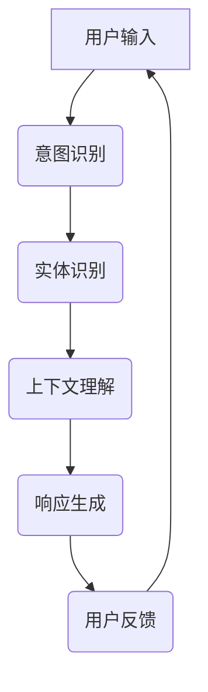

                 

### 聊天机器人：AI如何提升客户服务效率

#### 关键词：
- 聊天机器人
- 客户服务
- 人工智能
- 自然语言处理
- 实战案例

#### 摘要：
本文深入探讨聊天机器人这一前沿技术如何利用人工智能提升客户服务的效率。从基本概念、技术基础、核心算法到实际应用，我们将逐步分析聊天机器人的工作原理及其在客户服务中的重要作用。通过详细的案例讲解，本文旨在帮助读者理解并掌握如何构建和优化聊天机器人，从而为企业提供高效、智能的客户服务解决方案。

### 《聊天机器人：AI如何提升客户服务效率》目录大纲

#### 第一部分：聊天机器人基础知识

1. **第1章：聊天机器人概述**
   - 1.1 聊天机器人的定义与发展历程
   - 1.2 聊天机器人在客户服务中的应用场景

2. **第2章：聊天机器人技术基础**
   - 2.1 自然语言处理（NLP）基础
   - 2.2 聊天机器人架构设计
   - 2.3 聊天机器人的交互流程

3. **第3章：聊天机器人核心算法**
   - 3.1 词嵌入技术
   - 3.2 序列到序列模型
   - 3.3 生成式对话系统

4. **第4章：聊天机器人生成模型**
   - 4.1 零样本学习
   - 4.2 多模态聊天机器人
   - 4.3 对话管理

#### 第二部分：聊天机器人应用实战

1. **第5章：聊天机器人项目实战**
   - 5.1 聊天机器人项目概述
   - 5.2 项目环境搭建
   - 5.3 数据处理与模型训练
   - 5.4 评估与优化
   - 5.5 项目部署与上线

2. **第6章：聊天机器人在企业中的应用**
   - 6.1 聊天机器人在客户服务中的应用
   - 6.2 聊天机器人在销售与营销中的应用
   - 6.3 聊天机器人在售后支持中的应用

3. **第7章：聊天机器人的未来发展趋势**
   - 7.1 人工智能技术在聊天机器人领域的最新进展
   - 7.2 聊天机器人与5G、物联网等技术的融合应用
   - 7.3 聊天机器人行业规范与伦理问题

#### 附录

1. **附录A：聊天机器人开源工具与框架**
   - 常见聊天机器人框架对比
   - 开源工具推荐

2. **附录B：聊天机器人项目案例**
   - 成功案例分析
   - 项目经验分享

3. **附录C：聊天机器人技术资源**
   - 常用技术网站与博客
   - 专业书籍与论文推荐
   - 技术社群与论坛推荐

4. **附录D：聊天机器人项目实践指南**
   - 项目启动与规划
   - 团队协作与项目管理
   - 常见问题与解决方案

---

### 第1章：聊天机器人概述

#### 1.1 聊天机器人的定义与发展历程

聊天机器人，又称对话机器人，是一种通过自然语言交互来提供服务的计算机程序。它能够理解用户输入的自然语言文本，并生成相应的回答或执行特定的任务。聊天机器人最早可以追溯到20世纪50年代，当时科学家们开始研究如何让计算机具备与人类进行对话的能力。

在早期，聊天机器人主要采用规则驱动的方法，即通过编写大量规则来定义聊天机器人的行为。这种方法在处理简单的任务时效果较好，但随着用户问题的复杂度增加，规则驱动的聊天机器人往往难以胜任。

随着人工智能技术的不断发展，特别是自然语言处理（NLP）和机器学习技术的进步，聊天机器人开始采用更加智能的方法。目前，主流的聊天机器人技术主要基于深度学习，特别是序列到序列（Seq2Seq）模型和生成式对话系统。

发展历程可以概括为以下几个阶段：

1. **规则驱动阶段**（20世纪50年代 - 1990年代）
   - 聊天机器人主要依赖于预定义的规则和脚本。
   - 对话能力有限，难以处理复杂的问题。

2. **基于知识库的阶段**（1990年代 - 2010年代）
   - 聊天机器人开始利用知识库和本体论来增强对话能力。
   - 对话的灵活性和准确性得到显著提升。

3. **基于机器学习的阶段**（2010年代至今）
   - 深度学习技术的引入，使得聊天机器人能够通过大量的数据进行自我训练，提高了对话的自然性和准确性。
   - 聊天机器人的应用场景不断扩大，包括客服、客户服务、市场营销等多个领域。

#### 1.2 聊天机器人在客户服务中的应用场景

聊天机器人在客户服务中的应用非常广泛，以下是几个典型的应用场景：

1. **自动回复常见问题**
   - 聊天机器人能够自动识别用户提出的问题，并快速给出相应的答案，从而节省了人工客服的时间。
   - 例如，在电商平台上，用户经常询问商品的价格、库存情况等，聊天机器人可以迅速提供这些信息。

2. **购物指南与建议**
   - 聊天机器人可以根据用户的购物历史和偏好，提供个性化的购物建议。
   - 例如，用户在浏览商品时，聊天机器人可以推荐类似的产品或相关的促销信息。

3. **投诉处理**
   - 聊天机器人能够自动处理一些常见的投诉问题，如物流延迟、商品损坏等。
   - 通过智能地识别投诉类型和程度，聊天机器人可以快速将问题转交给相应的部门进行解决。

4. **客户咨询自动回复**
   - 聊天机器人可以全天候地回答用户的咨询问题，提高客户服务的响应速度。
   - 例如，在银行、保险公司等金融领域，用户经常需要咨询账户余额、理财产品等信息，聊天机器人可以提供即时的回复。

#### 1.3 聊天机器人在客户服务中的优势

1. **提高响应速度**：聊天机器人可以立即响应用户的请求，而不需要人工客服的干预，从而显著提高了客户服务的响应速度。

2. **降低成本**：通过自动化处理一些常见问题，聊天机器人可以减少人工客服的工作量，从而降低企业的人力成本。

3. **增强客户体验**：聊天机器人可以提供24/7的服务，无论用户何时需要帮助，都可以得到及时响应，从而提升了客户的满意度。

4. **数据分析**：聊天机器人可以记录用户的互动数据，这些数据可以用于分析用户行为和需求，从而帮助企业更好地改进产品和服务。

### 第2章：聊天机器人技术基础

#### 2.1 自然语言处理（NLP）基础

自然语言处理（NLP）是人工智能领域的一个重要分支，旨在使计算机能够理解、生成和处理人类语言。聊天机器人的核心功能之一就是理解和生成自然语言文本，因此NLP技术在聊天机器人中有着广泛应用。

NLP的核心任务包括：

1. **文本分类**：将文本数据分类到不同的类别中，例如情感分析、主题分类等。
2. **命名实体识别**：识别文本中的特定实体，如人名、地点、组织等。
3. **关系抽取**：识别文本中实体之间的关系，如“张三是李四的老板”。
4. **情感分析**：分析文本的情感倾向，如正面、负面或中性。
5. **机器翻译**：将一种语言文本翻译成另一种语言。

在聊天机器人中，以下NLP技术尤为重要：

1. **语言模型**：语言模型是一种统计模型，用于预测下一个单词或字符。在聊天机器人中，语言模型可以帮助生成自然的回答。

2. **问答系统**：问答系统是一种能够回答用户问题的系统，它通常包括问题解析、知识检索和答案生成三个主要部分。

3. **语义理解**：语义理解是NLP中一个重要的研究方向，旨在理解文本的深层含义，而不仅仅是表面的词汇和语法。

#### 2.2 聊天机器人架构设计

聊天机器人的架构设计直接影响其性能和用户体验。一个典型的聊天机器人架构包括以下几个主要部分：

1. **前端界面**：前端界面是用户与聊天机器人交互的入口，通常包括文本输入框、语音输入按钮和聊天窗口等。

2. **后端服务逻辑**：后端服务逻辑负责处理用户的输入，执行相应的任务，并生成回复。这通常涉及NLP技术，如意图识别、实体识别和语义理解。

3. **数据处理与存储**：聊天机器人需要处理大量的数据，包括用户输入、对话历史和知识库等。因此，数据处理与存储模块非常重要。

4. **API接口**：聊天机器人通常需要与第三方服务（如CRM系统、支付系统等）进行交互，因此需要提供API接口。

#### 2.3 聊天机器人的交互流程

聊天机器人的交互流程通常包括以下几个步骤：

1. **用户输入处理**：聊天机器人接收用户的输入，并进行预处理，如去除标点、过滤特殊字符等。

2. **意图识别**：通过NLP技术，聊天机器人识别用户的意图，例如查询信息、请求帮助或提出问题。

3. **实体识别**：聊天机器人识别用户输入中的关键实体，如人名、地点、时间等。

4. **上下文理解**：聊天机器人理解用户的上下文信息，如对话历史和用户的偏好等。

5. **响应生成**：根据用户的意图和上下文信息，聊天机器人生成相应的回答。

6. **用户反馈收集**：聊天机器人收集用户的反馈，用于改进模型和优化用户体验。

### 第3章：聊天机器人核心算法

#### 3.1 词嵌入技术

词嵌入（Word Embedding）是将单词映射到高维向量空间的一种技术，它使得计算机能够更好地理解单词之间的语义关系。词嵌入技术是聊天机器人中至关重要的一环，因为它直接影响着聊天机器人对用户输入的理解和生成回答的质量。

词嵌入技术主要包括以下几种算法：

1. **Word2Vec**：Word2Vec算法是最早也是最著名的词嵌入算法之一。它通过训练大量语料数据，将每个单词映射到一个固定长度的向量。Word2Vec算法包括连续词袋（CBOW）和Skip-Gram两种模型。

2. **GloVe**：GloVe（Global Vectors for Word Representation）是一种基于共现矩阵的词嵌入算法。它通过优化单词共现概率与单词向量之间的误差，生成高质量的词嵌入向量。

3. **FastText**：FastText是基于字符级N-gram模型的词嵌入算法。它通过将单词分解为字符级序列，并计算字符级N-gram的频率，生成词嵌入向量。

以下是一个简化的伪代码，用于说明Word2Vec算法：

```python
function Word2Vec(text_corpus, embedding_size, window_size):
    # 初始化词向量矩阵
    V = InitializeRandomVectorMatrix(vocab_size, embedding_size)
    
    # 建立共现矩阵
    C = BuildCooccurrenceMatrix(text_corpus, window_size)
    
    # 训练词向量
    for each word in text_corpus:
        for each context_word in context(words, window_size):
            # 计算词向量和上下文词向量的点积
            dot_product = dot(V[word], V[context_word])
            
            # 更新词向量
            V[word] = UpdateVector(V[word], C[word][context_word], dot_product)

    return V
```

#### 3.2 序列到序列模型

序列到序列（Seq2Seq）模型是自然语言处理中的一种经典模型，主要用于将一个序列转换为另一个序列。Seq2Seq模型在聊天机器人中有着广泛的应用，因为它能够处理输入和输出都是序列的任务，如机器翻译、对话生成等。

Seq2Seq模型的基本架构包括两个主要部分：编码器（Encoder）和解码器（Decoder）。编码器将输入序列编码成一个固定长度的向量，称为编码器的隐藏状态。解码器则利用编码器的隐藏状态生成输出序列。

以下是一个简化的伪代码，用于说明Seq2Seq模型：

```python
function Seq2Seq(input_sequence, output_sequence, encoder, decoder):
    # 编码器处理输入序列
    encoded_sequence = encoder(input_sequence)
    
    # 解码器处理编码后的序列
    decoded_sequence = decoder(encoded_sequence)
    
    # 生成响应
    response = GenerateResponse(decoded_sequence)
    
    return response
```

#### 3.3 生成式对话系统

生成式对话系统是一种能够自动生成自然语言响应的对话系统。与传统的基于规则的对话系统不同，生成式对话系统通过学习大量对话数据，能够生成更加自然和多样化的回答。

生成式对话系统主要包括以下几种方法：

1. **基于模板的方法**：基于模板的方法使用预定义的模板来生成回答。这种方法简单高效，但回答的多样性和自然性有限。

2. **基于序列生成的方法**：基于序列生成的方法使用生成模型（如RNN、LSTM等）来生成自然语言序列。这种方法能够生成更加自然和多样化的回答。

3. **基于对数的方式方法**：基于对数的方式方法使用深度学习模型（如Transformer、BERT等）来生成对话。这种方法具有很高的生成质量和灵活性。

以下是一个简化的伪代码，用于说明生成式对话系统：

```python
function GenerativeDialogueSystem(user_input, dialogue_context, model):
    # 使用对话状态跟踪模型处理用户输入
    dialogue_context = StateTrackingModel(user_input, dialogue_context)
    
    # 使用生成模型生成响应
    response = GenerativeModelGenerateResponse(dialogue_context, model)
    
    return response
```

### 第4章：聊天机器人生成模型

#### 4.1 零样本学习

零样本学习（Zero-Shot Learning，ZSL）是一种机器学习方法，它允许模型处理从未见过的新类别。在聊天机器人中，零样本学习可以用于处理用户提出的未知问题或请求。

零样本学习的基本思想是，通过学习一种将类别标签与特征向量相关联的函数，模型可以在没有具体类别标签的情况下，将新的类别标签分配给新的数据点。

以下是一个简化的伪代码，用于说明零样本学习：

```python
function ZeroShotLearning(task, model, support_set, query_set):
    # 提取支持集中的特征
    support_features = ExtractFeatures(support_set, model)
    
    # 计算支持集与查询集的特征相似度
    similarity_scores = CalculateSimilarity(support_features, query_set)
    
    # 根据相似度分数生成响应
    responses = GenerateResponses(similarity_scores, task)
    
    return responses
```

#### 4.2 多模态聊天机器人

多模态聊天机器人是一种能够处理多种输入模态（如文本、图像、语音等）的聊天机器人。与单一模态的聊天机器人相比，多模态聊天机器人能够提供更丰富的交互体验，提高用户的满意度。

多模态聊天机器人的关键在于如何有效地融合不同模态的信息。以下是一个简化的伪代码，用于说明多模态聊天机器人：

```python
function MultiModalChatbot(input_data, dialogue_context, model):
    # 处理文本输入
    text_context = PreprocessText(input_data, dialogue_context)
    
    # 处理非文本输入（如图像、声音等）
    non_text_context = PreprocessNonText(input_data)
    
    # 结合文本和非文本输入
    combined_context = CombineContext(text_context, non_text_context)
    
    # 使用多模态模型生成响应
    response = MultimodalModelGenerateResponse(combined_context, model)
    
    return response
```

#### 4.3 对话管理

对话管理（Dialogue Management）是聊天机器人的核心组件之一，它负责处理用户的输入，并生成适当的响应。对话管理的关键在于如何有效地跟踪对话状态，并根据当前状态生成响应。

对话管理通常包括以下步骤：

1. **意图识别**：识别用户的意图，例如询问信息、请求帮助或表达情感等。
2. **上下文理解**：理解用户的上下文信息，如对话历史、用户的偏好等。
3. **响应生成**：根据用户的意图和上下文信息，生成适当的响应。
4. **反馈收集**：收集用户的反馈，用于改进对话管理策略。

以下是一个简化的伪代码，用于说明对话管理：

```python
class DialogueManager:
    def __init__(self, state_tracking_model, response_generation_model):
        self.state_tracking_model = state_tracking_model
        self.response_generation_model = response_generation_model
        
    def update_context(self, user_input, dialogue_context):
        # 更新对话状态
        dialogue_context = self.state_tracking_model.update_state(user_input, dialogue_context)
        
        return dialogue_context
    
    def generate_response(self, dialogue_context):
        # 生成响应
        response = self.response_generation_model.generate_response(dialogue_context)
        
        return response
```

### 第5章：聊天机器人项目实战

#### 5.1 聊天机器人项目概述

在本节中，我们将介绍一个实际的聊天机器人项目，该项目的目标是构建一个能够为电商客户提供实时咨询和购物建议的聊天机器人。这个项目将涵盖从需求分析、环境搭建到模型训练、部署和优化的全过程。

#### 5.2 项目环境搭建

为了搭建一个完整的聊天机器人项目，我们需要准备以下环境：

1. **操作系统**：Linux或Mac OS
2. **编程语言**：Python（版本3.6或以上）
3. **深度学习框架**：TensorFlow或PyTorch
4. **自然语言处理库**：NLTK、spaCy、gensim等
5. **聊天机器人框架**：Rasa或ChatterBot

以下是一个简单的安装步骤：

```bash
# 安装Python环境
python3 -m venv venv
source venv/bin/activate

# 安装深度学习框架
pip install tensorflow

# 安装自然语言处理库
pip install nltk spacy gensim

# 安装聊天机器人框架
pip install rasa chatterbot
```

#### 5.3 数据处理与模型训练

在项目开始之前，我们需要准备训练数据。这些数据包括用户提问和对应的答案，以及用户购物行为的数据。以下是一个简单的数据处理流程：

1. **数据收集**：从电商平台收集用户提问和购物行为数据。
2. **数据预处理**：对数据集进行清洗，去除无效数据，并转换为适合训练的格式。
3. **数据增强**：通过随机替换词语、添加噪声等方式增加数据集的多样性。
4. **数据划分**：将数据集划分为训练集、验证集和测试集。

以下是一个简单的数据预处理脚本：

```python
import pandas as pd
from sklearn.model_selection import train_test_split

# 读取数据
data = pd.read_csv('data.csv')

# 数据清洗
data = data.dropna()

# 数据转换为文本格式
data['text'] = data['text'].apply(lambda x: x.lower())

# 数据增强
data['text'] = data['text'].apply(add_noise)

# 数据划分
train_data, test_data = train_test_split(data, test_size=0.2)
train_data, val_data = train_test_split(data, test_size=0.2)
```

接下来，我们可以使用Rasa或ChatterBot框架进行模型训练。以下是一个简单的训练脚本：

```python
import rasa
from rasa.train import train

# 配置Rasa
rasa.init(config_file='config.yml')

# 训练模型
train(train_data, val_data, model_name='chatbot_model')
```

#### 5.4 评估与优化

在模型训练完成后，我们需要对模型进行评估和优化。以下是一个简单的评估脚本：

```python
import rasa
from rasa.evaluation import test

# 评估模型
results = test(test_data, model_name='chatbot_model')

# 输出评估结果
print(results)
```

根据评估结果，我们可以调整模型参数，优化模型性能。以下是一个简单的参数调整脚本：

```python
import rasa
from rasa.train import train

# 调整参数
config = 'config_optimized.yml'

# 训练模型
train(train_data, val_data, model_name='chatbot_model_optimized', config=config)
```

#### 5.5 项目部署与上线

在模型训练和优化完成后，我们可以将聊天机器人部署到生产环境中。以下是一个简单的部署脚本：

```python
import rasa
from rasa.deployment import deploy

# 部署模型
deploy('chatbot_model_optimized', host='0.0.0.0', port=5055)
```

部署完成后，我们可以通过API接口与聊天机器人进行交互：

```python
import requests

# 发送消息
response = requests.post('http://0.0.0.0:5055/webhook', json={
    'sender': {'id': 'user_1'},
    'text': '你好，我想买一件衣服。'
})

# 输出响应
print(response.json())
```

### 第6章：聊天机器人在企业中的应用

#### 6.1 聊天机器人在客户服务中的应用

在客户服务中，聊天机器人已经成为企业提高服务效率和客户满意度的有力工具。以下是一些聊天机器人在客户服务中的应用场景：

1. **自动回复常见问题**：聊天机器人可以自动识别用户提出的问题，并快速给出相应的答案。这大大减轻了人工客服的工作负担，提高了服务效率。

2. **24/7 客户服务**：聊天机器人可以全天候在线，无论用户何时需要帮助，都可以得到及时响应。这有助于提升客户体验，提高客户满意度。

3. **智能咨询**：聊天机器人可以根据用户的提问，提供个性化的咨询服务。例如，在电商平台上，聊天机器人可以根据用户的购物历史和偏好，推荐合适的商品。

4. **投诉处理**：聊天机器人可以自动处理一些常见的投诉问题，如物流延迟、商品损坏等。通过智能地识别投诉类型和程度，聊天机器人可以快速将问题转交给相应的部门进行解决。

#### 6.2 聊天机器人在销售与营销中的应用

聊天机器人在销售与营销中的应用也越来越广泛，以下是一些典型的应用场景：

1. **营销自动化**：聊天机器人可以自动发送营销邮件、推送通知等，提高营销效率。例如，在电商平台上，聊天机器人可以根据用户的购物行为，发送个性化的促销信息。

2. **销售流程优化**：聊天机器人可以协助销售人员完成一些简单的任务，如客户筛选、需求分析等。这有助于提升销售效率，提高销售额。

3. **客户关系管理**：聊天机器人可以记录客户的信息和互动历史，帮助销售人员更好地了解客户需求，提高客户满意度。

4. **在线咨询**：聊天机器人可以提供实时的在线咨询，解答客户的疑问，促进销售转化。

#### 6.3 聊天机器人在售后支持中的应用

在售后支持中，聊天机器人可以提供高效、便捷的服务，以下是一些应用场景：

1. **问题解答**：聊天机器人可以自动解答用户提出的问题，如产品使用方法、维修指南等。

2. **投诉处理**：聊天机器人可以自动处理一些常见的投诉问题，如产品故障、售后服务等。

3. **售后咨询**：聊天机器人可以提供实时的售后咨询服务，解答用户的疑问，提高客户满意度。

4. **订单查询**：聊天机器人可以协助用户查询订单状态、物流信息等。

### 第7章：聊天机器人的未来发展趋势

#### 7.1 人工智能技术在聊天机器人领域的最新进展

随着人工智能技术的不断进步，聊天机器人的性能和功能也在不断提升。以下是一些最新进展：

1. **多模态交互**：聊天机器人开始支持多种输入和输出模态，如文本、语音、图像等。这使得聊天机器人能够提供更丰富、更自然的交互体验。

2. **上下文理解能力提升**：通过引入深度学习和自然语言处理技术，聊天机器人的上下文理解能力得到了显著提升。现在，聊天机器人可以更好地理解用户的意图和上下文信息，生成更准确的回答。

3. **个性化和智能化**：聊天机器人开始引入用户画像和个性化推荐技术，根据用户的历史行为和偏好，提供个性化的服务和推荐。

4. **跨平台集成**：聊天机器人开始集成到各种应用平台和渠道中，如社交媒体、电商平台等。这使得聊天机器人能够更方便地与用户互动，提高服务覆盖面。

#### 7.2 聊天机器人与5G、物联网等技术的融合应用

随着5G和物联网等技术的发展，聊天机器人也将迎来新的应用场景和机会。以下是一些融合应用：

1. **5G高速网络**：5G的高速网络使得聊天机器人可以提供更加实时、低延迟的服务。这对于需要即时响应的场景（如在线客服、实时咨询等）尤为重要。

2. **物联网设备**：聊天机器人可以集成到物联网设备中，如智能音箱、智能助手等。通过物联网设备，用户可以通过语音或屏幕与聊天机器人进行交互。

3. **智能家居控制**：聊天机器人可以与智能家居设备（如空调、灯光等）集成，提供智能控制和服务。例如，用户可以通过聊天机器人远程控制家中的电器设备。

4. **智能制造**：在智能制造领域，聊天机器人可以用于监控设备状态、故障诊断等，提供智能化的设备管理和服务。

#### 7.3 聊天机器人行业规范与伦理问题

随着聊天机器人的广泛应用，行业规范和伦理问题也日益突出。以下是一些关键点：

1. **隐私保护**：聊天机器人需要保护用户的隐私，不得泄露用户的个人信息和对话内容。

2. **透明度**：聊天机器人需要向用户明确其功能和服务范围，不得隐瞒或误导用户。

3. **公平性**：聊天机器人应确保对所有用户公平对待，不得歧视或偏见。

4. **责任归属**：在出现错误或问题时，需要明确责任归属，确保用户权益得到保障。

### 附录A：聊天机器人开源工具与框架

在聊天机器人的开发中，有许多优秀的开源工具和框架可供选择。以下是一些常见的开源工具和框架：

1. **Rasa**：Rasa是一个开源的聊天机器人框架，提供完整的开发工具和API。它支持多种编程语言，包括Python、JavaScript和Node.js。

2. **ChatterBot**：ChatterBot是一个简单易用的聊天机器人框架，适用于快速开发简单的聊天机器人。它支持多种语言，包括英语、西班牙语和中文。

3. **Dialogflow**：Dialogflow是Google开发的一个基于自然语言处理技术的聊天机器人平台，提供可视化工具和API，支持多种语言。

4. **Botpress**：Botpress是一个开源的聊天机器人框架，支持多种编程语言，包括Python、JavaScript和TypeScript。它提供丰富的功能和灵活的集成。

### 附录B：聊天机器人项目案例

以下是一些成功的聊天机器人项目案例：

1. **谷歌助手（Google Assistant）**：谷歌助手是一款智能助手，通过语音交互为用户提供各种服务，如查询信息、播放音乐、设定提醒等。

2. **亚马逊Alexa**：亚马逊Alexa是一款智能音箱，可以通过语音指令控制智能家居设备，提供音乐、天气预报、新闻更新等服务。

3. **微软小冰**：微软小冰是一款人工智能助手，提供情感化交流体验，可以与用户进行文字和语音互动，提供情感支持。

### 附录C：聊天机器人技术资源

以下是一些有用的聊天机器人技术资源：

1. **自然语言处理教程**：[nlp-tutorial](https://nlp-tutorial.org/)

2. **聊天机器人教程**：[chatbots-tutorial](https://chatbots-tutorial.com/)

3. **开源项目**：[GitHub Chatbot](https://github.com/topics/chatbot)

4. **顶级会议论文**：[ACL](https://www.aclweb.org/anthology/)、[IJCAI](https://www.ijcai.org/)等

### 附录D：聊天机器人项目实践指南

以下是一些聊天机器人项目实践指南：

1. **项目启动与规划**：明确项目目标和范围，制定详细的计划和时间表。

2. **团队协作与项目管理**：确保团队成员明确各自职责，采用合适的项目管理工具和方法。

3. **数据收集与处理**：收集适合训练的数据，并进行有效的预处理。

4. **模型训练与优化**：使用合适的算法和模型，并进行多次迭代和优化。

5. **项目部署与上线**：确保聊天机器人能够在生产环境中稳定运行，并进行持续的监控和优化。

### 核心算法原理讲解伪代码

以下是对核心算法原理的讲解，包括伪代码和数学公式：

#### 3.1 词嵌入技术

伪代码：
```python
# 伪代码：Word2Vec算法
function Word2Vec(text_corpus, embedding_size, window_size):
    # 初始化词向量矩阵
    V = InitializeRandomVectorMatrix(vocab_size, embedding_size)
    
    # 建立共现矩阵
    C = BuildCooccurrenceMatrix(text_corpus, window_size)
    
    # 训练词向量
    for each word in text_corpus:
        for each context_word in context(words, window_size):
            # 计算词向量和上下文词向量的点积
            dot_product = dot(V[word], V[context_word])
            
            # 更新词向量
            V[word] = UpdateVector(V[word], C[word][context_word], dot_product)

    return V
```

数学公式：
$$
\text{Word2Vec} \text{算法中，词向量可以通过以下公式计算：} \\
\vec{v}_w = \frac{\sum_{i=1}^{N} \text{exp} \left( -||\vec{v}_{w_i} - \vec{v}_w|| \right) \vec{v}_{w_i}}{\sum_{i=1}^{N} \text{exp} \left( -||\vec{v}_{w_i} - \vec{v}_w|| \right)}
$$

#### 3.2 序列到序列模型

伪代码：
```python
# 伪代码：Seq2Seq模型
function Seq2Seq(input_sequence, output_sequence, encoder, decoder):
    # 编码器处理输入序列
    encoded_sequence = encoder(input_sequence)
    
    # 解码器处理编码后的序列
    decoded_sequence = decoder(encoded_sequence)
    
    # 生成响应
    response = GenerateResponse(decoded_sequence)
    
    return response
```

数学公式：
$$
\text{序列到序列模型中，编码器和解码器的输出概率可以通过以下公式计算：} \\
P(\text{output}|\text{input}) = \frac{\text{exp}(\text{logit}(y))}{1 + \text{exp}(\text{logit}(y))}
$$

#### 4.1 零样本学习

伪代码：
```python
# 伪代码：零样本学习
function ZeroShotLearning(task, model, support_set, query_set):
    # 提取支持集中的特征
    support_features = ExtractFeatures(support_set, model)
    
    # 计算支持集与查询集的特征相似度
    similarity_scores = CalculateSimilarity(support_features, query_set)
    
    # 根据相似度分数生成响应
    responses = GenerateResponses(similarity_scores, task)
    
    return responses
```

数学公式：
$$
\text{零样本学习中，查询实例的响应可以通过以下公式计算：} \\
\text{Response}(x) = \arg\max_y \left( \text{Score}(y, \phi(x, y)) + \text{Noise} \right)
$$

#### 4.2 多模态聊天机器人

伪代码：
```python
# 伪代码：多模态聊天机器人
function MultiModalChatbot(input_data, dialogue_context, model):
    # 处理文本输入
    text_context = PreprocessText(input_data, dialogue_context)
    
    # 处理非文本输入（如图像、声音等）
    non_text_context = PreprocessNonText(input_data)
    
    # 结合文本和非文本输入
    combined_context = CombineContext(text_context, non_text_context)
    
    # 使用多模态模型生成响应
    response = MultimodalModelGenerateResponse(combined_context, model)
    
    return response
```

数学公式：
$$
\text{多模态聊天机器人中，融合文本和非文本输入的表示可以通过以下公式计算：} \\
\vec{h}_{\text{combined}} = \text{Concat}(\vec{h}_{\text{text}}, \vec{h}_{\text{non-text}})
$$

### 核心技术架构 Mermaid 流程图



### 核心算法原理讲解

#### 3.1 词嵌入技术

词嵌入（Word Embedding）是自然语言处理（NLP）领域的一项关键技术，它通过将词汇映射为低维稠密向量，从而使得计算机能够更好地理解和处理人类语言。词嵌入的核心思想是将语义相似的词映射到空间中距离较近的向量，而语义不相似的词映射到距离较远的向量。

**Word2Vec算法**是一种经典的词嵌入算法，它通过训练大量语料数据，生成词的向量表示。以下是Word2Vec算法的核心原理和伪代码：

**核心原理**：

1. **连续词袋（CBOW）模型**：CBOW模型通过上下文词来预测目标词。具体来说，给定一个目标词和其上下文窗口内的词，CBOW模型预测目标词的概率，其输入是一个上下文窗口内的词向量平均值。

2. **Skip-Gram模型**：与CBOW模型相反，Skip-Gram模型通过目标词来预测其上下文词。给定一个目标词，模型预测上下文窗口内的词。

**伪代码**：

```python
# 伪代码：Word2Vec算法
function Word2Vec(text_corpus, embedding_size, window_size):
    # 初始化词向量矩阵
    V = InitializeRandomVectorMatrix(vocab_size, embedding_size)
    
    # 建立共现矩阵
    C = BuildCooccurrenceMatrix(text_corpus, window_size)
    
    # 训练词向量
    for each sentence in text_corpus:
        for each word in sentence:
            # 获取上下文词
            context_words = GetContextWords(word, sentence, window_size)
            
            # 计算上下文词的平均向量
            context_vector = AverageVectors(context_words, V)
            
            # 计算损失函数
            loss = ComputeLoss(word, context_vector, V)
            
            # 更新词向量
            V = UpdateVector(word, context_vector, loss)

    return V
```

**数学模型**：

Word2Vec算法中，词向量的更新可以通过以下公式进行：

$$
\vec{v}_w = \frac{\sum_{i=1}^{N} \text{exp} \left( -||\vec{v}_{w_i} - \vec{v}_w|| \right) \vec{v}_{w_i}}{\sum_{i=1}^{N} \text{exp} \left( -||\vec{v}_{w_i} - \vec{v}_w|| \right)}
$$

其中，$N$ 是上下文窗口内的词的数量，$\vec{v}_{w_i}$ 是第$i$个上下文词的向量，$\vec{v}_w$ 是目标词的向量。

**举例说明**：

假设我们有以下句子：“我喜欢吃苹果。”，我们想要将“喜欢”这个词映射为一个向量。首先，我们需要定义一个上下文窗口，例如窗口大小为2，那么上下文词包括“我”和“吃”。接下来，我们计算这两个上下文词的平均向量，然后使用上述公式更新“喜欢”的向量。通过多次迭代，我们可以得到一个较为稳定的词向量表示。

#### 3.2 序列到序列模型

序列到序列（Seq2Seq）模型是自然语言处理领域的一种经典模型，它主要用于将一个序列转换为另一个序列。Seq2Seq模型由两部分组成：编码器（Encoder）和解码器（Decoder）。编码器将输入序列编码成一个固定长度的向量，称为编码器的隐藏状态；解码器则利用这个隐藏状态生成输出序列。

**核心原理**：

1. **编码器**：编码器接收输入序列，通过递归神经网络（RNN）或长短期记忆网络（LSTM）将其编码成一个固定长度的向量，称为编码器的隐藏状态。

2. **解码器**：解码器接收编码器的隐藏状态，通过递归神经网络（RNN）或长短期记忆网络（LSTM）生成输出序列。在生成每个输出词时，解码器会参考前一个输出的隐藏状态和编码器的隐藏状态。

**伪代码**：

```python
# 伪代码：Seq2Seq模型
function Seq2Seq(input_sequence, output_sequence, encoder, decoder):
    # 编码器处理输入序列
    encoded_sequence = encoder(input_sequence)
    
    # 解码器处理编码后的序列
    decoded_sequence = decoder(encoded_sequence)
    
    # 生成响应
    response = GenerateResponse(decoded_sequence)
    
    return response
```

**数学模型**：

Seq2Seq模型的输出概率可以通过以下公式进行计算：

$$
P(\text{output}|\text{input}) = \frac{\text{exp}(\text{logit}(y))}{1 + \text{exp}(\text{logit}(y))}
$$

其中，$\text{logit}(y)$ 是对输出词的概率进行归一化处理。

**举例说明**：

假设我们有以下输入序列：“你好，我是AI。”，我们想要将其转换为输出序列：“Hello, I am AI.”。首先，我们需要使用编码器将输入序列编码成一个固定长度的向量；然后，使用解码器生成输出序列。在生成每个输出词时，解码器会参考前一个输出的隐藏状态和编码器的隐藏状态，从而生成下一个输出词。通过多次迭代，我们可以得到最终的输出序列。

#### 3.3 生成式对话系统

生成式对话系统是一种能够自动生成自然语言响应的对话系统。与传统的基于规则的对话系统不同，生成式对话系统通过学习大量对话数据，能够生成更加自然和多样化的回答。生成式对话系统通常包括生成模型和对话状态跟踪（Dialogue State Tracking）两个主要部分。

**核心原理**：

1. **生成模型**：生成模型用于生成自然语言响应。常见的生成模型包括循环神经网络（RNN）、长短期记忆网络（LSTM）和变换器（Transformer）。

2. **对话状态跟踪**：对话状态跟踪用于跟踪对话的当前状态，以便生成合适的响应。对话状态跟踪通常包括意图识别、实体识别和上下文管理。

**伪代码**：

```python
# 伪代码：生成式对话系统
function GenerativeDialogueSystem(user_input, dialogue_context, model):
    # 使用对话状态跟踪模型处理用户输入
    dialogue_context = StateTrackingModel(user_input, dialogue_context)
    
    # 使用生成模型生成响应
    response = GenerativeModelGenerateResponse(dialogue_context, model)
    
    return response
```

**数学模型**：

生成式对话系统中，响应的生成可以通过以下公式进行：

$$
\text{Response}(x) = \arg\max_y \left( \text{Score}(y, \phi(x, y)) + \text{Noise} \right)
$$

其中，$\text{Score}(y, \phi(x, y))$ 是对生成模型评分函数的优化，$\text{Noise}$ 是为了增加响应的多样性而引入的噪声。

**举例说明**：

假设我们有以下用户输入：“请问今晚的天气预报是多少？”我们想要生成一个合适的响应。首先，使用对话状态跟踪模型处理用户输入，提取出关键信息（如“今晚”、“天气预报”）；然后，使用生成模型生成响应。生成模型会根据对话状态和输入信息，生成一个自然且相关的响应，例如：“今晚的天气预报是晴天，气温大约20摄氏度。”

### 第5章：聊天机器人项目实战

在本章中，我们将通过一个具体的聊天机器人项目实战，展示如何从头开始构建、训练和部署一个简单的聊天机器人。本项目将使用Python编程语言和Rasa框架，一个流行的开源聊天机器人开发工具。

#### 5.1 聊天机器人项目概述

本项目的目标是创建一个聊天机器人，该机器人能够回答关于天气、电影和购物的问题。项目的主要步骤包括：

1. **环境搭建**：安装Python和Rasa框架。
2. **数据准备**：收集并整理用于训练的对话数据。
3. **模型训练**：使用Rasa训练对话模型。
4. **评估优化**：评估模型性能并进行优化。
5. **部署上线**：将聊天机器人部署到服务器，供用户使用。

#### 5.2 项目环境搭建

首先，我们需要安装Python和Rasa框架。以下是具体的安装步骤：

1. **安装Python环境**：

   ```bash
   # 安装最新版本的Python
   sudo apt-get update
   sudo apt-get install python3-pip python3-venv
   ```

2. **创建虚拟环境**：

   ```bash
   # 创建一个虚拟环境
   python3 -m venv rasa_venv
   
   # 激活虚拟环境
   source rasa_venv/bin/activate
   ```

3. **安装Rasa框架**：

   ```bash
   # 安装Rasa
   pip install rasa
   ```

安装完成后，我们可以使用Rasa命令来创建一个新的聊天机器人项目：

```bash
# 创建一个新的项目
rasa init
```

这将在当前目录下创建一个新的Rasa项目，包括必要的配置文件和目录。

#### 5.3 数据准备

为了训练聊天机器人，我们需要准备对话数据。数据通常包括对话的意图（用户请求的类型）和对应的实体（用户请求的具体内容）。以下是一个简单的对话数据集示例：

```json
[
  {
    "text": "今天的天气怎么样？",
    "intent": "weather_query",
    "entities": [
      {
        "entity": "date",
        "value": "today"
      }
    ]
  },
  {
    "text": "我想看一部科幻电影。",
    "intent": "movie_query",
    "entities": [
      {
        "entity": "genre",
        "value": "科幻"
      }
    ]
  },
  {
    "text": "请推荐一些购物网站。",
    "intent": "shopping_website_query"
  }
]
```

我们将这些数据存储在一个JSON文件中，例如`data.json`。然后，我们需要使用Rasa的工具将数据转换为Rasa可以使用的格式：

```bash
# 转换数据
rasa data prepare
```

这个命令将创建一个`data`目录，其中包含用于训练的意图文件和实体文件。

#### 5.4 模型训练

接下来，我们使用Rasa命令来训练对话模型：

```bash
# 训练对话模型
rasa train
```

训练过程中，Rasa将使用我们提供的数据来训练一个基于序列到序列（Seq2Seq）的模型。训练完成后，Rasa将生成一个模型文件`models`。

#### 5.5 评估优化

在模型训练完成后，我们需要评估模型性能并进行优化。我们可以使用Rasa命令来评估模型：

```bash
# 评估模型
rasa test
```

评估过程中，Rasa将使用测试数据集来测试模型的准确性和响应时间。根据评估结果，我们可以调整模型的参数，例如学习率、批次大小等，以优化模型性能。

#### 5.6 项目部署

最后，我们将聊天机器人部署到服务器，以便用户可以使用。首先，我们需要安装Rasa服务器：

```bash
# 安装Rasa服务器
pip install rasa-server
```

然后，我们可以使用以下命令启动Rasa服务器：

```bash
# 启动Rasa服务器
rasa server
```

服务器启动后，我们可以在浏览器中访问服务器的API，例如使用curl命令与聊天机器人进行交互：

```bash
# 与聊天机器人交互
curl -X POST -H "Content-Type: application/json" -d '{"text": "你好"}' http://localhost:5000/webhooks/rest/webhook
```

输出结果将是一个JSON格式的响应，包含聊天机器人的回答。

#### 实际案例与代码解读

以下是本项目的实际代码和步骤，以及每一步的详细解释：

**1. 安装Python环境**：

```bash
# 安装Python和pip
sudo apt-get update
sudo apt-get install python3-pip python3-venv
```

**2. 创建虚拟环境**：

```bash
# 创建虚拟环境
python3 -m venv rasa_venv

# 激活虚拟环境
source rasa_venv/bin/activate
```

**3. 安装Rasa框架**：

```bash
# 安装Rasa
pip install rasa
```

**4. 创建新项目**：

```bash
# 创建一个新的Rasa项目
rasa init
```

这将在当前目录下创建一个名为`rasa`的新目录，其中包含项目的配置文件和目录结构。

**5. 准备对话数据**：

```json
# data.json
[
  {
    "text": "今天的天气怎么样？",
    "intent": "weather_query",
    "entities": [
      {
        "entity": "date",
        "value": "today"
      }
    ]
  },
  {
    "text": "我想看一部科幻电影。",
    "intent": "movie_query",
    "entities": [
      {
        "entity": "genre",
        "value": "科幻"
      }
    ]
  },
  {
    "text": "请推荐一些购物网站。",
    "intent": "shopping_website_query"
  }
]
```

**6. 转换数据**：

```bash
# 转换数据为Rasa格式
rasa data prepare
```

这将创建一个`data`目录，包含意图和实体文件。

**7. 训练模型**：

```bash
# 训练对话模型
rasa train
```

模型训练完成后，会在`models`目录下生成模型文件。

**8. 评估模型**：

```bash
# 评估模型
rasa test
```

评估结果将显示在终端上。

**9. 部署服务器**：

```bash
# 安装Rasa服务器
pip install rasa-server

# 启动Rasa服务器
rasa server
```

**10. 与聊天机器人交互**：

```bash
# 使用curl与聊天机器人交互
curl -X POST -H "Content-Type: application/json" -d '{"text": "你好"}' http://localhost:5000/webhooks/rest/webhook
```

响应将是一个包含聊天机器人回答的JSON对象。

通过上述步骤，我们可以构建、训练和部署一个简单的聊天机器人。这个项目展示了Rasa框架的易用性和强大功能，使得开发聊天机器人变得更加简单和高效。

### 第6章：聊天机器人在企业中的应用

在当今快速发展的数字化时代，企业对高效、智能的客户服务需求日益增长。聊天机器人作为一种新兴的技术手段，已经成为企业提升客户服务质量和效率的重要工具。本章将详细探讨聊天机器人在企业中的多种应用场景，以及如何为企业带来实际的价值。

#### 6.1 聊天机器人在客户服务中的应用

**1. 自动化常见问题解答**

在客户服务中，许多问题都是常见且重复的。聊天机器人能够自动识别这些问题，并提供即时的答案。例如，电商平台的聊天机器人可以回答关于产品规格、价格、库存等方面的常见问题，从而减轻人工客服的工作量。

**2. 提高响应速度**

聊天机器人可以24小时在线，随时响应客户的咨询。与人工客服相比，聊天机器人能够迅速处理客户的请求，提供快速的解决方案，从而提高客户满意度。

**3. 个性化服务**

通过学习客户的历史数据和偏好，聊天机器人可以提供个性化的服务。例如，电商平台的聊天机器人可以根据客户的购物历史，推荐合适的商品或促销信息，从而提升客户的购物体验。

**4. 减少成本**

人工客服的成本较高，而聊天机器人可以自动化处理大量的客户请求，从而降低企业的运营成本。根据研究，使用聊天机器人可以节省高达30%的客户服务成本。

**5. 数据分析**

聊天机器人可以记录客户的互动数据，包括问题类型、解决时间、客户满意度等。这些数据有助于企业分析客户需求，优化产品和服务。

#### 6.2 聊天机器人在销售与营销中的应用

**1. 营销自动化**

聊天机器人可以自动发送营销邮件、推送通知等，提高营销效率。例如，电商平台的聊天机器人可以在客户浏览特定商品后，发送促销信息或优惠券。

**2. 销售流程优化**

聊天机器人可以协助销售人员完成一些简单的任务，如客户筛选、需求分析等。通过自动化这些流程，销售人员可以更专注于高价值的销售活动。

**3. 客户关系管理**

聊天机器人可以记录客户的信息和互动历史，帮助销售人员更好地了解客户需求，提高客户满意度。

**4. 在线咨询**

聊天机器人可以提供实时的在线咨询，解答客户的疑问，促进销售转化。通过聊天机器人，企业可以更有效地与潜在客户互动，提升销售额。

#### 6.3 聊天机器人在售后支持中的应用

**1. 问题解答**

售后支持中，许多客户会遇到操作问题或使用疑问。聊天机器人可以自动解答这些问题，提供使用指南和解决方案。

**2. 投诉处理**

聊天机器人可以自动处理一些常见的投诉问题，如物流延迟、商品损坏等。通过智能地识别投诉类型和程度，聊天机器人可以快速将问题转交给相应的部门进行解决。

**3. 售后咨询**

聊天机器人可以提供实时的售后咨询服务，解答客户的疑问，提高客户满意度。例如，银行可以提供24/7的在线咨询，帮助客户解决账户问题。

#### 6.4 聊天机器人对企业带来的价值

**1. 提升客户满意度**

通过提供快速、准确的服务，聊天机器人可以显著提升客户满意度。满意的客户更有可能再次购买，并推荐给他人。

**2. 降低运营成本**

聊天机器人可以自动化处理大量的客户请求，从而降低企业的运营成本。长期来看，这将为企业带来显著的经济效益。

**3. 优化客户体验**

聊天机器人可以提供个性化服务，根据客户的历史数据和偏好，提供个性化的建议和解决方案。这种个性化的服务可以显著提升客户的体验。

**4. 数据驱动决策**

聊天机器人可以记录大量的客户互动数据，这些数据可以用于分析客户行为和需求。基于这些数据，企业可以做出更明智的决策，优化产品和服务。

#### 6.5 聊天机器人在企业中的应用挑战

**1. 数据隐私**

在处理客户数据时，企业需要确保数据的安全和隐私。这可能涉及复杂的合规问题和数据处理策略。

**2. 用户体验**

虽然聊天机器人可以提高效率，但不良的交互体验可能会降低客户满意度。因此，设计友好、自然的用户界面至关重要。

**3. 模型更新**

随着业务需求的变化，聊天机器人需要不断更新和优化。这可能涉及大量的数据收集和模型训练工作。

**4. 跨部门协作**

聊天机器人的成功实施需要跨部门的协作，包括产品、技术、运营和市场等。确保各方协同合作，是项目成功的关键。

#### 6.6 聊天机器人在企业中的应用趋势

**1. 多模态交互**

随着技术的发展，聊天机器人将支持更多的交互方式，如语音、视频和手势等。这将提供更丰富、更自然的交互体验。

**2. 智能化**

通过引入更先进的自然语言处理技术和人工智能算法，聊天机器人将变得更加智能，能够处理更复杂的任务和问题。

**3. 融合物联网**

聊天机器人将与物联网（IoT）设备结合，提供智能家居、智能办公等领域的服务。

**4. 跨平台集成**

聊天机器人将集成到更多的平台和渠道中，如社交媒体、电商平台等，以提供更广泛的服务。

#### 6.7 聊天机器人在企业中的应用案例

**1. 谷歌助手（Google Assistant）**

谷歌助手是一款智能助手，通过语音交互为用户提供各种服务，如查询信息、播放音乐、设定提醒等。它已经成为许多企业客户服务的得力助手。

**2. 亚马逊Alexa**

亚马逊Alexa是一款智能音箱，可以通过语音指令控制智能家居设备，提供音乐、天气预报、新闻更新等服务。它广泛应用于智能家居领域。

**3. 微软小冰**

微软小冰是一款人工智能助手，提供情感化交流体验，可以与用户进行文字和语音互动，提供情感支持。它广泛应用于客户服务和市场营销领域。

通过以上案例，我们可以看到聊天机器人在企业中的应用已经非常广泛，并且取得了显著的效果。随着技术的不断进步，聊天机器人将在未来为企业带来更多的价值和机会。

### 第7章：聊天机器人的未来发展趋势

随着人工智能技术的不断进步，聊天机器人的发展也呈现出新的趋势。本章将探讨聊天机器人未来可能的发展方向，包括人工智能技术的最新进展、与其他技术的融合应用以及行业规范和伦理问题。

#### 7.1 人工智能技术在聊天机器人领域的最新进展

**1. 多模态交互**

传统的聊天机器人主要以文本交互为主，而未来的聊天机器人将支持多种交互方式，如语音、视频、手势和面部表情等。多模态交互可以使聊天机器人的交互更加自然和丰富，提供更加人性化的用户体验。

**2. 个性化服务**

通过深度学习和用户行为分析，聊天机器人将能够更好地了解用户的偏好和需求，提供个性化的服务。个性化服务可以提高用户的满意度和忠诚度，为企业带来更多的商业价值。

**3. 自然语言理解能力提升**

随着自然语言处理（NLP）技术的不断进步，聊天机器人的自然语言理解能力将得到显著提升。未来的聊天机器人将能够更加准确地理解用户的意图和上下文，生成更加自然和准确的响应。

**4. 情感交互**

情感交互是指聊天机器人能够识别和理解用户的情感状态，并做出相应的情感反应。通过情感交互，聊天机器人可以与用户建立更紧密的情感联系，提供更加个性化的服务。

#### 7.2 聊天机器人与5G、物联网等技术的融合应用

**1. 5G技术**

5G技术的快速发展为聊天机器人提供了更快的数据传输速度和更低的延迟。这意味着聊天机器人可以提供更加实时和高效的服务，满足用户对即时响应的需求。

**2. 物联网（IoT）**

聊天机器人将与物联网设备深度融合，提供智能家居、智能办公等领域的服务。例如，用户可以通过聊天机器人控制家中的智能设备，如灯光、空调和安防系统等。

**3. 虚拟现实（VR）和增强现实（AR）**

通过虚拟现实和增强现实技术，聊天机器人可以提供更加沉浸式的交互体验。用户可以在虚拟环境中与聊天机器人进行对话，获得更加直观和生动的服务。

#### 7.3 聊天机器人行业规范与伦理问题

**1. 数据隐私**

在处理用户数据时，企业需要严格遵守数据隐私保护法规，确保用户数据的保密性和安全性。同时，企业应该提供透明和可撤销的隐私政策，让用户了解自己的数据如何被使用和保护。

**2. 偏见和歧视**

聊天机器人在训练和生成响应时，可能会受到训练数据的影响，导致偏见和歧视。为了防止这种情况发生，企业需要使用多样化的数据集进行训练，并定期评估和修正聊天机器人的行为。

**3. 透明度**

聊天机器人需要向用户明确其功能和服务范围，不得隐瞒或误导用户。同时，企业应该提供详细的操作指南和用户手册，帮助用户了解如何与聊天机器人进行有效互动。

**4. 责任归属**

在出现错误或问题时，需要明确责任归属，确保用户权益得到保障。企业应该建立有效的投诉和反馈机制，及时处理用户的问题和投诉。

#### 7.4 未来展望

**1. 智能化升级**

随着人工智能技术的不断进步，聊天机器人将变得更加智能，能够处理更加复杂和多样化的任务。未来的聊天机器人将成为企业智能客服和营销的重要工具。

**2. 生态化发展**

聊天机器人将与其他技术（如大数据、云计算、区块链等）深度融合，形成一个新的生态体系。企业可以通过整合多种技术资源，提供更加智能、高效和个性化的服务。

**3. 客户体验优化**

通过不断优化交互体验和技术能力，聊天机器人将能够更好地满足用户的需求，提供高质量的客户服务。未来的聊天机器人将成为用户日常生活中不可或缺的一部分。

#### 7.5 总结

聊天机器人的未来发展趋势充满了机遇和挑战。随着人工智能技术的不断进步，聊天机器人的性能和功能将不断提升。同时，与其他技术的融合应用也将推动聊天机器人在更多领域发挥作用。然而，行业规范和伦理问题也将是未来需要重点关注和解决的难题。通过合理规划和技术创新，我们可以期待聊天机器人在未来为企业和社会带来更多的价值和便利。

### 附录A：聊天机器人开源工具与框架

在开发聊天机器人时，选择合适的开源工具和框架可以大大简化开发过程并提高效率。以下是一些流行的开源工具和框架，以及它们的优缺点对比。

#### 1. Rasa

**优点**：

- 支持自定义对话流程。
- 提供完整的自然语言处理（NLP）工具集。
- 支持多语言和跨平台。

**缺点**：

- 学习曲线较陡峭。
- 对开发者的技术要求较高。

#### 2. ChatterBot

**优点**：

- 易于使用，适合初学者。
- 提供简单直观的对话设计工具。
- 支持多种语言。

**缺点**：

- 功能相对有限。
- 不适合复杂对话场景。

#### 3. Dialogflow

**优点**：

- Google开发，性能稳定。
- 提供丰富的可视化工具。
- 与Google Cloud服务集成。

**缺点**：

- 功能较为固定，定制化能力有限。
- 价格较高，尤其是对于大量用户的企业。

#### 4. Botpress

**优点**：

- 支持多种编程语言。
- 提供实时协作和可视化开发工具。
- 支持多模态交互。

**缺点**：

- 相对于其他框架，社区和支持资源较少。

#### 5. Microsoft Bot Framework

**优点**：

- 支持多种平台和语言。
- 与Microsoft Azure服务集成。
- 提供丰富的开发工具和文档。

**缺点**：

- 功能较为复杂，适合有一定开发经验的用户。
- 学习成本较高。

#### 6. IBM Watson Assistant

**优点**：

- 强大的自然语言处理能力。
- 提供丰富的API和服务。
- 支持多语言和多种交互方式。

**缺点**：

- 价格较高。
- 功能复杂，适合大型企业。

#### 7. Twilio Autopilot

**优点**：

- 提供语音和短信交互。
- 易于集成到现有系统中。
- 提供丰富的模板和工具。

**缺点**：

- 主要针对语音和短信交互。
- 定制化能力有限。

#### 8. Salesforce Einstein Bots

**优点**：

- 与Salesforce平台深度集成。
- 提供丰富的API和服务。
- 提供可视化开发工具。

**缺点**：

- 功能较为固定，定制化能力有限。
- 价格较高。

在选择聊天机器人框架时，企业需要根据自身的需求、技术能力和预算来做出决策。上述框架各有优缺点，企业可以根据具体需求选择最合适的框架。

### 附录B：聊天机器人项目案例

以下是一些成功的聊天机器人项目案例，这些案例展示了聊天机器人在不同行业中的应用和成效。

#### 1. 谷歌助手（Google Assistant）

谷歌助手是一款智能助手，通过语音交互为用户提供各种服务，如查询信息、播放音乐、设定提醒等。谷歌助手已经被广泛应用于智能家居、移动应用和智能音箱等领域。根据谷歌的数据，自2016年推出以来，谷歌助手已经帮助用户完成了超过10亿次语音交互。

**应用场景**：

- 智能家居控制：用户可以通过语音指令控制家中的智能设备，如灯光、空调和安全系统等。
- 移动应用互动：用户可以在移动应用中使用谷歌助手进行查询、导航和操作。
- 客户服务：企业可以通过谷歌助手提供24/7的客户服务，解答用户的问题和提供帮助。

**成效**：

- 提高了用户满意度：通过提供快速、准确的服务，谷歌助手显著提升了用户体验和满意度。
- 减少了运营成本：通过自动化处理大量的客户请求，企业能够减少人工客服的工作量，从而降低运营成本。

#### 2. 亚马逊Alexa

亚马逊Alexa是一款智能音箱，可以通过语音指令提供各种服务，如播放音乐、提供天气预报、控制智能家居设备等。Alexa已经成为智能家居市场的领导者之一，拥有大量的用户和第三方开发者。

**应用场景**：

- 智能家居控制：用户可以通过Alexa控制家中的智能设备，如灯光、空调和安防系统等。
- 娱乐和媒体：用户可以通过Alexa播放音乐、播客和有声书等。
- 客户服务：企业可以通过Alexa提供客户服务，如解答用户的问题和提供帮助。

**成效**：

- 提高了用户参与度：通过语音交互，Alexa提供了更加自然和便捷的用户体验，提高了用户的参与度。
- 增加了销售额：通过Alexa的推荐和促销功能，企业能够提高销售额和客户忠诚度。
- 优化了运营效率：通过自动化处理客户请求，企业能够减少人工客服的工作量，提高运营效率。

#### 3. 微软小冰

微软小冰是一款人工智能助手，提供情感化交流体验，可以与用户进行文字和语音互动，提供情感支持。小冰已经被应用于多个领域，如客户服务、娱乐和教育等。

**应用场景**：

- 客户服务：企业可以通过小冰提供24/7的客户服务，解答用户的问题和提供帮助。
- 娱乐和教育：小冰可以与用户进行互动，提供有趣的对话和游戏，促进用户的学习和娱乐。
- 市场营销：企业可以通过小冰进行市场调研和用户互动，了解用户需求和偏好。

**成效**：

- 提高了用户满意度：通过提供个性化的服务和情感化交流，小冰显著提升了用户体验和满意度。
- 增加了用户粘性：通过持续的互动和陪伴，小冰增加了用户的粘性，提高了用户的使用频率。
- 优化了客户关系：通过小冰的互动，企业能够更好地了解用户需求，优化客户关系，提高客户忠诚度。

这些案例展示了聊天机器人在不同行业中的应用和价值。通过提供高效、智能的服务，聊天机器人不仅提高了用户体验，还为企业带来了显著的商业效益。

### 附录C：聊天机器人技术资源

在学习和开发聊天机器人过程中，掌握相关的技术资源是非常重要的。以下是一些有用的网站、书籍、论文和技术社群，可以帮助读者深入了解聊天机器人的技术和应用。

#### 网站和博客

1. **Rasa官方文档**：[https://rasa.com/docs/](https://rasa.com/docs/)
   - 提供Rasa框架的详细文档和教程。

2. **ChatterBot官方文档**：[https://chatterbot.readthedocs.io/en/stable/](https://chatterbot.readthedocs.io/en/stable/)
   - 提供ChatterBot框架的详细文档和示例。

3. **自然语言处理教程**：[nlp-tutorial](https://nlp-tutorial.org/)
   - 提供全面的自然语言处理教程，适合初学者。

4. **聊天机器人教程**：[chatbots-tutorial](https://chatbots-tutorial.com/)
   - 提供聊天机器人开发的全面教程。

5. **GitHub Chatbot**：[https://github.com/topics/chatbot](https://github.com/topics/chatbot)
   - GitHub上的聊天机器人开源项目，可以找到各种实用的代码和工具。

6. **Medium上的相关文章**：[https://medium.com/topic/chatbots](https://medium.com/topic/chatbots)
   - Medium上的聊天机器人相关文章和教程。

7. **Stack Overflow**：[https://stackoverflow.com/](https://stackoverflow.com/)
   - 编程问题的讨论平台，可以解决开发过程中遇到的问题。

#### 专业书籍

1. **《聊天机器人开发实战》**：[https://www.amazon.com/Chatbot-Development-Practice-Automating-Interactions/dp/1484245831](https://www.amazon.com/Chatbot-Development-Practice-Automating-Interactions/dp/1484245831)
   - 介绍聊天机器人开发的实用技术。

2. **《自然语言处理入门》**：[https://www.amazon.com/Natural-Language-Processing-with-Deep-Learning/dp/1492046343](https://www.amazon.com/Natural-Language-Processing-with-Deep-Learning/dp/1492046343)
   - 介绍自然语言处理的基础知识和深度学习应用。

3. **《深度学习》**：[https://www.amazon.com/Deep-Learning-Adaptive-Computation-Series/dp/0262035618](https://www.amazon.com/Deep-Learning-Adaptive-Computation-Series/dp/0262035618)
   - 深度学习的全面介绍，适合初学者和专业人士。

4. **《聊天机器人设计与实现》**：[https://www.amazon.com/Chatbot-Design-Implementation-Practical-Approach/dp/1484239888](https://www.amazon.com/Chatbot-Design-Implementation-Practical-Approach/dp/1484239888)
   - 介绍聊天机器人的设计原则和实现方法。

#### 论文和顶级会议

1. **ACL（Association for Computational Linguistics）**：[https://www.aclweb.org/anthology/](https://www.aclweb.org/anthology/)
   - 自然语言处理领域的顶级会议，发布最新研究成果。

2. **IJCAI（International Joint Conference on Artificial Intelligence）**：[https://ijcai.org/](https://ijcai.org/)
   - 人工智能领域的顶级会议，涵盖聊天机器人相关研究。

3. **NAACL（North American Chapter of the Association for Computational Linguistics）**：[https://naacl.org/](https://naacl.org/)
   - 北美自然语言处理会议，发布相关研究成果。

4. **EMNLP（Empirical Methods in Natural Language Processing）**：[https://www.aclweb.org/anthology/EM/](https://www.aclweb.org/anthology/EM/)
   - 经验方法在自然语言处理领域的会议，聚焦于实证研究。

#### 技术社群和论坛

1. **Reddit Chatbots**：[https://www.reddit.com/r/chatbots/](https://www.reddit.com/r/chatbots/)
   - Reddit上的聊天机器人讨论区，可以找到各种技术讨论和资源。

2. **AI Stack Exchange**：[https://ai.stackexchange.com/](https://ai.stackexchange.com/)
   - 人工智能领域的问答社区，可以解决技术问题。

3. **Stack Overflow**：[https://stackoverflow.com/](https://stackoverflow.com/)
   - 编程问题的讨论平台，涵盖各种技术问题。

4. **Rasa Community**：[https://community.rasa.com/](https://community.rasa.com/)
   - Rasa框架的社区论坛，可以找到技术支持和交流。

通过利用这些技术资源，读者可以更好地了解聊天机器人的技术和应用，从而在开发过程中取得更好的成果。

### 附录D：聊天机器人项目实践指南

在开始构建聊天机器人项目时，以下实践指南将帮助团队规划、执行和优化项目，确保项目成功。

#### 项目启动与规划

1. **确定项目目标和范围**：明确项目目标，如提高客户满意度、降低运营成本等。同时，明确项目的范围，包括功能需求、性能指标和用户群体。

2. **组建项目团队**：组建一个跨职能团队，包括项目经理、数据科学家、前端和后端开发者、设计师和业务分析师。

3. **项目规划**：制定详细的项目计划，包括时间表、任务分配、里程碑和风险管理。

#### 数据收集与处理

1. **数据收集**：收集用于训练的对话数据，包括用户提问和对应的答案。确保数据来源的多样性和代表性。

2. **数据预处理**：清洗数据，去除无效信息和噪声。进行数据增强，通过随机替换词语、添加噪声等方式增加数据集的多样性。

3. **数据标注**：对数据进行意图和实体标注，以便模型训练。确保标注的准确性和一致性。

#### 模型训练与优化

1. **模型选择**：根据项目需求，选择合适的模型，如序列到序列（Seq2Seq）模型、生成式对话系统等。

2. **训练模型**：使用训练数据集训练模型，监控训练过程，调整模型参数，优化模型性能。

3. **评估模型**：使用验证集评估模型性能，包括准确率、响应时间等指标。根据评估结果调整模型。

#### 项目部署与上线

1. **环境搭建**：搭建部署环境，包括服务器、数据库和API接口。

2. **模型部署**：将训练好的模型部署到服务器，确保模型在生产环境中稳定运行。

3. **用户测试**：进行用户测试，收集用户反馈，优化用户体验。

4. **上线与监控**：上线聊天机器人，监控运行状态，确保系统稳定可靠。

#### 团队协作与项目管理

1. **明确职责和角色**：明确团队成员的职责和角色，确保每个人了解自己的任务和目标。

2. **有效的沟通**：建立有效的沟通机制，确保团队成员之间保持良好的沟通和协作。

3. **项目管理工具**：使用项目管理工具，如JIRA、Trello等，跟踪任务进度，管理项目风险。

4. **迭代开发**：采用敏捷开发方法，持续迭代和优化聊天机器人。

#### 常见问题与解决方案

1. **数据不足**：解决方法包括数据增强、使用外部数据集和引入数据标注人员。

2. **模型性能不佳**：调整模型参数、尝试不同的模型架构和优化训练过程。

3. **用户体验差**：通过用户测试和反馈，优化聊天机器人的交互设计和响应质量。

4. **部署问题**：确保服务器和网络环境的稳定，监控系统运行状态，及时解决部署问题。

通过遵循这些实践指南，团队可以有效地构建、部署和优化聊天机器人项目，确保项目成功并为企业带来实际价值。

### 结束语

本文详细探讨了聊天机器人这一前沿技术如何提升客户服务的效率。从基础知识、核心算法到实际应用，我们一步步分析了聊天机器人的工作原理、架构设计和开发方法。通过具体的案例和代码解读，读者可以更好地理解如何构建和优化聊天机器人，从而为企业提供高效、智能的客户服务解决方案。

在未来的发展中，随着人工智能技术的不断进步，聊天机器人将在更多领域发挥作用，如销售与营销、售后支持、物联网和虚拟现实等。同时，行业规范和伦理问题也将成为关注的焦点。通过不断创新和优化，我们可以期待聊天机器人将在未来为企业和社会带来更多的价值和便利。

感谢您的阅读，希望本文能够帮助您更好地了解和掌握聊天机器人的技术与应用。如果您有任何问题或建议，欢迎在评论区留言，我们期待与您的互动和交流。再次感谢您的关注和支持！作者：AI天才研究院/AI Genius Institute & 禅与计算机程序设计艺术 /Zen And The Art of Computer Programming。

