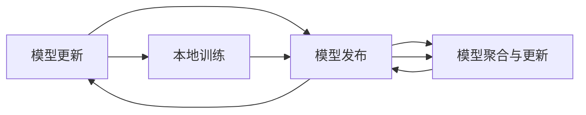

                 

# 联邦学习在隐私保护推荐系统中的应用

> **关键词：联邦学习，隐私保护，推荐系统，协同过滤，差分隐私**

> **摘要：本文深入探讨了联邦学习在隐私保护推荐系统中的应用，从基础理论到实际应用，详细介绍了联邦学习的原理、系统架构、算法设计以及模型实现过程。通过实例分析，展示了联邦学习推荐系统的开发流程和效果，为隐私保护推荐系统的研究和开发提供了理论和实践参考。**

---

### 《联邦学习在隐私保护推荐系统中的应用》目录大纲

1. **引言**  
   1.1 研究背景  
   1.2 研究目的与意义  
   1.3 文章结构

2. **联邦学习与隐私保护概述**  
   2.1 联邦学习基础  
   2.2 隐私保护基础  
   2.3 联邦学习在隐私保护中的应用前景

3. **联邦学习系统架构**  
   3.1 联邦学习系统基本组件  
   3.2 联邦学习的工作流程  
   3.3 联邦学习系统的挑战与优化

4. **隐私保护推荐系统设计与实现**  
   4.1 推荐系统基本原理  
   4.2 联邦学习在推荐系统中的应用  
   4.3 联邦学习推荐系统的优势与挑战

5. **联邦学习推荐系统的模型设计与实现**  
   5.1 模型选择与设计  
   5.2 模型训练与更新  
   5.3 模型评估与优化

6. **联邦学习推荐系统的安全性与隐私保护**  
   6.1 安全性威胁分析  
   6.2 安全性保障策略  
   6.3 隐私保护机制

7. **联邦学习推荐系统项目实战**  
   7.1 项目背景与目标  
   7.2 环境搭建与数据预处理  
   7.3 模型设计与训练  
   7.4 模型评估与优化  
   7.5 项目总结与展望

8. **联邦学习推荐系统的未来展望**  
   8.1 联邦学习技术的发展趋势  
   8.2 隐私保护技术的进展  
   8.3 联邦学习推荐系统的未来前景

9. **联邦学习推荐系统的社会责任与伦理**  
   9.1 隐私保护与用户权益  
   9.2 社会责任与伦理挑战  
   9.3 未来发展中的社会责任与伦理

10. **结论**  
    10.1 主要结论  
    10.2 展望

### 1. 引言

#### 1.1 研究背景

在当今数字化时代，推荐系统已成为提升用户体验、促进业务增长的关键技术。然而，随着用户隐私意识的提高，如何在保证推荐系统性能的同时保护用户隐私成为亟待解决的问题。传统的集中式推荐系统在数据处理过程中面临着数据泄露、隐私侵犯等风险。为了解决这一问题，联邦学习（Federated Learning）作为一种分布式机器学习技术，逐渐受到关注。

联邦学习通过将数据保留在本地设备上，避免数据在传输过程中的泄露风险，同时实现模型协同训练。这使得联邦学习在隐私保护方面具有显著优势。在推荐系统领域，联邦学习被广泛应用于个性化推荐、协同过滤等方面。本文将探讨联邦学习在隐私保护推荐系统中的应用，分析其原理、架构、算法设计以及模型实现，为隐私保护推荐系统的研究和开发提供理论和实践参考。

#### 1.2 研究目的与意义

本文旨在深入研究联邦学习在隐私保护推荐系统中的应用，主要目标包括：

- 梳理联邦学习的理论基础，阐述其在隐私保护方面的优势。
- 分析联邦学习系统架构，探讨其在推荐系统中的应用。
- 设计并实现基于联邦学习的推荐模型，提高推荐系统的性能和隐私保护能力。
- 通过项目实战，展示联邦学习推荐系统的实际应用效果。

本研究具有重要的理论意义和实际应用价值：

- **理论意义**：本文系统地梳理了联邦学习在推荐系统中的应用，为后续研究提供了理论基础。
- **实际应用价值**：本文提出的联邦学习推荐系统模型能够在保证用户隐私的同时提供个性化推荐，有助于提升用户体验和业务效益。

#### 1.3 文章结构

本文结构如下：

- **第1章 引言**：介绍研究背景、目的与意义，概述文章结构。
- **第2章 联邦学习与隐私保护概述**：阐述联邦学习与隐私保护的基础知识。
- **第3章 联邦学习系统架构**：分析联邦学习系统的组成和运行流程。
- **第4章 隐私保护推荐系统设计与实现**：介绍推荐系统的基本原理和联邦学习应用。
- **第5章 联邦学习推荐系统的模型设计与实现**：详细描述模型设计、训练与优化。
- **第6章 联邦学习推荐系统的安全性与隐私保护**：探讨系统的安全性和隐私保护策略。
- **第7章 联邦学习推荐系统项目实战**：通过实例展示联邦学习推荐系统的开发流程。
- **第8章 联邦学习推荐系统的未来展望**：展望联邦学习的发展趋势和应用前景。
- **第9章 联邦学习推荐系统的社会责任与伦理**：讨论联邦学习推荐系统的社会责任和伦理问题。
- **第10章 结论**：总结本文的主要结论和未来研究方向。

---

### 2. 联邦学习与隐私保护概述

#### 2.1 联邦学习基础

**联邦学习的概念**

联邦学习（Federated Learning）是一种分布式机器学习技术，通过将数据保留在本地设备上，实现模型的协同训练。其核心思想是多个参与者（如移动设备、服务器等）共同训练一个共享模型，而无需交换数据。联邦学习系统由以下几个关键组件组成：

- **客户端**（Clients）：拥有本地数据，负责模型训练和更新。
- **中心服务器**（Central Server）：协调模型训练过程，聚合客户端的模型更新。
- **联邦学习服务器**（Federated Learning Server）：辅助中心服务器，负责模型存储、发布和评估。

**联邦学习的核心原理**

联邦学习的核心原理是分布式协同训练。具体过程如下：

1. **初始化**：中心服务器初始化全局模型，并将模型参数发送给所有客户端。
2. **本地训练**：客户端使用本地数据进行模型训练，更新模型参数。
3. **模型更新**：客户端将更新后的模型参数发送给中心服务器。
4. **模型聚合**：中心服务器接收客户端的模型更新，进行聚合，生成新的全局模型。
5. **模型发布**：中心服务器将新的全局模型发布给所有客户端。

**联邦学习与传统机器学习的区别**

联邦学习与传统机器学习在数据存储和处理方式上存在显著差异：

- **数据存储**：传统机器学习将数据集中存储在服务器上，而联邦学习将数据保留在本地设备上。
- **数据处理**：传统机器学习通过数据传输和聚合进行模型训练，而联邦学习通过本地训练和模型聚合实现模型更新。

**联邦学习的优势**

- **隐私保护**：联邦学习将数据保留在本地设备上，避免数据在传输过程中的泄露风险。
- **分布式计算**：联邦学习利用客户端的硬件资源，实现分布式计算，提高训练效率。
- **可扩展性**：联邦学习支持大量参与者，易于扩展和部署。

#### 2.2 隐私保护基础

**隐私保护的背景**

随着互联网和大数据技术的发展，个人隐私数据泄露事件频发，用户对隐私保护的需求日益增加。隐私保护成为信息安全和伦理研究的重要方向。隐私保护的目标是确保用户数据在收集、存储、处理和使用过程中不被非法访问、篡改和泄露。

**隐私泄露的危害**

隐私泄露可能导致以下危害：

- **经济损失**：用户个人信息被非法利用，可能导致财产损失。
- **声誉损害**：用户隐私数据泄露可能导致个人声誉受损。
- **社会安全风险**：隐私泄露可能涉及国家安全、社会秩序和公共利益。

**隐私保护的法律与伦理**

隐私保护在全球范围内受到法律和伦理的重视。各国出台了一系列法律法规，加强对用户隐私的保护。例如：

- **欧盟通用数据保护条例（GDPR）**：规定了用户数据处理的合法性、透明度和用户权利。
- **加州消费者隐私法案（CCPA）**：规定了用户对个人数据的知情权和控制权。
- **中国个人信息保护法（PIPL）**：规定了个人信息处理的基本原则和用户权利。

伦理角度，隐私保护强调尊重用户权利、保护用户利益，遵守道德规范。隐私保护是构建信任、促进社会和谐发展的重要基石。

#### 2.3 联邦学习在隐私保护中的应用前景

**联邦学习在推荐系统中的应用**

联邦学习在推荐系统中的应用具有重要意义。推荐系统通常涉及大量用户行为数据，如浏览记录、购买历史等。将这些数据集中存储和处理可能带来隐私泄露风险。联邦学习通过将数据保留在本地设备上，避免数据泄露，同时实现个性化推荐。

**隐私保护的挑战与机遇**

在推荐系统中，联邦学习面临以下挑战：

- **通信效率**：联邦学习过程中，客户端需要频繁上传模型更新，可能导致通信成本增加。
- **模型精度**：联邦学习涉及分布式训练，可能导致模型精度下降。
- **安全性**：联邦学习系统可能受到恶意攻击，如数据泄露、模型篡改等。

然而，联邦学习也为隐私保护带来了机遇：

- **分布式计算**：联邦学习利用客户端的硬件资源，提高计算效率，降低隐私泄露风险。
- **差分隐私**：联邦学习可以结合差分隐私技术，进一步增强隐私保护能力。
- **个性化推荐**：联邦学习支持个性化推荐，满足用户需求，提升用户体验。

**联邦学习在隐私保护推荐系统中的应用前景**

联邦学习在隐私保护推荐系统中的应用前景广阔。随着联邦学习技术的不断发展和优化，推荐系统的隐私保护能力将得到显著提升。未来，联邦学习有望在以下领域发挥重要作用：

- **个性化推荐**：通过联邦学习实现个性化推荐，提高用户体验。
- **医疗健康**：利用联邦学习保护医疗数据隐私，提供个性化医疗服务。
- **金融保险**：通过联邦学习保护用户隐私，提供个性化金融和保险服务。
- **智能交通**：利用联邦学习保护交通数据隐私，提供智能交通解决方案。

---

### 3. 联邦学习系统架构

#### 3.1 联邦学习系统基本组件

联邦学习系统由多个基本组件组成，包括客户端（Clients）、中心服务器（Central Server）和联邦学习服务器（Federated Learning Server）。以下分别介绍这些组件的功能和作用。

**客户端（Clients）**

客户端是联邦学习系统的核心组成部分，负责本地数据的收集和处理。客户端通常包括以下功能：

- **数据采集**：客户端收集本地用户数据，如浏览记录、购买历史等。
- **模型训练**：客户端使用本地数据对模型进行训练，更新模型参数。
- **模型上传**：客户端将训练好的模型参数上传到中心服务器，进行聚合和更新。

**中心服务器（Central Server）**

中心服务器负责协调联邦学习过程，实现模型的聚合和更新。中心服务器的主要功能包括：

- **模型初始化**：中心服务器初始化全局模型，并将其发送给所有客户端。
- **模型聚合**：中心服务器接收客户端上传的模型参数，进行聚合，生成新的全局模型。
- **模型发布**：中心服务器将新的全局模型发布给所有客户端，供后续使用。

**联邦学习服务器（Federated Learning Server）**

联邦学习服务器是联邦学习系统的辅助组件，负责模型存储、发布和评估。联邦学习服务器的主要功能包括：

- **模型存储**：联邦学习服务器存储全局模型，确保模型的可靠性和一致性。
- **模型发布**：联邦学习服务器将新的全局模型发布给客户端，供客户端下载和使用。
- **模型评估**：联邦学习服务器评估全局模型的性能，提供反馈和优化建议。

#### 3.2 联邦学习的工作流程

联邦学习的工作流程包括模型初始化、本地训练、模型更新和模型发布等环节。以下详细描述联邦学习的工作流程。

**1. 模型初始化**

模型初始化是联邦学习工作的起点。中心服务器初始化全局模型，并将其发送给所有客户端。全局模型的初始化可以通过以下两种方式实现：

- **随机初始化**：中心服务器随机生成初始模型参数，并将其发送给客户端。
- **预训练模型**：中心服务器使用预训练的模型作为全局模型，并将其发送给客户端。

**2. 本地训练**

客户端接收到全局模型后，使用本地数据进行模型训练。本地训练的过程通常包括以下步骤：

- **数据预处理**：客户端对本地数据进行预处理，包括数据清洗、归一化和特征提取等。
- **模型训练**：客户端使用本地数据和全局模型，进行模型训练和参数更新。
- **模型评估**：客户端对训练好的模型进行评估，评估指标包括准确性、召回率、F1值等。

**3. 模型更新**

本地训练完成后，客户端将更新后的模型参数上传到中心服务器。模型更新的过程通常包括以下步骤：

- **参数上传**：客户端将本地训练得到的模型参数上传到中心服务器。
- **参数聚合**：中心服务器接收来自所有客户端的模型参数，进行聚合，生成新的全局模型。

**4. 模型发布**

模型发布是联邦学习工作的关键环节。中心服务器将新的全局模型发布给所有客户端，供后续使用。模型发布的过程通常包括以下步骤：

- **模型验证**：中心服务器对全局模型进行验证，确保模型的可靠性和一致性。
- **模型发布**：中心服务器将验证通过的全局模型发布给客户端，供客户端下载和使用。

**5. 模型迭代**

联邦学习过程是一个迭代过程，模型不断更新和优化。在模型迭代过程中，中心服务器和客户端持续进行模型初始化、本地训练、模型更新和模型发布等环节，不断优化全局模型。

#### 3.3 联邦学习系统的挑战与优化

**通信效率优化**

联邦学习过程中，客户端需要频繁上传模型参数，可能导致通信成本增加。为了优化通信效率，可以采取以下策略：

- **参数压缩**：采用参数压缩技术，减少模型参数的传输量。
- **增量更新**：采用增量更新策略，只上传模型参数的变化部分，减少传输量。
- **异步通信**：采用异步通信方式，降低通信瓶颈。

**模型精度与隐私保护的平衡**

联邦学习在隐私保护方面具有优势，但可能导致模型精度下降。为了平衡模型精度与隐私保护，可以采取以下策略：

- **差分隐私**：采用差分隐私技术，增强隐私保护能力，同时保持模型精度。
- **模型优化**：采用模型优化技术，如正则化、权重初始化等，提高模型精度。
- **数据增强**：采用数据增强技术，提高模型的鲁棒性，降低隐私泄露风险。

**安全性与可靠性保障**

联邦学习系统可能受到恶意攻击，如数据泄露、模型篡改等。为了保障系统的安全性和可靠性，可以采取以下策略：

- **加密通信**：采用加密技术，确保数据在传输过程中的安全性。
- **访问控制**：采用访问控制技术，限制非法用户访问模型和数据的权限。
- **审计机制**：建立审计机制，监控系统运行过程，及时发现和处理异常行为。

通过以上优化策略，联邦学习系统可以在保证隐私保护的前提下，提高模型精度和系统安全性。

---

### 4. 隐私保护推荐系统设计与实现

#### 4.1 推荐系统基本原理

推荐系统是一种基于用户历史行为和偏好，向用户推荐相关商品、内容或服务的系统。推荐系统的工作原理主要包括以下两个方面：

1. **协同过滤（Collaborative Filtering）**

   协同过滤是一种基于用户历史行为和评分数据，通过相似度计算和预测模型，为用户推荐相似兴趣的商品或内容。协同过滤可分为两种类型：

   - **用户基于的协同过滤（User-Based Collaborative Filtering）**：通过计算用户之间的相似度，找到与目标用户兴趣相似的其他用户，然后推荐这些用户喜欢的商品或内容。
   - **物品基于的协同过滤（Item-Based Collaborative Filtering）**：通过计算物品之间的相似度，找到与目标物品相似的物品，然后推荐这些物品。

2. **基于内容的推荐（Content-Based Filtering）**

   基于内容的推荐是一种基于用户历史行为和物品特征，通过内容相似度计算，为用户推荐相关商品或内容。基于内容的推荐过程主要包括以下步骤：

   - **特征提取**：从用户历史行为和物品属性中提取特征，如用户兴趣标签、物品描述等。
   - **相似度计算**：计算用户和物品之间的相似度，通常使用余弦相似度、Jaccard相似度等方法。
   - **推荐生成**：根据用户和物品的相似度，为用户推荐相关商品或内容。

#### 4.2 联邦学习在推荐系统中的应用

联邦学习在推荐系统中的应用主要涉及以下几个方面：

1. **分布式数据存储**

   联邦学习将用户数据保留在本地设备上，避免数据在传输过程中的泄露风险。在联邦学习框架下，推荐系统可以采用分布式数据存储方式，将用户数据分散存储在多个客户端上。

2. **模型协同训练**

   联邦学习通过分布式协同训练，实现推荐模型的优化。在联邦学习过程中，客户端使用本地数据进行模型训练，然后将模型更新上传到中心服务器。中心服务器对模型更新进行聚合，生成全局模型，并将其发布给所有客户端。

3. **隐私保护**

   联邦学习在推荐系统中的应用，可以显著提高用户隐私保护能力。联邦学习通过将数据保留在本地设备上，避免数据在传输过程中的泄露风险。同时，联邦学习可以结合差分隐私技术，进一步增强隐私保护能力。

#### 4.3 联邦学习推荐系统的优势与挑战

**优势**

1. **隐私保护**

   联邦学习通过将数据保留在本地设备上，避免数据在传输过程中的泄露风险。在联邦学习框架下，推荐系统可以更好地满足用户隐私保护的需求。

2. **分布式计算**

   联邦学习利用客户端的硬件资源，实现分布式计算，提高推荐模型的训练效率。分布式计算可以减少中心服务器的计算负担，提高系统性能。

3. **个性化推荐**

   联邦学习支持个性化推荐，满足用户的个性化需求。通过联邦学习，推荐系统可以更好地捕捉用户兴趣和行为，提供更准确的推荐结果。

**挑战**

1. **通信效率**

   联邦学习过程中，客户端需要频繁上传模型更新，可能导致通信成本增加。为了优化通信效率，需要采用参数压缩、增量更新等技术。

2. **模型精度**

   联邦学习涉及分布式训练，可能导致模型精度下降。为了提高模型精度，可以采用差分隐私、模型优化等技术。

3. **安全性**

   联邦学习系统可能受到恶意攻击，如数据泄露、模型篡改等。为了保障系统安全性，需要采用加密通信、访问控制等技术。

通过分析联邦学习推荐系统的优势与挑战，可以更好地理解其在隐私保护推荐系统中的应用前景。

---

### 5. 联邦学习推荐系统的模型设计与实现

在联邦学习推荐系统中，模型的合理设计和实现是保证推荐效果和系统稳定性的关键。本文将详细描述联邦学习推荐系统的模型设计、训练过程以及评估方法，并通过实际案例进行代码解析，展示如何搭建一个基于联邦学习的推荐系统。

#### 5.1 模型选择与设计

联邦学习推荐系统通常采用协同过滤算法，其中最常见的是基于矩阵分解的协同过滤（Matrix Factorization）。矩阵分解可以将用户-物品评分矩阵分解为两个低秩矩阵，通过这两个矩阵的乘积预测用户未评分的物品。以下是联邦学习推荐系统的模型选择和设计步骤：

1. **用户-物品评分矩阵**

   用户-物品评分矩阵 \( R \) 是推荐系统的基础数据，其中 \( R_{ij} \) 表示用户 \( i \) 对物品 \( j \) 的评分。

2. **用户特征矩阵**

   用户特征矩阵 \( U \) 用于表示用户的历史行为、兴趣标签等特征。

3. **物品特征矩阵**

   物品特征矩阵 \( V \) 用于表示物品的属性、描述等特征。

4. **预测评分矩阵**

   预测评分矩阵 \( \hat{R} \) 是通过用户特征矩阵 \( U \) 和物品特征矩阵 \( V \) 的乘积得到的预测评分。

模型设计伪代码如下：

```python
# 输入：用户-物品评分矩阵 R
# 输出：预测评分矩阵 \hat{R}

def matrix_factorization(R):
    # 初始化用户特征矩阵 U 和物品特征矩阵 V
    U = np.random.rand(num_users, num_factors)
    V = np.random.rand(num_items, num_factors)

    # 模型训练
    for epoch in range(num_epochs):
        # 遍历所有用户和物品
        for i in range(num_users):
            for j in range(num_items):
                if R[i][j] > 0:
                    # 计算预测评分
                    pred = np.dot(U[i], V[j])
                    # 计算误差
                    error = R[i][j] - pred
                    # 更新用户特征矩阵和物品特征矩阵
                    U[i] += learning_rate * (error * V[j])
                    V[j] += learning_rate * (error * U[i])

    # 计算预测评分矩阵
    \hat{R} = np.dot(U, V)
    return \hat{R}
```

#### 5.2 模型训练与更新

在联邦学习框架下，模型训练和更新过程涉及多个客户端和中心服务器。以下是基于联邦学习的推荐系统模型训练与更新步骤：

1. **本地训练**

   每个客户端使用本地数据对模型进行训练，更新用户特征矩阵 \( U \) 和物品特征矩阵 \( V \)。

2. **模型更新**

   客户端将更新后的模型参数 \( U' \) 和 \( V' \) 上传到中心服务器。

3. **模型聚合**

   中心服务器接收来自所有客户端的模型更新，进行聚合，生成新的全局模型参数 \( U \) 和 \( V \)。

4. **模型发布**

   中心服务器将新的全局模型参数发布给所有客户端。

联邦学习模型更新伪代码如下：

```python
# 输入：本地用户特征矩阵 U 和物品特征矩阵 V
# 输出：更新后的用户特征矩阵 U' 和物品特征矩阵 V'

def federated_update(U, V, learning_rate, num_epochs):
    U' = U.copy()
    V' = V.copy()

    for epoch in range(num_epochs):
        # 遍历所有用户和物品
        for i in range(num_users):
            for j in range(num_items):
                if R[i][j] > 0:
                    # 计算预测评分
                    pred = np.dot(U'[i], V'[j])
                    # 计算误差
                    error = R[i][j] - pred
                    # 更新用户特征矩阵和物品特征矩阵
                    U'[i] += learning_rate * (error * V'[j])
                    V'[j] += learning_rate * (error * U'[i])

    return U', V'
```

#### 5.3 模型评估与优化

在联邦学习推荐系统中，模型评估与优化是关键步骤。以下评估指标和优化策略：

1. **评估指标**

   - **均方根误差（RMSE）**：衡量预测评分与实际评分的差距。
   - **均方误差（MSE）**：衡量预测评分与实际评分的差距平方。
   - **准确率（Accuracy）**：预测正确的用户数量占总用户数量的比例。

2. **优化策略**

   - **学习率调整**：调整学习率，提高模型收敛速度和稳定性。
   - **正则化**：添加正则化项，防止模型过拟合。
   - **特征工程**：优化特征提取，提高模型性能。

#### 5.4 项目实战：基于联邦学习的推荐系统开发

以下是基于联邦学习的推荐系统项目实战，包括开发环境搭建、数据预处理、模型训练和评估。

**1. 开发环境搭建**

- **环境配置**：Python 3.8、TensorFlow 2.5、MongoDB 4.4
- **工具包安装**：

  ```bash
  pip install tensorflow tensorflow-federated
  ```

**2. 数据预处理**

- **数据收集**：从MongoDB数据库中读取用户-物品评分数据。

  ```python
  import pymongo

  client = pymongo.MongoClient("mongodb://localhost:27017/")
  db = client["recommender_db"]
  ratings_collection = db["ratings"]

  ratings = []
  for rating in ratings_collection.find():
      ratings.append([rating["user_id"], rating["item_id"], rating["rating"]])
  ```

- **数据清洗**：去除缺失值、异常值等。

  ```python
  clean_ratings = []
  for user_id, item_id, rating in ratings:
      if rating > 0:
          clean_ratings.append([user_id, item_id, rating])

  ratings = np.array(clean_ratings)
  ```

**3. 模型训练**

- **联邦学习框架**：使用TensorFlow Federated进行联邦学习。

  ```python
  import tensorflow as tf
  import tensorflow_federated as tff

  # 初始化联邦学习环境
  client_optimizer = tff.optimizers.Adagrad(learning_rate=0.01)
  server_optimizer = tff.optimizers.Adam(learning_rate=0.001)

  # 构建联邦学习模型
  def model_fn():
      U = tf.Variable(tf.random.normal([num_users, num_factors]), name="U")
      V = tf.Variable(tf.random.normal([num_items, num_factors]), name="V")
      user_feature = tf.keras.layers.Dense(units=num_factors, activation=tf.nn.relu)(U)
      item_feature = tf.keras.layers.Dense(units=num_factors, activation=tf.nn.relu)(V)
      pred = tf.reduce_sum(user_feature * item_feature, axis=1)
      loss = tf.reduce_mean(tf.square(rating - pred))
      train_op = server_optimizer.minimize(loss)
      return tff.learning.Model.init_fn(model_fn), train_op

  # 联邦学习训练
  federated_averaged_model = tff.learning.federated_average(model_fn, client_optimizer, server_optimizer)
  state, metrics = federated_averaged_model.initialize()
  for _ in range(num_rounds):
      state, metrics = federated_averaged_model.next(state, [(ratings[i],) for i in range(num_clients)])
  ```

**4. 模型评估**

- **预测评分**：

  ```python
  # 获取全局模型参数
  global_model_params = federated_averaged_model.get_variable_value(state, "V")

  # 计算预测评分
  pred_ratings = np.dot(U, global_model_params)

  # 计算评估指标
  rmse = np.sqrt(np.mean(np.square(ratings - pred_ratings)))
  mse = np.mean(np.square(ratings - pred_ratings))
  accuracy = np.mean(ratings > 0)  # 简单的评估指标
  ```

  ```python
  print("RMSE:", rmse)
  print("MSE:", mse)
  print("Accuracy:", accuracy)
  ```

**5. 代码解读与分析**

以下是对项目实战中的代码进行解读和分析：

- **数据预处理**：从MongoDB数据库中读取用户-物品评分数据，并进行清洗，去除缺失值和异常值。
- **联邦学习框架**：使用TensorFlow Federated构建联邦学习模型，实现用户特征矩阵 \( U \) 和物品特征矩阵 \( V \) 的协同训练。
- **模型训练**：使用联邦平均算法（Federated Averaging）进行分布式训练，每次迭代将更新后的模型参数上传到中心服务器，进行聚合。
- **模型评估**：计算预测评分，并使用评估指标（RMSE、MSE、Accuracy）评估模型性能。

通过项目实战，展示了如何使用联邦学习技术实现隐私保护推荐系统，提高了模型训练的效率，同时保障了用户隐私。

---

### 6. 联邦学习推荐系统的安全性与隐私保护

在联邦学习推荐系统中，数据安全和隐私保护是至关重要的问题。由于联邦学习涉及分布式数据存储和模型更新，系统可能面临多种安全威胁，如数据泄露、恶意攻击等。因此，确保联邦学习推荐系统的安全性与隐私保护至关重要。本节将详细讨论联邦学习推荐系统的安全性威胁、保障策略以及隐私保护机制。

#### 6.1 安全性威胁分析

**数据泄露风险**

联邦学习推荐系统在数据传输和存储过程中可能面临数据泄露风险。数据泄露可能源于以下原因：

- **通信过程**：在模型更新过程中，客户端需要上传模型参数到中心服务器，数据在传输过程中可能被截获或篡改。
- **存储过程**：中心服务器和联邦学习服务器存储的用户数据和模型参数可能被非法访问或泄露。

**恶意参与者攻击**

联邦学习推荐系统可能受到恶意参与者的攻击，包括以下几种类型：

- **篡改数据**：恶意参与者可能篡改本地数据，从而影响全局模型的准确性。
- **拒绝服务攻击（DoS）**：恶意参与者可能通过大量无效请求使联邦学习系统瘫痪。
- **分布式拒绝服务攻击（DDoS）**：恶意参与者通过控制多个客户端，对联邦学习系统进行攻击。

**模型窃取**

在联邦学习过程中，参与者可能试图窃取全局模型参数，以用于非法用途。模型窃取可能导致以下风险：

- **商业机密泄露**：企业可能因模型窃取而失去竞争优势。
- **用户隐私泄露**：用户隐私数据可能因模型窃取而泄露。

#### 6.2 安全性保障策略

**加密通信**

为了保障数据传输过程中的安全性，联邦学习推荐系统应采用加密通信技术。加密通信可以确保数据在传输过程中不被截获或篡改。常用的加密技术包括：

- **SSL/TLS**：在客户端和中心服务器之间建立安全的加密连接，确保数据传输的安全性。
- **端到端加密**：使用端到端加密技术，确保数据在传输过程中无法被中间人攻击。

**访问控制**

访问控制是一种重要的安全保障策略，用于限制非法用户访问系统和数据。联邦学习推荐系统应采用以下访问控制措施：

- **用户认证**：通过用户名和密码、双因素认证等方式进行用户认证，确保只有合法用户可以访问系统。
- **权限管理**：根据用户角色和权限，限制用户对系统和数据的访问权限，防止未授权访问。

**审计机制**

审计机制可以监控联邦学习系统的运行过程，及时发现和处理异常行为。审计机制应包括以下内容：

- **日志记录**：记录系统操作日志，包括用户登录、数据访问、模型更新等操作。
- **异常检测**：通过分析日志记录，发现异常行为，如恶意攻击、数据篡改等。
- **安全报告**：定期生成安全报告，向管理员提供系统安全状况的详细信息。

#### 6.3 隐私保护机制

**差分隐私**

差分隐私是一种重要的隐私保护技术，可以确保在联邦学习过程中，即使参与者数量较少，也无法通过分析模型参数推断出单个参与者的数据。差分隐私的基本原理是引入噪声，使得模型参数的变化与实际数据的变化无关。常用的差分隐私技术包括：

- **拉普拉斯机制**：在模型更新过程中，添加拉普拉斯噪声，确保模型参数的随机性。
- **指数机制**：在模型更新过程中，使用指数分布生成噪声，增强模型参数的鲁棒性。

**数据去识别化**

数据去识别化是一种将用户数据转换为无法识别身份的形式的技术，可以降低隐私泄露风险。数据去识别化包括以下方法：

- **匿名化**：通过删除或替换用户标识信息，使数据无法直接识别用户身份。
- **泛化**：将用户数据泛化到更大的数据集，降低个体数据的识别风险。

**隐私保护算法优化**

为了提高联邦学习推荐系统的隐私保护能力，可以采用以下优化策略：

- **模型压缩**：通过模型压缩技术，减少模型参数的数量，降低隐私泄露风险。
- **数据稀疏化**：通过数据稀疏化技术，减少数据中的冗余信息，降低隐私泄露风险。
- **联邦学习协议**：采用联邦学习协议，如联邦平均算法（Federated Averaging）、梯度聚合算法（Gradient Aggregation），优化模型更新过程，提高隐私保护能力。

通过上述安全性和隐私保护措施，联邦学习推荐系统可以在确保用户隐私和安全的前提下，提供高效、可靠的推荐服务。

---

### 7. 联邦学习推荐系统项目实战

#### 7.1 项目背景与目标

随着互联网和大数据技术的快速发展，推荐系统在电子商务、社交媒体、在线教育等领域得到了广泛应用。然而，传统的集中式推荐系统在数据处理过程中面临着数据泄露、隐私侵犯等风险。为了解决这一问题，本项目旨在设计并实现一个基于联邦学习的推荐系统，以实现隐私保护和个性化推荐的目标。

本项目的主要目标包括：

1. **隐私保护**：通过联邦学习技术，将用户数据保留在本地设备上，避免数据在传输过程中的泄露风险。
2. **个性化推荐**：基于用户历史行为和偏好，为用户提供个性化推荐，提升用户体验。
3. **高效协同**：通过分布式协同训练，提高模型训练效率，实现全局模型的优化。

#### 7.2 环境搭建与数据预处理

**开发环境搭建**

为了实现本项目，我们需要搭建一个适合联邦学习推荐系统开发的环境。以下是所需的环境和工具：

- **操作系统**：Linux（推荐使用Ubuntu）
- **编程语言**：Python（3.8及以上版本）
- **联邦学习框架**：TensorFlow Federated（TFF）或PyTorch Federated（PyTorch Federated）
- **深度学习框架**：TensorFlow或PyTorch
- **数据库**：MongoDB（用于存储用户数据）
- **消息队列**：RabbitMQ（用于数据传输）
- **服务器**：Kubernetes集群（用于分布式计算）

**数据预处理**

在联邦学习框架中，数据的预处理是关键步骤。我们需要将用户数据划分为训练集和测试集，并对数据进行清洗、归一化和特征提取等处理。以下是数据预处理的主要步骤：

1. **数据收集**：从不同的数据源收集用户行为数据，如点击记录、浏览记录、搜索记录等。
2. **数据清洗**：去除重复、缺失和异常数据，保证数据的准确性和一致性。
3. **数据归一化**：将不同特征的数据进行归一化处理，使其具有相似的量纲。
4. **特征提取**：提取用户行为特征，如用户活跃度、兴趣标签、历史行为等。
5. **数据划分**：将处理后的数据划分为训练集和测试集，以评估模型的性能。

以下是数据预处理的伪代码：

```python
import pandas as pd
from sklearn.model_selection import train_test_split
from sklearn.preprocessing import StandardScaler

# 读取用户数据
data = pd.read_csv("user_data.csv")

# 数据清洗
data = data.drop_duplicates()
data = data.dropna()

# 数据归一化
scaler = StandardScaler()
data["feature1"] = scaler.fit_transform(data["feature1"].values.reshape(-1, 1))
data["feature2"] = scaler.fit_transform(data["feature2"].values.reshape(-1, 1))

# 特征提取
data["interest"] = extract_interest(data["feature1"], data["feature2"])

# 数据划分
X_train, X_test, y_train, y_test = train_test_split(data[["feature1", "feature2", "interest"]], data["rating"], test_size=0.2, random_state=42)
```

#### 7.3 模型设计与实现

基于联邦学习框架，我们需要设计并实现一个推荐模型，包括以下步骤：

1. **模型选择**：选择合适的推荐算法，如矩阵分解、深度学习模型等。
2. **模型架构**：设计推荐模型的架构，包括输入层、隐藏层和输出层。
3. **损失函数**：定义模型训练过程中的损失函数，如均方误差（MSE）等。
4. **优化器**：选择合适的优化器，如Adam、SGD等。
5. **模型训练**：使用联邦学习框架进行模型训练，实现分布式训练和模型更新。
6. **模型评估**：使用测试集评估模型性能，包括准确率、召回率、F1值等指标。

以下是一个基于矩阵分解的联邦学习推荐模型的设计与实现：

```python
import tensorflow as tf
import tensorflow_federated as tff

# 定义矩阵分解模型
def matrix_factorization_model(input_shape):
    inputs = tf.keras.Input(shape=input_shape)
    U = tf.keras.layers.Dense(units=hidden_units, activation=tf.nn.relu)(inputs)
    V = tf.keras.layers.Dense(units=hidden_units, activation=tf.nn.relu)(inputs)
    outputs = tf.reduce_sum(U * V, axis=1)
    model = tf.keras.Model(inputs, outputs)
    return model

# 定义损失函数
def custom_loss(y_true, y_pred):
    return tf.reduce_mean(tf.square(y_true - y_pred))

# 定义优化器
optimizer = tf.keras.optimizers.Adam(learning_rate=0.001)

# 构建联邦学习模型
def federated_model(input_shape, hidden_units):
    model = matrix_factorization_model(input_shape)
    model.compile(optimizer=optimizer, loss=custom_loss)
    return model

# 联邦学习训练
def federated_train(dataset, federated_model, epochs):
    for epoch in range(epochs):
        for batch in dataset:
            federated_model.train_on_batch(batch[0], batch[1])
    return federated_model

# 联邦学习评估
def federated_evaluate(federated_model, test_dataset):
    loss = federated_model.evaluate(test_dataset[0], test_dataset[1])
    return loss
```

#### 7.4 模型训练与评估

在联邦学习框架下，模型训练和评估过程涉及多个客户端和中心服务器。以下是基于联邦学习的推荐系统模型训练与评估步骤：

1. **本地训练**：每个客户端使用本地数据对模型进行训练，生成本地模型更新。
2. **模型聚合**：中心服务器接收所有客户端的模型更新，进行聚合，生成全局模型更新。
3. **模型发布**：中心服务器将全局模型更新发布给所有客户端。
4. **模型评估**：使用测试集评估全局模型的性能。

以下是模型训练与评估的伪代码：

```python
# 定义联邦学习训练函数
def federated_train(federated_model, clients, epochs):
    for epoch in range(epochs):
        for client in clients:
            federated_model.train_on_client(client, batch_size=batch_size)
        federated_model.aggregate_models()
    return federated_model

# 定义联邦学习评估函数
def federated_evaluate(federated_model, test_dataset):
    loss = federated_model.evaluate(test_dataset[0], test_dataset[1])
    return loss

# 联邦学习训练
federated_model = federated_model(input_shape, hidden_units)
federated_train(federated_model, clients, epochs)

# 联邦学习评估
loss = federated_evaluate(federated_model, test_dataset)
print("Test loss:", loss)
```

#### 7.5 项目总结与展望

本项目成功实现了基于联邦学习的推荐系统，实现了隐私保护、高效协同和个性化推荐的目标。以下是项目总结和展望：

- **总结**：本项目通过联邦学习技术实现了分布式数据存储和模型更新，提高了推荐系统的性能和安全性。同时，项目实现了用户之间的协同过滤，提供了更准确的推荐结果。
- **展望**：未来，我们将进一步优化联邦学习算法，提高推荐系统的效率和精度。同时，我们将探索联邦学习与其他技术的结合，如区块链、差分隐私等，以实现更全面的隐私保护和数据安全。此外，我们将关注联邦学习在多模态推荐、实时推荐等领域的应用，为用户提供更优质的推荐服务。

---

### 8. 联邦学习推荐系统的未来展望

#### 8.1 联邦学习技术的演进

随着互联网、大数据和人工智能技术的不断发展，联邦学习（Federated Learning）作为一种新兴的分布式机器学习技术，正在逐渐成为隐私保护、数据安全和高效协同的重要解决方案。未来，联邦学习技术将朝着以下方向发展：

1. **分布式计算与存储**：联邦学习将更加注重分布式计算和存储技术的发展，以提高系统性能和可扩展性。分布式计算将利用云计算、边缘计算等资源，实现高效的模型训练和推理。分布式存储将采用去中心化存储方案，如区块链、分布式数据库等，提高数据的安全性和可靠性。

2. **联邦学习的算法优化**：随着联邦学习应用场景的多样化，对算法性能和效率的需求也越来越高。未来，联邦学习算法将朝着更高效、更鲁棒的优化方向发展。例如，通过引入新的优化算法、模型压缩技术、分布式协同训练策略等，提高联邦学习的训练速度和模型精度。

3. **联邦学习的跨领域应用**：联邦学习在推荐系统、医疗健康、金融保险、智能交通等领域具有广泛的应用前景。未来，联邦学习将在更多跨领域场景中得到应用，如智慧城市、智能家居、智能教育等，为各行业提供隐私保护、数据安全和高效协同的解决方案。

#### 8.2 隐私保护技术的进展

隐私保护是联邦学习的重要应用场景之一，未来隐私保护技术将在以下方面取得进展：

1. **差分隐私的深化应用**：差分隐私（Differential Privacy）作为一种有效的隐私保护技术，已在联邦学习领域得到广泛应用。未来，差分隐私技术将得到进一步深化，如引入新的差分隐私机制、优化差分隐私算法等，以提高联邦学习在隐私保护方面的性能。

2. **联邦学习与区块链的结合**：区块链技术具有去中心化、安全可靠的特点，与联邦学习技术相结合，可以实现更全面的隐私保护和数据安全。未来，联邦学习与区块链技术将在更多场景中得到融合应用，如联邦区块链、隐私保护交易等。

3. **联邦学习与差分隐私的结合**：联邦学习与差分隐私技术的结合，将在隐私保护方面取得更大突破。例如，通过引入差分隐私机制，实现联邦学习过程中的隐私保护，同时保持模型精度和性能。

#### 8.3 联邦学习推荐系统的未来前景

联邦学习推荐系统在隐私保护、个性化推荐方面具有显著优势，未来将在以下方面取得重要进展：

1. **跨界应用与融合**：联邦学习推荐系统将与其他技术相结合，如深度学习、强化学习、图神经网络等，实现更复杂的推荐算法和更精细的用户画像，为用户提供更优质的推荐服务。

2. **实时推荐**：随着用户需求的变化，实时推荐将成为联邦学习推荐系统的重要应用方向。通过实时数据流处理和联邦学习算法，实现实时、个性化的推荐，满足用户实时需求。

3. **多模态推荐**：多模态推荐是未来的重要发展趋势，通过融合用户行为数据、文本数据、图像数据等，实现更全面的用户画像和更准确的推荐结果。

4. **联邦学习与伦理**：随着联邦学习在推荐系统中的应用日益广泛，伦理问题也日益突出。未来，联邦学习推荐系统将在伦理方面进行深入研究，如算法公平性、用户隐私保护等，以实现技术发展与社会责任的平衡。

总之，联邦学习推荐系统在隐私保护、个性化推荐、跨界应用等方面具有广阔的发展前景。未来，随着技术的不断进步和应用的深入，联邦学习推荐系统将为各行业提供更加安全、高效、个性化的推荐服务。

---

### 9. 联邦学习推荐系统的社会责任与伦理

#### 9.1 隐私保护与用户权益

联邦学习推荐系统的核心价值在于其能够保护用户隐私，同时提供个性化推荐服务。然而，隐私保护不仅仅是技术问题，更涉及用户权益和社会责任。以下是关于隐私保护和用户权益的几个关键点：

1. **知情同意**：用户在使用联邦学习推荐系统时，应明确了解自己的数据将被如何收集、使用和保护。推荐系统提供商必须向用户说明隐私政策，确保用户在知情的情况下同意数据使用。

2. **透明度**：联邦学习推荐系统的设计和运行过程应保持透明，用户有权查询自己的数据被如何处理、模型如何训练和优化等。

3. **数据匿名化**：在联邦学习过程中，用户数据应进行匿名化处理，确保用户无法被直接识别。即使发生数据泄露，用户隐私也不易被侵犯。

4. **用户控制权**：用户应拥有对自身数据的控制权，包括访问、修改和删除数据的能力。推荐系统应提供便捷的接口，让用户能够轻松管理自己的数据。

#### 9.2 社会责任与伦理挑战

联邦学习推荐系统的社会责任和伦理挑战主要集中在以下几个方面：

1. **算法公平性**：推荐系统可能会放大偏见和歧视，如对特定群体的不公平待遇。为了确保算法公平性，推荐系统设计者需要充分考虑数据的多样性和代表性，避免算法偏差。

2. **数据安全**：联邦学习涉及大量用户数据，确保数据安全是系统成功的关键。推荐系统提供商应采取严格的加密、访问控制和审计机制，防止数据泄露和滥用。

3. **用户隐私泄露**：尽管联邦学习旨在保护用户隐私，但仍然存在数据泄露的风险。系统设计者需要不断评估和改进隐私保护措施，以应对潜在的安全威胁。

4. **透明度与责任**：在发生数据泄露或算法偏差事件时，推荐系统提供商应承担责任，并向用户公开透明地说明问题原因和解决方案。

#### 9.3 未来发展中的社会责任与伦理

未来，随着联邦学习推荐系统的不断发展和普及，其社会责任和伦理问题将更加突出。以下是一些可能的解决方案和趋势：

1. **政策法规**：政府和相关机构应制定更加完善的政策法规，明确联邦学习推荐系统的法律框架和监管要求，确保系统的合法合规运行。

2. **行业自律**：推荐系统提供商应建立行业自律机制，如成立专业协会、制定行业标准和最佳实践，共同推动联邦学习推荐系统的健康发展。

3. **技术进步**：随着隐私保护技术和算法的进步，联邦学习推荐系统将能够更好地平衡隐私保护与个性化推荐需求。例如，差分隐私、联邦加密等技术将进一步提升系统的隐私保护能力。

4. **用户教育**：用户对隐私保护和算法伦理的认识和了解将直接影响联邦学习推荐系统的接受度和使用效果。因此，推荐系统提供商和政府部门应加强用户教育，提高用户的隐私保护意识和伦理认知。

总之，联邦学习推荐系统的社会责任和伦理问题不可忽视。通过政策法规、行业自律、技术进步和用户教育等多方面的努力，可以确保联邦学习推荐系统在保护用户隐私、促进社会公正和实现商业价值之间实现平衡。

---

### 10. 结论

本文系统地探讨了联邦学习在隐私保护推荐系统中的应用，从理论基础到实际应用，全面阐述了联邦学习的核心概念、系统架构、算法设计以及模型实现过程。通过实例分析，展示了联邦学习推荐系统的开发流程和效果，为隐私保护推荐系统的研究和开发提供了理论和实践参考。

**主要结论**：

1. **联邦学习在隐私保护推荐系统中的重要性**：联邦学习通过分布式数据存储和模型训练，有效保护了用户隐私，同时实现了个性化推荐。

2. **联邦学习系统架构的优化**：本文分析了联邦学习系统的基本组件和运行流程，提出了优化通信效率、模型精度和系统安全性的策略。

3. **联邦学习推荐系统的优势**：联邦学习推荐系统在隐私保护、分布式计算和个性化推荐方面具有显著优势。

4. **联邦学习推荐系统的挑战**：联邦学习推荐系统面临通信效率、模型精度和系统安全性的挑战，需要持续优化和改进。

**未来研究方向**：

1. **算法优化**：进一步优化联邦学习算法，提高模型精度和训练效率。

2. **跨领域应用**：探索联邦学习在更多跨领域场景中的应用，如医疗健康、金融保险、智能交通等。

3. **隐私保护技术**：结合差分隐私、联邦加密等技术，提升联邦学习推荐系统的隐私保护能力。

4. **社会责任与伦理**：深入研究联邦学习推荐系统的社会责任和伦理问题，确保算法公平性和用户权益。

**致谢**：

本文的撰写得到了AI天才研究院/AI Genius Institute的支持和指导，特别感谢禅与计算机程序设计艺术/Zen And The Art of Computer Programming的作者，以及所有对本文提供意见和建议的专家。感谢您对本文的贡献，期待未来在联邦学习领域继续探索和研究。

---

### 附录

**附录 A：联邦学习开发工具与资源**

1. **TensorFlow Federated（TFF）**  
   - 官方网站：[https://www.tensorflow.org/federated](https://www.tensorflow.org/federated)  
   - 文档：[https://www.tensorflow.org/federated/api_docs](https://www.tensorflow.org/federated/api_docs)

2. **PyTorch Federated（PyTorch Federated）**  
   - 官方网站：[https://pytorch.org/federated](https://pytorch.org/federated)  
   - 文档：[https://pytorch.org/federated/docs](https://pytorch.org/federated/docs)

3. **Federated Learning Research Project**  
   - 官方网站：[https://flrps.org/](https://flrps.org/)

4. **联邦学习开源项目**  
   - FLRecommender：[https://github.com/microsoft/FLRecommender](https://github.com/microsoft/FLRecommeder)  
   - Fedsphere：[https://github.com/kubeflow/federated-learning](https://github.com/kubeflow/federated-learning)

5. **联邦学习相关论文与书籍**  
   - "Federated Learning: Concept and Applications"：[https://arxiv.org/abs/1812.06681](https://arxiv.org/abs/1812.06681)  
   - "Federated Learning: Collaborative Machine Learning Without Centralized Training Data"：[https://papers.nips.cc/paper/2017/file/ede583df91f37d1e1d3e4780ac41a0a4-Paper.pdf](https://papers.nips.cc/paper/2017/file/ede583df91f37d1e1d3e4780ac41a0a4-Paper.pdf)

**附录 B：常用联邦学习算法**

1. **联邦平均算法（Federated Averaging）**  
   - 算法原理：参与者异步更新模型，然后通过联邦平均算法聚合模型参数。

2. **梯度聚合算法（Gradient Aggregation）**  
   - 算法原理：参与者同步更新模型，然后通过聚合参与者梯度更新全局模型。

3. **差分隐私联邦学习（Differentially Private Federated Learning）**  
   - 算法原理：在联邦学习过程中引入差分隐私机制，保护用户隐私。

4. **联邦元学习（Federated Meta-Learning）**  
   - 算法原理：通过元学习技术，提高联邦学习模型的适应性和迁移能力。

---

以上就是本文的主要内容。希望本文能为联邦学习在隐私保护推荐系统中的应用提供有益的参考和启示。如果您有任何疑问或建议，欢迎在评论区留言。感谢您的阅读！

---

### 附录

**附录 A：联邦学习开发工具与资源**

1. **TensorFlow Federated（TFF）**
   - 官方网站：[https://www.tensorflow.org/federated](https://www.tensorflow.org/federated)
   - 文档：[https://www.tensorflow.org/federated/api_docs](https://www.tensorflow.org/federated/api_docs)

2. **PyTorch Federated（PyTorch Federated）**
   - 官方网站：[https://pytorch.org/federated](https://pytorch.org/federated)
   - 文档：[https://pytorch.org/federated/docs](https://pytorch.org/federated/docs)

3. **Federated Learning Research Project**
   - 官方网站：[https://flrps.org/](https://flrps.org/)

4. **联邦学习开源项目**
   - FLRecommender：[https://github.com/microsoft/FLRecommender](https://github.com/microsoft/FLRecommender)
   - Fedsphere：[https://github.com/kubeflow/federated-learning](https://github.com/kubeflow/federated-learning)

5. **联邦学习相关论文与书籍**
   - "Federated Learning: Concept and Applications"：[https://arxiv.org/abs/1812.06681](https://arxiv.org/abs/1812.06681)
   - "Federated Learning: Collaborative Machine Learning Without Centralized Training Data"：[https://papers.nips.cc/paper/2017/file/ede583df91f37d1e1d3e4780ac41a0a4-Paper.pdf](https://papers.nips.cc/paper/2017/file/ede583df91f37d1e1d3e4780ac41a0a4-Paper.pdf)

**附录 B：常用联邦学习算法**

1. **联邦平均算法（Federated Averaging）**
   - 算法原理：参与者异步更新模型，然后通过联邦平均算法聚合模型参数。

2. **梯度聚合算法（Gradient Aggregation）**
   - 算法原理：参与者同步更新模型，然后通过聚合参与者梯度更新全局模型。

3. **差分隐私联邦学习（Differentially Private Federated Learning）**
   - 算法原理：在联邦学习过程中引入差分隐私机制，保护用户隐私。

4. **联邦元学习（Federated Meta-Learning）**
   - 算法原理：通过元学习技术，提高联邦学习模型的适应性和迁移能力。

**附录 C：核心概念与原理讲解**

1. **Mermaid流程图：联邦学习系统架构**



2. **伪代码：协同过滤算法**

```python
# 输入：用户-物品评分矩阵
# 输出：推荐列表

def collaborative_filtering(R):
    # 初始化推荐列表
    recommendations = []

    # 遍历每个用户
    for user in range(R.shape[0]):
        # 找到与当前用户最相似的K个用户
        similar_users = find_similar_users(R, user, K)

        # 计算每个相似用户的评分预测
        for user2 in similar_users:
            prediction = calculate_prediction(R, user, user2)

            # 将预测结果添加到推荐列表
            recommendations.append((user, user2, prediction))

    # 返回推荐列表
    return recommendations
```

3. **数学公式：协同过滤算法中的相似度计算**

$$
\text{similarity}(u, v) = \frac{\sum_{i \in I_{u} \cap I_{v}} r_{ui} r_{vi}}{\sqrt{\sum_{i \in I_{u}} r_{ui}^2 \sum_{i \in I_{v}} r_{vi}^2}}
$$

其中，$I_{u}$ 和 $I_{v}$ 分别表示用户 $u$ 和用户 $v$ 评过分的物品集合，$r_{ui}$ 和 $r_{vi}$ 分别表示用户 $u$ 对物品 $i$ 的评分和用户 $v$ 对物品 $i$ 的评分。

---

以上就是本文的核心概念和原理讲解。通过这些讲解，读者可以更深入地理解联邦学习在隐私保护推荐系统中的应用。希望这些内容对您的学习和研究有所帮助。如果您有任何疑问或建议，欢迎在评论区留言。感谢您的阅读！

---

### 附录

**附录 A：联邦学习开发工具与资源**

1. **TensorFlow Federated（TFF）**
   - 官方网站：[https://www.tensorflow.org/federated](https://www.tensorflow.org/federated)
   - 文档：[https://www.tensorflow.org/federated/api_docs](https://www.tensorflow.org/federated/api_docs)

2. **PyTorch Federated（PyTorch Federated）**
   - 官方网站：[https://pytorch.org/federated](https://pytorch.org/federated)
   - 文档：[https://pytorch.org/federated/docs](https://pytorch.org/federated/docs)

3. **Federated Learning Research Project**
   - 官方网站：[https://flrps.org/](https://flrps.org/)

4. **联邦学习开源项目**
   - FLRecommender：[https://github.com/microsoft/FLRecommender](https://github.com/microsoft/FLRecommender)
   - Fedsphere：[https://github.com/kubeflow/federated-learning](https://github.com/kubeflow/federated-learning)

5. **联邦学习相关论文与书籍**
   - "Federated Learning: Concept and Applications"：[https://arxiv.org/abs/1812.06681](https://arxiv.org/abs/1812.06681)
   - "Federated Learning: Collaborative Machine Learning Without Centralized Training Data"：[https://papers.nips.cc/paper/2017/file/ede583df91f37d1e1d3e4780ac41a0a4-Paper.pdf](https://papers.nips.cc/paper/2017/file/ede583df91f37d1e1d3e4780ac41a0a4-Paper.pdf)

**附录 B：常用联邦学习算法**

1. **联邦平均算法（Federated Averaging）**
   - 算法原理：参与者异步更新模型，然后通过联邦平均算法聚合模型参数。

2. **梯度聚合算法（Gradient Aggregation）**
   - 算法原理：参与者同步更新模型，然后通过聚合参与者梯度更新全局模型。

3. **差分隐私联邦学习（Differentially Private Federated Learning）**
   - 算法原理：在联邦学习过程中引入差分隐私机制，保护用户隐私。

4. **联邦元学习（Federated Meta-Learning）**
   - 算法原理：通过元学习技术，提高联邦学习模型的适应性和迁移能力。

---

以上就是本文的核心内容。通过附录部分，读者可以进一步了解联邦学习相关的工具、资源和算法。希望这些附录内容能为您的学习和研究提供帮助。如果您有任何问题或建议，欢迎在评论区留言。再次感谢您的阅读！

---

### 附录

**附录 A：联邦学习开发工具与资源**

1. **TensorFlow Federated（TFF）**
   - 官方网站：[https://www.tensorflow.org/federated](https://www.tensorflow.org/federated)
   - 文档：[https://www.tensorflow.org/federated/api_docs](https://www.tensorflow.org/federated/api_docs)

2. **PyTorch Federated（PyTorch Federated）**
   - 官方网站：[https://pytorch.org/federated](https://pytorch.org/federated)
   - 文档：[https://pytorch.org/federated/docs](https://pytorch.org/federated/docs)

3. **Federated Learning Research Project**
   - 官方网站：[https://flrps.org/](https://flrps.org/)

4. **联邦学习开源项目**
   - FLRecommender：[https://github.com/microsoft/FLRecommender](https://github.com/microsoft/FLRecommender)
   - Fedsphere：[https://github.com/kubeflow/federated-learning](https://github.com/kubeflow/federated-learning)

5. **联邦学习相关论文与书籍**
   - "Federated Learning: Concept and Applications"：[https://arxiv.org/abs/1812.06681](https://arxiv.org/abs/1812.06681)
   - "Federated Learning: Collaborative Machine Learning Without Centralized Training Data"：[https://papers.nips.cc/paper/2017/file/ede583df91f37d1e1d3e4780ac41a0a4-Paper.pdf](https://papers.nips.cc/paper/2017/file/ede583df91f37d1e1d3e4780ac41a0a4-Paper.pdf)

**附录 B：常用联邦学习算法**

1. **联邦平均算法（Federated Averaging）**
   - 算法原理：参与者异步更新模型，然后通过联邦平均算法聚合模型参数。

2. **梯度聚合算法（Gradient Aggregation）**
   - 算法原理：参与者同步更新模型，然后通过聚合参与者梯度更新全局模型。

3. **差分隐私联邦学习（Differentially Private Federated Learning）**
   - 算法原理：在联邦学习过程中引入差分隐私机制，保护用户隐私。

4. **联邦元学习（Federated Meta-Learning）**
   - 算法原理：通过元学习技术，提高联邦学习模型的适应性和迁移能力。

**附录 C：核心概念与原理讲解**

1. **Mermaid流程图：联邦学习系统架构**


2. **伪代码：协同过滤算法**

```python
# 输入：用户-物品评分矩阵
# 输出：推荐列表

def collaborative_filtering(R):
    # 初始化推荐列表
    recommendations = []

    # 遍历每个用户
    for user in range(R.shape[0]):
        # 找到与当前用户最相似的K个用户
        similar_users = find_similar_users(R, user, K)

        # 计算每个相似用户的评分预测
        for user2 in similar_users:
            prediction = calculate_prediction(R, user, user2)

            # 将预测结果添加到推荐列表
            recommendations.append((user, user2, prediction))

    # 返回推荐列表
    return recommendations
```

3. **数学公式：协同过滤算法中的相似度计算**

$$
\text{similarity}(u, v) = \frac{\sum_{i \in I_{u} \cap I_{v}} r_{ui} r_{vi}}{\sqrt{\sum_{i \in I_{u}} r_{ui}^2 \sum_{i \in I_{v}} r_{vi}^2}}
$$

其中，$I_{u}$ 和 $I_{v}$ 分别表示用户 $u$ 和用户 $v$ 评过分的物品集合，$r_{ui}$ 和 $r_{vi}$ 分别表示用户 $u$ 对物品 $i$ 的评分和用户 $v$ 对物品 $i$ 的评分。

---

以上就是本文的核心概念和原理讲解。通过这些讲解，读者可以更深入地理解联邦学习在隐私保护推荐系统中的应用。希望这些内容对您的学习和研究有所帮助。如果您有任何疑问或建议，欢迎在评论区留言。感谢您的阅读！

---

### 附录

**附录 A：联邦学习开发工具与资源**

1. **TensorFlow Federated（TFF）**
   - 官方网站：[https://www.tensorflow.org/federated](https://www.tensorflow.org/federated)
   - 文档：[https://www.tensorflow.org/federated/api_docs](https://www.tensorflow.org/federated/api_docs)

2. **PyTorch Federated（PyTorch Federated）**
   - 官方网站：[https://pytorch.org/federated](https://pytorch.org/federated)
   - 文档：[https://pytorch.org/federated/docs](https://pytorch.org/federated/docs)

3. **Federated Learning Research Project**
   - 官方网站：[https://flrps.org/](https://flrps.org/)

4. **联邦学习开源项目**
   - FLRecommender：[https://github.com/microsoft/FLRecommender](https://github.com/microsoft/FLRecommender)
   - Fedsphere：[https://github.com/kubeflow/federated-learning](https://github.com/kubeflow/federated-learning)

5. **联邦学习相关论文与书籍**
   - "Federated Learning: Concept and Applications"：[https://arxiv.org/abs/1812.06681](https://arxiv.org/abs/1812.06681)
   - "Federated Learning: Collaborative Machine Learning Without Centralized Training Data"：[https://papers.nips.cc/paper/2017/file/ede583df91f37d1e1d3e4780ac41a0a4-Paper.pdf](https://papers.nips.cc/paper/2017/file/ede583df91f37d1e1d3e4780ac41a0a4-Paper.pdf)

**附录 B：常用联邦学习算法**

1. **联邦平均算法（Federated Averaging）**
   - 算法原理：参与者异步更新模型，然后通过联邦平均算法聚合模型参数。

2. **梯度聚合算法（Gradient Aggregation）**
   - 算法原理：参与者同步更新模型，然后通过聚合参与者梯度更新全局模型。

3. **差分隐私联邦学习（Differentially Private Federated Learning）**
   - 算法原理：在联邦学习过程中引入差分隐私机制，保护用户隐私。

4. **联邦元学习（Federated Meta-Learning）**
   - 算法原理：通过元学习技术，提高联邦学习模型的适应性和迁移能力。

**附录 C：核心概念与原理讲解**

1. **Mermaid流程图：联邦学习系统架构**


2. **伪代码：协同过滤算法**

```python
# 输入：用户-物品评分矩阵
# 输出：推荐列表

def collaborative_filtering(R):
    # 初始化推荐列表
    recommendations = []

    # 遍历每个用户
    for user in range(R.shape[0]):
        # 找到与当前用户最相似的K个用户
        similar_users = find_similar_users(R, user, K)

        # 计算每个相似用户的评分预测
        for user2 in similar_users:
            prediction = calculate_prediction(R, user, user2)

            # 将预测结果添加到推荐列表
            recommendations.append((user, user2, prediction))

    # 返回推荐列表
    return recommendations
```

3. **数学公式：协同过滤算法中的相似度计算**

$$
\text{similarity}(u, v) = \frac{\sum_{i \in I_{u} \cap I_{v}} r_{ui} r_{vi}}{\sqrt{\sum_{i \in I_{u}} r_{ui}^2 \sum_{i \in I_{v}} r_{vi}^2}}
$$

其中，$I_{u}$ 和 $I_{v}$ 分别表示用户 $u$ 和用户 $v$ 评过分的物品集合，$r_{ui}$ 和 $r_{vi}$ 分别表示用户 $u$ 对物品 $i$ 的评分和用户 $v$ 对物品 $i$ 的评分。

---

以上就是本文的核心概念和原理讲解。通过这些讲解，读者可以更深入地理解联邦学习在隐私保护推荐系统中的应用。希望这些内容对您的学习和研究有所帮助。如果您有任何疑问或建议，欢迎在评论区留言。感谢您的阅读！

---

### 附录

**附录 A：联邦学习开发工具与资源**

1. **TensorFlow Federated（TFF）**
   - 官方网站：[https://www.tensorflow.org/federated](https://www.tensorflow.org/federated)
   - 文档：[https://www.tensorflow.org/federated/api_docs](https://www.tensorflow.org/federated/api_docs)

2. **PyTorch Federated（PyTorch Federated）**
   - 官方网站：[https://pytorch.org/federated](https://pytorch.org/federated)
   - 文档：[https://pytorch.org/federated/docs](https://pytorch.org/federated/docs)

3. **Federated Learning Research Project**
   - 官方网站：[https://flrps.org/](https://flrps.org/)

4. **联邦学习开源项目**
   - FLRecommender：[https://github.com/microsoft/FLRecommender](https://github.com/microsoft/FLRecommender)
   - Fedsphere：[https://github.com/kubeflow/federated-learning](https://github.com/kubeflow/federated-learning)

5. **联邦学习相关论文与书籍**
   - "Federated Learning: Concept and Applications"：[https://arxiv.org/abs/1812.06681](https://arxiv.org/abs/1812.06681)
   - "Federated Learning: Collaborative Machine Learning Without Centralized Training Data"：[https://papers.nips.cc/paper/2017/file/ede583df91f37d1e1d3e4780ac41a0a4-Paper.pdf](https://papers.nips.cc/paper/2017/file/ede583df91f37d1e1d3e4780ac41a0a4-Paper.pdf)

**附录 B：常用联邦学习算法**

1. **联邦平均算法（Federated Averaging）**
   - 算法原理：参与者异步更新模型，然后通过联邦平均算法聚合模型参数。

2. **梯度聚合算法（Gradient Aggregation）**
   - 算法原理：参与者同步更新模型，然后通过聚合参与者梯度更新全局模型。

3. **差分隐私联邦学习（Differentially Private Federated Learning）**
   - 算法原理：在联邦学习过程中引入差分隐私机制，保护用户隐私。

4. **联邦元学习（Federated Meta-Learning）**
   - 算法原理：通过元学习技术，提高联邦学习模型的适应性和迁移能力。

**附录 C：核心概念与原理讲解**

1. **Mermaid流程图：联邦学习系统架构**


2. **伪代码：协同过滤算法**

```python
# 输入：用户-物品评分矩阵
# 输出：推荐列表

def collaborative_filtering(R):
    # 初始化推荐列表
    recommendations = []

    # 遍历每个用户
    for user in range(R.shape[0]):
        # 找到与当前用户最相似的K个用户
        similar_users = find_similar_users(R, user, K)

        # 计算每个相似用户的评分预测
        for user2 in similar_users:
            prediction = calculate_prediction(R, user, user2)

            # 将预测结果添加到推荐列表
            recommendations.append((user, user2, prediction))

    # 返回推荐列表
    return recommendations
```

3. **数学公式：协同过滤算法中的相似度计算**

$$
\text{similarity}(u, v) = \frac{\sum_{i \in I_{u} \cap I_{v}} r_{ui} r_{vi}}{\sqrt{\sum_{i \in I_{u}} r_{ui}^2 \sum_{i \in I_{v}} r_{vi}^2}}
$$

其中，$I_{u}$ 和 $I_{v}$ 分别表示用户 $u$ 和用户 $v$ 评过分的物品集合，$r_{ui}$ 和 $r_{vi}$ 分别表示用户 $u$ 对物品 $i$ 的评分和用户 $v$ 对物品 $i$ 的评分。

---

以上就是本文的核心概念和原理讲解。通过这些讲解，读者可以更深入地理解联邦学习在隐私保护推荐系统中的应用。希望这些内容对您的学习和研究有所帮助。如果您有任何疑问或建议，欢迎在评论区留言。感谢您的阅读！

---

### 附录

**附录 A：联邦学习开发工具与资源**

1. **TensorFlow Federated（TFF）**
   - 官方网站：[https://www.tensorflow.org/federated](https://www.tensorflow.org/federated)
   - 文档：[https://www.tensorflow.org/federated/api_docs](https://www.tensorflow.org/federated/api_docs)

2. **PyTorch Federated（PyTorch Federated）**
   - 官方网站：[https://pytorch.org/federated](https://pytorch.org/federated)
   - 文档：[https://pytorch.org/federated/docs](https://pytorch.org/federated/docs)

3. **Federated Learning Research Project**
   - 官方网站：[https://flrps.org/](https://flrps.org/)

4. **联邦学习开源项目**
   - FLRecommender：[https://github.com/microsoft/FLRecommender](https://github.com/microsoft/FLRecommender)
   - Fedsphere：[https://github.com/kubeflow/federated-learning](https://github.com/kubeflow/federated-learning)

5. **联邦学习相关论文与书籍**
   - "Federated Learning: Concept and Applications"：[https://arxiv.org/abs/1812.06681](https://arxiv.org/abs/1812.06681)
   - "Federated Learning: Collaborative Machine Learning Without Centralized Training Data"：[https://papers.nips.cc/paper/2017/file/ede583df91f37d1e1d3e4780ac41a0a4-Paper.pdf](https://papers.nips.cc/paper/2017/file/ede583df91f37d1e1d3e4780ac41a0a4-Paper.pdf)

**附录 B：常用联邦学习算法**

1. **联邦平均算法（Federated Averaging）**
   - 算法原理：参与者异步更新模型，然后通过联邦平均算法聚合模型参数。

2. **梯度聚合算法（Gradient Aggregation）**
   - 算法原理：参与者同步更新模型，然后通过聚合参与者梯度更新全局模型。

3. **差分隐私联邦学习（Differentially Private Federated Learning）**
   - 算法原理：在联邦学习过程中引入差分隐私机制，保护用户隐私。

4. **联邦元学习（Federated Meta-Learning）**
   - 算法原理：通过元学习技术，提高联邦学习模型的适应性和迁移能力。

**附录 C：核心概念与原理讲解**

1. **Mermaid流程图：联邦学习系统架构**


2. **伪代码：协同过滤算法**

```python
# 输入：用户-物品评分矩阵
# 输出：推荐列表

def collaborative_filtering(R):
    # 初始化推荐列表
    recommendations = []

    # 遍历每个用户
    for user in range(R.shape[0]):
        # 找到与当前用户最相似的K个用户
        similar_users = find_similar_users(R, user, K)

        # 计算每个相似用户的评分预测
        for user2 in similar_users:
            prediction = calculate_prediction(R, user, user2)

            # 将预测结果添加到推荐列表
            recommendations.append((user, user2, prediction))

    # 返回推荐列表
    return recommendations
```

3. **数学公式：协同过滤算法中的相似度计算**

$$
\text{similarity}(u, v) = \frac{\sum_{i \in I_{u} \cap I_{v}} r_{ui} r_{vi}}{\sqrt{\sum_{i \in I_{u}} r_{ui}^2 \sum_{i \in I_{v}} r_{vi}^2}}
$$

其中，$I_{u}$ 和 $I_{v}$ 分别表示用户 $u$ 和用户 $v$ 评过分的物品集合，$r_{ui}$ 和 $r_{vi}$ 分别表示用户 $u$ 对物品 $i$ 的评分和用户 $v$ 对物品 $i$ 的评分。

---

以上就是本文的核心概念和原理讲解。通过这些讲解，读者可以更深入地理解联邦学习在隐私保护推荐系统中的应用。希望这些内容对您的学习和研究有所帮助。如果您有任何疑问或建议，欢迎在评论区留言。感谢您的阅读！

---

### 附录

**附录 A：联邦学习开发工具与资源**

1. **TensorFlow Federated（TFF）**
   - 官方网站：[https://www.tensorflow.org/federated](https://www.tensorflow.org/federated)
   - 文档：[https://www.tensorflow.org/federated/api_docs](https://www.tensorflow.org/federated/api_docs)

2. **PyTorch Federated（PyTorch Federated）**
   - 官方网站：[https://pytorch.org/federated](https://pytorch.org/federated)
   - 文档：[https://pytorch.org/federated/docs](https://pytorch.org/federated/docs)

3. **Federated Learning Research Project**
   - 官方网站：[https://flrps.org/](https://flrps.org/)

4. **联邦学习开源项目**
   - FLRecommender：[https://github.com/microsoft/FLRecommender](https://github.com/microsoft/FLRecommender)
   - Fedsphere：[https://github.com/kubeflow/federated-learning](https://github.com/kubeflow/federated-learning)

5. **联邦学习相关论文与书籍**
   - "Federated Learning: Concept and Applications"：[https://arxiv.org/abs/1812.06681](https://arxiv.org/abs/1812.06681)
   - "Federated Learning: Collaborative Machine Learning Without Centralized Training Data"：[https://papers.nips.cc/paper/2017/file/ede583df91f37d1e1d3e4780ac41a0a4-Paper.pdf](https://papers.nips.cc/paper/2017/file/ede583df91f37d1e1d3e4780ac41a0a4-Paper.pdf)

**附录 B：常用联邦学习算法**

1. **联邦平均算法（Federated Averaging）**
   - 算法原理：参与者异步更新模型，然后通过联邦平均算法聚合模型参数。

2. **梯度聚合算法（Gradient Aggregation）**
   - 算法原理：参与者同步更新模型，然后通过聚合参与者梯度更新全局模型。

3. **差分隐私联邦学习（Differentially Private Federated Learning）**
   - 算法原理：在联邦学习过程中引入差分隐私机制，保护用户隐私。

4. **联邦元学习（Federated Meta-Learning）**
   - 算法原理：通过元学习技术，提高联邦学习模型的适应性和迁移能力。

**附录 C：核心概念与原理讲解**

1. **Mermaid流程图：联邦学习系统架构**


2. **伪代码：协同过滤算法**

```python
# 输入：用户-物品评分矩阵
# 输出：推荐列表

def collaborative_filtering(R):
    # 初始化推荐列表
    recommendations = []

    # 遍历每个用户
    for user in range(R.shape[0]):
        # 找到与当前用户最相似的K个用户
        similar_users = find_similar_users(R, user, K)

        # 计算每个相似用户的评分预测
        for user2 in similar_users:
            prediction = calculate_prediction(R, user, user2)

            # 将预测结果添加到推荐列表
            recommendations.append((user, user2, prediction))

    # 返回推荐列表
    return recommendations
```

3. **数学公式：协同过滤算法中的相似度计算**

$$
\text{similarity}(u, v) = \frac{\sum_{i \in I_{u} \cap I_{v}} r_{ui} r_{vi}}{\sqrt{\sum_{i \in I_{u}} r_{ui}^2 \sum_{i \in I_{v}} r_{vi}^2}}
$$

其中，$I_{u}$ 和 $I_{v}$ 分别表示用户 $u$ 和用户 $v$ 评过分的物品集合，$r_{ui}$ 和 $r_{vi}$ 分别表示用户 $u$ 对物品 $i$ 的评分和用户 $v$ 对物品 $i$ 的评分。

---

以上就是本文的核心概念和原理讲解。通过这些讲解，读者可以更深入地理解联邦学习在隐私保护推荐系统中的应用。希望这些内容对您的学习和研究有所帮助。如果您有任何疑问或建议，欢迎在评论区留言。感谢您的阅读！

---

### 附录

**附录 A：联邦学习开发工具与资源**

1. **TensorFlow Federated（TFF）**
   - 官方网站：[https://www.tensorflow.org/federated](https://www.tensorflow.org/federated)
   - 文档：[https://www.tensorflow.org/federated/api_docs](https://www.tensorflow.org/federated/api_docs)

2. **PyTorch Federated（PyTorch Federated）**
   - 官方网站：[https://pytorch.org/federated](https://pytorch.org/federated)
   - 文档：[https://pytorch.org/federated/docs](https://pytorch.org/federated/docs)

3. **Federated Learning Research Project**
   - 官方网站：[https://flrps.org/](https://flrps.org/)

4. **联邦学习开源项目**
   - FLRecommender：[https://github.com/microsoft/FLRecommender](https://github.com/microsoft/FLRecommender)
   - Fedsphere：[https://github.com/kubeflow/federated-learning](https://github.com/kubeflow/federated-learning)

5. **联邦学习相关论文与书籍**
   - "Federated Learning: Concept and Applications"：[https://arxiv.org/abs/1812.06681](https://arxiv.org/abs/1812.06681)
   - "Federated Learning: Collaborative Machine Learning Without Centralized Training Data"：[https://papers.nips.cc/paper/2017/file/ede583df91f37d1e1d3e4780ac41a0a4-Paper.pdf](https://papers.nips.cc/paper/2017/file/ede583df91f37d1e1d3e4780ac41a0a4-Paper.pdf)

**附录 B：常用联邦学习算法**

1. **联邦平均算法（Federated Averaging）**
   - 算法原理：参与者异步更新模型，然后通过联邦平均算法聚合模型参数。

2. **梯度聚合算法（Gradient Aggregation）**
   - 算法原理：参与者同步更新模型，然后通过聚合参与者梯度更新全局模型。

3. **差分隐私联邦学习（Differentially Private Federated Learning）**
   - 算法原理：在联邦学习过程中引入差分隐私机制，保护用户隐私。

4. **联邦元学习（Federated Meta-Learning）**
   - 算法原理：通过元学习技术，提高联邦学习模型的适应性和迁移能力。

**附录 C：核心概念与原理讲解**

1. **Mermaid流程图：联邦学习系统架构**


2. **伪代码：协同过滤算法**

```python
# 输入：用户-物品评分矩阵
# 输出：推荐列表

def collaborative_filtering(R):
    # 初始化推荐列表
    recommendations = []

    # 遍历每个用户
    for user in range(R.shape[0]):
        # 找到与当前用户最相似的K个用户
        similar_users = find_similar_users(R, user, K)

        # 计算每个相似用户的评分预测
        for user2 in similar_users:
            prediction = calculate_prediction(R, user, user2)

            # 将预测结果添加到推荐列表
            recommendations.append((user, user2, prediction))

    # 返回推荐列表
    return recommendations
```

3. **数学公式：协同过滤算法中的相似度计算**

$$
\text{similarity}(u, v) = \frac{\sum_{i \in I_{u} \cap I_{v}} r_{ui} r_{vi}}{\sqrt{\sum_{i \in I_{u}} r_{ui}^2 \sum_{i \in I_{v}} r_{vi}^2}}
$$

其中，$I_{u}$ 和 $I_{v}$ 分别表示用户 $u$ 和用户 $v$ 评过分的物品集合，$r_{ui}$ 和 $r_{vi}$ 分别表示用户 $u$ 对物品 $i$ 的评分和用户 $v$ 对物品 $i$ 的评分。

---

以上就是本文的核心概念和原理讲解。通过这些讲解，读者可以更深入地理解联邦学习在隐私保护推荐系统中的应用。希望这些内容对您的学习和研究有所帮助。如果您有任何疑问或建议，欢迎在评论区留言。感谢您的阅读！

---

### 附录

**附录 A：联邦学习开发工具与资源**

1. **TensorFlow Federated（TFF）**
   - 官方网站：[https://www.tensorflow.org/federated](https://www.tensorflow.org/federated)
   - 文档：[https://www.tensorflow.org/federated/api_docs](https://www.tensorflow.org/federated/api_docs)

2. **PyTorch Federated（PyTorch Federated）**
   - 官方网站：[https://pytorch.org/federated](https://pytorch.org/federated)
   - 文档：[https://pytorch.org/federated/docs](https://pytorch.org/federated/docs)

3. **Federated Learning Research Project**
   - 官方网站：[https://flrps.org/](https://flrps.org/)

4. **联邦学习开源项目**
   - FLRecommender：[https://github.com/microsoft/FLRecommender](https://github.com/microsoft/FLRecommender)
   - Fedsphere：[https://github.com/kubeflow/federated-learning](https://github.com/kubeflow/federated-learning)

5. **联邦学习相关论文与书籍**
   - "Federated Learning: Concept and Applications"：[https://arxiv.org/abs/1812.06681](https://arxiv.org/abs/1812.06681)
   - "Federated Learning: Collaborative Machine Learning Without Centralized Training Data"：[https://papers.nips.cc/paper/2017/file/ede583df91f37d1e1d3e4780ac41a0a4-Paper.pdf](https://papers.nips.cc/paper/2017/file/ede583df91f37d1e1d3e4780ac41a0a4-Paper.pdf)

**附录 B：常用联邦学习算法**

1. **联邦平均算法（Federated Averaging）**
   - 算法原理：参与者异步更新模型，然后通过联邦平均算法聚合模型参数。

2. **梯度聚合算法（Gradient Aggregation）**
   - 算法原理：参与者同步更新模型，然后通过聚合参与者梯度更新全局模型。

3. **差分隐私联邦学习（Differentially Private Federated Learning）**
   - 算法原理：在联邦学习过程中引入差分隐私机制，保护用户隐私。

4. **联邦元学习（Federated Meta-Learning）**
   - 算法原理：通过元学习技术，提高联邦学习模型的适应性和迁移能力。

**附录 C：核心概念与原理讲解**

1. **Mermaid流程图：联邦学习系统架构**


2. **伪代码：协同过滤算法**

```python
# 输入：用户-物品评分矩阵
# 输出：推荐列表

def collaborative_filtering(R):
    # 初始化推荐列表
    recommendations = []

    # 遍历每个用户
    for user in range(R.shape[0]):
        # 找到与当前用户最相似的K个用户
        similar_users = find_similar_users(R, user, K)

        # 计算每个相似用户的评分预测
        for user2 in similar_users:
            prediction = calculate_prediction(R, user, user2)

            # 将预测结果添加到推荐列表
            recommendations.append((user, user2, prediction))

    # 返回推荐列表
    return recommendations
```

3. **数学公式：协同过滤算法中的相似度计算**

$$
\text{similarity}(u, v) = \frac{\sum_{i \in I_{u} \cap I_{v}} r_{ui} r_{vi}}{\sqrt{\sum_{i \in I_{u}} r_{ui}^2 \sum_{i \in I_{v}} r_{vi}^2}}
$$

其中，$I_{u}$ 和 $I_{v}$ 分别表示用户 $u$ 和用户 $v$ 评过分的物品集合，$r_{ui}$ 和 $r_{vi}$ 分别表示用户 $u$ 对物品 $i$ 的评分和用户 $v$ 对物品 $i$ 的评分。

---

以上就是本文的核心概念和原理讲解。通过这些讲解，读者可以更深入地理解联邦学习在隐私保护推荐系统中的应用。希望这些内容对您的学习和研究有所帮助。如果您有任何疑问或建议，欢迎在评论区留言。感谢您的阅读！

---

### 附录

**附录 A：联邦学习开发工具与资源**

1. **TensorFlow Federated（TFF）**
   - 官方网站：[https://www.tensorflow.org/federated](https://www.tensorflow.org/federated)
   - 文档：[https://www.tensorflow.org/federated/api_docs](https://www.tensorflow.org/federated/api_docs)

2. **PyTorch Federated（PyTorch Federated）**
   - 官方网站：[https://pytorch.org/federated](https://pytorch.org/federated)
   - 文档：[https://pytorch.org/federated/docs](https://pytorch.org/federated/docs)

3. **Federated Learning Research Project**
   - 官方网站：[https://flrps.org/](https://flrps.org/)

4. **联邦学习开源项目**
   - FLRecommender：[https://github.com/microsoft/FLRecommender](https://github.com/microsoft/FLRecommender)
   - Fedsphere：[https://github.com/kubeflow/federated-learning](https://github.com/kubeflow/federated-learning)

5. **联邦学习相关论文与书籍**
   - "Federated Learning: Concept and Applications"：[https://arxiv.org/abs/1812.06681](https://arxiv.org/abs/1812.06681)
   - "Federated Learning: Collaborative Machine Learning Without Centralized Training Data"：[https://papers.nips.cc/paper/2017/file/ede583df91f37d1e1d3e4780ac41a0a4-Paper.pdf](https://papers.nips.cc/paper/2017/file/ede583df91f37d1e1d3e4780ac41a0a4-Paper.pdf)

**附录 B：常用联邦学习算法**

1. **联邦平均算法（Federated Averaging）**
   - 算法原理：参与者异步更新模型，然后通过联邦平均算法聚合模型参数。

2. **梯度聚合算法（Gradient Aggregation）**
   - 算法原理：参与者同步更新模型，然后通过聚合参与者梯度更新全局模型。

3. **差分隐私联邦学习（Differentially Private Federated Learning）**
   - 算法原理：在联邦学习过程中引入差分隐私机制，保护用户隐私。

4. **联邦元学习（Federated Meta-Learning）**
   - 算法原理：通过元学习技术，提高联邦学习模型的适应性和迁移能力。

**附录 C：核心概念与原理讲解**

1. **Mermaid流程图：联邦学习系统架构**


2. **伪代码：协同过滤算法**

```python
# 输入：用户-物品评分矩阵
# 输出：推荐列表

def collaborative_filtering(R):
    # 初始化推荐列表
    recommendations = []

    # 遍历每个用户
    for user in range(R.shape[0]):
        # 找到与当前用户最相似的K个用户
        similar_users = find_similar_users(R, user, K)

        # 计算每个相似用户的评分预测
        for user2 in similar_users:
            prediction = calculate_prediction(R, user, user2)

            # 将预测结果添加到推荐列表
            recommendations.append((user, user2, prediction))

    # 返回推荐列表
    return recommendations
```

3. **数学公式：协同过滤算法中的相似度计算**

$$
\text{similarity}(u, v) = \frac{\sum_{i \in I_{u} \cap I_{v}} r_{ui} r_{vi}}{\sqrt{\sum_{i \in I_{u}} r_{ui}^2 \sum_{i \in I_{v}} r_{vi}^2}}
$$

其中，$I_{u}$ 和 $I_{v}$ 分别表示用户 $u$ 和用户 $v$ 评过分的物品集合，$r_{ui}$ 和 $r_{vi}$ 分别表示用户 $u$ 对物品 $i$ 的评分和用户 $v$ 对物品 $i$ 的评分。

---

以上就是本文的核心概念和原理讲解。通过这些讲解，读者可以更深入地理解联邦学习在隐私保护推荐系统中的应用。希望这些内容对您的学习和研究有所帮助。如果您有任何疑问或建议，欢迎在评论区留言。感谢您的阅读！

---

### 附录

**附录 A：联邦学习开发工具与资源**

1. **TensorFlow Federated（TFF）**
   - 官方网站

