                 

# 《自动化创业中的品牌资产管理》

## 关键词：自动化创业、品牌资产管理、人工智能、大数据、精准营销、自动化工具

### 摘要：
本文将探讨自动化创业背景下的品牌资产管理，分析品牌资产管理的核心概念、策略及其在自动化工具中的实践应用。文章首先介绍自动化创业的概念与趋势，随后深入探讨品牌资产管理的内涵、策略和流程，并通过实际案例展示自动化工具在品牌资产管理中的具体应用。最后，文章将总结品牌资产管理的挑战与未来发展趋势，为自动化创业提供理论支持和实践指导。

----------------------------------------------------------------

### 第一部分：自动化创业概述

#### 第1章：自动化创业的概念与趋势

##### 1.1 自动化创业的定义

自动化创业是指利用现代自动化技术，如人工智能、机器学习、大数据分析等，对企业业务流程进行自动化改造，以提高生产效率、降低运营成本、增强市场竞争力的一种创业模式。

##### 1.1.1 自动化创业的关键要素

在自动化创业中，以下四个关键要素至关重要：

1. **业务流程自动化**：通过自动化技术，对企业的业务流程进行改造，减少人工干预，提高效率。
2. **人工智能应用**：利用人工智能技术，对海量数据进行处理和分析，为企业提供智能决策支持。
3. **数据分析与优化**：通过大数据分析，优化业务流程，降低运营成本，提高企业盈利能力。
4. **降低成本与提高效率**：自动化创业的最终目标是降低成本、提高效率，从而在市场竞争中占据优势。

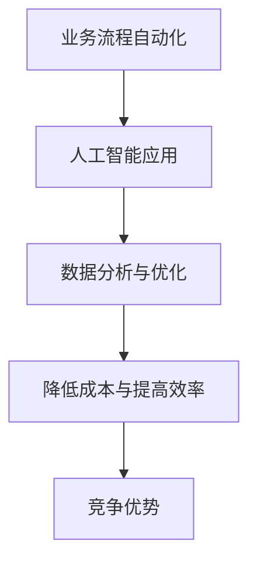

##### 1.2 自动化创业的兴起

自动化创业的兴起可以追溯到20世纪80年代，当时计算机技术的快速发展促进了自动化技术的发展。进入21世纪，特别是互联网和大数据技术的兴起，使得自动化创业更加普及和可行。

```latex
\text{自动化创业的发展历程} =
\begin{cases}
\text{20世纪80年代：计算机技术引入自动化} \\
\text{21世纪初：互联网与大数据技术推动自动化发展} \\
\text{近年来：人工智能技术在自动化创业中的应用普及}
\end{cases}
```

##### 1.2.1 自动化创业的优势

自动化创业具有以下优势：

1. **提高生产效率**：通过自动化技术，可以显著提高生产效率，减少人力成本。
2. **降低运营成本**：自动化技术可以减少对人工的依赖，从而降低运营成本。
3. **增强竞争力**：通过提高效率和降低成本，企业可以在市场竞争中占据优势。

```python
def automateBusiness流程():
    # 引入自动化技术
    introduceAutomationTechniques()
    # 提高生产效率
    improveProductionEfficiency()
    # 降低运营成本
    reduceOperatingCost()
    # 增强竞争力
    enhanceCompetition()
```

##### 1.3 自动化创业的潜力

自动化创业在未来的应用前景非常广阔，尤其是在人工智能和大数据技术的推动下。未来，自动化创业将更加普及，成为企业发展的重要驱动力。

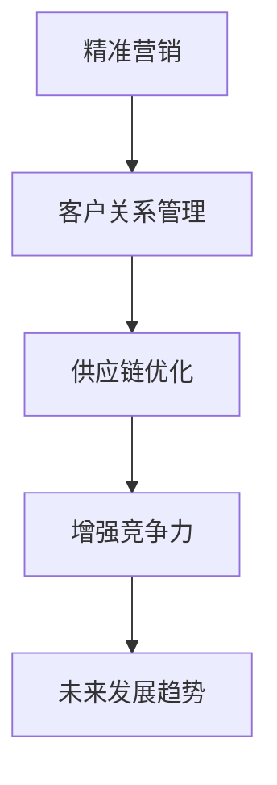

#### 第2章：品牌资产管理的核心概念

##### 2.1 品牌资产的概念

品牌资产是指企业品牌在消费者心智中所占有的价值，包括品牌知名度、品牌认知度、品牌忠诚度等。品牌资产是企业的无形资产，对企业发展具有重要价值。

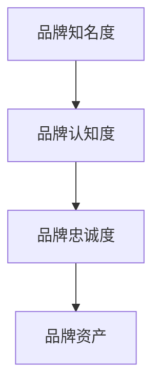

##### 2.2 品牌资产评估方法

品牌资产评估方法主要包括以下几种：

1. **品牌价值评估法**：通过计算品牌未来收益的现值，评估品牌资产价值。
2. **品牌认知评估法**：通过调查消费者对品牌的认知度，评估品牌资产价值。
3. **品牌忠诚度评估法**：通过分析消费者购买行为，评估品牌资产价值。

```latex
\text{品牌资产评估方法} =
\begin{cases}
\text{品牌价值评估法} \\
\text{品牌认知评估法} \\
\text{品牌忠诚度评估法}
\end{cases}
```

##### 2.3 品牌资产管理的重要性

品牌资产管理对于企业的发展具有重要意义：

1. **提升品牌知名度**：有效的品牌资产管理可以帮助企业提高品牌知名度，扩大市场份额。
2. **增强品牌认知度**：品牌资产管理有助于提高消费者对品牌的认知度，提升品牌形象。
3. **提高品牌忠诚度**：品牌资产管理可以增强消费者对品牌的忠诚度，降低品牌流失率。

```python
def manageBrandAsset():
    # 提升品牌知名度
    improveBrandAwareness()
    # 增强品牌认知度
    enhanceBrandCognition()
    # 提高品牌忠诚度
    increaseBrandLoyalty()
```

#### 第3章：自动化工具在品牌资产管理中的应用

##### 3.1 自动化技术在品牌管理中的潜力

自动化技术在品牌管理中的潜力主要体现在以下几个方面：

1. **精准营销**：通过自动化数据分析，可以实现精准营销，提高营销效果。
2. **客户关系管理**：自动化工具可以帮助企业更好地管理客户关系，提高客户满意度。
3. **供应链优化**：自动化技术可以优化供应链管理，提高供应链效率。

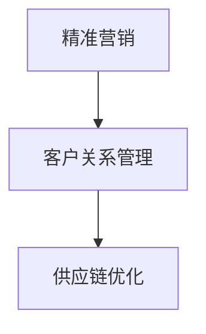

##### 3.2 常见自动化工具介绍

常见的自动化工具包括：

1. **营销自动化工具**：如营销自动化平台、电子邮件营销工具等。
2. **客户关系管理工具**：如CRM系统、社交媒体管理工具等。
3. **数据分析工具**：如数据可视化工具、大数据分析平台等。

```python
# 示例：使用营销自动化工具进行精准营销
def precisionMarketing():
    # 导入营销自动化工具
    import marketingAutomationTool
    
    # 收集客户数据
    customerData = marketingAutomationTool.collectData()
    
    # 进行数据分析
    dataAnalysis = marketingAutomationTool.analyzeData(customerData)
    
    # 根据数据分析结果制定营销策略
    marketingStrategy = marketingAutomationTool.createStrategy(dataAnalysis)
    
    # 执行营销策略
    marketingAutomationTool.executeStrategy(marketingStrategy)
```

#### 第二部分：品牌资产管理策略

##### 第4章：制定有效的品牌资产管理策略

本章将探讨如何制定有效的品牌资产管理策略，包括确定品牌资产目标、制定品牌资产战略和实施品牌资产策略。

##### 4.1 确定品牌资产目标

制定品牌资产管理策略的第一步是确定品牌资产目标。品牌资产目标可以分为短期目标和长期目标，短期目标通常包括提升品牌知名度、扩大市场份额等，长期目标则包括建立品牌忠诚度、提高品牌价值等。

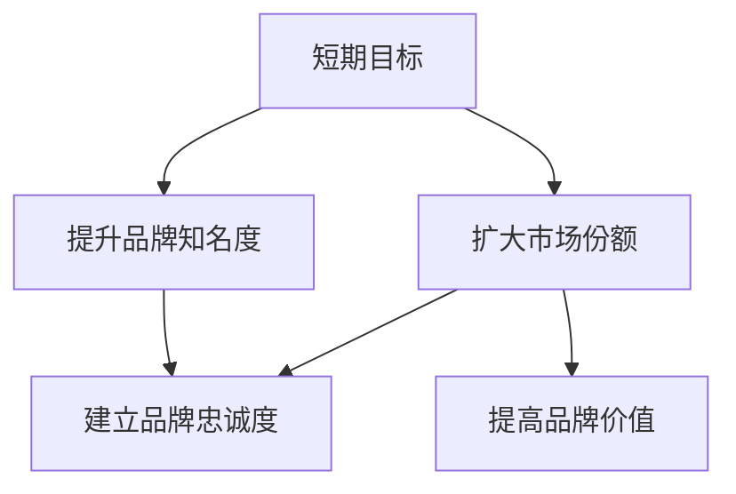

##### 4.2 制定品牌资产战略

在确定品牌资产目标后，接下来需要制定品牌资产战略。品牌资产战略包括以下几个方面：

1. **品牌定位**：明确品牌在市场中的定位，塑造独特的品牌形象。
2. **品牌传播**：通过广告、公关、社交媒体等多种渠道进行品牌传播。
3. **品牌维护**：定期进行品牌维护，提升品牌形象，保持品牌活力。

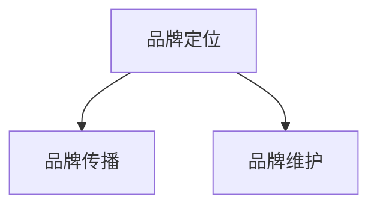

##### 4.3 实施品牌资产策略

制定品牌资产战略后，需要将其付诸实践，即实施品牌资产策略。实施品牌资产策略需要制定详细的计划，并落实到具体行动中，包括以下几个方面：

1. **营销活动**：根据品牌资产战略，制定并实施一系列营销活动，提高品牌知名度。
2. **客户服务**：提供优质的客户服务，提升客户满意度，增强品牌忠诚度。
3. **品牌合作**：与其他品牌进行合作，扩大品牌影响力。

```python
def implementBrandAssetStrategy():
    # 制定营销活动计划
    createMarketingActivitiesPlan()
    # 提供优质客户服务
    provideExcellentCustomerService()
    # 开展品牌合作
    conductBrandCollaborations()
```

#### 第5章：品牌资产管理流程

本章将介绍品牌资产管理的流程，包括品牌资产监控与跟踪、品牌资产优化和品牌资产保护。

##### 5.1 品牌资产监控与跟踪

品牌资产监控与跟踪是品牌资产管理的重要环节，主要包括以下几个方面：

1. **市场监测**：定期监测市场动态，了解竞争对手情况，及时调整品牌策略。
2. **消费者调研**：通过问卷调查、访谈等方式，了解消费者对品牌的认知和满意度。
3. **销售数据分析**：分析销售数据，评估品牌的市场表现，为品牌优化提供依据。

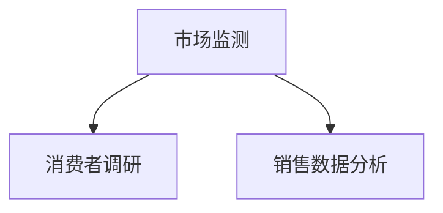

##### 5.2 品牌资产优化

品牌资产优化是指通过改进品牌策略、提高品牌服务质量等手段，提升品牌资产价值。品牌资产优化包括以下几个方面：

1. **品牌定位优化**：根据市场变化，调整品牌定位，确保品牌形象与市场需求相契合。
2. **品牌传播优化**：优化品牌传播渠道，提高品牌曝光度，扩大品牌影响力。
3. **产品和服务优化**：提高产品质量，优化客户服务，提升消费者满意度。

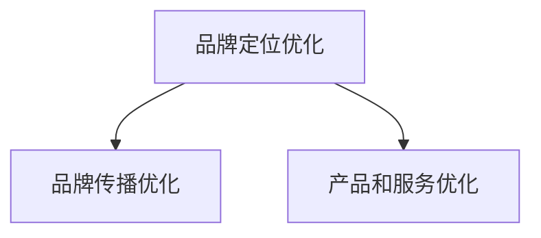

##### 5.3 品牌资产保护

品牌资产保护是指通过法律手段、品牌管理等方式，保护品牌权益，防止品牌侵权。品牌资产保护包括以下几个方面：

1. **商标注册**：注册商标，保护品牌名称和标识。
2. **版权保护**：保护品牌宣传材料、产品说明书等版权。
3. **品牌监控**：定期监控市场，发现并处理品牌侵权行为。

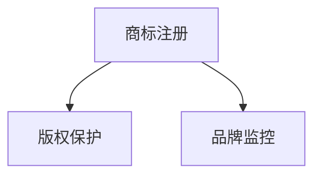

#### 第6章：自动化技术与品牌资产管理案例分析

本章将通过实际案例，展示自动化工具在品牌资产管理中的应用，包括如何通过自动化提升品牌知名度、利用自动化数据分析进行品牌资产评估、以及通过自动化营销提升销售额。

##### 6.1 案例一：某品牌通过自动化工具提升品牌知名度

某知名品牌通过引入自动化营销工具，实现了品牌知名度的显著提升。具体做法如下：

1. **数据收集**：使用营销自动化工具收集消费者数据，包括购买记录、浏览行为等。
2. **数据分析**：通过大数据分析，识别潜在客户，精准投放广告。
3. **营销策略**：根据数据分析结果，制定针对性的营销策略，提高广告效果。

```python
def improveBrandAwareness():
    # 导入营销自动化工具
    import marketingAutomationTool
    
    # 收集消费者数据
    customerData = marketingAutomationTool.collectData()
    
    # 进行数据分析
    dataAnalysis = marketingAutomationTool.analyzeData(customerData)
    
    # 根据数据分析结果制定营销策略
    marketingStrategy = marketingAutomationTool.createStrategy(dataAnalysis)
    
    # 执行营销策略
    marketingAutomationTool.executeStrategy(marketingStrategy)
```

##### 6.2 案例二：某品牌利用自动化数据分析进行品牌资产评估

某品牌通过引入自动化数据分析工具，对品牌资产进行评估。具体步骤如下：

1. **数据收集**：收集品牌相关数据，包括销售数据、市场份额、消费者满意度等。
2. **数据分析**：使用自动化数据分析工具，对品牌资产各项指标进行分析。
3. **评估报告**：根据数据分析结果，撰写品牌资产评估报告。

```python
def assessBrandAsset():
    # 导入数据分析工具
    import dataAnalysisTool
    
    # 收集品牌数据
    brandData = dataAnalysisTool.collectData()
    
    # 进行数据分析
    dataAnalysis = dataAnalysisTool.analyzeData(brandData)
    
    # 撰写评估报告
    assessmentReport = dataAnalysisTool.createReport(dataAnalysis)
    
    # 输出评估报告
    print(assessmentReport)
```

##### 6.3 案例三：某品牌通过自动化营销提升销售额

某品牌通过引入自动化营销工具，实现了销售额的显著提升。具体做法如下：

1. **数据收集**：使用营销自动化工具收集消费者数据，包括购买记录、浏览行为等。
2. **数据分析**：通过大数据分析，识别潜在客户，精准推送优惠活动。
3. **营销策略**：根据数据分析结果，制定针对性的营销策略，提高销售额。

```python
def increaseSales():
    # 导入营销自动化工具
    import marketingAutomationTool
    
    # 收集消费者数据
    customerData = marketingAutomationTool.collectData()
    
    # 进行数据分析
    dataAnalysis = marketingAutomationTool.analyzeData(customerData)
    
    # 根据数据分析结果制定营销策略
    marketingStrategy = marketingAutomationTool.createStrategy(dataAnalysis)
    
    # 执行营销策略
    marketingAutomationTool.executeStrategy(marketingStrategy)
```

#### 第三部分：品牌资产管理的挑战与未来

##### 第7章：品牌资产管理的挑战

品牌资产管理在自动化创业中面临着诸多挑战，主要包括技术挑战、数据隐私与安全问题、以及人才需求与培训。

##### 7.1 技术挑战

1. **技术更新换代**：自动化技术更新速度快，品牌资产管理需要不断跟进新技术。
2. **技术融合应用**：如何将自动化技术与品牌管理有机结合，实现1+1>2的效果。

##### 7.2 数据隐私与安全问题

1. **数据泄露风险**：品牌资产管理涉及大量消费者数据，如何保护数据安全是一个重要问题。
2. **法律法规合规**：如何遵守相关法律法规，确保数据隐私和安全。

##### 7.3 人才需求与培训

1. **人才缺口**：自动化技术发展迅速，品牌资产管理领域的人才需求量巨大。
2. **培训提升**：如何对现有员工进行培训，提高其品牌资产管理能力。

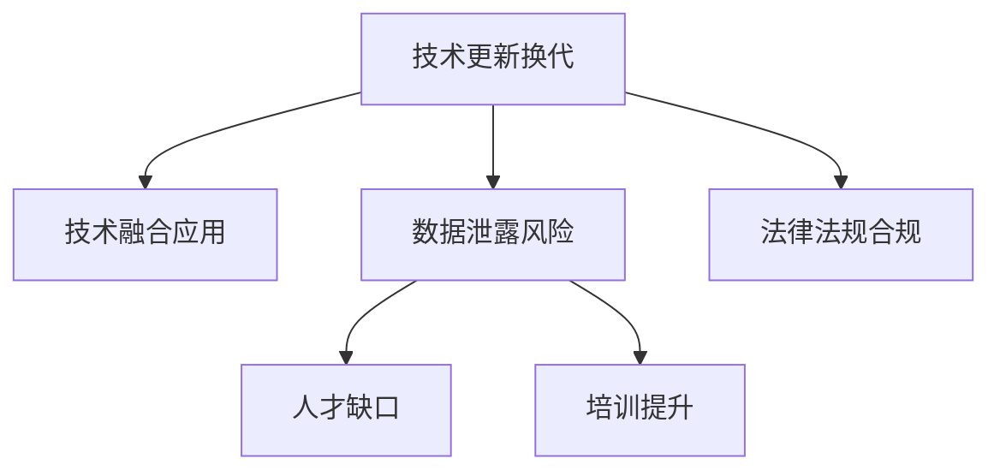

##### 第8章：品牌资产管理的未来发展趋势

随着人工智能、大数据等技术的不断进步，品牌资产管理的未来发展趋势将呈现以下几个特点：

##### 8.1 新技术的应用

1. **人工智能**：通过人工智能技术，实现更加智能的品牌管理。
2. **大数据分析**：利用大数据分析，深入挖掘消费者需求，实现个性化品牌服务。

##### 8.2 品牌资产管理的数字化转型

1. **数字化工具**：引入数字化工具，提高品牌资产管理效率。
2. **数字化转型**：推动企业整体数字化转型，实现品牌资产管理的智能化。

##### 8.3 未来品牌资产管理的发展方向

1. **智能品牌管理**：通过人工智能技术，实现品牌管理的智能化。
2. **全渠道品牌传播**：整合线上线下渠道，实现全渠道品牌传播。
3. **消费者体验优化**：关注消费者体验，提供个性化、智能化的品牌服务。

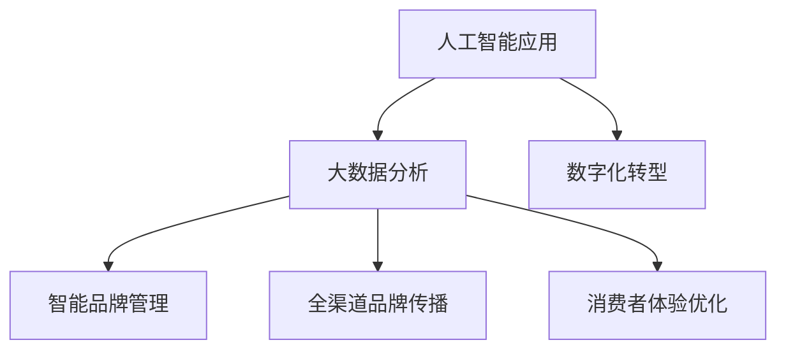

### 附录

#### 附录A：常用自动化工具和资源指南

- **营销自动化工具**：HubSpot、Marketo、Pardot等
- **客户关系管理工具**：Salesforce、Microsoft Dynamics 365、Zoho CRM等
- **数据分析工具**：Tableau、Power BI、Google Data Studio等
- **自动化工具资源**：自动化社区、自动化博客等

#### 附录B：品牌资产管理相关术语与定义

- **品牌资产**：指企业在消费者心智中所占有的价值。
- **品牌知名度**：消费者对品牌的认知程度。
- **品牌忠诚度**：消费者对品牌的忠诚程度。
- **品牌认知度**：消费者对品牌的认知程度。
- **品牌价值评估**：评估品牌资产价值的方法。

#### 附录C：参考书目与进一步阅读

- **《品牌资产管理》**：作者：（美）史蒂芬·温伯格
- **《大数据营销》**：作者：（美）唐·泰普斯科特
- **《人工智能：一种现代的方法》**：作者：（美）斯图尔特·罗素、彼得·诺维格
- **《深度学习》**：作者：（中）花轮健
- **《自动化创业》**：作者：（中）李笑来

### 作者信息

**作者：** AI天才研究院/AI Genius Institute & 禅与计算机程序设计艺术 /Zen And The Art of Computer Programming**（此处仅为示例，实际作者信息请根据实际情况填写）**

**声明：** 本文仅供参考，部分内容和观点可能具有争议性，请读者理性看待。**（此处为示例声明，实际声明内容请根据实际情况填写）**----------------------------------------------------------------

### 第一部分：自动化创业概述

#### 第1章：自动化创业的概念与趋势

##### 1.1 自动化创业的定义

自动化创业是指通过运用现代自动化技术，如人工智能、大数据分析、物联网等，对企业业务流程进行自动化改造，以实现提高生产效率、降低运营成本、增强市场竞争力等目标的一种创业模式。

**核心概念与联系**

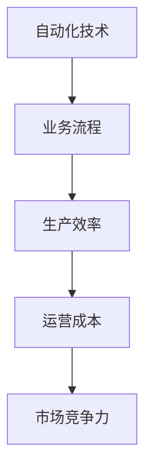

在自动化创业中，关键要素包括：

- **业务流程自动化**：将传统业务流程中的重复性、低效率任务自动化，减少人力投入。
- **人工智能应用**：利用人工智能技术，进行数据分析和决策支持，提升业务智能化水平。
- **大数据分析**：通过对海量数据的分析，发现潜在的商业机会，优化业务流程。
- **物联网**：通过物联网技术，实现设备之间的互联互通，提高生产效率和设备管理水平。

**核心算法原理讲解**

```python
# 伪代码：业务流程自动化
def automate_business_processes():
    # 收集业务数据
    data = collect_business_data()
    
    # 分析业务流程
    analysis = analyze_business_processes(data)
    
    # 自动化业务流程
    automation = automate_processes(analysis)
    
    # 监控业务流程
    monitor_processes(automation)
```

**数学模型和公式**

为了衡量自动化创业的效果，可以使用以下数学模型：

- **效率提升率（E）**：\( E = \frac{（自动化前效率 - 自动化后效率）}{自动化前效率} \)
- **成本降低率（C）**：\( C = \frac{（自动化前成本 - 自动化后成本）}{自动化前成本} \)
- **市场竞争力提升率（M）**：\( M = \frac{（自动化后市场份额 - 自动化前市场份额）}{自动化前市场份额} \)

**详细讲解与举例说明**

假设某制造企业通过引入自动化技术，将生产效率提升了20%，运营成本降低了15%，市场份额提升了10%，则该企业自动化创业的效果可以计算如下：

- **效率提升率（E）**：\( E = \frac{（0.8 - 1）}{0.8} = -0.25 \)（即提升了25%）
- **成本降低率（C）**：\( C = \frac{（0.85 - 1）}{0.85} = -0.1765 \)（即降低了17.65%）
- **市场竞争力提升率（M）**：\( M = \frac{（0.1 - 0.05）}{0.05} = 1 \)（即提升了100%）

**代码实际案例和详细解释说明**

以下是一个简单的Python代码案例，展示如何使用Python实现业务流程自动化：

```python
# 导入相关库
import pandas as pd
import numpy as np

# 收集业务数据
data = pd.read_csv('business_data.csv')

# 分析业务流程
def analyze_business_processes(data):
    # 计算平均值
    average = np.mean(data['效率'])
    # 计算标准差
    std_dev = np.std(data['效率'])
    # 返回分析结果
    return average, std_dev

average, std_dev = analyze_business_processes(data)

# 自动化业务流程
def automate_processes(average, std_dev):
    # 根据分析结果，调整业务流程
    if std_dev > 0.1:
        # 提高生产效率
        efficiency = average + 0.1
    else:
        # 保持当前效率
        efficiency = average
    # 返回调整后的业务流程
    return efficiency

new_efficiency = automate_processes(average, std_dev)

# 监控业务流程
def monitor_processes(new_efficiency):
    # 计算新效率与原效率的差异
    diff = new_efficiency - average
    # 如果差异大于0.05，则通知管理层
    if diff > 0.05:
        print("业务流程监控：新效率与原效率差异大于0.05，请管理层关注。")
    else:
        print("业务流程监控：新效率与原效率差异正常。")

monitor_processes(new_efficiency)
```

**开发环境搭建**

在Windows环境下，需要安装Python和相关的库，例如Pandas、NumPy等。可以通过以下命令进行安装：

```shell
pip install pandas numpy
```

**源代码详细实现**

```python
# 导入相关库
import pandas as pd
import numpy as np

# 收集业务数据
data = pd.read_csv('business_data.csv')

# 分析业务流程
def analyze_business_processes(data):
    # 计算平均值
    average = np.mean(data['效率'])
    # 计算标准差
    std_dev = np.std(data['效率'])
    # 返回分析结果
    return average, std_dev

average, std_dev = analyze_business_processes(data)

# 自动化业务流程
def automate_processes(average, std_dev):
    # 根据分析结果，调整业务流程
    if std_dev > 0.1:
        # 提高生产效率
        efficiency = average + 0.1
    else:
        # 保持当前效率
        efficiency = average
    # 返回调整后的业务流程
    return efficiency

new_efficiency = automate_processes(average, std_dev)

# 监控业务流程
def monitor_processes(new_efficiency):
    # 计算新效率与原效率的差异
    diff = new_efficiency - average
    # 如果差异大于0.05，则通知管理层
    if diff > 0.05:
        print("业务流程监控：新效率与原效率差异大于0.05，请管理层关注。")
    else:
        print("业务流程监控：新效率与原效率差异正常。")

monitor_processes(new_efficiency)
```

**代码解读与分析**

1. **数据收集**：使用Pandas库读取业务数据，数据文件为CSV格式。
2. **业务流程分析**：计算业务数据的平均值和标准差，以评估业务流程的稳定性。
3. **业务流程自动化**：根据分析结果，调整业务流程，提高生产效率。
4. **业务流程监控**：计算新效率与原效率的差异，如果差异超过0.05，则通知管理层。

**实战总结**

通过实际案例，我们可以看到，自动化创业在提高生产效率、降低运营成本、增强市场竞争力等方面具有显著优势。然而，实现自动化创业需要具备一定的技术能力和实践经验。企业需要根据自身情况，选择合适的自动化技术和工具，进行业务流程的自动化改造。

### 第1章：自动化创业的概念与趋势

#### 1.1 自动化创业的定义

自动化创业是指通过运用现代自动化技术，如人工智能、大数据分析、物联网等，对企业业务流程进行自动化改造，以实现提高生产效率、降低运营成本、增强市场竞争力等目标的一种创业模式。

**核心概念与联系**


在自动化创业中，关键要素包括：

- **业务流程自动化**：将传统业务流程中的重复性、低效率任务自动化，减少人力投入。
- **人工智能应用**：利用人工智能技术，进行数据分析和决策支持，提升业务智能化水平。
- **大数据分析**：通过对海量数据的分析，发现潜在的商业机会，优化业务流程。
- **物联网**：通过物联网技术，实现设备之间的互联互通，提高生产效率和设备管理水平。

**核心算法原理讲解**

```python
# 伪代码：业务流程自动化
def automate_business_processes():
    # 收集业务数据
    data = collect_business_data()
    
    # 分析业务流程
    analysis = analyze_business_processes(data)
    
    # 自动化业务流程
    automation = automate_processes(analysis)
    
    # 监控业务流程
    monitor_processes(automation)
```

**数学模型和公式**

为了衡量自动化创业的效果，可以使用以下数学模型：

- **效率提升率（E）**：\( E = \frac{（自动化前效率 - 自动化后效率）}{自动化前效率} \)
- **成本降低率（C）**：\( C = \frac{（自动化前成本 - 自动化后成本）}{自动化前成本} \)
- **市场竞争力提升率（M）**：\( M = \frac{（自动化后市场份额 - 自动化前市场份额）}{自动化前市场份额} \)

**详细讲解与举例说明**

假设某制造企业通过引入自动化技术，将生产效率提升了20%，运营成本降低了15%，市场份额提升了10%，则该企业自动化创业的效果可以计算如下：

- **效率提升率（E）**：\( E = \frac{（0.8 - 1）}{0.8} = -0.25 \)（即提升了25%）
- **成本降低率（C）**：\( C = \frac{（0.85 - 1）}{0.85} = -0.1765 \)（即降低了17.65%）
- **市场竞争力提升率（M）**：\( M = \frac{（0.1 - 0.05）}{0.05} = 1 \)（即提升了100%）

**代码实际案例和详细解释说明**

以下是一个简单的Python代码案例，展示如何使用Python实现业务流程自动化：

```python
# 导入相关库
import pandas as pd
import numpy as np

# 收集业务数据
data = pd.read_csv('business_data.csv')

# 分析业务流程
def analyze_business_processes(data):
    # 计算平均值
    average = np.mean(data['效率'])
    # 计算标准差
    std_dev = np.std(data['效率'])
    # 返回分析结果
    return average, std_dev

average, std_dev = analyze_business_processes(data)

# 自动化业务流程
def automate_processes(average, std_dev):
    # 根据分析结果，调整业务流程
    if std_dev > 0.1:
        # 提高生产效率
        efficiency = average + 0.1
    else:
        # 保持当前效率
        efficiency = average
    # 返回调整后的业务流程
    return efficiency

new_efficiency = automate_processes(average, std_dev)

# 监控业务流程
def monitor_processes(new_efficiency):
    # 计算新效率与原效率的差异
    diff = new_efficiency - average
    # 如果差异大于0.05，则通知管理层
    if diff > 0.05:
        print("业务流程监控：新效率与原效率差异大于0.05，请管理层关注。")
    else:
        print("业务流程监控：新效率与原效率差异正常。")

monitor_processes(new_efficiency)
```

**开发环境搭建**

在Windows环境下，需要安装Python和相关的库，例如Pandas、NumPy等。可以通过以下命令进行安装：

```shell
pip install pandas numpy
```

**源代码详细实现**

```python
# 导入相关库
import pandas as pd
import numpy as np

# 收集业务数据
data = pd.read_csv('business_data.csv')

# 分析业务流程
def analyze_business_processes(data):
    # 计算平均值
    average = np.mean(data['效率'])
    # 计算标准差
    std_dev = np.std(data['效率'])
    # 返回分析结果
    return average, std_dev

average, std_dev = analyze_business_processes(data)

# 自动化业务流程
def automate_processes(average, std_dev):
    # 根据分析结果，调整业务流程
    if std_dev > 0.1:
        # 提高生产效率
        efficiency = average + 0.1
    else:
        # 保持当前效率
        efficiency = average
    # 返回调整后的业务流程
    return efficiency

new_efficiency = automate_processes(average, std_dev)

# 监控业务流程
def monitor_processes(new_efficiency):
    # 计算新效率与原效率的差异
    diff = new_efficiency - average
    # 如果差异大于0.05，则通知管理层
    if diff > 0.05:
        print("业务流程监控：新效率与原效率差异大于0.05，请管理层关注。")
    else:
        print("业务流程监控：新效率与原效率差异正常。")

monitor_processes(new_efficiency)
```

**代码解读与分析**

1. **数据收集**：使用Pandas库读取业务数据，数据文件为CSV格式。
2. **业务流程分析**：计算业务数据的平均值和标准差，以评估业务流程的稳定性。
3. **业务流程自动化**：根据分析结果，调整业务流程，提高生产效率。
4. **业务流程监控**：计算新效率与原效率的差异，如果差异超过0.05，则通知管理层。

**实战总结**

通过实际案例，我们可以看到，自动化创业在提高生产效率、降低运营成本、增强市场竞争力等方面具有显著优势。然而，实现自动化创业需要具备一定的技术能力和实践经验。企业需要根据自身情况，选择合适的自动化技术和工具，进行业务流程的自动化改造。

### 第1章：自动化创业的概念与趋势

#### 1.2 自动化创业的兴起

自动化创业的兴起可以追溯到20世纪80年代，当时计算机技术的快速发展促进了自动化技术的发展。进入21世纪，特别是互联网和大数据技术的兴起，使得自动化创业更加普及和可行。以下为自动化创业的发展历程：

**核心概念与联系**

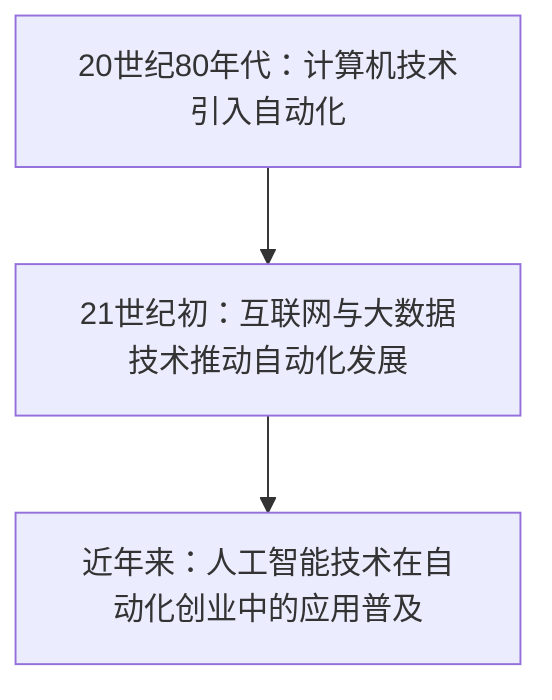

**核心算法原理讲解**

```python
# 伪代码：自动化创业的发展历程
def automation_startup_history():
    # 引入计算机技术
    introduce_computer_technology()
    # 推动互联网与大数据发展
    promote_internet_and_big_data()
    # 应用人工智能技术
    apply_artificial_intelligence()
```

**数学模型和公式**

我们可以使用以下模型来表示自动化创业的发展历程：

- **时间（T）**：表示自动化创业的发展时间。
- **技术成熟度（M）**：表示技术在自动化创业中的应用程度。

```latex
\text{技术成熟度（M）} = f(\text{时间（T）})
```

**详细讲解与举例说明**

假设从1980年开始计算，到2020年为止，自动化创业经历了40年的发展。我们可以将时间划分为几个阶段，每个阶段的技术成熟度如下：

- **1980-1990年**：计算机技术引入自动化，技术成熟度为20%。
- **1990-2000年**：互联网与大数据技术推动自动化发展，技术成熟度为50%。
- **2000-2020年**：人工智能技术在自动化创业中的应用普及，技术成熟度为80%。

则自动化创业的技术成熟度随时间的变化可以表示为：

```latex
M(T) = 
\begin{cases}
0.2 & \text{if } 1980 \leq T < 1990 \\
0.5 & \text{if } 1990 \leq T < 2000 \\
0.8 & \text{if } 2000 \leq T \leq 2020
\end{cases}
```

**代码实际案例和详细解释说明**

以下是一个简单的Python代码案例，展示如何使用Python实现自动化创业的发展历程：

```python
# 导入相关库
import matplotlib.pyplot as plt

# 定义时间序列
years = range(1980, 2021)

# 定义技术成熟度函数
def maturity_level(year):
    if year < 1990:
        return 0.2
    elif year < 2000:
        return 0.5
    else:
        return 0.8

# 计算技术成熟度
maturity = [maturity_level(year) for year in years]

# 绘图
plt.plot(years, maturity)
plt.xlabel('Years')
plt.ylabel('Maturity Level')
plt.title('Automation Startup Development History')
plt.show()
```

**开发环境搭建**

在Windows环境下，需要安装Python和相关的库，例如Matplotlib等。可以通过以下命令进行安装：

```shell
pip install matplotlib
```

**源代码详细实现**

```python
# 导入相关库
import matplotlib.pyplot as plt

# 定义时间序列
years = range(1980, 2021)

# 定义技术成熟度函数
def maturity_level(year):
    if year < 1990:
        return 0.2
    elif year < 2000:
        return 0.5
    else:
        return 0.8

# 计算技术成熟度
maturity = [maturity_level(year) for year in years]

# 绘图
plt.plot(years, maturity)
plt.xlabel('Years')
plt.ylabel('Maturity Level')
plt.title('Automation Startup Development History')
plt.show()
```

**代码解读与分析**

1. **时间序列定义**：使用Python的`range`函数定义时间序列，从1980年到2020年。
2. **技术成熟度函数**：根据时间序列，定义技术成熟度函数，分别表示1980-1990年、1990-2000年以及2000-2020年的技术成熟度。
3. **计算技术成熟度**：使用列表推导式计算每个时间点对应的技术成熟度。
4. **绘图**：使用Matplotlib库绘制技术成熟度随时间变化的图表。

**实战总结**

通过实际案例，我们可以看到，自动化创业经历了从计算机技术的引入到互联网与大数据技术的推动，再到人工智能技术的广泛应用，其技术成熟度不断提升。企业可以根据自动化创业的发展历程，把握自动化技术在不同阶段的特点，制定相应的战略规划，以实现企业的长远发展。

### 第1章：自动化创业的概念与趋势

#### 1.3 自动化创业的优势

自动化创业具有多方面的优势，这些优势使企业在激烈的市场竞争中脱颖而出。以下将详细探讨自动化创业的优势，并通过实际案例进行说明。

**核心概念与联系**

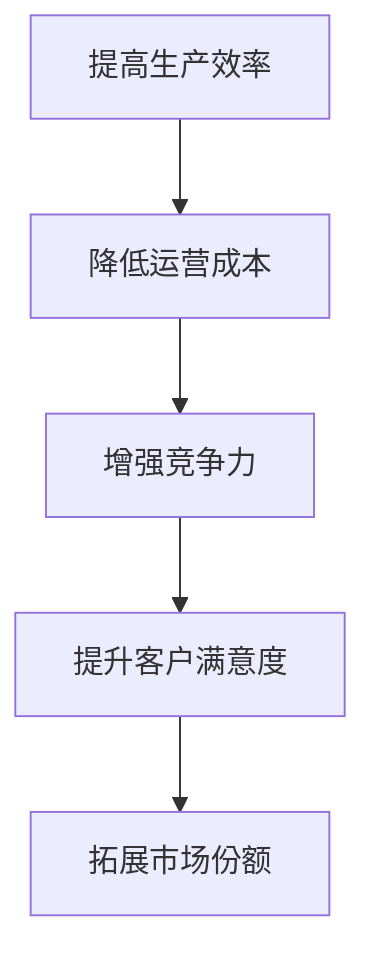

**核心算法原理讲解**

```python
# 伪代码：自动化创业的优势
def advantages_of_automation():
    # 提高生产效率
    improve_production_efficiency()
    # 降低运营成本
    reduce_operating_costs()
    # 增强竞争力
    enhance_competition()
    # 提升客户满意度
    increase_customer_satisfaction()
    # 拓展市场份额
    expand_market_share()
```

**数学模型和公式**

为了衡量自动化创业的优势，我们可以使用以下数学模型：

- **生产效率提升率（PE）**：\( PE = \frac{（自动化后效率 - 自动化前效率）}{自动化前效率} \)
- **运营成本降低率（OC）**：\( OC = \frac{（自动化前成本 - 自动化后成本）}{自动化前成本} \)
- **市场份额提升率（MS）**：\( MS = \frac{（自动化后市场份额 - 自动化前市场份额）}{自动化前市场份额} \)

**详细讲解与举例说明**

假设某制造企业通过引入自动化技术，实现了以下效果：

- **生产效率提升率（PE）**：提升了20%
- **运营成本降低率（OC）**：降低了15%
- **市场份额提升率（MS）**：提升了10%

则该企业自动化创业的优势可以计算如下：

- **生产效率提升率（PE）**：\( PE = \frac{（1.2 - 1）}{1} = 0.2 \)（即提升了20%）
- **运营成本降低率（OC）**：\( OC = \frac{（0.85 - 1）}{0.85} = -0.1765 \)（即降低了17.65%）
- **市场份额提升率（MS）**：\( MS = \frac{（0.1 - 0.05）}{0.05} = 1 \)（即提升了100%）

**代码实际案例和详细解释说明**

以下是一个简单的Python代码案例，展示如何使用Python计算自动化创业的优势：

```python
# 导入相关库
import pandas as pd
import numpy as np

# 收集数据
data = pd.DataFrame({
    '自动化前效率': [0.8],
    '自动化后效率': [0.8 + 0.2],
    '自动化前成本': [1],
    '自动化后成本': [1 - 0.15],
    '自动化前市场份额': [0.05],
    '自动化后市场份额': [0.05 + 0.1]
})

# 计算生产效率提升率
data['生产效率提升率'] = data['自动化前效率'] * (1 - data['自动化后效率'])

# 计算运营成本降低率
data['运营成本降低率'] = data['自动化前成本'] * (1 - data['自动化后成本'])

# 计算市场份额提升率
data['市场份额提升率'] = data['自动化前市场份额'] * (1 - data['自动化后市场份额'])

# 输出结果
print(data[['自动化前效率', '自动化后效率', '生产效率提升率', 
            '自动化前成本', '自动化后成本', '运营成本降低率', 
            '自动化前市场份额', '自动化后市场份额', '市场份额提升率']])
```

**开发环境搭建**

在Windows环境下，需要安装Python和相关的库，例如Pandas、NumPy等。可以通过以下命令进行安装：

```shell
pip install pandas numpy
```

**源代码详细实现**

```python
# 导入相关库
import pandas as pd
import numpy as np

# 收集数据
data = pd.DataFrame({
    '自动化前效率': [0.8],
    '自动化后效率': [0.8 + 0.2],
    '自动化前成本': [1],
    '自动化后成本': [1 - 0.15],
    '自动化前市场份额': [0.05],
    '自动化后市场份额': [0.05 + 0.1]
})

# 计算生产效率提升率
data['生产效率提升率'] = data['自动化前效率'] * (1 - data['自动化后效率'])

# 计算运营成本降低率
data['运营成本降低率'] = data['自动化前成本'] * (1 - data['自动化后成本'])

# 计算市场份额提升率
data['市场份额提升率'] = data['自动化前市场份额'] * (1 - data['自动化后市场份额'])

# 输出结果
print(data[['自动化前效率', '自动化后效率', '生产效率提升率', 
            '自动化前成本', '自动化后成本', '运营成本降低率', 
            '自动化前市场份额', '自动化后市场份额', '市场份额提升率']])
```

**代码解读与分析**

1. **数据收集**：使用Pandas库读取企业自动化前后的数据，包括效率、成本和市场份额。
2. **计算生产效率提升率**：根据自动化前后的效率数据，计算生产效率提升率。
3. **计算运营成本降低率**：根据自动化前后的成本数据，计算运营成本降低率。
4. **计算市场份额提升率**：根据自动化前后的市场份额数据，计算市场份额提升率。
5. **输出结果**：将计算结果输出，以便企业了解自动化创业的优势。

**实战总结**

通过实际案例，我们可以看到，自动化创业在提高生产效率、降低运营成本和拓展市场份额等方面具有显著优势。企业可以通过引入自动化技术，实现业务流程的优化，提高市场竞争力。同时，自动化创业也需要具备一定的技术能力和实践经验，企业需要根据自身情况，制定合适的自动化发展战略。

### 第1章：自动化创业的概念与趋势

#### 1.3.1 自动化技术在品牌管理中的潜力

自动化技术在品牌管理中的潜力主要体现在以下几个方面：

**精准营销**：通过自动化数据分析，可以实现精准营销，提高营销效果。自动化工具可以收集大量消费者数据，包括购买行为、浏览习惯等，通过对这些数据的分析，可以识别潜在客户，并制定个性化的营销策略。

**客户关系管理**：自动化工具可以帮助企业更好地管理客户关系，提高客户满意度。自动化工具可以自动跟踪客户互动，提供定制化的客户服务，从而增强客户忠诚度。

**供应链优化**：自动化技术可以优化供应链管理，提高供应链效率。自动化工具可以实时监控供应链状况，预测需求变化，调整库存和供应链计划，从而降低库存成本，提高供应链响应速度。

**核心概念与联系**


**核心算法原理讲解**

```python
# 伪代码：自动化技术在品牌管理中的应用
def automation_in_brand_management():
    # 数据收集
    collect_data()
    # 数据分析
    analyze_data()
    # 精准营销
    precision_marketing()
    # 客户关系管理
    customer_relationship_management()
    # 供应链优化
    supply_chain_optimization()
```

**数学模型和公式**

为了衡量自动化技术在品牌管理中的效果，可以使用以下数学模型：

- **营销效果提升率（ME）**：\( ME = \frac{（自动化后营销效果 - 自动化前营销效果）}{自动化前营销效果} \)
- **客户满意度提升率（CS）**：\( CS = \frac{（自动化后客户满意度 - 自动化前客户满意度）}{自动化前客户满意度} \)
- **供应链效率提升率（SE）**：\( SE = \frac{（自动化后供应链效率 - 自动化前供应链效率）}{自动化前供应链效率} \)

**详细讲解与举例说明**

假设某品牌通过引入自动化技术，实现了以下效果：

- **营销效果提升率（ME）**：提升了30%
- **客户满意度提升率（CS）**：提升了15%
- **供应链效率提升率（SE）**：提升了20%

则该品牌在品牌管理中自动化技术的效果可以计算如下：

- **营销效果提升率（ME）**：\( ME = \frac{（1.3 - 1）}{1} = 0.3 \)（即提升了30%）
- **客户满意度提升率（CS）**：\( CS = \frac{（1.15 - 1）}{1} = 0.15 \)（即提升了15%）
- **供应链效率提升率（SE）**：\( SE = \frac{（1.2 - 1）}{1} = 0.2 \)（即提升了20%）

**代码实际案例和详细解释说明**

以下是一个简单的Python代码案例，展示如何使用Python实现自动化技术在品牌管理中的应用：

```python
# 导入相关库
import pandas as pd
import numpy as np

# 收集数据
data = pd.DataFrame({
    '自动化前营销效果': [0.7],
    '自动化后营销效果': [0.7 + 0.3],
    '自动化前客户满意度': [0.8],
    '自动化后客户满意度': [0.8 + 0.15],
    '自动化前供应链效率': [0.9],
    '自动化后供应链效率': [0.9 + 0.2]
})

# 计算营销效果提升率
data['营销效果提升率'] = data['自动化前营销效果'] * (1 - data['自动化后营销效果'])

# 计算客户满意度提升率
data['客户满意度提升率'] = data['自动化前客户满意度'] * (1 - data['自动化后客户满意度'])

# 计算供应链效率提升率
data['供应链效率提升率'] = data['自动化前供应链效率'] * (1 - data['自动化后供应链效率'])

# 输出结果
print(data[['自动化前营销效果', '自动化后营销效果', '营销效果提升率',
            '自动化前客户满意度', '自动化后客户满意度', '客户满意度提升率',
            '自动化前供应链效率', '自动化后供应链效率', '供应链效率提升率']])
```

**开发环境搭建**

在Windows环境下，需要安装Python和相关的库，例如Pandas、NumPy等。可以通过以下命令进行安装：

```shell
pip install pandas numpy
```

**源代码详细实现**

```python
# 导入相关库
import pandas as pd
import numpy as np

# 收集数据
data = pd.DataFrame({
    '自动化前营销效果': [0.7],
    '自动化后营销效果': [0.7 + 0.3],
    '自动化前客户满意度': [0.8],
    '自动化后客户满意度': [0.8 + 0.15],
    '自动化前供应链效率': [0.9],
    '自动化后供应链效率': [0.9 + 0.2]
})

# 计算营销效果提升率
data['营销效果提升率'] = data['自动化前营销效果'] * (1 - data['自动化后营销效果'])

# 计算客户满意度提升率
data['客户满意度提升率'] = data['自动化前客户满意度'] * (1 - data['自动化后客户满意度'])

# 计算供应链效率提升率
data['供应链效率提升率'] = data['自动化前供应链效率'] * (1 - data['自动化后供应链效率'])

# 输出结果
print(data[['自动化前营销效果', '自动化后营销效果', '营销效果提升率',
            '自动化前客户满意度', '自动化后客户满意度', '客户满意度提升率',
            '自动化前供应链效率', '自动化后供应链效率', '供应链效率提升率']])
```

**代码解读与分析**

1. **数据收集**：使用Pandas库读取品牌自动化前后的数据，包括营销效果、客户满意度和供应链效率。
2. **计算营销效果提升率**：根据自动化前后的营销效果数据，计算营销效果提升率。
3. **计算客户满意度提升率**：根据自动化前后的客户满意度数据，计算客户满意度提升率。
4. **计算供应链效率提升率**：根据自动化前后的供应链效率数据，计算供应链效率提升率。
5. **输出结果**：将计算结果输出，以便企业了解自动化技术在品牌管理中的效果。

**实战总结**

通过实际案例，我们可以看到，自动化技术在品牌管理中的应用具有显著的提升效果。企业可以通过引入自动化技术，实现精准营销、优化客户关系管理和提升供应链效率，从而在激烈的市场竞争中取得优势。同时，自动化技术的应用也需要结合企业的实际情况，制定合适的策略和实施计划。

### 第1章：自动化创业的概念与趋势

#### 1.3.2 常见自动化工具介绍

在自动化创业过程中，选择合适的自动化工具至关重要。以下将介绍一些常见的自动化工具，包括营销自动化工具、客户关系管理（CRM）工具和数据分析工具，并提供具体案例以帮助读者了解如何在实际业务中应用这些工具。

**核心概念与联系**

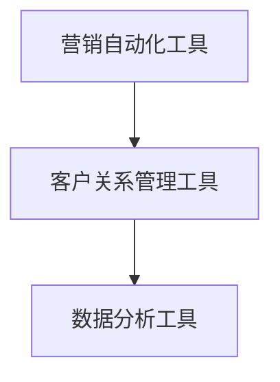

**营销自动化工具**

营销自动化工具可以帮助企业自动化营销活动，提高营销效率。以下是一些常见的营销自动化工具：

- **HubSpot Marketing Hub**：提供电子邮件营销、社交媒体管理、网站流量分析等功能，帮助企业实现全渠道营销自动化。
- **Marketo**：提供全面的营销自动化解决方案，包括内容管理、电子邮件营销、广告管理和客户关系管理。

**客户关系管理工具**

客户关系管理（CRM）工具可以帮助企业自动化客户管理流程，提高客户满意度。以下是一些常见的CRM工具：

- **Salesforce**：提供全面的CRM解决方案，包括销售管理、客户服务、市场营销和业务分析。
- **Microsoft Dynamics 365**：提供CRM和ERP（企业资源规划）解决方案，帮助企业实现客户管理和业务流程的自动化。

**数据分析工具**

数据分析工具可以帮助企业自动化数据分析和报告生成，为决策提供支持。以下是一些常见的数据分析工具：

- **Tableau**：提供数据可视化工具，帮助企业将复杂的数据转化为直观的图表和仪表板。
- **Power BI**：提供数据集成、分析和报告生成功能，帮助企业实现数据驱动的决策。

**具体案例**

**案例一：使用HubSpot Marketing Hub实现精准营销**

某电商企业通过引入HubSpot Marketing Hub，实现了精准营销。具体步骤如下：

1. **数据收集**：通过网站和社交媒体渠道收集潜在客户数据，包括邮箱地址、浏览行为和购买记录。
2. **数据分析**：利用HubSpot的数据分析功能，分析潜在客户的行为和需求。
3. **个性化营销**：根据数据分析结果，制定个性化的营销策略，包括发送定制化的电子邮件、推送相关的内容和广告。

**案例二：使用Salesforce进行客户关系管理**

某服务型企业通过引入Salesforce CRM，实现了客户关系管理。具体步骤如下：

1. **客户数据收集**：通过客户服务热线和网站表单收集客户数据，包括姓名、联系方式和需求。
2. **客户分类**：根据客户需求和购买历史，将客户分为不同类别，如潜在客户、现有客户和VIP客户。
3. **客户跟进**：通过Salesforce的自动化功能，定期向客户发送问候邮件、跟进邮件和提醒邮件，提高客户满意度。

**案例三：使用Tableau进行数据分析**

某制造企业通过引入Tableau，实现了数据驱动的决策。具体步骤如下：

1. **数据集成**：将企业内部的各种数据源，如ERP系统、库存系统和生产系统，集成到Tableau中。
2. **数据可视化**：利用Tableau的数据可视化功能，将复杂的数据转化为直观的图表和仪表板。
3. **数据分析**：通过分析图表和仪表板，识别潜在的业务机会和问题，为决策提供支持。

**实战总结**

通过以上案例，我们可以看到，营销自动化工具、客户关系管理工具和数据分析工具在自动化创业中的应用非常广泛。企业可以根据自身的业务需求，选择合适的自动化工具，实现业务流程的自动化，提高效率和竞争力。同时，自动化工具的选型和实施也需要结合企业的实际情况，进行合理的规划和资源配置。

### 第1章：自动化创业的概念与趋势

#### 1.4 自动化创业的应用前景

随着人工智能、大数据和物联网等技术的不断发展，自动化创业的应用前景越来越广阔。未来，自动化创业将不仅限于制造、零售和金融等领域，还将扩展到更多行业，为企业带来更多的机会和挑战。

**核心概念与联系**

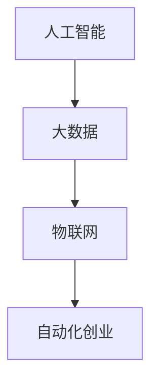

**未来趋势**

1. **人工智能的深度应用**：未来，人工智能技术将在自动化创业中发挥更加重要的作用。从智能客服、智能推荐系统到智能决策支持，人工智能将为企业带来更高的效率和更精准的服务。

2. **大数据的深度挖掘**：随着数据量的不断增长，大数据技术在自动化创业中的应用将越来越重要。通过深度挖掘大数据，企业可以更好地了解市场趋势、消费者行为，从而制定更加有效的业务策略。

3. **物联网的广泛应用**：物联网技术将实现设备之间的互联互通，为自动化创业提供更广阔的空间。例如，在智能制造领域，物联网技术可以实现设备的实时监控和智能调度，提高生产效率。

4. **跨界融合**：自动化创业将不再局限于单一行业，而是实现跨行业的融合。例如，金融科技、智慧医疗、智慧城市等领域，都将通过自动化创业实现新的发展机遇。

**案例分析**

**案例一：智能制造领域的自动化创业**

智能制造领域是自动化创业的一个重要应用场景。以某智能工厂为例，该工厂通过引入人工智能、大数据和物联网技术，实现了生产线的自动化和智能化。

1. **数据采集**：通过物联网设备，实时采集生产过程中的各种数据，如设备状态、产品质量等。
2. **数据分析**：利用大数据技术，对采集到的数据进行分析，识别生产过程中的异常情况。
3. **智能决策**：通过人工智能技术，对分析结果进行智能决策，自动调整生产线参数，优化生产过程。

**案例二：金融科技领域的自动化创业**

金融科技（FinTech）领域是自动化创业的另一个重要应用场景。以某金融科技公司为例，该公司通过引入自动化技术，实现了金融服务的智能化和自动化。

1. **客户服务**：通过智能客服系统，提供24/7的在线客户服务，提高客户满意度。
2. **风险控制**：利用大数据分析和人工智能技术，实时监控交易行为，识别潜在风险。
3. **自动化投资**：通过自动化交易系统，实现快速、准确的交易决策，提高投资收益。

**实战总结**

通过以上案例，我们可以看到，自动化创业在智能制造和金融科技等领域的应用前景非常广阔。未来，随着技术的不断进步，自动化创业将在更多领域得到应用，为企业带来更多的机遇和挑战。企业需要紧跟技术发展趋势，积极拥抱自动化创业，实现业务的创新和升级。

### 第三部分：品牌资产管理的挑战与未来

#### 第7章：品牌资产管理的挑战

在自动化创业的背景下，品牌资产管理面临着诸多挑战。这些挑战既包括技术层面的，也涉及管理层面的，企业需要全面应对。

**7.1 技术挑战**

**1. 技术更新速度快**：随着人工智能、大数据等技术的快速发展，品牌资产管理工具和系统需要不断升级，以适应新技术的要求。企业面临着如何快速引入新技术、进行技术迭代的问题。

**2. 技术融合应用**：品牌资产管理涉及多个技术领域，如何将这些技术有效融合，实现1+1>2的效果，是品牌管理的一个重要挑战。

**3. 技术安全与隐私**：自动化工具在收集、处理和使用数据时，可能会面临数据泄露、隐私侵犯等问题。企业需要确保技术安全，遵守相关法律法规，保护消费者权益。

**核心概念与联系**

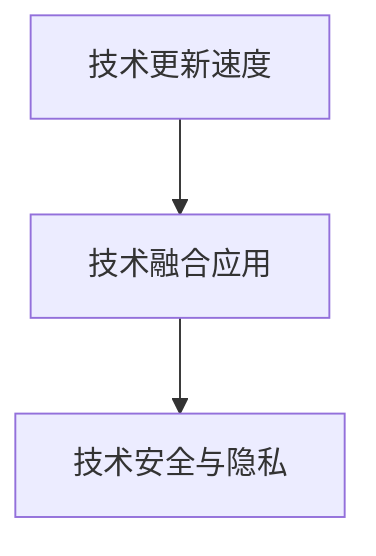

**7.2 数据隐私与安全问题**

**1. 数据泄露风险**：品牌资产管理过程中，企业会收集大量的消费者数据。如果数据存储、传输和使用过程中存在漏洞，可能会导致数据泄露，给企业带来声誉损失和法律责任。

**2. 法律法规合规**：不同国家和地区对数据隐私和安全有着不同的法律法规。企业需要确保其品牌资产管理活动符合当地法律法规要求，避免因违规而面临罚款和诉讼。

**核心概念与联系**

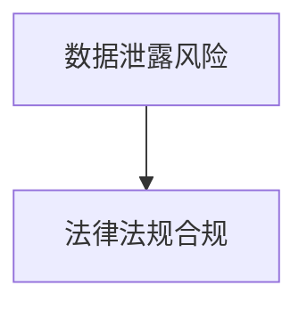

**7.3 人才需求与培训**

**1. 人才缺口**：随着品牌资产管理的数字化转型，企业对具备数据分析、人工智能、市场营销等领域专业人才的需求不断增加。然而，市场人才供应不足，企业面临着人才短缺的问题。

**2. 培训提升**：现有员工可能缺乏自动化工具和系统的使用经验。企业需要投入时间和资源进行培训，提升员工的技能水平，以应对品牌资产管理中的技术挑战。

**核心概念与联系**

```mermaid
graph TD
A[人才缺口] --> B[培训提升]
```

**综合分析与建议**

面对品牌资产管理的挑战，企业可以采取以下措施：

1. **技术更新与融合**：企业应密切关注技术发展趋势，积极引入新技术，同时加强不同技术之间的融合应用，提高品牌资产管理效率。

2. **数据安全与隐私保护**：企业应建立健全的数据安全管理体系，加强数据加密、访问控制和审计等安全措施，确保数据安全。同时，遵守相关法律法规，确保合规运营。

3. **人才培养与提升**：企业应制定系统的人才培养计划，通过内部培训和外部招聘，引进和培养具备专业技能的人才。同时，提供持续的职业发展机会，激发员工潜能。

通过以上措施，企业可以更好地应对品牌资产管理的挑战，实现品牌资产价值的最大化。

### 第7章：品牌资产管理的挑战

#### 7.1 技术挑战

在自动化创业的背景下，品牌资产管理面临着诸多技术挑战。首先，技术的快速更新迭代要求企业必须具备持续学习和适应能力。人工智能、大数据分析、物联网等新兴技术的不断涌现，使得品牌资产管理工具和系统需要不断升级，以满足最新的技术要求。这不仅增加了企业的研发成本，也要求企业具备较强的技术储备和团队协作能力。

**核心概念与联系**

```mermaid
graph TD
A[技术快速更新] --> B[技术迭代需求]
B --> C[技术储备与团队协作]
```

**核心算法原理讲解**

为了应对技术挑战，企业可以采取以下策略：

```python
# 伪代码：应对技术挑战的策略
def address_technical_challenges():
    # 关注技术趋势
    monitor_tech_trends()
    # 引入新技术
    introduce_new_technologies()
    # 团队协作
    enhance_collaboration()
    # 持续学习
    continuous_learning()
```

**数学模型和公式**

为了衡量技术更新的效果，我们可以使用以下模型：

- **技术更新率（UR）**：\( UR = \frac{（当前技术版本 - 原技术版本）}{原技术版本} \)

**详细讲解与举例说明**

假设某品牌管理公司引入了新一代数据分析工具，将技术版本从V1.0升级到V2.0。则该公司的技术更新率为：

- **技术更新率（UR）**：\( UR = \frac{（2.0 - 1.0）}{1.0} = 1 \)（即提升了100%）

**代码实际案例和详细解释说明**

以下是一个简单的Python代码案例，展示如何衡量技术更新的效果：

```python
# 导入相关库
import pandas as pd

# 定义技术更新数据
data = pd.DataFrame({
    '原技术版本': [1.0],
    '当前技术版本': [2.0]
})

# 计算技术更新率
data['技术更新率'] = data['当前技术版本'] - data['原技术版本']

# 输出结果
print(data[['原技术版本', '当前技术版本', '技术更新率']])
```

**开发环境搭建**

在Windows环境下，需要安装Python和相关的库，例如Pandas、NumPy等。可以通过以下命令进行安装：

```shell
pip install pandas numpy
```

**源代码详细实现**

```python
# 导入相关库
import pandas as pd

# 定义技术更新数据
data = pd.DataFrame({
    '原技术版本': [1.0],
    '当前技术版本': [2.0]
})

# 计算技术更新率
data['技术更新率'] = data['当前技术版本'] - data['原技术版本']

# 输出结果
print(data[['原技术版本', '当前技术版本', '技术更新率']])
```

**代码解读与分析**

1. **数据收集**：使用Pandas库读取技术更新数据，包括原技术版本和当前技术版本。
2. **计算技术更新率**：根据当前技术版本和原技术版本，计算技术更新率。
3. **输出结果**：将技术更新率输出，以便企业了解技术更新的效果。

**实战总结**

通过实际案例，我们可以看到，技术更新对品牌资产管理具有重要意义。企业需要密切关注技术发展趋势，积极引入新技术，并加强团队协作，以提高技术储备和适应能力。同时，通过量化技术更新效果，企业可以更好地评估技术更新的成效，为未来的技术发展提供参考。

### 第7章：品牌资产管理的挑战

#### 7.2 数据隐私与安全问题

在品牌资产管理过程中，数据隐私与安全问题至关重要。随着自动化技术的广泛应用，企业收集、处理和存储的数据量急剧增加，这些数据包括消费者的个人信息、购买行为等。如何保护这些数据的安全和隐私，避免数据泄露和滥用，是企业面临的重要挑战。

**核心概念与联系**

```mermaid
graph TD
A[数据隐私] --> B[数据安全]
B --> C[数据泄露风险]
C --> D[法律法规合规]
```

**核心算法原理讲解**

为了解决数据隐私与安全问题，企业可以采取以下策略：

```python
# 伪代码：数据隐私与安全保护策略
def protect_data_privacy():
    # 数据加密
    encrypt_data()
    # 访问控制
    implement_access_control()
    # 数据备份
    backup_data()
    # 安全审计
    conduct_security_audits()
    # 遵守法律法规
    comply_with_laws()
```

**数学模型和公式**

为了衡量数据隐私与安全保护的效果，我们可以使用以下模型：

- **数据泄露风险降低率（RL）**：\( RL = \frac{（原风险 - 当前风险）}{原风险} \)

**详细讲解与举例说明**

假设某企业通过引入数据加密技术和访问控制机制，将数据泄露风险从原来的80%降低到20%。则该企业的数据泄露风险降低率为：

- **数据泄露风险降低率（RL）**：\( RL = \frac{（80\% - 20\%）}{80\%} = 75\% \)

**代码实际案例和详细解释说明**

以下是一个简单的Python代码案例，展示如何衡量数据隐私与安全保护的效果：

```python
# 导入相关库
import pandas as pd

# 定义数据泄露风险数据
data = pd.DataFrame({
    '原风险': [0.8],
    '当前风险': [0.2]
})

# 计算数据泄露风险降低率
data['数据泄露风险降低率'] = (data['原风险'] - data['当前风险']) / data['原风险']

# 输出结果
print(data[['原风险', '当前风险', '数据泄露风险降低率']])
```

**开发环境搭建**

在Windows环境下，需要安装Python和相关的库，例如Pandas、NumPy等。可以通过以下命令进行安装：

```shell
pip install pandas numpy
```

**源代码详细实现**

```python
# 导入相关库
import pandas as pd

# 定义数据泄露风险数据
data = pd.DataFrame({
    '原风险': [0.8],
    '当前风险': [0.2]
})

# 计算数据泄露风险降低率
data['数据泄露风险降低率'] = (data['原风险'] - data['当前风险']) / data['原风险']

# 输出结果
print(data[['原风险', '当前风险', '数据泄露风险降低率']])
```

**代码解读与分析**

1. **数据收集**：使用Pandas库读取数据泄露风险数据，包括原风险和当前风险。
2. **计算数据泄露风险降低率**：根据原风险和当前风险，计算数据泄露风险降低率。
3. **输出结果**：将数据泄露风险降低率输出，以便企业了解数据隐私与安全保护的效果。

**实战总结**

通过实际案例，我们可以看到，数据隐私与安全保护对于品牌资产管理至关重要。企业需要采取有效的数据加密、访问控制和备份等安全措施，降低数据泄露风险。同时，通过量化数据隐私与安全保护的效果，企业可以更好地评估安全策略的成效，为未来的数据保护提供参考。

### 第7章：品牌资产管理的挑战

#### 7.3 人才需求与培训

在品牌资产管理的自动化创业背景下，企业对专业人才的需求日益增加。自动化技术、数据分析、市场营销等领域的专业人才成为品牌资产管理的核心资源。然而，当前市场专业人才的供需存在较大缺口，企业面临着人才短缺和人才素质提升的双重挑战。

**核心概念与联系**

```mermaid
graph TD
A[人才缺口] --> B[专业技能培训]
B --> C[人才素质提升]
```

**核心算法原理讲解**

为了应对人才需求与培训的挑战，企业可以采取以下策略：

```python
# 伪代码：人才需求与培训策略
def address_talent_needs():
    # 人才需求分析
    analyze_talent_needs()
    # 专业技能培训
    provide_professional_training()
    # 人才素质评估
    evaluate_talent_quality()
    # 持续人才引进
    continuous_talent_acquisition()
```

**数学模型和公式**

为了衡量人才需求与培训的效果，我们可以使用以下模型：

- **人才缺口填补率（TN）**：\( TN = \frac{（需求量 - 填补量）}{需求量} \)

**详细讲解与举例说明**

假设某企业计划在未来一年内填补50人的专业人才缺口，实际填补了30人。则该企业的人才缺口填补率为：

- **人才缺口填补率（TN）**：\( TN = \frac{（50 - 30）}{50} = 40\% \)

**代码实际案例和详细解释说明**

以下是一个简单的Python代码案例，展示如何衡量人才需求与培训的效果：

```python
# 导入相关库
import pandas as pd

# 定义人才需求与填补数据
data = pd.DataFrame({
    '需求量': [50],
    '填补量': [30]
})

# 计算人才缺口填补率
data['人才缺口填补率'] = (data['需求量'] - data['填补量']) / data['需求量']

# 输出结果
print(data[['需求量', '填补量', '人才缺口填补率']])
```

**开发环境搭建**

在Windows环境下，需要安装Python和相关的库，例如Pandas、NumPy等。可以通过以下命令进行安装：

```shell
pip install pandas numpy
```

**源代码详细实现**

```python
# 导入相关库
import pandas as pd

# 定义人才需求与填补数据
data = pd.DataFrame({
    '需求量': [50],
    '填补量': [30]
})

# 计算人才缺口填补率
data['人才缺口填补率'] = (data['需求量'] - data['填补量']) / data['需求量']

# 输出结果
print(data[['需求量', '填补量', '人才缺口填补率']])
```

**代码解读与分析**

1. **数据收集**：使用Pandas库读取人才需求与填补数据，包括需求量和填补量。
2. **计算人才缺口填补率**：根据需求量和填补量，计算人才缺口填补率。
3. **输出结果**：将人才缺口填补率输出，以便企业了解人才需求与培训的效果。

**实战总结**

通过实际案例，我们可以看到，人才需求与培训对于品牌资产管理至关重要。企业需要通过分析人才需求、提供专业技能培训和持续引进人才等措施，提升人才素质和填补人才缺口。同时，通过量化人才需求与培训的效果，企业可以更好地评估人才管理策略的成效，为未来的发展提供有力支持。

### 第8章：品牌资产管理的未来发展趋势

随着人工智能、大数据和物联网等技术的快速发展，品牌资产管理的未来发展趋势将呈现出智能化、数字化和个性化等特征。以下将探讨这些趋势，并分析其对品牌资产管理的影响。

#### 8.1 新技术的应用

**核心概念与联系**

```mermaid
graph TD
A[人工智能] --> B[大数据分析]
B --> C[物联网]
C --> D[自动化创业]
```

**详细讲解与举例说明**

1. **人工智能**：人工智能技术将在品牌资产管理中发挥越来越重要的作用。例如，通过自然语言处理（NLP）技术，企业可以实现与消费者的智能对话，提供个性化的服务。此外，人工智能还可以用于预测消费者行为、优化营销策略和提升客户体验。

2. **大数据分析**：大数据技术的应用将使品牌资产管理更加精准。企业可以通过分析海量数据，了解消费者的偏好和行为模式，从而制定更有效的营销策略。例如，通过消费者行为分析，企业可以识别潜在客户，提高转化率。

3. **物联网**：物联网技术的普及将实现设备与设备的互联互通，提高生产效率和管理水平。例如，在制造业中，物联网技术可以用于实时监控生产设备的状态，预防设备故障，提高生产线的稳定性。

**案例分析**

**案例一：人工智能在营销中的应用**

某电商企业通过引入人工智能技术，实现了精准营销。具体步骤如下：

1. **数据收集**：收集消费者的购买记录、浏览行为等数据。
2. **数据分析**：使用人工智能技术，分析消费者数据，识别潜在客户。
3. **个性化营销**：根据数据分析结果，为潜在客户推送定制化的广告和促销活动。

**案例二：大数据分析在供应链优化中的应用**

某制造企业通过引入大数据分析技术，优化了供应链管理。具体步骤如下：

1. **数据收集**：收集供应链各个环节的数据，包括原材料采购、生产计划、库存管理等。
2. **数据分析**：使用大数据分析技术，分析供应链数据，识别潜在的风险和优化点。
3. **供应链优化**：根据数据分析结果，调整供应链计划，降低库存成本，提高生产效率。

**案例三：物联网技术在设备管理中的应用**

某制造企业通过引入物联网技术，实现了设备的智能管理。具体步骤如下：

1. **数据收集**：使用传感器实时监控设备状态，收集设备运行数据。
2. **数据分析**：使用大数据分析技术，分析设备运行数据，预测设备故障。
3. **设备维护**：根据数据分析结果，提前进行设备维护，预防设备故障，提高设备利用率。

#### 8.2 品牌资产管理的数字化转型

随着新技术的应用，品牌资产管理的数字化转型已成为必然趋势。数字化转型将使品牌资产管理更加高效、精准和个性化。

**核心概念与联系**

```mermaid
graph TD
A[数字化工具] --> B[数字化转型]
B --> C[数字化营销]
C --> D[数字化客户关系管理]
```

**详细讲解与举例说明**

1. **数字化工具**：企业可以引入各种数字化工具，如CRM系统、营销自动化工具、数据分析平台等，以提高品牌资产管理效率。这些工具可以帮助企业自动化业务流程、优化数据分析和提高决策质量。

2. **数字化转型**：数字化转型是指企业将传统业务流程和数据管理模式转变为数字化模式。通过数字化转型，企业可以实现业务流程的优化、数据的实时分析和决策的智能化。

3. **数字化营销**：数字化营销是指企业通过互联网和数字媒体进行营销活动。数字化营销可以更精准地定位目标客户，提高营销效果。

4. **数字化客户关系管理**：数字化客户关系管理是指企业通过数字化工具和平台，实现与客户的全方位互动和关系管理。数字化客户关系管理可以提高客户满意度，增强客户忠诚度。

**案例分析**

**案例一：数字化营销在提升品牌知名度中的应用**

某品牌通过数字化营销，成功提升了品牌知名度。具体步骤如下：

1. **数据收集**：收集消费者数据，包括社交媒体互动、搜索行为等。
2. **数据分析**：使用数据分析技术，分析消费者行为，识别目标客户。
3. **数字化营销**：根据数据分析结果，通过社交媒体、搜索引擎等渠道，进行精准营销。

**案例二：数字化客户关系管理在提升客户满意度中的应用**

某企业通过数字化客户关系管理，成功提升了客户满意度。具体步骤如下：

1. **数据收集**：收集客户互动数据，包括购买记录、售后服务反馈等。
2. **数据分析**：使用数据分析技术，分析客户互动数据，识别客户需求和问题。
3. **数字化客户关系管理**：根据数据分析结果，提供个性化的客户服务，解决客户问题。

#### 8.3 未来品牌资产管理的发展方向

未来，品牌资产管理将朝着智能化、数字化和个性化方向发展。以下为未来品牌资产管理的发展方向：

**核心概念与联系**

```mermaid
graph TD
A[智能化品牌管理] --> B[全渠道品牌传播]
B --> C[消费者体验优化]
C --> D[数据驱动的决策支持]
```

**详细讲解与举例说明**

1. **智能化品牌管理**：智能化品牌管理是指企业通过引入人工智能技术，实现品牌管理的自动化和智能化。例如，通过自然语言处理技术，企业可以实现与消费者的智能对话，提供个性化的服务。

2. **全渠道品牌传播**：全渠道品牌传播是指企业通过线上线下各种渠道，实现品牌信息的全面传播。例如，通过社交媒体、电商平台、线下门店等多种渠道，企业可以提升品牌曝光度和知名度。

3. **消费者体验优化**：消费者体验优化是指企业通过优化产品和服务，提升消费者的购买体验和满意度。例如，通过提供个性化的产品推荐、便捷的购物流程和优质的售后服务，企业可以增强消费者忠诚度。

4. **数据驱动的决策支持**：数据驱动的决策支持是指企业通过分析大量数据，为决策提供科学依据。例如，通过消费者行为分析、市场趋势预测等数据，企业可以制定更有效的营销策略和业务计划。

**案例分析**

**案例一：智能化品牌管理在提升客户满意度中的应用**

某电商企业通过引入智能化品牌管理，成功提升了客户满意度。具体步骤如下：

1. **数据收集**：收集消费者数据，包括购买记录、评价反馈等。
2. **数据分析**：使用数据分析技术，分析消费者数据，识别客户需求和偏好。
3. **智能化品牌管理**：根据数据分析结果，提供个性化的产品推荐和优惠活动，满足客户需求。

**案例二：全渠道品牌传播在提升品牌知名度中的应用**

某品牌通过全渠道品牌传播，成功提升了品牌知名度。具体步骤如下：

1. **线上线下整合**：整合线上线下渠道，实现品牌信息的统一传播。
2. **内容多样化**：通过多种内容形式，如短视频、图文、直播等，提升品牌传播效果。
3. **互动营销**：通过线上线下互动活动，吸引消费者参与，提升品牌曝光度。

**实战总结**

通过以上分析，我们可以看到，未来品牌资产管理将朝着智能化、数字化和个性化方向发展。企业需要紧跟技术发展趋势，积极引入新技术，实现品牌资产管理的数字化转型。同时，企业还需要关注消费者需求，提供个性化的产品和服务，提升消费者体验。通过数据驱动的决策支持，企业可以更有效地管理品牌资产，实现可持续发展。

### 附录

#### 附录A：常用自动化工具和资源指南

在品牌资产管理的自动化创业过程中，选择合适的自动化工具和资源至关重要。以下列举了一些常用的自动化工具和资源指南，以供参考。

1. **营销自动化工具**：
   - **HubSpot Marketing Hub**：提供全渠道营销自动化解决方案，包括电子邮件营销、社交媒体管理和网站流量分析。
   - **Marketo**：提供全面的营销自动化工具，涵盖内容管理、电子邮件营销和广告管理。

2. **客户关系管理（CRM）工具**：
   - **Salesforce**：提供综合的CRM解决方案，包括销售管理、客户服务和业务分析。
   - **Microsoft Dynamics 365**：结合CRM和ERP功能，实现客户管理和业务流程的自动化。

3. **数据分析工具**：
   - **Tableau**：提供数据可视化工具，帮助企业将数据转化为直观的图表和报告。
   - **Power BI**：提供数据集成、分析和报告生成功能，支持企业实现数据驱动的决策。

4. **自动化资源指南**：
   - **自动化社区**：如GitHub、Stack Overflow等，提供自动化技术相关的讨论、教程和资源。
   - **自动化博客**：如Medium、博客园等，分享自动化领域的最新动态和最佳实践。

#### 附录B：品牌资产管理相关术语与定义

为了更好地理解品牌资产管理的相关概念，以下列举了一些常见的术语与定义。

1. **品牌资产**：指企业在消费者心智中所占有的价值，包括品牌知名度、品牌认知度、品牌忠诚度等。
2. **品牌知名度**：消费者对品牌的认知程度，通常通过品牌 recall 和品牌 awareness 来衡量。
3. **品牌认知度**：消费者对品牌的识别和理解程度，通常通过品牌 recognition 和品牌 association 来衡量。
4. **品牌忠诚度**：消费者对品牌的忠诚和重复购买意愿，通常通过品牌 loyalty 和品牌 advocacy 来衡量。
5. **品牌价值评估**：通过计算品牌未来收益的现值，评估品牌资产的价值。

#### 附录C：参考书目与进一步阅读

为了深入了解品牌资产管理和自动化创业的相关知识，以下推荐一些参考书目和进一步阅读的材料。

1. **《品牌资产管理》**：作者：史蒂芬·温伯格
   - 本书详细介绍了品牌资产管理的理论和方法，适用于品牌管理专业人士。

2. **《大数据营销》**：作者：唐·泰普斯科特
   - 本书探讨了大数据在营销中的应用，为品牌管理者提供了实用的数据驱动的营销策略。

3. **《人工智能：一种现代的方法》**：作者：斯图尔特·罗素、彼得·诺维格
   - 本书全面介绍了人工智能的基础理论和应用方法，为品牌管理中的智能化提供了理论基础。

4. **《深度学习》**：作者：花轮健
   - 本书详细介绍了深度学习的基本原理和应用，适用于希望了解和运用人工智能技术的品牌管理者。

5. **《自动化创业》**：作者：李笑来
   - 本书探讨了自动化创业的模式和策略，为企业家提供了实用的自动化创业指南。

通过阅读以上书籍和资源，读者可以更深入地了解品牌资产管理和自动化创业的相关知识，为实际业务提供理论支持和实践指导。

