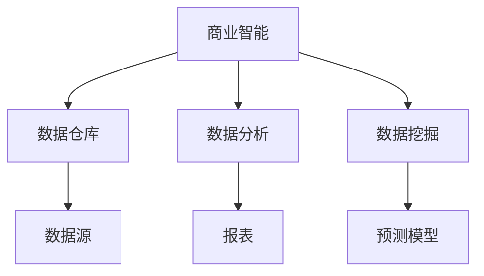

                 

### 《自动化创业中的商业智能应用》

#### 关键词：商业智能、自动化创业、数据仓库、数据分析、机器学习

> 在当今快速发展的商业环境中，自动化创业成为了许多企业家和开发者追求的目标。商业智能作为一种强大的技术手段，可以帮助企业从大量数据中提取有价值的信息，从而优化决策、提高效率和创新能力。本文将深入探讨商业智能在自动化创业中的应用，帮助创业者充分利用这项技术实现商业成功。

## 《自动化创业中的商业智能应用》目录大纲

### 第一部分：商业智能基础

#### 第1章：商业智能概述
- 1.1 商业智能的定义与历史
- 1.2 商业智能在企业中的应用价值
- 1.3 商业智能技术发展趋势

#### 第2章：数据仓库与数据湖
- 2.1 数据仓库的基本概念
- 2.2 数据仓库架构与关键技术
- 2.3 数据湖的概念与优势
- 2.4 数据仓库与数据湖的比较与应用场景

#### 第3章：数据质量管理
- 3.1 数据质量的概念与重要性
- 3.2 数据质量评估方法
- 3.3 数据质量改进策略
- 3.4 数据质量管理工具

### 第二部分：商业智能工具与技术

#### 第4章：商业智能工具
- 4.1 商业智能工具分类
- 4.2 主流商业智能工具介绍
- 4.3 商业智能工具选型策略

#### 第5章：数据分析方法
- 5.1 描述性分析
- 5.2 趋势分析
- 5.3 关联分析
- 5.4 预测分析

#### 第6章：数据可视化
- 6.1 数据可视化基本概念
- 6.2 数据可视化工具与技术
- 6.3 数据可视化案例分析

#### 第7章：机器学习与商业智能
- 7.1 机器学习基础
- 7.2 机器学习在商业智能中的应用
- 7.3 主流机器学习算法简介

### 第三部分：商业智能应用实战

#### 第8章：零售行业商业智能应用
- 8.1 零售行业数据特点与挑战
- 8.2 零售行业商业智能应用案例分析
- 8.3 零售行业商业智能应用策略

#### 第9章：金融行业商业智能应用
- 9.1 金融行业数据特点与挑战
- 9.2 金融行业商业智能应用案例分析
- 9.3 金融行业商业智能应用策略

#### 第10章：制造业商业智能应用
- 10.1 制造业数据特点与挑战
- 10.2 制造业商业智能应用案例分析
- 10.3 制造业商业智能应用策略

### 第四部分：商业智能项目管理与实施

#### 第11章：商业智能项目规划与管理
- 11.1 商业智能项目生命周期
- 11.2 商业智能项目规划与设计
- 11.3 商业智能项目风险管理与控制

#### 第12章：商业智能实施策略与最佳实践
- 12.1 商业智能实施流程
- 12.2 商业智能实施策略
- 12.3 商业智能实施最佳实践

### 附录

#### 附录A：商业智能相关资源与工具
- A.1 商业智能开源工具
- A.2 商业智能云服务提供商
- A.3 商业智能专业社区与论坛

#### 附录B：商业智能案例研究
- B.1 某零售企业商业智能应用案例
- B.2 某金融企业商业智能应用案例
- B.3 某制造业企业商业智能应用案例

#### 附录C：商业智能相关书籍推荐
- C.1 推荐书籍

### 第1章：商业智能概述

#### 1.1 商业智能的定义与历史

商业智能（Business Intelligence，简称BI）是一种利用数据分析技术，从大量数据中提取有价值信息，以支持企业决策和管理的过程。商业智能的历史可以追溯到20世纪80年代，当时企业开始关注如何利用数据来改善业务运营。

**核心概念与联系**

商业智能涉及多个核心概念，包括数据仓库、数据分析、数据挖掘等。数据仓库是企业存储大量结构化数据的仓库，用于支持商业智能应用。数据分析是对数据进行处理和分析，以发现数据中的规律和趋势。数据挖掘则是对数据进行深入挖掘，以发现潜在的模式和关联。

**Mermaid 流程图**



**核心概念与联系**

- 数据仓库：用于存储和管理企业数据，支持快速查询和分析。
- 数据分析：通过统计方法、数据可视化等技术，对企业数据进行分析和解读。
- 数据挖掘：利用算法和模型，从大量数据中发现潜在的模式和关联。

#### 1.2 商业智能在企业中的应用价值

商业智能在企业中的应用价值体现在多个方面：

1. **决策支持**：商业智能可以帮助企业从海量数据中提取有价值的信息，为企业决策提供数据支持。
2. **业务优化**：通过数据分析，企业可以发现业务中的瓶颈和优化点，从而提高业务效率和降低成本。
3. **市场预测**：商业智能可以帮助企业预测市场趋势和客户需求，从而制定有效的营销策略。
4. **客户关系管理**：商业智能可以帮助企业更好地了解客户，提高客户满意度和忠诚度。

#### 1.3 商业智能技术发展趋势

随着技术的不断发展，商业智能技术也在不断演进。以下是一些重要的技术发展趋势：

1. **云计算**：云计算为商业智能提供了更强大的计算能力和灵活性，企业可以通过云服务轻松实现商业智能应用。
2. **大数据**：大数据技术的成熟使得企业可以处理和分析更大量、更复杂的数据，从而提升商业智能的应用价值。
3. **机器学习**：机器学习技术在商业智能中的应用日益广泛，通过自动化和智能化的数据分析，企业可以实现更精确的预测和决策。
4. **移动端和Web应用**：随着移动设备和Web应用的普及，商业智能应用也开始向这些平台迁移，以提供更便捷的数据访问和数据分析服务。

### 第2章：数据仓库与数据湖

#### 2.1 数据仓库的基本概念

数据仓库是一种用于存储、管理和分析大量结构化数据的系统。它通常由以下几个核心组件构成：

1. **数据源**：数据源是数据仓库的数据输入部分，可以是内部数据库、外部数据源或实时数据流。
2. **数据存储**：数据存储是数据仓库的核心，用于存储大量结构化和半结构化数据。常见的存储技术包括关系数据库、分布式文件系统、NoSQL数据库等。
3. **数据集成**：数据集成是将不同来源的数据进行整合和处理，以形成统一的数据视图。常用的数据集成技术包括ETL（提取、转换、加载）和数据虚拟化。
4. **数据建模**：数据建模是数据仓库设计的关键步骤，用于定义数据仓库的结构和数据关系。常见的数据建模技术包括星型模型、雪花模型等。

**核心算法原理讲解**

数据仓库的ETL过程可以简化为以下伪代码：

```python
def etl(source_data, transform_rules, target_data):
    # 提取数据
    extracted_data = extract_data(source_data)
    # 转换数据
    transformed_data = apply_transformations(extracted_data, transform_rules)
    # 加载数据
    load_data(target_data, transformed_data)
```

**数学模型和数学公式**

数据仓库的性能评估可以使用以下公式：

$$
P = \frac{I + O + U}{T}
$$

其中：

- \(P\)：性能评分
- \(I\)：输入数据量
- \(O\)：输出数据量
- \(U\)：更新数据量
- \(T\)：处理时间

#### 2.2 数据仓库架构与关键技术

数据仓库的架构通常包括以下几个层次：

1. **数据源层**：数据源层包含各种内部和外部数据源，如数据库、文件系统、实时数据流等。
2. **数据集成层**：数据集成层负责将来自不同数据源的数据进行抽取、转换和加载，形成统一的数据视图。
3. **数据存储层**：数据存储层是数据仓库的核心，用于存储和管理大量结构化和半结构化数据。
4. **数据访问层**：数据访问层提供用户对数据仓库的访问接口，支持查询、分析和报表功能。

**核心算法原理讲解**

数据仓库的数据建模可以使用以下算法：

- **星型模型**：星型模型是一种常见的数据建模技术，用于表示事实表和维度表之间的关系。星型模型的核心是一个事实表，围绕事实表的是多个维度表。
- **雪花模型**：雪花模型是对星型模型的扩展，用于消除星型模型中的冗余数据。雪花模型通过将维度表的属性拆分为更细粒度的子表，形成类似于雪花的结构。

**数学模型和数学公式**

数据仓库的查询优化可以使用以下公式：

$$
Q = \frac{C \cdot V \cdot I}{(1 - D)}
$$

其中：

- \(Q\)：查询响应时间
- \(C\)：数据访问次数
- \(V\)：数据读取量
- \(I\)：索引使用率
- \(D\)：数据延迟

#### 2.3 数据湖的概念与优势

数据湖是一种新兴的数据存储架构，用于存储大量非结构化和半结构化数据。与数据仓库不同，数据湖不进行预定义的数据建模和结构化处理，而是将原始数据进行存储，以备后续分析和处理。

**核心概念与联系**

- 数据湖：用于存储非结构化和半结构化数据的分布式存储架构。
- 数据仓库：用于存储结构化数据，进行预定义的数据建模和分析。

**优势**

- **灵活性**：数据湖可以存储各种类型的数据，包括文本、图像、音频等，为企业提供了更大的灵活性。
- **可扩展性**：数据湖可以轻松扩展存储容量，以适应企业数据量的增长。
- **低成本**：数据湖使用分布式存储技术，降低了存储成本。
- **实时处理**：数据湖支持实时数据处理，企业可以快速获取和分析数据。

#### 2.4 数据仓库与数据湖的比较与应用场景

**数据仓库与数据湖的比较**

- **数据类型**：数据仓库主要存储结构化数据，而数据湖可以存储非结构化和半结构化数据。
- **数据处理**：数据仓库通常进行预定义的数据建模和结构化处理，而数据湖提供原始数据的存储，以备后续分析和处理。
- **存储成本**：数据仓库的存储成本相对较高，而数据湖利用分布式存储技术降低了存储成本。
- **应用场景**：数据仓库适用于需要严格数据管理和分析的场合，如财务报表、客户关系管理等。数据湖适用于需要灵活存储和实时处理大量非结构化数据的场合，如日志分析、物联网数据等。

**应用场景**

- **零售行业**：零售行业可以使用数据仓库进行销售分析、客户关系管理等。数据湖可以用于存储和实时处理来自不同渠道的丰富数据，如社交媒体数据、用户评论等。
- **金融行业**：金融行业可以使用数据仓库进行风险管理和财务分析。数据湖可以用于存储和实时处理大量金融数据，如交易数据、市场数据等。
- **医疗行业**：医疗行业可以使用数据仓库进行病历管理、医疗数据分析等。数据湖可以用于存储和实时处理来自不同医疗设备的非结构化数据，如医疗影像、患者日志等。

### 第3章：数据质量管理

#### 3.1 数据质量的概念与重要性

数据质量是指数据的准确性、完整性、一致性、及时性和可靠性等方面。高质量的数据对于企业的决策和业务运营至关重要。

**核心概念与联系**

- **准确性**：数据是否真实反映了实际情况。
- **完整性**：数据是否完整，没有缺失或重复。
- **一致性**：数据在不同系统或表中是否保持一致。
- **及时性**：数据是否能够及时更新和提供。
- **可靠性**：数据是否可信，能够支持决策。

**数学模型和数学公式**

数据质量的评估可以使用以下公式：

$$
Q = \frac{C \cdot V \cdot I}{(1 - D)}
$$

其中：

- \(Q\)：数据质量评分
- \(C\)：数据完整性
- \(V\)：数据准确性
- \(I\)：数据一致性
- \(D\)：数据延迟

#### 3.2 数据质量评估方法

数据质量评估是确保数据质量的关键步骤。以下是一些常见的数据质量评估方法：

1. **数据校验**：通过预定义的规则和标准，对数据进行校验，确保数据的准确性、完整性和一致性。
2. **数据监控**：通过监控系统实时监控数据质量，及时发现和解决数据问题。
3. **数据审计**：定期对数据质量进行审计，确保数据符合业务需求和法律法规。
4. **用户反馈**：收集用户对数据的反馈，了解数据在实际应用中的表现。

**数学模型和数学公式**

数据质量监控可以使用以下公式：

$$
M = \frac{N \cdot P}{(1 - R)}
$$

其中：

- \(M\)：数据质量监控评分
- \(N\)：数据监控次数
- \(P\)：数据问题发现率
- \(R\)：数据问题修复率

#### 3.3 数据质量改进策略

为了提高数据质量，企业可以采取以下策略：

1. **数据治理**：建立数据治理框架，明确数据责任、流程和标准，确保数据质量。
2. **数据清洗**：定期对数据进行清洗，修复数据中的错误和缺失，确保数据的准确性、完整性和一致性。
3. **数据标准化**：制定数据标准化规则，统一数据格式和命名规范，提高数据的一致性。
4. **数据存储和管理**：采用合适的数据存储和管理技术，确保数据的可靠性和安全性。

**数学模型和数学公式**

数据质量改进效果可以使用以下公式评估：

$$
E = \frac{Q_{\text{初}} - Q_{\text{末}}}{Q_{\text{初}}}
$$

其中：

- \(E\)：数据质量改进效果
- \(Q_{\text{初}}\)：初始数据质量评分
- \(Q_{\text{末}}\)：改进后的数据质量评分

#### 3.4 数据质量管理工具

数据质量管理工具可以帮助企业监控、评估和改进数据质量。以下是一些常见的数据质量管理工具：

1. **数据质量管理平台**：如Informatica Data Quality、Talend Data Quality等，提供数据质量监控、评估和改进功能。
2. **数据清洗工具**：如Trifacta、Panoply等，提供数据清洗、转换和加载功能。
3. **数据治理工具**：如IBM InfoSphere Information Governance、Oracle Data Governance等，提供数据治理、标准和流程管理功能。
4. **数据监控工具**：如Tableau、Power BI等，提供实时数据监控和可视化功能。

### 第4章：商业智能工具

#### 4.1 商业智能工具分类

商业智能工具可以分为以下几类：

1. **数据集成工具**：如Informatica PowerCenter、Talend等，用于数据抽取、转换和加载。
2. **数据仓库工具**：如Oracle Exadata、Amazon Redshift等，用于数据存储和管理。
3. **数据分析工具**：如Tableau、Power BI等，用于数据可视化和报表生成。
4. **数据挖掘工具**：如IBM SPSS、R等，用于数据分析和预测建模。

#### 4.2 主流商业智能工具介绍

以下是一些主流的商业智能工具：

1. **Tableau**：Tableau是一款功能强大的数据可视化工具，支持多种数据源连接和丰富的可视化图表。
2. **Power BI**：Power BI是微软推出的商业智能工具，提供数据集成、数据可视化和报表生成功能。
3. **QlikView**：QlikView是一款数据可视化工具，支持灵活的数据探索和分析。
4. **SAS**：SAS是一款综合性的数据分析工具，提供数据管理、数据分析和预测建模等功能。
5. **SPSS**：SPSS是一款经典的统计分析工具，广泛应用于社会科学和商业领域。

#### 4.3 商业智能工具选型策略

选择合适的商业智能工具是成功实施商业智能项目的关键。以下是一些选型策略：

1. **明确业务需求**：了解企业具体的业务需求，选择能够满足这些需求的功能强大的商业智能工具。
2. **考虑数据源**：选择能够兼容企业现有数据源的商业智能工具，确保数据的流畅集成。
3. **易用性**：选择易于使用和学习的商业智能工具，降低培训和操作成本。
4. **可扩展性**：选择具有良好扩展性的商业智能工具，能够适应企业的未来发展需求。
5. **成本效益**：综合考虑工具的成本和效益，选择性价比高的商业智能工具。

### 第5章：数据分析方法

#### 5.1 描述性分析

描述性分析是数据分析的基础，主要用于了解数据的基本特性和分布情况。描述性分析包括以下几个方面：

1. **基本统计量**：计算数据的均值、中位数、众数、标准差等基本统计量，用于了解数据的集中趋势和离散程度。
2. **分布分析**：分析数据的分布情况，包括正态分布、偏态分布等，了解数据是否符合预期分布。
3. **可视化**：使用图表和图形展示数据的基本特性和分布情况，如柱状图、饼图、直方图等。

#### 5.2 趋势分析

趋势分析是分析数据随时间变化的情况，用于了解数据的趋势和变化规律。趋势分析包括以下几个方面：

1. **时间序列分析**：分析数据的时间序列特性，包括趋势、季节性和周期性等。
2. **回归分析**：使用回归模型分析数据的变化趋势，预测未来的数据趋势。
3. **可视化**：使用图表和图形展示数据的变化趋势，如折线图、时间序列图等。

#### 5.3 关联分析

关联分析是分析数据之间的关联关系，用于发现数据中的潜在关联和依赖关系。关联分析包括以下几个方面：

1. **关联规则挖掘**：使用关联规则挖掘算法（如Apriori算法、FP-growth算法等）发现数据中的关联关系。
2. **相关分析**：计算数据之间的相关系数，了解数据之间的线性相关关系。
3. **可视化**：使用图表和图形展示数据的关联关系，如关联规则图、散点图等。

#### 5.4 预测分析

预测分析是数据分析的高级阶段，主要用于预测未来的数据趋势和变化。预测分析包括以下几个方面：

1. **时间序列预测**：使用时间序列预测模型（如ARIMA模型、LSTM模型等）预测未来的数据趋势。
2. **回归预测**：使用回归预测模型（如线性回归模型、多项式回归模型等）预测未来的数据值。
3. **分类预测**：使用分类预测模型（如决策树模型、随机森林模型等）预测未来的数据类别。
4. **聚类预测**：使用聚类预测模型（如K-means聚类模型、层次聚类模型等）预测未来的数据类别。

### 第6章：数据可视化

#### 6.1 数据可视化基本概念

数据可视化是将数据以图形化的方式展示出来，帮助人们更好地理解和分析数据。数据可视化包括以下几个方面：

1. **图表类型**：常用的图表类型包括柱状图、饼图、折线图、散点图、雷达图等，每种图表类型适用于不同类型的数据和不同的分析目的。
2. **可视化工具**：常用的数据可视化工具包括Tableau、Power BI、QlikView、matplotlib等，这些工具提供了丰富的图表类型和自定义选项。
3. **可视化设计原则**：良好的数据可视化设计应遵循清晰、简洁、直观、美观等原则，确保用户能够快速理解和分析数据。

#### 6.2 数据可视化工具与技术

以下是一些常用的数据可视化工具和技术：

1. **Tableau**：Tableau是一款功能强大的数据可视化工具，支持多种数据源连接和丰富的可视化图表。Tableau提供了拖拽式操作界面，使得数据可视化变得简单便捷。
2. **Power BI**：Power BI是微软推出的商业智能工具，提供了强大的数据可视化功能。Power BI支持多种数据源连接，支持自定义图表和仪表板。
3. **matplotlib**：matplotlib是Python的一个数据可视化库，提供了丰富的图表类型和自定义选项。matplotlib适合在Python环境中进行数据可视化。
4. **D3.js**：D3.js是一个基于JavaScript的数据可视化库，提供了强大的数据绑定和交互功能。D3.js适合在Web环境中进行数据可视化。

#### 6.3 数据可视化案例分析

以下是一个数据可视化案例：

1. **案例描述**：某零售企业希望了解不同产品的销售情况，包括销售额、销售量和销售趋势等。
2. **数据源**：销售数据来自企业的ERP系统。
3. **可视化工具**：使用Tableau进行数据可视化。
4. **可视化设计**：
   - 横轴：时间（按月）
   - 纵轴：销售额
   - 颜色：不同产品使用不同颜色进行区分
   - 图例：显示不同产品的销售额占比
   - 图表类型：折线图和柱状图
5. **可视化结果**：
   - 销售额趋势图：显示不同产品的销售额随时间的变化情况。
   - 销售额占比图：显示不同产品的销售额在总销售额中的占比。
   - 通过数据可视化，企业可以直观地了解不同产品的销售情况，为制定销售策略提供数据支持。

### 第7章：机器学习与商业智能

#### 7.1 机器学习基础

机器学习是人工智能的一个重要分支，它利用数据训练模型，使模型能够对未知数据进行预测和分类。以下是一些基础的机器学习概念：

1. **监督学习**：监督学习是机器学习的一种类型，通过已标记的数据训练模型，使模型能够对新数据进行预测。常见的监督学习算法包括线性回归、决策树、随机森林等。
2. **无监督学习**：无监督学习是机器学习的另一种类型，没有已标记的数据进行训练，主要目标是发现数据中的潜在模式和结构。常见的无监督学习算法包括聚类、降维等。
3. **强化学习**：强化学习是机器学习的第三种类型，通过与环境的交互来学习最优策略。常见的强化学习算法包括Q-learning、SARSA等。

#### 7.2 机器学习在商业智能中的应用

机器学习在商业智能中有着广泛的应用，以下是一些常见的应用场景：

1. **客户行为预测**：通过分析客户的历史行为数据，预测客户的购买行为和偏好，为企业制定精准营销策略提供支持。
2. **风险控制**：通过分析金融数据，预测客户的信用风险和交易风险，帮助企业降低风险。
3. **供应链优化**：通过分析供应链数据，预测供应链中的需求变化，优化库存管理和物流配送。
4. **自然语言处理**：通过分析文本数据，提取关键词、情感倾向等，用于文本分类、语义分析等。

#### 7.3 主流机器学习算法简介

以下是一些主流的机器学习算法及其应用场景：

1. **线性回归**：用于预测连续值变量，如销售额、价格等。线性回归模型公式为：
   $$y = \beta_0 + \beta_1x$$
   其中，\(y\)为预测值，\(\beta_0\)为截距，\(\beta_1\)为斜率。
2. **决策树**：用于分类和回归任务，通过树形结构对数据进行划分和预测。决策树算法具有简单、易于解释的特点。
3. **支持向量机（SVM）**：用于分类任务，通过寻找最优超平面将不同类别的数据分开。SVM算法具有较高的分类准确率。
4. **神经网络**：用于复杂的数据建模和预测，通过多层神经元对数据进行处理。常见的神经网络结构包括前馈神经网络、卷积神经网络（CNN）等。

### 第8章：零售行业商业智能应用

#### 8.1 零售行业数据特点与挑战

零售行业数据具有以下特点：

1. **多样性**：零售行业涉及多种商品和业务场景，数据类型多样，包括销售额、库存、订单、客户等。
2. **大量性**：零售行业每天产生大量的交易数据，需要处理海量数据。
3. **实时性**：零售行业需要实时处理和分析数据，以支持决策和业务运营。
4. **复杂性**：零售行业数据通常包含多种维度，如时间、地域、商品等，数据关系复杂。

零售行业在商业智能应用中面临以下挑战：

1. **数据质量**：数据质量是商业智能应用的基础，零售行业数据质量较差，需要进行数据清洗和预处理。
2. **数据整合**：零售行业数据来自多个渠道和系统，需要整合不同数据源，形成统一的数据视图。
3. **数据分析**：零售行业数据量大且复杂，需要高效的数据分析方法和工具，以快速提取有价值的信息。
4. **数据安全**：零售行业数据涉及客户隐私和商业机密，需要确保数据安全。

#### 8.2 零售行业商业智能应用案例分析

以下是一个零售行业商业智能应用案例：

1. **案例描述**：某大型零售企业希望通过商业智能分析优化库存管理，降低库存成本。
2. **数据源**：数据来源包括ERP系统、POS系统、物流系统等，涉及销售额、库存、订单、客户等数据。
3. **数据预处理**：对数据进行清洗和整合，去除重复数据和无效数据，形成统一的数据视图。
4. **数据分析**：
   - **趋势分析**：分析不同时间段、不同地区的销售额和库存变化情况，发现销售高峰和库存积压点。
   - **关联分析**：分析不同商品之间的关联关系，发现畅销商品和搭配销售商品，优化库存结构。
   - **预测分析**：使用机器学习算法预测未来一段时间内的销售额和库存需求，为库存调整提供依据。
5. **可视化**：使用数据可视化工具展示分析结果，如趋势图、关联图、预测图等，帮助决策者直观地了解库存情况。

#### 8.3 零售行业商业智能应用策略

零售行业在商业智能应用中可以采取以下策略：

1. **数据整合**：整合不同数据源，建立统一的数据仓库，实现数据的实时集成和更新。
2. **数据质量**：建立数据质量管理机制，确保数据质量，包括数据清洗、数据校验、数据监控等。
3. **数据分析**：采用高效的数据分析方法和工具，快速提取有价值的信息，支持决策和业务运营。
4. **数据安全**：加强数据安全措施，保护客户隐私和商业机密，确保数据安全。
5. **数据驱动**：建立数据驱动决策机制，将数据分析和决策紧密结合，提升决策效率和质量。
6. **持续优化**：持续优化商业智能应用，根据业务需求和数据变化进行调整和改进，提升应用效果。

### 第9章：金融行业商业智能应用

#### 9.1 金融行业数据特点与挑战

金融行业数据具有以下特点：

1. **多样性**：金融行业涉及多种业务场景，数据类型多样，包括交易数据、客户数据、市场数据等。
2. **大量性**：金融行业每天产生大量的交易数据，需要处理海量数据。
3. **实时性**：金融行业需要实时处理和分析数据，以支持交易决策和风险管理。
4. **复杂性**：金融行业数据关系复杂，涉及多维度、多层次的业务逻辑和规则。

金融行业在商业智能应用中面临以下挑战：

1. **数据质量**：金融行业数据质量要求高，需要进行严格的数据清洗和预处理。
2. **数据整合**：金融行业数据来自多个渠道和系统，需要整合不同数据源，形成统一的数据视图。
3. **数据分析**：金融行业数据量大且复杂，需要高效的数据分析方法和工具，以快速提取有价值的信息。
4. **数据安全**：金融行业数据涉及客户隐私和交易信息，需要确保数据安全。

#### 9.2 金融行业商业智能应用案例分析

以下是一个金融行业商业智能应用案例：

1. **案例描述**：某银行希望通过商业智能分析优化客户关系管理，提高客户满意度和忠诚度。
2. **数据源**：数据来源包括CRM系统、交易系统、客户服务系统等，涉及客户信息、交易记录、客户服务记录等。
3. **数据预处理**：对数据进行清洗和整合，去除重复数据和无效数据，形成统一的数据视图。
4. **数据分析**：
   - **客户行为分析**：分析客户的交易行为和偏好，发现潜在客户和风险客户，为营销和风险管理提供依据。
   - **客户价值分析**：分析客户的资产、交易量、盈利能力等，评估客户价值，为制定个性化服务和营销策略提供支持。
   - **客户满意度分析**：分析客户的服务体验和反馈，发现服务短板和改进点，提高客户满意度。
5. **可视化**：使用数据可视化工具展示分析结果，如客户行为图、客户价值图、客户满意度图等，帮助决策者直观地了解客户关系管理情况。

#### 9.3 金融行业商业智能应用策略

金融行业在商业智能应用中可以采取以下策略：

1. **数据整合**：整合不同数据源，建立统一的数据仓库，实现数据的实时集成和更新。
2. **数据质量**：建立数据质量管理机制，确保数据质量，包括数据清洗、数据校验、数据监控等。
3. **数据分析**：采用高效的数据分析方法和工具，快速提取有价值的信息，支持决策和业务运营。
4. **数据安全**：加强数据安全措施，保护客户隐私和交易信息，确保数据安全。
5. **风险控制**：利用商业智能技术进行风险分析和控制，包括信用风险、市场风险、操作风险等。
6. **个性化服务**：利用客户数据进行个性化服务，提高客户满意度和忠诚度。
7. **持续优化**：持续优化商业智能应用，根据业务需求和数据变化进行调整和改进，提升应用效果。

### 第10章：制造业商业智能应用

#### 10.1 制造业数据特点与挑战

制造业数据具有以下特点：

1. **多样性**：制造业涉及多种产品和生产环节，数据类型多样，包括生产数据、设备数据、供应链数据等。
2. **大量性**：制造业每天产生大量的生产数据，需要处理海量数据。
3. **实时性**：制造业需要实时监控和控制生产过程，确保生产效率和产品质量。
4. **复杂性**：制造业数据关系复杂，涉及多维度、多层次的业务逻辑和规则。

制造业在商业智能应用中面临以下挑战：

1. **数据质量**：制造业数据质量要求高，需要进行严格的数据清洗和预处理。
2. **数据整合**：制造业数据来自多个系统和设备，需要整合不同数据源，形成统一的数据视图。
3. **数据分析**：制造业数据量大且复杂，需要高效的数据分析方法和工具，以快速提取有价值的信息。
4. **数据安全**：制造业数据涉及生产计划、物料信息等，需要确保数据安全。

#### 10.2 制造业商业智能应用案例分析

以下是一个制造业商业智能应用案例：

1. **案例描述**：某制造企业希望通过商业智能分析优化生产计划和库存管理，提高生产效率。
2. **数据源**：数据来源包括生产管理系统、库存管理系统、设备监控系统等，涉及生产计划、库存水平、设备状态等。
3. **数据预处理**：对数据进行清洗和整合，去除重复数据和无效数据，形成统一的数据视图。
4. **数据分析**：
   - **生产计划分析**：分析生产计划执行情况，发现生产瓶颈和调度不合理点，为生产调度提供依据。
   - **库存分析**：分析库存水平，发现库存积压和库存短缺点，为库存调整提供依据。
   - **设备状态分析**：分析设备状态，发现设备故障和维护需求，为设备维护提供依据。
5. **可视化**：使用数据可视化工具展示分析结果，如生产计划图、库存水平图、设备状态图等，帮助决策者直观地了解生产计划和库存管理情况。

#### 10.3 制造业商业智能应用策略

制造业在商业智能应用中可以采取以下策略：

1. **数据整合**：整合不同数据源，建立统一的数据仓库，实现数据的实时集成和更新。
2. **数据质量**：建立数据质量管理机制，确保数据质量，包括数据清洗、数据校验、数据监控等。
3. **数据分析**：采用高效的数据分析方法和工具，快速提取有价值的信息，支持决策和业务运营。
4. **数据安全**：加强数据安全措施，保护生产计划和物料信息等，确保数据安全。
5. **生产优化**：利用商业智能技术进行生产计划优化，提高生产效率和产品质量。
6. **库存管理**：利用商业智能技术进行库存管理优化，降低库存成本和提高库存周转率。
7. **设备维护**：利用商业智能技术进行设备状态监控和维护优化，提高设备可靠性和生产效率。
8. **持续优化**：持续优化商业智能应用，根据业务需求和数据变化进行调整和改进，提升应用效果。

### 第11章：商业智能项目规划与管理

#### 11.1 商业智能项目生命周期

商业智能项目生命周期包括以下阶段：

1. **项目启动**：明确项目目标、范围和资源需求，组建项目团队。
2. **需求分析**：与利益相关者沟通，收集和分析业务需求，制定项目需求文档。
3. **设计阶段**：设计商业智能系统的架构和功能，制定详细的技术方案和实施计划。
4. **开发阶段**：根据设计方案进行系统开发和测试，确保系统符合需求。
5. **部署阶段**：将商业智能系统部署到生产环境，进行用户培训和上线测试。
6. **运维阶段**：对商业智能系统进行维护和升级，确保系统稳定运行。
7. **评估阶段**：对项目成果进行评估，总结经验教训，为后续项目提供参考。

#### 11.2 商业智能项目规划与设计

商业智能项目规划与设计包括以下关键步骤：

1. **项目规划**：制定项目计划，包括时间表、资源分配、风险管理等。
2. **需求分析**：与利益相关者沟通，了解业务需求，制定详细的需求文档。
3. **系统架构设计**：设计商业智能系统的整体架构，包括数据仓库、数据集市、数据分析工具等。
4. **数据建模**：根据业务需求设计数据模型，包括数据仓库模型、数据集市模型等。
5. **技术选型**：选择合适的商业智能工具和技术，包括数据库、数据仓库、数据挖掘工具等。
6. **安全性设计**：设计数据安全和系统安全措施，确保商业智能系统的可靠性和安全性。

#### 11.3 商业智能项目风险管理与控制

商业智能项目风险管理与控制包括以下关键步骤：

1. **风险识别**：识别项目可能面临的风险，包括技术风险、业务风险、人力资源风险等。
2. **风险评估**：评估风险的概率和影响，确定优先级和风险承受能力。
3. **风险应对**：制定风险应对策略，包括风险规避、风险转移、风险接受等。
4. **风险监控**：监控项目风险的变化情况，及时调整风险应对措施。
5. **风险控制**：实施风险控制措施，确保项目按计划进行，降低风险发生概率和影响。

### 第12章：商业智能实施策略与最佳实践

#### 12.1 商业智能实施流程

商业智能实施流程包括以下关键步骤：

1. **需求分析**：与利益相关者沟通，了解业务需求，制定详细的需求文档。
2. **系统设计**：设计商业智能系统的整体架构和功能，包括数据仓库、数据集市、数据分析工具等。
3. **数据集成**：整合不同数据源，建立统一的数据仓库和数据集市，确保数据的完整性和一致性。
4. **数据分析**：根据业务需求进行数据分析，包括描述性分析、趋势分析、关联分析和预测分析等。
5. **数据可视化**：使用数据可视化工具展示分析结果，帮助决策者直观地了解业务情况。
6. **系统部署**：将商业智能系统部署到生产环境，进行用户培训和上线测试。
7. **系统运维**：对商业智能系统进行维护和升级，确保系统稳定运行。

#### 12.2 商业智能实施策略

商业智能实施策略包括以下关键点：

1. **明确目标**：明确商业智能项目目标，确保项目实施方向正确。
2. **数据质量**：确保数据质量，进行数据清洗、数据校验和数据监控等。
3. **资源分配**：合理分配人力资源和资源，确保项目有足够的支持和保障。
4. **项目管理**：建立健全的项目管理制度，确保项目按计划进行。
5. **风险管理**：识别和评估风险，制定应对措施，降低风险发生概率和影响。

#### 12.3 商业智能实施最佳实践

以下是一些商业智能实施最佳实践：

1. **从简单开始**：实施初期，选择简单的业务场景进行试点，逐步扩大应用范围。
2. **灵活调整**：根据实际情况和业务需求，灵活调整商业智能系统的设计和功能。
3. **用户参与**：与用户紧密合作，了解用户需求和反馈，确保商业智能系统符合实际业务需求。
4. **培训和支持**：为用户提供培训和文档支持，确保用户能够熟练使用商业智能系统。
5. **持续优化**：持续优化商业智能系统的性能和功能，根据业务需求和数据变化进行调整和改进。

### 附录A：商业智能相关资源与工具

#### A.1 商业智能开源工具

以下是一些常用的商业智能开源工具：

1. **Apache Superset**：一个用于数据可视化和仪表板构建的开源工具。
2. **Metabase**：一个简单易用的开源商业智能工具。
3. **Apache NiFi**：一个用于数据集成和数据流处理的分布式系统。
4. **Apache Druid**：一个用于实时分析和查询的大规模分布式数据存储引擎。
5. **Apache Hive**：一个用于数据仓库和大数据分析的SQL引擎。

#### A.2 商业智能云服务提供商

以下是一些知名的商业智能云服务提供商：

1. **Amazon Web Services (AWS)**：提供丰富的商业智能云服务和工具。
2. **Microsoft Azure**：提供商业智能解决方案和云计算服务。
3. **Google Cloud Platform (GCP)**：提供商业智能云服务和大数据分析工具。
4. **IBM Cloud**：提供商业智能解决方案和云计算服务。
5. **Alibaba Cloud**：提供商业智能云服务和大数据分析工具。

#### A.3 商业智能专业社区与论坛

以下是一些商业智能专业社区和论坛：

1. **Kaggle**：一个数据科学和机器学习的在线社区。
2. **DataCamp**：一个提供数据科学和商业智能在线课程的平台。
3. **Dataquest**：一个提供数据科学和商业智能在线学习路径的平台。
4. **Tableau Public**：一个用于数据可视化的在线社区。
5. **RStudio Community**：一个R语言和数据分析的在线社区。

### 附录B：商业智能案例研究

#### B.1 某零售企业商业智能应用案例

**案例描述**：

某大型零售企业希望通过商业智能分析优化销售管理和库存管理，提高销售额和库存周转率。

**数据源**：

数据来源包括销售系统、库存系统、客户关系管理系统等，涉及销售额、库存水平、订单信息、客户信息等。

**解决方案**：

1. **数据集成**：使用Apache NiFi整合不同数据源，建立统一的数据仓库。
2. **数据分析**：
   - **销售分析**：分析不同产品、不同时间段的销售额，发现销售趋势和销售高峰期。
   - **库存分析**：分析库存水平，发现库存积压和库存短缺情况，优化库存管理策略。
   - **客户分析**：分析客户购买行为和偏好，发现潜在客户和忠诚客户，制定精准营销策略。
3. **数据可视化**：使用Apache Superset展示分析结果，提供直观的数据可视化报表。

**效果**：

通过商业智能分析，零售企业优化了销售策略和库存管理，提高了销售额和库存周转率，降低了库存成本。

### 附录C：商业智能相关书籍推荐

#### C.1 推荐书籍：

1. **《大数据商业智能实战》**：详细介绍了大数据商业智能的应用和实践方法。
2. **《商业智能：使用数据可视化提升业务洞察》**：讲述了数据可视化的方法和技巧，以及如何通过数据可视化提升业务洞察。
3. **《机器学习实战》**：介绍了机器学习的基本原理和应用，包括商业智能领域的应用案例。
4. **《数据仓库与数据挖掘》**：详细讲解了数据仓库和数据挖掘的理论和实践，是商业智能领域的经典教材。
5. **《商业智能：理论与实践》**：结合理论和实践，介绍了商业智能的基本概念、方法和工具。

### 附录D：商业智能专业课程推荐

#### D.1 推荐课程：

1. **《商业智能与数据分析》**：一门涵盖商业智能基础知识和数据分析方法的课程。
2. **《大数据商业智能应用》**：一门介绍大数据商业智能应用技术和实战经验的课程。
3. **《数据仓库与数据挖掘》**：一门深入讲解数据仓库和数据挖掘理论和实践的课程。
4. **《机器学习与商业智能》**：一门介绍机器学习在商业智能领域应用的课程。
5. **《数据可视化》**：一门讲述数据可视化基本概念、方法和工具的课程。

