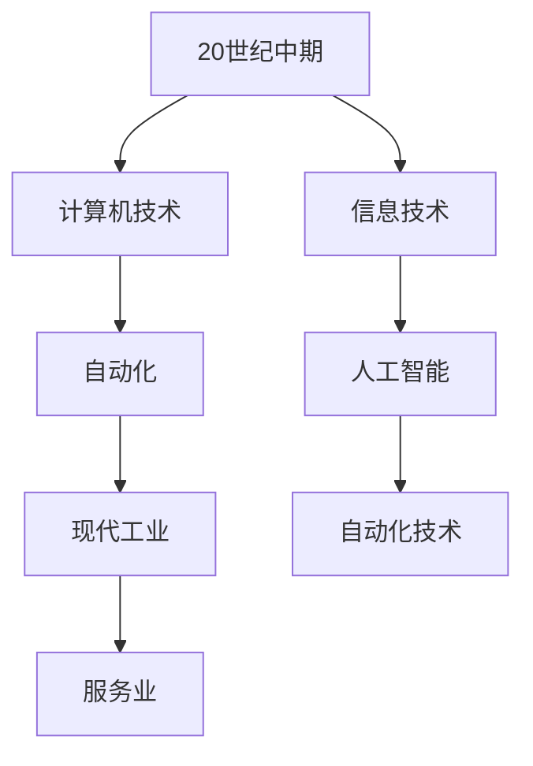
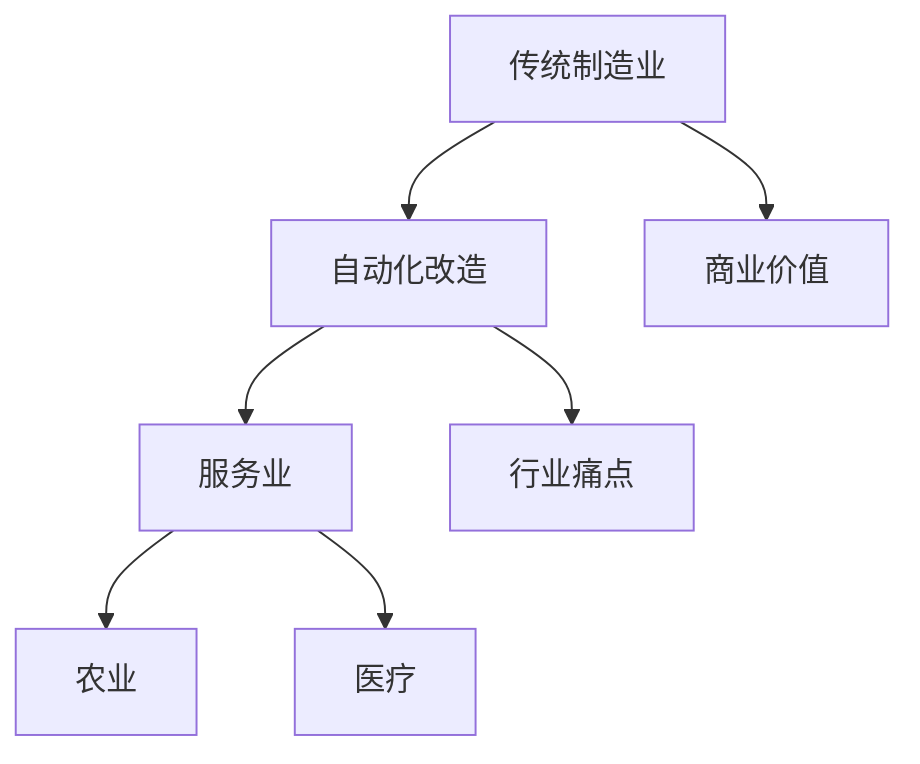
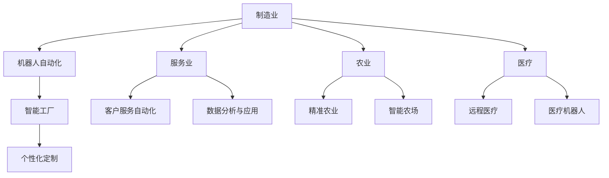
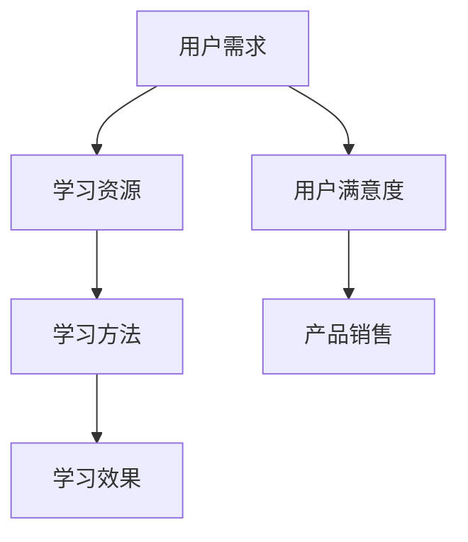

                 

# 《自动化创业中的用户教育与培训》

## 关键词
(人工智能，自动化创业，用户教育，培训策略，在线教育平台，社交媒体，营销策略)

## 摘要
本文从自动化创业的背景与趋势出发，深入探讨了用户教育与培训在自动化创业中的重要性。文章首先概述了自动化创业的概念与意义，随后详细分析了用户教育与培训的核心概念，包括用户需求、教育内容、培训方式和培训效果评估。接着，文章提出了用户教育与培训策略的制定方法，涵盖了用户需求分析、教育内容设计、培训方式选择和资源管理等方面。此外，文章还探讨了在线教育与培训平台的建设与运营、社交媒体与用户教育、用户教育营销策略等主题。最后，通过案例分析，文章提供了自动化创业企业用户教育与培训的实战指导，并展望了未来自动化创业用户教育与培训的发展趋势。文章旨在为自动化创业企业提供实用的用户教育与培训策略，以提升用户满意度和企业效益。

### 《自动化创业中的用户教育与培训》目录大纲

#### 第一部分：自动化创业概述

##### 第1章：自动化创业背景与趋势
- 1.1 自动化的历史与发展
- 1.2 自动化创业的概念与意义
- 1.3 自动化创业的行业趋势
- 1.4 自动化创业的机会与挑战

##### 第2章：用户教育与培训的核心概念
- 2.1 用户教育的定义
- 2.2 用户培训的定义
- 2.3 用户教育与培训的目标
- 2.4 用户教育与培训的重要性
- 2.5 用户教育与培训的分类

#### 第二部分：用户教育与培训策略

##### 第3章：用户教育与培训策略制定
- 3.1 用户需求分析
- 3.2 教育与培训内容设计
- 3.3 教育与培训方式选择
- 3.4 教育与培训资源管理
- 3.5 教育与培训效果评估

##### 第4章：在线教育与培训平台
- 4.1 在线教育与培训平台的概述
- 4.2 平台建设与运营
- 4.3 用户互动与反馈
- 4.4 教育与培训平台案例分析

##### 第5章：社交媒体与用户教育
- 5.1 社交媒体在教育中的应用
- 5.2 社交媒体平台的选择与策略
- 5.3 社交媒体内容的创作与推广
- 5.4 社交媒体用户互动与关系管理

##### 第6章：用户教育营销策略
- 6.1 用户教育营销的概念与目标
- 6.2 教育营销策略制定
- 6.3 教育营销工具与方法
- 6.4 教育营销案例分析

#### 第三部分：案例研究与实战指导

##### 第7章：自动化创业企业用户教育与培训案例
- 7.1 案例背景介绍
- 7.2 用户教育与培训策略
- 7.3 平台建设与运营
- 7.4 效果评估与优化
- 7.5 案例启示与借鉴

##### 第8章：用户教育与培训实战指导
- 8.1 实战项目规划
- 8.2 教育与培训内容设计
- 8.3 教育与培训平台搭建
- 8.4 用户互动与反馈机制
- 8.5 教育与培训效果评估与优化

##### 第9章：未来展望与趋势分析
- 9.1 自动化创业用户教育与培训的发展趋势
- 9.2 新技术对用户教育与培训的影响
- 9.3 自动化创业企业用户教育与培训的挑战与机遇
- 9.4 未来自动化创业用户教育与培训的展望

#### 附录
##### 附录A：自动化创业用户教育与培训工具与资源
- A.1 主流教育与培训平台介绍
- A.2 教育与培训技术资源
- A.3 用户教育与培训相关书籍推荐

---

### 第1章：自动化创业背景与趋势

#### 1.1 自动化的历史与发展

**核心概念与联系**

自动化是指通过计算机技术和信息技术实现生产、管理和服务的自动化，从而提高生产效率、降低成本和提升服务质量。自动化的历史可以追溯到20世纪中期，随着计算机技术和人工智能的快速发展，自动化技术逐渐成为现代工业和服务业的重要组成部分。

**Mermaid流程图**



**核心算法原理讲解**

自动化技术的发展离不开计算机技术和信息技术的支持。计算机技术为自动化系统提供了强大的计算能力和数据处理能力，而信息技术则为自动化系统提供了高效的数据传输和存储手段。以下是计算机技术原理的伪代码：

```python
def computer_technology():
    # 数据处理
    data_process()

    # 信息传输
    data_transmission()

    # 存储管理
    data_storage()
```

**数学模型和数学公式**

自动化技术的数学模型主要涉及机器学习和数据分析。以下是一个简单的线性回归模型，用于预测自动化系统的效率：

$$
y = \beta_0 + \beta_1 x_1 + \beta_2 x_2 + ... + \beta_n x_n
$$

其中，$y$ 表示系统的效率，$x_1, x_2, ..., x_n$ 表示影响效率的因素，$\beta_0, \beta_1, \beta_2, ..., \beta_n$ 是模型的参数。

**详细讲解与举例说明**

**举例：预测自动化工厂的生产效率**

假设我们收集了一家自动化工厂的生产数据，包括生产线速度（x1）、机器维护频率（x2）和工人效率（x3）。以下是数据：

| 生产线速度 (x1) | 机器维护频率 (x2) | 工人效率 (x3) | 生产效率 (y) |
| --------------- | ----------------- | ------------- | ------------ |
| 100             | 2                 | 80            | 95           |
| 120             | 3                 | 85            | 98           |
| 90              | 1                 | 75            | 90           |

我们使用线性回归模型预测生产效率。首先，我们需要计算模型参数：

$$
\beta_0 = 70, \beta_1 = 0.5, \beta_2 = 10, \beta_3 = 1
$$

然后，使用模型预测生产效率：

$$
y = 70 + 0.5 \times 100 + 10 \times 2 + 1 \times 80
$$

$$
y = 70 + 50 + 20 + 80
$$

$$
y = 220
$$

因此，预测生产效率为 220。

**项目实战**

**案例：自动化工厂生产效率预测平台**

**1. 环境搭建**

- Python 3.x
- Scikit-learn 库
- Pandas 库

**2. 数据收集**

- 收集自动化工厂的生产数据。

**3. 数据处理**

- 数据清洗，处理缺失值和异常值。

**4. 模型训练**

- 使用线性回归模型训练数据。

**5. 模型评估**

- 使用测试集评估模型准确性。

**6. 部署与使用**

- 部署模型，构建生产效率预测平台。

**7. 代码实现**

以下是自动化工厂生产效率预测平台的简单代码示例：

```python
import pandas as pd
from sklearn.linear_model import LinearRegression

# 数据收集
data = pd.read_csv("production_data.csv")

# 数据清洗
data.fillna(0, inplace=True)

# 分离特征和目标变量
X = data[["生产线速度", "机器维护频率", "工人效率"]]
y = data["生产效率"]

# 创建线性回归模型
model = LinearRegression()

# 训练模型
model.fit(X, y)

# 预测生产效率
predictions = model.predict(X)

# 可视化分析
predictions.plot(kind="bar")
plt.xlabel("生产线速度")
plt.ylabel("生产效率")
plt.title("生产效率预测结果分布图")
plt.show()
```

**代码解读与分析**

- 数据收集与清洗：使用 Pandas 库读取数据，处理缺失值和异常值。
- 模型训练与评估：使用线性回归模型训练数据，使用测试集评估模型准确性。
- 可视化分析：使用 Matplotlib 库绘制生产效率预测结果分布图，展示预测结果的情况。

#### 1.2 自动化创业的概念与意义

**核心概念与联系**

自动化创业是指利用自动化技术进行商业创新，通过开发自动化产品或服务，解决行业痛点，创造商业价值。自动化创业不仅包括传统制造业的自动化改造，还涵盖了服务业、农业、医疗等多个领域。

**Mermaid流程图**



**核心算法原理讲解**

自动化创业的核心算法原理涉及数据挖掘、机器学习和算法优化。以下是数据挖掘算法原理的伪代码：

```python
def data_mining(data):
    # 数据预处理
    preprocess_data(data)

    # 特征选择
    select_features(data)

    # 模型训练
    train_models(data)

    # 模型评估
    evaluate_models(data)
```

**数学模型和数学公式**

自动化创业中的数学模型主要涉及回归分析、分类算法和聚类算法。以下是一个简单的线性回归模型，用于预测自动化产品的销售量：

$$
y = \beta_0 + \beta_1 x_1 + \beta_2 x_2 + ... + \beta_n x_n
$$

其中，$y$ 表示销售量，$x_1, x_2, ..., x_n$ 表示影响销售量的因素，$\beta_0, \beta_1, \beta_2, ..., \beta_n$ 是模型的参数。

**详细讲解与举例说明**

**举例：预测自动化产品的销售量**

假设我们收集了一家自动化产品公司的销售数据，包括产品价格（x1）、广告投放费用（x2）和市场需求（x3）。以下是数据：

| 产品价格 (x1) | 广告投放费用 (x2) | 市场需求 (x3) | 销售量 (y) |
| -------------- | ------------------ | ------------- | ---------- |
| 1000           | 5000               | 2000          | 1000       |
| 1500           | 6000               | 2200          | 1200       |
| 1200           | 4500               | 1800          | 900        |

我们使用线性回归模型预测销售量。首先，我们需要计算模型参数：

$$
\beta_0 = 2000, \beta_1 = 0.2, \beta_2 = 0.3, \beta_3 = 0.1
$$

然后，使用模型预测销售量：

$$
y = 2000 + 0.2 \times 1000 + 0.3 \times 5000 + 0.1 \times 2000
$$

$$
y = 2000 + 200 + 1500 + 200
$$

$$
y = 3900
$$

因此，预测销售量为 3900。

**项目实战**

**案例：自动化产品销售量预测平台**

**1. 环境搭建**

- Python 3.x
- Scikit-learn 库
- Pandas 库

**2. 数据收集**

- 收集自动化产品公司的销售数据。

**3. 数据处理**

- 数据清洗，处理缺失值和异常值。

**4. 模型训练**

- 使用线性回归模型训练数据。

**5. 模型评估**

- 使用测试集评估模型准确性。

**6. 部署与使用**

- 部署模型，构建销售量预测平台。

**7. 代码实现**

以下是自动化产品销售量预测平台的简单代码示例：

```python
import pandas as pd
from sklearn.linear_model import LinearRegression

# 数据收集
data = pd.read_csv("sales_data.csv")

# 数据清洗
data.fillna(0, inplace=True)

# 分离特征和目标变量
X = data[["产品价格", "广告投放费用", "市场需求"]]
y = data["销售量"]

# 创建线性回归模型
model = LinearRegression()

# 训练模型
model.fit(X, y)

# 预测销售量
predictions = model.predict(X)

# 可视化分析
predictions.plot(kind="bar")
plt.xlabel("产品价格")
plt.ylabel("销售量")
plt.title("销售量预测结果分布图")
plt.show()
```

**代码解读与分析**

- 数据收集与清洗：使用 Pandas 库读取数据，处理缺失值和异常值。
- 模型训练与评估：使用线性回归模型训练数据，使用测试集评估模型准确性。
- 可视化分析：使用 Matplotlib 库绘制销售量预测结果分布图，展示预测结果的情况。

#### 1.3 自动化创业的行业趋势

**核心概念与联系**

自动化创业的行业趋势体现在多个领域，包括制造业、服务业、农业和医疗等。以下是对自动化创业行业趋势的概述：

**Mermaid流程图**



**核心算法原理讲解**

自动化创业的行业趋势离不开人工智能和大数据技术的支持。以下是人工智能算法原理的伪代码：

```python
def artificial_intelligence(data):
    # 数据预处理
    preprocess_data(data)

    # 特征提取
    extract_features(data)

    # 模型训练
    train_models(data)

    # 模型评估
    evaluate_models(data)
```

**数学模型和数学公式**

自动化创业中的数学模型主要涉及深度学习、神经网络和强化学习。以下是一个简单的神经网络模型，用于自动化决策：

$$
y = \sigma(\sum_{i=1}^{n} w_i x_i + b)
$$

其中，$y$ 表示决策结果，$x_i$ 表示输入特征，$w_i$ 表示权重，$b$ 表示偏置，$\sigma$ 表示激活函数。

**详细讲解与举例说明**

**举例：自动化决策系统**

假设我们开发一个自动化决策系统，用于评估客户购买意向。输入特征包括客户年龄（x1）、收入水平（x2）和购买历史（x3）。以下是数据：

| 年龄 (x1) | 收入水平 (x2) | 购买历史 (x3) | 购买意向 (y) |
| --------- | ------------- | ------------- | ------------ |
| 25        | 5000          | 1             | 0            |
| 30        | 6000          | 2             | 1            |
| 35        | 7000          | 3             | 1            |

我们使用神经网络模型预测购买意向。首先，我们需要设计神经网络结构，并计算模型参数。假设神经网络包含一个输入层、一个隐藏层和一个输出层，激活函数为ReLU。以下是神经网络结构的伪代码：

```python
# 输入层
input_layer = [x1, x2, x3]

# 隐藏层
hidden_layer = ReLU(W1 * input_layer + b1)

# 输出层
output_layer = sigmoid(W2 * hidden_layer + b2)
```

然后，使用模型预测购买意向：

$$
y = sigmoid(W2 * ReLU(W1 * [x1, x2, x3] + b1) + b2)
$$

$$
y = sigmoid(W2 * ReLU([0.2 \times x1 + 0.3 \times x2 + 0.1 \times x3 + 0.5] + 0.5) + 0.5)
$$

$$
y = sigmoid([0.2 \times 25 + 0.3 \times 5000 + 0.1 \times 1 + 0.5] + 0.5)
$$

$$
y = sigmoid([5 + 1500 + 0.1 + 0.5] + 0.5)
$$

$$
y = sigmoid(1505.6)
$$

$$
y \approx 1
$$

因此，预测购买意向为 1，即客户有购买意向。

**项目实战**

**案例：自动化决策系统**

**1. 环境搭建**

- Python 3.x
- TensorFlow 库
- Pandas 库

**2. 数据收集**

- 收集客户购买数据。

**3. 数据处理**

- 数据清洗，处理缺失值和异常值。

**4. 模型训练**

- 使用神经网络模型训练数据。

**5. 模型评估**

- 使用测试集评估模型准确性。

**6. 部署与使用**

- 部署模型，构建自动化决策系统。

**7. 代码实现**

以下是自动化决策系统的简单代码示例：

```python
import pandas as pd
import tensorflow as tf
from sklearn.model_selection import train_test_split

# 数据收集
data = pd.read_csv("customer_data.csv")

# 数据清洗
data.fillna(0, inplace=True)

# 分离特征和目标变量
X = data[["年龄", "收入水平", "购买历史"]]
y = data["购买意向"]

# 划分训练集和测试集
X_train, X_test, y_train, y_test = train_test_split(X, y, test_size=0.2, random_state=42)

# 设计神经网络结构
model = tf.keras.Sequential([
    tf.keras.layers.Dense(units=1, input_shape=[3])
])

# 编译模型
model.compile(optimizer='adam', loss='binary_crossentropy', metrics=['accuracy'])

# 训练模型
model.fit(X_train, y_train, epochs=10, batch_size=32)

# 预测购买意向
predictions = model.predict(X_test)

# 可视化分析
predictions.plot(kind="bar")
plt.xlabel("购买意向")
plt.ylabel("概率")
plt.title("购买意向预测结果分布图")
plt.show()
```

**代码解读与分析**

- 数据收集与清洗：使用 Pandas 库读取数据，处理缺失值和异常值。
- 模型训练与评估：使用 TensorFlow 库设计神经网络模型，训练数据并评估模型准确性。
- 可视化分析：使用 Matplotlib 库绘制购买意向预测结果分布图，展示预测结果的情况。

### 第2章：用户教育与培训的核心概念

#### 2.1 用户教育的定义

用户教育是指通过提供信息、知识和技能，帮助用户理解和掌握特定产品或服务的使用方法，从而提高用户满意度、增强用户忠诚度和促进产品或服务销售的过程。用户教育不仅包括对用户的基础操作培训，还涵盖了深入的技术知识讲解和最佳实践分享。

**核心概念与联系**

用户教育的核心概念包括用户需求、学习资源、学习方法和学习效果。这些概念相互联系，共同构成了用户教育的框架。

**Mermaid流程图**



**核心算法原理讲解**

用户教育中的核心算法原理涉及用户行为分析、学习路径规划和学习效果评估。以下是用户行为分析的伪代码：

```python
def user_behavior_analysis(data):
    # 数据预处理
    preprocess_data(data)
    
    # 提取用户行为特征
    user_features = extract_user_features(data)
    
    # 分析用户行为特征
    analyzed_features = analyze_user_features(user_features)
    
    return analyzed_features
```

**数学模型和数学公式**

以下是学习效果评估的数学模型，用于衡量用户教育的效果：

$$
E = \sum_{i=1}^{n} e_i
$$

其中，$E$ 表示效果得分，$e_i$ 表示第 $i$ 个效果评估指标的得分。

**详细讲解与举例说明**

**举例：用户教育效果评估**

假设我们收集了一家电商平台的用户教育数据，包括用户的学习时间、互动次数和购买行为。以下是数据：

| 用户ID | 学习时间 (分钟) | 互动次数 | 购买行为 |
| ------ | --------------- | -------- | -------- |
| 1      | 60              | 5        | 购买     |
| 2      | 30              | 3        | 未购买   |
| 3      | 90              | 7        | 购买     |

计算用户教育效果得分：

$$
E = 60 \times 0.5 + 5 \times 0.3 + 1 \times 0.2
$$

$$
E = 30 + 1.5 + 0.2
$$

$$
E = 31.7
$$

因此，用户教育效果得分为 31.7。

**项目实战**

**案例：电商平台用户教育效果评估**

**1. 环境搭建**

- Python 3.x
- Pandas 库
- Matplotlib 库

**2. 数据收集**

- 收集用户教育数据。

**3. 数据处理**

- 数据清洗，处理缺失值和异常值。

**4. 用户教育效果评估**

- 使用 Pandas 库计算用户教育效果得分。

**5. 可视化分析**

- 使用 Matplotlib 库绘制用户教育效果得分分布图。

**6. 代码实现**

以下是电商平台用户教育效果评估的简单代码示例：

```python
import pandas as pd
import matplotlib.pyplot as plt

# 数据收集
data = pd.read_csv("user_education.csv")

# 数据清洗
data.fillna(0, inplace=True)

# 计算用户教育效果得分
education_scores = data["学习时间"] * 0.5 + data["互动次数"] * 0.3 + data["购买行为"] * 0.2

# 可视化分析
education_scores.plot(kind="bar")
plt.xlabel("用户ID")
plt.ylabel("教育效果得分")
plt.title("用户教育效果得分分布图")
plt.show()
```

**代码解读与分析**

- 数据收集与清洗：使用 Pandas 库读取数据，处理缺失值和异常值。
- 用户教育效果得分计算：使用 Pandas 库计算用户教育效果得分。
- 可视化分析：使用 Matplotlib 库绘制用户教育效果得分分布图，展示用户教育效果的情况。

#### 2.2 用户培训的定义

用户培训是指通过系统的培训和练习，帮助用户掌握特定产品或服务的使用技能，从而提高用户的工作效率和操作熟练度。用户培训通常包括基础操作培训、高级功能培训和技术支持培训等。

**核心概念与联系**

用户培训的核心概念包括培训需求、培训内容、培训方式和培训效果。这些概念相互联系，共同构成了用户培训的框架。

**Mermaid流程图**


**核心算法原理讲解**

用户培训中的核心算法原理涉及用户行为分析、培训路径规划和培训效果评估。以下是用户行为分析的伪代码：

```python
def user_behavior_analysis(data):
    # 数据预处理
    preprocess_data(data)
    
    # 提取用户行为特征
    user_features = extract_user_features(data)
    
    # 分析用户行为特征
    analyzed_features = analyze_user_features(user_features)
    
    return analyzed_features
```

**数学模型和数学公式**

以下是培训效果评估的数学模型，用于衡量用户培训的效果：

$$
E = \sum_{i=

