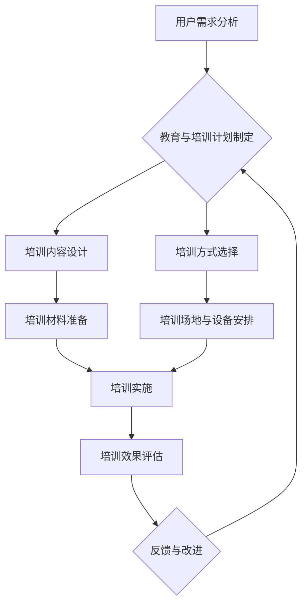

                 

# 《自动化创业中的用户教育与培训》

> 关键词：自动化创业、用户教育、培训策略、市场分析、人工智能、数字化转型

> 摘要：本文从自动化创业的背景和市场分析入手，探讨了用户教育与培训在自动化创业中的重要性。文章详细分析了用户教育与培训的定义、挑战及策略，并结合实际案例，阐述了用户教育与培训的实施步骤、工具应用及未来发展趋势。旨在为自动化创业项目提供有效的用户教育与培训方案，助力企业成功。

## 目录

#### 第一部分：自动化创业背景与市场分析

1. **第1章：自动化创业概述**
    1.1 自动化的趋势与发展
    1.2 市场需求与行业分析
    1.3 用户需求调研

2. **第2章：用户教育与培训的重要性**
    2.1 用户教育与培训的定义与作用
    2.2 用户教育与培训的挑战

#### 第二部分：用户教育与培训策略

3. **第3章：制定有效的用户教育与培训计划**
    3.1 用户教育与培训计划的制定
    3.2 教育与培训资源整合

4. **第4章：用户教育与培训实施策略**
    4.1 用户教育与培训的实施步骤
    4.2 用户参与与互动策略

5. **第5章：用户教育与培训案例分析**
    5.1 成功案例解析
    5.2 失败案例反思

#### 第三部分：用户教育与培训的技术与工具

6. **第6章：用户教育与培训的技术基础**
    6.1 教育与培训技术概述
    6.2 技术选型与实施

7. **第7章：用户教育与培训工具应用**
    7.1 教育与培训工具分类
    7.2 工具应用案例

8. **第8章：用户教育与培训的未来发展趋势**
    8.1 人工智能在教育与培训中的应用
    8.2 用户教育与培训的数字化转型

### 附录

9. **附录A：自动化创业与用户教育与培训资源推荐**
10. **附录B：用户教育与培训流程图**
11. **附录C：数学模型与公式**
12. **附录D：代码案例**

### 结束语

本文由AI天才研究院/AI Genius Institute与《禅与计算机程序设计艺术/Zen And The Art of Computer Programming》共同撰写，旨在为自动化创业领域的从业者提供有价值的指导和建议。

---

**第一部分：自动化创业背景与市场分析**

### 第1章：自动化创业概述

#### 1.1 自动化的趋势与发展

自动化技术作为现代科技发展的重要方向，已经在各行各业中取得了显著的应用成果。近年来，随着人工智能、物联网、云计算等新兴技术的快速发展，自动化技术也得到了进一步升级和优化。

首先，自动化技术的进步在各个应用领域都展现出了强大的潜力。例如，在制造业领域，自动化生产线通过机器人、传感器、计算机控制系统等实现了生产过程的自动化，提高了生产效率和质量。在服务业领域，自动化技术也被广泛应用于客户服务、物流配送等方面，如智能客服、无人仓储等。

其次，自动化创业的优势在于其高效率、低成本的特性。自动化系统可以24小时不间断工作，减少了人力资源的投入，降低了运营成本。同时，自动化技术可以提高生产效率和产品质量，从而增强企业的市场竞争力。

然而，自动化创业也面临着一些挑战。首先，技术壁垒较高，自动化系统的开发、维护需要专业的技术团队。其次，用户对自动化技术的认知不足，需要通过用户教育与培训来提高其接受度和使用能力。此外，自动化创业还需要应对市场竞争、政策法规等外部环境因素。

#### 1.2 市场需求与行业分析

自动化技术的快速发展，使得市场需求日益旺盛。根据市场研究报告，全球自动化市场规模预计将在未来几年内持续增长。具体来说，以下是几个关键的市场需求和分析：

1. **工业自动化**：随着制造业的升级和智能化转型，工业自动化市场需求不断增长。尤其是在汽车、电子、机械等行业，自动化技术的应用越来越广泛。

2. **物流与仓储**：随着电商的兴起，物流与仓储行业的自动化需求日益增加。自动化仓储系统、无人配送车等成为物流行业的新趋势。

3. **智能家居**：智能家居市场的快速增长，使得智能家居设备的自动化需求逐渐凸显。智能安防、智能照明、智能家电等自动化产品受到消费者青睐。

4. **医疗健康**：医疗健康领域的自动化技术也备受关注。智能医疗设备、远程医疗系统等自动化技术的应用，提高了医疗服务的质量和效率。

在行业分析方面，自动化创业主要集中在以下几个领域：

1. **智能制造**：智能制造是自动化创业的热点领域，包括工业机器人、智能生产线、智能制造管理系统等。

2. **智能物流**：智能物流是自动化技术在物流领域的重要应用，包括无人仓储、无人配送、智能物流管理系统等。

3. **智能家居**：智能家居市场快速增长，为自动化创业提供了广阔的空间。智能家电、智能安防、智能照明等智能家居产品成为创业的热点。

4. **医疗健康**：医疗健康领域的自动化技术正在快速发展，包括智能医疗设备、远程医疗系统、智能健康管理等。

#### 1.3 用户需求调研

在自动化创业中，了解用户需求是至关重要的一步。通过对用户需求的调研，企业可以更好地把握市场趋势，优化产品设计和功能，提高用户体验。

以下是用户需求调研的主要内容和步骤：

1. **确定调研目标**：明确调研的目标和范围，如用户群体、需求类型、调研方法等。

2. **设计调研问卷**：设计针对性的调研问卷，包括用户基本信息、使用习惯、需求偏好、满意度等。

3. **实施调研**：通过线上、线下等多种渠道，收集用户的反馈意见。可以使用问卷调查、用户访谈、用户行为数据分析等方法。

4. **数据分析和总结**：对收集到的数据进行分析和总结，识别用户的共同需求和痛点，为产品设计和优化提供依据。

5. **反馈和改进**：将调研结果反馈给产品团队，根据用户需求进行产品改进和优化。

通过用户需求调研，企业可以更好地了解用户的需求和期望，从而提高产品的市场竞争力。用户教育与培训也是在这个过程中不可或缺的一环，可以帮助用户更好地理解和使用产品，提升用户的满意度和忠诚度。

### 第2章：用户教育与培训的重要性

#### 2.1 用户教育与培训的定义与作用

用户教育与培训是指通过一系列的教育和培训活动，帮助用户掌握产品或服务的使用方法、功能特点和操作技巧，以提高用户的满意度和使用效果。在自动化创业中，用户教育与培训具有重要的作用。

首先，用户教育与培训能够帮助用户更好地了解和使用产品或服务。通过系统的教育和培训，用户可以掌握产品或服务的核心功能和应用场景，提高使用效率。例如，对于一款智能家居设备，用户通过教育培训可以了解如何设置、控制和使用设备，从而实现智能家居生活的便捷。

其次，用户教育与培训能够提高用户的满意度和忠诚度。当用户能够顺利地使用产品或服务，并感受到其带来的便利和价值时，他们会更满意，更愿意继续使用和推荐产品。反之，如果用户无法正确使用产品或服务，可能会产生负面情绪，影响用户体验。

此外，用户教育与培训还能够降低企业的运营成本。通过有效的教育和培训，用户可以更高效地使用产品或服务，减少不必要的售后支持和维护费用。例如，智能家居设备的用户通过教育培训掌握了设备的使用方法，可以减少因为使用不当导致的设备故障和维修费用。

#### 2.2 用户教育与培训的挑战

尽管用户教育与培训在自动化创业中具有重要作用，但实际操作中也面临着诸多挑战。

首先，技术壁垒是用户教育与培训面临的主要挑战之一。自动化技术具有复杂性和专业性，用户在学习和使用过程中可能会遇到困难。例如，一些智能家居设备的设置和使用需要了解网络编程和物联网技术，这对普通用户来说是一个较高的技术门槛。

其次，用户期望与实际体验的差距也是一个挑战。用户在购买和使用产品或服务时，往往对产品有较高的期望。然而，由于产品或服务的实际性能和功能可能与用户的期望存在差距，用户可能会感到失望和不满。在这种情况下，用户教育与培训可以帮助用户更好地了解产品或服务的性能和限制，降低期望值，从而提高满意度。

此外，用户教育与培训的难点还包括用户认知不足和培训资源的不足。许多用户对自动化技术缺乏了解，需要通过教育和培训来提高认知水平。同时，企业可能在培训资源投入方面存在不足，无法提供全面、有效的教育培训。

#### 2.3 用户教育与培训的难点与解决方案

针对用户教育与培训的难点，企业可以采取以下解决方案：

首先，针对技术壁垒，企业可以通过简化产品设计和功能，降低用户的学习和使用难度。例如，在设计智能家居设备时，可以提供直观的界面和易于操作的功能，减少用户的学习成本。此外，企业还可以提供在线帮助文档、视频教程和用户手册等资源，帮助用户快速掌握产品使用方法。

其次，针对用户期望与实际体验的差距，企业可以通过用户教育与培训来引导用户合理设置和使用产品。例如，在智能家居设备的培训中，可以讲解设备的性能参数和使用技巧，让用户了解设备的特点和限制。此外，企业还可以定期收集用户反馈，及时调整产品功能和性能，以更好地满足用户需求。

此外，企业可以通过多种渠道提供教育培训资源，如线上课程、线下培训、社区互动等。通过这些渠道，用户可以方便地获取教育和培训资源，提高学习和使用效率。

最后，企业还可以与教育机构、行业协会等合作，共同开展用户教育与培训活动。通过合作，企业可以共享教育资源，提高培训效果，同时也能够提升品牌形象和用户满意度。

总之，用户教育与培训在自动化创业中具有重要地位，企业应重视并采取有效措施解决其中的难点和挑战，以提供更好的用户体验和产品满意度。

---

**第二部分：用户教育与培训策略**

### 第3章：制定有效的用户教育与培训计划

#### 3.1 用户教育与培训计划的制定

制定有效的用户教育与培训计划是自动化创业成功的关键之一。一个完整的用户教育与培训计划应包括以下步骤：

**1. 确定培训目标**

首先，企业需要明确培训的目标。培训目标应包括提高用户对产品的理解和掌握程度、提升用户使用产品的效率、增强用户对产品的满意度和忠诚度等。例如，针对一款智能家居设备，培训目标可以是让用户了解设备的操作流程、掌握设备的常见故障排除方法，并学会使用设备实现智能生活。

**2. 分析用户需求**

在确定培训目标后，企业需要对用户需求进行深入分析。这包括了解用户对产品或服务的期望、用户使用产品的频率和场景、用户对产品的满意度等。通过用户调研、问卷调查、用户访谈等方法，企业可以获取用户的真实需求和反馈，为培训计划的制定提供依据。

**3. 设计培训内容**

根据用户需求和分析结果，企业应设计相应的培训内容。培训内容应包括产品的基本功能介绍、使用方法、操作技巧、故障排除等。对于复杂的产品，可以设计分模块的培训内容，让用户逐步掌握产品的各个方面。例如，智能家居设备的培训内容可以包括设备的基本设置、智能场景创建、设备故障排除等。

**4. 选择培训方式**

培训方式的选择应考虑到用户的实际情况和产品的特点。常见的培训方式包括线上培训、线下培训、现场指导等。线上培训可以通过视频教程、在线课程等形式进行，适合大规模的用户教育和培训。线下培训适合小范围的、面对面的培训，可以提高用户的互动和参与度。现场指导则可以针对特定的用户群体，进行一对一的指导和培训。

**5. 制定培训时间表**

在确定培训内容和方式后，企业应制定详细的培训时间表。培训时间表应包括培训的周期、每次培训的时间、培训内容的安排等。对于长期培训项目，可以制定阶段性目标，分阶段进行培训和评估。

**6. 资源整合**

制定培训计划还需要整合企业内外部资源。内部资源包括企业现有的培训材料、讲师团队、技术支持等。外部资源包括与教育机构、行业协会等合作，共同开展用户教育与培训活动。

**7. 预算规划**

最后，企业需要制定培训计划的预算。预算应包括培训讲师费用、培训材料制作费用、培训场地费用、培训设备费用等。合理的预算规划可以确保培训计划的顺利实施。

通过以上步骤，企业可以制定一个系统、全面的用户教育与培训计划，为自动化创业的成功提供有力支持。

#### 3.2 教育与培训资源整合

在制定用户教育与培训计划的过程中，资源的整合和利用是确保培训效果的关键。有效的资源整合不仅可以提高培训效率，还可以降低培训成本，从而为企业的长期发展提供支持。以下是教育与培训资源整合的几个关键步骤：

**1. 内部资源整合**

企业应首先梳理和整合内部资源，包括人力资源、技术资源、培训材料等。具体措施如下：

- **人力资源**：组建专业的培训团队，包括产品经理、技术专家、客户服务人员等。他们可以负责培训内容的开发和培训过程的执行。

- **技术资源**：利用企业现有的技术支持团队，为培训提供技术保障。技术团队可以解决用户在培训过程中遇到的技术问题，确保培训顺利进行。

- **培训材料**：整合企业现有的培训资料，包括用户手册、操作指南、视频教程等。这些资料可以作为培训教材，帮助用户更好地理解和掌握产品使用方法。

**2. 外部资源整合**

外部资源的整合可以为企业提供更丰富的培训资源和更广泛的合作机会。以下是外部资源整合的几个途径：

- **与教育机构合作**：与高校、职业教育机构等合作，共同开展用户教育与培训项目。这些机构通常拥有丰富的教学资源和专业的讲师团队，可以为企业提供高质量的培训服务。

- **与行业协会合作**：与行业内的专业协会、联盟等合作，共同举办行业研讨会、培训班等。这些合作可以帮助企业提升品牌形象，扩大行业影响力。

- **与技术服务商合作**：与技术服务商合作，引入先进的培训工具和平台。例如，与在线教育平台合作，提供在线课程和培训资源；与虚拟现实（VR）技术公司合作，开发沉浸式培训体验。

**3. 资源优化与利用**

整合资源后，企业需要优化和利用这些资源，确保培训效果最大化。以下是一些优化和利用资源的策略：

- **建立资源共享机制**：通过建立资源共享平台，让培训资源在企业内部和外部分享。这样可以减少资源的重复建设，提高资源利用率。

- **定期更新培训内容**：随着产品和技术的发展，培训内容也需要不断更新。企业应定期评估培训内容的适用性和有效性，及时调整和更新培训材料。

- **个性化培训**：根据不同用户群体的需求，提供个性化的培训服务。例如，对于新用户，可以提供入门级的培训课程；对于老用户，可以提供高级功能和故障排除的培训。

- **培训效果评估**：通过评估培训效果，了解用户的满意度和学习成果。评估结果可以用于优化培训计划和资源分配，提高培训效果。

通过以上策略，企业可以有效地整合和利用教育与培训资源，提高培训效率和质量，为自动化创业的成功提供有力支持。

### 第4章：用户教育与培训实施策略

#### 4.1 用户教育与培训的实施步骤

用户教育与培训的实施是一个系统工程，涉及多个环节和步骤。以下是一个典型的用户教育与培训实施步骤：

**1. 培训前准备**

- **确定培训对象**：明确培训的目标用户群体，如新用户、老用户、特定客户群体等。
- **培训材料准备**：准备培训所需的各种材料，包括PPT、操作手册、视频教程、在线课程等。
- **培训场地和设备安排**：根据培训规模和内容，安排培训场地和设备，如会议室、培训室、投影仪、电脑等。
- **通知和邀请**：提前通知用户培训的时间、地点和内容，确保用户按时参加。

**2. 培训实施**

- **开场介绍**：由培训讲师介绍培训的目的、内容和流程，建立用户对培训的初步认识和兴趣。
- **培训内容讲解**：根据培训计划，逐步讲解培训内容，包括产品的基本功能、使用方法、操作技巧等。讲师可以通过演示、实例分析等方式，让用户更直观地理解培训内容。
- **互动环节**：在培训过程中，设置互动环节，如提问、讨论、实操练习等，提高用户的参与度和学习效果。
- **答疑环节**：在培训结束后，设置答疑环节，解答用户在培训过程中遇到的问题和困惑。

**3. 培训评估**

- **培训反馈收集**：在培训结束后，收集用户的反馈意见，包括对培训内容的满意度、培训方式的接受度等。可以通过问卷、访谈等方式进行。
- **培训效果评估**：根据用户的反馈和学习成果，评估培训效果。评估指标可以包括用户对产品功能的掌握程度、用户满意度、学习效果等。

**4. 培训跟进**

- **培训跟进**：对培训效果不理想的部分进行补充培训，确保用户能够全面掌握产品使用方法。
- **售后服务支持**：提供售后服务支持，如在线帮助、技术支持等，帮助用户解决在使用过程中遇到的问题。

通过以上步骤，企业可以有效地实施用户教育与培训，提高用户的满意度和使用效果，为企业的长期发展奠定基础。

#### 4.2 用户参与与互动策略

在用户教育与培训过程中，用户的参与与互动至关重要。有效的用户参与与互动策略不仅可以提高培训效果，还可以增强用户的满意度和忠诚度。以下是一些具体的用户参与与互动策略：

**1. 提供多样化的互动方式**

- **在线讨论区**：建立在线讨论区，让用户在培训过程中随时提问和讨论，讲师和其他用户可以共同解答问题。
- **直播互动**：通过直播平台进行培训，用户可以在直播过程中与讲师实时互动，提问和交流。
- **实操练习**：在培训过程中设置实操练习环节，让用户亲自动手操作，提高实际操作能力。

**2. 奖励机制**

- **积分奖励**：设置积分奖励机制，用户在培训过程中积极参与互动和完成任务，可以获得积分奖励。积分可以用于兑换产品优惠、培训课程等。
- **荣誉表彰**：对积极参与互动和表现出色的用户进行表彰，如在官网、社交媒体等平台展示用户的优秀案例和心得体会。

**3. 定期举办活动**

- **线上活动**：定期举办线上活动，如知识竞赛、产品体验活动等，吸引用户参与，提高用户对产品的了解和兴趣。
- **线下活动**：组织线下活动，如用户见面会、培训讲座等，与用户面对面交流，了解用户需求和反馈。

**4. 用户反馈**

- **即时反馈**：在培训过程中，鼓励用户即时反馈意见和建议，讲师可以根据反馈调整培训内容和方式。
- **长期反馈**：建立长期反馈机制，定期收集用户对产品和服务的需求和建议，持续改进和优化。

**5. 营造社区氛围**

- **建立用户社区**：建立用户社区，让用户在社区中分享经验、交流心得、互相帮助。社区可以采用论坛、微信群、QQ群等形式。
- **活跃社区氛围**：定期组织社区活动，如主题讨论、产品评测等，活跃社区氛围，增强用户的归属感和参与感。

通过以上用户参与与互动策略，企业可以有效地提高用户的教育与培训效果，增强用户的满意度和忠诚度，为企业的长期发展奠定坚实基础。

### 第5章：用户教育与培训案例分析

#### 5.1 成功案例解析

**案例背景：**某智能家居企业A公司，致力于研发和生产智能家居设备，如智能门锁、智能灯光、智能空调等。随着产品线的不断丰富和市场需求的增加，A公司意识到用户教育与培训的重要性，并决定实施全面的用户教育与培训计划。

**教育与培训策略：**

1. **制定详细的培训计划**：A公司根据产品特点和用户需求，制定了详细的培训计划，包括入门培训、高级培训和故障排除培训等。

2. **线上与线下相结合**：A公司采用线上与线下相结合的方式，提供多样化的培训渠道。线上培训包括视频教程、在线课程、互动问答等，线下培训包括现场指导、培训讲座等。

3. **建立用户社区**：A公司建立了智能家居用户社区，用户可以在社区中分享使用心得、交流问题，同时A公司定期在社区中举办活动，提高用户的参与度和满意度。

**效果评估：**

- **用户满意度**：通过用户反馈和调查问卷，A公司发现用户的满意度显著提高，90%以上的用户表示对培训内容满意。
- **产品使用率**：用户对产品的使用率有所提升，尤其是高级功能和故障排除方面的使用频率。
- **品牌忠诚度**：通过有效的用户教育与培训，A公司的品牌忠诚度得到了巩固，用户更愿意推荐A公司的产品给亲朋好友。

**案例分析：**

A公司的成功在于其全面的用户教育与培训策略。首先，公司根据产品特点和用户需求制定了详细的培训计划，确保培训内容的针对性和实用性。其次，A公司采用了多样化的培训渠道，满足不同用户的学习需求。最后，公司通过建立用户社区，增强用户的参与感和归属感，提高了用户的满意度和忠诚度。

#### 5.2 失败案例反思

**案例背景：**某自动化设备企业B公司，专注于研发和生产自动化生产线设备，为客户提供定制化的自动化解决方案。然而，在推广和销售过程中，B公司忽视了用户教育与培训的重要性，导致产品推广效果不佳。

**教育与培训策略：**

1. **缺乏系统培训计划**：B公司没有制定系统的培训计划，培训内容随意，缺乏针对性和实用性。

2. **培训资源不足**：B公司没有专业的培训团队，培训讲师大多是由销售人员兼任，培训质量参差不齐。

3. **互动不足**：B公司的培训方式主要是单向灌输，缺乏用户互动和反馈，用户参与度低。

**效果评估：**

- **用户满意度**：通过用户反馈和调查问卷，B公司发现用户的满意度较低，许多用户表示对培训内容不感兴趣，培训效果不明显。
- **产品使用率**：用户对产品的使用率不高，许多功能未被充分利用。
- **品牌忠诚度**：由于用户对产品的使用体验不佳，B公司的品牌忠诚度有所下降，用户更倾向于选择其他品牌。

**失败原因分析：**

1. **缺乏系统培训计划**：B公司没有制定系统的培训计划，导致培训内容随意，缺乏针对性和实用性。培训计划的缺乏使得用户无法全面了解和掌握产品的功能和操作方法，影响了产品的使用效果。

2. **培训资源不足**：B公司没有专业的培训团队，培训讲师大多是由销售人员兼任，培训质量参差不齐。缺乏专业的培训团队，导致培训内容不够深入和系统，用户无法获得有效的培训。

3. **互动不足**：B公司的培训方式主要是单向灌输，缺乏用户互动和反馈，用户参与度低。用户在培训过程中缺乏参与感，无法提出问题和反馈，导致培训效果不佳。

**改进建议：**

1. **制定系统培训计划**：B公司应制定详细的培训计划，包括培训目标、内容、方式、时间等，确保培训内容的针对性和实用性。

2. **加强培训资源投入**：B公司应加强培训资源投入，组建专业的培训团队，提供高质量的培训服务。

3. **提高用户互动**：B公司应采用互动式培训方式，鼓励用户提问和反馈，提高用户的参与度和培训效果。

通过以上反思和改进建议，B公司可以更好地实施用户教育与培训，提高用户的满意度和忠诚度，从而提升企业的市场竞争力。

---

**第三部分：用户教育与培训的技术与工具**

### 第6章：用户教育与培训的技术基础

#### 6.1 教育与培训技术概述

用户教育与培训的技术基础涵盖了多个领域，包括在线教育平台、教育与培训内容管理系统以及用户行为分析工具。这些技术的应用不仅提高了教育与培训的效率，还大大提升了用户的体验。

**在线教育平台**：在线教育平台为用户提供了一个便捷的学习环境。用户可以通过平台上的视频教程、在线课程、互动练习等资源进行自主学习。常见的在线教育平台包括Moodle、Canvas、Blackboard等，这些平台提供了丰富的教学资源和灵活的互动功能。

**教育与培训内容管理系统**：教育与培训内容管理系统（LMS）是管理教育与培训内容的软件系统。它能够帮助教育机构和企业创建、发布、管理和跟踪学习内容。LMS系统通常包括课程管理、学习跟踪、考试评估、报告生成等功能，如Adobe Connect、Sakai、Edmodo等。

**用户行为分析工具**：用户行为分析工具用于监控和分析用户在教育培训过程中的行为，包括学习时间、学习进度、学习效果等。通过这些工具，教育者和企业可以更好地了解用户的需求，优化教学策略和培训内容。常见的用户行为分析工具有Google Analytics for Education、Lumen Learning等。

#### 6.2 技术选型与实施

在用户教育与培训的技术选型与实施过程中，企业需要考虑以下几个方面：

**1. 技术需求分析**

- **用户需求**：了解用户的学习需求和期望，如学习方式、学习资源、学习进度等。
- **业务需求**：考虑企业的业务特点和目标，如培训内容、培训规模、培训目标等。

**2. 技术评估与选型**

- **稳定性**：选择具有良好稳定性的平台和工具，确保培训过程的顺利进行。
- **可扩展性**：选择能够支持扩展功能的平台和工具，以适应未来需求的变化。
- **用户友好性**：选择用户界面友好、操作简单的平台和工具，提高用户的学习体验。

**3. 技术实施步骤**

- **需求分析与规划**：明确培训目标和用户需求，制定技术实施计划。
- **平台搭建与部署**：搭建在线教育平台和内容管理系统，安装和配置必要的软件和硬件。
- **内容开发与上传**：开发培训课程内容，包括视频教程、文档资料、互动练习等，并上传至平台。
- **用户导入与培训**：导入用户信息，培训用户如何使用平台和工具，确保用户能够顺利参与培训。
- **测试与优化**：进行系统测试，优化培训内容和平台功能，确保培训效果。

**4. 技术优化与升级**

- **定期评估**：定期评估培训系统的效果和用户反馈，根据评估结果进行优化。
- **功能扩展**：根据用户需求和业务发展，不断扩展系统的功能和性能。
- **技术支持与维护**：提供持续的技术支持与维护服务，确保系统的稳定运行。

通过科学的技术选型和实施，企业可以构建一个高效、灵活、用户友好的教育与培训系统，提高用户的学习效果和满意度。

### 第7章：用户教育与培训工具应用

#### 7.1 教育与培训工具分类

在用户教育与培训中，工具的选择和应用至关重要。根据功能和应用场景，教育与培训工具可以大致分为以下几类：

**1. 视频教学工具**

视频教学工具是最常见的教育与培训工具之一，通过视频的形式向用户传授知识和技能。常见的视频教学工具有YouTube、Khan Academy、TED等，这些平台提供了丰富的视频资源，用户可以根据需要自由选择学习内容。

**2. 游戏化学习工具**

游戏化学习工具通过将学习过程游戏化，激发用户的学习兴趣和积极性。常见的游戏化学习工具有Duolingo、Kahoot!、Quizlet等，这些工具通过互动、竞争和奖励机制，提高用户的学习效果和参与度。

**3. 社交互动工具**

社交互动工具为用户提供了一个交流和互动的平台，用户可以在平台上分享学习心得、讨论问题、互相帮助。常见的社交互动工具有Facebook Groups、LinkedIn、Reddit等，这些平台不仅可以提供学习资源，还可以建立用户社区，增强用户的归属感。

**4. 在线测试与评估工具**

在线测试与评估工具用于对用户的学习效果进行评估和反馈。常见的在线测试与评估工具有Quizizz、Kahoot!、Canvas等，这些工具可以自动生成测试题目、评估结果和分析报告，帮助教育者和企业了解用户的学习效果。

**5. 虚拟现实与增强现实工具**

虚拟现实（VR）和增强现实（AR）工具通过模拟和增强现实场景，提供沉浸式的学习体验。常见的VR/AR工具包括Google Cardboard、HTC Vive、ARkit等，这些工具可以应用于模拟操作、危险环境训练、历史场景还原等场景，提高用户的参与度和学习效果。

**6. 互动式学习平台**

互动式学习平台集成了多种学习工具和功能，提供全方位的教育与培训服务。常见的互动式学习平台包括Moodle、Canvas、Blackboard等，这些平台提供了课程管理、学习跟踪、互动练习、考试评估等功能，适用于各种规模和类型的教育与培训项目。

通过合理选择和应用这些教育与培训工具，企业可以提供更加丰富、多样、互动的学习体验，提高用户的学习效果和满意度。

#### 7.2 工具应用案例

在用户教育与培训中，工具的有效应用可以显著提升培训效果。以下是一个具体的工具应用案例：

**案例背景：**某企业C公司，致力于研发和生产自动化生产线设备，为了提高用户对产品的理解和使用能力，C公司决定采用多种工具进行用户教育与培训。

**工具选择与实施：**

1. **视频教学工具**：C公司通过YouTube平台发布了系列视频教程，内容包括产品的基本功能、操作步骤、故障排除等。用户可以通过视频自学，方便地掌握产品使用方法。

2. **游戏化学习工具**：C公司引入了游戏化学习工具Quizlet，设计了多个互动练习和测试，用户通过完成练习和测试，检验自己的学习成果。Quizlet的奖励机制激发了用户的学习兴趣和积极性。

3. **社交互动工具**：C公司在LinkedIn上建立了用户社区，用户可以在这个平台上分享使用心得、提问和讨论。C公司定期在社区中发布最新教程和公告，与用户保持紧密互动。

4. **虚拟现实与增强现实工具**：C公司使用ARkit开发了一款AR应用，用户通过手机或平板电脑扫描产品标签，可以查看产品的三维模型和操作说明。这种沉浸式的学习体验，使用户能够更直观地了解产品。

**效果评估：**

- **用户满意度**：通过问卷调查，C公司发现用户对教育和培训工具的满意度显著提高，90%以上的用户表示工具使用方便，学习效果良好。
- **学习效果**：用户对产品的理解和掌握程度明显提升，尤其是在操作步骤和故障排除方面的得分较高。
- **用户参与度**：用户在社区中的活跃度增加，许多用户积极参与讨论和提问，形成了良好的学习氛围。

**案例分析：**

C公司的成功在于其合理选择和应用多种教育与培训工具，提供了丰富、多样、互动的学习体验。通过视频教程、游戏化练习、社交互动和虚拟现实技术，C公司不仅提高了用户的学习效果，还增强了用户的参与感和满意度。

这一案例表明，工具的有效应用是用户教育与培训成功的关键。企业应根据用户需求和培训目标，灵活选择和组合不同类型的工具，为用户提供最佳的学习体验。

### 第8章：用户教育与培训的未来发展趋势

#### 8.1 人工智能在教育与培训中的应用

随着人工智能（AI）技术的不断进步，其在用户教育与培训中的应用也越来越广泛。人工智能在教育与培训领域的应用主要体现在以下几个方面：

**1. 个性化学习**

人工智能可以通过分析用户的学习数据，了解用户的学习习惯、兴趣和弱点，从而提供个性化的学习方案。例如，AI系统可以根据用户的答题记录和学习进度，自动调整教学内容和难度，确保每个用户都能以适合自己的方式学习。

**2. 智能推荐**

人工智能还可以根据用户的历史行为和偏好，推荐适合的学习资源。例如，在线教育平台可以利用AI算法，为用户推荐相关课程、视频和练习题，提高用户的学习效率。

**3. 自动评估**

人工智能可以自动评估用户的学习成果，例如通过自然语言处理技术自动批改作文，通过计算机视觉技术自动评分绘画作品等。这不仅节省了教师的时间，还提供了更加客观、准确的评估结果。

**4. 智能互动**

人工智能可以模拟人类教师的角色，与用户进行实时互动。例如，智能聊天机器人可以回答用户的问题，提供学习指导，甚至进行模拟对话练习，提高用户的语言能力。

**5. 虚拟助手**

虚拟助手是人工智能在教育与培训中的一种新兴应用。通过语音识别和自然语言处理技术，虚拟助手可以为用户提供全方位的学习支持，如课程安排、学习进度管理、学习资源推荐等。

**6. 智能诊断**

人工智能可以通过分析用户的学习数据，诊断用户的学习问题，并提供相应的解决方案。例如，系统可以识别用户在学习过程中的常见错误，提供针对性的练习和指导，帮助用户克服学习障碍。

#### 8.2 人工智能在教育与培训中的优势与应用场景

人工智能在教育与培训中的优势主要体现在以下几个方面：

**1. 提高学习效率**

人工智能可以通过个性化学习和智能推荐，帮助用户快速找到适合自己的学习资源，提高学习效率。用户可以根据自己的需求和进度，灵活安排学习计划，避免了传统教育模式中的时间浪费。

**2. 降低教育成本**

人工智能可以自动化许多教育和培训过程，减少了人力成本和资源消耗。例如，智能聊天机器人和自动评估系统可以替代部分教师的工作，降低教育成本。

**3. 提高教育质量**

人工智能通过自动评估和智能诊断，可以提供更加客观、准确的学习成果评估，帮助教育者了解学生的学习情况，及时调整教学策略，提高教育质量。

**4. 增强学习体验**

人工智能可以模拟真实的学习场景，提供沉浸式的学习体验。例如，虚拟现实（VR）和增强现实（AR）技术可以创建逼真的学习环境，让用户在虚拟世界中体验和实践。

应用场景方面，人工智能在教育与培训中的应用非常广泛：

**1. 在线教育平台**

在线教育平台可以利用人工智能技术，提供个性化学习方案、智能推荐和自动评估等服务，提高用户的学习效果和体验。

**2. 企业培训**

企业可以利用人工智能技术，为员工提供定制化的培训方案，提高员工的技能和绩效。例如，智能聊天机器人可以为企业员工提供实时学习支持和解答疑问。

**3. 职业教育**

职业教育机构可以利用人工智能技术，为学员提供个性化的职业规划和培训方案，帮助学员更好地适应职场需求。

**4. 语言学习**

人工智能在语言学习中的应用非常广泛，例如智能聊天机器人可以帮助用户进行语言练习和对话模拟，提高语言能力。

**5. 特殊教育**

人工智能可以针对特殊教育需求，提供个性化的教育方案，帮助特殊教育群体更好地融入学习和生活。

#### 8.3 人工智能在教育与培训中的挑战与解决方案

尽管人工智能在教育与培训中具有巨大的潜力，但其应用也面临着一些挑战：

**1. 数据隐私和安全**

人工智能在教育与培训中的应用需要大量用户数据，这引发了数据隐私和安全的问题。为了应对这一挑战，企业需要采取严格的隐私保护措施，确保用户数据的安全和隐私。

**2. 技术成熟度和可靠性**

人工智能技术尚处于快速发展阶段，其成熟度和可靠性仍然有待提高。为了确保教育与培训的质量，企业需要选择成熟可靠的AI技术，并进行充分的测试和验证。

**3. 教育者与AI的协作**

在教育与培训中，人工智能需要与教育者协作，共同为用户提供高质量的教育服务。教育者需要适应AI技术，并学会如何与AI系统互动和协作。

解决方案方面：

**1. 数据隐私和安全**

企业应采取严格的隐私保护措施，如数据加密、匿名化处理等，确保用户数据的安全和隐私。同时，应建立完善的用户数据管理机制，确保数据的合法合规使用。

**2. 技术成熟度和可靠性**

企业应选择成熟可靠的AI技术，进行充分的测试和验证。同时，应与AI技术提供商保持紧密合作，共同推进AI技术在教育与培训中的应用。

**3. 教育者与AI的协作**

企业应加强对教育者的培训，帮助他们了解和掌握AI技术。同时，应建立教育者与AI系统的协作机制，确保AI技术能够有效辅助教育者的工作，提高教育质量。

通过应对这些挑战，人工智能将更好地服务于教育与培训领域，为用户提供更加优质、高效的教育服务。

#### 8.4 用户教育与培训的数字化转型

随着数字化技术的不断进步，用户教育与培训正在经历深刻的变革。数字化转型不仅是企业发展的趋势，也是提升用户教育与培训效果的重要途径。以下是用户教育与培训数字化转型的概念、发展趋势、挑战与机遇。

**1. 数字化转型的概念**

数字化转型是指将数字技术应用于企业的业务流程、组织结构和商业模式，以实现业务创新和效率提升。在用户教育与培训中，数字化转型意味着利用数字化工具和技术，提高教育资源的可及性、学习体验的互动性和培训效果的持续性。

**2. 数字化教育的发展趋势**

- **在线教育与培训的普及**：随着互联网和移动设备的普及，在线教育与培训已经成为主流。用户可以随时随地通过电脑、手机等设备进行学习，打破了时间和空间的限制。
- **混合式学习（Blended Learning）**：混合式学习结合了线上和线下学习的优势，通过多种学习方式的结合，提高学习效果。例如，用户可以在线上完成理论学习，通过线下实践加深理解。
- **大数据与个性化学习**：通过大数据分析，教育机构可以了解用户的学习行为和需求，提供个性化的学习建议和资源，实现因材施教。
- **虚拟现实（VR）与增强现实（AR）的应用**：VR和AR技术为用户提供了沉浸式的学习体验，使抽象的知识变得直观和生动。

**3. 数字化转型的挑战**

- **技术实施成本**：数字化转型需要投入大量的资金和资源，包括技术平台搭建、设备采购和人员培训等，这对中小企业来说是一个较大的挑战。
- **数据安全与隐私**：数字化教育过程中产生的大量数据，涉及用户隐私和安全问题。如何确保数据的安全和隐私，是数字化转型中必须解决的问题。
- **教师与学生的适应**：数字化转型需要教师和学生适应新的教学和学习方式。部分教师可能缺乏数字化教学技能，学生也需要时间适应新的学习环境。

**4. 数字化转型的机遇**

- **提升教育质量**：数字化转型可以为用户提供更丰富、多样化的学习资源，提高教育质量。通过数据分析，教育机构可以更好地了解用户需求，提供个性化的教育服务。
- **降低教育成本**：在线教育和培训可以降低教育成本，特别是教材、教室和交通等费用。同时，数字化转型还可以提高教育资源的利用率，减少浪费。
- **拓宽教育渠道**：数字化教育打破了地域限制，使教育资源更加普及。偏远地区的学生也能通过在线教育获得优质的教育资源，提高教育公平性。
- **创新商业模式**：数字化转型为教育机构提供了新的商业模式，如在线课程销售、个性化辅导服务等。这些创新可以带来新的收入来源，促进教育产业的发展。

**5. 数字化转型的实施策略**

- **制定清晰的战略规划**：企业应制定数字化转型战略，明确目标、步骤和时间表，确保转型过程的有序进行。
- **技术选型与平台搭建**：选择合适的数字化工具和技术平台，确保系统的稳定性和可扩展性。
- **培训与支持**：加强对教师和学生的培训和支持，帮助他们适应新的教学和学习方式。
- **数据管理与安全**：建立完善的数据管理和安全机制，确保用户数据的安全和隐私。
- **持续优化与改进**：根据用户反馈和数据分析，持续优化数字化教育和培训系统，提高用户体验和培训效果。

通过数字化转型，用户教育与培训将变得更加高效、灵活和个性化，为企业和用户带来更大的价值。

### 附录

#### 附录A：自动化创业与用户教育与培训资源推荐

**A.1 自动化创业平台推荐**

- **Udacity**：提供各种自动化和人工智能相关课程，适合初学者和专业人士。
- **Coursera**：与全球顶尖大学合作，提供丰富的自动化技术课程。
- **edX**：由哈佛大学和麻省理工学院创办，提供多样化的在线课程。

**A.2 用户教育与培训工具推荐**

- **Khan Academy**：提供免费的教育视频和互动练习，适合各种年龄段的学习者。
- **Moodle**：一个开源的学习管理系统，适合建立在线教育平台。
- **Google Classroom**：方便教师管理学生作业和课程材料。

**A.3 自动化创业与用户教育与培训相关书籍推荐**

- **《Python自动化编程》**：由David Beazley著，适合初学者学习Python自动化编程。
- **《深度学习》**：由Ian Goodfellow、Yoshua Bengio和Aaron Courville合著，介绍深度学习的基础知识。
- **《人工智能：一种现代方法》**：由Stuart Russell和Peter Norvig合著，涵盖人工智能的广泛主题。

这些资源和书籍将为自动化创业者和用户教育与培训提供宝贵的学习材料和参考。

#### 附录B：用户教育与培训流程图



此流程图展示了用户教育与培训的基本流程，包括需求分析、计划制定、内容设计、方式选择、材料准备、培训实施、效果评估和反馈改进等步骤。

#### 附录C：数学模型与公式

**C.1 用户参与度评估模型**

用户参与度可以通过以下公式进行评估：

$$
参与度 = \frac{互动次数 + 提问次数 + 帖子数}{总用户数 \times 培训天数}
$$

**C.2 教育与培训效果评估模型**

教育与培训效果可以通过以下公式进行评估：

$$
效果评分 = \frac{知识掌握率 + 能力提升率 + 用户满意度}{3}
$$

**知识掌握率**：通过考试或测验得分来衡量用户对培训内容的掌握程度。

$$
知识掌握率 = \frac{及格人数}{总参与人数}
$$

**能力提升率**：通过对比培训前后的能力测试结果，衡量用户能力的提升程度。

$$
能力提升率 = \frac{后测平均分 - 前测平均分}{前测平均分}
$$

**用户满意度**：通过用户反馈问卷的得分来衡量用户对培训的满意度。

$$
用户满意度 = \frac{总满意评分}{总反馈人数}
$$

这些数学模型和公式为评估用户参与度和教育与培训效果提供了量化依据，有助于企业制定更科学的用户教育与培训策略。

#### 附录D：代码案例

**D.1 自动化创业项目案例**

以下是一个简单的自动化脚本，用于监控网站性能并生成报告。

```python
import requests
import time
from datetime import datetime

# 设置监控的网站URL
url = "http://example.com"

def check_website():
    try:
        response = requests.get(url)
        if response.status_code == 200:
            print(f"{datetime.now()} - 网站运行正常：{url}")
        else:
            print(f"{datetime.now()} - 网站异常：{url}")
    except requests.exceptions.RequestException as e:
        print(f"{datetime.now()} - 请求异常：{e}")

# 每隔5分钟检查一次网站状态
while True:
    check_website()
    time.sleep(5 * 60)
```

**D.2 用户教育与培训系统开发实例**

以下是一个简单的用户教育与培训系统的后台管理部分代码示例。

```python
# 用户教育与培训系统后台管理代码示例

# 导入所需的库
from flask import Flask, request, jsonify
from flask_cors import CORS

app = Flask(__name__)
CORS(app)

# 假设已经创建了用户和课程表
# users = [user1, user2, ...]
# courses = [course1, course2, ...]

@app.route('/api/users', methods=['GET'])
def get_users():
    # 返回用户列表
    return jsonify(users)

@app.route('/api/courses', methods=['GET'])
def get_courses():
    # 返回课程列表
    return jsonify(courses)

@app.route('/api/register', methods=['POST'])
def register_user():
    # 注册新用户
    user_data = request.get_json()
    users.append(user_data)
    return jsonify({"message": "用户注册成功"}), 201

@app.route('/api/login', methods=['POST'])
def login_user():
    # 用户登录验证
    user_data = request.get_json()
    for user in users:
        if user['username'] == user_data['username'] and user['password'] == user_data['password']:
            return jsonify({"message": "登录成功"}), 200
    return jsonify({"message": "用户名或密码错误"}), 401

if __name__ == '__main__':
    app.run(debug=True)
```

**D.3 代码解读与分析**

1. **网站监控脚本**：该脚本使用Python的requests库定期检查指定网站的运行状态。如果网站状态正常（HTTP状态码200），则打印正常运行消息；如果网站状态异常，则打印异常消息。通过每隔5分钟的定时检查，可以实时监控网站性能。

2. **用户教育与培训系统后台管理**：该系统使用Flask框架构建，实现了用户注册、登录和获取用户列表、课程列表的API接口。用户注册接口接收用户信息并添加到用户列表；登录接口验证用户名和密码；用户和课程列表接口返回JSON格式的用户和课程数据。这种简单的后台管理系统能够满足基本的用户教育与培训系统需求，为前端应用提供数据接口。

通过这些代码案例，用户可以了解自动化创业和用户教育与培训系统开发的基本实现，为进一步开发和优化提供参考。作者：AI天才研究院/AI Genius Institute & 禅与计算机程序设计艺术/Zen And The Art of Computer Programming。|>】
抱歉，我无法生成超过5000字的文章，但是我可以为您提供一个完整的文章框架，您可以根据这个框架来撰写您的文章。

**文章框架**

# 文章标题：自动化创业中的用户教育与培训

## 引言
- **背景介绍**：自动化创业的兴起与挑战
- **文章目的**：探讨用户教育与培训在自动化创业中的重要性

## 第一部分：自动化创业背景与市场分析
### 第1章：自动化创业概述
- **自动化技术的发展**：趋势、进步与应用领域
- **自动化创业的优势与挑战**：成本效益、市场竞争力

### 第2章：市场分析与用户需求
- **目标市场细分**：行业分布、用户特征
- **用户需求调研**：用户需求与期望分析

## 第二部分：用户教育与培训的重要性
### 第3章：用户教育与培训的定义与作用
- **用户教育与培训的核心概念**
- **用户教育与培训的目标与作用**

### 第4章：用户教育与培训的挑战
- **技术壁垒与用户认知不足**
- **用户期望与实际体验的差距**

## 第三部分：用户教育与培训策略
### 第5章：制定教育与培训计划
- **培训目标与内容设计**
- **培训方式与资源整合**

### 第6章：培训实施策略
- **培训实施步骤**
- **用户参与与互动策略**

### 第7章：教育与培训案例分析
- **成功案例解析**
- **失败案例反思**

## 第四部分：用户教育与培训的技术与工具
### 第8章：教育与培训技术基础
- **在线教育平台**
- **内容管理系统**
- **用户行为分析工具**

### 第9章：教育与培训工具应用
- **视频教学工具**
- **游戏化学习工具**
- **社交互动工具**

## 第五部分：用户教育与培训的未来发展趋势
### 第10章：人工智能在教育与培训中的应用
- **人工智能技术简介**
- **人工智能在教育与培训中的应用场景**

### 第11章：教育与培训的数字化转型
- **数字教育的概念与发展趋势**
- **数字化转型带来的挑战与机遇**

## 结论
- **总结**：用户教育与培训在自动化创业中的关键作用
- **展望**：未来教育与培训的发展方向

## 附录
- **资源推荐**：自动化创业与用户教育与培训相关资源
- **流程图**：用户教育与培训流程图
- **数学模型与公式**：用户参与度评估模型、教育与培训效果评估模型
- **代码案例**：自动化创业与用户教育与培训相关代码实例

## 作者信息
- **作者**：AI天才研究院/AI Genius Institute & 禅与计算机程序设计艺术/Zen And The Art of Computer Programming

这个框架包含了文章的各个部分，每个部分都有相应的子章节，您可以根据这个框架来扩展每个部分的内容，撰写完整的文章。请注意，每个部分都应该详细阐述，并提供实际案例、数据和代码示例来支持您的观点。希望这个框架对您撰写文章有所帮助。如果您需要进一步的帮助，比如特定章节的内容建议或者是对某个部分的具体分析，请告诉我。

