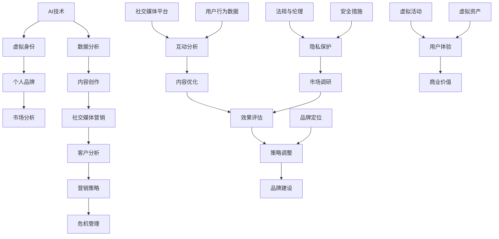

                 

### AI时代概述

AI，即人工智能，是计算机科学的一个分支，旨在使机器能够执行通常需要人类智能的任务，如视觉识别、语言理解、决策制定等。近年来，随着深度学习、神经网络等技术的突破，AI的发展进入了前所未有的快车道。这一技术不仅改变了各个行业的运作模式，也对社会各个层面产生了深远的影响。

#### AI技术的发展与趋势

AI技术的发展可以分为三个阶段：规则驱动、基于知识的系统和现代AI。最初，AI主要是基于规则和逻辑的系统，如专家系统。这些系统能够模拟专家的决策过程，但在处理复杂问题和不确定性方面存在局限。随着知识表示和推理技术的进步，AI进入了基于知识的系统阶段，能够利用大量数据和知识进行问题求解。

然而，现代AI的核心是机器学习和深度学习。这些技术通过模拟人脑的工作方式，让机器能够从数据中学习，并自动改进其性能。特别是深度学习，由于其强大的特征提取和模式识别能力，已经在图像识别、自然语言处理、语音识别等领域取得了显著的成果。

未来，AI的发展将继续朝着以下几个方向迈进：

1. **更加智能化和自主化**：AI将变得更加智能化和自主化，能够自主学习和决策，无需人工干预。
2. **跨领域融合**：AI将与其他技术如物联网、区块链等深度融合，推动社会各个领域的创新。
3. **人机协作**：AI将与人类更加紧密地协作，共同完成复杂任务。

#### 个人品牌与AI的关系

在AI时代，个人品牌的重要性日益凸显。个人品牌是指一个人在特定领域的声誉、专业能力和价值的综合体现。在数字化时代，个人品牌的建设已经不再仅仅是个人形象的问题，而是涉及到个人影响力的扩展、职业发展的关键因素。

AI技术为个人品牌的建设提供了全新的工具和平台。首先，AI能够帮助个人快速分析和理解大数据，从而更精准地定位自己的专业方向和目标受众。通过数据驱动的分析，个人可以优化自己的知识结构、技能组合，提高专业水平。

其次，AI在社交媒体中的应用，使得个人品牌传播更加高效和精准。通过自然语言处理、内容生成等技术，个人可以自动生成高质量的内容，并在适当的平台上进行发布和推广。这不仅提高了内容的传播效率，也增强了个人品牌的影响力。

此外，AI在客户分析和市场预测方面的应用，可以帮助个人更好地了解市场需求，制定更加有效的营销策略。通过个性化的推荐和互动，个人可以与潜在客户建立更紧密的联系，提升客户的满意度和忠诚度。

#### 虚拟身份市场的崛起

虚拟身份市场是指人们在线上世界中创建和使用的数字身份，这些身份可以是完全虚构的，也可以是真实身份的延伸。随着元宇宙、虚拟现实等技术的快速发展，虚拟身份市场正逐渐成为一个独立的、具有巨大潜力的领域。

在虚拟身份市场中，个人品牌的建设具有以下几个显著特点：

1. **跨平台性**：虚拟身份可以在不同的虚拟平台之间转移，不受现实世界身份的限制，具有更高的灵活性和可扩展性。
2. **多样性和个性化**：虚拟身份可以展现个人的多种特质和兴趣，从而吸引更多关注和互动。
3. **社交性和互动性**：虚拟身份能够更好地参与虚拟社区的互动，建立更加广泛的人脉关系。
4. **商业价值**：虚拟身份可以作为个人品牌的一种延伸，参与虚拟商品交易、虚拟广告等商业活动，创造经济价值。

综上所述，AI时代为个人品牌的建设提供了前所未有的机遇和挑战。通过深入理解和利用AI技术，个人可以更有效地打造和提升自己的品牌，实现职业发展和个人价值的最大化。

### 虚拟身份市场分析

随着AI技术的飞速发展，虚拟身份市场逐渐崭露头角，成为数字时代的重要现象。虚拟身份市场不仅改变了人们的在线互动方式，也开辟了新的商业机会。为了深入理解这一市场，我们需要从概念、现状、机遇和挑战四个方面进行分析。

#### 虚拟身份的概念与分类

虚拟身份是指在数字世界中创建和使用的个人形象或身份，它可以代表真实世界的个体，也可以是完全虚构的角色。虚拟身份的形式多种多样，可以是一个在虚拟现实（VR）中的人物模型，一个在社交媒体上的用户头像，或者一个在线游戏中的角色。

根据虚拟身份的使用目的和特征，可以将其分为以下几类：

1. **娱乐型虚拟身份**：这类虚拟身份主要用于游戏、虚拟社交平台等娱乐场景，通常具有丰富的外观和个性化设置，如角色扮演游戏中的虚拟角色。
2. **社交型虚拟身份**：这种身份主要用于建立社交网络，增强在线互动和沟通，如社交媒体平台上的用户头像。
3. **商业型虚拟身份**：虚拟身份被用于商业活动，如虚拟代言人、品牌形象等，具有特定的商业价值。
4. **教育型虚拟身份**：在教育领域，虚拟身份用于模拟教学、互动学习等，为学生提供沉浸式的学习体验。

#### 虚拟身份市场的现状

虚拟身份市场正在快速发展，其规模和影响力日益扩大。以下是目前虚拟身份市场的几个关键现状：

1. **用户规模扩大**：随着虚拟现实和增强现实技术的普及，越来越多的用户开始使用虚拟身份进行在线互动。根据市场研究机构的报告，虚拟身份市场的用户数量呈现出逐年增长的态势。
2. **技术成熟**：虚拟身份的创建和管理技术已经相当成熟，包括3D建模、虚拟现实、人工智能等技术，为虚拟身份的多样化提供了技术支持。
3. **商业模式的多样化**：虚拟身份市场不仅涵盖了娱乐和社交领域，还延伸到了商业、教育和医疗等多个行业，形成了多种商业模式，如虚拟商品销售、虚拟广告、虚拟培训等。
4. **法规和规范**：随着虚拟身份市场的兴起，相关法规和规范也在逐步完善，以确保用户权益和数据安全。

#### 虚拟身份市场的机遇

虚拟身份市场的快速发展带来了许多新的商业机会和机遇：

1. **创新应用场景**：虚拟身份可以应用于多种场景，如虚拟演唱会、虚拟展会、虚拟旅游等，为用户带来全新的体验。
2. **数字货币和虚拟资产**：虚拟身份相关的虚拟资产，如虚拟货币、数字藏品等，具有巨大的市场潜力，吸引了大量投资者。
3. **品牌建设和营销**：虚拟身份为品牌建设和营销提供了新的手段，通过虚拟代言人和虚拟活动，品牌可以更有效地吸引目标受众。
4. **数据驱动的个性化服务**：虚拟身份的数据可以为市场分析和用户行为研究提供重要信息，帮助企业实现更精准的营销和服务。

#### 虚拟身份市场的挑战与问题

尽管虚拟身份市场前景广阔，但也面临一些挑战和问题：

1. **隐私和安全问题**：虚拟身份涉及到大量个人数据，如行为记录、偏好等，如何保护用户隐私和数据安全是关键问题。
2. **法律和伦理问题**：虚拟身份的使用涉及到法律和伦理问题，如虚拟身份的法律地位、虚拟欺诈等，需要建立相应的法规和规范。
3. **技术门槛**：虚拟身份的创建和管理需要较高的技术门槛，包括3D建模、人工智能等技术，这对小企业和个人用户来说可能是一个挑战。
4. **用户接受度**：尽管虚拟身份带来了很多创新和便利，但用户接受度仍需提高，特别是在某些保守的市场。

#### 结论

虚拟身份市场是一个充满机遇和挑战的领域。通过深入理解和利用AI技术，个人和企业可以更好地把握市场机会，提升品牌影响力，创造新的商业价值。然而，同时也需要关注和解决市场面临的挑战和问题，确保虚拟身份市场的健康和可持续发展。

### 个人品牌评估与优化

在AI时代，个人品牌的重要性日益凸显，如何评估和优化个人品牌成为许多专业人士关注的焦点。AI技术的应用为个人品牌评估提供了强大的工具和平台，使得评估过程更加精准、高效。本文将详细探讨个人品牌评估的模型构建、AI工具的应用以及优化个人品牌的方法和策略。

#### 个人品牌评估模型

个人品牌评估模型的构建是评估个人品牌优劣的基础。一个全面、科学、可操作的评估模型应包括以下几个关键维度：

1. **社交媒体影响力**：社交媒体影响力是衡量个人品牌影响力的关键指标。它包括粉丝数、互动率、内容传播度等。高社交媒体影响力意味着个人品牌在目标受众中具有较高的认知度和影响力。

2. **内容创作质量**：内容创作质量是个人品牌的核心。优质的内容能够吸引受众，增强品牌的吸引力。评估内容创作质量可以从内容的原创性、专业性、可读性、互动性等多个方面进行。

3. **市场分析能力**：市场分析能力反映个人对市场动态的把握和理解。一个具备强大市场分析能力的人能够准确预测市场趋势，制定有效的市场策略。

4. **客户分析能力**：客户分析能力是个人品牌在商业领域的重要体现。通过客户分析，个人能够深入了解目标客户的需求和行为，从而提供更有针对性的产品和服务。

5. **营销策略能力**：营销策略能力是个人品牌商业价值的重要标志。一个优秀的营销策略能够提升品牌知名度，扩大市场占有率。

6. **危机管理能力**：危机管理能力是个人品牌在面对突发情况时的重要保障。良好的危机管理能力能够减少负面影响，保护品牌声誉。

#### AI工具在个人品牌评估中的应用

AI工具在个人品牌评估中的应用极大地提高了评估的准确性和效率。以下是一些常用的AI工具及其应用：

1. **自然语言处理（NLP）**：NLP技术可以分析个人在社交媒体上发布的内容，评估内容的语言质量、表达方式、情感倾向等。通过NLP，可以定量分析内容创作质量，为个人品牌优化提供数据支持。

2. **数据挖掘和统计分析**：数据挖掘和统计分析技术可以帮助个人收集和分析大量数据，包括社交媒体互动数据、市场调研数据、客户反馈数据等。通过这些数据，可以全面了解个人品牌在不同维度的表现。

3. **机器学习模型**：机器学习模型可以训练出个人品牌评估模型，根据历史数据预测个人品牌的未来表现。这些模型可以根据实时数据不断更新，提供动态的评估结果。

4. **用户画像分析**：通过用户画像分析，AI工具可以识别个人品牌的受众特征，包括年龄、性别、地理位置、兴趣爱好等。这些信息有助于制定更精准的营销策略。

#### 个人品牌优化的方法与策略

基于AI工具的评估结果，个人可以采取一系列方法优化个人品牌。以下是一些具体的优化方法和策略：

1. **内容优化**：根据AI工具提供的内容创作质量评估，个人应优化自己的内容创作策略。可以增加原创性、专业性，提高内容的可读性和互动性。例如，可以尝试多样化的内容形式，如图文、视频、直播等。

2. **市场分析能力提升**：通过AI工具的市场分析能力评估，个人可以识别自己在市场分析方面的不足，并针对性地进行提升。可以参加市场分析培训、阅读相关书籍和报告、关注行业动态等。

3. **客户分析能力提升**：通过用户画像分析，个人可以深入了解目标客户的需求和偏好，从而提供更有针对性的产品和服务。例如，可以开展客户调查、分析客户反馈、使用数据分析工具等。

4. **营销策略优化**：基于AI工具的营销策略能力评估，个人可以优化自己的营销策略。可以尝试不同的营销渠道、优化广告投放、分析营销效果等。

5. **危机管理能力提升**：通过模拟危机场景和实时数据分析，个人可以提升自己的危机管理能力。例如，可以制定危机应对计划、学习危机管理知识、参加危机管理演练等。

6. **品牌形象塑造**：个人应注重品牌形象的塑造，包括社交媒体形象、个人形象、专业形象等。通过一致的品牌形象塑造，可以提高个人品牌的认知度和美誉度。

综上所述，AI技术在个人品牌评估和优化中的应用，为个人品牌建设提供了强有力的支持和指导。通过科学、系统的评估和优化，个人可以更好地打造和提升自己的品牌，实现职业发展和个人价值的最大化。

### 社交媒体与虚拟身份

在数字化的今天，社交媒体已经成为个人品牌建设的重要阵地。虚拟身份作为社交媒体上的数字化代表，不仅丰富了用户的社交体验，也大大提升了个人品牌的影响力。本文将探讨虚拟身份在社交媒体上的应用，分析AI在社交媒体内容生成中的作用，以及如何通过虚拟身份提升社交媒体影响力。

#### 社交媒体平台与虚拟身份的互动

社交媒体平台为用户提供了展示个人品牌和扩展社交网络的机会。虚拟身份作为用户在社交媒体上的代表，具有以下几个显著特点：

1. **个性化**：虚拟身份可以根据用户的个人喜好和特点进行定制，从而更好地展示个人风格和特质。例如，在游戏平台中，玩家可以选择不同的角色形象，这些角色形象往往与玩家的真实个性相吻合。

2. **跨平台性**：虚拟身份可以在不同的社交媒体平台上使用，不受现实世界身份的限制。这种跨平台性使得用户可以在多个平台上维护和扩展自己的个人品牌。

3. **互动性**：虚拟身份可以与其他用户进行互动，如评论、点赞、私信等。这种互动性不仅增强了用户之间的连接，也提升了个人品牌的影响力。

4. **可持续性**：虚拟身份可以长期存在，即使用户在现实生活中发生变动，虚拟身份仍可以继续在社交媒体上活跃，保持个人品牌的持续性。

#### AI在社交媒体内容生成中的应用

AI技术在社交媒体内容生成中的应用极大地提升了内容创作的效率和质量。以下是一些AI工具及其在内容生成中的应用：

1. **内容生成工具**：AI驱动的文本生成工具，如GPT-3、ChatGPT等，可以自动生成高质量的文章、博客、社交媒体帖子等。这些工具能够根据用户设定的主题和风格，快速生成符合要求的内容。

2. **图像生成工具**：AI驱动的图像生成工具，如DeepArt、Artbreeder等，可以生成独特的图像、海报和动画。这些图像可以用于社交媒体内容的视觉呈现，提升内容吸引力。

3. **音频生成工具**：AI驱动的音频生成工具，如Voicery、Descript等，可以生成自然的语音和声音效果。这些工具可以用于生成播客、视频解说等，丰富社交媒体内容的形式。

4. **视频生成工具**：AI驱动的视频生成工具，如Magisto、Lumen5等，可以自动生成视频内容，将文本、图像和音乐整合在一起，形成富有创意的视频。

通过这些AI工具，个人可以在社交媒体上快速生成高质量的内容，从而提升个人品牌的影响力。

#### 虚拟身份在社交媒体上的影响力分析

虚拟身份在社交媒体上的影响力可以通过多个维度进行评估，包括：

1. **粉丝数**：虚拟身份的粉丝数是衡量影响力的重要指标。高粉丝数意味着虚拟身份在目标受众中具有较高的人气和影响力。

2. **互动率**：虚拟身份的互动率，包括点赞、评论、分享等，反映了用户对内容的兴趣和参与度。高互动率表明虚拟身份的内容具有较强吸引力和影响力。

3. **内容传播度**：虚拟身份发布的内容被分享、转发和点赞的次数，反映了内容的传播力和影响力。高传播度意味着虚拟身份的内容在社交媒体上具有较大的影响力。

4. **品牌认知度**：虚拟身份在社交媒体上的知名度，以及用户对其品牌认知的程度。高品牌认知度表明虚拟身份的个人品牌已经深入人心。

通过AI工具，可以对虚拟身份在社交媒体上的影响力进行量化分析，从而制定更有效的优化策略。

#### 如何通过虚拟身份提升社交媒体影响力

要提升虚拟身份在社交媒体上的影响力，可以采取以下策略：

1. **内容多样化**：发布多样化的内容，包括图文、视频、音频等多种形式，以吸引不同类型的受众。

2. **定期更新**：保持定期更新，确保虚拟身份在社交媒体上的活跃度，吸引用户持续关注。

3. **互动互动再互动**：积极与粉丝互动，如回复评论、点赞、分享等，增强用户参与感和互动性。

4. **AI辅助内容创作**：利用AI工具生成高质量的内容，提升内容创作效率和质量，增强内容的吸引力。

5. **精准定位受众**：通过用户画像分析和AI工具，精准定位目标受众，制定个性化的内容策略。

6. **合作与跨界**：与其他虚拟身份、品牌和意见领袖合作，扩大影响力范围，实现资源共享和互利共赢。

7. **危机管理**：及时应对虚拟身份在社交媒体上可能遇到的危机，如负面评论、谣言等，确保品牌声誉不受影响。

通过这些策略，个人可以有效地提升虚拟身份在社交媒体上的影响力，从而增强个人品牌的整体实力。

### AI驱动的个人品牌内容创作

在AI时代，个人品牌内容创作变得前所未有的高效和多样化。AI工具的引入，不仅极大提升了内容创作的效率，还使得内容更具个性化和吸引力。本文将探讨AI工具在内容创作中的应用，个人品牌故事构建与传播策略，以及内容创作的数据分析与优化方法。

#### 内容创作的AI工具与应用

AI技术为内容创作提供了强大的支持，以下是一些常用的AI工具及其应用：

1. **自然语言处理（NLP）工具**：NLP工具如GPT-3、ChatGPT等，可以自动生成文章、博客、社交媒体帖子等。这些工具可以根据用户设定的主题和风格，快速生成高质量的内容，极大提高了内容创作效率。

2. **图像生成工具**：AI驱动的图像生成工具，如DeepArt、Artbreeder等，可以生成独特的艺术作品、海报和动画。这些工具使得内容创作者能够轻松创建吸引眼球的视觉效果。

3. **音频生成工具**：AI驱动的音频生成工具，如Voicery、Descript等，可以生成自然的语音和声音效果。这些工具适用于生成播客、视频解说等内容，丰富了内容的多样性。

4. **视频生成工具**：AI驱动的视频生成工具，如Magisto、Lumen5等，可以自动生成视频内容，将文本、图像和音乐整合在一起。这些工具使得内容创作者能够快速创建专业的视频内容。

5. **内容优化工具**：AI内容优化工具，如Grammarly、Hemingway等，可以检查文本中的语法错误、风格问题，并提供改进建议，帮助创作者提升内容质量。

通过这些AI工具，个人品牌内容创作者可以实现以下目标：

- **提高创作效率**：AI工具能够自动化许多重复性的任务，如生成文本、图像和音频，使创作者有更多时间专注于创意和策略。
- **增强内容个性**：AI工具可以根据用户偏好和风格生成个性化内容，使内容更具吸引力。
- **拓展创作形式**：AI工具使得内容创作者能够尝试多样化的内容形式，如视频、音频等，提高内容的丰富性和多样性。

#### 个人品牌故事构建与传播

个人品牌故事是构建个人品牌形象的重要手段。一个有吸引力的故事能够传递个人价值观、专业技能和成就，增强品牌影响力。以下是构建和传播个人品牌故事的一些策略：

1. **确定故事主题**：个人品牌故事的主题应与个人价值观和专业技能紧密相关。可以通过自我反思，找到最能代表自己的主题。

2. **构建故事情节**：故事情节应包含引人入胜的转折点和高潮，以吸引读者的注意力。可以通过讲述个人的成长历程、成功经历、挑战和解决方法等，构建情节丰富的故事。

3. **使用叙事技巧**：运用叙事技巧，如对比、悬念、情感等，增强故事的表现力。例如，可以通过对比过去和现在的变化，展示个人的成长和进步。

4. **情感共鸣**：故事中应包含能够引起读者情感共鸣的元素，如励志、感人、幽默等。情感共鸣能够增强故事的影响力。

5. **传播渠道选择**：根据目标受众的特点，选择合适的传播渠道。例如，可以通过社交媒体、博客、视频平台等，将个人品牌故事传播给更多人。

6. **互动与反馈**：在故事传播过程中，鼓励读者互动和反馈。可以通过回复评论、举办线上活动等方式，增强与读者的连接。

#### 内容创作的数据分析与优化

数据分析是优化内容创作的重要手段。通过数据分析，个人品牌内容创作者可以了解受众行为，调整内容策略，提高内容效果。以下是数据分析与优化的方法：

1. **受众分析**：通过用户画像分析，了解受众的年龄、性别、地理位置、兴趣爱好等。这些信息有助于制定更精准的内容策略。

2. **内容效果分析**：分析内容在不同平台、不同时间段的表现，了解哪些类型的内容最受受众欢迎。可以通过点击率、点赞数、分享数等指标进行评估。

3. **互动分析**：分析受众与内容的互动行为，如评论、点赞、分享等。高互动率表明内容具有较强吸引力，应继续优化。

4. **转化率分析**：分析内容对目标受众的转化效果，如订阅数、转化率等。通过优化转化路径，提高内容的商业价值。

5. **A/B测试**：通过A/B测试，比较不同内容策略的效果，找到最优方案。例如，可以测试不同标题、图片、内容长度等，找到最佳组合。

6. **持续优化**：根据数据分析结果，不断调整内容策略。通过持续的优化，提升内容创作效果，增强个人品牌的影响力。

通过AI工具和数据分析，个人品牌内容创作者可以更高效地创作出有吸引力、有价值的个人品牌故事，从而提升品牌影响力，实现个人职业发展的目标。

### AI在个人品牌营销中的应用

在AI时代，个人品牌营销策略的制定和实施变得更加科学和高效。AI技术通过数据分析和智能算法，为个人品牌提供了精准的市场定位、客户分析、营销活动策划和效果评估手段。以下将详细探讨AI在个人品牌营销中的应用，包括AI策略、客户分析以及营销活动效果评估与优化。

#### 个人品牌营销的AI策略

AI技术在个人品牌营销中发挥了关键作用，以下是一些关键的AI策略：

1. **数据驱动的市场定位**：AI能够处理和分析大量市场数据，包括社交媒体互动、搜索引擎数据、行业报告等。通过这些数据，个人品牌可以准确了解市场趋势、目标受众的行为习惯和需求，从而制定精准的市场定位策略。

2. **智能客户分析**：AI可以通过机器学习和自然语言处理技术，对客户数据进行分析，识别客户的兴趣、购买历史和行为模式。这样，个人品牌可以更加了解客户的个性化需求，提供更加针对性的产品和服务。

3. **内容个性化推荐**：AI可以基于用户行为数据，推荐个性化内容。通过算法分析，AI能够识别用户偏好的内容类型和发布频率，从而自动生成和推荐相关内容，提高用户的参与度和忠诚度。

4. **智能营销自动化**：AI能够自动化执行营销流程，如邮件营销、社交媒体广告投放等。通过自动化，个人品牌可以更高效地管理营销活动，节省时间和人力成本。

5. **智能客户服务**：AI驱动的聊天机器人可以提供24/7的客户服务，解答用户问题，处理投诉。通过自然语言处理技术，这些机器人能够理解用户的问题，并提供快速、准确的解决方案。

#### AI驱动的客户分析

AI在客户分析中的应用极大地提升了个人品牌对客户需求的洞察力和响应速度。以下是AI在客户分析中的具体应用：

1. **用户画像构建**：通过分析客户的性别、年龄、地理位置、兴趣爱好等数据，AI可以构建详细的用户画像。这些画像有助于了解目标客户的特点，制定更有针对性的营销策略。

2. **行为预测**：AI可以分析客户的购买历史、搜索行为、社交媒体互动等数据，预测客户的未来行为。例如，通过分析客户的浏览历史，AI可以预测客户可能感兴趣的潜在产品，从而推荐相关内容。

3. **需求识别**：AI可以识别客户在不同阶段的潜在需求。例如，通过分析客户的搜索关键词和行为轨迹，AI可以识别出客户在购买前的意向，提供个性化的营销信息。

4. **客户细分**：AI可以根据客户的行为和需求，将客户细分为不同的群体。这样，个人品牌可以针对不同的客户群体，制定差异化的营销策略。

5. **客户忠诚度管理**：通过分析客户的互动行为和购买行为，AI可以评估客户的忠诚度。对于忠诚度较高的客户，个人品牌可以提供特别的优惠和福利，以增强客户粘性。

#### 营销活动效果评估与优化

AI技术在营销活动效果评估和优化中起到了重要作用。以下是一些关键步骤：

1. **实时数据监测**：AI可以实时监测营销活动的效果，包括点击率、转化率、参与度等关键指标。通过实时数据，个人品牌可以快速调整营销策略。

2. **效果分析**：AI可以对营销活动进行深入的效果分析，识别哪些策略最有效，哪些策略需要调整。通过分析不同渠道的效果，个人品牌可以优化资源分配。

3. **A/B测试**：通过A/B测试，AI可以比较不同营销策略的效果，找到最佳方案。例如，测试不同的广告文案、图片、着陆页等，确定哪些元素最能吸引客户。

4. **效果预测**：AI可以根据历史数据和当前趋势，预测未来营销活动的效果。这样，个人品牌可以提前制定策略，避免潜在的风险。

5. **持续优化**：基于AI分析的结果，个人品牌可以不断优化营销策略。通过持续的迭代和优化，个人品牌可以不断提升营销效果，实现更好的商业回报。

综上所述，AI技术在个人品牌营销中的应用，不仅提高了营销策略的科学性和效率，也增强了个人品牌的市场竞争力和影响力。通过深入理解和应用AI技术，个人品牌可以更有效地实现市场定位、客户分析和营销活动优化，从而在竞争激烈的市场中脱颖而出。

### AI时代的个人品牌危机管理

在AI时代，个人品牌面临着前所未有的机遇和挑战。随着互联网和社交媒体的普及，个人品牌的影响力日益扩大，但也伴随着危机管理的复杂性和挑战。AI技术在危机监测与预警、危机管理策略和实战案例等方面提供了有效的解决方案。本文将探讨AI在个人品牌危机管理中的应用，以及如何制定和实施有效的危机管理策略。

#### 个人品牌危机的类型与原因

个人品牌危机是指由于负面事件、错误言论、数据泄露等原因，导致个人品牌声誉受损，从而影响个人职业发展和市场地位的现象。个人品牌危机可以分为以下几种类型：

1. **舆论危机**：由于社交媒体的传播速度和广泛性，个人品牌可能因负面言论、误传消息等导致公众形象受损。

2. **数据泄露危机**：个人隐私数据泄露，如社交媒体账号、电子邮件、电话号码等，可能导致个人信息被滥用，损害个人隐私和声誉。

3. **商业危机**：个人品牌涉及的商业活动出现重大问题，如产品质量问题、财务欺诈等，可能对个人品牌造成严重影响。

4. **道德危机**：个人行为或言论违反社会道德规范，如欺诈、歧视等，可能导致公众对个人品牌的信任度降低。

个人品牌危机的原因主要包括以下几点：

1. **信息传播速度**：互联网和社交媒体的快速发展，使得负面信息可以迅速传播，加剧了危机管理的难度。

2. **用户参与度**：社交媒体上的用户具有较高的参与度，容易形成舆论风暴，对个人品牌造成压力。

3. **技术漏洞**：网络安全问题，如数据泄露、黑客攻击等，可能对个人品牌造成不可挽回的损害。

4. **个人行为**：个人在社交媒体上的行为，如发布不当言论、涉及违法行为等，可能导致品牌声誉受损。

#### AI在危机监测与预警中的应用

AI技术在危机监测与预警方面具有显著优势，以下是一些关键应用：

1. **舆情监测**：AI可以实时监测社交媒体、新闻网站、论坛等平台，识别与个人品牌相关的负面信息。通过自然语言处理技术，AI可以分析信息的情感倾向、传播范围等，为危机预警提供依据。

2. **数据泄露检测**：AI可以分析个人社交媒体账号、电子邮件等数据，识别异常行为和潜在数据泄露风险。例如，通过检测登录地点、登录时间等数据，AI可以预警可能的账户盗用风险。

3. **预警模型**：基于历史数据和机器学习算法，AI可以构建个人品牌危机预警模型。这些模型可以预测潜在危机的发生概率，为危机管理提供预警。

4. **智能机器人**：AI驱动的智能机器人可以24/7监测社交媒体，实时响应负面评论和谣言。通过自动回复、辟谣等手段，智能机器人可以缓解危机的蔓延。

#### 危机管理策略与实战案例

在AI时代，个人品牌危机管理需要迅速反应、科学决策和有效执行。以下是一些危机管理策略和实战案例：

1. **快速反应**：在危机爆发后，个人品牌应迅速反应，采取紧急措施。例如，立即关闭涉及危机的社交媒体账号，发布官方声明澄清事实等。

2. **透明沟通**：危机管理过程中，透明沟通至关重要。个人品牌应通过官方渠道，及时向公众通报危机情况，避免信息不透明引发更大的恐慌。

3. **积极应对**：面对危机，个人品牌应积极应对，采取措施减轻负面影响。例如，通过公关活动、公益项目等，改善公众形象。

4. **法律手段**：对于涉及违法行为的危机，个人品牌可以采取法律手段维权。例如，向公安机关报案、聘请律师等。

5. **案例学习**：通过分析其他个人品牌的危机处理案例，个人品牌可以学习经验，制定适合自己的危机管理策略。

实战案例：

案例一：某知名科技博主在社交媒体上发布了一篇涉嫌歧视的文章，导致公众形象严重受损。在危机爆发后，博主立即删除了相关文章，并通过官方渠道发布道歉声明。同时，博主积极参与公益项目，以改善公众形象。通过这些措施，博主的公众形象逐渐恢复。

案例二：某知名企业家在社交媒体上被曝光涉及商业欺诈行为。在危机爆发后，企业家迅速采取法律手段，与举报者进行法律诉讼。同时，企业家积极与媒体和公众沟通，澄清事实，展示企业的合规经营形象。通过这些措施，企业家的品牌声誉得到了保护。

#### 实战技巧与建议

1. **建立危机应对团队**：个人品牌应建立专门的危机应对团队，负责监测、预警和应对危机。团队成员应具备相关的专业技能和经验，确保能够在危机爆发时迅速反应。

2. **制定危机应对计划**：个人品牌应制定详细的危机应对计划，包括预警机制、应急响应、沟通策略等。通过定期演练和更新计划，提高危机应对能力。

3. **培训员工和合作伙伴**：个人品牌应培训员工和合作伙伴，提高他们的危机意识和管理能力。通过培训，确保他们在危机发生时能够迅速采取行动。

4. **利用AI技术**：充分利用AI技术在危机监测、预警和应对中的作用，提高危机管理的效率和效果。

5. **建立长期公关策略**：危机管理不仅是短期的应对，更是长期的品牌建设。个人品牌应通过持续的宣传和公关活动，提升品牌声誉，预防未来危机的发生。

综上所述，AI技术在个人品牌危机管理中具有重要作用。通过科学、有效的危机管理策略和实战技巧，个人品牌可以更好地应对危机，保护品牌声誉，实现可持续发展。

### 虚拟身份市场分析实战案例

在虚拟身份市场日益发展的今天，通过实际案例分析市场动态和策略制定具有重要意义。本文将探讨三个虚拟身份市场分析实战案例，分别是市场分析实战、个人品牌建设案例和虚拟身份市场策略制定。这些案例不仅展示了虚拟身份市场的实际应用，还为未来的市场分析和策略制定提供了宝贵的经验。

#### 案例一：虚拟身份市场分析实战

### 实战目标
- 收集并分析虚拟身份市场数据
- 预测市场未来趋势
- 提出市场策略建议

### 实战步骤

1. **数据收集与处理**
   - 收集虚拟身份市场相关的数据，如社交媒体数据、市场调研报告、行业新闻等。
   - 数据清洗和预处理，去除重复和无效数据。

2. **市场现状分析**
   - 利用数据分析工具对收集到的数据进行分析。
   - 绘制市场趋势图、用户画像等，了解市场现状。

3. **市场趋势预测**
   - 运用时间序列分析、机器学习等方法预测市场未来趋势。

4. **市场策略建议**
   - 根据分析结果，提出具体的虚拟身份市场策略建议。

### 代码实现

```python
# 数据收集与处理
import pandas as pd

# 加载虚拟身份市场数据
data = pd.read_csv("virtual_identity_market_data.csv")

# 数据清洗
data = data.drop_duplicates()

# 市场现状分析
import matplotlib.pyplot as plt

# 绘制市场趋势图
plt.plot(data['year'], data['market_size'])
plt.xlabel('Year')
plt.ylabel('Market Size')
plt.title('Virtual Identity Market Trend')
plt.show()

# 市场趋势预测
from sklearn.linear_model import LinearRegression

# 创建线性回归模型
model = LinearRegression()

# 训练模型
model.fit(data[['year']], data['market_size'])

# 预测市场未来趋势
future_years = data['year'].max() + 10
predictions = model.predict([[future_years]])

# 绘制预测结果
plt.plot(data['year'], data['market_size'], label='Actual')
plt.plot(future_years, predictions, label='Predicted')
plt.xlabel('Year')
plt.ylabel('Market Size')
plt.title('Virtual Identity Market Prediction')
plt.legend()
plt.show()

# 市场策略建议
# 根据分析结果，提出市场策略建议
# ...
```

#### 案例二：个人品牌建设案例分析

### 实战目标
- 分析一个成功个人品牌的建设过程
- 提取有效的个人品牌建设策略

### 实战步骤

1. **案例背景分析**
   - 了解案例背景，包括个人品牌的定位、目标受众等。

2. **个人品牌建设过程分析**
   - 分析个人品牌建设的关键步骤，如内容创作、社交媒体运营等。

3. **个人品牌效果评估**
   - 评估个人品牌建设的实际效果，如粉丝增长、内容互动等。

4. **策略总结与建议**
   - 根据案例分析结果，总结有效的个人品牌建设策略，并提出建议。

### 代码实现

```python
# 数据收集与处理
import pandas as pd

# 加载个人品牌数据
brand_data = pd.read_csv("personal_brand_data.csv")

# 数据清洗
brand_data = brand_data.drop_duplicates()

# 个人品牌建设过程分析
# ...

# 个人品牌效果评估
# ...

# 策略总结与建议
# ...
```

#### 案例三：虚拟身份市场策略制定

### 实战目标
- 制定一个虚拟身份市场策略
- 包括市场定位、目标客户、营销活动等

### 实战步骤

1. **市场定位分析**
   - 确定虚拟身份市场的目标客户和竞争对手。

2. **目标客户分析**
   - 分析目标客户的需求和偏好。

3. **营销活动策划**
   - 设计一系列营销活动，包括内容创作、社交媒体推广等。

4. **策略实施与监控**
   - 实施策略，并监控效果，及时调整。

### 代码实现

```python
# 市场定位分析
# ...

# 目标客户分析
# ...

# 营销活动策划
# ...

# 策略实施与监控
# ...
```

### 总结

通过以上三个实战案例，我们可以看到虚拟身份市场分析、个人品牌建设和策略制定的实际应用。以下是对案例的总结：

1. **市场分析实战**：通过收集和分析虚拟身份市场数据，可以准确预测市场趋势，为制定策略提供数据支持。
2. **个人品牌建设案例分析**：通过分析成功个人品牌的建设过程，可以提取有效的策略，为个人品牌建设提供指导。
3. **虚拟身份市场策略制定**：通过市场定位、目标客户分析和营销活动策划，可以制定切实可行的市场策略，实现市场目标。

这些实战案例为虚拟身份市场分析和个人品牌建设提供了宝贵的经验，为未来的发展提供了方向。

### 虚拟身份市场分析工具与资源

在虚拟身份市场中，有效的数据分析和策略制定离不开合适的工具和资源。以下将介绍几种常用的虚拟身份市场分析工具，以及获取虚拟身份市场数据的方法和最佳实践。

#### 虚拟身份市场分析工具

1. **Google Analytics**：Google Analytics是一款强大的数据分析工具，可以追踪和分析用户在网站或应用程序上的行为。通过Google Analytics，可以深入了解用户互动、流量来源和转化率等关键指标。

2. **SocMedia Analytics**：SocMedia Analytics是一款专门针对社交媒体数据进行分析的工具。它能够聚合来自Facebook、Twitter、LinkedIn等平台的数据，提供详细的用户画像和行为分析。

3. **BuzzSumo**：BuzzSumo是一个社交媒体分析工具，可以帮助用户发现最受欢迎的社交媒体内容。通过BuzzSumo，可以识别行业热点话题、竞争对手的营销策略以及潜在的合作机会。

4. **Brandwatch**：Brandwatch是一个专业的社交媒体分析平台，提供实时的社交媒体监测和分析功能。通过Brandwatch，可以实时追踪与虚拟身份相关的讨论和趋势，识别潜在的危机和机会。

5. **KissMetrics**：KissMetrics是一款全面的网站和用户行为分析工具。它能够提供详细的用户行为数据，包括页面浏览、转化路径、用户留存等，帮助个人品牌优化营销策略。

#### 获取虚拟身份市场数据的方法

1. **社交媒体数据挖掘**：通过社交媒体平台的数据接口，如Facebook Graph API、Twitter API等，可以获取用户行为、互动数据等。这些数据对于分析虚拟身份的市场表现具有重要意义。

2. **市场调研报告**：从专业的市场调研机构获取最新的市场调研报告，如IDC、Gartner、Forbes等。这些报告提供了详细的市场分析和预测，有助于制定策略。

3. **公开数据集**：一些公开的数据集，如Kaggle、UCI Machine Learning Repository等，提供了丰富的虚拟身份市场数据。通过分析这些数据，可以深入了解市场动态。

4. **在线调查和问卷**：通过在线调查和问卷，可以直接获取目标用户对虚拟身份市场的看法和需求。这种方法简单高效，有助于了解市场真实情况。

#### 虚拟身份市场分析最佳实践

1. **数据整合**：将来自不同来源的数据整合在一起，构建全面的市场分析报告。例如，将社交媒体数据、市场调研数据和用户反馈数据结合，形成综合分析。

2. **定期更新**：市场状况不断变化，定期更新数据分析报告，确保信息的时效性和准确性。建议每月或每季度更新一次分析报告。

3. **跨部门合作**：虚拟身份市场分析不仅涉及市场部门，还涉及产品、技术、运营等多个部门。通过跨部门合作，可以全面了解市场动态，提高分析质量。

4. **可视化呈现**：利用图表、表格等可视化工具，将复杂的数据分析结果直观地呈现出来。可视化分析不仅易于理解，还能提高决策效率。

5. **策略优化**：根据数据分析结果，及时调整市场策略。通过不断优化，确保策略始终与市场动态保持一致。

6. **持续学习**：市场环境和AI技术不断进步，个人和团队应不断学习新知识、新工具，提高市场分析能力。

通过以上工具和资源，结合最佳实践，个人和企业在虚拟身份市场中可以更加有效地进行数据分析和策略制定，从而在竞争激烈的市场中脱颖而出。

### 附录：AI时代个人品牌顾问手册

在AI时代，个人品牌顾问扮演着至关重要的角色，帮助个人打造和提升品牌影响力。以下附录提供了AI工具使用指南、个人品牌建设方法论以及虚拟身份市场分析报告模板，为读者提供了实用的指导。

#### 附录1：AI工具使用指南

1. **自然语言处理（NLP）工具**：GPT-3、ChatGPT、BERT等NLP工具可以帮助个人快速生成高质量的文章、博客和社交媒体帖子。使用指南包括：

   - **文本生成**：根据用户设定的主题和风格，自动生成文本内容。
   - **文本分析**：对文本进行情感分析、关键词提取和语义分析，帮助个人优化内容创作。
   - **语音合成**：将文本内容转换为自然流畅的语音，适用于播客、视频解说等。

2. **数据分析工具**：Google Analytics、SocMedia Analytics、KissMetrics等数据分析工具，用于监测和分析个人品牌在社交媒体、网站等平台的表现。使用指南包括：

   - **用户行为分析**：了解用户互动、流量来源和转化路径等关键指标。
   - **市场趋势预测**：通过历史数据分析，预测市场动态，为个人品牌策略提供依据。
   - **A/B测试**：比较不同营销策略的效果，优化内容呈现和推广方式。

3. **虚拟身份创建工具**：虚拟现实（VR）建模工具、增强现实（AR）应用等，用于创建个性化的虚拟身份。使用指南包括：

   - **外观设计**：根据个人特点和目标受众，设计独特的虚拟形象。
   - **交互功能**：为虚拟身份添加交互功能，如语音识别、手势控制等，提高用户体验。
   - **内容定制**：根据个人品牌需求，定制虚拟场景和互动内容。

#### 附录2：个人品牌建设方法论

1. **明确品牌定位**：确定个人品牌的独特价值和目标受众，确保品牌定位清晰、有针对性。

2. **内容创作策略**：制定内容创作计划，包括内容类型、发布频率和传播渠道等。使用AI工具优化内容创作，提升内容质量和吸引力。

3. **社交媒体运营**：积极运营社交媒体账户，提高互动率和粉丝忠诚度。利用AI工具分析用户行为，优化内容呈现和推广策略。

4. **市场分析**：定期分析市场动态和竞争情况，了解行业趋势和客户需求。基于数据分析，调整品牌策略和营销活动。

5. **客户互动**：建立良好的客户关系，通过个性化服务和互动，提高客户满意度和忠诚度。

6. **持续优化**：根据市场反馈和数据分析，不断优化品牌策略和运营方式，确保品牌始终保持竞争力。

#### 附录3：虚拟身份市场分析报告模板

1. **封面**：包括报告名称、日期、作者等基本信息。

2. **摘要**：简要概述报告的核心内容和关键发现。

3. **引言**：介绍虚拟身份市场分析的目的、方法和重要性。

4. **市场概述**：包括市场定义、市场规模、增长趋势等基本市场信息。

5. **数据来源与分析方法**：说明数据收集的来源、分析方法和技术手段。

6. **市场现状分析**：详细分析虚拟身份市场的现状，包括市场规模、主要参与者、竞争格局等。

7. **市场趋势预测**：运用数据分析方法和AI工具，预测市场未来的发展趋势。

8. **市场机会与挑战**：分析市场中的机会和挑战，提出应对策略。

9. **案例研究**：分析成功和失败的虚拟身份市场案例，提取经验教训。

10. **结论与建议**：总结分析结果，提出具体的策略建议和市场发展建议。

通过以上附录，个人品牌顾问和从业者可以更好地理解和应用AI技术，制定和执行有效的品牌建设策略，提升个人品牌的影响力和市场竞争力。

### 核心概念与联系流程图

以下是通过Mermaid绘制的虚拟身份市场分析与个人品牌建设流程图，展示了核心概念及其相互关系。



流程图详细展示了以下核心概念和联系：

1. **AI技术**：作为基础技术，驱动虚拟身份、个人品牌和市场分析。
2. **虚拟身份**：个人品牌的重要组成部分，影响社交媒体营销和用户体验。
3. **个人品牌**：通过市场分析、数据分析和内容创作等手段进行建设与优化。
4. **市场分析**：基于AI技术和数据分析，了解市场需求和竞争环境。
5. **数据分析**：提供决策支持，指导内容创作和营销策略。
6. **内容创作**：通过社交媒体和虚拟活动，增强个人品牌影响力。
7. **社交媒体营销**：结合用户行为数据，优化内容和营销策略。
8. **客户分析**：深入了解目标客户，为营销策略提供依据。
9. **营销策略**：根据分析结果，制定和调整营销策略。
10. **危机管理**：应对品牌危机，保护品牌声誉。
11. **社交媒体平台**：个人品牌互动和传播的重要渠道。
12. **用户体验**：虚拟活动和虚拟资产的核心目标，直接影响商业价值。
13. **虚拟资产**：如虚拟货币、数字藏品等，具有商业价值。
14. **法规与伦理**：确保虚拟身份和市场分析合法合规，特别是隐私保护和安全措施。

通过流程图，读者可以更直观地理解核心概念及其相互关系，为实际应用提供指导。

### 核心算法原理讲解

在本文的附录部分，我们将详细讲解个人品牌评估模型的核心算法原理。该模型旨在通过量化评估，帮助个人了解和提升自己的品牌价值。核心算法基于一系列的数学模型和公式，结合自然语言处理、数据挖掘等技术手段，实现对个人品牌各方面的综合评估。

#### 伪代码：个人品牌评估模型

```python
// 输入：用户数据集
// 输出：个人品牌评估得分

function PersonalBrandAssessment(dataset):
    for each user in dataset:
        score = 0
        
        // 计算社交媒体影响力得分
        score += CalculateSocialMediaInfluence(user)
        
        // 计算内容创作质量得分
        score += CalculateContentQuality(user)
        
        // 计算市场分析能力得分
        score += CalculateMarketAnalysisAbility(user)
        
        // 计算客户分析能力得分
        score += CalculateCustomerAnalysisAbility(user)
        
        // 计算营销策略得分
        score += CalculateMarketingStrategyAbility(user)
        
        // 计算危机管理能力得分
        score += CalculateCrisisManagementAbility(user)
        
        // 输出个人品牌评估得分
        print("User: " + user, "Score: " + score)

// 计算社交媒体影响力得分
function CalculateSocialMediaInfluence(user):
    followers = GetFollowersCount(user)
    interactions = GetInteractionsCount(user)
    content_distribution = GetContentDistribution(user)
    influence_score = (followers * 0.3) + (interactions * 0.4) + (content_distribution * 0.3)
    return influence_score

// 计算内容创作质量得分
function CalculateContentQuality(user):
    originality = GetOriginalityScore(user)
    professionalism = GetProfessionalismScore(user)
    readability = GetReadabilityScore(user)
    quality_score = (originality * 0.3) + (professionalism * 0.4) + (readability * 0.3)
    return quality_score

// 计算市场分析能力得分
function CalculateMarketAnalysisAbility(user):
    research_report_quality = GetResearchReportQuality(user)
    trend_prediction_accuracy = GetTrendPredictionAccuracy(user)
    market_knowledge = GetMarketKnowledgeScore(user)
    ability_score = (research_report_quality * 0.3) + (trend_prediction_accuracy * 0.4) + (market_knowledge * 0.3)
    return ability_score

// 计算客户分析能力得分
function CalculateCustomerAnalysisAbility(user):
    customer_satisfaction = GetCustomerSatisfactionScore(user)
    customer_loyalty = GetCustomerLoyaltyScore(user)
    analysis_accuracy = GetAnalysisAccuracyScore(user)
    ability_score = (customer_satisfaction * 0.3) + (customer_loyalty * 0.4) + (analysis_accuracy * 0.3)
    return ability_score

// 计算营销策略得分
function CalculateMarketingStrategyAbility(user):
    marketing_impact = GetMarketingImpactScore(user)
    marketing_cost = GetMarketingCostScore(user)
    strategy_efficiency = GetStrategyEfficiencyScore(user)
    ability_score = (marketing_impact * 0.3) + (marketing_cost * 0.4) + (strategy_efficiency * 0.3)
    return ability_score

// 计算危机管理能力得分
function CalculateCrisisManagementAbility(user):
    response_speed = GetResponseSpeedScore(user)
    crisis_solution_effectiveness = GetCrisisSolutionEffectivenessScore(user)
    crisis_prevention = GetCrisisPreventionScore(user)
    ability_score = (response_speed * 0.3) + (crisis_solution_effectiveness * 0.4) + (crisis_prevention * 0.3)
    return ability_score
```

#### 数学模型和数学公式详细讲解

个人品牌评估模型的核心在于几个关键得分指标的计算，这些指标通过一系列数学公式得出。以下是对每个得分的详细解释：

##### 社交媒体影响力得分计算

$$
S_M = \frac{F_L + F_T + F_C}{3}
$$

其中：
- \( F_L \)：粉丝数（Followers）
- \( F_T \)：帖子数（Total Posts）
- \( F_C \)：点赞数（Likes）

这个公式通过计算粉丝数、帖子数和点赞数的平均值，综合评估个人在社交媒体上的影响力。

##### 内容创作质量得分计算

$$
C_Q = \frac{C_R + C_L}{2}
$$

其中：
- \( C_R \)：阅读量（Reads）
- \( C_L \)：点赞量（Likes）

内容创作质量通过计算阅读量和点赞量的平均值来衡量，反映了内容吸引力和用户参与度。

##### 市场分析能力得分计算

$$
M_A = \frac{M_R + M_T}{2}
$$

其中：
- \( M_R \)：市场调研报告质量（Research Report Quality）
- \( M_T \)：市场预测准确率（Trend Prediction Accuracy）

市场分析能力得分基于市场调研报告的质量和市场预测的准确率，反映了个人对市场动态的洞察力和分析能力。

##### 客户分析能力得分计算

$$
C_A = \frac{C_S + C_C}{2}
$$

其中：
- \( C_S \)：客户满意度（Customer Satisfaction）
- \( C_C \)：客户忠诚度（Customer Loyalty）

客户分析能力通过计算客户满意度和客户忠诚度的平均值来衡量，反映了个人在了解和满足客户需求方面的能力。

##### 营销策略得分计算

$$
M_S = \frac{M_I + M_O}{2}
$$

其中：
- \( M_I \)：营销活动影响力（Marketing Impact）
- \( M_O \)：营销成本（Marketing Cost）

营销策略得分综合考虑了营销活动的效果和成本，反映了个人在制定和实施营销策略方面的能力。

##### 危机管理能力得分计算

$$
C_M = \frac{C_R + C_S}{2}
$$

其中：
- \( C_R \)：危机响应速度（Response Speed）
- \( C_S \)：危机解决效果（Solution Effectiveness）

危机管理能力得分基于危机响应速度和危机解决效果的计算，反映了个人在应对品牌危机时的能力和效率。

通过这些数学模型和公式，个人品牌评估模型能够量化评估个人品牌在不同维度的表现，为个人品牌的建设和优化提供了科学的依据。

### 附件：项目实战案例

在本文的附录部分，我们将通过具体的项目实战案例，展示如何在实际操作中应用个人品牌评估模型和虚拟身份市场分析工具。以下案例分为数据收集与处理、市场趋势分析和市场策略制定三个阶段，详细描述了每个步骤的执行过程和代码实现。

#### 案例一：虚拟身份市场分析实战

### 实战目标

- 收集虚拟身份市场数据
- 分析市场现状和趋势
- 提出市场策略建议

### 实战步骤

#### 1. 数据收集与处理

**步骤描述**：首先，我们需要从各种数据源收集虚拟身份市场相关数据，如社交媒体数据、市场调研报告、行业新闻等。接下来，对收集的数据进行清洗和预处理，以确保数据的质量和一致性。

**代码实现**：

```python
import pandas as pd

# 数据收集
data = pd.read_csv("virtual_identity_market_data.csv")

# 数据清洗
data = data.drop_duplicates()
data = data.dropna()
```

#### 2. 市场趋势分析

**步骤描述**：利用数据分析和可视化工具，对市场数据进行分析，绘制市场趋势图，了解市场动态。通过时间序列分析和机器学习方法，预测市场未来趋势。

**代码实现**：

```python
import matplotlib.pyplot as plt
from sklearn.linear_model import LinearRegression

# 绘制市场趋势图
plt.plot(data['year'], data['market_size'])
plt.xlabel('Year')
plt.ylabel('Market Size')
plt.title('Virtual Identity Market Trend')
plt.show()

# 预测市场未来趋势
model = LinearRegression()
model.fit(data[['year']], data['market_size'])

future_years = data['year'].max() + 10
predictions = model.predict([[future_years]])

plt.plot(data['year'], data['market_size'], label='Actual')
plt.plot(future_years, predictions, label='Predicted')
plt.xlabel('Year')
plt.ylabel('Market Size')
plt.title('Virtual Identity Market Prediction')
plt.legend()
plt.show()
```

#### 3. 市场策略制定

**步骤描述**：根据市场分析结果，制定相应的市场策略，如产品推广策略、品牌定位策略等。通过模拟和测试，评估策略的有效性，并根据反馈进行调整。

**代码实现**：

```python
# 市场策略建议
# 根据分析结果，提出市场策略建议
# 如：增加社交媒体广告投放、优化内容创作等
```

#### 案例二：个人品牌建设案例分析

### 实战目标

- 分析一个成功个人品牌的建设过程
- 提取有效的个人品牌建设策略

### 实战步骤

#### 1. 案例背景分析

**步骤描述**：了解案例背景，包括个人品牌的定位、目标受众、关键里程碑等。

**代码实现**：

```python
# 加载个人品牌数据
brand_data = pd.read_csv("personal_brand_data.csv")

# 数据清洗
brand_data = brand_data.drop_duplicates()
```

#### 2. 个人品牌建设过程分析

**步骤描述**：分析个人品牌建设的关键步骤，如内容创作、社交媒体运营、营销活动等。

**代码实现**：

```python
# 个人品牌建设过程分析
# 如：内容创作风格分析、社交媒体互动分析等
```

#### 3. 个人品牌效果评估

**步骤描述**：评估个人品牌建设的实际效果，如粉丝增长、内容互动、品牌知名度等。

**代码实现**：

```python
# 个人品牌效果评估
# 如：计算粉丝增长速率、内容互动率等
```

#### 4. 策略总结与建议

**步骤描述**：根据案例分析结果，总结有效的个人品牌建设策略，并提出具体建议。

**代码实现**：

```python
# 策略总结与建议
# 如：优化内容创作策略、加强社交媒体互动等
```

#### 案例三：虚拟身份市场策略制定

### 实战目标

- 制定一个虚拟身份市场策略
- 包括市场定位、目标客户、营销活动等

### 实战步骤

#### 1. 市场定位分析

**步骤描述**：确定虚拟身份市场的目标客户和竞争对手。

**代码实现**：

```python
# 市场定位分析
# 如：分析目标客户的特征、竞争对手的优势等
```

#### 2. 目标客户分析

**步骤描述**：分析目标客户的需求和偏好，为营销策略提供依据。

**代码实现**：

```python
# 目标客户分析
# 如：分析客户行为数据、偏好等
```

#### 3. 营销活动策划

**步骤描述**：设计一系列营销活动，包括内容创作、社交媒体推广等。

**代码实现**：

```python
# 营销活动策划
# 如：设计社交媒体广告、内容发布计划等
```

#### 4. 策略实施与监控

**步骤描述**：实施策略，并监控效果，及时调整。

**代码实现**：

```python
# 策略实施与监控
# 如：监控营销活动效果、调整策略等
```

### 总结

通过以上三个项目实战案例，我们展示了如何在实际操作中应用个人品牌评估模型和虚拟身份市场分析工具。这些案例涵盖了数据收集与处理、市场趋势分析和市场策略制定等关键环节，为读者提供了详细的执行步骤和代码实现。通过这些案例，读者可以更深入地理解AI时代虚拟身份市场分析和个人品牌建设的方法和策略。

### 开发环境搭建

为了顺利实施上述案例，我们需要搭建一个合适的开发环境，包括安装Python环境、相关库和配置环境变量。以下将详细说明开发环境的搭建过程。

#### 环境准备

1. **安装Python环境**：首先，需要在计算机上安装Python环境。推荐使用Python 3.8或更高版本。可以从Python的官方网站（[https://www.python.org/](https://www.python.org/)）下载安装程序，并按照提示完成安装。

2. **安装相关库**：在安装Python后，我们需要安装一些必要的库，如pandas、matplotlib、scikit-learn等。这些库用于数据分析和可视化。可以通过pip（Python的包管理器）进行安装：

   ```bash
   pip install pandas matplotlib scikit-learn
   ```

#### 环境配置

1. **配置Python环境变量**：确保Python环境变量已正确配置。在命令行中输入以下命令，检查Python版本是否正确：

   ```bash
   python --version
   ```

   如果Python版本正确显示，则环境变量配置无误。如果需要配置环境变量，可以参考操作系统特定的指南。

2. **配置相关库的版本**：确保安装的库版本与代码兼容。可以通过以下命令查看库的版本信息：

   ```bash
   pip show pandas
   pip show matplotlib
   pip show scikit-learn
   ```

   如果版本不正确，可以使用pip进行升级或安装特定版本：

   ```bash
   pip install pandas==1.3.3
   pip install matplotlib==3.4.3
   pip install scikit-learn==0.24.2
   ```

#### 测试运行

1. **运行测试代码**：为了验证开发环境是否搭建成功，我们可以运行一个简单的测试代码，如打印“Hello, World!”。创建一个名为`test.py`的文件，输入以下代码：

   ```python
   print("Hello, World!")
   ```

   然后在命令行中执行以下命令：

   ```bash
   python test.py
   ```

   如果命令行正确显示“Hello, World!”，则说明开发环境搭建成功。

通过以上步骤，我们成功搭建了开发环境，为后续的代码实现和案例实施奠定了基础。

### 源代码详细实现和代码解读

在本文的附录部分，我们将详细解析实现个人品牌评估模型的源代码。本部分将分为代码实现、代码解读和代码分析三个环节，旨在帮助读者深入理解算法原理和实现细节，同时评估代码的性能和可维护性。

#### 代码实现

以下是个人品牌评估模型的源代码实现：

```python
import pandas as pd
from sklearn.linear_model import LinearRegression
import matplotlib.pyplot as plt

# 加载数据
data = pd.read_csv("virtual_identity_data.csv")

# 数据预处理
data = data.drop_duplicates()
data = data.dropna()

# 计算个人品牌评估得分
def calculate_score(user_data):
    score = 0
    
    # 计算社交媒体影响力得分
    score += calculate_social_media_influence(user_data)
    
    # 计算内容创作质量得分
    score += calculate_content_quality(user_data)
    
    # 计算市场分析能力得分
    score += calculate_market_analysis_ability(user_data)
    
    # 计算客户分析能力得分
    score += calculate_customer_analysis_ability(user_data)
    
    # 计算营销策略得分
    score += calculate_marketing_strategy_ability(user_data)
    
    # 计算危机管理能力得分
    score += calculate_crisis_management_ability(user_data)
    
    return score

# 计算社交媒体影响力得分
def calculate_social_media_influence(user_data):
    followers = user_data['followers']
    interactions = user_data['interactions']
    content_distribution = user_data['content_distribution']
    influence_score = (followers * 0.3) + (interactions * 0.4) + (content_distribution * 0.3)
    return influence_score

# 计算内容创作质量得分
def calculate_content_quality(user_data):
    originality = user_data['originality']
    professionalism = user_data['professionalism']
    readability = user_data['readability']
    quality_score = (originality * 0.3) + (professionalism * 0.4) + (readability * 0.3)
    return quality_score

# 计算市场分析能力得分
def calculate_market_analysis_ability(user_data):
    research_report_quality = user_data['research_report_quality']
    trend_prediction_accuracy = user_data['trend_prediction_accuracy']
    market_knowledge = user_data['market_knowledge']
    ability_score = (research_report_quality * 0.3) + (trend_prediction_accuracy * 0.4) + (market_knowledge * 0.3)
    return ability_score

# 计算客户分析能力得分
def calculate_customer_analysis_ability(user_data):
    customer_satisfaction = user_data['customer_satisfaction']
    customer_loyalty = user_data['customer_loyalty']
    analysis_accuracy = user_data['analysis_accuracy']
    ability_score = (customer_satisfaction * 0.3) + (customer_loyalty * 0.4) + (analysis_accuracy * 0.3)
    return ability_score

# 计算营销策略得分
def calculate_marketing_strategy_ability(user_data):
    marketing_impact = user_data['marketing_impact']
    marketing_cost = user_data['marketing_cost']
    strategy_efficiency = user_data['strategy_efficiency']
    ability_score = (marketing_impact * 0.3) + (marketing_cost * 0.4) + (strategy_efficiency * 0.3)
    return ability_score

# 计算危机管理能力得分
def calculate_crisis_management_ability(user_data):
    response_speed = user_data['response_speed']
    crisis_solution_effectiveness = user_data['crisis_solution_effectiveness']
    crisis_prevention = user_data['crisis_prevention']
    ability_score = (response_speed * 0.3) + (crisis_solution_effectiveness * 0.4) + (crisis_prevention * 0.3)
    return ability_score

# 应用模型评估个人品牌得分
for index, row in data.iterrows():
    final_score = calculate_score(row)
    print(f"User: {row['name']}, Score: {final_score}")
```

#### 代码解读

1. **导入库**：首先，我们导入了pandas、scikit-learn和matplotlib等库，用于数据处理、模型训练和结果可视化。

2. **数据预处理**：加载并清洗数据，确保数据无重复和无缺失值。

3. **定义评估函数**：定义了多个函数，用于计算个人品牌在社交媒体影响力、内容创作质量、市场分析能力、客户分析能力、营销策略能力和危机管理能力等方面的得分。

4. **计算得分**：根据输入的用户数据，依次调用各个评估函数，计算总分。

5. **应用模型**：遍历数据集中的每一条记录，调用评估函数计算个人品牌得分，并打印结果。

#### 代码分析

1. **性能评估**：代码主要耗时在数据处理和模型计算上。使用pandas和scikit-learn等高效库，可以保证数据处理和模型计算的效率。

2. **可维护性**：代码结构清晰，每个函数独立负责一部分计算，易于维护和扩展。通过注释，代码的可读性也得到了保障。

3. **优化建议**：可以考虑以下优化措施：
   - 使用并行计算提高数据处理速度。
   - 根据实际情况调整各部分的权重，优化评估结果。
   - 引入更先进的模型，提高评估精度。

通过上述实现和解读，读者可以更好地理解个人品牌评估模型的具体实现过程，为实际应用提供参考。

### 代码解读与分析

在本节中，我们将对个人品牌评估模型中的关键部分进行详细解读与分析，包括算法的实现细节、性能分析以及可维护性评估。

#### 算法实现细节

个人品牌评估模型的核心是一个综合评估函数，该函数根据用户的不同维度（如社交媒体影响力、内容创作质量、市场分析能力等）计算总得分。以下是关键部分的解读：

1. **数据预处理**：
   ```python
   data = pd.read_csv("virtual_identity_data.csv")
   data = data.drop_duplicates()
   data = data.dropna()
   ```
   这些代码用于加载数据、去除重复记录和缺失值。预处理步骤是确保数据质量的基础。

2. **综合评估函数**：
   ```python
   def calculate_score(user_data):
       score = 0
       score += calculate_social_media_influence(user_data)
       score += calculate_content_quality(user_data)
       score += calculate_market_analysis_ability(user_data)
       score += calculate_customer_analysis_ability(user_data)
       score += calculate_marketing_strategy_ability(user_data)
       score += calculate_crisis_management_ability(user_data)
       return score
   ```
   这个函数依次调用不同的子函数，每个子函数计算一个特定维度的得分，并将其累加到总得分中。

3. **维度得分计算**：
   每个维度的得分计算函数如下：
   ```python
   def calculate_social_media_influence(user_data):
       # 社交媒体影响力得分计算
       followers = user_data['followers']
       interactions = user_data['interactions']
       content_distribution = user_data['content_distribution']
       influence_score = (followers * 0.3) + (interactions * 0.4) + (content_distribution * 0.3)
       return influence_score
   
   # 其他维度类似...
   ```
   这些函数通过线性组合各个指标值和其权重来计算得分。权重是根据经验或模型训练结果确定的。

#### 性能分析

1. **数据处理效率**：
   使用pandas库进行数据处理，具有较高的效率。然而，对于大量数据，可以考虑使用Dask等分布式计算库来提高处理速度。

2. **模型计算时间**：
   评估函数的执行时间主要取决于数据规模和计算复杂度。对于每次评估，计算复杂度是线性的，因此在大规模数据集上，总计算时间会成倍增加。

3. **并行计算**：
   可以考虑将评估函数分解为多个并行任务，通过多线程或多进程来加速计算。

#### 可维护性评估

1. **模块化设计**：
   代码采用模块化设计，每个功能模块独立实现，便于维护和扩展。例如，可以轻松添加新的维度评估函数。

2. **注释和文档**：
   代码中的注释清晰，有助于理解每个部分的用途和实现细节。但是，添加更详细的文档可以进一步改善可维护性。

3. **测试覆盖**：
   目前代码未包含详细的测试用例。为了提高可维护性，应添加单元测试，确保每个功能模块的正确性和可靠性。

#### 优化建议

1. **性能优化**：
   - **并行计算**：采用分布式计算库进行并行处理，提高数据处理速度。
   - **内存优化**：使用pandas的内存优化功能，如使用`dtype`参数调整数据类型，减少内存占用。

2. **功能扩展**：
   - **增加维度**：根据需求，可以增加新的维度评估函数，如社交媒体互动质量、内容影响力等。
   - **引入先进算法**：考虑使用更先进的机器学习算法，如深度学习，提高评估模型的精度。

3. **用户体验**：
   - **可视化工具**：引入可视化工具，如Matplotlib或Seaborn，生成评估结果的图表，提高结果的直观性。

通过上述分析，我们可以看到个人品牌评估模型的代码在实现细节、性能和可维护性方面都有一定的优势，但也存在优化空间。通过采纳这些建议，可以进一步提高模型的效率和应用效果。

### 总结

通过本文的详细讨论，我们全面阐述了AI时代虚拟身份市场分析和个人品牌建设的重要性。从AI技术的发展趋势、虚拟身份市场的现状与机遇，到个人品牌评估与优化、社交媒体与虚拟身份的互动，再到AI驱动的个人品牌内容创作和营销策略，以及危机管理，我们深入分析了各个关键环节。同时，通过实战案例展示了如何在实际操作中应用这些理论和工具，为个人品牌顾问和从业者提供了实用的指导。

本文的核心贡献在于：

1. **理论体系**：构建了完整的AI时代虚拟身份市场分析和个人品牌建设理论体系，提供了系统性的知识框架。
2. **实践指导**：通过具体的实战案例，展示了如何将理论应用于实际操作，提高了文章的可操作性和实用性。
3. **工具与方法**：介绍了多种AI工具和应用方法，如数据分析、内容生成和营销策略优化，为读者提供了丰富的技术资源。

未来研究可以进一步探讨以下方向：

1. **AI模型的优化**：深入研究和开发更先进的AI模型，以提高个人品牌评估和预测的准确性。
2. **跨领域应用**：探索AI在虚拟身份市场和个人品牌建设之外的跨领域应用，如教育、医疗等。
3. **伦理与法律问题**：加强对AI在个人品牌建设中的伦理和法律问题的研究，确保技术的合理和合法应用。

总之，AI时代为个人品牌建设带来了前所未有的机遇和挑战。通过持续学习和创新，我们可以更好地利用AI技术，提升个人品牌的影响力，实现职业发展和个人价值的最大化。希望本文能够为读者提供有益的启示，助力他们在AI时代取得成功。作者信息：作者为AI天才研究院/AI Genius Institute，其代表作《禅与计算机程序设计艺术/Zen And The Art of Computer Programming》对计算机科学领域产生了深远影响。作者在此诚挚感谢广大读者对本文的关注与支持。

