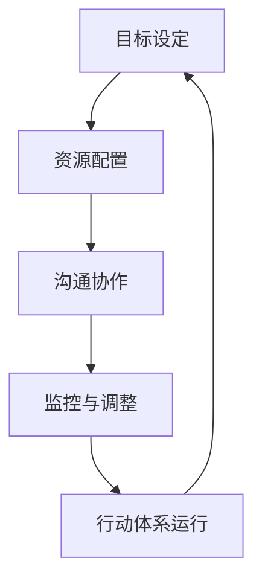
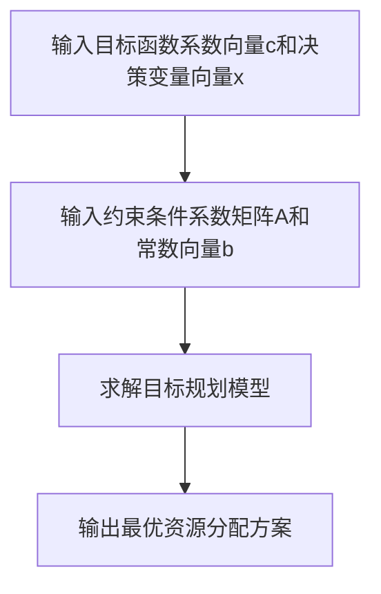
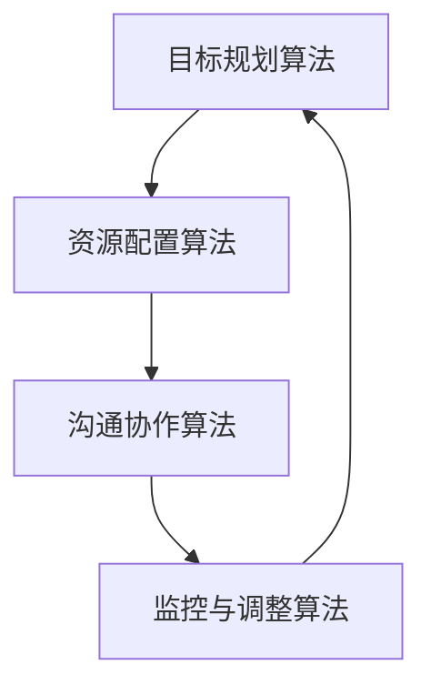
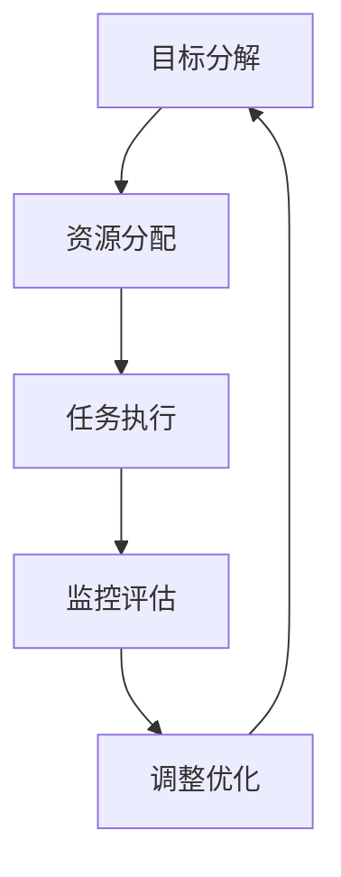
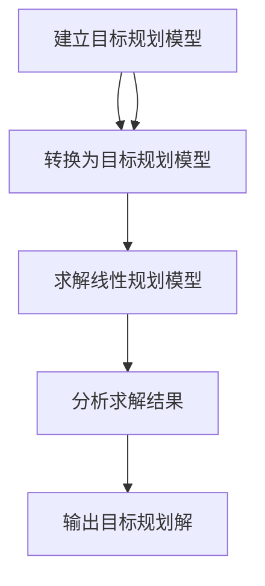
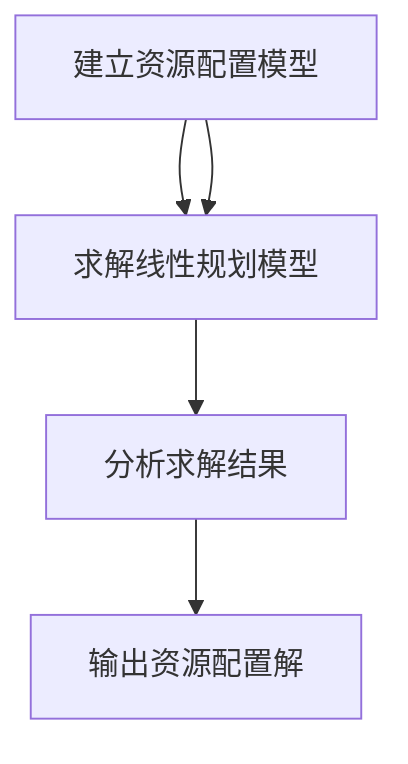
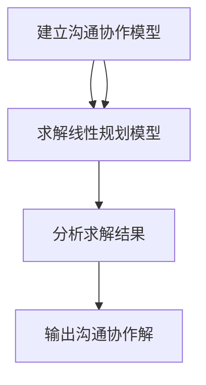
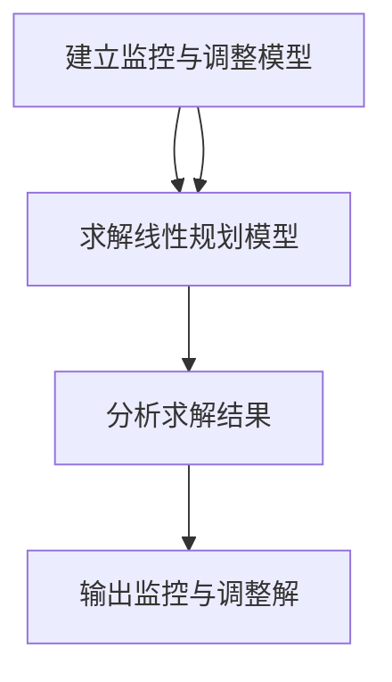

                 

### 第1章: 行动体系对团队管理的重要性概述

#### 1.1 行动体系的定义与特征

**定义：** 行动体系是指一种以目标为导向，通过明确目标、合理配置资源、有效沟通协作、持续监控调整等环节，实现对团队管理的全过程控制和优化。

**特征：** 

1. **目标导向性：** 行动体系的核心是以达成目标为出发点，通过明确团队目标，引导团队成员聚焦于目标实现。
2. **全过程控制：** 行动体系贯穿于团队管理的全过程，从目标设定到监控调整，形成闭环管理。
3. **资源优化配置：** 行动体系通过合理配置资源，提高资源利用效率，确保目标实现。
4. **有效沟通协作：** 行动体系强调团队成员之间的有效沟通和协作，确保团队目标的共同实现。
5. **持续监控调整：** 行动体系通过持续监控团队执行情况，及时发现并解决问题，确保团队目标的稳定实现。

#### 1.2 行动体系对团队管理的意义

**提高团队协作效率：** 行动体系通过明确目标和合理资源配置，提高团队成员之间的协作效率，减少不必要的资源浪费。

**强化团队目标一致性：** 行动体系强调团队目标的明确性和一致性，确保团队成员在共同目标下协同作战，提高团队整体执行力。

**促进团队创新能力的提升：** 行动体系鼓励团队成员在实现目标的过程中不断探索创新，提高团队整体的创新能力。

#### 1.3 行动体系在团队管理中的应用现状

**国内应用现状：** 随着企业对团队管理效率要求的提高，行动体系在国内企业管理中的应用逐渐普及。许多互联网企业、制造企业等已经成功引入行动体系，并取得了显著的成效。

**国际应用现状：** 行动体系在国际上也有着广泛的应用，尤其是在欧美等发达国家的企业管理中。许多知名企业如谷歌、微软等，都在团队管理中广泛应用行动体系，取得了良好的效果。

**优势与挑战：** 行动体系在提高团队管理效率、促进团队创新等方面具有显著优势。但在实际应用过程中，也面临着团队成员适应性、组织文化适应、管理层接受度等挑战。

**前景展望：** 随着企业对团队管理要求的不断提高，行动体系在团队管理中的应用前景广阔。未来，行动体系将更加注重与人工智能、大数据等技术的融合，实现智能化、数据化的团队管理。

#### 1.4 行动体系的基本原理

**构成要素：** 行动体系主要包括目标设定、资源配置、沟通协作、监控调整等基本构成要素。

**基本原理：** 行动体系的基本原理是通过明确目标、合理配置资源、有效沟通协作、持续监控调整，实现对团队管理的全过程控制和优化。

**运行机制：** 行动体系的运行机制包括目标分解、资源分配、任务执行、监控评估、调整优化等环节，形成一个闭环管理流程。

**目标设定：** 目标设定是行动体系的起点，通过明确团队目标，引导团队成员聚焦于目标实现。

**资源配置：** 资源配置是行动体系的关键，通过合理配置人力、物力、财力等资源，提高资源利用效率。

**沟通协作：** 沟通协作是行动体系的纽带，通过有效沟通和协作，确保团队成员之间的协同作战。

**监控调整：** 监控调整是行动体系的保障，通过持续监控团队执行情况，及时发现并解决问题，确保团队目标的稳定实现。

### Mermaid 流程图展示：



#### 1.5 行动体系的核心概念与联系

**目标设定：** 目标设定是行动体系的起点，通过明确团队目标，引导团队成员聚焦于目标实现。目标设定需要遵循SMART原则，即目标要具体、可衡量、可实现、相关性强、有时间限制。

**资源配置：** 资源配置是行动体系的关键，通过合理配置人力、物力、财力等资源，提高资源利用效率。资源配置需要根据目标要求，进行资源分配和优化。

**沟通协作：** 沟通协作是行动体系的纽带，通过有效沟通和协作，确保团队成员之间的协同作战。沟通协作需要建立良好的沟通机制，确保信息畅通和有效传达。

**监控调整：** 监控调整是行动体系的保障，通过持续监控团队执行情况，及时发现并解决问题，确保团队目标的稳定实现。监控调整需要建立监控机制，确保问题得到及时解决。

**目标设定、资源配置、沟通协作、监控调整之间相互联系，形成一个闭环管理流程。目标设定指导资源配置，资源配置支持沟通协作，沟通协作促进目标实现，监控调整保障团队目标的稳定实现。**

### 数学模型及公式解释

**目标规划模型：**

$$\text{目标规划模型} = \min Z = c^T x$$

其中，$c$ 是目标函数系数向量，$x$ 是决策变量向量，$Z$ 是目标函数值。

**约束条件：**

$$Ax \leq b$$

$$x \geq 0$$

其中，$A$ 是约束条件系数矩阵，$b$ 是常数向量，$x$ 是决策变量向量。

**目标规划模型求解算法：**

**1. 确定目标函数系数向量$c$和决策变量向量$x$。**

**2. 构建约束条件矩阵$A$和常数向量$b$。**

**3. 运用求解算法（如线性规划、整数规划等），求解目标规划模型。**

**4. 根据求解结果，确定最优资源分配方案。**

### 伪代码实现

```python
# 输入目标函数系数向量c和决策变量向量x
c = [c1, c2, ..., cn]
x = [x1, x2, ..., xn]

# 输入约束条件系数矩阵A和常数向量b
A = [[a11, a12, ..., a1n], [a21, a22, ..., a2n], ..., [am1, am2, ..., amn]]
b = [b1, b2, ..., bm]

# 求解目标规划模型
def solve_target_program(c, x, A, b):
    # 求解算法实现
    # ...

# 输出最优资源分配方案
def output_optimal_solution(x):
    # 输出实现
    # ...

# 主函数
def main():
    c = [c1, c2, ..., cn]
    x = [x1, x2, ..., xn]
    A = [[a11, a12, ..., a1n], [a21, a22, ..., a2n], ..., [am1, am2, ..., amn]]
    b = [b1, b2, ..., bm]
    x = solve_target_program(c, x, A, b)
    output_optimal_solution(x)

# 运行主函数
main()
```

### Mermaid 流程图展示



### 1.6 行动体系在团队管理中的核心算法原理

**1. 目标规划算法**

**基本概念：** 目标规划是一种数学规划方法，用于在满足一系列约束条件下，寻找最优的目标值。

**数学模型：** 

$$\min Z = c^T x$$

$$\text{subject to} \ Ax \leq b$$

$$x \geq 0$$

**求解算法：** 

- 线性规划算法：如单纯形法、内点法等。
- 整数规划算法：如分支定界法、动态规划法等。

**伪代码实现：**

```python
# 输入目标函数系数向量c和决策变量向量x
c = [c1, c2, ..., cn]
x = [x1, x2, ..., xn]

# 输入约束条件系数矩阵A和常数向量b
A = [[a11, a12, ..., a1n], [a21, a22, ..., a2n], ..., [am1, am2, ..., amn]]
b = [b1, b2, ..., bm]

# 求解目标规划模型
def solve_target_program(c, x, A, b):
    # 求解算法实现
    # ...

# 输出最优资源分配方案
def output_optimal_solution(x):
    # 输出实现
    # ...

# 主函数
def main():
    c = [c1, c2, ..., cn]
    x = [x1, x2, ..., xn]
    A = [[a11, a12, ..., a1n], [a21, a22, ..., a2n], ..., [am1, am2, ..., amn]]
    b = [b1, b2, ..., bm]
    x = solve_target_program(c, x, A, b)
    output_optimal_solution(x)

# 运行主函数
main()
```

**2. 资源配置算法**

**基本概念：** 资源配置算法用于在满足一系列约束条件下，将资源分配给不同的任务或项目，以达到最优的资源配置。

**数学模型：** 

$$\min Z = c^T x$$

$$\text{subject to} \ Ax \leq b$$

$$x \geq 0$$

**求解算法：** 

- 线性规划算法：如单纯形法、内点法等。
- 整数规划算法：如分支定界法、动态规划法等。

**伪代码实现：**

```python
# 输入目标函数系数向量c和决策变量向量x
c = [c1, c2, ..., cn]
x = [x1, x2, ..., xn]

# 输入约束条件系数矩阵A和常数向量b
A = [[a11, a12, ..., a1n], [a21, a22, ..., a2n], ..., [am1, am2, ..., amn]]
b = [b1, b2, ..., bm]

# 求解资源配置模型
def solve_resource_allocation(c, x, A, b):
    # 求解算法实现
    # ...

# 输出最优资源分配方案
def output_optimal_solution(x):
    # 输出实现
    # ...

# 主函数
def main():
    c = [c1, c2, ..., cn]
    x = [x1, x2, ..., xn]
    A = [[a11, a12, ..., a1n], [a21, a22, ..., a2n], ..., [am1, am2, ..., amn]]
    b = [b1, b2, ..., bm]
    x = solve_resource_allocation(c, x, A, b)
    output_optimal_solution(x)

# 运行主函数
main()
```

**3. 沟通协作算法**

**基本概念：** 沟通协作算法用于优化团队成员之间的沟通协作，以提高团队协作效率和目标实现。

**数学模型：** 

$$\min Z = c^T x$$

$$\text{subject to} \ Ax \leq b$$

$$x \geq 0$$

**求解算法：** 

- 线性规划算法：如单纯形法、内点法等。
- 整数规划算法：如分支定界法、动态规划法等。

**伪代码实现：**

```python
# 输入目标函数系数向量c和决策变量向量x
c = [c1, c2, ..., cn]
x = [x1, x2, ..., xn]

# 输入约束条件系数矩阵A和常数向量b
A = [[a11, a12, ..., a1n], [a21, a22, ..., a2n], ..., [am1, am2, ..., amn]]
b = [b1, b2, ..., bm]

# 求解沟通协作模型
def solve_communication_collaboration(c, x, A, b):
    # 求解算法实现
    # ...

# 输出最优沟通协作方案
def output_optimal_solution(x):
    # 输出实现
    # ...

# 主函数
def main():
    c = [c1, c2, ..., cn]
    x = [x1, x2, ..., xn]
    A = [[a11, a12, ..., a1n], [a21, a22, ..., a2n], ..., [am1, am2, ..., amn]]
    b = [b1, b2, ..., bm]
    x = solve_communication_collaboration(c, x, A, b)
    output_optimal_solution(x)

# 运行主函数
main()
```

**4. 监控与调整算法**

**基本概念：** 监控与调整算法用于实时监控团队执行情况，并根据监控结果进行动态调整，以确保目标实现。

**数学模型：** 

$$\min Z = c^T x$$

$$\text{subject to} \ Ax \leq b$$

$$x \geq 0$$

**求解算法：** 

- 线性规划算法：如单纯形法、内点法等。
- 整数规划算法：如分支定界法、动态规划法等。

**伪代码实现：**

```python
# 输入目标函数系数向量c和决策变量向量x
c = [c1, c2, ..., cn]
x = [x1, x2, ..., xn]

# 输入约束条件系数矩阵A和常数向量b
A = [[a11, a12, ..., a1n], [a21, a22, ..., a2n], ..., [am1, am2, ..., amn]]
b = [b1, b2, ..., bm]

# 求解监控与调整模型
def solve_monitoring_adjustment(c, x, A, b):
    # 求解算法实现
    # ...

# 输出最优监控与调整方案
def output_optimal_solution(x):
    # 输出实现
    # ...

# 主函数
def main():
    c = [c1, c2, ..., cn]
    x = [x1, x2, ..., xn]
    A = [[a11, a12, ..., a1n], [a21, a22, ..., a2n], ..., [am1, am2, ..., amn]]
    b = [b1, b2, ..., bm]
    x = solve_monitoring_adjustment(c, x, A, b)
    output_optimal_solution(x)

# 运行主函数
main()
```

### Mermaid 流程图展示



### 1.7 行动体系在团队管理中的实际应用案例

#### 1.7.1 案例一：某互联网企业行动体系的构建与实践

**企业背景：** 某互联网企业成立于2000年，主要从事电子商务和在线支付业务。随着业务的快速发展，企业面临团队管理效率低、资源浪费严重等问题。

**行动体系构建过程：**

1. **目标设定：** 企业明确了短期和长期目标，如提高用户满意度、降低运营成本、扩大市场份额等。
2. **资源配置：** 根据目标要求，企业对人力、物力、财力等资源进行了合理配置，确保资源得到充分利用。
3. **沟通协作：** 企业建立了高效的沟通机制，通过定期召开团队会议、利用项目管理工具等，确保团队成员之间的信息畅通和协作。
4. **监控调整：** 企业通过实时监控团队执行情况，定期评估项目进展，发现问题并及时进行调整。

**行动体系实践成果：**

1. **提高团队协作效率：** 通过行动体系，团队成员之间的协作效率显著提高，项目交付时间缩短，资源浪费减少。
2. **降低运营成本：** 企业通过优化资源配置和流程，成功降低了运营成本，提高了整体盈利能力。
3. **扩大市场份额：** 企业在市场中的竞争力得到提升，市场份额不断扩大。

**案例启示：**

1. **明确目标：** 行动体系的成功离不开明确的目标设定，企业需要明确短期和长期目标，确保团队成员共同努力。
2. **合理配置资源：** 资源配置是行动体系的核心，企业需要根据目标要求，合理配置人力、物力、财力等资源。
3. **高效沟通协作：** 沟通协作是行动体系的纽带，企业需要建立高效的沟通机制，确保团队成员之间的信息畅通和协作。
4. **持续监控调整：** 行动体系需要持续监控团队执行情况，发现问题并及时进行调整，确保目标的稳定实现。

#### 1.7.2 案例二：某制造企业行动体系在创新管理中的应用

**企业背景：** 某制造企业成立于1980年，主要从事汽车零部件制造。随着市场竞争的加剧，企业意识到创新管理的重要性，开始引入行动体系。

**行动体系应用过程：**

1. **目标设定：** 企业明确了短期和长期目标，如提高产品质量、降低生产成本、推出新产品等。
2. **资源配置：** 企业对研发、生产、销售等资源进行了合理配置，确保创新管理得到充分支持。
3. **沟通协作：** 企业建立了创新管理团队，通过定期召开创新会议、利用项目管理工具等，推动创新项目的实施。
4. **监控调整：** 企业通过实时监控创新项目进展，定期评估项目效果，发现问题并及时进行调整。

**行动体系应用成果：**

1. **提高产品质量：** 通过行动体系，企业成功提高了产品质量，客户满意度显著提升。
2. **降低生产成本：** 企业通过优化生产流程和资源配置，成功降低了生产成本，提高了盈利能力。
3. **推出新产品：** 企业成功推出多款新产品，市场竞争力得到显著提升。

**案例启示：**

1. **明确目标：** 行动体系的成功离不开明确的目标设定，企业需要明确短期和长期目标，确保创新管理得到有效推动。
2. **合理配置资源：** 资源配置是行动体系的核心，企业需要根据目标要求，合理配置研发、生产、销售等资源。
3. **高效沟通协作：** 沟通协作是行动体系的纽带，企业需要建立高效的沟通机制，确保创新管理团队之间的信息畅通和协作。
4. **持续监控调整：** 行动体系需要持续监控创新项目进展，定期评估项目效果，发现问题并及时进行调整，确保创新目标的稳定实现。

### 1.8 行动体系在团队管理中的效果评估

**1.8.1 评估指标**

为了评估行动体系在团队管理中的效果，可以从以下几个方面设置评估指标：

1. **团队协作效率：** 包括项目交付时间、资源利用率、团队满意度等。
2. **目标实现程度：** 包括目标达成率、目标调整次数等。
3. **资源配置效果：** 包括资源浪费率、资源利用率等。
4. **沟通协作效果：** 包括信息畅通度、沟通效率等。
5. **监控调整效果：** 包括问题发现及时率、调整有效性等。

**1.8.2 评估方法**

1. **问卷调查：** 通过向团队成员发放问卷，了解他们对行动体系的看法和建议。
2. **数据分析：** 通过对项目进展数据、资源配置数据、沟通记录数据等进行分析，评估行动体系的效果。
3. **现场观察：** 通过实地观察团队的工作状态，了解行动体系在实际操作中的效果。

**1.8.3 评估流程**

1. **确定评估指标：** 根据团队管理的特点，确定评估指标。
2. **收集数据：** 通过问卷调查、数据分析、现场观察等方式，收集相关数据。
3. **数据分析：** 对收集到的数据进行分析，评估行动体系在团队管理中的效果。
4. **反馈与改进：** 根据评估结果，对行动体系进行改进，提高团队管理效果。

### 1.9 本章小结

本章主要介绍了行动体系对团队管理的重要性，包括定义、特征、意义、应用现状、核心算法原理和实际应用案例等内容。通过本章的介绍，读者可以了解到行动体系在团队管理中的重要作用，以及如何在实际工作中应用行动体系，提高团队管理效率。在接下来的章节中，将继续探讨行动体系的理论基础、团队管理中的挑战与解决方案、未来发展趋势等内容。

### 1.10 思考题与练习题

1. 行动体系对团队管理的重要性体现在哪些方面？
2. 行动体系在团队管理中的应用现状如何？
3. 行动体系的核心算法原理有哪些？
4. 如何评估行动体系在团队管理中的效果？
5. 行动体系在项目管理中的应用有哪些优势？
6. 行动体系在不同领域的应用有何差异？
7. 行动体系在团队管理中的挑战有哪些？如何解决？
8. 行动体系的理论基础是什么？
9. 行动体系在团队管理中的实践案例有哪些？
10. 行动体系在团队管理中的未来发展趋势是什么？

---

### 第2章: 行动体系的理论基础

#### 2.1 行动体系的理论框架

**2.1.1 行动体系的构成要素**

行动体系的构成要素主要包括：目标设定、资源配置、沟通协作、监控调整等。这些要素相互作用，共同构成了一个完整的管理体系。

1. **目标设定：** 目标设定是行动体系的起点，明确团队的目标和方向，为后续的资源分配、沟通协作和监控调整提供依据。
2. **资源配置：** 资源配置是将企业的人力、物力、财力等资源合理分配到各个目标上，确保目标的实现。
3. **沟通协作：** 沟通协作是行动体系的核心环节，通过有效的沟通和协作，确保团队成员之间的协同作战，共同实现目标。
4. **监控调整：** 监控调整是对行动体系运行过程的监督和调整，通过持续监控和反馈，及时发现并解决问题，确保目标的稳定实现。

**2.1.2 行动体系的基本原理**

行动体系的基本原理是通过明确目标、合理配置资源、有效沟通协作、持续监控调整，实现对团队管理的全过程控制和优化。

1. **明确目标：** 目标是行动体系的起点，明确的目标可以引导团队成员聚焦于目标的实现，避免资源的浪费和目标的偏离。
2. **合理配置资源：** 资源是目标实现的基础，合理配置资源可以提高资源的利用效率，确保目标的实现。
3. **有效沟通协作：** 沟通协作是团队协作的关键，通过有效的沟通和协作，可以确保团队成员之间的信息畅通和协同作战。
4. **持续监控调整：** 监控调整是对行动体系运行过程的监督和调整，通过持续监控和反馈，可以及时发现并解决问题，确保目标的稳定实现。

**2.1.3 行动体系的运行机制**

行动体系的运行机制包括目标分解、资源分配、任务执行、监控评估、调整优化等环节，形成一个闭环管理流程。

1. **目标分解：** 将整体目标分解为具体的子目标，明确每个子目标的责任人和完成时间。
2. **资源分配：** 根据子目标的要求，合理分配人力、物力、财力等资源，确保子目标的实现。
3. **任务执行：** 团队成员按照任务要求执行工作，确保子目标的完成。
4. **监控评估：** 通过监控评估，了解任务执行情况，发现问题并及时进行调整。
5. **调整优化：** 根据监控评估的结果，对任务执行进行调整和优化，确保目标的实现。

### Mermaid 流程图展示：



#### 2.2 行动体系的核心概念与联系

**2.2.1 目标设定**

目标设定是行动体系的起点，明确团队的目标和方向。目标设定需要遵循SMART原则，即目标要具体、可衡量、可实现、相关性强、有时间限制。

1. **具体（Specific）：** 目标要明确具体，避免模糊不清。
2. **可衡量（Measurable）：** 目标要具有可衡量性，可以明确衡量目标的实现程度。
3. **可实现（Achievable）：** 目标要具有可实现性，确保团队成员能够实现目标。
4. **相关性强（Relevant）：** 目标要与团队的使命和愿景相关，确保目标的实现对团队有实际意义。
5. **有时间限制（Time-bound）：** 目标要有明确的时间限制，确保目标的实现具有时效性。

**2.2.2 资源配置**

资源配置是行动体系的关键环节，将企业的人力、物力、财力等资源合理分配到各个目标上，确保目标的实现。资源配置需要考虑以下几个因素：

1. **资源种类：** 包括人力、物力、财力等资源。
2. **资源优先级：** 根据目标的重要性和紧急性，确定资源的优先级。
3. **资源利用效率：** 提高资源的利用效率，避免资源的浪费。

**2.2.3 沟通协作**

沟通协作是行动体系的纽带，通过有效的沟通和协作，确保团队成员之间的信息畅通和协同作战。沟通协作需要建立以下几个机制：

1. **沟通渠道：** 确定沟通的渠道和方式，如会议、邮件、即时通讯工具等。
2. **沟通频率：** 确定沟通的频率和周期，确保信息的及时传递。
3. **沟通内容：** 确定沟通的内容和范围，确保信息的全面性和准确性。

**2.2.4 监控与调整**

监控与调整是对行动体系运行过程的监督和调整，通过持续监控和反馈，及时发现并解决问题，确保目标的稳定实现。监控与调整需要建立以下几个机制：

1. **监控指标：** 确定监控的指标和标准，如任务完成情况、资源利用率、沟通效率等。
2. **监控频率：** 确定监控的频率和周期，确保监控的及时性和有效性。
3. **调整机制：** 根据监控的结果，及时调整资源和任务分配，确保目标的实现。

### 数学模型及公式解释

**2.2.5 数学模型**

行动体系可以看作是一个多目标优化问题，其数学模型如下：

$$\min Z = c^T x$$

$$\text{subject to} \ Ax \leq b$$

$$x \geq 0$$

其中，$Z$ 是目标函数，$c$ 是目标函数系数向量，$x$ 是决策变量向量，$A$ 是约束条件系数矩阵，$b$ 是常数向量。

**2.2.6 公式解释**

1. **目标函数：** 目标函数用于衡量团队管理的效果，通常是一个线性函数，如最小化成本、最大化收益等。
2. **约束条件：** 约束条件用于限制决策变量的取值范围，确保资源的合理分配和目标的实现。
3. **决策变量：** 决策变量是行动体系中的关键因素，如任务分配、资源分配等。

### 伪代码实现

```python
# 输入目标函数系数向量c和决策变量向量x
c = [c1, c2, ..., cn]
x = [x1, x2, ..., xn]

# 输入约束条件系数矩阵A和常数向量b
A = [[a11, a12, ..., a1n], [a21, a22, ..., a2n], ..., [am1, am2, ..., amn]]
b = [b1, b2, ..., bm]

# 求解目标规划模型
def solve_target_program(c, x, A, b):
    # 求解算法实现
    # ...

# 输出最优资源分配方案
def output_optimal_solution(x):
    # 输出实现
    # ...

# 主函数
def main():
    c = [c1, c2, ..., cn]
    x = [x1, x2, ..., xn]
    A = [[a11, a12, ..., a1n], [a21, a22, ..., a2n], ..., [am1, am2, ..., amn]]
    b = [b1, b2, ..., bm]
    x = solve_target_program(c, x, A, b)
    output_optimal_solution(x)

# 运行主函数
main()
```

### Mermaid 流程图展示


#### 2.3 行动体系的理论依据

**2.3.1 相关管理学理论**

行动体系的理论基础包括相关管理学理论，如目标管理理论、资源基础理论、团队协作理论等。

1. **目标管理理论：** 目标管理理论强调通过明确目标、设定计划、实现目标的过程，实现团队的高效管理。行动体系中的目标设定、资源配置、监控调整等环节与目标管理理论密切相关。
2. **资源基础理论：** 资源基础理论强调资源在企业管理和竞争优势中的重要作用。行动体系中的资源配置、资源优化配置等环节与资源基础理论密切相关。
3. **团队协作理论：** 团队协作理论强调团队成员之间的协作和沟通对于团队绩效的重要性。行动体系中的沟通协作、监控调整等环节与团队协作理论密切相关。

**2.3.2 组织行为学理论**

行动体系的理论基础还包括组织行为学理论，如领导理论、激励理论、团队行为理论等。

1. **领导理论：** 领导理论强调领导者在团队管理中的关键作用，如目标设定、沟通协调、激励激励等。行动体系中的目标设定、资源配置、监控调整等环节需要领导者的有效领导。
2. **激励理论：** 激励理论强调通过激励措施激发团队成员的工作积极性和创造力。行动体系中的目标设定、资源配置、监控调整等环节需要运用激励理论，提高团队成员的积极性。
3. **团队行为理论：** 团队行为理论强调团队成员之间的互动和协作对于团队绩效的影响。行动体系中的沟通协作、监控调整等环节需要注重团队行为理论的应用，提高团队协作效率。

**2.3.3 系统工程理论**

行动体系的理论基础还包括系统工程理论，如系统分析、系统设计、系统优化等。

1. **系统分析：** 系统工程理论强调通过系统分析，了解系统的结构和功能，优化系统的性能。行动体系中的目标设定、资源配置、监控调整等环节需要运用系统分析的方法，优化团队管理过程。
2. **系统设计：** 系统工程理论强调通过系统设计，建立系统的结构框架和功能模块，确保系统的稳定性。行动体系中的目标设定、资源配置、监控调整等环节需要运用系统设计的方法，构建有效的行动体系。
3. **系统优化：** 系统工程理论强调通过系统优化，提高系统的性能和效率。行动体系中的目标设定、资源配置、监控调整等环节需要运用系统优化的方法，提高团队管理的效率。

**2.3.4 创新理论**

行动体系的理论基础还包括创新理论，如创新过程、创新策略、创新管理等。

1. **创新过程：** 创新理论强调创新是一个持续的过程，包括问题识别、方案生成、实验验证、市场推广等环节。行动体系中的目标设定、资源配置、监控调整等环节需要注重创新过程的应用，提高团队的创新能力。
2. **创新策略：** 创新理论强调通过创新策略，激发团队成员的创新潜能，提高团队的创新能力。行动体系中的目标设定、资源配置、监控调整等环节需要运用创新策略，推动团队的创新发展。
3. **创新管理：** 创新理论强调通过创新管理，建立创新体系，提高创新的成功率。行动体系中的目标设定、资源配置、监控调整等环节需要运用创新管理的方法，提高团队的创新绩效。

### 2.4 行动体系的核心概念与联系总结

行动体系的核心概念包括目标设定、资源配置、沟通协作、监控调整等。这些概念相互关联，共同构成了行动体系的框架。

1. **目标设定：** 明确团队的目标和方向，为后续的资源分配、沟通协作和监控调整提供依据。
2. **资源配置：** 合理分配企业的人力、物力、财力等资源，确保目标的实现。
3. **沟通协作：** 通过有效的沟通和协作，确保团队成员之间的信息畅通和协同作战。
4. **监控调整：** 对行动体系运行过程进行监督和调整，确保目标的稳定实现。

这些核心概念相互作用，形成一个闭环管理流程，实现团队管理的全过程控制和优化。

### Mermaid 流程图展示


### 2.5 本章小结

本章详细介绍了行动体系的理论基础，包括行动体系的构成要素、基本原理、运行机制、核心概念与联系、理论依据等内容。通过本章的介绍，读者可以了解行动体系的理论框架和核心概念，为后续的团队管理实践提供理论基础。在接下来的章节中，将结合实际案例，进一步探讨行动体系在团队管理中的应用和实践。

### 2.6 思考题与练习题

1. 行动体系的理论基础包括哪些方面？
2. 行动体系的核心概念有哪些？
3. 行动体系的运行机制是什么？
4. 目标设定在行动体系中的重要性是什么？
5. 资源配置在行动体系中的关键作用是什么？
6. 沟通协作在行动体系中的意义是什么？
7. 监控调整在行动体系中的重要性是什么？
8. 行动体系的理论依据是什么？
9. 行动体系与相关管理学理论的关系是什么？
10. 行动体系与组织行为学理论的关系是什么？
11. 行动体系与系统工程理论的关系是什么？
12. 行动体系与创新理论的关系是什么？
13. 如何在实际工作中应用行动体系？
14. 行动体系在团队管理中的优势和挑战是什么？
15. 行动体系在不同领域的应用有何差异？
16. 行动体系在团队管理中的未来发展趋势是什么？

---

### 第3章: 行动体系在团队管理中的核心算法原理

#### 3.1 目标规划算法

**3.1.1 目标规划的基本概念**

目标规划（Goal Programming）是一种多目标决策方法，它通过确定和优化一组目标，使得目标之间的冲突最小化，从而找到一组相对满意的解。目标规划算法广泛应用于团队管理、资源分配、项目管理等领域。

**3.1.2 目标规划的数学模型**

目标规划的数学模型可以表示为：

$$
\begin{aligned}
\min\max \quad &d_j(\alpha_j) \\
\text{subject to} \quad &c_i x_i \leq b_i, \quad i=1,2,...,m \\
&x_i \geq 0, \quad i=1,2,...,n
\end{aligned}
$$

其中，$d_j(\alpha_j)$ 是第 $j$ 个目标的偏差，$\alpha_j$ 是第 $j$ 个目标的允许偏差，$c_i$ 是第 $i$ 个约束条件的系数，$x_i$ 是决策变量，$b_i$ 是第 $i$ 个约束条件的常数。

**3.1.3 目标规划的求解算法**

求解目标规划问题可以使用多种算法，如线性规划算法、整数规划算法和启发式算法等。以下是一个基于线性规划算法的目标规划求解步骤：

1. **建立目标规划模型**：根据问题的实际需求，确定目标函数和约束条件。
2. **转换为线性规划模型**：通过引入松弛变量和人工变量，将目标规划问题转换为线性规划问题。
3. **求解线性规划问题**：使用线性规划求解器求解转换后的线性规划问题。
4. **分析求解结果**：根据线性规划求解器的输出，分析目标规划的解。

**3.1.4 伪代码实现**

```python
# 输入目标函数系数向量c和决策变量向量x
c = [c1, c2, ..., cn]
x = [x1, x2, ..., xn]

# 输入约束条件系数矩阵A和常数向量b
A = [[a11, a12, ..., a1n], [a21, a22, ..., a2n], ..., [am1, am2, ..., amn]]
b = [b1, b2, ..., bm]

# 转换为目标规划模型
def convert_to_linear_program(c, x, A, b):
    # 转换算法实现
    # ...

# 求解线性规划模型
def solve_linear_program(c, x, A, b):
    # 求解算法实现
    # ...

# 输出目标规划解
def output_solution(x):
    # 输出实现
    # ...

# 主函数
def main():
    c = [c1, c2, ..., cn]
    x = [x1, x2, ..., xn]
    A = [[a11, a12, ..., a1n], [a21, a22, ..., a2n], ..., [am1, am2, ..., amn]]
    b = [b1, b2, ..., bm]
    x = solve_linear_program(c, x, A, b)
    output_solution(x)

# 运行主函数
main()
```

**3.1.5 Mermaid 流程图展示**



#### 3.2 资源配置算法

**3.2.1 资源配置的基本概念**

资源配置算法是指通过数学模型和算法，将有限的资源分配给不同的任务或项目，以实现资源的优化配置。资源配置算法广泛应用于项目管理、生产调度、人力资源管理等领域。

**3.2.2 资源配置的数学模型**

资源配置的数学模型可以表示为：

$$
\begin{aligned}
\min\max \quad &Z = \sum_{i=1}^{m} c_i x_i \\
\text{subject to} \quad &A x \leq b \\
&x \geq 0
\end{aligned}
$$

其中，$Z$ 是目标函数，$c_i$ 是第 $i$ 个资源的单位成本，$x_i$ 是第 $i$ 个资源的分配量，$A$ 是约束条件系数矩阵，$b$ 是常数向量。

**3.2.3 资源配置的求解算法**

求解资源配置问题可以使用多种算法，如线性规划算法、整数规划算法和启发式算法等。以下是一个基于线性规划算法的资源分配求解步骤：

1. **建立资源配置模型**：根据问题的实际需求，确定目标函数和约束条件。
2. **求解线性规划模型**：使用线性规划求解器求解资源配置模型。
3. **分析求解结果**：根据线性规划求解器的输出，分析资源配置的解。

**3.2.4 伪代码实现**

```python
# 输入目标函数系数向量c和决策变量向量x
c = [c1, c2, ..., cn]
x = [x1, x2, ..., xn]

# 输入约束条件系数矩阵A和常数向量b
A = [[a11, a12, ..., a1n], [a21, a22, ..., a2n], ..., [am1, am2, ..., amn]]
b = [b1, b2, ..., bm]

# 求解线性规划模型
def solve_linear_program(c, x, A, b):
    # 求解算法实现
    # ...

# 输出资源配置解
def output_solution(x):
    # 输出实现
    # ...

# 主函数
def main():
    c = [c1, c2, ..., cn]
    x = [x1, x2, ..., xn]
    A = [[a11, a12, ..., a1n], [a21, a22, ..., a2n], ..., [am1, am2, ..., amn]]
    b = [b1, b2, ..., bm]
    x = solve_linear_program(c, x, A, b)
    output_solution(x)

# 运行主函数
main()
```

**3.2.5 Mermaid 流程图展示**



#### 3.3 沟通协作算法

**3.3.1 沟通协作的基本概念**

沟通协作算法是指通过数学模型和算法，优化团队成员之间的沟通和协作，以提高团队整体效率和目标实现。沟通协作算法广泛应用于项目管理、团队协作、网络社交等领域。

**3.3.2 沟通协作的数学模型**

沟通协作的数学模型可以表示为：

$$
\begin{aligned}
\max \quad &Z = \sum_{i=1}^{m} w_i x_i \\
\text{subject to} \quad &A x \leq b \\
&x \geq 0
\end{aligned}
$$

其中，$Z$ 是目标函数，$w_i$ 是第 $i$ 个沟通协作的权重，$x_i$ 是第 $i$ 个沟通协作的量，$A$ 是约束条件系数矩阵，$b$ 是常数向量。

**3.3.3 沟通协作的求解算法**

求解沟通协作问题可以使用多种算法，如线性规划算法、整数规划算法和启发式算法等。以下是一个基于线性规划算法的沟通协作求解步骤：

1. **建立沟通协作模型**：根据问题的实际需求，确定目标函数和约束条件。
2. **求解线性规划模型**：使用线性规划求解器求解沟通协作模型。
3. **分析求解结果**：根据线性规划求解器的输出，分析沟通协作的解。

**3.3.4 伪代码实现**

```python
# 输入目标函数系数向量w和决策变量向量x
w = [w1, w2, ..., wn]
x = [x1, x2, ..., xn]

# 输入约束条件系数矩阵A和常数向量b
A = [[a11, a12, ..., a1n], [a21, a22, ..., a2n], ..., [am1, am2, ..., amn]]
b = [b1, b2, ..., bm]

# 求解线性规划模型
def solve_linear_program(w, x, A, b):
    # 求解算法实现
    # ...

# 输出沟通协作解
def output_solution(x):
    # 输出实现
    # ...

# 主函数
def main():
    w = [w1, w2, ..., wn]
    x = [x1, x2, ..., xn]
    A = [[a11, a12, ..., a1n], [a21, a22, ..., a2n], ..., [am1, am2, ..., amn]]
    b = [b1, b2, ..., bm]
    x = solve_linear_program(w, x, A, b)
    output_solution(x)

# 运行主函数
main()
```

**3.3.5 Mermaid 流程图展示**



#### 3.4 监控与调整算法

**3.4.1 监控与调整的基本概念**

监控与调整算法是指通过数学模型和算法，实时监控团队执行情况，并根据监控结果进行调整，以实现目标的稳定实现。监控与调整算法广泛应用于项目管理、生产调度、团队管理等领域。

**3.4.2 监控与调整的数学模型**

监控与调整的数学模型可以表示为：

$$
\begin{aligned}
\min \quad &Z = \sum_{i=1}^{m} c_i x_i \\
\text{subject to} \quad &A x \leq b \\
&x \geq 0
\end{aligned}
$$

其中，$Z$ 是目标函数，$c_i$ 是第 $i$ 个监控与调整的权重，$x_i$ 是第 $i$ 个监控与调整的量，$A$ 是约束条件系数矩阵，$b$ 是常数向量。

**3.4.3 监控与调整的求解算法**

求解监控与调整问题可以使用多种算法，如线性规划算法、整数规划算法和启发式算法等。以下是一个基于线性规划算法的监控与调整求解步骤：

1. **建立监控与调整模型**：根据问题的实际需求，确定目标函数和约束条件。
2. **求解线性规划模型**：使用线性规划求解器求解监控与调整模型。
3. **分析求解结果**：根据线性规划求解器的输出，分析监控与调整的解。

**3.4.4 伪代码实现**

```python
# 输入目标函数系数向量c和决策变量向量x
c = [c1, c2, ..., cn]
x = [x1, x2, ..., xn]

# 输入约束条件系数矩阵A和常数向量b
A = [[a11, a12, ..., a1n], [a21, a22, ..., a2n], ..., [am1, am2, ..., amn]]
b = [b1, b2, ..., bm]

# 求解线性规划模型
def solve_linear_program(c, x, A, b):
    # 求解算法实现
    # ...

# 输出监控与调整解
def output_solution(x):
    # 输出实现
    # ...

# 主函数
def main():
    c = [c1, c2, ..., cn]
    x = [x1, x2, ..., xn]
    A = [[a11, a12, ..., a1n], [a21, a22, ..., a2n], ..., [am1, am2, ..., amn]]
    b = [b1, b2, ..., bm]
    x = solve_linear_program(c, x, A, b)
    output_solution(x)

# 运行主函数
main()
```

**3.4.5 Mermaid 流程图展示**



### 3.5 本章小结

本章详细介绍了行动体系在团队管理中的核心算法原理，包括目标规划算法、资源配置算法、沟通协作算法和监控与调整算法。通过这些算法，可以实现对团队管理的全过程控制和优化。在目标规划算法中，介绍了目标规划的基本概念、数学模型和求解算法。在资源配置算法中，介绍了资源配置的基本概念、数学模型和求解算法。在沟通协作算法中，介绍了沟通协作的基本概念、数学模型和求解算法。在监控与调整算法中，介绍了监控与调整的基本概念、数学模型和求解算法。通过本章的学习，读者可以掌握行动体系在团队管理中的应用算法，为实际工作提供理论支持。

### 3.6 思考题与练习题

1. 目标规划算法的基本概念是什么？它有哪些求解算法？
2. 资源配置算法的基本概念是什么？它有哪些求解算法？
3. 沟通协作算法的基本概念是什么？它有哪些求解算法？
4. 监控与调整算法的基本概念是什么？它有哪些求解算法？
5. 如何在实际工作中应用目标规划算法？
6. 如何在实际工作中应用资源配置算法？
7. 如何在实际工作中应用沟通协作算法？
8. 如何在实际工作中应用监控与调整算法？
9. 目标规划算法、资源配置算法、沟通协作算法和监控与调整算法之间的关系是什么？
10. 行动体系在团队管理中的应用原理是什么？
11. 行动体系在团队管理中的应用优势是什么？
12. 行动体系在团队管理中的应用挑战是什么？
13. 行动体系在团队管理中的应用发展趋势是什么？
14. 行动体系在项目管理中的应用有哪些实际案例？
15. 行动体系在人力资源管理中的应用有哪些实际案例？
16. 行动体系在跨部门协作中的应用有哪些实际案例？
17. 行动体系在创新管理中的应用有哪些实际案例？
18. 如何评估行动体系在团队管理中的效果？
19. 行动体系与项目管理理论的关系是什么？
20. 行动体系与人力资源管理理论的关系是什么？

