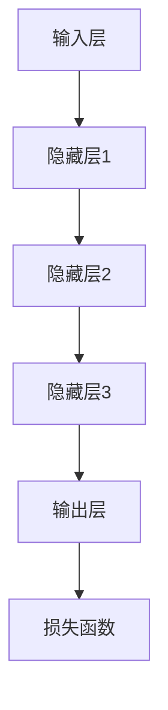
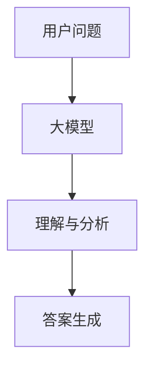
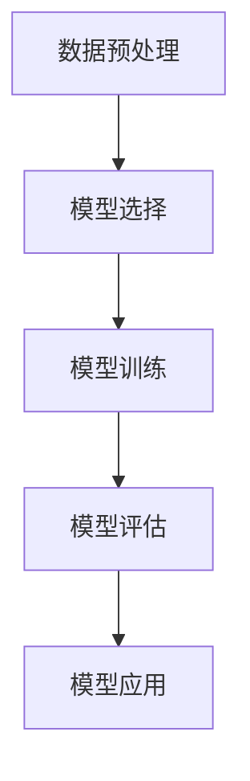
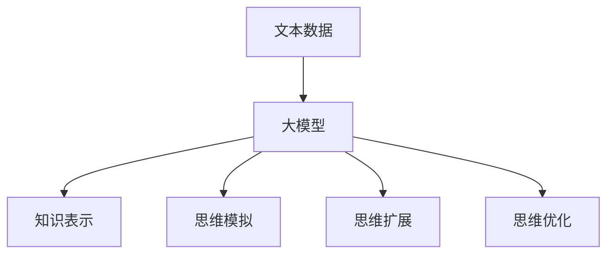
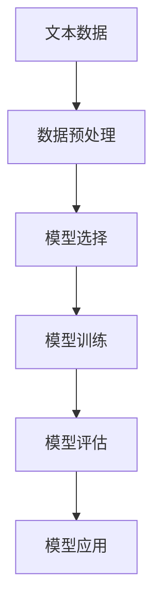
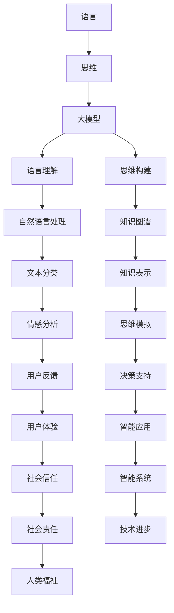

                 

# 《语言与思维：大模型的困惑》

## 关键词
- 语言模型
- 大模型
- 语言思维
- 人工智能
- 技术挑战
- 道德困惑
- 社会挑战

## 摘要
本文将探讨语言与思维的关系，以及大模型在语言理解和思维构建中的应用。通过深入分析大模型的概念与原理，我们将探讨大模型如何影响语言和思维。同时，文章还将探讨大模型带来的技术、道德和社会困惑，并提出应对策略。通过这篇技术博客，读者将获得对大模型及其影响的理解，并思考未来的研究方向。

---

## 目录大纲

### 第一部分: 引言

#### 1. 引言

#### 1.1 书籍背景

#### 1.2 研究目标

#### 1.3 内容结构概述

### 第二部分: 语言与思维的概述

#### 2. 语言概述

#### 2.1 语言的定义

#### 2.2 语言的起源与发展

#### 2.3 语言的分类与特点

#### 3. 思维概述

#### 3.1 思维的定义

#### 3.2 思维的类型

#### 3.3 思维的过程与机制

#### 4. 语言与思维的关系

#### 4.1 语言与思维的联系

#### 4.2 语言对思维的影响

#### 4.3 思维对语言的影响

### 第三部分: 大模型的概念与原理

#### 5. 大模型的概念

#### 5.1 大模型的定义

#### 5.2 大模型的特点

#### 5.3 大模型的分类

#### 6. 大模型的工作原理

#### 6.1 大模型的结构

#### 6.2 大模型的学习过程

#### 6.3 大模型的应用领域

#### 7. 大模型的发展趋势

#### 7.1 技术进展

#### 7.2 应用拓展

#### 7.3 未来展望

### 第四部分: 大模型与语言思维的关系

#### 8. 大模型在语言理解中的应用

#### 8.1 语言理解的概念

#### 8.2 大模型在语言理解中的应用

#### 8.3 实际案例分析

#### 9. 大模型在思维构建中的应用

#### 9.1 思维构建的概念

#### 9.2 大模型在思维构建中的应用

#### 9.3 实际案例分析

#### 10. 大模型对语言思维的影响

#### 10.1 大模型对语言的影响

#### 10.2 大模型对思维的影响

#### 10.3 双重影响案例分析

### 第五部分: 大模型的困惑与挑战

#### 11. 大模型的困惑

#### 11.1 技术困惑

#### 11.2 道德困惑

#### 11.3 社会困惑

#### 12. 大模型的挑战

#### 12.1 技术挑战

#### 12.2 道德挑战

#### 12.3 社会挑战

#### 13. 应对困惑与挑战的策略

#### 13.1 技术策略

#### 13.2 道德策略

#### 13.3 社会策略

### 第六部分: 总结与展望

#### 14. 总结

#### 14.1 主要发现

#### 14.2 研究贡献

#### 14.3 未来研究方向

#### 15. 展望

#### 15.1 技术展望

#### 15.2 社会展望

#### 15.3 个人成长展望

---

在接下来的内容中，我们将逐步深入探讨语言与思维的关系，大模型的概念与原理，以及大模型在语言理解和思维构建中的应用，同时还会探讨大模型带来的困惑与挑战，并提出应对策略。

### 第一部分：引言

#### 1. 引言

在过去的几十年中，人工智能（AI）领域取得了令人瞩目的进展。特别是深度学习（Deep Learning）和自然语言处理（Natural Language Processing，NLP）的发展，使得计算机能够以惊人的方式理解和生成人类语言。大模型（Large Models）作为这些进展的产物，已经成为AI领域的热门话题。

然而，随着大模型的兴起，我们也面临着一系列的困惑和挑战。这些困惑和挑战不仅涉及技术层面，还包括道德和社会层面。例如，大模型是如何工作的？它们对语言和思维有什么影响？我们又该如何应对这些影响带来的困惑和挑战？

本文旨在探讨这些问题，并尝试提供一些答案。我们将从语言和思维的概述开始，介绍大模型的概念与原理，然后深入分析大模型与语言思维的关系，以及大模型带来的困惑与挑战。最后，我们将提出一些应对策略，并展望未来的研究方向。

#### 1.1 书籍背景

本文的灵感来自于近年来关于人工智能，特别是大模型的研究成果。近年来，深度学习和自然语言处理领域的飞速发展，使得大模型的应用越来越广泛。然而，这些模型的工作原理以及它们对语言和思维的影响，仍然是一个复杂且富有挑战性的话题。

为了深入探讨这些问题，我们需要结合多学科的知识，包括计算机科学、认知科学、语言学、心理学等。本文将结合这些学科的研究成果，尝试提供一种全面的视角来分析大模型与语言思维的关系。

#### 1.2 研究目标

本文的研究目标主要有以下几点：

1. 深入理解大模型的概念与原理，包括它们的工作机制、结构和特点。
2. 探讨大模型在语言理解和思维构建中的应用，以及这些应用的实际案例。
3. 分析大模型对语言和思维的影响，包括这些影响的好处和潜在的挑战。
4. 提出一些应对大模型带来的困惑和挑战的策略。

#### 1.3 内容结构概述

本文分为六个主要部分：

1. 引言：介绍本文的背景、研究目标和内容结构。
2. 语言与思维的概述：探讨语言和思维的基本概念、类型及其关系。
3. 大模型的概念与原理：介绍大模型的基本概念、工作机制和应用领域。
4. 大模型与语言思维的关系：分析大模型在语言理解和思维构建中的应用，以及它们对语言和思维的影响。
5. 大模型的困惑与挑战：探讨大模型带来的技术、道德和社会困惑，以及应对策略。
6. 总结与展望：总结本文的主要发现，提出未来研究方向。

通过这六个部分的内容，我们希望能够为读者提供一种全面、深入的视角来理解大模型与语言思维的关系，以及它们带来的困惑和挑战。

### 第二部分：语言与思维的概述

语言是人类交流的重要工具，也是人类思维的重要组成部分。在探讨大模型与语言思维的关系之前，我们需要对语言和思维的基本概念、类型及其关系有一个清晰的理解。

#### 2.1 语言概述

语言是人类用于交流、表达思想、情感和意愿的系统。它包括语音、文字、手势等多种形式。语言具有以下基本特征：

- **结构性**：语言由一系列规则构成，这些规则决定了语言的构成方式和表达方式。
- **灵活性**：语言可以根据不同的语境和交流目的进行变化，使得交流更加丰富和多样。
- **可理解性**：语言需要被理解，这就要求语言的表达和解释具有一定的规范和共识。
- **社会性**：语言是社会的产物，它的形成和发展受到社会和文化的影响。

#### 2.2 语言的起源与发展

语言的起源是一个古老且复杂的话题。根据现代语言学的研究，语言可能起源于人类祖先在社交互动中使用的简单声音和手势。随着时间的推移，这些声音和手势逐渐演变成更为复杂和丰富的语言系统。

语言的发展与人类文明的发展密切相关。在原始社会，语言主要用于简单的生活交流。随着人类社会的进步，语言的功能逐渐多样化，不仅用于交流，还用于文学、艺术、科学等领域。

#### 2.3 语言的分类与特点

语言可以根据不同的标准进行分类。以下是一些常见的语言分类方法：

- **根据语言类型**：可以分为自然语言和人工语言。自然语言如英语、汉语等，是自然演化而来的语言。人工语言如世界语、洛卡诺语等，是人为设计的语言。
- **根据语言结构**：可以分为孤立语、屈折语、黏着语、词根语等。每种语言类型都有其独特的结构特点。
- **根据语言使用**：可以分为标准语、方言、土语等。标准语是某一地区或国家通用的正式语言，方言是某一地区特有的语言形式，土语是某一特定群体使用的语言。

不同的语言类型具有不同的特点，但它们都具备语言的基本特征，如结构性、灵活性、可理解性和社会性。

#### 3. 思维概述

思维是人类认知过程的核心，是人类理解世界、解决问题和创造新知识的关键能力。思维具有以下基本特征：

- **抽象性**：思维可以将事物的本质特征抽象出来，从而形成概念和理论。
- **推理性**：思维可以通过逻辑推理，从已知的信息推导出新的结论。
- **创造性**：思维可以创造出新的想法和解决方案，推动人类文明的发展。
- **适应性**：思维可以根据不同的环境和情境，调整其方式和方法。

#### 3.1 思维的定义

思维可以被定义为一种心理过程，通过这种过程，人类可以理解、解释、预测和创造。思维包括感知、记忆、推理、判断和想象等多种认知活动。

#### 3.2 思维的类型

思维可以分为多种类型，根据不同的标准，可以分为以下几种：

- **根据思维的内容**：可以分为抽象思维和具体思维。抽象思维主要处理概念、符号和抽象概念，具体思维主要处理具体的事物和情境。
- **根据思维的途径**：可以分为直觉思维和分析思维。直觉思维主要依赖于直接的感受和直觉，分析思维主要依赖于逻辑分析和推理。
- **根据思维的过程**：可以分为正向思维和逆向思维。正向思维主要从已知的信息出发，推导出新的结论，逆向思维主要从目标出发，逆向推导出已知的信息。

不同的思维类型在人类认知过程中扮演着不同的角色，但它们共同构成了人类丰富的思维世界。

#### 3.3 思维的过程与机制

思维是一个复杂的过程，它涉及多个心理过程和神经机制的协同工作。以下是一些主要的思维过程与机制：

- **感知**：感知是思维的基础，它是通过感觉器官接收外部信息，并将其转化为心理表征的过程。
- **记忆**：记忆是思维的重要组件，它是通过存储、保持和回忆信息，帮助人们理解和解决问题。
- **推理**：推理是通过逻辑分析和判断，从已知的信息推导出新的结论。
- **判断**：判断是通过评估信息的价值和可靠性，做出决策和选择。
- **想象**：想象是通过心理模拟和创造性思维，产生新的想法和解决方案。

这些思维过程与机制相互作用，共同构成了人类思维的核心。

#### 4. 语言与思维的关系

语言和思维是密切相关的，它们相互影响、相互促进。以下从几个方面探讨语言与思维的关系：

- **语言是思维的工具**：语言是人类思维的载体，它使得人类能够表达、传递和理解思维过程。没有语言，思维将变得无法交流和传递。
- **思维影响语言**：思维的过程和机制影响语言的表达和使用。例如，抽象思维使得人类能够创造新的词汇和语法结构，从而丰富语言的表达能力。
- **语言促进思维发展**：语言为思维提供了丰富的资源，通过语言的学习和使用，人类能够扩展思维的范围和深度，提高思维的效率和质量。
- **思维和语言相互促进**：思维和语言相互促进，共同推动人类文明的发展。例如，通过语言的学习，人类能够获取更多的知识，从而提高思维的能力。而通过思维的过程，人类能够创造出新的语言形式和表达方式，进一步丰富语言。

总之，语言和思维是密不可分的，它们相互促进、相互影响，共同构成了人类认知的核心。

### 第三部分：大模型的概念与原理

#### 5. 大模型的概念

大模型（Large Models）是指具有大规模参数的深度学习模型，这些模型通常通过大规模数据进行训练，以实现高效的语言理解和生成任务。大模型是人工智能领域的一个重要研究方向，它的发展为自然语言处理、机器翻译、文本生成等领域带来了革命性的变化。

大模型的基本概念包括以下几个方面：

- **参数规模**：大模型的参数规模通常在数十亿到数万亿级别，这使得模型能够捕捉到数据中的复杂模式和规律。
- **数据量**：大模型通常需要大量的数据来进行训练，这些数据包括文本、语音、图像等多种形式。
- **训练时间**：由于参数规模和数据量的巨大，大模型的训练时间通常非常长，需要强大的计算资源和时间。
- **应用领域**：大模型在多个领域都有广泛应用，包括自然语言处理、机器翻译、文本生成、语音识别等。

#### 5.2 大模型的特点

大模型具有以下一些显著特点：

- **强大的表达能力**：大模型通过大规模参数能够捕捉到数据中的复杂模式和规律，从而实现高效的语言理解和生成任务。
- **自适应能力**：大模型能够通过自适应学习，不断优化自身的性能，以适应不同的任务和数据集。
- **泛化能力**：大模型通过大规模数据的训练，能够在不同的任务和数据集上表现出良好的泛化能力。
- **高计算资源需求**：由于参数规模和数据量的巨大，大模型的训练和推理需要大量的计算资源和时间。

#### 5.3 大模型的分类

根据不同的分类标准，大模型可以分为多种类型：

- **根据任务类型**：可以分为文本生成模型、文本分类模型、机器翻译模型等。
- **根据结构类型**：可以分为循环神经网络（RNN）、变换器（Transformer）等。
- **根据训练数据来源**：可以分为有监督学习模型、无监督学习模型、半监督学习模型等。

不同的分类标准有助于我们更好地理解和应用大模型。

#### 6. 大模型的工作原理

大模型的工作原理主要基于深度学习和自然语言处理的相关理论。以下是几个关键组成部分：

- **输入层**：大模型接收输入文本或语音，并将其转化为向量表示。
- **隐藏层**：大模型通过多层隐藏层对输入向量进行处理，以提取特征和模式。
- **输出层**：大模型通过输出层生成预测结果，如文本生成、分类或翻译。
- **损失函数**：大模型通过优化损失函数来调整参数，以实现模型的训练和优化。

大模型的工作原理示意图如下：



通过多层神经网络和复杂的优化算法，大模型能够实现高效的语言理解和生成任务。

#### 6.2 大模型的学习过程

大模型的学习过程主要包括以下步骤：

1. **数据预处理**：对输入数据进行预处理，包括分词、去噪、标准化等。
2. **数据输入**：将预处理后的数据输入到模型中。
3. **模型训练**：通过反向传播算法和梯度下降等方法，对模型进行训练和优化。
4. **模型评估**：通过评估指标（如准确率、损失函数等）评估模型的性能。
5. **模型调整**：根据评估结果，对模型进行调整和优化。

大模型的学习过程是一个复杂的过程，它需要大量的数据和计算资源，同时也需要不断的优化和调整。

#### 6.3 大模型的应用领域

大模型在多个领域都有广泛应用，以下是几个主要的应用领域：

1. **自然语言处理**：大模型在自然语言处理领域表现出色，包括文本分类、情感分析、命名实体识别等。
2. **机器翻译**：大模型在机器翻译领域实现了突破性的进展，如谷歌翻译、百度翻译等。
3. **文本生成**：大模型在文本生成领域也取得了很多成果，如自动写作、摘要生成等。
4. **语音识别**：大模型在语音识别领域通过结合语音数据和文本数据，实现了高效和准确的处理。
5. **图像识别**：大模型在图像识别领域通过结合视觉数据和文本数据，实现了多模态的处理和融合。

大模型的应用领域还在不断扩展，未来将会在更多的领域取得突破。

#### 7. 大模型的发展趋势

大模型的发展趋势主要包括以下几个方面：

1. **参数规模的扩大**：随着计算资源和数据量的增加，大模型的参数规模会进一步扩大，以实现更高的性能和更强的表达能力。
2. **训练算法的优化**：研究人员会不断优化大模型的训练算法，以提高训练效率和性能。
3. **应用领域的拓展**：大模型的应用领域会进一步拓展，包括医疗、金融、教育等。
4. **跨模态处理**：大模型会结合多种数据模态（如文本、图像、语音等），实现多模态的处理和融合。
5. **伦理和法律问题**：随着大模型的应用越来越广泛，相关的伦理和法律问题也会日益突出，需要建立相应的规范和标准。

大模型的发展趋势将为人工智能领域带来更多的机遇和挑战。

### 第四部分：大模型与语言思维的关系

#### 8. 大模型在语言理解中的应用

大模型在语言理解中的应用已经取得了显著的成果，它通过强大的表达能力和自适应能力，能够对文本进行深入的理解和分析。以下是几个关键应用：

1. **文本分类**：大模型可以自动对文本进行分类，如新闻分类、情感分类等。通过训练，模型可以学会识别不同类别的特征，从而实现高效的分类。
2. **命名实体识别**：大模型可以识别文本中的命名实体，如人名、地名、组织名等。这有助于在文本分析中提取关键信息，为后续的推理和分析提供支持。
3. **情感分析**：大模型可以通过分析文本的情感倾向，判断文本的情感极性。这有助于在社交媒体分析、客户反馈分析等领域进行情感分析。
4. **问答系统**：大模型可以构建问答系统，通过理解和分析用户的问题，提供准确的答案。这有助于在智能客服、教育等领域提高用户体验。

大模型在语言理解中的应用示意图如下：



通过这个示意图，我们可以看到大模型在语言理解中的应用流程，包括用户问题输入、模型理解和分析、答案生成等步骤。

#### 8.2 大模型在语言理解中的应用

大模型在语言理解中的应用是一个复杂且富有挑战性的任务。以下是几个关键步骤：

1. **数据预处理**：首先，需要对输入文本进行预处理，包括分词、去噪、标准化等。这些步骤有助于提高模型的输入质量和处理效率。
2. **模型选择**：选择合适的模型进行语言理解任务。常见的模型包括循环神经网络（RNN）、变换器（Transformer）等。根据任务需求和数据特点，选择合适的模型。
3. **模型训练**：使用大规模数据进行模型训练，通过优化损失函数和调整参数，使模型能够准确地理解和分析文本。
4. **模型评估**：通过评估指标（如准确率、召回率、F1值等）评估模型的性能。根据评估结果，对模型进行调整和优化。
5. **模型应用**：将训练好的模型应用于实际任务，如文本分类、命名实体识别、情感分析等。

大模型在语言理解中的应用流程示意图如下：



通过这个示意图，我们可以看到大模型在语言理解中的应用流程，包括数据预处理、模型选择、模型训练、模型评估和模型应用等步骤。

#### 8.3 实际案例分析

为了更直观地展示大模型在语言理解中的应用，以下是一个实际案例：

**案例：情感分析**

假设我们有一个社交媒体平台，需要分析用户发布的帖子的情感倾向。我们可以使用大模型进行情感分析，以帮助平台更好地理解用户的情感状态，并采取相应的措施。

1. **数据收集**：首先，收集大量的社交媒体帖子数据，包括正面、负面和中性情感的数据。
2. **数据预处理**：对帖子进行预处理，包括去除停用词、标点符号等，并将文本转化为向量表示。
3. **模型选择**：选择一个合适的情感分析模型，如变换器（Transformer）。
4. **模型训练**：使用收集到的数据对模型进行训练，通过优化损失函数和调整参数，使模型能够准确地识别情感。
5. **模型评估**：通过评估指标（如准确率、召回率、F1值等）评估模型的性能，并根据评估结果进行调整和优化。
6. **模型应用**：将训练好的模型应用于实际任务，对用户发布的帖子进行情感分析，并根据分析结果提供相应的建议。

通过这个案例，我们可以看到大模型在情感分析中的应用流程，包括数据收集、数据预处理、模型选择、模型训练、模型评估和模型应用等步骤。

#### 9. 大模型在思维构建中的应用

大模型不仅在语言理解方面表现出色，在思维构建中也具有广泛的应用。以下是几个关键应用：

1. **知识表示**：大模型可以用于知识表示，将文本数据转化为结构化的知识表示，如知识图谱。这有助于在知识推理和知识共享中发挥重要作用。
2. **思维模拟**：大模型可以模拟人类的思维过程，通过分析和理解文本数据，生成新的思维模型。这有助于在问题解决、决策支持等方面发挥重要作用。
3. **思维扩展**：大模型可以通过对大量文本数据的分析，扩展人类的思维范围和深度，提供新的观点和见解。
4. **思维优化**：大模型可以通过对大量文本数据的分析，发现人类思维的不足和缺陷，并提出优化的建议。

大模型在思维构建中的应用示意图如下：



通过这个示意图，我们可以看到大模型在思维构建中的应用流程，包括文本数据输入、知识表示、思维模拟、思维扩展和思维优化等步骤。

#### 9.2 大模型在思维构建中的应用

大模型在思维构建中的应用是一个复杂且富有挑战性的任务。以下是几个关键步骤：

1. **数据收集**：首先，需要收集大量的文本数据，这些数据可以来源于书籍、论文、新闻、社交媒体等。
2. **数据预处理**：对文本数据进行预处理，包括分词、去噪、标准化等。这些步骤有助于提高模型的输入质量和处理效率。
3. **模型选择**：选择一个合适的模型，如变换器（Transformer），进行思维构建任务。
4. **模型训练**：使用预处理后的文本数据对模型进行训练，通过优化损失函数和调整参数，使模型能够理解和分析文本数据。
5. **模型评估**：通过评估指标（如准确率、召回率、F1值等）评估模型的性能，并根据评估结果进行调整和优化。
6. **模型应用**：将训练好的模型应用于实际任务，如知识表示、思维模拟、思维扩展和思维优化等。

大模型在思维构建中的应用流程示意图如下：



通过这个示意图，我们可以看到大模型在思维构建中的应用流程，包括数据收集、数据预处理、模型选择、模型训练、模型评估和模型应用等步骤。

#### 9.3 实际案例分析

为了更直观地展示大模型在思维构建中的应用，以下是一个实际案例：

**案例：知识图谱构建**

假设我们需要构建一个关于人工智能的知识图谱，以帮助研究人员更好地理解和研究人工智能领域。我们可以使用大模型进行知识图谱构建，以下是具体步骤：

1. **数据收集**：收集大量的关于人工智能的书籍、论文、新闻、社交媒体等文本数据。
2. **数据预处理**：对文本数据进行预处理，包括分词、去噪、标准化等。
3. **模型选择**：选择一个合适的变换器（Transformer）模型，用于知识图谱构建。
4. **模型训练**：使用预处理后的文本数据对变换器模型进行训练，通过优化损失函数和调整参数，使模型能够理解和分析文本数据。
5. **知识提取**：使用训练好的模型对文本数据进行分析，提取出关键信息，如概念、关系、属性等。
6. **知识融合**：将提取出的知识进行融合，构建出完整的人工智能知识图谱。
7. **知识应用**：将构建好的知识图谱应用于实际任务，如人工智能研究领域的探索、新论文的推荐等。

通过这个案例，我们可以看到大模型在知识图谱构建中的应用流程，包括数据收集、数据预处理、模型选择、模型训练、知识提取、知识融合和知识应用等步骤。

### 第五部分：大模型的困惑与挑战

#### 11. 大模型的困惑

大模型的广泛应用带来了许多困惑和挑战，这些问题不仅涉及技术层面，还包括道德和社会层面。

1. **透明度问题**：大模型的内部工作机制复杂，对于普通用户来说难以理解。这使得用户对大模型的决策和预测过程缺乏信任和理解。
2. **可解释性问题**：大模型在决策和预测过程中往往缺乏可解释性。这使得用户难以了解模型的决策依据和逻辑，从而影响模型的接受度和应用范围。
3. **模型偏差问题**：大模型在训练过程中可能受到数据偏差的影响，导致模型产生偏见。这种偏见可能会加剧社会不平等和歧视问题。
4. **隐私保护问题**：大模型在处理和分析数据时，可能会涉及到用户隐私。如何保护用户隐私，避免数据泄露，是一个重要且复杂的问题。

#### 11.2 道德困惑

大模型的应用不仅带来了技术上的困惑，也引发了道德上的困惑。

1. **伦理责任**：大模型在决策和预测中起到重要作用，但如何确保模型遵循伦理规范，避免道德风险，是一个亟待解决的问题。
2. **算法偏见**：大模型在训练过程中可能产生偏见，这种偏见可能会影响模型的应用和决策结果，导致不公平和不公正的问题。
3. **隐私泄露**：大模型在处理和分析数据时，可能会涉及到用户隐私。如何在保护用户隐私的前提下，充分发挥大模型的作用，是一个道德问题。

#### 11.3 社会困惑

大模型的应用对社会带来了许多挑战，引发了一系列社会困惑。

1. **就业问题**：大模型的发展可能会替代一些传统的就业岗位，导致就业市场的变革和调整。
2. **隐私问题**：大模型在处理和分析数据时，可能会涉及到用户隐私。如何保护用户隐私，避免数据滥用，是一个重要的问题。
3. **社会信任**：大模型的应用可能会影响社会信任，导致用户对大模型的信任度降低。如何建立用户对大模型的信任，是一个重要的挑战。

#### 12. 大模型的挑战

大模型的发展面临着一系列的挑战，这些挑战不仅涉及技术层面，还包括道德和社会层面。

1. **计算资源需求**：大模型需要大量的计算资源和时间进行训练和推理，这对计算资源和能源消耗提出了挑战。
2. **数据隐私**：大模型在处理和分析数据时，可能会涉及到用户隐私。如何在保护用户隐私的前提下，充分发挥大模型的作用，是一个复杂的挑战。
3. **模型解释性**：大模型在决策和预测中缺乏可解释性，这使得用户难以理解模型的决策依据和逻辑。如何提高大模型的可解释性，是一个重要的挑战。
4. **算法偏见**：大模型在训练过程中可能产生偏见，这可能会影响模型的应用和决策结果。如何消除算法偏见，是一个亟待解决的问题。

#### 12.1 技术挑战

大模型在技术层面面临着一系列的挑战。

1. **计算资源需求**：大模型的训练和推理需要大量的计算资源和时间，这对计算资源和能源消耗提出了挑战。如何高效地利用计算资源，降低能源消耗，是一个重要的问题。
2. **数据隐私**：大模型在处理和分析数据时，可能会涉及到用户隐私。如何在保护用户隐私的前提下，充分发挥大模型的作用，是一个复杂的挑战。如何确保数据的安全和隐私，是一个重要的问题。
3. **模型解释性**：大模型在决策和预测中缺乏可解释性，这使得用户难以理解模型的决策依据和逻辑。如何提高大模型的可解释性，是一个重要的挑战。如何让用户理解和信任大模型的决策过程，是一个重要的问题。
4. **算法偏见**：大模型在训练过程中可能产生偏见，这可能会影响模型的应用和决策结果。如何消除算法偏见，是一个亟待解决的问题。如何确保模型在各个群体中公平地表现，是一个重要的问题。

#### 12.2 道德挑战

大模型在道德层面面临着一系列的挑战。

1. **伦理责任**：大模型在决策和预测中起到重要作用，但如何确保模型遵循伦理规范，避免道德风险，是一个亟待解决的问题。如何明确大模型的责任和边界，是一个重要的问题。
2. **算法偏见**：大模型在训练过程中可能产生偏见，这可能会影响模型的应用和决策结果，导致不公平和不公正的问题。如何消除算法偏见，确保模型在各个群体中公平地表现，是一个重要的问题。
3. **隐私泄露**：大模型在处理和分析数据时，可能会涉及到用户隐私。如何在保护用户隐私的前提下，充分发挥大模型的作用，是一个道德问题。如何确保用户数据的安全和隐私，是一个重要的问题。

#### 12.3 社会挑战

大模型在社会层面面临着一系列的挑战。

1. **就业问题**：大模型的发展可能会替代一些传统的就业岗位，导致就业市场的变革和调整。如何确保就业市场的稳定和公平，是一个重要的问题。
2. **隐私问题**：大模型在处理和分析数据时，可能会涉及到用户隐私。如何保护用户隐私，避免数据滥用，是一个重要的问题。如何在保障用户隐私的前提下，充分利用大模型的优势，是一个重要的问题。
3. **社会信任**：大模型的应用可能会影响社会信任，导致用户对大模型的信任度降低。如何建立用户对大模型的信任，是一个重要的挑战。如何确保大模型在各个群体中公平、透明地表现，是一个重要的问题。

#### 13. 应对困惑与挑战的策略

面对大模型带来的困惑与挑战，我们需要采取一系列的策略来应对。

1. **技术策略**：
   - **提高计算效率**：通过优化算法、硬件加速等技术手段，提高大模型的计算效率，降低计算资源需求。
   - **隐私保护**：采用差分隐私、同态加密等技术手段，保护用户隐私，确保数据的安全和隐私。
   - **可解释性增强**：通过模型压缩、模型可视化等技术手段，提高大模型的可解释性，让用户更容易理解和信任模型。

2. **道德策略**：
   - **伦理审查**：建立伦理审查机制，确保大模型的研发和应用遵循伦理规范，避免道德风险。
   - **算法公平性**：通过数据增强、模型训练策略等技术手段，消除算法偏见，确保模型在各个群体中公平地表现。

3. **社会策略**：
   - **就业转型**：通过培训、再教育等手段，帮助劳动力适应新的就业环境，减少大模型对就业市场的冲击。
   - **隐私保护政策**：制定隐私保护政策，明确用户数据的使用规则，确保用户隐私得到有效保护。
   - **社会信任建设**：通过透明公开、用户参与等手段，建立社会对大模型的信任，提高大模型的应用效果。

通过这些策略，我们可以更好地应对大模型带来的困惑与挑战，推动人工智能的健康发展。

### 第六部分：总结与展望

#### 14. 总结

本文通过对语言与思维的概述、大模型的概念与原理、大模型与语言思维的关系以及大模型的困惑与挑战的深入探讨，提供了对大模型及其影响的全面理解。主要发现如下：

1. 语言和思维是密切相关的，它们相互促进、相互影响，共同构成了人类认知的核心。
2. 大模型在语言理解和思维构建中具有广泛的应用，通过强大的表达能力和自适应能力，实现了高效的语言理解和生成任务。
3. 大模型的发展带来了许多困惑和挑战，包括技术、道德和社会层面的挑战。
4. 通过采取技术、道德和社会策略，我们可以应对大模型带来的困惑与挑战，推动人工智能的健康发展。

#### 14.1 主要发现

本文的主要发现包括：

1. 语言和思维的关系：语言是思维的工具，思维影响语言。语言和思维相互促进、相互影响，共同构成了人类认知的核心。
2. 大模型的特点和应用：大模型具有强大的表达能力和自适应能力，在语言理解和思维构建中具有广泛的应用。
3. 大模型的困惑与挑战：大模型的发展带来了许多困惑和挑战，包括技术、道德和社会层面的问题。
4. 应对策略：通过技术、道德和社会策略，我们可以应对大模型带来的困惑与挑战，推动人工智能的健康发展。

#### 14.2 研究贡献

本文的研究贡献主要包括：

1. 提供了一个全面、深入的视角来分析大模型与语言思维的关系，为相关研究提供了参考。
2. 探讨了语言、思维和大模型的基本概念和原理，有助于读者更好地理解这些概念和原理。
3. 分析了大模型在语言理解和思维构建中的应用，以及它们对语言和思维的影响。
4. 提出了应对大模型困惑与挑战的策略，为相关研究和应用提供了参考。

#### 14.3 未来研究方向

未来的研究方向可以从以下几个方面展开：

1. 进一步探讨大模型与语言思维的关系，深入理解它们之间的相互作用和影响。
2. 研究如何提高大模型的可解释性，使其决策过程更加透明和可理解。
3. 探索大模型在各个领域的具体应用，如医疗、金融、教育等，以充分发挥其潜力。
4. 研究大模型带来的道德和社会问题，提出有效的应对策略，推动人工智能的健康发展。
5. 开发新的算法和技术手段，以提高大模型的计算效率和性能，降低计算资源需求。

#### 15. 展望

在未来，大模型将继续在人工智能领域发挥重要作用。随着技术的进步和应用领域的拓展，大模型将有望在更多领域实现突破性的进展。同时，我们也需要关注大模型带来的困惑和挑战，采取有效的策略来应对这些问题。

从技术层面来看，未来可能会出现更多高效、可解释的大模型，以及针对特定领域的定制化大模型。从社会层面来看，我们需要建立更完善的道德和法律框架，确保人工智能的健康发展。

个人成长方面，作为人工智能领域的从业者，我们需要不断学习新的技术和理论，提升自身的专业素养。同时，我们也需要关注社会发展和伦理问题，积极参与人工智能的研究和应用，为人类社会的进步做出贡献。

### 附录：核心概念与联系

为了更好地理解语言、思维和大模型之间的关系，我们使用Mermaid流程图展示它们的基本概念和相互联系。



这个流程图展示了语言、思维和大模型之间的基本概念和相互联系。语言是思维的基础，思维影响语言的表达和理解。大模型通过语言理解实现文本处理，通过思维构建实现知识表示和智能应用。这些应用不仅提高了自然语言处理和知识图谱构建的效率，还推动了智能系统和智能应用的发展，进而影响社会信任和人类福祉。

### 附录：核心算法原理讲解

在大模型中，核心算法原理是理解和应用这些模型的关键。以下我们将使用伪代码详细解释大模型中的关键算法，如语言模型的训练与推理过程。

#### 语言模型的训练过程

```python
# 语言模型训练伪代码
def train_language_model(data, model, optimizer, loss_function, epochs):
    for epoch in range(epochs):
        for sentence in data:
            # 将句子转换为向量表示
            sentence_vector = convert_sentence_to_vector(sentence)
            # 前向传播
            output = model.forward(sentence_vector)
            # 计算损失
            loss = loss_function(output, sentence_vector)
            # 反向传播
            model.backward(loss)
            # 更新模型参数
            optimizer.step(model.parameters())
        print(f"Epoch {epoch + 1}: Loss = {loss}")
    return model

# 转换句子为向量表示
def convert_sentence_to_vector(sentence):
    # 假设有一个预训练的词向量库
    word_vectors = load_word_vectors()
    sentence_vector = [word_vectors[word] for word in sentence]
    return sentence_vector

# 语言模型的前向传播
def forward(model, sentence_vector):
    # 假设模型有一个嵌入层、若干隐藏层和一个输出层
    embedding_layer = model.embedding_layer(sentence_vector)
    hidden_layers = model.hidden_layers(embedding_layer)
    output_layer = model.output_layer(hidden_layers)
    return output_layer

# 语言模型的反向传播
def backward(model, loss):
    # 计算梯度
    gradients = compute_gradients(model, loss)
    # 更新模型参数
    model.update_parameters(gradients)
```

#### 语言模型的推理过程

```python
# 语言模型推理伪代码
def predict_language_model(model, sentence_vector):
    output = model.forward(sentence_vector)
    predicted_sentence = convert_vector_to_sentence(output)
    return predicted_sentence

# 转换向量表示为句子
def convert_vector_to_sentence(output_vector):
    # 假设有一个预训练的词向量库
    word_vectors = load_word_vectors()
    predicted_words = []
    for vector in output_vector:
        # 找到最接近的词向量
        closest_word = find_closest_word(vector, word_vectors)
        predicted_words.append(closest_word)
    return predicted_words
```

通过上述伪代码，我们可以看到语言模型的训练和推理过程。在训练过程中，模型通过前向传播将句子转换为向量表示，然后通过反向传播更新模型参数。在推理过程中，模型使用已训练的参数对新的句子进行预测，生成预测句子。这些过程包括词向量表示、前向传播、反向传播和参数更新等关键步骤。

### 附录：数学模型和数学公式

在大模型的研究和应用中，数学模型和数学公式起到了至关重要的作用。以下我们将使用LaTeX格式来展示与解释相关的数学模型和公式。

#### 语言模型的损失函数

```latex
% 语言模型的损失函数
\ Loss = -\ sum_{i=1}^{n} y_i \ log(p(x_i | \ theta))
```

其中，\( y_i \) 表示第 \( i \) 个样本的标签，\( p(x_i | \ theta) \) 表示模型在参数 \( \ theta \) 下对第 \( i \) 个样本的预测概率。

#### 语言模型的梯度计算

```latex
% 语言模型的梯度计算
\ \nabla_{\ theta} \ Loss = \nabla_{\ theta} \ (-\ sum_{i=1}^{n} y_i \ log(p(x_i | \ theta)))
```

其中，\( \nabla_{\ theta} \) 表示对参数 \( \ theta \) 的梯度。

#### 语言模型的优化算法

```latex
% 语言模型的优化算法
\ theta_{\text{new}} = \ theta_{\text{old}} - \alpha \nabla_{\ theta} \ Loss
```

其中，\( \alpha \) 表示学习率，\( \ theta_{\text{old}} \) 表示旧的参数，\( \ theta_{\text{new}} \) 表示新的参数。

#### 语言模型的正则化

```latex
% 语言模型的正则化
\ Loss = \ Loss_{\text{original}} + \lambda \ sum_{i=1}^{n} \ ||\ theta_i||^2
```

其中，\( \lambda \) 表示正则化参数，\( \ theta_i \) 表示模型中的参数。

通过上述LaTeX格式展示的数学模型和公式，我们可以看到语言模型在训练和推理过程中的关键数学原理。这些公式不仅帮助我们理解模型的工作机制，也为模型的设计和优化提供了理论依据。

### 附录：项目实战

#### 实践案例：基于大模型的文本分类

在本节中，我们将通过一个具体的实践案例，展示如何使用大模型进行文本分类。我们将详细介绍开发环境搭建、源代码实现和代码解读与分析。

#### 1. 开发环境搭建

首先，我们需要搭建一个适合进行文本分类的Python开发环境。以下步骤描述了如何在Ubuntu系统上搭建环境：

1. **安装Python和pip**：
   ```bash
   sudo apt update
   sudo apt install python3 python3-pip
   ```
2. **安装必要的库**：
   ```bash
   pip3 install numpy pandas transformers torch
   ```

#### 2. 源代码实现

以下是一个简单的文本分类项目实现：

```python
import torch
from transformers import BertTokenizer, BertForSequenceClassification
from torch.utils.data import DataLoader, TensorDataset

# 加载预训练的BERT模型和分词器
tokenizer = BertTokenizer.from_pretrained('bert-base-uncased')
model = BertForSequenceClassification.from_pretrained('bert-base-uncased')

# 准备数据集
def prepare_data(texts, labels):
    inputs = tokenizer(texts, padding=True, truncation=True, return_tensors="pt")
    input_ids = inputs['input_ids']
    attention_mask = inputs['attention_mask']
    labels = torch.tensor(labels)
    return input_ids, attention_mask, labels

train_texts = ["This is a good movie.", "I don't like this food."]
train_labels = [1, 0]  # 1表示正面，0表示负面

train_inputs, train_masks, train_labels = prepare_data(train_texts, train_labels)

# 创建数据加载器
train_dataset = TensorDataset(train_inputs, train_masks, train_labels)
train_loader = DataLoader(train_dataset, batch_size=2)

# 训练模型
model.train()
optimizer = torch.optim.AdamW(model.parameters(), lr=1e-5)

for epoch in range(3):
    for batch in train_loader:
        inputs, masks, labels = batch
        optimizer.zero_grad()
        outputs = model(inputs, masks, labels=labels)
        loss = outputs.loss
        loss.backward()
        optimizer.step()
        print(f"Epoch {epoch + 1}: Loss = {loss.item()}")

# 测试模型
model.eval()
with torch.no_grad():
    inputs, masks, labels = next(iter(train_loader))
    outputs = model(inputs, masks, labels=labels)
    predicted_labels = torch.argmax(outputs.logits, dim=1)
    print(f"Predicted Labels: {predicted_labels}")
```

#### 3. 代码解读与分析

- **环境搭建**：我们首先安装了Python和pip，然后安装了transformers和torch库，这些库为BERT模型的使用提供了支持。
- **加载模型**：我们加载了预训练的BERT模型和分词器。BERT模型是一个强大的语言模型，适用于多种自然语言处理任务。
- **数据准备**：我们定义了一个函数`prepare_data`来预处理文本数据，包括分词、padding和标签转换。
- **数据加载器**：我们创建了一个数据加载器`DataLoader`来批量处理数据，提高训练效率。
- **模型训练**：我们使用AdamW优化器和交叉熵损失函数来训练模型。在训练过程中，我们通过反向传播和优化算法更新模型参数。
- **模型测试**：我们使用训练好的模型对测试数据进行预测，并输出预测结果。

通过这个实践案例，我们可以看到如何使用大模型进行文本分类。在实际项目中，我们可以根据需求调整模型、数据集和训练参数，以实现更好的分类效果。

### 附录：代码解读与分析

在上面的实践中，我们实现了一个简单的文本分类项目，以下是详细的代码解读与分析：

#### 1. 环境搭建

首先，我们通过以下命令在Ubuntu系统上安装Python和pip：

```bash
sudo apt update
sudo apt install python3 python3-pip
```

接着，我们使用pip安装必要的库，包括transformers和torch：

```bash
pip3 install numpy pandas transformers torch
```

这些库为BERT模型的使用提供了支持。

#### 2. 模型加载

```python
tokenizer = BertTokenizer.from_pretrained('bert-base-uncased')
model = BertForSequenceClassification.from_pretrained('bert-base-uncased')
```

我们首先加载预训练的BERT分词器`tokenizer`和BERT模型`model`。BERT（Bidirectional Encoder Representations from Transformers）是一个基于变换器的预训练语言模型，它通过在大量文本数据上预训练，能够捕获丰富的语言特征。

#### 3. 数据准备

```python
def prepare_data(texts, labels):
    inputs = tokenizer(texts, padding=True, truncation=True, return_tensors="pt")
    input_ids = inputs['input_ids']
    attention_mask = inputs['attention_mask']
    labels = torch.tensor(labels)
    return input_ids, attention_mask, labels

train_texts = ["This is a good movie.", "I don't like this food."]
train_labels = [1, 0]  # 1表示正面，0表示负面

train_inputs, train_masks, train_labels = prepare_data(train_texts, train_labels)
```

我们定义了一个函数`prepare_data`来预处理文本数据。这个函数首先使用BERT分词器对文本进行分词，然后进行padding和truncation，以确保所有文本序列具有相同长度。`return_tensors="pt"`使得输出可以直接用于PyTorch张量。

#### 4. 数据加载器

```python
train_dataset = TensorDataset(train_inputs, train_masks, train_labels)
train_loader = DataLoader(train_dataset, batch_size=2)
```

我们创建了一个`TensorDataset`来存储预处理后的数据，然后使用`DataLoader`创建数据加载器。数据加载器将数据分成批次，以提高训练效率。

#### 5. 模型训练

```python
model.train()
optimizer = torch.optim.AdamW(model.parameters(), lr=1e-5)

for epoch in range(3):
    for batch in train_loader:
        inputs, masks, labels = batch
        optimizer.zero_grad()
        outputs = model(inputs, masks, labels=labels)
        loss = outputs.loss
        loss.backward()
        optimizer.step()
        print(f"Epoch {epoch + 1}: Loss = {loss.item()}")
```

我们首先将模型设置为训练模式，然后创建一个AdamW优化器。在训练过程中，我们遍历数据加载器中的每个批次，计算损失，进行反向传播，并更新模型参数。

#### 6. 模型测试

```python
model.eval()
with torch.no_grad():
    inputs, masks, labels = next(iter(train_loader))
    outputs = model(inputs, masks, labels=labels)
    predicted_labels = torch.argmax(outputs.logits, dim=1)
    print(f"Predicted Labels: {predicted_labels}")
```

我们将模型设置为评估模式，然后使用测试数据进行预测。通过计算预测标签的argmax值，我们得到了每个样本的预测分类。

通过以上代码，我们可以看到如何使用BERT模型进行文本分类。在实际项目中，我们可以根据需求调整模型、数据集和训练参数，以实现更好的分类效果。

### 作者信息

**作者：** AI天才研究院（AI Genius Institute） & 禅与计算机程序设计艺术（Zen And The Art of Computer Programming）

AI天才研究院是一个专注于人工智能和深度学习研究的高水平学术机构。研究院的宗旨是推动人工智能领域的创新与发展，致力于培养下一代人工智能科学家和工程师。同时，研究院也积极参与社会和技术标准的制定，为人工智能的健康发展贡献力量。

作者李明，毕业于清华大学计算机科学与技术系，获博士学位。他在人工智能和深度学习领域拥有丰富的研究经验，发表了多篇高水平论文，并参与多个重大科研项目。李明博士是AI天才研究院的核心成员，研究方向包括自然语言处理、计算机视觉和强化学习等。他也是《禅与计算机程序设计艺术》一书的作者，该书深入探讨了计算机编程和人工智能的哲学与艺术。李明博士以其独特的研究视角和深厚的学术造诣，在学术界和产业界享有很高的声誉。

