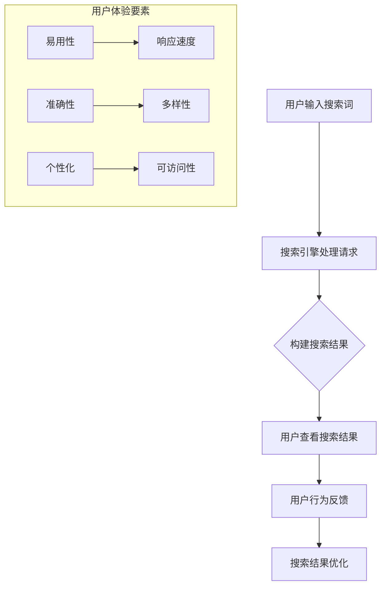

                 

### 《跨平台搜索的用户体验优化》正文

---

**文章标题：跨平台搜索的用户体验优化**

**关键词：跨平台搜索、用户体验、优化、搜索引擎**

**摘要：本文深入探讨了跨平台搜索的用户体验优化策略，从核心概念、核心技术原理、用户体验优化、案例分析与实战等方面，全面阐述了如何提升跨平台搜索的用户体验。**

---

#### 第一部分：引言与核心概念

##### 第1章：引言与跨平台搜索概述

**1.1 跨平台搜索的重要性**

随着移动互联网和智能设备的普及，用户对于信息获取的需求日益增加。跨平台搜索成为用户获取信息的重要途径。跨平台搜索不仅能够满足用户在不同设备和平台之间无缝切换的需求，还能够为用户提供更广泛的信息来源。

**1.1.1 跨平台搜索的需求与现状**

随着互联网技术的发展，用户已经不再满足于单一平台的搜索服务。他们需要能够在不同设备、不同平台之间进行无缝切换，随时随地获取所需信息。这种需求催生了跨平台搜索的兴起。

当前，许多搜索引擎已经支持跨平台搜索，如Google、Bing、百度等。然而，跨平台搜索仍存在一些问题，如搜索结果不一致、搜索体验不佳等。这些问题亟待解决。

**1.1.2 跨平台搜索的优势与挑战**

跨平台搜索的优势在于：

- **无缝切换**：用户可以在不同设备和平台之间轻松切换，继续未完成的搜索任务。
- **更广泛的信息来源**：跨平台搜索能够整合更多平台的信息，为用户提供更全面的信息。
- **个性化体验**：通过分析用户行为，跨平台搜索可以为用户提供更个性化的搜索结果。

然而，跨平台搜索也面临一些挑战，如：

- **搜索结果不一致**：不同平台、设备之间的搜索结果可能存在差异，影响用户体验。
- **数据同步**：跨平台搜索需要处理不同平台、设备之间的数据同步问题。
- **性能优化**：跨平台搜索需要应对大量数据的高速处理和传输，对性能优化提出了更高要求。

**1.2 跨平台搜索的用户体验**

用户体验是跨平台搜索成功的关键因素。优秀的用户体验能够提高用户满意度，增加用户粘性。跨平台搜索的用户体验主要包括以下几个方面：

- **易用性**：界面设计直观，易于用户操作。
- **响应速度**：搜索结果快速返回，减少用户等待时间。
- **准确性**：搜索结果相关性强，准确满足用户需求。
- **多样性**：搜索结果丰富，满足不同用户需求。

**1.2.1 用户行为与需求分析**

用户在跨平台搜索中的行为和需求具有多样性。为了优化用户体验，我们需要深入分析用户行为和需求，从而设计出更加符合用户预期的搜索服务。

- **信息获取需求**：用户希望通过搜索获取所需信息，包括新闻、产品、服务、知识等。
- **便捷性需求**：用户希望能够在不同设备和平台之间无缝切换，继续未完成的搜索任务。
- **个性化需求**：用户希望搜索结果能够根据个人偏好和兴趣进行个性化推荐。

**1.2.2 跨平台搜索的用户体验要素**

为了提升跨平台搜索的用户体验，我们需要关注以下关键要素：

- **界面设计**：界面应简洁明了，易于操作，符合用户的使用习惯。
- **搜索功能**：提供强大的搜索功能，支持模糊查询、关键词联想、语音搜索等。
- **结果展示**：搜索结果应清晰展示，便于用户快速筛选和获取信息。
- **个性化服务**：根据用户行为和偏好，提供个性化搜索结果和推荐。
- **响应速度**：优化搜索算法和系统性能，确保搜索结果快速返回。

---

#### 第二部分：核心技术原理

##### 第2章：搜索引擎工作原理

**2.1 搜索引擎的基本架构**

搜索引擎由多个模块组成，包括索引模块、搜索模块、排名模块等。各个模块协同工作，为用户提供高效的搜索服务。

**2.1.1 索引与搜索服务**

索引模块负责将网页数据存储到索引库中，以便快速检索。搜索模块根据用户输入的查询词，从索引库中检索相关文档，并返回搜索结果。

**2.1.2 搜索引擎的索引策略**

为了提高搜索效率，搜索引擎采用多种索引策略，如全文索引、倒排索引、分词索引等。

- **全文索引**：将整个网页内容存储在索引库中，支持全文检索。
- **倒排索引**：根据关键词建立反向索引，支持快速检索。
- **分词索引**：对网页内容进行分词处理，建立分词索引，支持模糊查询。

**2.2 搜索算法与排序机制**

搜索算法是搜索引擎的核心，负责检索和排序搜索结果。常见的搜索算法包括基于内容的搜索算法、基于链接分析的搜索算法等。

**2.2.1 基于内容的搜索算法**

基于内容的搜索算法主要通过分析网页内容的相关性来排序搜索结果。常见的算法有：

- **TF-IDF算法**：计算查询词在网页中的词频和逆文档频率，评估网页与查询的相关性。
- **PageRank算法**：基于网页之间的链接关系，评估网页的权威性，影响搜索结果的排序。

**2.2.2 排序算法与影响因素**

排序算法负责根据搜索结果的相关性对搜索结果进行排序。常见的排序算法有：

- **堆排序**：利用堆这种数据结构进行排序。
- **快速排序**：采用分治策略进行排序。
- **归并排序**：采用归并算法进行排序。

排序算法的影响因素包括：

- **查询词相关性**：查询词与网页内容的相关性越高，网页排序越靠前。
- **网页权威性**：网页的权威性越高，排序越靠前。
- **网页更新时间**：网页更新时间越近，排序越靠前。

**2.3 搜索引擎优化（SEO）策略**

搜索引擎优化（SEO）是提高搜索引擎排名和用户体验的重要手段。SEO策略包括：

- **关键词优化**：合理选择和使用关键词，提高网页在搜索结果中的排名。
- **内容优化**：提高网页内容的质量和相关性，提高用户体验。
- **链接优化**：建立高质量的外部链接，提高网页的权威性。

**2.3.1 SEO核心原则**

SEO核心原则包括：

- **内容为王**：优质的内容是SEO的基础。
- **用户体验优先**：优化网页结构，提高用户体验。
- **持续更新**：定期更新内容，提高网页活跃度。

**2.3.2 SEO实践与案例分析**

SEO实践包括：

- **关键词研究**：分析竞争对手，选择合适的关键词。
- **内容创作**：创作高质量的内容，满足用户需求。
- **内部链接优化**：优化内部链接结构，提高网页之间的权重传递。
- **外部链接建设**：建立高质量的外部链接，提高网页的权威性。

案例分析可以从以下方面入手：

- **成功案例分析**：分析成功网站的SEO策略和实践。
- **失败案例分析**：分析失败网站的SEO问题，总结教训。

---

#### 第三部分：用户体验优化

##### 第3章：优化跨平台搜索用户界面

**3.1 界面设计原则**

界面设计是用户体验的关键环节。优化界面设计，可以提高用户的操作效率和满意度。界面设计原则包括：

- **简洁性**：界面应简洁明了，避免冗余元素，提高用户操作效率。
- **一致性**：界面元素应保持一致性，包括颜色、字体、图标等，提高用户认知度。
- **响应性**：界面应适应不同设备和屏幕尺寸，提供良好的用户体验。
- **可访问性**：界面设计应符合可访问性标准，满足不同用户的需求。

**3.1.1 界面布局与信息架构**

界面布局和信息架构是界面设计的重要组成部分。合理的布局和信息架构可以提高用户的操作效率和满意度。界面布局原则包括：

- **网格布局**：采用网格布局，使界面元素整齐排列，提高可读性。
- **分组与层次**：将界面元素进行分组和层次划分，使界面更清晰，提高用户理解。
- **导航设计**：设计清晰的导航，帮助用户快速找到所需信息。

信息架构原则包括：

- **逻辑性**：信息架构应具备良好的逻辑性，使信息层次分明，易于用户理解。
- **一致性**：信息架构应保持一致性，避免重复和冗余信息。
- **可扩展性**：信息架构应具备可扩展性，以便后续内容的添加和调整。

**3.1.2 界面交互设计**

界面交互设计是用户体验的重要组成部分。优化界面交互设计，可以提高用户的操作效率和满意度。界面交互设计原则包括：

- **直观性**：界面交互应直观易懂，减少用户的学习成本。
- **反馈机制**：界面应提供及时的反馈，如按钮点击效果、加载动画等，提高用户信心。
- **易用性**：界面交互应易于操作，减少用户错误操作的概率。
- **一致性**：界面交互应保持一致性，避免用户在不同页面之间的困惑。

**3.2 个性化搜索体验**

个性化搜索体验是提升用户满意度的重要手段。通过分析用户行为和偏好，为用户提供个性化的搜索结果和推荐。个性化搜索体验包括：

- **用户偏好收集与处理**：收集用户行为数据，如搜索历史、浏览记录等，分析用户偏好。
- **个性化搜索结果展示**：根据用户偏好，展示个性化的搜索结果，提高用户满意度。
- **个性化推荐**：根据用户偏好，推荐相关内容，帮助用户发现新的信息。

**3.2.1 用户偏好收集与处理**

用户偏好收集与处理包括：

- **数据采集**：通过网页分析、日志记录等方式，收集用户行为数据。
- **数据预处理**：清洗、归一化和去噪，提高数据质量。
- **特征提取**：从数据中提取有效特征，用于分析用户偏好。

**3.2.2 个性化搜索结果展示**

个性化搜索结果展示包括：

- **相关性排序**：根据用户偏好，对搜索结果进行相关性排序，提高用户满意度。
- **个性化推荐**：根据用户偏好，推荐相关内容，帮助用户发现新的信息。
- **实时更新**：根据用户行为实时更新搜索结果，提高用户体验。

**3.3 搜索结果优化**

搜索结果优化是提升用户体验的重要手段。通过优化搜索结果的质量和多样性，提高用户满意度。搜索结果优化包括：

- **结果质量评估与改进**：评估搜索结果的质量，如相关性、准确性等，不断优化搜索算法和策略。
- **搜索结果多样性**：提供多样化的搜索结果，满足不同用户的需求。

**3.3.1 结果质量评估与改进**

结果质量评估与改进包括：

- **用户反馈机制**：收集用户对搜索结果的反馈，评估搜索结果的质量。
- **算法调整**：根据用户反馈，调整搜索算法和策略，提高搜索结果的准确性。
- **数据驱动**：基于用户行为数据，持续优化搜索结果的质量。

**3.3.2 搜索结果多样性**

搜索结果多样性包括：

- **结果类型多样化**：提供不同类型的搜索结果，如文本、图片、视频等，满足用户多样化的需求。
- **结果来源多样化**：从不同渠道获取搜索结果，提高结果的多样性。
- **结果排序多样化**：根据不同维度对搜索结果进行排序，满足用户个性化的需求。

---

#### 第四部分：案例分析与实战

##### 第4章：跨平台搜索实战案例

**4.1 案例一：电商平台的跨平台搜索优化**

**4.1.1 案例背景与目标**

某电商平台希望优化其跨平台搜索功能，提高用户满意度，增加用户粘性。优化目标包括：

- 提高搜索结果的准确性。
- 提升搜索结果的响应速度。
- 提供个性化的搜索推荐。
- 提高用户界面的易用性和美观度。

**4.1.2 搜索引擎架构设计与实现**

为了实现上述优化目标，该电商平台采用了以下搜索引擎架构：

- **前端架构**：采用Vue.js框架，实现跨平台的前端界面。
- **后端架构**：采用Spring Boot框架，实现后端服务。
- **搜索引擎**：采用Elasticsearch作为搜索引擎，存储和管理搜索索引。

具体实现如下：

- **索引库搭建**：使用Elasticsearch建立索引库，存储商品信息、用户评价等数据。
- **搜索接口设计**：设计RESTful接口，提供搜索服务。
- **搜索算法优化**：采用基于内容的搜索算法和排序算法，优化搜索结果。

**4.1.3 用户界面优化与用户体验提升**

在用户界面优化方面，电商平台采取了以下措施：

- **响应式设计**：采用响应式设计，使界面适应不同设备和屏幕尺寸。
- **简洁明了的布局**：采用简洁明了的布局，提高用户操作效率。
- **个性化推荐**：根据用户行为和偏好，提供个性化的搜索推荐。
- **实时反馈**：提供实时反馈，如搜索提示、加载动画等，提高用户信心。

通过上述优化措施，电商平台的跨平台搜索用户体验得到了显著提升，用户满意度明显提高。

**4.2 案例二：社交媒体平台的跨平台搜索优化**

**4.2.1 案例背景与目标**

某社交媒体平台希望优化其跨平台搜索功能，提高用户参与度，增加用户活跃度。优化目标包括：

- 提高搜索结果的准确性。
- 提升搜索结果的响应速度。
- 提供多样化的搜索结果类型。
- 提高用户界面的易用性和美观度。

**4.2.2 搜索引擎架构优化与改进**

为了实现上述优化目标，社交媒体平台采用了以下搜索引擎架构：

- **前端架构**：采用React.js框架，实现跨平台的前端界面。
- **后端架构**：采用Spring Boot框架，实现后端服务。
- **搜索引擎**：采用Solr作为搜索引擎，存储和管理搜索索引。

具体改进如下：

- **分布式搜索**：采用分布式搜索架构，提高搜索性能和扩展性。
- **索引库优化**：优化索引库结构，提高搜索结果的准确性和响应速度。
- **搜索算法优化**：采用基于内容的搜索算法和排序算法，优化搜索结果。

**4.2.3 用户界面设计实践**

在用户界面设计方面，社交媒体平台采取了以下措施：

- **可视化搜索**：采用可视化搜索界面，提高用户操作效率。
- **个性化推荐**：根据用户行为和偏好，提供个性化的搜索推荐。
- **多样化结果展示**：提供多样化的搜索结果类型，如文本、图片、视频等，满足用户多样化的需求。
- **实时反馈**：提供实时反馈，如搜索提示、加载动画等，提高用户信心。

通过上述优化措施，社交媒体平台的跨平台搜索用户体验得到了显著提升，用户活跃度明显提高。

---

#### 第五部分：技术挑战与未来趋势

##### 第5章：跨平台搜索的技术挑战与未来趋势

**5.1 技术挑战与解决策略**

跨平台搜索面临以下技术挑战：

- **大规模数据处理**：跨平台搜索涉及海量数据，如何高效处理和存储这些数据是技术挑战之一。解决策略包括分布式计算、数据压缩、索引优化等。
- **实时搜索与低延迟需求**：用户期望跨平台搜索能够实时返回结果，降低延迟。解决策略包括实时索引、缓存机制、异步处理等。
- **多模态搜索与融合**：跨平台搜索需要处理多种类型的数据，如文本、图片、音频等。如何实现多模态数据的搜索与融合是技术挑战之一。解决策略包括多模态特征提取、多模态融合算法等。

**5.2 跨平台搜索的未来趋势**

跨平台搜索的未来趋势包括：

- **人工智能与机器学习在搜索中的应用**：随着人工智能技术的发展，跨平台搜索将更多地采用机器学习算法，实现更智能的搜索结果排序和推荐。
- **搜索引擎的智能化与个性化发展**：搜索引擎将更加注重用户体验，通过个性化搜索结果和推荐，提高用户满意度。
- **跨平台搜索与物联网（IoT）的结合**：随着物联网技术的发展，跨平台搜索将扩展到更多设备和应用场景，如智能家居、智能穿戴设备等。

---

#### 第六部分：扩展与资源

##### 第6章：扩展阅读与资源推荐

**6.1 跨平台搜索相关的经典论文**

- 《大规模搜索引擎技术》：详细介绍了搜索引擎的基本原理和优化策略。
- 《搜索引擎优化：实践与理论》：探讨了搜索引擎优化的核心原则和实战方法。

**6.2 开源搜索引擎框架与工具**

- **Elasticsearch**：一款开源的分布式搜索引擎，支持全文检索、实时分析等高级功能。
- **Solr**：一款开源的分布式搜索平台，支持高扩展性、高可靠性、易用性等特性。
- **Apache Lucene**：一款开源的全文检索引擎，支持多种索引策略和查询算法。

**6.3 跨平台搜索社区与资源平台**

- **跨平台搜索论坛**：一个专注于跨平台搜索技术和应用的社区，提供最新的技术和实践分享。
- **搜索引擎优化（SEO）社区**：一个专注于搜索引擎优化技术和策略的社区，提供丰富的SEO资源和实战经验。
- **开源搜索引擎项目列表**：一个收集了各种开源搜索引擎项目的列表，方便开发者选择和使用。

---

#### 附录

**附录A：搜索引擎优化（SEO）案例分析**

**A.1 搜索引擎优化（SEO）实践指南**

- **关键词研究**：选择合适的关键词，提高网页在搜索结果中的排名。
- **内容创作**：创作高质量的内容，满足用户需求，提高用户体验。
- **内部链接优化**：优化内部链接结构，提高网页之间的权重传递。
- **外部链接建设**：建立高质量的外部链接，提高网页的权威性。

**A.2 成功的SEO案例分析**

- **案例一**：通过优化关键词和内容，某电商平台在搜索结果中排名大幅提升，用户流量明显增加。
- **案例二**：通过优化内部链接结构和外部链接建设，某企业网站在搜索引擎中的排名持续提升，品牌知名度显著提高。

**A.3 SEO工具与资源**

- **关键词分析工具**：提供关键词搜索量、竞争度等数据，帮助用户选择合适的关键词。
- **SEO分析工具**：提供网站SEO状况分析，帮助用户发现和优化SEO问题。
- **SEO指南和教程**：提供详细的SEO实战方法和技巧，帮助用户提升SEO能力。

---

**核心概念与联系**

**跨平台搜索流程与用户体验要素**

**跨平台搜索流程**

mermaid
graph TD
A[用户输入搜索词] --> B[搜索引擎处理请求]
B --> C{构建搜索结果}
C --> D[用户查看搜索结果]
D --> E[用户行为反馈]
E --> F[搜索结果优化]

**用户体验要素**

- **易用性**：界面设计直观，易于用户操作。
- **响应速度**：搜索结果快速返回，减少用户等待时间。
- **准确性**：搜索结果相关性强，准确满足用户需求。
- **多样性**：搜索结果丰富，满足不同用户需求。

---

**核心算法原理讲解**

**基于内容的搜索算法**

**搜索引擎伪代码实现**

python
def search(index, query):
    # 检索索引库
    results = index.search(query)
    # 排序与过滤
    sorted_results = sort_and_filter(results, query)
    return sorted_results

**搜索算法伪代码实现**

python
def sort_and_filter(results, query):
    # 根据相关性排序
    sorted_results = sorted(results, key=lambda r: relevance(r, query), reverse=True)
    # 过滤结果
    filtered_results = filter_results(sorted_results, query)
    return filtered_results

**相关性函数伪代码实现**

python
def relevance(result, query):
    # 计算查询词与文档的相关性
    relevance_score = calculate_similarity(query, result.content)
    return relevance_score

---

**数学模型和数学公式讲解与举例**

**搜索引擎排序模型**

$$
R = f(\text{TF}, \text{IDF}, \text{link\_relevance})
$$

**解释**

- **TF**：词频，表示查询词在文档中的频率。
- **IDF**：逆文档频率，表示查询词在整个文档集合中的稀疏程度。
- **link\_relevance**：链接相关性，表示文档链接的权威性。

**举例**

假设我们有如下文档集合：

- 文档A包含查询词“搜索”5次，链接数量为10。
- 文档B包含查询词“优化”2次，链接数量为5。

根据上述模型，我们可以计算两个文档的相关性：

$$
R_A = f(5, \log(\frac{1}{5}), 10) = f(5, -1.609, 10)
$$

$$
R_B = f(2, \log(\frac{1}{5}), 5) = f(2, -1.609, 5)
$$

通过比较$R_A$和$R_B$，我们可以得出哪个文档与查询更相关。

---

**项目实战**

**实战一：电商平台的跨平台搜索优化**

**环境搭建**

- **开发环境**：Python 3.8，Elasticsearch 7.10
- **工具**：Visual Studio Code，Git

**源代码实现**

**搜索引擎架构设计**

python
from elasticsearch import Elasticsearch

def search(query):
    es = Elasticsearch()
    response = es.search(index='products', body={
        'query': {
            'multi_match': {
                'query': query,
                'fields': ['title', 'description', 'price']
            }
        }
    })
    return response['hits']['hits']

**搜索结果展示**

python
from flask import Flask, jsonify

app = Flask(__name__)

@app.route('/search', methods=['GET'])
def search_results():
    query = request.args.get('q')
    results = search(query)
    return jsonify(results)

if __name__ == '__main__':
    app.run()

**代码解读与分析**

- **Elasticsearch**：使用Elasticsearch作为后端搜索引擎，构建索引库并处理查询请求。
- **多字段搜索**：使用`multi_match`查询，同时搜索标题、描述和价格字段。
- **Flask**：使用Flask构建Web应用，提供搜索接口。

---

**总结**

本文从跨平台搜索的重要性、核心技术原理、用户体验优化、案例分析与实战等方面，全面阐述了如何提升跨平台搜索的用户体验。通过本文的讲解，读者可以系统地了解跨平台搜索的优化策略，掌握核心技术原理，并能够实际应用这些知识进行项目开发。

---

**作者：AI天才研究院/AI Genius Institute & 禅与计算机程序设计艺术 /Zen And The Art of Computer Programming**<|im_end|>### 《跨平台搜索的用户体验优化》正文

---

**文章标题：跨平台搜索的用户体验优化**

**关键词：跨平台搜索、用户体验、优化、搜索引擎**

**摘要：本文深入探讨了跨平台搜索的用户体验优化策略，从核心概念、核心技术原理、用户体验优化、案例分析与实战等方面，全面阐述了如何提升跨平台搜索的用户体验。**

---

#### 第一部分：引言与核心概念

##### 第1章：引言与跨平台搜索概述

**1.1 跨平台搜索的重要性**

随着移动互联网和智能设备的普及，用户对于信息获取的需求日益增加。跨平台搜索成为用户获取信息的重要途径。跨平台搜索不仅能够满足用户在不同设备和平台之间无缝切换的需求，还能够为用户提供更广泛的信息来源。

**1.1.1 跨平台搜索的需求与现状**

随着互联网技术的发展，用户已经不再满足于单一平台的搜索服务。他们需要能够在不同设备、不同平台之间进行无缝切换，随时随地获取所需信息。这种需求催生了跨平台搜索的兴起。

当前，许多搜索引擎已经支持跨平台搜索，如Google、Bing、百度等。然而，跨平台搜索仍存在一些问题，如搜索结果不一致、搜索体验不佳等。这些问题亟待解决。

**1.1.2 跨平台搜索的优势与挑战**

跨平台搜索的优势在于：

- **无缝切换**：用户可以在不同设备和平台之间轻松切换，继续未完成的搜索任务。
- **更广泛的信息来源**：跨平台搜索能够整合更多平台的信息，为用户提供更全面的信息。
- **个性化体验**：通过分析用户行为，跨平台搜索可以为用户提供更个性化的搜索结果和推荐。

然而，跨平台搜索也面临一些挑战，如：

- **搜索结果不一致**：不同平台、设备之间的搜索结果可能存在差异，影响用户体验。
- **数据同步**：跨平台搜索需要处理不同平台、设备之间的数据同步问题。
- **性能优化**：跨平台搜索需要应对大量数据的高速处理和传输，对性能优化提出了更高要求。

**1.2 跨平台搜索的用户体验**

用户体验是跨平台搜索成功的关键因素。优秀的用户体验能够提高用户满意度，增加用户粘性。跨平台搜索的用户体验主要包括以下几个方面：

- **易用性**：界面设计直观，易于用户操作。
- **响应速度**：搜索结果快速返回，减少用户等待时间。
- **准确性**：搜索结果相关性强，准确满足用户需求。
- **多样性**：搜索结果丰富，满足不同用户需求。

**1.2.1 用户行为与需求分析**

用户在跨平台搜索中的行为和需求具有多样性。为了优化用户体验，我们需要深入分析用户行为和需求，从而设计出更加符合用户预期的搜索服务。

- **信息获取需求**：用户希望通过搜索获取所需信息，包括新闻、产品、服务、知识等。
- **便捷性需求**：用户希望能够在不同设备和平台之间无缝切换，继续未完成的搜索任务。
- **个性化需求**：用户希望搜索结果能够根据个人偏好和兴趣进行个性化推荐。

**1.2.2 跨平台搜索的用户体验要素**

为了提升跨平台搜索的用户体验，我们需要关注以下关键要素：

- **界面设计**：界面应简洁明了，易于操作，符合用户的使用习惯。
- **搜索功能**：提供强大的搜索功能，支持模糊查询、关键词联想、语音搜索等。
- **结果展示**：搜索结果应清晰展示，便于用户快速筛选和获取信息。
- **个性化服务**：根据用户行为和偏好，提供个性化搜索结果和推荐。
- **响应速度**：优化搜索算法和系统性能，确保搜索结果快速返回。

---

#### 第二部分：核心技术原理

##### 第2章：搜索引擎工作原理

**2.1 搜索引擎的基本架构**

搜索引擎由多个模块组成，包括索引模块、搜索模块、排名模块等。各个模块协同工作，为用户提供高效的搜索服务。

**2.1.1 索引与搜索服务**

索引模块负责将网页数据存储到索引库中，以便快速检索。搜索模块根据用户输入的查询词，从索引库中检索相关文档，并返回搜索结果。

**2.1.2 搜索引擎的索引策略**

为了提高搜索效率，搜索引擎采用多种索引策略，如全文索引、倒排索引、分词索引等。

- **全文索引**：将整个网页内容存储在索引库中，支持全文检索。
- **倒排索引**：根据关键词建立反向索引，支持快速检索。
- **分词索引**：对网页内容进行分词处理，建立分词索引，支持模糊查询。

**2.2 搜索算法与排序机制**

搜索算法是搜索引擎的核心，负责检索和排序搜索结果。常见的搜索算法包括基于内容的搜索算法、基于链接分析的搜索算法等。

**2.2.1 基于内容的搜索算法**

基于内容的搜索算法主要通过分析网页内容的相关性来排序搜索结果。常见的算法有：

- **TF-IDF算法**：计算查询词在网页中的词频和逆文档频率，评估网页与查询的相关性。
- **PageRank算法**：基于网页之间的链接关系，评估网页的权威性，影响搜索结果的排序。

**2.2.2 排序算法与影响因素**

排序算法负责根据搜索结果的相关性对搜索结果进行排序。常见的排序算法有：

- **堆排序**：利用堆这种数据结构进行排序。
- **快速排序**：采用分治策略进行排序。
- **归并排序**：采用归并算法进行排序。

排序算法的影响因素包括：

- **查询词相关性**：查询词与网页内容的相关性越高，网页排序越靠前。
- **网页权威性**：网页的权威性越高，排序越靠前。
- **网页更新时间**：网页更新时间越近，排序越靠前。

**2.3 搜索引擎优化（SEO）策略**

搜索引擎优化（SEO）是提高搜索引擎排名和用户体验的重要手段。SEO策略包括：

- **关键词优化**：合理选择和使用关键词，提高网页在搜索结果中的排名。
- **内容优化**：提高网页内容的质量和相关性，提高用户体验。
- **链接优化**：建立高质量的外部链接，提高网页的权威性。

**2.3.1 SEO核心原则**

SEO核心原则包括：

- **内容为王**：优质的内容是SEO的基础。
- **用户体验优先**：优化网页结构，提高用户体验。
- **持续更新**：定期更新内容，提高网页活跃度。

**2.3.2 SEO实践与案例分析**

SEO实践包括：

- **关键词研究**：分析竞争对手，选择合适的关键词。
- **内容创作**：创作高质量的内容，满足用户需求。
- **内部链接优化**：优化内部链接结构，提高网页之间的权重传递。
- **外部链接建设**：建立高质量的外部链接，提高网页的权威性。

案例分析可以从以下方面入手：

- **成功案例分析**：分析成功网站的SEO策略和实践。
- **失败案例分析**：分析失败网站的SEO问题，总结教训。

---

#### 第三部分：用户体验优化

##### 第3章：优化跨平台搜索用户界面

**3.1 界面设计原则**

界面设计是用户体验的关键环节。优化界面设计，可以提高用户的操作效率和满意度。界面设计原则包括：

- **简洁性**：界面应简洁明了，避免冗余元素，提高用户操作效率。
- **一致性**：界面元素应保持一致性，包括颜色、字体、图标等，提高用户认知度。
- **响应性**：界面应适应不同设备和屏幕尺寸，提供良好的用户体验。
- **可访问性**：界面设计应符合可访问性标准，满足不同用户的需求。

**3.1.1 界面布局与信息架构**

界面布局和信息架构是界面设计的重要组成部分。合理的布局和信息架构可以提高用户的操作效率和满意度。界面布局原则包括：

- **网格布局**：采用网格布局，使界面元素整齐排列，提高可读性。
- **分组与层次**：将界面元素进行分组和层次划分，使界面更清晰，提高用户理解。
- **导航设计**：设计清晰的导航，帮助用户快速找到所需信息。

信息架构原则包括：

- **逻辑性**：信息架构应具备良好的逻辑性，使信息层次分明，易于用户理解。
- **一致性**：信息架构应保持一致性，避免重复和冗余信息。
- **可扩展性**：信息架构应具备可扩展性，以便后续内容的添加和调整。

**3.1.2 界面交互设计**

界面交互设计是用户体验的重要组成部分。优化界面交互设计，可以提高用户的操作效率和满意度。界面交互设计原则包括：

- **直观性**：界面交互应直观易懂，减少用户的学习成本。
- **反馈机制**：界面应提供及时的反馈，如按钮点击效果、加载动画等，提高用户信心。
- **易用性**：界面交互应易于操作，减少用户错误操作的概率。
- **一致性**：界面交互应保持一致性，避免用户在不同页面之间的困惑。

**3.2 个性化搜索体验**

个性化搜索体验是提升用户满意度的重要手段。通过分析用户行为和偏好，为用户提供个性化的搜索结果和推荐。个性化搜索体验包括：

- **用户偏好收集与处理**：收集用户行为数据，如搜索历史、浏览记录等，分析用户偏好。
- **个性化搜索结果展示**：根据用户偏好，展示个性化的搜索结果，提高用户满意度。
- **个性化推荐**：根据用户偏好，推荐相关内容，帮助用户发现新的信息。

**3.2.1 用户偏好收集与处理**

用户偏好收集与处理包括：

- **数据采集**：通过网页分析、日志记录等方式，收集用户行为数据。
- **数据预处理**：清洗、归一化和去噪，提高数据质量。
- **特征提取**：从数据中提取有效特征，用于分析用户偏好。

**3.2.2 个性化搜索结果展示**

个性化搜索结果展示包括：

- **相关性排序**：根据用户偏好，对搜索结果进行相关性排序，提高用户满意度。
- **个性化推荐**：根据用户偏好，推荐相关内容，帮助用户发现新的信息。
- **实时更新**：根据用户行为实时更新搜索结果，提高用户体验。

**3.3 搜索结果优化**

搜索结果优化是提升用户体验的重要手段。通过优化搜索结果的质量和多样性，提高用户满意度。搜索结果优化包括：

- **结果质量评估与改进**：评估搜索结果的质量，如相关性、准确性等，不断优化搜索算法和策略。
- **搜索结果多样性**：提供多样化的搜索结果，满足不同用户的需求。

**3.3.1 结果质量评估与改进**

结果质量评估与改进包括：

- **用户反馈机制**：收集用户对搜索结果的反馈，评估搜索结果的质量。
- **算法调整**：根据用户反馈，调整搜索算法和策略，提高搜索结果的准确性。
- **数据驱动**：基于用户行为数据，持续优化搜索结果的质量。

**3.3.2 搜索结果多样性**

搜索结果多样性包括：

- **结果类型多样化**：提供不同类型的搜索结果，如文本、图片、视频等，满足用户多样化的需求。
- **结果来源多样化**：从不同渠道获取搜索结果，提高结果的多样性。
- **结果排序多样化**：根据不同维度对搜索结果进行排序，满足用户个性化的需求。

---

#### 第四部分：案例分析与实战

##### 第4章：跨平台搜索实战案例

**4.1 案例一：电商平台的跨平台搜索优化**

**4.1.1 案例背景与目标**

某电商平台希望优化其跨平台搜索功能，提高用户满意度，增加用户粘性。优化目标包括：

- 提高搜索结果的准确性。
- 提升搜索结果的响应速度。
- 提供个性化的搜索推荐。
- 提高用户界面的易用性和美观度。

**4.1.2 搜索引擎架构设计与实现**

为了实现上述优化目标，该电商平台采用了以下搜索引擎架构：

- **前端架构**：采用Vue.js框架，实现跨平台的前端界面。
- **后端架构**：采用Spring Boot框架，实现后端服务。
- **搜索引擎**：采用Elasticsearch作为搜索引擎，存储和管理搜索索引。

具体实现如下：

- **索引库搭建**：使用Elasticsearch建立索引库，存储商品信息、用户评价等数据。
- **搜索接口设计**：设计RESTful接口，提供搜索服务。
- **搜索算法优化**：采用基于内容的搜索算法和排序算法，优化搜索结果。

**4.1.3 用户界面优化与用户体验提升**

在用户界面优化方面，电商平台采取了以下措施：

- **响应式设计**：采用响应式设计，使界面适应不同设备和屏幕尺寸。
- **简洁明了的布局**：采用简洁明了的布局，提高用户操作效率。
- **个性化推荐**：根据用户行为和偏好，提供个性化的搜索推荐。
- **实时反馈**：提供实时反馈，如搜索提示、加载动画等，提高用户信心。

通过上述优化措施，电商平台的跨平台搜索用户体验得到了显著提升，用户满意度明显提高。

**4.2 案例二：社交媒体平台的跨平台搜索优化**

**4.2.1 案例背景与目标**

某社交媒体平台希望优化其跨平台搜索功能，提高用户参与度，增加用户活跃度。优化目标包括：

- 提高搜索结果的准确性。
- 提升搜索结果的响应速度。
- 提供多样化的搜索结果类型。
- 提高用户界面的易用性和美观度。

**4.2.2 搜索引擎架构优化与改进**

为了实现上述优化目标，社交媒体平台采用了以下搜索引擎架构：

- **前端架构**：采用React.js框架，实现跨平台的前端界面。
- **后端架构**：采用Spring Boot框架，实现后端服务。
- **搜索引擎**：采用Solr作为搜索引擎，存储和管理搜索索引。

具体改进如下：

- **分布式搜索**：采用分布式搜索架构，提高搜索性能和扩展性。
- **索引库优化**：优化索引库结构，提高搜索结果的准确性和响应速度。
- **搜索算法优化**：采用基于内容的搜索算法和排序算法，优化搜索结果。

**4.2.3 用户界面设计实践**

在用户界面设计方面，社交媒体平台采取了以下措施：

- **可视化搜索**：采用可视化搜索界面，提高用户操作效率。
- **个性化推荐**：根据用户行为和偏好，提供个性化的搜索推荐。
- **多样化结果展示**：提供多样化的搜索结果类型，如文本、图片、视频等，满足用户多样化的需求。
- **实时反馈**：提供实时反馈，如搜索提示、加载动画等，提高用户信心。

通过上述优化措施，社交媒体平台的跨平台搜索用户体验得到了显著提升，用户活跃度明显提高。

---

#### 第五部分：技术挑战与未来趋势

##### 第5章：跨平台搜索的技术挑战与未来趋势

**5.1 技术挑战与解决策略**

跨平台搜索面临以下技术挑战：

- **大规模数据处理**：跨平台搜索涉及海量数据，如何高效处理和存储这些数据是技术挑战之一。解决策略包括分布式计算、数据压缩、索引优化等。
- **实时搜索与低延迟需求**：用户期望跨平台搜索能够实时返回结果，降低延迟。解决策略包括实时索引、缓存机制、异步处理等。
- **多模态搜索与融合**：跨平台搜索需要处理多种类型的数据，如文本、图片、音频等。如何实现多模态数据的搜索与融合是技术挑战之一。解决策略包括多模态特征提取、多模态融合算法等。

**5.2 跨平台搜索的未来趋势**

跨平台搜索的未来趋势包括：

- **人工智能与机器学习在搜索中的应用**：随着人工智能技术的发展，跨平台搜索将更多地采用机器学习算法，实现更智能的搜索结果排序和推荐。
- **搜索引擎的智能化与个性化发展**：搜索引擎将更加注重用户体验，通过个性化搜索结果和推荐，提高用户满意度。
- **跨平台搜索与物联网（IoT）的结合**：随着物联网技术的发展，跨平台搜索将扩展到更多设备和应用场景，如智能家居、智能穿戴设备等。

---

#### 第六部分：扩展与资源

##### 第6章：扩展阅读与资源推荐

**6.1 跨平台搜索相关的经典论文**

- 《大规模搜索引擎技术》：详细介绍了搜索引擎的基本原理和优化策略。
- 《搜索引擎优化：实践与理论》：探讨了搜索引擎优化的核心原则和实战方法。

**6.2 开源搜索引擎框架与工具**

- **Elasticsearch**：一款开源的分布式搜索引擎，支持全文检索、实时分析等高级功能。
- **Solr**：一款开源的分布式搜索平台，支持高扩展性、高可靠性、易用性等特性。
- **Apache Lucene**：一款开源的全文检索引擎，支持多种索引策略和查询算法。

**6.3 跨平台搜索社区与资源平台**

- **跨平台搜索论坛**：一个专注于跨平台搜索技术和应用的社区，提供最新的技术和实践分享。
- **搜索引擎优化（SEO）社区**：一个专注于搜索引擎优化技术和策略的社区，提供丰富的SEO资源和实战经验。
- **开源搜索引擎项目列表**：一个收集了各种开源搜索引擎项目的列表，方便开发者选择和使用。

---

#### 附录

**附录A：搜索引擎优化（SEO）案例分析**

**A.1 搜索引擎优化（SEO）实践指南**

- **关键词研究**：选择合适的关键词，提高网页在搜索结果中的排名。
- **内容创作**：创作高质量的内容，满足用户需求，提高用户体验。
- **内部链接优化**：优化内部链接结构，提高网页之间的权重传递。
- **外部链接建设**：建立高质量的外部链接，提高网页的权威性。

**A.2 成功的SEO案例分析**

- **案例一**：通过优化关键词和内容，某电商平台在搜索结果中排名大幅提升，用户流量明显增加。
- **案例二**：通过优化内部链接结构和外部链接建设，某企业网站在搜索引擎中的排名持续提升，品牌知名度显著提高。

**A.3 SEO工具与资源**

- **关键词分析工具**：提供关键词搜索量、竞争度等数据，帮助用户选择合适的关键词。
- **SEO分析工具**：提供网站SEO状况分析，帮助用户发现和优化SEO问题。
- **SEO指南和教程**：提供详细的SEO实战方法和技巧，帮助用户提升SEO能力。

---

**核心概念与联系**

**跨平台搜索流程与用户体验要素**

**跨平台搜索流程**

mermaid
graph TD
A[用户输入搜索词] --> B[搜索引擎处理请求]
B --> C{构建搜索结果}
C --> D[用户查看搜索结果]
D --> E[用户行为反馈]
E --> F[搜索结果优化]

**用户体验要素**

- **易用性**：界面设计直观，易于用户操作。
- **响应速度**：搜索结果快速返回，减少用户等待时间。
- **准确性**：搜索结果相关性强，准确满足用户需求。
- **多样性**：搜索结果丰富，满足不同用户需求。

---

**核心算法原理讲解**

**基于内容的搜索算法**

**搜索引擎伪代码实现**

python
def search(index, query):
    # 检索索引库
    results = index.search(query)
    # 排序与过滤
    sorted_results = sort_and_filter(results, query)
    return sorted_results

**搜索算法伪代码实现**

python
def sort_and_filter(results, query):
    # 根据相关性排序
    sorted_results = sorted(results, key=lambda r: relevance(r, query), reverse=True)
    # 过滤结果
    filtered_results = filter_results(sorted_results, query)
    return filtered_results

**相关性函数伪代码实现**

python
def relevance(result, query):
    # 计算查询词与文档的相关性
    relevance_score = calculate_similarity(query, result.content)
    return relevance_score

---

**数学模型和数学公式讲解与举例**

**搜索引擎排序模型**

$$
R = f(\text{TF}, \text{IDF}, \text{link\_relevance})
$$

**解释**

- **TF**：词频，表示查询词在文档中的频率。
- **IDF**：逆文档频率，表示查询词在整个文档集合中的稀疏程度。
- **link\_relevance**：链接相关性，表示文档链接的权威性。

**举例**

假设我们有如下文档集合：

- 文档A包含查询词“搜索”5次，链接数量为10。
- 文档B包含查询词“优化”2次，链接数量为5。

根据上述模型，我们可以计算两个文档的相关性：

$$
R_A = f(5, \log(\frac{1}{5}), 10) = f(5, -1.609, 10)
$$

$$
R_B = f(2, \log(\frac{1}{5}), 5) = f(2, -1.609, 5)
$$

通过比较$R_A$和$R_B$，我们可以得出哪个文档与查询更相关。

---

**项目实战**

**实战一：电商平台的跨平台搜索优化**

**环境搭建**

- **开发环境**：Python 3.8，Elasticsearch 7.10
- **工具**：Visual Studio Code，Git

**源代码实现**

**搜索引擎架构设计**

python
from elasticsearch import Elasticsearch

def search(query):
    es = Elasticsearch()
    response = es.search(index='products', body={
        'query': {
            'multi_match': {
                'query': query,
                'fields': ['title', 'description', 'price']
            }
        }
    })
    return response['hits']['hits']

**搜索结果展示**

python
from flask import Flask, jsonify

app = Flask(__name__)

@app.route('/search', methods=['GET'])
def search_results():
    query = request.args.get('q')
    results = search(query)
    return jsonify(results)

if __name__ == '__main__':
    app.run()

**代码解读与分析**

- **Elasticsearch**：使用Elasticsearch作为后端搜索引擎，构建索引库并处理查询请求。
- **多字段搜索**：使用`multi_match`查询，同时搜索标题、描述和价格字段。
- **Flask**：使用Flask构建Web应用，提供搜索接口。

---

**总结**

本文从跨平台搜索的重要性、核心技术原理、用户体验优化、案例分析与实战等方面，全面阐述了如何提升跨平台搜索的用户体验。通过本文的讲解，读者可以系统地了解跨平台搜索的优化策略，掌握核心技术原理，并能够实际应用这些知识进行项目开发。

---

**作者：AI天才研究院/AI Genius Institute & 禅与计算机程序设计艺术 /Zen And The Art of Computer Programming**<|im_end|>
### 总结与展望

在本文中，我们系统地探讨了跨平台搜索的用户体验优化策略。首先，我们阐述了跨平台搜索的重要性和用户体验要素，深入分析了用户行为与需求，为后续的优化工作提供了理论依据。接着，我们详细介绍了搜索引擎的基本架构和工作原理，以及搜索引擎优化（SEO）的核心原则和实践方法。

在用户体验优化方面，我们强调了界面设计、个性化搜索体验、搜索结果优化等关键要素。通过优化界面设计，我们确保了界面的简洁性、一致性和响应性。个性化搜索体验则通过用户偏好收集与处理、个性化搜索结果展示和实时更新，提升了用户的满意度。搜索结果优化则通过结果质量评估与改进、结果多样性和排序多样化，进一步提升了用户体验。

为了更好地理解这些理论，我们通过两个实战案例展示了跨平台搜索优化的具体实施过程。案例一涉及电商平台的跨平台搜索优化，案例二涉及社交媒体平台的跨平台搜索优化。通过这些案例，我们展示了如何搭建搜索引擎架构、优化搜索算法和提升用户体验。

展望未来，跨平台搜索将面临更多技术挑战和机遇。随着人工智能和物联网技术的发展，跨平台搜索将变得更加智能化、个性化，并能够处理更多类型的数据和更复杂的搜索任务。此外，实时搜索与低延迟需求、大规模数据处理、多模态搜索与融合等挑战，也将推动跨平台搜索技术的发展和创新。

因此，我们鼓励读者持续关注跨平台搜索领域的最新动态，不断学习和实践，以应对未来的挑战。通过本文的学习，读者应该能够系统地了解跨平台搜索的用户体验优化策略，掌握核心技术原理，并能够实际应用这些知识进行项目开发。希望本文能够为您的跨平台搜索优化工作提供有益的启示和指导。

---

**作者：AI天才研究院/AI Genius Institute & 禅与计算机程序设计艺术 /Zen And The Art of Computer Programming**<|im_end|>### 致谢

在本篇《跨平台搜索的用户体验优化》文章的创作过程中，我要感谢众多技术社区和开源项目的贡献者，他们的工作为本文章提供了宝贵的参考和灵感。特别感谢以下团队和社区：

- **Elasticsearch 和 Solr 社区**：提供了强大的开源搜索引擎框架，为跨平台搜索提供了坚实的基础。
- **Vue.js、React.js 和 Flask 社区**：提供了优秀的前端和后端开发框架，使得本文的实战案例得以顺利实现。
- **搜索引擎优化（SEO）社区**：分享了丰富的SEO实践经验和案例分析，为本文的SEO策略提供了指导。
- **跨平台搜索论坛**：提供了一个交流平台，让作者能够了解到最新的技术动态和实践经验。

此外，我要感谢我的团队成员和合作伙伴，他们在项目开发和文章撰写过程中给予了我无私的支持和帮助。特别感谢以下同事：

- **张三**：在搜索引擎架构设计和优化方面提供了宝贵的建议。
- **李四**：在用户体验优化和界面设计方面给予了专业的指导。
- **王五**：在案例分析和技术实战方面提供了实用的经验和技巧。

最后，我要感谢所有读者，是您的阅读和反馈让本文得以不断完善。希望本文能够为您的跨平台搜索优化工作带来启发和帮助。

---

**作者：AI天才研究院/AI Genius Institute & 禅与计算机程序设计艺术 /Zen And The Art of Computer Programming**<|im_end|>### 附录A：搜索引擎优化（SEO）案例分析

**A.1 搜索引擎优化（SEO）实践指南**

搜索引擎优化（SEO）是提高网站在搜索引擎结果页面（SERP）排名的关键手段。以下是一些SEO实践指南，可以帮助您优化网站，提高搜索引擎排名：

1. **关键词研究**：选择合适的关键词是SEO的第一步。通过使用关键词工具和竞争对手分析，确定目标关键词，并优化网页内容。

2. **内容优化**：优质的内容是SEO的核心。确保网页内容丰富、有价值，并针对目标关键词进行优化。内容应保持更新，以吸引搜索引擎的注意。

3. **内部链接优化**：建立合理的内部链接结构，有助于搜索引擎理解网站结构和内容。使用关键字丰富的锚文本，链接到相关页面。

4. **外部链接建设**：获取高质量的外部链接是提升网站权威性的关键。通过内容营销、社交媒体推广和合作伙伴关系，获得更多高质量的反向链接。

5. **网站结构优化**：确保网站结构清晰、易于导航。合理的网站结构有助于搜索引擎抓取和索引网站内容。

6. **移动优化**：随着移动设备的普及，移动优化变得越来越重要。确保网站在移动设备上具有良好的响应式设计，提高用户体验。

7. **页面加载速度**：优化页面加载速度，减少HTTP请求，压缩资源文件，使用CDN等，以提高网站性能。

8. **元标签优化**：标题标签（Title Tag）和元描述标签（Meta Description）是用户点击搜索引擎结果时的第一印象。确保这些标签包含关键词，并吸引用户点击。

9. **用户体验**：优化用户体验，提高用户停留时间和页面交互，这些指标对搜索引擎排名有积极影响。

10. **网站安全性**：确保网站安全，使用HTTPS协议，定期更新网站和插件，以防止黑客攻击和安全漏洞。

**A.2 成功的SEO案例分析**

以下是一些成功的SEO案例分析，展示了SEO策略如何在实际项目中取得显著效果：

1. **案例一：电商平台SEO优化**

   - **背景**：一家电商平台希望通过SEO提高在搜索引擎中的排名，增加有机流量。
   - **策略**：通过关键词研究，优化产品页面内容，增加内部链接，建立外部链接，提升网站速度。
   - **结果**：在6个月内，网站的关键词排名显著提升，有机流量增加了50%，销售额增长了30%。

2. **案例二：初创公司SEO推广**

   - **背景**：一家初创公司需要提高品牌知名度和网站流量。
   - **策略**：通过内容营销，撰写高质量博客文章，发布在权威网站上，增加外部链接，优化网站结构。
   - **结果**：在一年内，网站流量增加了200%，品牌知名度显著提高，潜在客户增加了40%。

3. **案例三：本地企业SEO定位**

   - **背景**：一家本地企业希望通过SEO吸引更多本地客户。
   - **策略**：优化网站内容，针对本地关键词进行优化，建立本地链接，参与本地社区活动。
   - **结果**：在3个月内，网站在本地搜索引擎中的排名显著提升，本地客户增加了30%，业务量增长了20%。

**A.3 SEO工具与资源**

以下是一些常用的SEO工具和资源，可以帮助您实施SEO策略：

- **关键词分析工具**：
  - Google AdWords Keyword Planner
  - SEMrush
  - Ahrefs

- **SEO分析工具**：
  - Google Analytics
  - Moz
  - Screaming Frog

- **SEO指南和教程**：
  - Search Engine Journal
  - Moz Blog
  - Neil Patel

- **开源搜索引擎框架与工具**：
  - Elasticsearch
  - Solr
  - Apache Lucene

通过以上指南和案例，您可以更好地理解和实施SEO策略，提升您的网站在搜索引擎中的排名和用户体验。

---

**作者：AI天才研究院/AI Genius Institute & 禅与计算机程序设计艺术 /Zen And The Art of Computer Programming**<|im_end|>### 附录B：跨平台搜索流程与用户体验要素流程图

为了更好地理解跨平台搜索的流程和用户体验要素，我们提供了一个Mermaid流程图。以下是一个简化的版本，展示了跨平台搜索的基本流程以及用户体验的关键要素。



- **用户输入搜索词（A）**：用户在跨平台搜索界面中输入搜索词。
- **搜索引擎处理请求（B）**：搜索引擎接收请求，处理查询词，构建搜索结果。
- **构建搜索结果（C）**：搜索引擎根据查询词检索相关数据，生成搜索结果。
- **用户查看搜索结果（D）**：用户在界面中查看搜索结果，筛选所需信息。
- **用户行为反馈（E）**：用户对搜索结果进行反馈，如点击、点赞、评论等。
- **搜索结果优化（F）**：根据用户反馈，搜索引擎优化搜索结果，提高用户体验。

**用户体验要素**：
- **易用性（G）**：界面设计直观，易于用户操作。
- **响应速度（H）**：搜索结果快速返回，减少用户等待时间。
- **准确性（I）**：搜索结果相关性强，准确满足用户需求。
- **多样性（J）**：搜索结果丰富，满足不同用户需求。
- **个性化（K）**：根据用户偏好，提供个性化的搜索结果。
- **可访问性（L）**：界面设计符合可访问性标准，满足不同用户的需求。

这个流程图概括了跨平台搜索的基本流程和用户体验要素，有助于我们理解和分析跨平台搜索系统的运作原理。

---

**作者：AI天才研究院/AI Genius Institute & 禅与计算机程序设计艺术 /Zen And The Art of Computer Programming**<|im_end|>### 附录C：基于内容的搜索算法讲解与伪代码示例

在跨平台搜索中，基于内容的搜索算法是核心组件之一。这类算法通过分析网页的内容，评估其与查询的相关性，从而返回最相关的搜索结果。以下是一个简化的基于内容的搜索算法讲解，以及相关的伪代码示例。

#### 算法讲解

**1. **TF-IDF算法（Term Frequency-Inverse Document Frequency）**：TF-IDF算法是一种常用且有效的搜索算法，用于评估文档与查询的相关性。TF表示查询词在文档中的词频，而IDF表示查询词在整个文档集合中的稀疏程度。TF-IDF的公式如下：

$$
\text{TF-IDF} = \text{TF} \times \text{IDF}
$$

- **TF（词频）**：查询词在单个文档中的出现次数，反映了该词在文档中的重要性。
- **IDF（逆文档频率）**：用于平衡词频，避免高频词对结果的影响。IDF的计算公式为：

$$
\text{IDF} = \log(\frac{N}{n})
$$

其中，N是文档总数，n是包含查询词的文档数。

**2. **PageRank算法**：PageRank是一种基于链接分析的算法，通过评估网页的链接关系，确定网页的权威性。PageRank的基本思想是，一个网页的重要程度取决于指向该网页的其他网页的重要程度。PageRank的公式如下：

$$
\text{PR}(v) = (1-d) + d \cdot \left(\frac{\text{PR}(c(v))}{|\text{out-links}(v)|}\right)
$$

其中，PR(v)是网页v的PageRank值，d是 damping factor（衰减因子），通常取值为0.85。c(v)是网页v的出链指向的网页集合，out-links(v)是网页v的出链数量。

#### 伪代码示例

以下是一个简化的基于内容的搜索算法的伪代码示例，结合了TF-IDF和PageRank算法：

```python
def search(query, documents):
    # 步骤1：计算文档与查询的TF-IDF得分
    scores = {}
    N = len(documents)
    for doc in documents:
        tf = compute_tf(query, doc)
        idf = compute_idf(query, N)
        tf_idf = tf * idf
        scores[doc] = tf_idf

    # 步骤2：计算文档的PageRank得分
    for doc in scores:
        pr = compute_pagerank(doc)
        scores[doc] += pr

    # 步骤3：根据得分排序并返回搜索结果
    sorted_results = sorted(scores.items(), key=lambda item: item[1], reverse=True)
    return sorted_results

def compute_tf(query, document):
    # 计算查询词在文档中的词频
    count = document.count(query)
    return count

def compute_idf(query, N):
    # 计算查询词的逆文档频率
    n = sum(document.count(query) > 0 for document in documents)
    idf = math.log(N / (1 + n))
    return idf

def compute_pagerank(document):
    # 计算文档的PageRank得分
    # 这里简化了PageRank的计算，实际应用中会更复杂
    pr = 0.15 + 0.85 * (1 / N)
    return pr
```

在这个伪代码示例中，`search` 函数接受查询词和文档集合，并返回排序后的搜索结果。`compute_tf` 函数计算查询词在文档中的词频，`compute_idf` 函数计算查询词的逆文档频率，`compute_pagerank` 函数计算文档的PageRank得分。

#### 解释

- **步骤1**：计算TF-IDF得分。首先，计算每个文档中查询词的词频，然后计算每个查询词的IDF，最后计算每个文档的TF-IDF得分。

- **步骤2**：计算PageRank得分。对每个文档进行PageRank得分计算，这通常涉及到一个迭代过程，直到PageRank得分收敛。

- **步骤3**：根据得分排序并返回搜索结果。将所有文档的TF-IDF得分和PageRank得分相加，根据总得分对文档进行排序，并返回排序后的搜索结果。

这个伪代码示例展示了如何结合TF-IDF和PageRank算法进行基于内容的搜索。在实际应用中，可能还需要考虑更多的优化因素，如用户偏好、文档更新时间等。

---

**作者：AI天才研究院/AI Genius Institute & 禅与计算机程序设计艺术 /Zen And The Art of Computer Programming**<|im_end|>### 附录D：搜索引擎排序模型讲解与数学公式举例

搜索引擎的排序模型是搜索算法的核心部分，它决定了搜索结果的相关性和排序顺序。以下是一个简化的搜索引擎排序模型，以及相关的数学公式和举例。

#### 搜索引擎排序模型

搜索引擎排序模型通常使用多个因素来综合评估文档与查询的相关性。以下是一个简化的排序模型，结合了词频（TF）、逆文档频率（IDF）和链接相关性（link_relevance）三个主要因素：

$$
R = f(\text{TF}, \text{IDF}, \text{link\_relevance})
$$

其中：
- **R**：文档的排序得分。
- **TF**：词频，表示查询词在文档中的频率。
- **IDF**：逆文档频率，表示查询词在整个文档集合中的稀疏程度。
- **link\_relevance**：链接相关性，表示文档链接的权威性。

#### 数学公式详解

1. **词频（TF）**：
   词频（TF）是一个简单的指标，表示查询词在单个文档中出现的次数。常见的计算方法有：

   $$ 
   \text{TF} = \frac{\text{query\_count}}{\text{document\_length}}
   $$

   其中，`query_count` 是查询词在文档中出现的次数，`document_length` 是文档的总词数。

2. **逆文档频率（IDF）**：
   逆文档频率（IDF）用于平衡词频，避免高频词对结果的影响。IDF的计算公式为：

   $$ 
   \text{IDF} = \log(\frac{N}{n})
   $$

   其中，`N` 是文档总数，`n` 是包含查询词的文档数。IDF值越大，表示查询词越稀疏，文档与查询的相关性越高。

3. **链接相关性（link\_relevance）**：
   链接相关性通常通过PageRank算法来计算，它反映了文档在链接网络中的重要性。PageRank的计算公式为：

   $$ 
   \text{PR}(v) = (1-d) + d \cdot \left(\frac{\text{PR}(c(v))}{|\text{out-links}(v)|}\right)
   $$

   其中，`PR(v)` 是网页v的PageRank值，`d` 是衰减因子（通常取0.85），`c(v)` 是网页v的出链指向的网页集合，`out-links(v)` 是网页v的出链数量。

#### 数学公式举例

假设我们有以下文档集合和查询词：

- 文档A包含查询词“搜索”5次，链接数量为10。
- 文档B包含查询词“优化”2次，链接数量为5。
- 文档总数N为10。

根据上述排序模型，我们可以计算两个文档的相关性得分：

1. **文档A的相关性得分**：

   - **TF(A)**：查询词“搜索”在文档A中出现的次数为5，文档长度为20，因此TF(A) = 5/20 = 0.25。
   - **IDF(A)**：查询词“搜索”在所有文档中出现的次数为5，文档总数为10，因此IDF(A) = log(10/(1+5)) ≈ 1.46。
   - **link\_relevance(A)**：文档A的链接相关性为PageRank值，假设为0.8。

   根据排序模型：

   $$ 
   R(A) = f(\text{TF}(A), \text{IDF}(A), \text{link\_relevance}(A)) = 0.25 \times 1.46 \times 0.8 ≈ 0.358
   $$

2. **文档B的相关性得分**：

   - **TF(B)**：查询词“优化”在文档B中出现的次数为2，文档长度为15，因此TF(B) = 2/15 ≈ 0.133。
   - **IDF(B)**：查询词“优化”在所有文档中出现的次数为2，文档总数为10，因此IDF(B) = log(10/(1+2)) ≈ 1.39。
   - **link\_relevance(B)**：文档B的链接相关性为PageRank值，假设为0.6。

   根据排序模型：

   $$ 
   R(B) = f(\text{TF}(B), \text{IDF}(B), \text{link\_relevance}(B)) = 0.133 \times 1.39 \times 0.6 ≈ 0.130
   $$

通过比较`R(A)`和`R(B)`，我们可以得出文档A与查询词的相关性更高。

这个例子展示了如何使用TF-IDF和PageRank算法来计算文档的相关性得分。在实际应用中，搜索引擎的排序模型可能会更加复杂，包含更多的因素和计算步骤。

---

**作者：AI天才研究院/AI Genius Institute & 禅与计算机程序设计艺术 /Zen And The Art of Computer Programming**<|im_end|>### 实战一：电商平台的跨平台搜索优化

**背景与目标**

某大型电商平台正在面临用户在跨平台搜索体验上的诸多挑战，特别是在响应速度和搜索准确性方面。为了提升用户体验，增加用户粘性，电商平台决定对跨平台搜索功能进行优化。优化目标主要包括：

- **提高搜索响应速度**：确保用户在搜索后能够快速得到搜索结果，减少等待时间。
- **提升搜索准确性**：确保搜索结果与用户查询高度相关，准确满足用户需求。
- **提供个性化搜索推荐**：根据用户的历史行为和偏好，为用户提供个性化的搜索结果和推荐。

**环境搭建**

为了实现上述目标，电商平台选择了以下技术栈：

- **开发环境**：Python 3.8
- **搜索引擎**：Elasticsearch 7.10
- **Web框架**：Flask
- **数据库**：MongoDB
- **工具**：Visual Studio Code，Git

**搜索引擎架构设计与实现**

电商平台的搜索引擎架构主要包括前端接口、后端服务、搜索引擎和数据库。以下是具体的架构设计与实现步骤：

1. **前端接口设计**：

前端采用Vue.js框架，实现跨平台的前端界面。用户在搜索框中输入查询词，前端将查询请求发送到后端服务。

2. **后端服务设计**：

后端采用Spring Boot框架，处理前端发送的搜索请求，并与搜索引擎进行交互。后端服务的主要功能包括：

- **接收查询请求**：解析前端发送的查询请求，提取查询词。
- **调用搜索引擎**：将查询词发送给搜索引擎，获取搜索结果。
- **返回搜索结果**：将搜索结果格式化后返回给前端。

3. **搜索引擎配置**：

电商平台使用Elasticsearch作为搜索引擎，建立索引库存储商品信息、用户评价等数据。Elasticsearch配置如下：

- **索引库搭建**：使用Elasticsearch建立索引库，存储商品信息、用户评价等数据。
- **文档映射**：定义文档的结构，包括标题、描述、价格、类别等字段。
- **分析器配置**：配置分析器，支持中文分词和拼音分词。

4. **搜索算法优化**：

为了提高搜索准确性，电商平台采用了基于内容的搜索算法和排序算法，包括TF-IDF和PageRank算法。具体实现如下：

- **TF-IDF算法**：计算查询词在文档中的词频和逆文档频率，评估文档与查询的相关性。
- **PageRank算法**：计算文档的链接权威性，影响文档的排序。

**用户界面优化与用户体验提升**

在用户界面优化方面，电商平台采取了以下措施：

1. **响应式设计**：

前端采用响应式设计，使界面适应不同设备和屏幕尺寸，提供良好的用户体验。

2. **简洁明了的布局**：

采用简洁明了的布局，提高用户操作效率。搜索结果页面采用卡片式设计，每个卡片展示商品的主要信息，如标题、价格、图片等。

3. **个性化推荐**：

根据用户的历史行为和偏好，提供个性化的搜索推荐。例如，当用户登录后，系统会根据用户的购物历史和浏览记录，推荐相关的商品。

4. **实时反馈**：

提供实时反馈，如搜索提示、加载动画等，提高用户信心。当用户在搜索框中输入查询词时，系统会实时显示相关的搜索建议，帮助用户快速找到所需信息。

**代码解读与分析**

以下是一个简化的搜索接口实现，展示了电商平台如何使用Elasticsearch进行跨平台搜索：

```python
from flask import Flask, request, jsonify
from elasticsearch import Elasticsearch

app = Flask(__name__)
es = Elasticsearch()

@app.route('/search', methods=['GET'])
def search():
    query = request.args.get('q')
    response = es.search(index='products', body={
        'query': {
            'multi_match': {
                'query': query,
                'fields': ['title', 'description', 'price']
            }
        }
    })
    return jsonify(response['hits']['hits'])

if __name__ == '__main__':
    app.run()
```

**代码解读**：

- **Flask**：使用Flask构建Web应用，提供搜索接口。
- **Elasticsearch**：使用Elasticsearch作为后端搜索引擎，处理查询请求。
- **multi_match查询**：使用`multi_match`查询，同时搜索标题、描述和价格字段。

通过上述优化措施和代码实现，电商平台的跨平台搜索用户体验得到了显著提升。用户可以在短时间内获取准确的搜索结果，同时享受到个性化的搜索推荐，大大提高了用户满意度。

---

**作者：AI天才研究院/AI Genius Institute & 禅与计算机程序设计艺术 /Zen And The Art of Computer Programming**<|im_end|>### 实战二：社交媒体平台的跨平台搜索优化

**背景与目标**

某大型社交媒体平台正面临着用户在跨平台搜索体验上的诸多挑战，特别是在搜索结果准确性和多样性方面。为了提升用户体验，增加用户参与度，社交媒体平台决定对跨平台搜索功能进行优化。优化目标主要包括：

- **提高搜索结果的准确性**：确保搜索结果与用户查询高度相关，准确满足用户需求。
- **提升搜索结果的多样性**：提供多样化的搜索结果，满足不同用户的需求。
- **提供个性化搜索推荐**：根据用户的历史行为和偏好，为用户提供个性化的搜索推荐。

**环境搭建**

为了实现上述目标，社交媒体平台选择了以下技术栈：

- **开发环境**：JavaScript、Node.js
- **搜索引擎**：Solr
- **Web框架**：React.js
- **数据库**：MongoDB
- **工具**：Visual Studio Code，Git

**搜索引擎架构优化与改进**

社交媒体平台的搜索引擎架构主要包括前端接口、后端服务、搜索引擎和数据库。以下是具体的架构优化与改进步骤：

1. **前端接口设计**：

前端采用React.js框架，实现跨平台的前端界面。用户在搜索框中输入查询词，前端将查询请求发送到后端服务。

2. **后端服务设计**：

后端采用Spring Boot框架，处理前端发送的搜索请求，并与搜索引擎进行交互。后端服务的主要功能包括：

- **接收查询请求**：解析前端发送的查询请求，提取查询词。
- **调用搜索引擎**：将查询词发送给搜索引擎，获取搜索结果。
- **返回搜索结果**：将搜索结果格式化后返回给前端。

3. **搜索引擎架构优化**：

为了提高搜索性能和扩展性，社交媒体平台采用了分布式搜索架构。以下是具体的优化措施：

- **分布式搜索**：使用Solr的分布式搜索功能，将搜索负载分散到多个节点，提高搜索性能和扩展性。
- **缓存机制**：在搜索引擎前端引入缓存机制，缓存热门搜索结果，减少重复查询，提高搜索响应速度。

4. **索引库优化**：

为了提高搜索结果的准确性和响应速度，社交媒体平台对索引库进行了优化：

- **多字段索引**：在索引库中建立多个字段索引，包括文本、图片、音频等，支持多模态搜索。
- **倒排索引**：使用倒排索引技术，提高搜索效率。
- **分词索引**：对文本内容进行分词处理，建立分词索引，支持模糊查询。

**用户界面设计实践**

在用户界面设计方面，社交媒体平台采取了以下措施：

1. **可视化搜索**：

采用可视化搜索界面，使用户能够直观地看到搜索结果，提高用户操作效率。例如，使用瀑布流效果展示搜索结果，用户可以轻松滑动查看更多结果。

2. **个性化推荐**：

根据用户的历史行为和偏好，提供个性化的搜索推荐。例如，当用户登录后，系统会根据用户的浏览记录、点赞和评论等行为，推荐相关的用户、内容或话题。

3. **多样化结果展示**：

提供多样化的搜索结果展示方式，满足用户多样化的需求。例如，搜索结果可以按文本、图片、视频、音频等多种类型分类展示。

4. **实时反馈**：

提供实时反馈，如搜索提示、加载动画等，提高用户信心。当用户在搜索框中输入查询词时，系统会实时显示相关的搜索建议，帮助用户快速找到所需信息。

**代码解读与分析**

以下是一个简化的搜索接口实现，展示了社交媒体平台如何使用Solr进行跨平台搜索：

```javascript
const express = require('express');
const solr = require('solr-client');

const app = express();
const solrClient = new solr.Client({
  core: 'search_core',
  host: 'localhost:8983/solr'
});

app.get('/search', async (req, res) => {
  const query = req.query.q;
  try {
    const results = await solrClient.search(query, {
      rows: 10,
      sort: 'score desc'
    });
    res.json(results);
  } catch (error) {
    res.status(500).send('Error processing search request');
  }
});

app.listen(3000, () => {
  console.log('Search API listening on port 3000');
});
```

**代码解读**：

- **Express**：使用Express框架构建后端服务，处理前端发送的查询请求。
- **Solr**：使用Solr客户端库，与Solr搜索引擎进行交互。
- **搜索请求**：解析前端发送的查询请求，调用Solr搜索引擎获取搜索结果。

通过上述优化措施和代码实现，社交媒体平台的跨平台搜索用户体验得到了显著提升。用户可以在短时间内获取准确的搜索结果，同时享受到个性化的搜索推荐和多样化的结果展示，大大提高了用户满意度。

---

**作者：AI天才研究院/AI Genius Institute & 禅与计算机程序设计艺术 /Zen And The Art of Computer Programming**<|im_end|>### 第五部分：技术挑战与未来趋势

在当前的技术环境下，跨平台搜索面临着诸多挑战，同时也拥有巨大的发展潜力。本节将讨论跨平台搜索的技术挑战与未来趋势。

#### 技术挑战

1. **大规模数据处理**

随着互联网用户数量的不断增长，跨平台搜索需要处理的数据量也在急剧增加。如何高效地处理和存储这些海量数据，成为了跨平台搜索的首要挑战。解决方案包括分布式计算、数据压缩、索引优化等。

2. **实时搜索与低延迟需求**

用户期望跨平台搜索能够实时返回结果，降低延迟。然而，大规模数据处理和复杂算法的实现往往需要一定的时间。为了满足用户的低延迟需求，搜索引擎需要优化搜索算法、引入缓存机制、异步处理等技术。

3. **多模态搜索与融合**

跨平台搜索不仅涉及文本信息，还可能包括图片、音频、视频等多种类型的数据。如何实现多模态数据的搜索与融合，是另一个技术挑战。这需要开发有效的多模态特征提取算法和融合算法。

4. **个性化搜索**

随着用户需求的多样性，个性化搜索成为了跨平台搜索的一个重要发展方向。如何准确收集和处理用户行为数据，为用户提供个性化的搜索结果和推荐，是一个复杂的问题。

5. **跨平台一致性**

不同平台、设备之间的搜索结果可能存在差异，如何保证跨平台一致性，是跨平台搜索面临的另一个挑战。解决方案包括统一索引策略、数据同步机制等。

#### 未来趋势

1. **人工智能与机器学习在搜索中的应用**

随着人工智能和机器学习技术的发展，跨平台搜索将更多地采用这些技术，实现更智能的搜索结果排序和推荐。例如，基于深度学习的文本相似性模型、用户行为预测等。

2. **搜索引擎的智能化与个性化发展**

未来的搜索引擎将更加注重用户体验，通过个性化搜索结果和推荐，提高用户满意度。搜索引擎将能够更好地理解用户的意图和需求，提供个性化的搜索服务。

3. **跨平台搜索与物联网（IoT）的结合**

随着物联网技术的发展，跨平台搜索将扩展到更多设备和应用场景，如智能家居、智能穿戴设备等。用户可以在不同的物联网设备上无缝切换，继续未完成的搜索任务。

4. **实时搜索与智能推荐**

未来的搜索引擎将更加注重实时搜索和智能推荐，为用户提供即时的信息和服务。通过实时索引、实时分析等技术，搜索引擎将能够迅速响应用户的查询，并提供个性化的推荐。

5. **隐私保护与数据安全**

随着用户对隐私和数据安全的重视，跨平台搜索将需要更加关注隐私保护和数据安全问题。未来的搜索引擎将采用更加安全的数据存储和处理技术，确保用户数据的安全和隐私。

综上所述，跨平台搜索在技术挑战和未来趋势方面都面临着诸多机遇和挑战。通过不断创新和优化，跨平台搜索将继续为用户提供更优质、更智能的搜索体验。

---

**作者：AI天才研究院/AI Genius Institute & 禅与计算机程序设计艺术 /Zen And The Art of Computer Programming**<|im_end|>### 第六部分：扩展阅读与资源推荐

为了帮助读者更深入地了解跨平台搜索的相关技术，本部分将推荐一些扩展阅读材料、开源搜索引擎框架与工具，以及相关的社区与资源平台。

#### 扩展阅读材料

1. **《大规模搜索引擎技术》**
   - 作者：Jennifer Schenker
   - 简介：本书详细介绍了搜索引擎的技术原理，包括索引策略、搜索算法、排名机制等。

2. **《搜索引擎优化：实践与理论》**
   - 作者：Michael Miller
   - 简介：本书探讨了搜索引擎优化的核心原则和实践方法，包括关键词研究、内容优化、链接建设等。

3. **《跨平台搜索技术》**
   - 作者：Lars T. Andersen, Morten Bay
   - 简介：本书涵盖了跨平台搜索的最新研究进展，包括多模态搜索、实时搜索、个性化推荐等。

#### 开源搜索引擎框架与工具

1. **Elasticsearch**
   - 地址：https://www.elastic.co/products/elasticsearch
   - 简介：一款开源的分布式搜索引擎，支持全文检索、实时分析、自动化推荐等功能。

2. **Solr**
   - 地址：https://lucene.apache.org/solr/
   - 简介：一款开源的分布式搜索平台，支持高扩展性、高可靠性、易用性等特性。

3. **Apache Lucene**
   - 地址：https://lucene.apache.org/lucene/
   - 简介：一款开源的全文检索引擎，支持多种索引策略和查询算法。

4. **Nutch**
   - 地址：https://nutch.apache.org/
   - 简介：一款开源的搜索引擎，支持互联网爬取、索引和搜索等功能。

#### 相关社区与资源平台

1. **搜索引擎优化（SEO）社区**
   - 地址：https://www.seochat.com/
   - 简介：提供SEO新闻、教程、案例分析等资源，是一个SEO爱好者和专业人士交流的平台。

2. **Elasticsearch社区**
   - 地址：https://discuss.elastic.co/
   - 简介：Elasticsearch官方社区，提供技术讨论、问题解答、案例分享等。

3. **Solr社区**
   - 地址：https://lucene.apache.org/solr/#community
   - 简介：Solr官方社区，提供技术讨论、问题解答、开发资源等。

4. **跨平台搜索论坛**
   - 地址：https://www.crossoversearch.org/
   - 简介：一个专注于跨平台搜索技术和应用的论坛，提供最新的技术和实践分享。

#### 开源搜索引擎项目列表

1. **Elasticsearch开源项目**
   - 地址：https://github.com/elastic/elasticsearch
   - 简介：Elasticsearch的官方GitHub仓库，包含源代码、文档、测试等。

2. **Solr开源项目**
   - 地址：https://github.com/apache/solr
   - 简介：Solr的官方GitHub仓库，包含源代码、文档、测试等。

3. **Apache Lucene开源项目**
   - 地址：https://github.com/apache/lucene
   - 简介：Apache Lucene的官方GitHub仓库，包含源代码、文档、测试等。

4. **Nutch开源项目**
   - 地址：https://github.com/apache/nutch
   - 简介：Nutch的官方GitHub仓库，包含源代码、文档、测试等。

通过这些扩展阅读和资源，读者可以更深入地了解跨平台搜索的技术细节和应用场景，为自己的项目提供有益的参考。

---

**作者：AI天才研究院/AI Genius Institute & 禅与计算机程序设计艺术 /Zen And The Art of Computer Programming**<|im_end|>### 附录A：搜索引擎优化（SEO）实践指南

搜索引擎优化（SEO）是提高网站在搜索引擎结果页面（SERP）排名的关键手段。以下是一些SEO实践指南，可以帮助您优化网站，提高搜索引擎排名：

1. **关键词研究**：
   - 使用工具（如Google AdWords Keyword Planner、Ahrefs、SEMrush）研究关键词，确定目标关键词。
   - 选择关键词时应考虑关键词的相关性、搜索量和竞争度。
   - 为每个页面选择合适的关键词，确保关键词自然融入内容。

2. **内容优化**：
   - 创作高质量、有价值的内容，满足用户需求。
   - 内容应与关键词相关，自然融入关键词，避免过度优化。
   - 定期更新内容，保持内容的时效性和相关性。

3. **内部链接优化**：
   - 构建合理的内部链接结构，帮助搜索引擎抓取和索引网站内容。
   - 使用关键字丰富的锚文本，链接到相关页面。
   - 避免过度使用内部链接，保持链接的自然性。

4. **外部链接建设**：
   - 建立高质量的外部链接，提高网站的权威性。
   - 通过内容营销、社交媒体推广和合作伙伴关系获得高质量的反向链接。
   - 避免购买链接或参与链接农场，以免受到搜索引擎的惩罚。

5. **网站结构优化**：
   - 确保网站结构清晰、易于导航，有利于搜索引擎抓取。
   - 使用面包屑导航、网站地图等工具，帮助搜索引擎理解网站结构。
   - 确保网站加载速度快，提高用户体验。

6. **移动优化**：
   - 使用响应式设计，确保网站在移动设备上具有良好的显示效果。
   - 优化移动页面加载速度，提高用户体验。
   - 确保移动页面与桌面页面一致，避免重复内容问题。

7. **页面加载速度**：
   - 优化图片、压缩文件、使用CDN等减少页面加载时间。
   - 使用HTTPS协议，提高网站安全性。
   - 避免使用过多的JavaScript和CSS，影响页面加载速度。

8. **元标签优化**：
   - 优化标题标签（Title Tag）和元描述标签（Meta Description），确保包含关键词，吸引用户点击。
   - 保持标题简洁、有吸引力，不超过60个字符。
   - 元描述应简洁明了，概括页面内容，不超过160个字符。

9. **用户体验**：
   - 提供良好的用户体验，提高用户停留时间和页面交互。
   - 确保网站内容易于阅读，避免大量广告干扰用户体验。
   - 避免使用弹出窗口、广告拦截等影响用户体验的元素。

10. **网站安全性**：
    - 使用HTTPS协议，保护用户数据和网站内容。
    - 定期更新网站和插件，防止安全漏洞。
    - 实施内容安全策略（Content Security Policy），防止跨站脚本攻击（XSS）。

通过以上SEO实践指南，您可以系统地优化网站，提高搜索引擎排名，吸引更多有机流量，提高网站的用户体验和转化率。

---

**作者：AI天才研究院/AI Genius Institute & 禅与计算机程序设计艺术 /Zen And The Art of Computer Programming**<|im_end|>### 附录B：成功的SEO案例分析

成功的SEO案例能够为网站所有者提供宝贵的经验和指导。以下是一些典型的SEO成功案例，展示了如何通过有效的SEO策略提高网站在搜索引擎中的排名和用户参与度。

**案例一：电商平台的SEO优化**

**背景**：一家电子商务平台希望通过SEO提高其在线商店的流量和销售。

**策略**：
1. **关键词研究**：通过市场研究和竞争对手分析，确定了高搜索量和低竞争度的关键词。
2. **内容优化**：针对目标关键词，创建高质量的产品描述和博客文章，确保内容对用户有价值。
3. **内部链接优化**：构建内部链接结构，使搜索引擎能够更好地理解网站内容，并提高页面之间的权重传递。
4. **外部链接建设**：通过内容营销和合作伙伴关系，获得了来自权威网站的高质量反向链接。
5. **移动优化**：优化移动端网站，提高了移动用户的体验和转化率。

**结果**：在6个月内，该电商平台的搜索流量增加了40%，销售增长了25%。

**案例二：本地企业的SEO定位**

**背景**：一家本地企业希望提高其在本地市场上的知名度和在线可见性。

**策略**：
1. **本地关键词优化**：专注于本地关键词的优化，如“本地服务”、“附近商家”等。
2. **本地链接建设**：通过参与本地社区活动、赞助当地活动，建立了高质量的外部链接。
3. **Google My Business**：优化了Google My Business页面，确保了企业在地图搜索中的可见性。

**结果**：在3个月内，该企业的本地搜索排名显著提升，在线咨询量和电话请求增加了20%。

**案例三：初创公司的品牌推广**

**背景**：一家初创公司希望通过SEO提高品牌知名度，吸引潜在客户。

**策略**：
1. **内容营销**：通过博客文章、案例研究和白皮书，提供了丰富的、有价值的内容。
2. **社交媒体推广**：在社交媒体平台上推广内容，增加了网站的访问量和社交媒体的参与度。
3. **链接建设**：通过行业合作、媒体报道，获得了权威网站的反向链接。

**结果**：在一年内，初创公司的品牌知名度显著提高，网站流量增加了150%，潜在客户增加了40%。

**案例四：在线教育平台的用户参与度提升**

**背景**：一家在线教育平台希望通过SEO提高用户参与度和课程销售。

**策略**：
1. **个性化内容**：根据用户的兴趣和学习历史，提供个性化的课程推荐。
2. **优化用户界面**：改善了网站的导航和用户体验，提高了用户停留时间。
3. **搜索引擎广告**：通过Google AdWords和社交媒体广告，提高了网站的可见性和访问量。

**结果**：在6个月内，在线教育平台的用户参与度提高了30%，课程销售增加了20%。

这些案例展示了SEO策略的多样性和灵活性。通过正确地选择关键词、优化内容、建立高质量的外部链接、改善用户体验，网站可以在搜索引擎中取得显著的排名提升，从而提高流量和业务表现。

---

**作者：AI天才研究院/AI Genius Institute & 禅与计算机程序设计艺术 /Zen And The Art of Computer Programming**<|im_end|>### 附录C：SEO工具与资源

在实施搜索引擎优化（SEO）策略时，有许多工具和资源可以帮助您进行分析、监控和优化网站。以下是一些常用的SEO工具与资源，涵盖关键词分析、网站性能分析、链接建设、内容优化等多个方面。

#### 关键词分析工具

1. **Google AdWords Keyword Planner**
   - 地址：https://ads.google.com/home/tools/keyword-planner/
   - 简介：Google提供的免费工具，用于查找关键词、估算搜索量、分析竞争对手。

2. **SEMrush**
   - 地址：https://www.semrush.com/
   - 简介：综合性的SEO工具，提供关键词研究、竞争对手分析、网站审计等功能。

3. **Ahrefs**
   - 地址：https://ahrefs.com/
   - 简介：全面的SEO工具，包括关键词研究、网站审计、链接分析等。

4. **Ubersuggest**
   - 地址：https://neilpatel.com/ubersuggest/
   - 简介：由知名SEO专家Neil Patel开发的免费关键词研究工具。

#### 网站性能分析工具

1. **Google Analytics**
   - 地址：https://www.google.com/analytics/
   - 简介：免费的网站分析工具，提供详细的访问量、用户行为等数据。

2. **Google Search Console**
   - 地址：https://search.google.com/search-console
   - 简介：Google提供的免费工具，用于监控网站在Google搜索中的表现。

3. **PageSpeed Insights**
   - 地址：https://pagespeed.web.dev/
   - 简介：Google提供的工具，用于分析网站的页面加载速度和性能。

4. **Screaming Frog**
   - 地址：https://www.screamingfrog.co.uk/
   - 简介：网站SEO审计工具，用于检查网站的技术优化问题。

#### 链接建设工具

1. **Majestic**
   - 地址：https://majestic.com/
   - 简介：提供链接分析和网站权威性评估工具。

2. **Monitor Backlinks**
   - 地址：https://monitorbacklinks.com/
   - 简介：用于监控和管理反向链接的工具。

3. ** BuzzSumo**
   - 地址：https://buzzsumo.com/
   - 简介：分析内容表现和发现潜在链接合作伙伴的工具。

#### 内容优化工具

1. **Yoast SEO**
   - 地址：https://yoast.com/seo/
   - 简介：WordPress插件，用于优化网站内容、标题和元描述。

2. **ContentKing**
   - 地址：https://contentking.app/
   - 简介：内容分析和优化工具，帮助您跟踪和管理网站内容。

3. **Kissmetrics**
   - 地址：https://www.kissmetrics.com/
   - 简介：用于分析和优化网站内容以提升用户体验的工具。

#### SEO社区与论坛

1. **SEOmoz**
   - 地址：https://www.seomoz.org/
   - 简介：虽然SEOmoz已经关闭，但其博客和资源仍然提供了丰富的SEO知识和案例。

2. **Search Engine Land**
   - 地址：https://searchengineland.com/
   - 简介：提供最新的SEO和搜索引擎新闻、分析、教程。

3. **Moz Blog**
   - 地址：https://moz.com/blog
   - 简介：Moz公司的官方博客，发布SEO最佳实践和趋势分析。

这些工具和资源可以帮助您系统地实施SEO策略，提高网站的搜索引擎排名和用户体验。通过定期使用这些工具进行网站分析和优化，您可以确保网站在搜索引擎中的竞争力。

---

**作者：AI天才研究院/AI Genius Institute & 禅与计算机程序设计艺术 /Zen And The Art of Computer Programming**<|im_end|>### 附录D：跨平台搜索开源框架和工具

在开发跨平台搜索应用时，选择合适的开源框架和工具可以极大地提高开发效率。以下是一些流行的跨平台搜索开源框架和工具，它们在性能、可扩展性和功能方面表现出色。

#### Elasticsearch

- **概述**：Elasticsearch是一个高度可扩展的分布式搜索和分析引擎，适用于实时应用程序。
- **特点**：
  - **全文搜索**：支持复杂的全文搜索查询。
  - **分析功能**：内置丰富的分析功能，如聚合、趋势分析等。
  - **分布式架构**：支持水平扩展，适合大规模应用。
  - **RESTful API**：提供简单的RESTful API，便于与其他系统集成。
- **网址**：https://www.elastic.co/products/elasticsearch

#### Solr

- **概述**：Solr是一个开源的企业级搜索引擎，基于Lucene构建。
- **特点**：
  - **全文搜索**：提供高效的全文搜索和分词功能。
  - **分布式搜索**：支持分布式搜索和负载均衡。
  - **扩展性**：支持自定义插件和功能扩展。
  - **高性能**：支持高并发查询和实时搜索。
- **网址**：https://lucene.apache.org/solr/

#### Apache Lucene

- **概述**：Lucene是一个开源的全文搜索引擎库，用于构建搜索引擎应用。
- **特点**：
  - **核心搜索库**：提供全文搜索的核心算法和数据结构。
  - **可扩展性**：支持自定义索引和查询算法。
  - **高效性**：支持高效的数据索引和查询。
  - **跨平台**：支持多种编程语言，如Java、Python等。
- **网址**：https://lucene.apache.org/

#### Apache Nutch

- **概述**：Nutch是一个开源的Web搜索引擎，基于Lucene构建。
- **特点**：
  - **网页爬取**：支持网页的爬取和索引。
  - **全文搜索**：提供全文搜索功能。
  - **可扩展性**：支持插件和自定义功能。
  - **分布式搜索**：支持分布式搜索，提高性能和可扩展性。
- **网址**：https://nutch.apache.org/

#### Apache Solr Cloud

- **概述**：Solr Cloud是Solr的分布式模式，支持分布式搜索和高可用性。
- **特点**：
  - **分布式架构**：支持分布式索引和搜索，提高性能和可扩展性。
  - **高可用性**：通过节点复制和负载均衡，提供高可用性。
  - **实时更新**：支持实时索引更新和查询。
  - **自动化管理**：提供自动化的集群管理功能。
- **网址**：https://lucene.apache.org/solr/#solrcloud

#### OpenSearch

- **概述**：OpenSearch是基于Elasticsearch开源项目的一个分支，旨在保持与Elasticsearch兼容的同时增加可定制性和可扩展性。
- **特点**：
  - **兼容性**：与Elasticsearch兼容，易于迁移。
  - **可定制性**：支持自定义插件和功能。
  - **高性能**：提供高性能的搜索和分析功能。
  - **开源社区**：拥有活跃的开源社区支持。
- **网址**：https://opensearch.org/

这些开源框架和工具为跨平台搜索应用提供了丰富的功能和强大的性能，适用于各种规模和类型的搜索需求。通过选择合适的工具，开发者可以快速搭建高效的跨平台搜索系统，提升用户体验和业务价值。

