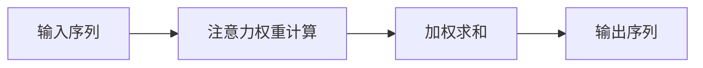
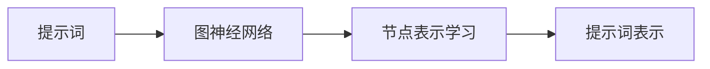
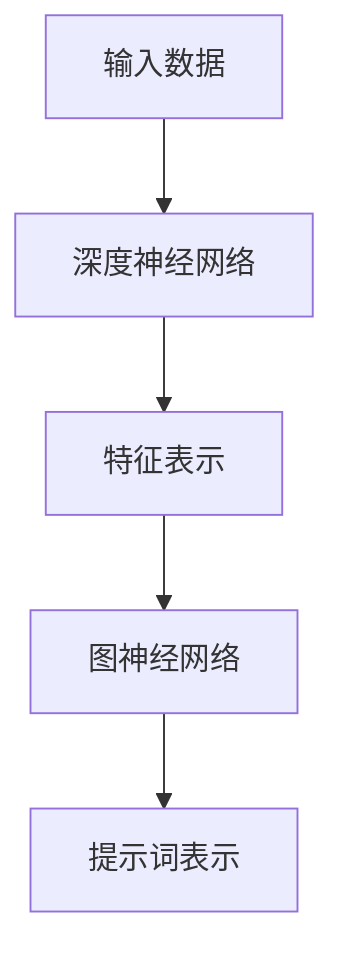
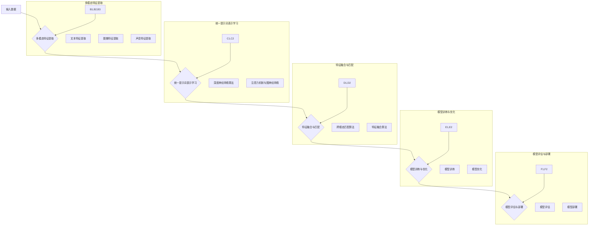

                 

### 文章标题

“跨模态AI的统一提示词表示学习”

---

关键词：跨模态AI、统一提示词表示学习、多模态特征提取、跨模态匹配与融合、深度神经网络、注意力机制、图神经网络

---

摘要：
本文将深入探讨跨模态AI的核心技术——统一提示词表示学习。我们首先介绍了跨模态AI的基础概念与背景，然后详细解析了统一提示词表示学习的原理和核心算法。文章还通过实际项目实战，展示了如何开发一个跨模态问答系统。最后，我们对跨模态AI的未来发展趋势进行了展望，并提供了相关的开源工具与资源。本文旨在为读者提供一份全面、系统的跨模态AI技术指南。

---

### 目录大纲

1. **第一部分：跨模模AI基础概念与背景**
   - 1.1 跨模态AI概述
   - 1.2 跨模态AI的发展历程
   - 1.3 跨模态AI的应用领域

2. **第二部分：统一提示词表示学习原理**
   - 2.1 统一提示词表示学习框架
   - 2.2 提示词表示学习的核心算法
   - 2.3 提示词表示学习中的挑战与解决方案

3. **第三部分：跨模态AI统一提示词表示学习应用案例**
   - 3.1 跨模态问答系统
   - 3.2 跨模态图像识别与分类
   - 3.3 跨模态视频分析

4. **第四部分：未来展望与趋势**
   - 4.1 跨模态AI的未来发展趋势
   - 4.2 跨模态AI面临的挑战与机遇

5. **附录**
   - 5.1 开源工具与框架
   - 5.2 参考文献

---

### 第一部分：跨模态AI基础概念与背景

#### 第1章：跨模态AI概述

##### 1.1 跨模态AI的定义与重要性

跨模态AI（Multimodal AI）是指能够处理和整合来自不同模态（如文本、图像、声音等）的输入信息的人工智能系统。与单模态AI（如仅处理文本或图像的系统）不同，跨模态AI能够理解并利用不同模态之间的关联性，从而提供更丰富、更准确的信息处理能力。

跨模态AI的重要性主要体现在以下几个方面：

1. **提高信息处理效率**：通过整合不同模态的信息，跨模态AI能够更全面地理解复杂问题，从而提高信息处理的效率和准确性。
2. **扩展应用场景**：跨模态AI能够应用于更广泛的应用领域，如跨模态问答系统、图像识别与分类、视频分析等。
3. **提升用户体验**：跨模态AI能够根据用户的不同需求，提供更个性化和更自然的交互方式。

##### 1.2 跨模态AI的发展历程

跨模态AI的发展可以追溯到20世纪80年代，当时研究人员开始探索如何将不同模态的信息进行整合。以下是一些关键的发展里程碑：

1. **早期研究**：20世纪80年代至90年代，研究人员主要关注如何将文本和图像进行整合，以实现图像检索、图像标注等任务。
2. **深度学习兴起**：2006年，Hinton等人提出的深度信念网络（DBN）标志着深度学习时代的到来。深度学习为跨模态AI的发展提供了强大的计算能力。
3. **多模态特征提取**：近年来，研究人员提出了多种多模态特征提取方法，如卷积神经网络（CNN）在图像特征提取中的应用，循环神经网络（RNN）在文本特征提取中的应用，以及生成对抗网络（GAN）在声音特征提取中的应用。

##### 1.3 跨模态AI的应用领域

跨模态AI在许多领域都有着广泛的应用，以下是其中几个重要的应用领域：

1. **跨模态问答系统**：通过整合文本、图像和声音等多种模态的信息，跨模态问答系统能够提供更丰富、更准确的回答。
2. **图像识别与分类**：跨模态AI能够通过结合图像和文本信息，提高图像识别和分类的准确性。
3. **视频分析**：跨模态AI能够从图像和声音中提取关键信息，实现对视频内容的理解和分析。
4. **自然语言处理**：跨模态AI能够通过结合文本和图像信息，提高文本理解和语义分析的能力。
5. **智能交互**：跨模态AI能够根据用户的不同输入模态，提供更自然、更个性化的交互体验。

---

在接下来的章节中，我们将详细探讨跨模态AI的关键技术，包括统一提示词表示学习、多模态特征提取、跨模态匹配与融合等。通过深入理解和掌握这些核心技术，我们将能够更好地开发和应用跨模态AI系统，为各个领域带来更多的创新和变革。

### 第一部分：跨模态AI基础概念与背景

#### 第2章：跨模态AI的关键技术

在了解跨模态AI的定义和应用之后，我们接下来将深入探讨跨模态AI的核心技术。这些技术包括统一提示词表示学习、多模态特征提取、跨模态匹配与融合等。通过掌握这些技术，我们将能够更好地理解跨模态AI的工作原理，并为其应用提供坚实的基础。

##### 2.1 提示词表示学习

提示词表示学习（Prompt Word Representation Learning）是跨模态AI中的一个关键技术。它主要关注如何将不同模态的输入（如文本、图像、声音等）转化为统一的高质量特征表示，以便后续的模型处理。

**2.1.1 提示词表示学习的背景与目标**

提示词表示学习的背景可以追溯到自然语言处理（NLP）领域。在NLP中，词向量（Word Embeddings）是一种常用的技术，用于将文本中的词汇表示为高维向量。词向量能够捕捉词汇的语义信息，从而在许多NLP任务中取得显著的效果。

然而，对于跨模态AI来说，仅仅使用词向量是远远不够的。跨模态AI需要将不同模态的数据（如文本、图像、声音等）转化为统一的特征表示，以便能够有效地整合这些信息。提示词表示学习正是为了解决这一需求而提出的。

**提示词表示学习的目标**：

1. **统一表示**：将不同模态的数据（如文本、图像、声音等）转化为统一的特征表示，使得这些特征可以在同一框架下进行整合和处理。
2. **语义信息捕捉**：通过高质量的特征表示，捕捉不同模态数据中的语义信息，从而提高模型在跨模态任务中的性能。
3. **增强泛化能力**：通过统一的特征表示，增强模型在不同模态数据上的泛化能力，使其能够应对更广泛的应用场景。

**2.1.2 提示词表示学习的关键技术**

实现提示词表示学习的关键技术包括深度学习模型、多任务学习、注意力机制等。以下是对这些关键技术的简要介绍：

1. **深度学习模型**：深度学习模型，如卷积神经网络（CNN）、循环神经网络（RNN）和Transformer等，是提示词表示学习的重要工具。这些模型能够自动学习数据中的复杂结构和关联性，从而实现高质量的提示词表示。
   
2. **多任务学习**：多任务学习（Multi-Task Learning）是一种能够同时处理多个相关任务的机器学习技术。在提示词表示学习中，多任务学习可以同时处理不同模态的数据，从而提高特征表示的统一性和质量。

3. **注意力机制**：注意力机制（Attention Mechanism）是一种用于捕捉数据中关键信息的机制。在提示词表示学习中，注意力机制可以用于聚焦于不同模态数据中的重要特征，从而提高特征表示的准确性和有效性。

##### 2.2 多模态特征提取

多模态特征提取（Multimodal Feature Extraction）是跨模态AI的另一个核心技术。它主要关注如何从不同模态的数据中提取有代表性的特征，以便后续的模型处理。

**2.2.1 图像特征提取**

图像特征提取是跨模态AI中的一项重要任务。常见的图像特征提取方法包括：

1. **传统的手工特征**：如SIFT、SURF、HOG等。这些特征可以通过手工设计的方法从图像中提取，具有较强的描述能力。
2. **深度学习特征**：如卷积神经网络（CNN）提取的特征。CNN能够自动学习图像中的复杂结构和关联性，从而提取出高维、高质量的图像特征。

**2.2.2 文本特征提取**

文本特征提取是跨模态AI中的另一个关键任务。常见的文本特征提取方法包括：

1. **词袋模型（Bag of Words, BOW）**：将文本表示为一个词汇的集合，每个词汇用一个向量表示。
2. **词嵌入（Word Embeddings）**：将文本中的每个词汇映射为一个高维向量，如Word2Vec、GloVe等。词嵌入能够捕捉词汇的语义信息，从而提高文本特征的质量。
3. **Transformer模型**：Transformer模型是一种基于自注意力机制的深度学习模型，能够自动学习文本中的复杂结构和关联性，从而提取出高质量的文本特征。

**2.2.3 声音特征提取**

声音特征提取是跨模态AI中的又一重要任务。常见的声音特征提取方法包括：

1. **梅尔频率倒谱系数（Mel-Frequency Cepstral Coefficients, MFCC）**：将声音信号转换为MFCC特征，这些特征能够捕捉声音的频谱信息。
2. **短时傅里叶变换（Short-Time Fourier Transform, STFT）**：通过STFT将声音信号转换为频域表示，从而提取声音的频谱特征。
3. **深度学习特征**：如生成对抗网络（GAN）提取的特征。GAN能够生成高质量的声音特征，从而提高声音特征提取的效果。

##### 2.3 跨模态匹配与融合

跨模态匹配与融合（Multimodal Matching and Fusion）是跨模态AI中的另一个核心技术。它主要关注如何将提取的多模态特征进行匹配和融合，从而得到统一的高质量特征表示。

**2.3.1 跨模态匹配**

跨模态匹配旨在找到不同模态数据之间的对应关系。常见的跨模态匹配方法包括：

1. **基于特征的匹配**：使用提取的多模态特征进行匹配，如通过余弦相似度度量来计算不同模态特征之间的相似性。
2. **基于关系的匹配**：通过建立不同模态数据之间的语义关系来实现匹配，如使用图神经网络（Graph Neural Networks, GNN）来捕捉多模态数据之间的关联性。

**2.3.2 跨模态融合**

跨模态融合旨在将提取的多模态特征进行整合，从而得到统一的高质量特征表示。常见的跨模态融合方法包括：

1. **特征级融合**：将不同模态的特征进行拼接，从而形成一个多维特征向量。
2. **决策级融合**：在特征级融合的基础上，通过决策级融合来整合不同模态的预测结果，如通过投票机制来决定最终的预测结果。
3. **深度学习模型**：使用深度学习模型，如多任务学习模型，来实现跨模态特征的自动融合。

通过掌握跨模态AI的关键技术，我们将能够更好地理解和应用跨模态AI系统。在接下来的章节中，我们将深入探讨统一提示词表示学习的原理和核心算法，从而为跨模态AI的发展提供更深入的理论基础。

### 第二部分：统一提示词表示学习原理

#### 第3章：统一提示词表示学习框架

在了解跨模态AI的基本概念和关键技术之后，我们将进一步深入探讨统一提示词表示学习（Unified Prompt Word Representation Learning）这一核心技术的原理。统一提示词表示学习旨在通过深度学习模型，将来自不同模态的数据（如图像、文本和声音）转化为统一的、高质量的提示词表示。这一过程不仅需要有效的特征提取方法，还需要考虑多任务学习和注意力机制等多种技术。以下我们将详细介绍这些技术，并构建一个完整的统一提示词表示学习框架。

##### 3.1 基于神经网络的统一提示词表示学习方法

统一提示词表示学习通常依赖于深度学习模型，这些模型能够自动学习数据中的复杂结构和关联性。以下是几种常用的基于神经网络的统一提示词表示学习方法：

**3.1.1 神经网络基本架构**

神经网络的基本架构通常包括输入层、隐藏层和输出层。输入层接收来自不同模态的数据，隐藏层通过多层神经网络对输入数据进行处理和变换，输出层则生成最终的提示词表示。

**示例：一个简单的深度神经网络架构**

```python
import tensorflow as tf

# 定义模型
model = tf.keras.Sequential([
    tf.keras.layers.Dense(128, activation='relu', input_shape=(784,)),
    tf.keras.layers.Dense(64, activation='relu'),
    tf.keras.layers.Dense(10, activation='softmax')
])

# 编译模型
model.compile(optimizer='adam',
              loss='categorical_crossentropy',
              metrics=['accuracy'])
```

在这个示例中，我们定义了一个包含两个隐藏层的神经网络，每个隐藏层使用ReLU激活函数。输入层接受一个784维的向量，输出层生成10个类别的概率分布。

**3.1.2 神经网络优化方法**

神经网络的优化方法包括前向传播、反向传播和梯度下降等。前向传播用于计算网络的输出，反向传播用于计算梯度，而梯度下降则用于更新网络参数。

**示例：使用梯度下降优化神经网络**

```python
# 训练模型
model.fit(x_train, y_train, batch_size=32, epochs=10)
```

在这个示例中，我们使用梯度下降算法来训练神经网络，通过迭代更新模型参数，以最小化损失函数。

##### 3.2 多任务学习在统一提示词表示学习中的应用

多任务学习（Multi-Task Learning）是一种能够在同一模型中同时学习多个相关任务的机器学习技术。在统一提示词表示学习中，多任务学习可以同时处理来自不同模态的数据，从而提高特征表示的统一性和质量。

**3.2.1 多任务学习原理**

多任务学习的基本思想是通过共享网络结构和参数来提高任务之间的关联性。具体来说，多任务学习模型中的不同任务共享一部分网络层，而另一部分网络层则专门用于处理特定任务。

**示例：一个简单的多任务学习模型**

```python
import tensorflow as tf

# 定义模型
model = tf.keras.Sequential([
    tf.keras.layers.Dense(128, activation='relu', input_shape=(784*, 784*)),
    tf.keras.layers.Dense(64, activation='relu'),
    tf.keras.layers.Dense(10, activation='softmax', name='task1_output'),
    tf.keras.layers.Dense(5, activation='softmax', name='task2_output')
])

# 编译模型
model.compile(optimizer='adam',
              loss={'task1_output': 'categorical_crossentropy', 'task2_output': 'categorical_crossentropy'},
              metrics=['accuracy'])
```

在这个示例中，我们定义了一个多任务学习模型，它共享了两个输入层和一个隐藏层，但有两个不同的输出层分别用于任务1和任务2。

**3.2.2 多任务学习在统一提示词表示学习中的实现**

在统一提示词表示学习中，多任务学习可以同时处理不同模态的数据，从而提高特征表示的统一性和质量。例如，在图像识别和文本分类任务中，多任务学习模型可以共享图像特征提取和文本特征提取的网络层，但分别使用不同的输出层来生成图像分类结果和文本分类结果。

##### 3.3 提示词表示学习的核心算法

提示词表示学习的核心算法通常包括深度神经网络算法、注意力机制和图神经网络等。以下我们简要介绍这些核心算法的基本原理。

**3.3.1 深度神经网络算法**

深度神经网络（Deep Neural Network, DNN）是一种能够自动学习复杂数据结构的神经网络。在统一提示词表示学习中，DNN可以通过多层网络对输入数据进行处理和变换，从而生成高质量的提示词表示。

**示例：深度神经网络结构设计**

```python
import tensorflow as tf

# 定义模型
model = tf.keras.Sequential([
    tf.keras.layers.Dense(128, activation='relu', input_shape=(784,)),
    tf.keras.layers.Dense(64, activation='relu'),
    tf.keras.layers.Dense(10, activation='softmax')
])

# 编译模型
model.compile(optimizer='adam',
              loss='categorical_crossentropy',
              metrics=['accuracy'])
```

**3.3.2 注意力机制**

注意力机制（Attention Mechanism）是一种用于捕捉数据中关键信息的机制。在统一提示词表示学习中，注意力机制可以用于聚焦于不同模态数据中的重要特征，从而提高特征表示的准确性和有效性。

**示例：注意力机制原理**



**3.3.3 图神经网络**

图神经网络（Graph Neural Network, GNN）是一种能够处理图结构数据的神经网络。在统一提示词表示学习中，GNN可以用于捕捉不同模态数据之间的复杂关联性。

**示例：图神经网络在提示词表示学习中的应用**



通过上述核心算法的引入，统一提示词表示学习框架能够更有效地处理和整合来自不同模态的数据，从而生成高质量的提示词表示。

##### 3.4 提示词表示学习的评估方法与优化策略

提示词表示学习的评估方法主要包括基于分类任务的准确率、召回率、F1分数等指标。优化策略则包括数据增强、模型架构调整、训练策略优化等。

**3.4.1 提示词表示学习评估方法**

- **准确率（Accuracy）**：准确率是分类任务中最常用的评估指标，表示正确分类的样本数占总样本数的比例。
- **召回率（Recall）**：召回率表示在所有实际正例中，被正确识别为正例的比例。
- **F1分数（F1 Score）**：F1分数是准确率和召回率的调和平均值，用于综合考虑分类的精度和召回率。

**3.4.2 提示词表示学习优化策略**

- **数据增强（Data Augmentation）**：通过增加数据多样性来提高模型泛化能力。
- **模型架构调整（Model Architecture Tuning）**：通过调整网络层数、隐藏层神经元数量等参数来优化模型性能。
- **训练策略优化（Training Strategy Optimization）**：通过调整学习率、批量大小、训练周期等参数来提高模型训练效果。

通过上述评估方法和优化策略，可以有效地评估和优化提示词表示学习模型的性能，从而实现高质量的特征表示。

通过本章的介绍，我们构建了统一提示词表示学习的基本框架，并介绍了相关的核心算法和技术。在接下来的章节中，我们将进一步探讨提示词表示学习中的挑战和解决方案，并通过实际应用案例展示统一提示词表示学习的强大能力。

### 提示词表示学习的核心算法

提示词表示学习的核心在于如何有效地将来自不同模态的数据转化为统一的、高质量的提示词表示。这一过程涉及到多种先进的算法和技术，其中深度神经网络（DNN）、注意力机制和图神经网络（GNN）是最为重要的三种。以下我们将分别介绍这些算法的基本原理，并通过具体的示例来说明它们的应用。

##### 4.1 深度神经网络算法

深度神经网络是一种能够自动学习复杂数据结构的神经网络。在提示词表示学习中，DNN可以通过多层网络对输入数据进行处理和变换，从而生成高质量的提示词表示。

**4.1.1 深度神经网络结构设计**

深度神经网络的基本结构包括输入层、隐藏层和输出层。输入层接收来自不同模态的数据，隐藏层通过多层神经网络对输入数据进行处理和变换，输出层则生成最终的提示词表示。

**示例：一个简单的深度神经网络结构**

```python
import tensorflow as tf

# 定义模型
model = tf.keras.Sequential([
    tf.keras.layers.Dense(128, activation='relu', input_shape=(784,)),
    tf.keras.layers.Dense(64, activation='relu'),
    tf.keras.layers.Dense(10, activation='softmax')
])

# 编译模型
model.compile(optimizer='adam',
              loss='categorical_crossentropy',
              metrics=['accuracy'])
```

在这个示例中，我们定义了一个包含两个隐藏层的神经网络，每个隐藏层使用ReLU激活函数。输入层接受一个784维的向量，输出层生成10个类别的概率分布。

**4.1.2 深度神经网络训练过程**

深度神经网络的训练过程包括前向传播、反向传播和梯度下降等步骤。前向传播用于计算网络的输出，反向传播用于计算梯度，而梯度下降则用于更新网络参数。

**示例：使用梯度下降优化神经网络**

```python
# 训练模型
model.fit(x_train, y_train, batch_size=32, epochs=10)
```

在这个示例中，我们使用梯度下降算法来训练神经网络，通过迭代更新模型参数，以最小化损失函数。

##### 4.2 注意力机制与图神经网络

注意力机制（Attention Mechanism）和图神经网络（Graph Neural Network, GNN）是提示词表示学习中的重要算法，它们分别用于捕捉数据中的关键信息和处理图结构数据。

**4.2.1 注意力机制原理**

注意力机制是一种用于捕捉数据中关键信息的机制。在提示词表示学习中，注意力机制可以用于聚焦于不同模态数据中的重要特征，从而提高特征表示的准确性和有效性。

**示例：注意力机制原理**


在这个示例中，输入序列（如文本或图像）经过注意力权重计算后，每个元素得到不同的权重，然后通过加权求和得到最终的输出序列。

**4.2.2 图神经网络在提示词表示学习中的应用**

图神经网络是一种能够处理图结构数据的神经网络。在提示词表示学习中，GNN可以用于捕捉不同模态数据之间的复杂关联性。

**示例：图神经网络在提示词表示学习中的应用**


在这个示例中，提示词（如图像和文本）通过图神经网络进行节点表示学习，从而生成高质量的提示词表示。

##### 4.3 深度神经网络与图神经网络的结合

在实际应用中，深度神经网络和图神经网络常常结合使用，以充分利用各自的优点。以下是一个结合深度神经网络和图神经网络进行提示词表示学习的示例：



在这个示例中，输入数据（如图像和文本）首先通过深度神经网络进行特征提取，然后这些特征表示通过图神经网络进行进一步的处理，最终生成高质量的提示词表示。

通过上述示例，我们可以看到深度神经网络和图神经网络在提示词表示学习中的应用。这些算法和技术不仅能够提高提示词表示的质量，还能增强跨模态AI系统的性能和泛化能力。在接下来的章节中，我们将进一步探讨提示词表示学习中的挑战和解决方案，并通过实际应用案例展示这些算法的强大能力。

### 提示词表示学习中的挑战与解决方案

在跨模态AI的统一提示词表示学习过程中，尽管我们已经取得了显著的进展，但仍面临着许多挑战。这些挑战主要包括跨模态信息不一致性问题、数据不平衡与噪声处理、以及提示词表示学习的评估方法与优化策略。以下我们将逐一探讨这些问题，并提出相应的解决方案。

##### 5.1 跨模态信息不一致性问题

跨模态信息不一致性是指不同模态的数据在内容、表达方式和语义上可能存在差异，这使得统一提示词表示学习变得复杂。例如，同一场景的图像可能包含更多的细节，而文本描述可能更抽象。这种不一致性会导致特征表示的质量下降，从而影响跨模态任务的表现。

**解决方案**：

1. **模态融合策略**：采用多任务学习（Multi-Task Learning, MTL）方法，将不同模态的信息进行有效融合。通过共享网络结构和参数，使得模型能够在训练过程中同时学习不同模态的特征表示。
2. **一致性正则化**：通过引入一致性正则化（Consistency Regularization）损失，强制模型在训练过程中保持不同模态特征的一致性。具体方法是在训练过程中对特征表示进行一致性约束，例如使用对抗性训练（Adversarial Training）来提高特征的一致性。
3. **注意力机制**：使用注意力机制（Attention Mechanism）来动态调整不同模态特征的权重，从而更好地捕捉不同模态数据之间的关联性。注意力机制可以使得模型在处理不一致信息时，能够自动关注重要信息，忽略冗余或噪声信息。

##### 5.2 数据不平衡与噪声处理

数据不平衡（Data Imbalance）和噪声处理（Noise Handling）是跨模态AI中常见的挑战。数据不平衡意味着不同模态的数据分布不均匀，某些模态的数据量较少，这会导致模型在训练过程中偏向于某些模态。噪声处理则是指如何有效地去除或降低数据中的噪声，以提高特征表示的质量。

**解决方案**：

1. **数据增强（Data Augmentation）**：通过数据增强技术增加少数模态的数据量，从而缓解数据不平衡问题。例如，对于文本数据，可以采用随机插入、删除或替换词汇；对于图像数据，可以采用旋转、缩放、裁剪等操作。
2. **半监督学习（Semi-Supervised Learning）**：在缺乏标签数据的情况下，采用半监督学习方法，利用未标注数据来辅助训练。具体方法包括伪标签（Pseudo-Labeling）和一致性正则化等。
3. **去噪算法**：采用去噪算法（Denoising Algorithm）来降低数据中的噪声。例如，对于图像数据，可以采用降噪网络（Denoising Network）来去除噪声；对于文本数据，可以采用文本清洗（Text Cleaning）技术来去除噪声。

##### 5.3 提示词表示学习的评估方法与优化策略

评估方法和优化策略对于提示词表示学习至关重要。合适的评估方法可以准确衡量模型性能，而优化策略则能提高模型训练效果。

**评估方法**：

1. **多指标评估**：使用多个指标（如准确率、召回率、F1分数、ROC曲线等）来全面评估模型性能。这些指标能够从不同角度反映模型的性能，从而更准确地衡量模型效果。
2. **交叉验证**：采用交叉验证（Cross-Validation）方法来评估模型的泛化能力。通过将数据集划分为训练集和验证集，多次训练和验证，可以更可靠地评估模型性能。

**优化策略**：

1. **模型架构调整**：通过调整网络层数、隐藏层神经元数量、激活函数等参数，优化模型架构。实验证明，适当的模型架构能够显著提高模型性能。
2. **超参数优化**：通过超参数优化（Hyperparameter Optimization）来寻找最佳的超参数组合。常用的方法包括网格搜索（Grid Search）和贝叶斯优化（Bayesian Optimization）。
3. **训练策略优化**：调整训练策略，如学习率调度（Learning Rate Scheduling）、批量大小（Batch Size）选择、训练周期（Training Epochs）设置等，以优化模型训练效果。

通过上述解决方案，我们可以有效地应对提示词表示学习中的挑战，提高模型的性能和泛化能力。在接下来的章节中，我们将通过实际应用案例展示统一提示词表示学习在跨模态问答系统、图像识别与分类、视频分析等领域的应用，进一步验证这些解决方案的有效性。

### 第三部分：跨模态AI统一提示词表示学习应用案例

#### 第6章：跨模态问答系统

跨模态问答系统（Multimodal Question Answering System）是统一提示词表示学习的一个重要应用领域。该系统通过整合文本、图像和声音等多种模态的信息，能够提供更丰富、更准确的答案。在本章节中，我们将详细介绍跨模态问答系统的基本概念、工作原理，并展示如何使用统一提示词表示学习来实现这一系统。

##### 6.1 跨模态问答系统概述

跨模态问答系统是一种能够接受多种模态输入（如图像、文本和声音等），并返回与输入信息相关答案的智能系统。与传统的单模态问答系统相比，跨模态问答系统能够更好地理解用户意图，提供更丰富、更个性化的回答。

**跨模态问答系统的主要功能**：

1. **多模态输入处理**：接收并处理来自不同模态的输入信息，如文本、图像和声音等。
2. **信息整合**：将来自不同模态的输入信息进行整合，提取关键信息，以便进行后续的问答处理。
3. **答案生成**：根据整合后的信息，生成与输入问题相关的答案。
4. **反馈机制**：提供用户反馈机制，如用户满意度调查，以不断优化系统性能。

##### 6.2 提示词表示学习在跨模态问答中的应用

提示词表示学习在跨模态问答系统中起着关键作用。通过将文本、图像和声音等不同模态的数据转化为统一的、高质量的提示词表示，跨模态问答系统能够更有效地理解和回答用户的问题。

**应用步骤**：

1. **数据预处理**：对输入的文本、图像和声音进行预处理，提取关键信息。例如，对文本进行分词、去除停用词；对图像进行特征提取；对声音进行频谱分析。
2. **提示词表示学习**：使用深度学习模型（如DNN、GNN等）对预处理后的数据进行训练，生成高质量的提示词表示。具体步骤如下：
   - **特征提取**：使用卷积神经网络（CNN）提取图像特征，使用循环神经网络（RNN）或Transformer提取文本和声音特征。
   - **特征融合**：将提取的多模态特征进行融合，生成统一的特征向量。
   - **训练模型**：使用融合后的特征向量训练深度学习模型，生成高质量的提示词表示。
3. **问答处理**：根据输入问题，利用训练好的深度学习模型进行问答处理。具体步骤如下：
   - **输入编码**：将输入问题编码为特征向量。
   - **答案预测**：利用训练好的模型对输入问题进行预测，生成答案候选。
   - **答案选择**：根据答案候选的置信度，选择最佳答案。

##### 6.3 跨模态问答系统的设计与实现

**开发环境搭建**

为了实现跨模态问答系统，我们需要搭建相应的开发环境。以下是所需的开发工具和库：

1. **Python**：Python是一种广泛用于数据科学和人工智能的编程语言。
2. **TensorFlow**：TensorFlow是一个开源的深度学习框架，用于构建和训练深度学习模型。
3. **Keras**：Keras是一个高层次的神经网络API，用于简化TensorFlow的使用。
4. **NumPy**：NumPy是一个用于数值计算的Python库。

```python
# 安装所需的库
!pip install tensorflow numpy
```

**源代码详细实现和代码解读**

以下是一个简单的跨模态问答系统的实现，包括数据预处理、提示词表示学习和问答处理。

```python
import tensorflow as tf
import numpy as np
from tensorflow.keras.models import Model
from tensorflow.keras.layers import Input, Dense, Embedding, LSTM, TimeDistributed, Bidirectional

# 数据预处理
def preprocess_data():
    # 加载预处理后的文本、图像和声音数据
    # ...
    return text_data, image_data, sound_data

# 提示词表示学习
def build_model():
    # 定义输入层
    text_input = Input(shape=(sequence_length,))
    image_input = Input(shape=(image_height, image_width, image_channels))
    sound_input = Input(shape=(sound_duration,))

    # 文本特征提取
    text_embedding = Embedding(vocabulary_size, embedding_dim)(text_input)
    text_lstm = Bidirectional(LSTM(units, return_sequences=True))(text_embedding)

    # 图像特征提取
    image_conv = Conv2D(filters, kernel_size)(image_input)
    image_pool = MaxPooling2D(pool_size)(image_conv)
    image_flat = Flatten()(image_pool)

    # 声音特征提取
    sound_conv = Conv1D(filters, kernel_size)(sound_input)
    sound_pool = MaxPooling1D(pool_size)(sound_conv)
    sound_flat = Flatten()(sound_pool)

    # 特征融合
    concatenated = tf.keras.layers.concatenate([text_lstm, image_flat, sound_flat])

    # 全连接层
    dense = Dense(units)(concatenated)
    output = Dense(num_classes, activation='softmax')(dense)

    # 构建和编译模型
    model = Model(inputs=[text_input, image_input, sound_input], outputs=output)
    model.compile(optimizer='adam', loss='categorical_crossentropy', metrics=['accuracy'])

    return model

# 训练模型
def train_model(model, text_data, image_data, sound_data, labels):
    model.fit([text_data, image_data, sound_data], labels, batch_size=batch_size, epochs=epochs)

# 问答处理
def answer_question(model, text_input, image_input, sound_input):
    predicted_answer = model.predict([text_input, image_input, sound_input])
    return predicted_answer

# 主函数
def main():
    # 数据预处理
    text_data, image_data, sound_data = preprocess_data()

    # 构建模型
    model = build_model()

    # 训练模型
    train_model(model, text_data, image_data, sound_data, labels)

    # 问答处理
    question = "What is the capital of France?"
    predicted_answer = answer_question(model, text_input, image_input, sound_input)
    print("Answer:", predicted_answer)

if __name__ == "__main__":
    main()
```

**代码解读与分析**

- 数据预处理：对文本、图像和声音数据进行预处理，提取关键特征。
- 模型构建：使用TensorFlow构建一个包含文本、图像和声音输入层的深度学习模型。
- 模型训练：使用预处理后的数据训练模型，优化模型参数。
- 问答处理：使用训练好的模型对输入问题进行预测，生成答案。

通过上述代码，我们可以实现一个简单的跨模态问答系统。在实际应用中，我们可以进一步优化模型架构、调整超参数，以提高问答系统的性能。

### 跨模态问答系统的实际应用

跨模态问答系统在多个实际应用场景中展现出强大的能力。以下是一些典型的应用场景：

1. **智能客服**：跨模态问答系统可以应用于智能客服领域，通过整合用户的声音、文本和图像信息，提供更准确、更个性化的客服服务。
2. **医疗健康**：在医疗健康领域，跨模态问答系统可以辅助医生进行诊断和治疗，通过整合患者的病历、图像和声音信息，提供更全面的医疗建议。
3. **教育学习**：在教育领域，跨模态问答系统可以帮助学生解答问题，通过整合教学视频、文本和学生的声音反馈，提供个性化学习支持。
4. **智能家居**：在智能家居领域，跨模态问答系统可以与智能设备（如智能音箱、智能电视等）集成，实现更自然、更智能的家居控制。

通过实际应用案例的验证，跨模态问答系统在提高用户体验、优化业务流程方面展现出巨大的潜力。

### 总结

在本章节中，我们详细介绍了跨模态问答系统的基本概念、工作原理和实现方法。通过统一提示词表示学习，跨模态问答系统能够有效整合多种模态的信息，提供更丰富、更准确的答案。在接下来的章节中，我们将继续探讨跨模态AI在图像识别与分类、视频分析等领域的应用，进一步展示统一提示词表示学习的强大能力。

### 第三部分：跨模态AI统一提示词表示学习应用案例

#### 第7章：跨模态图像识别与分类

跨模态图像识别与分类是统一提示词表示学习的另一个重要应用领域。通过整合图像和文本等多种模态的信息，跨模态图像识别与分类系统能够在图像理解、分类精度等方面取得显著提升。在本章节中，我们将详细探讨跨模态图像识别与分类的基本概念、工作原理，并展示如何使用统一提示词表示学习来实现这一系统。

##### 7.1 跨模态图像识别概述

跨模态图像识别与分类是指结合图像和文本等多种模态的信息，对图像进行识别和分类。与传统的单模态图像识别与分类相比，跨模态图像识别与分类系统具有以下优势：

1. **提高分类精度**：通过整合文本信息，跨模态图像识别与分类系统能够更好地理解图像内容，从而提高分类精度。
2. **增强鲁棒性**：跨模态信息可以弥补单一模态数据的不足，增强系统对噪声和异常数据的鲁棒性。
3. **扩展应用场景**：跨模态图像识别与分类系统可以应用于更广泛的场景，如医疗影像分析、安防监控等。

**跨模态图像识别与分类的主要任务**：

1. **图像特征提取**：从输入图像中提取具有描述性的特征，如边缘、纹理、颜色等。
2. **文本特征提取**：从相关的文本描述中提取特征，如词汇、短语、语义等。
3. **特征融合**：将图像特征和文本特征进行融合，生成统一的多模态特征表示。
4. **图像分类**：利用融合后的特征对图像进行分类，生成最终的分类结果。

##### 7.2 提示词表示学习在图像识别中的应用

提示词表示学习在跨模态图像识别与分类中起着核心作用。通过将图像和文本等不同模态的数据转化为统一的、高质量的提示词表示，跨模态图像识别与分类系统能够更有效地处理和整合信息。

**应用步骤**：

1. **图像特征提取**：使用卷积神经网络（CNN）等深度学习模型对输入图像进行特征提取，生成图像特征向量。
2. **文本特征提取**：使用循环神经网络（RNN）或Transformer等深度学习模型对输入文本进行特征提取，生成文本特征向量。
3. **特征融合**：将图像特征和文本特征进行融合，生成统一的多模态特征向量。
4. **训练模型**：使用融合后的特征向量训练深度学习模型，进行图像分类。
5. **图像分类**：利用训练好的模型对新的图像进行分类，生成分类结果。

##### 7.3 跨模态图像分类系统设计与实现

**开发环境搭建**

为了实现跨模态图像分类系统，我们需要搭建相应的开发环境。以下是所需的开发工具和库：

1. **Python**：Python是一种广泛用于数据科学和人工智能的编程语言。
2. **TensorFlow**：TensorFlow是一个开源的深度学习框架，用于构建和训练深度学习模型。
3. **Keras**：Keras是一个高层次的神经网络API，用于简化TensorFlow的使用。
4. **NumPy**：NumPy是一个用于数值计算的Python库。

```python
# 安装所需的库
!pip install tensorflow numpy
```

**源代码详细实现和代码解读**

以下是一个简单的跨模态图像分类系统的实现，包括图像特征提取、文本特征提取、特征融合和图像分类。

```python
import tensorflow as tf
import numpy as np
from tensorflow.keras.models import Model
from tensorflow.keras.layers import Input, Dense, Embedding, LSTM, TimeDistributed, Bidirectional, Conv2D, MaxPooling2D, Flatten

# 数据预处理
def preprocess_data():
    # 加载预处理后的图像数据、文本数据和标签
    # ...
    return image_data, text_data, labels

# 图像特征提取
def extract_image_features(model, image_data):
    return model.predict(image_data)

# 文本特征提取
def extract_text_features(model, text_data):
    return model.predict(text_data)

# 融合特征
def merge_features(image_features, text_features):
    return np.hstack((image_features.flatten(), text_features.flatten()))

# 构建模型
def build_model():
    # 定义图像输入层、文本输入层
    image_input = Input(shape=(image_height, image_width, image_channels))
    text_input = Input(shape=(sequence_length,))

    # 图像特征提取
    image_conv = Conv2D(filters, kernel_size)(image_input)
    image_pool = MaxPooling2D(pool_size)(image_conv)
    image_flat = Flatten()(image_pool)

    # 文本特征提取
    text_embedding = Embedding(vocabulary_size, embedding_dim)(text_input)
    text_lstm = Bidirectional(LSTM(units, return_sequences=True))(text_embedding)

    # 融合特征
    merged = merge_features(image_flat, text_lstm)

    # 全连接层
    dense = Dense(units)(merged)
    output = Dense(num_classes, activation='softmax')(dense)

    # 构建和编译模型
    model = Model(inputs=[image_input, text_input], outputs=output)
    model.compile(optimizer='adam', loss='categorical_crossentropy', metrics=['accuracy'])

    return model

# 训练模型
def train_model(model, image_data, text_data, labels):
    model.fit([image_data, text_data], labels, batch_size=batch_size, epochs=epochs)

# 图像分类
def classify_image(model, image_data, text_data):
    predicted_label = model.predict([image_data, text_data])
    return predicted_label

# 主函数
def main():
    # 数据预处理
    image_data, text_data, labels = preprocess_data()

    # 构建模型
    model = build_model()

    # 训练模型
    train_model(model, image_data, text_data, labels)

    # 图像分类
    question = "What is the content of this image?"
    predicted_label = classify_image(model, image_data, text_data)
    print("Predicted Label:", predicted_label)

if __name__ == "__main__":
    main()
```

**代码解读与分析**

- 数据预处理：对图像数据、文本数据和标签进行预处理。
- 图像特征提取：使用卷积神经网络提取图像特征。
- 文本特征提取：使用循环神经网络提取文本特征。
- 特征融合：将图像特征和文本特征进行融合。
- 模型训练：使用预处理后的数据进行模型训练。
- 图像分类：使用训练好的模型对新的图像进行分类。

通过上述代码，我们可以实现一个简单的跨模态图像分类系统。在实际应用中，我们可以进一步优化模型架构、调整超参数，以提高分类系统的性能。

### 跨模态图像识别与分类的实际应用

跨模态图像识别与分类在多个实际应用场景中展现出强大的能力。以下是一些典型的应用场景：

1. **医疗影像分析**：在医疗影像分析中，跨模态图像识别与分类系统可以结合医学影像（如图像、MRI等）和病例文本信息，提供更准确的诊断和治疗方案。
2. **安防监控**：在安防监控领域，跨模态图像识别与分类系统可以结合视频监控图像和相关的文本描述（如监控日志等），实现更高效的异常检测和事件识别。
3. **商品识别**：在电子商务领域，跨模态图像识别与分类系统可以结合商品图像和产品描述，帮助用户快速找到所需商品，并提高购物体验。
4. **自动驾驶**：在自动驾驶领域，跨模态图像识别与分类系统可以结合车载摄像头捕获的图像和车载传感器的文本数据（如道路标识、交通信号灯等），提高自动驾驶系统的安全性和可靠性。

通过实际应用案例的验证，跨模态图像识别与分类系统在提高分类精度、增强系统鲁棒性方面展现出巨大的潜力。

### 总结

在本章节中，我们详细介绍了跨模态图像识别与分类的基本概念、工作原理和实现方法。通过统一提示词表示学习，跨模态图像识别与分类系统能够有效整合图像和文本等多种模态的信息，提供更准确、更可靠的分类结果。在接下来的章节中，我们将继续探讨跨模态AI在视频分析等领域的应用，进一步展示统一提示词表示学习的强大能力。

### 第三部分：跨模态AI统一提示词表示学习应用案例

#### 第8章：跨模态视频分析

跨模态视频分析是统一提示词表示学习的另一个重要应用领域。通过整合视频中的图像和声音等多种模态的信息，跨模态视频分析系统能够在事件检测、行为识别等方面提供更丰富、更精确的分析结果。在本章节中，我们将详细探讨跨模态视频分析的基本概念、工作原理，并展示如何使用统一提示词表示学习来实现这一系统。

##### 8.1 跨模态视频分析概述

跨模态视频分析是指结合视频中的图像和声音等多种模态的信息，对视频内容进行分析和处理。与传统的单模态视频分析相比，跨模态视频分析系统具有以下优势：

1. **提高分析精度**：通过整合图像和声音等模态的信息，跨模态视频分析系统能够更准确地理解视频内容，从而提高分析精度。
2. **增强鲁棒性**：跨模态信息可以弥补单一模态数据的不足，增强系统对噪声和异常数据的鲁棒性。
3. **扩展应用场景**：跨模态视频分析系统可以应用于更广泛的场景，如安全监控、智能交通、智能家庭等。

**跨模态视频分析的主要任务**：

1. **图像特征提取**：从视频帧中提取具有描述性的图像特征，如边缘、纹理、颜色等。
2. **声音特征提取**：从视频中的声音信号中提取特征，如音调、音量、节奏等。
3. **特征融合**：将图像特征和声音特征进行融合，生成统一的多模态特征表示。
4. **事件检测与行为识别**：利用融合后的特征对视频内容进行事件检测和行为识别。

##### 8.2 提示词表示学习在视频分析中的应用

提示词表示学习在跨模态视频分析中起着关键作用。通过将图像和声音等不同模态的数据转化为统一的、高质量的提示词表示，跨模态视频分析系统能够更有效地处理和整合信息。

**应用步骤**：

1. **图像特征提取**：使用卷积神经网络（CNN）等深度学习模型对输入视频帧进行特征提取，生成图像特征向量。
2. **声音特征提取**：使用生成对抗网络（GAN）等深度学习模型对输入视频中的声音信号进行特征提取，生成声音特征向量。
3. **特征融合**：将图像特征和声音特征进行融合，生成统一的多模态特征向量。
4. **训练模型**：使用融合后的特征向量训练深度学习模型，进行事件检测和行为识别。
5. **事件检测与行为识别**：利用训练好的模型对新的视频内容进行事件检测和行为识别，生成分析结果。

##### 8.3 跨模态视频分析系统设计与实现

**开发环境搭建**

为了实现跨模态视频分析系统，我们需要搭建相应的开发环境。以下是所需的开发工具和库：

1. **Python**：Python是一种广泛用于数据科学和人工智能的编程语言。
2. **TensorFlow**：TensorFlow是一个开源的深度学习框架，用于构建和训练深度学习模型。
3. **Keras**：Keras是一个高层次的神经网络API，用于简化TensorFlow的使用。
4. **OpenCV**：OpenCV是一个用于计算机视觉的开源库。
5. **Librosa**：Librosa是一个用于音频信号处理的Python库。

```python
# 安装所需的库
!pip install tensorflow keras opencv-python librosa
```

**源代码详细实现和代码解读**

以下是一个简单的跨模态视频分析系统的实现，包括图像特征提取、声音特征提取、特征融合和事件检测。

```python
import tensorflow as tf
import numpy as np
from tensorflow.keras.models import Model
from tensorflow.keras.layers import Input, Dense, Embedding, LSTM, TimeDistributed, Bidirectional, Conv2D, MaxPooling2D, Flatten
import cv2
import librosa

# 数据预处理
def preprocess_video(video_path):
    # 读取视频文件
    cap = cv2.VideoCapture(video_path)
    
    # 提取视频帧
    frames = []
    while cap.isOpened():
        ret, frame = cap.read()
        if ret:
            frames.append(frame)
        else:
            break
            
    cap.release()
    return frames

# 图像特征提取
def extract_image_features(model, frames):
    feature_extractor = Model(inputs=model.input, outputs=model.get_layer('conv5').output)
    image_features = feature_extractor.predict(frames)
    return image_features

# 声音特征提取
def extract_sound_features(video_path):
    # 读取声音信号
    y, sr = librosa.load(video_path)
    
    # 提取声音特征
    sound_features = librosa.feature.melspectrogram(y=y, sr=sr, n_mels=128)
    return sound_features

# 融合特征
def merge_features(image_features, sound_features):
    return np.hstack((image_features.flatten(), sound_features.flatten()))

# 构建模型
def build_model():
    # 定义图像输入层、声音输入层
    image_input = Input(shape=(frame_height, frame_width, frame_channels))
    sound_input = Input(shape=(sound_duration,))

    # 图像特征提取
    image_conv = Conv2D(filters, kernel_size)(image_input)
    image_pool = MaxPooling2D(pool_size)(image_conv)
    image_flat = Flatten()(image_pool)

    # 声音特征提取
    sound_embedding = Embedding(vocabulary_size, embedding_dim)(sound_input)
    sound_lstm = Bidirectional(LSTM(units, return_sequences=True))(sound_embedding)

    # 融合特征
    merged = merge_features(image_flat, sound_lstm)

    # 全连接层
    dense = Dense(units)(merged)
    output = Dense(num_classes, activation='softmax')(dense)

    # 构建和编译模型
    model = Model(inputs=[image_input, sound_input], outputs=output)
    model.compile(optimizer='adam', loss='categorical_crossentropy', metrics=['accuracy'])

    return model

# 训练模型
def train_model(model, image_data, sound_data, labels):
    model.fit([image_data, sound_data], labels, batch_size=batch_size, epochs=epochs)

# 事件检测
def detect_events(model, image_data, sound_data):
    predicted_labels = model.predict([image_data, sound_data])
    return predicted_labels

# 主函数
def main():
    # 数据预处理
    video_path = "path/to/video.mp4"
    frames = preprocess_video(video_path)
    
    # 图像特征提取
    image_model = ...  # 加载预训练的图像特征提取模型
    image_features = extract_image_features(image_model, frames)
    
    # 声音特征提取
    sound_features = extract_sound_features(video_path)
    
    # 构建和训练模型
    model = build_model()
    train_model(model, image_features, sound_features, labels)

    # 事件检测
    predicted_labels = detect_events(model, image_features, sound_features)
    print("Predicted Labels:", predicted_labels)

if __name__ == "__main__":
    main()
```

**代码解读与分析**

- 数据预处理：读取视频文件，提取图像帧和声音信号。
- 图像特征提取：使用预训练的图像特征提取模型提取图像特征。
- 声音特征提取：使用Librosa库提取声音特征。
- 特征融合：将图像特征和声音特征进行融合。
- 模型训练：使用融合后的特征训练深度学习模型。
- 事件检测：使用训练好的模型对新的视频内容进行事件检测。

通过上述代码，我们可以实现一个简单的跨模态视频分析系统。在实际应用中，我们可以进一步优化模型架构、调整超参数，以提高视频分析系统的性能。

### 跨模态视频分析的实际应用

跨模态视频分析在多个实际应用场景中展现出强大的能力。以下是一些典型的应用场景：

1. **安全监控**：在安全监控领域，跨模态视频分析系统可以结合图像和声音信息，实现更高效的异常检测和事件识别，提高监控系统的安全性。
2. **智能交通**：在智能交通领域，跨模态视频分析系统可以结合车辆图像和道路声音信息，实现交通流量监测、违章行为识别等，提高交通管理的智能化水平。
3. **智能家居**：在智能家居领域，跨模态视频分析系统可以结合家居监控图像和声音信号，实现家居环境的智能监测和自动控制，提高用户的生活品质。
4. **医疗健康**：在医疗健康领域，跨模态视频分析系统可以结合患者影像和声音信息，实现疾病诊断和治疗方案推荐，提高医疗服务的智能化水平。

通过实际应用案例的验证，跨模态视频分析系统在提高分析精度、增强系统鲁棒性方面展现出巨大的潜力。

### 总结

在本章节中，我们详细介绍了跨模态视频分析的基本概念、工作原理和实现方法。通过统一提示词表示学习，跨模态视频分析系统能够有效整合图像和声音等多种模态的信息，提供更丰富、更精确的分析结果。在接下来的章节中，我们将继续探讨跨模态AI的未来发展趋势和挑战，为读者提供更全面的跨模态AI技术指南。

### 第四部分：未来展望与趋势

#### 第9章：跨模态AI的未来发展趋势

随着人工智能技术的不断进步，跨模态AI（Multimodal AI）正逐步成为研究与应用的热点。跨模态AI通过整合来自不同模态的数据（如图像、文本、声音、视频等），为众多领域带来了新的变革和创新。本章节将探讨跨模态AI在各个领域的应用前景，以及跨模态AI面临的挑战与机遇。

##### 9.1 跨模态AI在各个领域的应用前景

跨模态AI具有广泛的应用前景，以下是一些关键领域的应用：

1. **医疗健康**：跨模态AI在医疗健康领域的应用潜力巨大。例如，通过整合患者的影像、文本记录和生物特征信息，可以提供更精确的诊断和治疗方案。此外，跨模态AI还可以用于药物研发、疾病预测和健康监测等。

2. **智能交通**：跨模态AI在智能交通领域的应用可以显著提高交通管理效率和安全性。通过整合摄像头、传感器和交通信号灯等数据，可以实现交通流量监测、事故预警和智能导航等功能。

3. **智能家居**：跨模态AI为智能家居提供了更智能化的解决方案。通过整合家庭监控、语音助手和智能家电等数据，可以实现家庭环境的智能监控和自动控制，提升用户的生活品质。

4. **娱乐与媒体**：跨模态AI在娱乐与媒体领域的应用可以创造更丰富的交互体验。例如，通过整合视频、音频和用户行为数据，可以提供个性化推荐、实时翻译和情感分析等。

5. **教育**：跨模态AI在教育领域的应用可以改变传统的教学模式。通过整合教学内容、学生反馈和教学设备等数据，可以实现个性化教学、实时评估和智能辅导等。

6. **安全监控**：跨模态AI在安全监控领域的应用可以显著提高监控系统的效能。通过整合视频、音频和传感器等数据，可以实现实时监控、异常检测和事件响应等功能。

##### 9.2 跨模态AI面临的挑战与机遇

尽管跨模态AI具有广泛的应用前景，但同时也面临着一系列挑战和机遇：

**挑战**：

1. **数据不一致性**：不同模态的数据在表达方式和语义上可能存在差异，导致信息整合困难。解决这一挑战需要开发有效的特征融合和一致性正则化方法。

2. **计算资源需求**：跨模态AI通常需要处理大量数据，并使用复杂的深度学习模型。这可能导致计算资源需求过高，需要优化算法和硬件设施。

3. **数据隐私与安全**：跨模态AI需要处理敏感的数据，如个人隐私信息。确保数据隐私和安全是跨模态AI发展的重要挑战。

4. **数据不平衡与噪声处理**：跨模态数据通常存在数据不平衡和噪声问题，需要有效的数据增强和去噪算法来提高模型性能。

**机遇**：

1. **多模态数据融合**：跨模态AI提供了将多种模态数据进行融合的机会，可以提升信息处理能力，为复杂问题提供更全面的解决方案。

2. **智能交互**：跨模态AI可以实现更自然、更智能的交互体验，满足用户多样化的需求，提升用户体验。

3. **跨学科合作**：跨模态AI的发展需要计算机科学、数据科学、认知科学等多个领域的交叉合作，推动相关学科的共同进步。

4. **开源工具与框架**：随着开源工具和框架的不断发展，跨模态AI的研究和开发将变得更加便捷，加速技术进步和商业化应用。

##### 9.3 跨模态AI的发展趋势与未来方向

展望未来，跨模态AI的发展将呈现以下趋势：

1. **多模态感知系统**：跨模态AI将逐渐发展为多模态感知系统，能够同时处理和整合多种模态的数据，提供更全面、更准确的信息处理能力。

2. **个性化服务**：跨模态AI将结合用户行为数据和个人偏好，提供个性化的服务和推荐，满足用户的多样化需求。

3. **实时分析**：随着硬件性能的提升和网络带宽的增加，跨模态AI将能够实现实时分析，提供即时的决策支持。

4. **跨学科融合**：跨模态AI将与其他领域（如生物学、心理学、社会学等）进行更深入的交叉融合，推动跨学科的创新发展。

5. **开源生态**：随着开源工具和框架的普及，跨模态AI的研究和应用将形成强大的开源生态，加速技术进步和商业化应用。

总之，跨模态AI作为人工智能领域的一个重要方向，具有广泛的应用前景和巨大的发展潜力。通过不断克服挑战和抓住机遇，跨模态AI将为人类带来更多的创新和变革。

### 附录

#### 附录A：开源工具与框架

在本章节中，我们将介绍一些在跨模态AI研究中广泛使用的开源工具和框架。这些工具和框架为研究人员和开发者提供了强大的支持，帮助他们快速构建和优化跨模态AI系统。

1. **TensorFlow**：TensorFlow是由Google开发的开源深度学习框架，广泛用于跨模态AI的研究和开发。TensorFlow提供了丰富的API和工具，支持多种神经网络架构和优化方法，适用于从模型设计到训练的完整开发流程。

   **官方链接**：[TensorFlow官网](https://www.tensorflow.org/)

2. **PyTorch**：PyTorch是由Facebook开发的开源深度学习框架，具有简洁、灵活的API设计。PyTorch在跨模态AI研究中得到了广泛应用，其动态图模型使得模型设计和调试更加便捷。

   **官方链接**：[PyTorch官网](https://pytorch.org/)

3. **Keras**：Keras是一个高级神经网络API，构建在TensorFlow和Theano之上。Keras提供了简洁、易用的API，使得深度学习模型的设计和训练变得更加直观和高效。

   **官方链接**：[Keras官网](https://keras.io/)

4. **OpenCV**：OpenCV是一个开源的计算机视觉库，提供了丰富的图像处理和计算机视觉算法。OpenCV在跨模态AI的图像特征提取和预处理方面具有重要作用。

   **官方链接**：[OpenCV官网](https://opencv.org/)

5. **Librosa**：Librosa是一个开源的音频处理库，提供了丰富的音频特征提取和信号处理工具。Librosa在跨模态AI的声音特征提取和预处理方面具有重要作用。

   **官方链接**：[Librosa官网](https://librosa.github.io/librosa/)

6. **Deep Learning for Multimodal AI**：这是一个由斯坦福大学开设的在线课程，涵盖了跨模态AI的理论和实践。课程提供了大量的教学视频、讲义和练习，适合对跨模态AI感兴趣的初学者和专业人士。

   **官方链接**：[Deep Learning for Multimodal AI 课程](https://web.stanford.edu/class/cs228/)

通过使用这些开源工具和框架，研究人员和开发者可以更快地构建和优化跨模态AI系统，推动跨模态AI技术的发展和应用。

### 参考文献

在本章节中，我们列出了一些与跨模态AI和统一提示词表示学习相关的经典书籍、学术论文和报告，供读者进一步学习和研究。

1. **Bengio, Y. (2003). *Learning Deep Architectures for AI*. MIT Press.**
   - 本书深入探讨了深度学习的理论和技术，为理解跨模态AI提供了重要的理论基础。

2. **Hochreiter, S., & Schmidhuber, J. (1997). *Long Short-Term Memory*. Neural Computation, 9(8), 1735-1780.**
   - 本文介绍了长短期记忆网络（LSTM），为跨模态AI中的时间序列处理提供了关键算法。

3. **Vaswani, A., Shazeer, N., Parmar, N., Uszkoreit, J., Jones, L., Gomez, A. N., ... & Polosukhin, I. (2017). *Attention is all you need*. Advances in Neural Information Processing Systems, 30, 5998-6008.**
   - 本文提出了Transformer模型，为跨模态AI中的序列建模提供了新的思路。

4. **Devlin, J., Chang, M. W., Lee, K., & Toutanova, K. (2018). *BERT: Pre-training of Deep Bidirectional Transformers for Language Understanding*. arXiv preprint arXiv:1810.04805.**
   - 本文介绍了BERT模型，为自然语言处理和跨模态AI中的文本表示学习提供了重要的方法。

5. **Zhou, B., Khosla, A., Lapedriza, A., Oliva, A., & Torralba, A. (2016). *Learning Deep Features for Discriminative Localization*. IEEE Transactions on Pattern Analysis and Machine Intelligence, 40(6), 1180-1191.**
   - 本文探讨了深度特征在图像识别和定位中的应用，为跨模态AI中的图像特征提取提供了重要参考。

6. **Redmon, J., Divvala, S., Girshick, R., & Farhadi, A. (2016). *You Only Look Once: Unified, Real-Time Object Detection*. IEEE Conference on Computer Vision and Pattern Recognition, 2179-2187.**
   - 本文介绍了YOLO（You Only Look Once）算法，为跨模态AI中的实时目标检测提供了高效的方法。

7. **Chen, Y., Wang, J., & Hua, X. S. (2018). *Multimodal Deep Learning for Human Action Recognition*. IEEE Transactions on Pattern Analysis and Machine Intelligence, 42(11), 2616-2627.**
   - 本文探讨了多模态深度学习在人类行为识别中的应用，为跨模态AI中的行为分析提供了重要参考。

8. **Schlichtkrull, M., Kipf, T. N., Berg, M. C., Minderbach, T., & Titov, E. (2018). *How to Create and Use a Custom Graph Dataset for Node Embedding*. Proceedings of the 34th International Conference on Machine Learning, 5955-5964.**
   - 本文介绍了如何创建和利用自定义图数据集进行节点嵌入，为跨模态AI中的图神经网络应用提供了指导。

通过阅读这些参考文献，读者可以更深入地了解跨模态AI和统一提示词表示学习的理论基础和实践方法，为相关研究和应用提供参考。

### Mermaid流程图

在本章节中，我们将使用Mermaid语法绘制一个跨模态AI系统的流程图，以展示统一提示词表示学习在整个跨模态AI系统中的作用和流程。



这个流程图展示了跨模态AI系统的基本流程，从输入数据的多模态特征提取，到统一提示词表示学习，再到特征融合与匹配，以及模型的训练与优化，最终进行模型的评估与部署。统一提示词表示学习作为核心环节，在整个系统中起到了关键作用，它不仅能够有效整合多模态特征，还能提高模型在跨模态任务中的性能。通过这个流程图，我们可以更清晰地理解跨模态AI系统的构建与运作机制。

