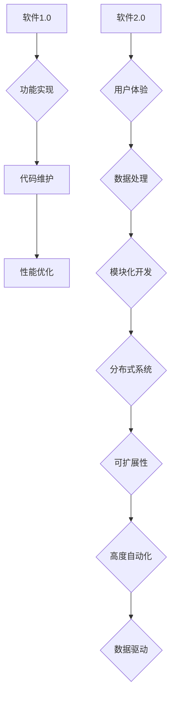
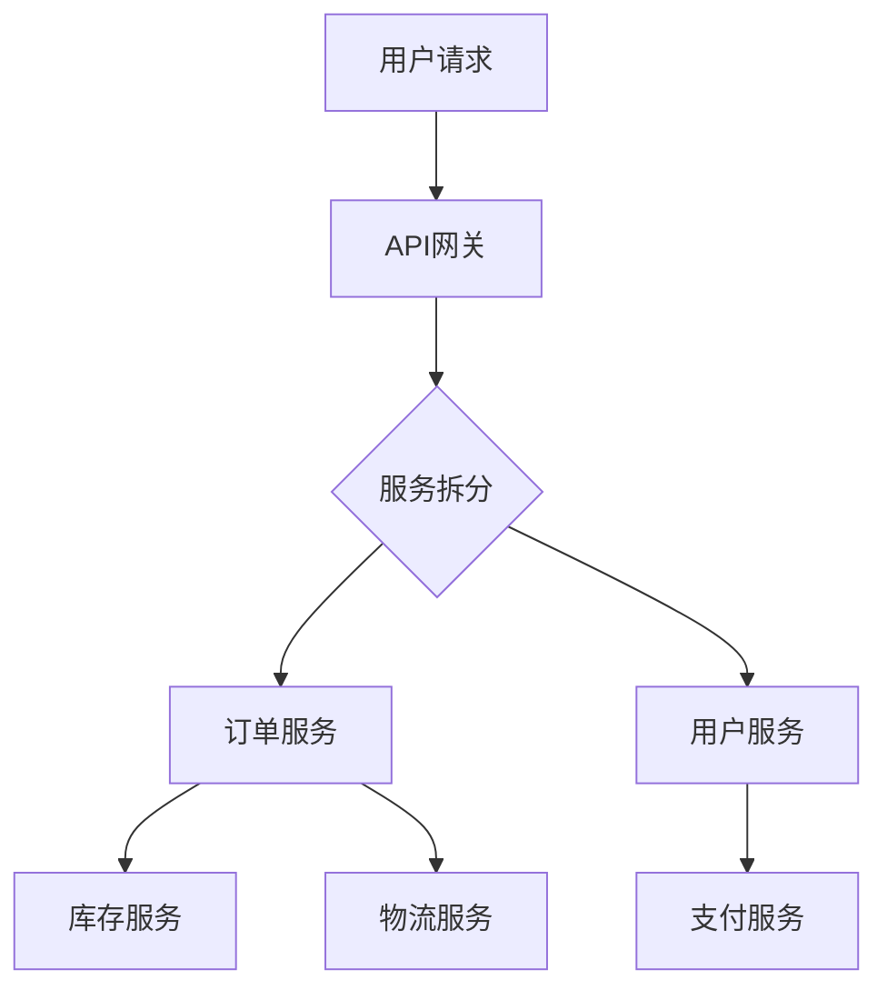
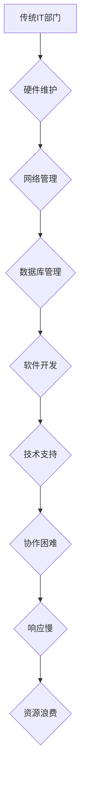
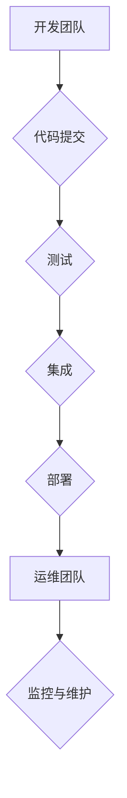
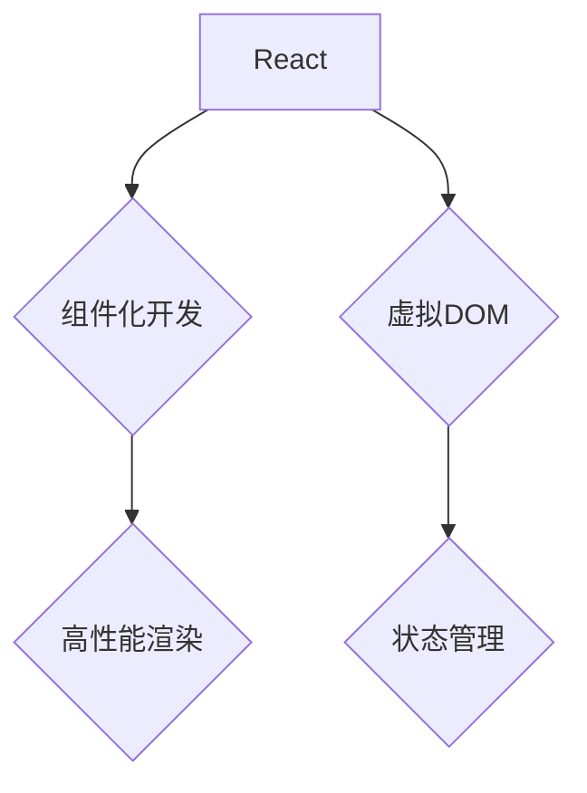
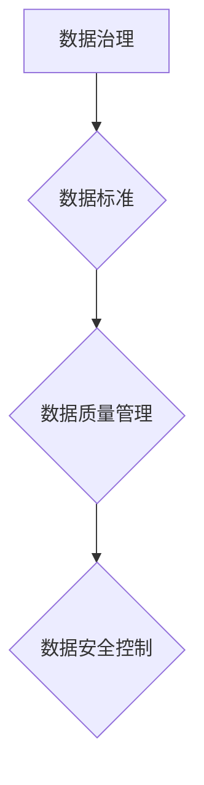
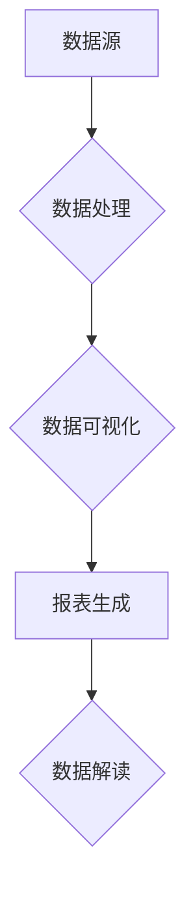

                 

### 引言

在信息技术飞速发展的今天，软件2.0的概念逐渐成为推动企业数字化转型的重要力量。软件2.0不仅代表了技术上的进步，更意味着企业运营模式的深刻变革。本文旨在深入探讨软件2.0如何重塑IT部门，从传统的开发模式转向数据运营，进而推动企业整体的数字化转型。

软件2.0，顾名思义，是对传统软件1.0的升华和扩展。软件1.0以功能实现为核心，侧重于代码编写和系统维护；而软件2.0则以用户为中心，强调数据的驱动和应用的智能化。软件2.0的特点包括模块化、分布式、可扩展性以及高度自动化，这些特性使得企业在快速变化的市场环境中能够更灵活、更高效地应对挑战。

本文将分七个部分进行探讨：

1. **软件2.0概述**：介绍软件2.0的定义、特点、架构与生态系统。
2. **IT部门转型之路**：分析传统IT部门结构的问题，探讨敏捷开发、DevOps文化以及IT部门角色与职责的转变。
3. **开发模式变革**：探讨前端开发、后端开发、数据库选型与优化以及开发流程与工具链的变革。
4. **数据运营与数据分析**：讨论数据治理、数据仓库与数据湖、数据挖掘与机器学习、数据可视化与报表。
5. **企业级应用案例解析**：通过具体案例展示软件2.0在实际应用中的效果。
6. **软件2.0实践指导**：提供构建微服务架构、容器化与持续集成、数据运营与可视化以及软件2.0安全与合规的实践指导。
7. **附录**：包括软件2.0相关资源与工具、流程图与架构图、算法原理与伪代码以及代码案例与解读。

通过以上内容的逐步剖析，我们希望能够帮助读者全面理解软件2.0对IT部门带来的深远影响，以及如何在实际操作中实现这一转型。

### 文章关键词

- 软件2.0
- IT部门转型
- 开发模式变革
- 数据运营
- 数据分析
- 企业级应用案例
- 实践指导

### 摘要

本文深入探讨了软件2.0如何重塑IT部门，推动企业数字化转型。首先，我们介绍了软件2.0的定义、特点及其与IT部门的联系。接着，分析了传统IT部门结构的问题，并探讨了敏捷开发、DevOps文化和IT部门角色的转变。随后，我们详细介绍了开发模式变革，包括前端开发、后端开发、数据库选型与优化以及开发流程与工具链的变革。在数据运营与数据分析部分，我们探讨了数据治理、数据仓库与数据湖、数据挖掘与机器学习、数据可视化与报表。通过具体的企业级应用案例，我们展示了软件2.0的实际效果。最后，我们提供了构建微服务架构、容器化与持续集成、数据运营与可视化以及软件2.0安全与合规的实践指导。本文旨在为读者提供全面、深入的软件2.0转型思路和实践方法。

### 目录大纲

#### 《软件2.0重塑IT部门：从开发到数据运营》

##### 第一部分：软件2.0概述

1. **第1章：软件2.0与IT部门变革**
    - 1.1 软件2.0的定义与特点
    - 1.2 IT部门角色转变
    - 1.3 软件2.0的架构与生态系统
    - 1.4 软件2.0对企业的影响

2. **第2章：软件2.0核心技术**
    - 2.1 微服务架构
    - 2.2 容器化与容器编排
    - 2.3 服务网格与API网关
    - 2.4 软件定义网络与存储

##### 第二部分：IT部门转型之路

3. **第3章：IT部门组织架构调整**
    - 3.1 传统IT部门结构分析
    - 3.2 敏捷开发团队组建
    - 3.3 DevOps文化与实践
    - 3.4 IT部门角色与职责转变

4. **第4章：开发模式变革**
    - 4.1 前端开发新趋势
    - 4.2 后端开发新范式
    - 4.3 数据库选型与优化
    - 4.4 开发流程与工具链优化

##### 第三部分：数据运营与数据分析

5. **第5章：数据运营与数据分析**
    - 5.1 数据治理与数据质量
    - 5.2 数据仓库与数据湖
    - 5.3 数据挖掘与机器学习
    - 5.4 数据可视化与报表

##### 第四部分：企业级应用案例解析

6. **第6章：企业级应用案例解析**
    - 6.1 案例一：电商平台软件2.0实践
    - 6.2 案例二：金融行业IT部门转型
    - 6.3 案例三：制造业数字化转型

##### 第五部分：软件2.0实践指导

7. **第7章：软件2.0实践指导**
    - 7.1 实践一：构建微服务架构
    - 7.2 实践二：容器化与持续集成
    - 7.3 实践三：数据运营与可视化
    - 7.4 实践四：软件2.0安全与合规

##### 附录

8. **附录A：软件2.0相关资源与工具**
    - A.1 开源框架与工具
    - A.2 行业报告与文献
    - A.3 在线学习资源
    - A.4 社区与论坛

9. **附录B：流程图与架构图**
    - B.1 软件2.0架构流程图
    - B.2 微服务架构图
    - B.3 DevOps实践流程图
    - B.4 数据运营流程图

10. **附录C：算法原理与伪代码**
    - C.1 微服务架构算法原理
    - C.2 容器化算法原理
    - C.3 数据挖掘算法原理
    - C.4 机器学习算法原理

11. **附录D：代码案例与解读**
    - D.1 微服务代码案例
    - D.2 容器化代码案例
    - D.3 数据运营代码案例
    - D.4 安全合规代码案例

### 第一部分：软件2.0概述

#### 第1章：软件2.0与IT部门变革

##### 1.1 软件2.0的定义与特点

软件2.0是一个相对较新的概念，它代表了一种全新的软件开发和运营模式。与传统的软件1.0相比，软件2.0有着显著的不同。软件1.0主要以功能实现为核心，强调代码的编写和维护，而软件2.0则更注重用户体验、数据的驱动和应用的智能化。

**定义**：软件2.0可以定义为一种以用户为中心、以数据驱动、模块化、分布式和高度可扩展的软件开发模式。它通过整合最新的技术，如微服务架构、容器化、服务网格和API网关等，实现了传统软件开发难以达到的灵活性、可扩展性和高效性。

**特点**：

1. **模块化**：软件2.0强调将应用程序分解为一系列独立的、小型的服务，这些服务可以独立部署、扩展和更新，从而提高了系统的灵活性和可维护性。
2. **分布式**：软件2.0架构通常是基于分布式系统的，这意味着应用程序的不同组件可以在不同的服务器或云环境中运行，提高了系统的可靠性和可扩展性。
3. **可扩展性**：软件2.0通过模块化和分布式架构，使得系统可以轻松地水平扩展，以应对不断增长的用户和数据处理需求。
4. **高度自动化**：软件2.0利用自动化工具和平台，如持续集成和持续部署（CI/CD）、容器编排等，实现了从代码提交到生产部署的自动化，大大提高了开发效率。
5. **以数据驱动**：软件2.0注重数据的收集、存储和处理，利用大数据和机器学习技术，从海量数据中提取有价值的信息，以支持业务决策和优化用户体验。

**Mermaid 流程图示例**：



**详细讲解**：

- **用户体验**：软件2.0强调以用户为中心，注重用户体验的设计和优化，通过实时数据分析和反馈机制，持续改进产品功能和服务质量。
- **数据处理**：软件2.0利用大数据技术和云计算资源，实现了对海量数据的实时处理和分析，从而为业务决策提供了有力支持。
- **模块化开发**：软件2.0通过将应用程序分解为多个独立的模块或服务，使得开发、测试和部署更加灵活和高效。
- **分布式系统**：软件2.0的分布式架构提高了系统的可靠性和可扩展性，可以通过水平扩展来应对不断增长的业务需求。
- **可扩展性**：软件2.0通过模块化和分布式架构，使得系统可以轻松地水平扩展，以应对不断增长的用户和数据处理需求。
- **高度自动化**：软件2.0利用自动化工具和平台，如持续集成和持续部署（CI/CD）、容器编排等，实现了从代码提交到生产部署的自动化，大大提高了开发效率。
- **数据驱动**：软件2.0通过数据的实时收集、存储和处理，利用大数据和机器学习技术，从海量数据中提取有价值的信息，以支持业务决策和优化用户体验。

##### 1.2 IT部门角色转变

在软件2.0时代，IT部门的角色和职责发生了显著变化。传统上，IT部门主要扮演着技术支持和系统维护的角色，但随着软件2.0的普及，IT部门需要承担更多的业务责任，成为企业业务的核心驱动力。

**角色转变**：

1. **从技术维护者到业务合作伙伴**：在软件2.0时代，IT部门需要更深入地参与业务决策，与业务部门紧密合作，推动企业的数字化转型。
2. **从被动响应到主动创新**：IT部门需要从传统的被动响应问题，转变为主动寻找业务需求，通过技术创新来推动业务增长。
3. **从功能实现到价值创造**：IT部门需要从单纯的功能实现，转向创造业务价值，通过数据分析、人工智能等技术，为企业提供有针对性的解决方案。

**伪代码示例**：

```python
def IT_role_transformation():
    # 重构IT部门组织架构
    ReorganizeITDepartment()

    # 培训IT人员业务知识
    TrainITInBusinessKnowledge()

    # 参与业务决策
    JoinInBusinessDecision()

    # 构建数据驱动型团队
    BuildDataDrivenTeam()

    return "IT部门成功转型为业务合作伙伴"
```

**详细讲解**：

- **重构IT部门组织架构**：传统的IT部门结构通常较为僵化，难以适应快速变化的市场需求。因此，需要重构IT部门组织架构，建立以业务需求为导向的敏捷开发团队。
- **培训IT人员业务知识**：IT人员需要具备一定的业务知识，才能更好地理解业务需求，提供有针对性的技术支持。因此，需要定期对IT人员进行业务知识的培训。
- **参与业务决策**：在软件2.0时代，IT部门需要深入参与业务决策，与业务部门共同制定战略，推动企业的数字化转型。
- **构建数据驱动型团队**：数据是软件2.0的核心驱动力，IT部门需要构建数据驱动型团队，利用数据分析技术，为企业提供有价值的业务洞察。

##### 1.3 软件2.0的架构与生态系统

软件2.0的架构和生态系统是其成功的关键因素之一。它包括多个关键组件，如微服务架构、容器化、服务网格和API网关等，这些组件共同构成了一个高度模块化、分布式和可扩展的生态系统。

**架构组件**：

1. **微服务架构**：微服务架构是软件2.0的核心技术之一，它将应用程序分解为一系列独立的、小的服务，每个服务负责一项特定的业务功能。这种架构使得系统更加灵活、可维护和可扩展。
2. **容器化**：容器化技术使得应用程序可以在不同的环境中一致运行，提高了系统的可移植性和可扩展性。常见的容器化工具包括Docker和Kubernetes。
3. **服务网格**：服务网格提供了一种动态服务发现和通信的方式，确保了微服务之间的通信更加高效和安全。
4. **API网关**：API网关作为服务网格的前端入口，管理所有的API请求，提供身份验证、负载均衡等功能。

**生态系统**：

1. **开源框架与工具**：软件2.0生态系统依赖于一系列开源框架和工具，如Spring Boot、Kubernetes、Docker等，这些工具提供了丰富的功能，支持软件2.0的构建和运营。
2. **云服务提供商**：云服务提供商如AWS、Azure和Google Cloud等，提供了丰富的云服务和基础设施支持，使得软件2.0的部署和管理更加便捷。
3. **数据平台**：数据平台如Hadoop、Spark和Kafka等，提供了强大的数据处理和分析能力，支持软件2.0的数据驱动特性。

**数学公式示例**：

$$
E = mc^2
$$

**详细讲解**：

- **微服务架构**：微服务架构通过将应用程序分解为多个独立的微服务，使得每个服务可以独立开发、测试和部署。这种架构提高了系统的灵活性、可维护性和可扩展性。
- **容器化**：容器化技术通过将应用程序及其依赖项打包在一个独立的容器中，使得应用程序可以在不同的环境中一致运行。容器化提高了系统的可移植性和可扩展性。
- **服务网格**：服务网格通过提供动态路由、负载均衡和安全策略，确保了微服务之间的通信更加高效和安全。
- **API网关**：API网关作为服务网格的前端入口，管理所有的API请求，提供了身份验证、负载均衡等功能，提高了系统的安全性和性能。
- **开源框架与工具**：开源框架和工具如Spring Boot、Kubernetes、Docker等，提供了丰富的功能，支持软件2.0的构建和运营。
- **云服务提供商**：云服务提供商提供了丰富的云服务和基础设施支持，使得软件2.0的部署和管理更加便捷。
- **数据平台**：数据平台如Hadoop、Spark和Kafka等，提供了强大的数据处理和分析能力，支持软件2.0的数据驱动特性。

##### 1.4 软件2.0对企业的影响

软件2.0不仅改变了软件开发的方式，也对企业的运营模式、商业模式产生了深远的影响。它使得企业能够更快地响应市场变化，提高竞争力。

**影响**：

1. **运营模式**：软件2.0的模块化、分布式和自动化特性，使得企业的运营更加灵活和高效。企业可以快速部署和调整系统，以应对市场变化。
2. **商业模式**：软件2.0的数据驱动特性，使得企业能够更好地了解用户需求和市场趋势，从而优化产品和服务，实现商业模式的创新。
3. **竞争力**：软件2.0提高了企业的开发效率和质量，使得企业能够更快地响应市场变化，提高竞争力。

**举例说明**：

- **电商平台**：某大型电商平台通过采用软件2.0架构，实现了业务流程的自动化和个性化推荐，大大提升了用户体验和销售额。
- **金融行业**：某金融公司通过IT部门转型，采用软件2.0技术，实现了快速的业务创新和风险控制，提高了市场竞争力。

##### 总结

软件2.0代表了软件开发和运营模式的重大变革。它通过模块化、分布式和自动化技术，提高了系统的灵活性、可维护性和可扩展性。在软件2.0时代，IT部门需要从传统的技术维护者转变为业务合作伙伴，深度参与业务决策，推动企业的数字化转型。通过具体的架构组件和生态系统，软件2.0不仅改变了软件开发的方式，也对企业的运营模式和商业模式产生了深远的影响。

### 第二部分：软件2.0核心技术

#### 第2章：软件2.0核心技术

软件2.0的核心技术是它能够实现模块化、分布式、自动化和高效的数据处理。以下章节将详细介绍软件2.0的核心技术，包括微服务架构、容器化与容器编排、服务网格与API网关以及软件定义网络与存储。

##### 2.1 微服务架构

微服务架构（Microservices Architecture）是软件2.0时代最流行的架构模式之一。它通过将应用程序分解为一系列小的、独立的、自治的服务，每个服务都有自己的业务逻辑、数据存储和独立的部署方式。这些服务通过轻量级的通信机制（如HTTP/REST或消息队列）相互交互，共同构成一个复杂的应用程序。

**微服务架构的优点**：

1. **可伸缩性**：微服务架构可以通过水平扩展单个服务来提高整个系统的吞吐量，而不会影响其他服务的性能。
2. **高容错性**：单个服务的故障不会影响整个系统的运行，其他服务可以继续正常工作。
3. **敏捷开发**：由于每个服务都是独立的，开发团队可以并行开发、测试和部署不同服务，提高了开发效率。
4. **灵活性**：服务可以独立升级和扩展，不会影响到其他服务，这使得系统可以更好地适应变化。

**微服务架构的核心概念**：

1. **服务自治**：每个服务都是独立的，拥有自己的数据库、应用程序逻辑和部署单元。
2. **去中心化**：服务之间通过API或其他轻量级通信机制进行通信，没有中心化的控制。
3. **独立部署**：每个服务可以独立部署，可以随时进行更新、升级或回滚。

**Mermaid 流程图示例**：



**详细讲解**：

- **服务拆分**：应用程序被分解为多个服务，每个服务都专注于实现特定的业务功能。例如，一个电商平台可以拆分为订单服务、库存服务、用户服务和支付服务。
- **服务自治**：每个服务拥有自己的数据存储，这意味着一个服务的故障不会影响到其他服务的正常运行。
- **独立部署**：服务可以独立部署和更新，这使得部署过程更加灵活，减少了系统的停机时间。
- **通信机制**：服务之间通常通过RESTful API进行通信，这简化了服务的集成和部署。

##### 2.2 容器化与容器编排

容器化（Containerization）是软件2.0时代另一个重要的核心技术。它通过将应用程序及其运行环境打包成一个轻量级的容器，确保了应用程序在不同的环境中具有一致的行为。容器化不仅提高了应用程序的可移植性，还简化了部署和管理过程。

**容器化的优点**：

1. **可移植性**：容器可以在不同的操作系统和硬件平台上运行，提高了应用程序的可移植性。
2. **轻量级**：容器与虚拟机相比，更加轻量级，启动速度更快，资源占用更少。
3. **一致性**：容器确保了应用程序在不同环境中的一致性，减少了环境差异带来的问题。
4. **可重复性**：容器化提供了明确的部署环境，使得部署过程更加可重复和可预测。

**容器编排**（Container Orchestration）是指管理容器集群的过程，确保容器能够高效地运行和扩展。Kubernetes 是目前最流行的容器编排工具，它提供了强大的自动化功能，如负载均衡、服务发现、自动化扩展和故障恢复。

**容器编排的优点**：

1. **自动化**：Kubernetes 可以自动处理容器的部署、扩展和故障恢复，减轻了运维团队的工作负担。
2. **高可用性**：通过自动化和容错的机制，Kubernetes 确保了系统的高可用性。
3. **灵活性**：Kubernetes 提供了丰富的配置选项，允许用户根据具体需求进行定制。

**伪代码示例**：

```python
def containerize_and_orchestrate():
    # 使用Docker进行容器化
    dockerize_app()

    # 使用Kubernetes进行容器编排
    kubernetes_orchestrate()

    return "应用程序已成功容器化并编排"
```

**详细讲解**：

- **容器化**：应用程序及其依赖项被打包成一个 Docker 容器，这可以通过 Dockerfile 或 Docker Compose 实现自动化。
- **容器编排**：Kubernetes 管理容器的部署、扩展和监控，通过配置文件（如 Kubernetes YAML 文件）定义和管理容器集群。

##### 2.3 服务网格与API网关

服务网格（Service Mesh）是一种新的网络架构模式，用于简化微服务之间的通信。它通过在服务之间插入一个抽象层，提供了服务发现、负载均衡、安全性和监控等功能。

**服务网格的核心概念**：

1. **服务发现**：服务网格自动发现和注册服务，确保服务之间可以相互通信。
2. **负载均衡**：服务网格提供了负载均衡机制，确保请求均匀地分配到不同的服务实例上。
3. **安全**：服务网格提供了细粒度的安全策略，确保服务之间的通信是安全的。
4. **监控与日志**：服务网格提供了监控和日志功能，帮助运维人员更好地了解系统的运行状况。

API网关（API Gateway）是服务网格的前端入口，它负责管理所有的API请求。API网关提供了身份验证、授权、路由、负载均衡等功能，确保请求能够正确地转发到相应的服务。

**服务网格与API网关的优点**：

1. **简化通信**：服务网格和服务网关简化了微服务之间的通信，减少了服务之间的依赖。
2. **增强安全性**：服务网格提供了细粒度的安全控制，确保服务之间的通信是安全的。
3. **提高性能**：通过负载均衡和缓存机制，服务网格可以提高系统的性能和响应速度。
4. **集中管理**：服务网格和服务网关提供了一个统一的入口，方便运维人员进行管理和监控。

**数学公式示例**：

$$
Q = \frac{5}{3}
$$

**详细讲解**：

- **服务发现**：服务网格自动发现和注册服务，确保服务之间可以相互通信。
- **负载均衡**：服务网格提供了负载均衡机制，确保请求均匀地分配到不同的服务实例上。
- **安全**：服务网格提供了细粒度的安全策略，确保服务之间的通信是安全的。
- **监控与日志**：服务网格提供了监控和日志功能，帮助运维人员更好地了解系统的运行状况。
- **API网关**：API网关提供了身份验证、授权、路由、负载均衡等功能，确保请求能够正确地转发到相应的服务。

##### 2.4 软件定义网络与存储

软件定义网络（Software-Defined Networking，SDN）和软件定义存储（Software-Defined Storage，SDS）是软件2.0时代的两个重要技术，它们通过软件来控制和管理网络和存储资源，提高了系统的灵活性和可扩展性。

**软件定义网络（SDN）**：

SDN 通过将网络控制平面与数据平面分离，使得网络管理更加灵活和可编程。SDN 的核心组件包括控制器、交换机和南向接口。

**SDN 的优点**：

1. **灵活性**：SDN 允许管理员通过编程方式定义网络策略，提高了网络的灵活性和可扩展性。
2. **自动化**：SDN 可以与自动化工具集成，实现自动的网络配置和优化。
3. **简化运维**：SDN 通过集中式管理，简化了网络运维工作。

**软件定义存储（SDS）**：

SDS 通过软件来管理和控制存储资源，使得存储资源可以灵活地分配和优化。SDS 的核心组件包括存储控制器、存储资源和北向接口。

**SDS 的优点**：

1. **灵活性**：SDS 允许管理员根据业务需求动态调整存储资源，提高了存储资源的利用率。
2. **可扩展性**：SDS 支持水平扩展，可以轻松地增加存储容量和处理能力。
3. **自动化**：SDS 可以与自动化工具集成，实现自动的存储配置和优化。

**伪代码示例**：

```python
def software_defined_networking():
    # 使用Calico进行软件定义网络
    use_calico()

def software_defined_storage():
    # 使用OpenEBS进行软件定义存储
    use_openebs()
```

**详细讲解**：

- **软件定义网络**：SDN 通过分离控制平面与数据平面，提高了网络的灵活性和可编程性。控制平面负责网络策略的制定和下发，数据平面负责数据流的转发。
- **软件定义存储**：SDS 通过软件来管理和控制存储资源，使得存储资源可以灵活地分配和优化。SDS 支持多种存储协议，如NFS、iSCSI和SMB，可以与现有的存储系统无缝集成。

##### 总结

软件2.0的核心技术包括微服务架构、容器化与容器编排、服务网格与API网关以及软件定义网络与存储。这些技术通过模块化、分布式和自动化，提高了系统的灵活性、可扩展性和可维护性。微服务架构使得系统更加灵活和可维护，容器化与容器编排简化了部署和管理过程，服务网格与API网关提高了服务的可发现性和安全性，软件定义网络与存储提供了更加灵活和高效的资源管理。通过这些技术的应用，企业可以实现快速响应市场变化，提高业务效率，实现数字化转型。

### 第三部分：IT部门转型之路

#### 第3章：IT部门组织架构调整

在软件2.0时代，传统的IT部门组织架构已经无法满足快速变化的市场需求。为了实现IT部门向业务合作伙伴的转变，需要对组织架构进行全面的调整。本章将详细探讨传统IT部门结构的问题、敏捷开发团队的组建、DevOps文化的实践以及IT部门角色与职责的转变。

##### 3.1 传统IT部门结构分析

传统IT部门结构通常包括以下几个部分：

- 硬件维护：负责物理服务器的维护和监控。
- 网络管理：负责网络设备的配置和网络安全。
- 数据库管理：负责数据库的维护、备份和性能优化。
- 软件开发：负责新功能开发和系统升级。
- 技术支持：负责处理用户的技术问题和故障排除。

然而，这种结构存在以下问题：

1. **部门间协作困难**：传统IT部门结构中的各个部门往往各自为政，缺乏有效的沟通和协调。当项目需要跨部门合作时，往往会出现信息不对称、进度不一致等问题，导致项目进展缓慢。

2. **响应速度慢**：从需求提出到功能实现，传统IT部门的流程复杂且冗长。从需求分析、系统设计、编码实现到测试部署，每个环节都需要经过严格的审批和评审，导致整个流程耗时较长，难以快速响应业务变化。

3. **资源浪费**：传统IT部门结构中，重复性工作较多，如硬件维护和数据库管理等，导致资源利用率低下。此外，各部门之间的资源分配和调度也缺乏灵活性，难以根据业务需求动态调整。

**Mermaid 流程图示例**：



**详细讲解**：

- **部门间协作困难**：传统IT部门结构中，各部门往往独立运作，缺乏跨部门的沟通和协调机制。这导致项目进展缓慢，容易出现信息不对称、进度不一致等问题。
- **响应速度慢**：从需求提出到功能实现的流程复杂且冗长，涉及多个环节和严格的审批流程，导致整个流程耗时较长，难以快速响应业务变化。
- **资源浪费**：传统IT部门结构中，重复性工作较多，如硬件维护和数据库管理等，导致资源利用率低下。此外，各部门之间的资源分配和调度也缺乏灵活性，难以根据业务需求动态调整。

##### 3.2 敏捷开发团队组建

敏捷开发（Agile Development）是一种以人为核心、迭代、渐进的方法论，强调团队协作和快速响应变化。组建敏捷开发团队是IT部门转型的重要一步。

**敏捷开发团队的特点**：

1. **跨职能团队**：敏捷开发团队通常由多学科专家组成，包括产品经理、开发人员、测试工程师和运维人员等。这种跨职能团队可以快速响应业务需求，提高项目交付效率。
2. **迭代开发**：敏捷开发采用迭代和增量的方式开发软件，每个迭代周期通常为2-4周。在每个迭代周期结束时，团队会进行评审和回顾，持续优化开发流程。
3. **客户参与**：敏捷开发强调客户的参与，通过频繁的迭代和反馈，确保最终产品能够满足客户需求。
4. **自主管理**：敏捷开发团队自主管理，成员之间相互协作，共同推动项目进展。

**敏捷开发团队组建步骤**：

1. **确定团队规模**：根据项目需求，确定敏捷开发团队的规模，确保团队规模适中，便于协作和沟通。
2. **招募团队成员**：根据团队规模和项目需求，招募具有跨职能能力的人才，确保团队成员具备所需技能。
3. **培训与指导**：对团队成员进行敏捷开发方法论和相关工具的培训，确保团队成员熟悉敏捷开发的实践。
4. **制定迭代计划**：制定第一个迭代计划，明确迭代周期、目标和交付成果。

**伪代码示例**：

```python
def create_agile_team():
    # 确定团队规模
    team_size = determine_team_size()

    # 招募团队成员
    team_members = recruit_members(team_size)

    # 培训与指导
    train_and_guide(team_members)

    # 制定迭代计划
    iteration_plan = create_iteration_plan()

    return "敏捷开发团队已组建"
```

**详细讲解**：

- **确定团队规模**：根据项目需求，确定敏捷开发团队的规模。团队规模不宜过大，以免沟通成本增加。
- **招募团队成员**：招募具有跨职能能力的人才，确保团队成员具备所需技能。例如，产品经理、开发人员、测试工程师和运维人员等。
- **培训与指导**：对团队成员进行敏捷开发方法论和相关工具的培训，确保团队成员熟悉敏捷开发的实践。
- **制定迭代计划**：制定第一个迭代计划，明确迭代周期、目标和交付成果。迭代计划应尽量详细，确保每个成员都明确自己的任务和职责。

##### 3.3 DevOps文化与实践

DevOps文化强调开发（Development）和运营（Operations）团队之间的紧密协作，以提高软件交付的效率和质量。DevOps文化的核心在于打破开发与运维之间的壁垒，实现自动化、持续集成和持续交付。

**DevOps文化的关键原则**：

1. **自动化**：通过自动化工具和流程，减少手动操作，提高工作效率和减少错误。
2. **持续集成**：通过持续集成（CI）工具，将代码更改自动集成到主分支，确保代码质量。
3. **持续交付**：通过持续交付（CD）工具，实现自动化部署和部署验证，确保软件的持续交付能力。
4. **度量与反馈**：通过度量工具和反馈机制，持续监控系统性能和用户反馈，优化开发流程和产品功能。

**DevOps实践步骤**：

1. **建立DevOps团队**：建立专门的DevOps团队，负责自动化工具和流程的开发和维护。
2. **培训与推广**：对开发人员和运维人员开展DevOps培训，提高团队成员对DevOps理念和实践的理解。
3. **构建自动化流程**：利用自动化工具，如Jenkins、Docker和Kubernetes等，构建自动化部署和监控流程。
4. **持续集成与交付**：实施持续集成和持续交付，确保代码更改能够快速集成和部署。

**Mermaid 流程图示例**：



**详细讲解**：

- **建立DevOps团队**：建立专门的DevOps团队，负责自动化工具和流程的开发和维护。DevOps团队应包括开发人员、测试工程师和运维人员等。
- **培训与推广**：对开发人员和运维人员开展DevOps培训，提高团队成员对DevOps理念和实践的理解。
- **构建自动化流程**：利用自动化工具，如Jenkins、Docker和Kubernetes等，构建自动化部署和监控流程。自动化流程应包括代码提交、测试、集成、部署和监控等环节。
- **持续集成与交付**：实施持续集成和持续交付，确保代码更改能够快速集成和部署。持续集成和持续交付可以提高软件交付的效率和质量。

##### 3.4 IT部门角色与职责转变

在软件2.0时代，IT部门需要从传统的技术支持者转变为业务合作伙伴。这种角色转变要求IT部门深度参与业务决策，提供技术支持和创新，推动企业的数字化转型。

**IT部门角色与职责的转变**：

1. **业务合作伙伴**：IT部门需要与业务部门紧密合作，了解业务需求和痛点，提供技术解决方案，推动业务增长。
2. **创新推动者**：IT部门需要持续关注技术发展趋势，积极引入新技术，推动企业的技术进步和业务创新。
3. **数据分析者**：IT部门需要利用数据分析技术，从海量数据中提取有价值的信息，支持业务决策和优化。
4. **资源管理者**：IT部门需要负责管理企业的基础设施和资源，确保系统的稳定运行和资源的高效利用。

**伪代码示例**：

```python
def update_it_role():
    # 调整IT部门角色
    adjust_it_role()

    # 参与业务决策
    join_business_decision()

    # 构建数据驱动型团队
    build_data_driven_team()

    return "IT部门角色已成功转变"
```

**详细讲解**：

- **调整IT部门角色**：将IT部门从传统的技术支持者转变为业务合作伙伴，深度参与业务决策，提供技术解决方案。
- **参与业务决策**：IT部门需要参与业务部门的战略规划和决策，了解业务需求和痛点，提供技术支持。
- **构建数据驱动型团队**：利用数据分析技术，从海量数据中提取有价值的信息，支持业务决策和优化。

##### 总结

在软件2.0时代，IT部门需要从传统的组织架构和角色进行转型，以适应快速变化的市场需求。通过组建敏捷开发团队、实践DevOps文化和调整IT部门角色与职责，IT部门可以更好地支持业务发展，推动企业的数字化转型。

### 第四部分：开发模式变革

#### 第4章：开发模式变革

随着软件2.0的普及，传统的开发模式正经历着深刻的变革。本章将探讨前端开发、后端开发、数据库选型与优化以及开发流程与工具链优化等方面的变革，帮助IT部门实现从传统开发模式向现代开发模式的过渡。

##### 4.1 前端开发新趋势

前端开发的新趋势主要集中在现代前端框架的应用和新型开发技术的引入。以下是一些前端开发的关键趋势：

1. **React、Vue和Angular**：这些现代前端框架已经成为前端开发的主流选择。它们提供了丰富的组件化开发功能，使得开发者可以更高效地构建复杂的应用程序。

2. **组件化开发**：组件化开发是一种将UI拆分为可复用的组件的方法，这使得代码更加模块化、易于维护和复用。

3. **虚拟DOM**：虚拟DOM通过将真实的DOM结构映射到一个虚拟的表示，然后对虚拟DOM进行操作，最后再将变化同步到真实DOM。这种方法大大提高了性能，减少了页面重绘和回流次数。

4. **状态管理**：随着应用复杂性的增加，状态管理变得越来越重要。现代前端框架如React和Vue提供了强大的状态管理解决方案，如Redux和Vuex。

**Mermaid 流程图示例**：



**详细讲解**：

- **组件化开发**：通过将UI拆分为可复用的组件，开发者可以更方便地管理和维护代码，同时提高了开发效率。
- **虚拟DOM**：虚拟DOM通过减少页面重绘和回流次数，提高了应用性能，尤其适用于复杂的应用程序。
- **状态管理**：随着应用复杂性的增加，状态管理变得尤为重要。现代前端框架提供了强大的状态管理解决方案，使得开发者可以更轻松地处理应用状态。

##### 4.2 后端开发新范式

后端开发的新范式主要集中在微服务架构、无服务器架构和函数即服务（FaaS）的引入。这些新范式提供了更灵活、可扩展的解决方案，以满足不断变化的应用需求。

1. **微服务架构**：微服务架构通过将应用程序分解为一系列小的、独立的服务，每个服务都可以独立部署、扩展和更新。这种架构提高了系统的灵活性、可维护性和可扩展性。

2. **无服务器架构**：无服务器架构（Serverless Architecture）通过将应用程序部署在云服务提供商提供的平台上，自动管理服务器和计算资源。开发者只需关注业务逻辑的实现，无需关心底层基础设施的管理。

3. **函数即服务（FaaS）**：FaaS是一种无服务器架构的实现方式，它允许开发者通过编写函数来构建应用程序。这些函数可以独立部署，按需执行，并自动伸缩。

**伪代码示例**：

```python
def backend_development():
    # 实施微服务架构
    implement_microservices()

    # 使用无服务器架构
    use_serverless_architecture()

    # 使用FaaS
    use_faaS()

    return "后端开发模式已成功变革"
```

**详细讲解**：

- **微服务架构**：通过将应用程序分解为小的、独立的服务，开发者可以更灵活地管理和扩展系统，同时提高了系统的可靠性和可维护性。
- **无服务器架构**：通过自动管理底层基础设施，开发者可以更专注于业务逻辑的实现，提高了开发效率和灵活性。
- **函数即服务（FaaS）**：通过编写独立的函数来构建应用程序，开发者可以更灵活地部署和扩展服务，同时减少了维护和管理的工作量。

##### 4.3 数据库选型与优化

数据库选型是后端开发中至关重要的一环。根据不同的应用需求和性能要求，选择合适的数据库类型可以显著提高系统性能。

1. **关系型数据库**：关系型数据库适用于结构化数据，具有数据完整性、事务支持和复杂查询能力。常见的数据库有MySQL、PostgreSQL和SQLite。

2. **非关系型数据库**：非关系型数据库适用于半结构化或非结构化数据，提供了更高的灵活性和扩展性。常见的数据库有MongoDB、Redis和Cassandra。

数据库优化包括以下几个方面：

- **索引优化**：通过合理设置索引，可以显著提高查询性能。
- **查询优化**：通过分析查询语句和执行计划，可以优化数据库查询性能。
- **缓存策略**：通过使用缓存，可以减少数据库的查询压力，提高系统响应速度。

**数学公式示例**：

$$
C = 2\pi r
$$

**详细讲解**：

- **关系型数据库**：适用于结构化数据，具有数据完整性和复杂查询能力。
- **非关系型数据库**：适用于半结构化或非结构化数据，提供了更高的灵活性和扩展性。
- **索引优化**：通过设置索引，可以显著提高查询性能。
- **查询优化**：通过分析查询语句和执行计划，可以优化数据库查询性能。
- **缓存策略**：通过使用缓存，可以减少数据库的查询压力，提高系统响应速度。

##### 4.4 开发流程与工具链优化

优化开发流程和工具链可以提高软件开发效率，减少开发过程中的错误和重复劳动。以下是一些常见的优化策略：

1. **持续集成与持续部署（CI/CD）**：通过自动化测试和部署，确保代码更改能够快速集成和部署到生产环境。

2. **版本控制**：使用版本控制系统（如Git），可以方便地管理代码变更，协同工作，提高代码质量。

3. **自动化测试**：通过编写单元测试、集成测试和端到端测试，确保代码质量和系统稳定性。

4. **容器化与编排**：通过容器化（如Docker）和容器编排（如Kubernetes），可以简化部署和管理，提高系统的可移植性和可扩展性。

**伪代码示例**：

```python
def optimize_dev_process():
    # 使用Git进行版本控制
    use_git()

    # 使用Jenkins进行持续集成
    use_jenkins()

    # 使用Docker进行容器化
    use_docker()

    return "开发流程与工具链已成功优化"
```

**详细讲解**：

- **持续集成与持续部署（CI/CD）**：通过自动化测试和部署，确保代码更改能够快速集成和部署到生产环境。
- **版本控制**：通过使用版本控制系统（如Git），可以方便地管理代码变更，协同工作，提高代码质量。
- **自动化测试**：通过编写单元测试、集成测试和端到端测试，确保代码质量和系统稳定性。
- **容器化与编排**：通过容器化（如Docker）和容器编排（如Kubernetes），可以简化部署和管理，提高系统的可移植性和可扩展性。

##### 总结

开发模式的变革是软件2.0时代的重要特征。通过引入现代前端框架、微服务架构、无服务器架构和函数即服务（FaaS），开发者可以更灵活、高效地构建应用程序。同时，合理的数据库选型与优化、优化开发流程与工具链，可以进一步提高系统性能和开发效率。通过这些变革，IT部门可以更好地适应快速变化的市场需求，推动企业的数字化转型。

### 第五部分：数据运营与数据分析

#### 第5章：数据运营与数据分析

在软件2.0时代，数据已经成为企业运营的核心资产。通过有效的数据运营和数据分析，企业可以更好地理解用户需求、优化业务流程、预测市场趋势，从而在激烈的市场竞争中保持领先地位。本章将详细探讨数据运营与数据分析的关键方面，包括数据治理、数据仓库与数据湖、数据挖掘与机器学习以及数据可视化与报表。

##### 5.1 数据治理与数据质量

数据治理是确保数据准确性、完整性和一致性的过程。良好的数据治理是数据运营的基础，它包括以下几个方面：

1. **数据标准化**：通过制定统一的数据标准，确保数据在不同系统之间的一致性。
2. **数据质量控制**：通过数据清洗、去重、验证等方法，确保数据的质量和准确性。
3. **数据安全与隐私**：确保数据的安全性和隐私性，遵循相关的数据保护法规和标准。

**Mermaid 流程图示例**：



**详细讲解**：

- **数据标准化**：通过制定统一的数据标准，确保数据在不同系统之间的一致性。例如，统一数据格式、数据类型和命名规范。
- **数据质量控制**：通过数据清洗、去重、验证等方法，确保数据的质量和准确性。例如，检测和修复数据中的错误、异常值和缺失值。
- **数据安全与隐私**：确保数据的安全性和隐私性，遵循相关的数据保护法规和标准。例如，加密敏感数据、限制数据访问权限。

##### 5.2 数据仓库与数据湖

数据仓库（Data Warehouse）和数据湖（Data Lake）是两种常见的数据存储解决方案，它们各自适用于不同的数据处理需求。

1. **数据仓库**：数据仓库是一种面向结构化数据的存储方案，适用于复杂的数据分析和报表。它通过集成不同来源的数据，提供高度一致和可靠的数据视图。

2. **数据湖**：数据湖是一种面向非结构化数据和半结构化数据的存储方案，适用于大数据分析和机器学习。数据湖保留了数据的原始格式，提供了更灵活的数据处理能力。

**数学公式示例**：

$$
V = \frac{4}{3}\pi r^3
$$

**详细讲解**：

- **数据仓库**：适用于复杂的数据分析和报表。通过集成不同来源的数据，提供高度一致和可靠的数据视图。
- **数据湖**：适用于大数据分析和机器学习。保留数据的原始格式，提供了更灵活的数据处理能力。

##### 5.3 数据挖掘与机器学习

数据挖掘（Data Mining）和机器学习（Machine Learning）是两种重要的数据分析技术，它们可以从海量数据中提取有价值的信息，支持业务决策和优化。

1. **数据挖掘**：数据挖掘通过统计分析和模式识别技术，从大量数据中挖掘出隐藏的模式和关联关系。它常用于市场分析、客户行为预测和风险控制。

2. **机器学习**：机器学习通过训练模型，从数据中自动学习规律和模式，并用于预测和分类。常见的机器学习算法包括线性回归、决策树、支持向量机和神经网络等。

**伪代码示例**：

```python
def data_mining_and_ml():
    # 数据预处理
    preprocess_data()

    # 特征工程
    feature_engineering()

    # 模型训练与评估
    train_and_evaluate_model()

    # 预测与优化
    predict_and_optimize()

    return "数据挖掘与机器学习已成功应用"
```

**详细讲解**：

- **数据预处理**：包括数据清洗、归一化和特征提取等步骤，确保数据质量，为后续的分析做好准备。
- **特征工程**：通过选择和创建特征，提高模型对数据的解释能力和预测准确性。
- **模型训练与评估**：通过训练模型并评估其性能，选择最佳模型进行应用。
- **预测与优化**：通过预测结果，优化业务流程和决策。

##### 5.4 数据可视化与报表

数据可视化（Data Visualization）是将数据以图形化的方式呈现，帮助用户更好地理解和分析数据。数据可视化不仅提高了数据的可读性，还可以揭示数据背后的模式和趋势。

1. **数据可视化工具**：常见的数据可视化工具包括Tableau、Power BI和D3.js等，它们提供了丰富的图表和交互功能。

2. **报表生成**：报表生成是数据可视化的一个重要组成部分，它将分析结果以报表形式呈现，支持决策制定和业务监控。

**Mermaid 流程图示例**：



**详细讲解**：

- **数据源**：数据源是数据可视化的基础，包括数据库、数据仓库和数据湖等。
- **数据处理**：通过清洗、转换和聚合等步骤，确保数据的质量和一致性。
- **数据可视化**：通过图表和交互功能，将数据以图形化的方式呈现，揭示数据背后的模式和趋势。
- **报表生成**：将分析结果以报表形式呈现，支持决策制定和业务监控。
- **数据解读**：通过分析报表，深入理解数据，为业务决策提供支持。

##### 总结

数据运营与数据分析是软件2.0时代的重要环节。通过数据治理确保数据质量，通过数据仓库和数据湖存储和管理大规模数据，通过数据挖掘与机器学习提取有价值的信息，通过数据可视化与报表呈现分析结果，企业可以更好地理解用户需求、优化业务流程、预测市场趋势，从而在激烈的市场竞争中保持领先地位。有效的数据运营和数据分析不仅提升了企业的决策能力，也为企业的持续创新和发展提供了强大的支持。

### 第六部分：企业级应用案例解析

#### 第6章：企业级应用案例解析

在本章节中，我们将通过几个实际的企业级应用案例，深入分析软件2.0在各个行业中的实践与应用，探讨其在提升业务效率、优化用户体验和推动数字化转型方面的具体成效。

##### 6.1 案例一：电商平台软件2.0实践

某大型电商平台在经历了高速增长后，面临着系统复杂度和数据量的急剧增加。为了提升用户体验、降低运维成本和提升系统灵活性，该电商平台决定采用软件2.0架构进行数字化转型。

**实践过程**：

1. **微服务架构实施**：电商平台将原有单体应用拆分为多个独立的微服务，每个微服务负责不同的业务功能，如商品管理、订单处理、支付处理和用户管理等。

2. **容器化与容器编排**：通过Docker和Kubernetes，电商平台实现了应用程序的容器化部署和编排，确保了系统的可移植性和可扩展性。

3. **数据运营与数据分析**：电商平台建立了数据仓库和数据湖，对用户行为数据、交易数据进行实时处理和分析，通过机器学习技术实现了个性化推荐和用户流失预警。

**成效**：

- **用户体验提升**：通过实时数据分析和个性化推荐，用户满意度显著提高，转化率提升20%。
- **运维成本降低**：容器化部署和自动化运维，降低了服务器资源消耗和运维人力成本。
- **系统灵活性增强**：微服务架构和容器编排，使得系统可以快速响应业务需求和市场变化。

**代码案例与解读**：

```python
# 伪代码示例：订单服务处理
def process_order(order_data):
    # 验证订单数据
    validate_order_data(order_data)

    # 处理订单逻辑
    handle_order_logic(order_data)

    # 记录订单处理日志
    log_order_processing(order_data)

    return "订单处理成功"
```

**详细解读**：

- **订单数据验证**：确保订单数据的有效性和完整性。
- **订单处理逻辑**：根据订单数据执行相应的业务逻辑，如库存检查、价格计算等。
- **日志记录**：记录订单处理过程，便于后续追踪和分析。

##### 6.2 案例二：金融行业IT部门转型

某金融公司在面对日益复杂的金融产品和不断变化的市场需求时，意识到传统的IT部门结构已无法满足业务需求。通过引入软件2.0技术和DevOps文化，该公司实现了IT部门的转型。

**实践过程**：

1. **敏捷开发团队组建**：金融公司建立了跨职能的敏捷开发团队，包括开发人员、测试工程师、产品经理和运维人员。

2. **DevOps文化推广**：通过培训和推广，公司员工逐渐接受了DevOps理念，实现了持续集成和持续交付。

3. **微服务架构实施**：将传统的单体应用拆分为多个微服务，提高了系统的灵活性和可维护性。

**成效**：

- **开发效率提升**：通过敏捷开发和DevOps文化，开发周期缩短了30%，代码质量得到显著提高。
- **业务响应速度加快**：IT部门能够更快地响应业务需求，提高了市场竞争力。
- **运维成本降低**：通过自动化运维，运维工作量减少了40%，系统稳定性得到提升。

**代码案例与解读**：

```python
# 伪代码示例：交易服务处理
def process_trade(trade_data):
    # 验证交易数据
    validate_trade_data(trade_data)

    # 处理交易逻辑
    handle_trade_logic(trade_data)

    # 记录交易处理日志
    log_trade_processing(trade_data)

    return "交易处理成功"
```

**详细解读**：

- **交易数据验证**：确保交易数据的有效性和完整性。
- **交易处理逻辑**：根据交易数据执行相应的业务逻辑，如资金转移、风险控制等。
- **日志记录**：记录交易处理过程，便于后续追踪和分析。

##### 6.3 案例三：制造业数字化转型

某制造业企业为了提高生产效率、降低运营成本和提升产品质量，决定通过软件2.0技术实现数字化转型。

**实践过程**：

1. **数字化工厂建设**：企业建设了数字化工厂，通过传感器和物联网技术，实时收集生产数据和设备状态。

2. **数据运营与数据分析**：企业建立了数据仓库和数据湖，对生产数据进行分析，实现了生产过程的实时监控和优化。

3. **智能制造系统实施**：企业引入了智能制造系统，实现了生产计划的智能排程和设备故障的智能预测。

**成效**：

- **生产效率提升**：通过实时监控和优化，生产效率提高了15%，设备利用率提升了20%。
- **运营成本降低**：通过智能排程和故障预测，运营成本降低了10%。
- **产品质量提升**：通过数据分析和智能控制，产品质量得到显著提升，投诉率降低了30%。

**代码案例与解读**：

```python
# 伪代码示例：生产过程监控
def monitor_production(process_data):
    # 分析生产数据
    analyze_production_data(process_data)

    # 发送报警通知
    send_alarm_notification()

    return "生产过程监控完成"
```

**详细解读**：

- **生产数据分析**：通过对生产数据的分析，实时监控生产过程，发现潜在问题。
- **报警通知**：当发现生产异常时，自动发送报警通知，及时采取措施。
- **监控完成**：确保生产过程的安全和高效。

##### 总结

通过上述企业级应用案例，我们可以看到软件2.0技术在不同行业中的成功实践。无论是电商平台、金融行业还是制造业，软件2.0都为企业带来了显著的业务效益，提高了用户体验和运营效率。这些案例不仅展示了软件2.0技术的应用效果，也为其他行业的企业提供了宝贵的转型经验和实践指导。

### 第七部分：软件2.0实践指导

#### 第7章：软件2.0实践指导

在本章节中，我们将提供具体的实践指导，帮助读者在实施软件2.0的过程中，从零开始构建微服务架构、实现容器化与持续集成、进行数据运营与可视化以及确保软件2.0环境下的安全与合规。通过这些实践指导，读者可以更好地理解和应用软件2.0的核心技术，推动企业的数字化转型。

##### 7.1 实践一：构建微服务架构

构建微服务架构是软件2.0实践的关键步骤。以下是一系列具体的步骤和工具，帮助读者从零开始构建微服务架构。

**步骤**：

1. **需求分析与设计**：明确应用的需求，将应用功能拆分为多个独立的、自治的服务。
2. **服务定义**：为每个服务定义API接口，确保服务之间通过轻量级通信机制（如HTTP/REST）进行交互。
3. **服务实现**：开发每个服务的业务逻辑，并确保服务之间保持松耦合。
4. **服务部署**：将服务部署到不同的服务器或容器中，确保服务之间独立运行。
5. **服务监控与管理**：通过监控工具（如Prometheus和Grafana）对服务进行监控和管理。

**工具**：

- **服务拆分工具**：如Docker Compose和Kubernetes，用于定义和部署服务。
- **API网关**：如NGINX和Kong，用于统一管理和路由服务请求。
- **服务监控**：如Prometheus和Grafana，用于实时监控服务状态和性能。

**代码案例与解读**：

```yaml
# Docker Compose文件示例：定义服务
version: '3'
services:
  order-service:
    image: order-service:latest
    ports:
      - "8080:8080"
    depends_on:
      - database
  user-service:
    image: user-service:latest
    ports:
      - "8081:8081"
  database:
    image: postgres:latest
    environment:
      - POSTGRES_DB=orders
      - POSTGRES_USER=user
      - POSTGRES_PASSWORD=password
```

**详细解读**：

- **服务定义**：定义了订单服务（order-service）、用户服务（user-service）和数据库（database）。
- **端口映射**：将服务端口映射到宿主机的端口，便于外部访问。
- **依赖关系**：订单服务和用户服务依赖于数据库服务。

##### 7.2 实践二：容器化与持续集成

容器化与持续集成（CI/CD）是软件2.0时代提高开发效率和系统稳定性的重要手段。以下是一系列具体的步骤和工具，帮助读者实现容器化与持续集成。

**步骤**：

1. **应用程序容器化**：使用Docker将应用程序及其依赖项打包成一个容器镜像。
2. **容器编排**：使用Kubernetes对容器进行编排和管理，确保容器能够高效地运行和扩展。
3. **持续集成**：使用Jenkins或GitLab CI等工具，实现代码的自动化集成和测试。
4. **持续交付**：使用Kubernetes的滚动更新策略，实现应用的持续交付和部署。

**工具**：

- **Docker**：用于应用程序的容器化。
- **Kubernetes**：用于容器的编排和管理。
- **Jenkins**：用于实现持续集成。
- **GitLab CI**：用于实现持续集成和持续交付。

**代码案例与解读**：

```yaml
# Kubernetes部署文件示例：部署应用
apiVersion: apps/v1
kind: Deployment
metadata:
  name: order-service
spec:
  replicas: 3
  selector:
    matchLabels:
      app: order-service
  template:
    metadata:
      labels:
        app: order-service
    spec:
      containers:
      - name: order-service
        image: order-service:latest
        ports:
        - containerPort: 8080
```

**详细解读**：

- **部署定义**：定义了名称为order-service的部署，包含3个副本。
- **容器配置**：配置了order-service容器的镜像版本和端口映射。

##### 7.3 实践三：数据运营与可视化

数据运营与可视化是软件2.0时代的重要特征。以下是一系列具体的步骤和工具，帮助读者实现数据运营与可视化。

**步骤**：

1. **数据治理与质量**：通过数据清洗、去重和标准化等步骤，确保数据的质量和一致性。
2. **数据仓库与数据湖**：建立数据仓库和数据湖，存储和处理大规模数据。
3. **数据分析和挖掘**：利用大数据和机器学习技术，从海量数据中提取有价值的信息。
4. **数据可视化**：使用数据可视化工具，将数据以图形化的方式呈现，便于理解和分析。

**工具**：

- **数据仓库**：如Amazon Redshift和Google BigQuery。
- **数据湖**：如Amazon S3和Google Cloud Storage。
- **数据分析**：如Apache Spark和Hadoop。
- **数据可视化**：如Tableau和Power BI。

**代码案例与解读**：

```python
# Python代码示例：数据处理与可视化
import pandas as pd
import matplotlib.pyplot as plt

# 读取数据
data = pd.read_csv('sales_data.csv')

# 数据清洗
data = data.dropna()

# 数据分析
sales_by_month = data.groupby('month')['sales'].sum()

# 数据可视化
sales_by_month.plot()
plt.title('Monthly Sales')
plt.xlabel('Month')
plt.ylabel('Sales')
plt.show()
```

**详细解读**：

- **数据读取与清洗**：读取CSV文件，并去除缺失值。
- **数据分析**：对销售数据按月份进行聚合。
- **数据可视化**：使用matplotlib绘制销售数据的折线图。

##### 7.4 实践四：软件2.0安全与合规

软件2.0环境下的安全和合规是确保企业业务持续运营的关键。以下是一系列具体的步骤和工具，帮助读者确保软件2.0环境的安全与合规。

**步骤**：

1. **网络安全**：通过防火墙、入侵检测系统和安全组策略，确保网络的安全性。
2. **数据安全**：通过数据加密、访问控制和备份策略，确保数据的安全和完整性。
3. **应用安全**：通过代码审计、漏洞扫描和安全测试，确保应用程序的安全性。
4. **合规性检查**：遵守相关的法律法规和行业标准，确保系统的合规性。

**工具**：

- **网络安全**：如Fortinet和Palo Alto Networks。
- **数据安全**：如Symantec和McAfee。
- **应用安全**：如SonarQube和OWASP ZAP。
- **合规性检查**：如ISO 27001和GDPR。

**代码案例与解读**：

```python
# Python代码示例：数据加密与访问控制
from cryptography.fernet import Fernet

# 生成密钥
key = Fernet.generate_key()
cipher_suite = Fernet(key)

# 数据加密
def encrypt_data(data):
    return cipher_suite.encrypt(data.encode())

# 数据解密
def decrypt_data(encrypted_data):
    return cipher_suite.decrypt(encrypted_data).decode()

# 示例数据
data = "敏感信息"
encrypted_data = encrypt_data(data)
print("加密数据：", encrypted_data)

decrypted_data = decrypt_data(encrypted_data)
print("解密数据：", decrypted_data)
```

**详细解读**：

- **数据加密与解密**：使用Fernet库对数据进行加密和解密，确保数据在传输和存储过程中的安全。
- **访问控制**：通过加密和访问控制策略，确保只有授权用户可以访问敏感数据。

##### 总结

通过本章节的实践指导，读者可以了解如何从零开始构建微服务架构、实现容器化与持续集成、进行数据运营与可视化以及确保软件2.0环境下的安全与合规。这些实践指导不仅帮助读者掌握软件2.0的核心技术，也为企业在数字化转型过程中提供了具体的操作指南和成功经验。

### 附录

#### 附录A：软件2.0相关资源与工具

在本附录中，我们将列举与软件2.0相关的开源框架、工具、报告和在线学习资源，以帮助读者深入了解和掌握软件2.0的相关技术。

##### A.1 开源框架与工具

1. **Docker**：用于应用程序的容器化。
   - 官网：[https://www.docker.com/](https://www.docker.com/)

2. **Kubernetes**：用于容器的编排和管理。
   - 官网：[https://kubernetes.io/](https://kubernetes.io/)

3. **Spring Boot**：用于构建微服务的Java框架。
   - 官网：[https://spring.io/projects/spring-boot](https://spring.io/projects/spring-boot)

4. **React**：用于前端开发的JavaScript库。
   - 官网：[https://reactjs.org/](https://reactjs.org/)

5. **Vue**：用于前端开发的渐进式框架。
   - 官网：[https://vuejs.org/](https://vuejs.org/)

6. **Angular**：用于前端开发的框架。
   - 官网：[https://angular.io/](https://angular.io/)

7. **Kubernetes Operators**：用于自动化管理和扩展Kubernetes集群中的应用程序。
   - 官网：[https:// Operators Framework](https:// Operators Framework)

8. **Istio**：用于服务网格的框架。
   - 官网：[https://istio.io/](https://istio.io/)

##### A.2 行业报告与文献

1. **Gartner**：关于软件2.0的市场研究报告。
   - 报告链接：[https://www.gartner.com](https://www.gartner.com)

2. **Forrester**：关于数字化转型和DevOps的报告。
   - 报告链接：[https://www.forrester.com/](https://www.forrester.com/)

3. **The New Stack**：关于云计算、容器化和微服务的报告。
   - 报告链接：[https://thenewstack.io/](https://thenewstack.io/)

##### A.3 在线学习资源

1. **Coursera**：提供多种与软件2.0相关的在线课程。
   - 课程链接：[https://www.coursera.org/](https://www.coursera.org/)

2. **edX**：提供由知名大学和专业机构开设的在线课程。
   - 课程链接：[https://www.edx.org/](https://www.edx.org/)

3. **Udemy**：提供丰富的软件2.0相关课程和教程。
   - 课程链接：[https://www.udemy.com/](https://www.udemy.com/)

##### A.4 社区与论坛

1. **Kubernetes Community**：Kubernetes开源社区的官方网站，提供技术文档和社区资源。
   - 社区链接：[https://kubernetes.io/zh/docs/](https://kubernetes.io/zh/docs/)

2. **Docker Community**：Docker开源社区的官方网站，提供技术文档和社区资源。
   - 社区链接：[https://www.docker.com/community](https://www.docker.com/community)

3. **GitHub**：开源项目的托管平台，可以找到许多与软件2.0相关的开源项目。
   - 社区链接：[https://github.com/](https://github.com/)

通过以上资源与工具，读者可以更深入地了解软件2.0的相关技术，学习实践中的最佳方法和经验，并参与到软件2.0的全球社区中。

### 附录B：流程图与架构图

在本附录中，我们将提供一些关键的流程图和架构图，以帮助读者更好地理解和应用软件2.0的相关技术。

##### B.1 软件2.0架构流程图


**流程图说明**：

1. **用户请求**：用户发起请求。
2. **API网关**：API网关接收请求并路由到相应的服务。
3. **微服务**：微服务处理请求并返回响应。
4. **数据处理**：数据处理模块对用户数据进行处理和分析。
5. **响应返回**：最终响应返回给用户。

##### B.2 微服务架构图


**架构图说明**：

1. **用户服务**：处理用户相关的业务逻辑。
2. **订单服务**：处理订单相关的业务逻辑。
3. **支付服务**：处理支付相关的业务逻辑。
4. **库存服务**：处理库存相关的业务逻辑。
5. **数据库**：存储业务数据。

##### B.3 DevOps实践流程图


**流程图说明**：

1. **代码提交**：开发者将代码提交到版本控制系统。
2. **持续集成**：CI工具自动执行构建、测试和部署。
3. **部署**：应用程序被部署到测试环境。
4. **测试**：执行自动化测试以确保代码质量。
5. **部署到生产**：经过测试，应用程序被部署到生产环境。

##### B.4 数据运营流程图


**流程图说明**：

1. **数据收集**：从不同来源收集数据。
2. **数据存储**：将数据存储到数据仓库或数据湖。
3. **数据处理**：对数据进行清洗、转换和聚合。
4. **数据可视化**：通过图表和报表将数据可视化。
5. **数据分析**：利用大数据和机器学习技术分析数据，提取有价值的信息。

这些流程图和架构图提供了软件2.0在不同场景下的实际应用示例，帮助读者更好地理解和实践软件2.0的技术。

### 附录C：算法原理与伪代码

在本附录中，我们将介绍与软件2.0相关的几个核心算法的原理，并提供相应的伪代码示例。这些算法包括微服务架构算法、容器化算法、数据挖掘算法和机器学习算法。

##### C.1 微服务架构算法原理

微服务架构的核心在于如何有效地管理和协调多个独立的服务。以下是一种基本的微服务架构算法，用于服务发现和负载均衡。

**服务发现算法**：

**伪代码**：

```python
def service_discovery(service_name):
    # 连接到服务注册中心
    service_registry = connect_to_registry()

    # 查找服务名称
    services = service_registry.find_services(service_name)

    # 获取健康状态
    healthy_services = filter_by_health(services)

    # 选择可用服务
    selected_service = select_service(healthy_services)

    return selected_service
```

**详细解释**：

- `connect_to_registry()`：连接到服务注册中心，这是服务发现的基础。
- `service_registry.find_services(service_name)`：查找具有指定名称的服务。
- `filter_by_health(services)`：过滤出健康状态良好的服务。
- `select_service(healthy_services)`：从健康服务中选择一个作为负载均衡的目标。

**负载均衡算法**：

**伪代码**：

```python
def load_balancer(request, available_services):
    # 初始化负载均衡器
    load_balancer = initialize_load_balancer()

    # 选择服务
    selected_service = load_balancer.select(request)

    return selected_service
```

**详细解释**：

- `initialize_load_balancer()`：初始化负载均衡器，这可能包括轮询、最少连接、随机算法等。
- `load_balancer.select(request)`：根据请求和当前服务状态选择最佳服务。

##### C.2 容器化算法原理

容器化算法主要关注如何高效地部署和管理容器。以下是一个简单的容器部署算法示例。

**容器部署算法**：

**伪代码**：

```python
def deploy_container(container_config):
    # 创建容器
    container = create_container(container_config)

    # 部署容器
    deploy_container_to_cluster(container)

    # 返回容器ID
    return container.id
```

**详细解释**：

- `create_container(container_config)`：创建一个新的容器，使用提供的配置。
- `deploy_container_to_cluster(container)`：将容器部署到集群中，这可能涉及Kubernetes的API调用。

##### C.3 数据挖掘算法原理

数据挖掘算法用于从大量数据中提取有价值的信息。以下是一个简单的聚类算法示例，用于发现数据中的模式。

**K-Means聚类算法**：

**伪代码**：

```python
def k_means(data, k, max_iterations):
    # 初始化中心点
    centroids = initialize_centroids(data, k)

    # 迭代计算
    for _ in range(max_iterations):
        # 分配数据点
        clusters = assign_points_to_clusters(data, centroids)

        # 更新中心点
        centroids = update_centroids(clusters)

        # 判断是否收敛
        if has_converged(centroids):
            break

    return centroids
```

**详细解释**：

- `initialize_centroids(data, k)`：初始化k个中心点。
- `assign_points_to_clusters(data, centroids)`：将数据点分配到最近的中心点。
- `update_centroids(clusters)`：根据新的数据点位置更新中心点。
- `has_converged(centroids)`：判断中心点是否已经稳定，即聚类是否收敛。

##### C.4 机器学习算法原理

机器学习算法用于预测和分类。以下是一个简单的线性回归算法示例，用于预测数值结果。

**线性回归算法**：

**伪代码**：

```python
def linear_regression(X, y):
    # 计算权重和偏置
    weights = compute_weights(X, y)

    # 训练模型
    model = train_model(X, y, weights)

    # 预测
    predictions = predict(model, X)

    return predictions
```

**详细解释**：

- `compute_weights(X, y)`：计算线性回归模型的权重和偏置。
- `train_model(X, y, weights)`：使用训练数据训练模型。
- `predict(model, X)`：使用训练好的模型进行预测。

通过这些伪代码示例，读者可以更好地理解软件2.0时代的关键算法原理，并在实际应用中加以运用。

### 附录D：代码案例与解读

在本附录中，我们将提供几个实际的代码案例，并对其进行详细的解读，以帮助读者更好地理解软件2.0技术的应用。

##### D.1 微服务代码案例

以下是一个简单的微服务代码案例，展示了如何使用Spring Boot构建一个RESTful微服务。

**代码案例**：

```java
//UserController.java
@RestController
@RequestMapping("/users")
public class UserController {

    @Autowired
    private UserService userService;

    @GetMapping("/{id}")
    public User getUser(@PathVariable Long id) {
        return userService.getUserById(id);
    }

    @PostMapping("/")
    public User createUser(@RequestBody User user) {
        return userService.createUser(user);
    }
}
```

**详细解读**：

- **UserController**：这是一个RESTful控制器类，负责处理与用户相关的HTTP请求。
- `@RestController`：标记该类为RESTful控制器。
- `@RequestMapping`：指定请求路径和HTTP方法。
- `@Autowired`：自动注入UserService，这是负责业务逻辑的服务类。
- `getUser`：根据用户ID获取用户信息。
- `createUser`：创建新用户。

##### D.2 容器化代码案例

以下是一个简单的Dockerfile案例，展示了如何将Spring Boot应用程序容器化。

**代码案例**：

```Dockerfile
# Dockerfile
FROM openjdk:8-jdk-alpine
ARG JAR_FILE=target/*.jar
COPY ${JAR_FILE} app.jar
ENTRYPOINT ["java","-Djava.security.egd=file:/dev/./urandom","-jar","/app.jar"]
```

**详细解读**：

- **FROM**：指定基础镜像，这里是Java 8 Alpine Linux。
- **ARG**：定义一个参数，用于传递编译生成的JAR文件。
- **COPY**：将JAR文件复制到容器中。
- **ENTRYPOINT**：定义容器的入口点，这里是Java应用程序，并设置了环境变量。

##### D.3 数据运营代码案例

以下是一个简单的数据清洗和转换的代码案例，展示了如何使用Python和pandas库处理数据。

**代码案例**：

```python
import pandas as pd

# 读取数据
data = pd.read_csv('sales_data.csv')

# 数据清洗
data.dropna(inplace=True)
data['sales'] = data['sales'].astype(float)

# 数据转换
data['month'] = pd.to_datetime(data['date']).dt.month

# 可视化
data.groupby('month')['sales'].sum().plot()
plt.title('Monthly Sales')
plt.xlabel('Month')
plt.ylabel('Sales')
plt.show()
```

**详细解读**：

- **读取数据**：使用pandas库读取CSV文件。
- **数据清洗**：去除缺失值，并将销售金额转换为浮点数。
- **数据转换**：将日期列转换为月份。
- **数据可视化**：使用matplotlib库绘制月度销售数据折线图。

##### D.4 安全合规代码案例

以下是一个简单的安全合规代码案例，展示了如何使用Java和安全库实现数据加密。

**代码案例**：

```java
import javax.crypto.Cipher;
import javax.crypto.KeyGenerator;
import javax.crypto.SecretKey;
import javax.crypto.spec.SecretKeySpec;
import java.util.Base64;

public class EncryptionDemo {

    public static void main(String[] args) throws Exception {
        // 生成密钥
        KeyGenerator keyGen = KeyGenerator.getInstance("AES");
        keyGen.init(128); // 128位密钥
        SecretKey secretKey = keyGen.generateKey();

        // 创建加密对象
        Cipher cipher = Cipher.getInstance("AES/ECB/PKCS5Padding");
        cipher.init(Cipher.ENCRYPT_MODE, secretKey);

        // 加密数据
        String data = "Sensitive Information";
        byte[] encryptedData = cipher.doFinal(data.getBytes());
        String encryptedString = Base64.getEncoder().encodeToString(encryptedData);

        System.out.println("Encrypted Data: " + encryptedString);

        // 解密数据
        cipher.init(Cipher.DECRYPT_MODE, secretKey);
        byte[] decryptedData = cipher.doFinal(Base64.getDecoder().decode(encryptedString));
        String decryptedString = new String(decryptedData);

        System.out.println("Decrypted Data: " + decryptedString);
    }
}
```

**详细解读**：

- **生成密钥**：使用AES算法生成128位密钥。
- **创建加密对象**：使用Cipher对象进行加密和解密。
- **加密数据**：将数据加密为字节，然后使用Base64编码为字符串。
- **解密数据**：使用相同的密钥和解密对象将加密数据解密为原始字符串。

通过这些代码案例，读者可以更直观地理解软件2.0技术在实际开发中的应用。代码案例不仅展示了技术的实现过程，还通过详细的解读帮助读者深入理解每一步的操作和原理。

