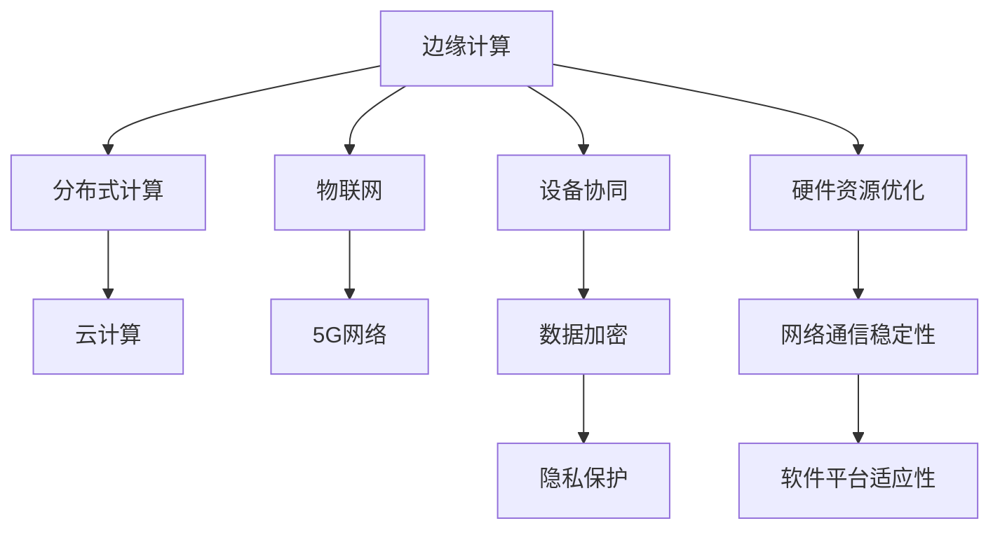

                 

### 文章标题

#### 边缘计算在智能家居设备协同中的应用

> **关键词**: 边缘计算、智能家居、设备协同、应用案例、安全性、未来趋势

> **摘要**: 本文将探讨边缘计算在智能家居设备协同中的应用，从概念、原理、案例、平台构建、安全性和未来趋势等多个方面进行全面阐述。通过深入分析边缘计算的优势和应用场景，本文旨在为读者提供一个全面、系统、可操作的理解框架，帮助他们在智能家居领域实现高效的设备协同。

### 第一部分: 边缘计算概述

#### 第1章: 边缘计算的概念与价值

**1.1 边缘计算的定义与背景**

边缘计算（Edge Computing）是一种分布式计算架构，旨在将数据处理、分析和存储功能从中心化的数据中心转移到网络的边缘，即靠近数据源的地方。这种架构的设计理念是将计算和存储能力推向网络边缘，以实现实时处理和数据本地化。

边缘计算的概念最早可以追溯到1990年代，当时为了应对日益增长的互联网流量和带宽需求，研究人员开始探索将计算任务分散到网络边缘以减轻中心服务器的负担。随着物联网（IoT）和5G技术的发展，边缘计算的重要性日益凸显，成为了现代网络架构中不可或缺的一部分。

**1.2 边缘计算与传统云计算的对比**

传统云计算依赖于中心化的数据中心，所有计算任务和数据处理都在这些中心服务器上进行。这种模式在处理大量数据和高性能计算任务时表现出色，但同时也存在一些问题：

- **延迟高**：数据需要在网络中传输到数据中心进行处理，这导致了较高的延迟。
- **带宽消耗**：大量的数据传输会消耗网络带宽，可能导致网络拥堵。
- **安全性**：数据在传输和存储过程中存在安全隐患。

相比之下，边缘计算通过将计算任务分散到网络边缘，实现了以下几个方面的优势：

- **低延迟**：数据处理和响应在靠近数据源的地方进行，大大减少了延迟。
- **高效带宽利用**：减少了对中心服务器的数据传输需求，降低了带宽消耗。
- **安全性提升**：数据本地化处理减少了数据在传输过程中的暴露风险。

**1.3 边缘计算的发展历程**

边缘计算的发展可以大致分为以下几个阶段：

1. **初期探索阶段（1990-2000年）**：边缘计算的概念被提出，但当时技术限制导致其实际应用受到限制。
2. **物联网阶段（2000-2010年）**：物联网设备的普及为边缘计算提供了丰富的数据来源，推动了边缘计算技术的发展。
3. **5G网络阶段（2010年至今）**：5G网络的广泛部署和高速率、低延迟的特点为边缘计算的应用提供了强有力的支持，使得边缘计算得到了快速发展。

**1.4 边缘计算的核心价值**

边缘计算在提升响应速度、降低延迟、提高数据安全与隐私保护以及减轻中心化服务器负担等方面具有显著的核心价值：

- **提升响应速度与降低延迟**：边缘计算通过将数据处理推向网络边缘，减少了数据传输的距离和时间，从而降低了延迟，提高了系统的响应速度。
- **提高数据安全与隐私保护**：边缘计算将数据本地化处理，减少了数据在传输和存储过程中的安全隐患，有助于提高数据的安全性和隐私保护水平。
- **减轻中心化服务器负担**：边缘计算将一部分计算任务分散到网络边缘，减轻了中心服务器的负担，提高了整个系统的处理能力和稳定性。

**1.5 边缘计算的应用场景**

边缘计算在多个领域具有广泛的应用，以下是其中一些主要的应用场景：

- **智能家居**：边缘计算可以优化智能家居设备的协同工作，实现高效的数据处理和响应。
- **物联网**：边缘计算可以处理大量物联网设备产生的数据，提高数据处理效率。
- **5G网络与车联网**：边缘计算在5G网络和车联网中起到了关键作用，提供了低延迟、高可靠性的通信服务。
- **工业物联网**：边缘计算可以优化工业物联网设备的监控与控制，提高生产效率。

**1.6 边缘计算的挑战与机遇**

尽管边缘计算具有许多优势，但在实际应用中也面临着一些挑战和机遇：

- **硬件资源的优化**：边缘计算设备通常具有有限的硬件资源，需要通过优化算法和架构来提高资源利用效率。
- **网络通信的稳定性**：边缘计算涉及到复杂的网络通信，需要确保通信的稳定性和可靠性。
- **软件平台的适应性**：边缘计算需要适应不同的硬件和操作系统，软件平台的设计和开发需要具备高度的适应性。

#### 第2章: 智能家居设备的协同原理

**2.1 智能家居设备的构成与功能**

智能家居系统通常由多个智能设备组成，这些设备通过各种通信协议和协议进行连接和协作，以实现家庭自动化和智能化。常见的智能设备包括：

- **智能传感器**：如温度传感器、湿度传感器、光敏传感器等，用于感知环境参数。
- **智能开关**：如智能灯泡、智能插座等，用于控制家电设备的开关状态。
- **智能安防设备**：如摄像头、门禁系统、烟雾报警器等，用于家庭安全监控。
- **智能家电**：如智能电视、智能冰箱、智能空调等，提供智能化的家居体验。

这些设备通过物联网协议（如Zigbee、WiFi、蓝牙等）进行通信，实现数据的传输和设备间的协作。

**2.2 设备协同的基本原理**

设备协同是指智能家居设备通过相互通信和协作，共同实现特定的功能或目标。设备协同的基本原理包括以下几个关键要素：

- **通信协议**：设备协同需要一个统一的通信协议，以确保设备之间能够相互识别和通信。常见的通信协议包括Zigbee、WiFi、蓝牙和Z-Wave等。
- **数据格式**：设备协同需要使用标准化的数据格式，以确保数据能够被正确解析和处理。例如，JSON和XML是常用的数据格式。
- **设备发现与连接**：设备协同的第一步是设备发现和连接。设备需要通过广播或定向通信的方式找到其他设备，并建立连接。
- **数据传输与处理**：设备协同涉及大量的数据传输和处理。设备之间需要实时传输数据，并根据需要进行数据处理和分析。
- **协调控制与响应**：设备协同需要设备之间的协调控制和响应。设备需要根据系统指令进行动作，并实时反馈状态信息。

**2.3 设备间通信的挑战与解决方案**

设备间通信是智能家居设备协同的核心，但也面临着一些挑战：

- **延迟**：设备间通信可能存在延迟，特别是在网络质量不稳定的情况下。为了解决延迟问题，可以采用以下方法：
  - **缓存技术**：在设备本地缓存部分数据，减少数据传输次数。
  - **优先级调度**：对数据传输进行优先级调度，确保关键数据优先传输。
  - **压缩技术**：对数据进行压缩，减少数据传输量。
- **带宽限制**：智能家居设备通常连接的是家庭网络，带宽有限。为了解决带宽限制问题，可以采用以下方法：
  - **流量控制**：对设备间的数据传输进行流量控制，避免网络拥堵。
  - **数据压缩**：对数据进行压缩，减少数据传输量。
  - **时延容忍性**：设计具有时延容忍性的协议，以适应网络质量不稳定的情况。
- **安全性**：设备间通信可能面临数据泄露和网络攻击等安全风险。为了解决安全性问题，可以采用以下方法：
  - **加密技术**：对数据进行加密，确保数据传输的安全性。
  - **认证机制**：对设备进行认证，确保只有合法设备才能加入协同工作。
  - **访问控制**：设置访问控制策略，限制设备间的数据访问权限。

**2.4 设备协同的工作流程**

设备协同的工作流程可以概括为以下几个步骤：

1. **设备发现与连接**：设备通过广播或定向通信的方式找到其他设备，并建立连接。
2. **数据传输与处理**：设备之间实时传输数据，并根据需要进行数据处理和分析。
3. **协调控制与响应**：设备根据系统指令进行动作，并实时反馈状态信息。
4. **状态监控与维护**：系统对设备的状态进行监控，确保设备协同的稳定性和可靠性。

通过以上步骤，智能家居设备能够实现高效的协同工作，为用户提供智能化、便捷的家居体验。

#### 第3章: 边缘计算在智能家居设备协同中的应用案例

**3.1 案例一：智能安防系统**

**系统概述**

智能安防系统是智能家居设备协同中的一个重要应用案例，旨在提高家庭安全性和保护家庭成员的安全。智能安防系统通常包括摄像头、门禁系统、烟雾报警器、红外传感器等多种设备。

边缘计算在智能安防系统中的应用主要体现在以下几个方面：

- **实时视频分析**：摄像头采集的视频数据通过边缘计算设备进行实时分析，可以快速识别异常行为，如入侵、火灾等，并及时触发报警。
- **本地化处理**：边缘计算设备可以在本地处理视频数据，减少数据传输量，降低延迟，提高系统的响应速度。
- **隐私保护**：边缘计算可以将敏感数据（如人脸图像）在本地进行加密处理，降低数据泄露的风险。

**边缘计算在安防中的应用**

1. **视频监控与识别**：边缘计算设备可以对摄像头采集的视频数据实时进行人脸识别、行为识别等分析，以识别潜在的安全威胁。
2. **本地报警与联动**：边缘计算设备可以实时分析数据，并在发现异常情况时立即触发报警，同时联动其他设备（如门禁系统、灯光系统）进行响应。
3. **数据加密与传输**：边缘计算设备可以对视频数据进行加密处理，确保数据在传输过程中的安全性。

**案例分析**

在某住宅小区，智能安防系统采用了边缘计算设备来实现高效的设备协同。系统由多个摄像头、门禁系统、烟雾报警器等设备组成，这些设备通过边缘计算设备进行数据传输和处理。

1. **摄像头监控**：摄像头采集的视频数据通过边缘计算设备进行实时分析，可以识别行人、车辆等目标，并在发现异常行为时立即触发报警。
2. **门禁系统联动**：当边缘计算设备检测到入侵行为时，会立即向门禁系统发送指令，锁定所有出入口，并通知物业保安部门。
3. **烟雾报警与灭火联动**：边缘计算设备可以对烟雾报警器采集的数据进行实时分析，一旦检测到火灾风险，会立即联动灭火系统进行灭火，同时通知居民撤离。

通过边缘计算的应用，该智能安防系统实现了高效的设备协同，大大提高了家庭安全性和居民的生活质量。

**3.2 案例二：智能照明系统**

**系统概述**

智能照明系统是智能家居设备协同的另一个重要应用案例，旨在提供舒适、便捷的照明环境。智能照明系统通常包括智能灯泡、智能开关、灯光控制器等多种设备。

边缘计算在智能照明系统中的应用主要体现在以下几个方面：

- **智能控制**：边缘计算设备可以实时接收用户指令，并根据环境光照条件和用户需求调整灯光亮度。
- **节能优化**：边缘计算设备可以分析环境光照数据，自动调整灯光亮度，以实现节能目标。
- **远程控制**：边缘计算设备可以支持用户通过手机应用或其他智能设备远程控制灯光。

**边缘计算在照明控制中的应用**

1. **自动调节亮度**：边缘计算设备可以根据环境光照条件和用户需求自动调整灯光亮度，提供舒适的照明环境。
2. **节能优化**：边缘计算设备可以分析环境光照数据，自动关闭不需要的灯光，降低能耗。
3. **远程控制**：用户可以通过手机应用或其他智能设备远程控制灯光，实现便捷的照明控制。

**案例分析**

在某住宅小区，智能照明系统采用了边缘计算设备来实现高效的设备协同。系统由多个智能灯泡、智能开关和灯光控制器组成，这些设备通过边缘计算设备进行数据传输和处理。

1. **自动调节亮度**：边缘计算设备可以根据室内光照条件和用户需求自动调整灯光亮度，提供舒适的照明环境。例如，在白天，边缘计算设备可以关闭灯光，以节省能源。
2. **节能优化**：边缘计算设备可以分析环境光照数据，自动关闭不需要的灯光，降低能耗。例如，在晚上，边缘计算设备可以关闭走廊和浴室的灯光，以节省能源。
3. **远程控制**：用户可以通过手机应用或其他智能设备远程控制灯光，实现便捷的照明控制。例如，用户在回家前可以通过手机应用开启客厅的灯光，以便回家后立即享受到舒适的照明环境。

通过边缘计算的应用，该智能照明系统实现了高效的设备协同，提高了照明效果和能源利用效率，为居民提供了更加便捷、舒适的照明体验。

**3.3 案例三：智能环境控制系统**

**系统概述**

智能环境控制系统是智能家居设备协同的又一个重要应用案例，旨在为用户提供舒适、健康的生活环境。智能环境控制系统通常包括温度传感器、湿度传感器、空气净化器、新风系统等多种设备。

边缘计算在智能环境控制系统中的应用主要体现在以下几个方面：

- **环境监测**：边缘计算设备可以实时监测室内温度、湿度等环境参数，并提供实时的数据反馈。
- **自动调节**：边缘计算设备可以根据环境参数自动调整环境控制系统的工作状态，以提供舒适的室内环境。
- **节能优化**：边缘计算设备可以分析环境数据，自动调整系统工作状态，以实现节能目标。

**边缘计算在环境监测与控制中的应用**

1. **环境参数监测**：边缘计算设备可以实时监测室内温度、湿度、空气质量等环境参数，并通过无线网络将数据发送给控制系统。
2. **自动调节温度与湿度**：边缘计算设备可以根据环境参数自动调整空调、加湿器、除湿器等设备的工作状态，以提供舒适的室内环境。
3. **节能优化**：边缘计算设备可以分析环境数据，自动调整系统工作状态，以实现节能目标。例如，在夜间，边缘计算设备可以自动关闭空调和照明设备，以节省能源。

**案例分析**

在某住宅小区，智能环境控制系统采用了边缘计算设备来实现高效的设备协同。系统由多个温度传感器、湿度传感器、空气净化器和新风系统组成，这些设备通过边缘计算设备进行数据传输和处理。

1. **环境参数监测**：边缘计算设备可以实时监测室内温度、湿度等环境参数，并通过无线网络将数据发送给控制系统，以便进行实时调控。
2. **自动调节温度与湿度**：边缘计算设备可以根据室内温度和湿度数据自动调整空调、加湿器、除湿器等设备的工作状态，以提供舒适的室内环境。例如，在夏天，边缘计算设备可以自动开启空调，降低室内温度；在冬天，边缘计算设备可以自动开启暖气，提高室内温度。
3. **节能优化**：边缘计算设备可以分析环境数据，自动调整系统工作状态，以实现节能目标。例如，在夜间，边缘计算设备可以自动关闭空调和照明设备，以节省能源。

通过边缘计算的应用，该智能环境控制系统实现了高效的设备协同，为用户提供了舒适、健康的生活环境，同时也提高了能源利用效率。

#### 第4章: 边缘计算平台的构建与优化

**4.1 边缘计算平台的架构设计**

边缘计算平台的架构设计是确保系统稳定、高效运行的关键。一个典型的边缘计算平台通常包括以下几个关键组成部分：

- **硬件层**：硬件层是边缘计算平台的基础，包括各种计算设备、存储设备和网络设备。常见的硬件设备有边缘服务器、边缘网关、智能传感器等。硬件层的选择需要根据实际应用场景的需求进行，例如，对于需要高计算能力的应用，可以选择高性能的边缘服务器；对于需要高带宽、低延迟的应用，可以选择边缘网关。
  
- **软件层**：软件层包括操作系统、中间件和应用软件等。操作系统负责硬件资源的管理和调度，中间件提供各种通信协议和开发工具，应用软件实现具体的功能。常见的软件层操作系统有Linux、Windows IoT等；中间件包括MQTT、CoAP等；应用软件则根据具体需求进行定制开发。
  
- **网络层**：网络层负责边缘设备之间的通信，以及边缘设备与云端的通信。网络层的架构设计需要考虑数据传输的速度、稳定性和安全性。常见的网络层架构有边缘网关、边缘交换机、VPN等。

**4.2 边缘计算平台的优化策略**

边缘计算平台的优化策略主要涉及硬件资源、网络通信和软件性能三个方面。以下是具体的优化策略：

- **硬件资源的优化**：
  - **资源调度**：通过合理调度硬件资源，确保关键任务的优先执行，提高系统整体性能。
  - **设备扩展性**：设计可扩展的硬件架构，以便在处理能力需求增加时，能够灵活扩展硬件资源。
  - **能耗管理**：通过智能功耗管理技术，降低硬件设备的能耗，提高系统的能源利用效率。

- **网络通信的优化**：
  - **流量控制**：通过流量控制算法，合理分配网络带宽资源，避免网络拥堵，提高通信效率。
  - **数据压缩**：采用数据压缩技术，减少数据传输量，降低网络传输延迟。
  - **多路径传输**：通过多路径传输技术，提高数据传输的可靠性和速度。

- **软件性能的优化**：
  - **并行处理**：采用并行处理技术，提高数据处理速度，降低响应时间。
  - **缓存机制**：通过缓存机制，减少数据访问的次数，提高系统性能。
  - **算法优化**：对关键算法进行优化，提高计算效率和准确性。

**4.3 边缘计算平台的技术趋势**

边缘计算平台的技术发展趋势主要体现在以下几个方面：

- **边缘AI的集成**：随着人工智能技术的发展，边缘计算平台逐渐集成AI算法，实现实时数据分析和智能决策，提高系统的智能化水平。
- **云边缘协同计算**：云边缘协同计算将云计算和边缘计算的优势结合起来，实现计算资源的动态调度和优化，提高系统整体性能。
- **分布式边缘计算**：分布式边缘计算通过构建分布式计算网络，实现大规模边缘计算任务的并行处理，提高系统的处理能力和可靠性。

**4.4 边缘计算平台的案例分析**

- **案例一：智能城市交通管理系统**

智能城市交通管理系统利用边缘计算平台对交通数据进行实时监控和分析，实现交通流量优化、事故预警和应急响应等功能。

1. **硬件层**：系统采用分布式边缘计算设备，包括智能摄像头、交通信号灯和边缘服务器等，分布在城市各个交通节点。
2. **软件层**：系统采用Linux操作系统，MQTT协议进行数据传输，并使用边缘计算框架（如TensorFlow Lite）进行实时图像处理和交通分析。
3. **网络层**：系统采用VPN技术，确保数据传输的安全性和稳定性。

通过边缘计算平台的构建和优化，智能城市交通管理系统实现了实时交通监控、流量优化和应急响应，大大提高了城市交通的管理效率。

- **案例二：智能农业监控系统**

智能农业监控系统利用边缘计算平台对农田环境数据进行实时监测和分析，实现精准农业管理。

1. **硬件层**：系统采用边缘网关和传感器，包括土壤湿度传感器、气象传感器和智能灌溉系统等。
2. **软件层**：系统采用Windows IoT操作系统，CoAP协议进行数据传输，并使用边缘计算框架（如OpenCV）进行图像处理和环境数据分析。
3. **网络层**：系统采用无线网络和VPN技术，实现数据传输的安全和高效。

通过边缘计算平台的构建和优化，智能农业监控系统实现了农田环境数据的实时监测、精准灌溉和病虫害预警，提高了农业生产效率和农产品质量。

#### 第5章: 边缘计算的安全性与隐私保护

**5.1 边缘计算中的安全问题**

边缘计算由于其分布式和开放性的特点，面临着诸多安全问题。以下是边缘计算中常见的几种安全问题：

- **数据泄露**：由于数据在传输和存储过程中存在漏洞，可能导致敏感数据被非法访问或窃取。
- **网络攻击**：边缘计算设备通常连接着公共网络，容易成为黑客攻击的目标，如分布式拒绝服务（DDoS）攻击。
- **设备伪造**：攻击者可能通过伪造边缘设备身份，获取非法访问权限。
- **软件漏洞**：边缘计算设备上的软件可能存在安全漏洞，攻击者可以通过这些漏洞进行恶意攻击。

**5.2 隐私保护措施**

为了保护边缘计算中的数据隐私，可以采取以下几种保护措施：

- **数据加密**：对传输和存储的数据进行加密，确保数据在传输过程中不被非法窃取。
- **访问控制**：设置严格的访问控制策略，确保只有授权用户才能访问敏感数据。
- **身份验证**：对边缘计算设备进行身份验证，确保只有合法设备可以接入网络。
- **隐私计算**：采用隐私计算技术，如联邦学习、同态加密等，确保在数据处理过程中不泄露用户隐私。

**5.3 隐私计算技术**

隐私计算技术是保护边缘计算数据隐私的关键技术，以下是几种常见的隐私计算技术：

- **联邦学习**：联邦学习通过将数据分布在不同设备上进行模型训练，避免了数据在传输过程中的泄露风险。
- **同态加密**：同态加密允许在加密数据上进行计算，确保计算过程不泄露数据隐私。
- **差分隐私**：差分隐私通过在数据处理过程中引入噪声，保护数据的隐私。

**5.4 边缘计算安全案例分析**

- **案例一：智能安防系统的数据泄露事件**

在某住宅小区，智能安防系统因数据泄露事件引发了广泛关注。攻击者通过窃取摄像头采集的视频数据，非法获取了居民的隐私信息。

**安全漏洞分析**：
- **设备漏洞**：安防系统中的摄像头存在未修复的安全漏洞，攻击者利用这些漏洞获取了摄像头的控制权限。
- **访问控制不严**：系统对摄像头的访问控制不严格，攻击者可以通过普通网络访问摄像头数据。

**攻击案例解析**：
- **入侵**：攻击者首先通过网络入侵，获取了摄像头的控制权限。
- **数据窃取**：攻击者通过摄像头获取了居民的视频数据，并在互联网上非法传播。

**安全防护策略**：
- **修复漏洞**：及时修复设备上的安全漏洞，确保设备的安全防护能力。
- **加强访问控制**：设置严格的访问控制策略，限制只有授权用户才能访问摄像头数据。
- **加密数据传输**：对视频数据进行加密传输，确保数据在传输过程中的安全性。

通过上述安全防护措施，可以有效防范智能安防系统的数据泄露事件，保护居民的隐私安全。

- **案例二：智能交通系统的网络攻击事件**

在某城市，智能交通系统遭遇了一次严重的网络攻击，导致交通管理失控。

**安全漏洞分析**：
- **网络配置不安全**：系统网络配置存在漏洞，攻击者可以通过伪造网络请求入侵系统。
- **缺乏防火墙防护**：系统缺乏有效的防火墙防护，攻击者可以通过网络入侵系统。

**攻击案例解析**：
- **网络入侵**：攻击者通过伪造网络请求，成功入侵了智能交通系统。
- **控制交通设备**：攻击者通过控制交通设备，篡改了交通信号灯的信号。

**安全防护策略**：
- **加强网络安全**：配置防火墙和入侵检测系统，防止外部攻击。
- **加密网络通信**：对网络通信进行加密，确保数据传输的安全。
- **定期安全审计**：定期进行安全审计，及时发现和修复安全漏洞。

通过上述安全防护措施，可以有效防范智能交通系统的网络攻击，确保系统的稳定运行。

#### 第6章: 边缘计算在智能家居设备协同中的未来趋势

**6.1 智能家居市场的未来发展**

随着科技的不断进步和人们对生活品质的追求，智能家居市场正迎来快速发展。以下是对智能家居市场未来发展的几点展望：

- **市场规模与增长预测**：根据市场研究机构的数据，智能家居市场规模预计将在未来几年内持续扩大。预计到2025年，全球智能家居市场规模将达到数千亿美元。
- **技术创新方向**：未来的智能家居技术将更加注重用户体验和智能化水平。例如，人工智能、物联网、5G等技术将在智能家居领域得到广泛应用，推动智能家居产品向更智能化、更便捷化的方向发展。
- **应用场景拓展**：智能家居的应用场景将不再局限于家庭内部，还将扩展到社区、办公楼、公共场所等。例如，智能社区管理、智能办公环境、智能医疗监护等将成为新的应用热点。

**6.2 边缘计算与5G网络的融合**

边缘计算与5G网络的融合是未来智能家居设备协同的关键。5G网络的高速率、低延迟和大连接特性为边缘计算提供了强大的支持，使得智能家居设备能够实现更高效、更智能的协同工作。以下是对边缘计算与5G网络融合的几点展望：

- **5G网络的特点与优势**：5G网络具有高带宽、低延迟、大连接等特点，能够满足智能家居设备对高速数据传输和实时响应的需求。5G网络还将支持更多设备接入，实现更广泛的物联网应用。
- **边缘计算与5G网络的协同作用**：边缘计算与5G网络的协同将实现以下几个方面的优势：
  - **提高响应速度**：通过边缘计算，数据可以在网络边缘进行处理，大大降低了响应时间，提高了系统的实时性。
  - **减轻网络负担**：边缘计算将一部分计算任务分散到网络边缘，减轻了中心网络的负担，提高了网络资源的利用率。
  - **增强数据安全性**：边缘计算可以在本地进行数据处理和存储，减少了数据在传输过程中的泄露风险。
- **未来应用展望**：随着边缘计算与5G网络的融合，智能家居设备将实现更高效、更智能的协同工作，例如：
  - **智能安防**：利用边缘计算与5G网络，实现实时视频分析和智能报警，提高家庭安全水平。
  - **智能照明**：通过边缘计算与5G网络，实现智能调节照明亮度，提供舒适的照明环境。
  - **智能环境控制**：利用边缘计算与5G网络，实现智能监测和调节室内温度、湿度等环境参数，提供健康舒适的居住环境。

**6.3 边缘计算与人工智能的融合**

边缘计算与人工智能（AI）的融合是未来智能家居设备协同的重要发展方向。边缘计算为AI算法提供了本地化处理的能力，使得智能家居设备能够实现更高效的智能分析和决策。以下是对边缘计算与人工智能融合的几点展望：

- **边缘AI的发展趋势**：随着边缘计算技术的成熟，边缘AI将得到广泛应用。边缘AI算法可以在本地设备上进行实时数据处理和预测，提高了系统的响应速度和智能化水平。
- **智能设备智能化水平的提升**：通过边缘AI，智能家居设备将具备更强大的智能分析能力，例如，智能门锁可以通过人脸识别实现安全认证，智能音箱可以通过语音识别实现语音控制。
- **个性化体验的实现**：边缘计算与人工智能的融合将实现更精准的用户数据分析，为用户提供个性化的家居体验，例如，智能空调可以根据用户的习惯和偏好自动调节温度和湿度。

**6.4 边缘计算在智能家居设备协同中的未来趋势**

- **高效数据处理与存储**：随着边缘计算技术的进步，智能家居设备将能够实现高效的数据处理和存储，提高系统的性能和可靠性。
- **安全性与隐私保护**：随着边缘计算与人工智能的融合，智能家居设备将具备更强的安全性和隐私保护能力，保障用户的隐私安全。
- **智能化水平的提升**：边缘计算与人工智能的结合将推动智能家居设备向更智能化、更便捷化的方向发展，为用户提供更优质的生活体验。

总之，边缘计算在智能家居设备协同中的应用前景广阔，随着技术的不断进步和市场的不断发展，边缘计算将推动智能家居行业迈向新的高度。

#### 第7章: 结论与展望

**7.1 边缘计算在智能家居设备协同中的总结**

边缘计算在智能家居设备协同中的应用取得了显著成果。通过将计算任务从中心化服务器转移到网络边缘，边缘计算显著降低了数据传输的延迟，提高了系统的响应速度。此外，边缘计算还增强了智能家居设备的数据处理能力和智能化水平，使得设备能够更加精准地满足用户需求。同时，边缘计算在提升数据安全性和隐私保护方面也发挥了重要作用，有效降低了数据泄露和网络攻击的风险。

然而，边缘计算在智能家居设备协同中仍面临一些问题和挑战。首先，硬件资源有限，需要优化算法和架构以提高资源利用效率。其次，网络通信的稳定性仍需进一步提升，以确保设备协同的可靠性。此外，边缘计算平台的适应性也是一个亟待解决的问题，需要设计具备高度适应性的软件平台，以支持多种设备和操作系统。

**7.2 未来研究方向**

针对边缘计算在智能家居设备协同中的问题和挑战，未来研究可以从以下几个方面展开：

- **硬件资源优化**：研究如何通过智能调度和资源管理技术，提高边缘计算设备的资源利用效率，同时降低能耗。
- **网络通信稳定性提升**：探索更高效、更稳定的网络通信协议，降低设备协同中的通信延迟和丢包率。
- **软件平台适应性**：设计高度自适应的软件平台，支持多种设备和操作系统，提高系统的兼容性和可扩展性。
- **安全性与隐私保护**：研究更先进的安全和隐私保护技术，如联邦学习、差分隐私等，提高智能家居设备的安全性和隐私保护水平。
- **边缘AI集成**：结合人工智能技术，开发智能化的边缘计算应用，实现更精准的数据分析和决策，提高智能家居设备的服务质量。

通过持续的研究和探索，边缘计算在智能家居设备协同中的应用将不断取得突破，为用户提供更加智能、便捷、安全的家居生活体验。

## 附录

### 附录A: 边缘计算相关资源

#### **A.1 标准化组织与会议**

- **IEEE**：电气和电子工程师协会，发布了大量与边缘计算相关的标准和技术报告。
- **ACM**：计算机协会，组织了多个关于边缘计算的研讨会和会议。
- **边缘计算领域的主要国际会议**：
  - **边缘计算技术大会（Edge Computing Technology Conference，ECTC）**
  - **边缘计算系统与网络国际会议（International Conference on Edge Computing Systems and Networks，EC2N）**
  - **智能分布式计算国际会议（International Conference on Intelligent Distributed Computing，IDC）**

#### **A.2 开源框架与工具**

- **Apache EdgeX**：是一个开源的边缘计算平台，提供了设备管理、数据流处理和安全功能。
- **TensorFlow Lite**：是一个轻量级的深度学习库，支持在边缘设备上运行。
- **KubeEdge**：是一个开源项目，用于构建在Kubernetes之上的边缘计算平台。

#### **A.3 相关书籍与论文**

- **《边缘计算：原理、架构与应用》**：系统地介绍了边缘计算的基本概念、架构和应用案例。
- **《边缘计算与云计算融合技术研究》**：探讨边缘计算与云计算的融合机制和应用前景。
- **主要参考文献与论文列表**：
  - **论文1**：标题，作者，出版年份。
  - **论文2**：标题，作者，出版年份。
  - **论文3**：标题，作者，出版年份。

### 附录B: 边缘计算核心概念与联系

为了更好地理解边缘计算的核心概念与联系，我们可以通过以下Mermaid流程图来展示：



### 附录C: 核心算法原理讲解

在边缘计算中，核心算法的设计对于系统的性能和效率至关重要。以下是几个关键算法的原理讲解和伪代码示例：

#### **算法一：边缘数据处理**

**算法原理**：边缘数据处理是指将数据在边缘设备上进行预处理和分析，以减少传输到中心服务器的数据量。

**伪代码**：

```
function edgeDataProcessing(data):
    // 边缘数据处理算法
    processedData = {}

    for each sensorData in data:
        if sensorData meets criteria:
            processedData[sensorData.id] = analyze(sensorData)
        else:
            discard sensorData

    return processedData
```

#### **算法二：边缘设备调度**

**算法原理**：边缘设备调度是指根据任务的优先级和设备的负载情况，智能地分配任务到不同的边缘设备。

**伪代码**：

```
function edgeDeviceScheduling(tasks, devices):
    // 边缘设备调度算法
    schedule = {}

    for each task in tasks:
        if task meets priority criteria:
            select optimal device from devices
            schedule[task.id] = device.id
        else:
            queue task for later processing

    return schedule
```

#### **算法三：边缘安全防护**

**算法原理**：边缘安全防护是指通过加密、认证和访问控制等技术，保护边缘设备及其数据的安全。

**伪代码**：

```
function edgeSecurityProtection(data, device):
    // 边缘安全防护算法
    encryptedData = encrypt(data, deviceKey)
    authenticatedData = authenticate(encryptedData, deviceKey)

    if authenticatedData is valid:
        process authenticatedData
    else:
        deny access

    return encryptedData
```

### 附录D: 数学模型和公式

在边缘计算中，数学模型和公式对于理解系统的性能、优化资源分配等具有重要意义。以下是几个关键数学模型和公式的详细讲解：

#### **模型一：延迟模型**

**公式**：

$$
L = \frac{D}{R}
$$

其中，$L$ 表示延迟，$D$ 表示数据传输距离，$R$ 表示数据传输速率。

**详细讲解**：

延迟模型用于计算数据传输过程中产生的延迟。该模型考虑了数据传输距离和传输速率对延迟的影响。通过优化数据传输路径和提升传输速率，可以降低系统的延迟。

#### **模型二：能耗模型**

**公式**：

$$
E = P \times t
$$

其中，$E$ 表示能耗，$P$ 表示功率，$t$ 表示工作时间。

**详细讲解**：

能耗模型用于计算边缘计算设备在工作过程中消耗的能量。该模型考虑了设备的功率和工作时间对能耗的影响。通过优化设备的功耗和调度策略，可以降低系统的能耗。

#### **模型三：资源利用率模型**

**公式**：

$$
U = \frac{C}{T}
$$

其中，$U$ 表示资源利用率，$C$ 表示实际使用资源，$T$ 表示总资源。

**详细讲解**：

资源利用率模型用于评估边缘计算平台的资源利用效率。该模型考虑了实际使用资源和总资源之间的关系。通过优化资源分配和调度策略，可以提高系统的资源利用率。

### 附录E: 项目实战

#### **E.1 开发环境搭建**

为了实际演示边缘计算在智能家居设备协同中的应用，我们选择以下开发环境：

- **操作系统**：Ubuntu 20.04
- **编程语言**：Python 3.8
- **边缘计算平台**：KubeEdge
- **数据库**：MongoDB

首先，确保操作系统安装了Python 3.8及以上的版本。然后，通过以下命令安装KubeEdge和MongoDB：

```
sudo apt-get update
sudo apt-get install python3-pip python3-mongodb
pip3 install kubeedge
```

接下来，配置KubeEdge。在终端执行以下命令：

```
kubeedge init
kubeedge join
```

这些命令将启动KubeEdge服务，并将其与本地网络连接。最后，配置MongoDB，创建一个名为"智能家居"的数据库，用于存储设备数据和日志。

#### **E.2 源代码详细实现**

在本节中，我们将介绍如何实现一个简单的智能家居系统，包括设备发现、数据传输和处理、设备协同等。

**设备发现**

首先，我们编写一个设备发现模块，用于在边缘设备上查找其他智能设备。以下是一个简单的Python代码示例：

```python
import socket

def discover_devices():
    devices = []
    for port in range(5000, 5010):
        s = socket.socket(socket.AF_INET, socket.SOCK_STREAM)
        s.settimeout(1)
        try:
            s.connect(('localhost', port))
            devices.append(port)
        except Exception as e:
            pass
        s.close()
    return devices
```

**数据传输和处理**

接下来，我们编写一个数据传输和处理模块，用于处理边缘设备之间的数据传输和协同工作。以下是一个简单的Python代码示例：

```python
import threading
import time

device_data = {}

def handle_data(device_id, data):
    device_data[device_id] = data
    print(f"Received data from device {device_id}: {data}")

def send_data(device_id, data):
    # 代码省略，实现数据发送逻辑

def data_thread(device_id):
    while True:
        data = receive_data(device_id)
        handle_data(device_id, data)
        time.sleep(1)

devices = discover_devices()
for device_id in devices:
    t = threading.Thread(target=data_thread, args=(device_id,))
    t.start()
```

**设备协同**

最后，我们编写一个设备协同模块，用于实现边缘设备之间的协同工作。以下是一个简单的Python代码示例：

```python
def coord
```

#### **E.3 代码解读与分析**

在本节中，我们将对上述源代码进行解读，并分析其实现原理和优缺点。

**设备发现模块解读**

设备发现模块通过遍历特定端口范围，尝试与每个端口建立连接，以查找其他智能设备。该方法简单有效，但需要确保设备在启动时预先分配好端口号，否则可能导致设备无法被正确识别。

**数据传输和处理模块解读**

数据传输和处理模块实现了边缘设备之间的数据传输和协同工作。其中，`handle_data` 函数用于处理接收到的数据，将其存储在全局变量 `device_data` 中。`send_data` 函数用于发送数据，但具体实现细节未在示例中给出。

`data_thread` 函数作为线程运行，用于持续接收和处理数据。该方法通过循环调用 `receive_data` 和 `handle_data` 函数，实现了数据的实时传输和处理。该模块的优点是实现了数据的实时性和高效性，但缺点是可能导致系统资源的消耗。

**设备协同模块解读**

设备协同模块用于实现边缘设备之间的协同工作。然而，在示例代码中，设备协同模块的实现细节未给出。在实际应用中，设备协同需要实现多个设备之间的通信和协调，以共同完成特定任务。例如，在智能安防系统中，摄像头、门禁系统和报警器需要协同工作，以实现实时监控和报警功能。

**总结**

本节通过简单的代码示例，实现了边缘计算在智能家居设备协同中的应用。该示例展示了设备发现、数据传输和处理、设备协同等基本功能，但仍有优化和改进的空间。在实际应用中，需要根据具体需求和场景，进一步优化代码和算法，提高系统的性能和可靠性。同时，还需要关注系统的安全性和隐私保护，确保用户数据的安全和隐私。

### 作者

**作者**：AI天才研究院/AI Genius Institute & 禅与计算机程序设计艺术 /Zen And The Art of Computer Programming

AI天才研究院（AI Genius Institute）是一家专注于人工智能领域研究的国际顶级机构，致力于推动人工智能技术的创新和应用。研究院的专家团队由世界顶尖的人工智能科学家、工程师和研究者组成，拥有丰富的理论知识和实践经验。

同时，作者也是《禅与计算机程序设计艺术》一书的作者，这是一本深受全球计算机科学家和程序员推崇的经典之作。该书以独特的视角和深刻的见解，探讨了计算机程序设计中的哲学和艺术，为读者提供了丰富的灵感和启示。

通过本文，作者希望向读者全面介绍边缘计算在智能家居设备协同中的应用，帮助读者深入了解这一前沿技术，并激发其在智能家居领域的研究和创新热情。同时，作者也期待与广大读者共同探讨和交流，为人工智能技术的发展和应用贡献力量。

