                 

# 远程绩效管理：评估和提升远程团队表现的方法

> **关键词**：远程工作、绩效管理、评估方法、团队协作、激励机制、项目实施

> **摘要**：随着远程工作的普及，如何有效地进行远程绩效管理成为企业面临的挑战。本文将从远程绩效管理的基本概念、评估方法、沟通与协作、实施与优化等方面进行详细探讨，并提供实际案例，旨在为企业和远程团队提供评估和提升表现的方法。

## 第一部分：远程绩效管理概述

### 第1章：远程绩效管理的基本概念

#### 1.1 远程工作的起源

远程工作的概念起源于20世纪80年代，当时一些公司开始尝试允许员工在家中工作。这个时期的远程工作主要依赖于电话和电子邮件等通信手段，工作内容和时间安排相对灵活。随着互联网和信息技术的发展，远程工作的形式和范围逐渐扩大。

#### 1.1.1 远程工作的现状与挑战

目前，全球范围内，远程工作已成为一种普遍的工作方式。特别是在COVID-19疫情期间，远程工作成为许多企业和员工的主要工作模式。然而，远程工作也带来了一系列挑战，如沟通障碍、工作与生活平衡、绩效评估等。

#### 1.1.2 远程绩效管理的必要性

远程绩效管理是确保远程团队工作效果的关键。有效的远程绩效管理可以帮助企业：

1. **确保工作目标实现**：通过明确的目标设定和分解，确保团队成员了解自己的工作职责和期望成果。
2. **提升团队协作效率**：通过有效的沟通与协作工具和方法，提升团队成员之间的协作效率。
3. **促进员工自我管理**：远程工作环境需要员工具备更强的自我管理能力，有效的绩效管理可以帮助员工自我提升。

#### 1.2 远程绩效管理的定义与目标

远程绩效管理是指企业在远程工作环境下，通过设定目标、评估绩效、沟通反馈等手段，对远程团队进行有效管理的活动。

远程绩效管理的目标包括：

1. **确保工作目标的实现**：确保团队成员明确工作目标，并按照计划完成工作。
2. **提升团队协作效率**：通过有效的沟通与协作，提升团队整体工作效率。
3. **促进员工成长与发展**：通过绩效评估和反馈，帮助员工了解自己的工作表现，促进个人成长。
4. **提升企业竞争力**：通过远程绩效管理，确保企业远程团队的工作质量和效率，提升企业整体竞争力。

#### 1.3 远程绩效管理的核心要素

远程绩效管理的核心要素包括目标设定与分解、沟通与协作、监督与反馈、激励与奖励。

##### 1.3.1 目标设定与分解

目标设定是远程绩效管理的基础。企业需要根据整体战略目标，为远程团队设定具体的工作目标，并分解为可操作的任务。这有助于团队成员明确自己的工作职责和目标，提高工作效率。

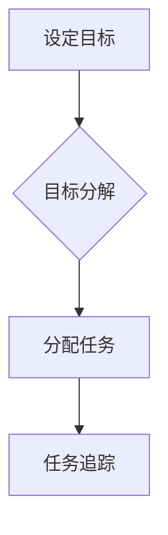

##### 1.3.2 沟通与协作

沟通与协作是远程绩效管理的关键。企业需要选择合适的沟通工具，建立高效的沟通机制，确保团队成员之间的信息交流畅通。同时，通过协作工具，促进团队成员之间的协同工作。

```mermaid
graph TD
    A[沟通工具选择] --> B{沟通机制建立}
    B --> C[信息交流]
    C --> D[协作工具使用}
```

##### 1.3.3 监督与反馈

监督与反馈是确保远程团队工作质量和效率的重要手段。企业需要通过定期检查、任务追踪等方式，监督团队成员的工作进展，及时发现问题并进行反馈。

```mermaid
graph TD
    A[定期检查] --> B{任务追踪}
    B --> C[问题发现}
    C --> D[反馈机制}
```

##### 1.3.4 激励与奖励

激励与奖励是提升远程团队积极性和工作效率的重要手段。企业需要通过适当的激励措施，如奖励制度、荣誉表彰等，激发团队成员的工作热情。

```mermaid
graph TD
    A[奖励制度] --> B{荣誉表彰}
    B --> C[工作积极性}
```

### 第2章：远程绩效评估的方法与工具

#### 2.1 传统绩效评估方法

传统绩效评估方法主要包括基于目标的评估、基于绩效指标的评估和360度评估。

##### 2.1.1 基于目标的评估

基于目标的评估方法是指根据设定的工作目标，对团队成员的工作表现进行评估。这种方法强调目标的明确性和可实现性，有助于激发团队成员的工作积极性。

```python
# 伪代码：基于目标的评估
def target_based_evaluation(target, actual):
    if actual >= target:
        return "优秀"
    elif actual >= 0.8 * target:
        return "良好"
    else:
        return "一般"
```

##### 2.1.2 基于绩效指标的评估

基于绩效指标的评估方法是指根据设定的绩效指标，对团队成员的工作表现进行评估。这种方法强调绩效指标的科学性和客观性，有助于全面了解团队成员的工作表现。

```python
# 伪代码：基于绩效指标的评估
def performance_index_evaluation(performance_index):
    if performance_index >= 90:
        return "优秀"
    elif performance_index >= 80:
        return "良好"
    else:
        return "一般"
```

##### 2.1.3 360度评估

360度评估方法是指通过上级、同事、下属和客户等多方面的反馈，对团队成员的工作表现进行全面评估。这种方法有助于从多个角度了解团队成员的工作表现，提高评估的全面性和准确性。

```python
# 伪代码：360度评估
def three_sixty_evaluation(feedbacks):
    positive_feedbacks = sum([1 for feedback in feedbacks if feedback == "正面"])
    negative_feedbacks = sum([1 for feedback in feedbacks if feedback == "负面"])
    if positive_feedbacks > negative_feedbacks:
        return "优秀"
    elif positive_feedbacks == negative_feedbacks:
        return "一般"
    else:
        return "需要改进"
```

#### 2.2 远程绩效评估的特殊性

远程工作环境对绩效评估方法提出了特殊的要求。远程绩效评估的特殊性主要体现在以下几个方面：

##### 2.2.1 远程工作环境的影响

远程工作环境使得团队成员之间的直接沟通和监督变得更加困难，这对绩效评估带来了挑战。企业需要选择合适的评估方法和工具，以适应远程工作环境。

##### 2.2.2 远程团队沟通的限制

远程团队沟通的限制可能导致信息传递的不准确和不及时，从而影响绩效评估的准确性。企业需要建立高效的沟通机制，确保团队成员之间的信息交流畅通。

##### 2.2.3 数据收集与处理的挑战

远程工作环境使得数据收集和处理变得更加复杂。企业需要选择合适的工具和方法，确保数据的准确性和完整性。

#### 2.3 远程绩效评估的工具与技巧

##### 2.3.1 自动化绩效评估工具

自动化绩效评估工具可以帮助企业自动收集和处理团队成员的工作数据，提高绩效评估的效率和准确性。常用的自动化绩效评估工具包括HR系统、项目管理工具和数据分析工具等。

##### 2.3.2 在线协作工具

在线协作工具可以帮助企业实现团队成员之间的实时沟通和协作，提高团队的整体工作效率。常用的在线协作工具包括Slack、Microsoft Teams和Zoom等。

##### 2.3.3 远程绩效评估的实践技巧

1. **明确评估标准和流程**：企业需要制定明确的评估标准和流程，确保团队成员了解评估的内容和方法。
2. **定期进行绩效评估**：企业需要定期进行绩效评估，及时发现问题并进行反馈。
3. **注重过程评估**：除了对工作结果的评估，企业还应该注重对工作过程的评估，了解团队成员的工作习惯和改进空间。

### 第3章：远程团队的沟通与协作

#### 3.1 远程团队沟通的重要性

远程团队沟通对远程绩效管理至关重要。有效的沟通可以确保团队成员之间的信息传递畅通，提高团队的整体工作效率。以下是远程团队沟通的重要性：

1. **确保工作目标的实现**：通过有效的沟通，团队成员可以明确工作目标，确保工作方向一致。
2. **提高团队协作效率**：通过沟通，团队成员可以了解彼此的工作进展和需求，提高协作效率。
3. **减少误解和冲突**：通过沟通，团队成员可以及时解决问题，减少误解和冲突。
4. **促进个人成长与发展**：有效的沟通可以帮助团队成员了解自己的工作表现，促进个人成长。

#### 3.1.1 沟通对远程绩效管理的影响

沟通对远程绩效管理的影响主要体现在以下几个方面：

1. **提高工作效率**：有效的沟通可以减少团队成员之间的等待时间，提高工作效率。
2. **减少错误和遗漏**：通过沟通，团队成员可以及时确认信息，减少错误和遗漏。
3. **促进团队凝聚力**：通过沟通，团队成员可以增进了解和信任，提高团队凝聚力。
4. **提升工作满意度**：有效的沟通可以让团队成员感受到被重视和关注，提升工作满意度。

#### 3.1.2 远程团队沟通的障碍

远程团队沟通可能面临以下障碍：

1. **时差和地理位置**：远程团队分布在不同的地理位置，可能存在时差和沟通不便的问题。
2. **技术问题**：远程沟通可能受到网络连接、设备故障等技术问题的影响。
3. **沟通方式单一**：远程沟通可能局限于文字、语音等单一方式，缺乏面对面沟通的丰富性和直观性。

#### 3.1.3 提高远程团队沟通效率的方法

为了提高远程团队沟通效率，企业可以采取以下方法：

1. **选择合适的沟通工具**：根据团队需求和沟通场景，选择合适的沟通工具，如Slack、Microsoft Teams等。
2. **明确沟通目标和流程**：在每次沟通前，明确沟通的目标和流程，确保沟通有针对性和效率。
3. **建立沟通规范**：制定沟通规范，如回复时间、沟通礼仪等，确保沟通秩序和效率。
4. **定期沟通会议**：定期举行沟通会议，如每周一次，确保团队成员之间的信息传递畅通。
5. **鼓励互动和反馈**：鼓励团队成员在沟通中互动和反馈，提高沟通质量和效果。

#### 3.2 远程协作工具的使用

远程协作工具可以帮助企业实现团队成员之间的实时沟通和协作，提高团队的整体工作效率。以下是一些常用的远程协作工具：

##### 3.2.1 项目管理工具

项目管理工具可以帮助企业实现任务分配、进度跟踪和协作。以下是一些常用的项目管理工具：

1. **Asana**：支持任务分配、进度跟踪和协作。
2. **Trello**：基于看板（Kanban）方法，直观地展示任务进度。
3. **Jira**：支持敏捷开发，提供全面的任务跟踪和协作功能。

##### 3.2.2 文档协作工具

文档协作工具可以帮助企业实现文档的共享和协作。以下是一些常用的文档协作工具：

1. **Google Docs**：支持多人实时编辑文档。
2. **Microsoft Word Online**：支持多人在线编辑文档。
3. **Notion**：支持多类型的协作文档，如笔记、任务、数据库等。

##### 3.2.3 视频会议工具

视频会议工具可以帮助企业实现远程团队的实时交流和协作。以下是一些常用的视频会议工具：

1. **Zoom**：支持多人实时视频会议，提供高质量的音视频体验。
2. **Microsoft Teams**：集成视频会议、即时通讯和协作功能。
3. **Google Meet**：支持多人实时视频会议，与Google Workspace集成。

#### 3.3 远程团队的协作模式

远程团队的协作模式主要包括以下几种：

##### 3.3.1 分工与协作

分工与协作是远程团队协作的基础。企业需要根据团队成员的技能和特长，进行合理的分工，确保任务的高效完成。同时，通过协作工具，实现团队成员之间的信息共享和任务协同。

##### 3.3.2 冲突管理

远程团队在协作过程中可能面临冲突，如任务分配不均、沟通不畅等。企业需要建立有效的冲突管理机制，及时解决冲突，确保团队和谐。

##### 3.3.3 风险管理与应对

远程团队在协作过程中可能面临各种风险，如技术风险、市场风险等。企业需要建立有效的风险管理机制，识别、评估和应对风险，确保项目的顺利进行。

### 第二部分：远程绩效管理的实施与优化

#### 第4章：制定远程绩效管理策略

#### 4.1 制定远程绩效管理策略的步骤

制定远程绩效管理策略是确保远程团队高效运作的关键。以下是制定远程绩效管理策略的步骤：

##### 4.1.1 分析企业远程工作的特点

首先，企业需要分析远程工作的特点，包括工作内容、工作模式、团队成员分布等。这有助于了解远程工作的实际情况，为制定策略提供依据。

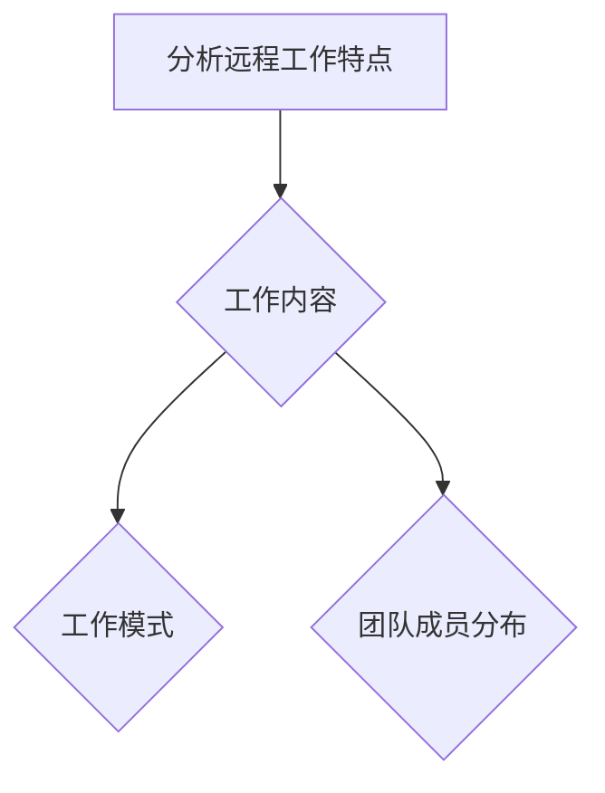

##### 4.1.2 设定远程绩效管理目标

根据企业远程工作的特点，设定远程绩效管理目标。这些目标应包括工作目标的实现、团队协作效率的提升、员工自我管理的增强等方面。

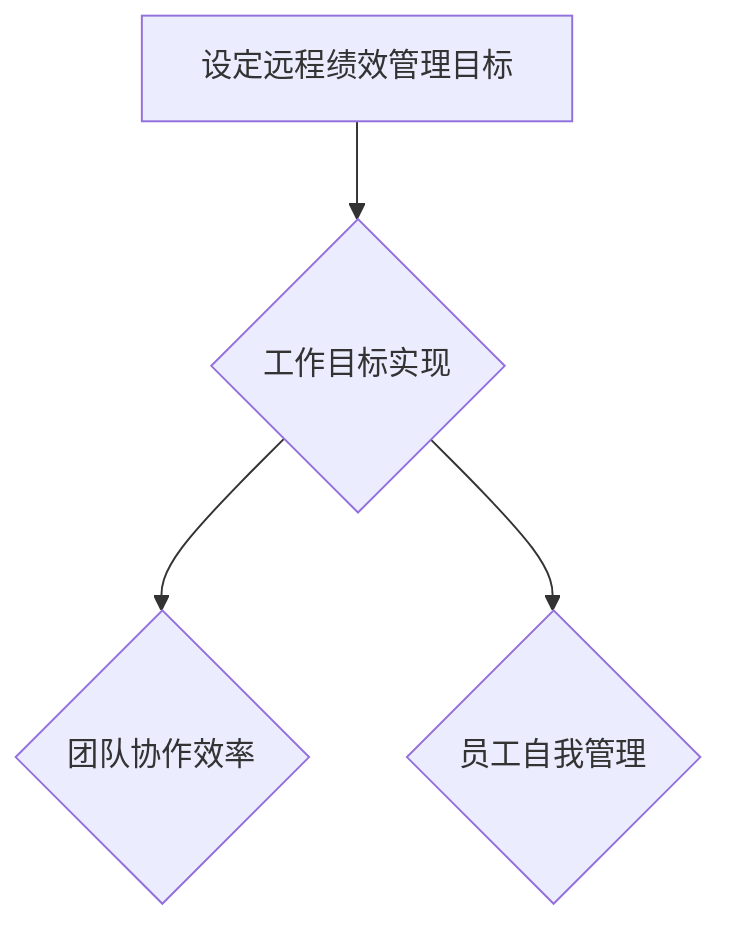

##### 4.1.3 确定评估标准和流程

为了确保远程绩效管理的有效性，企业需要制定明确的评估标准和流程。这些标准和流程应包括评估指标、评估周期、评估方法等。

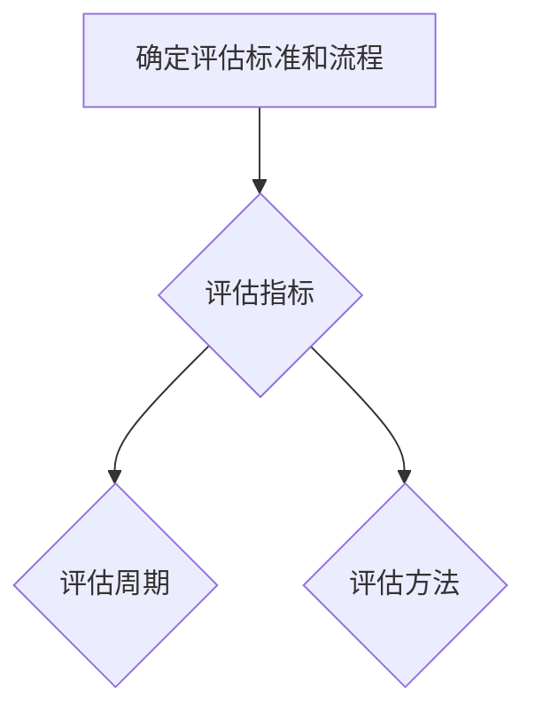

#### 4.2 远程绩效管理策略的实施

##### 4.2.1 培训与指导

在制定远程绩效管理策略后，企业需要对团队成员进行培训与指导。培训内容应包括远程工作的基本技能、绩效管理的方法和工具等。

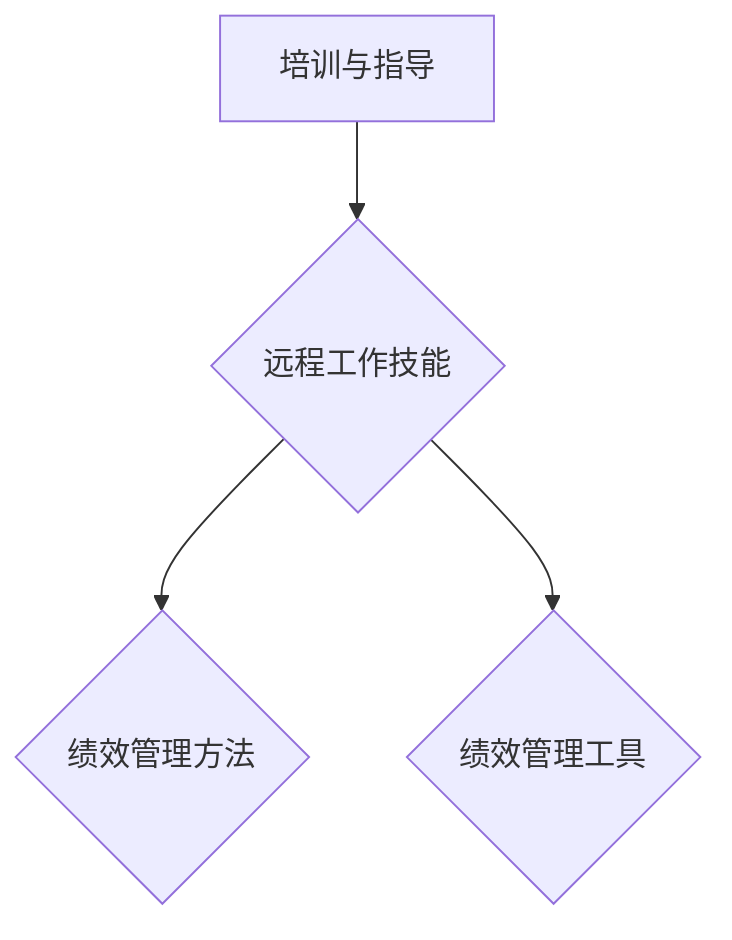

##### 4.2.2 激励与奖励

为了激发团队成员的积极性，企业需要制定激励与奖励机制。这些激励机制应包括绩效奖金、荣誉表彰等。

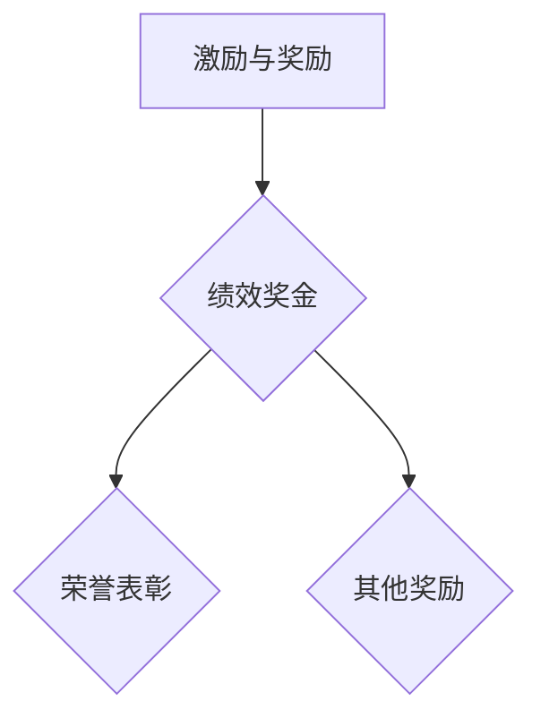

##### 4.2.3 监控与反馈

在实施远程绩效管理策略的过程中，企业需要持续监控团队成员的工作表现，并及时进行反馈。这有助于发现并解决问题，提升远程团队的工作效率。

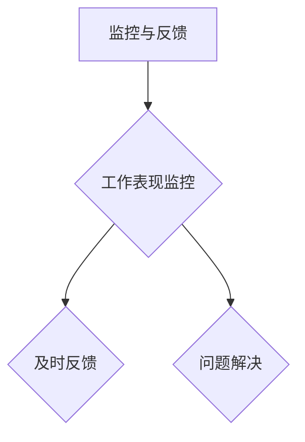

### 第5章：提升远程团队绩效的方法

#### 5.1 增强团队凝聚力

团队凝聚力是提升远程团队绩效的重要因素。以下是一些增强团队凝聚力的方法：

##### 5.1.1 建立信任

信任是团队凝聚力的基础。企业可以通过定期沟通、分享工作成果、共同解决问题等方式，建立团队成员之间的信任。

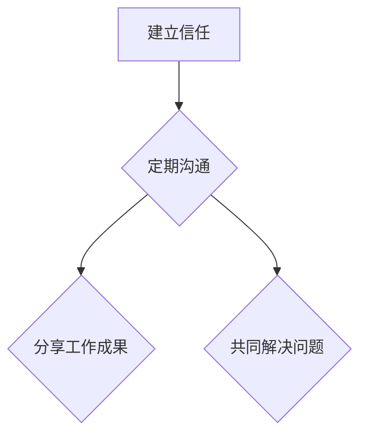

##### 5.1.2 促进团队沟通

有效的沟通可以促进团队成员之间的了解和合作，增强团队凝聚力。企业可以通过视频会议、即时通讯、团队活动等方式，促进团队沟通。

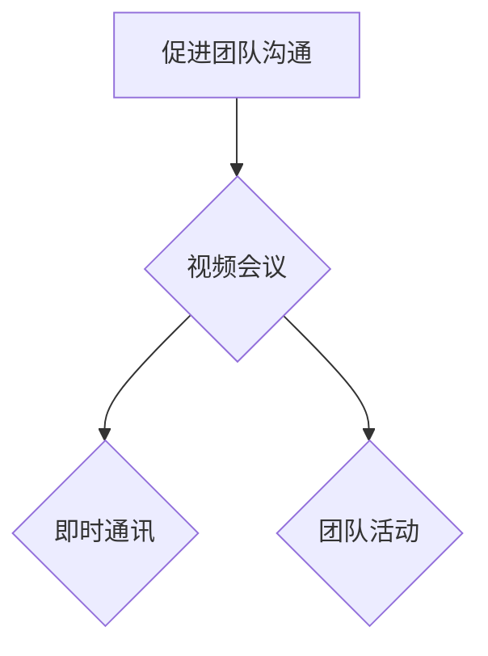

##### 5.1.3 定期团队活动

定期团队活动可以帮助团队成员放松身心，增强团队凝聚力。企业可以组织线上团建活动、游戏竞赛等，让团队成员在轻松的氛围中增进了解。

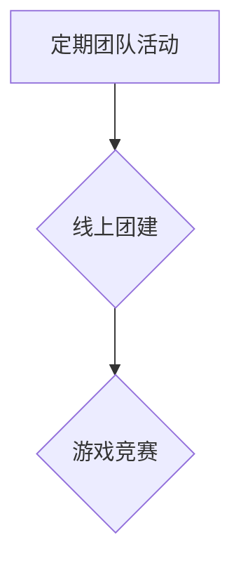

#### 5.2 优化工作流程

优化工作流程是提升远程团队绩效的重要方法。以下是一些优化工作流程的方法：

##### 5.2.1 精简流程

精简流程可以减少团队成员的工作负担，提高工作效率。企业可以通过分析工作流程，找出冗余环节，进行精简。

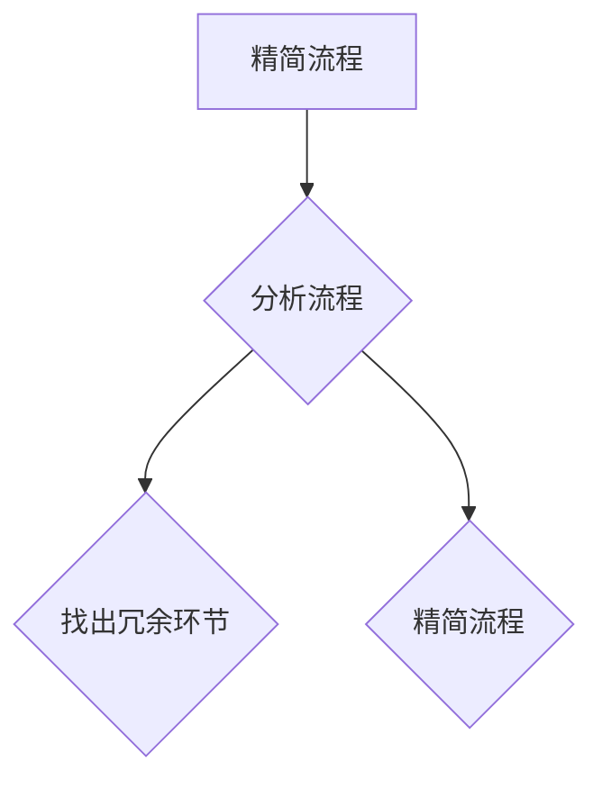

##### 5.2.2 提高工作效率

提高工作效率可以提升远程团队的整体绩效。企业可以通过引入自动化工具、优化工作流程等方式，提高工作效率。

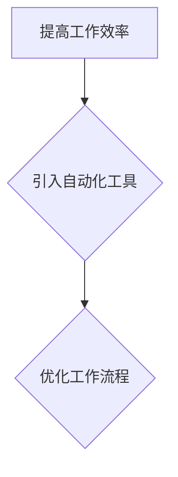

##### 5.2.3 灵活应对变化

远程工作环境变化多端，企业需要具备灵活应对变化的能力。通过建立灵活的工作机制，企业可以更好地适应环境变化，提升团队绩效。

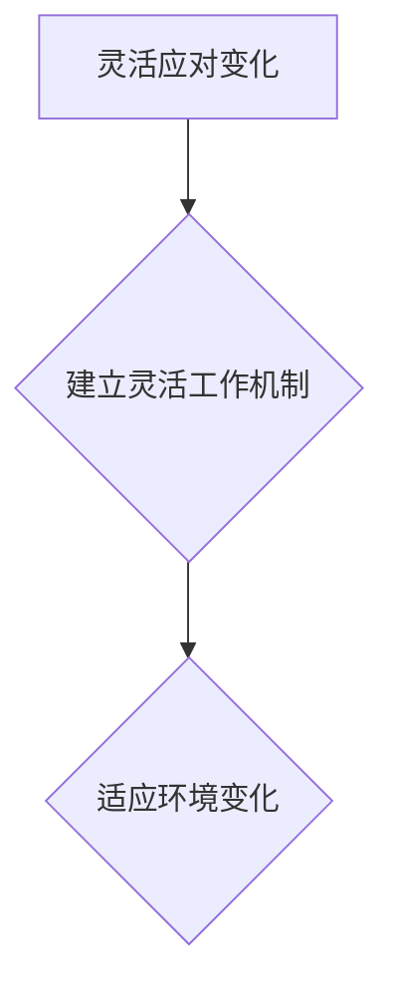

#### 5.3 提高个人绩效

提高个人绩效是提升远程团队整体绩效的关键。以下是一些提高个人绩效的方法：

##### 5.3.1 目标设定与分解

通过明确的目标设定与分解，个人可以更好地规划工作，提高工作效率。企业可以指导团队成员设定明确的个人目标，并分解为可操作的任务。

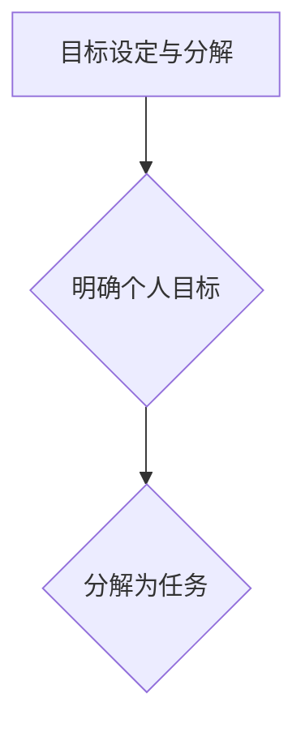

##### 5.3.2 时间管理与优先级

合理的时间管理和优先级设置可以帮助个人更好地安排工作，提高工作效率。企业可以指导团队成员掌握时间管理和优先级设置的方法，提高个人绩效。

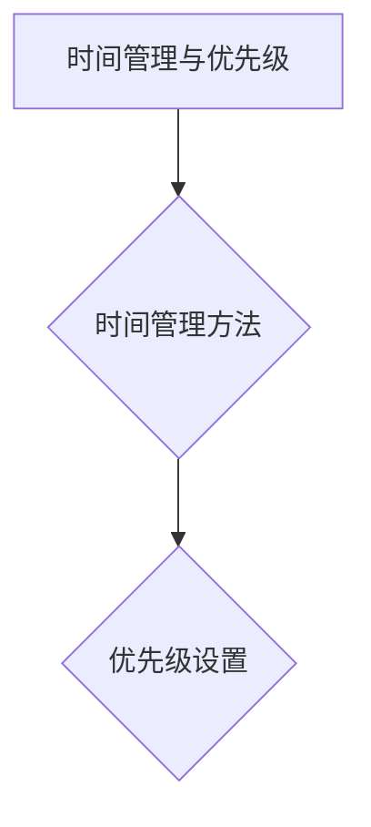

##### 5.3.3 持续学习与改进

持续学习和改进可以帮助个人不断提升自己的能力和素质，提高个人绩效。企业可以提供培训和学习资源，鼓励团队成员持续学习和改进。

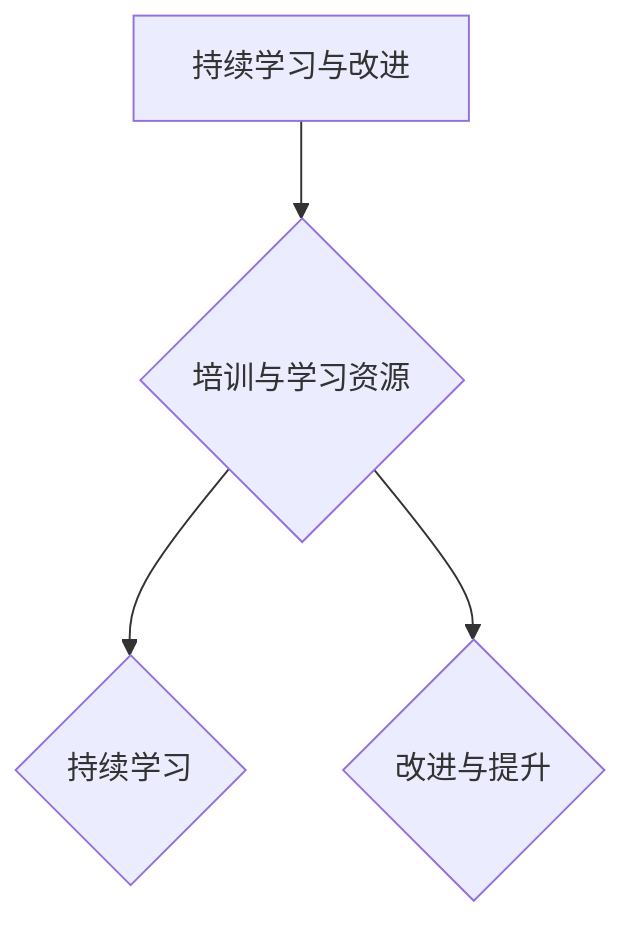

### 第三部分：远程绩效管理中的挑战与解决方案

#### 第6章：远程绩效管理中的挑战与解决方案

#### 6.1 远程绩效管理中的常见问题

远程绩效管理在实际应用中可能会遇到以下常见问题：

##### 6.1.1 沟通障碍

远程团队分布在不同的地理位置，可能面临沟通障碍。这包括时差、网络连接不稳定、沟通工具不合适等问题。

##### 6.1.2 工作与生活平衡

远程工作可能导致工作与生活平衡问题。一些员工可能会面临家庭责任、子女教育等压力，影响工作效率。

##### 6.1.3 激励与反馈不足

在远程工作环境中，激励与反馈机制可能不够完善，导致员工缺乏工作动力和改进方向。

#### 6.2 解决远程绩效管理中的问题

针对上述问题，企业可以采取以下解决方案：

##### 6.2.1 提高沟通效率

为了提高沟通效率，企业可以采取以下措施：

1. **选择合适的沟通工具**：根据团队需求和沟通场景，选择合适的沟通工具，如Slack、Microsoft Teams等。
2. **建立沟通规范**：制定沟通规范，如回复时间、沟通礼仪等，确保沟通秩序和效率。
3. **定期沟通会议**：定期举行沟通会议，如每周一次，确保团队成员之间的信息传递畅通。

##### 6.2.2 建立健康的工作与生活平衡

为了建立健康的工作与生活平衡，企业可以采取以下措施：

1. **灵活工作时间**：提供灵活的工作时间安排，让员工根据个人需求调整工作时间。
2. **远程工作支持**：提供远程工作所需的技术支持和资源，帮助员工在家中高效工作。
3. **鼓励休息与放松**：鼓励员工在工作之余进行休息和放松，保持身心健康。

##### 6.2.3 完善激励与反馈机制

为了完善激励与反馈机制，企业可以采取以下措施：

1. **设立明确的绩效目标**：为员工设定明确的绩效目标，确保员工了解工作期望和考核标准。
2. **及时反馈与激励**：定期进行绩效反馈，对优秀员工进行奖励和表彰，激发员工的工作动力。
3. **培训与发展机会**：提供培训和发展机会，帮助员工提升技能和职业素养，实现个人成长。

#### 6.3 案例研究

以下是一个远程绩效管理案例研究，旨在展示如何解决远程绩效管理中的问题。

##### 6.3.1 案例介绍

某互联网公司由于业务扩张，决定采用远程工作模式。然而，在实施过程中，公司发现远程绩效管理面临诸多挑战，如沟通障碍、工作与生活平衡问题、激励与反馈不足等。

##### 6.3.2 挑战与解决方案

1. **沟通障碍**

   **挑战**：由于团队成员分布在不同的地理位置，沟通效率较低，导致信息传递不及时。

   **解决方案**：公司选择了Slack作为主要沟通工具，建立了一个统一的沟通平台。同时，制定了沟通规范，明确了回复时间和沟通礼仪，提高了沟通效率。

2. **工作与生活平衡**

   **挑战**：一些员工在远程工作模式下，难以平衡工作和生活，导致工作效率下降。

   **解决方案**：公司提供了远程工作所需的技术支持和资源，帮助员工在家中高效工作。同时，鼓励员工在工作之余进行休息和放松，保持身心健康。

3. **激励与反馈不足**

   **挑战**：公司缺乏有效的激励与反馈机制，导致员工工作动力不足。

   **解决方案**：公司设立了明确的绩效目标，为员工设定了可量化的工作目标。同时，定期进行绩效反馈，对优秀员工进行奖励和表彰，激发员工的工作动力。

##### 6.3.3 案例总结与启示

通过实施远程绩效管理策略，该公司解决了远程绩效管理中的挑战，提高了团队的整体工作效率和绩效。以下是一些总结和启示：

1. **选择合适的沟通工具**：根据团队需求和沟通场景，选择合适的沟通工具，确保沟通效率。
2. **建立健康的工作与生活平衡**：提供远程工作所需的技术支持和资源，鼓励员工进行休息和放松。
3. **完善激励与反馈机制**：设立明确的绩效目标，定期进行绩效反馈和奖励，激发员工的工作动力。

### 第四部分：远程绩效管理实践

#### 第7章：远程绩效管理项目规划

#### 7.1 项目规划的重要性

项目规划是远程绩效管理成功实施的关键环节。一个良好的项目规划可以帮助企业明确项目目标、确定项目范围、规划项目时间和资源，为项目的顺利实施奠定基础。

##### 7.1.1 远程绩效管理项目概述

远程绩效管理项目旨在通过制定和实施有效的绩效管理策略，提升远程团队的工作效率和绩效。项目的主要目标包括：

1. **确保工作目标的实现**：明确团队成员的工作职责和目标，确保工作任务的完成。
2. **提升团队协作效率**：通过有效的沟通与协作工具，提高团队整体工作效率。
3. **促进员工成长与发展**：通过绩效评估和反馈，帮助员工提升个人能力和职业素养。

##### 7.1.2 项目目标与范围

在项目规划阶段，企业需要明确项目的具体目标和范围。项目的目标应包括：

1. **工作目标实现**：确保团队成员了解自己的工作职责和目标，并按照计划完成工作任务。
2. **团队协作效率**：通过有效的沟通与协作工具，提高团队整体工作效率。
3. **员工成长与发展**：通过绩效评估和反馈，促进员工的个人成长和职业发展。

项目的范围应包括：

1. **项目团队**：确定项目团队成员及其职责和角色。
2. **项目任务**：明确项目需要完成的任务和工作内容。
3. **项目资源**：确定项目所需的资源，包括人力、物力、财力等。

##### 7.1.3 项目时间与资源规划

在项目规划阶段，企业需要制定项目的时间表和资源计划。项目时间规划应包括：

1. **项目启动阶段**：包括项目立项、需求分析、团队组建等。
2. **项目实施阶段**：包括绩效管理策略制定、沟通与协作工具的实施、绩效评估与反馈等。
3. **项目验收阶段**：包括项目成果验收、项目总结与评估等。

项目资源规划应包括：

1. **人力资源**：确定项目团队成员及其职责和角色。
2. **物力资源**：包括办公设备、网络设备、协作工具等。
3. **财力资源**：确定项目预算和资金使用计划。

#### 7.2 项目规划的具体步骤

在项目规划阶段，企业可以按照以下具体步骤进行项目规划：

##### 7.2.1 需求分析与目标设定

首先，企业需要对远程绩效管理的需求进行分析，明确项目目标和范围。这包括：

1. **分析远程工作特点**：了解远程工作的优势和挑战，为项目规划提供依据。
2. **确定项目目标**：根据企业战略和远程工作特点，设定具体的项目目标。
3. **明确项目范围**：确定项目需要完成的任务和工作内容。

##### 7.2.2 制定项目计划

在需求分析与目标设定后，企业需要制定详细的项目计划。项目计划应包括：

1. **项目时间表**：明确项目各阶段的开始和结束时间。
2. **任务分解**：将项目任务分解为可操作的子任务，明确任务负责人和时间安排。
3. **资源分配**：确定项目所需的资源，包括人力、物力、财力等。

##### 7.2.3 制定评估标准和流程

在项目规划阶段，企业需要制定评估标准和流程，确保项目目标的实现。评估标准和流程应包括：

1. **评估指标**：明确项目评估的具体指标，如工作效率、团队协作、员工绩效等。
2. **评估周期**：确定项目评估的时间周期，如每月一次、每季度一次等。
3. **评估方法**：确定项目评估的方法和工具，如问卷调查、绩效评估表等。

##### 7.2.4 确定项目团队与分工

在项目规划阶段，企业需要确定项目团队成员及其职责和角色。项目团队成员应包括：

1. **项目经理**：负责项目整体管理和协调。
2. **团队成员**：负责具体任务和工作内容的实施。
3. **支持人员**：负责项目所需的技术支持和资源保障。

#### 7.3 项目风险管理

在项目规划阶段，企业需要识别项目风险，并制定相应的风险应对策略。项目风险可能包括：

1. **沟通风险**：由于远程工作的特点，可能导致沟通不畅，影响项目进度。
2. **技术风险**：项目实施过程中可能遇到技术问题，影响项目质量。
3. **人员风险**：团队成员变动、人员离职等可能影响项目进度和质量。

针对这些风险，企业可以采取以下应对策略：

1. **沟通风险**：建立有效的沟通机制，确保项目信息传递畅通。
2. **技术风险**：提前进行技术调研和测试，确保项目技术的可行性和稳定性。
3. **人员风险**：建立人才储备机制，确保项目团队成员的稳定性和专业性。

### 第五部分：远程绩效管理项目实施

#### 第8章：远程绩效管理项目实施

#### 8.1 项目实施准备

项目实施准备是远程绩效管理项目成功的关键环节。在项目实施阶段，企业需要完成以下准备工作：

##### 8.1.1 环境与工具搭建

在项目实施前，企业需要搭建远程工作环境和协作工具。这包括：

1. **远程工作环境**：为企业员工提供远程办公所需的技术支持和资源，如VPN、远程桌面等。
2. **协作工具**：选择适合项目的协作工具，如项目管理工具、文档协作工具、视频会议工具等。

##### 8.1.2 团队培训与指导

在项目实施阶段，企业需要对团队成员进行培训与指导，确保团队成员熟悉项目目标和流程。培训内容应包括：

1. **项目目标与流程**：明确项目目标、任务分解、任务分配和任务进度跟踪等。
2. **协作工具使用**：介绍协作工具的使用方法和技巧，确保团队成员能够高效使用协作工具。
3. **绩效评估与反馈**：讲解绩效评估标准和流程，确保团队成员了解评估指标和评估周期。

##### 8.1.3 激励与奖励

在项目实施阶段，企业需要建立激励与奖励机制，激发团队成员的工作积极性。激励与奖励机制应包括：

1. **绩效奖金**：根据团队成员的工作表现，发放绩效奖金。
2. **荣誉表彰**：对表现优秀的团队成员进行荣誉表彰。
3. **其他奖励**：提供其他形式的奖励，如培训机会、晋升机会等。

#### 8.2 项目执行过程

项目执行过程是远程绩效管理项目实现目标的关键阶段。在项目执行过程中，企业需要完成以下任务：

##### 8.2.1 工作分配与进度跟踪

在项目执行阶段，企业需要根据项目计划和任务分解，将任务分配给团队成员，并确保任务的进度跟踪。具体任务包括：

1. **任务分配**：将任务分配给团队成员，明确任务负责人和时间安排。
2. **进度跟踪**：通过项目管理工具，实时跟踪任务进度，确保任务按时完成。

##### 8.2.2 沟通与协作

在项目执行阶段，企业需要确保团队成员之间的沟通与协作。具体任务包括：

1. **沟通机制**：建立有效的沟通机制，如定期会议、即时通讯等，确保信息传递畅通。
2. **协作工具**：利用协作工具，实现团队成员之间的信息共享和协同工作。

##### 8.2.3 绩效评估与反馈

在项目执行阶段，企业需要定期进行绩效评估，对团队成员的工作表现进行评估和反馈。具体任务包括：

1. **绩效评估**：根据项目目标和评估标准，对团队成员的工作表现进行评估。
2. **反馈机制**：建立有效的反馈机制，及时向团队成员反馈评估结果，并提供改进建议。

#### 8.3 项目监控与调整

在项目执行过程中，企业需要持续监控项目进度和质量，并根据实际情况进行调整。具体任务包括：

##### 8.3.1 定期项目会议

定期项目会议是项目监控与调整的重要手段。在项目执行阶段，企业需要定期召开项目会议，总结项目进展，讨论问题和解决方案。

##### 8.3.2 项目进度与质量监控

在项目执行阶段，企业需要实时监控项目进度和质量，及时发现并解决问题。具体任务包括：

1. **进度监控**：通过项目管理工具，实时跟踪任务进度，确保项目按时完成。
2. **质量监控**：通过质量管理和质量控制手段，确保项目质量符合要求。

##### 8.3.3 项目调整与优化

在项目执行过程中，企业需要根据实际情况对项目进行调整和优化。具体任务包括：

1. **调整计划**：根据项目进展和问题反馈，调整项目计划和任务安排。
2. **优化流程**：对项目流程进行优化，提高项目执行效率和效果。

### 第六部分：远程绩效管理项目评估

#### 第9章：远程绩效管理项目评估

#### 9.1 项目评估的目的与方法

项目评估是远程绩效管理项目实施后的重要环节，旨在评估项目成果、发现问题、总结经验，为项目的持续改进提供依据。项目评估的目的包括：

1. **评估项目成果**：了解项目目标是否实现，项目成果是否达到预期。
2. **发现问题**：通过评估，发现项目实施过程中存在的问题和不足。
3. **总结经验**：总结项目实施过程中的成功经验和教训，为后续项目提供参考。

项目评估的方法包括：

1. **定量评估**：通过统计数据和指标，对项目成果进行量化评估。
2. **定性评估**：通过访谈、问卷调查等方式，收集团队成员的反馈和建议。
3. **综合评估**：结合定量评估和定性评估，对项目进行全面评估。

#### 9.2 绩效评估结果的运用

绩效评估结果对远程团队和企业的持续改进具有重要意义。以下是绩效评估结果的运用方法：

##### 9.2.1 绩效评估结果的分析

首先，企业需要对绩效评估结果进行分析，了解项目目标的实现情况、团队成员的工作表现等。分析内容包括：

1. **目标实现情况**：分析项目目标的实现程度，确定是否达到预期。
2. **工作表现分析**：分析团队成员的工作表现，了解工作质量、工作效率等方面的情况。

##### 9.2.2 绩效改进措施的制定

根据评估结果，企业可以制定相应的绩效改进措施，提升远程团队的工作质量和效率。改进措施包括：

1. **培训与指导**：针对团队成员在绩效评估中暴露出的问题，提供培训和指导，提高团队成员的技能和素质。
2. **流程优化**：对项目流程进行优化，消除瓶颈和冗余环节，提高工作效率。
3. **激励机制**：完善激励机制，激发团队成员的工作积极性，提高团队凝聚力。

##### 9.2.3 绩效评估结果的反馈与沟通

绩效评估结果需要及时反馈给团队成员，并与团队成员进行沟通。反馈与沟通的内容包括：

1. **评估结果反馈**：将评估结果及时反馈给团队成员，让他们了解自己的工作表现。
2. **改进建议沟通**：与团队成员沟通绩效改进措施，了解他们的意见和建议。

通过绩效评估结果的反馈与沟通，企业可以促进团队成员的改进和成长，提升远程团队的整体绩效。

### 附录

## 附录 A：远程绩效管理常用工具与资源

### A.1 常用远程绩效管理工具介绍

#### A.1.1 常见项目管理工具

以下是一些常见项目管理工具，它们可以帮助企业实现任务分配、进度跟踪和协作：

1. **Asana**：Asana是一款功能强大的项目管理工具，支持任务分配、进度跟踪和协作功能，适合远程团队使用。

2. **Trello**：Trello是一款基于看板（Kanban）方法的项目管理工具，通过卡片和列表，直观地展示任务进度和协作情况。

3. **Jira**：Jira是一款适用于敏捷开发的项目管理工具，提供任务跟踪、进度管理、协作和报告等功能。

#### A.1.2 常见协作与沟通工具

以下是一些常见协作与沟通工具，它们可以帮助远程团队实现实时沟通和协作：

1. **Slack**：Slack是一款即时通讯工具，支持团队沟通、文件共享和任务协作，适用于远程团队日常沟通。

2. **Microsoft Teams**：Microsoft Teams是一款集成视频会议、即时通讯、文档协作和应用程序共享的远程协作工具。

3. **Zoom**：Zoom是一款功能强大的视频会议工具，支持多人实时视频会议、屏幕共享和远程协作。

#### A.1.3 常见绩效评估工具

以下是一些常见绩效评估工具，它们可以帮助企业对远程团队成员的工作表现进行评估：

1. **Tableau**：Tableau是一款数据可视化工具，可以将远程团队的绩效数据转化为可视化图表，帮助管理层快速了解团队绩效。

2. **Google Analytics**：Google Analytics是一款数据分析工具，可以分析远程团队的访问量和用户行为，帮助优化团队绩效。

3. **Power BI**：Power BI是一款数据分析和商业智能工具，可以帮助企业对远程团队的绩效数据进行分析和报告。

### A.2 远程绩效管理相关书籍与资料推荐

#### A.2.1 经典书籍推荐

以下是一些经典书籍，它们涵盖了远程绩效管理的各个方面，适合远程团队的管理者和团队成员阅读：

1. **《敏捷绩效管理》**：本书详细介绍了敏捷绩效管理的方法和实践，适合希望提升远程团队绩效的企业和个人。

2. **《远程工作的艺术》**：本书提供了丰富的远程工作实践经验和技巧，帮助远程团队成员提高工作效率和协作效果。

3. **《绩效管理：实践者的指南》**：本书讲解了绩效管理的理论基础和实践方法，适合远程团队的管理者阅读。

#### A.2.2 在线资源推荐

以下是一些在线资源，它们提供了丰富的远程绩效管理知识和案例，可以帮助远程团队提升绩效：

1. **远程工作最佳实践分享网站**：如GitHub、Stack Overflow等，提供了丰富的远程工作实践经验和技巧。

2. **绩效管理专家博客**：如KPI Partners、Performance Management Blog等，分享了专业的绩效管理知识和案例。

3. **远程工作交流社群**：如LinkedIn、Reddit等，提供了远程团队之间的交流和互动平台，可以获取最新的远程工作动态和经验。 

## 作者

作者：AI天才研究院/AI Genius Institute & 禅与计算机程序设计艺术 /Zen And The Art of Computer Programming

本文由AI天才研究院和禅与计算机程序设计艺术联合撰写。AI天才研究院专注于人工智能领域的研究和创新，致力于推动人工智能技术的应用和发展。禅与计算机程序设计艺术则从哲学和艺术的角度探讨计算机编程的奥秘，为程序员提供独特的思考方式和解决问题的方法。本文旨在为远程团队提供全面的远程绩效管理方法和实践指导，帮助企业提升远程团队的工作效率和绩效。希望通过本文，读者能够更好地理解和应用远程绩效管理，实现团队的高效运作和持续发展。

