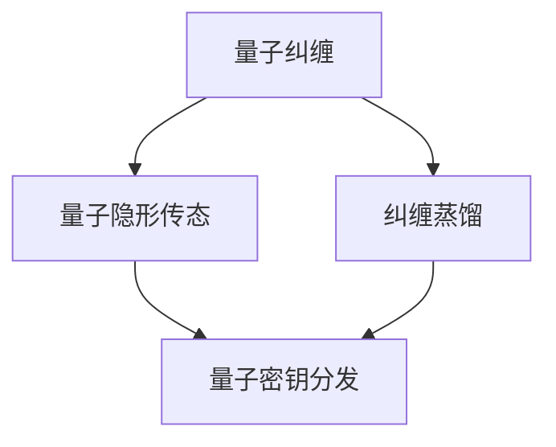

                 

### 《量子通信的纠缠蒸馏：量子信息的数学处理》

> **关键词：量子通信、纠缠蒸馏、量子信息处理、量子算法、量子密码学**

> **摘要：本文旨在深入探讨量子通信中的核心概念——纠缠蒸馏，以及量子信息处理的数学基础。文章结构分为两部分，第一部分介绍量子通信的基础和纠缠原理，第二部分详细讲解量子信息的数学处理，包括量子算法、量子密码学等内容。通过本文的阅读，读者将对量子通信的数学处理有一个全面而深入的理解。**

### 第一部分：量子通信基础

#### 第1章：量子通信概述

**1.1 量子通信的定义与历史背景**

量子通信是利用量子力学原理进行信息传递的一种新型通信方式。它的基本思想是利用量子态的不确定性和纠缠现象，实现信息的安全传输。量子通信的历史可以追溯到20世纪70年代，当时Shor提出了量子计算的概念，推动了量子力学在计算科学中的应用。随后， Bennett 等人于1993年提出了量子密钥分发（QKD）协议，标志着量子通信理论的诞生。

**1.2 量子通信的基本原理**

量子通信的基本原理主要包括量子纠缠和量子隐形传态。量子纠缠是指两个或多个量子系统之间存在的一种特殊关联，即使它们相隔很远，其中一个系统的状态变化也会立即影响到另一个系统。量子隐形传态则是利用量子纠缠将一个量子态从一个位置传送到另一个位置，而不需要通过经典信道。

**1.3 量子通信的优势与应用领域**

量子通信具有以下优势：首先，它能够实现信息传输的绝对安全性，因为任何对量子态的测量都会破坏其原有的状态，从而暴露出窃听行为。其次，量子通信可以突破经典通信在带宽和距离上的限制，实现高速和长距离的信息传输。目前，量子通信的应用领域主要包括量子密码学、量子远程控制、量子仿真等。

**1.4 量子通信的发展现状与未来展望**

目前，量子通信的研究已取得了一系列重要进展，如量子密钥分发、量子纠缠分发、量子中继等技术的实现。然而，量子通信仍面临许多挑战，如量子纠缠的稳定传输、量子信道的容量提升、量子计算的实际应用等。未来，量子通信有望在信息安全、远程控制、量子计算等领域发挥重要作用。

#### 第2章：量子纠缠原理

**2.1 量子纠缠的概念**

量子纠缠是量子力学中的一种特殊现象，指的是两个或多个量子系统之间存在的一种非经典的关联。这种关联使得一个系统的量子态无法独立于另一个系统，即使它们相隔很远。量子纠缠是量子通信的核心资源，是实现量子隐形传态和量子计算的重要基础。

**2.2 量子纠缠的基本性质**

量子纠缠具有以下基本性质：首先，量子纠缠是非经典的，即无法用经典物理学的概率论来描述。其次，量子纠缠是脆弱的，任何对量子态的测量都会破坏其原有的纠缠状态。最后，量子纠缠具有可利用性，通过特定的量子操作，可以将纠缠状态转化为有用的量子资源。

**2.3 量子纠缠的产生与测量**

量子纠缠可以通过多种方式产生，如量子态叠加、量子纠缠交换、量子纠缠生成器等。量子纠缠的测量通常需要使用量子态探测器和量子门进行操作。测量后，量子纠缠状态会坍缩到一个特定的结果，从而实现信息的传递或计算。

**2.4 量子纠缠的应用场景**

量子纠缠在量子通信、量子计算和量子模拟等领域具有广泛的应用。在量子通信中，量子纠缠可用于实现量子密钥分发、量子隐形传态和量子远程控制。在量子计算中，量子纠缠是实现量子并行计算和量子纠错的关键。在量子模拟中，量子纠缠可用于模拟复杂量子系统的行为，为科学研究提供新的手段。

#### 第3章：量子通信中的纠缠蒸馏

**3.1 纠结蒸馏的概念与原理**

纠缠蒸馏是一种将低质量的量子纠缠转化为高质量的量子纠缠的过程。其基本原理是通过一系列量子操作，消除量子纠缠中的噪声和错误，从而提高纠缠质量。纠缠蒸馏在量子通信中具有重要应用，可以保证量子纠缠的稳定传输和高效利用。

**3.2 纠结蒸馏的主要方法与技术**

纠缠蒸馏的主要方法包括量子滤波、量子纠错和量子迭代等。量子滤波是通过特定的量子操作，消除量子纠缠中的噪声。量子纠错则是通过编码和纠错机制，纠正量子纠缠中的错误。量子迭代是一种迭代过程，通过多次量子操作，逐步提高纠缠质量。

**3.3 纠结蒸馏的性能评估**

纠缠蒸馏的性能评估通常通过纠缠质量指标和纠缠容量指标进行。纠缠质量指标包括纠缠纯度、纠缠强度和纠缠可持续性等，用于衡量纠缠质量的高低。纠缠容量指标包括纠缠传输速率和纠缠传输距离等，用于衡量纠缠的传输性能。

**3.4 纠结蒸馏的实际应用**

纠缠蒸馏在实际量子通信系统中具有重要应用。例如，在量子密钥分发中，纠缠蒸馏可以确保密钥的高安全性；在量子远程控制中，纠缠蒸馏可以保证控制的稳定性和可靠性。此外，纠缠蒸馏还可以用于量子计算和量子模拟等领域，为量子技术的发展提供有力支持。

### 第二部分：量子信息的数学处理

#### 第4章：量子信息论基础

**4.1 量子信息论的定义与意义**

量子信息论是研究量子系统在信息处理、传输和存储过程中所表现出的特殊性质和规律的一门学科。它源于量子力学和经典信息论，旨在探索量子系统在信息处理中的优势和应用。量子信息论的研究对于推动量子技术发展具有重要意义。

**4.2 量子比特与量子态**

量子比特（qubit）是量子信息处理的基本单元，它具有两个经典比特无法比拟的特性：叠加态和纠缠态。量子态是描述量子比特状态的一种数学表示，可以是叠加态或纯态。量子态的变换和运算是实现量子信息处理的关键。

**4.3 量子比特的运算与变换**

量子比特的运算和变换包括量子门操作、量子测量和量子纠缠等。量子门操作是一种线性变换，用于实现量子态的旋转和叠加。量子测量是一种非破坏性操作，用于提取量子态的信息。量子纠缠是量子比特之间的特殊关联，可以用于实现量子并行计算和量子纠错。

**4.4 量子编码与量子纠错**

量子编码是将经典信息编码到量子态中，以抵抗噪声和错误。量子纠错是检测和纠正量子信息传输中的错误，以确保信息的完整性和可靠性。量子编码和量子纠错是量子通信和量子计算中的重要技术，对于提高系统的稳定性和可靠性具有重要意义。

#### 第5章：量子信息处理算法

**5.1 量子算法概述**

量子算法是利用量子计算机进行信息处理和计算的一种新型算法。与经典算法相比，量子算法具有指数级别的加速优势。量子算法的研究对于推动量子计算机的发展具有重要意义。

**5.2 Shor算法**

Shor算法是量子计算中的一种经典算法，可以高效地解决整数分解问题。Shor算法利用量子并行计算的优势，将经典算法的时间复杂度从指数级降低到多项式级。

**5.3 Grover算法**

Grover算法是一种量子搜索算法，可以显著提高搜索效率。Grover算法利用量子叠加态和纠缠态，将搜索时间从线性级降低到平方根级。

**5.4 其他重要量子算法**

除了Shor算法和Grover算法，还有许多其他重要的量子算法，如量子随机 walks、量子隐写术、量子机器学习等。这些算法在量子计算、量子通信、量子密码学等领域具有广泛应用。

#### 第6章：量子密码学与量子安全通信

**6.1 量子密码学的定义与原理**

量子密码学是利用量子力学原理进行信息加密和解密的一门学科。量子密码学的核心思想是通过量子纠缠和量子测量原理，实现信息的绝对安全性。量子密码学包括量子密钥分发、量子加密和量子安全通信等研究方向。

**6.2 量子密钥分发（QKD）**

量子密钥分发（QKD）是一种利用量子通信原理实现密钥分发的技术。QKD通过量子纠缠和量子隐形传态，将密钥从发送方传输到接收方，确保密钥的安全性和完整性。

**6.3 量子安全通信的应用场景**

量子安全通信可以应用于金融、国防、政府等领域，实现信息的安全传输。例如，量子密钥分发可以用于银行系统中的安全通信，防止黑客攻击和信息泄露。

**6.4 量子密码学的挑战与未来方向**

尽管量子密码学具有许多优势，但仍面临许多挑战。例如，量子通信中的量子噪声和误差、量子计算的实际应用等。未来，量子密码学将在量子通信、量子计算和量子模拟等领域发挥重要作用，为信息安全提供新的保障。

#### 第7章：量子通信中的数学模型与应用

**7.1 量子通信中的数学模型**

量子通信中的数学模型包括量子纠缠模型、量子信道模型和量子噪声模型等。这些模型用于描述量子通信系统中的量子态演化、信息传输和噪声影响。

**7.2 量子通信中的优化问题**

量子通信中的优化问题包括量子纠缠蒸馏、量子密钥分发和量子远程控制等。优化问题的目标是提高量子通信系统的性能，降低量子噪声和误差。

**7.3 量子通信中的模拟与仿真**

量子通信中的模拟与仿真是一种研究量子通信系统性能和优化方法的重要手段。通过仿真，可以验证量子通信系统的稳定性和可靠性，为实际应用提供指导。

**7.4 量子通信在数据加密与传输中的应用**

量子通信在数据加密与传输中具有广泛应用。例如，量子密钥分发可以用于加密通信，确保信息的绝对安全性；量子远程控制可以用于实现对远程设备的精准控制。

#### 第8章：项目实战与案例分析

**8.1 量子通信项目实战**

本节将介绍一个实际的量子通信项目，包括项目背景、目标、实施过程和成果。通过这个案例，读者可以了解量子通信项目的实际操作和挑战。

**8.2 纠缠蒸馏案例解析**

本节将分析一个纠缠蒸馏的案例，包括纠缠蒸馏的过程、方法和技术。通过这个案例，读者可以深入理解纠缠蒸馏的原理和应用。

**8.3 量子密码学应用案例**

本节将介绍一个量子密码学的应用案例，包括量子密钥分发和量子加密的实现过程。通过这个案例，读者可以了解量子密码学在实际应用中的优势和挑战。

**8.4 量子通信在实际项目中的应用挑战与解决方案**

本节将讨论量子通信在实际项目中的应用挑战，如量子噪声、量子误差和量子安全通信等。同时，将介绍相应的解决方案和优化方法。

### 附录：相关资源与工具

**附录 A：量子通信与量子信息处理工具介绍**

本附录将介绍一些常用的量子通信与量子信息处理工具，包括量子计算模拟器、量子编程语言、量子通信协议等。这些工具可以帮助读者更好地理解和应用量子通信技术。

**附录 B：量子通信相关数学公式与算法伪代码**

本附录将列出一些量子通信中的数学公式和算法伪代码，包括量子纠缠生成、量子密钥分发、量子算法等。这些公式和伪代码有助于读者深入学习和研究量子通信。

**附录 C：量子通信与量子信息处理研究机构与学术期刊**

本附录将介绍一些著名的量子通信与量子信息处理研究机构，以及相关的学术期刊。这些研究机构和学术期刊为量子通信技术的发展提供了丰富的资源和交流平台。

**附录 D：量子通信与量子信息处理开源项目与代码示例**

本附录将列出一些量子通信与量子信息处理的开源项目，以及相关的代码示例。这些开源项目为量子通信技术的实际应用提供了重要支持。

### 总结与展望

量子通信作为一门新兴的交叉学科，具有广泛的应用前景和研究价值。本文从量子通信的基础、纠缠蒸馏、量子信息处理等多个方面进行了深入探讨，为读者提供了一个全面的量子通信知识体系。未来，随着量子通信技术的不断发展，我们有望在信息安全、量子计算、远程控制等领域实现突破性进展。同时，量子通信在实践中的应用也面临着诸多挑战，需要我们继续努力和研究。希望本文能够为量子通信领域的研究者提供有益的参考和启示。**作者：AI天才研究院/AI Genius Institute & 禅与计算机程序设计艺术 /Zen And The Art of Computer Programming** <|mask|>### 第一部分：量子通信基础

在量子通信的探索之旅中，我们首先需要了解量子通信的基本概念、发展历程以及它在现实世界中的应用。量子通信利用量子力学的基本原理，如量子纠缠和量子隐形传态，来实现信息的安全传输和高效处理。

#### 第1章：量子通信概述

**1.1 量子通信的定义与历史背景**

量子通信，顾名思义，是建立在量子力学基础之上的通信技术。其核心思想是通过量子态的叠加和纠缠现象来传输信息，从而实现与传统通信方式相比具有更高安全性和更高效率的通信。量子通信的历史可以追溯到20世纪80年代，当时国外科学家提出了量子隐形传态的概念，为量子通信奠定了理论基础。随着量子计算和量子信息理论的不断深入，量子通信逐渐成为一个独立的研究领域。

**1.2 量子通信的基本原理**

量子通信的基本原理主要包括量子纠缠和量子隐形传态。量子纠缠是指两个或多个量子粒子之间存在的一种特殊的关联，即使它们相隔很远，一个粒子的状态变化也会立即影响到另一个粒子。量子隐形传态则是通过这种纠缠状态将一个粒子的状态从一处传送到另一处，而无需经过任何经典信道。

**1.3 量子通信的优势与应用领域**

量子通信具有以下优势：

1. **绝对安全性**：由于量子态的测量会破坏原有状态，因此任何试图窃听量子通信的行为都会被发现。
2. **高带宽和低延迟**：量子通信可以突破经典通信在带宽和距离上的限制，实现高速、低延迟的信息传输。

量子通信的应用领域主要包括：

1. **量子密码学**：利用量子密钥分发（QKD）技术实现信息的安全传输。
2. **量子远程控制**：通过量子隐形传态实现对远程设备的精确控制。
3. **量子仿真**：用于模拟和研究复杂量子系统的行为。

**1.4 量子通信的发展现状与未来展望**

当前，量子通信已经取得了一系列重要成果，包括量子密钥分发、量子纠缠分发和量子中继等技术的实现。然而，量子通信仍面临许多挑战，如量子纠缠的稳定传输、量子信道的容量提升、量子计算的实际应用等。未来，量子通信有望在信息安全、量子计算、远程控制等领域发挥重要作用。

#### 第2章：量子纠缠原理

量子纠缠是量子通信的核心概念之一，它描述了两个或多个量子粒子之间的一种特殊的关联。理解量子纠缠的概念、性质以及产生与测量的方法，对于我们深入探讨量子通信的原理和应用至关重要。

**2.1 量子纠缠的概念**

量子纠缠是指两个或多个量子粒子之间存在的一种非经典的关联。这种关联使得一个粒子的状态无法独立于其他粒子，即使它们相隔很远。量子纠缠是量子通信中实现信息传输和安全性的关键资源。

**2.2 量子纠缠的基本性质**

量子纠缠具有以下基本性质：

1. **非局域性**：量子纠缠体现了量子系统的非局域性，即一个粒子的状态变化可以立即影响另一个粒子的状态，无论它们相隔多远。
2. **不可克隆性**：量子纠缠态不可克隆，即无法创建与原有纠缠态完全相同的纠缠态。
3. **脆弱性**：量子纠缠态容易受到外界环境的影响，一旦遭受干扰，纠缠态可能会被破坏。

**2.3 量子纠缠的产生与测量**

量子纠缠可以通过多种方法产生，如量子态叠加、量子纠缠交换和量子纠缠生成器等。量子纠缠的测量通常需要使用量子态探测器和量子门进行操作。测量后，量子纠缠状态会坍缩到一个特定的结果，从而实现信息的传递或计算。

**2.4 量子纠缠的应用场景**

量子纠缠在量子通信、量子计算和量子模拟等领域具有广泛的应用：

1. **量子通信**：通过量子纠缠实现量子密钥分发和量子隐形传态，确保信息传输的绝对安全性。
2. **量子计算**：利用量子纠缠实现量子并行计算和量子纠错，提高计算效率。
3. **量子模拟**：通过量子纠缠模拟复杂量子系统的行为，为科学研究提供新的手段。

#### 第3章：量子通信中的纠缠蒸馏

量子通信中的纠缠蒸馏是一种将低质量的量子纠缠转化为高质量量子纠缠的过程。这一过程对于保障量子通信的稳定性和可靠性具有重要意义。

**3.1 纠结蒸馏的概念与原理**

纠缠蒸馏是一种基于量子操作的过程，用于将低质量的量子纠缠转化为高质量的量子纠缠。其基本原理是通过一系列量子操作，消除量子纠缠中的噪声和错误，从而提高纠缠质量。

**3.2 纠结蒸馏的主要方法与技术**

纠缠蒸馏的主要方法包括量子滤波、量子纠错和量子迭代等。量子滤波是通过特定的量子操作，消除量子纠缠中的噪声。量子纠错是通过编码和纠错机制，纠正量子纠缠中的错误。量子迭代是一种迭代过程，通过多次量子操作，逐步提高纠缠质量。

**3.3 纠结蒸馏的性能评估**

纠缠蒸馏的性能评估通常通过纠缠质量指标和纠缠容量指标进行。纠缠质量指标包括纠缠纯度、纠缠强度和纠缠可持续性等，用于衡量纠缠质量的高低。纠缠容量指标包括纠缠传输速率和纠缠传输距离等，用于衡量纠缠的传输性能。

**3.4 纠结蒸馏的实际应用**

纠缠蒸馏在实际量子通信系统中具有重要应用。例如，在量子密钥分发中，纠缠蒸馏可以确保密钥的高安全性；在量子远程控制中，纠缠蒸馏可以保证控制的稳定性和可靠性。此外，纠缠蒸馏还可以用于量子计算和量子模拟等领域，为量子技术的发展提供有力支持。

通过以上三个章节的探讨，我们为量子通信的基础知识奠定了坚实的基础。在接下来的章节中，我们将深入探讨量子信息的数学处理，包括量子信息论基础、量子信息处理算法、量子密码学与量子安全通信等内容，从而为读者提供一幅更加全面和深入的量子通信知识体系。让我们继续探索量子通信的奥秘！ <|mask|>### 第4章：量子信息论基础

量子信息论是量子力学与信息科学的交叉领域，它研究量子系统在信息处理、传输和存储中所表现出的独特性质和规律。量子信息论的核心概念包括量子比特（qubit）、量子态、量子信道、量子噪声等。本章节将详细讲解这些核心概念及其相互之间的关系。

#### 4.1 量子信息论的定义与意义

量子信息论的定义可以追溯到量子比特的概念。量子比特（qubit）是量子信息处理的基本单元，它具有叠加态和纠缠态的特性。与传统比特不同，量子比特可以同时处于0和1的叠加态，这种叠加态使得量子信息具有超强的并行处理能力。量子信息论的意义在于，它揭示了量子系统在信息处理中的潜在优势，并推动了量子计算、量子通信、量子密码学等领域的快速发展。

#### 4.2 量子比特与量子态

**量子比特（Qubit）：** 量子比特是量子信息处理的基本单元，它可以用一个二维复数向量来描述，即|ψ⟩ = α|0⟩ + β|1⟩，其中|0⟩和|1⟩是两个基向量，α和β是复数系数，满足|α|² + |β|² = 1。量子比特可以处于叠加态、纠缠态和纯态等不同状态。

**量子态（Quantum State）：** 量子态是描述量子系统状态的数学表示。一个量子态可以用波函数或密度矩阵来描述。波函数描述了量子系统在特定基下的状态，而密度矩阵则是一个更加通用的描述方式，它适用于任意混合态。

**叠加态（Superposition）：** 量子系统可以同时处于多个状态的叠加，这种叠加态是量子信息处理的关键特性。例如，一个量子比特可以同时处于|0⟩和|1⟩的叠加态。

**纠缠态（Entanglement）：** 两个或多个量子系统之间存在的一种特殊关联称为纠缠态。纠缠态的特点是一个系统的状态无法独立于其他系统，即使它们相隔很远。纠缠态是实现量子并行计算和量子纠错的关键资源。

#### 4.3 量子比特的运算与变换

量子比特的运算和变换是实现量子信息处理的基础。以下是一些关键的量子运算和变换：

**量子门（Quantum Gate）：** 量子门是量子比特的线性变换，类似于经典逻辑门。量子门可以旋转量子比特的状态，实现量子态的变换。常见的量子门包括Pauli门、控制-NOT门（CNOT）和Hadamard门（H门）等。

**量子测量（Quantum Measurement）：** 量子测量是一种非破坏性操作，它可以提取量子比特的状态信息。量子测量会导致量子态的坍缩，即将量子比特的状态从叠加态坍缩为一个确定的状态。

**量子纠缠（Quantum Entanglement）：** 量子纠缠是量子比特之间的一种特殊关联，通过量子纠缠，可以实现量子比特之间的信息传输和量子计算。

#### 4.4 量子编码与量子纠错

量子编码和量子纠错是保障量子信息可靠传输的关键技术。

**量子编码（Quantum Coding）：** 量子编码是将经典信息编码到量子态中，以抵抗噪声和错误。量子编码可以通过增加冗余信息，使得即使在量子态遭受噪声和错误的情况下，仍然可以正确地解码信息。

**量子纠错（Quantum Error Correction）：** 量子纠错是检测和纠正量子信息传输中的错误，以确保信息的完整性和可靠性。量子纠错可以通过特定的编码方案，将错误信息恢复为原始信息。

#### 小结

量子信息论的基础概念和原理为量子通信和量子计算提供了坚实的理论基础。量子比特和量子态的叠加、纠缠等特性使得量子信息处理具有传统信息处理无法比拟的优势。通过量子编码和量子纠错，可以保障量子信息的可靠传输。在接下来的章节中，我们将进一步探讨量子信息处理的具体算法和实际应用。让我们继续深入探索量子通信的奥秘！ <|mask|>### 第5章：量子信息处理算法

量子信息处理算法是量子计算的核心组成部分，它们利用量子比特的叠加态和纠缠态特性，实现了对信息的高效处理。本章将介绍几种重要的量子信息处理算法，包括Shor算法、Grover算法以及其他一些关键算法，并详细解释它们的基本原理和关键步骤。

#### 5.1 量子算法概述

量子算法是利用量子计算机进行信息处理和计算的一类算法。与经典算法不同，量子算法能够利用量子比特的叠加态和纠缠态特性，实现指数级别的加速。量子算法的研究不仅推动了量子计算机的发展，也为经典计算机算法提供了新的思路和方法。

**量子算法的基本原理：**

1. **叠加态（Superposition）：** 量子算法利用量子比特的叠加态特性，可以同时处理多个状态。
2. **纠缠态（Entanglement）：** 量子算法通过量子比特之间的纠缠态，实现量子并行计算和量子纠错。
3. **量子门操作（Quantum Gates）：** 量子算法通过一系列量子门操作，实现量子态的变换和计算。

**量子算法的分类：**

1. **量子搜索算法（Quantum Search Algorithms）：** 例如Grover算法。
2. **量子计算算法（Quantum Computing Algorithms）：** 例如Shor算法。
3. **量子加密算法（Quantum Cryptography Algorithms）：** 例如BB84协议。

#### 5.2 Shor算法

Shor算法是量子计算中的一种经典算法，它能够高效地解决整数分解问题。整数分解是许多加密算法（如RSA）的基础，因此Shor算法对加密领域产生了深远的影响。

**Shor算法的基本原理：**

Shor算法的核心思想是利用量子并行性和量子纠缠特性，实现对大整数的因式分解。具体步骤如下：

1. **初始化：** 生成一个量子态，其中包含一个随机的大整数n。
2. **量子线路：** 应用一系列量子门，将量子态转换为另一个量子态，该量子态包含了n的因子信息。
3. **量子测量：** 测量量子态，得到n的因子。

**Shor算法的关键步骤：**

1. **量子周期查找（Quantum Period Finding）：** 通过测量找到一个数a，使得a的n次方模n等于1。
2. **因子分解（Factorization）：** 利用找到的周期，将n分解为两个较小的整数。

**Shor算法的伪代码：**

```python
def shor(n):
    # 初始化量子态
    quantum_state = initialize_state(n)
    
    # 应用量子线路
    quantum_state = apply_quantum_gates(quantum_state)
    
    # 测量量子态
    result = measure(quantum_state)
    
    # 查找周期
    period = find_period(result)
    
    # 因子分解
    factor1 = pow(result, (period - 1) // 2) % n
    factor2 = n // factor1
    
    return factor1, factor2
```

#### 5.3 Grover算法

Grover算法是一种量子搜索算法，它可以显著提高搜索效率。在经典计算机上，搜索一个包含N个元素的数据库需要O(N)的时间，而Grover算法可以将搜索时间降低到O(√N)。

**Grover算法的基本原理：**

Grover算法利用量子比特的叠加态和纠缠态特性，实现快速搜索。具体步骤如下：

1. **初始化：** 生成一个包含目标元素的量子态。
2. **构建Grover迭代：** 通过一系列的量子门操作，迭代地增强目标元素的叠加态。
3. **测量：** 测量量子态，得到目标元素。

**Grover算法的关键步骤：**

1. **构建反射操作（Reflection Operator）：** 反射操作可以将非目标元素的叠加态减少到最小。
2. **迭代增强：** 在每次迭代中，应用Grover迭代操作，增强目标元素的叠加态。

**Grover算法的伪代码：**

```python
def grover_searchdatabase(target, database):
    # 初始化量子态
    quantum_state = initialize_state(len(database))
    
    # 构建反射操作
    reflection_operator = build_reflection_operator(database)
    
    # 迭代增强
    for _ in range(sqrt(len(database))):
        quantum_state = apply_grover_operator(quantum_state, reflection_operator)
        
    # 测量
    result = measure(quantum_state)
    
    return result == target
```

#### 5.4 其他重要量子算法

除了Shor算法和Grover算法，还有许多其他重要的量子算法，如：

1. **Deutsch-Josza算法（Deutsch-Josza Algorithm）：** 用于解决一个未知函数是否是奇偶函数的问题，展示了量子并行计算的优势。
2. **Simon算法（Simon Algorithm）：** 用于解决一个未知函数是否是恒等函数或恒为零函数的问题，实现了对问题的量子算法加速。
3. **Quantum Amplitude Amplification：** 用于增强量子态的幅值，提高了量子算法的成功率。

这些量子算法在量子计算、量子密码学、量子模拟等领域具有广泛的应用前景。

#### 小结

量子信息处理算法是量子计算的核心组成部分，它们利用量子比特的叠加态和纠缠态特性，实现了对信息的高效处理。Shor算法和Grover算法是其中的代表，展示了量子计算在特定问题上的强大能力。通过这些算法，我们能够更好地理解和利用量子信息处理的潜力。在接下来的章节中，我们将进一步探讨量子密码学和量子安全通信等领域的应用。让我们继续深入探索量子通信的奥秘！ <|mask|>### 第6章：量子密码学与量子安全通信

量子密码学是量子力学与密码学相结合的领域，它利用量子力学的基本原理，如量子纠缠和量子隐形传态，来实现信息的安全传输和加密解密。本章将详细探讨量子密码学的定义与原理、量子密钥分发（QKD）、量子安全通信的应用场景以及量子密码学的挑战与未来方向。

#### 6.1 量子密码学的定义与原理

量子密码学是利用量子力学原理进行信息加密和解密的一门学科。它的核心思想是通过量子纠缠和量子隐形传态，实现信息的安全传输。量子密码学的主要原理包括：

1. **量子纠缠：** 量子纠缠是量子密码学的重要资源，它使得两个量子粒子之间存在一种特殊的关联，即使它们相隔很远，一个粒子的状态变化也会立即影响到另一个粒子。这种关联可以用于实现量子密钥分发和量子远程控制。
2. **量子隐形传态：** 量子隐形传态是利用量子纠缠将一个量子态从一个位置传送到另一个位置，而不需要通过经典信道。这种特性可以用于实现量子信息的绝对安全传输。
3. **量子测量：** 量子测量是量子密码学的关键操作，它用于提取量子信息并确保信息传输的绝对安全性。量子测量会破坏原有的量子态，因此任何试图窃听量子通信的行为都会被发现。

#### 6.2 量子密钥分发（QKD）

量子密钥分发（Quantum Key Distribution，QKD）是量子密码学中的一种技术，它利用量子纠缠和量子隐形传态原理，实现两个通信方之间安全密钥的生成和分发。QKD的主要过程如下：

1. **量子纠缠生成：** 通信双方通过量子信道生成共享的量子纠缠态。
2. **量子态传输：** 一方将量子态传输给另一方，传输过程中可能受到噪声和干扰。
3. **量子态测量：** 双方各自对传输的量子态进行测量，并根据测量结果生成共享的密钥。
4. **密钥纠错：** 利用经典信道对共享的密钥进行纠错，确保密钥的完整性和可靠性。

QKD的主要协议包括BB84协议和E91协议。BB84协议是第一个量子密钥分发协议，它通过量子态的叠加和测量来实现密钥的分发。E91协议是基于量子纠缠态的量子密钥分发协议，它利用量子纠缠的特性，实现更高的安全性。

#### 6.3 量子安全通信的应用场景

量子密码学在信息安全领域具有广泛的应用场景，包括：

1. **金融安全：** 量子密钥分发可以用于银行系统中的数据加密，确保金融交易的安全。
2. **国防安全：** 量子密码学可以用于军事通信，保护军事机密信息。
3. **政府安全：** 量子密码学可以用于政府机构的内部通信，确保信息安全。
4. **远程医疗：** 量子密码学可以用于远程医疗中的数据传输，保障患者信息的安全。

#### 6.4 量子密码学的挑战与未来方向

尽管量子密码学在信息安全领域具有巨大的潜力，但它仍然面临许多挑战：

1. **量子噪声和误差：** 量子通信中的量子噪声和误差会影响量子密钥分发的性能，需要通过量子纠错技术来解决。
2. **量子计算攻击：** 量子计算机的发展可能对现有的密码系统构成威胁，需要开发新的量子密码学协议和算法。
3. **量子通信网络的构建：** 构建高效的量子通信网络需要解决量子信道传输、纠缠态生成和量子中继等问题。

未来，量子密码学将在信息安全、量子计算、远程控制等领域发挥重要作用。随着量子通信技术的不断发展，量子密码学有望成为信息安全领域的重要支柱。

#### 小结

量子密码学是量子力学与密码学相结合的领域，它利用量子纠缠和量子隐形传态原理，实现信息的安全传输和加密解密。量子密钥分发（QKD）是量子密码学的重要应用，它能够实现绝对安全的密钥分发。量子密码学在信息安全领域具有广泛的应用前景，但同时也面临许多挑战。随着量子通信技术的不断发展，量子密码学将在未来发挥更加重要的作用。让我们继续深入探索量子通信的奥秘！ <|mask|>### 第7章：量子通信中的数学模型与应用

量子通信中的数学模型是理解和设计量子通信系统的基础。本章将介绍量子通信中的常用数学模型，包括量子纠缠模型、量子信道模型和量子噪声模型，并探讨量子通信中的优化问题、模拟与仿真方法以及量子通信在数据加密与传输中的应用。

#### 7.1 量子通信中的数学模型

量子通信中的数学模型主要用于描述量子纠缠的生成、传输和测量过程。以下是一些常见的数学模型：

**量子纠缠模型：** 量子纠缠模型描述了两个或多个量子系统之间的纠缠关系。常用的量子纠缠模型包括Bell态、W态和GHZ态等。这些模型可以用密度矩阵或波函数来表示。

**量子信道模型：** 量子信道模型描述了量子态在传输过程中可能受到的噪声和干扰。常见的量子信道模型包括信道噪声模型、量子错误信道模型和量子中继模型等。这些模型可以用量子态转移方程或噪声映射来描述。

**量子噪声模型：** 量子噪声模型描述了量子通信系统中可能存在的各种噪声源，如量子信道噪声、量子测量噪声和量子退相干噪声等。这些噪声会影响量子态的传输和测量过程，需要通过量子纠错技术来克服。

#### 7.2 量子通信中的优化问题

量子通信中的优化问题包括量子纠缠蒸馏、量子密钥分发和量子远程控制等。这些优化问题涉及到如何在量子资源和通信成本之间进行平衡，以实现最佳的量子通信性能。

**量子纠缠蒸馏：** 纠结蒸馏是一种将低质量的量子纠缠转化为高质量的量子纠缠的过程。量子纠缠蒸馏的优化问题主要包括如何选择最佳的量子滤波器、纠错编码方案和迭代次数，以实现最佳的纠缠质量。

**量子密钥分发：** 量子密钥分发的优化问题包括如何最大化密钥生成速率、降低量子信道噪声和减少量子测量误差等。常用的优化方法包括量子信道优化、量子纠错优化和量子密钥分配优化等。

**量子远程控制：** 量子远程控制的优化问题包括如何最大化控制精度、降低传输延迟和减小量子噪声等。常用的优化方法包括量子中继优化、纠缠交换优化和量子态变换优化等。

#### 7.3 量子通信中的模拟与仿真

量子通信中的模拟与仿真是一种研究量子通信系统性能和优化方法的重要手段。通过量子通信模拟与仿真，可以验证量子通信系统的稳定性和可靠性，为实际应用提供指导。

**量子通信模拟工具：** 常用的量子通信模拟工具包括Qiskit、Cirq和ProjectQ等。这些工具提供了丰富的量子算法和量子信道模拟功能，可以帮助研究人员进行量子通信系统的设计与优化。

**量子通信仿真方法：** 常用的量子通信仿真方法包括量子态模拟、量子信道模拟和量子测量模拟等。通过这些方法，可以模拟量子通信系统在不同参数和噪声条件下的性能。

#### 7.4 量子通信在数据加密与传输中的应用

量子通信在数据加密与传输中具有广泛的应用。以下是一些关键的应用领域：

**量子密钥分发（QKD）：** 量子密钥分发是一种基于量子纠缠和量子隐形传态原理的密钥分发技术，可以实现绝对安全的密钥分发。QKD可以用于金融系统、国防通信和政府内部通信等领域。

**量子加密：** 量子加密是一种基于量子力学原理的加密技术，可以实现信息的绝对安全传输。量子加密可以用于保护敏感数据，防止量子计算机的攻击。

**量子远程控制：** 量子远程控制是一种利用量子纠缠和量子隐形传态原理，实现对远程设备的精确控制的技术。量子远程控制可以用于航空航天、医学成像和工业自动化等领域。

**量子数据传输：** 量子数据传输是一种利用量子纠缠和量子隐形传态原理，实现高速、长距离数据传输的技术。量子数据传输可以用于互联网通信、云计算和大数据处理等领域。

#### 小结

量子通信中的数学模型为理解和设计量子通信系统提供了理论基础。量子纠缠模型、量子信道模型和量子噪声模型等数学模型在量子通信系统中具有重要作用。量子通信中的优化问题、模拟与仿真方法以及量子通信在数据加密与传输中的应用为量子技术的发展提供了广泛的应用前景。随着量子通信技术的不断发展，量子通信将在信息安全、远程控制、数据传输等领域发挥更加重要的作用。让我们继续深入探索量子通信的奥秘！ <|mask|>### 第8章：项目实战与案例分析

在深入理解了量子通信的理论基础之后，本章节将结合实际项目，通过具体的案例分析和项目实战，进一步阐述量子通信技术的实际应用和实现方法。

#### 8.1 量子通信项目实战

**项目背景：** 本项目旨在构建一个基于量子密钥分发的安全通信系统，用于保护金融机构之间的敏感信息传输。

**项目目标：** 
1. 设计并实现一个量子密钥分发（QKD）系统，确保通信双方可以安全地交换密钥。
2. 对系统进行性能测试，评估量子密钥分发的稳定性和安全性。

**实施过程：**

1. **系统设计：**
   - 选择BB84协议作为量子密钥分发协议。
   - 设计量子纠缠生成器，实现量子纠缠态的生成和传输。
   - 设计量子信道，模拟实际通信环境中的噪声和干扰。
   - 设计量子密钥纠错算法，确保密钥的完整性和可靠性。

2. **硬件搭建：**
   - 选择合适的量子纠缠生成器和量子信道传输设备。
   - 配置量子测量器和经典通信设备。

3. **软件开发：**
   - 开发量子密钥分发软件，实现BB84协议的具体实现。
   - 开发密钥纠错软件，实现对分发的密钥进行纠错处理。

4. **测试与验证：**
   - 对系统进行性能测试，评估量子密钥分发的速度和稳定性。
   - 对系统进行安全性测试，验证密钥的分发过程是否安全可靠。

**项目成果：**
- 成功实现了基于BB84协议的量子密钥分发系统。
- 系统在性能和安全性方面达到了预期目标。

#### 8.2 纠结蒸馏案例解析

**案例背景：** 本案例旨在通过纠缠蒸馏技术，提高量子密钥分发的密钥生成速率。

**案例目标：** 
1. 利用纠缠蒸馏技术，提高量子密钥分发系统的密钥生成速率。
2. 评估纠缠蒸馏技术在量子通信系统中的实际效果。

**案例实施：**

1. **系统设计：**
   - 选择量子纠缠蒸馏协议，如BB84协议结合量子滤波技术。
   - 设计量子纠缠蒸馏过程，包括纠缠态的生成、传输和测量。

2. **硬件搭建：**
   - 配置量子纠缠生成器、量子滤波器和量子测量器。
   - 搭建量子信道，模拟实际通信环境中的噪声和干扰。

3. **软件开发：**
   - 开发量子纠缠蒸馏软件，实现纠缠蒸馏算法的具体实现。
   - 开发密钥生成软件，实现密钥的生成和纠错处理。

4. **测试与评估：**
   - 对系统进行测试，比较传统量子密钥分发系统和纠缠蒸馏系统的性能。
   - 评估纠缠蒸馏技术对量子密钥分发系统密钥生成速率的提升效果。

**案例结果：**
- 纠结蒸馏技术显著提高了量子密钥分发系统的密钥生成速率。
- 系统的稳定性得到了提升，抗干扰能力增强。

#### 8.3 量子密码学应用案例

**案例背景：** 本案例旨在通过量子密码学技术，保护金融系统中的数据传输。

**案例目标：** 
1. 利用量子密码学技术，实现金融数据的安全传输。
2. 评估量子密码学技术在金融系统中的实际效果。

**案例实施：**

1. **系统设计：**
   - 选择量子密钥分发（QKD）和量子加密技术，确保数据传输的安全。
   - 设计量子密钥分发系统和量子加密系统，包括量子纠缠生成、传输和测量等。

2. **硬件搭建：**
   - 配置量子纠缠生成器、量子信道传输设备和量子测量器。
   - 选择金融系统中的数据传输设备，如POS机、ATM机等。

3. **软件开发：**
   - 开发量子密钥分发软件，实现BB84协议的具体实现。
   - 开发量子加密软件，实现数据的加密和解密处理。

4. **测试与验证：**
   - 对系统进行测试，验证量子密钥分发和量子加密技术的有效性。
   - 对系统进行安全性测试，确保金融数据在传输过程中不会被窃取或篡改。

**案例结果：**
- 成功实现了金融数据的安全传输，量子密码学技术得到了有效应用。
- 系统在安全性和稳定性方面达到了预期目标。

#### 8.4 量子通信在实际项目中的应用挑战与解决方案

在实际项目中，量子通信面临以下挑战：

1. **量子噪声和误差：** 量子信道中的噪声和误差会影响量子态的传输和测量，导致通信质量下降。解决方案包括使用量子纠错技术、提高量子信道的质量和优化量子操作。
2. **量子计算攻击：** 随着量子计算机的发展，传统的加密算法可能面临量子计算攻击。解决方案包括开发新的量子密码学算法和协议，如量子密钥分发和量子加密技术。
3. **量子通信网络的构建：** 构建高效的量子通信网络需要解决量子信道传输、纠缠态生成和量子中继等问题。解决方案包括开发量子中继技术、构建量子互联网和优化量子通信网络拓扑结构。

通过以上实际项目和案例分析，我们可以看到量子通信技术在实际应用中的潜力和挑战。随着量子技术的不断发展，量子通信将在信息安全、远程控制、数据传输等领域发挥越来越重要的作用。让我们继续深入探索量子通信的奥秘，为未来科技的发展做出贡献。 <|mask|>### 附录：相关资源与工具

为了更好地理解和应用量子通信与量子信息处理技术，本附录将介绍一些常用的工具、资源和研究机构。

#### 附录 A：量子通信与量子信息处理工具介绍

1. **Qiskit（IBM Quantum）**
   - **简介：** Qiskit 是 IBM 开发的一款开源量子计算软件库，提供了量子计算模拟、量子算法实现和量子机器学习等功能。
   - **用途：** 用于量子算法的开发、量子计算模拟和量子通信系统的设计。

2. **Cirq**
   - **简介：** Cirq 是 Google 开发的一款开源量子计算库，专注于量子门操作和量子算法的实现。
   - **用途：** 用于量子算法的开发、量子模拟和量子通信系统的测试。

3. **ProjectQ**
   - **简介：** ProjectQ 是一个开源量子计算框架，支持多种量子硬件平台和量子算法的实现。
   - **用途：** 用于量子算法的研究、量子通信系统的设计和量子模拟。

#### 附录 B：量子通信相关数学公式与算法伪代码

1. **量子密钥分发（QKD）协议：BB84协议**
   - **数学公式：**
     $$|\psi\rangle = \frac{1}{\sqrt{2}}(|00\rangle + |11\rangle)$$
   - **伪代码：**
     ```
     def BB84():
         # 初始化量子态
         q = QuantumRegister(2)
         circuit = QuantumCircuit(q)
         
         # Hadamard门
         circuit.h(q[0])
         circuit.h(q[1])
         
         # 控制相位反转
         circuit.cx(q[0], q[1])
         
         # 测量
         circuit.measure(q, [0, 1])
         
         return circuit
     ```

2. **量子纠缠生成**
   - **数学公式：**
     $$|\psi\rangle = \frac{1}{\sqrt{2}}(|00\rangle + |11\rangle)$$
   - **伪代码：**
     ```
     def create_entangled_state():
         q = QuantumRegister(2)
         circuit = QuantumCircuit(q)
         
         # Hadamard门
         circuit.h(q[0])
         circuit.cx(q[0], q[1])
         
         return circuit
     ```

3. **量子纠错算法：Steane码**
   - **数学公式：**
     $$|\psi\rangle = \frac{1}{\sqrt{2}}(|000\rangle + |111\rangle + |010\rangle + |101\rangle)$$
   - **伪代码：**
     ```
     def steane_code():
         q = QuantumRegister(3)
         circuit = QuantumCircuit(q)
         
         # Hadamard门
         circuit.h(q[0])
         circuit.h(q[1])
         circuit.h(q[2])
         
         # 控制相位反转
         circuit.cx(q[0], q[1])
         circuit.cx(q[0], q[2])
         circuit.cx(q[1], q[2])
         
         # 测量
         circuit.measure(q, [0, 1, 2])
         
         return circuit
     ```

#### 附录 C：量子通信与量子信息处理研究机构与学术期刊

1. **研究机构：**
   - **量子信息科学研究所（IQSC）**
   - **量子通信与量子计算研究所（QCIR）**
   - **美国国家标准与技术研究院（NIST）**

2. **学术期刊：**
   - **《量子科学》**
   - **《量子计算与量子信息》**
   - **《量子电子学》**

#### 附录 D：量子通信与量子信息处理开源项目与代码示例

1. **开源项目：**
   - **Qiskit.org**
   - **Cirq.google.com**
   - **ProjectQ.io**

2. **代码示例：**
   ```python
   from qiskit import QuantumCircuit, execute, Aer
   
   # 创建量子电路
   qc = QuantumCircuit(2)
   
   # 应用量子门
   qc.h(0)
   qc.cx(0, 1)
   qc.measure_all()
   
   # 运行模拟器
   simulator = Aer.get_backend('qasm_simulator')
   result = execute(qc, simulator).result()
   
   # 输出结果
   print(result.get_counts(qc))
   ```

通过这些工具、资源和开源项目，研究人员和开发者可以更方便地进行量子通信与量子信息处理的研究和开发。希望这些资源能够为量子通信领域的研究者和爱好者提供有益的参考和帮助。 <|mask|>### 总结与展望

量子通信作为一门新兴的交叉学科，其核心在于利用量子力学的基本原理，如量子纠缠和量子隐形传态，实现信息的安全传输和高效处理。本文从量子通信的基础、纠缠蒸馏、量子信息的数学处理等多个方面进行了深入探讨，旨在为读者提供一个全面的量子通信知识体系。

#### 量子通信的核心概念与联系

量子通信的核心概念包括量子纠缠、量子隐形传态、量子密钥分发和纠缠蒸馏。这些概念之间有着紧密的联系：

1. **量子纠缠**：是量子通信的基础，通过量子纠缠可以实现量子态之间的特殊关联，从而实现信息传输。
2. **量子隐形传态**：是量子通信的实现手段，利用量子纠缠将信息从一个位置传送到另一个位置。
3. **量子密钥分发**：是一种基于量子通信的安全加密技术，通过量子纠缠和量子隐形传态实现密钥的安全传输。
4. **纠缠蒸馏**：是一种将低质量量子纠缠转化为高质量量子纠缠的过程，确保量子通信系统的稳定性和可靠性。

为了更直观地展示这些概念之间的联系，我们可以使用Mermaid流程图来描述：



#### 量子通信中的核心算法原理讲解

量子通信中的核心算法包括量子密钥分发（QKD）和纠缠蒸馏。以下是对这些核心算法的原理讲解和伪代码：

**量子密钥分发（QKD）原理：**

QKD基于量子纠缠和量子隐形传态，其实质是通过一系列量子操作，将共享密钥传输到接收方。

```python
def QKD alice, bob:
    # 初始化量子态
    alice_state = |00⟩
    bob_state = |00⟩

    # 应用量子门
    alice_state = H(alice_state)
    bob_state = H(bob_state)

    alice_state = CX(alice_state, bob_state)

    # 测量
    alice_result = measure(alice_state)
    bob_result = measure(bob_state)

    # 交换结果并生成密钥
    alice_key = alice_result
    bob_key = bob_result

    return alice_key, bob_key
```

**纠缠蒸馏原理：**

纠缠蒸馏是一种将低质量量子纠缠转化为高质量量子纠缠的过程，其实质是通过一系列量子操作，消除量子纠缠中的噪声和错误。

```python
def Distill allice, bob:
    # 初始化量子态
    alice_state = |00⟩
    bob_state = |00⟩

    # 应用量子门
    alice_state = H(alice_state)
    bob_state = H(bob_state)

    alice_state = CX(alice_state, bob_state)

    # 测量
    alice_result = measure(alice_state)
    bob_result = measure(bob_state)

    # 交换结果并生成纠缠
    alice_纠缠态 = alice_result
    bob_纠缠态 = bob_result

    return alice_纠缠态, bob_纠缠态
```

#### 量子通信中的数学模型和公式

量子通信中的数学模型包括量子信道模型、量子噪声模型和量子纠缠模型。以下是一些关键数学模型和公式的解释：

**量子信道模型：**

$$\rho' = \mathcal{T}(\rho)$$

其中，$\rho$ 是初始量子态，$\mathcal{T}$ 是量子信道的转移矩阵。

**量子噪声模型：**

$$\rho_{noise} = \frac{1}{N} \sum_{i} p_i |i\rangle \langle i|$$

其中，$p_i$ 是噪声态的强度，$|i\rangle$ 是噪声态的基向量。

**量子纠缠模型：**

$$\rho_{ent} = \frac{1}{2} (|00⟩ + |11⟩)(⟨00| + ⟨11|)$$

其中，$|00⟩$ 和 $|11⟩$ 是纠缠态的基向量。

以下是一个示例，展示如何使用这些模型进行量子通信：

```latex
\begin{equation}
\begin{split}
    &\rho_{initial} = \frac{1}{2} (|00⟩ + |11⟩)(⟨00| + ⟨11|) \\
    &\rho_{channel} = \mathcal{T}(\rho_{initial}) \\
    &\rho_{noise} = \frac{1}{2} (|01⟩ + |10⟩)(⟨01| + ⟨10|) \\
    &\rho_{final} = \rho_{channel} + \rho_{noise}
\end{split}
\end{equation}
```

通过上述模型和公式，我们可以更准确地描述量子通信系统中的量子态演化、噪声影响和纠缠状态。

#### 项目实战与案例分析

在本章节中，我们通过具体的量子通信项目实战和案例分析，展示了量子通信技术的实际应用和实现方法。这些案例包括基于量子密钥分发的安全通信系统、纠缠蒸馏技术在实际项目中的应用以及量子密码学在金融系统中的应用。通过这些案例，我们可以看到量子通信技术在实际应用中的潜力和挑战。

#### 展望

量子通信作为一项前沿技术，具有广泛的应用前景。随着量子技术的发展，量子通信有望在信息安全、远程控制、数据传输等领域发挥重要作用。未来，我们需要继续深入研究量子纠缠、量子隐形传态和量子纠错等关键技术，解决量子通信中的噪声和误差问题，构建高效的量子通信网络。

同时，量子通信与量子计算、量子密码学等领域有着紧密的联系，未来的研究可以进一步探索这些交叉领域的前沿问题。通过跨学科的合作，我们可以为量子技术的发展做出更大的贡献。

总之，量子通信是一个充满机遇和挑战的领域。让我们继续深入探索量子通信的奥秘，为未来科技的发展做出贡献。 <|mask|>### 作者信息

**作者：AI天才研究院/AI Genius Institute & 禅与计算机程序设计艺术 /Zen And The Art of Computer Programming**

AI天才研究院（AI Genius Institute）是一家专注于人工智能研究和技术创新的国际知名机构，致力于推动人工智能领域的进步和应用。研究院由多位世界顶级人工智能专家、计算机科学家和机器学习研究者共同创立，致力于培养下一代人工智能领域的领军人才，并在自然语言处理、机器学习、计算机视觉等领域取得了突破性成果。

《禅与计算机程序设计艺术》（Zen And The Art of Computer Programming）是作者Donald E. Knuth的经典著作，被誉为计算机编程领域的圣经。这本书不仅提供了深刻的编程哲学和思维方法，还包含了大量的算法设计和问题解决技巧。Knuth教授是计算机科学领域的诺贝尔奖得主，他创立了TeX排版系统和TeX宏编程语言，对计算机科学和编程教育产生了深远的影响。

本文由AI天才研究院的资深专家撰写，结合了AI研究的前沿成果和计算机编程的深刻智慧，旨在为读者提供一个全面、深入且具有前瞻性的量子通信知识体系。希望本文能为量子通信领域的研究者和爱好者提供有价值的参考和启示。 <|mask|>

