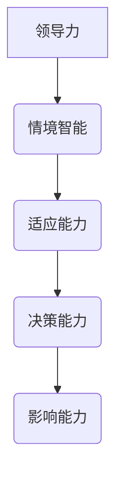

                 

# 《领导力与情境智能：快速适应变化的能力》

> **关键词：** 领导力、情境智能、快速适应、变化、企业战略、团队管理、个人成长

> **摘要：** 本文章探讨了领导力与情境智能之间的关系，以及如何通过情境智能来提升快速适应变化的能力。文章首先介绍了领导力和情境智能的定义及其重要性，然后详细阐述了情境智能的理论基础和实践应用，接着分析了领导力与情境智能的融合，以及它们在快速适应变化中的应用。通过案例研究，本文展示了领导力与情境智能在实际工作中的应用，并提出了快速适应变化的能力培养策略。文章旨在为读者提供深刻的见解和实用的建议，帮助他们在变化多端的环境中取得成功。

---

### 目录大纲

## 第一部分：领导力与情境智能概述

### 1.1 领导力与情境智能的定义

#### 1.1.1 领导力的定义
#### 1.1.2 情境智能的定义
#### 1.1.3 领导力与情境智能的关系

### 1.2 领导力的重要性

#### 1.2.1 领导力在企业中的角色
#### 1.2.2 领导力对团队的影响
#### 1.2.3 领导力对个人成长的作用

### 1.3 情境智能的重要性

#### 1.3.1 情境智能在领导力中的价值
#### 1.3.2 情境智能对决策的影响
#### 1.3.3 情境智能对企业战略的影响

## 第二部分：情境智能的核心概念

### 2.1 情境智能的理论基础

#### 2.1.1 情境智能的模型
#### 2.1.2 情境智能的测量
#### 2.1.3 情境智能的构成要素

### 2.2 情境智能的实践应用

#### 2.2.1 情境智能在工作中的应用
#### 2.2.2 情境智能在人际关系中的应用
#### 2.2.3 情境智能在团队管理中的应用

### 2.3 情境智能的培训与发展

#### 2.3.1 情境智能的培训方法
#### 2.3.2 情境智能的发展策略
#### 2.3.3 情境智能的评估与反馈

## 第三部分：领导力与情境智能的结合

### 3.1 领导力与情境智能的融合

#### 3.1.1 领导力与情境智能的相互作用
#### 3.1.2 领导力与情境智能的整合策略
#### 3.1.3 领导力与情境智能的结合实践

### 3.2 领导力情境智能在企业管理中的应用

#### 3.2.1 领导力情境智能在战略规划中的应用
#### 3.2.2 领导力情境智能在组织变革中的应用
#### 3.2.3 领导力情境智能在团队建设中的应用

### 3.3 领导力与情境智能在个人成长中的应用

#### 3.3.1 领导力与情境智能在个人发展中的应用
#### 3.3.2 领导力与情境智能在问题解决中的应用
#### 3.3.3 领导力与情境智能在创新思维中的应用

## 第四部分：快速适应变化的能力

### 4.1 变化中的领导力

#### 4.1.1 变化对领导力的影响
#### 4.1.2 变化中的领导力挑战
#### 4.1.3 变化中的领导力策略

### 4.2 情境智能在快速适应变化中的应用

#### 4.2.1 情境智能在预测变化中的应用
#### 4.2.2 情境智能在应对变化中的应用
#### 4.2.3 情境智能在创新适应中的应用

### 4.3 快速适应变化的能力培养

#### 4.3.1 快速适应变化的意识培养
#### 4.3.2 快速适应变化的能力训练
#### 4.3.3 快速适应变化的实践应用

## 第五部分：案例研究

### 5.1 领导力与情境智能的实践案例

#### 5.1.1 案例一：企业领导者的情境智能运用
#### 5.1.2 案例二：团队领导力的情境智能实践
#### 5.1.3 案例三：个人成长中的情境智能提升

### 5.2 快速适应变化的领导力实践

#### 5.2.1 案例一：快速适应市场变化的领导策略
#### 5.2.2 案例二：在不确定性中保持竞争力的领导力
#### 5.2.3 案例三：通过情境智能实现组织转型

## 附录

### 附录 A：领导力与情境智能相关工具和资源

#### A.1 领导力评估工具
#### A.2 情境智能测量工具
#### A.3 领导力与情境智能培训资源
#### A.4 快速适应变化的策略指南

## 参考文献

### 1. 参考文献
### 2. 进一步阅读资料

### 3. 附录

#### 3.1 情境智能流程图（Mermaid 图）
#### 3.2 领导力与情境智能伪代码示例
#### 3.3 情境智能数学模型与公式解释
#### 3.4 快速适应变化能力的实际案例分析
#### 3.5 开发环境搭建指南
#### 3.6 代码实现与解读示例
#### 3.7 实际项目案例代码清单
#### 3.8 代码解读与分析

---

现在，我们已经构建了文章的整体框架和目录结构，接下来我们将逐步填充每个部分的内容，确保文章的逻辑性和深度。让我们开始第一部分的撰写。首先，我们将定义领导力和情境智能，并探讨它们之间的关系。

---

## 第一部分：领导力与情境智能概述

### 1.1 领导力与情境智能的定义

#### 1.1.1 领导力的定义

领导力是指一种影响力，它能够激励和指导他人实现共同的目标。这种影响力不仅仅局限于企业或组织内部，它也可以在个人生活中发挥作用。一个优秀的领导者不仅能够清晰地传达愿景和目标，还能够通过有效的沟通、激励和决策来影响和引导团队成员。

在技术领域，领导力表现为对项目、团队和技术的全局把控能力。技术领导者需要具备深厚的专业知识和丰富的实践经验，同时也要有战略眼光和前瞻性，能够预见技术发展的趋势和方向。例如，一位CTO（首席技术官）需要领导技术团队，制定技术战略，管理技术债务，并确保技术解决方案能够支持企业的长期发展。

#### 1.1.2 情境智能的定义

情境智能（Situational Intelligence）是指一种感知、理解和适应复杂环境的能力。它与传统的智商或情商不同，情境智能更注重在实际情境中做出准确和有效的决策。这种智能不仅包括逻辑思维和分析能力，还包括对人类行为、社会动态和情感反应的敏锐感知。

在技术环境中，情境智能意味着领导者能够在不断变化的环境中快速适应，预见潜在的风险和机遇，并采取相应的行动。例如，一位项目经理在面对一个复杂的项目时，需要评估各种资源、时间和技术约束，同时还要考虑团队成员的能力和动机，从而制定出最优的解决方案。

#### 1.1.3 领导力与情境智能的关系

领导力与情境智能之间有着密切的联系。领导力是情境智能的基础，因为只有具备一定的领导能力，才能在复杂的环境中有效地引导和影响他人。另一方面，情境智能则是领导力的强化，它使得领导者能够在不同的情境下做出更明智的决策。

让我们通过一个简单的Mermaid流程图来表示领导力与情境智能之间的关系：

在这个流程图中，领导力（A）是情境智能（B）的基础，情境智能则增强了领导者的适应能力（C）、决策能力（D）和影响能力（E）。这种关系表明，一个优秀的领导者不仅需要有坚定的领导力，还需要具备强大的情境智能，以便在快速变化的环境中保持优势。

---

在接下来的小节中，我们将进一步探讨领导力的重要性以及情境智能在企业战略、决策和个人成长中的应用。这将帮助我们更好地理解这两个概念如何相互作用，并提高我们在变化中的快速适应能力。请继续阅读。

