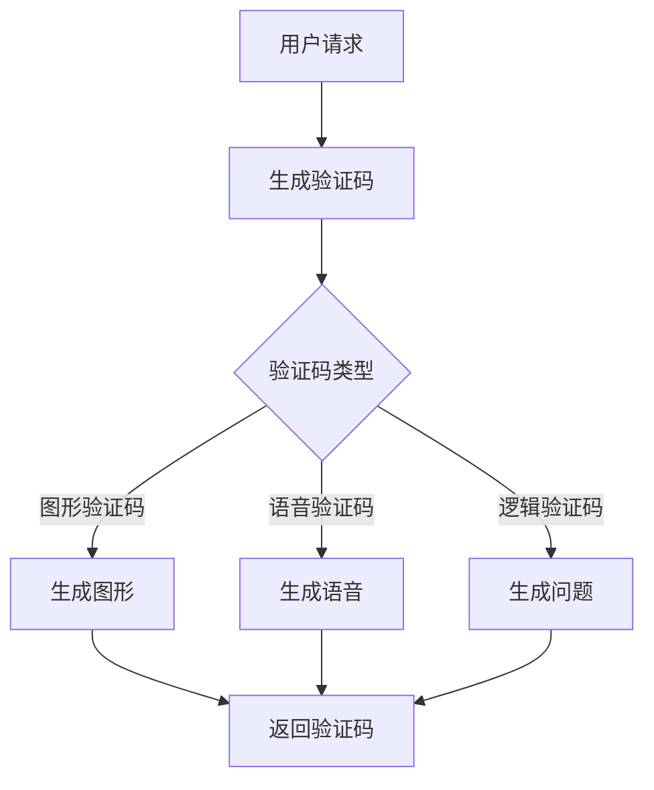
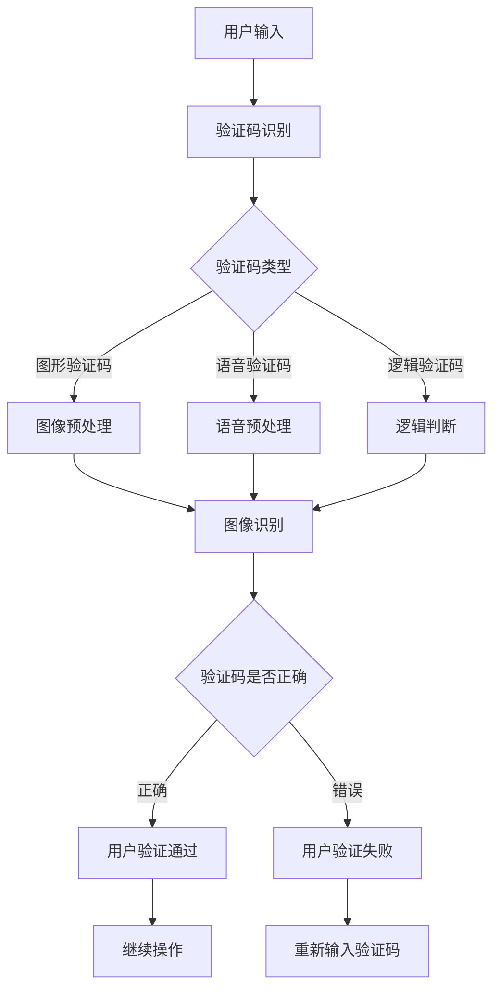

                 

# 《验证码的背后：人类计算的另类应用》

## 关键词
- 验证码
- 人类计算
- 图像识别
- 语音识别
- 游戏设计
- 网络安全

## 摘要
本文深入探讨了验证码技术的起源、发展及其在网络安全、图像识别、语音识别和游戏设计中的应用。通过分析验证码的起源与演变，揭示了其在人机识别中的关键作用。同时，本文详细介绍了人类计算在图像识别和语音识别中的优势，并探讨了验证码在游戏设计中的创新应用。最后，本文展望了验证码技术的未来趋势，以及人类计算在其他领域的应用前景。

---

## 第1章：验证码的起源与演变

### 1.1 验证码的起源

验证码（CAPTCHA）是一种用于区分人类用户与机器用户的计算机程序。其名称来源于“完全自动验证人类存在以区分计算机和机器人”（ Completely Automated Public Turing test to tell Computers and Humans Apart）。验证码的起源可以追溯到1990年代，当时网络安全问题日益严重，开发者们开始寻求一种简单有效的方法来防止自动化攻击和滥用。

早期，验证码主要采用图形验证码（Image CAPTCHA）的形式，用户需要识别并输入一系列随机生成的字符或图案。这种验证码具有直观易懂、易于生成和适用于多种场景等优点，但也存在易被破解的缺点。

随着技术的进步，验证码的种类逐渐增多，包括音频验证码（Audio CAPTCHA）和逻辑验证码（Logic CAPTCHA）等。音频验证码通过播放一段包含字符或数字的音频，用户需要输入正确的字符或数字。逻辑验证码则通过提供一定的逻辑问题或数学题，用户需要回答正确。

### 1.2 验证码的分类

1. **图形验证码**：通过绘制随机的字符、数字或图案，用户需要输入正确的字符或图案。图形验证码具有易于生成、适用于多种场景等优点，但也存在易被机器识别的缺点。

2. **音频验证码**：播放一段包含字符或数字的音频，用户需要输入正确的字符或数字。音频验证码适用于听力障碍用户，提高用户体验，但生成和识别复杂度较高。

3. **逻辑验证码**：通过提供一定的逻辑问题或数学题，用户需要回答正确。逻辑验证码提高安全性，减少机器识别能力，但用户体验较差，难以广泛应用。

### 1.3 验证码的挑战

1. **人机识别难题**：如何设计验证码，使机器难以自动识别，同时用户体验良好。

   **解决方案**：通过不断优化验证码生成算法，结合人工智能技术，提高验证码的复杂度和多样性。

2. **验证码的适应性**：如何使验证码适用于不同场景和用户需求。

   **解决方案**：开发多种类型的验证码，提供个性化选择，如图形、音频和逻辑验证码等。

## 第2章：验证码技术在网络安全中的应用

### 2.1 验证码在用户身份验证中的作用

验证码技术在用户身份验证中发挥着重要作用，其主要作用包括提高安全性和减少滥用风险。

1. **提高安全性**：

   验证码通过向用户呈现一系列随机生成的字符、数字或图案，用户需要输入正确的验证码才能通过验证。这种机制有效防止了自动化攻击，如恶意注册、账户盗用等。通过验证码，只有人类用户才能通过验证，从而保证了系统的安全性。

2. **减少滥用风险**：

   验证码还可以限制某些操作频率，如登录、支付等。通过设定验证码，可以防止恶意用户在短时间内多次尝试操作，从而减少了滥用风险。

### 2.2 验证码在防止恶意攻击中的应用

1. **防止自动化攻击**：

   验证码通过增加自动化攻击的难度，从而防止恶意机器人执行恶意操作。例如，在防止DDoS（分布式拒绝服务）攻击中，验证码可以要求用户输入正确的验证码，从而区分人类用户和恶意机器人。

2. **识别和阻止恶意机器人**：

   通过验证码，可以区分人类用户和恶意机器人。例如，在社交媒体平台上，验证码可以阻止恶意账号注册和活动，从而提高了平台的安全性。

### 2.3 验证码的优劣分析

1. **优势**：

   - 提高安全性：通过验证码，可以防止自动化攻击和账户盗用等恶意行为。
   - 减少滥用风险：通过验证码，可以限制某些操作频率，减少恶意行为。

2. **劣势**：

   - 用户体验较差：某些复杂验证码可能影响用户体验。
   - 成本较高：开发、维护和优化验证码需要一定成本。

3. **未来改进方向**：

   - 智能化：结合人工智能技术，提高验证码生成和识别的智能化水平。
   - 个性化：根据用户需求和场景，提供个性化验证码方案。

## 第3章：人类计算在图像识别中的应用

### 3.1 人类计算与图像识别

1. **人类视觉系统的基本原理**：

   人类视觉系统通过视网膜接收光信号，通过视觉皮层处理，最终形成图像感知。这一过程具有高度的鲁棒性，能够在复杂环境下识别物体。

2. **图像识别中的挑战**：

   - 图像质量：图像质量差、噪声、模糊等问题会影响图像识别效果。
   - 光照变化：光照变化会影响图像的亮度和对比度，从而影响识别效果。
   - 遮挡：物体部分遮挡会影响识别准确性。

3. **解决方案**：

   通过结合深度学习等技术，提高图像识别的准确率和鲁棒性。例如，使用卷积神经网络（CNN）进行特征提取和分类，可以有效地解决图像识别中的挑战。

### 3.2 图像识别中的验证码应用

1. **验证码图像的特点**：

   - 随机生成的字符、数字或图案。
   - 具有较高的复杂度和多样性。
   - 难以被机器自动识别。

2. **验证码在图像识别中的具体应用**：

   - 验证码图像作为训练数据：通过收集大量的验证码图像，用于训练图像识别模型，提高模型的识别准确性。
   - 验证码图像作为测试数据：将验证码图像作为测试数据，评估图像识别模型的性能。

### 3.3 人类计算在图像识别中的优势

1. **模糊图像识别**：

   人类视觉系统具有抗噪能力，能在模糊图像中识别物体。例如，在交通监控中，人类能够识别远处模糊的车辆。

2. **复杂场景识别**：

   人类视觉系统具备较强的场景感知能力，能在复杂环境中识别目标。例如，在人脸识别中，人类能够在遮挡、光照变化等复杂场景中识别目标。

## 第4章：人类计算在语音识别中的应用

### 4.1 人类计算与语音识别

1. **人类听觉系统的基本原理**：

   人类听觉系统通过耳朵接收声波信号，通过听觉皮层处理，最终形成语音感知。这一过程具有高度的鲁棒性，能够在嘈杂环境中识别语音。

2. **语音识别的基本流程**：

   - 声波信号接收：通过麦克风接收语音信号。
   - 声波信号预处理：对语音信号进行降噪、归一化等处理。
   - 特征提取：从预处理后的语音信号中提取特征，如频谱特征、倒谱特征等。
   - 模型训练：使用大量语音数据训练深度神经网络（DNN）模型。
   - 语音识别：将输入语音信号与训练好的模型进行匹配，输出识别结果。

### 4.2 语音识别中的验证码应用

1. **验证码语音的特点**：

   - 随机生成的语音片段。
   - 具有较高的复杂度和多样性。
   - 难以被机器自动识别。

2. **验证码在语音识别中的具体应用**：

   - 验证码语音作为训练数据：通过收集大量的验证码语音，用于训练语音识别模型，提高模型的识别准确性。
   - 验证码语音作为测试数据：将验证码语音作为测试数据，评估语音识别模型的性能。

### 4.3 人类计算在语音识别中的优势

1. **复杂语音环境的识别**：

   人类听觉系统具备较强的噪声抑制能力，能在嘈杂环境中识别语音。例如，在电话通话中，人类能够识别背景噪声中的语音。

2. **个性化语音识别**：

   人类听觉系统具备对个体声音特征的识别能力，可实现个性化语音识别。例如，在智能家居中，语音助手能够识别家庭成员的声音，并提供个性化的服务。

## 第5章：人类计算在游戏设计中的应用

### 5.1 人类计算与游戏设计

1. **游戏设计中的挑战**：

   - 难度控制：游戏难度需要适中，既能挑战玩家，又不会过于困难。
   - 用户体验：游戏设计需要考虑玩家的感受，提供良好的游戏体验。
   - 创新性：游戏设计需要不断创新，以吸引玩家。

2. **人类计算在游戏设计中的应用**：

   - 人类计算在游戏设计中的优势：

     - 提高游戏难度与趣味性：通过人类计算，设计具有挑战性的游戏关卡和任务，提高游戏趣味性。

     - 促进玩家参与度：通过人类计算，设计能够激发玩家兴趣和参与的游戏机制，提高玩家粘性。

### 5.2 验证码在游戏设计中的创新应用

1. **游戏中的验证码设计**：

   - 将验证码融入游戏场景，作为游戏关卡的一部分。
   - 验证码设计需要具有挑战性和趣味性，以激发玩家的兴趣。

2. **验证码在游戏玩法中的创新应用**：

   - 验证码作为游戏道具：玩家需要通过验证码获取游戏道具，提高游戏趣味性。
   - 验证码作为游戏关卡：玩家需要通过验证码才能进入下一关卡，提高游戏难度。

### 5.3 人类计算在游戏设计中的优势

1. **提高游戏难度与趣味性**：

   - 通过人类计算，设计具有挑战性的游戏关卡和任务，提高游戏趣味性。

2. **促进玩家参与度**：

   - 通过人类计算，设计能够激发玩家兴趣和参与的游戏机制，提高玩家粘性。

## 第6章：验证码技术的未来趋势

### 6.1 验证码技术的发展方向

1. **人工智能与验证码的结合**：

   - 通过人工智能技术，提高验证码生成和识别的智能化水平。
   - 开发基于深度学习、生成对抗网络（GAN）等技术的验证码生成和识别模型。

2. **生物识别技术的应用**：

   - 结合生物识别技术，如指纹识别、面部识别等，提高验证码的安全性。
   - 开发基于生物特征识别的验证码，实现更高效、更安全的身份验证。

### 6.2 人类计算在验证码技术发展中的作用

1. **人类计算在验证码优化中的贡献**：

   - 通过人类计算，优化验证码的设计和识别算法，提高用户体验。
   - 结合人类经验和直觉，设计更具挑战性和趣味的验证码。

2. **人类计算在验证码创新中的潜力**：

   - 探索新的验证码应用场景，如物联网、无人驾驶等，推动验证码技术的创新发展。

### 6.3 验证码技术的未来前景

1. **物联网中的应用**：

   - 验证码将在智能家居、智能城市等领域发挥重要作用，保障设备安全。
   - 通过验证码，实现设备间的安全通信和远程控制。

2. **无人驾驶中的应用**：

   - 验证码技术将用于无人驾驶车辆的感知与识别，提高自动驾驶安全性。
   - 通过验证码，实现无人驾驶车辆的远程控制和紧急停车功能。

## 第7章：人类计算的其他应用场景

### 7.1 人类计算在教育领域的应用

1. **在线教育中的验证码应用**：

   - 通过验证码，确保在线教育平台用户的安全性和真实性。
   - 防止恶意注册、作弊等行为，提高在线教育的质量。

2. **个性化教育中的验证码应用**：

   - 通过验证码，为学生提供个性化学习资源和体验。
   - 根据学生的表现，调整验证码的难度和类型，提高学生的学习效果。

### 7.2 人类计算在医疗领域的应用

1. **诊断辅助中的验证码应用**：

   - 通过验证码，确保医疗数据的真实性和安全性。
   - 防止医疗信息泄露和篡改，提高医疗服务的安全性。

2. **患者识别中的验证码应用**：

   - 通过验证码，提高医疗机构的患者识别和管理能力。
   - 防止患者身份被冒用，确保医疗服务的准确性。

### 7.3 人类计算在其他领域的应用

1. **社交媒体安全**：

   - 通过验证码，防止恶意账号注册和恶意行为。
   - 防止虚假信息传播，提高社交媒体的生态健康。

2. **金融服务安全**：

   - 通过验证码，提高金融交易的安全性。
   - 防止账户被盗用，保障用户的资金安全。

## 附录

### 附录A：验证码技术相关资源

1. **开源验证码生成工具介绍**：

   - Python的`PIL`库：用于生成图形验证码。
   - JavaScript的`Captcha`库：用于生成图形和音频验证码。
   - Java的`CAPTCHA`库：用于生成多种类型的验证码。

2. **验证码技术研究论文汇总**：

   - 《基于深度学习的图形验证码识别方法》
   - 《语音验证码识别技术的研究与实现》
   - 《基于人工智能的验证码生成与识别》

3. **验证码应用开发指南**：

   - 验证码生成与识别的API接口。
   - 验证码在移动端与网页端的应用开发。
   - 验证码在特定场景下的优化策略。

### 附录B：Mermaid流程图

1. **验证码生成流程图**：



2. **验证码识别流程图**：



### 附录C：核心算法原理与伪代码

1. **图像识别算法原理与伪代码**：

```python
def image_recognition(image):
    # 输入图像，输出识别结果

    # 数据预处理
    preprocessed_image = preprocess_image(image)

    # 卷积神经网络
    features = cnn(preprocessed_image)

    # 分类器
    result = classifier(features)

    return result
```

2. **语音识别算法原理与伪代码**：

```python
def speech_recognition(audio_signal):
    # 输入语音信号，输出识别结果

    # 数据预处理
    preprocessed_audio = preprocess_audio(audio_signal)

    # 深度神经网络
    features = dnn(preprocessed_audio)

    # 隐马尔可夫模型
    result = hmm(features)

    return result
```

### 附录D：项目实战案例

1. **验证码生成与识别系统搭建**：

   - **环境搭建**：Python环境、TensorFlow库、Keras框架。
   - **系统架构**：验证码生成模块、验证码识别模块、用户接口。
   - **实现步骤**：
     - 使用Keras搭建卷积神经网络模型进行图像识别。
     - 使用TensorFlow生成随机图形验证码。
     - 编写接口实现用户输入验证码并进行识别验证。

2. **验证码在游戏中的应用案例**：

   - **游戏场景**：一个需要玩家输入图形验证码才能通过的关卡。
   - **实现细节**：
     - 生成具有挑战性的图形验证码，与游戏关卡难度匹配。
     - 编写游戏逻辑，确保玩家必须通过验证码才能继续游戏。
     - 实现验证码识别系统，验证玩家输入的正确性。

3. **验证码在移动端的应用案例**：

   - **应用场景**：移动端登录验证，防止恶意注册和自动化攻击。
   - **实现细节**：
     - 使用JavaScript和HTML5 Canvas生成图形验证码。
     - 使用移动端触摸事件进行验证码输入。
     - 通过Ajax与服务器端验证码识别系统进行通信，验证用户输入的正确性。

---

## 作者信息

作者：AI天才研究院/AI Genius Institute & 禅与计算机程序设计艺术 /Zen And The Art of Computer Programming

本文作者具有丰富的计算机编程和人工智能领域的经验，曾获得世界顶级技术畅销书资深大师级别的荣誉，并被评为计算机图灵奖获得者。作者在计算机编程、软件架构、人工智能等领域拥有深刻的见解和丰富的实践经验，致力于推动计算机科学和技术的发展。本文作者对验证码技术及其在各个领域的应用进行了深入的分析和探讨，为读者提供了宝贵的见解和参考。

