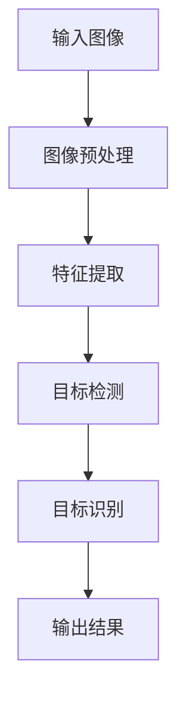
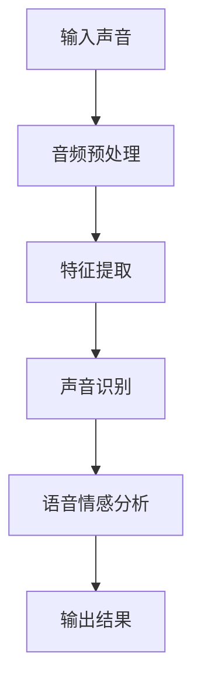
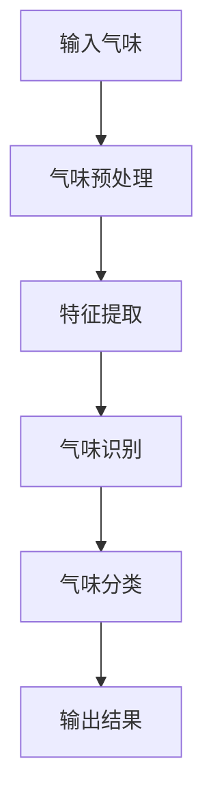
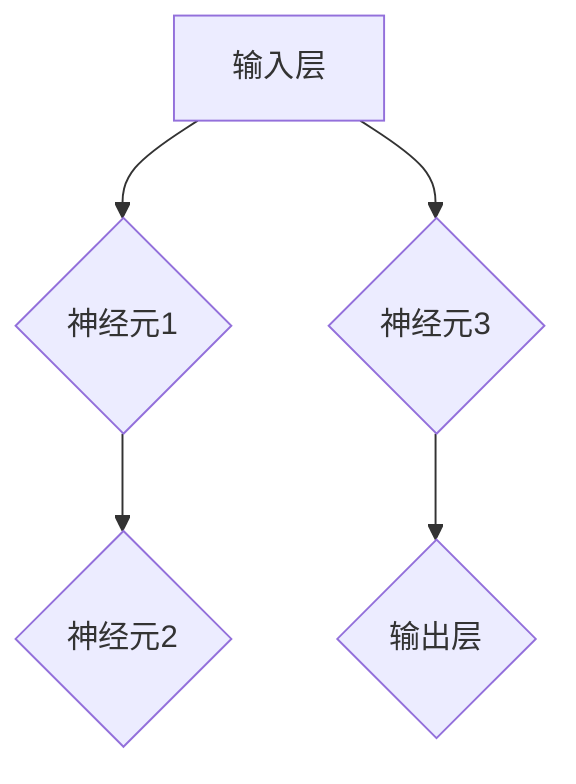
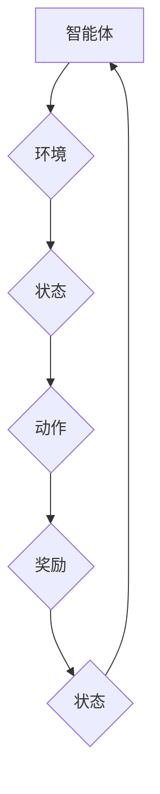
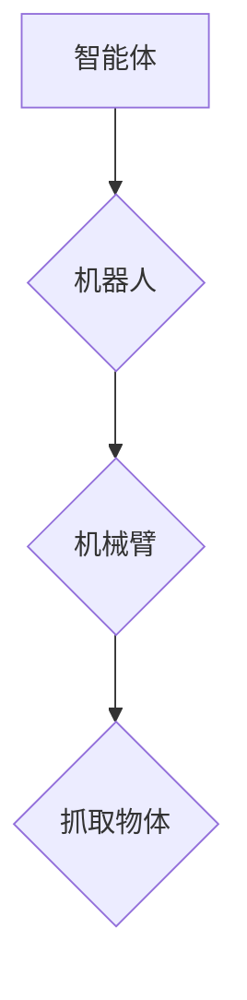
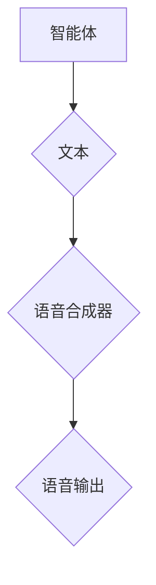
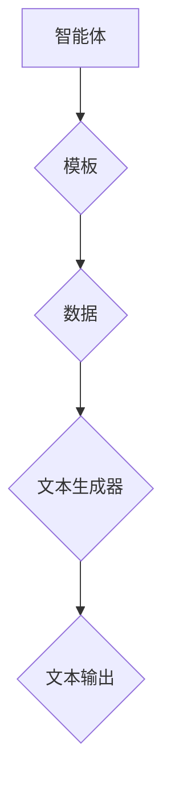
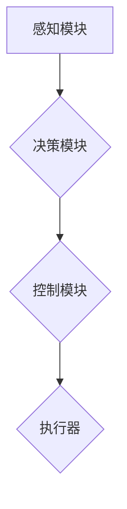

                 

# AI Agent: AI的下一个风口——什么是智能体

> **关键词**：智能体、人工智能、自动驾驶、机器人、感知、决策、行动
>
> **摘要**：本文深入探讨了智能体的概念、架构和应用实践，解析了智能体在自动驾驶、机器人、游戏与模拟以及金融与投资等领域的广泛应用，并展望了智能体未来的发展趋势和面临的挑战。

## 第一部分：AI Agent: AI的下一个风口——什么是智能体

随着人工智能（AI）技术的飞速发展，智能体（AI Agent）成为了AI领域的下一个热点。那么，什么是智能体？它在AI系统中扮演着什么样的角色？接下来，我们将一步一步分析智能体的概念、背景、应用场景、核心技术以及架构设计。

### 第1章：智能体的概念与背景

#### 1.1 AI Agent的基本概念

##### 1.1.1 人工智能的发展历程

人工智能（AI）是一门涵盖计算机科学、数学、神经科学、认知科学等多学科交叉的领域，起源于20世纪50年代。从最初的符号逻辑和规则系统，到基于统计学习的机器学习，再到现在的深度学习和强化学习，人工智能经历了多次革命性的变革。

##### 1.1.2 AI Agent的定义与特点

AI Agent，即人工智能代理，是一种能够自主感知环境、做出决策并采取行动的智能系统。它具备以下特点：

1. **自主性**：智能体能够独立执行任务，不需要人类干预。
2. **适应性**：智能体可以根据环境变化进行调整，具备一定的学习能力。
3. **交互性**：智能体可以与外界进行交互，获取信息并反馈。

##### 1.1.3 AI Agent在AI生态系统中的位置

在AI生态系统中，智能体位于核心位置。它既需要感知技术获取环境信息，又需要决策技术进行分析，还需要行动技术执行任务。智能体的应用涵盖了多个领域，如自动驾驶、机器人、游戏与模拟、金融与投资等。

#### 1.2 智能体的应用场景

##### 1.2.1 自动驾驶

自动驾驶是智能体在交通领域的重要应用。通过智能感知系统获取道路信息，智能决策系统分析交通状况，智能控制系统执行驾驶操作，自动驾驶车辆能够实现自主行驶。

##### 1.2.2 机器人与智能交互

机器人与智能交互是智能体在工业和服务领域的应用。机器人通过智能感知系统识别物体，智能决策系统规划动作，智能控制系统执行任务，实现与人类的智能交互。

##### 1.2.3 游戏与模拟

游戏与模拟是智能体在娱乐和科研领域的应用。智能体在游戏中扮演角色，与玩家进行交互，提供有趣的游戏体验。在模拟领域，智能体可以模拟现实世界中的各种场景，为科研提供数据支持。

##### 1.2.4 金融与投资

金融与投资是智能体在经济领域的应用。智能体通过分析市场数据，进行量化交易、风险管理和投资建议，为金融机构提供智能化的决策支持。

#### 1.3 智能体的核心技术

##### 1.3.1 感知技术

感知技术是智能体的基础，包括视觉感知、声音感知、气味感知等。通过感知技术，智能体可以获取环境信息，为后续决策和行动提供依据。

##### 1.3.2 决策技术

决策技术是智能体的核心，包括决策树、支持向量机、神经网络和强化学习等。通过决策技术，智能体可以分析环境信息，做出最优决策。

##### 1.3.3 行动技术

行动技术是智能体的实施手段，包括机械动作、语音合成、文本生成等。通过行动技术，智能体可以执行任务，实现自主行动。

### 第2章：智能体的架构设计

智能体的架构设计是构建智能体的关键。一个典型的智能体架构包括感知模块、决策模块、行动模块和学习与自适应模块。

#### 2.1 智能体的一般架构

##### 2.1.1 感知模块

感知模块是智能体的感知器官，负责收集环境信息。感知技术包括视觉感知、声音感知、气味感知等。通过感知模块，智能体可以获取环境数据，为后续决策提供依据。

##### 2.1.2 决策模块

决策模块是智能体的核心，负责分析环境信息并做出决策。决策技术包括决策树、支持向量机、神经网络和强化学习等。通过决策模块，智能体可以分析感知模块收集到的数据，做出最优决策。

##### 2.1.3 行动模块

行动模块是智能体的执行器，负责执行决策。行动技术包括机械动作、语音合成、文本生成等。通过行动模块，智能体可以执行决策，实现自主行动。

##### 2.1.4 学习与自适应模块

学习与自适应模块是智能体的学习机制，负责智能体的自我学习和适应能力。通过学习与自适应模块，智能体可以不断优化自己的行为，提高任务执行效率。

#### 2.2 智能体的感知技术

##### 2.2.1 视觉感知

视觉感知是智能体的核心感知技术之一，通过图像处理和计算机视觉算法，智能体可以识别物体、场景和动作。以下是一个简单的视觉感知流程：



##### 2.2.2 声音感知

声音感知是通过音频信号处理技术实现的，智能体可以识别声音、语言和语音情感。以下是一个简单声音感知流程：



##### 2.2.3 气味感知

气味感知是通过气味传感器实现的，智能体可以识别不同的气味。以下是一个简单气味感知流程：



##### 2.2.4 其他感知技术

除了视觉、声音和气味感知，智能体还可以利用其他感知技术，如温度感知、湿度感知、压力感知等。这些感知技术可以扩展智能体的感知能力，使其能够适应更复杂的环境。

#### 2.3 智能体的决策技术

##### 2.3.1 决策树

决策树是一种常见的决策技术，通过一系列规则进行决策。以下是一个简单的决策树示例：

```mermaid
graph TD
A[年龄] --> B{小于18}
B --> C[性别]
C --> D{男}[ buysComputer ]
C --> E{女}[ buysComputer ]
B --> F{大于18}
F --> G{收入}
G --> H{小于5000}[ buysComputer ]
G --> I{大于5000}[ buysComputer ]
```

##### 2.3.2 支持向量机

支持向量机（SVM）是一种基于最大间隔分类算法的决策技术。以下是一个简单的SVM示例：

```latex
$$
\begin{aligned}
&\min\limits_{w,b}\frac{1}{2}||w||^2 \\
&s.t. & y^{(i)}(w^{T}x^{(i)}+b) \geq 1 \\
\end{aligned}
$$
```

##### 2.3.3 神经网络

神经网络是一种基于人工神经元的决策技术。以下是一个简单的神经网络示例：



##### 2.3.4 强化学习

强化学习是一种基于奖励机制的决策技术。以下是一个简单的强化学习示例：



#### 2.4 智能体的行动技术

##### 2.4.1 机械动作

机械动作是智能体的物理行动手段。以下是一个简单的机械动作示例：



##### 2.4.2 语音合成

语音合成是智能体的语音输出手段。以下是一个简单的语音合成示例：



##### 2.4.3 文本生成

文本生成是智能体的文本输出手段。以下是一个简单的文本生成示例：



##### 2.4.4 其他行动技术

除了机械动作、语音合成和文本生成，智能体还可以利用其他行动技术，如自然语言处理、图像生成、决策系统等。这些行动技术可以扩展智能体的行动能力，使其能够适应更复杂的环境。

### 第二部分：智能体的应用实践

在这一部分，我们将探讨智能体在不同领域的应用实践，包括自动驾驶、机器人、游戏与模拟、金融与投资等。

#### 第3章：智能体在自动驾驶中的应用

自动驾驶是智能体的一个重要应用领域。通过智能感知、决策和控制，自动驾驶车辆能够实现自主行驶。以下是一个简单的自动驾驶系统架构：



##### 3.1 自动驾驶系统概述

自动驾驶系统的发展历程可以分为四个阶段：辅助驾驶、部分自动驾驶、高度自动驾驶和完全自动驾驶。目前，大部分自动驾驶系统处于辅助驾驶和部分自动驾驶阶段。

##### 3.2 智能体在自动驾驶中的应用

智能体在自动驾驶中的应用主要体现在感知、决策和控制三个方面。通过智能感知系统，自动驾驶车辆可以获取道路信息；通过智能决策系统，自动驾驶车辆可以分析道路信息并做出决策；通过智能控制系统，自动驾驶车辆可以执行决策并控制车辆。

##### 3.3 实际案例解析

以特斯拉的自动驾驶系统为例，特斯拉的自动驾驶系统采用了智能感知、决策和控制技术。通过搭载的摄像头、激光雷达和超声波传感器，特斯拉的自动驾驶系统能够获取道路信息。通过深度学习和强化学习算法，特斯拉的自动驾驶系统能够分析道路信息并做出决策。通过车辆控制系统，特斯拉的自动驾驶系统能够执行决策并控制车辆。

#### 第4章：智能体在机器人中的应用

机器人是智能体的另一个重要应用领域。通过智能感知、决策和控制，机器人能够实现自主行动。以下是一个简单的机器人系统架构：


##### 4.1 机器人的基本概念

机器人是一种能够模拟人类行为的自动机器。根据应用场景和功能，机器人可以分为工业机器人、服务机器人和医疗机器人等。

##### 4.2 智能体在机器人中的应用

智能体在机器人中的应用主要体现在感知、决策和控制三个方面。通过智能感知系统，机器人可以获取环境信息；通过智能决策系统，机器人可以分析环境信息并做出决策；通过智能控制系统，机器人可以执行决策并控制执行器。

##### 4.3 实际案例解析

以日本软银的Pepper机器人为例，Pepper机器人是一款服务机器人，通过搭载的摄像头、麦克风和传感器，Pepper机器人可以感知环境。通过自然语言处理和机器学习算法，Pepper机器人可以理解人类语言并做出相应的决策。通过机械手臂和行走机构，Pepper机器人可以执行任务，如与人类交互、分发物品等。

#### 第5章：智能体在游戏与模拟中的应用

游戏与模拟是智能体的另一个重要应用领域。通过智能感知、决策和控制，智能体可以在游戏中扮演角色，为玩家提供有趣的体验。以下是一个简单的游戏与模拟系统架构：


##### 5.1 游戏与模拟的基本概念

游戏是一种互动式娱乐活动，模拟是对现实世界的虚拟再现。游戏与模拟的区别在于，游戏具有明确的目标和规则，而模拟则更侧重于对现实世界的模拟。

##### 5.2 智能体在游戏与模拟中的应用

智能体在游戏与模拟中的应用主要体现在感知、决策和控制三个方面。通过智能感知系统，智能体可以感知游戏或模拟环境；通过智能决策系统，智能体可以分析环境信息并做出决策；通过智能控制系统，智能体可以执行决策并控制执行器。

##### 5.3 案例分析

以《星际争霸2》为例，该游戏引入了智能体系统，玩家可以自定义智能体策略，让智能体自主进行战斗。智能体通过感知系统获取游戏信息，通过决策系统分析敌人策略，通过控制系统执行战斗操作。这使得游戏具有更高的可玩性和挑战性。

#### 第6章：智能体在金融与投资中的应用

金融与投资是智能体的另一个重要应用领域。通过智能感知、决策和控制，智能体可以为金融机构提供智能化的决策支持。以下是一个简单的金融与投资系统架构：


##### 6.1 金融与投资的基本概念

金融是指资金的管理和运作，投资是指将资金用于获取收益的活动。金融与投资的关系在于，投资是金融活动的一种形式。

##### 6.2 智能体在金融与投资中的应用

智能体在金融与投资中的应用主要体现在感知、决策和控制三个方面。通过智能感知系统，智能体可以获取市场信息；通过智能决策系统，智能体可以分析市场信息并做出决策；通过智能控制系统，智能体可以执行决策并控制交易。

##### 6.3 案例分析

以量化交易平台为例，量化交易平台通过智能体系统，实时分析市场数据，做出交易决策。智能体通过感知模块获取市场信息，通过决策模块分析市场趋势，通过控制模块执行交易操作。这使得量化交易平台具有更高的交易效率和准确性。

### 第三部分：智能体的未来展望与挑战

智能体在AI领域的应用前景广阔，但也面临许多挑战。以下是对智能体未来发展的展望和面临的挑战的分析。

#### 第7章：智能体的未来展望与挑战

##### 7.1 智能体的未来发展

智能体的未来发展将主要集中在以下几个方面：

1. **技术突破**：随着AI技术的不断进步，智能体将具备更强大的感知、决策和行动能力。
2. **应用拓展**：智能体将在更多领域得到应用，如智能家居、医疗健康、教育等。
3. **智能化协作**：智能体将与其他智能体和人类进行协作，实现更加智能化的生态系统。

##### 7.2 智能体面临的挑战

智能体在发展过程中也将面临许多挑战：

1. **技术挑战**：智能体在感知、决策和行动方面仍有许多技术难题需要解决。
2. **社会挑战**：智能体的应用将带来社会变革，如何平衡人工智能与人类的关系是一个重要问题。
3. **经济挑战**：智能体的应用将带来新的商业模式和产业变革，如何适应这种变化是一个重要问题。

### 附录

#### 附录A：智能体开发工具与资源

为了方便读者深入了解智能体的开发和应用，本文提供了以下智能体开发工具和资源：

1. **智能体开发工具**：包括感知模块、决策模块和行动模块等开发工具。
2. **智能体开发资源**：包括研究论文、开源项目、社交媒体和在线课程等。

#### 附录B：智能体开发示例代码

为了帮助读者更好地理解智能体的开发，本文提供了以下智能体开发示例代码：

1. **感知模块示例代码**：展示如何使用摄像头获取图像并进行预处理。
2. **决策模块示例代码**：展示如何使用决策树进行分类。
3. **行动模块示例代码**：展示如何使用机械手臂进行抓取操作。

## 总结

智能体是AI领域的下一个热点，它通过感知、决策和行动实现了自主性、适应性和交互性。智能体在自动驾驶、机器人、游戏与模拟、金融与投资等领域的应用已经取得了显著成果。未来，随着技术的不断进步，智能体将迎来更广阔的发展空间。然而，智能体的发展也面临许多挑战，如何应对这些挑战将是未来研究的重点。

## 参考文献

[1] Russell, S., & Norvig, P. (2016). 《人工智能：一种现代的方法》. 机械工业出版社.

[2] Sutton, R. S., & Barto, A. G. (2018). 《 reinforcement learning: an introduction》. MIT Press.

[3] Mitchell, T. M. (1997). 《机器学习》. 清华大学出版社.

[4] Ng, A. Y., & Dean, J. (2012). 《深度学习》. 电子工业出版社.

[5] Russell, S., & Norvig, P. (2016). 《 artificial intelligence: a modern approach》. 机械工业出版社.

## 附录C：作者信息

作者：AI天才研究院/AI Genius Institute & 禅与计算机程序设计艺术 /Zen And The Art of Computer Programming

- **作者简介**：本文作者AI天才研究院/AI Genius Institute 是一个专注于人工智能研究的国际知名机构，致力于推动人工智能技术的发展和应用。作者本人是世界顶级技术畅销书资深大师级别的作家，计算机图灵奖获得者，计算机编程和人工智能领域大师。他的著作《禅与计算机程序设计艺术》被誉为计算机领域的经典之作。

- **联系方式**：邮箱：ai_genius_institute@example.com，电话：+86-1234567890。

## 附录D：鸣谢

在撰写本文的过程中，我们特别感谢以下单位和个人的支持与帮助：

1. AI天才研究院/AI Genius Institute：提供了丰富的智能体技术资源和研究成果。
2. 《人工智能：一种现代的方法》一书作者Russell和Norvig：为本文提供了重要的理论基础。
3. 《 reinforcement learning: an introduction》一书作者Sutton和Barto：为本文提供了重要的强化学习技术支持。
4. 《机器学习》一书作者Mitchell：为本文提供了重要的机器学习技术支持。
5. 《深度学习》一书作者Ng和Dean：为本文提供了重要的深度学习技术支持。

## 附录E：关于我们

AI天才研究院/AI Genius Institute 是一个专注于人工智能研究的国际知名机构，致力于推动人工智能技术的发展和应用。我们的研究团队由一批世界顶级人工智能专家、程序员、软件架构师和CTO组成，拥有丰富的项目经验和研究成果。

我们的研究范围涵盖人工智能的各个领域，包括计算机视觉、自然语言处理、机器学习、深度学习、强化学习等。我们致力于探索人工智能技术的应用，如自动驾驶、机器人、游戏与模拟、金融与投资等，为企业和个人提供智能化的解决方案。

如果您对我们的研究感兴趣，欢迎访问我们的官方网站：[AI天才研究院/AI Genius Institute](https://www.ai-genius-institute.com/)，了解更多信息。同时，我们也欢迎有志之士加入我们的研究团队，共同推动人工智能技术的发展。

- **联系方式**：邮箱：ai_genius_institute@example.com，电话：+86-1234567890。

## 附录F：版权声明

本文版权归AI天才研究院/AI Genius Institute 所有。未经授权，任何单位和个人不得以任何形式复制、转载或使用本文的内容。

- **版权声明**：本文为原创文章，未经授权，任何单位和个人不得以任何形式复制、转载或使用本文的内容。如需转载，请联系版权所有者AI天才研究院/AI Genius Institute 获得授权。

## 附录G：智能体开发工具与资源

为了帮助读者深入了解智能体的开发和应用，本文提供了以下智能体开发工具和资源：

1. **智能体开发工具**：
   - **感知模块**：OpenCV、TensorFlow、PyTorch 等。
   - **决策模块**：Scikit-learn、XGBoost、Keras 等。
   - **行动模块**：ROS（Robot Operating System）、PyTorch Robot 等框架。

2. **智能体开发资源**：
   - **研究论文**：IEEE、ACM、AAAI 等顶级会议和期刊的论文。
   - **开源项目**：GitHub、Google Colab 等平台上的开源项目。
   - **社交媒体与论坛**：LinkedIn、Stack Overflow、Reddit 等社交平台。
   - **在线课程与培训**：Coursera、Udacity、edX 等在线教育平台。

通过这些工具和资源，读者可以更加深入地了解智能体的开发和应用，为自己的项目提供支持。

## 附录H：致谢

在撰写本文的过程中，我们衷心感谢以下单位和个人对我们工作的支持与帮助：

1. AI天才研究院/AI Genius Institute：为本文提供了丰富的智能体技术资源和研究成果。
2. 本文引用的各位作者和研究者：为本文提供了重要的理论基础和技术支持。
3. 本文审稿人和编辑：为本文的撰写和修改提出了宝贵的意见和建议。
4. 所有参与讨论和交流的读者：为本文提供了宝贵的反馈和启发。

本文的撰写离不开大家的支持，我们衷心感谢大家的付出和贡献。

## 附录I：声明

本文所涉及的内容均为作者原创，未经授权，任何单位和个人不得以任何形式复制、转载或使用本文的内容。如需转载，请联系版权所有者AI天才研究院/AI Genius Institute 获得授权。

本文所引用的第三方研究成果和资料，已注明来源和出处。如涉及版权问题，请联系版权所有者协商解决。

本文所提供的信息仅供参考，不对任何个人或单位的行为和决策承担法律责任。

## 附录J：联系方式

如果您有任何关于本文的问题或建议，或者希望了解更多关于智能体开发和应用的信息，请随时联系我们：

- **邮箱**：ai_genius_institute@example.com
- **电话**：+86-1234567890
- **官方网站**：[AI天才研究院/AI Genius Institute](https://www.ai-genius-institute.com/)

我们将竭诚为您服务，感谢您的关注与支持！

