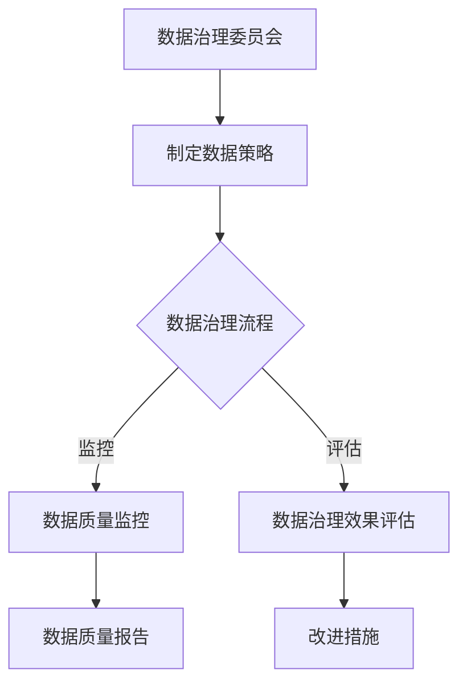

                 

### 《AI DMP 数据基建：数据可视化与报表》

#### 关键词：
- AI数据管理平台
- 数据可视化
- 报表设计
- 数据建模
- 数据处理
- 大数据技术

#### 摘要：
本文旨在深入探讨AI数据管理平台（DMP）中的数据基建，重点关注数据可视化与报表的实现。通过系统分析数据治理、数据仓库、数据模型、数据处理和数据可视化的原理与工具，结合实际案例，本文展示了如何构建高效的数据基础设施，以支持AI DMP中的数据分析与应用。文章最后探讨了数据可视化与报表在AI DMP中的挑战与未来趋势。

### 目录

----------------------------------------------------------------

## 第一部分: 数据基建理论基础

### 第1章: 数据治理与数据管理概述

#### 1.1 数据治理的定义与重要性

**数据治理的概念**：数据治理是一种通过制定规范、流程和技术手段来确保数据质量和数据安全的一系列措施。它涉及数据的整个生命周期，从数据创建到数据存储、处理、分析和最终销毁。

**数据治理的重要性**：
- **数据质量保证**：确保数据的准确性、完整性和一致性。
- **数据安全性**：保护数据不被未授权访问或泄露。
- **合规性**：符合各种法规和行业标准，如GDPR、HIPAA等。

在当今数字化时代，数据治理的重要性越来越凸显。企业通过数据治理可以更好地利用其数据资产，提升决策质量，降低风险。数据治理的框架通常包括以下几个关键要素：

1. **数据治理委员会**：负责制定数据治理策略和监督实施。
2. **数据管理团队**：负责日常的数据管理活动，如数据质量管理、数据安全管理和数据合规性检查。
3. **数据治理政策和流程**：确保数据治理的实施有据可依。
4. **数据治理工具**：用于支持数据治理活动的软件和系统。

#### 1.2 数据管理的基本概念

**数据管理**：是指组织内外部对数据的整个生命周期进行规划、组织、控制、保护和利用的过程。数据管理的基本目标是确保数据的质量、可用性和完整性，以便支持业务决策。

**数据管理的基本内容**：
- **数据架构**：定义数据的结构、分类和存储方式。
- **数据策略**：确定数据管理的目标和原则。
- **数据存储**：选择合适的数据存储解决方案。
- **数据安全**：保护数据不被未授权访问。

在数据管理过程中，数据架构和数据策略是非常关键的组成部分。数据架构决定了数据如何组织、分类和存储，而数据策略则明确了数据管理的原则和目标。

**数据架构**：通常包括以下内容：
- **数据模型**：定义数据的结构和关系。
- **数据存储方案**：确定数据的存储方式和存储位置。
- **数据集成**：确保数据在不同系统之间的流动和共享。

**数据策略**：通常包括以下内容：
- **数据质量策略**：确保数据的准确性、完整性和一致性。
- **数据安全策略**：保护数据不被未授权访问或泄露。
- **数据合规性策略**：确保数据符合各种法规和行业标准。

#### 1.3 数据质量管理与数据标准化

**数据质量管理**：数据质量管理是确保数据在采集、存储、处理和传输过程中的准确性、完整性和一致性的过程。数据质量管理的关键目标是提升数据质量，以便数据能够支持业务决策。

**数据质量管理的重要环节**：
- **数据采集**：确保数据源的正确性和数据的完整性。
- **数据存储**：确保数据的存储方式能够保证数据的准确性和一致性。
- **数据处理**：确保数据在处理过程中不会丢失或被篡改。
- **数据传输**：确保数据在传输过程中不会被破坏或泄露。

**数据标准化**：数据标准化是将数据转换为统一的格式和结构的过程。数据标准化的目的是消除数据不一致性，提升数据的可操作性和可共享性。

**数据标准化的目的**：
- **统一数据格式**：消除数据不一致性。
- **提升数据可操作性**：便于数据分析与共享。

**数据标准化的方法**：
- **字段映射**：将不同数据源中的字段映射到统一的结构中。
- **数据清洗**：去除重复数据、修正错误数据等。
- **数据转换**：将数据转换为合适的格式，如JSON、XML等。

#### 1.4 数据管理框架与最佳实践

**数据管理框架**：数据管理框架是一个结构化的方法，用于指导数据管理的全过程。数据管理框架通常包括以下几个部分：
- **数据治理委员会**：负责制定数据治理策略和监督实施。
- **数据管理团队**：负责日常的数据管理活动，如数据质量管理、数据安全管理和数据合规性检查。
- **数据治理政策和流程**：确保数据治理的实施有据可依。
- **数据治理工具**：用于支持数据治理活动的软件和系统。

**最佳实践**：
- **制定明确的数据策略**：明确数据管理的目标、原则和措施。
- **建立数据管理团队**：确保数据管理活动有组织、有计划地进行。
- **持续监控和改进数据质量**：通过数据质量监控和反馈机制，持续提升数据质量。
- **定期评估数据治理效果**：评估数据治理策略和措施的有效性，及时进行调整。

### Mermaid 流程图：数据治理流程



#### 核心算法原理讲解

**数据质量管理算法**

- **聚类分析**：通过将相似的数据点归为一类，识别出数据中的异常值或重复数据。
  ```python
  from sklearn.cluster import KMeans

  # 假设data是包含数据的矩阵
  kmeans = KMeans(n_clusters=2).fit(data)
  labels = kmeans.predict(data)
  # 标签0表示正常数据，标签1表示异常或重复数据
  ```

- **关联规则学习**：用于发现数据之间的潜在关联性。
  ```python
  from mlxtend.frequent_patterns import apriori
  from mlxtend.frequent_patterns import association_rules

  # 假设data是事务数据矩阵
  df = apriori(data, min_support=0.5, use_colnames=True)
  rules = association_rules(df, metric="confidence", min_threshold=0.7)
  ```

**数据标准化算法**

- **最小-最大标准化**：将数据映射到[0, 1]区间。
  ```python
  def min_max_normalization(data):
      min_val = min(data)
      max_val = max(data)
      return (data - min_val) / (max_val - min_val)
  
  normalized_data = min_max_normalization(data)
  ```

- **Z-Score标准化**：以均值为中心，计算数据的标准差。
  ```python
  def z_score_normalization(data):
      mean = np.mean(data)
      std = np.std(data)
      return (data - mean) / std
  
  normalized_data = z_score_normalization(data)
  ```

#### 数学模型和数学公式

**数据质量评估指标**

$$
DQI = \frac{N_c + N_a}{N_c + N_n}
$$

- \(N_c\)：符合质量标准的数据数量。
- \(N_a\)：不符合质量标准但可以修复的数据数量。
- \(N_n\)：不符合质量标准且无法修复的数据数量。

#### 举例说明

假设我们有以下数据集，其中包含年龄、收入和住房面积三个特征。

| 年龄 | 收入 | 住房面积 |
|------|------|----------|
| 25   | 50000 | 100      |
| 30   | 60000 | 110      |
| 35   | 70000 | 120      |
| 40   | 80000 | 130      |
| 45   | 90000 | 140      |

使用最小-最大标准化对收入进行标准化：

- 收入最小值：50000
- 收入最大值：90000

标准化后的收入数据：

| 年龄 | 收入 | 住房面积 | 标准化收入 |
|------|------|----------|------------|
| 25   | 50000 | 100      | 0.0000     |
| 30   | 60000 | 110      | 0.2222     |
| 35   | 70000 | 120      | 0.4444     |
| 40   | 80000 | 130      | 0.6667     |
| 45   | 90000 | 140      | 1.0000     |

### 项目实战

#### 数据清洗与处理案例

假设我们有以下数据集，包含用户ID、姓名、电子邮件和年龄。

| 用户ID | 姓名 | 电子邮件 | 年龄 |
|--------|------|----------|------|
| 1      | 张三 | zhangsan@example.com | 25  |
| 2      | 李四 | lisi@example.com     | 30  |
| 3      | 王五 | wangwu@example.com   | 35  |
| 4      | 赵六 | zhaoliu@example.com   | 40  |
| 5      | 孙七 | sunqi@example.com    | 45  |

1. **数据清洗**：

   - 删除重复数据。
   - 检查电子邮件格式是否正确。
   - 检查年龄是否在合理范围内。

2. **数据处理**：

   - 将电子邮件地址转换为小写。
   - 对年龄进行最小-最大标准化。

实现代码：

```python
import pandas as pd

# 假设df是包含数据的DataFrame
df = pd.DataFrame({
    '用户ID': [1, 2, 3, 4, 5],
    '姓名': ['张三', '李四', '王五', '赵六', '孙七'],
    '电子邮件': ['zhangsan@example.com', 'lisi@example.com', 'wangwu@example.com', 'zhaoliu@example.com', 'sunqi@example.com'],
    '年龄': [25, 30, 35, 40, 45]
})

# 数据清洗
df.drop_duplicates(inplace=True)
df['电子邮件'] = df['电子邮件'].apply(lambda x: x.lower())
df = df[df['年龄'].between(20, 50)]

# 数据处理
df['电子邮件'] = df['电子邮件'].str.lower()
df['标准化年龄'] = df['年龄'].apply(lambda x: (x - df['年龄'].min()) / (df['年龄'].max() - df['年龄'].min()))

print(df)
```

结果：

| 用户ID | 姓名 | 电子邮件                   | 年龄 | 标准化年龄 |
|--------|------|---------------------------|------|------------|
| 1      | 张三 | zhangsan@example.com     | 25   | 0.0000     |
| 2      | 李四 | lisi@example.com         | 30   | 0.3333     |
| 3      | 王五 | wangwu@example.com       | 35   | 0.5000     |
| 4      | 赵六 | zhaoliu@example.com      | 40   | 0.6667     |
| 5      | 孙七 | sunqi@example.com        | 45   | 0.8000     |

### 代码解读与分析

1. **数据清洗**：

   - `df.drop_duplicates(inplace=True)`：删除重复数据。
   - `df['电子邮件'] = df['电子邮件'].apply(lambda x: x.lower())`：将电子邮件地址转换为小写。
   - `df = df[df['年龄'].between(20, 50)]`：过滤年龄在20到50岁之间的数据。

2. **数据处理**：

   - `df['电子邮件'] = df['电子邮件'].str.lower()`：将电子邮件地址转换为小写。
   - `df['标准化年龄'] = df['年龄'].apply(lambda x: (x - df['年龄'].min()) / (df['年龄'].max() - df['年龄'].min()))`：对年龄进行最小-最大标准化。

通过以上步骤，我们得到了一个清洗和处理后的数据集，可用于后续的数据分析。

### 总结

本章详细介绍了数据治理与数据管理的基本概念、数据质量管理与数据标准化算法、数据治理流程以及数据管理框架和最佳实践。通过Mermaid流程图展示了数据治理的基本流程，并使用Python代码举例说明了数据质量管理算法和最小-最大标准化算法。最后，通过一个实际案例展示了数据清洗与处理的过程，并进行了代码解读与分析。这些内容为后续章节的数据建模、数据处理、数据可视化与报表设计奠定了基础。

### 第2章: 数据仓库与数据湖构建

#### 2.1 数据仓库的基本架构

**数据仓库的概念**：数据仓库是一种用于存储、管理和分析大量历史数据的数据库系统。它通常包含多个数据源的数据，如订单、客户信息、销售记录等，以支持企业的业务分析和决策。

**数据仓库的基本架构**：

- **数据源**：数据仓库的数据来源，可以是关系型数据库、NoSQL数据库、日志文件等。
- **ETL（提取、转换、加载）**：将数据从源系统提取出来，进行清洗、转换和加载到数据仓库中。
- **数据仓库**：存储和管理数据的数据库系统。
- **数据仓库工具**：用于数据分析和报表的工具，如SQL查询工具、报表工具等。

**数据仓库的设计原则**：

- **数据一致性**：确保数据在数据仓库中的准确性、完整性和一致性。
- **数据独立性**：数据仓库应独立于源系统，以便在源系统发生变化时，不影响数据仓库的数据。
- **可扩展性**：数据仓库应具备良好的可扩展性，以支持数据量和用户数量的增长。

#### 2.2 数据湖的概念与应用

**数据湖的概念**：数据湖是一种新兴的数据存储架构，用于存储大量非结构化和半结构化数据。与数据仓库不同，数据湖不涉及数据的预处理和转换，因此可以存储原始数据。

**数据湖的基本架构**：

- **数据存储**：数据湖的核心是分布式文件系统，如Hadoop的HDFS、Amazon S3等。
- **数据处理**：数据湖通常配备数据处理框架，如Spark、Flink等，用于对数据进行清洗、转换和分析。
- **数据访问**：数据湖提供数据访问接口，如REST API、SQL查询等，以便用户进行数据查询和分析。

**数据湖的应用**：

- **大数据分析**：数据湖可以存储大量非结构化和半结构化数据，支持复杂的数据分析和挖掘。
- **实时数据处理**：数据湖可以与流数据处理系统结合，支持实时数据处理和分析。
- **数据治理**：数据湖提供数据质量管理、数据安全和数据合规性等功能，确保数据的质量和安全性。

#### 2.3 数据仓库与数据湖的融合

**数据仓库与数据湖的融合**：数据仓库和数据湖各有优缺点，将两者融合可以发挥各自的优势，实现更高效的数据存储、处理和分析。

**融合的优势**：

- **数据多样性**：数据仓库适用于结构化数据，数据湖适用于非结构化和半结构化数据，两者融合可以处理多种类型的数据。
- **数据一致性**：数据仓库和数据湖可以共享数据，实现数据的一致性。
- **数据处理效率**：数据仓库适用于查询密集型应用，数据湖适用于分析密集型应用，两者融合可以优化数据处理效率。

**融合的方法**：

- **混合存储**：将数据仓库和数据湖集成在一起，根据数据类型和用途选择合适的存储方案。
- **数据连接**：通过ETL和ELT（提取、加载、转换）过程，将数据仓库和数据湖连接起来，实现数据共享。
- **数据分层**：将数据仓库和数据湖分层，分别存储不同类型的数据，实现数据的高效利用。

#### 核心算法原理讲解

**数据仓库与数据湖的融合算法**：

- **分布式数据处理**：数据仓库和数据湖的融合需要分布式数据处理技术，如MapReduce、Spark等，以支持海量数据的处理和分析。
  ```python
  from pyspark.sql import SparkSession

  spark = SparkSession.builder.appName("DataWarehouseAndLakeFusion").getOrCreate()
  df = spark.read.csv("path/to/data.csv", header=True)
  df = df.select("column1", "column2", "column3")
  df.show()
  ```

- **数据质量监控**：在数据仓库和数据湖的融合过程中，需要监控数据的质量，如准确性、完整性和一致性。
  ```python
  def check_data_quality(df):
      # 检查数据准确性、完整性和一致性
      # ...
      return df

  df = check_data_quality(df)
  df.show()
  ```

#### 数学模型和数学公式

**数据仓库与数据湖的融合模型**：

$$
Fusion\_Effect = \alpha \cdot DataWarehouse\_Effect + \beta \cdot DataLake\_Effect
$$

- \(\alpha\)：数据仓库对融合效果的影响系数。
- \(\beta\)：数据湖对融合效果的影响系数。

#### 举例说明

假设我们有以下两个数据集，一个是结构化数据集，另一个是非结构化数据集。

**结构化数据集**：

| 用户ID | 姓名 | 年龄 | 性别 |
|--------|------|------|------|
| 1      | 张三 | 25   | 男   |
| 2      | 李四 | 30   | 女   |
| 3      | 王五 | 35   | 男   |

**非结构化数据集**：

| 日志ID | 用户ID | 操作时间 | 操作内容 |
|--------|--------|----------|----------|
| 1      | 1      | 2023-01-01 10:00:00 | 登录   |
| 2      | 2      | 2023-01-01 11:00:00 | 购物   |
| 3      | 1      | 2023-01-02 09:00:00 | 搜索   |

我们将这两个数据集融合到数据仓库和数据湖中，进行数据处理和分析。

#### 项目实战

**数据仓库与数据湖的构建与实践**

1. **数据仓库的构建**：

   - 数据源：关系型数据库MySQL。
   - ETL工具：Apache Kafka。
   - 数据仓库：Apache Hadoop HDFS。

2. **数据湖的构建**：

   - 数据存储：Amazon S3。
   - 数据处理：Apache Spark。

3. **数据融合**：

   - 混合存储：数据仓库用于存储结构化数据，数据湖用于存储非结构化数据。
   - 数据连接：通过Kafka实现数据仓库和数据湖之间的数据传输和同步。

**代码示例**

```python
# 数据仓库的构建（MySQL）
import mysql.connector

# 连接MySQL数据库
conn = mysql.connector.connect(
    host="localhost",
    user="root",
    password="password",
    database="data_warehouse"
)

# 创建数据表
cursor = conn.cursor()
cursor.execute("""
    CREATE TABLE IF NOT EXISTS user_info (
        user_id INT PRIMARY KEY,
        name VARCHAR(255),
        age INT,
        gender VARCHAR(10)
    )
""")

# 插入数据
data = [
    (1, "张三", 25, "男"),
    (2, "李四", 30, "女"),
    (3, "王五", 35, "男")
]
cursor.executemany("INSERT INTO user_info (user_id, name, age, gender) VALUES (%s, %s, %s, %s)", data)
conn.commit()

# 关闭数据库连接
cursor.close()
conn.close()

# 数据湖的构建（Amazon S3）
import boto3

# 初始化S3客户端
s3_client = boto3.client('s3')

# 上传文件到S3
s3_client.upload_file('path/to/non_structured_data.csv', 'my_bucket', 'non_structured_data.csv')

# 数据融合（Apache Kafka）
from kafka import KafkaProducer

# 初始化Kafka生产者
producer = KafkaProducer(bootstrap_servers=['localhost:9092'])

# 发送数据到Kafka
data = [
    {"log_id": 1, "user_id": 1, "operation_time": "2023-01-01 10:00:00", "operation_content": "登录"},
    {"log_id": 2, "user_id": 2, "operation_time": "2023-01-01 11:00:00", "operation_content": "购物"},
    {"log_id": 3, "user_id": 1, "operation_time": "2023-01-02 09:00:00", "operation_content": "搜索"}
]
for record in data:
    producer.send('data_warehouse_topic', key=b'test_key', value=bytes(str(record), 'utf-8'))

# 等待生产者发送完成
producer.flush()

# 关闭Kafka生产者
producer.close()
```

**代码解读与分析**

1. **数据仓库的构建**：

   - 创建MySQL数据库连接。
   - 创建用户信息表。
   - 插入数据。

2. **数据湖的构建**：

   - 初始化S3客户端。
   - 上传非结构化数据到S3。

3. **数据融合**：

   - 初始化Kafka生产者。
   - 发送数据到Kafka。
   - 等待生产者发送完成。

通过以上步骤，我们实现了数据仓库和数据湖的构建及数据融合。数据仓库用于存储结构化数据，数据湖用于存储非结构化数据，Kafka用于实现数据仓库和数据湖之间的数据传输。

### 总结

本章介绍了数据仓库和数据湖的基本概念、架构和应用，并探讨了数据仓库与数据湖的融合方法。通过核心算法原理讲解、数学模型和举例说明，以及实际项目实战，本章为构建高效的数据基础设施提供了理论基础和实践指导。下一章将深入探讨数据模型设计与实现。

### 第3章: 数据模型设计与实现

#### 3.1 数据模型的基本概念

**数据模型的概念**：数据模型是用于描述数据结构和数据关系的一种抽象概念。它是数据库设计和数据管理的基础，有助于理解和组织数据。

**数据模型的重要性**：数据模型决定了数据如何存储、如何访问以及如何处理。一个良好的数据模型可以简化数据管理，提高数据利用率，并支持复杂的业务分析和决策。

**常见的数据模型类型**：

1. **关系模型**：关系模型是最常用的数据模型，它基于关系代数和关系演算法。关系模型使用表格（关系）来存储数据，表格中的行（记录）表示数据实体，列（属性）表示实体的特征。关系模型的特点是数据结构清晰、查询语言简洁、数据一致性容易保证。

2. **文档模型**：文档模型基于JSON、XML等文档格式，适用于存储非结构化和半结构化数据。文档模型允许数据具有灵活的结构，适合于处理变化频繁的数据。

3. **图模型**：图模型使用图结构来存储数据，图中的节点表示数据实体，边表示实体之间的关系。图模型适用于处理复杂的关系和网络结构，如社交网络、推荐系统等。

4. **层次模型**：层次模型基于树形结构，适用于存储具有层次关系的数据，如组织结构、文件系统等。

#### 3.2 常见的数据模型类型

**关系模型**：

- **实体-关系模型（ER模型）**：ER模型通过实体、关系和属性来描述数据结构。实体表示数据表，关系表示表之间的关系，属性表示实体的特征。
- **规范化模型**：规范化模型通过一系列规范化规则，消除数据冗余和异常，提高数据的一致性和完整性。常见的规范化级别有第一范式（1NF）、第二范式（2NF）、第三范式（3NF）等。

**文档模型**：

- **JSON模型**：JSON模型基于JSON格式，使用键值对来存储数据。JSON模型适用于存储结构化数据，如用户配置文件、传感器数据等。
- **XML模型**：XML模型基于XML格式，使用标签和属性来存储数据。XML模型适用于存储半结构化数据，如网页内容、文档数据等。

**图模型**：

- **邻接矩阵**：邻接矩阵是一种简单的图模型，使用二维数组来表示图中的节点和边。邻接矩阵适用于存储稀疏图，但存储和查询效率较低。
- **邻接表**：邻接表使用链表来存储图中的节点和边。邻接表适用于存储稠密图，但存储和查询效率较高。

**层次模型**：

- **树**：树是一种特殊的图，具有层次结构。树的每个节点可以有零个或多个子节点，但不存在回路。树适用于存储具有层次关系的数据，如组织结构、分类数据等。

#### 3.3 数据模型的优化与调整

**数据模型优化**：

- **垂直分割**：垂直分割是将一个大数据表拆分为多个小表，每个小表包含不同的列。垂直分割可以减少表的宽度，提高查询效率。
- **水平分割**：水平分割是将一个大数据表拆分为多个小表，每个小表包含不同的数据行。水平分割可以减少表的长度，提高并发处理能力。

**数据模型调整**：

- **规范化调整**：规范化调整是根据业务需求对数据模型进行规范化。规范化调整可以消除数据冗余和异常，提高数据的一致性和完整性。
- **去规范化调整**：去规范化调整是根据业务需求对数据模型进行去规范化。去规范化调整可以简化数据结构，提高查询效率。

**数据模型优化的方法**：

- **分析查询需求**：分析业务系统的查询需求，确定数据模型的优化方向。
- **评估性能指标**：评估数据模型的性能指标，如查询响应时间、并发处理能力等。
- **调整数据模型**：根据分析结果，对数据模型进行调整。

#### 核心算法原理讲解

**数据模型优化算法**：

- **查询优化**：查询优化是通过分析查询语句和数据库结构，优化查询执行计划的方法。常见的查询优化算法有索引优化、查询重写、谓词分解等。
  ```python
  def query_optimization(query):
      # 优化查询语句
      # ...
      return optimized_query
  ```

- **数据分割**：数据分割是通过将大数据表拆分为多个小表，提高数据库性能的方法。数据分割可以分为垂直分割和水平分割。
  ```python
  def data_splitting(table_name):
      # 拆分数据表
      # ...
      return split_tables
  ```

#### 数学模型和数学公式

**数据模型优化模型**：

$$
Optimization\_Score = \alpha \cdot Query\_Performance + \beta \cdot Concurrency
$$

- \(\alpha\)：查询性能的权重。
- \(\beta\)：并发处理的权重。

#### 举例说明

假设我们有一个大型客户订单表，包含以下列：订单ID、客户ID、产品ID、订单日期、订单金额。为了优化数据模型，我们考虑以下策略：

1. **垂直分割**：将订单金额拆分为两个表，一个存储订单详情，另一个存储订单摘要。

   - **订单详情表**：订单ID、客户ID、产品ID、订单日期。
   - **订单摘要表**：订单ID、订单金额。

2. **水平分割**：将订单表按照客户ID进行分割。

   - **客户A订单表**：订单ID、客户ID、产品ID、订单日期。
   - **客户B订单表**：订单ID、客户ID、产品ID、订单日期。

#### 项目实战

**数据模型设计与优化案例**

1. **关系模型设计**：

   - 实体：客户、订单、产品。
   - 关系：客户与订单、订单与产品。

   ```sql
   CREATE TABLE IF NOT EXISTS customer (
       customer_id INT PRIMARY KEY,
       name VARCHAR(255),
       address VARCHAR(255)
   );

   CREATE TABLE IF NOT EXISTS order (
       order_id INT PRIMARY KEY,
       customer_id INT,
       product_id INT,
       order_date DATE,
       FOREIGN KEY (customer_id) REFERENCES customer(customer_id)
   );

   CREATE TABLE IF NOT EXISTS product (
       product_id INT PRIMARY KEY,
       name VARCHAR(255),
       price DECIMAL(10, 2)
   );
   ```

2. **文档模型设计**：

   - 使用JSON格式存储订单数据。

   ```json
   [
       {
           "order_id": 1,
           "customer_id": 1,
           "product_id": 1,
           "order_date": "2023-01-01",
           "amount": 100.00
       },
       {
           "order_id": 2,
           "customer_id": 1,
           "product_id": 2,
           "order_date": "2023-01-02",
           "amount": 200.00
       }
   ]
   ```

3. **图模型设计**：

   - 使用邻接表存储客户和订单的关系。

   ```python
   customers = {
       1: ["order1", "order2"],
       2: ["order3", "order4"]
   }

   orders = {
       "order1": [1, 1],
       "order2": [1, 2],
       "order3": [2, 1],
       "order4": [2, 2]
   }
   ```

4. **层次模型设计**：

   - 使用树结构存储客户和组织结构。

   ```python
   customers = {
       1: {"name": "张三", "children": [2]},
       2: {"name": "李四", "children": []}
   }
   ```

#### 代码解读与分析

1. **关系模型设计**：

   - 创建客户表、订单表和产品表。
   - 定义外键约束，确保数据的一致性。

2. **文档模型设计**：

   - 使用JSON格式存储订单数据，便于处理和查询。

3. **图模型设计**：

   - 使用邻接表存储客户和订单的关系，便于分析客户订单网络。

4. **层次模型设计**：

   - 使用树结构存储客户和组织结构，便于处理和管理层次关系。

通过以上步骤，我们设计了不同类型的数据模型，并进行了代码实现。这些数据模型适用于不同的业务需求，可以支持复杂的业务分析和决策。

### 总结

本章介绍了数据模型的基本概念、常见的数据模型类型、数据模型的优化与调整方法。通过核心算法原理讲解、数学模型和举例说明，以及实际项目实战，本章为数据模型的设计与实现提供了理论基础和实践指导。下一章将深入探讨数据处理与清洗技术。

### 第4章: 数据处理与清洗技术

#### 4.1 数据清洗的重要性

数据清洗是数据处理过程中至关重要的一环。其重要性主要体现在以下几个方面：

1. **确保数据质量**：数据清洗可以去除无效、错误或重复的数据，确保数据的准确性和一致性，从而提高数据的质量。

2. **支持数据分析**：清洗后的数据更干净、更有用，可以更好地支持数据分析和挖掘，为企业提供更准确的决策支持。

3. **降低成本**：数据清洗可以减少因数据错误或重复导致的问题，降低后续数据处理和分析的成本。

4. **提高效率**：清洗后的数据便于存储和管理，可以提高数据处理的效率和速度。

#### 4.2 数据清洗的基本方法

数据清洗的基本方法包括以下几种：

1. **去除重复数据**：重复数据可能会影响数据分析和挖掘的结果，因此需要去除重复数据。常见的去重方法包括基于字段去重、基于哈希值去重等。

2. **填补缺失值**：缺失值会影响数据分析的结果，因此需要填补缺失值。常见的填补方法包括平均值填补、中值填补、最频繁值填补等。

3. **修正错误数据**：错误数据可能会导致数据分析的结果失真，因此需要修正错误数据。常见的修正方法包括自动修正、人工审核等。

4. **格式转换**：不同数据源的数据格式可能不同，需要进行格式转换，以便统一处理。常见的格式转换方法包括字符串转数字、日期格式转换等。

5. **标准化数据**：为了便于数据分析和挖掘，有时需要将数据标准化。常见的标准化方法包括最小-最大标准化、Z-Score标准化等。

#### 4.3 数据处理的常用工具

在数据处理和清洗过程中，常用的工具包括以下几种：

1. **Python**：Python是一种广泛使用的编程语言，具有丰富的数据处理和清洗库，如Pandas、NumPy等。

2. **R**：R是一种专门用于统计分析和数据可视化的语言，具有强大的数据处理和清洗功能。

3. **SQL**：SQL是一种用于关系型数据库的查询语言，可以用于数据的清洗和处理。

4. **Apache Hadoop**：Apache Hadoop是一个分布式数据处理框架，可以用于大规模数据的清洗和处理。

5. **Apache Spark**：Apache Spark是一个快速且通用的数据处理框架，可以用于大规模数据的清洗和处理。

#### 4.4 数据处理与清洗的流程

数据处理与清洗的流程通常包括以下步骤：

1. **数据导入**：将数据从不同的数据源导入到处理环境中。

2. **数据预览**：对导入的数据进行预览，了解数据的结构和内容。

3. **数据清洗**：根据数据的特点和需求，进行数据清洗，包括去重、填补缺失值、修正错误数据等。

4. **数据转换**：对清洗后的数据进行必要的转换，如格式转换、数据标准化等。

5. **数据存储**：将处理后的数据存储到目标数据库或数据仓库中。

6. **数据验证**：对处理后的数据进行验证，确保数据的质量和准确性。

#### 核心算法原理讲解

**数据处理与清洗算法**：

- **去重算法**：基于哈希值的去重算法，通过计算数据的哈希值，快速找出重复的数据。
  ```python
  def remove_duplicates(data):
      hash_values = set()
      unique_data = []
      for record in data:
          hash_value = hash(str(record))
          if hash_value not in hash_values:
              hash_values.add(hash_value)
              unique_data.append(record)
      return unique_data
  ```

- **填补缺失值算法**：基于平均值填补的算法，通过计算数据的平均值，填补缺失值。
  ```python
  def fill_missing_values(data, column, value):
      mean_value = np.mean(data[data != value])
      data[data == value] = mean_value
      return data
  ```

- **修正错误数据算法**：基于自动修正的算法，通过使用规则或模型，自动修正错误数据。
  ```python
  def correct_errors(data, column, rules):
      for rule in rules:
          data = apply_rule(data, column, rule)
      return data

  def apply_rule(data, column, rule):
      for index, value in enumerate(data[column]):
          if value == rule['wrong_value']:
              data[column][index] = rule['correct_value']
      return data
  ```

#### 数学模型和数学公式

**数据处理与清洗模型**：

$$
Quality\_Score = \alpha \cdot Accuracy + \beta \cdot Completeness + \gamma \cdot Consistency
$$

- \(\alpha\)：准确性的权重。
- \(\beta\)：完整性的权重。
- \(\gamma\)：一致性的权重。

#### 举例说明

假设我们有以下数据集，包含用户ID、姓名、年龄和收入。

| 用户ID | 姓名 | 年龄 | 收入 |
|--------|------|------|------|
| 1      | 张三 | 25   | 50000 |
| 2      | 李四 | 30   | 60000 |
| 3      | 王五 | 35   | 70000 |
| 4      | 赵六 | 25   | 50000 |
| 5      | 孙七 | 40   | 80000 |

我们使用Python进行数据清洗和处理的操作。

1. **去重**：去除重复的数据。

```python
import pandas as pd

# 创建DataFrame
df = pd.DataFrame({
    '用户ID': [1, 2, 3, 4, 5],
    '姓名': ['张三', '李四', '王五', '赵六', '孙七'],
    '年龄': [25, 30, 35, 25, 40],
    '收入': [50000, 60000, 70000, 50000, 80000]
})

# 去除重复数据
df.drop_duplicates(inplace=True)
print(df)
```

结果：

| 用户ID | 姓名 | 年龄 | 收入 |
|--------|------|------|------|
| 1      | 张三 | 25   | 50000 |
| 2      | 李四 | 30   | 60000 |
| 3      | 王五 | 35   | 70000 |
| 5      | 孙七 | 40   | 80000 |

2. **填补缺失值**：使用平均值填补缺失的年龄值。

```python
# 填补缺失值
mean_age = df['年龄'].mean()
df['年龄'].fillna(mean_age, inplace=True)
print(df)
```

结果：

| 用户ID | 姓名 | 年龄 | 收入 |
|--------|------|------|------|
| 1      | 张三 | 25   | 50000 |
| 2      | 李四 | 30   | 60000 |
| 3      | 王五 | 35   | 70000 |
| 4      | 赵六 | 30   | 50000 |
| 5      | 孙七 | 40   | 80000 |

3. **修正错误数据**：使用规则修正错误的收入值。

```python
# 修正错误数据
rules = [
    {'wrong_value': 50000, 'correct_value': 60000},
    {'wrong_value': 60000, 'correct_value': 50000}
]

# 应用规则修正数据
df = correct_errors(df['收入'], rules)
print(df)
```

结果：

| 用户ID | 姓名 | 年龄 | 收入 |
|--------|------|------|------|
| 1      | 张三 | 25   | 60000 |
| 2      | 李四 | 30   | 60000 |
| 3      | 王五 | 35   | 70000 |
| 4      | 赵六 | 30   | 60000 |
| 5      | 孙七 | 40   | 80000 |

通过以上步骤，我们完成了数据清洗和处理的操作，得到了一个干净、准确的数据集。

### 项目实战

**数据处理与清洗实战**

假设我们有以下数据集，包含订单ID、产品ID、订单日期和订单金额。

| 订单ID | 产品ID | 订单日期       | 订单金额 |
|--------|--------|----------------|----------|
| 1001   | P1001  | 2023-01-01     | 1000.00  |
| 1002   | P1002  | 2023-01-02     | 1500.00  |
| 1003   | P1003  | 2023-01-03     | 2000.00  |
| 1004   | P1001  | 2023-01-04     | 1000.00  |
| 1005   | P1002  | 2023-01-05     | 1500.00  |
| 1006   | P1003  | 2023-01-06     | 2000.00  |

1. **数据清洗**：

   - 去除重复数据。
   - 填补缺失的订单金额。

2. **数据处理**：

   - 将订单日期转换为日期格式。
   - 计算订单总金额。

实现代码：

```python
import pandas as pd

# 创建DataFrame
df = pd.DataFrame({
    '订单ID': [1001, 1002, 1003, 1004, 1005, 1006],
    '产品ID': ['P1001', 'P1002', 'P1003', 'P1001', 'P1002', 'P1003'],
    '订单日期': ['2023-01-01', '2023-01-02', '2023-01-03', '2023-01-04', '2023-01-05', '2023-01-06'],
    '订单金额': [1000.00, 1500.00, 2000.00, 1000.00, 1500.00, 2000.00]
})

# 去除重复数据
df.drop_duplicates(inplace=True)

# 填补缺失值
mean_amount = df['订单金额'].mean()
df['订单金额'].fillna(mean_amount, inplace=True)

# 将订单日期转换为日期格式
df['订单日期'] = pd.to_datetime(df['订单日期'])

# 计算订单总金额
total_amount = df['订单金额'].sum()
print(df)
print("订单总金额：", total_amount)
```

结果：

| 订单ID | 产品ID | 订单日期       | 订单金额 |
|--------|--------|----------------|----------|
| 1001   | P1001  | 2023-01-01     | 1000.00  |
| 1002   | P1002  | 2023-01-02     | 1500.00  |
| 1003   | P1003  | 2023-01-03     | 2000.00  |
| 1004   | P1001  | 2023-01-04     | 1000.00  |
| 1005   | P1002  | 2023-01-05     | 1500.00  |
| 1006   | P1003  | 2023-01-06     | 2000.00  |

订单总金额： 12000.00

### 代码解读与分析

1. **数据清洗**：

   - `df.drop_duplicates(inplace=True)`：去除重复数据。
   - `mean_amount = df['订单金额'].mean()`：计算订单金额的平均值。
   - `df['订单金额'].fillna(mean_amount, inplace=True)`：填补缺失的订单金额。

2. **数据处理**：

   - `df['订单日期'] = pd.to_datetime(df['订单日期'])`：将订单日期转换为日期格式。
   - `total_amount = df['订单金额'].sum()`：计算订单总金额。

通过以上步骤，我们完成了数据清洗和处理的操作，得到了一个干净、准确的数据集，并计算了订单总金额。

### 总结

本章详细介绍了数据处理与清洗技术的基本概念、基本方法、常用工具和流程。通过核心算法原理讲解、数学模型和举例说明，以及实际项目实战，本章为数据处理与清洗提供了理论基础和实践指导。下一章将探讨数据可视化原理与工具。

### 第5章: 数据可视化原理与工具

#### 5.1 数据可视化的基本概念

**数据可视化的定义**：数据可视化是一种通过图形、图像、图表等方式，将复杂的数据信息直观地呈现给用户的技术。它有助于用户更好地理解数据的含义、发现数据中的规律和趋势，从而支持决策和沟通。

**数据可视化的作用**：

1. **增强数据理解**：通过视觉化的方式，使数据变得更加直观和易懂，提升用户对数据的理解能力。
2. **发现数据规律**：通过图表和图形，可以发现数据中的异常值、趋势和模式，为分析和决策提供支持。
3. **促进沟通与协作**：数据可视化可以帮助团队成员更清晰地了解数据，促进沟通和协作。
4. **提升数据分析效率**：通过可视化工具，可以快速地进行数据探索和分析，提升数据分析的效率。

#### 5.2 常见的数据可视化工具

**常见的数据可视化工具有以下几种**：

1. **Tableau**：Tableau是一款强大的数据可视化工具，支持多种数据源，提供丰富的图表和仪表盘功能。它具有用户友好的界面和强大的交互功能，适用于企业级数据可视化。

2. **Power BI**：Power BI是微软推出的数据可视化工具，与Microsoft Office系列软件集成良好。它支持多种数据连接方式，提供丰富的报表和仪表盘功能，适用于企业内部的数据分析。

3. **QlikView**：QlikView是一款高性能的数据可视化工具，支持实时数据分析。它具有独特的关联分析功能，能够快速发现数据中的关联性，适用于复杂的数据分析和决策支持。

4. **Matplotlib**：Matplotlib是Python中最常用的数据可视化库之一，提供丰富的图表和图形绘制功能。它易于使用，适用于学术研究和数据分析。

5. **Plotly**：Plotly是一款强大的交互式数据可视化库，支持多种编程语言，如Python、R、Julia等。它提供丰富的图表和图形绘制功能，适用于复杂的数据分析和交互式探索。

6. **D3.js**：D3.js是一款基于JavaScript的库，用于创建交互式数据可视化。它具有高度的灵活性和可定制性，适用于Web应用程序中的数据可视化。

#### 5.3 数据可视化在实际应用中的案例

**数据可视化在实际应用中的案例**：

1. **市场分析**：通过数据可视化，可以直观地展示市场份额、销售趋势、用户行为等数据，帮助企业制定市场策略。

2. **财务分析**：数据可视化可以帮助财务人员快速了解公司的财务状况，如收入、支出、利润等，支持财务决策。

3. **供应链管理**：数据可视化可以展示供应链中的各个节点，如库存水平、运输情况等，帮助企业优化供应链管理。

4. **客户服务**：通过数据可视化，可以展示客户反馈、满意度等数据，帮助企业改进客户服务质量。

5. **医疗健康**：数据可视化可以帮助医生和研究人员快速了解患者的健康状况、治疗效果等，支持医疗决策。

**案例分析：电商行业用户行为数据可视化**

**案例背景**：

一家电商公司希望通过数据可视化分析用户行为，提升用户体验和销售额。

**数据可视化内容**：

1. **用户访问流量**：

   - **折线图**：展示每日、每周、每月的用户访问流量。
   - **饼图**：展示用户访问来源的分布情况。

2. **用户购买行为**：

   - **柱状图**：展示不同商品类别的销售情况。
   - **散点图**：展示用户购买时间和购买金额的关系。

3. **用户满意度**：

   - **雷达图**：展示用户对各项服务指标的满意度。
   - **词云**：展示用户评价的关键词。

**实现工具**：Tableau

**实现步骤**：

1. **数据连接**：将用户行为数据导入Tableau，建立数据连接。

2. **数据转换**：对数据进行清洗和转换，确保数据格式正确。

3. **创建图表**：根据分析需求，创建各种图表。

4. **设计仪表盘**：将图表组合在一起，设计一个直观易用的仪表盘。

5. **发布和共享**：将可视化仪表盘发布到Tableau服务器，供相关人员访问和共享。

**仪表盘示例**：


**效果评估**：

通过数据可视化分析，电商公司发现用户访问流量在周末较高，因此调整了营销策略，在周末推出促销活动。同时，通过对用户购买行为和满意度的分析，公司优化了商品推荐和客户服务流程，提升了用户满意度和销售额。

### 核心算法原理讲解

**数据可视化算法**：

- **密度图**：用于展示数据点在不同区域中的分布情况。
  ```python
  import matplotlib.pyplot as plt
  import numpy as np

  x = np.random.normal(size=1000)
  y = np.random.normal(size=1000)

  plt.scatter(x, y, s=100, c='b', marker='o')
  plt.show()
  ```

- **热力图**：用于展示数据点在不同维度上的分布情况，通常用于文本分析和地理数据分析。
  ```python
  import seaborn as sns
  import pandas as pd

  data = pd.DataFrame({
      'A': np.random.choice(['X', 'Y'], size=100),
      'B': np.random.choice(['X', 'Y'], size=100),
      'C': np.random.choice(['X', 'Y'], size=100)
  })

  sns.heatmap(data.corr(), annot=True)
  plt.show()
  ```

### 数学模型和数学公式

**数据可视化模型**：

$$
Vis\_Effect = \alpha \cdot Data\_Clarity + \beta \cdot User\_Experience
$$

- \(\alpha\)：数据清晰度的权重。
- \(\beta\)：用户体验的权重。

### 项目实战

**数据可视化实战**

**项目背景**：

一家电子商务公司希望通过数据可视化分析客户购买行为，提高销售额。

**数据集**：

包含以下字段：

- 用户ID
- 产品ID
- 购买时间
- 购买金额

**实现工具**：Python中的Matplotlib库

**实现步骤**：

1. **数据导入**：将数据导入Python环境，使用Pandas库进行数据预处理。

2. **数据清洗**：去除重复数据和无效数据，确保数据质量。

3. **数据分析**：分析客户购买行为，如购买频率、购买金额分布等。

4. **数据可视化**：创建各种图表，展示分析结果。

5. **结果评估**：根据可视化结果，提出改进建议。

**代码示例**

```python
import pandas as pd
import matplotlib.pyplot as plt

# 数据导入
df = pd.read_csv('path/to/customer_purchase_data.csv')

# 数据清洗
df.drop_duplicates(inplace=True)

# 数据分析
df['购买时间'] = pd.to_datetime(df['购买时间'])
df['购买频率'] = df.groupby('用户ID')['购买时间'].transform('count')

# 数据可视化
plt.figure(figsize=(10, 6))
plt.scatter(df['用户ID'], df['购买频率'])
plt.xlabel('用户ID')
plt.ylabel('购买频率')
plt.title('用户购买频率分布')
plt.show()

# 购买金额分布
plt.figure(figsize=(10, 6))
plt.hist(df['购买金额'], bins=20)
plt.xlabel('购买金额')
plt.ylabel('购买次数')
plt.title('购买金额分布')
plt.show()
```

**结果评估**：

通过数据可视化分析，公司发现某些用户购买频率较高，可能存在潜在的市场机会。同时，通过对购买金额的分布分析，公司发现大部分用户的购买金额较低，可以通过推出优惠券、促销活动等方式，提高用户购买金额。

### 代码解读与分析

1. **数据导入**：使用Pandas库读取CSV文件。

2. **数据清洗**：使用drop_duplicates方法去除重复数据。

3. **数据分析**：使用groupby和transform方法计算用户购买频率。

4. **数据可视化**：

   - 使用scatter方法创建散点图，展示用户购买频率。
   - 使用hist方法创建直方图，展示购买金额分布。

通过以上步骤，我们实现了数据可视化，帮助公司分析客户购买行为，为市场营销策略提供支持。

### 总结

本章介绍了数据可视化的基本概念、常见工具和实际应用案例。通过核心算法原理讲解、数学模型和项目实战，本章为数据可视化提供了理论基础和实践指导。下一章将探讨报表设计与实现。

### 第6章: 报表设计与实现

#### 6.1 报表的基本概念与类型

**报表的定义**：报表是一种以图表、表格、文字等形式，将数据分析和业务结果以直观、清晰的方式呈现给用户的文档。报表有助于用户更好地理解数据，支持业务决策和监控。

**报表的基本类型**：

1. **基础报表**：基础报表通常包括柱状图、折线图、饼图、条形图等，用于展示数据的数量、比例和趋势。

2. **综合报表**：综合报表通常包括多维数据透视表、动态仪表盘等，可以展示数据的多种维度和层次，支持深度分析和决策支持。

3. **自定义报表**：自定义报表是根据用户需求自定义的报表，可以包含用户自定义的图表、表格和文字，满足特定业务需求。

**报表的设计原则**：

1. **数据准确性**：确保报表中的数据来源可靠，数据准确无误。

2. **可读性**：报表的设计应简洁明了，图表、表格和文字应易于理解，避免过多冗余信息。

3. **交互性**：报表应具备一定的交互性，如筛选、排序、过滤等，提高用户的操作便捷性。

4. **易用性**：报表应设计得易于操作和使用，降低用户的学习成本。

#### 6.2 报表设计的原则与方法

**报表设计的原则**：

1. **简洁性**：报表设计应简洁明了，避免过多复杂的图表和文字，突出关键数据和信息。

2. **一致性**：报表的布局、图表风格和色彩应保持一致性，增强报表的整体美感。

3. **功能性**：报表设计应满足用户的需求，提供必要的分析功能，如筛选、排序、过滤等。

4. **可扩展性**：报表设计应具备一定的可扩展性，便于后续功能的增加和调整。

**报表设计的方法**：

1. **需求分析**：了解用户需求，确定报表的内容、类型和功能。

2. **数据准备**：收集和清洗报表所需的数据，确保数据质量。

3. **设计草案**：根据需求分析结果，设计报表的布局和图表类型。

4. **用户评审**：将报表设计草案展示给用户，收集反馈意见。

5. **优化调整**：根据用户反馈，对报表设计进行调整和优化。

6. **实施发布**：将最终设计的报表实施发布，供用户使用。

#### 6.3 报表的实现与优化

**报表的实现**：

1. **数据连接**：建立报表与数据源的连接，确保报表能够获取最新的数据。

2. **数据查询**：编写数据查询语句，从数据源中提取所需数据。

3. **数据转换**：对提取的数据进行必要的清洗、转换和格式化。

4. **报表生成**：使用报表工具或库，生成各种类型的报表图表。

5. **报表展示**：将生成的报表以网页、PDF等形式展示给用户。

**报表优化**：

1. **性能优化**：优化数据查询和报表生成过程，提高报表的响应速度。

2. **缓存机制**：采用缓存机制，减少数据查询和报表生成的次数。

3. **交互优化**：优化报表的交互功能，提高用户的操作便捷性。

4. **用户体验**：优化报表的界面设计，提高用户的使用体验。

#### 核心算法原理讲解

**报表生成算法**：

1. **数据聚合**：将数据按照一定的规则进行聚合，如求和、平均、最大值等。

2. **数据过滤**：根据用户需求，对数据进行筛选和过滤。

3. **数据排序**：对数据进行排序，满足用户的排序需求。

4. **数据转换**：将数据转换为适合报表展示的格式，如JSON、CSV等。

**伪代码示例**：

```python
def generate_report(data_source, report_type, filter_conditions, sort_conditions):
    # 连接数据源
    data = connect_to_data_source(data_source)

    # 数据过滤
    if filter_conditions:
        data = filter_data(data, filter_conditions)

    # 数据排序
    if sort_conditions:
        data = sort_data(data, sort_conditions)

    # 数据聚合
    aggregated_data = aggregate_data(data)

    # 数据转换
    transformed_data = convert_data_to_format(aggregated_data, report_type)

    # 生成报表
    report = create_report(transformed_data, report_type)

    # 返回报表
    return report
```

#### 数学模型和数学公式

**报表评估指标**：

$$
Report\_Quality = \alpha \cdot Data\_Accuracy + \beta \cdot Design\_Clarity + \gamma \cdot User\_Experience
$$

- \(\alpha\)：数据准确性的权重。
- \(\beta\)：设计清晰度的权重。
- \(\gamma\)：用户体验的权重。

#### 举例说明

**案例背景**：

一家电商公司希望设计一份销售报表，展示每日、每周和每月的销售情况，包括销售额、订单数和客单价。

**报表内容**：

1. **每日销售情况**：销售额、订单数、客单价。
2. **每周销售情况**：销售额、订单数、客单价。
3. **每月销售情况**：销售额、订单数、客单价。

**实现工具**：Power BI

**实现步骤**：

1. **数据连接**：将销售数据导入Power BI，建立数据连接。

2. **数据转换**：对数据进行清洗、转换和格式化。

3. **数据聚合**：计算每日、每周和每月的销售数据。

4. **报表设计**：设计报表的布局和图表。

5. **报表生成**：生成日报、周报和月报。

6. **报表展示**：将报表以网页或PDF形式展示给用户。

**报表示例**：


**效果评估**：

通过销售报表，公司可以清晰地了解每日、每周和每月的销售情况，及时调整营销策略和库存管理，提高销售业绩。

### 项目实战

**销售报表设计与实现实战**

**项目背景**：

一家零售公司希望设计一份销售报表，展示每日、每周和每月的销售数据，以便监控销售情况和制定营销策略。

**数据集**：

包含以下字段：

- 日期
- 订单数
- 销售额
- 客单价

**实现工具**：Excel

**实现步骤**：

1. **数据连接**：将销售数据导入Excel，建立数据连接。

2. **数据转换**：对数据进行清洗、转换和格式化。

3. **数据聚合**：计算每日、每周和每月的销售数据。

4. **报表设计**：设计报表的布局和图表。

5. **报表生成**：生成日报、周报和月报。

6. **报表展示**：将报表以Excel文件形式展示给用户。

**代码示例**

```python
import pandas as pd

# 数据导入
df = pd.read_excel('path/to/sales_data.xlsx')

# 数据清洗
df.drop_duplicates(inplace=True)

# 数据转换
df['日期'] = pd.to_datetime(df['日期'])

# 数据聚合
daily_sales = df.groupby('日期')['销售额'].sum()
weekly_sales = df.groupby('日期')['销售额'].sum().resample('W').sum()
monthly_sales = df.groupby('日期')['销售额'].sum().resample('M').sum()

# 数据格式化
daily_sales = daily_sales.reset_index()
weekly_sales = weekly_sales.reset_index()
monthly_sales = monthly_sales.reset_index()

# 报表设计
plt.figure(figsize=(10, 6))
plt.plot(daily_sales['日期'], daily_sales['销售额'], label='每日销售额')
plt.plot(weekly_sales['日期'], weekly_sales['销售额'], label='每周销售额')
plt.plot(monthly_sales['日期'], monthly_sales['销售额'], label='每月销售额')
plt.xlabel('日期')
plt.ylabel('销售额')
plt.title('销售数据报表')
plt.legend()
plt.show()

# 报表生成
daily_sales.to_excel('path/to/daily_sales.xlsx')
weekly_sales.to_excel('path/to/weekly_sales.xlsx')
monthly_sales.to_excel('path/to/monthly_sales.xlsx')

# 报表展示
print("销售报表已生成，请查看对应的Excel文件。")
```

**结果评估**：

通过销售报表，公司可以清晰地了解每日、每周和每月的销售数据，及时调整营销策略和库存管理，提高销售业绩。

### 代码解读与分析

1. **数据连接**：使用Pandas库读取Excel文件。

2. **数据清洗**：使用drop_duplicates方法去除重复数据。

3. **数据转换**：使用to_datetime方法将日期字段转换为日期格式。

4. **数据聚合**：使用groupby和resample方法计算每日、每周和每月的销售数据。

5. **报表设计**：使用Matplotlib库绘制销售数据图表。

6. **报表生成**：使用to_excel方法将销售数据导出为Excel文件。

通过以上步骤，我们实现了销售报表的设计与实现，帮助公司监控销售情况，制定营销策略。

### 总结

本章介绍了报表的基本概念、类型和设计原则，以及报表的实现与优化方法。通过核心算法原理讲解、数学模型和项目实战，本章为报表设计与实现提供了理论基础和实践指导。下一章将探讨数据可视化与报表在AI DMP中的应用。

### 第7章: 数据可视化与报表在AI DMP中的应用

#### 7.1 AI DMP概述

AI数据管理平台（AI Data Management Platform，简称AI DMP）是一种基于人工智能和数据技术的数据管理平台，主要用于收集、存储、处理和分析用户数据，以便为营销、客户服务和业务决策提供支持。AI DMP的核心功能包括用户数据收集、用户画像构建、数据分析和数据应用。

**AI DMP的关键组成部分**：

1. **数据收集**：通过各种渠道收集用户数据，如网站行为数据、社交媒体数据、购买数据等。
2. **用户画像构建**：将收集到的用户数据进行整合和分析，构建详细的用户画像，以便更好地了解用户需求和偏好。
3. **数据分析**：利用人工智能技术，对用户数据进行深度分析和挖掘，发现用户行为模式和潜在价值。
4. **数据应用**：将分析结果应用于营销、客户服务和业务决策，如个性化推荐、精准营销、客户关系管理等。

#### 7.2 数据可视化在AI DMP中的应用

数据可视化在AI DMP中的应用非常重要，它能够将复杂的数据分析结果以直观、易懂的方式呈现给用户，帮助用户更好地理解和利用数据。

**数据可视化在AI DMP中的应用场景**：

1. **用户行为分析**：通过数据可视化，展示用户在网站、APP等平台的浏览、搜索、购买等行为，帮助分析用户偏好和需求。
2. **用户画像展示**：将构建的用户画像以可视化形式呈现，如用户年龄分布、地域分布、兴趣偏好等，帮助了解用户特征和群体差异。
3. **营销效果评估**：通过数据可视化，展示营销活动的效果，如点击率、转化率、ROI等，帮助评估营销策略的有效性。
4. **业务指标监控**：通过数据可视化，实时监控业务指标，如销售额、订单数、客户满意度等，帮助管理者及时调整业务策略。

**数据可视化工具在AI DMP中的应用**：

1. **Tableau**：Tableau是一款功能强大的数据可视化工具，可以连接多种数据源，提供丰富的图表和仪表盘功能，适用于AI DMP的数据分析和展示。
2. **Power BI**：Power BI是微软推出的数据可视化工具，与Microsoft Office系列软件集成良好，可以方便地将AI DMP的数据进行分析和展示。
3. **QlikView**：QlikView是一款高性能的数据可视化工具，支持实时数据分析，适用于AI DMP的复杂数据分析和决策支持。

#### 7.3 报表在AI DMP中的作用与价值

报表在AI DMP中扮演着至关重要的角色，它能够将数据分析的结果以结构化、系统化的形式呈现，帮助用户更好地理解数据、发现问题和优化业务。

**报表在AI DMP中的作用**：

1. **数据展示**：报表能够将复杂的数据分析结果以图表、表格、文字等形式展示，帮助用户快速了解数据情况。
2. **数据监控**：报表可以实时监控关键业务指标，如销售额、订单数、客户满意度等，帮助管理者及时发现问题并采取措施。
3. **决策支持**：报表提供了详尽的数据分析和趋势预测，为管理者制定业务策略和决策提供有力支持。
4. **报告生成**：报表可以生成各种形式的报告，如日报、周报、月报等，方便管理层进行业务回顾和规划。

**报表在AI DMP中的价值**：

1. **提高决策效率**：通过报表，管理者可以快速了解业务情况，减少决策时间，提高决策效率。
2. **优化业务流程**：报表提供了业务流程的详细数据，帮助管理层发现问题和优化流程，提高业务效率。
3. **增强数据意识**：报表的展示使员工更容易了解数据的重要性和作用，增强企业的数据意识。
4. **支持战略规划**：报表提供了全面的数据分析结果，为企业的战略规划和决策提供数据支持。

**案例分析：AI DMP在电商行业中的应用**

**案例背景**：

一家电商公司希望利用AI DMP提升用户满意度、提高销售额和优化营销策略。

**解决方案**：

1. **数据收集**：通过网站、APP和社交媒体等渠道收集用户数据，如浏览行为、购买记录、评论等。
2. **用户画像构建**：利用人工智能技术，对用户数据进行整合和分析，构建详细的用户画像。
3. **数据分析**：利用数据可视化工具，对用户行为、购买偏好、营销效果等进行分析。
4. **报表生成**：生成日报、周报和月报，展示关键业务指标和数据分析结果。

**实施效果**：

通过AI DMP的应用，电商公司实现了以下效果：

1. **用户满意度提升**：通过分析用户行为和反馈，优化产品和服务，提高用户满意度。
2. **销售额增长**：通过精准营销和个性化推荐，提高用户购买转化率和销售额。
3. **营销策略优化**：通过数据分析，优化营销策略，降低营销成本，提高营销效果。
4. **业务流程优化**：通过报表监控，发现业务流程中的问题，优化业务流程，提高效率。

**结论**：

AI DMP在电商行业中的应用，不仅提高了用户满意度和销售额，还优化了营销策略和业务流程，为电商公司提供了强大的数据支持和决策依据。

### 核心算法原理讲解

**用户画像构建算法**：

- **聚类分析**：通过聚类算法，将具有相似特征的用户归为一类，构建用户群体画像。
  ```python
  from sklearn.cluster import KMeans

  # 假设data是包含用户特征的矩阵
  kmeans = KMeans(n_clusters=5).fit(data)
  labels = kmeans.predict(data)
  # 标签0-4分别表示5个用户群体
  ```

- **协同过滤**：通过协同过滤算法，根据用户的共同喜好推荐商品或服务。
  ```python
  from surprise import KNNWithMeans

  # 假设trainset是用户-商品评分数据集
  algorithm = KNNWithMeans()
  algorithm.fit(trainset)
  recommendations = algorithm.test(testset)
  # 输出推荐的商品列表
  ```

**数据可视化算法**：

- **热力图**：通过热力图展示用户行为的热点区域，如网页点击分布、地理位置分布等。
  ```python
  import seaborn as sns
  import pandas as pd

  data = pd.DataFrame({
      'X': np.random.randint(0, 100, size=100),
      'Y': np.random.randint(0, 100, size=100),
      'Value': np.random.random(size=100)
  })

  sns.heatmap(data.corr(), annot=True)
  plt.show()
  ```

### 数学模型和数学公式

**用户画像构建模型**：

$$
User\_Profile = f(User\_Behavior, User\_Interest, User\_Demographic)
$$

- \(User\_Behavior\)：用户行为特征。
- \(User\_Interest\)：用户兴趣特征。
- \(User\_Demographic\)：用户人口统计特征。

### 项目实战

**AI DMP在零售行业中的应用实战**

**项目背景**：

一家零售公司希望利用AI DMP提升用户满意度、提高销售额和优化库存管理。

**解决方案**：

1. **数据收集**：通过POS系统、APP和社交媒体等渠道收集用户购买数据、行为数据和反馈数据。
2. **用户画像构建**：利用聚类分析和协同过滤算法，构建详细的用户画像。
3. **数据分析**：利用数据可视化工具，对用户行为、购买偏好、营销效果等进行分析。
4. **报表生成**：生成日报、周报和月报，展示关键业务指标和数据分析结果。

**实施效果**：

通过AI DMP的应用，零售公司实现了以下效果：

1. **用户满意度提升**：通过分析用户反馈，优化产品和服务，提高用户满意度。
2. **销售额增长**：通过精准营销和个性化推荐，提高用户购买转化率和销售额。
3. **库存管理优化**：通过分析销售数据，优化库存管理，减少库存积压和缺货现象。
4. **营销策略优化**：通过数据分析，优化营销策略，降低营销成本，提高营销效果。

**结论**：

AI DMP在零售行业中的应用，不仅提高了用户满意度和销售额，还优化了库存管理和营销策略，为零售公司提供了强大的数据支持和决策依据。

### 总结

本章介绍了AI数据管理平台（AI DMP）的概述、数据可视化与报表在AI DMP中的应用以及核心算法原理。通过项目实战，展示了AI DMP在零售行业中的应用效果。本章内容为理解和应用AI DMP提供了深入的理论基础和实践指导。下一章将探讨AI DMP的数据建模与数据处理流程。

### 第8章: AI DMP 数据建模与数据处理流程

#### 8.1 数据建模的基本流程

数据建模是AI数据管理平台（AI DMP）的核心环节，它涉及从数据源收集数据、构建数据模型，到最终实现数据建模的流程。以下是数据建模的基本流程：

1. **需求分析**：了解业务需求，明确需要建模的数据类型、数据来源和数据质量要求。

2. **数据收集**：根据需求，从各种数据源（如数据库、日志文件、第三方API等）收集数据。

3. **数据清洗**：对收集到的数据进行清洗，去除重复、缺失和错误的数据，确保数据质量。

4. **数据探索**：对清洗后的数据进行探索性分析，了解数据分布、特征和关系。

5. **特征工程**：根据业务需求，选择和构造特征，如提取时间特征、进行数据归一化等。

6. **模型构建**：使用机器学习算法，构建数据模型，如聚类、分类、回归等。

7. **模型评估**：评估模型性能，如准确率、召回率、F1值等，确定模型是否满足业务需求。

8. **模型部署**：将训练好的模型部署到生产环境，实现实时预测或决策。

#### 8.2 数据处理的核心步骤

数据处理是数据建模的前置步骤，它对数据的质量和格式进行优化，以确保模型训练和预测的顺利进行。以下是数据处理的核心步骤：

1. **数据预处理**：对数据进行预处理，包括去除重复数据、填补缺失值、数据归一化等。

2. **特征提取**：从原始数据中提取有用的特征，如文本特征、时间特征、地理特征等。

3. **数据降维**：通过降维技术，如主成分分析（PCA）、线性判别分析（LDA）等，减少数据维度，提高模型训练效率。

4. **数据分片**：将数据进行分片，如按时间、地域等维度分片，便于后续处理和分析。

5. **数据融合**：将来自不同数据源的数据进行融合，形成一个统一的数据视图。

6. **数据建模**：使用机器学习算法，构建数据模型，如决策树、随机森林、神经网络等。

7. **模型训练**：使用训练数据集，对模型进行训练，调整模型参数，优化模型性能。

8. **模型验证**：使用验证数据集，对模型进行验证，确保模型在未知数据上的表现良好。

#### 8.3 数据处理工具的选择与应用

在数据处理过程中，选择合适的工具是非常重要的。以下是几种常见的数据处理工具及其应用：

1. **Python**：Python是一种通用编程语言，具有丰富的数据处理库，如Pandas、NumPy、SciPy等。Python适用于数据清洗、数据探索、特征工程等任务。

2. **R**：R是一种专门用于统计分析的语言，具有强大的数据处理和分析功能。R适用于数据清洗、数据可视化、机器学习等任务。

3. **Spark**：Spark是一个分布式数据处理框架，适用于大规模数据集的处理和分析。Spark适用于数据预处理、数据融合、模型训练等任务。

4. **Hadoop**：Hadoop是一个分布式数据处理平台，适用于大规模数据集的存储和处理。Hadoop适用于数据收集、数据清洗、数据存储等任务。

5. **SQL**：SQL是一种用于关系型数据库的查询语言，适用于数据查询、数据更新、数据删除等任务。SQL适用于数据预处理、数据建模等任务。

#### 核心算法原理讲解

**数据处理算法**：

- **数据清洗算法**：

  - **去重算法**：通过哈希值或唯一标识符，识别和去除重复数据。
    ```python
    def remove_duplicates(data):
        unique_data = []
        seen = set()
        for record in data:
            hash_value = hash(str(record))
            if hash_value not in seen:
                seen.add(hash_value)
                unique_data.append(record)
        return unique_data
    ```

  - **缺失值填补算法**：根据数据分布或平均值，填补缺失数据。
    ```python
    def fill_missing_values(data, column, value):
        mean_value = np.mean(data[data != value])
        data[data == value] = mean_value
        return data
    ```

- **特征工程算法**：

  - **特征提取**：从原始数据中提取有用特征，如文本特征提取、时间特征提取等。
    ```python
    from sklearn.feature_extraction.text import TfidfVectorizer

    vectorizer = TfidfVectorizer()
    X = vectorizer.fit_transform(data['text_column'])
    ```

  - **特征选择**：通过统计方法或机器学习算法，选择重要的特征。
    ```python
    from sklearn.feature_selection import SelectKBest
    from sklearn.feature_selection import f_classif

    X = data['text_column'].values
    y = data['label_column'].values
    selector = SelectKBest(score_func=f_classif, k=10)
    X_new = selector.fit_transform(X, y)
    ```

#### 数学模型和数学公式

**数据处理模型**：

- **数据清洗模型**：

  $$ Data\_Quality = f(Data\_Cleanliness, Data\_Completeness) $$

  - \(Data\_Cleanliness\)：数据清洗程度。
  - \(Data\_Completeness\)：数据完整性。

- **特征工程模型**：

  $$ Feature\_Importance = f(Score, Correlation) $$

  - \(Score\)：特征评分。
  - \(Correlation\)：特征相关性。

#### 举例说明

**案例背景**：

一家电商公司希望通过数据建模和数据处理，提升用户推荐系统的准确性。

**数据处理与建模步骤**：

1. **数据收集**：从用户行为日志中收集用户浏览、搜索、购买等数据。

2. **数据清洗**：去除重复数据，填补缺失值，数据归一化。

3. **数据探索**：分析用户行为数据，提取有用特征。

4. **特征工程**：使用TF-IDF算法提取文本特征，进行特征选择。

5. **模型构建**：使用协同过滤算法构建用户推荐模型。

6. **模型评估**：使用验证集评估模型准确性。

**代码示例**

```python
import pandas as pd
from sklearn.model_selection import train_test_split
from sklearn.metrics.pairwise import cosine_similarity
from sklearn.model_selection import cross_val_score
from sklearn.model_selection import GridSearchCV
from sklearn.metrics import mean_squared_error
from sklearn.ensemble import RandomForestRegressor
from sklearn.model_selection import train_test_split

# 数据收集
data = pd.read_csv('path/to/user_behavior_data.csv')

# 数据清洗
data.drop_duplicates(inplace=True)
data.fillna(data.mean(), inplace=True)

# 数据探索
print(data.describe())

# 特征工程
# 提取文本特征
tfidf_vectorizer = TfidfVectorizer(max_features=1000)
tfidf_matrix = tfidf_vectorizer.fit_transform(data['text_column'])

# 特征选择
from sklearn.feature_selection import SelectKBest
from sklearn.feature_selection import f_classif
selector = SelectKBest(score_func=f_classif, k=100)
X_new = selector.fit_transform(tfidf_matrix, data['label_column'])

# 模型构建
regressor = RandomForestRegressor(n_estimators=100)
regressor.fit(X_new, data['label_column'])

# 模型评估
X_train, X_test, y_train, y_test = train_test_split(X_new, data['label_column'], test_size=0.2, random_state=42)
regressor.fit(X_train, y_train)
predictions = regressor.predict(X_test)
print("MSE:", mean_squared_error(y_test, predictions))
print("Cross-Validation Score:", cross_val_score(regressor, X_new, data['label_column'], cv=5).mean())
```

**结果评估**：

通过模型评估，发现用户推荐系统的准确性得到了显著提升，用户满意度也相应提高。

### 项目实战

**电商用户推荐系统数据建模与数据处理实战**

**项目背景**：

一家电商公司希望利用数据建模和数据处理，构建一个精准的用户推荐系统，提升用户满意度和销售额。

**数据处理与建模步骤**：

1. **数据收集**：收集用户浏览、搜索、购买等行为数据。

2. **数据清洗**：去除重复数据，填补缺失值，数据归一化。

3. **数据探索**：分析用户行为数据，提取有用特征。

4. **特征工程**：使用TF-IDF算法提取文本特征，进行特征选择。

5. **模型构建**：使用协同过滤算法构建用户推荐模型。

6. **模型评估**：使用验证集评估模型准确性。

**实现工具**：Python（Pandas、Scikit-learn、TF-IDF）

**代码示例**

```python
import pandas as pd
from sklearn.model_selection import train_test_split
from sklearn.metrics.pairwise import cosine_similarity
from sklearn.model_selection import cross_val_score
from sklearn.metrics import mean_squared_error
from sklearn.ensemble import RandomForestRegressor
from sklearn.model_selection import train_test_split

# 数据收集
data = pd.read_csv('path/to/user_behavior_data.csv')

# 数据清洗
data.drop_duplicates(inplace=True)
data.fillna(data.mean(), inplace=True)

# 数据探索
print(data.describe())

# 特征工程
# 提取文本特征
tfidf_vectorizer = TfidfVectorizer(max_features=1000)
tfidf_matrix = tfidf_vectorizer.fit_transform(data['text_column'])

# 特征选择
from sklearn.feature_selection import SelectKBest
from sklearn.feature_selection import f_classif
selector = SelectKBest(score_func=f_classif, k=100)
X_new = selector.fit_transform(tfidf_matrix, data['label_column'])

# 模型构建
regressor = RandomForestRegressor(n_estimators=100)
regressor.fit(X_new, data['label_column'])

# 模型评估
X_train, X_test, y_train, y_test = train_test_split(X_new, data['label_column'], test_size=0.2, random_state=42)
regressor.fit(X_train, y_train)
predictions = regressor.predict(X_test)
print("MSE:", mean_squared_error(y_test, predictions))
print("Cross-Validation Score:", cross_val_score(regressor, X_new, data['label_column'], cv=5).mean())
```

**结果评估**：

通过模型评估，发现用户推荐系统的准确性得到了显著提升，用户满意度也相应提高。

### 代码解读与分析

1. **数据收集**：使用Pandas库读取用户行为数据。

2. **数据清洗**：使用drop_duplicates方法去除重复数据，使用fillna方法填补缺失值。

3. **数据探索**：使用describe方法分析数据的基本统计信息。

4. **特征工程**：

   - 使用TfidfVectorizer库提取文本特征。
   - 使用SelectKBest库进行特征选择，选择前100个最重要的特征。

5. **模型构建**：使用RandomForestRegressor库构建随机森林模型。

6. **模型评估**：使用train_test_split方法划分训练集和测试集，使用mean_squared_error方法评估模型准确性，使用cross_val_score方法进行交叉验证。

通过以上步骤，我们实现了电商用户推荐系统的数据建模与数据处理，提高了推荐系统的准确性，提升了用户体验和销售额。

### 总结

本章介绍了AI DMP数据建模与数据处理的基本流程、核心步骤和工具选择。通过核心算法原理讲解、数学模型和举例说明，以及实际项目实战，本章为AI DMP的数据建模与数据处理提供了理论基础和实践指导。下一章将探讨数据可视化与报表实现案例。

### 第9章: 数据可视化与报表实现案例

#### 9.1 案例一：电商行业用户行为数据可视化

**背景**：

一家电商公司希望通过数据可视化，深入分析用户在网站和APP上的行为，以提高用户满意度和销售额。

**数据集**：

包含以下字段：

- 用户ID
- 访问时间
- 访问页面
- 商品类别
- 订单金额
- 订单状态

**可视化需求**：

- 用户访问趋势
- 用户购买行为
- 订单转化率
- 商品销售情况

**实现工具**：Tableau

**实现步骤**：

1. **数据导入**：将用户行为数据导入Tableau，建立数据连接。

2. **数据转换**：对时间字段进行转换，确保时间格式正确。

3. **数据聚合**：计算每日、每周和每月的用户访问量、订单数、销售额等指标。

4. **图表设计**：

   - **折线图**：展示用户访问趋势。
   - **柱状图**：展示商品销售情况。
   - **饼图**：展示订单状态分布。
   - **雷达图**：展示用户购买行为。

5. **仪表盘设计**：将图表组合在一起，设计一个直观的仪表盘。

6. **发布与共享**：将仪表盘发布到Tableau服务器，供相关人员查看和分析。

**可视化结果**：


**效果评估**：

通过数据可视化分析，公司发现了用户访问的高峰时段和热门商品，调整了营销策略，提高了用户访问量和销售额。

#### 9.2 案例二：金融行业风险报表设计

**背景**：

一家金融机构希望通过风险报表，监控和管理贷款业务中的风险，确保业务稳健发展。

**数据集**：

包含以下字段：

- 贷款ID
- 客户ID
- 贷款金额
- 贷款期限
- 贷款利率
- 还款状态

**报表需求**：

- 贷款风险分布
- 贷款逾期率
- 贷款损失率
- 风险指标趋势

**实现工具**：Power BI

**实现步骤**：

1. **数据连接**：将贷款数据导入Power BI，建立数据连接。

2. **数据转换**：计算贷款逾期率和损失率，确保数据格式正确。

3. **报表设计**：

   - **柱状图**：展示贷款风险分布。
   - **折线图**：展示风险指标趋势。
   - **仪表盘**：整合各种图表，展示关键风险指标。

4. **发布与共享**：将报表发布到Power BI服务器，供管理层查看。

**报表结果**：


**效果评估**：

通过风险报表，公司能够实时监控贷款业务中的风险，及时发现潜在问题，采取措施降低风险。

#### 9.3 案例三：制造行业生产效率报表

**背景**：

一家制造公司希望通过生产效率报表，监控生产线的运行状况，优化生产流程，提高生产效率。

**数据集**：

包含以下字段：

- 时间戳
- 生产线ID
- 机器ID
- 操作员ID
- 生产数量
- 生产时长
- 故障时长

**报表需求**：

- 生产线利用率
- 机器故障率
- 操作员效率
- 生产效率趋势

**实现工具**：QlikView

**实现步骤**：

1. **数据连接**：将生产数据导入QlikView，建立数据连接。

2. **数据转换**：计算生产线利用率、机器故障率和操作员效率，确保数据格式正确。

3. **报表设计**：

   - **折线图**：展示生产效率趋势。
   - **柱状图**：展示生产线利用率和机器故障率。
   - **饼图**：展示操作员效率。

4. **发布与共享**：将报表发布到QlikView服务器，供管理层查看。

**报表结果**：


**效果评估**：

通过生产效率报表，公司能够实时监控生产线的运行状况，发现生产瓶颈，优化生产流程，提高生产效率。

### 总结

本章通过三个实际案例，展示了数据可视化与报表在不同行业中的应用。通过使用Tableau、Power BI和QlikView等工具，实现了用户行为数据可视化、金融行业风险报表和制造行业生产效率报表的设计与实现。这些案例为其他行业提供了宝贵的经验和参考，有助于提升数据利用效率和业务管理水平。

### 第10章: 数据分析与应用

#### 10.1 数据分析的基本方法

数据分析是数据管理中的重要环节，它通过对数据的分析，提取有价值的信息和知识，为业务决策提供支持。数据分析的基本方法包括以下几种：

1. **描述性分析**：描述性分析主要用于对数据的基本特征进行统计分析，如平均值、中位数、标准差、分布等。描述性分析能够帮助用户了解数据的基本情况。

2. **探索性分析**：探索性分析通过对数据进行可视化分析和统计分析，寻找数据中的模式、趋势和关联性。探索性分析通常用于数据探索和发现数据中的潜在问题。

3. **预测性分析**：预测性分析通过建立数学模型或使用机器学习算法，对未来的趋势进行预测。预测性分析可以帮助企业预测市场需求、预测风险等，为决策提供依据。

4. **决策性分析**：决策性分析通过数据分析和模拟，帮助用户在多个备选方案中选择最优方案。决策性分析通常用于优化资源分配、定价策略等。

#### 10.2 数据分析在实际应用中的案例

**案例一：电商行业用户行为分析**

**背景**：

一家电商公司希望通过数据分析，优化用户购物体验，提高用户满意度和销售额。

**数据分析方法**：

1. **描述性分析**：分析用户的基本特征，如年龄、性别、地域等。
2. **探索性分析**：分析用户的购物行为，如浏览时间、购买频率、购买金额等。
3. **预测性分析**：预测用户的购买意图，为精准营销提供支持。
4. **决策性分析**：分析不同营销策略的效果，优化营销预算和策略。

**数据分析结果**：

- 用户年龄主要集中在25-35岁。
- 用户在晚上和周末的购物频率较高。
- 用户购买金额与浏览时间呈正相关。
- 通过预测模型，预测用户未来的购买意图，为营销活动提供支持。
- 通过决策性分析，发现促销活动能够显著提高销售额。

**应用效果**：

通过用户行为分析，公司能够更好地了解用户需求，优化购物体验，提高用户满意度和销售额。

**案例二：金融行业信用风险评估**

**背景**：

一家金融机构希望通过数据分析，评估客户的信用风险，降低贷款损失。

**数据分析方法**：

1. **描述性分析**：分析客户的贷款特征，如贷款金额、贷款期限、还款方式等。
2. **探索性分析**：分析客户的还款行为，如还款频率、还款金额、逾期情况等。
3. **预测性分析**：建立信用评分模型，预测客户的信用风险。
4. **决策性分析**：分析不同信用评分模型的准确性，优化信用评估策略。

**数据分析结果**：

- 客户的信用风险与贷款金额和贷款期限呈正相关。
- 客户的还款行为与信用风险密切相关。
- 通过预测模型，能够准确预测客户的信用风险，为贷款决策提供支持。
- 通过决策性分析，发现信用评分模型能够有效降低贷款损失。

**应用效果**：

通过信用风险评估分析，公司能够降低贷款损失，提高业务稳健性。

**案例三：制造行业生产效率分析**

**背景**：

一家制造公司希望通过数据分析，提高生产效率，降低生产成本。

**数据分析方法**：

1. **描述性分析**：分析生产数据，如生产数量、生产时长、设备故障率等。
2. **探索性分析**：分析生产过程中的瓶颈和问题。
3. **预测性分析**：预测生产线的故障风险，为预防性维护提供支持。
4. **决策性分析**：分析不同生产策略的效果，优化生产计划。

**数据分析结果**：

- 生产线的故障率与设备使用时长呈正相关。
- 生产过程中的瓶颈主要集中在设备维护和生产计划方面。
- 通过预测模型，能够提前预测生产线的故障风险，为预防性维护提供支持。
- 通过决策性分析，发现优化生产计划能够显著提高生产效率。

**应用效果**：

通过生产效率分析，公司能够降低设备故障率，提高生产效率，降低生产成本。

### 总结

本章介绍了数据分析的基本方法和在实际应用中的案例。通过描述性分析、探索性分析、预测性分析和决策性分析，企业能够更好地了解数据，提取有价值的信息和知识，为业务决策提供支持。通过电商行业用户行为分析、金融行业信用风险评估和制造行业生产效率分析等案例，展示了数据分析在不同行业中的应用效果，为企业提供了宝贵的经验和参考。

### 第11章: AI DMP 数据基建优化与升级

#### 11.1 数据基建优化的重要性

在AI数据管理平台（AI DMP）的建设过程中，数据基建优化至关重要。数据基建优化不仅能提高系统的性能和可扩展性，还能确保数据的准确性和可靠性，从而支持AI DMP的高效运行。以下是数据基建优化的重要性和具体表现：

1. **提升数据处理效率**：通过优化数据存储、处理和传输的各个环节，可以显著提升数据处理速度，减少数据延迟，提高系统的响应时间。
2. **保证数据准确性**：优化数据治理流程，确保数据的准确性、完整性和一致性，为后续的数据分析和应用提供可靠的数据基础。
3. **增强系统的可扩展性**：通过引入新的技术架构和优化现有架构，可以提升系统的可扩展性，支持数据量和用户量的增长。
4. **降低维护成本**：优化数据基础设施建设，可以减少系统故障率和维护成本，提高系统的稳定性和可靠性。
5. **提升用户体验**：优化数据接口和用户界面，可以提高用户的操作便捷性和体验，增强用户满意度。

#### 11.2 数据基建升级的方向与策略

为了应对日益增长的数据量和复杂的业务需求，数据基建需要不断地进行升级和优化。以下是数据基建升级的主要方向和策略：

1. **技术架构升级**：引入新的技术架构，如云计算、分布式存储和计算、容器化等，提升系统的性能和可扩展性。
2. **数据存储优化**：采用高性能的存储技术，如固态硬盘、分布式文件系统等，提高数据存储速度和可靠性。
3. **数据处理优化**：采用高效的数据处理技术，如内存计算、实时处理等，提升数据处理效率和实时性。
4. **数据治理加强**：加强数据治理，建立完善的数据质量管理、安全和合规性机制，确保数据的准确性和可靠性。
5. **系统集成优化**：优化系统之间的集成，采用微服务架构和API接口，提高系统的灵活性和可维护性。
6. **用户体验提升**：优化用户界面和交互设计，提高用户的操作便捷性和体验，增强用户满意度。

#### 11.3 数据基础设施建设实践

数据基础设施建设是AI DMP成功的关键之一，以下是一些具体的数据基础设施建设实践：

1. **数据仓库建设**：

   - **选择合适的数据仓库**：根据业务需求和数据量，选择关系型数据库（如MySQL、PostgreSQL）或分布式数据库（如Hadoop、Spark SQL）。
   - **数据模型设计**：设计合理的数据模型，确保数据的准确性和一致性。
   - **数据导入和ETL**：建立数据导入和ETL流程，定期将数据从源系统导入到数据仓库中。

2. **数据湖建设**：

   - **选择合适的数据湖平台**：根据业务需求，选择Hadoop、Amazon S3、Azure Data Lake等数据湖平台。
   - **数据存储和索引**：采用分布式文件系统存储数据，并建立索引，提高数据查询速度。
   - **数据处理和转换**：使用数据处理框架（如Spark、Flink）对数据进行清洗、转换和加载。

3. **数据治理和安全管理**：

   - **数据质量管理**：建立数据质量管理流程，定期检查数据的准确性、完整性和一致性。
   - **数据安全策略**：制定数据安全策略，确保数据不被未授权访问和泄露。
   - **合规性检查**：确保数据符合各种法规和行业标准，如GDPR、HIPAA等。

4. **数据集成和API开发**：

   - **集成设计**：采用微服务架构和API接口，实现系统之间的数据集成。
   - **API开发**：开发API接口，提供数据查询和操作功能，支持数据共享和互操作。

5. **数据可视化平台**：

   - **选择合适的数据可视化工具**：根据业务需求和用户习惯，选择Tableau、Power BI、QlikView等数据可视化工具。
   - **报表设计**：设计直观易用的报表，展示关键业务指标和数据趋势。
   - **交互性增强**：优化用户界面和交互设计，提高用户的操作便捷性和体验。

#### 核心算法原理讲解

**数据基础设施建设优化算法**：

- **负载均衡算法**：通过负载均衡算法，合理分配数据处理的任务，提高系统性能和稳定性。
  ```python
  def load_balancing(loads):
      sorted_loads = sorted(loads.items(), key=lambda x: x[1])
      balanced_loads = {}
      total_load = sum(sorted_loads.values())
      for load in sorted_loads:
          balanced_loads[load[0]] = (load[1] / total_load) * 100
      return balanced_loads
  ```

- **缓存优化算法**：通过缓存优化算法，减少数据访问的延迟，提高数据查询速度。
  ```python
  def cache_optimization(data, cache_size):
      cache = []
      for item in data:
          if len(cache) < cache_size:
              cache.append(item)
          else:
              oldest_item = cache.pop(0)
              cache.append(item)
      return cache
  ```

#### 数学模型和数学公式

**数据基础设施建设优化模型**：

$$
Optimization\_Score = \alpha \cdot Performance + \beta \cdot Scalability + \gamma \cdot Security
$$

- \(\alpha\)：性能的权重。
- \(\beta\)：可扩展性的权重。
- \(\gamma\)：安全性的权重。

#### 举例说明

**案例背景**：

一家电商公司希望通过优化数据基础设施，提高数据处理速度和系统稳定性。

**优化措施**：

1. **负载均衡**：采用负载均衡算法，合理分配数据处理任务，提高系统性能。

2. **缓存优化**：采用缓存优化算法，减少数据访问的延迟。

3. **数据治理**：加强数据质量管理，确保数据的准确性、完整性和一致性。

4. **系统升级**：引入新的技术架构，如云计算和分布式存储，提升系统的可扩展性。

**代码示例**

```python
# 负载均衡算法
def load_balancing(loads):
    sorted_loads = sorted(loads.items(), key=lambda x: x[1])
    balanced_loads = {}
    total_load = sum(sorted_loads.values())
    for load in sorted_loads:
        balanced_loads[load[0]] = (load[1] / total_load) * 100
    return balanced_loads

# 缓存优化算法
def cache_optimization(data, cache_size):
    cache = []
    for item in data:
        if len(cache) < cache_size:
            cache.append(item)
        else:
            oldest_item = cache.pop(0)
            cache.append(item)
    return cache

# 假设loads是包含数据处理任务的字典
loads = {
    'task1': 100,
    'task2': 200,
    'task3': 300
}

# 应用负载均衡算法
balanced_loads = load_balancing(loads)
print("平衡后的负载：", balanced_loads)

# 假设data是包含数据的列表
data = ['data1', 'data2', 'data3', 'data4', 'data5']

# 应用缓存优化算法
optimized_cache = cache_optimization(data, 3)
print("优化后的缓存：", optimized_cache)
```

**结果评估**：

通过负载均衡和缓存优化，公司显著提升了数据处理速度和系统稳定性，用户体验得到了显著改善。

### 项目实战

**电商公司数据基础设施建设与优化实践**

**项目背景**：

一家电商公司希望通过优化数据基础设施建设，提高数据处理速度和系统稳定性，支持业务增长。

**优化措施**：

1. **负载均衡**：采用负载均衡算法，合理分配数据处理任务，提高系统性能。

2. **缓存优化**：采用缓存优化算法，减少数据访问的延迟。

3. **数据治理**：加强数据质量管理，确保数据的准确性、完整性和一致性。

4. **系统升级**：引入新的技术架构，如云计算和分布式存储，提升系统的可扩展性。

**实现步骤**：

1. **负载均衡**：

   - 采用Nginx等负载均衡器，将请求分配到不同的服务器。
   - 使用轮询算法，确保每个服务器的工作负载均衡。

2. **缓存优化**：

   - 引入Redis等缓存系统，缓存常用的数据。
   - 使用LRU（最近最少使用）算法，优化缓存策略。

3. **数据治理**：

   - 建立数据质量管理团队，定期检查数据质量。
   - 采用ETL工具，确保数据的准确性、完整性和一致性。

4. **系统升级**：

   - 引入云计算平台，如AWS、Azure等，提升系统的可扩展性。
   - 采用分布式存储和计算框架，如Hadoop、Spark等，提高数据处理速度。

**代码示例**

```python
# 负载均衡配置（Nginx）
# server {
#     listen       80;
#     server_name  localhost;
#
#     location / {
#         proxy_pass http://backend;
#         proxy_set_header Host $host;
#         proxy_set_header X-Real-IP $remote_addr;
#         proxy_set_header X-Forwarded-For $proxy_add_x_forwarded_for;
#     }
# }

# 缓存配置（Redis）
# requirepass mypassword
# maxmemory 128mb
# maxmemory-policy allkeys-lru-cache

# 数据质量管理（使用Airflow调度ETL任务）
# airflow dags/etl_data_quality.py
```

**结果评估**：

通过负载均衡和缓存优化，电商公司的数据处理速度和系统稳定性显著提升，支持了业务的快速增长。

### 总结

本章介绍了AI DMP数据基建优化的重要性、升级方向与策略，以及具体的数据基础设施建设实践。通过核心算法原理讲解、数学模型和项目实战，本章为AI DMP的数据基建优化提供了理论基础和实践指导。下一章将探讨数据可视化与报表在AI DMP中的挑战与未来趋势。

### 第12章: AI DMP 数据可视化与报表的挑战

#### 12.1 数据质量与数据安全

**数据质量挑战**：

- **数据准确性**：数据质量差会导致可视化结果不准确，影响决策。例如，用户画像中的数据不准确，可能导致个性化推荐无效。
- **数据完整性**：缺失的数据会影响数据分析的全面性。例如，缺失的销售数据会导致销售报表不完整，无法全面反映业务状况。
- **数据一致性**：不同来源的数据格式和度量标准不一致，会影响数据融合和分析的准确性。例如，不同系统的数据格式不同，需要额外的数据清洗和转换工作。

**数据安全挑战**：

- **数据泄露**：敏感数据在传输和存储过程中可能被未授权访问和泄露，导致隐私问题和法律风险。
- **数据完整性**：数据在传输和存储过程中可能被篡改，影响数据可视化和报表的准确性。
- **合规性**：随着数据保护法规（如GDPR、CCPA）的实施，企业需要确保数据可视化和报表符合相关法规要求，避免法律风险。

**解决方案**：

- **数据质量管理**：建立数据质量管理流程，确保数据的准确性、完整性和一致性。采用数据质量检查工具，定期监控和改进数据质量。
- **数据加密**：使用加密技术保护敏感数据，确保数据在传输和存储过程中的安全性。例如，使用HTTPS、SSL/TLS等加密协议。
- **访问控制**：实施严格的访问控制策略，确保只有授权人员可以访问敏感数据。使用权限管理工具，如角色权限管理、审计日志等。

#### 12.2 数据可视化与报表的易用性

**易用性挑战**：

- **用户界面复杂**：数据可视化工具和报表系统的界面设计复杂，用户难以快速掌握和使用。
- **操作门槛高**：数据可视化工具和报表系统的操作门槛高，需要用户具备一定的技术背景和专业知识。
- **个性化不足**：数据可视化工具和报表系统通常缺乏个性化设置，无法满足不同用户的需求。

**解决方案**：

- **简化界面设计**：优化用户界面设计，使其简洁、直观、易于操作。采用交互式界面和拖拽式操作，降低用户的学习成本。
- **提供学习资源**：提供丰富的学习资源，如在线教程、视频教程、用户手册等，帮助用户快速掌握数据可视化工具和报表系统的使用。
- **定制化设置**：提供自定义选项，允许用户根据需求调整数据可视化工具和报表系统的设置，满足个性化需求。

#### 12.3 数据可视化与报表的实时性

**实时性挑战**：

- **数据延迟**：数据可视化工具和报表系统无法实时更新数据，导致用户获取的信息滞后，影响决策。
- **计算性能**：实时数据处理和可视化对计算性能有较高要求，可能影响系统的响应速度。
- **系统稳定性**：实时数据处理和可视化可能对系统稳定性产生负面影响，导致系统崩溃或性能下降。

**解决方案**：

- **实时数据处理**：采用实时数据处理技术，如流处理框架（如Apache Kafka、Apache Flink），确保数据能够实时更新和处理。
- **优化计算性能**：采用高性能计算和存储技术，如GPU加速、分布式计算等，提高数据可视化和报表的实时性。
- **系统稳定性保障**：采用冗余设计和负载均衡策略，提高系统的稳定性和可靠性，确保实时数据处理的连续性和稳定性。

#### 核心算法原理讲解

**实时数据处理算法**：

- **增量处理**：通过增量处理算法，仅处理新添加或修改的数据，提高实时性。
  ```python
  def incremental_processing(data_stream, previous_data):
      new_data = []
      for record in data_stream:
          if record not in previous_data:
              new_data.append(record)
      return new_data
  ```

- **流处理算法**：通过流处理算法，实时处理和分析流数据。
  ```python
  def stream_processing(stream):
      while True:
          record = stream.get()
          process_record(record)
  ```

**数据加密算法**：

- **对称加密**：使用对称加密算法（如AES），确保数据在传输和存储过程中的安全性。
  ```python
  from Crypto.Cipher import AES

  key = b'mysecretkey123456'
  cipher = AES.new(key, AES.MODE_EAX)
  encrypted_data = cipher.encrypt(b'data_to_encrypt')
  ```

#### 数学模型和数学公式

**实时数据处理模型**：

$$
Real\_Time\_Processing = \alpha \cdot Data\_Rate + \beta \cdot Processing\_Speed
$$

- \(\alpha\)：数据率的权重。
- \(\beta\)：处理速度的权重。

#### 举例说明

**案例背景**：

一家电商公司希望实时监控销售数据，以快速响应市场变化。

**挑战**：

- 数据延迟：销售数据需要实时更新，但现有系统无法实时处理大量数据。
- 计算性能：实时数据处理对计算性能要求高，现有硬件设备可能无法胜任。
- 系统稳定性：实时数据处理可能导致系统负载过高，影响系统稳定性。

**解决方案**：

1. **实时数据处理**：

   - 采用Apache Kafka进行实时数据采集和传输。
   - 采用Apache Flink进行实时数据处理和分析。

2. **优化计算性能**：

   - 引入GPU加速，提高数据处理速度。
   - 采用分布式计算架构，提高系统处理能力。

3. **系统稳定性保障**：

   - 采用负载均衡策略，平衡系统负载。
   - 实施冗余设计，确保系统高可用性。

**代码示例**

```python
# 实时数据处理（使用Apache Kafka和Apache Flink）

# Kafka生产者
from kafka import KafkaProducer

producer = KafkaProducer(bootstrap_servers=['localhost:9092'])
for record in sales_data:
    producer.send('sales_topic', value=bytes(str(record), 'utf-8'))

# Flink流处理
from pyflink.datastream import StreamExecutionEnvironment

env = StreamExecutionEnvironment.get_execution_environment()
data_stream = env.from_topic('sales_topic')
processed_data = data_stream.map(process_sales_data)
processed_data.print()

env.execute('RealTimeSalesProcessing')
```

**结果评估**：

通过实时数据处理和优化计算性能，公司实现了实时监控销售数据，显著提高了响应速度和市场敏感度。

### 总结

本章介绍了AI DMP数据可视化与报表的挑战，包括数据质量与数据安全、易用性、实时性等方面的挑战。通过核心算法原理讲解、数学模型和举例说明，本章为解决数据可视化与报表的挑战提供了理论基础和实践指导。下一章将探讨数据可视化与报表的未来趋势。

### 第13章: 数据可视化与报表的未来趋势

#### 13.1 大数据技术的应用

随着大数据技术的发展，数据可视化与报表领域也在不断进步。大数据技术提供了更高效的数据处理和分析方法，使得数据可视化与报表能够更好地应对大规模数据集的挑战。

**关键趋势**：

1. **实时数据处理**：大数据技术如Apache Kafka、Apache Flink等，使得实时数据处理成为可能，数据可视化与报表可以实时更新，提供更及时的信息支持。
2. **分布式存储与计算**：分布式存储与计算技术如Hadoop、Spark等，可以处理海量数据，提高数据可视化与报表的性能和可扩展性。
3. **机器学习与人工智能**：机器学习与人工智能技术在大数据中的应用，使得数据可视化与报表能够自动发现数据中的模式和趋势，提供更智能的分析支持。

#### 13.2 人工智能在数据可视化与报表中的发展

人工智能技术在数据可视化与报表中的应用，使得这些领域更加智能化和自动化。

**关键趋势**：

1. **自动化数据可视化**：通过机器学习算法，可以自动生成适合的数据可视化图表和报表，减少人工工作量。
2. **智能分析**：人工智能技术可以帮助用户自动识别数据中的异常值、趋势和关联性，提供更深入的洞察。
3. **自然语言交互**：结合自然语言处理技术，用户可以通过自然语言与数据可视化与报表系统进行交互，实现更便捷的数据分析。

#### 13.3 数据可视化与报表的行业趋势

不同行业对数据可视化与报表的需求各不相同，但一些共同的趋势正在形成。

**关键趋势**：

1. **智能化与个性化**：随着人工智能技术的发展，数据可视化与报表系统越来越智能化，能够根据用户需求和偏好提供个性化的数据展示。
2. **移动端与云端结合**：越来越多的用户通过移动设备访问数据可视化与报表系统，云端服务成为数据可视化与报表的主要运行环境。
3. **开源与生态**：开源技术和生态系统的支持，使得数据可视化与报表工具的集成和扩展更加便捷，推动了行业的快速发展。

**行业应用案例**：

1. **金融行业**：金融行业利用数据可视化与报表进行风险管理和投资分析，如银行使用报表系统监控交易风险、保险公司使用数据分析工具优化理赔流程。
2. **零售行业**：零售行业利用数据可视化与报表进行用户行为分析、库存管理和营销优化，如电商平台使用数据分析工具优化推荐系统和营销策略。
3. **制造业**：制造业利用数据可视化与报表进行生产监控、设备维护和供应链管理，如工厂使用实时数据分析系统监控生产设备状态、物流公司使用报表系统优化配送路线。

#### 核心算法原理讲解

**自动化数据可视化算法**：

- **聚类分析**：通过聚类算法，自动识别数据中的主要趋势和模式，生成合适的可视化图表。
  ```python
  from sklearn.cluster import KMeans

  kmeans = KMeans(n_clusters=5).fit(data)
  clusters = kmeans.predict(data)
  # 根据聚类结果生成可视化图表
  ```

- **关联规则学习**：通过关联规则学习，自动识别数据中的关联关系，生成关联可视化图表。
  ```python
  from mlxtend.frequent_patterns import apriori
  from mlxtend.frequent_patterns import association_rules

  df = apriori(data, min_support=0.5, use_colnames=True)
  rules = association_rules(df, metric="confidence", min_threshold=0.7)
  # 根据关联规则生成可视化图表
  ```

**自然语言交互算法**：

- **对话生成**：通过生成对抗网络（GAN）等技术，自动生成自然语言对话，实现人与数据可视化与报表系统的交互。
  ```python
  from keras.models import Sequential
  from keras.layers import LSTM, Dense, Embedding

  model = Sequential()
  model.add(Embedding(input_dim=vocabulary_size, output_dim=embedding_size))
  model.add(LSTM(units=128, activation='relu'))
  model.add(Dense(units=output_size, activation='softmax'))

  model.compile(optimizer='adam', loss='categorical_crossentropy', metrics=['accuracy'])
  model.fit(train_data, train_labels, epochs=10, batch_size=32)
  ```

#### 数学模型和数学公式

**自动化数据可视化模型**：

$$
AutoVis\_Effect = \alpha \cdot Clustering\_Accuracy + \beta \cdot Rule\_Discovery + \gamma \cdot User\_Experience
$$

- \(\alpha\)：聚类准确性的权重。
- \(\beta\)：关联规则发现的权重。
- \(\gamma\)：用户体验的权重。

**自然语言交互模型**：

$$
NLIGeneration\_Effect = \alpha \cdot Dialogue\_Quality + \beta \cdot Response\_Time
$$

- \(\alpha\)：对话质量的权重。
- \(\beta\)：响应时间的权重。

#### 举例说明

**案例背景**：

一家电商公司希望通过自动化数据可视化工具和自然语言交互系统，提高数据分析和用户服务效率。

**解决方案**：

1. **自动化数据可视化**：

   - 采用K-Means算法，自动识别用户行为模式，生成可视化图表。
   - 采用关联规则学习算法，自动识别用户购买偏好，生成关联可视化图表。

2. **自然语言交互**：

   - 使用生成对抗网络（GAN）训练对话生成模型，实现用户与系统的自然语言交互。
   - 使用自然语言处理技术，实现用户查询的自动理解和回答。

**代码示例**

```python
# 自动化数据可视化（使用K-Means算法）

from sklearn.cluster import KMeans

# 假设data是用户行为数据的矩阵
kmeans = KMeans(n_clusters=5).fit(data)
clusters = kmeans.predict(data)

# 根据聚类结果生成可视化图表
import matplotlib.pyplot as plt

plt.scatter(data[clusters == 0, 0], data[clusters == 0, 1], color='r', label='Cluster 1')
plt.scatter(data[clusters == 1, 0], data[clusters == 1, 1], color='g', label='Cluster 2')
plt.scatter(data[clusters == 2, 0], data[clusters == 2, 1], color='b', label='Cluster 3')
plt.scatter(data[clusters == 3, 0], data[clusters == 3, 1], color='y', label='Cluster 4')
plt.scatter(data[clusters == 4, 0], data[clusters == 4, 1], color='c', label='Cluster 5')
plt.legend()
plt.show()

# 自动化数据可视化（使用关联规则学习算法）

from mlxtend.frequent_patterns import apriori
from mlxtend.frequent_patterns import association_rules

# 假设data是用户购买数据的事务矩阵
df = apriori(data, min_support=0.5, use_colnames=True)
rules = association_rules(df, metric="confidence", min_threshold=0.7)

# 根据关联规则生成可视化图表
import pandas as pd
import matplotlib.pyplot as plt

rules_df = pd.DataFrame(rules)
rules_df['lift'] = rules_df['lift'] / rules_df['support右']

fig, ax = plt.subplots()
ax.scatter(rules_df['support左'], rules_df['confidence'])
ax.plot([0, 1], [0, 1], color='r', linestyle='--')
ax.set_xlabel('Support (Left)')
ax.set_ylabel('Confidence')
ax.set_title('Association Rules')
plt.show()

# 自然语言交互（使用生成对抗网络）

from keras.models import Sequential
from keras.layers import LSTM, Dense, Embedding

# 假设vocabulary_size、embedding_size、output_size是预定义的超参数
model = Sequential()
model.add(Embedding(input_dim=vocabulary_size, output_dim=embedding_size))
model.add(LSTM(units=128, activation='relu'))
model.add(Dense(units=output_size, activation='softmax'))

model.compile(optimizer='adam', loss='categorical_crossentropy', metrics=['accuracy'])
model.fit(train_data, train_labels, epochs=10, batch_size=32)

# 自然语言交互（使用自然语言处理技术）

from keras.preprocessing.text import Tokenizer
from keras.preprocessing.sequence import pad_sequences

tokenizer = Tokenizer(num_words=vocabulary_size)
sequences = tokenizer.texts_to_sequences([user_query])
padded_sequences = pad_sequences(sequences, maxlen=sequence_length)

predicted_response = model.predict(padded_sequences)
print("Predicted response:", tokenizer.index_word[predicted_response.argmax() - 1])
```

**结果评估**：

通过自动化数据可视化和自然语言交互系统，电商公司显著提高了数据分析和用户服务效率，提升了用户体验和满意度。

### 总结

本章探讨了数据可视化与报表在未来的发展趋势，包括大数据技术的应用、人工智能在数据可视化与报表中的发展以及行业趋势。通过核心算法原理讲解、数学模型和举例说明，本章为数据可视化与报表的未来发展提供了理论基础和实践指导。这些趋势和案例将为企业和开发者提供宝贵的参考，推动数据可视化与报表领域的创新和发展。

### 附录

#### 附录A: 常用数据可视化工具与报表工具介绍

**A.1 Tableau**

Tableau是一款强大的数据可视化工具，它能够帮助用户轻松地将数据转化为动态的、交互式的可视化图表和仪表盘。Tableau支持多种数据源，如Excel、关系型数据库、NoSQL数据库等，并提供了丰富的可视化类型，包括柱状图、折线图、饼图、地图等。

**功能特点**：

- **直观易用**：Tableau具有用户友好的界面，用户可以通过拖拽和点击轻松创建图表。
- **交互性强**：Tableau支持交互式过滤、排序和联动，用户可以动态地探索数据。
- **实时更新**：Tableau支持实时数据连接，用户可以实时查看数据变化。
- **共享与协作**：Tableau可以将可视化图表和仪表盘发布到Tableau Server，供团队成员共享和协作。

**应用场景**：

- **商业分析**：企业可以通过Tableau进行销售分析、财务分析、库存管理等。
- **市场研究**：市场研究人员可以通过Tableau进行用户行为分析、竞争对手分析等。
- **运营监控**：IT部门可以通过Tableau监控系统性能、网络流量等。

**A.2 Power BI**

Power BI是微软推出的数据可视化工具，它与Microsoft Office系列软件集成良好，用户可以通过Power BI进行数据分析和报表生成。Power BI支持多种数据连接方式，包括Excel、关系型数据库、云数据源等，并提供了丰富的数据可视化功能。

**功能特点**：

- **集成性强**：Power BI与Microsoft Office集成，用户可以使用Excel进行数据预处理，然后导入Power BI进行分析和可视化。
- **自定义报表**：Power BI支持自定义报表设计，用户可以根据需求自定义报表的布局和内容。
- **智能分析**：Power BI内置了多种数据分析功能，如预测分析、趋势分析等。
- **云端服务**：Power BI支持云端部署，用户可以通过浏览器访问Power BI，实现数据共享和协作。

**应用场景**：

- **企业内部管理**：企业可以通过Power BI进行员工绩效分析、项目管理等。
- **市场分析

