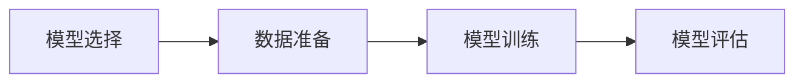
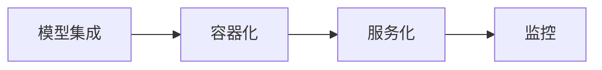

                 

### 第一部分: AI基础设施概述

#### 第1章: AI基础设施的概念与重要性

##### 1.1 AI基础设施的定义与核心组件

在当今的科技时代，人工智能（AI）已经成为推动社会进步的重要力量。然而，AI系统的成功不仅依赖于先进的算法和海量数据，还依赖于一个坚实而高效的基础设施。AI基础设施，简单来说，就是支持人工智能系统运行和开发的一系列硬件、软件和服务资源。它包括以下核心组件：

- **计算资源**：AI模型通常需要大量的计算能力，特别是深度学习模型，它们需要大量的矩阵运算和并行处理。计算资源主要包括CPU、GPU和TPU等。
  - **CPU**：中央处理器，适用于执行通用计算任务，如Python脚本、操作系统管理等。
  - **GPU**：图形处理单元，适用于执行大规模并行计算，如深度学习训练、图形渲染等。
  - **TPU**：张量处理单元，是专为处理TensorFlow中的矩阵运算而设计的芯片。

- **数据资源**：数据是AI系统的生命线，AI模型需要大量的数据来学习和优化。数据资源包括数据的采集、存储、管理和处理。
  - **数据采集**：通过传感器、API等方式收集数据，如图像、文本、音频等。
  - **数据存储**：使用数据库、分布式文件系统等方式存储数据，如MySQL、MongoDB、HDFS等。
  - **数据处理**：使用数据处理框架，如Hadoop、Spark等，对数据进行清洗、预处理、分析和挖掘。

- **网络资源**：AI系统需要通过互联网或其他网络资源进行数据传输、模型训练和部署。网络资源包括云计算、边缘计算、5G网络等。
  - **云计算**：提供弹性计算资源，如AWS、Azure、Google Cloud等。
  - **边缘计算**：在数据产生的地方附近进行计算，减少延迟和带宽消耗，如物联网设备、智能手表等。
  - **5G网络**：提供高速、低延迟的网络连接，支持实时数据处理和智能应用。

- **算法库与工具链**：算法库和工具链提供了开发、训练和部署AI模型的框架和工具，如TensorFlow、PyTorch、MLflow等。
  - **TensorFlow**：由Google开发的开源深度学习框架，支持多种编程语言和平台。
  - **PyTorch**：由Facebook开发的开源深度学习框架，具有灵活的动态计算图。
  - **MLflow**：用于机器学习实验管理、模型版本控制和部署的框架。

##### 1.2 AI基础设施的重要性

AI基础设施的重要性体现在以下几个方面：

- **业务需求驱动**：随着AI技术的不断发展，各行业对AI服务的需求日益增长。从金融、医疗到制造、零售，AI已经成为推动业务创新和提升效率的重要工具。为了满足这些需求，必须有一个强大而可靠的AI基础设施来支持。

- **稳定性与可靠性**：AI系统需要在高负载情况下保持稳定运行，以满足实时性要求。一个可靠的AI基础设施可以确保系统在高并发和大规模数据处理情况下不崩溃，保证业务连续性。

- **数据管理与隐私保护**：海量数据的存储、管理和处理是AI系统的重要组成部分。一个高效的AI基础设施可以安全地管理和处理这些数据，同时保护用户隐私和数据安全，避免数据泄露和滥用。

##### 总结

AI基础设施是支持人工智能系统运行和开发的核心资源。它包括计算资源、数据资源、网络资源和算法库与工具链等核心组件。AI基础设施的重要性体现在满足业务需求、保证系统稳定性和可靠性，以及数据管理与隐私保护等方面。一个强大而高效的AI基础设施是实现AI系统成功的关键。

#### 第2章: AI基础设施的主要组成部分

##### 2.1 计算资源

计算资源是AI基础设施的核心组成部分，它决定了AI系统的计算能力和性能。以下是计算资源的主要类型和管理方法：

- **计算资源的类型**
  - **CPU**：适用于执行通用计算任务，如操作系统管理、数据处理等。
    ```mermaid
    flowchart LR
    A[CPU] --> B[操作系统管理]
    A --> C[数据处理]
    ```
  - **GPU**：适用于执行大规模并行计算，如深度学习训练、图形渲染等。
    ```mermaid
    flowchart LR
    A[GPU] --> B[深度学习训练]
    A --> C[图形渲染]
    ```
  - **TPU**：专为处理TensorFlow中的矩阵运算而设计的芯片，具有高性能和低延迟。
    ```mermaid
    flowchart LR
    A[TPU] --> B[TensorFlow运算]
    ```

- **计算资源的管理**
  - **负载均衡**：通过动态分配计算资源，提高资源利用率，确保系统在高负载情况下稳定运行。
    ```mermaid
    flowchart LR
    A[负载均衡] --> B[资源分配]
    A --> C[高负载处理]
    ```
  - **资源调度**：根据任务需求动态调整资源分配，优化系统性能。
    ```mermaid
    flowchart LR
    A[资源调度] --> B[任务需求分析]
    A --> C[资源优化]
    ```

##### 2.2 数据资源

数据资源是AI系统的核心资产，有效的数据管理对AI系统的性能和准确性至关重要。以下是数据资源的主要类型和处理流程：

- **数据资源的类型**
  - **结构化数据**：如数据库记录、表格数据等，适用于关系型数据库存储和管理。
    ```mermaid
    flowchart LR
    A[结构化数据] --> B[关系型数据库]
    ```
  - **非结构化数据**：如图像、文本、音频等，适用于非关系型数据库和分布式文件系统存储和管理。
    ```mermaid
    flowchart LR
    A[非结构化数据] --> B[非关系型数据库]
    A --> C[分布式文件系统]
    ```

- **数据资源的处理**
  - **数据采集**：通过传感器、API等方式收集数据。
    ```mermaid
    flowchart LR
    A[数据采集] --> B[传感器数据]
    A --> C[API数据]
    ```
  - **数据存储**：使用数据库、分布式文件系统等方式存储数据。
    ```mermaid
    flowchart LR
    A[数据存储] --> B[关系型数据库]
    A --> C[分布式文件系统]
    ```
  - **数据处理**：使用数据处理框架，如Hadoop、Spark等，对数据进行清洗、预处理、分析和挖掘。
    ```mermaid
    flowchart LR
    A[数据处理] --> B[Hadoop]
    A --> C[Spark]
    ```

##### 2.3 网络资源

网络资源是AI系统进行数据传输和模型训练的关键，以下介绍了网络资源的主要类型：

- **网络资源的类型**
  - **云计算**：提供弹性计算资源，适用于大规模数据存储和处理。
    ```mermaid
    flowchart LR
    A[云计算] --> B[弹性计算]
    ```
  - **边缘计算**：在数据产生的地方附近进行计算，适用于低延迟和高带宽要求的应用。
    ```mermaid
    flowchart LR
    A[边缘计算] --> B[低延迟]
    A --> C[高带宽]
    ```
  - **5G网络**：提供高速、低延迟的网络连接，适用于实时数据处理和智能应用。
    ```mermaid
    flowchart LR
    A[5G网络] --> B[高速]
    A --> C[低延迟]
    ```

##### 2.4 算法库与工具链

算法库与工具链是AI系统的开发框架和工具集合，以下列举了一些常用的算法库和工具链：

- **常用算法库**
  - **TensorFlow**：由Google开发的深度学习框架，适用于大规模数据处理和模型训练。
    ```mermaid
    flowchart LR
    A[TensorFlow] --> B[大规模数据处理]
    A --> C[模型训练]
    ```
  - **PyTorch**：由Facebook开发的深度学习框架，具有灵活的动态计算图。
    ```mermaid
    flowchart LR
    A[PyTorch] --> B[动态计算图]
    ```

- **工具链**
  - **MLflow**：用于机器学习实验管理、模型版本控制和部署的框架。
    ```mermaid
    flowchart LR
    A[MLflow] --> B[实验管理]
    A --> C[模型版本控制]
    A --> D[部署管理]
    ```
  - **Docker**：用于容器化部署，适用于快速开发和部署应用程序。
    ```mermaid
    flowchart LR
    A[Docker] --> B[容器化部署]
    ```

##### 总结

AI基础设施的主要组成部分包括计算资源、数据资源、网络资源和算法库与工具链。计算资源提供了AI系统所需的计算能力，数据资源确保了数据的采集、存储和处理，网络资源实现了数据传输和模型训练的高效性，算法库与工具链则提供了开发、训练和部署AI模型的框架和工具。一个强大而高效的AI基础设施是实现AI系统成功的关键。

### 第二部分: AI系统的构建与维护

#### 第3章: AI系统的架构设计

##### 3.1 AI系统总体架构

AI系统的架构设计是确保系统稳定、高效运行的关键步骤。一个合理的系统架构不仅能够提高系统的可维护性和扩展性，还能够满足业务需求并保证性能。以下是AI系统总体架构的设计原则和模块划分：

- **系统架构设计原则**
  - **模块化**：将系统功能模块化，使得每个模块独立运行和维护，提高系统的可维护性和可扩展性。
  - **分布式**：采用分布式架构，将系统分解为多个节点，每个节点负责特定的任务，从而提高系统的性能和容错性。
  - **可扩展性**：设计时考虑系统的扩展性，以便在业务需求增长时，能够轻松地增加系统资源。

- **系统模块划分**
  - **数据采集模块**：负责收集各种数据源的数据，包括结构化和非结构化数据。数据采集模块通常包括数据采集、预处理和清洗等步骤。
    ```mermaid
    flowchart LR
    A[数据采集模块] --> B[数据采集]
    B --> C[预处理]
    C --> D[清洗]
    ```

  - **数据处理模块**：负责处理和存储数据，包括数据的存储、数据清洗、数据分析和数据挖掘等。数据处理模块通常使用大数据处理框架，如Hadoop和Spark。
    ```mermaid
    flowchart LR
    A[数据处理模块] --> B[Hadoop]
    B --> C[数据存储]
    C --> D[数据分析]
    D --> E[数据挖掘]
    ```

  - **模型训练模块**：负责训练和优化AI模型，包括模型选择、数据准备、模型训练和评估等。模型训练模块通常使用深度学习框架，如TensorFlow和PyTorch。
    ```mermaid
    flowchart LR
    A[模型训练模块] --> B[模型选择]
    B --> C[数据准备]
    C --> D[模型训练]
    D --> E[模型评估]
    ```

  - **模型部署模块**：负责将训练好的模型部署到生产环境，提供API接口供其他系统调用。模型部署模块通常包括容器化、服务化和监控等步骤。
    ```mermaid
    flowchart LR
    A[模型部署模块] --> B[容器化]
    B --> C[服务化]
    C --> D[监控]
    ```

##### 3.2 系统模块划分

- **数据采集模块**：数据采集模块是AI系统的第一步，它负责从各种数据源收集数据。数据来源可以是内部数据库、外部API、传感器、日志文件等。数据采集后，需要经过预处理和清洗步骤，以确保数据的质量和一致性。

- **数据处理模块**：数据处理模块负责处理和存储数据。数据预处理包括数据清洗、归一化、去噪声等步骤，以确保数据的质量和可用性。数据存储可以使用关系型数据库（如MySQL、PostgreSQL）或非关系型数据库（如MongoDB、Cassandra）。数据处理框架（如Hadoop和Spark）可以提高数据处理的速度和效率。

- **模型训练模块**：模型训练模块是AI系统的核心，它负责训练和优化AI模型。模型选择是根据业务需求选择合适的算法和框架。数据准备是将数据划分为训练集、验证集和测试集，并进行数据预处理。模型训练是使用训练集数据训练模型，并调整超参数。模型评估是使用验证集和测试集评估模型性能，选择最佳模型。

- **模型部署模块**：模型部署模块负责将训练好的模型部署到生产环境。容器化是将模型打包成容器（如Docker镜像），以便在不同的环境中运行。服务化是将模型部署为微服务，以便通过API接口供其他系统调用。监控是实时监控模型的性能和资源利用率，以便快速发现和解决问题。

##### 总结

AI系统的架构设计是构建高效、稳定和可扩展AI系统的重要步骤。合理的系统架构设计原则和模块划分可以提高系统的可维护性和扩展性，满足业务需求并保证性能。数据采集模块、数据处理模块、模型训练模块和模型部署模块共同构成了AI系统的整体架构。

#### 第4章: 数据处理与存储

##### 4.1 数据处理流程

数据处理是AI系统构建中的重要环节，它决定了AI模型的质量和性能。以下是数据处理的基本流程：

- **数据采集**：从各种数据源收集数据，如内部数据库、外部API、传感器、日志文件等。数据采集后，需要确保数据的完整性和准确性。

- **数据预处理**：对采集到的数据进行清洗、归一化和去噪声等处理，以提高数据的质量和一致性。数据清洗包括处理缺失值、异常值和重复值等。

- **数据存储**：将预处理后的数据存储到合适的存储系统中，如关系型数据库、非关系型数据库、分布式文件系统等。

- **数据处理**：使用数据处理框架，如Hadoop和Spark，对数据进行进一步处理，包括数据分析和数据挖掘等。

以下是数据处理流程的详细步骤：

1. **数据采集**：
   ```mermaid
   flowchart LR
   A[数据采集] --> B[内部数据库]
   B --> C[外部API]
   C --> D[传感器]
   D --> E[日志文件]
   ```

2. **数据预处理**：
   ```mermaid
   flowchart LR
   A[数据预处理] --> B[清洗]
   B --> C[归一化]
   C --> D[去噪声]
   ```

3. **数据存储**：
   ```mermaid
   flowchart LR
   A[数据存储] --> B[关系型数据库]
   A --> C[非关系型数据库]
   A --> D[分布式文件系统]
   ```

4. **数据处理**：
   ```mermaid
   flowchart LR
   A[数据处理] --> B[Hadoop]
   A --> C[Spark]
   ```

##### 4.2 常用数据处理工具

在AI系统中，常用的数据处理工具包括Hadoop、Spark和TensorFlow Datafeeds等。这些工具提供了高效的数据处理能力，支持各种数据处理任务。

- **Hadoop**：Hadoop是一个分布式数据处理框架，主要用于大规模数据的存储和处理。它包括以下组件：

  - **HDFS**（Hadoop Distributed File System）：一个分布式文件系统，用于存储海量数据。
  - **MapReduce**：一种编程模型，用于处理大规模数据集。

  ```mermaid
  flowchart LR
  A[Hadoop] --> B[HDFS]
  A --> C[MapReduce]
  ```

- **Spark**：Spark是一个快速的大规模数据处理引擎，提供高效的分布式计算能力。它包括以下组件：

  - **Spark SQL**：用于处理结构化数据。
  - **Spark Streaming**：用于实时数据处理。
  - **MLlib**：用于机器学习算法的实现。

  ```mermaid
  flowchart LR
  A[Spark] --> B[Spark SQL]
  A --> C[Spark Streaming]
  A --> D[MLlib]
  ```

- **TensorFlow Datafeeds**：TensorFlow Datafeeds是一个用于处理大规模数据集的库，它支持从各种数据源读取数据，包括文件、数据库和实时数据流。它提供了以下功能：

  - **数据读取**：支持多种数据格式，如CSV、JSON、TFRecord等。
  - **数据预处理**：支持数据清洗、归一化和特征工程等操作。
  - **批量处理**：支持批量数据读取和操作。

  ```mermaid
  flowchart LR
  A[TensorFlow Datafeeds] --> B[数据读取]
  A --> C[数据预处理]
  A --> D[批量处理]
  ```

##### 4.3 数据存储解决方案

在AI系统中，数据存储是至关重要的一环，它决定了数据访问的速度和数据管理的效率。以下是几种常用的数据存储解决方案：

- **关系型数据库**：关系型数据库（如MySQL、PostgreSQL）适用于存储结构化数据，具有强大的查询能力和事务支持。

- **非关系型数据库**：非关系型数据库（如MongoDB、Cassandra）适用于存储非结构化数据，具有灵活的数据模型和高可用性。

- **分布式文件系统**：分布式文件系统（如HDFS、Ceph）适用于存储大规模数据，具有高可用性和高扩展性。

以下是数据存储解决方案的详细说明：

1. **关系型数据库**：
   ```mermaid
   flowchart LR
   A[关系型数据库] --> B[MySQL]
   A --> C[PostgreSQL]
   ```

2. **非关系型数据库**：
   ```mermaid
   flowchart LR
   A[非关系型数据库] --> B[MongoDB]
   A --> C[Cassandra]
   ```

3. **分布式文件系统**：
   ```mermaid
   flowchart LR
   A[分布式文件系统] --> B[HDFS]
   A --> C[Ceph]
   ```

##### 总结

数据处理与存储是AI系统构建中的重要环节，它决定了AI模型的质量和性能。数据处理流程包括数据采集、数据预处理、数据存储和数据处理等步骤。常用的数据处理工具包括Hadoop、Spark和TensorFlow Datafeeds等。数据存储解决方案包括关系型数据库、非关系型数据库和分布式文件系统等。一个高效、稳定的数据处理与存储系统是保障AI系统成功的关键。

#### 第5章: 模型训练与优化

##### 5.1 模型训练流程

模型训练是构建AI系统的重要环节，它决定了AI模型的性能和准确性。以下是模型训练的基本流程：

1. **模型选择**：根据业务需求选择合适的AI模型和框架。常见的深度学习框架包括TensorFlow、PyTorch、Keras等。

2. **数据准备**：准备训练集、验证集和测试集。训练集用于训练模型，验证集用于调整模型参数，测试集用于评估模型性能。

3. **模型训练**：使用训练集数据训练模型，并调整超参数。训练过程中，模型会不断更新权重和偏置，以最小化损失函数。

4. **模型评估**：使用验证集和测试集评估模型性能，包括准确率、召回率、F1分数等指标。评估结果用于调整模型参数和优化模型。

以下是模型训练流程的详细步骤：



##### 5.2 模型优化方法

模型优化是提高AI模型性能的重要手段，以下介绍几种常用的模型优化方法：

1. **超参数调优**：超参数是模型训练过程中需要调整的参数，如学习率、批量大小、迭代次数等。常用的调优方法包括网格搜索、贝叶斯优化和随机搜索等。

   ```mermaid
   flowchart LR
   A[超参数调优] --> B[网格搜索]
   A --> C[贝叶斯优化]
   A --> D[随机搜索]
   ```

2. **模型压缩**：模型压缩是减小模型大小和提高模型运行速度的重要方法。常用的压缩方法包括量化、剪枝、知识蒸馏等。

   - **量化**：将模型中的浮点数参数转换为整数参数，减少模型大小和计算量。
     ```mermaid
     flowchart LR
     A[量化] --> B[整数参数]
     ```

   - **剪枝**：删除模型中的冗余神经元和边，减小模型大小和提高运行速度。
     ```mermaid
     flowchart LR
     A[剪枝] --> B[冗余神经元]
     ```

   - **知识蒸馏**：使用一个小型模型（学生模型）学习大型模型（教师模型）的知识，提高学生模型的性能。
     ```mermaid
     flowchart LR
     A[知识蒸馏] --> B[教师模型]
     A --> C[学生模型]
     ```

3. **模型解释性**：模型解释性是提高AI模型可解释性和透明度的重要方法。常用的解释性方法包括模型可视化、特征重要性分析和模型总结等。

   ```mermaid
   flowchart LR
   A[模型解释性] --> B[模型可视化]
   A --> C[特征重要性分析]
   A --> D[模型总结]
   ```

##### 总结

模型训练与优化是构建高效AI系统的重要步骤。模型训练流程包括模型选择、数据准备、模型训练和模型评估等步骤。模型优化方法包括超参数调优、模型压缩和模型解释性等。通过优化模型，可以提高模型的性能、准确性和可解释性，从而实现更好的业务效果。

#### 第6章: 模型部署与运维

##### 6.1 模型部署流程

模型部署是将训练好的模型集成到生产环境中，使其能够为业务提供实际价值的关键步骤。以下是模型部署的基本流程：

1. **模型集成**：将训练好的模型与现有的业务系统进行集成，确保模型能够正确地接收输入数据并生成输出结果。

2. **容器化**：使用容器（如Docker）将模型打包成一个独立的运行环境，确保模型在不同的硬件和操作系统上能够一致地运行。

3. **服务化**：使用服务化框架（如Kubernetes）将容器化的模型部署到集群中，实现模型的弹性扩展和高可用性。

4. **监控**：实时监控模型的性能和资源利用率，及时发现和处理问题。

以下是模型部署流程的详细步骤：



##### 6.2 模型运维方法

模型运维是确保模型稳定运行和持续优化的重要工作，以下是常用的模型运维方法：

1. **自动化部署**：使用持续集成和持续部署（CI/CD）流水线，实现模型的自动化部署和版本管理。CI/CD流水线可以确保模型部署过程的自动化和高效性。

2. **日志管理**：使用日志管理工具（如ELK栈），收集和分析模型的运行日志，及时发现和解决潜在问题。

3. **故障处理**：制定故障响应流程，确保在发生故障时能够快速定位和解决问题。故障处理包括故障定位、故障排除和故障恢复等步骤。

以下是模型运维方法的详细说明：

- **自动化部署**：
  ```mermaid
  flowchart LR
  A[自动化部署] --> B[CI/CD流水线]
  ```

- **日志管理**：
  ```mermaid
  flowchart LR
  A[日志管理] --> B[ELK栈]
  ```

- **故障处理**：
  ```mermaid
  flowchart LR
  A[故障处理] --> B[故障定位]
  A --> C[故障排除]
  A --> D[故障恢复]
  ```

##### 总结

模型部署与运维是确保AI模型能够稳定运行和持续优化的重要步骤。模型部署流程包括模型集成、容器化、服务化和监控等步骤。模型运维方法包括自动化部署、日志管理和故障处理等。通过有效的模型部署与运维，可以确保AI模型在实际业务中发挥最大价值。

### 第三部分: 案例与实战

#### 第7章: AI基础设施在特定场景的应用

##### 7.1 金融行业

金融行业是一个高度依赖数据和技术的行业，AI技术在金融行业有着广泛的应用。以下是AI基础设施在金融行业的几个典型应用场景：

1. **风险管理**：通过AI技术，可以自动化分析客户交易数据，识别潜在的欺诈行为。例如，可以使用深度学习模型对交易行为进行模式识别，从而发现异常交易。

2. **信用评分**：传统的信用评分方法主要基于客户的信用历史和财务状况。而通过AI技术，可以更全面地分析客户的行为数据，如社交媒体活动、消费习惯等，从而更准确地预测客户的信用风险。

3. **量化交易**：量化交易利用算法和数据分析，从大量历史数据中寻找交易机会。AI基础设施在这里的作用是提供强大的计算能力和高速数据处理能力，以确保交易策略能够实时执行。

**案例分析**：某银行的风控系统使用AI技术对信用卡交易进行实时监控和风险评估。该系统使用GPU加速的深度学习模型，对交易数据进行实时分析和预测，从而发现潜在的欺诈交易。通过有效的AI基础设施，该银行能够快速响应交易异常，并采取措施降低风险。

##### 7.2 医疗行业

医疗行业是另一个受益于AI技术的领域。AI技术在医疗行业中的应用，不仅提高了诊断和治疗的准确性，还优化了医疗资源的使用。

1. **疾病诊断**：AI技术可以通过对医疗影像（如X光片、CT扫描、MRI）的分析，帮助医生快速诊断疾病。例如，深度学习模型可以自动识别肺部病变，提高肺癌的早期诊断率。

2. **医学影像分析**：AI技术可以辅助医生对医学影像进行分析，提高诊断的准确性。例如，使用卷积神经网络（CNN）对医学影像进行特征提取和分类，从而帮助医生识别病变部位。

3. **健康管理**：通过AI技术，可以对患者的健康数据（如血压、心率、血糖等）进行实时监测和分析，提供个性化的健康建议。

**案例分析**：某医院引入AI辅助诊断系统，该系统使用深度学习模型对医学影像进行分析，辅助医生诊断疾病。通过AI基础设施的支持，该系统实现了快速、准确的诊断，提高了诊断效率，降低了误诊率。

##### 7.3 制造业

制造业是AI技术应用的重要领域，AI技术可以提高生产效率、优化供应链管理、提升产品质量。

1. **质量控制**：通过AI技术，可以对生产过程中的数据进行实时监控和分析，识别出可能影响产品质量的因素。例如，使用机器学习模型对传感器数据进行分析，预测产品质量。

2. **设备维护**：AI技术可以帮助预测设备故障，提前进行维护，从而减少停机时间和维修成本。例如，通过监控设备运行数据，使用预测性维护模型预测设备故障时间。

3. **供应链优化**：通过AI技术，可以优化供应链管理，提高库存管理效率，降低库存成本。例如，使用机器学习模型预测市场需求，优化库存水平。

**案例分析**：某工厂引入了智能监控系统，该系统使用AI技术对生产设备和生产线进行实时监控和数据分析。通过AI基础设施的支持，该系统实现了设备的预测性维护，提高了生产效率，降低了维护成本。

##### 总结

AI基础设施在金融、医疗和制造业等特定场景中有着广泛的应用。通过有效的AI基础设施，可以提升业务效率、降低成本、提高诊断和治疗的准确性。在实际应用中，通过结合AI技术和现有的业务系统，可以实现自动化、智能化和高效化的业务流程。案例分析展示了AI基础设施在不同行业中的应用场景和实际效果。

## 附录 A: AI基础设施开发工具与资源

### A.1 计算资源工具

计算资源是AI基础设施的核心组成部分，以下是一些常用的计算资源工具：

- **GPU选择指南**：选择合适的GPU对于AI系统的性能至关重要。以下是一些常见的GPU选择指南：

  - **NVIDIA GPU**：NVIDIA提供了多种GPU产品，如GeForce、Quadro和Tesla系列。其中，Tesla系列GPU适合深度学习和科学计算，具有高性能和低功耗的特点。

  - **AMD GPU**：AMD的GPU产品包括Radeon Pro和Radeon RX系列。Radeon Pro系列GPU适合专业工作站和图形处理，Radeon RX系列GPU适合游戏和深度学习。

- **计算资源管理工具**：为了提高计算资源利用率，以下是一些常用的计算资源管理工具：

  - **SLURM**：SLURM是一个开源的资源调度器，用于管理计算集群中的计算资源。它支持任务排队、资源分配和作业调度等功能。

  - **HPC调度器**：HPC调度器是一类专门用于高性能计算集群的资源调度器，如PBS、Schedulix和Lava等。这些工具可以帮助管理员高效地管理计算资源，提高集群的利用率。

### A.2 数据处理与存储工具

数据处理与存储是AI系统的重要组成部分，以下是一些常用的数据处理与存储工具：

- **数据预处理工具**：数据预处理是AI系统成功的关键步骤，以下是一些常用的数据预处理工具：

  - **Pandas**：Pandas是一个Python库，用于数据清洗、转换和分析。它提供了丰富的数据结构（DataFrame）和操作方法，方便用户进行数据处理。

  - **NumPy**：NumPy是Python的核心科学计算库，提供了多维数组对象和广泛的数学函数。NumPy用于数据预处理中的数值计算和数据处理。

- **数据存储解决方案**：选择合适的存储解决方案对于数据管理至关重要，以下是一些常用的数据存储解决方案：

  - **Hadoop**：Hadoop是一个分布式数据处理框架，包括HDFS（分布式文件系统）和MapReduce（数据处理模型）。Hadoop适用于大规模数据的存储和处理。

  - **Cassandra**：Cassandra是一个分布式宽列数据库，适用于高可用性和大量数据的存储。Cassandra适合处理大量读写操作和分布式数据存储。

### A.3 模型训练与优化工具

模型训练与优化是AI系统开发的关键步骤，以下是一些常用的模型训练与优化工具：

- **深度学习框架**：深度学习框架提供了模型训练和优化的工具和库，以下是一些常用的深度学习框架：

  - **TensorFlow**：TensorFlow是Google开源的深度学习框架，适用于各种深度学习任务。TensorFlow提供了丰富的API和工具，方便用户进行模型训练和优化。

  - **PyTorch**：PyTorch是Facebook开源的深度学习框架，具有灵活的动态计算图。PyTorch适用于快速原型开发和模型研究。

- **模型优化工具**：以下是一些常用的模型优化工具：

  - **AutoML**：AutoML是自动化机器学习工具，用于自动搜索和选择最佳的模型和超参数。AutoML可以提高模型训练效率和性能。

  - **模型压缩工具**：模型压缩工具用于减小模型大小和提高模型运行速度。常用的模型压缩工具包括量化、剪枝和知识蒸馏等。

### A.4 模型部署与运维工具

模型部署与运维是确保AI模型稳定运行和持续优化的重要步骤，以下是一些常用的模型部署与运维工具：

- **容器化工具**：以下是一些常用的容器化工具：

  - **Docker**：Docker是一个开源容器化平台，用于将应用程序及其依赖打包成容器。Docker提供了容器镜像和容器编排功能，方便用户进行模型部署。

  - **Kubernetes**：Kubernetes是一个开源的容器编排平台，用于自动化部署、扩展和管理容器化应用。Kubernetes提供了强大的集群管理和资源调度功能。

- **监控与日志管理工具**：以下是一些常用的监控与日志管理工具：

  - **Prometheus**：Prometheus是一个开源的监控解决方案，用于收集、存储和可视化指标数据。Prometheus适用于实时监控和告警。

  - **ELK栈**：ELK栈（Elasticsearch、Logstash、Kibana）是一个开源日志管理平台，用于收集、存储和可视化日志数据。ELK栈适用于大规模日志数据分析和监控。

### 总结

附录A提供了AI基础设施开发中常用的计算资源、数据处理与存储、模型训练与优化以及模型部署与运维工具。这些工具和资源为AI系统开发提供了丰富的选择，帮助用户高效地构建、训练、部署和运维AI模型。通过合理选择和使用这些工具，可以构建高效、稳定和可扩展的AI基础设施。

