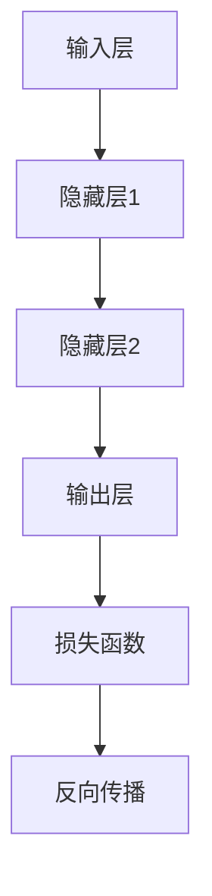
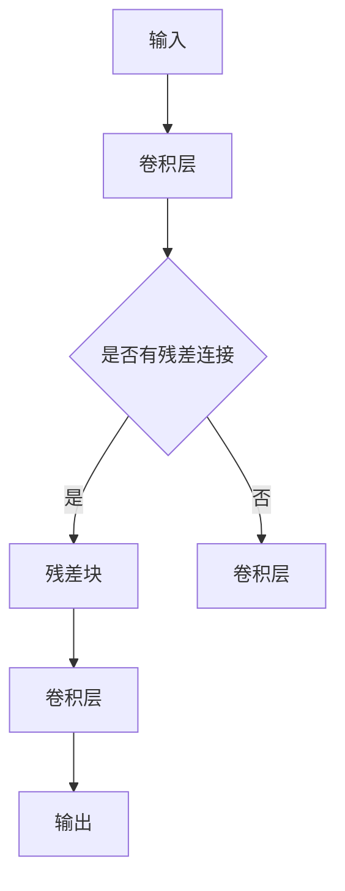

                 

### 第一部分：AI大模型的基本概念与战略布局

#### 第1章：AI大模型的崛起与创业背景

##### 1.1 AI大模型的概念与分类

人工智能（AI）大模型，通常指的是那些拥有数十亿甚至数万亿参数的深度学习模型。这些模型在图像识别、自然语言处理、推荐系统等领域取得了显著的突破。根据应用领域和目标任务的差异，AI大模型可以分为以下几类：

1. **计算机视觉**：如用于图像识别的卷积神经网络（CNN）、生成对抗网络（GAN）等。
2. **自然语言处理**：如Transformer模型、BERT等，用于语言理解、机器翻译、文本生成等任务。
3. **推荐系统**：如基于协同过滤、矩阵分解、深度学习方法等，用于个性化推荐。
4. **语音识别**：如使用深度神经网络和循环神经网络（RNN）实现的语音识别模型。

##### 1.2 国际AI大模型发展趋势

国际AI大模型的发展趋势体现在以下几个方面：

1. **计算资源**：随着计算能力的不断提升，更大规模的AI模型得以训练和应用。例如，Google的Turing模型、Facebook的GPT-3模型等。
2. **算法优化**：研究更有效的训练算法、优化模型结构，以提高训练效率和模型性能。例如，自适应学习率调整、dropout技术等。
3. **开源生态**：越来越多的开源工具和框架，如TensorFlow、PyTorch、MXNet等，为AI大模型的研究和应用提供了丰富的支持。
4. **跨学科合作**：AI大模型的发展不仅依赖于计算机科学，还需要生物学、心理学、统计学等多学科的合作。

##### 1.3 创业者面临的国际优势与挑战

对于创业者来说，AI大模型提供了巨大的机遇，但也带来了挑战：

1. **优势**：
   - **市场潜力**：AI大模型在各个行业都展现出广泛的应用前景，为创业者提供了丰富的市场机会。
   - **技术优势**：掌握AI大模型的核心技术和资源，创业者可以在激烈的市场竞争中脱颖而出。
   - **国际化**：借助国际化的技术趋势和市场环境，创业者可以迅速拓展业务，进入全球市场。

2. **挑战**：
   - **技术门槛**：AI大模型需要强大的计算资源和专业知识，创业者需要克服技术难题。
   - **数据隐私**：在数据驱动的人工智能时代，保护用户隐私和数据安全是一个重要挑战。
   - **法律合规**：不同国家和地区在数据保护、知识产权等方面的法律法规存在差异，创业者需要确保合规经营。

#### 第2章：AI大模型的技术基础

##### 2.1 AI大模型的核心算法原理

###### 2.1.1 神经网络与深度学习

神经网络是AI大模型的基础，其灵感来源于人脑神经元的工作原理。神经网络通过调整连接权重来学习输入和输出之间的映射关系。深度学习是神经网络的扩展，通过堆叠多层神经网络来实现更复杂的特征提取和抽象。

在深度学习中，最常用的架构包括：

- **卷积神经网络（CNN）**：适用于计算机视觉任务，通过卷积层提取图像特征。
- **循环神经网络（RNN）**：适用于序列数据，如语音识别、机器翻译等。
- **Transformer模型**：在自然语言处理领域取得了显著突破，通过自注意力机制实现长距离依赖关系建模。

以下是神经网络的基本结构：



在深度学习模型训练过程中，常用的优化算法包括：

- **随机梯度下降（SGD）**：通过随机选择一小部分样本来更新模型参数。
- **Adam优化器**：结合SGD的优点，自适应调整学习率。

###### 2.1.2 常见的深度学习架构

深度学习架构在不断地演进和优化，以下是一些常见的架构：

- **ResNet（残差网络）**：通过引入残差块，解决了深度神经网络训练过程中的梯度消失问题。
- **DenseNet（密集连接网络）**：通过增加网络层的连接，提高了特征复用和共享。
- **EfficientNet**：通过缩放网络层、宽度和深度，实现了更高效的训练和推理性能。

以下是ResNet的架构示意图：



###### 2.1.3 深度学习优化算法

深度学习优化算法是提升模型训练效率和性能的关键。以下是一些常用的优化算法：

- **动量（Momentum）**：在SGD的基础上引入动量项，使得模型参数更新更加稳定。
- **自适应优化器（如Adam、AdaGrad）**：根据不同参数的梯度变化自适应调整学习率。

以下是Adam优化器的伪代码：

```python
def Adam(parameters, gradients, learning_rate=0.001, beta1=0.9, beta2=0.999, epsilon=1e-8):
    # Update the parameters using the Adam optimization algorithm
    m = beta1 * m + (1 - beta1) * gradients
    v = beta2 * v + (1 - beta2) * (gradients ** 2)
    
    m_hat = m / (1 - beta1 ** t)
    v_hat = v / (1 - beta2 ** t)
    
    parameters -= learning_rate * parameters
    parameters -= learning_rate * m_hat / (sqrt(v_hat) + epsilon)
```

##### 2.2 AI大模型的技术趋势

###### 2.2.1 大模型训练的硬件与软件资源

训练AI大模型需要大量的计算资源和存储资源。以下是一些常用的硬件和软件资源：

- **硬件资源**：
  - GPU：如NVIDIA Tesla系列、Tesla P100等，适用于深度学习训练。
  - TPU：如Google的Tensor Processing Unit，专为TensorFlow训练优化。
  - 分布式计算：如Hadoop、Spark等，适用于大规模数据处理和分布式训练。

- **软件资源**：
  - 深度学习框架：如TensorFlow、PyTorch、MXNet等，提供丰富的API和工具支持。
  - 分布式训练框架：如Horovod、Distributed TensorFlow等，实现分布式训练的优化。

以下是一个简单的分布式训练示例：

```python
import tensorflow as tf
from tensorflow.keras.layers import Dense
from tensorflow.keras.models import Model

# Define the model
inputs = tf.keras.layers.Input(shape=(784,))
x = Dense(128, activation='relu')(inputs)
outputs = Dense(10, activation='softmax')(x)
model = Model(inputs, outputs)

# Compile the model
model.compile(optimizer='adam', loss='categorical_crossentropy', metrics=['accuracy'])

# Train the model using distributed training
strategy = tf.distribute.MirroredStrategy()
with strategy.scope():
    model.fit(x_train, y_train, batch_size=batch_size, epochs=num_epochs)
```

###### 2.2.2 自动机器学习（AutoML）

自动机器学习（AutoML）的目标是自动化机器学习流程，从数据预处理到模型选择、训练和调优。以下是一些常见的AutoML工具：

- **AutoKeras**：基于Keras的自动机器学习框架，提供简单易用的API。
- **H2O.ai**：提供AutoML平台，支持多种机器学习算法和深度学习框架。
- **Auto-Sklearn**：基于Scikit-learn的自动机器学习库，支持多种算法和模型选择。

以下是使用AutoKeras进行自动机器学习的示例：

```python
from autokeras import AutoKerasClassifier

# Define the dataset
X_train, y_train = ...

# Create an AutoKeras classifier
auto_keras = AutoKerasClassifier()

# Train the classifier
auto_keras.fit(X_train, y_train)

# Predict the labels
y_pred = auto_keras.predict(X_test)
```

###### 2.2.3 AutoML的应用场景

AutoML在以下场景中具有广泛的应用：

- **数据科学竞赛**：自动化机器学习流程，快速构建和优化模型，提高竞赛成绩。
- **企业应用**：自动化构建和部署机器学习模型，降低开发和运维成本。
- **科研应用**：自动化实验设计，加速科研成果转化。

#### 第3章：AI大模型的应用场景与商业模式

##### 3.1 AI大模型在各个行业的应用

AI大模型在各个行业都展现出了巨大的应用潜力，以下是一些典型的应用场景：

###### 3.1.1 金融行业

在金融行业中，AI大模型的应用包括：

- **金融市场预测**：利用时间序列分析、自然语言处理等AI技术，预测股票价格、市场趋势等。
- **风险评估与欺诈检测**：通过分析用户行为、交易记录等数据，识别潜在风险和欺诈行为。
- **个性化投资建议**：基于用户风险偏好和投资目标，提供个性化的投资组合建议。

以下是一个金融市场预测的伪代码：

```python
# Load the dataset
data = ...

# Preprocess the data
X = preprocess(data)

# Split the data into training and testing sets
X_train, X_test, y_train, y_test = ...

# Train an AI model
model = ...

# Evaluate the model
performance = model.evaluate(X_test, y_test)
```

###### 3.1.2 教育行业

在教育行业中，AI大模型的应用包括：

- **个性化教学与学习**：根据学生的特点和学习情况，提供个性化的教学资源和学习路径。
- **教育资源优化**：通过分析教学数据，优化课程设计和资源分配，提高教学质量。
- **智能评测系统**：利用自然语言处理和计算机视觉技术，自动批改试卷、评估学生成绩。

以下是一个个性化教学与学习的伪代码：

```python
# Load the student data
student_data = ...

# Analyze the student data
student_characteristics = analyze(student_data)

# Generate personalized learning resources
learning_resources = generate_resources(student_characteristics)

# Deliver the resources to the student
deliver_resources(learning_resources)
```

###### 3.1.3 健康医疗行业

在健康医疗行业中，AI大模型的应用包括：

- **医疗数据分析与诊断**：通过分析医学影像、电子病历等数据，辅助医生进行疾病诊断和治疗方案推荐。
- **医疗影像识别**：利用深度学习技术，自动识别和分类医学影像，提高诊断准确率和效率。
- **个性化健康管理**：基于大数据和AI技术，为用户提供个性化的健康建议和健康管理方案。

以下是一个医疗数据分析与诊断的伪代码：

```python
# Load the medical data
medical_data = ...

# Preprocess the data
X = preprocess(medical_data)

# Split the data into training and testing sets
X_train, X_test, y_train, y_test = ...

# Train an AI model
model = ...

# Evaluate the model
performance = model.evaluate(X_test, y_test)
```

###### 3.1.4 制造业

在制造业中，AI大模型的应用包括：

- **智能制造与优化生产流程**：通过智能感知、数据分析和优化算法，提高生产效率和质量。
- **质量控制与预测性维护**：利用AI技术，自动检测产品质量，预测设备故障，减少生产停机时间。
- **供应链管理**：通过分析供应链数据，优化库存管理、物流调度等，降低运营成本。

以下是一个智能制造与优化生产流程的伪代码：

```python
# Load the production data
production_data = ...

# Preprocess the data
X = preprocess(production_data)

# Split the data into training and testing sets
X_train, X_test, y_train, y_test = ...

# Train an AI model
model = ...

# Evaluate the model
performance = model.evaluate(X_test, y_test)
```

##### 3.2 创业者如何利用AI大模型的商业模式

###### 3.2.1 产品与服务定位

在利用AI大模型构建商业模式时，创业者需要明确产品与服务的定位，以下是一些策略：

- **硬件产品与软件服务**：创业者可以选择提供硬件产品，如高性能计算设备，或者软件服务，如AI平台、API接口等。
- **整体解决方案提供**：创业者可以提供从数据采集、处理、分析到决策的一站式解决方案，降低客户的门槛和成本。

以下是一个整体解决方案提供的伪代码：

```python
# Define the solution components
components = {
    "data_collection": DataCollectionSystem(),
    "data_processing": DataProcessingSystem(),
    "data_analysis": DataAnalysisSystem(),
    "decision_support": DecisionSupportSystem()
}

# Integrate the solution components
solution = integrate(components)

# Deploy the solution for the customer
deploy(solution, customer_environment)
```

###### 3.2.2 营销策略与市场推广

在营销策略与市场推广方面，创业者需要考虑以下几点：

- **目标市场选择**：根据产品与服务定位，选择具有需求和潜力的目标市场。
- **营销渠道与手段**：利用多种渠道，如线上营销、线下活动、合作伙伴关系等，提高品牌知名度和影响力。
- **合作伙伴关系建立**：与行业内的领先企业、科研机构等建立合作关系，共同开拓市场。

以下是一个市场推广计划的伪代码：

```python
# Define the target market
target_market = ["financial", "education", "healthcare", "manufacturing"]

# Define the marketing channels
channels = ["online", "offline", "partnerships"]

# Define the marketing activities
activities = [
    "content_marketing",
    "social_media_marketing",
    "webinars",
    "tradeshows"
]

# Execute the marketing plan
execute_marketing_plan(target_market, channels, activities)
```

#### 第4章：国际AI大模型创业的案例研究

##### 4.1 国外成功创业案例介绍

###### 4.1.1 OpenAI

OpenAI是一家全球领先的人工智能研究公司，致力于实现安全的通用人工智能（AGI）。以下是OpenAI的成立背景、核心产品与服务及成功因素：

###### 4.1.1.1 OpenAI的成立背景

OpenAI成立于2015年，由山姆·阿尔特曼（Sam Altman）、伊隆·马斯克（Elon Musk）等一群顶尖科技创业者共同发起。OpenAI成立的初衷是确保人工智能的发展对人类有益，并通过开源技术和合作推动人工智能的研究和应用。

###### 4.1.1.2 OpenAI的核心产品与服务

- **GPT系列模型**：OpenAI开发的GPT模型在自然语言处理领域取得了显著的成果，包括GPT-2和GPT-3。GPT-3拥有1750亿参数，能够生成高质量的自然语言文本。
- **Dota2 AI挑战**：OpenAI的Dota2 AI团队在Dota2游戏中击败了世界顶级人类玩家，展示了AI在策略游戏中的强大能力。
- **AI安全研究**：OpenAI在人工智能安全领域进行了深入研究，旨在确保AI技术的发展不会对人类造成威胁。

###### 4.1.1.3 OpenAI的成功因素

- **强大的团队**：OpenAI汇聚了全球顶尖的AI科学家和工程师，共同推动技术创新。
- **开源文化**：OpenAI秉承开源精神，积极开源其研究成果，吸引了大量的开发者和使用者。
- **安全意识**：OpenAI高度重视人工智能的安全问题，在研发过程中不断强化安全措施，确保技术对人类有益。

##### 4.1.2 DeepMind

DeepMind是一家英国人工智能公司，成立于2010年，由戴密斯·哈萨比斯（Demis Hassabis）、肖尔吉·布拉伊瓦（Shane Legg）和安德鲁·布莱恩（Andrew Blake）共同创立。以下是DeepMind的成立背景、核心产品与服务及成功因素：

###### 4.1.2.1 DeepMind的成立背景

DeepMind最初的目标是开发通用人工智能，并应用于游戏、科学研究和工业领域。DeepMind在早期通过成功开发AlphaGo等AI系统，展示了人工智能在复杂任务中的强大能力。

###### 4.1.2.2 DeepMind的核心产品与服务

- **AlphaGo系列**：DeepMind开发的AlphaGo在围棋领域取得了重大突破，击败了世界顶级围棋选手。AlphaGo的成功引发了全球对人工智能的关注。
- **深度强化学习**：DeepMind在深度强化学习领域进行了深入研究，开发了一系列高效的算法和模型，如Deep Q-Network（DQN）、Policy Gradient方法等。
- **医疗领域应用**：DeepMind与多家医疗机构合作，利用AI技术进行医疗影像分析、疾病诊断等，提高了医疗服务的质量和效率。

###### 4.1.2.3 DeepMind的成功因素

- **技术创新**：DeepMind在深度学习、强化学习等领域不断进行技术创新，推动了人工智能的发展。
- **跨界合作**：DeepMind与多个行业和领域的合作伙伴进行合作，实现了技术的广泛应用。
- **人才优势**：DeepMind吸引了全球顶尖的AI科学家和工程师，形成了强大的技术团队。

##### 4.2 国内AI大模型创业案例介绍

###### 4.2.1 百度飞桨

百度飞桨（PaddlePaddle）是百度开源的深度学习平台，提供丰富的API和工具支持，广泛应用于图像识别、自然语言处理、推荐系统等领域。以下是百度飞桨的成立背景、核心产品与服务及成功因素：

###### 4.2.1.1 百度飞桨的成立背景

百度飞桨起源于百度深度学习技术团队，2016年正式对外开源。百度飞桨的初衷是推动深度学习技术的发展，降低AI应用门槛，让更多人能够享受到AI技术的红利。

###### 4.2.1.2 百度飞桨的核心产品与服务

- **PaddlePaddle深度学习框架**：百度飞桨的核心产品，支持多种深度学习模型和算法，提供了灵活的编程接口和强大的工具支持。
- **PaddleDetection物体检测库**：提供丰富的预训练模型和工具，支持多种物体检测任务，广泛应用于安防、自动驾驶等领域。
- **PaddleNLP自然语言处理库**：提供自然语言处理模型和工具，支持文本分类、情感分析、机器翻译等任务，广泛应用于智能客服、智能问答等领域。

###### 4.2.1.3 百度飞桨的成功因素

- **技术创新**：百度飞桨在深度学习、自然语言处理等领域不断进行技术创新，推动了AI技术的发展。
- **产业生态**：百度飞桨构建了完善的产业生态，与多家企业、科研机构和高校合作，推动AI技术的应用落地。
- **开源社区**：百度飞桨积极拥抱开源社区，吸引了大量开发者和使用者，形成了强大的开发者社区。

###### 4.2.2 科大讯飞

科大讯飞是中国领先的智能语音和人工智能公共平台提供商，成立于1999年。以下是科大讯飞的成立背景、核心产品与服务及成功因素：

###### 4.2.2.1 科大讯飞的成立背景

科大讯飞的创始人刘庆峰致力于将人工智能技术应用于语音识别和语言处理领域，推动人工智能产业的发展。

###### 4.2.2.2 科大讯飞的核心产品与服务

- **智能语音识别系统**：科大讯飞的核心产品，提供高质量的语音识别和语音合成服务，广泛应用于智能客服、智能翻译等领域。
- **智慧教育平台**：科大讯飞智慧教育平台包括智能评测、个性化学习、教育大数据分析等功能，广泛应用于教育领域。
- **智慧医疗平台**：科大讯飞智慧医疗平台包括智能诊断、智能随访、智能查房等功能，提高了医疗服务的质量和效率。

###### 4.2.2.3 科大讯飞的成功因素

- **技术创新**：科大讯飞在智能语音识别、自然语言处理等领域进行了长期的技术研发，形成了强大的技术优势。
- **行业应用**：科大讯飞将人工智能技术广泛应用于多个行业，实现了技术的商业化和规模化应用。
- **生态建设**：科大讯飞构建了完善的产业生态，与多家企业、科研机构和高校合作，推动人工智能技术的应用创新。

#### 第5章：AI大模型创业的国际市场策略

##### 5.1 国际市场的机遇与挑战

AI大模型创业面临国际市场的机遇与挑战，以下分别进行分析：

###### 5.1.1 市场需求与趋势分析

国际市场的需求与趋势可以从以下几个方面进行分析：

- **全球AI市场增长预测**：根据市场研究报告，全球人工智能市场预计将以年均20%以上的速度增长，未来市场规模将达到数万亿美元。
- **各地区市场潜力分析**：北美、欧洲和中国是AI市场的主要区域。其中，北美市场以技术领先和资本充裕著称，欧洲市场则注重伦理和法律规范，中国市场则拥有庞大的用户基数和快速发展的应用场景。

###### 5.1.2 国际竞争态势

在国际市场中，创业者需要关注以下竞争态势：

- **主要国际玩家分析**：如OpenAI、DeepMind、Google Brain、微软研究院等全球领先的AI研究机构和科技公司，它们在技术、资金和市场资源方面具有显著优势。
- **国际市场竞争策略**：国际市场竞争激烈，创业者需要制定差异化策略，如技术创新、市场细分、合作伙伴关系等，以在激烈的市场竞争中脱颖而出。

##### 5.2 国际市场进入策略

在国际市场进入方面，创业者需要考虑以下几个方面：

###### 5.2.1 市场调研与定位

- **目标市场选择**：根据市场需求和自身优势，选择具有潜力和竞争力的目标市场。例如，在欧美市场，创业者可以重点关注金融、医疗、制造业等领域；在中国市场，创业者可以关注教育、智能家居、智慧城市等领域。
- **市场定位与差异化策略**：根据目标市场的特点和需求，明确产品与服务的市场定位，并制定差异化策略，以在市场中树立独特的品牌形象。

###### 5.2.2 营销与推广策略

在国际市场的营销与推广方面，创业者需要考虑以下几点：

- **国际化营销策略**：根据目标市场的特点，制定适合的国际化营销策略，如本地化营销、线上营销、线下活动等。
- **跨文化沟通与营销技巧**：了解目标市场的文化、习惯和消费心理，采用适当的沟通和营销技巧，提高品牌知名度和认可度。

- **合作伙伴关系建立**：在国际市场中，建立与当地企业、行业组织、科研机构等合作伙伴关系，有助于快速进入市场，获取资源和支持。

#### 第6章：AI大模型创业的法律、伦理与社会责任

##### 6.1 AI大模型创业的法律风险与合规

在国际市场中，AI大模型创业需要关注以下法律风险与合规问题：

###### 6.1.1 数据隐私与保护

- **数据隐私法规概述**：不同国家和地区的数据隐私法规存在差异，如欧盟的《通用数据保护条例》（GDPR）、美国的《加州消费者隐私法案》（CCPA）等。创业者需要了解并遵守目标市场的数据隐私法规。
- **AI大模型数据处理合规要求**：在数据处理过程中，创业者需要确保数据收集、存储、处理和传输的合规性，如数据去标识化、访问控制、数据备份等。

###### 6.1.2 知识产权保护

- **AI大模型知识产权的种类**：AI大模型可能涉及专利、著作权、商标等知识产权。创业者需要了解目标市场的知识产权保护制度，及时申请和保护自身知识产权。
- **AI大模型知识产权的申请与保护**：创业者需要了解目标市场的知识产权申请流程和保护策略，如专利申请、著作权登记、商标注册等。

##### 6.2 AI大模型的伦理问题与社会责任

在国际市场中，AI大模型创业需要关注伦理问题与社会责任，以下是一些关键点：

###### 6.2.1 AI大模型的伦理考量

- **透明性与可解释性**：AI大模型通常具有复杂性和黑箱特性，需要确保模型的可解释性和透明性，以便用户和监管机构理解和评估。
- **公平性与偏见问题**：AI大模型在决策过程中可能引入偏见，创业者需要确保模型的公平性和无偏见性，避免歧视和不公正现象。
- **安全性与隐私问题**：AI大模型需要保护用户数据的安全性和隐私性，确保数据不被泄露或滥用。

###### 6.2.2 AI大模型创业的社会责任

- **社会责任与可持续发展**：创业者需要关注AI大模型创业的社会责任，如环境保护、社会责任、可持续发展等，以实现企业的长期发展。
- **AI大模型创业的社会价值**：创业者需要明确AI大模型创业的社会价值，如提高生产力、改善生活质量、推动科技创新等，为社会带来积极影响。

#### 第7章：AI大模型创业的财务规划与风险管理

##### 7.1 创业初期的财务规划

在创业初期，财务规划是确保企业稳定发展的重要环节。以下是一些关键点：

###### 7.1.1 资金筹集策略

- **天使投资与风险投资**：创业者可以通过天使投资和风险投资等渠道筹集资金。选择合适的投资机构和投资人，有助于获得资金支持和资源。
- **政府补贴与扶持政策**：了解并申请政府的补贴和扶持政策，如科技创新基金、创业补贴等，有助于减轻财务压力。

###### 7.1.2 成本控制与预算管理

- **研发成本分析**：合理估算研发成本，包括硬件设备、软件工具、人力成本等，确保预算的合理性和可控性。
- **运营成本控制**：在运营过程中，严格控制运营成本，如人力成本、办公成本、市场推广成本等，提高资金利用效率。

##### 7.2 风险管理与应对策略

在国际市场中，AI大模型创业面临多种风险，以下是一些关键点：

###### 7.2.1 市场风险分析

- **市场需求波动**：了解市场需求的变化，及时调整产品与业务策略，以适应市场变化。
- **竞争对手威胁**：分析竞争对手的优势和劣势，制定差异化的竞争策略，提高市场竞争力。

###### 7.2.2 技术风险与对策

- **技术更新换代风险**：关注技术发展趋势，及时更新技术栈和工具，确保技术的先进性和竞争力。
- **技术安全性与稳定性**：确保AI大模型的安全性和稳定性，降低技术故障和安全事故的风险。

#### 第8章：AI大模型创业的团队建设与人才培养

##### 8.1 创业团队的构建与激励

在AI大模型创业中，团队建设是成功的关键。以下是一些关键点：

###### 8.1.1 核心团队组建策略

- **技术人才引进**：招聘具有专业技能和经验的AI科学家、工程师和研究人员，确保团队的技术实力。
- **管理团队建设**：建立高效的管理团队，包括CEO、CTO、COO等核心岗位，明确团队目标和责任分工。

###### 8.1.2 团队成员激励机制

- **绩效考核制度**：建立科学的绩效考核制度，激励团队成员提高工作效率和质量。
- **股权激励方案**：通过股权激励，让团队成员分享企业的成长收益，提高团队凝聚力和归属感。

##### 8.2 人才培养与持续发展

在AI大模型创业中，人才培养和持续发展是保持竞争优势的关键。以下是一些关键点：

###### 8.2.1 员工培训与职业发展

- **技术培训**：定期组织技术培训和研讨会，提高团队成员的专业技能和知识水平。
- **管理培训**：针对管理团队，提供管理知识和技能的培训，提高管理水平和团队协作能力。

###### 8.2.2 企业文化塑造

- **企业核心价值观**：明确企业核心价值观，如创新、协作、诚信等，形成企业独特的文化氛围。
- **企业文化传播**：通过各种渠道和活动，将企业文化传递给团队成员，增强企业文化认同感。

#### 第9章：AI大模型创业的未来展望

##### 9.1 AI大模型创业的发展趋势

AI大模型创业在未来将继续保持快速发展，以下是一些关键趋势：

###### 9.1.1 AI大模型在各个领域的应用前景

- **金融行业**：AI大模型将在金融市场预测、风险评估、个性化投资建议等方面发挥更大作用。
- **教育行业**：AI大模型将推动个性化教学、教育资源优化、智能评测等领域的创新。
- **健康医疗行业**：AI大模型将在医疗数据分析、疾病诊断、个性化健康管理等方面发挥重要作用。
- **制造业**：AI大模型将推动智能制造、质量控制、预测性维护等领域的应用，提高生产效率和质量。

##### 9.2 AI大模型创业的国际市场策略

在国际市场中，AI大模型创业需要关注以下策略：

###### 9.2.1 市场需求与趋势分析

- **全球AI市场增长预测**：关注全球AI市场的增长趋势，抓住市场机遇。
- **各地区市场潜力分析**：分析各地区市场的特点和需求，制定针对性的市场策略。

###### 9.2.2 国际竞争态势

- **主要国际玩家分析**：了解全球领先的AI研究机构和科技公司的竞争策略和优势。
- **国际市场竞争策略**：制定差异化的国际市场竞争策略，提高企业的国际竞争力。

###### 9.2.3 合作伙伴关系建立

- **行业合作伙伴**：与行业内的领先企业、科研机构建立合作关系，共同推动技术的创新和应用。
- **国际合作伙伴**：与国际合作伙伴建立合作关系，共享资源、技术和市场优势。

### 总结

AI大模型创业是一个充满机遇和挑战的领域。创业者需要深入了解AI大模型的基本概念和技术趋势，明确产品与服务的定位，制定有效的国际市场策略，关注法律、伦理和社会责任问题，构建高效的团队，并持续关注技术发展和市场需求。通过不断的创新和努力，创业者可以在AI大模型创业领域取得成功，为社会带来更大的价值。让我们共同期待AI大模型创业的未来，开启新的篇章！<|im_end|>## 摘要

本文深入探讨了AI大模型创业的国际优势与策略。首先，文章介绍了AI大模型的基本概念与分类，包括计算机视觉、自然语言处理、推荐系统和语音识别等领域的发展趋势。接着，文章详细阐述了AI大模型的核心算法原理，如神经网络与深度学习、常见深度学习架构和优化算法，并通过Mermaid流程图和伪代码展示了这些算法的基本结构。此外，文章还探讨了AI大模型的技术趋势，包括硬件与软件资源、自动机器学习（AutoML）以及其在各个行业的应用场景，如金融、教育、健康医疗和制造业。

在商业模式方面，文章提出了创业者如何利用AI大模型进行产品与服务定位、营销策略与市场推广，并分析了国际AI大模型创业的案例，包括OpenAI、DeepMind、百度飞桨和科大讯飞。文章还从市场策略、法律伦理、财务规划、团队建设和未来展望等方面，提供了全面的创业指导，强调了AI大模型创业的机遇与挑战。通过本文的阅读，读者将能够全面了解AI大模型创业的国际优势，掌握关键技术和策略，为未来的创业实践提供有力支持。

## 文章标题：AI大模型创业：如何利用国际优势？

### 关键词：
- AI大模型
- 创业策略
- 国际市场
- 技术基础
- 商业模式
- 法律伦理
- 财务规划
- 团队建设

### 摘要：
本文探讨了AI大模型创业的国际优势与策略。首先，文章介绍了AI大模型的基本概念、分类和技术趋势，包括神经网络与深度学习、常见深度学习架构和优化算法。接着，文章分析了AI大模型在各个行业的应用场景，如金融、教育、健康医疗和制造业，并探讨了创业者如何利用AI大模型进行产品与服务定位、营销策略和市场推广。通过国际AI大模型创业案例研究，文章提供了成功经验与启示。此外，文章还从法律伦理、财务规划、团队建设等方面提供了全面的创业指导，强调了AI大模型创业的机遇与挑战。通过本文的阅读，读者将能够全面了解AI大模型创业的国际优势，掌握关键技术和策略，为未来的创业实践提供有力支持。

