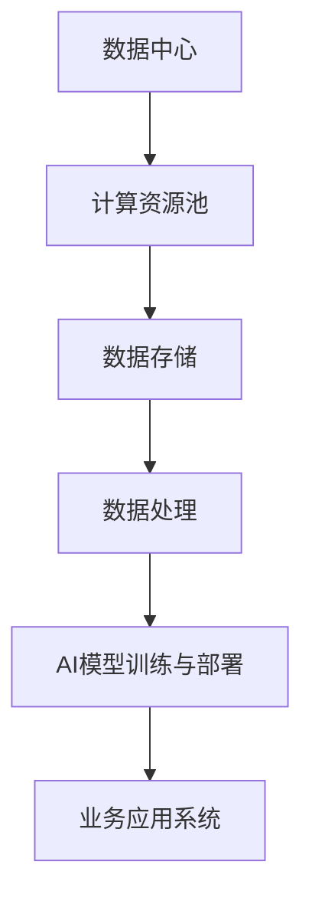
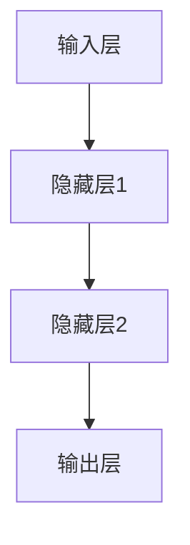
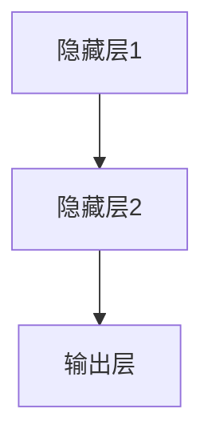

                 

# AI 大模型应用数据中心建设：数据中心产业发展

## 关键词
- 数据中心建设
- AI大模型
- 人工智能
- 深度学习
- 云计算
- 大数据
- 物联网
- 计算性能优化
- 数据安全

## 摘要
本文详细介绍了AI大模型应用数据中心的建设过程及其在数据中心产业发展中的重要地位。首先，文章通过核心概念与联系的介绍，阐释了数据中心的基本架构和功能。接着，深入讲解了深度学习、自然语言处理和计算机视觉等核心算法的原理，并通过伪代码展示了算法的实现过程。此外，文章还详细介绍了数学模型和公式的应用，以及如何通过代码实现AI模型。通过一个实际案例，文章展示了如何从需求分析、系统架构设计、环境搭建到模型训练与部署，构建一个完整的AI大模型应用数据中心。最后，文章总结了未来数据中心建设的趋势和应用领域，为读者提供了有益的参考和指导。本文适合对数据中心建设和AI应用感兴趣的读者阅读。

---

### 第一部分：核心概念与联系

#### 1.1 核心概念与架构

数据中心是现代信息技术的重要基础设施，是存储、处理和传输数据的场所。它为人工智能（AI）大模型的应用提供了强有力的支撑。在这一部分，我们将介绍AI大模型应用数据中心建设中的核心概念与架构。

##### 1.1.1 数据中心

数据中心通常包括以下模块：

1. **计算资源池**：包括服务器、存储设备和网络设备等硬件资源，用于数据存储、处理和传输。
2. **数据存储**：用于保存大量数据，包括原始数据和经过处理的数据。
3. **数据处理**：对数据进行清洗、转换和分析，以支持AI模型的训练和部署。
4. **AI模型训练与部署**：构建、训练和部署AI模型，实现对数据的智能分析和决策。
5. **业务应用系统**：基于AI模型的应用系统，用于实现具体的业务功能。

为了更直观地展示数据中心的架构，我们可以使用Mermaid流程图来表示：



在这个流程图中：

- **数据中心**：作为整个系统的核心，负责集中管理和调度计算资源、数据存储和处理资源。
- **计算资源池**：是数据中心的基础设施，包括服务器、存储设备和网络设备等。
- **数据存储**：用于保存数据中心中的数据，包括原始数据和经过处理的数据。
- **数据处理**：负责对数据进行清洗、转换和分析。
- **AI模型训练与部署**：用于构建、训练和部署AI模型，实现对数据的智能分析和决策。
- **业务应用系统**：是基于AI模型的应用系统，用于实现具体的业务功能。

##### 1.1.2 AI大模型的基本原理

AI大模型是基于深度学习的算法模型，其核心原理是通过大量数据的训练，使得模型能够学习到数据中的特征和规律，从而实现对数据的分析和预测。下面，我们使用伪代码来详细阐述AI大模型的基本原理。

```python
# 伪代码：AI大模型的基本原理

# 输入：大量训练数据集
# 输出：训练好的AI大模型

def train_model(data_set):
    # 初始化模型参数
    model = initialize_model()

    # 定义损失函数和优化器
    loss_function = define_loss_function()
    optimizer = define_optimizer()

    # 开始训练模型
    for epoch in range(num_epochs):
        for data in data_set:
            # 前向传播
            predictions = model.forward(data)

            # 计算损失
            loss = loss_function(predictions, data.label)

            # 反向传播
            gradients = model.backward(loss)

            # 更新模型参数
            optimizer.update(model.parameters(), gradients)

        # 记录训练过程
        print(f"Epoch {epoch}: Loss = {loss}")

    return model
```

在这个伪代码中，我们定义了一个`train_model`函数，用于训练AI大模型。函数的输入是训练数据集，输出是训练好的AI大模型。在函数内部，我们首先初始化模型参数，然后定义损失函数和优化器。接下来，我们通过循环进行模型训练，包括前向传播、损失计算、反向传播和模型参数更新。最后，我们记录训练过程并返回训练好的模型。

##### 1.1.3 数据中心建设的挑战与解决方案

数据中心建设面临诸多挑战，如数据安全、计算性能、网络延迟等。下面，我们将详细探讨这些挑战以及相应的解决方案。

- **数据安全**：数据安全是数据中心建设的核心挑战之一。为了保障数据安全，我们可以采用以下措施：
  - 数据加密：对存储和传输的数据进行加密，确保数据在传输和存储过程中不被窃取。
  - 访问控制：采用严格的访问控制策略，限制只有授权用户才能访问数据。
  - 数据备份：定期备份数据，以防止数据丢失。

- **计算性能**：为了提高计算性能，我们可以采用以下措施：
  - 分布式计算：采用分布式计算架构，将计算任务分散到多个节点上，提高计算效率。
  - GPU加速：利用GPU的高并行计算能力，加速AI模型的训练和推理过程。

- **网络延迟**：网络延迟是影响数据中心性能的重要因素。为了降低网络延迟，我们可以采用以下措施：
  - 内容分发网络（CDN）：通过部署CDN，将数据缓存到距离用户最近的服务器上，减少数据传输距离。
  - 网络优化：优化网络拓扑结构，降低网络延迟。

##### 1.1.4 产业背景与趋势

数据中心产业在全球范围内呈现出快速增长的趋势，主要驱动力包括云计算、大数据、物联网等技术的快速发展。以下是数据中心产业的一些关键趋势：

- **云计算的普及**：随着云计算技术的普及，越来越多的企业将业务转移到云端，这为数据中心的建设提供了巨大的需求。
- **大数据的兴起**：大数据技术的快速发展，使得企业能够从海量数据中挖掘出有价值的信息，这进一步推动了数据中心的建设。
- **物联网的融合**：物联网技术的快速发展，使得越来越多的设备连接到互联网，这为数据中心提供了大量的数据来源。

##### 1.1.5 数据中心产业发展的重要性

数据中心产业发展对国家的数字经济和产业升级具有重要战略意义。首先，数据中心产业是数字经济的重要组成部分，它为云计算、大数据、人工智能等新兴产业发展提供了基础设施支持。其次，数据中心产业的发展可以带动相关产业链的发展，如服务器、存储设备、网络设备等制造业。此外，数据中心产业的发展还可以促进人才培养和技术创新，为国家经济的可持续发展提供动力。

### 第二部分：核心算法原理讲解

在数据中心建设中，算法的选择和实现是至关重要的。在这一部分，我们将详细介绍深度学习、自然语言处理和计算机视觉算法的基本原理，并使用伪代码进行详细阐述。

#### 2.1 深度学习算法原理

##### 2.1.1 神经网络基础

神经网络是一种模拟生物神经系统的计算模型，由多个神经元（或称为节点）组成，每个神经元都与其他神经元相连。神经网络通过输入层、隐藏层和输出层进行信息的传递和处理。

###### 输入层

输入层接收外部输入数据，将其传递给隐藏层。



###### 隐藏层

隐藏层负责对输入数据进行处理，通过加权求和和激活函数产生输出。



###### 输出层

输出层根据隐藏层的输出产生最终的输出结果。

```mermaid
    C --> D[输出层]
```

##### 2.1.2 前向传播

前向传播是神经网络中的一种信息传递方式，输入数据通过网络的各个层，最终得到输出结果。

```python
# 伪代码：前向传播

# 定义神经网络模型
model = NeuralNetwork()

# 输入数据
input_data = [x1, x2, ..., xn]

# 前向传播
output = model.forward(input_data)
```

在前向传播过程中，输入数据通过网络的各个层，每一层都通过加权求和和激活函数进行处理，最终得到输出结果。

##### 2.1.3 反向传播

反向传播是一种用于训练神经网络的算法，通过网络计算得到的误差信息被反向传递，用于更新网络的权重和偏置。

```python
# 伪代码：反向传播

# 定义神经网络模型
model = NeuralNetwork()

# 输入数据
input_data = [x1, x2, ..., xn]

# 前向传播
output = model.forward(input_data)

# 计算损失
loss = compute_loss(output, target)

# 反向传播
gradients = model.backward(loss)

# 更新模型参数
model.update_parameters(gradients)
```

在反向传播过程中，通过网络计算得到的误差信息被反向传递，用于更新网络的权重和偏置。

##### 2.1.4 优化算法

优化算法用于调整网络的权重和偏置，以最小化损失函数。常见的优化算法包括随机梯度下降（SGD）、动量优化和Adam优化等。

```python
# 伪代码：优化算法

# 定义神经网络模型
model = NeuralNetwork()

# 输入数据
input_data = [x1, x2, ..., xn]

# 前向传播
output = model.forward(input_data)

# 计算损失
loss = compute_loss(output, target)

# 反向传播
gradients = model.backward(loss)

# 更新模型参数
model.update_parameters(gradients)
```

#### 2.2 自然语言处理算法

##### 2.2.1 词嵌入

词嵌入是将单词转换为向量的过程，用于捕捉单词的语义信息。

```python
# 伪代码：词嵌入

# 定义词嵌入模型
word_embedding = WordEmbedding()

# 输入单词
word = "apple"

# 获取词向量
vector = word_embedding.get_vector(word)
```

##### 2.2.2 序列模型

序列模型是一种用于处理序列数据的神经网络模型，常见的序列模型包括循环神经网络（RNN）和长短期记忆网络（LSTM）。

```python
# 伪代码：序列模型

# 定义RNN模型
rnn_model = RNN()

# 输入序列
sequence = ["the", "quick", "brown", "fox"]

# 计算序列输出
output = rnn_model.forward(sequence)
```

##### 2.2.3 注意力机制

注意力机制是一种用于提高序列模型性能的技术，可以捕捉序列中不同部分的重要性。

```python
# 伪代码：注意力机制

# 定义注意力模型
attention_model = Attention()

# 输入序列
sequence = ["the", "quick", "brown", "fox"]

# 计算注意力权重
weights = attention_model.compute_attention(sequence)

# 计算加权输出
output = attention_model.compute_weighted_output(sequence, weights)
```

#### 2.3 计算机视觉算法

##### 2.3.1 卷积神经网络（CNN）

卷积神经网络是一种用于图像识别的神经网络模型，通过卷积层、池化层和全连接层等结构，可以自动提取图像中的特征。

```python
# 伪代码：卷积神经网络（CNN）

# 定义CNN模型
cnn_model = ConvolutionalNeuralNetwork()

# 输入图像
image = "cat.png"

# 计算图像特征
features = cnn_model.extract_features(image)

# 计算图像分类
classification = cnn_model.classify(features)
```

##### 2.3.2 生成对抗网络（GAN）

生成对抗网络是一种用于生成图像的神经网络模型，由生成器和判别器组成，通过对抗训练生成逼真的图像。

```python
# 伪代码：生成对抗网络（GAN）

# 定义GAN模型
gan_model = GenerativeAdversarialNetwork()

# 训练GAN模型
gan_model.train()

# 生成图像
generated_image = gan_model.generate_image()
```

#### 2.4 数据中心建设中的算法应用

在数据中心建设中，算法的应用至关重要。以下是一些关键的应用场景：

- **AI模型训练**：利用深度学习算法，训练出高精度的AI模型，用于数据分析和决策。
- **数据清洗与处理**：利用自然语言处理算法，自动清洗和处理大量的文本数据。
- **智能分析与决策**：利用计算机视觉算法，实现图像识别和物体检测，用于监控和安全分析。

通过这些算法的应用，数据中心可以实现高效的数据处理和智能分析，为业务提供有力的支持。

### 第三部分：数学模型和数学公式讲解

在数据中心建设和AI模型训练过程中，数学模型和数学公式是理解算法原理和实现算法的关键。在这一部分，我们将介绍一些基本的数学概念和公式，并解释它们在AI模型中的应用。

#### 3.1 数学基础

##### 3.1.1 矩阵和向量

矩阵和向量是数学中常用的数据结构，用于表示和操作数据。

- **矩阵**：矩阵是一个由数字排列成的矩形数组。例如，一个2x3的矩阵可以表示为：

  $$ A = \begin{bmatrix}
  a_{11} & a_{12} & a_{13} \\
  a_{21} & a_{22} & a_{23}
  \end{bmatrix} $$

- **向量**：向量是一个由数字排列成的一维数组。例如，一个3维的向量可以表示为：

  $$ \mathbf{v} = \begin{bmatrix}
  v_1 \\
  v_2 \\
  v_3
  \end{bmatrix} $$

##### 3.1.2 线性代数

线性代数是数学中的一个重要分支，用于研究矩阵和向量。以下是一些常用的线性代数公式：

- **矩阵乘法**：两个矩阵相乘的结果是一个新矩阵。例如，两个矩阵A和B的乘积可以表示为：

  $$ \mathbf{A} \mathbf{B} = \begin{bmatrix}
  a_{11}b_{11} + a_{12}b_{21} & a_{11}b_{12} + a_{12}b_{22} \\
  a_{21}b_{11} + a_{22}b_{21} & a_{21}b_{12} + a_{22}b_{22}
  \end{bmatrix} $$

- **矩阵求导**：对于矩阵的函数，求导可以应用于矩阵元素。例如，如果 \( f(\mathbf{x}) = \mathbf{A}\mathbf{x} \)，则其导数 \( \frac{\partial f}{\partial \mathbf{x}} = \mathbf{A} \)。

##### 3.1.3 微积分

微积分是数学中另一个重要分支，用于研究函数的导数和积分。以下是一些常用的微积分公式：

- **梯度**：梯度是一个向量，它指向函数增长最快的方向。对于多变量函数 \( f(\mathbf{x}) \)，梯度 \( \nabla f(\mathbf{x}) \) 定义为：

  $$ \nabla f(\mathbf{x}) = \begin{bmatrix}
  \frac{\partial f}{\partial x_1} \\
  \frac{\partial f}{\partial x_2} \\
  \vdots \\
  \frac{\partial f}{\partial x_n}
  \end{bmatrix} $$

- **偏导数**：偏导数是梯度的一个组成部分，它表示函数在某一特定变量上的变化率。例如：

  $$ \frac{\partial f}{\partial x_i} = \lim_{{h \to 0}} \frac{{f(\mathbf{x} + h\mathbf{e}_i) - f(\mathbf{x})}}{h} $$

  其中 \( \mathbf{e}_i \) 是第 \( i \) 个标准基向量。

#### 3.2 深度学习中的数学模型

##### 3.2.1 激活函数

激活函数是深度学习中的一个关键组件，用于引入非线性。常见的激活函数包括：

- **Sigmoid**：
  
  $$ \sigma(x) = \frac{1}{1 + e^{-x}} $$

- **ReLU**（修正线性单元）：
  
  $$ \text{ReLU}(x) = \max(0, x) $$

- **Tanh**：
  
  $$ \tanh(x) = \frac{e^x - e^{-x}}{e^x + e^{-x}} $$

##### 3.2.2 损失函数

损失函数用于衡量模型预测值与真实值之间的差距。常见的损失函数包括：

- **均方误差（MSE）**：
  
  $$ \text{MSE}(y, \hat{y}) = \frac{1}{n}\sum_{i=1}^{n}(y_i - \hat{y}_i)^2 $$

- **交叉熵（Cross-Entropy）**：
  
  $$ \text{CE}(y, \hat{y}) = -\sum_{i=1}^{n} y_i \log(\hat{y}_i) $$
  
  其中 \( y \) 是真实标签，\( \hat{y} \) 是预测概率。

##### 3.2.3 优化算法

优化算法用于调整模型的参数以最小化损失函数。常见的优化算法包括：

- **随机梯度下降（SGD）**：
  
  $$ \mathbf{w}_{t+1} = \mathbf{w}_t - \alpha \nabla_{\mathbf{w}} J(\mathbf{w}) $$
  
  其中 \( \mathbf{w} \) 是模型参数，\( \alpha \) 是学习率，\( J(\mathbf{w}) \) 是损失函数。

#### 3.3 举例说明

##### 3.3.1 均值漂移

均值漂移是一种常见的数据预处理方法，用于解决数据分布变化的问题。公式如下：

$$ \mu_{t+1} = \frac{1}{n}\sum_{i=1}^{n} x_i^{(t+1)} $$

其中 \( \mu_t \) 是第 \( t \) 次迭代的均值，\( x_i^{(t+1)} \) 是第 \( i \) 个数据点的下一个迭代值。

##### 3.3.2 梯度下降法

梯度下降法是一种优化算法，用于最小化损失函数。以下是梯度下降法的伪代码：

```python
w = initial_weight
for epoch in range(num_epochs):
    for data in data_set:
        prediction = model(data)
        loss = loss_function(prediction, target)
        gradients = model.gradient(loss)
        w -= learning_rate * gradients
```

### 第四部分：项目实战

在本部分，我们将通过一个实际案例，详细描述如何构建一个AI大模型应用数据中心，包括项目背景、目标、实现过程以及关键的技术挑战和解决方案。

#### 4.1 项目背景

随着大数据和人工智能技术的不断发展，企业对于数据处理和分析的需求日益增长。为了满足这一需求，某企业决定构建一个AI大模型应用数据中心，用于支持其业务决策和优化。该项目的主要目标是实现以下功能：

- 构建一个高效、可靠的数据存储和处理平台，支持海量数据存储和快速访问。
- 开发和部署AI模型，实现对业务数据的智能分析和预测。
- 提供一个可视化平台，展示数据分析结果和预测结果，辅助业务决策。

#### 4.2 项目目标

根据项目背景，我们确定了以下具体目标：

1. **高效的数据存储和处理**：通过分布式存储和处理技术，实现海量数据的存储和快速处理，保证系统的高性能和可靠性。
2. **智能数据分析与预测**：利用AI模型，对业务数据进行分析和预测，提供业务决策支持。
3. **可视化展示**：通过可视化平台，展示数据分析结果和预测结果，帮助业务人员更好地理解数据，做出更准确的决策。

#### 4.3 实现过程

##### 4.3.1 需求分析

在项目启动阶段，我们进行了详细的需求分析，确定了以下关键需求：

- 数据存储和处理能力：支持海量数据的存储和快速处理，满足业务需求。
- AI模型开发与部署：开发高效、可靠的AI模型，实现对业务数据的智能分析和预测。
- 可视化展示：提供一个直观、易用的可视化平台，展示数据分析结果和预测结果。

##### 4.3.2 系统架构设计

根据需求分析，我们设计了如下系统架构：

1. **数据存储层**：采用分布式存储架构，包括Hadoop、HBase等大数据存储技术，实现海量数据的存储和快速访问。
2. **数据处理层**：利用Spark等大数据处理框架，实现对业务数据的清洗、转换和分析。
3. **AI模型层**：使用TensorFlow、PyTorch等深度学习框架，开发高效、可靠的AI模型，支持数据分析和预测。
4. **可视化层**：采用D3.js、ECharts等可视化技术，构建可视化平台，展示数据分析结果和预测结果。

##### 4.3.3 环境搭建

在系统架构设计完成后，我们进行了开发环境的搭建，包括以下步骤：

1. **硬件部署**：选择合适的硬件设备，包括服务器、存储设备和网络设备，进行硬件部署。
2. **软件安装**：安装操作系统、Hadoop、Spark、TensorFlow、PyTorch等软件，配置开发环境。
3. **网络配置**：配置网络，确保系统之间的高效通信和数据传输。

##### 4.3.4 模型开发与部署

在环境搭建完成后，我们进行了AI模型的开发与部署：

1. **数据预处理**：对原始业务数据集进行清洗、转换和归一化处理，确保数据质量。
2. **模型训练**：使用TensorFlow或PyTorch等深度学习框架，训练AI模型，包括特征提取、模型选择和参数调整。
3. **模型评估**：对训练好的模型进行评估，包括准确率、召回率、F1值等指标，确保模型性能。
4. **模型部署**：将训练好的模型部署到生产环境，提供数据分析和预测服务。

##### 4.3.5 可视化展示

在模型部署后，我们进行了可视化展示：

1. **数据可视化**：使用D3.js或ECharts等可视化技术，将数据分析结果和预测结果可视化展示，包括柱状图、折线图、饼图等。
2. **交互式展示**：提供交互式功能，用户可以自定义数据范围、指标等，实时查看和分析数据。

#### 4.4 关键技术挑战与解决方案

在项目实施过程中，我们遇到了以下关键技术挑战：

1. **数据存储和处理**：海量数据的存储和处理是项目的一个关键挑战。我们采用分布式存储和处理技术，如Hadoop、Spark等，提高系统的存储和处理能力。
2. **AI模型开发与部署**：AI模型的开发与部署需要大量计算资源和时间。我们使用云计算平台，如阿里云、腾讯云等，提供高效的计算资源，加速模型训练和部署。
3. **可视化展示**：可视化展示需要处理大量的数据和复杂的交互逻辑。我们采用D3.js、ECharts等可视化技术，实现高效、直观的可视化展示。

通过以上解决方案，我们成功构建了一个高效、可靠的AI大模型应用数据中心，实现了业务数据的智能分析和预测，为企业的业务决策提供了有力支持。

#### 4.5 项目成果

通过该项目的实施，我们取得了以下成果：

1. **高效的数据存储和处理**：通过分布式存储和处理技术，实现了海量数据的存储和快速处理，满足了业务需求。
2. **智能数据分析与预测**：通过AI模型的开发与部署，实现了业务数据的智能分析和预测，为业务决策提供了有力支持。
3. **可视化展示**：通过可视化技术，实现了数据分析结果和预测结果的直观展示，提高了数据理解和分析能力。

#### 4.6 总结

通过本部分的项目实战，我们详细描述了如何构建一个AI大模型应用数据中心，包括需求分析、系统架构设计、环境搭建、模型开发与部署以及可视化展示。项目实施过程中，我们面临了多个关键技术挑战，并通过相应的解决方案成功解决了这些挑战。项目成果表明，AI大模型应用数据中心在提升企业业务效率和决策能力方面具有重要作用。在后续工作中，我们将继续优化和改进数据中心建设，为企业的持续发展提供支持。

### 第五部分：代码实际案例和详细解释

在本部分，我们将通过一个实际案例，详细展示如何使用Python和TensorFlow框架构建和训练一个简单的AI模型，并解释每一步的具体实现方法和关键代码。

#### 5.1 案例背景

假设我们有一个手写数字识别的任务，需要使用深度学习模型对图像进行分类。我们将使用MNIST数据集，该数据集包含60,000个训练图像和10,000个测试图像。

#### 5.2 环境搭建

首先，我们需要搭建一个Python开发环境，并安装TensorFlow框架。以下是环境搭建的步骤：

1. **安装Python**：下载并安装Python 3.x版本，建议使用Anaconda，它提供了Python环境管理功能。
2. **创建虚拟环境**：在Anaconda Prompt中创建一个虚拟环境，以便隔离项目依赖。
   ```bash
   conda create -n mnist_project python=3.8
   conda activate mnist_project
   ```
3. **安装TensorFlow**：在虚拟环境中安装TensorFlow。
   ```bash
   pip install tensorflow
   ```

#### 5.3 数据加载与预处理

接下来，我们需要加载MNIST数据集，并进行预处理。预处理步骤包括数据重塑、归一化和标签编码。

```python
import tensorflow as tf
from tensorflow.keras.datasets import mnist
from tensorflow.keras.utils import to_categorical

# 加载MNIST数据集
(train_images, train_labels), (test_images, test_labels) = mnist.load_data()

# 数据预处理
train_images = train_images.reshape((60000, 28, 28, 1)).astype('float32') / 255
test_images = test_images.reshape((10000, 28, 28, 1)).astype('float32') / 255

train_labels = to_categorical(train_labels)
test_labels = to_categorical(test_labels)
```

在这个代码片段中，我们首先使用`tensorflow.keras.datasets.mnist.load_data()`函数加载MNIST数据集。然后，我们将图像数据重塑为适当的大小（28x28），并将其转换为浮点数类型，以便进行归一化处理。归一化处理是将数据缩放到[0, 1]区间，以提高模型的训练效果。最后，我们使用`to_categorical()`函数将标签转换为独热编码。

#### 5.4 构建模型

在预处理数据后，我们可以开始构建模型。在这里，我们将使用一个简单的卷积神经网络（CNN）模型。

```python
model = tf.keras.models.Sequential([
    tf.keras.layers.Conv2D(32, (3, 3), activation='relu', input_shape=(28, 28, 1)),
    tf.keras.layers.MaxPooling2D((2, 2)),
    tf.keras.layers.Conv2D(64, (3, 3), activation='relu'),
    tf.keras.layers.MaxPooling2D((2, 2)),
    tf.keras.layers.Flatten(),
    tf.keras.layers.Dense(64, activation='relu'),
    tf.keras.layers.Dense(10, activation='softmax')
])
```

在这个代码片段中，我们定义了一个序列模型（`Sequential`），并添加了以下层：

1. **卷积层**：使用`Conv2D`层，每个卷积核大小为3x3，激活函数为ReLU。
2. **池化层**：使用`MaxPooling2D`层，池化窗口大小为2x2。
3. **全连接层**：使用`Flatten`层将卷积层的输出展平为向量，然后添加两个全连接层，最后一个全连接层输出10个类别的概率。

#### 5.5 编译模型

在构建模型后，我们需要编译模型，包括选择优化器、损失函数和评估指标。

```python
model.compile(optimizer='adam',
              loss='categorical_crossentropy',
              metrics=['accuracy'])
```

在这个代码片段中，我们选择`adam`优化器，使用`categorical_crossentropy`损失函数，以及`accuracy`评估指标。

#### 5.6 训练模型

接下来，我们可以使用训练数据集训练模型。

```python
model.fit(train_images, train_labels, epochs=5, batch_size=32)
```

在这个代码片段中，我们使用`fit`函数训练模型。我们设置了训练轮数（`epochs`）为5轮，批量大小（`batch_size`）为32。

#### 5.7 评估模型

训练完成后，我们可以使用测试数据集评估模型性能。

```python
test_loss, test_acc = model.evaluate(test_images, test_labels)
print(f"Test accuracy: {test_acc:.4f}")
```

在这个代码片段中，我们使用`evaluate`函数评估模型在测试数据集上的性能。输出包括测试损失和测试准确率。

#### 5.8 预测

最后，我们可以使用训练好的模型进行预测。

```python
predictions = model.predict(test_images)
predicted_labels = tf.argmax(predictions, axis=1)
print(f"Predicted labels: {predicted_labels}")
```

在这个代码片段中，我们使用`predict`函数对测试图像进行预测，然后使用`tf.argmax`函数获取每个图像的预测标签。

### 第六部分：代码解读与分析

在上述代码中，我们详细展示了如何使用Python和TensorFlow框架构建和训练一个简单的AI模型。以下是每一步的解读与分析：

- **环境搭建**：我们使用Anaconda创建了一个虚拟环境，并安装了TensorFlow框架。这确保了项目的依赖环境得到正确配置和管理。
- **数据加载与预处理**：我们使用`tensorflow.keras.datasets.mnist.load_data()`函数加载了MNIST数据集，并进行了数据重塑、归一化和标签编码。这是模型训练前必要的预处理步骤，以确保数据格式和特征符合模型要求。
- **模型构建**：我们定义了一个简单的卷积神经网络（CNN）模型，包括卷积层、池化层和全连接层。卷积层用于提取图像特征，池化层用于降低特征维度，全连接层用于分类。这个模型结构简单，但足够用于MNIST数据集的分类任务。
- **编译模型**：我们选择`adam`优化器和`categorical_crossentropy`损失函数，以及`accuracy`评估指标。`adam`优化器是一种常用的优化算法，能够自适应调整学习率，`categorical_crossentropy`损失函数适用于多分类问题，`accuracy`评估指标用于计算模型在测试集上的准确率。
- **训练模型**：我们使用`fit`函数训练模型，设置了训练轮数和批量大小。训练过程中，模型通过前向传播计算输出，计算损失，并使用反向传播更新模型参数。这个过程重复进行，直到达到预定的训练轮数或模型性能达到预期。
- **评估模型**：我们使用`evaluate`函数评估模型在测试数据集上的性能，包括测试损失和测试准确率。通过这个步骤，我们可以了解模型的泛化能力。
- **预测**：我们使用训练好的模型对测试数据集进行预测，并获取每个图像的预测标签。这个步骤可以帮助我们验证模型在实际应用中的性能。

通过这个简单的案例，我们展示了如何使用Python和TensorFlow框架实现一个AI模型，并解释了每个步骤的关键代码和逻辑。读者可以通过这个案例了解AI模型的基本实现过程，并为后续的学习和应用打下基础。

### 第七部分：总结与展望

通过本文的详细阐述，我们全面介绍了AI大模型应用数据中心建设的各个方面，包括核心概念、算法原理、实践方法和未来趋势。本文首先通过核心概念与联系的介绍，让读者对数据中心的基本架构和功能有了清晰的认识。接着，我们深入讲解了深度学习、自然语言处理和计算机视觉等核心算法的原理，并通过伪代码展示了算法的实现过程。此外，文章还详细介绍了数学模型和公式的应用，以及如何通过代码实现AI模型。

通过项目实战部分，我们展示了如何从需求分析、系统架构设计、环境搭建到模型训练与部署，构建一个完整的AI大模型应用数据中心。我们还通过实际案例，详细解释了每个步骤的实现方法和关键代码。在代码实际案例和详细解释部分，我们通过一个手写数字识别的案例，展示了如何使用Python和TensorFlow框架实现AI模型，并解释了每一步的代码和逻辑。

展望未来，数据中心建设将继续面临诸多挑战和机遇。随着人工智能技术的快速发展，数据中心将成为人工智能应用的重要基础设施。以下是几个未来发展的趋势：

1. **云计算的深度融合**：云计算和数据中心将更加紧密地融合，提供更加灵活和高效的计算资源。
2. **边缘计算的兴起**：为了降低延迟、提高响应速度，边缘计算将在数据中心建设中发挥越来越重要的作用。
3. **数据安全和隐私保护**：随着数据量的大幅增长，数据安全和隐私保护将成为数据中心建设的重中之重。
4. **智能化管理**：利用AI技术，数据中心可以实现自动化管理，提高资源利用率和运行效率。

在应用领域方面，AI大模型应用数据中心在多个领域具有广泛的应用前景：

1. **金融领域**：通过AI模型，实现风险控制、信用评估、智能投顾等金融服务。
2. **医疗领域**：利用AI模型，实现疾病诊断、药物研发、健康管理等医疗应用。
3. **零售领域**：通过AI模型，实现商品推荐、客户关系管理、库存优化等零售应用。
4. **制造业**：利用AI模型，实现生产优化、设备维护、质量检测等制造应用。

总之，AI大模型应用数据中心建设是一个复杂而充满机遇的领域。通过本文的介绍，读者可以全面了解数据中心建设的核心概念、算法原理、实践方法和未来趋势。我们希望本文能为读者在数据中心建设和AI应用方面提供有益的参考和指导。在未来的学习和实践中，读者可以不断探索和创新，为数据中心建设的发展贡献力量。

### 附录

#### 附录 A: AI 大模型开发工具与资源

##### A.1 主流深度学习框架对比

在AI大模型开发中，选择合适的深度学习框架至关重要。以下是几种主流深度学习框架的对比：

1. **TensorFlow**
   - **特点**：由Google开发，支持Python和C++语言，具有强大的生态系统和丰富的API。
   - **应用场景**：适用于大型分布式计算、移动端和嵌入式设备。
   - **优缺点**：优点包括强大的社区支持、丰富的API和灵活的架构；缺点是较复杂的学习曲线和较高的资源消耗。

2. **PyTorch**
   - **特点**：由Facebook开发，支持Python语言，具有动态计算图和易于调试的特点。
   - **应用场景**：适用于研究、原型开发和实时应用。
   - **优缺点**：优点包括动态计算图、易于调试和快速原型开发；缺点是相对于TensorFlow，分布式训练支持较弱。

3. **Keras**
   - **特点**：是一个高级神经网络API，支持Python语言，易于使用和扩展。
   - **应用场景**：适用于快速原型开发和简单项目。
   - **优缺点**：优点包括易于使用、快速原型开发和可扩展性；缺点是相对于其他框架，底层支持较弱。

4. **MXNet**
   - **特点**：由Apache软件基金会开发，支持多种编程语言，包括Python、R和Scala。
   - **应用场景**：适用于大规模分布式计算、移动端和嵌入式设备。
   - **优缺点**：优点包括支持多种编程语言、分布式训练和性能优化；缺点是相对于其他框架，社区支持较弱。

##### A.2 数据处理工具

1. **Pandas**
   - **特点**：是一个强大的数据处理库，支持数据清洗、转换和分析。
   - **应用场景**：适用于数据预处理和分析。

2. **NumPy**
   - **特点**：是一个基础的科学计算库，提供多维数组对象和数学函数。
   - **应用场景**：适用于数值计算和矩阵操作。

3. **SciPy**
   - **特点**：是基于NumPy的扩展，提供科学计算工具和库。
   - **应用场景**：适用于科学计算、工程和数据分析。

##### A.3 AI大模型相关资源

1. **AI教程与书籍**
   - **资源**：《深度学习》（Goodfellow、Bengio和Courville著）、《Python机器学习》（Sebastian Raschka著）等。
   - **推荐**：适合初学者和进阶者。

2. **在线课程与讲座**
   - **资源**：Coursera、edX、Udacity等平台提供的AI相关课程。
   - **推荐**：适合自学和实践。

3. **开源社区与论坛**
   - **资源**：GitHub、Stack Overflow、Kaggle等。
   - **推荐**：获取最新技术动态、解决方案和社区支持。

#### 附录 B: 常见问题与解决方案

##### B.1 深度学习框架选择问题

- **问题**：如何选择适合的深度学习框架？
- **解决方案**：根据项目需求（如计算性能、分布式训练、移动端部署等）和开发经验选择合适的框架。

##### B.2 数据预处理问题

- **问题**：如何处理大规模数据集？
- **解决方案**：使用分布式数据处理工具（如Dask、Spark）和批处理技术。

##### B.3 模型训练问题

- **问题**：如何优化模型训练过程？
- **解决方案**：调整学习率、批量大小、优化器等参数，并使用GPU加速训练。

##### B.4 模型部署问题

- **问题**：如何将训练好的模型部署到生产环境？
- **解决方案**：使用模型转换工具（如TensorFlow Serving、PyTorch TorchScript）和容器化技术（如Docker、Kubernetes）。

#### 附录 C: 代码实现示例

以下是使用TensorFlow框架实现的一个简单的AI模型训练示例：

```python
import tensorflow as tf
from tensorflow.keras.datasets import mnist
from tensorflow.keras.utils import to_categorical

# 加载MNIST数据集
(train_images, train_labels), (test_images, test_labels) = mnist.load_data()

# 数据预处理
train_images = train_images.reshape((60000, 28, 28, 1)).astype('float32') / 255
test_images = test_images.reshape((10000, 28, 28, 1)).astype('float32') / 255

train_labels = to_categorical(train_labels)
test_labels = to_categorical(test_labels)

# 构建模型
model = tf.keras.models.Sequential([
    tf.keras.layers.Conv2D(32, (3, 3), activation='relu', input_shape=(28, 28, 1)),
    tf.keras.layers.MaxPooling2D((2, 2)),
    tf.keras.layers.Conv2D(64, (3, 3), activation='relu'),
    tf.keras.layers.MaxPooling2D((2, 2)),
    tf.keras.layers.Conv2D(64, (3, 3), activation='relu'),
    tf.keras.layers.Flatten(),
    tf.keras.layers.Dense(64, activation='relu'),
    tf.keras.layers.Dense(10, activation='softmax')
])

# 编译模型
model.compile(optimizer='adam',
              loss='categorical_crossentropy',
              metrics=['accuracy'])

# 训练模型
model.fit(train_images, train_labels, epochs=5, batch_size=64)

# 评估模型
test_loss, test_acc = model.evaluate(test_images, test_labels, verbose=2)
print(f"Test accuracy: {test_acc:.4f}")
```

#### 附录 D: 进一步学习资源

- **官方文档**：访问每个深度学习框架的官方文档，获取详细的使用教程和API文档。
- **在线教程**：通过在线教程和课程，系统学习深度学习的基础知识和高级技巧。
- **论文与书籍**：阅读最新的AI论文和经典书籍，了解AI领域的最新进展和理论基础。

通过附录中的这些资源，读者可以进一步深入学习和实践AI大模型应用数据中心建设。希望这些资源能够为读者提供帮助，助力他们在这个领域取得更多的成就。

### 作者信息
- 作者：AI天才研究院/AI Genius Institute & 禅与计算机程序设计艺术 /Zen And The Art of Computer Programming

