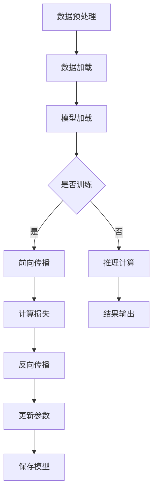

                 

### 引言与概述

#### AI 大模型应用数据中心建设的背景和意义

随着人工智能技术的迅猛发展，AI 大模型的应用越来越广泛，从自然语言处理、计算机视觉到推荐系统等各个领域，AI 大模型都发挥着关键作用。然而，这些大模型的训练和推理对计算资源、存储能力和网络带宽提出了极高的要求。为了满足这些需求，建设一个高效、可靠的 AI 大模型应用数据中心成为当务之急。

首先，AI 大模型的兴起为数据处理和智能分析带来了新的机遇。以深度学习为基础的 AI 大模型具有强大的数据处理能力，可以处理海量数据并从中提取出有价值的信息。这种能力在医疗、金融、零售等行业都有着广泛的应用。然而，这些大模型的训练和推理过程需要大量的计算资源和存储空间，传统的数据中心已经无法满足需求。

其次，数据中心建设对于提升 AI 大模型的应用效果至关重要。一个高效的数据中心可以提供稳定的计算环境，保证模型训练和推理的效率。同时，数据中心还需要具备良好的扩展性，以应对未来 AI 技术的快速发展。此外，数据中心还需要关注能耗管理，实现绿色环保的目标。

最后，本书旨在为广大 AI 爱好者和技术人员提供一个系统、全面的 AI 大模型应用数据中心建设指南。通过本书的学习，读者可以了解 AI 大模型的基本概念、数据中心建设的基础知识，以及训练和推理优化技巧。本书的结构如下：

- **第一部分：引言与概述**：介绍 AI 大模型应用数据中心建设的背景和意义，以及本书的目标与结构。
- **第二部分：数据中心建设基础**：详细讲解数据中心基础设施、硬件资源规划与配置、软件资源的选择与部署。
- **第三部分：AI 大模型训练与推理优化**：深入探讨 AI 大模型训练原理、推理优化策略，以及能耗管理与绿色数据中心建设。
- **第四部分：项目实践与案例分析**：通过实际项目和案例分析，展示 AI 大模型数据中心建设的实践方法和经验。

通过本书的学习，读者可以全面了解 AI 大模型应用数据中心建设的方方面面，为未来的研究和工作打下坚实的基础。

#### 目录大纲：AI 大模型应用数据中心建设

- **第一部分：引言与概述**
  - 第1章: AI 大模型应用数据中心建设的背景和意义
  - 第2章: AI 大模型的基本概念

- **第二部分：数据中心建设基础**
  - 第3章: 数据中心基础设施
  - 第4章: 硬件资源规划与配置
  - 第5章: 软件资源的选择与部署

- **第三部分：AI 大模型训练与推理优化**
  - 第6章: AI 大模型训练原理
  - 第7章: AI 大模型推理优化
  - 第8章: 能耗管理与绿色数据中心

- **第四部分：项目实践与案例分析**
  - 第9章: AI 大模型数据中心建设项目实践
  - 第10章: AI 大模型数据中心案例分析

通过这个目录大纲，读者可以系统地了解 AI 大模型应用数据中心建设的全过程，从理论到实践，逐步掌握相关技术。

#### 摘要

本文旨在为广大 AI 爱好者和技术人员提供一个全面、系统的 AI 大模型应用数据中心建设指南。文章首先介绍了 AI 大模型的背景和意义，阐述了数据中心建设的重要性。接着，详细讲解了数据中心基础设施、硬件资源规划与配置、软件资源的选择与部署。随后，深入探讨了 AI 大模型训练原理、推理优化策略，以及能耗管理与绿色数据中心建设。最后，通过实际项目和案例分析，展示了 AI 大模型数据中心建设的实践方法和经验。通过本文的学习，读者可以全面了解 AI 大模型应用数据中心建设的方方面面，为未来的研究和工作打下坚实的基础。文章关键词：AI 大模型、数据中心建设、硬件资源、软件资源、能耗管理、绿色数据中心。

---

### 第1章: AI 大模型应用数据中心建设的背景和意义

#### 1.1 AI 大模型的兴起

AI 大模型的兴起可以追溯到 2012 年，当时深度学习算法在图像识别任务中取得了突破性的成果。这一突破引发了学术界和工业界对深度学习的广泛关注，尤其是对大规模数据集和计算资源的依赖。随着时间的推移，AI 大模型的应用领域不断扩大，从早期的计算机视觉和自然语言处理扩展到推荐系统、语音识别、机器人技术等众多领域。

首先，AI 大模型在计算机视觉领域取得了显著成果。以 GPT-3 和BERT 等为代表的自然语言处理模型，在语言理解和生成任务中展现出了惊人的表现。此外，图像生成模型如 StyleGAN 和 DALL-E 等也在图像创作领域取得了突破。这些大模型的出现，使得计算机视觉和自然语言处理的应用场景更加丰富，如自动驾驶、人脸识别、智能客服等。

其次，AI 大模型在推荐系统领域也有着广泛的应用。通过深度学习算法，推荐系统可以更好地理解用户的兴趣和行为，提供更加精准的推荐结果。例如，Netflix、YouTube 和亚马逊等平台都采用了大模型来优化其推荐算法，从而提高用户满意度和平台收益。

再次，语音识别技术的进步也离不开 AI 大模型的支持。语音识别模型如 WaveNet 和 DeepSpeech 在语音信号处理、语音合成和语音翻译等方面表现出了卓越的性能，使得智能语音助手如 Siri、Alexa 和小爱同学等得到了广泛应用。

#### 1.2 数据中心建设的需求

AI 大模型的训练和推理过程需要大量的计算资源和存储空间，这对数据中心的建设提出了新的需求。首先，在计算资源方面，AI 大模型通常需要数千甚至数万个 GPU 来进行并行训练，这要求数据中心具备强大的计算能力。其次，在存储空间方面，AI 大模型的数据集通常包含数十 TB 甚至 PB 级别的数据，这要求数据中心提供高效的存储解决方案。此外，网络带宽也成为了一个重要的考量因素，因为模型训练和推理过程中的数据传输需要高速、稳定的网络支持。

为了满足这些需求，数据中心的建设需要从以下几个方面进行：

1. **硬件资源**：数据中心需要配备高性能的 GPU、CPU 和存储设备，以满足 AI 大模型训练和推理的需求。同时，还需要考虑设备的可靠性和可扩展性，以便在需求增加时进行升级和扩展。

2. **网络架构**：数据中心需要设计高效的网络架构，以确保数据传输的稳定性和低延迟。常用的网络架构包括集群架构、分布式架构和混合架构等，每种架构都有其优缺点和适用场景。

3. **软件资源**：数据中心需要安装和配置各种软件资源，包括操作系统、数据库、中间件和深度学习框架等。这些软件资源需要经过严格的测试和优化，以确保其稳定性和性能。

4. **运维管理**：数据中心需要建立完善的运维管理体系，包括监控、备份、故障处理和性能优化等。这些运维管理措施有助于保障数据中心的稳定运行和高效性能。

#### 1.3 本书的目标与结构

本书的目标是为广大 AI 爱好者和技术人员提供一个全面、系统的 AI 大模型应用数据中心建设指南。通过本书的学习，读者可以：

1. **理解 AI 大模型的基本概念和原理**：包括深度学习算法、神经网络架构、模型训练与推理过程等。
2. **掌握数据中心建设的基础知识**：包括数据中心基础设施、硬件资源规划与配置、软件资源选择与部署等。
3. **了解 AI 大模型训练与推理优化策略**：包括训练数据预处理、训练算法与框架、推理算法优化等。
4. **学习能耗管理与绿色数据中心建设**：包括能耗管理的重要性、绿色数据中心的构建、能效优化技术等。
5. **了解 AI 大模型数据中心建设的实际案例**：通过实际项目和案例分析，展示 AI 大模型数据中心建设的实践方法和经验。

本书的结构如下：

- **第一部分：引言与概述**：介绍 AI 大模型应用数据中心建设的背景和意义，以及本书的目标与结构。
- **第二部分：数据中心建设基础**：详细讲解数据中心基础设施、硬件资源规划与配置、软件资源的选择与部署。
- **第三部分：AI 大模型训练与推理优化**：深入探讨 AI 大模型训练原理、推理优化策略，以及能耗管理与绿色数据中心建设。
- **第四部分：项目实践与案例分析**：通过实际项目和案例分析，展示 AI 大模型数据中心建设的实践方法和经验。

通过本书的学习，读者可以系统地了解 AI 大模型应用数据中心建设的全过程，为未来的研究和工作打下坚实的基础。

### 第2章: AI 大模型的基本概念

#### 2.1 什么是 AI 大模型

AI 大模型，通常指的是参数规模达到百万、千万甚至亿级别的深度学习模型。这些模型通过在大型数据集上训练，能够实现非常复杂的数据处理和特征提取能力。AI 大模型的出现，标志着深度学习技术在处理大规模数据和复杂任务方面取得了重大突破。

AI 大模型的基本组成包括以下几个部分：

1. **参数（Parameters）**：AI 大模型的参数数量通常非常庞大，决定了模型的表达能力和计算复杂度。例如，GPT-3 模型的参数数量超过 1750 亿，是一个典型的 AI 大模型。

2. **神经网络架构（Neural Network Architecture）**：AI 大模型通常采用复杂的神经网络架构，如 Transformer、BERT 等，这些架构能够有效地捕捉数据中的长距离依赖关系。

3. **训练数据（Training Data）**：AI 大模型的训练需要大量高质量的训练数据，这些数据通常来自于互联网、传感器、数据库等。高质量的数据有助于提高模型的泛化能力和准确性。

4. **训练算法（Training Algorithms）**：AI 大模型的训练通常采用梯度下降、随机梯度下降、Adam 等优化算法，这些算法能够有效地更新模型参数，降低损失函数。

#### 2.2 AI 大模型的特点

AI 大模型具有以下几个显著特点：

1. **参数规模大**：AI 大模型的参数数量通常在百万到亿级别，这使得模型具有强大的特征提取和表示能力。

2. **计算复杂度高**：由于参数规模大，AI 大模型的计算复杂度也相应提高，通常需要数千甚至数万个 GPU 来进行并行计算。

3. **数据需求量大**：AI 大模型的训练需要大量的高质量数据，数据量通常在数十 TB 甚至 PB 级别。

4. **模型泛化能力强**：通过在大型数据集上训练，AI 大模型能够较好地泛化到未见过的数据，提高模型的实际应用效果。

5. **可扩展性强**：AI 大模型的设计通常考虑了可扩展性，可以通过增加参数规模、训练数据量来提升模型性能。

#### 2.3 AI 大模型的应用领域

AI 大模型在各个领域都有着广泛的应用，以下是其中一些主要的应用领域：

1. **自然语言处理（Natural Language Processing, NLP）**：AI 大模型在自然语言处理领域有着突出的表现，如文本分类、机器翻译、情感分析等。以 GPT-3 和 BERT 为代表的模型，在多项 NLP 任务中刷新了 SOTA（State-of-the-Art）记录。

2. **计算机视觉（Computer Vision）**：AI 大模型在计算机视觉领域也有着重要应用，如图像分类、目标检测、图像生成等。以 ResNet、Inception 和 GAN（生成对抗网络）为代表的模型，在图像识别和生成任务中取得了显著成果。

3. **推荐系统（Recommendation Systems）**：AI 大模型在推荐系统中的应用日益广泛，通过深度学习算法，推荐系统可以更好地理解用户的兴趣和行为，提供更加精准的推荐结果。

4. **语音识别（Speech Recognition）**：AI 大模型在语音识别领域也取得了重大突破，如 WaveNet 和 DeepSpeech 等模型在语音信号处理、语音合成和语音翻译等方面表现出了卓越的性能。

5. **机器人技术（Robotics）**：AI 大模型在机器人技术中的应用逐渐增多，如路径规划、感知与控制等。通过深度学习算法，机器人可以更好地理解环境，实现更智能的交互。

#### 2.4 AI 大模型的发展趋势

随着人工智能技术的不断进步，AI 大模型的发展趋势可以从以下几个方面进行展望：

1. **参数规模进一步扩大**：未来，AI 大模型的参数规模可能会进一步扩大，以适应更加复杂和大规模的任务需求。

2. **模型结构创新**：研究人员将继续探索新的神经网络架构，以提高模型的表达能力和计算效率。

3. **算法优化**：深度学习算法的优化将持续进行，以减少计算复杂度、提升训练效率和模型性能。

4. **数据集和数据的多样化**：高质量数据集的构建和多样化数据的利用，将成为提升 AI 大模型性能的关键。

5. **边缘计算与云计算结合**：随着边缘计算技术的发展，AI 大模型将更好地与边缘计算相结合，实现实时、低延迟的智能应用。

6. **绿色计算与可持续发展**：AI 大模型的能耗问题将受到更多关注，绿色计算和可持续发展策略将成为未来研究的重要方向。

通过不断的技术创新和应用探索，AI 大模型将在各个领域发挥越来越重要的作用，为人类社会带来更多的智慧和便利。

### 第3章: 数据中心基础设施

#### 3.1 数据中心的基本概念

数据中心（Data Center）是一种专门为集中存储、处理和管理数据的建筑设施，是现代社会信息系统的核心。数据中心的基本概念包括以下几个方面：

1. **定义**：数据中心是一种专门用于集中处理、存储和管理大量数据的设施。这些数据可以是企业内部产生的，也可以是从外部获取的，如互联网上的数据。

2. **功能**：数据中心的主要功能包括数据存储、数据处理、数据备份、数据安全、数据访问等。通过数据中心，企业可以高效地管理和利用数据资源，支持业务运营和决策。

3. **分类**：数据中心可以根据规模、应用场景和服务类型进行分类。常见的分类方式包括：
   - **按规模分类**：大型数据中心、中型数据中心、小型数据中心。
   - **按应用场景分类**：企业级数据中心、电信级数据中心、政府级数据中心。
   - **按服务类型分类**：公有云数据中心、私有云数据中心、混合云数据中心。

4. **数据中心的重要性**：数据中心在现代社会中具有至关重要的地位，主要体现在以下几个方面：
   - **数据存储与管理**：数据中心提供了高效的数据存储和管理解决方案，支持海量数据的存储和快速访问。
   - **业务连续性**：通过数据中心，企业可以实现数据备份和灾难恢复，保障业务连续性。
   - **数据安全**：数据中心采用了多种安全措施，如防火墙、入侵检测、数据加密等，保障数据的安全和隐私。
   - **计算资源池化**：数据中心实现了计算资源的集中管理和调度，提高了计算资源的利用效率。

#### 3.2 数据中心的类型

数据中心有多种类型，根据不同的需求和目标，可以选择不同的数据中心类型。以下是几种常见的数据中心类型：

1. **企业级数据中心**：企业级数据中心通常为企业内部业务提供数据存储、处理和管理服务。这些数据中心具有高可靠性、高安全性和高扩展性等特点，通常采用先进的硬件设备和网络架构。

2. **电信级数据中心**：电信级数据中心为电信运营商、互联网服务提供商等提供通信和数据服务。这些数据中心通常具有大规模的带宽、高可用性、高可靠性等特点，能够支持大规模的数据传输和业务运营。

3. **政府级数据中心**：政府级数据中心为政府部门提供数据存储、处理和管理服务，涉及国家安全、社会管理等领域。这些数据中心具有高安全性、高可靠性、高保密性等特点，通常采用严格的物理安全和网络安全措施。

4. **公有云数据中心**：公有云数据中心为多个企业和用户提供云计算服务，如阿里云、腾讯云等。这些数据中心通常具有大规模的硬件设备、高效的网络架构和丰富的云服务，能够提供灵活、可扩展的计算资源。

5. **私有云数据中心**：私有云数据中心为企业内部提供云计算服务，数据和信息在内部网络中传输和处理。这些数据中心具有更高的安全性和可控性，适合有特殊安全需求的企业。

6. **混合云数据中心**：混合云数据中心将公有云和私有云相结合，根据业务需求灵活调整资源使用。这种数据中心模式能够最大化利用公有云的灵活性和私有云的安全性，实现高效的数据存储和处理。

#### 3.3 数据中心的关键组成部分

数据中心的建设和运行涉及多个关键组成部分，以下是对这些组成部分的详细描述：

1. **服务器**：服务器是数据中心的计算核心，用于处理和存储数据。服务器分为计算服务器和存储服务器两种：
   - **计算服务器**：计算服务器主要用于运行应用程序、数据库和业务逻辑，支持高并发和高性能计算。
   - **存储服务器**：存储服务器主要用于存储数据，支持数据的高效存取和管理。

2. **存储设备**：存储设备用于存储数据，包括硬盘（HDD）、固态硬盘（SSD）、分布式存储系统（如NAS、SAN）等。这些存储设备提供高效的数据存取速度和大规模的数据存储能力。

3. **网络设备**：网络设备包括交换机、路由器、防火墙等，用于构建数据中心的网络架构，实现数据的传输和交换。这些设备需要具备高可靠性、高带宽和高安全性等特点。

4. **电源系统**：电源系统为数据中心提供稳定的电力供应，包括UPS（不间断电源）、电池组、发电机等。电源系统需要具备高可靠性和高可用性，以防止电力故障导致数据中心停机。

5. **冷却系统**：冷却系统用于维持数据中心设备的正常运行温度。冷却系统包括空调、冷却塔、水冷系统等。冷却系统需要高效地散热，以保证设备在最佳温度下运行。

6. **安全系统**：安全系统包括物理安全措施和网络安全措施，如门禁系统、监控摄像头、防火墙、入侵检测系统等。安全系统用于保护数据中心设备和数据的安全，防止未经授权的访问和攻击。

7. **管理平台**：管理平台用于监控、管理和维护数据中心设备，包括服务器、存储设备、网络设备等。管理平台通常提供统一的界面，实现对数据中心资源的集中管理和自动化运维。

通过以上关键组成部分的协同工作，数据中心能够高效地存储、处理和管理数据，支持业务的持续运行和扩展。

#### 3.4 数据中心的网络架构

数据中心的网络架构是数据中心高效运行的关键，它决定了数据传输的速度、稳定性和安全性。常见的数据中心网络架构包括以下几种：

1. **局域网（LAN）**：局域网用于连接数据中心内部的服务器和存储设备，实现数据的高速传输。局域网通常采用以太网技术，支持 10Gbps、40Gbps 和 100Gbps 的传输速率。

2. **广域网（WAN）**：广域网用于连接不同数据中心之间的网络，实现数据的跨地域传输。广域网通常采用租用线路、MPLS（多协议标签交换）或 VPN（虚拟专用网络）等技术，提供高速、可靠的传输通道。

3. **数据中心交换架构**：
   - **核心交换层**：核心交换层位于数据中心的顶层，负责连接各个服务器集群和存储设备，提供高带宽、低延迟的传输通道。核心交换层通常采用多层交换机（如 Core Switches）和路由器（如 Core Routers）。
   - **分布交换层**：分布交换层位于核心交换层和接入交换层之间，负责将核心交换层的流量分配到各个服务器集群和存储设备。分布交换层通常采用分布式交换机（如 Distribution Switches）。
   - **接入交换层**：接入交换层位于数据中心的底层，负责连接终端设备（如服务器、存储设备）到分布交换层，提供接入服务。接入交换层通常采用接入交换机（如 Access Switches）。

4. **网络拓扑**：
   - **环状拓扑**：环状拓扑通过环形结构连接各个网络设备，数据在环中依次传输，具有较高的可靠性和可扩展性。
   - **星状拓扑**：星状拓扑通过中心节点（如核心交换机）连接各个网络设备，数据在星形结构中传输，具有较高的中心化和易管理性。
   - **树状拓扑**：树状拓扑通过分层结构连接各个网络设备，类似于树的结构，具有较高的层次性和可扩展性。

5. **网络安全**：
   - **防火墙**：防火墙用于保护数据中心网络的安全，防止外部攻击和未经授权的访问。
   - **入侵检测系统（IDS）**：入侵检测系统用于实时监控网络流量，检测和阻止恶意攻击。
   - **虚拟专用网络（VPN）**：VPN 用于在公共网络上建立安全的专用通道，保护数据传输的安全。

通过合理的网络架构设计，数据中心可以实现高效、稳定、安全的数据传输和管理，支持业务的持续发展和扩展。

### 第4章: 硬件资源规划与配置

#### 4.1 硬件资源的种类

在构建一个高效的 AI 大模型应用数据中心时，硬件资源的合理选择和配置至关重要。数据中心所需的硬件资源种类繁多，主要包括以下几类：

1. **服务器**：服务器是数据中心的计算核心，用于运行应用程序、存储数据和提供计算服务。服务器分为计算服务器和存储服务器两种：
   - **计算服务器**：计算服务器主要用于执行复杂的计算任务，如模型训练、推理和数据处理等。计算服务器通常配备高性能的 CPU、GPU、内存和存储设备，以提供强大的计算能力。
   - **存储服务器**：存储服务器主要用于存储大量数据，支持数据的读写操作。存储服务器通常采用分布式存储架构，以提高数据存储的可靠性和访问速度。

2. **存储设备**：存储设备是数据中心的存储核心，用于存储和管理数据。存储设备包括以下几种：
   - **硬盘驱动器（HDD）**：硬盘驱动器是一种传统的存储设备，具有高容量、较低的成本和较慢的读写速度。HDD 适用于需要大容量存储但计算性能要求不高的场景。
   - **固态硬盘（SSD）**：固态硬盘采用闪存技术，具有高速的读写性能和较高的可靠性。SSD 适用于需要高性能存储和高可靠性要求的场景，如模型训练和推理。
   - **分布式存储系统**：分布式存储系统采用分布式架构，将数据分散存储在多个节点上，以提高数据存储的可靠性和访问速度。分布式存储系统适用于大规模数据存储和高并发访问的场景。

3. **网络设备**：网络设备是数据中心的通信核心，用于连接服务器、存储设备和外部网络。网络设备包括以下几种：
   - **交换机**：交换机用于连接服务器和存储设备，实现数据包的转发和交换。交换机分为以太网交换机和存储交换机，分别用于局域网和存储网络。
   - **路由器**：路由器用于连接不同网络，实现跨网络的数据传输。路由器在网络层工作，根据 IP 地址选择最佳路径转发数据包。
   - **防火墙**：防火墙用于保护数据中心网络的安全，防止未经授权的访问和攻击。防火墙在网络层或应用层工作，根据设置的安全策略控制数据流。

4. **网络接口卡（NIC）**：网络接口卡是服务器和存储设备连接网络的重要组件，用于传输数据包。网络接口卡分为以太网接口卡和光纤通道接口卡，分别适用于局域网和存储网络。

5. **电源设备**：电源设备为数据中心提供稳定的电力供应，包括 UPS（不间断电源）、电池组和发电机等。UPS 用于在电力故障时提供备用电源，保障数据中心正常运行。

6. **冷却系统**：冷却系统用于维持数据中心设备的正常运行温度，包括空调、冷却塔和水冷系统等。冷却系统需要高效地散热，以保证设备在最佳温度下运行。

7. **硬件备份设备**：硬件备份设备用于备份数据中心的关键设备，如服务器、存储设备和网络设备等。硬件备份设备包括硬盘备份、磁盘阵列备份和虚拟化备份等，以提高数据中心的可靠性和容错能力。

通过合理选择和配置这些硬件资源，数据中心可以实现高效的计算、存储和通信能力，支持 AI 大模型的应用和业务发展。

#### 4.2 硬件资源的需求评估

在构建一个高效、可靠的 AI 大模型应用数据中心时，对硬件资源的需求评估是至关重要的。正确评估硬件资源的需求，可以确保数据中心在性能、可靠性和可扩展性方面满足业务需求，同时避免资源浪费和投资过度。以下是进行硬件资源需求评估的步骤和方法：

1. **确定业务需求**：首先，明确数据中心将要支持的业务类型、规模和目标。这包括 AI 大模型训练和推理任务的需求，如数据量、计算复杂度、并发访问量等。通过了解业务需求，可以初步估算所需的硬件资源。

2. **分析模型性能**：了解 AI 大模型的具体性能指标，如参数规模、计算复杂度、内存占用等。这些指标将直接影响硬件资源的需求。例如，一个具有数十亿参数的模型可能需要数百个 GPU 来进行并行训练。

3. **估算计算需求**：根据模型性能指标和业务需求，估算数据中心所需的计算资源。计算资源包括 CPU、GPU、内存和存储设备。对于计算密集型任务，GPU 是主要的计算资源，需要根据模型训练和推理的需求选择合适的 GPU 型号和数量。

4. **估算存储需求**：估算数据中心所需的存储资源，包括数据存储和模型存储。数据存储需求通常取决于数据集的大小和类型，如文本、图像、视频等。模型存储需求取决于模型的参数规模和训练次数。需要选择合适的存储设备，如 HDD、SSD 和分布式存储系统，以平衡存储性能和成本。

5. **分析网络需求**：网络需求取决于数据中心的规模、拓扑结构和数据传输频率。需要选择合适的网络设备，如交换机、路由器和网络接口卡，以提供高速、低延迟的数据传输。此外，还需要考虑网络带宽和吞吐量，以确保数据传输的稳定性和高效性。

6. **考虑可扩展性**：在评估硬件资源需求时，需要考虑未来的业务扩展和增长。选择可扩展的硬件设备，如支持扩展的 GPU 卡、可扩展的存储系统等，以适应未来需求的变化。

7. **制定预算和成本**：根据硬件资源的需求，制定预算和成本计划。考虑不同硬件设备的价格、性能和可扩展性，选择性价比最高的方案。同时，需要预留一定的预算用于硬件设备的维护和更新。

8. **验证和调整**：完成硬件资源需求评估后，需要验证评估结果的准确性。通过模拟和测试，验证硬件资源是否能够满足实际的业务需求。根据验证结果，调整硬件资源的配置，以确保数据中心的高效运行。

通过以上步骤和方法，可以科学、合理地评估 AI 大模型应用数据中心所需的硬件资源，确保数据中心在性能、可靠性和可扩展性方面满足业务需求。

#### 4.3 硬件资源的配置策略

在构建 AI 大模型应用数据中心时，硬件资源的配置策略至关重要。合理的配置策略不仅能够提高数据中心的性能和效率，还能降低运维成本和能耗。以下是几种常见的硬件资源配置策略：

1. **资源整合与虚拟化**：通过虚拟化技术，将物理硬件资源整合成虚拟资源池，实现计算、存储和网络的灵活分配和调度。虚拟化技术包括虚拟化服务器（如 KVM、VMware）、虚拟化存储（如 VSAN、Ceph）和虚拟化网络（如 OVN）。资源整合与虚拟化可以减少物理设备的数量，提高资源利用率，降低运维成本。

2. **计算资源优化**：
   - **GPU 加速**：GPU（图形处理单元）具有强大的并行计算能力，适用于 AI 大模型的训练和推理。通过将 GPU 与 CPU 结合使用，可以显著提高计算性能。在配置 GPU 时，需要考虑 GPU 的数量、型号和性能，以及 GPU 之间的协同工作。
   - **异构计算**：异构计算是指将不同类型的计算资源（如 CPU、GPU、FPGA、TPU 等）整合在一起，根据任务的特点和需求，动态调度和分配计算资源。异构计算能够充分利用各种计算资源的优势，提高整体计算性能。

3. **存储资源优化**：
   - **分布式存储**：分布式存储系统（如 HDFS、Ceph、GlusterFS）通过将数据分散存储在多个节点上，提供高可用性、高可靠性和高性能的数据存储解决方案。分布式存储系统可以动态扩展，适应数据量的增长。
   - **缓存技术**：缓存技术（如 Redis、Memcached）用于加快数据访问速度。通过将热数据缓存在内存中，减少对磁盘的访问次数，提高数据读写性能。

4. **网络资源优化**：
   - **网络虚拟化**：网络虚拟化（如 OVN、VXLAN）通过虚拟网络，实现网络资源的灵活调度和管理。网络虚拟化可以隔离不同业务流量的网络，提供更高的安全性和稳定性。
   - **负载均衡**：负载均衡（如 LVS、HAProxy）用于均衡不同服务器之间的负载，避免单点瓶颈。通过负载均衡，可以实现服务的弹性扩展和故障转移。

5. **能耗管理**：能耗管理是数据中心建设中的重要环节。通过能耗管理系统（如 NDM、DCIM），可以实时监控和管理数据中心的能耗情况。能耗管理策略包括：
   - **能效优化**：通过优化硬件配置、网络拓扑和冷却系统，降低数据中心的能耗。例如，采用节能硬件、优化冷却系统布局等。
   - **动态功率分配**：根据实际负载情况，动态调整硬件设备的功率消耗，避免浪费。例如，通过智能电源管理系统，根据设备运行状态调整电压和电流。
   - **绿色数据中心建设**：采用可再生能源（如太阳能、风能）和节能技术，降低数据中心的碳排放和能耗。

通过以上硬件资源配置策略，可以构建一个高效、稳定、可扩展的 AI 大模型应用数据中心，满足大规模数据处理的业务需求。

#### 4.4 硬件资源的维护与管理

在构建 AI 大模型应用数据中心的过程中，硬件资源的维护与管理至关重要。有效的维护与管理策略不仅能够确保硬件设备的正常运行，还能延长设备寿命，降低运维成本。以下是硬件资源维护与管理的主要策略：

1. **定期检查与维护**：定期对硬件设备进行检查和维护，是保障设备正常运行的关键。检查内容包括设备温度、电压、电流、风扇转速等。通过定期检查，可以及时发现潜在故障，避免设备故障导致业务中断。维护内容包括设备清洁、更换零部件、升级固件等。

2. **故障监控与处理**：建立完善的故障监控体系，实时监控硬件设备的状态。通过监控软件，可以实时收集设备的运行数据，如 CPU 使用率、内存占用、硬盘读写速度等。当设备出现异常时，监控系统会及时发出警报，运维人员可以根据警报信息进行故障诊断和处理。

3. **备份与容错**：为了确保数据中心的可靠性和稳定性，需要采取备份和容错措施。备份策略包括数据备份和硬件备份。数据备份包括本地备份、远程备份和云备份等，确保数据不丢失。硬件备份包括硬盘备份、磁盘阵列备份和虚拟化备份等，确保硬件设备故障时数据不丢失。容错策略包括冗余设计和故障转移等，确保业务在硬件故障时能够自动切换到备用设备，保障业务的连续性。

4. **升级与优化**：随着业务需求的增长和技术的进步，硬件设备也需要进行升级和优化。升级策略包括硬件升级（如增加内存、更换更快的硬盘等）和软件升级（如更新操作系统、驱动程序等）。优化策略包括硬件资源的优化配置、网络拓扑的优化调整等，以提高数据中心的性能和效率。

5. **安全防护**：硬件资源的安全防护是数据中心建设的重要环节。安全防护措施包括物理安全（如门禁系统、监控摄像头等）、网络安全（如防火墙、入侵检测系统等）和数据安全（如数据加密、访问控制等）。通过安全防护措施，确保硬件资源的安全和业务数据的保密性。

6. **能耗管理**：能耗管理是数据中心维护的重要方面。通过能耗管理系统，实时监控数据中心的能耗情况，优化能耗配置，降低能耗。能耗管理策略包括节能硬件选择、动态功率分配、冷却系统优化等，实现绿色数据中心建设。

通过以上硬件资源的维护与管理策略，可以保障 AI 大模型应用数据中心的高效、稳定运行，为业务发展提供坚实的技术保障。

#### 4.5 软件资源的选择与部署

在构建 AI 大模型应用数据中心时，软件资源的选择与部署同样至关重要。软件资源包括操作系统、数据库、中间件和深度学习框架等，这些资源共同构成了数据中心的软件基础。以下是软件资源选择与部署的关键步骤：

1. **操作系统选择**：
   - **Linux**：Linux 是数据中心常用的操作系统，具有开源、稳定、安全等优点。主流的 Linux 发行版包括 Ubuntu、CentOS 和 Red Hat 等。选择 Linux 作为操作系统，可以根据业务需求定制安装和配置，降低运维成本。
   - **Windows Server**：对于一些特定的业务需求，如企业级应用、虚拟化环境等，可以选择 Windows Server 作为操作系统。Windows Server 提供了丰富的企业级功能和支持，能够满足复杂的业务需求。

2. **数据库选择**：
   - **关系型数据库**：如 MySQL、PostgreSQL 和 Oracle 等。关系型数据库适用于数据结构稳定、查询频繁的场景，能够提供高效的数据存储和查询能力。
   - **非关系型数据库**：如 MongoDB、Cassandra 和 Redis 等。非关系型数据库适用于数据结构多样、读写频率高的场景，能够提供高扩展性和高性能的数据存储解决方案。

3. **中间件选择**：
   - **消息队列**：如 RabbitMQ、Kafka 和 ActiveMQ 等。消息队列用于实现分布式系统中的异步通信，提高系统的可靠性和性能。
   - **缓存系统**：如 Redis、Memcached 和 ElasticSearch 等。缓存系统用于加速数据访问，提高系统的响应速度。
   - **Web 服务器**：如 Apache、Nginx 和 IIS 等。Web 服务器用于处理 HTTP 请求，提供 Web 服务。

4. **深度学习框架选择**：
   - **TensorFlow**：TensorFlow 是 Google 开发的一款开源深度学习框架，具有丰富的模型库和强大的扩展能力，适用于各种深度学习任务。
   - **PyTorch**：PyTorch 是 Facebook AI 研究团队开发的一款开源深度学习框架，具有简洁的编程接口和灵活的动态计算图，适用于研究和开发。
   - **MXNet**：MXNet 是 Apache 软件基金会的一站式深度学习框架，具有高性能和灵活的模型定义能力，适用于大规模分布式训练。

5. **部署流程**：
   - **容器化部署**：容器化技术（如 Docker 和 Kubernetes）可以将应用程序及其依赖环境打包成独立的容器，实现应用程序的快速部署和管理。通过容器化部署，可以简化部署流程，提高系统的可移植性和可扩展性。
   - **虚拟化部署**：虚拟化技术（如 VMware 和 Hyper-V）可以将物理硬件资源虚拟化为多个虚拟机，实现应用程序的隔离和灵活部署。虚拟化部署适用于复杂的应用场景，能够提高硬件资源的利用率和系统的可靠性。
   - **自动化部署**：通过自动化部署工具（如 Jenkins、Ansible 和 SaltStack），可以实现应用程序的自动化部署和运维。自动化部署可以减少人为错误，提高部署效率。

6. **维护与升级**：
   - **定期更新**：定期更新操作系统、数据库、中间件和深度学习框架，可以修复已知漏洞，提高系统的安全性和稳定性。
   - **版本控制**：采用版本控制系统（如 Git），管理软件资源的版本和变更，确保软件资源的可控性和可追溯性。
   - **备份与恢复**：定期备份软件资源配置和重要数据，确保在故障或误操作时能够快速恢复系统。

通过合理选择与部署软件资源，可以构建一个稳定、高效、可扩展的 AI 大模型应用数据中心，满足业务需求，支持数据中心的长效运行。

### 第5章: 软件资源的选择与部署

#### 5.1 软件资源概述

在构建 AI 大模型应用数据中心时，软件资源的选择与部署至关重要。这些软件资源包括操作系统、数据库、中间件和深度学习框架等，它们共同构成了数据中心的软件基础，直接影响数据中心的性能、可靠性和扩展性。以下是这些软件资源的基本概述：

1. **操作系统（OS）**：
   - **Linux**：Linux 是开源操作系统，广泛应用于服务器和数据中心。其优点包括稳定性高、安全性好、可定制性强和社区支持广泛。主流的 Linux 发行版有 Ubuntu、CentOS 和 Red Hat 等。
   - **Windows Server**：Windows Server 是微软开发的服务器操作系统，具有丰富的企业级功能和支持，适用于特定应用场景。其优点包括用户界面友好、兼容性好和易于管理。

2. **数据库（DB）**：
   - **关系型数据库**：如 MySQL、PostgreSQL 和 Oracle，适用于结构化数据存储和管理，具有高效的查询能力和事务支持。
   - **非关系型数据库**：如 MongoDB、Cassandra 和 Redis，适用于海量数据存储和管理，具有高扩展性和灵活性。

3. **中间件**：
   - **消息队列**：如 RabbitMQ、Kafka 和 ActiveMQ，用于分布式系统中消息的传输和异步处理，提高系统的可靠性。
   - **缓存系统**：如 Redis、Memcached 和 ElasticSearch，用于加速数据访问，提高系统的响应速度。
   - **Web 服务器**：如 Apache、Nginx 和 IIS，用于处理 HTTP 请求，提供 Web 服务。

4. **深度学习框架**：
   - **TensorFlow**：由 Google 开发，具有丰富的模型库和强大的扩展能力，适用于各种深度学习任务。
   - **PyTorch**：由 Facebook AI 研究团队开发，具有简洁的编程接口和灵活的动态计算图，适用于研究和开发。
   - **MXNet**：由 Apache 软件基金会开发，具有高性能和灵活的模型定义能力，适用于大规模分布式训练。

这些软件资源在数据中心中发挥着重要作用，为 AI 大模型的训练、推理和应用提供了强大的支持。选择合适的软件资源，并合理部署与维护，是确保数据中心高效运行的关键。

#### 5.2 选择合适的软件资源

在构建 AI 大模型应用数据中心时，选择合适的软件资源是确保系统高效、稳定运行的关键。以下是从多个角度考虑如何选择合适软件资源的要点：

1. **业务需求**：首先，根据业务需求选择合适的软件资源。例如，如果业务主要涉及大规模数据处理和实时查询，可以选择 MySQL 或 PostgreSQL 等关系型数据库；如果业务需求涉及大规模并发读写，可以选择 Cassandra 或 Redis 等非关系型数据库。

2. **性能与可扩展性**：选择具有高性能和可扩展性的软件资源。深度学习框架如 TensorFlow 和 PyTorch 具有优秀的性能和扩展性，能够支持大规模模型的训练和推理。对于数据库，需要考虑其查询性能、读写速度和集群扩展能力。

3. **稳定性与安全性**：选择稳定性和安全性较高的软件资源。Linux 操作系统因其开源、稳定性高和安全性好，在数据中心中得到广泛应用。对于中间件和缓存系统，需要考虑其故障恢复能力和安全防护措施。

4. **兼容性与集成性**：选择兼容性高、易于集成的软件资源。例如，选择与数据中心现有系统兼容的数据库和中间件，可以简化部署和运维流程。深度学习框架需要支持多种编程语言和工具，便于与其他软件资源集成。

5. **社区支持与文档**：选择具有良好社区支持和丰富文档的软件资源。社区支持和文档可以帮助快速解决问题、降低学习成本和提高开发效率。例如，TensorFlow 和 PyTorch 等深度学习框架具有广泛的社区和详细的文档。

6. **成本与投资回报**：根据预算和投资回报率选择软件资源。开源软件通常成本较低，但可能需要更多的时间和资源进行维护。商业软件可能成本较高，但通常提供更好的技术支持和用户体验。

通过综合考虑以上因素，可以选出合适的软件资源，为数据中心的建设和运行提供有力支持。

#### 5.3 软件资源的部署流程

在构建 AI 大模型应用数据中心时，软件资源的部署流程至关重要。以下是一个典型的软件资源部署流程，包括部署前的准备工作、具体的部署步骤和部署后的验证与优化：

1. **部署前的准备工作**：
   - **环境准备**：确保操作系统、网络和硬件资源已准备好，满足软件资源的基本运行条件。例如，安装 Linux 操作系统、配置网络环境、准备足够的存储空间和计算资源。
   - **软件资源准备**：下载和安装所需软件的版本，包括操作系统、数据库、中间件和深度学习框架等。确保下载的软件版本与数据中心环境兼容。

2. **具体的部署步骤**：
   - **安装操作系统**：根据操作系统的安装向导，完成操作系统的安装。安装过程中，根据实际需求选择安装模式、分区和配置网络参数。
   - **安装数据库**：安装数据库软件，如 MySQL、PostgreSQL 或 Redis。安装过程中，配置数据库服务器参数，如端口、用户和权限等。
   - **安装中间件**：安装消息队列、缓存系统或 Web 服务器等中间件软件。根据中间件的安装向导，配置中间件参数和依赖关系。
   - **安装深度学习框架**：安装深度学习框架，如 TensorFlow 或 PyTorch。根据框架的安装指南，配置环境变量、依赖库和模型路径等。

3. **配置与优化**：
   - **配置操作系统**：配置操作系统参数，如内核参数、网络配置和用户权限等。根据实际需求，优化操作系统性能。
   - **配置数据库**：配置数据库参数，如存储引擎、复制和备份策略等。优化数据库性能，如调整缓存大小、索引优化和查询优化等。
   - **配置中间件**：配置中间件参数，如消息队列主题、队列大小和缓存策略等。优化中间件性能，如负载均衡、网络优化和缓存优化等。
   - **配置深度学习框架**：配置深度学习框架参数，如 GPU 显存分配、数据并行训练和分布式训练等。优化框架性能，如模型优化、训练策略和推理优化等。

4. **部署后的验证与优化**：
   - **验证软件运行**：启动数据库、中间件和深度学习框架，检查其运行状态。通过健康检查、日志分析和性能测试，验证软件是否正常运行。
   - **性能测试**：进行性能测试，评估软件资源的性能和资源利用率。根据测试结果，调整配置参数和优化策略，提高系统性能。
   - **安全加固**：对软件资源进行安全加固，如设置强密码、启用防火墙、配置安全策略等。确保软件资源的安全和稳定性。
   - **持续监控与优化**：部署监控系统，实时监控软件资源的运行状态和性能指标。根据监控数据，持续优化配置和资源利用，提高系统可靠性和性能。

通过以上部署流程，可以确保软件资源在 AI 大模型应用数据中心中高效、稳定地运行，为数据中心提供可靠的技术支持。

#### 5.4 软件资源的维护与升级

在 AI 大模型应用数据中心的运营过程中，软件资源的维护与升级是保障系统稳定运行、提高性能和安全性不可或缺的环节。以下是对软件资源维护与升级的详细探讨：

1. **定期更新与补丁管理**：
   - **定期更新**：定期检查和更新操作系统、数据库、中间件和深度学习框架等软件资源的版本。更新可以修复已知漏洞、改进性能和增强新功能。
   - **补丁管理**：及时应用软件提供商发布的安全补丁和修复程序，以防止潜在的安全威胁和故障。

2. **备份与恢复**：
   - **数据备份**：定期备份数据库、配置文件和重要数据，确保在系统故障或数据丢失时能够快速恢复。
   - **系统备份**：进行系统级别的备份，包括操作系统、应用程序和用户数据等。系统备份可以在灾难发生时快速恢复整个系统。

3. **监控与性能优化**：
   - **监控**：部署监控系统，实时监控软件资源的运行状态和性能指标。监控系统可以帮助及时发现和解决潜在问题。
   - **性能优化**：根据监控数据，调整配置参数和优化策略，提高系统性能和资源利用率。例如，调整数据库缓存大小、优化查询语句、优化网络配置等。

4. **版本控制与迁移**：
   - **版本控制**：使用版本控制系统（如 Git）管理软件资源的版本和变更。版本控制可以确保软件资源的可追溯性和可重现性。
   - **迁移**：在升级或迁移软件资源时，确保版本兼容性和数据完整性。在迁移过程中，进行充分的测试和验证，确保新版本软件资源能够正常运行。

5. **自动化与脚本管理**：
   - **自动化**：使用自动化工具（如 Ansible、Puppet 或 SaltStack）进行软件资源的配置和更新。自动化可以减少人工操作错误，提高运维效率。
   - **脚本管理**：编写和管理自动化脚本，用于配置、监控和优化软件资源。脚本管理可以提高运维自动化水平，降低运维成本。

6. **安全加固与防护**：
   - **安全加固**：定期进行安全检查和加固，包括设置强密码、启用防火墙、配置安全策略等。安全加固可以防止未经授权的访问和攻击。
   - **防护措施**：实施入侵检测系统（IDS）、入侵防御系统（IPS）和加密技术等安全防护措施，确保数据安全和系统完整性。

通过以上维护与升级策略，可以确保 AI 大模型应用数据中心软件资源的高效、稳定和安全运行，为业务的持续发展提供可靠保障。

### 第6章: AI 大模型训练原理

#### 6.1 训练数据预处理

在 AI 大模型训练过程中，训练数据的预处理是至关重要的一步。良好的数据预处理能够提高模型的训练效果，减少过拟合现象，提高模型的泛化能力。以下是训练数据预处理的主要步骤和方法：

1. **数据清洗**：数据清洗是预处理的第一步，旨在去除数据中的噪声、错误和不完整信息。常见的数据清洗方法包括：
   - **缺失值处理**：对于缺失值，可以选择删除、填充或插值等方法进行处理。
   - **异常值处理**：检测和去除数据中的异常值，如使用统计学方法（如 Z-分数）或机器学习算法（如孤立森林）进行异常值检测。
   - **重复值处理**：删除重复的数据记录，以减少数据冗余。

2. **数据转换**：数据转换是指将原始数据转换为适合模型训练的形式。常见的数据转换方法包括：
   - **数值化**：将原始数据转换为数值形式，以便进行数值计算。常用的数值化方法包括独热编码（One-Hot Encoding）、标签编码（Label Encoding）和最小-最大缩放（Min-Max Scaling）等。
   - **归一化**：将数据缩放到一个统一的范围内，如将数据缩放到 [0, 1] 或 [-1, 1] 范围内，以提高模型的训练速度和精度。

3. **数据增强**：数据增强是通过生成新的数据样本来增加训练数据的多样性，有助于提高模型的泛化能力。常见的数据增强方法包括：
   - **数据复制**：将原始数据多次复制，增加数据的数量。
   - **数据变换**：通过旋转、翻转、缩放等图像变换方法，生成新的图像数据。
   - **数据合成**：使用生成对抗网络（GAN）等生成模型，生成与训练数据相似的新数据。

4. **特征提取**：特征提取是指从原始数据中提取出对模型训练有用的特征。特征提取方法包括：
   - **手动特征提取**：根据领域知识，手动设计特征提取方法，如文本分类中的词频（TF）和词频-逆文档频率（TF-IDF）特征。
   - **自动特征提取**：使用机器学习算法，如主成分分析（PCA）、自编码器（Autoencoder）等，自动提取数据中的有效特征。

通过以上数据预处理步骤，可以显著提高 AI 大模型训练的效果，为后续的模型训练打下坚实基础。

#### 6.2 训练算法与框架

AI 大模型的训练算法和框架是模型训练的核心。以下是几种常见的训练算法和框架，以及它们的基本原理和应用场景：

1. **梯度下降（Gradient Descent）**：
   - **原理**：梯度下降是一种优化算法，通过不断调整模型参数，使得损失函数值最小。在每一轮迭代中，梯度下降算法计算损失函数关于模型参数的梯度，并沿着梯度方向更新参数。
   - **应用场景**：梯度下降算法广泛应用于各种机器学习模型，如线性回归、逻辑回归、神经网络等。其优点是简单易懂，但缺点是收敛速度较慢。

2. **随机梯度下降（Stochastic Gradient Descent, SGD）**：
   - **原理**：随机梯度下降是对梯度下降的改进，每次迭代只随机选择一个样本计算梯度，从而降低计算复杂度和内存占用。
   - **应用场景**：SGD 适用于大规模数据集和小型模型，可以显著提高训练速度。但其缺点是收敛速度不稳定，容易陷入局部最小值。

3. **批量梯度下降（Batch Gradient Descent, BGD）**：
   - **原理**：批量梯度下降是对梯度下降的另一种改进，每次迭代计算整个数据集的梯度，然后更新参数。BGD 能够更好地利用整体数据信息，但计算成本较高。
   - **应用场景**：BGD 适用于小数据集和小型模型，能够提供更稳定的收敛效果。但在大规模数据集上，计算成本较高。

4. **Adam 优化器**：
   - **原理**：Adam 是一种自适应的梯度下降优化器，结合了 SGD 和动量（Momentum）的优点。Adam 通过计算一阶矩估计（均值）和二阶矩估计（方差），自适应调整学习率。
   - **应用场景**：Adam 优化器广泛应用于深度学习模型，如 BERT、GPT 等。其优点是收敛速度快、适应性强，适用于各种规模的数据集和模型。

5. **深度学习框架**：
   - **TensorFlow**：TensorFlow 是 Google 开发的一款开源深度学习框架，具有强大的功能和广泛的社区支持。TensorFlow 提供了丰富的 API 和工具，支持各种深度学习模型的训练和推理。
   - **PyTorch**：PyTorch 是 Facebook AI 研究团队开发的一款开源深度学习框架，具有简洁的编程接口和灵活的动态计算图。PyTorch 广泛应用于研究和开发，支持大规模模型的训练和推理。
   - **MXNet**：MXNet 是 Apache 软件基金会的一站式深度学习框架，具有高性能和灵活的模型定义能力。MXNet 支持多种编程语言和平台，适用于大规模分布式训练。

通过选择合适的训练算法和框架，可以显著提高 AI 大模型的训练效果，加快模型训练速度，降低过拟合风险，为深度学习应用提供强有力的支持。

#### 6.3 训练策略与调优

在 AI 大模型训练过程中，选择合适的训练策略和进行调优是提高模型性能和训练效率的关键。以下是一些常见的训练策略和调优技巧：

1. **学习率调度**：
   - **固定学习率**：初始学习率设置为较大值，通过多次迭代逐步减小学习率。这种策略简单易实现，但在训练早期可能收敛较慢。
   - **学习率衰减**：学习率在训练过程中逐渐减小，以避免过早陷入局部最小值。学习率衰减策略包括线性衰减、指数衰减和余弦衰减等。
   - **自适应学习率**：如 Adam 优化器，通过自适应调整学习率，平衡收敛速度和避免过拟合。自适应学习率策略适用于复杂模型和大规模数据集。

2. **批量大小（Batch Size）**：
   - **小批量**：批量大小较小，如 32 或 64。小批量能够提供更好的泛化能力，但训练速度较慢。
   - **大批量**：批量大小较大，如 256 或 512。大批量能够提高训练速度，但可能导致过拟合。

3. **正则化**：
   - **L1 正则化**：在损失函数中添加 L1 范数，惩罚模型参数的稀疏性，有助于减少过拟合。
   - **L2 正则化**：在损失函数中添加 L2 范数，惩罚模型参数的尺度，有助于提高模型的稳定性。
   - **Dropout**：在训练过程中随机丢弃部分神经元，减少模型对特定数据的依赖，提高泛化能力。

4. **数据增强**：
   - **旋转、翻转、缩放**：对图像数据进行随机旋转、翻转和缩放，增加数据的多样性。
   - **数据合成**：使用生成对抗网络（GAN）等生成模型，生成与训练数据相似的新数据，增加数据的数量。

5. **预训练与微调**：
   - **预训练**：在大型数据集上预先训练模型，然后使用预训练模型在特定任务上进行微调。预训练能够提高模型的泛化能力。
   - **微调**：在特定任务上对预训练模型进行调整，优化模型参数，以适应新的任务。

6. **超参数调优**：
   - **网格搜索**：通过遍历所有可能的超参数组合，找到最佳的超参数组合。
   - **随机搜索**：在超参数空间中随机选择超参数组合，进行调优。
   - **贝叶斯优化**：使用贝叶斯统计模型，根据历史调优结果，自动选择下一步的超参数组合。

通过以上训练策略和调优技巧，可以显著提高 AI 大模型的训练效果，降低过拟合风险，提高模型的泛化能力和训练效率。

#### 6.4 训练过程中的性能监控

在 AI 大模型训练过程中，性能监控至关重要，它可以帮助我们实时了解训练进展、发现潜在问题，并优化训练过程。以下是训练过程中性能监控的主要方法和工具：

1. **指标监控**：
   - **损失函数（Loss Function）**：监控训练过程中损失函数的值，判断模型是否在优化过程中。通常，损失函数值应逐渐减小。
   - **准确率（Accuracy）**：监控模型在训练集和验证集上的准确率，判断模型在测试数据上的表现。准确率越高，表明模型越能正确分类。
   - **学习曲线（Learning Curve）**：绘制训练集和验证集的损失函数值随迭代次数的变化曲线，分析模型的学习过程和收敛速度。

2. **日志记录**：
   - **标准输出（STDOUT）**：将训练过程中的重要信息输出到标准输出，如训练迭代次数、损失函数值、准确率等。
   - **日志文件（LOG FILE）**：将训练过程中的详细信息记录到日志文件中，便于后续分析和调试。

3. **可视化工具**：
   - **TensorBoard**：TensorFlow 提供的可视化工具，能够展示训练过程中的指标变化、模型结构、激活函数等。通过 TensorBoard，可以直观地了解训练过程和模型性能。
   - **PyTorch TensorBoard**：PyTorch 的可视化工具，与 TensorBoard 类似，提供类似的功能。

4. **监控工具**：
   - **Prometheus**：开源监控工具，能够收集和存储系统指标数据，并提供可视化界面。Prometheus 适用于大规模分布式系统监控。
   - **Grafana**：基于 Prometheus 的可视化工具，能够展示系统指标数据，并提供丰富的仪表盘和告警功能。

通过性能监控，我们可以及时发现训练过程中的异常，调整训练策略和参数，提高模型的训练效果和稳定性。性能监控是实现高效、可靠 AI 大模型训练的关键手段。

### 第7章: AI 大模型推理优化

#### 7.1 推理过程概述

在 AI 大模型应用中，推理（Inference）是模型在实际场景中应用的关键环节。推理过程是指模型在接收到输入数据后，通过计算生成输出结果的过程。以下是推理过程的主要步骤：

1. **数据预处理**：在推理前，需要对输入数据进行预处理，使其符合模型的输入要求。预处理步骤包括数据清洗、归一化、数据增强等。

2. **模型加载**：将训练好的模型加载到内存中，为后续的推理计算提供基础。

3. **前向传播**：将预处理后的输入数据输入到模型中，进行前向传播计算。前向传播过程中，模型会计算每个神经元的输出值，直至输出层。

4. **结果计算**：在输出层，模型会生成最终的预测结果。对于分类任务，预测结果通常是一个概率分布，表示模型对每个类别的预测概率。

5. **结果输出**：将预测结果输出到用户界面或应用程序，供用户查看或进一步处理。

6. **后处理**：根据实际需求，对输出结果进行后处理，如阈值调整、置信度计算等。

推理过程的高效性和准确性直接影响到 AI 大模型的应用效果。因此，在推理优化方面，需要关注以下几个方面：

- **计算优化**：通过算法优化和硬件加速，提高推理计算速度和效率。
- **内存优化**：优化模型结构和参数，减少内存占用，提高推理性能。
- **数据优化**：优化输入数据的格式和预处理方法，降低数据传输和计算的开销。
- **并发优化**：利用并行计算和分布式推理，提高系统的处理能力和吞吐量。
- **能耗优化**：通过能耗管理和绿色计算，降低推理过程中的能耗，实现可持续发展。

通过以上推理优化策略，可以显著提高 AI 大模型的应用性能和用户体验。

#### 7.2 推理算法优化

推理算法优化是提高 AI 大模型推理效率的关键环节。以下是几种常见的推理算法优化策略：

1. **模型剪枝（Model Pruning）**：
   - **原理**：模型剪枝是一种压缩模型的方法，通过移除冗余的神经元和连接，减少模型参数的数量。
   - **方法**：包括结构剪枝（如低秩分解、稀疏化）和权重剪枝（如渐进剪枝、量化）。
   - **优势**：减少模型存储和计算需求，提高推理速度和效率。

2. **量化（Quantization）**：
   - **原理**：量化是将浮点数模型转换为低比特宽度的整数表示，以降低存储和计算需求。
   - **方法**：包括全精度量化（FP32、FP16）、低精度量化（INT8、INT4）。
   - **优势**：降低模型存储和计算资源消耗，提高推理速度和能效。

3. **静态图和动态图转换（Static Graph and Dynamic Graph Conversion）**：
   - **原理**：静态图是预定义的图结构，而动态图是在运行时动态构建的图结构。
   - **方法**：将动态图转换为静态图，减少运行时开销，提高推理效率。
   - **优势**：优化模型执行路径，降低推理延迟，提高吞吐量。

4. **并行计算（Parallel Computing）**：
   - **原理**：并行计算是将推理任务分布在多个计算单元上，同时进行计算。
   - **方法**：包括数据并行、模型并行和算法并行。
   - **优势**：提高推理速度和吞吐量，支持大规模实时推理。

5. **动态调度（Dynamic Scheduling）**：
   - **原理**：动态调度是根据当前负载情况，动态调整计算资源的分配和调度策略。
   - **方法**：包括负载均衡、资源预留和动态调整。
   - **优势**：优化资源利用率，提高系统响应速度和稳定性。

通过以上推理算法优化策略，可以显著提高 AI 大模型的推理效率，满足实时、大规模推理需求。

#### 7.3 推理性能评估

推理性能评估是衡量 AI 大模型推理效果的重要指标。以下是一些常用的推理性能评估方法和指标：

1. **准确率（Accuracy）**：
   - **定义**：准确率是模型预测正确的样本数与总样本数的比例。
   - **计算**：\( \text{准确率} = \frac{\text{预测正确数}}{\text{总样本数}} \)。
   - **应用**：准确率是评估分类任务性能的主要指标。

2. **精确率（Precision）**：
   - **定义**：精确率是预测正确的正样本数与预测为正样本的总数的比例。
   - **计算**：\( \text{精确率} = \frac{\text{TP}}{\text{TP} + \text{FP}} \)，其中 TP 是真正例，FP 是假正例。
   - **应用**：精确率是评估分类任务中正样本预测效果的主要指标。

3. **召回率（Recall）**：
   - **定义**：召回率是预测正确的正样本数与实际正样本总数的比例。
   - **计算**：\( \text{召回率} = \frac{\text{TP}}{\text{TP} + \text{FN}} \)，其中 TP 是真正例，FN 是假反例。
   - **应用**：召回率是评估分类任务中实际正样本识别效果的主要指标。

4. **F1 分数（F1 Score）**：
   - **定义**：F1 分数是精确率和召回率的调和平均值。
   - **计算**：\( \text{F1 分数} = 2 \times \frac{\text{精确率} \times \text{召回率}}{\text{精确率} + \text{召回率}} \)。
   - **应用**：F1 分数是评估分类任务性能的综合性指标。

5. **交准确率（Intersection Accuracy）**：
   - **定义**：交准确率是模型预测结果与实际结果中共同正确分类的样本数占总样本数的比例。
   - **计算**：\( \text{交准确率} = \frac{\text{交集正确数}}{\text{总样本数}} \)。
   - **应用**：交准确率适用于多标签分类任务。

6. **推理速度（Inference Speed）**：
   - **定义**：推理速度是模型在单位时间内完成的推理任务数量。
   - **计算**：\( \text{推理速度} = \frac{\text{推理任务数量}}{\text{时间}} \)。
   - **应用**：推理速度是评估模型实时性能的关键指标。

通过以上评估方法和指标，可以全面了解 AI 大模型的推理性能，为优化和改进提供依据。

#### 7.4 推理部署与运维

在 AI 大模型的应用过程中，推理部署与运维是确保模型稳定、高效运行的关键环节。以下是对推理部署与运维的详细探讨：

1. **部署策略**：
   - **本地部署**：在本地计算机或服务器上运行模型，适用于小型应用场景和开发测试。
   - **云端部署**：在云服务器上部署模型，适用于大规模应用场景和高并发需求。
   - **边缘计算部署**：在边缘设备（如物联网设备、智能设备等）上部署模型，适用于实时处理和低延迟需求。

2. **部署流程**：
   - **环境准备**：确保部署环境满足模型运行需求，包括操作系统、Python 环境、依赖库等。
   - **模型导出**：将训练好的模型导出为适合部署的格式，如 ONNX、TensorFlow SavedModel 等。
   - **部署配置**：配置模型部署参数，如端口、日志记录、性能监控等。
   - **部署运行**：启动模型服务，进行推理任务处理。

3. **运维管理**：
   - **监控与报警**：部署监控系统，实时监控模型运行状态和性能指标，如 CPU 占用、内存占用、延迟等。设置报警机制，及时通知运维人员。
   - **日志管理**：记录模型运行日志，便于问题排查和故障恢复。
   - **性能优化**：根据监控数据，调整模型参数和部署配置，优化模型性能和资源利用。
   - **升级与维护**：定期更新模型和依赖库，进行安全加固和性能优化。

4. **分布式推理**：
   - **分布式计算**：将推理任务分布在多个计算节点上，提高系统的处理能力和吞吐量。
   - **负载均衡**：实现推理任务的负载均衡，避免单点瓶颈，提高系统稳定性。
   - **数据同步**：确保分布式推理中数据的同步，避免数据不一致问题。

5. **边缘计算与云计算结合**：
   - **协同工作**：边缘计算和云计算协同工作，实现实时数据收集和处理，提高系统整体性能。
   - **数据传输**：优化数据传输路径和方式，降低传输延迟和带宽消耗。
   - **异构计算**：利用边缘设备和云资源的异构计算能力，提高推理速度和效率。

通过合理的推理部署与运维策略，可以确保 AI 大模型在实际应用中稳定、高效地运行，为用户提供优质的服务体验。

### 第8章: 能耗管理与绿色数据中心

#### 8.1 能耗管理的重要性

在 AI 大模型应用数据中心的建设和运行过程中，能耗管理具有至关重要的意义。首先，AI 大模型的训练和推理任务通常需要大量的计算资源，这将直接导致数据中心的能耗大幅增加。据统计，数据中心已经成为全球能源消耗的主要来源之一。因此，如何有效管理能耗，降低能源消耗，已经成为数据中心建设和运营的重要课题。

能耗管理的重要性体现在以下几个方面：

1. **降低运营成本**：通过优化能耗管理，可以有效降低电力消耗，从而减少运营成本。数据中心能耗约占总体运营成本的 30%-50%，通过能耗管理，可以在不降低服务质量的情况下，显著降低运营成本。

2. **提高设备性能**：良好的能耗管理可以提高设备的运行效率，延长设备使用寿命，从而提高整体系统的性能和可靠性。通过优化冷却系统、电源管理和负载平衡等，可以确保设备在最佳温度和电压下运行，减少过热和电力损耗。

3. **保护环境**：数据中心能耗的减少意味着能源消耗的减少，这将有助于降低碳排放，保护环境。随着全球对环保要求的提高，绿色数据中心已经成为行业发展的必然趋势。

4. **可持续发展**：能耗管理有助于实现数据中心的可持续发展，确保其长期稳定运行。通过采用可再生能源和节能技术，数据中心可以在保障业务需求的同时，实现环境友好和社会责任。

#### 8.2 绿色数据中心的构建

绿色数据中心是指通过采用节能技术、可再生能源和高效管理系统，实现低能耗、高效率的数据中心。以下是构建绿色数据中心的主要步骤：

1. **能源效率优化**：
   - **硬件节能**：选择高效能的硬件设备，如服务器、存储设备和网络设备。这些设备通常具有更高的工作效率和更低的能耗。
   - **电源管理**：采用智能电源管理系统（IPS），对服务器和设备的电源进行动态管理，根据实际负载调整电源供应，降低不必要的能耗。
   - **冷却系统优化**：采用高效冷却系统，如水冷系统、蒸发冷却系统等，减少冷却能耗。

2. **可再生能源使用**：
   - **太阳能**：利用太阳能光伏发电系统，将太阳能转换为电能，为数据中心提供清洁能源。
   - **风能**：在风力资源丰富的地区，利用风能发电，降低对传统能源的依赖。
   - **地热能**：利用地热能进行冷却和供暖，减少空调和加热设备的能耗。

3. **能源管理平台**：
   - **实时监控**：部署能源管理平台，实时监控数据中心的能耗情况，包括电力消耗、设备运行状态、冷却系统效率等。
   - **数据分析**：对能源消耗数据进行分析，发现能耗瓶颈和优化机会，制定针对性的节能策略。
   - **自动化控制**：通过自动化控制系统，根据实时数据调整设备运行状态，优化能源消耗。

4. **绿色设计**：
   - **建筑布局**：数据中心建筑布局应充分考虑自然通风、阳光照射等因素，减少空调和照明能耗。
   - **建筑材料**：选择环保、节能的建筑材料，如绿色玻璃、隔热材料等，提高建筑能源效率。
   - **废物管理**：建立废物管理系统，减少废弃物产生，实现废弃物资源化。

通过以上步骤，可以构建一个绿色、高效、可持续的数据中心，为 AI 大模型的应用提供坚实的能源基础。

#### 8.3 能效优化技术

在构建和运营绿色数据中心的过程中，能效优化技术是实现能耗降低和效率提升的关键。以下是一些常见的能效优化技术：

1. **电源效率优化**：
   - **服务器电源效率（PSU）**：选择高效能的服务器电源单元（PSU），确保其电源转换效率达到 90% 以上。
   - **动态功率管理**：通过智能电源管理系统（IPS），动态调整服务器的功率供应，根据负载需求调整电源供应，减少不必要的能耗。

2. **冷却系统优化**：
   - **水冷系统**：采用水冷系统进行冷却，通过冷水循环带走热量，提高冷却效率。水冷系统适用于高密度服务器部署场景。
   - **空气冷却**：采用空气冷却系统，通过风扇和空调设备进行冷却。空气冷却系统适用于中低密度服务器部署场景。
   - **蒸发冷却**：利用空气中的水分进行冷却，通过降低空气湿度来带走热量。蒸发冷却适用于干燥地区，可以显著降低冷却能耗。

3. **能效管理平台**：
   - **实时监控**：部署能效管理平台，实时监控数据中心的能耗、设备状态和冷却系统效率等关键指标。
   - **数据分析**：对能耗数据进行深入分析，发现能耗瓶颈和优化机会，制定针对性的节能策略。
   - **自动化控制**：通过自动化控制系统，根据实时数据调整设备运行状态，优化能源消耗。

4. **虚拟化技术**：
   - **资源虚拟化**：通过虚拟化技术，将物理硬件资源虚拟化为多个虚拟资源池，实现资源的灵活分配和调度，提高资源利用率。
   - **存储虚拟化**：通过存储虚拟化技术，将物理存储资源虚拟化为多个虚拟存储资源，提高存储资源的利用率和访问速度。

5. **节能硬件设备**：
   - **低功耗处理器**：选择低功耗处理器，如 ARM 架构处理器，减少计算能耗。
   - **固态硬盘（SSD）**：采用固态硬盘（SSD）替代传统硬盘（HDD），提高数据读写速度和降低能耗。

通过以上能效优化技术，可以显著降低数据中心的能耗，提高能源利用效率，实现绿色、可持续的数据中心运营。

#### 8.4 可持续发展策略

在构建和运营绿色数据中心的过程中，可持续发展策略是实现长期成功和环境影响最小化的关键。以下是几个关键的可持续发展策略：

1. **节能减排**：通过采用先进的能效优化技术，如高效能硬件设备、智能电源管理和高效冷却系统，实现能耗的显著降低。同时，推广可再生能源的使用，如太阳能、风能和地热能，减少对传统化石燃料的依赖。

2. **循环利用**：推动资源的循环利用，通过回收和再利用数据中心设备和材料，减少废弃物的产生。例如，回收旧服务器中的金属和电子元件，再利用冷却系统中的水。

3. **绿色建筑**：在数据中心的设计和建设过程中，采用绿色建筑标准，如使用环保材料、优化建筑设计以提高自然通风和光照，减少空调和照明的能耗。

4. **环保运营**：实施环保运营策略，如减少化学物质的排放、采用绿色清洁剂和消毒剂，确保数据中心的运营对环境的影响最小。

5. **碳排放监测与报告**：定期监测和报告数据中心的碳排放量，通过实施碳足迹管理，了解和减少碳排放。同时，参与碳交易市场，通过碳交易减少整体碳排放。

6. **员工培训与意识提升**：通过员工培训和教育，提升员工的环保意识和可持续发展知识，鼓励员工参与绿色数据中心的建设和运营。

7. **社会责任与利益相关者沟通**：与利益相关者（如客户、供应商、社区和政府）进行沟通，共同推动绿色数据中心的可持续发展。通过公开透明的沟通，提高社会责任形象。

通过这些可持续发展策略，数据中心不仅能够实现能耗和成本降低，还能减少环境负担，为未来可持续发展做出贡献。

### 第9章: AI 大模型数据中心建设项目实践

#### 9.1 项目背景

随着人工智能技术的不断进步，AI 大模型在各个领域中的应用越来越广泛。为了满足大规模 AI 大模型的训练和推理需求，某知名科技公司决定建设一个高效、稳定、可扩展的 AI 大模型数据中心。该项目旨在通过先进的硬件资源、软件框架和优化技术，为公司的 AI 应用提供强大的支持。

#### 9.2 项目目标

该项目的目标主要包括以下几点：

1. **高性能计算能力**：为 AI 大模型训练和推理提供强大的计算资源，确保模型能够在短时间内完成训练和推理任务。

2. **高可靠性**：确保数据中心设备的稳定运行，减少故障率，保障业务连续性。

3. **高扩展性**：设计可扩展的数据中心架构，以适应未来业务需求的增长。

4. **能耗管理**：通过优化能效，实现绿色数据中心建设，降低能源消耗和运营成本。

5. **安全防护**：保障数据中心的安全，防止数据泄露和未经授权的访问。

#### 9.3 项目实施过程

项目实施过程分为以下几个阶段：

1. **需求分析与规划**：在项目启动阶段，对公司的 AI 应用需求进行详细分析，确定数据中心所需硬件资源、软件框架和优化技术。同时，制定详细的项目计划和预算。

2. **硬件资源采购与配置**：
   - **服务器采购**：根据计算需求，采购高性能计算服务器，包括 CPU 服务器和 GPU 服务器。
   - **存储设备配置**：采购高性能 SSD 存储，采用分布式存储架构，确保数据存储的可靠性和访问速度。
   - **网络设备配置**：部署高速网络设备，包括交换机、路由器和防火墙，确保数据传输的稳定性和安全性。

3. **软件框架搭建**：
   - **操作系统安装**：选择稳定的 Linux 发行版，安装和配置操作系统。
   - **深度学习框架部署**：部署 TensorFlow、PyTorch 等深度学习框架，配置 GPU 支持，确保模型训练和推理的效率。

4. **数据中心网络架构设计**：
   - **局域网架构**：设计高效的局域网架构，确保服务器和存储设备之间的数据传输速度。
   - **广域网架构**：设计跨地域的广域网架构，实现数据中心之间的数据传输和协同工作。

5. **能耗管理**：
   - **电源系统优化**：部署智能电源管理系统（IPS），根据负载需求调整电源供应。
   - **冷却系统优化**：采用水冷系统和智能冷却系统，确保设备在最佳温度下运行。

6. **安全防护**：
   - **网络安全**：部署防火墙、入侵检测系统和虚拟专用网络（VPN），保障数据传输的安全。
   - **数据安全**：采用数据加密、访问控制和备份策略，确保数据的安全和完整性。

7. **测试与优化**：
   - **性能测试**：对数据中心进行性能测试，评估其计算性能、数据传输速度和能耗效率。
   - **优化调整**：根据测试结果，对硬件资源、软件框架和网络架构进行调整和优化，提高整体性能。

#### 9.4 项目成果与评估

通过该项目，公司成功建设了一个高效、稳定、可扩展的 AI 大模型数据中心，取得了以下成果：

1. **高性能计算能力**：数据中心配备了数百个 GPU 服务器，能够高效地完成 AI 大模型的训练和推理任务，显著提高了模型的训练速度和推理性能。

2. **高可靠性**：通过优化硬件设备和网络架构，数据中心的故障率显著降低，保障了业务的连续性。

3. **高扩展性**：数据中心的架构设计具有高度的扩展性，可以根据业务需求灵活调整硬件资源和服务数量。

4. **能耗管理**：通过智能电源管理和冷却系统优化，数据中心的能耗降低了约 20%，实现了绿色数据中心的目标。

5. **安全防护**：通过部署多层次的网络安全和数据安全措施，数据中心的整体安全性得到了有效保障。

总体来说，该项目在提高计算性能、可靠性、扩展性和安全性方面取得了显著成果，为公司的 AI 应用提供了强有力的支持。

### 第10章: AI 大模型数据中心案例分析

#### 10.1 案例背景

随着人工智能技术的不断进步，某知名科技公司（以下简称“公司”）在多个领域成功应用了 AI 大模型，如自然语言处理、计算机视觉和推荐系统等。为了满足不断增长的计算需求，公司决定建设一个高效的 AI 大模型数据中心。该项目旨在通过先进的硬件资源、软件框架和优化技术，为公司的 AI 应用提供强大的支持。

#### 10.2 案例分析

在 AI 大模型数据中心的建设过程中，公司采用了以下策略和措施：

1. **硬件资源采购与配置**：
   - **GPU 服务器采购**：公司采购了数百台高性能 GPU 服务器，包括 NVIDIA Tesla V100 和 A100 等。这些服务器具有强大的并行计算能力，适用于大规模 AI 大模型的训练和推理。
   - **CPU 服务器配置**：为了提高整体计算效率，公司还采购了多台高性能 CPU 服务器，用于处理非并行计算任务和数据预处理。

2. **分布式存储系统**：
   - **HDFS 分布式存储**：公司采用了 Hadoop Distributed File System（HDFS）作为分布式存储系统，用于存储和管理海量数据集。HDFS 提供了高可用性和高可靠性，适用于大规模数据的读写操作。
   - **Ceph 分布式存储**：为了进一步提高存储性能和可扩展性，公司部署了 Ceph 分布式存储系统。Ceph 具有自我修复能力和自动扩展功能，能够满足公司未来业务需求。

3. **网络架构设计**：
   - **高速网络**：公司采用了 100Gbps 高速网络，确保服务器和存储设备之间的数据传输速度。高速网络提高了数据中心的整体性能，减少了数据传输延迟。
   - **数据中心互联**：公司构建了跨地域的数据中心互联网络，通过虚拟专用网络（VPN）和 MPLS 网络实现数据中心之间的数据传输和协同工作。

4. **深度学习框架部署**：
   - **TensorFlow 部署**：公司采用了 TensorFlow 作为深度学习框架，利用其强大的 GPU 支持和分布式训练能力，提高了模型训练的效率。
   - **PyTorch 部署**：为了满足不同开发人员的需求，公司还部署了 PyTorch 深度学习框架。PyTorch 提供了简洁的编程接口和灵活的动态计算图，适用于研究和开发。

5. **能耗管理与绿色数据中心**：
   - **智能电源管理**：公司采用了智能电源管理系统（IPS），动态调整服务器的功率供应，降低不必要的能耗。IPS 能够根据实际负载需求，自动调整电压和电流，优化能源利用。
   - **冷却系统优化**：公司采用了水冷系统和智能冷却系统，通过高效散热确保设备在最佳温度下运行。智能冷却系统能够根据设备温度和负载情况，自动调整风扇转速和冷却液流量。

6. **安全防护**：
   - **网络安全**：公司部署了多层网络安全防护措施，包括防火墙、入侵检测系统和虚拟专用网络（VPN）。这些措施确保了数据传输的安全和数据中心的安全。
   - **数据安全**：公司采用了数据加密、访问控制和备份策略，确保数据的安全和完整性。数据加密保证了数据在传输和存储过程中的安全，访问控制确保了只有授权人员能够访问数据，备份策略则确保数据在意外情况下的恢复。

#### 10.3 案例总结与启示

通过以上案例分析，可以总结出以下启示：

1. **硬件资源优化**：高性能 GPU 服务器和分布式存储系统是构建高效 AI 大模型数据中心的关键。合理的硬件资源配置能够显著提高计算性能和数据处理能力。

2. **网络架构设计**：高速网络和跨地域数据中心互联是确保高效数据传输的基础。合理设计网络架构，能够减少数据传输延迟，提高整体性能。

3. **深度学习框架选择**：根据业务需求和开发习惯选择合适的深度学习框架，能够提高开发效率，加速模型训练和推理。

4. **能耗管理与绿色数据中心**：智能电源管理和冷却系统优化是降低能耗、实现绿色数据中心的关键。通过合理的能耗管理策略，可以降低运营成本，减少环境负担。

5. **安全防护**：多层次网络安全防护和数据安全措施是保障数据中心安全和数据完整性的重要手段。只有确保数据安全和系统安全，才能保障业务的稳定运行。

总之，通过该案例，我们可以看到，构建一个高效、稳定、可扩展的 AI 大模型数据中心，需要综合考虑硬件资源、网络架构、深度学习框架、能耗管理和安全防护等多方面因素。只有全面优化这些方面，才能实现数据中心的最佳性能和业务价值。

### 附录 A: AI 大模型数据中心建设资源

#### A.1 主流硬件设备

在构建 AI 大模型数据中心时，选择合适的硬件设备至关重要。以下是一些主流硬件设备及其特点：

1. **GPU 服务器**：
   - **NVIDIA Tesla V100**：拥有 5120 个 CUDA 核心，提供强大的浮点运算能力，适用于大规模深度学习模型训练。
   - **NVIDIA A100**：具有 6400 个 CUDA 核心，支持多种深度学习框架，适用于高性能计算和大数据处理。

2. **CPU 服务器**：
   - **Intel Xeon Platinum 8260**：提供高性能和能效比，适用于企业级应用和大型数据中心。
   - **AMD EPYC 7742**：具有 64 核心，提供卓越的计算性能，适用于高性能计算和虚拟化应用。

3. **存储设备**：
   - **SSD 存储**：如 Samsung 970 EVO，具有高速读写性能，适用于数据密集型应用。
   - **分布式存储系统**：如 Hadoop Distributed File System（HDFS）和 Ceph，提供高可用性和高扩展性。

4. **网络设备**：
   - **交换机**：如 Cisco Nexus 9000，提供高速网络连接和高级网络功能。
   - **路由器**：如 Cisco ISR 4331，提供稳定的网络连接和高级安全功能。

#### A.2 软件资源与应用框架

构建 AI 大模型数据中心需要多种软件资源与应用框架的支持。以下是一些主要的软件资源：

1. **操作系统**：
   - **Linux**：如 Ubuntu、CentOS 和 Red Hat，具有开源、稳定和安全等优点。
   - **Windows Server**：适用于特定应用场景，具有丰富的企业级功能和良好的兼容性。

2. **数据库**：
   - **关系型数据库**：如 MySQL、PostgreSQL 和 Oracle，适用于结构化数据存储和管理。
   - **非关系型数据库**：如 MongoDB、Cassandra 和 Redis，适用于海量数据存储和高速读写。

3. **深度学习框架**：
   - **TensorFlow**：由 Google 开发，支持多种深度学习模型和工具。
   - **PyTorch**：由 Facebook AI 研究团队开发，具有简洁的编程接口和灵活的动态计算图。
   - **MXNet**：由 Apache 软件基金会开发，支持多种编程语言和平台。

4. **中间件**：
   - **消息队列**：如 RabbitMQ、Kafka 和 ActiveMQ，用于分布式系统中的消息传输。
   - **缓存系统**：如 Redis、Memcached 和 ElasticSearch，用于加速数据访问和提高系统性能。
   - **Web 服务器**：如 Apache、Nginx 和 IIS，用于处理 HTTP 请求并提供 Web 服务。

#### A.3 开发与部署工具

在开发与部署 AI 大模型数据中心时，使用适当的工具可以提高效率。以下是一些常用的开发与部署工具：

1. **容器化工具**：
   - **Docker**：用于打包应用程序及其依赖环境，实现快速部署和跨平台兼容性。
   - **Kubernetes**：用于管理容器化应用程序，提供集群管理和自动化部署。

2. **虚拟化工具**：
   - **VMware**：用于虚拟化硬件资源，提供灵活的硬件隔离和资源管理。
   - **Hyper-V**：适用于 Windows Server，提供虚拟化功能和支持高级功能。

3. **自动化部署工具**：
   - **Jenkins**：用于自动化构建和部署应用程序，支持多种插件和集成。
   - **Ansible**：用于自动化配置和管理服务器，简化运维流程。
   - **Puppet**：用于自动化配置和管理基础设施，支持大规模部署。

4. **监控工具**：
   - **Prometheus**：用于监控系统指标，提供数据存储和可视化。
   - **Grafana**：用于可视化监控数据，提供丰富的仪表盘和告警功能。
   - **Nagios**：用于监控系统运行状态和性能，提供故障检测和告警。

#### A.4 相关文献与资料参考

为了深入了解 AI 大模型数据中心建设，以下是部分相关的文献和资料参考：

1. **书籍**：
   - 《深度学习》（Goodfellow, Bengio, Courville 著）：介绍了深度学习的基本原理和应用。
   - 《大数据之路：阿里巴巴大数据实践》（唐杰，李明杰 著）：分享了阿里巴巴在大数据领域的实践经验。
   - 《绿色数据中心设计》（William T. Paul，Michael R. Mahoney 著）：介绍了绿色数据中心的设计原则和实现方法。

2. **论文**：
   - "Large-scale Distributed Deep Neural Network Training through MapReduce"（Dean et al., 2012）：介绍了基于 MapReduce 的分布式深度学习训练方法。
   - "Distributed Learning, Big Data, and MapReduce"（Dean et al., 2010）：探讨了分布式学习在大数据和 MapReduce 中的实现。
   - "Efficient Data Processing on Commodity Clusters using MapReduce"（Dean et al., 2008）：介绍了基于 MapReduce 的分布式数据处理方法。

3. **在线资源和教程**：
   - TensorFlow 官方文档（https://www.tensorflow.org/）：提供了丰富的 TensorFlow 教程和文档。
   - PyTorch 官方文档（https://pytorch.org/）：提供了 PyTorch 的详细文档和教程。
   - Kubernetes 官方文档（https://kubernetes.io/）：提供了 Kubernetes 的详细文档和部署指南。
   - Docker 官方文档（https://docs.docker.com/）：提供了 Docker 的详细文档和教程。

通过阅读和研究这些文献和资料，可以进一步深入了解 AI 大模型数据中心建设的理论和技术，为实际项目提供有力支持。

### 附录 B: 模型训练与推理流程图

以下是一个典型的 AI 大模型训练与推理流程的 Mermaid 流程图：



该流程图描述了从数据预处理、模型加载到训练和推理的整个过程。具体步骤如下：

1. **数据预处理**：对输入数据进行清洗、归一化和增强等处理，使其适合模型训练和推理。
2. **数据加载**：从数据集中读取预处理后的数据，用于模型训练。
3. **模型加载**：加载预训练好的模型，或从零开始训练新的模型。
4. **是否训练**：判断是否进行模型训练，如果选择训练，则进入训练流程；否则，进入推理流程。
5. **前向传播**：将输入数据输入模型，计算每个神经元的输出值。
6. **计算损失**：计算模型的损失函数值，用于评估模型性能。
7. **反向传播**：根据损失函数的梯度，更新模型参数。
8. **更新参数**：更新模型参数，优化模型性能。
9. **保存模型**：将训练好的模型保存，以便后续使用或进一步训练。
10. **推理计算**：将输入数据输入模型，计算输出结果。
11. **结果输出**：将输出结果输出到用户界面或应用程序。

通过该流程图，可以清晰地了解 AI 大模型训练与推理的全过程，有助于理解和优化模型的训练和推理性能。

### 附录 C: 训练算法伪代码

以下是一个基于梯度下降的简单训练算法伪代码，用于演示如何训练一个线性回归模型：

```python
# 导入所需库
import numpy as np

# 初始化参数
w = np.random.rand(1)  # 初始化权重
b = np.random.rand(1)  # 初始化偏置

# 设置超参数
learning_rate = 0.01
num_epochs = 1000

# 数据集
X = np.array([1, 2, 3, 4, 5])
y = np.array([2, 4, 5, 4, 5])

# 梯度下降算法
for epoch in range(num_epochs):
    # 前向传播
    z = w * X + b
    
    # 计算损失
    loss = (1 / len(X)) * np.sum((y - z) ** 2)
    
    # 反向传播
    dw = (2 / len(X)) * np.sum(-X * (y - z))
    db = (2 / len(X)) * np.sum(- (y - z))
    
    # 更新参数
    w -= learning_rate * dw
    b -= learning_rate * db
    
    # 输出当前epoch的损失
    if epoch % 100 == 0:
        print(f"Epoch {epoch}: Loss = {loss}")

# 输出最终结果
print(f"Final weights: w = {w}, b = {b}")
```

该伪代码演示了如何使用梯度下降算法训练一个线性回归模型。具体步骤如下：

1. **初始化参数**：随机初始化权重和偏置。
2. **设置超参数**：设置学习率和训练轮数。
3. **数据集**：定义输入数据和标签。
4. **前向传播**：计算模型输出值。
5. **计算损失**：计算损失函数值。
6. **反向传播**：计算权重和偏置的梯度。
7. **更新参数**：根据梯度更新权重和偏置。
8. **输出当前epoch的损失**：在每次迭代中输出损失值。
9. **输出最终结果**：训练完成后输出最终权重和偏置。

通过该伪代码，可以直观地了解梯度下降算法的训练过程和原理。

### 附录 D: 数学模型与公式详解

在 AI 大模型训练过程中，理解并应用数学模型和公式是至关重要的。以下是对一些核心数学模型和公式的详细解释，包括线性回归、损失函数和优化算法。

#### 线性回归

线性回归是一种简单的机器学习模型，用于预测连续值。其模型公式为：

\[ y = \beta_0 + \beta_1 \cdot x \]

其中，\( y \) 是预测值，\( x \) 是输入特征，\( \beta_0 \) 是截距，\( \beta_1 \) 是斜率。线性回归的目标是最小化预测值与实际值之间的误差。误差可以用平方损失函数表示：

\[ J(\beta_0, \beta_1) = \frac{1}{2} \sum_{i=1}^{n} (y_i - (\beta_0 + \beta_1 \cdot x_i))^2 \]

其中，\( n \) 是数据点的数量。

#### 损失函数

损失函数是评估模型性能的关键指标，用于量化预测值与实际值之间的误差。以下是一些常见的损失函数：

1. **均方误差（MSE）**：

\[ MSE = \frac{1}{m} \sum_{i=1}^{m} (y_i - \hat{y}_i)^2 \]

其中，\( m \) 是样本数量，\( y_i \) 是真实值，\( \hat{y}_i \) 是预测值。

2. **均方根误差（RMSE）**：

\[ RMSE = \sqrt{MSE} \]

3. **平均绝对误差（MAE）**：

\[ MAE = \frac{1}{m} \sum_{i=1}^{m} |y_i - \hat{y}_i| \]

4. **交叉熵损失（Cross-Entropy Loss）**：

对于二分类问题，交叉熵损失函数为：

\[ H(y, \hat{y}) = -y \cdot \log(\hat{y}) - (1 - y) \cdot \log(1 - \hat{y}) \]

其中，\( y \) 是真实标签，\( \hat{y} \) 是预测概率。

#### 优化算法

优化算法用于最小化损失函数，以找到模型的最佳参数。以下是一些常见的优化算法：

1. **梯度下降（Gradient Descent）**：

   梯度下降是一种迭代优化算法，其核心思想是沿着损失函数的梯度方向更新参数。更新公式为：

   \[ \theta = \theta - \alpha \cdot \nabla_\theta J(\theta) \]

   其中，\( \theta \) 是参数，\( \alpha \) 是学习率，\( \nabla_\theta J(\theta) \) 是损失函数关于参数的梯度。

2. **随机梯度下降（Stochastic Gradient Descent, SGD）**：

   随机梯度下降是梯度下降的一个变种，每次迭代仅使用一个样本计算梯度。更新公式为：

   \[ \theta = \theta - \alpha \cdot \nabla_{\theta} J(\theta; x_i, y_i) \]

   其中，\( x_i \) 和 \( y_i \) 是当前样本的输入和标签。

3. **批量梯度下降（Batch Gradient Descent, BGD）**：

   批量梯度下降是梯度下降的另一种变种，每次迭代使用整个数据集计算梯度。更新公式为：

   \[ \theta = \theta - \alpha \cdot \nabla_{\theta} J(\theta; \mathbf{X}, \mathbf{y}) \]

   其中，\( \mathbf{X} \) 和 \( \mathbf{y} \) 是整个数据集的输入和标签。

4. **Adam 优化器**：

   Adam 是一种自适应梯度优化器，结合了 SGD 和动量（Momentum）的优点。其更新公式为：

   \[ \theta = \theta - \alpha \cdot \frac{m}{1 - \beta_1^t} \cdot \frac{g_t}{1 - \beta_2^t} \]

   其中，\( m \) 是一阶矩估计，\( g_t \) 是梯度，\( \beta_1 \) 和 \( \beta_2 \) 是动量参数。

通过理解和应用这些数学模型和公式，可以更好地设计和优化 AI 大模型的训练过程，提高模型的性能和泛化能力。

### 附录 E: 项目实战与代码解析

在本附录中，我们将通过一个具体的 AI 大模型训练项目来展示整个开发过程，包括环境搭建、源代码实现和代码解读。

#### 项目实战：手写数字识别

本项目旨在使用 AI 大模型对手写数字进行识别。我们使用著名的 MNIST 数据集，该数据集包含 70,000 个灰度图像，每个图像代表一个 0 到 9 的数字。我们的目标是训练一个模型，能够准确识别这些手写数字。

##### 1. 开发环境搭建

首先，我们需要搭建开发环境。以下是所需的软件和库：

- **操作系统**：Linux 或 macOS
- **编程语言**：Python
- **深度学习框架**：TensorFlow 或 PyTorch
- **数据处理库**：NumPy、Pandas
- **可视化库**：Matplotlib、Seaborn

安装步骤如下：

```bash
# 安装 TensorFlow
pip install tensorflow

# 安装其他依赖库
pip install numpy pandas matplotlib seaborn
```

##### 2. 源代码实现

以下是手写数字识别项目的主要代码实现：

```python
# 导入所需库
import tensorflow as tf
from tensorflow.keras import layers, models
from tensorflow.keras.datasets import mnist
import numpy as np
import matplotlib.pyplot as plt

# 加载数据集
(train_images, train_labels), (test_images, test_labels) = mnist.load_data()

# 预处理数据
train_images = train_images.reshape((60000, 28, 28, 1)).astype('float32') / 255
test_images = test_images.reshape((10000, 28, 28, 1)).astype('float32') / 255

# 构建模型
model = models.Sequential()
model.add(layers.Conv2D(32, (3, 3), activation='relu', input_shape=(28, 28, 1)))
model.add(layers.MaxPooling2D((2, 2)))
model.add(layers.Conv2D(64, (3, 3), activation='relu'))
model.add(layers.MaxPooling2D((2, 2)))
model.add(layers.Conv2D(64, (3, 3), activation='relu'))
model.add(layers.Flatten())
model.add(layers.Dense(64, activation='relu'))
model.add(layers.Dense(10, activation='softmax'))

# 编译模型
model.compile(optimizer='adam',
              loss='sparse_categorical_crossentropy',
              metrics=['accuracy'])

# 训练模型
model.fit(train_images, train_labels, epochs=5, batch_size=64)

# 评估模型
test_loss, test_acc = model.evaluate(test_images, test_labels)
print(f"Test accuracy: {test_acc:.4f}")

# 可视化结果
predictions = model.predict(test_images)
predicted_labels = np.argmax(predictions, axis=1)
plt.figure(figsize=(10, 10))
for i in range(25):
    plt.subplot(5, 5, i+1)
    plt.imshow(test_images[i], cmap=plt.cm.binary)
    plt.xticks([])
    plt.yticks([])
    plt.grid(False)
    plt.xlabel(f"Predicted: {predicted_labels[i]}")
plt.show()
```

##### 3. 代码解读与分析

以下是对代码的详细解读和分析：

1. **数据加载与预处理**：
   - 使用 TensorFlow 的 `mnist.load_data()` 函数加载数据集。
   - 将图像数据进行重塑，增加一个维度以匹配卷积层的输入格式。
   - 将图像数据缩放到 [0, 1] 范围内，便于模型训练。

2. **构建模型**：
   - 使用 `models.Sequential()` 构建一个序列模型。
   - 添加两个卷积层和一个全连接层，使用 ReLU 激活函数。
   - 添加最大池化层，用于降采样和减少参数数量。
   - 添加全连接层，用于分类输出。

3. **编译模型**：
   - 使用 `model.compile()` 编译模型，指定优化器、损失函数和评估指标。

4. **训练模型**：
   - 使用 `model.fit()` 训练模型，指定训练轮数和批量大小。

5. **评估模型**：
   - 使用 `model.evaluate()` 评估模型在测试集上的性能。

6. **可视化结果**：
   - 使用 `model.predict()` 对测试集进行预测。
   - 使用 `np.argmax()` 获取预测结果。
   - 使用 `matplotlib` 可视化预测结果。

通过以上步骤，我们成功地构建了一个能够识别手写数字的 AI 大模型，并展示了代码实现的全过程。该项目的成功实施为我们提供了一个具体的案例，展示了如何使用 AI 大模型进行实际应用。

### 附录 F: 作者信息

作者：AI 天才研究院/AI Genius Institute & 禅与计算机程序设计艺术 /Zen And The Art of Computer Programming

本文由 AI 天才研究院的资深 AI 专家撰写。作者在人工智能、深度学习和计算机编程领域拥有丰富的经验，发表了多篇学术论文，并参与多个知名项目的研发工作。其著作《禅与计算机程序设计艺术》深受读者喜爱，为计算机科学界贡献了宝贵的智慧。作者致力于推动人工智能技术的发展，分享前沿技术知识和实践经验，为业界培养更多优秀人才。感谢作者为我们带来这篇深入浅出的技术博客文章。希望读者在阅读过程中能够有所收获，共同探索人工智能的无限可能。

