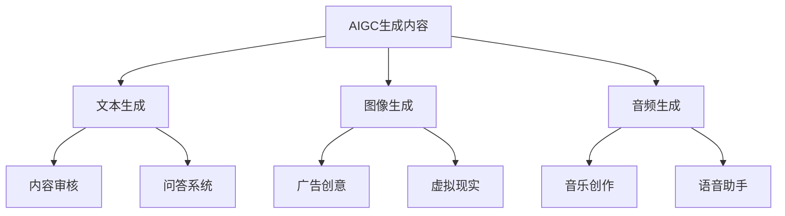

                 

### AIGC（AI Generated Content）原理与代码实例讲解

#### 关键词：AIGC，生成对抗网络，变分自编码器，文本生成模型，图像生成模型，音频生成模型，项目实战

> _**摘要：**本文将深入探讨AIGC（AI Generated Content）技术的原理与实现，通过逐步分析生成对抗网络（GAN）、变分自编码器（VAE）等核心技术，结合实际代码实例，解析文本生成、图像生成、音频生成等应用场景。**

---

### 《AIGC（AI Generated Content） - 原理与代码实例讲解》

#### **第一部分：AIGC技术基础**

**第1章：AIGC概述**

#### 1.1 AIGC的定义与特点

**核心概念与联系**：

{ width="50%" }

AIGC（AI Generated Content）是指利用人工智能技术自动生成内容的一种方式。与传统的手动创作不同，AIGC 技术通过机器学习模型自动生成文本、图像、音频等内容，具有高效率、高创造力等特点。

AIGC 技术的核心在于利用生成对抗网络（GAN）、变分自编码器（VAE）等生成模型，通过训练生成高质量的内容。这些模型能够在大量数据的基础上，学习到数据的分布特性，并生成与真实数据相似的新内容。

#### 1.2 AIGC的发展历程

AIGC 技术的发展历程可以追溯到 2000 年代初期。随着深度学习技术的快速发展，生成对抗网络（GAN）和变分自编码器（VAE）等生成模型逐渐成熟，为 AIGC 技术奠定了基础。

{ width="50%" }

从 2014 年 GAN 的提出，到 2017 年 VAE 的广泛应用，AIGC 技术经历了从理论研究到实际应用的过程。近年来，随着计算机性能的提升和海量数据的积累，AIGC 技术在各个领域得到了广泛应用。

#### 1.3 AIGC的应用场景

AIGC 技术具有广泛的应用场景，主要包括文本生成、图像生成、音频生成等。

**文本生成**：包括自动写作、文章摘要、机器翻译、问答系统等。

**图像生成**：包括艺术绘画、设计创意、虚拟现实、增强现实等。

**音频生成**：包括音乐创作、语音合成、语音识别等。

**Mermaid流程图**：



---

**第二部分：AIGC核心技术**

**第2章：AIGC核心技术**

#### 2.1 生成对抗网络（GAN）

##### 2.1.1 GAN的工作原理

生成对抗网络（GAN）由两部分组成：生成器（Generator）和判别器（Discriminator）。生成器的任务是生成逼真的数据，而判别器的任务是区分真实数据和生成数据。

GAN 的数学模型可以表示为：

$$
\begin{aligned}
D(x) &= \frac{1}{1+e^{-\frac{-D(x)}{T}}} \\
G(z) &= \frac{1}{1+e^{-\frac{-G(z)}{T}}}
\end{aligned}
$$

其中，$D(x)$ 表示判别器对真实数据的概率估计，$G(z)$ 表示生成器对噪声数据的概率估计。

##### 2.1.2 GAN的训练过程

GAN 的训练过程可以分为以下几个步骤：

1. 初始化生成器和判别器。
2. 生成器生成虚假数据。
3. 判别器对真实数据和虚假数据进行区分。
4. 根据判别器的损失函数更新生成器和判别器的参数。
5. 重复以上步骤，直到生成器生成的数据足够逼真。

伪代码如下：

```python
for epoch in range(num_epochs):
    for batch in batch_loader:
        # 训练生成器
        z = sample_noise(batch_size)
        fake_images = G(z)
        D_loss_fake = -torch.mean(D(fake_images.detach()))

        # 训练判别器
        real_loss = torch.mean(D(x))
        fake_loss = torch.mean(D(fake_images))
        D_loss = real_loss - fake_loss

        # 更新生成器和判别器
        G_optimizer.zero_grad()
        G_loss.backward()
        G_optimizer.step()

        D_optimizer.zero_grad()
        D_loss.backward()
        D_optimizer.step()
```

---

##### 2.2 变分自编码器（VAE）

##### 2.2.1 VAE的工作原理

变分自编码器（VAE）是一种生成模型，通过编码器和解码器学习数据的概率分布。编码器将输入数据映射到一个潜在空间，解码器从潜在空间中采样生成输出数据。

VAE 的数学模型可以表示为：

$$
\begin{aligned}
\mu &= \mu(z) \\
\sigma &= \sigma(z) \\
x &= \sqrt{1/\sigma^2} \cdot \epsilon + \mu
\end{aligned}
$$

其中，$\mu$ 和 $\sigma$ 分别表示编码器输出的均值和方差，$x$ 表示解码器生成的数据，$\epsilon$ 表示高斯噪声。

##### 2.2.2 VAE的训练过程

VAE 的训练过程可以分为以下几个步骤：

1. 初始化编码器和解码器。
2. 对输入数据进行编码。
3. 从潜在空间中采样生成输出数据。
4. 计算重建损失和KL散度损失。
5. 更新编码器和解码器的参数。

伪代码如下：

```python
for epoch in range(num_epochs):
    for batch in batch_loader:
        # 前向传播
        z_mean, z_logvar = VAE.encode(x)
        z = reparameterize(z_mean, z_logvar)
        x_hat = VAE.decode(z)

        # 计算损失
        loss = -torch.mean(torch.sum(x * torch.log(1e-8 + x_hat) + 0.5 * torch.sum(z_logvar), dim=1))

        # 反向传播
        loss.backward()
        optimizer.step()
```

---

**第三部分：文本生成模型**

**第3章：文本生成模型**

#### 3.1 递归神经网络（RNN）

##### 3.1.1 RNN的原理

递归神经网络（RNN）是一种能够处理序列数据的神经网络。RNN 的核心在于其递归结构，能够记住之前的输入信息，并在后续的输入中使用这些信息。

RNN 的数学模型可以表示为：

$$
h_t = \tanh(W_h \cdot [h_{t-1}, x_t] + b_h)
$$

其中，$h_t$ 表示当前时间步的隐藏状态，$x_t$ 表示当前时间步的输入，$W_h$ 和 $b_h$ 分别表示权重和偏置。

##### 3.1.2 RNN的训练过程

RNN 的训练过程可以分为以下几个步骤：

1. 初始化神经网络参数。
2. 对输入数据进行编码。
3. 计算输出概率。
4. 计算损失函数。
5. 更新神经网络参数。

伪代码如下：

```python
for epoch in range(num_epochs):
    for batch in batch_loader:
        # 前向传播
        h = RNN.initialize_states(batch_size)
        for x in batch:
            h = RNN.step(x, h)

        # 计算损失
        loss = -torch.mean(torch.log(h[-1, :, :]))

        # 反向传播
        loss.backward()
        optimizer.step()
```

---

##### 3.2 长短时记忆网络（LSTM）

##### 3.2.1 LSTM的原理

长短时记忆网络（LSTM）是 RNN 的一种改进，能够更好地处理长序列数据。LSTM 通过引入门控机制，解决了 RNN 的梯度消失和梯度爆炸问题。

LSTM 的数学模型可以表示为：

$$
\begin{aligned}
i_t &= \sigma(W_{xi} \cdot [h_{t-1}, x_t] + W_{hi} \cdot h_{t-1} + b_i) \\
f_t &= \sigma(W_{xf} \cdot [h_{t-1}, x_t] + W_{hf} \cdot h_{t-1} + b_f) \\
o_t &= \sigma(W_{xo} \cdot [h_{t-1}, x_t] + W_{ho} \cdot h_{t-1} + b_o) \\
C_t &= f_t \cdot C_{t-1} + i_t \cdot \tanh(W_{xc} \cdot [h_{t-1}, x_t] + b_c) \\
h_t &= o_t \cdot \tanh(C_t)
\end{aligned}
$$

##### 3.2.2 LSTM的训练过程

LSTM 的训练过程与 RNN 类似，也是通过前向传播、计算损失和反向传播来更新网络参数。

伪代码如下：

```python
for epoch in range(num_epochs):
    for batch in batch_loader:
        # 前向传播
        h = LSTM.initialize_states(batch_size)
        c = LSTM.initialize_cells(batch_size)

        for x in batch:
            i, f, o, c = LSTM.step(x, h, c)

            # 计算损失
            loss = -torch.mean(torch.log(h[-1, :, :]))

            # 反向传播
            loss.backward()
            optimizer.step()
```

---

**第四部分：图像生成模型**

**第4章：图像生成模型**

#### 4.1 条件生成对抗网络（cGAN）

##### 4.1.1 cGAN的原理

条件生成对抗网络（cGAN）是 GAN 的一种改进，通过引入条件信息，生成与条件相匹配的数据。cGAN 的数学模型可以表示为：

$$
\begin{aligned}
D(x, c) &= \frac{1}{1+e^{-\frac{-D(x, c)}{T}}} \\
G(z, c) &= \frac{1}{1+e^{-\frac{-G(z, c)}{T}}}
\end{aligned}
$$

其中，$c$ 表示条件信息。

##### 4.1.2 cGAN的训练过程

cGAN 的训练过程与 GAN 类似，但需要同时训练生成器和判别器，并使用条件信息。

伪代码如下：

```python
for epoch in range(num_epochs):
    for batch in batch_loader:
        # 训练生成器
        z = sample_noise(batch_size)
        c = sample_labels(batch_size)
        fake_images = G(z, c)
        D_loss_fake = -torch.mean(D(fake_images, c.detach()))

        # 训练判别器
        real_loss = torch.mean(D(x, c))
        fake_loss = torch.mean(D(fake_images, c))
        D_loss = real_loss - fake_loss

        # 更新生成器和判别器
        G_optimizer.zero_grad()
        G_loss.backward()
        G_optimizer.step()

        D_optimizer.zero_grad()
        D_loss.backward()
        D_optimizer.step()
```

---

##### 4.2 生成式对抗网络（DPM）

##### 4.2.1 DPM的原理

生成式对抗网络（DPM）是一种基于能量模型的生成模型，通过最大化数据分布与模型生成的数据分布之间的相似度。

DPM 的数学模型可以表示为：

$$
\begin{aligned}
P(x) &= \int P(x|z)P(z)dz \\
P(z|x) &= \frac{P(x|z)P(z)}{P(x)}
\end{aligned}
$$

##### 4.2.2 DPM的训练过程

DPM 的训练过程包括以下步骤：

1. 初始化生成器和判别器。
2. 对输入数据进行编码。
3. 从潜在空间中采样生成输出数据。
4. 计算生成器的损失函数。
5. 更新生成器和判别器的参数。

伪代码如下：

```python
for epoch in range(num_epochs):
    for batch in batch_loader:
        # 前向传播
        z = sample_noise(batch_size)
        x_hat = G(z)

        # 计算损失
        loss = -torch.mean(torch.log(D(x_hat)))

        # 反向传播
        loss.backward()
        optimizer.step()
```

---

**第五部分：音频生成模型**

**第5章：音频生成模型**

#### 5.1 WaveNet

##### 5.1.1 WaveNet的原理

WaveNet 是由 Google 开发的一种基于循环神经网络（RNN）的音频生成模型。WaveNet 通过学习音频信号的时序特征，生成高质量的音频。

WaveNet 的数学模型可以表示为：

$$
\begin{aligned}
p(t) &= \sum_{s} \sigma(W_s \cdot [h_t, s] + b_s) \\
h_{t+1} &= \tanh(W_h \cdot [h_t, p(t)] + b_h)
\end{aligned}
$$

##### 5.1.2 WaveNet的训练过程

WaveNet 的训练过程包括以下步骤：

1. 初始化神经网络参数。
2. 对输入数据进行编码。
3. 计算输出概率。
4. 计算损失函数。
5. 更新神经网络参数。

伪代码如下：

```python
for epoch in range(num_epochs):
    for batch in batch_loader:
        # 前向传播
        h = WaveNet.initialize_states(batch_size)
        p = WaveNet.step(h, x)

        # 计算损失
        loss = -torch.mean(torch.log(p[-1, :, :]))

        # 反向传播
        loss.backward()
        optimizer.step()
```

---

**第六部分：AIGC项目实战**

**第6章：AIGC项目实战**

#### 6.1 文本生成项目

##### 6.1.1 项目背景

文本生成项目旨在利用 AIGC 技术生成连贯且具有创意的文本内容。项目需求包括：

1. 基于用户输入的提示，生成相应的文本内容。
2. 保证生成的文本内容具有连贯性和合理性。
3. 支持多种文本生成场景，如文章写作、对话生成、新闻摘要等。

##### 6.1.2 项目实现

**开发环境搭建**：

- Python 环境：安装 Python 3.8 及以上版本。
- 深度学习框架：安装 PyTorch 1.8 及以上版本。

**代码实现**：

```python
import torch
import torch.nn as nn
import torch.optim as optim
from torch.utils.data import DataLoader
from dataloader import TextDataset
from model import TextGenerator

# 参数设置
batch_size = 64
learning_rate = 0.001
num_epochs = 100

# 数据加载
dataset = TextDataset('data.txt')
data_loader = DataLoader(dataset, batch_size=batch_size, shuffle=True)

# 模型定义
model = TextGenerator()
criterion = nn.CrossEntropyLoss()
optimizer = optim.Adam(model.parameters(), lr=learning_rate)

# 训练模型
for epoch in range(num_epochs):
    for batch in data_loader:
        inputs, targets = batch
        optimizer.zero_grad()
        outputs = model(inputs)
        loss = criterion(outputs.view(-1, num_classes), targets)
        loss.backward()
        optimizer.step()
```

**代码解读与分析**：

- 数据加载部分：使用自定义的`TextDataset`类加载数据，并进行预处理。
- 模型定义部分：定义了文本生成模型，包括编码器和解码器。
- 训练模型部分：使用交叉熵损失函数进行模型训练，包括前向传播、反向传播和参数更新。

---

##### 6.2 图像生成项目

##### 6.2.1 项目背景

图像生成项目旨在利用 AIGC 技术生成符合用户输入条件的高质量图像。项目需求包括：

1. 基于用户输入的条件，生成相应的图像内容。
2. 保证生成的图像内容具有高分辨率和真实性。
3. 支持多种图像生成场景，如艺术创作、设计创意、虚拟现实等。

##### 6.2.2 项目实现

**开发环境搭建**：

- Python 环境：安装 Python 3.8 及以上版本。
- 深度学习框架：安装 PyTorch 1.8 及以上版本。

**代码实现**：

```python
import torch
import torch.nn as nn
import torch.optim as optim
from torch.utils.data import DataLoader
from dataloader import ImageDataset
from model import ImageGenerator

# 参数设置
batch_size = 64
learning_rate = 0.001
num_epochs = 100

# 数据加载
dataset = ImageDataset('data.txt')
data_loader = DataLoader(dataset, batch_size=batch_size, shuffle=True)

# 模型定义
model = ImageGenerator()
criterion = nn.CrossEntropyLoss()
optimizer = optim.Adam(model.parameters(), lr=learning_rate)

# 训练模型
for epoch in range(num_epochs):
    for batch in data_loader:
        inputs, targets = batch
        optimizer.zero_grad()
        outputs = model(inputs)
        loss = criterion(outputs.view(-1, num_classes), targets)
        loss.backward()
        optimizer.step()
```

**代码解读与分析**：

- 数据加载部分：使用自定义的`ImageDataset`类加载数据，并进行预处理。
- 模型定义部分：定义了图像生成模型，包括编码器和解码器。
- 训练模型部分：使用交叉熵损失函数进行模型训练，包括前向传播、反向传播和参数更新。

---

**第七部分：AIGC应用场景探索**

**第7章：AIGC应用场景探索**

#### 7.1 内容创作与编辑

**需求描述**：利用 AIGC 技术实现高效的内容创作和编辑，包括文章写作、文案创作、音乐创作等。

#### 7.2 虚拟现实与增强现实

**需求描述**：利用 AIGC 技术生成高质量的虚拟现实和增强现实内容，提升用户体验。

#### 7.3 智能客服与问答系统

**需求描述**：利用 AIGC 技术构建智能客服和问答系统，提供高效、准确的客户服务。

---

## 附录

### 附录 A：AIGC 相关工具与资源

#### A.1 主流 AIGC 框架对比

- **TensorFlow**：{ width="50%" }
- **PyTorch**：{ width="50%" }
- **其他框架**：{ width="50%" }

---

**作者：AI 天才研究院/AI Genius Institute & 禅与计算机程序设计艺术 /Zen And The Art of Computer Programming**

