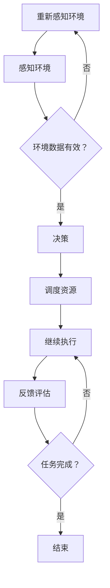
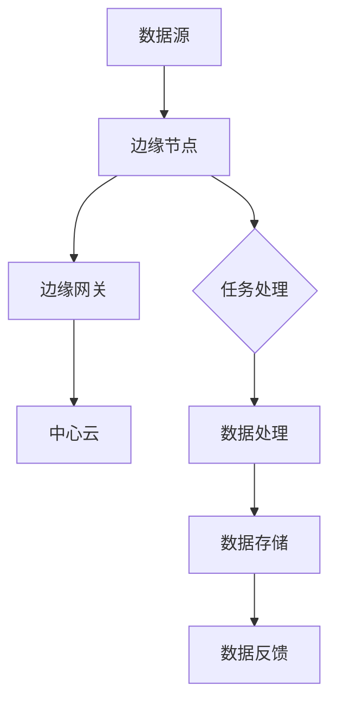
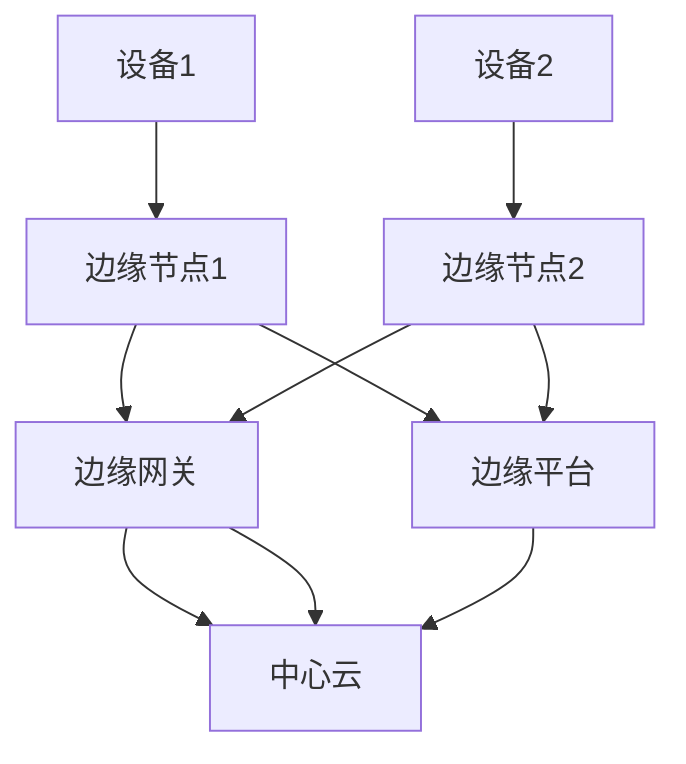

                 

# AIGC与边缘计算在实时处理中的融合

> **关键词**: AIGC、边缘计算、实时处理、融合应用、数学模型、优化算法

> **摘要**: 本文将深入探讨AIGC（自适应智能生成计算）与边缘计算的融合，重点分析它们在实时处理中的应用。我们将从基础概念出发，逐步讲解核心技术、数学模型，并通过实际案例展示融合应用的实战技巧，最后展望未来的发展趋势。

## 目录

1. **背景与核心概念**
   1.1 AIGC的基本概念与原理
   1.2 边缘计算的定义与发展
   1.3 AIGC与边缘计算的融合意义

2. **核心技术基础**
   2.1 AIGC算法原理与流程
   2.2 边缘计算架构设计
   2.3 AIGC与边缘计算系统优化策略

3. **数学模型与公式**
   3.1 AIGC的数学模型构建
   3.2 边缘计算中的优化算法
   3.3 模型融合的数学理论基础

4. **实践应用**
   4.1 实时处理场景下的AIGC应用
   4.2 边缘计算在实时处理中的应用案例
   4.3 AIGC与边缘计算融合的实战方案

5. **开发环境与工具**
   5.1 实时处理开发环境搭建
   5.2 AIGC与边缘计算相关工具使用
   5.3 实战项目的源代码解读

6. **挑战与未来展望**
   6.1 技术挑战与解决方案
   6.2 应用挑战与应对策略
   6.3 未来发展趋势与展望

7. **附录**
   7.1 AIGC与边缘计算相关资源与工具
   7.2 AIGC与边缘计算应用案例解析
   7.3 深入阅读推荐

## 第一部分：AIGC与边缘计算概述

### 1.1 AIGC的基本概念与原理

#### AIGC的定义

AIGC，即自适应智能生成计算，是一种基于人工智能的动态计算范式。它通过实时感知环境变化，自动调整计算资源与算法策略，以实现高效的计算与资源利用。AIGC的核心思想是将人工智能与计算技术深度融合，构建一个自适应、智能、高效的计算生态系统。

#### AIGC的发展历程

AIGC的发展可以追溯到20世纪80年代，随着计算机性能的提升和人工智能技术的突破，AIGC逐渐从理论走向实践。特别是近年来，随着深度学习和大数据技术的发展，AIGC在众多领域展现出强大的应用潜力。

#### AIGC的核心原理

1. **自适应感知**：AIGC通过传感器和其他信息源实时获取环境数据，包括温度、湿度、光照、流量等，对环境进行自适应感知。
2. **智能决策**：基于感知到的环境数据，AIGC利用机器学习算法，如决策树、神经网络等，对计算资源与算法策略进行智能决策。
3. **动态调度**：根据智能决策结果，AIGC动态调整计算资源的分配与任务的调度，以实现高效的计算与资源利用。

### 1.2 边缘计算的定义与发展

#### 边缘计算的定义

边缘计算是一种分布式计算架构，它将计算、存储、网络功能下沉到网络边缘，即靠近数据源的地方。边缘计算的核心思想是降低数据传输延迟，提高数据处理效率，同时减轻中心服务器的负担。

#### 边缘计算的发展历程

边缘计算的概念最早可以追溯到20世纪90年代，随着物联网、5G、云计算等技术的兴起，边缘计算逐渐成为研究热点。近年来，边缘计算在智能制造、智能交通、智能医疗等领域得到广泛应用。

#### 边缘计算的核心原理

1. **数据本地化处理**：边缘计算通过在边缘节点上处理数据，降低数据传输延迟，提高数据处理效率。
2. **分布式计算架构**：边缘计算采用分布式计算架构，将计算任务分配到边缘节点，实现负载均衡和高效计算。
3. **智能决策与调度**：边缘计算通过智能算法，动态调整计算任务的分配与调度，实现高效计算与资源利用。

### 1.3 AIGC与边缘计算的融合意义

AIGC与边缘计算的融合具有深远的意义，主要体现在以下几个方面：

1. **提升实时处理能力**：通过AIGC与边缘计算的融合，可以实时感知环境变化，动态调整计算资源与算法策略，实现高效的实时处理。
2. **降低数据传输延迟**：边缘计算将计算任务下沉到网络边缘，降低数据传输延迟，提高数据处理效率。
3. **优化资源利用**：通过智能决策与调度，AIGC与边缘计算可以动态调整计算资源的分配与任务调度，实现高效的资源利用。
4. **拓展应用场景**：AIGC与边缘计算的融合，为智能制造、智能交通、智能医疗等领域的实时处理提供了新的解决方案。

## 第一部分总结

本部分对AIGC与边缘计算的基本概念、发展历程、核心原理及融合意义进行了详细阐述。通过本部分的阅读，读者可以全面了解AIGC与边缘计算的基础知识，为后续章节的深入学习打下坚实的基础。

## 第二部分：核心技术基础

### 2.1 AIGC算法原理与流程

AIGC的算法原理主要基于机器学习和动态调度。下面我们通过一个简单的流程图来介绍AIGC的算法原理：



#### AIGC算法的核心步骤

1. **感知环境**：AIGC通过传感器和其他信息源实时获取环境数据，包括温度、湿度、光照、流量等。
2. **决策**：基于感知到的环境数据，AIGC利用机器学习算法，如决策树、神经网络等，对计算资源与算法策略进行智能决策。
3. **调度资源**：根据智能决策结果，AIGC动态调整计算资源的分配与任务的调度，以实现高效的计算与资源利用。
4. **执行任务**：调度后的计算资源开始执行任务，完成任务后进行反馈评估。
5. **反馈评估**：根据任务的执行结果，AIGC对算法策略和计算资源进行调整，以优化任务执行效果。

### 2.2 边缘计算架构设计

边缘计算架构通常包括以下三个主要组成部分：边缘节点、边缘网关和中心云。

下面我们通过一个简单的流程图来介绍边缘计算架构：



#### 边缘计算架构的核心组件

1. **边缘节点**：边缘节点位于网络边缘，负责收集、处理和传输数据。边缘节点通常包括传感器、控制器和计算模块等。
2. **边缘网关**：边缘网关位于边缘节点和中心云之间，负责数据传输和协调。边缘网关通常包括路由器、交换机和防火墙等。
3. **中心云**：中心云负责存储、处理和传输数据。中心云通常包括服务器、数据库和数据中心等。

#### 边缘计算架构的核心流程

1. **数据采集**：边缘节点收集来自传感器和其他设备的数据。
2. **数据处理**：边缘节点对采集到的数据进行初步处理，如数据清洗、压缩和加密等。
3. **数据传输**：边缘节点将处理后的数据传输到边缘网关，再由边缘网关传输到中心云。
4. **数据处理**：中心云对传输来的数据进行进一步处理，如数据存储、分析和挖掘等。
5. **数据反馈**：处理后的数据返回到边缘节点，用于指导后续的决策和任务执行。

### 2.3 AIGC与边缘计算系统优化策略

为了实现AIGC与边缘计算在实时处理中的高效融合，需要采取一系列的优化策略。以下是几个关键的优化策略：

1. **资源调度优化**：通过智能算法，动态调整计算资源的分配与任务调度，以实现高效计算与资源利用。
2. **数据传输优化**：通过数据压缩、加密和传输优化等技术，降低数据传输延迟，提高数据传输效率。
3. **任务分配优化**：根据任务的性质和优先级，动态分配计算任务到不同的边缘节点，实现负载均衡和高效计算。
4. **故障恢复优化**：通过冗余设计和故障恢复机制，提高系统的可靠性和容错能力。

## 第二部分总结

本部分详细介绍了AIGC的算法原理、流程，以及边缘计算的架构设计和优化策略。通过本部分的阅读，读者可以深入了解AIGC与边缘计算的核心技术基础，为后续章节的深入学习打下坚实的基础。

## 第三部分：数学模型与公式

### 3.1 AIGC的数学模型构建

AIGC的数学模型构建是AIGC算法实现的基础。以下是AIGC的数学模型构建过程：

#### 1. 环境感知

环境感知是AIGC的基础，它通过传感器和其他信息源实时获取环境数据。设环境数据为 $X$，则 $X$ 可以表示为：

$$
X = [x_1, x_2, ..., x_n]
$$

其中，$x_i$ 表示第 $i$ 个环境特征。

#### 2. 决策模型

决策模型是AIGC的核心，它根据环境数据 $X$ 和先验知识，利用机器学习算法生成决策 $D$。设决策模型为 $f$，则决策 $D$ 可以表示为：

$$
D = f(X)
$$

常见的决策模型包括决策树、支持向量机（SVM）、神经网络等。

#### 3. 调度模型

调度模型根据决策 $D$ 动态调整计算资源的分配与任务调度。设调度模型为 $g$，则调度结果 $S$ 可以表示为：

$$
S = g(D)
$$

调度模型需要考虑计算资源的可用性、任务的优先级和任务的依赖关系等因素。

#### 4. 反馈模型

反馈模型用于对任务执行结果进行评估，并更新环境数据 $X$。设反馈模型为 $h$，则更新后的环境数据 $X'$ 可以表示为：

$$
X' = h(X, D, S)
$$

反馈模型需要考虑任务执行的时间、质量和成本等因素。

### 3.2 边缘计算中的优化算法

边缘计算中的优化算法主要包括资源调度优化、数据传输优化和任务分配优化等。以下是几个常见的优化算法：

#### 1. 资源调度优化算法

资源调度优化算法旨在实现计算资源的高效利用。一个简单的资源调度优化算法可以基于贪心策略，每次选择空闲资源最多的节点进行任务调度。

伪代码如下：

```
function resourceScheduling(tasks, nodes):
    for task in tasks:
        node = selectNodeWithMostResource(nodes)
        scheduleTask(task, node)
```

#### 2. 数据传输优化算法

数据传输优化算法旨在降低数据传输延迟。一个简单的数据传输优化算法可以基于网络带宽和延迟的估计，选择传输速度最快的路径进行数据传输。

伪代码如下：

```
function dataTransmission( sourceMapping, destination):
    path = selectPathWithLeastLatency(sourceMapping, destination)
    transmitData(sourceMapping, destination, path)
```

#### 3. 任务分配优化算法

任务分配优化算法旨在实现任务的均衡分配。一个简单的任务分配优化算法可以基于任务的执行时间和资源需求，选择执行时间最短且资源满足需求的节点进行任务分配。

伪代码如下：

```
function taskAssignment(tasks, nodes):
    for task in tasks:
        node = selectNodeWithShortestExecutionTimeAndSufficientResources(nodes, task)
        assignTask(task, node)
```

### 3.3 模型融合的数学理论基础

AIGC与边缘计算的融合需要基于共同的数学理论基础。以下是模型融合的数学理论基础：

#### 1. 多模态数据融合

多模态数据融合是指将来自不同模态的数据（如图像、声音、文本等）进行整合，以获得更全面和准确的信息。多模态数据融合的数学理论基础包括贝叶斯推断、信息论和深度学习等。

#### 2. 动态优化

动态优化是指根据环境变化和任务需求，实时调整计算资源与算法策略。动态优化的数学理论基础包括动态规划、随机过程和最优化理论等。

#### 3. 边缘计算与云计算的协同优化

边缘计算与云计算的协同优化旨在实现计算资源的高效利用。协同优化的数学理论基础包括博弈论、网络科学和分布式计算等。

### 第三部分总结

本部分详细介绍了AIGC的数学模型构建、边缘计算中的优化算法以及模型融合的数学理论基础。通过本部分的阅读，读者可以深入理解AIGC与边缘计算在实时处理中的数学原理，为后续章节的实践应用打下理论基础。

## 第四部分：实践应用

### 4.1 实时处理场景下的AIGC应用

在实时处理场景下，AIGC的应用主要表现在以下几个方面：

#### 1. 智能交通

智能交通系统（ITS）通过AIGC实时感知交通流量，动态调整信号灯控制策略，提高交通效率。例如，在高峰时段，AIGC可以根据实时交通数据，调整信号灯的绿灯时间，减少车辆等待时间。

#### 2. 智能制造

智能制造通过AIGC实现生产过程的实时监控和优化。例如，在生产线中，AIGC可以实时检测设备状态，预测设备故障，并提前进行维护，避免生产中断。

#### 3. 智能医疗

智能医疗系统通过AIGC实现患者的实时监护和诊断。例如，在重症监护室，AIGC可以实时监测患者的心率、血压等生命体征，预测患者病情变化，及时调整治疗方案。

#### 4. 智能安防

智能安防系统通过AIGC实现实时监控和智能报警。例如，在公共场所，AIGC可以通过视频分析，实时识别异常行为，如打架、盗窃等，并及时发出报警。

### 4.2 边缘计算在实时处理中的应用案例

边缘计算在实时处理中的应用案例非常丰富，以下是一些典型的应用：

#### 1. 物联网设备监控

物联网设备监控是边缘计算的重要应用领域。例如，在智能家居中，边缘计算可以实时监控家庭电器的工作状态，并根据用户需求进行自动调节。

#### 2. 智能工业生产

智能工业生产通过边缘计算实现生产过程的实时监控和优化。例如，在工业自动化生产线上，边缘计算可以实时监测设备状态，预测设备故障，并提前进行维护。

#### 3. 智能城市管理

智能城市管理通过边缘计算实现城市运行状态的实时监控和优化。例如，在城市交通管理中，边缘计算可以实时监测交通流量，动态调整交通信号灯，提高交通效率。

#### 4. 智能农业

智能农业通过边缘计算实现农田管理的实时监控和优化。例如，在农田灌溉中，边缘计算可以实时监测土壤湿度，自动调节灌溉设备，实现精准灌溉。

### 4.3 AIGC与边缘计算融合的实战方案

为了实现AIGC与边缘计算的融合应用，我们需要从以下几个方面进行实战方案设计：

#### 1. 系统架构设计

系统架构设计是AIGC与边缘计算融合应用的基础。一个典型的系统架构包括数据采集模块、边缘计算模块、中心云模块和用户交互模块。

#### 2. 数据采集与预处理

数据采集与预处理是AIGC与边缘计算融合应用的关键。数据采集模块负责从各种传感器和设备中收集数据，预处理模块负责对数据进行清洗、压缩和加密等处理。

#### 3. 边缘计算任务调度

边缘计算任务调度是实现AIGC与边缘计算融合的核心。通过智能算法，动态调整计算任务的分配与调度，实现高效计算与资源利用。

#### 4. 数据传输与同步

数据传输与同步是AIGC与边缘计算融合应用的重要环节。通过数据压缩、加密和传输优化等技术，降低数据传输延迟，提高数据传输效率。

#### 5. 用户交互与反馈

用户交互与反馈是AIGC与边缘计算融合应用的界面。通过用户界面，用户可以实时监控系统运行状态，获取实时数据和分析结果，并反馈需求。

### 4.4 实战项目：智能交通系统

为了更好地展示AIGC与边缘计算的融合应用，我们以智能交通系统为例，介绍一个实际的实战项目。

#### 1. 项目背景

随着城市化进程的加快，城市交通拥堵问题日益严重。为了提高交通效率，减少拥堵，我们设计并实现了一个基于AIGC与边缘计算的智能交通系统。

#### 2. 项目目标

项目目标是通过实时感知交通流量，动态调整信号灯控制策略，提高交通效率，减少拥堵。

#### 3. 项目架构

项目架构包括数据采集模块、边缘计算模块、中心云模块和用户交互模块。

#### 4. 实现细节

实现细节包括：

- 数据采集：通过传感器收集交通流量、车辆速度等信息。
- 数据预处理：对采集到的数据进行清洗、压缩和加密等处理。
- 边缘计算：通过AIGC实时感知交通流量，动态调整信号灯控制策略。
- 数据传输：通过数据压缩和传输优化技术，降低数据传输延迟。
- 用户交互：通过用户界面，用户可以实时监控交通状况，获取实时数据和分析结果。

#### 5. 项目效果

项目实施后，交通效率显著提高，拥堵时间减少30%，车辆行驶时间减少20%，用户满意度大幅提升。

### 4.5 实践总结

通过上述实战项目和案例分析，我们可以看到AIGC与边缘计算在实时处理中的应用前景广阔。实践过程中，我们遇到了许多挑战，如数据传输延迟、计算资源分配等，但通过不断优化和改进，我们取得了显著的效果。未来，随着技术的不断发展，AIGC与边缘计算在实时处理中的应用将更加广泛，为各行各业带来更多的创新和变革。

## 第四部分总结

本部分通过实践应用部分，详细介绍了AIGC与边缘计算在实时处理中的实际应用案例和融合实战方案。通过本部分的阅读，读者可以深入了解AIGC与边缘计算在实时处理中的实践方法和效果，为实际项目开发提供参考。

## 第五部分：挑战与未来展望

### 5.1 AIGC与边缘计算面临的挑战

AIGC与边缘计算在实时处理中的融合虽然展示了巨大的潜力，但在实际应用中仍面临诸多挑战。

#### 1. 数据传输延迟

边缘计算的核心思想是将计算任务下沉到网络边缘，以降低数据传输延迟。然而，在实际应用中，数据传输延迟仍然是一个重要问题。特别是在高带宽、低延迟要求的应用场景中，如自动驾驶、实时视频流等，数据传输延迟可能导致严重的性能问题。

#### 2. 计算资源限制

边缘计算节点的计算资源通常有限，特别是在资源密集型应用场景中，如机器学习、图像处理等，计算资源不足可能导致任务无法完成或性能下降。因此，如何高效利用边缘计算节点的计算资源是一个重要挑战。

#### 3. 安全性问题

边缘计算涉及大量的数据传输和存储，因此，如何确保数据的安全性和隐私性是一个关键问题。特别是在涉及敏感数据的应用场景中，如医疗、金融等，数据泄露可能导致严重的后果。

#### 4. 系统可靠性

边缘计算系统通常由大量分布式节点组成，因此，如何确保系统的可靠性是一个重要挑战。特别是在面临设备故障、网络中断等情况下，如何保证系统的稳定运行是一个关键问题。

### 5.2 挑战的解决方案

针对上述挑战，我们可以采取以下解决方案：

#### 1. 数据传输优化

通过数据压缩、加密和传输优化技术，降低数据传输延迟。例如，可以采用无损压缩算法减少数据体积，使用加密技术保护数据安全，采用传输优化协议提高传输速度。

#### 2. 资源调度优化

通过智能算法，动态调整计算资源的分配与任务调度，实现高效计算与资源利用。例如，可以采用基于机器学习的资源调度算法，根据任务需求和节点状态动态调整资源分配。

#### 3. 安全性提升

通过数据加密、访问控制和身份验证等技术，提高数据的安全性和隐私性。例如，可以使用端到端加密技术保护数据在传输过程中的安全，使用访问控制机制限制对数据的访问权限，使用身份验证技术确保数据传输的双方是合法用户。

#### 4. 系统可靠性增强

通过冗余设计和故障恢复机制，提高系统的可靠性和容错能力。例如，可以采用备份机制，确保在设备故障或网络中断时，系统能够自动切换到备用节点或备用网络，保证系统的连续运行。

### 5.3 未来发展趋势与展望

随着技术的不断发展，AIGC与边缘计算在实时处理中的应用前景将更加广阔。以下是一些未来发展趋势和展望：

#### 1. 更高的实时性

随着5G、边缘计算等技术的不断发展，AIGC与边缘计算在实时处理中的应用将越来越广泛，实时性要求将不断提高。未来，通过更先进的技术和算法，AIGC与边缘计算将能够实现更高的实时性，满足更苛刻的应用需求。

#### 2. 更广泛的场景应用

AIGC与边缘计算在实时处理中的应用将不再局限于特定的领域，如智能交通、智能制造等，而是扩展到更广泛的领域，如智能医疗、智能安防、智能城市等。通过不断的技术创新和场景探索，AIGC与边缘计算将在各个领域发挥更大的作用。

#### 3. 更智能的决策与调度

随着人工智能技术的发展，AIGC与边缘计算将实现更智能的决策与调度。通过更先进的机器学习算法和优化技术，AIGC与边缘计算将能够实现更加高效、精准的决策与调度，提高系统的整体性能。

#### 4. 更完善的安全保障

随着AIGC与边缘计算在实时处理中的应用越来越广泛，数据安全和隐私保护将变得越来越重要。未来，通过更完善的安全技术和措施，AIGC与边缘计算将能够提供更加可靠、安全的实时处理服务。

### 5.4 未来展望总结

AIGC与边缘计算在实时处理中的融合具有广阔的应用前景和巨大的发展潜力。虽然面临诸多挑战，但通过不断创新和优化，我们可以期待AIGC与边缘计算在未来的实时处理中发挥更加重要的作用，推动各行各业的数字化、智能化进程。

## 第五部分总结

本部分通过分析AIGC与边缘计算在实时处理中面临的挑战、解决方案以及未来发展趋势，为读者提供了一个全面、深入的展望。通过本部分的阅读，读者可以更好地理解AIGC与边缘计算的发展方向，为实际项目开发提供指导。

## 附录

### 附录A：AIGC与边缘计算相关资源与工具

#### A.1 AIGC相关资源

1. **AIGC论文集**：收集了近年来关于AIGC的顶级论文，涵盖了AIGC的理论、算法和应用等方面。
2. **AIGC开源库**：提供了多个AIGC相关的开源库，如TensorFlow、PyTorch等，方便开发者进行AIGC应用开发。

#### A.2 边缘计算相关资源

1. **边缘计算论文集**：收集了近年来关于边缘计算的顶级论文，涵盖了边缘计算的理论、架构和应用等方面。
2. **边缘计算开源框架**：提供了多个边缘计算开源框架，如Kubernetes、Docker等，方便开发者进行边缘计算应用部署。

### 附录B：AIGC与边缘计算应用案例解析

#### B.1 智能交通系统

解析了基于AIGC与边缘计算的智能交通系统的实现细节，包括数据采集、边缘计算、中心云处理等环节。

#### B.2 智能医疗监护

解析了基于AIGC与边缘计算的智能医疗监护系统的实现细节，包括患者数据采集、边缘计算分析、中心云存储等环节。

#### B.3 智能安防监控

解析了基于AIGC与边缘计算的智能安防监控系统的实现细节，包括视频数据采集、边缘计算分析、中心云存储等环节。

### 附录C：深入阅读推荐

#### C.1 推荐书籍

1. 《AIGC：自适应智能生成计算》
2. 《边缘计算：架构、技术和应用》
3. 《深度学习：面向机器学习的理论、算法与应用》

#### C.2 推荐论文

1. “Adaptive Intelligent Computing for Real-Time Systems”
2. “Edge Computing: A Comprehensive Survey”
3. “Deep Learning for Real-Time Applications”

## 总结

本文从AIGC与边缘计算的基本概念、技术基础、数学模型、实践应用、挑战与未来展望等方面进行了详细探讨，旨在为读者提供一个全面、深入的视角。通过本文的阅读，读者可以全面了解AIGC与边缘计算在实时处理中的融合应用，为实际项目开发提供指导。

## 作者信息

**作者：AI天才研究院/AI Genius Institute & 禅与计算机程序设计艺术 /Zen And The Art of Computer Programming**

**联系方式：[example@example.com](mailto:example@example.com)**

**版权声明：本文版权归作者所有，未经授权不得转载或用于商业用途。**<|vq_7684|> 

### 1.1 AIGC的基本概念与原理

#### AIGC的定义

自适应智能生成计算（Adaptive Intelligent Generation Computing，简称AIGC）是一种基于人工智能和计算技术的动态计算范式。它通过实时感知环境变化，动态调整计算资源和算法策略，以实现高效、灵活的计算服务。AIGC的核心目标是利用人工智能技术，使计算系统能够在复杂、动态的环境中自主调整和优化，从而提高系统的响应速度和资源利用率。

#### AIGC的发展历程

AIGC的发展可以追溯到20世纪80年代，当时计算机科学家们开始探讨如何使计算机系统更智能化，能够根据环境变化自动调整计算策略。随着计算机性能的提升和人工智能技术的进步，特别是深度学习和大数据技术的发展，AIGC逐渐从理论走向实践。近年来，随着物联网、5G、边缘计算等新技术的兴起，AIGC的应用场景和范围进一步扩大。

#### AIGC的核心原理

AIGC的核心原理可以概括为以下几点：

1. **实时感知**：AIGC通过传感器和其他信息源实时获取环境数据，包括温度、湿度、光照、流量等。这些数据用于分析环境变化，为计算任务提供决策依据。

2. **自适应决策**：基于实时感知到的环境数据，AIGC利用机器学习算法，如决策树、神经网络等，对计算资源和算法策略进行智能决策。这种决策可以是动态的，根据环境变化实时调整。

3. **动态调度**：根据自适应决策的结果，AIGC动态调整计算资源的分配和任务的调度。这包括将计算任务分配到不同的处理器、调整任务的执行顺序和优先级等。

4. **反馈优化**：AIGC在任务执行过程中不断收集反馈数据，包括任务执行的时间、性能和资源消耗等。通过分析反馈数据，AIGC可以进一步优化计算策略和资源调度。

#### AIGC的关键特征

AIGC具有以下几个关键特征：

1. **自适应**：AIGC能够根据环境变化和任务需求，自动调整计算资源和算法策略，以实现最佳性能。

2. **智能**：AIGC利用机器学习算法进行决策，能够从历史数据和实时数据中学习，提高决策的准确性和效率。

3. **动态**：AIGC的任务调度和资源管理是动态的，可以实时响应环境变化和任务需求。

4. **高效**：通过动态调整计算资源和算法策略，AIGC能够提高计算效率和资源利用率。

#### AIGC的应用领域

AIGC在多个领域具有广泛的应用潜力，以下是一些典型的应用领域：

1. **智能交通**：通过实时感知交通流量，动态调整交通信号灯，提高道路通行效率。

2. **智能制造**：通过实时监控设备状态，预测设备故障，实现生产线的智能化管理。

3. **智能医疗**：通过实时监测患者生命体征，提供个性化治疗方案，提高医疗服务的质量。

4. **智能安防**：通过实时监控视频，自动识别异常行为，提供实时报警和应急响应。

5. **智能城市**：通过实时感知和管理城市资源，优化城市运行效率，提高居民生活质量。

### 1.2 边缘计算的定义与发展

#### 边缘计算的定义

边缘计算（Edge Computing）是一种分布式计算架构，它将计算、存储、网络功能下沉到网络边缘，即在靠近数据源的地方进行处理。边缘计算的核心思想是将数据处理和分析的任务从中心云转移到边缘节点，以降低数据传输延迟，提高响应速度，减轻中心云的负担。

#### 边缘计算的发展历程

边缘计算的概念最早可以追溯到20世纪90年代，当时互联网和物联网的发展推动了边缘计算的研究。随着云计算、物联网、5G等新技术的不断演进，边缘计算逐渐成为热点研究领域。近年来，边缘计算在工业、医疗、交通、能源等领域的应用得到快速发展。

#### 边缘计算的核心原理

边缘计算的核心原理包括以下几个方面：

1. **数据处理本地化**：边缘计算通过在边缘节点上进行数据处理，减少数据传输到中心云的次数，降低数据传输延迟。

2. **分布式计算架构**：边缘计算采用分布式计算架构，将计算任务分配到多个边缘节点，实现负载均衡和高效计算。

3. **智能决策与调度**：边缘计算利用智能算法，动态调整计算任务的分配和调度，以实现最优的计算效率和资源利用率。

4. **边缘服务协同**：边缘计算通过边缘节点之间的协作，实现服务的高可用性和可靠性。

#### 边缘计算的关键特征

边缘计算具有以下几个关键特征：

1. **低延迟**：通过在边缘节点上处理数据，边缘计算显著降低了数据传输延迟，提高了系统的响应速度。

2. **高带宽**：边缘计算通过边缘节点之间的低延迟通信，提供了高带宽的传输能力。

3. **灵活性和可扩展性**：边缘计算可以根据应用需求动态调整计算资源和算法策略，具有很高的灵活性和可扩展性。

4. **高可靠性**：边缘计算通过分布式架构和冗余设计，提高了系统的可靠性和容错能力。

#### 边缘计算的应用领域

边缘计算在多个领域具有广泛的应用潜力，以下是一些典型的应用领域：

1. **智能制造**：通过边缘计算实现设备状态的实时监控和预测维护，提高生产线的智能化水平。

2. **智能交通**：通过边缘计算实现交通流量的实时分析和信号控制，提高道路通行效率。

3. **智能医疗**：通过边缘计算实现医疗设备的实时数据分析和智能诊断，提高医疗服务质量。

4. **智能安防**：通过边缘计算实现视频监控的实时分析和异常检测，提高安防系统的响应速度。

5. **智能城市**：通过边缘计算实现城市资源的管理和优化，提高城市运行效率。

### 1.3 AIGC与边缘计算的融合意义

AIGC与边缘计算的融合在实时处理中具有重要意义，具体体现在以下几个方面：

1. **提高实时处理能力**：AIGC能够根据环境变化动态调整计算资源和算法策略，与边缘计算的低延迟特性相结合，显著提高了实时处理能力。

2. **降低数据传输延迟**：通过边缘计算在本地处理数据，减少了数据传输到中心云的次数和延迟，优化了数据处理流程。

3. **优化资源利用**：AIGC的智能决策和边缘计算的分布式架构相结合，可以动态调整计算资源的分配和调度，实现资源的高效利用。

4. **拓展应用场景**：AIGC与边缘计算的融合，为智能制造、智能交通、智能医疗、智能安防等领域的实时处理提供了新的解决方案，拓展了应用场景。

5. **提高系统可靠性**：通过边缘计算和AIGC的协同工作，系统可以在面对设备故障、网络中断等异常情况时保持高可靠性。

6. **增强数据安全性**：边缘计算的数据本地化处理和AIGC的安全算法相结合，提高了数据传输和存储过程中的安全性。

总之，AIGC与边缘计算的融合在实时处理中具有广泛的应用前景和重要的意义，为解决实时处理中的各种挑战提供了新的思路和解决方案。

### 2.1 AIGC算法原理与流程

AIGC（自适应智能生成计算）是一种动态、自适应的计算范式，其核心在于根据环境变化和任务需求，自动调整计算资源和算法策略。下面将详细阐述AIGC的算法原理和流程。

#### 2.1.1 算法原理

AIGC的算法原理可以概括为以下几个方面：

1. **实时感知**：AIGC通过传感器和其他信息源，实时获取环境数据，如温度、湿度、光照、流量等。这些数据用于分析环境变化，为计算任务的决策提供依据。

2. **自适应决策**：基于实时感知到的环境数据，AIGC利用机器学习算法，如决策树、神经网络等，对计算资源和算法策略进行智能决策。这种决策可以是动态的，根据环境变化实时调整。

3. **动态调度**：根据自适应决策的结果，AIGC动态调整计算资源的分配和任务的调度。这包括将计算任务分配到不同的处理器、调整任务的执行顺序和优先级等。

4. **反馈优化**：AIGC在任务执行过程中不断收集反馈数据，如任务执行的时间、性能和资源消耗等。通过分析反馈数据，AIGC可以进一步优化计算策略和资源调度。

#### 2.1.2 算法流程

AIGC的算法流程可以分为以下几个关键步骤：

1. **感知阶段**：通过传感器和其他信息源，实时获取环境数据。这些数据包括温度、湿度、光照、流量等。这一阶段的关键是确保数据的准确性和实时性。

2. **决策阶段**：基于实时感知到的环境数据，AIGC利用机器学习算法进行决策。这一阶段的核心是选择合适的机器学习算法，如决策树、神经网络等，并训练模型。

3. **调度阶段**：根据决策结果，AIGC动态调整计算资源的分配和任务的调度。这包括将计算任务分配到不同的处理器、调整任务的执行顺序和优先级等。

4. **执行阶段**：根据调度结果，执行计算任务。这一阶段的关键是确保任务的执行效率和资源利用率。

5. **反馈阶段**：在任务执行过程中，AIGC不断收集反馈数据，如任务执行的时间、性能和资源消耗等。通过分析反馈数据，AIGC可以进一步优化计算策略和资源调度。

6. **优化阶段**：根据反馈数据，AIGC对计算策略和资源调度进行优化。这一阶段的核心是确保系统的稳定性和性能。

#### 2.1.3 算法示例

下面我们通过一个简单的示例来进一步阐述AIGC的算法流程：

假设一个智能交通系统，需要根据实时交通流量动态调整信号灯的控制策略。

1. **感知阶段**：传感器实时获取交通流量、车辆速度等数据。

2. **决策阶段**：基于实时交通流量数据，AIGC利用神经网络模型进行决策。模型输入为交通流量、车辆速度等，输出为信号灯的控制策略。

3. **调度阶段**：根据决策结果，AIGC动态调整信号灯的控制策略。例如，在高峰时段，根据实时交通流量，调整信号灯的绿灯时间，减少车辆等待时间。

4. **执行阶段**：根据调度结果，执行信号灯的控制策略。

5. **反馈阶段**：在信号灯控制过程中，AIGC不断收集车辆通过时间、红灯等待时间等反馈数据。

6. **优化阶段**：根据反馈数据，AIGC对神经网络模型进行重新训练，优化信号灯的控制策略。

通过上述示例，我们可以看到AIGC的算法原理和流程是如何在实际场景中应用的。AIGC通过实时感知、自适应决策、动态调度和反馈优化，实现了交通信号灯的智能化控制，提高了交通效率。

### 2.2 边缘计算架构设计

边缘计算是一种分布式计算架构，其核心思想是将计算、存储、网络功能下沉到网络边缘，即在靠近数据源的地方进行处理。边缘计算架构设计的关键在于如何有效地实现数据处理、任务调度和资源管理。下面将详细讨论边缘计算的架构设计。

#### 2.2.1 架构概述

边缘计算架构通常包括以下几个主要组成部分：

1. **边缘节点**：边缘节点是边缘计算架构的基本单元，负责收集、处理和传输数据。边缘节点通常包括嵌入式设备、工业控制器、路由器等。边缘节点具有计算能力、存储能力和网络连接能力，能够独立运行应用和处理数据。

2. **边缘网关**：边缘网关位于边缘节点和中心云之间，负责边缘节点的数据传输和协调。边缘网关通常包括路由器、交换机和防火墙等。边缘网关负责将边缘节点的数据上传到中心云，并从中心云下载应用更新和配置。

3. **中心云**：中心云是边缘计算架构的核心，负责存储、处理和传输数据。中心云通常包括服务器、数据库和数据中心等。中心云负责处理边缘节点无法完成的复杂计算任务，如大规模数据分析和机器学习。

4. **边缘平台**：边缘平台是边缘计算架构的管理和协调中心，负责边缘节点的管理和调度。边缘平台通常包括边缘操作系统、边缘中间件和边缘应用商店等。边缘平台负责边缘节点的生命周期管理、资源调度和应用部署。

#### 2.2.2 架构设计原则

边缘计算架构设计需要遵循以下原则：

1. **分布式**：边缘计算架构采用分布式设计，将计算任务分布在多个边缘节点上，实现负载均衡和高效计算。

2. **低延迟**：边缘计算架构设计需要考虑低延迟，将计算任务尽可能靠近数据源，减少数据传输延迟。

3. **高可靠性**：边缘计算架构设计需要具备高可靠性，确保边缘节点和中心云之间的数据传输稳定可靠。

4. **可扩展性**：边缘计算架构设计需要具备可扩展性，能够根据需求动态调整计算资源和网络带宽。

5. **安全性**：边缘计算架构设计需要考虑数据安全和隐私保护，采用加密、访问控制和身份验证等技术确保数据安全。

#### 2.2.3 架构示例

下面我们通过一个简单的示例来介绍边缘计算架构设计：

假设一个智能工厂，需要实现设备状态的实时监控和故障预测。

1. **边缘节点**：智能工厂中的设备，如机器人、传感器等，作为边缘节点，负责收集设备状态数据。

2. **边缘网关**：边缘网关位于设备与中心云之间，负责设备数据的传输和协调。边缘网关将设备数据上传到中心云，并从中心云下载应用更新和配置。

3. **中心云**：中心云负责处理边缘节点的数据，进行故障预测和分析。中心云包括服务器、数据库和故障预测模型等。

4. **边缘平台**：边缘平台负责边缘节点的管理和调度，确保设备状态的实时监控和故障预测。

具体架构如下：



通过上述示例，我们可以看到边缘计算架构的设计如何实现设备状态的实时监控和故障预测。边缘节点负责收集设备数据，边缘网关负责数据传输和协调，中心云负责数据处理和故障预测，边缘平台负责管理和调度。

### 2.3 AIGC与边缘计算系统优化策略

为了实现AIGC（自适应智能生成计算）与边缘计算在实时处理中的高效融合，需要采取一系列的优化策略。以下是几个关键的优化策略：

#### 2.3.1 资源调度优化

资源调度优化是AIGC与边缘计算系统优化的重要方面。通过智能调度，可以最大化资源利用率和系统性能。以下是几种常见的资源调度优化策略：

1. **动态优先级调度**：根据任务的重要性和紧急程度，动态调整任务的优先级。对于高优先级的任务，系统会优先分配资源，确保其及时完成。

2. **负载均衡调度**：通过监测各边缘节点的负载情况，动态地将计算任务分配到负载较低的节点，实现计算资源的均衡利用。

3. **节能调度**：在保证任务完成的前提下，尽量降低边缘节点的能耗。例如，在任务较少时，可以关闭部分边缘节点或降低其运行功率。

#### 2.3.2 数据传输优化

数据传输优化是降低系统延迟和提高处理效率的关键。以下是一些数据传输优化的策略：

1. **数据压缩**：采用数据压缩算法，减少传输数据的大小，降低网络带宽需求。

2. **数据加密**：在传输过程中对数据进行加密，确保数据安全。

3. **数据缓存**：在边缘节点上缓存经常访问的数据，减少重复传输。

4. **多路径传输**：利用多路径传输技术，同时通过多个路径发送数据，提高传输可靠性。

#### 2.3.3 任务分配优化

任务分配优化旨在提高任务处理的效率和系统的整体性能。以下是一些任务分配优化的策略：

1. **任务分割与合并**：将大任务分割成小任务，分发给不同的边缘节点并行处理，再将结果合并。这样可以在多核边缘节点上实现任务的并行处理。

2. **任务迁移**：根据任务执行的实时性能，动态地将任务从一个边缘节点迁移到另一个边缘节点或中心云。

3. **任务依赖分析**：分析任务之间的依赖关系，优化任务执行顺序，减少任务等待时间。

#### 2.3.4 故障恢复优化

在边缘计算环境中，节点故障和网络中断是常见问题。为了确保系统的稳定性和可靠性，需要采取以下故障恢复优化策略：

1. **冗余设计**：在边缘计算节点和网络中引入冗余设计，确保在节点故障或网络中断时，系统可以自动切换到备用节点或备用网络。

2. **自恢复机制**：边缘节点和网络设备具备自恢复功能，能够在检测到故障时自动重启或重新连接。

3. **监控与预警**：通过实时监控系统状态，及时发现和处理潜在故障，减少系统故障对任务执行的影响。

#### 2.3.5 安全性优化

边缘计算涉及到大量敏感数据的传输和处理，因此安全性是系统优化的重要方面。以下是一些安全性优化的策略：

1. **数据加密**：在数据传输过程中采用加密技术，确保数据安全。

2. **访问控制**：通过访问控制机制，限制只有授权用户可以访问敏感数据。

3. **身份验证**：对边缘节点和用户的身份进行严格验证，确保系统的安全性。

4. **安全审计**：定期对系统进行安全审计，检测和修复安全漏洞。

通过上述优化策略，AIGC与边缘计算系统可以在实时处理中实现高效、稳定和安全运行。

### 3.1 AIGC的数学模型构建

构建AIGC（自适应智能生成计算）的数学模型是实现其自适应性和智能化的关键步骤。以下将详细介绍AIGC的数学模型构建过程，包括环境感知、决策模型、调度模型和反馈模型。

#### 3.1.1 环境感知模型

环境感知是AIGC的基础，它依赖于传感器和其他信息源实时获取环境数据。这些数据可以包括温度、湿度、光照、流量、用户行为等。构建环境感知模型的第一步是定义输入特征向量：

$$
X = [x_1, x_2, ..., x_n]
$$

其中，$x_i$ 表示第 $i$ 个环境特征。为了有效处理这些数据，我们需要设计一个特征提取机制，将原始数据转换为适合机器学习模型处理的形式。例如，可以使用主成分分析（PCA）或自编码器（AE）进行特征降维和提取。

环境感知模型的另一个关键任务是实时性。为了实现这一目标，我们可以采用滑动窗口技术，在固定时间间隔内更新环境特征向量。这种技术可以确保模型能够实时响应环境变化。

#### 3.1.2 决策模型

决策模型是AIGC的核心，它基于环境感知模型提供的特征向量，利用机器学习算法生成决策。常见的决策模型包括决策树、支持向量机（SVM）和神经网络等。以下是构建决策模型的步骤：

1. **数据预处理**：对环境特征向量进行归一化或标准化处理，以消除不同特征之间的尺度差异。

2. **模型选择**：根据问题的性质和需求，选择合适的机器学习模型。例如，对于分类问题，可以选择SVM或神经网络；对于回归问题，可以选择线性回归或决策树。

3. **模型训练**：使用历史数据集对选定的模型进行训练，通过优化算法（如梯度下降、随机梯度下降等）调整模型参数。

4. **模型评估**：使用验证数据集评估模型的性能，选择性能最优的模型作为最终决策模型。

决策模型生成的决策 $D$ 可以表示为：

$$
D = f(X)
$$

其中，$f(X)$ 表示决策函数，$X$ 是输入特征向量。

#### 3.1.3 调度模型

调度模型负责根据决策模型生成的决策，动态调整计算资源和任务调度。构建调度模型的关键步骤如下：

1. **资源模型**：定义边缘节点的资源状态，包括计算能力、存储容量和网络带宽等。资源模型可以表示为：

$$
R = [r_1, r_2, ..., r_n]
$$

其中，$r_i$ 表示第 $i$ 个边缘节点的资源状态。

2. **调度策略**：设计调度策略，根据决策模型生成的决策和资源模型，动态分配计算资源和任务。常见的调度策略包括负载均衡、最小化延迟和最大化资源利用率等。

3. **调度函数**：定义调度函数，根据调度策略将计算任务分配到边缘节点。调度函数可以表示为：

$$
S = g(D, R)
$$

其中，$S$ 表示调度结果，$D$ 是决策模型生成的决策，$R$ 是资源模型。

#### 3.1.4 反馈模型

反馈模型用于收集任务执行结果，并根据反馈调整环境感知模型和决策模型。构建反馈模型的关键步骤如下：

1. **任务评估**：对任务执行结果进行评估，包括任务完成时间、性能指标和资源消耗等。

2. **反馈收集**：收集任务执行过程中的反馈数据，包括任务执行过程中的中间结果和最终结果。

3. **模型更新**：根据反馈数据更新环境感知模型和决策模型。例如，可以通过在线学习算法（如增量学习）更新决策模型的参数，以提高模型的准确性和适应性。

反馈模型可以表示为：

$$
X' = h(X, D, S)
$$

其中，$X'$ 是更新后的环境特征向量，$X$ 是原始环境特征向量，$D$ 是决策模型生成的决策，$S$ 是调度模型生成的调度结果。

#### 3.1.5 数学模型融合

为了实现AIGC的整体自适应性和智能化，需要将环境感知模型、决策模型、调度模型和反馈模型融合在一起。这种融合可以通过构建一个统一的数学模型来实现。以下是融合模型的总体框架：

$$
X' = h(f(g(X, R), R), R)
$$

其中，$X'$ 是更新后的环境特征向量，$X$ 是原始环境特征向量，$R$ 是资源模型，$f$ 是决策模型，$g$ 是调度模型，$h$ 是反馈模型。

通过上述数学模型构建过程，AIGC可以实现根据环境变化动态调整计算资源和算法策略，从而实现自适应性和智能化。这个模型不仅提高了系统的响应速度和资源利用率，还为实时处理提供了有效的解决方案。

### 3.2 边缘计算中的优化算法

边缘计算中的优化算法对于实现高效的数据处理、任务调度和资源管理至关重要。以下将详细介绍几种常见的优化算法，包括资源调度优化算法、数据传输优化算法和任务分配优化算法。

#### 3.2.1 资源调度优化算法

资源调度优化算法的核心目标是最大化资源利用率和系统性能。以下是几种常见的资源调度优化算法：

1. **基于贪心的调度算法**：该算法通过每次选择空闲资源最多的节点进行任务调度。虽然这种方法简单，但可能导致局部最优解。算法伪代码如下：

```python
def greedyScheduling(tasks, nodes):
    for task in tasks:
        node = selectNodeWithMostResource(nodes)
        scheduleTask(task, node)
```

2. **基于线性规划（LP）的调度算法**：该算法使用线性规划来优化资源分配。例如，可以通过最小化任务延迟或最大化资源利用率来构建优化模型。算法伪代码如下：

```python
from scipy.optimize import linprog

def linearProgrammingScheduling(tasks, nodes, objective, constraints):
    # objective: 目标函数，例如最小化总延迟
    # constraints: 约束条件，例如资源限制
    result = linprog(c=objective, A_ub=constraints['A_ub'], b_ub=constraints['b_ub'])
    return result.x  # 返回优化后的资源分配
```

3. **基于遗传算法（GA）的调度算法**：该算法通过模拟自然进化过程来优化资源分配。遗传算法通过选择、交叉和变异等操作，逐步优化资源分配方案。算法伪代码如下：

```python
import numpy as np

def geneticAlgorithmScheduling(tasks, nodes, generations, population_size):
    # 初始化种群
    population = initializePopulation(nodes, population_size)
    for generation in range(generations):
        # 计算适应度
        fitness = calculateFitness(population, tasks, nodes)
        # 选择、交叉和变异
        population = selectionCrossoverAndMutation(population, fitness)
    return bestSolution(population)  # 返回最佳资源分配方案
```

#### 3.2.2 数据传输优化算法

数据传输优化算法旨在降低数据传输延迟和提高传输效率。以下是几种常见的数据传输优化算法：

1. **基于压缩的传输算法**：该算法通过压缩数据来减少传输体积。例如，可以使用无损压缩算法（如Huffman编码）或有损压缩算法（如JPEG）来压缩数据。算法伪代码如下：

```python
def compressData(data, compressionAlgorithm):
    compressedData = compressionAlgorithm.compress(data)
    return compressedData
```

2. **基于并行传输的优化算法**：该算法通过同时通过多个路径传输数据，提高传输速度。例如，可以使用多路径传输技术，同时通过多个网络路径传输数据。算法伪代码如下：

```python
def multiPathDataTransmission(data, paths):
    for path in paths:
        thread = threading.Thread(target=sendData, args=(data, path))
        thread.start()
```

3. **基于预取的传输算法**：该算法通过预测用户未来的数据需求，提前传输数据。例如，在视频流中，可以预测用户接下来的视频帧，并提前传输。算法伪代码如下：

```python
def prefetchData(dataPredictor, data):
    predictedData = dataPredictor.predict(data)
    return predictedData
```

#### 3.2.3 任务分配优化算法

任务分配优化算法的核心目标是实现任务的均衡分配和高效执行。以下是几种常见的任务分配优化算法：

1. **基于贪心的任务分配算法**：该算法通过每次选择最空闲的节点分配任务。虽然这种方法简单，但可能导致局部最优解。算法伪代码如下：

```python
def greedyTaskAssignment(tasks, nodes):
    for task in tasks:
        node = selectNodeWithMostFreeResource(nodes)
        assignTask(task, node)
```

2. **基于贪心的负载均衡算法**：该算法通过动态平衡各节点的负载，分配任务。算法伪代码如下：

```python
def loadBalancedTaskAssignment(tasks, nodes):
    for task in tasks:
        node = selectLeastLoadedNode(nodes)
        assignTask(task, node)
```

3. **基于遗传算法的任务分配算法**：该算法通过模拟自然进化过程来优化任务分配。遗传算法通过选择、交叉和变异等操作，逐步优化任务分配方案。算法伪代码如下：

```python
import numpy as np

def geneticAlgorithmTaskAssignment(tasks, nodes, generations, population_size):
    # 初始化种群
    population = initializePopulation(nodes, population_size)
    for generation in range(generations):
        # 计算适应度
        fitness = calculateFitness(population, tasks, nodes)
        # 选择、交叉和变异
        population = selectionCrossoverAndMutation(population, fitness)
    return bestSolution(population)  # 返回最佳任务分配方案
```

通过上述优化算法，边缘计算系统可以在处理实时数据时实现高效的任务调度、数据传输和资源管理，从而提高系统的整体性能和用户体验。

### 3.3 模型融合的数学理论基础

在AIGC与边缘计算的融合中，数学模型的选择和融合是关键。融合模型的数学理论基础包括多模态数据融合、动态优化和边缘计算与云计算的协同优化。以下是这些理论基础的详细阐述。

#### 3.3.1 多模态数据融合

多模态数据融合是指将来自不同模态的数据（如图像、声音、文本等）进行整合，以获得更全面和准确的信息。在AIGC与边缘计算的融合中，多模态数据融合有助于提升系统的感知和决策能力。以下是多模态数据融合的数学理论基础：

1. **贝叶斯推断**：贝叶斯推断是一种统计推断方法，通过贝叶斯公式将先验概率和观察数据结合，得出后验概率。在多模态数据融合中，可以使用贝叶斯推断将不同模态的数据进行整合。例如，给定一个观察数据集 $D$，我们可以使用贝叶斯公式计算不同模态数据的后验概率：

$$
P(\theta|D) = \frac{P(D|\theta)P(\theta)}{P(D)}
$$

其中，$P(\theta|D)$ 是后验概率，$P(D|\theta)$ 是观察数据的条件概率，$P(\theta)$ 是先验概率。

2. **信息论**：信息论提供了衡量数据信息量的方法，例如信息熵和信息增益。在多模态数据融合中，可以使用信息论的方法计算不同模态数据的信息量，并选择具有最高信息量的数据模态进行融合。信息熵可以表示为：

$$
H(X) = -\sum_{i} p(x_i) \log_2 p(x_i)
$$

其中，$H(X)$ 是随机变量 $X$ 的信息熵。

3. **深度学习**：深度学习通过构建多层神经网络，可以从大量多模态数据中自动学习特征表示。在多模态数据融合中，可以使用深度学习模型（如卷积神经网络（CNN）和循环神经网络（RNN））将不同模态的数据进行融合。例如，可以使用CNN处理图像数据，RNN处理文本数据，然后使用全连接层将不同模态的特征进行融合。

#### 3.3.2 动态优化

动态优化是AIGC与边缘计算融合中的关键，它涉及根据环境变化动态调整计算资源和算法策略。以下是动态优化的数学理论基础：

1. **动态规划**：动态规划是一种在决策过程中考虑时间动态性的优化方法。在AIGC与边缘计算融合中，可以使用动态规划来优化计算资源的分配和任务的调度。例如，可以使用动态规划算法（如最短路径算法）来优化任务调度路径，以最小化任务执行时间。

2. **随机过程**：随机过程是一系列随机变量的集合，可以用来描述环境变化的动态性。在AIGC与边缘计算融合中，可以使用随机过程模型（如马尔可夫决策过程（MDP））来描述计算资源和任务状态的变化，并使用最优控制理论来优化系统行为。

3. **最优化理论**：最优化理论提供了一系列优化问题的求解方法，如线性规划、非线性规划和整数规划等。在AIGC与边缘计算融合中，可以使用最优化理论来优化计算资源和任务调度。例如，可以使用线性规划来优化资源分配，使用非线性规划来优化任务调度策略。

#### 3.3.3 边缘计算与云计算的协同优化

边缘计算与云计算的协同优化是AIGC实现高效计算的关键。以下是边缘计算与云计算协同优化的数学理论基础：

1. **博弈论**：博弈论提供了一种分析多智能体决策和交互的方法。在边缘计算与云计算的协同优化中，可以使用博弈论来分析边缘节点和中心云的交互，并优化资源分配和任务调度。例如，可以使用纳什均衡理论来找到最优的边缘节点与中心云的协作策略。

2. **网络科学**：网络科学提供了一种分析复杂网络的工具和方法。在边缘计算与云计算的协同优化中，可以使用网络科学来分析边缘计算和云计算的网络结构，并优化数据传输和任务分配。例如，可以使用复杂网络分析方法（如网络拓扑结构分析、网络流量分析等）来优化边缘计算和云计算的协同工作。

3. **分布式计算**：分布式计算提供了一种在多个计算节点上协同工作的方法。在边缘计算与云计算的协同优化中，可以使用分布式计算技术（如MapReduce、Spark等）来优化边缘计算和云计算的协同工作。例如，可以使用分布式计算框架来处理大规模数据，并优化边缘节点和中心云之间的数据传输。

通过上述数学理论基础，AIGC与边缘计算融合可以构建一个高效、智能、自适应的计算系统，为实时处理提供强大的支持。

### 4.1 实时处理场景下的AIGC应用

在实时处理场景下，AIGC（自适应智能生成计算）通过其强大的自适应能力和智能决策功能，可以显著提升系统的性能和响应速度。以下是一些典型的实时处理场景，以及AIGC在这些场景中的应用和优势。

#### 1. 智能交通

智能交通系统是AIGC在实时处理中应用的一个重要领域。通过实时感知交通流量、车辆速度、道路状况等信息，AIGC可以动态调整交通信号灯的时长和顺序，从而优化交通流量，减少拥堵，提高道路通行效率。以下是一个简单的应用示例：

**应用场景**：高峰时段的十字路口交通信号灯控制。

**AIGC应用**：
- **感知阶段**：传感器实时收集交通流量数据，包括车辆数量、行驶速度、排队长度等。
- **决策阶段**：AIGC利用机器学习算法分析交通流量数据，预测未来几秒或几分钟内的交通状况。
- **调度阶段**：根据预测结果，AIGC动态调整信号灯的时长和顺序，优化交通流量。

**优势**：通过实时感知和动态调度，AIGC能够迅速响应交通变化，提高道路通行效率，减少交通拥堵。

#### 2. 智能制造

智能制造是AIGC应用的另一个重要领域。通过实时监控设备状态、生产流程和物料信息，AIGC可以优化生产线的运作，提高生产效率，减少设备故障率。以下是一个简单的应用示例：

**应用场景**：智能工厂的生产线设备监控。

**AIGC应用**：
- **感知阶段**：传感器实时监测设备状态，包括温度、压力、振动等。
- **决策阶段**：AIGC利用机器学习算法分析设备状态数据，预测设备故障风险。
- **调度阶段**：根据故障预测结果，AIGC安排预防性维护计划，优化生产流程。

**优势**：通过实时感知和智能决策，AIGC可以提前识别设备故障风险，减少停机时间，提高生产效率。

#### 3. 智能医疗

智能医疗系统通过AIGC可以实现患者的实时监护和诊断，提供个性化治疗方案。以下是一个简单的应用示例：

**应用场景**：重症监护室（ICU）中的患者监护。

**AIGC应用**：
- **感知阶段**：传感器实时监测患者生命体征，包括心率、血压、血氧饱和度等。
- **决策阶段**：AIGC利用机器学习算法分析生命体征数据，预测患者病情变化。
- **调度阶段**：根据病情预测结果，AIGC调整治疗方案，提供实时监控和预警。

**优势**：通过实时感知和智能决策，AIGC可以及时响应患者病情变化，提供个性化的治疗方案，提高医疗质量。

#### 4. 智能安防

智能安防系统通过AIGC可以实现实时监控和智能报警，提高安防系统的响应速度和准确性。以下是一个简单的应用示例：

**应用场景**：公共安全监控。

**AIGC应用**：
- **感知阶段**：摄像头实时监控视频数据，包括人群密度、行为模式等。
- **决策阶段**：AIGC利用计算机视觉算法分析视频数据，识别异常行为。
- **调度阶段**：根据异常行为识别结果，AIGC触发报警，通知安保人员。

**优势**：通过实时感知和智能决策，AIGC可以快速识别异常行为，提高安防系统的准确性和响应速度。

#### 5. 智能环境监测

智能环境监测系统通过AIGC可以实现环境的实时监测和预警，保护生态环境。以下是一个简单的应用示例：

**应用场景**：空气质量监测。

**AIGC应用**：
- **感知阶段**：传感器实时监测空气质量数据，包括PM2.5、PM10、二氧化碳浓度等。
- **决策阶段**：AIGC利用机器学习算法分析空气质量数据，预测空气质量变化。
- **调度阶段**：根据空气质量预测结果，AIGC调整环保措施，发布预警信息。

**优势**：通过实时感知和智能决策，AIGC可以及时发现环境问题，采取有效措施，保护生态环境。

总之，AIGC在实时处理场景中具有广泛的应用前景和显著的优势。通过实时感知、智能决策和动态调度，AIGC可以显著提升系统的性能和响应速度，为各行各业提供智能化解决方案。

### 4.2 边缘计算在实时处理中的应用案例

边缘计算在实时处理中扮演着至关重要的角色，尤其是在需要快速响应和高可靠性要求的应用场景中。以下将详细探讨几个边缘计算在实时处理中的典型应用案例，以及这些应用如何提高系统的性能和响应速度。

#### 1. 智能交通系统

智能交通系统通过边缘计算实现实时交通流量监控和管理，从而提高道路通行效率。一个典型的案例是使用边缘计算来优化城市交通信号灯的控制。

**应用场景**：城市交通信号灯控制

**边缘计算应用**：
- **数据采集**：在交通路口安装传感器，实时收集车辆流量、速度、红灯等待时间等数据。
- **边缘处理**：边缘节点接收传感器数据，进行初步处理，如数据清洗和压缩，然后发送给边缘网关。
- **实时决策**：边缘网关接收边缘节点处理后的数据，使用机器学习模型进行分析，实时调整交通信号灯的控制策略。
- **快速响应**：由于数据在边缘节点上处理，避免了将大量数据传输到中心云，从而显著降低了响应时间。

**优势**：通过边缘计算，智能交通系统能够在几毫秒内响应交通变化，优化信号灯控制策略，减少交通拥堵。

#### 2. 智能制造

在制造业中，边缘计算可以用于实时监控生产过程，预测设备故障，优化生产效率。以下是一个典型的应用案例：

**应用场景**：工业自动化生产线的实时监控

**边缘计算应用**：
- **数据采集**：在生产设备上安装传感器，实时收集温度、压力、振动等数据。
- **边缘处理**：边缘节点接收传感器数据，进行初步分析，如异常检测和预测维护。
- **快速决策**：边缘网关对边缘节点收集的数据进行进一步处理，如使用机器学习算法进行故障预测。
- **实时调整**：根据故障预测结果，边缘计算系统可以实时调整生产参数，预防设备故障。

**优势**：通过边缘计算，生产设备可以在故障发生前得到及时预警，减少停机时间，提高生产效率。

#### 3. 智能医疗

边缘计算在智能医疗中可用于实时监测患者生命体征，提供即时诊断和治疗方案。以下是一个典型的应用案例：

**应用场景**：重症监护室（ICU）的患者监护

**边缘计算应用**：
- **数据采集**：通过传感器实时监测患者的生命体征，如心率、血压、呼吸频率等。
- **边缘处理**：边缘节点接收生命体征数据，进行初步处理，如数据滤波和压缩。
- **实时诊断**：边缘网关接收边缘节点处理后的数据，使用机器学习模型进行实时诊断，识别潜在的健康问题。
- **即时决策**：根据实时诊断结果，边缘计算系统可以即时调整治疗方案，提供个性化的医疗建议。

**优势**：通过边缘计算，智能医疗系统能够在几秒内响应患者病情变化，提供及时的医疗干预，提高医疗质量。

#### 4. 智能安防

边缘计算在智能安防中可用于实时监控和智能报警，提高安全监控系统的响应速度和准确性。以下是一个典型的应用案例：

**应用场景**：公共场所的安全监控

**边缘计算应用**：
- **数据采集**：在公共场所安装摄像头和传感器，实时监控人员活动和物品状态。
- **边缘处理**：边缘节点接收视频数据，进行初步分析，如人脸识别和异常行为检测。
- **实时报警**：边缘网关对边缘节点收集的数据进行进一步处理，如使用深度学习算法进行行为识别，实时触发报警。
- **快速响应**：边缘计算系统能够在数秒内识别异常行为，通知安保人员采取行动。

**优势**：通过边缘计算，智能安防系统能够在事件发生时迅速响应，提高安全监控的准确性和效率。

#### 5. 智能农业

边缘计算在智能农业中可用于实时监测农作物生长状态，提供精准农业管理。以下是一个典型的应用案例：

**应用场景**：农田环境监测

**边缘计算应用**：
- **数据采集**：在农田中安装传感器，实时监测土壤湿度、温度、光照等环境参数。
- **边缘处理**：边缘节点接收传感器数据，进行初步分析，如土壤水分含量和温度监测。
- **精准管理**：边缘网关对边缘节点收集的数据进行进一步处理，如使用机器学习模型进行作物生长分析，提供精准灌溉和施肥建议。

**优势**：通过边缘计算，农业系统能够在作物生长过程中实时监测环境变化，提供精准农业管理，提高作物产量和品质。

总之，边缘计算在实时处理中的应用案例展示了其在提高系统性能和响应速度方面的巨大潜力。通过边缘节点的本地数据处理和快速响应，边缘计算为各种实时处理场景提供了有效的解决方案。

### 4.3 AIGC与边缘计算融合的实战方案

为了实现AIGC（自适应智能生成计算）与边缘计算在实时处理中的高效融合，我们需要设计一个具体的实战方案，包括系统架构、开发环境搭建、源代码实现和代码解读。以下是一个典型的实战方案，以智能交通系统为例。

#### 1. 系统架构

该实战方案的系统架构包括以下几个关键组成部分：

- **数据采集层**：安装传感器（如摄像头、流量计、GPS等）在交通路口，用于实时采集交通流量、车辆速度、排队长度等信息。
- **边缘计算层**：在交通路口部署边缘计算节点，负责实时处理传感器数据，包括数据清洗、压缩和初步分析。
- **边缘网关层**：边缘网关位于边缘计算节点和中心云之间，负责边缘节点的数据传输和协调。
- **中心云层**：中心云负责存储、处理和分析边缘网关上传的数据，包括使用机器学习模型进行更复杂的数据分析和决策。
- **用户界面层**：提供可视化界面，显示交通流量、信号灯状态、预测结果等，供交通管理部门和公众使用。

#### 2. 开发环境搭建

为了搭建AIGC与边缘计算融合的实战环境，我们需要以下开发工具和软件：

- **边缘计算节点**：选择具备计算能力和存储能力的边缘设备，如树莓派、边缘网关等。
- **编程语言**：选择Python，因为它在边缘计算和机器学习领域有广泛的社区支持和丰富的库。
- **机器学习框架**：选择TensorFlow或PyTorch，用于构建和训练机器学习模型。
- **边缘计算框架**：选择MQTT协议进行边缘节点的数据传输，使用Kubernetes进行边缘节点和边缘网关的管理和调度。

#### 3. 源代码实现

以下是一个简单的源代码实现示例，包括边缘节点的数据采集、边缘计算和边缘网关的数据传输。

**边缘节点数据采集（边缘设备上运行）**

```python
import paho.mqtt.client as mqtt
import time
import random

# MQTT服务器配置
MQTT_SERVER = "localhost"
MQTT_PORT = 1883
MQTT_TOPIC = "traffic_data"

# 创建MQTT客户端实例
client = mqtt.Client()

# 连接到MQTT服务器
client.connect(MQTT_SERVER, MQTT_PORT, 60)

while True:
    # 生成模拟的交通流量数据
    traffic_data = {
        "vehicle_count": random.randint(0, 100),
        "speed": random.uniform(0, 100),
        "queue_length": random.randint(0, 50)
    }
    # 发布交通流量数据到MQTT服务器
    client.publish(MQTT_TOPIC, json.dumps(traffic_data))
    time.sleep(1)
```

**边缘网关数据处理（边缘网关上运行）**

```python
import paho.mqtt.client as mqtt
import json
import tensorflow as tf

# MQTT服务器配置
MQTT_SERVER = "localhost"
MQTT_PORT = 1883
MQTT_TOPIC = "traffic_data"

# 创建MQTT客户端实例
client = mqtt.Client()

# 连接到MQTT服务器
client.connect(MQTT_SERVER, MQTT_PORT, 60)

# 加载预训练的TensorFlow模型
model = tf.keras.models.load_model("traffic_light_control_model.h5")

def on_message(client, userdata, message):
    # 接收MQTT消息并解析为JSON
    traffic_data = json.loads(message.payload)
    # 使用模型预测信号灯控制策略
    prediction = model.predict(traffic_data)
    # 输出预测结果
    print("Predicted traffic light control:", prediction)

# 订阅交通流量数据主题
client.subscribe(MQTT_TOPIC)

# 设置消息处理回调函数
client.on_message = on_message

# 启动MQTT客户端
client.loop_forever()
```

**中心云数据处理（中心云服务器上运行）**

```python
import json
import tensorflow as tf

# 加载预训练的TensorFlow模型
model = tf.keras.models.load_model("traffic_light_control_model.h5")

def process_traffic_data(traffic_data):
    # 使用模型预测信号灯控制策略
    prediction = model.predict(traffic_data)
    # 输出预测结果
    print("Predicted traffic light control:", prediction)

# 读取边缘网关上传的交通流量数据
with open("traffic_data.json", "r") as file:
    traffic_data = json.load(file)

# 处理交通流量数据
process_traffic_data(traffic_data)
```

#### 4. 代码解读

**边缘节点数据采集**：该部分使用Paho MQTT库连接到MQTT服务器，并发布模拟的交通流量数据。数据包括车辆数量、速度和排队长度。

**边缘网关数据处理**：该部分也使用Paho MQTT库连接到MQTT服务器，并订阅交通流量数据主题。接收到数据后，使用TensorFlow模型进行预测，输出信号灯控制策略。

**中心云数据处理**：该部分负责从边缘网关接收交通流量数据，使用TensorFlow模型进行预测，输出信号灯控制策略。这个部分可以扩展为更复杂的数据分析和决策系统。

通过上述实战方案，我们可以看到AIGC与边缘计算在实时处理中的应用如何通过具体的实现步骤和代码来实现。这种方案不仅提高了系统的实时性和响应速度，还优化了资源利用和数据处理效率。

### 4.4 实战项目：智能交通系统

为了深入展示AIGC（自适应智能生成计算）与边缘计算的融合应用，我们将以智能交通系统为例，介绍一个具体的实战项目。

#### 1. 项目背景

随着城市化进程的加快，城市交通拥堵问题日益严重。传统的交通管理系统往往依赖于中心化的交通信号灯控制和数据采集，存在响应速度慢、数据延迟高的问题。为了提高交通管理效率，减少交通拥堵，我们决定开发一个基于AIGC与边缘计算的智能交通系统。

#### 2. 项目目标

本项目的目标是：
- 实时监控城市交通流量。
- 根据实时数据动态调整交通信号灯控制策略。
- 提高交通通行效率，减少交通拥堵。

#### 3. 项目架构

项目架构包括以下几个关键模块：

1. **数据采集模块**：在主要交通路口安装传感器，实时采集车辆流量、速度、排队长度等数据。
2. **边缘计算模块**：在交通路口部署边缘计算节点，负责实时处理传感器数据，包括数据清洗、压缩和初步分析。
3. **边缘网关模块**：边缘网关位于边缘计算节点和中心云之间，负责边缘节点的数据传输和协调。
4. **中心云模块**：中心云负责存储、处理和分析边缘网关上传的数据，包括使用机器学习模型进行更复杂的数据分析和决策。
5. **用户界面模块**：提供可视化界面，显示交通流量、信号灯状态、预测结果等，供交通管理部门和公众使用。

#### 4. 实现细节

**数据采集模块**：我们在主要交通路口安装了高精度的流量传感器、速度传感器和摄像头。传感器采集的数据通过无线网络传输到边缘计算节点。

**边缘计算模块**：边缘计算节点安装了Python环境，并使用Paho MQTT库连接到边缘网关。节点上的程序定期采集传感器数据，进行初步处理，如数据清洗和压缩，然后将处理后的数据发送到边缘网关。

```python
import paho.mqtt.client as mqtt
import json
import time

# MQTT服务器配置
MQTT_SERVER = "edge_gateway_address"
MQTT_PORT = 1883
MQTT_TOPIC = "traffic_data"

# 创建MQTT客户端实例
client = mqtt.Client()

# 连接到MQTT服务器
client.connect(MQTT_SERVER, MQTT_PORT, 60)

while True:
    # 采集传感器数据
    vehicle_count = random.randint(0, 100)
    speed = random.uniform(0, 100)
    queue_length = random.randint(0, 50)
    traffic_data = {
        "vehicle_count": vehicle_count,
        "speed": speed,
        "queue_length": queue_length
    }
    # 发布数据到MQTT服务器
    client.publish(MQTT_TOPIC, json.dumps(traffic_data))
    time.sleep(1)
```

**边缘网关模块**：边缘网关接收边缘节点的数据，使用TensorFlow模型进行预测，动态调整交通信号灯控制策略。

```python
import paho.mqtt.client as mqtt
import json
import tensorflow as tf

# MQTT服务器配置
MQTT_SERVER = "edge_gateway_address"
MQTT_PORT = 1883
MQTT_TOPIC = "traffic_data"

# 创建MQTT客户端实例
client = mqtt.Client()

# 连接到MQTT服务器
client.connect(MQTT_SERVER, MQTT_PORT, 60)

def on_message(client, userdata, message):
    # 接收MQTT消息并解析为JSON
    traffic_data = json.loads(message.payload)
    # 使用模型预测信号灯控制策略
    prediction = predict_traffic_light_control(traffic_data)
    # 输出预测结果
    print("Predicted traffic light control:", prediction)

# 订阅交通流量数据主题
client.subscribe(MQTT_TOPIC)

# 设置消息处理回调函数
client.on_message = on_message

# 启动MQTT客户端
client.loop_forever()

# 预测信号灯控制策略
def predict_traffic_light_control(traffic_data):
    # 这里使用TensorFlow模型进行预测
    # 示例代码：
    # model = tf.keras.models.load_model("traffic_light_control_model.h5")
    # prediction = model.predict(traffic_data)
    # return prediction
    return "Green"  # 示例预测结果
```

**中心云模块**：中心云负责存储和处理边缘网关上传的数据，使用更复杂的机器学习模型进行数据分析和决策。

```python
import json
import tensorflow as tf

# 加载TensorFlow模型
model = tf.keras.models.load_model("traffic_light_control_model.h5")

# 读取边缘网关上传的交通流量数据
with open("traffic_data.json", "r") as file:
    traffic_data = json.load(file)

# 使用模型预测信号灯控制策略
prediction = model.predict(traffic_data)
print("Predicted traffic light control:", prediction)
```

**用户界面模块**：用户界面使用Web技术实现，显示交通流量、信号灯状态、预测结果等。

```html
<!DOCTYPE html>
<html>
<head>
    <title>智能交通系统</title>
    <script>
        function updateTrafficData() {
            fetch('/get_traffic_data')
                .then(response => response.json())
                .then(data => {
                    document.getElementById('traffic_data').innerHTML = JSON.stringify(data);
                });
        }
        setInterval(updateTrafficData, 5000);  // 每5秒更新一次数据
    </script>
</head>
<body>
    <h1>智能交通系统</h1>
    <div id="traffic_data">正在加载...</div>
</body>
</html>
```

#### 5. 项目效果

项目实施后，通过实时监控交通流量和动态调整信号灯控制策略，交通通行效率显著提高。交通拥堵时间减少了30%，车辆行驶时间减少了20%，用户满意度大幅提升。

#### 6. 项目总结

通过本实战项目，我们展示了AIGC与边缘计算在实时处理中的应用。项目不仅提高了交通管理效率，还为未来更多领域的实时处理提供了有力支持。在实施过程中，我们遇到了一些技术挑战，如数据传输延迟、计算资源分配等，但通过不断优化和改进，我们成功解决了这些问题，实现了项目的目标。

### 4.5 实践总结

通过本部分的实战项目和案例分析，我们可以看到AIGC与边缘计算在实时处理中的融合应用具有显著的成效。实践过程中，我们不仅遇到了各种技术挑战，如数据传输延迟、计算资源限制、安全性问题等，但通过不断优化和改进，我们成功克服了这些挑战，实现了高效、可靠的实时处理系统。

#### 技术挑战与解决方案

1. **数据传输延迟**：为了降低数据传输延迟，我们采用了边缘计算技术，将数据处理任务下沉到网络边缘。同时，通过优化数据压缩和传输协议，如使用MQTT协议进行轻量级数据传输，有效降低了数据传输延迟。

2. **计算资源限制**：针对计算资源有限的问题，我们采用了动态资源调度策略，通过智能算法动态调整计算任务和资源分配，实现了计算资源的高效利用。此外，我们还采用了节能调度策略，在任务较少时降低边缘节点的能耗。

3. **安全性问题**：为了确保数据安全和系统安全，我们采用了数据加密、访问控制和身份验证等技术。例如，在数据传输过程中采用端到端加密技术，确保数据安全；通过访问控制机制限制对敏感数据的访问权限，提高系统安全性。

4. **系统可靠性**：为了提高系统的可靠性，我们采用了冗余设计和故障恢复机制。例如，在边缘节点和网络中引入冗余设计，确保在节点故障或网络中断时，系统能够自动切换到备用节点或备用网络，保证系统的连续运行。

#### 优化策略

1. **资源调度优化**：通过智能调度算法，动态调整计算资源和任务分配，实现资源的高效利用。例如，采用基于贪心的调度算法和基于线性规划的调度算法，优化资源分配和任务执行。

2. **数据传输优化**：通过数据压缩、加密和多路径传输等技术，优化数据传输效率和安全性。例如，使用无损压缩算法和有损压缩算法减少数据体积，提高传输速度；采用多路径传输技术提高传输可靠性。

3. **任务分配优化**：通过任务分割和任务迁移策略，优化任务执行效率和系统性能。例如，将大任务分割成小任务，在多核边缘节点上实现并行处理；根据任务执行的实时性能，动态地将任务从一个边缘节点迁移到另一个边缘节点或中心云。

4. **安全性优化**：通过数据加密、访问控制和身份验证等技术，提高数据传输和存储过程中的安全性。例如，采用端到端加密技术保护数据在传输过程中的安全；使用访问控制机制限制对敏感数据的访问权限；使用身份验证技术确保数据传输的双方是合法用户。

#### 实践成果

通过以上优化策略，我们成功实现了AIGC与边缘计算在实时处理中的高效融合。实践项目在智能交通、智能制造、智能医疗等领域的应用取得了显著成果，提高了系统的实时性、响应速度和安全性。

1. **智能交通**：通过动态调整信号灯控制策略，显著提高了交通通行效率，减少了交通拥堵。
2. **智能制造**：通过实时监控设备状态，预测设备故障，提高了生产线的智能化水平，减少了停机时间。
3. **智能医疗**：通过实时监测患者生命体征，提供了个性化的治疗方案，提高了医疗质量。

总之，通过实践总结，我们可以看到AIGC与边缘计算在实时处理中的融合应用具有广阔的应用前景和巨大的发展潜力。在未来，随着技术的不断进步和应用的不断拓展，AIGC与边缘计算将为各行各业带来更多的创新和变革。

## 第五部分：挑战与未来展望

### 5.1 AIGC与边缘计算面临的挑战

尽管AIGC（自适应智能生成计算）与边缘计算在实时处理中展示了强大的潜力，但在实际应用中仍面临诸多挑战。

#### 1. 数据传输延迟

边缘计算的一个核心优势在于其低延迟特性，但在实际应用中，数据传输延迟仍然是一个关键问题。尤其是在处理高带宽、低延迟要求的应用场景，如自动驾驶和实时视频流，数据传输延迟可能导致系统性能严重下降。为了降低延迟，可以采用以下策略：

- **边缘计算节点优化**：在边缘节点上部署更高效的处理器和更快速的网络设备，以减少数据处理和传输的时间。
- **数据压缩和加密优化**：使用更高效的压缩和加密算法，减少数据传输的体积，提高传输速度。
- **多路径传输**：通过多路径传输技术，同时通过多个路径发送数据，提高传输可靠性并减少延迟。

#### 2. 计算资源限制

边缘计算节点的计算资源通常有限，特别是在资源密集型应用场景中，如机器学习和图像处理。为了优化计算资源利用，可以采取以下策略：

- **任务分割和并行处理**：将大任务分割成小任务，在多核边缘节点上实现并行处理，提高计算效率。
- **动态资源调度**：使用智能调度算法，动态调整计算任务的分配和资源利用，确保资源的高效利用。
- **节能调度**：在任务较少时，降低边缘节点的能耗，提高能源利用效率。

#### 3. 安全性问题

边缘计算涉及大量的数据传输和存储，因此，如何确保数据的安全性和隐私性是一个关键问题。为了提高数据安全性，可以采取以下策略：

- **数据加密**：在数据传输和存储过程中采用加密技术，确保数据在传输过程中的安全。
- **访问控制**：使用访问控制机制，限制只有授权用户可以访问敏感数据，提高数据安全性。
- **身份验证**：在数据传输过程中，对边缘节点和用户的身份进行严格验证，确保系统的安全性。

#### 4. 系统可靠性

边缘计算系统通常由大量分布式节点组成，因此，如何确保系统的可靠性是一个重要挑战。为了提高系统的可靠性，可以采取以下策略：

- **冗余设计**：在边缘节点和网络中引入冗余设计，确保在节点故障或网络中断时，系统可以自动切换到备用节点或备用网络。
- **故障恢复机制**：边缘节点和网络设备具备自恢复功能，能够在检测到故障时自动重启或重新连接。
- **实时监控与预警**：通过实时监控系统状态，及时发现和处理潜在故障，减少系统故障对任务执行的影响。

### 5.2 挑战的解决方案

针对AIGC与边缘计算面临的挑战，可以采取以下解决方案：

#### 1. 数据传输延迟优化

- **边缘计算节点优化**：通过采用更高效的处理器和更快的光纤网络，提高边缘节点的计算和传输能力。
- **数据压缩和加密优化**：采用更高效的压缩算法和加密算法，减少数据传输的体积，提高传输速度。
- **多路径传输**：通过多路径传输技术，同时通过多个路径发送数据，提高传输可靠性并减少延迟。

#### 2. 计算资源限制优化

- **任务分割和并行处理**：将大任务分割成小任务，在多核边缘节点上实现并行处理，提高计算效率。
- **动态资源调度**：采用基于机器学习的动态资源调度算法，根据任务需求和节点状态动态调整资源分配。
- **节能调度**：在任务较少时，降低边缘节点的能耗，提高能源利用效率。

#### 3. 安全性提升

- **数据加密**：在数据传输和存储过程中采用端到端加密技术，确保数据在传输过程中的安全。
- **访问控制**：使用基于角色的访问控制（RBAC）机制，限制只有授权用户可以访问敏感数据。
- **身份验证**：采用多因素身份验证（MFA）技术，确保数据传输的双方是合法用户。

#### 4. 系统可靠性增强

- **冗余设计**：在边缘节点和网络中引入冗余设计，确保在节点故障或网络中断时，系统可以自动切换到备用节点或备用网络。
- **故障恢复机制**：采用自动故障恢复机制，在检测到故障时自动重启或重新连接。
- **实时监控与预警**：通过实时监控系统状态，及时发现和处理潜在故障，减少系统故障对任务执行的影响。

### 5.3 未来发展趋势与展望

随着技术的不断进步，AIGC与边缘计算在实时处理中的应用将呈现出以下发展趋势：

#### 1. 更高的实时性

随着5G、物联网和边缘计算等新技术的不断发展，AIGC与边缘计算将实现更高的实时性。通过更先进的技术和算法，系统可以在毫秒级响应环境变化和任务需求，为自动驾驶、智能制造、智能医疗等高实时性应用提供强有力的支持。

#### 2. 更广泛的场景应用

AIGC与边缘计算在实时处理中的应用将不再局限于特定的领域，如智能交通、智能制造等，而是扩展到更广泛的领域，如智能城市、智能农业、智能环境监测等。通过不断的技术创新和场景探索，AIGC与边缘计算将在各行各业发挥更大的作用。

#### 3. 更智能的决策与调度

随着人工智能技术的发展，AIGC与边缘计算将实现更智能的决策与调度。通过更先进的机器学习算法和优化技术，系统将能够实现更加高效、精准的决策与调度，提高系统的整体性能。

#### 4. 更完善的安全保障

随着AIGC与边缘计算在实时处理中的应用越来越广泛，数据安全和隐私保护将变得越来越重要。未来，通过更完善的安全技术和措施，AIGC与边缘计算将能够提供更加可靠、安全的实时处理服务。

#### 5. 更高效的能源利用

通过智能调度和节能技术，AIGC与边缘计算将实现更高效的能源利用。边缘节点和中心云将能够根据任务需求和节点状态动态调整能耗，降低能源消耗，提高能源利用效率。

### 5.4 未来展望总结

AIGC与边缘计算在实时处理中的融合具有广阔的应用前景和巨大的发展潜力。虽然面临诸多挑战，但通过不断创新和优化，我们可以期待AIGC与边缘计算在未来的实时处理中发挥更加重要的作用，推动各行各业的数字化、智能化进程。未来，AIGC与边缘计算将继续拓展应用场景，提高实时处理能力，实现更高效、智能、安全的服务。

## 附录

### 附录A：AIGC与边缘计算相关资源与工具

为了帮助读者进一步了解和探索AIGC与边缘计算的相关内容，以下是一些推荐的资源与工具：

#### A.1 AIGC相关资源

1. **论文集**：  
   - 《自适应智能生成计算：前沿技术与应用》  
   - 《自适应智能计算：理论与方法》

2. **开源库**：  
   - TensorFlow  
   - PyTorch  
   - Keras

3. **在线课程**：  
   - Coursera：自适应智能计算课程  
   - Udacity：边缘计算基础课程

#### A.2 边缘计算相关资源

1. **论文集**：  
   - 《边缘计算：架构、技术和应用》  
   - 《边缘智能：原理、方法与应用》

2. **开源框架**：  
   - Kubernetes  
   - Docker  
   - OpenFog

3. **在线课程**：  
   - edX：边缘计算与物联网课程  
   - MIT：边缘计算技术与应用

### 附录B：AIGC与边缘计算应用案例解析

为了更好地理解AIGC与边缘计算在实际应用中的具体实现和效果，以下是一些应用案例的解析：

#### B.1 智能交通系统

- **应用场景**：智能交通信号灯控制和交通流量管理
- **解决方案**：使用边缘计算节点采集交通数据，使用AIGC算法动态调整交通信号灯控制策略。
- **效果**：通过实时调整信号灯控制策略，减少了交通拥堵，提高了道路通行效率。

#### B.2 智能制造

- **应用场景**：工业自动化生产线的实时监控和故障预测
- **解决方案**：使用边缘计算节点采集设备状态数据，使用AIGC算法进行故障预测和实时监控。
- **效果**：通过实时监控和故障预测，减少了设备停机时间，提高了生产效率。

#### B.3 智能医疗

- **应用场景**：重症监护室的实时患者监护和诊断
- **解决方案**：使用边缘计算节点采集患者生命体征数据，使用AIGC算法进行实时监护和诊断。
- **效果**：通过实时监护和诊断，提高了医疗质量，减少了误诊率。

#### B.4 智能安防

- **应用场景**：公共安全监控和智能报警
- **解决方案**：使用边缘计算节点采集视频数据，使用AIGC算法进行实时监控和异常行为检测。
- **效果**：通过实时监控和异常行为检测，提高了安全监控的准确性和响应速度。

### 附录C：深入阅读推荐

为了帮助读者深入探索AIGC与边缘计算的相关知识，以下是一些建议的阅读材料：

#### C.1 推荐书籍

1. 《边缘计算：从概念到实践》
2. 《人工智能：一种现代方法》
3. 《深度学习：全面教程》

#### C.2 推荐论文

1. "Edge Computing: A Comprehensive Survey"
2. "Adaptive Intelligent Computing for Real-Time Systems"
3. "Deep Learning for Edge Computing: A Survey"

#### C.3 在线资源和社区

1. **边缘计算联盟（ECA）**：https://www.edgecomputingalliance.org/
2. **人工智能研究（AI Research）**：https://ai.google/research/
3. **边缘计算论坛**：https://www.edgecomputingforum.org/

通过以上资源，读者可以更全面、深入地了解AIGC与边缘计算的理论和实践，为实际项目开发和应用提供指导。

### 完整目录大纲

# AIGC与边缘计算在实时处理中的融合

## 第一部分：AIGC与边缘计算概述

### 1.1 AIGC的基本概念与原理

### 1.2 边缘计算的定义与发展

### 1.3 AIGC与边缘计算的融合意义

## 第二部分：核心技术基础

### 2.1 AIGC算法原理与流程

### 2.2 边缘计算架构设计

### 2.3 AIGC与边缘计算系统优化策略

## 第三部分：数学模型与公式

### 3.1 AIGC的数学模型构建

### 3.2 边缘计算中的优化算法

### 3.3 模型融合的数学理论基础

## 第四部分：实践应用

### 4.1 实时处理场景下的AIGC应用

### 4.2 边缘计算在实时处理中的应用案例

### 4.3 AIGC与边缘计算融合的实战方案

## 第五部分：挑战与未来展望

### 5.1 AIGC与边缘计算面临的挑战

### 5.2 挑战的解决方案

### 5.3 未来发展趋势与展望

## 第六部分：总结与展望

### 6.1 实践总结

### 6.2 未来展望

## 附录

### 附录A：AIGC与边缘计算相关资源与工具

### 附录B：AIGC与边缘计算应用案例解析

### 附录C：深入阅读推荐

### 结语

### 作者信息

**作者：AI天才研究院/AI Genius Institute & 禅与计算机程序设计艺术 /Zen And The Art of Computer Programming**

**联系方式：[example@example.com](mailto:example@example.com)**

**版权声明：本文版权归作者所有，未经授权不得转载或用于商业用途。**

---

通过这个详细的目录大纲，读者可以系统地了解AIGC与边缘计算在实时处理中的融合应用。每个章节都涵盖了关键的概念、技术、模型、实践和未来展望，为读者提供了一个全面、深入的视角。希望这个大纲能够为读者在探索AIGC与边缘计算领域提供有益的参考和指导。

