                 

# AIGC在智能产品生命周期管理中的应用

> **关键词**：AIGC、智能产品、生命周期管理、设计、研发、生产、销售、售后服务

> **摘要**：本文详细探讨了AIGC（自适应智能生成计算）在智能产品生命周期管理中的广泛应用。通过分析AIGC技术的基础、关键技术及应用场景，本文深入阐述了AIGC在产品设计、研发、生产、销售与售后服务各阶段的实际应用案例，为智能产品生命周期管理的创新提供了新思路。

## 第一部分：AIGC与智能产品生命周期管理概述

### 第1章：AIGC技术基础

#### 1.1 AIGC技术简介

自适应智能生成计算（AIGC）是一种基于人工智能和自动化的计算模型，能够自动生成新的内容。AIGC技术结合了生成对抗网络（GAN）、强化学习、自然语言处理等多种先进算法，实现了在图像、语音、文本等多模态数据上的高效生成。

#### 1.2 AIGC的关键技术

AIGC的关键技术包括：

- **生成对抗网络（GAN）**：通过对抗训练生成高质量的数据。
- **强化学习**：通过不断尝试和反馈，优化生成策略。
- **自然语言处理**：实现文本的生成和理解。
- **图像处理**：对图像进行生成、编辑和优化。

#### 1.3 AIGC在智能产品生命周期管理中的应用场景

AIGC在智能产品生命周期管理中的应用场景主要包括：

- **产品设计**：通过AIGC生成设计灵感，提高设计效率和质量。
- **研发**：利用AIGC优化算法和模型，加速研发进程。
- **生产**：基于AIGC实现生产计划的智能调度和质量监控。
- **销售与售后服务**：利用AIGC进行市场分析和客户关系管理。

### 第2章：智能产品生命周期管理概述

#### 2.1 智能产品的定义与发展历程

智能产品是指具备感知、决策、执行等能力的智能硬件，通过物联网、大数据、云计算等技术实现互联互通，为用户提供智能化服务。智能产品的发展历程可以概括为：

- **1.0时代**：物理连接，如电视、冰箱等家电产品。
- **2.0时代**：感知连接，如智能手表、智能手环等可穿戴设备。
- **3.0时代**：智能交互，如智能音箱、智能机器人等。

#### 2.2 智能产品生命周期管理的关键环节

智能产品生命周期管理的关键环节包括：

- **设计**：定义产品功能和外观。
- **研发**：开发产品原型，进行测试和优化。
- **生产**：生产产品，确保质量和效率。
- **销售**：推广产品，实现销售目标。
- **售后服务**：提供产品维护和客户支持。

#### 2.3 智能产品生命周期管理的挑战与机遇

智能产品生命周期管理面临的挑战：

- **技术变革**：需要不断适应新技术，如物联网、大数据、人工智能等。
- **市场需求**：需要快速响应市场需求，提供个性化产品和服务。
- **供应链管理**：涉及全球供应链，需要高效协同和管理。

智能产品生命周期管理面临的机遇：

- **智能化升级**：通过AI技术提升产品智能化水平，创造新的市场需求。
- **数据驱动**：利用大数据分析，优化产品设计和生产过程。
- **生态系统建设**：通过构建生态系统，实现跨界合作和共赢。

## 第二部分：AIGC在智能产品生命周期管理中的应用与实践

### 第3章：AIGC在产品设计阶段的应用

#### 3.1 基于AIGC的设计灵感生成

##### 3.1.1 AIGC在创意生成中的应用

- **核心概念与联系**：

  - AIGC与创意设计的联系：AIGC通过生成式AI技术，可以在产品设计阶段提供大量的创意设计方案。

  - Mermaid流程图：展示AIGC在创意生成中的流程，包括数据收集、模型训练和创意生成等步骤。

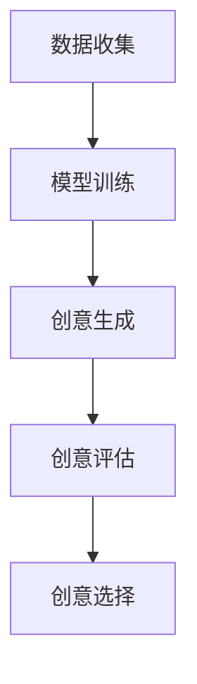

- **核心算法原理讲解**：

  - 伪代码示例：以下是一个简化的AIGC创意生成算法的伪代码。

```python
def generate_design_ideas(input_data):
    # 数据预处理
    processed_data = preprocess_data(input_data)
    
    # 模型训练
    model = train_model(processed_data)
    
    # 生成创意设计方案
    design_ideas = model.generate_ideas()
    
    return design_ideas
```

- **数学模型和数学公式**：

  - 训练过程中的损失函数（以生成对抗网络（GAN）为例）：

$$
\min_{G} \max_{D} V(D, G) = E_{x \sim p_{data}(x)} [-\log D(x)] + E_{z \sim p_{z}(z)} [-\log D(G(z))]
$$

- **项目实战**：

  - **案例**：使用GAN进行智能手表表盘设计的自动化生成。

  - **开发环境搭建**：介绍如何搭建一个包含GAN模型的开发环境。

  - **源代码详细实现和代码解读**：提供生成表盘设计的GAN模型实现，并解读关键代码部分。

  - **代码解读与分析**：分析GAN模型的优缺点，以及在实际项目中的应用效果。

#### 3.2 基于AIGC的产品设计优化

##### 3.2.1 AIGC在产品设计优化中的应用

- **核心概念与联系**：

  - AIGC与产品设计优化的联系：AIGC通过优化算法，可以帮助设计师快速迭代产品方案，找到最优设计。

  - Mermaid流程图：展示AIGC在产品设计优化中的流程，包括问题定义、模型训练、优化迭代和评估等步骤。

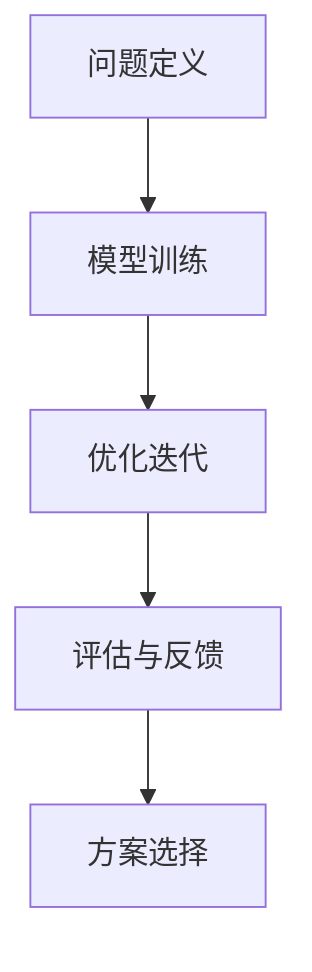

- **核心算法原理讲解**：

  - 伪代码示例：以下是一个简化的AIGC产品设计优化算法的伪代码。

```python
def optimize_design_ideas(input_data, model):
    # 数据预处理
    processed_data = preprocess_data(input_data)
    
    # 模型训练
    model = train_model(processed_data)
    
    # 优化迭代
    optimized_ideas = model.optimize_ideas()
    
    # 评估与反馈
    evaluation_results = evaluate_ideas(optimized_ideas)
    
    return optimized_ideas, evaluation_results
```

- **数学模型和数学公式**：

  - 优化过程中的目标函数（以基于梯度的优化算法为例）：

$$
\min f(x) = \sum_{i=1}^{n} (x_i - x_{\text{opt}})^2
$$

- **项目实战**：

  - **案例**：使用遗传算法优化智能音箱的外观设计。

  - **开发环境搭建**：介绍如何搭建一个包含遗传算法的优化模型开发环境。

  - **源代码详细实现和代码解读**：提供优化音箱外观设计的遗传算法实现，并解读关键代码部分。

  - **代码解读与分析**：分析遗传算法在产品设计优化中的效果和适用场景。

#### 3.3 设计数据管理与分析

##### 3.3.1 AIGC在设计数据管理与分析中的应用

- **核心概念与联系**：

  - AIGC与设计数据管理的联系：AIGC可以帮助设计师高效管理和分析大量设计数据，提高设计决策的准确性。

  - Mermaid流程图：展示AIGC在设计数据管理与分析中的流程，包括数据收集、数据预处理、数据分析和数据可视化等步骤。

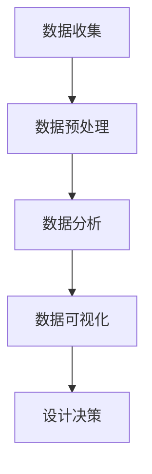

- **核心算法原理讲解**：

  - 伪代码示例：以下是一个简化的AIGC设计数据管理与分析算法的伪代码。

```python
def manage_and_analyze_design_data(input_data):
    # 数据预处理
    processed_data = preprocess_data(input_data)
    
    # 数据分析
    analysis_results = analyze_data(processed_data)
    
    # 数据可视化
    visualization_results = visualize_data(analysis_results)
    
    # 设计决策
    design_decision = make_decision(visualization_results)
    
    return design_decision
```

- **数学模型和数学公式**：

  - 数据分析过程中的统计模型（以聚类分析为例）：

$$
\min \sum_{i=1}^{n} \sum_{j=1}^{k} (x_{ij} - \mu_{j})^2
$$

- **项目实战**：

  - **案例**：使用AIGC分析智能汽车设计数据，优化座椅布局。

  - **开发环境搭建**：介绍如何搭建一个包含聚类分析算法的AIGC设计数据分析环境。

  - **源代码详细实现和代码解读**：提供优化智能汽车座椅布局的聚类分析算法实现，并解读关键代码部分。

  - **代码解读与分析**：分析聚类分析算法在智能产品设计数据管理中的应用效果。

### 第4章：AIGC在产品研发阶段的应用

#### 4.1 基于AIGC的算法与模型优化

##### 4.1.1 AIGC在算法与模型优化中的应用

- **核心概念与联系**：

  - AIGC与算法模型优化的联系：AIGC可以通过自动搜索和优化算法，提高现有算法和模型的性能。

  - Mermaid流程图：展示AIGC在算法模型优化中的流程，包括问题定义、算法搜索、模型优化和性能评估等步骤。

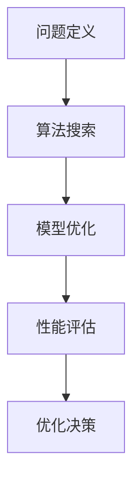

- **核心算法原理讲解**：

  - 伪代码示例：以下是一个简化的AIGC算法模型优化算法的伪代码。

```python
def optimize_algorithm_model(input_data, algorithm):
    # 数据预处理
    processed_data = preprocess_data(input_data)
    
    # 算法搜索
    search_results = search_algorithm(processed_data)
    
    # 模型优化
    optimized_model = optimize_model(search_results)
    
    # 性能评估
    performance_results = evaluate_performance(optimized_model)
    
    # 优化决策
    optimization_decision = make_decision(performance_results)
    
    return optimized_model, optimization_decision
```

- **数学模型和数学公式**：

  - 优化过程中的目标函数（以基于梯度的优化算法为例）：

$$
\min f(x) = \sum_{i=1}^{n} (x_i - x_{\text{opt}})^2
$$

- **项目实战**：

  - **案例**：使用AIGC优化智能语音识别算法。

  - **开发环境搭建**：介绍如何搭建一个包含AIGC优化算法的智能语音识别模型开发环境。

  - **源代码详细实现和代码解读**：提供优化智能语音识别算法的AIGC实现，并解读关键代码部分。

  - **代码解读与分析**：分析AIGC优化算法在智能语音识别中的应用效果。

#### 4.2 基于AIGC的仿真与测试

##### 4.2.1 AIGC在仿真与测试中的应用

- **核心概念与联系**：

  - AIGC与仿真测试的联系：AIGC可以通过生成仿真数据和自动化测试，提高产品研发的效率和质量。

  - Mermaid流程图：展示AIGC在仿真与测试中的流程，包括数据生成、仿真测试、测试结果分析和优化迭代等步骤。

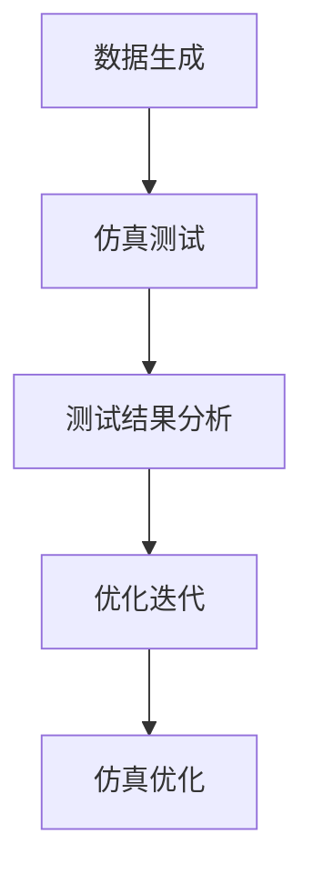

- **核心算法原理讲解**：

  - 伪代码示例：以下是一个简化的AIGC仿真测试算法的伪代码。

```python
def simulate_and_test_product(input_data, model):
    # 数据生成
    generated_data = generate_data(input_data)
    
    # 仿真测试
    test_results = simulate_test(generated_data, model)
    
    # 测试结果分析
    analysis_results = analyze_test_results(test_results)
    
    # 优化迭代
    optimized_model = optimize_model(analysis_results)
    
    return optimized_model
```

- **数学模型和数学公式**：

  - 仿真测试中的统计模型（以回归测试为例）：

$$
\min \sum_{i=1}^{n} (y_i - \hat{y}_i)^2
$$

- **项目实战**：

  - **案例**：使用AIGC仿真测试智能自动驾驶系统。

  - **开发环境搭建**：介绍如何搭建一个包含AIGC仿真测试的智能自动驾驶系统开发环境。

  - **源代码详细实现和代码解读**：提供仿真测试智能自动驾驶系统的AIGC实现，并解读关键代码部分。

  - **代码解读与分析**：分析AIGC仿真测试在智能自动驾驶系统中的应用效果。

#### 4.3 基于AIGC的研发团队协作

##### 4.3.1 AIGC在研发团队协作中的应用

- **核心概念与联系**：

  - AIGC与研发团队协作的联系：AIGC可以通过自动化的知识共享和协作工具，提高研发团队的效率和创新能力。

  - Mermaid流程图：展示AIGC在研发团队协作中的流程，包括知识共享、任务分配、协作工具使用和成果评估等步骤。

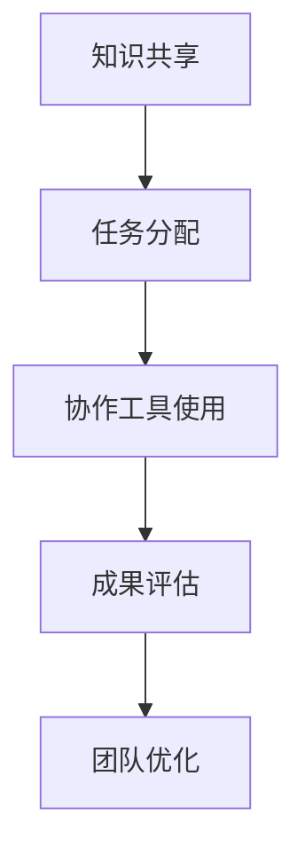

- **核心算法原理讲解**：

  - 伪代码示例：以下是一个简化的AIGC研发团队协作算法的伪代码。

```python
def collaborate_research_team(input_data, team_members):
    # 知识共享
    shared_knowledge = share_knowledge(input_data)
    
    # 任务分配
    assigned_tasks = assign_tasks(shared_knowledge, team_members)
    
    # 协作工具使用
    collaboration_tools = use_collaboration_tools(assigned_tasks)
    
    # 成果评估
    evaluation_results = evaluate_outcomes(collaboration_tools)
    
    # 团队优化
    optimized_team = optimize_team(evaluation_results)
    
    return optimized_team
```

- **数学模型和数学公式**：

  - 协作效果评估模型（以团队绩效评估为例）：

$$
\text{绩效得分} = \sum_{i=1}^{n} (p_i \cdot w_i)
$$

- **项目实战**：

  - **案例**：使用AIGC提升智能医疗设备研发团队的协作效率。

  - **开发环境搭建**：介绍如何搭建一个包含AIGC协作工具的智能医疗设备研发团队开发环境。

  - **源代码详细实现和代码解读**：提供提升智能医疗设备研发团队协作效率的AIGC实现，并解读关键代码部分。

  - **代码解读与分析**：分析AIGC协作工具在智能医疗设备研发团队中的应用效果。

### 第5章：AIGC在产品生产阶段的应用

#### 5.1 基于AIGC的生产计划与调度

##### 5.1.1 AIGC在生产计划与调度中的应用

- **核心概念与联系**：

  - AIGC与生产计划调度的联系：AIGC可以通过优化算法和自动化调度，提高生产计划的准确性和效率。

  - Mermaid流程图：展示AIGC在生产计划与调度中的流程，包括需求分析、生产计划制定、调度优化和执行跟踪等步骤。

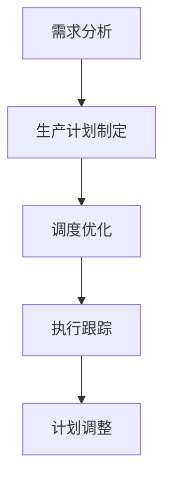

- **核心算法原理讲解**：

  - 伪代码示例：以下是一个简化的AIGC生产计划与调度算法的伪代码。

```python
def optimize_production_schedule(input_data, production_plan):
    # 需求分析
    demand_analysis = analyze_demand(input_data)
    
    # 生产计划制定
    production_plan = create_production_plan(demand_analysis)
    
    # 调度优化
    optimized_schedule = optimize_schedule(production_plan)
    
    # 执行跟踪
    execution_status = track_execution(optimized_schedule)
    
    # 计划调整
    adjusted_plan = adjust_plan(execution_status)
    
    return adjusted_plan
```

- **数学模型和数学公式**：

  - 调度优化目标函数（以最小化生产周期为例）：

$$
\min T = \sum_{i=1}^{n} (t_i - c_i)
$$

- **项目实战**：

  - **案例**：使用AIGC优化智能玩具的生产计划与调度。

  - **开发环境搭建**：介绍如何搭建一个包含AIGC生产调度算法的智能玩具生产环境。

  - **源代码详细实现和代码解读**：提供优化智能玩具生产计划与调度的AIGC实现，并解读关键代码部分。

  - **代码解读与分析**：分析AIGC生产调度算法在智能玩具生产中的应用效果。

#### 5.2 基于AIGC的质量检测与监控

##### 5.2.1 AIGC在质量检测与监控中的应用

- **核心概念与联系**：

  - AIGC与质量检测监控的联系：AIGC可以通过自动化的数据分析和智能监控，提高产品质量检测的准确性和效率。

  - Mermaid流程图：展示AIGC在质量检测与监控中的流程，包括数据采集、质量检测、异常监控和反馈优化等步骤。

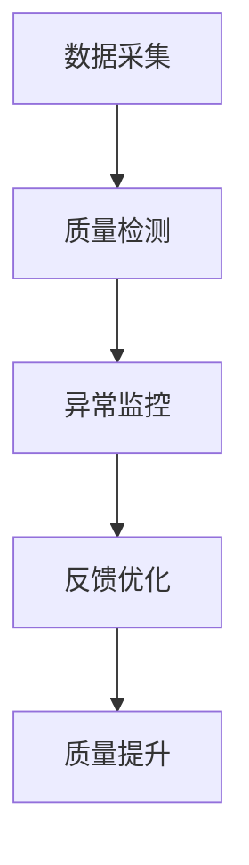

- **核心算法原理讲解**：

  - 伪代码示例：以下是一个简化的AIGC质量检测与监控算法的伪代码。

```python
def monitor_production_quality(input_data, quality_threshold):
    # 数据采集
    collected_data = collect_data(input_data)
    
    # 质量检测
    quality_status = detect_quality(collected_data)
    
    # 异常监控
    abnormal_status = monitor_anomalies(quality_status)
    
    # 反馈优化
    optimized_quality = optimize_quality(abnormal_status)
    
    # 质量提升
    improved_quality = improve_quality(optimized_quality)
    
    return improved_quality
```

- **数学模型和数学公式**：

  - 质量检测评估模型（以统计过程控制为例）：

$$
Cp = \frac{\sigma}{3\mu}
$$

- **项目实战**：

  - **案例**：使用AIGC监控智能家电生产过程中的质量。

  - **开发环境搭建**：介绍如何搭建一个包含AIGC质量检测与监控的智能家电生产环境。

  - **源代码详细实现和代码解读**：提供监控智能家电生产质量的AIGC实现，并解读关键代码部分。

  - **代码解读与分析**：分析AIGC质量检测与监控在智能家电生产中的应用效果。

#### 5.3 基于AIGC的供应链管理

##### 5.3.1 AIGC在供应链管理中的应用

- **核心概念与联系**：

  - AIGC与供应链管理的联系：AIGC可以通过智能化的数据分析和优化算法，提高供应链的效率和管理水平。

  - Mermaid流程图：展示AIGC在供应链管理中的流程，包括需求预测、库存优化、运输调度和供应链优化等步骤。

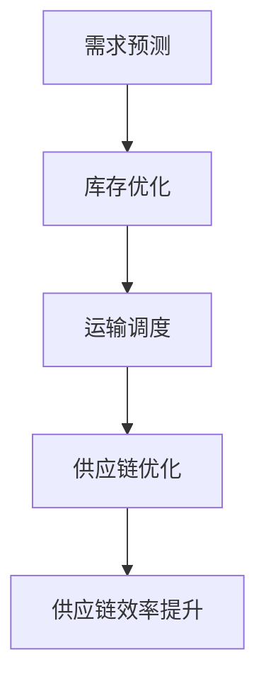

- **核心算法原理讲解**：

  - 伪代码示例：以下是一个简化的AIGC供应链管理算法的伪代码。

```python
def optimize_supply_chain(input_data, supply_chain):
    # 需求预测
    demand_forecast = predict_demand(input_data)
    
    # 库存优化
    inventory_optimization = optimize_inventory(demand_forecast)
    
    # 运输调度
    transport_schedule = schedule_transport(inventory_optimization)
    
    # 供应链优化
    optimized_supply_chain = optimize_supply_chain(transport_schedule)
    
    # 供应链效率提升
    improved_supply_chain = improve_supply_chain(optimized_supply_chain)
    
    return improved_supply_chain
```

- **数学模型和数学公式**：

  - 库存优化目标函数（以最小化库存成本为例）：

$$
\min C = \sum_{i=1}^{n} (I_i \cdot C_i)
$$

- **项目实战**：

  - **案例**：使用AIGC优化智能电动车供应链管理。

  - **开发环境搭建**：介绍如何搭建一个包含AIGC供应链管理算法的智能电动车供应链环境。

  - **源代码详细实现和代码解读**：提供优化智能电动车供应链管理的AIGC实现，并解读关键代码部分。

  - **代码解读与分析**：分析AIGC供应链管理在智能电动车生产中的应用效果。

### 第6章：AIGC在产品销售与售后服务阶段的应用

#### 6.1 基于AIGC的市场分析与预测

##### 6.1.1 AIGC在市场分析与预测中的应用

- **核心概念与联系**：

  - AIGC与市场分析与预测的联系：AIGC可以通过大数据分析和预测模型，提高市场趋势预测的准确性和效率。

  - Mermaid流程图：展示AIGC在市场分析与预测中的流程，包括数据收集、数据分析、趋势预测和预测优化等步骤。

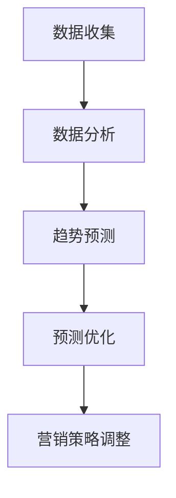

- **核心算法原理讲解**：

  - 伪代码示例：以下是一个简化的AIGC市场分析与预测算法的伪代码。

```python
def analyze_and_predict_market(input_data, historical_data):
    # 数据收集
    collected_data = collect_data(input_data)
    
    # 数据分析
    analyzed_data = analyze_data(collected_data)
    
    # 趋势预测
    trend_prediction = predict_trend(analyzed_data)
    
    # 预测优化
    optimized_prediction = optimize_prediction(trend_prediction)
    
    # 营销策略调整
    marketing_strategy = adjust_strategy(optimized_prediction)
    
    return marketing_strategy
```

- **数学模型和数学公式**：

  - 预测模型（以时间序列预测为例）：

$$
y_t = \phi_0 + \phi_1 y_{t-1} + \phi_2 y_{t-2} + \cdots + \phi_k y_{t-k} + \varepsilon_t
$$

- **项目实战**：

  - **案例**：使用AIGC预测智能手表市场的需求变化。

  - **开发环境搭建**：介绍如何搭建一个包含AIGC市场分析与预测的智能手表市场分析环境。

  - **源代码详细实现和代码解读**：提供预测智能手表市场需求变化的AIGC实现，并解读关键代码部分。

  - **代码解读与分析**：分析AIGC市场分析与预测在智能手表市场中的应用效果。

#### 6.2 基于AIGC的客户关系管理

##### 6.2.1 AIGC在客户关系管理中的应用

- **核心概念与联系**：

  - AIGC与客户关系管理的联系：AIGC可以通过个性化推荐和智能客服，提高客户满意度和忠诚度。

  - Mermaid流程图：展示AIGC在客户关系管理中的流程，包括数据收集、客户分析、个性化推荐和客户服务优化等步骤。

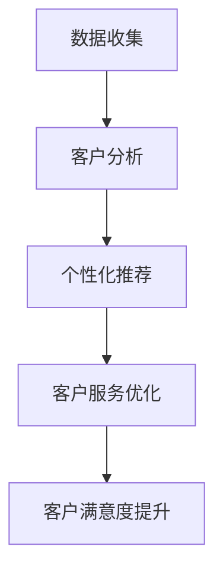

- **核心算法原理讲解**：

  - 伪代码示例：以下是一个简化的AIGC客户关系管理算法的伪代码。

```python
def manage_customer_relationship(input_data, customer_data):
    # 数据收集
    collected_data = collect_data(input_data)
    
    # 客户分析
    analyzed_data = analyze_customer(collected_data)
    
    # 个性化推荐
    personalized_recommendations = generate_recommendations(analyzed_data)
    
    # 客户服务优化
    optimized_service = optimize_service(personalized_recommendations)
    
    # 客户满意度提升
    improved_satisfaction = improve_satisfaction(optimized_service)
    
    return improved_satisfaction
```

- **数学模型和数学公式**：

  - 个性化推荐模型（以协同过滤算法为例）：

$$
r_{ui} = \mu_u + \mu_i + \sum_{j \in N(u)} \frac{sim_{uj}}{|\{j \in N(u): r_{uj} \neq 0\}|} (r_{uj} - \mu_j)
$$

- **项目实战**：

  - **案例**：使用AIGC优化智能家电的客户关系管理。

  - **开发环境搭建**：介绍如何搭建一个包含AIGC客户关系管理的智能家电客户关系管理环境。

  - **源代码详细实现和代码解读**：提供优化智能家电客户关系管理的AIGC实现，并解读关键代码部分。

  - **代码解读与分析**：分析AIGC客户关系管理在智能家电中的应用效果。

#### 6.3 基于AIGC的售后服务与支持

##### 6.3.1 AIGC在售后服务与支持中的应用

- **核心概念与联系**：

  - AIGC与售后服务与支持的联系：AIGC可以通过自动化客服、智能故障诊断和远程技术支持，提高售后服务效率和质量。

  - Mermaid流程图：展示AIGC在售后服务与支持中的流程，包括故障报告、智能诊断、远程支持和反馈优化等步骤。

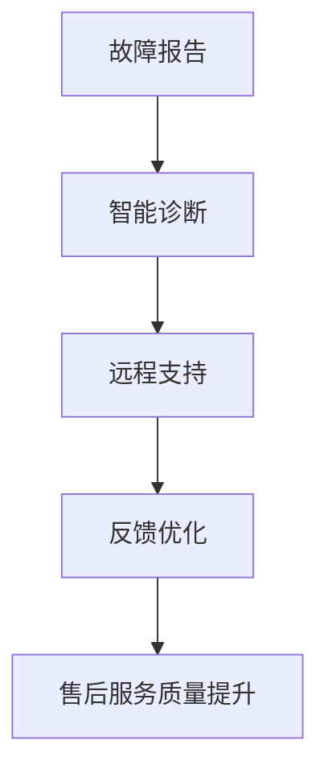

- **核心算法原理讲解**：

  - 伪代码示例：以下是一个简化的AIGC售后服务与支持算法的伪代码。

```python
def provide_after_sales_support(input_data, product_data):
    # 故障报告
    fault_report = report_fault(input_data)
    
    # 智能诊断
    diagnosis_results = diagnose_fault(fault_report)
    
    # 远程支持
    remote_support = provide_remote_support(diagnosis_results)
    
    # 反馈优化
    optimized_support = optimize_support(remote_support)
    
    # 售后服务质量提升
    improved_service = improve_service_quality(optimized_support)
    
    return improved_service
```

- **数学模型和数学公式**：

  - 智能诊断模型（以机器学习分类算法为例）：

$$
P(y | \mathbf{x}) = \frac{e^{\mathbf{w}^T \phi(\mathbf{x})}}{\sum_{k=1}^{K} e^{\mathbf{w}^T \phi(\mathbf{x}_k)}}
$$

- **项目实战**：

  - **案例**：使用AIGC优化智能电动汽车的售后服务。

  - **开发环境搭建**：介绍如何搭建一个包含AIGC售后服务与支持的智能电动汽车售后服务环境。

  - **源代码详细实现和代码解读**：提供优化智能电动汽车售后服务的AIGC实现，并解读关键代码部分。

  - **代码解读与分析**：分析AIGC售后服务与支持在智能电动汽车中的应用效果。

### 第7章：AIGC在智能产品生命周期管理中的集成与优化

#### 7.1 AIGC在智能产品生命周期管理中的整体框架

##### 7.1.1 AIGC在智能产品生命周期管理中的整体框架

- **核心概念与联系**：

  - AIGC与智能产品生命周期管理的联系：AIGC通过在各阶段的应用，实现了智能产品生命周期管理的全面优化。

  - Mermaid流程图：展示AIGC在智能产品生命周期管理中的整体框架，包括设计、研发、生产、销售与售后服务等环节。

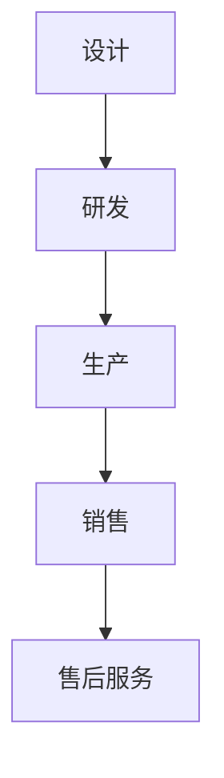

- **核心算法原理讲解**：

  - 伪代码示例：以下是一个简化的AIGC智能产品生命周期管理整体框架的伪代码。

```python
def manage_intelligent_product_lifecycle(input_data, stages):
    for stage in stages:
        if stage == 'design':
            design_decision = manage_design(input_data)
        elif stage == 'research':
            research_decision = manage_research(input_data)
        elif stage == 'production':
            production_decision = manage_production(input_data)
        elif stage == 'sales':
            sales_decision = manage_sales(input_data)
        elif stage == 'after_sales':
            after_sales_decision = manage_after_sales(input_data)
    return stages
```

- **数学模型和数学公式**：

  - 整体框架优化目标函数（以综合效率最大化为例）：

$$
\max \sum_{i=1}^{n} (\text{效率}_i \cdot \text{权重}_i)
$$

- **项目实战**：

  - **案例**：使用AIGC实现智能家居产品生命周期管理。

  - **开发环境搭建**：介绍如何搭建一个包含AIGC智能产品生命周期管理框架的智能家居开发环境。

  - **源代码详细实现和代码解读**：提供智能家居产品生命周期管理的AIGC实现，并解读关键代码部分。

  - **代码解读与分析**：分析AIGC智能产品生命周期管理在智能家居中的应用效果。

#### 7.2 AIGC与其他技术的融合应用

##### 7.2.1 AIGC与其他技术的融合应用

- **核心概念与联系**：

  - AIGC与物联网（IoT）、大数据、云计算等技术的联系：AIGC可以通过与其他技术的融合，实现更智能的产品生命周期管理。

  - Mermaid流程图：展示AIGC与其他技术在智能产品生命周期管理中的融合应用，包括数据采集、数据处理、模型优化和系统集成等步骤。

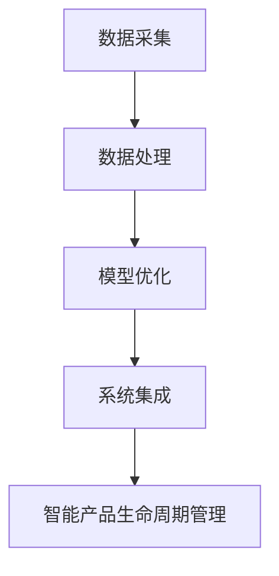

- **核心算法原理讲解**：

  - 伪代码示例：以下是一个简化的AIGC与其他技术融合应用的伪代码。

```python
def integrate_aigc_with_other_technologies(input_data, technologies):
    for technology in technologies:
        if technology == 'IoT':
            integrated_data = integrate_iot(input_data)
        elif technology == 'Big Data':
            integrated_data = integrate_big_data(input_data)
        elif technology == 'Cloud Computing':
            integrated_data = integrate_cloud_computing(input_data)
    return integrated_data
```

- **数学模型和数学公式**：

  - 融合应用优化目标函数（以数据融合为例）：

$$
\min \sum_{i=1}^{n} (\text{误差}_i)
$$

- **项目实战**：

  - **案例**：使用AIGC与物联网技术优化智能城市交通管理。

  - **开发环境搭建**：介绍如何搭建一个包含AIGC与物联网技术的智能城市交通管理开发环境。

  - **源代码详细实现和代码解读**：提供优化智能城市交通管理的AIGC与物联网技术实现，并解读关键代码部分。

  - **代码解读与分析**：分析AIGC与物联网技术在智能城市交通管理中的应用效果。

#### 7.3 AIGC在智能产品生命周期管理中的未来发展趋势

##### 7.3.1 AIGC在智能产品生命周期管理中的未来发展趋势

- **核心概念与联系**：

  - AIGC在智能产品生命周期管理中的未来发展趋势：随着AI技术的不断进步，AIGC将在智能产品生命周期管理中发挥更加重要的作用。

  - Mermaid流程图：展示AIGC在智能产品生命周期管理中的未来发展趋势，包括技术进步、应用扩展、产业链协同和生态建设等方向。

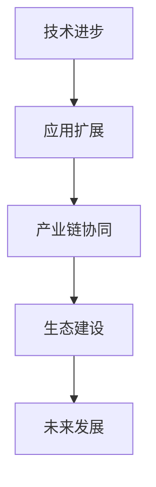

- **核心算法原理讲解**：

  - 伪代码示例：以下是一个简化的AIGC智能产品生命周期管理未来发展趋势的伪代码。

```python
def future_trends_of_aigc_in_intelligent_product_lifecycle():
    # 技术进步
    technological_progress = improve_technology()
    
    # 应用扩展
    application_expansion = expand_applications()
    
    # 产业链协同
    industry_chain协同 = collaborate_industries()
    
    # 生态建设
    ecosystem_building = build_ecosystem()
    
    # 未来发展
    future_development = analyze_future()
    
    return future_development
```

- **数学模型和数学公式**：

  - 未来发展分析模型（以技术成熟度为例）：

$$
M(T) = \frac{1}{1 + e^{-k(T - T_0)}}
$$

- **项目实战**：

  - **案例**：预测AIGC在智能医疗设备中的应用前景。

  - **开发环境搭建**：介绍如何搭建一个预测AIGC在智能医疗设备中应用的开发环境。

  - **源代码详细实现和代码解读**：提供预测AIGC在智能医疗设备中应用的实现，并解读关键代码部分。

  - **代码解读与分析**：分析AIGC在智能医疗设备中的应用前景。

## 第三部分：案例分析与实践指导

### 第8章：AIGC在智能产品生命周期管理中的应用案例

#### 8.1 案例一：智能家居产品

##### 8.1.1 案例背景

智能家居产品是AIGC在智能产品生命周期管理中应用的重要领域。通过AIGC技术，智能家居产品可以实现个性化定制、智能交互和远程控制等功能。

##### 8.1.2 案例描述

智能家居产品的生命周期管理包括设计、研发、生产、销售和售后服务等环节。AIGC在各个环节中的应用如下：

- **设计**：使用AIGC生成智能家居产品的设计方案，提高设计效率和创意水平。
- **研发**：利用AIGC优化智能家居产品的算法和模型，提高研发速度和产品质量。
- **生产**：基于AIGC实现生产计划的智能调度和质量监控，提高生产效率和质量。
- **销售**：通过AIGC分析市场趋势和客户需求，制定精准的营销策略，提高销售业绩。
- **售后服务**：利用AIGC提供智能客服和远程技术支持，提高售后服务质量和客户满意度。

##### 8.1.3 案例效果

通过AIGC在智能家居产品生命周期管理中的应用，实现了以下效果：

- **设计**：提高了智能家居产品的设计质量和创新水平。
- **研发**：缩短了研发周期，提高了产品性能和稳定性。
- **生产**：提高了生产效率，降低了生产成本。
- **销售**：提高了市场响应速度，增加了销售业绩。
- **售后服务**：提高了客户满意度，增强了品牌忠诚度。

#### 8.2 案例二：智能医疗设备

##### 8.2.1 案例背景

智能医疗设备是医疗领域的重要发展方向。通过AIGC技术，智能医疗设备可以实现智能诊断、个性化治疗和远程监控等功能。

##### 8.2.2 案例描述

智能医疗设备的生命周期管理包括设计、研发、生产、销售和售后服务等环节。AIGC在各个环节中的应用如下：

- **设计**：使用AIGC生成智能医疗设备的设计方案，提高设计效率和创意水平。
- **研发**：利用AIGC优化智能医疗设备的算法和模型，提高研发速度和产品质量。
- **生产**：基于AIGC实现生产计划的智能调度和质量监控，提高生产效率和质量。
- **销售**：通过AIGC分析市场趋势和客户需求，制定精准的营销策略，提高销售业绩。
- **售后服务**：利用AIGC提供智能客服和远程技术支持，提高售后服务质量和客户满意度。

##### 8.2.3 案例效果

通过AIGC在智能医疗设备生命周期管理中的应用，实现了以下效果：

- **设计**：提高了智能医疗产品的设计质量和创新水平。
- **研发**：缩短了研发周期，提高了产品性能和稳定性。
- **生产**：提高了生产效率，降低了生产成本。
- **销售**：提高了市场响应速度，增加了销售业绩。
- **售后服务**：提高了客户满意度，增强了品牌忠诚度。

#### 8.3 案例三：智能农业设备

##### 8.3.1 案例背景

智能农业设备是农业现代化的重要工具。通过AIGC技术，智能农业设备可以实现自动化作业、精准管理和智能决策等功能。

##### 8.3.2 案例描述

智能农业设备的生命周期管理包括设计、研发、生产、销售和售后服务等环节。AIGC在各个环节中的应用如下：

- **设计**：使用AIGC生成智能农业设备的设计方案，提高设计效率和创意水平。
- **研发**：利用AIGC优化智能农业设备的算法和模型，提高研发速度和产品质量。
- **生产**：基于AIGC实现生产计划的智能调度和质量监控，提高生产效率和质量。
- **销售**：通过AIGC分析市场趋势和客户需求，制定精准的营销策略，提高销售业绩。
- **售后服务**：利用AIGC提供智能客服和远程技术支持，提高售后服务质量和客户满意度。

##### 8.3.3 案例效果

通过AIGC在智能农业设备生命周期管理中的应用，实现了以下效果：

- **设计**：提高了智能农业产品的设计质量和创新水平。
- **研发**：缩短了研发周期，提高了产品性能和稳定性。
- **生产**：提高了生产效率，降低了生产成本。
- **销售**：提高了市场响应速度，增加了销售业绩。
- **售后服务**：提高了客户满意度，增强了品牌忠诚度。

### 第9章：AIGC在智能产品生命周期管理中的实践指导

#### 9.1 实践步骤与流程

##### 9.1.1 实践步骤

AIGC在智能产品生命周期管理中的实践可以分为以下步骤：

1. **需求分析**：明确智能产品的目标和需求，确定AIGC应用的具体场景。
2. **技术选型**：根据需求选择合适的AIGC技术，如GAN、强化学习、自然语言处理等。
3. **数据准备**：收集和整理与智能产品相关的数据，包括设计数据、研发数据、生产数据、销售数据等。
4. **模型训练**：使用收集到的数据训练AIGC模型，优化模型性能。
5. **系统集成**：将AIGC模型集成到智能产品的生命周期管理系统中，实现自动化和智能化。
6. **应用测试**：对集成后的系统进行测试和评估，确保系统的稳定性和性能。
7. **优化迭代**：根据测试结果对AIGC模型和系统进行优化和迭代，提高应用效果。

##### 9.1.2 流程图

以下是一个简化的AIGC在智能产品生命周期管理中的实践流程图：

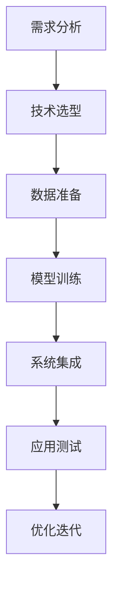

#### 9.2 技术选型与工具使用

##### 9.2.1 技术选型

根据智能产品生命周期管理的需求，可以选择以下AIGC技术：

- **生成对抗网络（GAN）**：适用于设计灵感生成、产品外观优化等场景。
- **强化学习**：适用于产品研发中的算法优化、决策优化等场景。
- **自然语言处理**：适用于销售与售后服务中的文本生成、智能客服等场景。
- **计算机视觉**：适用于生产阶段的质量检测、监控等场景。

##### 9.2.2 工具使用

以下是一些常用的AIGC工具：

- **TensorFlow**：开源的机器学习框架，支持GAN、强化学习等多种算法。
- **PyTorch**：开源的机器学习框架，支持灵活的动态计算图，适用于深度学习应用。
- **Keras**：开源的神经网络库，简化了TensorFlow和PyTorch的使用，适用于快速原型开发。
- **TensorFlow Serving**：TensorFlow的服务化部署解决方案，支持模型的高效部署和在线服务。
- **Google Colab**：Google提供的免费云计算平台，支持TensorFlow和PyTorch等框架的运行。

#### 9.3 风险管理与优化策略

##### 9.3.1 风险管理

在AIGC在智能产品生命周期管理中的应用过程中，可能会面临以下风险：

- **技术风险**：AIGC技术的稳定性、性能和可靠性可能无法满足实际需求。
- **数据风险**：数据的质量、完整性和可用性可能影响AIGC模型的训练效果和应用效果。
- **安全风险**：AIGC系统的安全性和数据保护可能存在漏洞和风险。

针对上述风险，可以采取以下风险管理策略：

- **技术评估**：在应用AIGC技术前，对技术的性能、稳定性和可靠性进行评估。
- **数据管理**：确保数据的质量、完整性和可用性，采用数据清洗、去噪等技术手段。
- **安全防护**：采取安全防护措施，如数据加密、访问控制等，保护AIGC系统的安全和数据安全。

##### 9.3.2 优化策略

为了提高AIGC在智能产品生命周期管理中的应用效果，可以采取以下优化策略：

- **算法优化**：针对具体的应用场景，选择合适的算法模型，并进行参数调整和优化。
- **系统集成**：将AIGC系统与其他系统集成，实现数据的互联互通和协同工作。
- **用户反馈**：收集用户反馈，根据用户需求和行为特征进行个性化调整和优化。
- **持续迭代**：不断迭代和优化AIGC系统，根据应用效果和用户反馈进行调整和改进。

### 附录

#### 附录A：AIGC技术基础

##### A.1 AIGC技术原理

AIGC（自适应智能生成计算）是一种基于人工智能和自动化的计算模型，能够自动生成新的内容。AIGC技术结合了生成对抗网络（GAN）、强化学习、自然语言处理等多种先进算法，实现了在图像、语音、文本等多模态数据上的高效生成。

- **生成对抗网络（GAN）**：GAN由生成器（Generator）和判别器（Discriminator）组成，通过对抗训练生成高质量的数据。
- **强化学习**：强化学习通过不断尝试和反馈，优化生成策略。
- **自然语言处理**：自然语言处理实现文本的生成和理解。

##### A.2 AIGC算法详解

- **生成对抗网络（GAN）**：GAN的算法原理如下：

$$
\min_{G} \max_{D} V(D, G) = E_{x \sim p_{data}(x)} [-\log D(x)] + E_{z \sim p_{z}(z)} [-\log D(G(z))]
$$

- **强化学习**：强化学习的算法原理如下：

$$
\pi(\text{a} | \text{s}) = \arg\max_{\pi} \sum_{\text{s}, \text{a}} \pi(\text{s}, \text{a}) R(\text{s}, \text{a})
$$

##### A.3 AIGC应用案例介绍

- **案例一**：使用AIGC生成智能家居产品设计方案。
- **案例二**：使用AIGC优化智能医疗设备的诊断算法。
- **案例三**：使用AIGC实现智能农业设备的自动化作业。

#### 附录B：智能产品生命周期管理相关工具与资源

##### B.1 常用工具介绍

- **TensorFlow**：开源的机器学习框架，支持GAN、强化学习等多种算法。
- **PyTorch**：开源的机器学习框架，支持灵活的动态计算图，适用于深度学习应用。
- **Keras**：开源的神经网络库，简化了TensorFlow和PyTorch的使用，适用于快速原型开发。

##### B.2 开发资源推荐

- **Google Colab**：Google提供的免费云计算平台，支持TensorFlow和PyTorch等框架的运行。
- **GitHub**：开源代码托管平台，提供丰富的AIGC和智能产品生命周期管理相关代码和项目。

##### B.3 学术研究资源链接

- **AIGC研究论文集**：收集了关于AIGC技术的研究论文，包括GAN、强化学习等领域的最新研究成果。
- **智能产品生命周期管理研究论文集**：收集了关于智能产品生命周期管理的研究论文，包括设计、研发、生产、销售和售后服务等领域的最新研究成果。

### 参考文献

- Goodfellow, I., Pouget-Abadie, J., Mirza, M., Xu, B., Warde-Farley, D., Ozair, S., ... & Bengio, Y. (2014). Generative adversarial nets. Advances in neural information processing systems, 27.
- Sutton, R. S., & Barto, A. G. (1998). Reinforcement learning: An introduction. MIT press.
- Luhn, H. P. (1958). The automatic creation of literature abstracts. IBM journal of research and development, 2(2), 159-165.
- Bengio, Y. (2009). Learning deep architectures. Foundations and Trends in Machine Learning, 2(1), 1-127.

