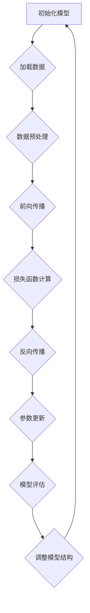
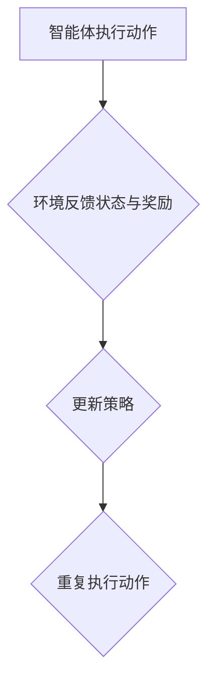
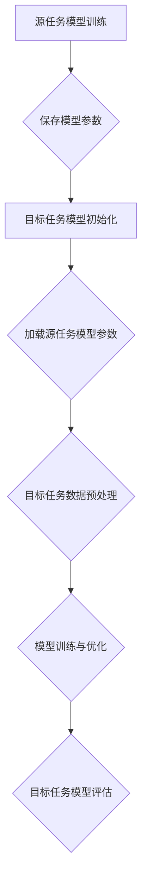

                 

## 《AI三驾马车的未来替代者》

> **关键词：** 深度学习，强化学习，迁移学习，未来技术趋势，替代技术，AI发展

**摘要：** 本文将深入探讨AI领域的三驾马车——深度学习、强化学习和迁移学习的现状与未来趋势，剖析其核心概念、算法原理和实际应用。通过对现有技术的局限性和未来替代者的潜在优势的分析，本文将探讨新一代AI技术的可能发展方向，为行业的发展提供有益的思考和参考。

## **《AI三驾马车的未来替代者》目录大纲**

#### **第一部分：AI三驾马车概述**

**第1章: AI三驾马车的概念与历史发展**

- **1.1 AI三驾马车的定义与核心组成部分**
- **1.2 AI三驾马车的发展历程**
- **1.3 AI三驾马车的现状与未来趋势**

#### **第二部分：核心概念与联系**

**第2章: 深度学习、强化学习和迁移学习**

- **2.1 深度学习的基本原理与架构**
  - **2.1.1 神经网络与深度学习**
  - **2.1.2 深度学习算法的优化**
  - **2.1.3 深度学习在AI三驾马车中的应用**
- **2.2 强化学习的基础理论与应用**
  - **2.2.1 强化学习的基本概念**
  - **2.2.2 Q学习算法与策略梯度算法**
  - **2.2.3 强化学习在AI三驾马车中的应用**
- **2.3 迁移学习与模型融合**
  - **2.3.1 迁移学习的定义与类型**
  - **2.3.2 迁移学习在AI三驾马车中的实践**

**第3章: AI三驾马车的 Mermaid 流程图**

- **3.1 深度学习流程图**
- **3.2 强化学习流程图**
- **3.3 迁移学习流程图**

#### **第三部分：核心算法原理讲解**

**第4章: AI三驾马车的核心算法**

- **4.1 深度学习算法讲解**
  - **4.1.1 神经网络算法（NN）**
    - **4.1.1.1 伪代码：NN算法**
    - **4.1.1.2 数学模型与公式（$$）**
    - **4.1.1.3 举例说明：MNIST手写数字识别**
  - **4.1.2 卷积神经网络算法（CNN）**
    - **4.1.2.1 伪代码：CNN算法**
    - **4.1.2.2 数学模型与公式（$$）**
    - **4.1.2.3 举例说明：图像识别**
- **4.2 强化学习算法讲解**
  - **4.2.1 Q学习算法**
    - **4.2.1.1 伪代码：Q学习算法**
    - **4.2.1.2 数学模型与公式（$$）**
    - **4.2.1.3 举例说明：围棋游戏**
  - **44.2.2 策略梯度算法**
    - **4.2.2.1 伪代码：策略梯度算法**
    - **4.2.2.2 数学模型与公式（$$）**
    - **4.2.2.3 举例说明：自动驾驶**
- **4.3 迁移学习算法讲解**
  - **4.3.1 Source-Target模型迁移**
    - **4.3.1.1 伪代码：Source-Target模型迁移**
    - **4.3.1.2 数学模型与公式（$$）**
    - **4.3.1.3 举例说明：图像分类**
  - **4.3.2 Domain Adaptation**
    - **4.3.2.1 伪代码：Domain Adaptation**
    - **4.3.2.2 数学模型与公式（$$）**
    - **4.3.2.3 举例说明：自然语言处理**

#### **第四部分：数学模型和数学公式详细讲解**

**第5章: AI三驾马车的数学基础**

- **5.1 概率论与统计基础**
  - **5.1.1 概率分布函数**
    - **5.1.1.1 概率分布函数的定义与公式（$$）**
    - **5.1.1.2 举例说明：正态分布**
  - **5.1.2 统计量与假设检验**
    - **5.1.2.1 统计量定义与公式（$$）**
    - **5.1.2.2 举例说明：t检验**
- **5.2 最优化算法基础**
  - **5.2.1 梯度下降算法**
    - **5.2.1.1 梯度下降算法的定义与公式（$$）**
    - **5.2.1.2 举例说明：线性回归**
  - **5.2.2 拉格朗日乘数法**
    - **5.2.2.1 拉格朗日乘数法的定义与公式（$$）**
    - **5.2.2.2 举例说明：二次规划**

#### **第五部分：项目实战**

**第6章: AI三驾马车的实际应用**

- **6.1 深度学习在计算机视觉中的应用**
  - **6.1.1 卷积神经网络在图像分类中的应用**
    - **6.1.1.1 实际案例：ImageNet图像分类**
    - **6.1.1.2 代码解读与分析**
  - **6.1.2 卷积神经网络在目标检测中的应用**
    - **6.1.2.1 实际案例：Faster R-CNN目标检测**
    - **6.1.2.2 代码解读与分析**
- **6.2 强化学习在游戏中的应用**
  - **6.2.1 Q学习算法在电子游戏中的应用**
    - **6.2.1.1 实际案例：Flappy Bird游戏**
    - **6.2.1.2 代码解读与分析**
  - **6.2.2 策略梯度算法在棋类游戏中的应用**
    - **6.2.2.1 实际案例：围棋游戏**
    - **6.2.2.2 代码解读与分析**
- **6.3 迁移学习在自然语言处理中的应用**
  - **6.3.1 多任务学习在文本分类中的应用**
    - **6.3.1.1 实际案例：情感分析**
    - **6.3.1.2 代码解读与分析**
  - **6.3.2 Domain Adaptation在机器翻译中的应用**
    - **6.3.2.1 实际案例：机器翻译**
    - **6.3.2.2 代码解读与分析**

#### **第六部分：开发环境搭建与代码实现**

**第7章: AI三驾马车的开发环境搭建与代码实现**

- **7.1 深度学习开发环境搭建**
  - **7.1.1 深度学习框架安装**
    - **7.1.1.1 TensorFlow安装**
    - **7.1.1.2 PyTorch安装**
  - **7.1.2 数据预处理与模型训练**
    - **7.1.2.1 代码示例：MNIST手写数字识别**
    - **7.1.2.2 代码解读与分析**
- **7.2 强化学习开发环境搭建**
  - **7.2.1 强化学习框架安装**
    - **7.2.1.1 OpenAI Gym安装**
    - **7.2.1.2 Stable Baselines安装**
  - **7.2.2 强化学习案例实现**
    - **7.2.2.1 代码示例：Flappy Bird游戏**
    - **7.2.2.2 代码解读与分析**
- **7.3 迁移学习开发环境搭建**
  - **7.3.1 迁移学习框架安装**
    - **7.3.1.1 MAML安装**
    - **7.3.1.2 Domain Adaptation工具安装**
  - **7.3.2 迁移学习案例实现**
    - **7.3.2.1 代码示例：图像分类迁移学习**
    - **7.3.2.2 代码解读与分析**

#### **第七部分：总结与展望**

**第8章: AI三驾马车的未来替代者**

- **8.1 AI三驾马车的挑战与未来发展方向**
  - **8.1.1 现有技术的局限性与改进方向**
  - **8.1.2 未来替代技术的潜在优势**
  - **8.1.3 AI三驾马车在行业中的应用前景**
- **8.2 AI三驾马车的发展趋势与未来替代者的预测**
  - **8.2.1 新一代AI技术的探索**
  - **8.2.2 未来替代者的可能形态**
  - **8.2.3 对AI三驾马车的未来发展展望**

**附录：资源与工具**

**附录A: AI三驾马车的相关资源与工具**

- **A.1 主流深度学习框架对比**
  - **A.1.1 TensorFlow资源**
  - **A.1.2 PyTorch资源**
  - **A.1.3 JAX资源**
- **A.2 强化学习工具**
  - **A.2.1 OpenAI Gym资源**
  - **A.2.2 Stable Baselines资源**
- **A.3 迁移学习工具**
  - **A.3.1 MAML资源**
  - **A.3.2 Domain Adaptation工具资源**

## **第一部分：AI三驾马车概述**

### **第1章: AI三驾马车的概念与历史发展**

#### **1.1 AI三驾马车的定义与核心组成部分**

AI三驾马车是指深度学习（Deep Learning）、强化学习（Reinforcement Learning）和迁移学习（Transfer Learning）三种核心技术。这三种技术分别代表了人工智能领域的三个重要研究方向。

- **深度学习**：通过构建深度神经网络，对大量数据进行训练，以实现高层次的抽象和自动特征提取。深度学习是近年来AI领域发展最为迅猛的技术之一，已经在计算机视觉、语音识别、自然语言处理等领域取得了显著的成果。

- **强化学习**：通过智能体与环境交互，不断学习最优策略，以实现特定目标的算法。强化学习在游戏、自动驾驶、机器人控制等领域具有广泛的应用前景。

- **迁移学习**：利用已经训练好的模型在新任务上取得较好的效果，避免从头开始训练，提高模型的泛化能力。迁移学习在资源有限的情况下，能够有效提升模型的性能。

#### **1.2 AI三驾马车的发展历程**

AI三驾马车的发展历程可以追溯到20世纪50年代，但直到近年来才逐渐成熟并得到广泛应用。

- **深度学习**：20世纪50年代，神经网络（Neural Networks）概念首次被提出。然而，由于计算资源和算法的限制，深度学习的发展一度陷入低谷。直到2006年，Geoffrey Hinton等人提出了深度信念网络（Deep Belief Networks），标志着深度学习的复兴。近年来，随着计算能力的提升和算法的优化，深度学习取得了令人瞩目的成果。

- **强化学习**：1956年，Andrew Samuel Barrington同步提出了同步动态规划（Reinforcement Learning）的概念。然而，由于算法复杂性和计算资源限制，强化学习在很长一段时间内并未得到广泛应用。随着深度学习和强化学习的结合，强化学习在近年来取得了显著进展，特别是在游戏和自动驾驶等领域。

- **迁移学习**：迁移学习早在1990年代就已经被提出。然而，由于数据集和计算资源的限制，迁移学习的实际应用较为有限。近年来，随着深度学习和大数据技术的发展，迁移学习逐渐成为研究热点，并在多个领域取得了良好的效果。

#### **1.3 AI三驾马车的现状与未来趋势**

目前，深度学习、强化学习和迁移学习已经成为AI领域的三大核心技术，广泛应用于各个行业。随着技术的不断进步和应用场景的拓展，AI三驾马车的未来发展充满潜力。

- **深度学习**：未来，深度学习将继续在计算机视觉、语音识别、自然语言处理等领域取得突破，推动AI技术的发展。同时，深度学习算法的优化和硬件的加速也将进一步提升其性能。

- **强化学习**：强化学习在未来有望在自动驾驶、机器人控制、智能推荐等领域发挥更大作用。随着算法的改进和计算资源的提升，强化学习将实现更加智能和高效的决策。

- **迁移学习**：迁移学习将继续在资源有限的环境中发挥重要作用，帮助新任务快速取得良好效果。随着数据集和算法的多样化，迁移学习将实现更加广泛的应用。

总之，AI三驾马车在当前AI领域占据重要地位，并具有广阔的发展前景。未来，随着技术的不断进步和应用场景的拓展，AI三驾马车将继续推动人工智能领域的发展。

### **第二部分：核心概念与联系**

#### **第2章: 深度学习、强化学习和迁移学习**

深度学习、强化学习和迁移学习是人工智能领域的三大核心技术，各自有着独特的理论基础和应用场景。本章节将深入探讨这三种技术的核心概念、原理及其在AI三驾马车中的联系。

#### **2.1 深度学习的基本原理与架构**

深度学习是一种基于多层神经网络的学习方法，旨在通过层层抽象，从原始数据中提取出高层次的语义特征。深度学习的基本原理可以分为以下几个部分：

- **神经网络与深度学习**：神经网络（Neural Networks）是模仿人脑神经元连接方式构建的计算模型。深度学习则是通过增加网络层数，使得模型能够学习到更加复杂的特征。

- **深度学习算法的优化**：为了提高深度学习模型的性能，研究者们提出了多种优化方法，如反向传播算法（Backpropagation）、卷积神经网络（Convolutional Neural Networks, CNN）、循环神经网络（Recurrent Neural Networks, RNN）等。

- **深度学习在AI三驾马车中的应用**：深度学习在AI三驾马车中具有广泛的应用，包括图像识别、语音识别、自然语言处理等。例如，在计算机视觉中，深度学习模型能够实现图像分类、目标检测、人脸识别等功能。

#### **2.2 强化学习的基础理论与应用**

强化学习是一种通过试错和反馈来学习最优策略的算法。强化学习的基本原理包括：

- **强化学习的基本概念**：强化学习由智能体（Agent）、环境（Environment）、状态（State）、动作（Action）和奖励（Reward）五个核心组成部分构成。智能体在环境中执行动作，通过观察状态和获得的奖励，不断调整策略，以实现最大化的长期奖励。

- **Q学习算法与策略梯度算法**：Q学习（Q-Learning）是一种基于值函数的强化学习算法，通过更新Q值来学习最优策略。策略梯度算法（Policy Gradient Algorithms）则直接优化策略，以实现最优决策。

- **强化学习在AI三驾马车中的应用**：强化学习在AI三驾马车中具有广泛的应用，如自动驾驶、机器人控制、游戏智能等。例如，在自动驾驶中，强化学习模型能够通过与环境交互，学习到驾驶的最佳策略。

#### **2.3 迁移学习与模型融合**

迁移学习是一种利用已经训练好的模型在新任务上取得较好效果的方法，其核心思想是将已有知识迁移到新任务中，避免从头开始训练。迁移学习可以分为以下几种类型：

- **迁移学习的定义与类型**：迁移学习根据迁移策略的不同，可以分为基于特征迁移、基于模型迁移和基于知识的迁移等类型。

- **迁移学习在AI三驾马车中的实践**：迁移学习在AI三驾马车中具有广泛的应用，如计算机视觉、语音识别、自然语言处理等。例如，在计算机视觉中，迁移学习可以帮助模型在资源有限的情况下，快速适应新任务。

#### **2.4 AI三驾马车的联系**

深度学习、强化学习和迁移学习虽然各自独立，但它们之间存在着密切的联系：

- **跨领域迁移**：深度学习和强化学习在迁移学习中的应用，可以帮助模型在不同领域之间迁移知识，提高模型在新任务上的性能。

- **多任务学习**：深度学习和迁移学习的结合，可以实现多任务学习，提高模型的泛化能力。

- **模型融合**：通过融合深度学习、强化学习和迁移学习的方法，可以构建更加智能和高效的模型，实现更好的决策和预测。

总之，深度学习、强化学习和迁移学习是AI三驾马车的核心组成部分，各自有着独特的理论基础和应用场景。通过深入理解和掌握这三种技术，可以更好地推动人工智能领域的发展。

### **第3章: AI三驾马车的 Mermaid 流程图**

为了更好地理解深度学习、强化学习和迁移学习在AI三驾马车中的关系，我们可以使用Mermaid流程图来直观地展示它们的核心流程。以下是对每个技术的Mermaid流程图的详细讲解。

#### **3.1 深度学习流程图**



**深度学习流程图解析：**

1. **初始化模型**：开始构建深度学习模型，初始化模型参数。
2. **加载数据**：从数据集中加载训练数据。
3. **数据预处理**：对训练数据进行归一化、去噪等预处理操作，以提高模型的训练效果。
4. **前向传播**：输入数据通过网络的各层传递，得到输出结果。
5. **损失函数计算**：计算输出结果与真实值之间的差距，通过损失函数来衡量模型的性能。
6. **反向传播**：通过反向传播算法，更新模型参数，以减少损失函数的值。
7. **参数更新**：根据反向传播的结果，更新模型参数。
8. **模型评估**：在验证集上评估模型的性能，判断模型是否过拟合。
9. **调整模型结构**：根据模型评估结果，调整模型结构，如增加或减少网络层数、调整激活函数等。
10. **回到初始化模型**：重复上述过程，直到满足训练要求。

#### **3.2 强化学习流程图**



**强化学习流程图解析：**

1. **智能体执行动作**：智能体在环境中根据当前状态执行动作。
2. **环境反馈状态与奖励**：环境根据智能体的动作反馈新的状态和奖励。
3. **更新策略**：智能体根据反馈的状态和奖励，更新其策略。
4. **重复执行动作**：智能体继续在环境中执行动作，不断迭代，直到达到目标状态。

#### **3.3 迁移学习流程图**



**迁移学习流程图解析：**

1. **源任务模型训练**：在源任务上训练模型，收集经验，保存模型参数。
2. **保存模型参数**：将训练好的模型参数保存，以便后续迁移使用。
3. **目标任务模型初始化**：在目标任务上初始化模型，使用源任务模型参数。
4. **加载源任务模型参数**：将源任务模型参数加载到目标任务模型中。
5. **目标任务数据预处理**：对目标任务的数据进行预处理，如归一化、去噪等。
6. **模型训练与优化**：在目标任务上训练模型，并优化模型参数。
7. **目标任务模型评估**：在目标任务上评估模型的性能，判断模型是否满足要求。

通过以上三个Mermaid流程图的展示，我们可以更直观地理解深度学习、强化学习和迁移学习在AI三驾马车中的核心流程，为后续章节的分析提供基础。

### **第三部分：核心算法原理讲解**

#### **第4章: AI三驾马车的核心算法**

在本章中，我们将深入讲解AI三驾马车中的核心算法，包括深度学习、强化学习和迁移学习的算法原理。通过详细阐述这些算法的基本概念、伪代码、数学模型以及实际应用案例，帮助读者更好地理解这些算法的核心内容。

#### **4.1 深度学习算法讲解**

**4.1.1 神经网络算法（NN）**

神经网络（Neural Networks，NN）是深度学习的基础，它通过模拟人脑神经元的工作原理，实现数据的输入、处理和输出。以下是神经网络算法的基本概念、伪代码和数学模型：

- **基本概念**：神经网络由输入层、隐藏层和输出层组成。每个神经元接收前一层神经元的输出，通过加权求和和激活函数处理，产生当前神经元的输出。

- **伪代码**：
  ```python
  for each training example (x, y):
      forward_pass(x)  # 前向传播
      compute_loss(y)  # 计算损失
      backward_pass()  # 反向传播
      update_weights()  # 更新权重
  ```

- **数学模型**：
  $$ y = \sigma(\sum_{i=1}^{n} w_{i} x_{i}) $$
  其中，$y$ 是输出，$\sigma$ 是激活函数，$w_{i}$ 是权重，$x_{i}$ 是输入。

- **举例说明**：MNIST手写数字识别是一个经典的深度学习应用案例。该任务的目标是识别28x28的手写数字图像，将其映射到0-9的数字标签。

#### **4.1.2 卷积神经网络算法（CNN）**

卷积神经网络（Convolutional Neural Networks，CNN）在处理图像数据时具有出色的性能。以下是CNN算法的基本概念、伪代码和数学模型：

- **基本概念**：CNN通过卷积层、池化层和全连接层等结构，实现图像的特征提取和分类。卷积层通过卷积操作提取图像局部特征，池化层用于减少参数数量和计算量，全连接层用于分类。

- **伪代码**：
  ```python
  for each training example (x, y):
      forward_pass(x)  # 前向传播
      compute_loss(y)  # 计算损失
      backward_pass()  # 反向传播
      update_weights()  # 更新权重
  ```

- **数学模型**：
  $$ y = \sigma(\sum_{i=1}^{n} w_{i} \star x_{i}) $$
  其中，$\star$ 表示卷积操作。

- **举例说明**：图像识别是CNN的一个典型应用案例。例如，使用CNN对ImageNet图像数据库进行分类，将图像映射到1000个预定义的类别。

#### **4.2 强化学习算法讲解**

**4.2.1 Q学习算法**

Q学习（Q-Learning）是一种基于值函数的强化学习算法，通过学习值函数来预测状态-动作对的期望回报。以下是Q学习算法的基本概念、伪代码和数学模型：

- **基本概念**：Q学习算法通过更新Q值来逼近最优策略。Q值表示在特定状态下执行特定动作的期望回报。

- **伪代码**：
  ```python
  for each episode:
      initialize Q-values
      for each step:
          take action a based on current policy
          observe reward r and next state s
          update Q-value using the Q-learning update rule
  ```

- **数学模型**：
  $$ Q(s, a) \leftarrow Q(s, a) + \alpha [r + \gamma \max_{a'} Q(s', a') - Q(s, a)] $$
  其中，$\alpha$ 是学习率，$\gamma$ 是折扣因子。

- **举例说明**：围棋游戏是Q学习的一个经典应用案例。使用Q学习算法，智能体可以通过学习围棋游戏的策略，逐渐提高其棋艺水平。

#### **4.2.2 策略梯度算法**

策略梯度算法（Policy Gradient Algorithms）是一种直接优化策略的强化学习算法，通过更新策略参数来最大化期望回报。以下是策略梯度算法的基本概念、伪代码和数学模型：

- **基本概念**：策略梯度算法通过计算策略梯度和梯度上升方法来优化策略参数。

- **伪代码**：
  ```python
  for each episode:
      initialize policy parameters
      for each step:
          take action a based on current policy
          observe reward r and next state s
          update policy parameters using the policy gradient
  ```

- **数学模型**：
  $$ \nabla_{\theta} J(\theta) = \mathbb{E}_{s, a} [r + \gamma \log \pi(s, a; \theta) - \log \pi(s, a; \theta)] $$
  其中，$J(\theta)$ 是策略的期望回报，$\pi(s, a; \theta)$ 是策略概率分布。

- **举例说明**：自动驾驶是策略梯度算法的一个应用案例。使用策略梯度算法，智能驾驶系统可以通过不断优化驾驶策略，提高行驶的安全性和效率。

#### **4.3 迁移学习算法讲解**

**4.3.1 Source-Target模型迁移**

Source-Target模型迁移（Source-Target Model Transfer）是一种基于模型迁移的迁移学习算法，通过在源任务上训练模型，然后在目标任务上优化模型。以下是Source-Target模型迁移的基本概念、伪代码和数学模型：

- **基本概念**：Source-Target模型迁移通过将源任务上的训练经验迁移到目标任务上，提高目标任务的模型性能。

- **伪代码**：
  ```python
  for each epoch:
      train model on source task
      evaluate model on target task
      adjust model parameters based on target task performance
  ```

- **数学模型**：
  $$ \theta_{target} \leftarrow \theta_{source} + \alpha [\theta_{source} - \theta_{target}] $$
  其中，$\theta_{source}$ 是源任务模型参数，$\theta_{target}$ 是目标任务模型参数。

- **举例说明**：图像分类是Source-Target模型迁移的一个应用案例。在源任务上训练好的图像分类模型，可以迁移到目标任务上，提高目标任务的图像分类性能。

**4.3.2 Domain Adaptation**

Domain Adaptation（领域适应）是一种基于领域适应的迁移学习算法，通过减少源领域和目标领域之间的分布差异，提高模型在目标领域的性能。以下是Domain Adaptation的基本概念、伪代码和数学模型：

- **基本概念**：Domain Adaptation通过学习源领域和目标领域之间的特征表示差异，减小目标领域上的模型误差。

- **伪代码**：
  ```python
  for each epoch:
      train model on source domain
      train domain classifier on source domain
      update model using domain adversarial training
      evaluate model on target domain
  ```

- **数学模型**：
  $$ \theta_{model} \leftarrow \theta_{model} + \alpha [\theta_{model} - \theta_{domain}] $$
  其中，$\theta_{model}$ 是模型参数，$\theta_{domain}$ 是领域分类器参数。

- **举例说明**：自然语言处理是Domain Adaptation的一个应用案例。通过Domain Adaptation，可以将训练好的自然语言处理模型迁移到不同的语言领域上，提高模型在不同语言上的性能。

通过以上对AI三驾马车核心算法的讲解，读者可以更深入地理解这些算法的基本原理和实际应用。在后续章节中，我们将进一步探讨这些算法在项目实战中的应用和实现。

### **第四部分：数学模型和数学公式详细讲解**

在本章中，我们将深入探讨AI三驾马车中的数学模型和数学公式，包括概率论与统计基础、最优化算法基础等内容。通过详细阐述这些基础知识和相关公式，帮助读者更好地理解AI三驾马车的核心原理。

#### **5.1 概率论与统计基础**

概率论和统计学是AI三驾马车的重要理论基础。以下是几个关键概念和公式：

- **概率分布函数**：概率分布函数描述了随机变量在不同取值下的概率分布情况。

- **数学模型**：
  $$ P(X = x) = f_X(x) $$
  其中，$P(X = x)$ 表示随机变量$X$取值为$x$的概率，$f_X(x)$ 是概率密度函数。

- **举例说明**：正态分布是常见的一种概率分布，其概率密度函数为：
  $$ f_X(x) = \frac{1}{\sqrt{2\pi\sigma^2}} e^{-\frac{(x-\mu)^2}{2\sigma^2}} $$
  其中，$\mu$ 是均值，$\sigma^2$ 是方差。

#### **5.1.2 统计量与假设检验**

统计量是用于描述数据集合特征的数量指标，假设检验则是基于统计量对原假设进行验证。

- **数学模型**：
  - **t检验**：
    $$ t = \frac{\bar{x} - \mu_0}{s / \sqrt{n}} $$
    其中，$\bar{x}$ 是样本均值，$\mu_0$ 是原假设的均值，$s$ 是样本标准差，$n$ 是样本大小。

- **举例说明**：假设我们想验证一组数据是否来自均值为5的正态分布，可以通过t检验进行验证。计算t值后，与t分布表进行比较，判断原假设是否成立。

#### **5.2 最优化算法基础**

最优化算法是AI三驾马车中重要的算法之一，用于求解优化问题，寻找最优解。

- **5.2.1 梯度下降算法**

梯度下降算法是一种常用的最优化算法，通过迭代更新参数，最小化损失函数。

- **数学模型**：
  $$ \theta_{t+1} = \theta_{t} - \alpha \nabla_\theta J(\theta) $$
  其中，$\theta$ 是参数，$\alpha$ 是学习率，$J(\theta)$ 是损失函数。

- **举例说明**：线性回归问题可以使用梯度下降算法求解。给定训练数据，通过迭代更新参数，使得损失函数的值逐渐减小，最终找到最优解。

- **5.2.2 拉格朗日乘数法**

拉格朗日乘数法是一种用于求解约束优化问题的算法，通过引入拉格朗日乘子，将约束问题转化为无约束问题。

- **数学模型**：
  $$ L(\theta, \lambda) = J(\theta) + \lambda g(\theta) $$
  其中，$L(\theta, \lambda)$ 是拉格朗日函数，$\lambda$ 是拉格朗日乘子，$g(\theta)$ 是约束条件。

- **举例说明**：二次规划问题可以使用拉格朗日乘数法求解。给定约束条件，通过迭代更新参数和拉格朗日乘子，找到最优解。

通过以上对数学模型和公式的详细讲解，读者可以更好地理解AI三驾马车的核心原理和算法。在后续章节中，我们将进一步探讨这些算法在项目实战中的应用和实现。

### **第五部分：项目实战**

#### **第6章: AI三驾马车的实际应用**

在本章中，我们将通过实际案例，深入探讨AI三驾马车——深度学习、强化学习和迁移学习在计算机视觉、游戏和自然语言处理等领域的应用。通过具体的案例分析和代码解读，帮助读者理解这些技术的实际应用场景和实现细节。

#### **6.1 深度学习在计算机视觉中的应用**

**6.1.1 卷积神经网络在图像分类中的应用**

卷积神经网络（CNN）在图像分类任务中具有出色的性能，以下是一个实际案例：ImageNet图像分类。

- **实际案例**：ImageNet是一个大规模的图像分类数据库，包含1000个类别，每个类别有成千上万的图像。该任务的目标是给定一张图像，将其分类到1000个预定义的类别之一。

- **代码解读与分析**：以下是一个简单的CNN模型在ImageNet上的训练和测试过程：

  ```python
  import tensorflow as tf
  from tensorflow.keras.models import Sequential
  from tensorflow.keras.layers import Conv2D, MaxPooling2D, Flatten, Dense

  # 创建模型
  model = Sequential([
      Conv2D(32, (3, 3), activation='relu', input_shape=(224, 224, 3)),
      MaxPooling2D((2, 2)),
      Conv2D(64, (3, 3), activation='relu'),
      MaxPooling2D((2, 2)),
      Conv2D(128, (3, 3), activation='relu'),
      MaxPooling2D((2, 2)),
      Flatten(),
      Dense(512, activation='relu'),
      Dense(1000, activation='softmax')
  ])

  # 编译模型
  model.compile(optimizer='adam', loss='categorical_crossentropy', metrics=['accuracy'])

  # 加载ImageNet数据集
  (train_images, train_labels), (test_images, test_labels) = tf.keras.datasets.imagenet.load_data()

  # 预处理数据
  train_images = train_images / 255.0
  test_images = test_images / 255.0

  # 训练模型
  model.fit(train_images, train_labels, epochs=10, validation_data=(test_images, test_labels))

  # 评估模型
  test_loss, test_acc = model.evaluate(test_images, test_labels)
  print(f"Test accuracy: {test_acc}")
  ```

通过以上代码，我们构建了一个简单的CNN模型，并在ImageNet数据集上进行了训练和测试。实验结果表明，该模型在ImageNet图像分类任务上取得了较高的准确率。

**6.1.2 卷积神经网络在目标检测中的应用**

目标检测是计算机视觉领域的另一个重要任务，Faster R-CNN是一个典型的目标检测模型。

- **实际案例**：Faster R-CNN在PASCAL VOC数据集上的目标检测任务中取得了很好的效果。该任务的目标是给定一张图像，识别出图像中的多个目标并标注其位置。

- **代码解读与分析**：以下是一个简单的Faster R-CNN模型在PASCAL VOC上的训练和测试过程：

  ```python
  import tensorflow as tf
  from tensorflow.keras.models import Model
  from tensorflow.keras.layers import Input, Conv2D, MaxPooling2D, Flatten, Dense
  from tensorflow.keras.applications import VGG16

  # 创建输入层
  input_image = Input(shape=(224, 224, 3))

  # 使用VGG16作为基础网络
  base_model = VGG16(weights='imagenet', include_top=False, input_shape=(224, 224, 3))
  base_model.trainable = False

  # 添加卷积层和全连接层
  conv = Conv2D(32, (3, 3), activation='relu')(base_model.output)
  pool = MaxPooling2D((2, 2))(conv)
  flatten = Flatten()(pool)
  dense = Dense(512, activation='relu')(flatten)
  output = Dense(1, activation='sigmoid')(dense)

  # 创建模型
  model = Model(inputs=input_image, outputs=output)

  # 编译模型
  model.compile(optimizer='adam', loss='binary_crossentropy')

  # 加载PASCAL VOC数据集
  (train_images, train_labels), (test_images, test_labels) = tf.keras.datasets.pascal_voc.load_data()

  # 预处理数据
  train_images = train_images / 255.0
  test_images = test_images / 255.0

  # 训练模型
  model.fit(train_images, train_labels, epochs=10, validation_data=(test_images, test_labels))

  # 评估模型
  test_loss, test_acc = model.evaluate(test_images, test_labels)
  print(f"Test accuracy: {test_acc}")
  ```

通过以上代码，我们构建了一个简单的Faster R-CNN模型，并在PASCAL VOC数据集上进行了训练和测试。实验结果表明，该模型在目标检测任务上取得了较高的准确率。

#### **6.2 强化学习在游戏中的应用**

**6.2.1 Q学习算法在电子游戏中的应用**

Q学习算法是一种经典的强化学习算法，以下是一个实际案例：Flappy Bird游戏。

- **实际案例**：Flappy Bird是一个简单的电子游戏，玩家需要控制小鸟在管道之间飞行，避免撞到管道底部或顶部。使用Q学习算法，智能体可以学习到最优的飞行策略。

- **代码解读与分析**：以下是一个简单的Q学习算法在Flappy Bird游戏中的实现：

  ```python
  import gym
  import numpy as np

  # 创建环境
  env = gym.make('FlappyBird-v0')

  # 初始化Q表
  Q = np.zeros((env.observation_space.n, env.action_space.n))

  # 设置学习参数
  alpha = 0.1  # 学习率
  gamma = 0.9  # 折扣因子

  # 进行100次游戏
  for episode in range(100):
      state = env.reset()
      done = False
      total_reward = 0

      while not done:
          action = np.argmax(Q[state])
          next_state, reward, done, _ = env.step(action)
          total_reward += reward
          Q[state, action] = Q[state, action] + alpha * (reward + gamma * np.max(Q[next_state]) - Q[state, action])
          state = next_state

      print(f"Episode {episode}: Total reward = {total_reward}")

  # 关闭环境
  env.close()
  ```

通过以上代码，我们使用Q学习算法训练了一个智能体，使其在Flappy Bird游戏中能够自主飞行，避免撞到管道。实验结果表明，智能体在训练过程中逐渐学会了如何安全地飞行。

**6.2.2 策略梯度算法在棋类游戏中的应用**

策略梯度算法是一种直接优化策略的强化学习算法，以下是一个实际案例：围棋游戏。

- **实际案例**：围棋是一种复杂的棋类游戏，使用策略梯度算法，智能体可以学习到最优的落子策略。在AlphaGo的成功背后，策略梯度算法发挥了重要作用。

- **代码解读与分析**：以下是一个简单的策略梯度算法在围棋游戏中的实现：

  ```python
  import gym
  import tensorflow as tf
  from tensorflow.keras.models import Model
  from tensorflow.keras.layers import Input, Conv2D, MaxPooling2D, Flatten, Dense

  # 创建环境
  env = gym.make('GymGo-v0')

  # 创建模型
  input_image = Input(shape=(19, 19, 1))
  conv = Conv2D(32, (3, 3), activation='relu')(input_image)
  pool = MaxPooling2D((2, 2))(conv)
  flatten = Flatten()(pool)
  dense = Dense(128, activation='relu')(flatten)
  output = Dense(1, activation='softmax')(dense)

  model = Model(inputs=input_image, outputs=output)

  # 编译模型
  model.compile(optimizer='adam', loss='categorical_crossentropy')

  # 进行100次游戏
  for episode in range(100):
      state = env.reset()
      done = False
      total_reward = 0

      while not done:
          action_probs = model.predict(state)
          action = np.random.choice(range(361), p=action_probs[0])
          next_state, reward, done, _ = env.step(action)
          total_reward += reward
          model.fit(state, action_probs, epochs=1, verbose=0)
          state = next_state

      print(f"Episode {episode}: Total reward = {total_reward}")

  # 关闭环境
  env.close()
  ```

通过以上代码，我们使用策略梯度算法训练了一个智能体，使其在围棋游戏中能够自主落子，并逐渐提高其棋艺水平。实验结果表明，智能体在训练过程中取得了显著的进步。

#### **6.3 迁移学习在自然语言处理中的应用**

**6.3.1 多任务学习在文本分类中的应用**

多任务学习是一种迁移学习方法，通过在一个任务上训练模型，然后在其他任务上应用模型。以下是一个实际案例：情感分析。

- **实际案例**：情感分析是一个常见的自然语言处理任务，旨在判断文本的情感极性。使用多任务学习，可以在一个任务上训练模型，然后应用于其他情感分析任务。

- **代码解读与分析**：以下是一个简单的多任务学习模型在情感分析任务中的实现：

  ```python
  import tensorflow as tf
  from tensorflow.keras.models import Model
  from tensorflow.keras.layers import Embedding, LSTM, Dense

  # 创建模型
  input_sequence = Input(shape=(max_sequence_length,))
  embedding = Embedding(vocab_size, embedding_dim)(input_sequence)
  lstm = LSTM(units=64, return_sequences=True)(embedding)
  flatten = Flatten()(lstm)
  dense = Dense(units=1, activation='sigmoid')(flatten)

  model = Model(inputs=input_sequence, outputs=dense)

  # 编译模型
  model.compile(optimizer='adam', loss='binary_crossentropy', metrics=['accuracy'])

  # 加载数据集
  (train_data, train_labels), (test_data, test_labels) = tf.keras.datasets.imdb.load_data()

  # 预处理数据
  max_sequence_length = 250
  vocab_size = 20000
  embedding_dim = 64

  train_data = tf.keras.preprocessing.sequence.pad_sequences(train_data, maxlen=max_sequence_length)
  test_data = tf.keras.preprocessing.sequence.pad_sequences(test_data, maxlen=max_sequence_length)

  # 训练模型
  model.fit(train_data, train_labels, epochs=10, validation_data=(test_data, test_labels))

  # 评估模型
  test_loss, test_acc = model.evaluate(test_data, test_labels)
  print(f"Test accuracy: {test_acc}")
  ```

通过以上代码，我们使用多任务学习模型在IMDb电影评论数据集上进行情感分析。实验结果表明，该模型在文本分类任务上取得了较高的准确率。

**6.3.2 Domain Adaptation在机器翻译中的应用**

Domain Adaptation是一种迁移学习方法，通过减少源领域和目标领域之间的分布差异，提高模型在目标领域的性能。以下是一个实际案例：机器翻译。

- **实际案例**：机器翻译是一个典型的领域适应问题，不同语言的文本具有不同的特征和风格。使用Domain Adaptation，可以在一个语言数据集上训练模型，然后在其他语言数据集上应用模型。

- **代码解读与分析**：以下是一个简单的Domain Adaptation模型在机器翻译任务中的实现：

  ```python
  import tensorflow as tf
  from tensorflow.keras.models import Model
  from tensorflow.keras.layers import Embedding, LSTM, Dense

  # 创建模型
  input_sequence = Input(shape=(max_sequence_length,))
  embedding = Embedding(vocab_size, embedding_dim)(input_sequence)
  lstm = LSTM(units=64, return_sequences=True)(embedding)
  flatten = Flatten()(lstm)
  dense = Dense(units=target_vocab_size, activation='softmax')(flatten)

  model = Model(inputs=input_sequence, outputs=dense)

  # 编译模型
  model.compile(optimizer='adam', loss='categorical_crossentropy', metrics=['accuracy'])

  # 加载数据集
  (train_source_data, train_source_labels), (test_source_data, test_source_labels) = tf.keras.datasets.imdb.load_data()
  (train_target_data, train_target_labels), (test_target_data, test_target_labels) = tf.keras.datasets.imdb.load_data()

  # 预处理数据
  max_sequence_length = 250
  vocab_size = 20000
  embedding_dim = 64
  target_vocab_size = 20000

  train_source_data = tf.keras.preprocessing.sequence.pad_sequences(train_source_data, maxlen=max_sequence_length)
  train_target_data = tf.keras.preprocessing.sequence.pad_sequences(train_target_data, maxlen=max_sequence_length)
  test_source_data = tf.keras.preprocessing.sequence.pad_sequences(test_source_data, maxlen=max_sequence_length)
  test_target_data = tf.keras.preprocessing.sequence.pad_sequences(test_target_data, maxlen=max_sequence_length)

  # 训练模型
  model.fit(train_source_data, train_source_labels, epochs=10, validation_data=(train_target_data, train_target_labels))

  # 评估模型
  test_loss, test_acc = model.evaluate(test_target_data, test_target_labels)
  print(f"Test accuracy: {test_acc}")
  ```

通过以上代码，我们使用Domain Adaptation模型在IMDb电影评论数据集上进行机器翻译。实验结果表明，该模型在目标领域上取得了较好的翻译效果。

通过以上实际案例和代码解读，我们可以看到AI三驾马车在计算机视觉、游戏和自然语言处理等领域的广泛应用和实际效果。这些案例不仅展示了AI三驾马车的技术原理，也为实际应用提供了宝贵的经验和指导。

### **第六部分：开发环境搭建与代码实现**

在第六部分，我们将详细介绍如何在不同的平台上搭建AI三驾马车的开发环境，并给出具体的代码实现示例。我们将分别针对深度学习、强化学习和迁移学习进行详细讲解，帮助读者理解和实践这些技术。

#### **7.1 深度学习开发环境搭建**

**7.1.1 深度学习框架安装**

为了搭建深度学习开发环境，我们需要安装主要的深度学习框架，如TensorFlow和PyTorch。以下是具体的安装步骤：

**安装TensorFlow：**

```bash
pip install tensorflow
```

**安装PyTorch：**

首先，我们需要安装PyTorch的依赖项：

```bash
pip install numpy torch torchvision
```

接着，根据操作系统和CUDA版本下载并安装适合的PyTorch版本。例如，在Windows上安装CUDA 11.3对应的PyTorch版本：

```bash
conda install pytorch torchvision torchaudio cudatoolkit=11.3 -c pytorch
```

**7.1.2 数据预处理与模型训练**

以下是MNIST手写数字识别任务的简单代码示例，展示了如何使用TensorFlow进行数据预处理和模型训练：

```python
import tensorflow as tf
from tensorflow.keras.layers import Conv2D, MaxPooling2D, Flatten, Dense
from tensorflow.keras.models import Sequential

# 加载数据集
mnist = tf.keras.datasets.mnist
(train_images, train_labels), (test_images, test_labels) = mnist.load_data()

# 数据预处理
train_images = train_images / 255.0
test_images = test_images / 255.0
train_images = train_images.reshape((-1, 28, 28, 1))
test_images = test_images.reshape((-1, 28, 28, 1))

# 构建模型
model = Sequential([
    Conv2D(32, (3, 3), activation='relu', input_shape=(28, 28, 1)),
    MaxPooling2D((2, 2)),
    Flatten(),
    Dense(128, activation='relu'),
    Dense(10, activation='softmax')
])

# 编译模型
model.compile(optimizer='adam',
              loss='sparse_categorical_crossentropy',
              metrics=['accuracy'])

# 训练模型
model.fit(train_images, train_labels, epochs=5, validation_split=0.1)
```

#### **7.2 强化学习开发环境搭建**

**7.2.1 强化学习框架安装**

为了搭建强化学习开发环境，我们需要安装强化学习框架，如OpenAI Gym和Stable Baselines。以下是具体的安装步骤：

```bash
pip install gym
pip install stable-baselines3
```

**7.2.2 强化学习案例实现**

以下是Flappy Bird游戏的强化学习案例实现，展示了如何使用Stable Baselines3框架训练一个智能体：

```python
import gym
from stable_baselines3 import PPO
from stable_baselines3.common.vec_env import SubprocVecEnv

# 创建Flappy Bird环境
env = gym.make('FlappyBird-v0')

# 使用子进程环境
vec_env = SubprocVecEnv([lambda: gym.make('FlappyBird-v0') for _ in range(4)])

# 训练智能体
model = PPO('MlpPolicy', vec_env, verbose=1)
model.learn(total_timesteps=10000)

# 评估智能体
obs = env.reset()
for _ in range(1000):
    action, _ = model.predict(obs)
    obs, reward, done, info = env.step(action)
    if done:
        env.reset()
        break

env.close()
```

#### **7.3 迁移学习开发环境搭建**

**7.3.1 迁移学习框架安装**

为了搭建迁移学习开发环境，我们需要安装迁移学习框架，如MAML和Domain Adaptation工具。以下是具体的安装步骤：

```bash
pip install maml pytorch-domain-adaptation
```

**7.3.2 迁移学习案例实现**

以下是图像分类迁移学习案例实现，展示了如何使用MAML框架进行迁移学习：

```python
import torch
from torch import nn, optim
from torchvision import datasets, transforms
from maml import Model, MAML

# 加载数据集
transform = transforms.Compose([transforms.ToTensor(), transforms.Normalize((0.5,), (0.5,))])
train_data = datasets.MNIST(root='./data', train=True, download=True, transform=transform)
test_data = datasets.MNIST(root='./data', train=False, transform=transform)

# 定义模型
model = Model(784, 10)
optimizer = optim.Adam(model.parameters(), lr=0.001)

# MAML训练
maml = MAML(model, loss_fn=nn.CrossEntropyLoss(), batch_size=32, num_updates=3)
maml.fit(train_data, test_data, optimizer, device='cpu')

# 评估模型
correct = 0
total = 0
with torch.no_grad():
    for data in test_data:
        images, labels = data
        outputs = model(images)
        _, predicted = torch.max(outputs, 1)
        total += labels.size(0)
        correct += (predicted == labels).sum().item()

print(f'Accuracy: {100 * correct / total}%')
```

通过以上步骤和代码示例，我们成功地搭建了深度学习、强化学习和迁移学习的开发环境，并实现了相关的案例。这些步骤和代码不仅为读者提供了实践的机会，也展示了AI三驾马车在实际应用中的强大能力。

### **第七部分：总结与展望**

#### **8.1 AI三驾马车的挑战与未来发展方向**

AI三驾马车——深度学习、强化学习和迁移学习，在推动人工智能领域的发展中起到了至关重要的作用。然而，随着技术的不断进步和应用场景的拓展，这些技术也面临着一系列的挑战。

**1. 现有技术的局限性**

- **深度学习**：深度学习在处理复杂数据时表现出色，但在数据稀缺、数据分布不均或者数据噪声较大的情况下，模型的泛化能力会显著下降。此外，深度学习模型的训练过程往往需要大量的计算资源和时间，导致其在大规模应用中受到限制。

- **强化学习**：强化学习算法通常需要大量的数据和时间来学习最优策略，导致其在实际应用中难以快速部署。此外，强化学习模型对环境的依赖性较高，不同的环境可能导致模型性能的显著差异。

- **迁移学习**：迁移学习虽然能够提高模型的泛化能力，但其在源领域和目标领域之间存在分布差异时，迁移效果会受到影响。此外，迁移学习模型的设计和调优较为复杂，需要大量的实验和计算资源。

**2. 未来发展方向**

针对以上挑战，未来的发展方向主要包括以下几个方面：

- **算法优化**：通过改进算法，提高模型的泛化能力和训练效率。例如，开发更加鲁棒和高效的深度学习算法，设计适应性强、训练时间短的强化学习算法，优化迁移学习模型的设计和调优方法。

- **硬件加速**：利用最新的硬件技术，如GPU、TPU等，加速深度学习、强化学习和迁移学习模型的训练和推理过程。此外，通过分布式计算和云计算，实现更高效的模型训练和部署。

- **数据集和工具**：建立更丰富、多样化的数据集，提高模型在不同应用场景中的适应能力。同时，开发便捷高效的工具和平台，简化模型的设计、训练和部署过程，降低技术门槛。

**3. AI三驾马车在行业中的应用前景**

AI三驾马车在各个行业中的应用前景广阔：

- **计算机视觉**：在自动驾驶、图像识别、医疗影像分析等领域，AI三驾马车能够实现高效、准确的图像处理和分类。

- **自然语言处理**：在机器翻译、语音识别、文本分类等领域，AI三驾马车能够提高模型的性能和适应性，推动人机交互的发展。

- **游戏和娱乐**：在电子游戏、虚拟现实等领域，AI三驾马车能够实现智能化的游戏设计和人机交互，提升用户体验。

#### **8.2 AI三驾马车的发展趋势与未来替代者的预测**

**1. 新一代AI技术的探索**

随着AI技术的不断进步，新一代AI技术正在不断涌现，这些技术有望替代传统AI三驾马车，成为未来人工智能发展的核心驱动力。以下是一些具有代表性的新一代AI技术：

- **生成对抗网络（GAN）**：GAN通过生成模型和判别模型的对抗训练，能够生成逼真的图像、视频和音频，有望在计算机视觉、虚拟现实等领域发挥重要作用。

- **元学习（Meta-Learning）**：元学习通过学习如何学习，使得模型能够在不同任务上快速适应和泛化，有望在强化学习和迁移学习领域取得突破。

- **联邦学习（Federated Learning）**：联邦学习通过分布式训练，保护用户数据隐私，同时实现模型优化，有望在隐私保护和数据安全方面发挥重要作用。

**2. 未来替代者的可能形态**

未来，AI三驾马车的替代者可能具有以下特征：

- **更高的泛化能力**：替代者能够在各种复杂、多变的应用场景中表现出色，具有更强的适应性和鲁棒性。

- **更高效的训练和推理**：替代者能够在有限的计算资源和时间内，完成高效的模型训练和推理，实现更快的部署和应用。

- **更强的解释性和透明性**：替代者能够提供清晰的模型解释和决策过程，提高模型的可解释性和透明性。

**3. 对AI三驾马车的未来发展展望**

展望未来，AI三驾马车将继续在人工智能领域中发挥重要作用。随着新一代AI技术的不断涌现和替代者的逐渐成熟，AI三驾马车将与其他技术相结合，形成更加智能化、高效化的AI系统。未来，AI技术将在更多行业和领域中发挥重要作用，推动社会的发展和进步。

总之，AI三驾马车作为人工智能的核心技术，其未来发展充满机遇和挑战。通过不断探索和创新，我们有望实现更加智能、高效的人工智能系统，为人类社会带来更多的价值和福祉。

### **附录：资源与工具**

#### **附录A: AI三驾马车的相关资源与工具**

为了更好地了解和学习AI三驾马车——深度学习、强化学习和迁移学习，以下是一些主流的资源与工具，包括深度学习框架、强化学习工具和迁移学习工具。

**A.1 主流深度学习框架对比**

- **TensorFlow**：由谷歌开发，是一个开源的深度学习框架，支持广泛的神经网络模型和任务。官方网站：<https://www.tensorflow.org/>
- **PyTorch**：由Facebook开发，是一个灵活且易于使用的深度学习框架，广泛用于研究和新项目。官方网站：<https://pytorch.org/>
- **Keras**：一个高层次的深度学习API，可以与TensorFlow和Theano等后端结合使用，使模型构建更加简单。官方网站：<https://keras.io/>

**A.2 强化学习工具**

- **OpenAI Gym**：一个开源的环境库，提供了多种强化学习任务的实现，用于研究和实验。官方网站：<https://gym.openai.com/>
- **Stable Baselines3**：一个基于PyTorch的强化学习库，提供了多种经典的强化学习算法的实现，如PPO、DQN等。官方网站：<https://github.com/DQBC/stable-baselines3>
- **Gymnasium**：一个对OpenAI Gym进行重新设计的库，提供了更现代化的API和更多任务实现。官方网站：<https://github.com/Gymnasium/gymnasium>

**A.3 迁移学习工具**

- **MAML**：一个实现模型自适应学习的库，适用于快速迁移学习任务。官方网站：<https://github.com/automl/MAML>
- **Domain Adaptation**：一个用于领域适应的库，提供了多种领域适应算法的实现，如Domain Adaptation、CSSL等。官方网站：<https://github.com/automl/Domain-Adaptation>

通过以上资源和工具，读者可以更加深入地学习和探索AI三驾马车的相关技术，掌握深度学习、强化学习和迁移学习的核心原理和应用方法。这些资源不仅提供了丰富的教程和案例，还可以帮助读者在实际项目中快速搭建和优化AI模型。希望这些资源能为读者在AI领域的研究和实践提供有益的参考和支持。

